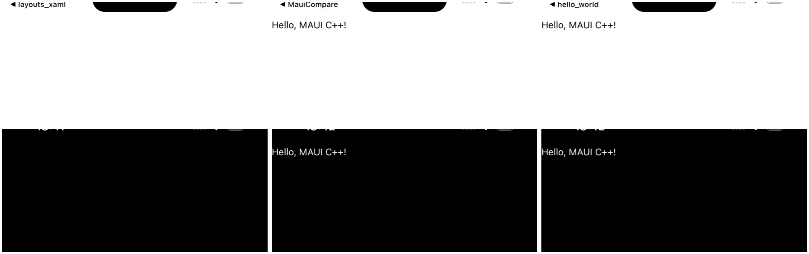
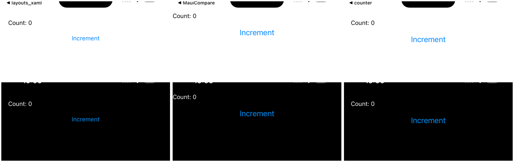
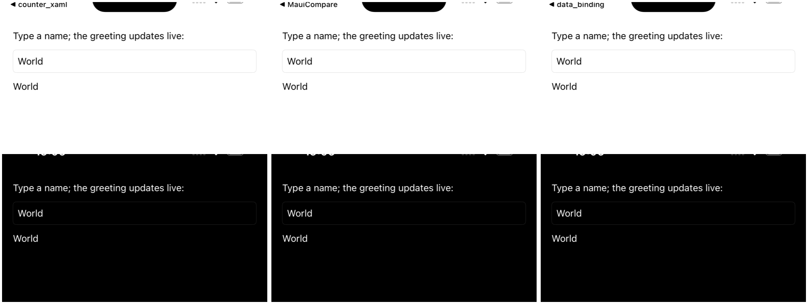
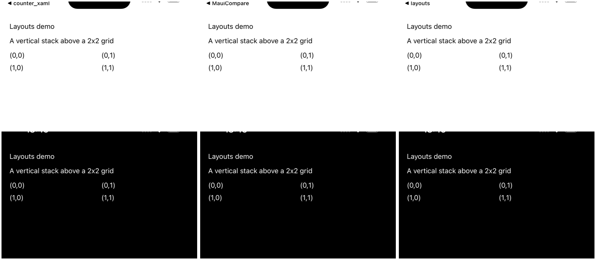

# Example apps — MAUI vs C++ (builder) vs C++ & XAML, on iOS

A side-by-side of each example three ways, **light and dark**, captured on the iOS simulator:

| Column | What it is |
| --- | --- |
| **MAUI** | the same UI in real .NET MAUI (the `~/maui-compare` app, `Pages/<Pascal>Page.cs` mirroring each example 1:1) — the reference |
| **C++ (builder)** | the hand-written `maui::ui` builder example (e.g. [examples/counter](../../examples/counter/main.cpp)) |
| **C++ & XAML** | its **compile-time-XAML** twin (e.g. [examples/counter_xaml](../../examples/counter_xaml/main.cpp)) — the UI is authored as raw `.xaml`, `#embed`ed into the binary by the compiler, and hydrated by `maui::build_page<VM, fixed_string>()` |

The two C++ columns are proven **tree-identical** by the in-tree parity tests
([tests/ui/xaml_parity_tests.cpp](../../tests/ui/xaml_parity_tests.cpp),
[tests/ui/compile_time_xaml_tests.cpp](../../tests/ui/compile_time_xaml_tests.cpp)); the captures below
confirm they are also **pixel-identical on a real device** — i.e. the compile-time-XAML path renders the
exact same native UIKit as the builder, in both appearances — and sit beside the real-MAUI reference so any
port-vs-MAUI difference (e.g. a default font metric) is visible too.

## Why "C++ & XAML" is compile-time, not build-time

There are three ways to use XAML in the port; only the third cross-compiles to the iOS app bundle:

1. **Runtime loader** (`xaml_loader::load_into`) — parses markup at startup. Always available.
2. **Build-time codegen** (`maui_xaml_codegen`) — a host tool emits `maui::ui` C++. **Cannot cross-compile**: an iOS build can't run an arm64-sim codegen tool mid-build. (This is why the un-converted `data_binding_xaml` / `layouts_xaml` examples *skip* on iOS.)
3. **Compile-time** (this column: `#embed` + `build_page`) — the **compiler** embeds the raw `.xaml` bytes into the translation unit and hydrates them; **no host tool**, so it builds on every backend including iOS.

Feature-test gated in [maui/xaml/feature.hpp](../../include/maui/xaml/feature.hpp): `#embed` (`__has_embed`) and
class-type NTTPs are present on Apple clang 21; static reflection (`std::meta`, for name-driven `{Binding}`
auto-resolution) is **not**, so that one step is compiled out behind `MAUI_HAS_XAML_REFLECTION` and bindings
are wired in typed code-behind until a reflecting toolchain lands.

## Captures

Each montage is a 3×2 grid — **columns: MAUI · C++ (builder) · C++ & XAML**; **rows: light · dark**. (The
small status-bar back-button label is leftover simulator nav chrome from the previously-launched app, not
page content.)

### hello_world

A single `Label` — purely structural markup, no view-model (`maui::no_view_model`).



### counter

A `Label` + `Button` driven by a **member-free** view-model (`maui::property<int> Count` +
`maui::command Increment`), wired to the `x:Name`'d controls in code-behind — the
`LoginViewModel`/`LoginPage` shape from [PUBLIC_API_DESIGN.md §6](../PUBLIC_API_DESIGN.md).



Individual frames: light [MAUI](examples_ios/light/counter__maui.png) ·
[C++](examples_ios/light/counter__cpp.png) · [C++&XAML](examples_ios/light/counter__xaml.png) — dark
[MAUI](examples_ios/dark/counter__maui.png) · [C++](examples_ios/dark/counter__cpp.png) ·
[C++&XAML](examples_ios/dark/counter__xaml.png).

### data_binding

An `Entry` two-way bound to a greeting `Label`. The XAML twin is **fully markup-bound** — the markup
carries `{Binding Message, Mode=TwoWay}` and `{Binding Message}`, and `build_page` + `page->bind_to(vm)`
(which sets the page's `BindingContext`) makes them resolve **live with no code-behind and no reflection**.
Both columns show the default `"World"` flowing into the entry and the greeting.



This is the `build_page<VM, fixed_string>()` + `bind_to(vm)` vision realized: the runtime loader attaches
the markup bindings during hydration, and supplying the `bindable_object` view-model as `BindingContext`
re-evaluates them against the registered property by name (path `Message` → `observable<std::string>
Message`). Headless-proven in [compile_time_xaml_tests.cpp](../../tests/ui/compile_time_xaml_tests.cpp)
(`markup_binding_resolves_against_binding_context`).

### layouts

A `VerticalStackLayout` above a 2×2 `Grid`. The XAML twin exercises the **full grid surface through the
runtime loader**: `ColumnDefinitions="*,*"` / `RowDefinitions="Auto,Auto"` parse into the grid's definition
vectors, and each child's `Grid.Row`/`Grid.Column` attached property places it in the grid. Both attached
properties and definitions were previously *deferred* (loader load failures); this work closed that M7 gap,
so `build_page` renders the grid identically to the builder.



Closing the grid gap was a genuine framework improvement (not example-only): the runtime loader now places
`Grid.Row`/`Column` children (via a deferred pass after the apply phase parents every child) and parses
`Row`/`ColumnDefinitions`. Covered by [loader_tests.cpp](../../tests/xaml/loader_tests.cpp)
(`attached_properties_place_grid_children`) and `compile_time_xaml.grid_attached_properties_place_children`.

## The MAUI column

The example apps are not part of the 172-page `maui-compare` gallery set, so the MAUI reference for them is
four pages added to `~/maui-compare/Pages/` (`HelloWorldPage`, `CounterPage`, `DataBindingPage`,
`LayoutsPage`) that reproduce each example 1:1 in real .NET MAUI. They resolve by key through the project's
`FromReflection` extension point and render on the **same** simulator, themed by `MAUI_THEME`. Build note:
the MAUI iOS SDK pins an exact Xcode major.minor, so on a newer Xcode the build needs
`-p:ValidateXcodeVersion=false`.

### A real parity bug the comparison found — and fixed (default text font size)

The first capture round showed the port's **default-font text rendering ~1.2× larger** than MAUI's: glyph
widths were MAUI `414px` vs C++ `487px` for the data_binding prompt, MAUI `178px` vs C++ `211px` for
"Hello, MAUI C++!" — a ratio of ~1.21 ≈ **17 ÷ 14**. (The iOS-drawn status-bar clock and battery cluster
were identical in both, ruling out an app-scale/letterbox artifact; an on-device probe confirmed
`UIFont.systemFontSize == 14` and `UIFont.labelFontSize == 17`.)

**Root cause** (verified against the C# source): MAUI's `Label.FontSize` has a default-value-creator
(`FontElement.FontSizeDefaultValueCreator`) returning `FontManager.DefaultFontSize` =
`UIFont.SystemFontSize` (**14pt**), so by the time the handler runs `font.Size` is already 14 and the
`UpdateFont(..., UIFont.LabelFontSize)` fallback (17pt) in `LabelExtensions.cs` is never reached. The port
had faithfully ported the *fallback* (17) but not the default-value-creator, so an unset-font label rendered
**17pt instead of 14pt**. The 172-page gallery missed it because gallery/maui-compare labels almost all set
an explicit `FontSize` (e.g. `FontSize = 22`); these bare-`Label` examples exposed it.

**Fix (applied):** a documented `default_text_font_size()` helper (`src/platform/ios/ios_conversions.hpp`)
returning `UIFont.systemFontSize`, used as the unset-font default by the iOS label / entry / editor / picker
/ date_picker / time_picker handlers (the macOS backend already used `NSFont.systemFontSize`). After the
fix the columns measure **identically** — hello_world `178px` (was 211) and data_binding `414px` (was 487),
matching MAUI exactly in every montage above. The two C++ columns remain pixel-identical to each other
(builder ≡ compile-time XAML).

A second, smaller difference remains and is *not* a content bug: the MAUI column places content at the very
top (the maui-compare host renders edge-to-edge) while the port insets below the status bar (honors the top
safe area) — a host-app window-setup difference, independent of rendering. The gallery's full **MAUI vs
C++** parity (the 172 pages) lives in [README.md](README.md).

## Reproduce

```sh
# 1. Build the framework + examples for the simulator (MAUI_BACKEND=ios, in-tree consume):
export VCPKG_ROOT=~/vcpkg
cmake -S examples -B examples/build-ios -G Ninja \
      -DMAUI_BACKEND=ios -DMAUI_EXAMPLES_FRAMEWORK_DIR=.. \
      -DCMAKE_TOOLCHAIN_FILE=$VCPKG_ROOT/scripts/buildsystems/vcpkg.cmake \
      -DVCPKG_MANIFEST_DIR=$PWD -DCMAKE_SYSTEM_NAME=iOS \
      -DCMAKE_OSX_SYSROOT=iphonesimulator -DCMAKE_OSX_ARCHITECTURES=arm64 \
      -DCMAKE_OSX_DEPLOYMENT_TARGET=26.0 -DVCPKG_TARGET_TRIPLET=arm64-ios-simulator \
      -DVCPKG_OVERLAY_TRIPLETS=$PWD/cmake/triplets
cmake --build examples/build-ios \
      --target hello_world hello_world_xaml counter counter_xaml \
               data_binding data_binding_xaml layouts layouts_xaml

# 2. Build the MAUI reference app for the simulator (newer-Xcode bypass):
( cd ~/maui-compare && dotnet build -f net10.0-ios -c Debug \
      -p:RuntimeIdentifier=iossimulator-arm64 -p:ValidateXcodeVersion=false )

# 3. Capture all three columns (MAUI + both C++), light+dark, into docs/comparison/examples_ios/:
MAUI_SIM_UDID=<booted-udid> python3 tools/parity/capture_examples.py \
      hello_world counter data_binding layouts
```
