# .NET MAUI C++ port — visual parity comparison

Per-page MAUI-vs-C++ visual parity for the **172 gallery pages**, on **iOS**, **macOS** (Mac Catalyst + AppKit), **Android** and **Windows** (WinUI 3). Each section is collapsible and holds a discrepancy-count summary plus one row per page; every row's **App Preview** cell shows the MAUI / C++ / C++&amp;XAML renders (light over dark) with the per-page description and the parity reviews. Animated pages are captured as GIF, the rest as PNG. Missing captures show a placeholder. Generated from `comparison.json` by `tools/gen_readme.py` — do not edit by hand.

<h2>iOS (172 examples) — click to expand</h2>

Real .NET MAUI (native-default) vs the C++ port vs the compile-time-XAML gallery, captured on the same iOS simulator in light and dark. MAUI is the content ground truth.

**Discrepancy counts** (MAUI-vs-C++ parity verdicts; each review model scores every page independently):

| Classification | Sonnet 5 | Gemini |
| --- | --- | --- |
| 🟢 Match | 53 | 23 |
| 🟡 Minor | 87 | 59 |
| 🔴 Major | 31 | 90 |
| ⬛ Blank | 1 | 0 |
| ⏳ Unreviewed | 0 | 0 |

| № | Gallery Screen | App Preview | Description | Sonnet 5 Review | Gemini Review |
| --- | --- | --- | --- | --- | --- |
| 1 | **Absolute Layout** absolute_layout | <table><tr><th></th><th>MAUI</th><th>C++</th><th>C++ &amp; XAML</th></tr><tr><th>Light</th><td></td><td></td><td></td></tr><tr><th>Dark</th><td></td><td></td><td></td></tr></table> | ports AbsoluteLayoutPage.xaml A self-contained, code-first demo of the AbsoluteLayout control | 🟡 C++ red/green colored bars appear slightly shifted right compared to MAUI · C++ red bar at right edge appears to clip/cut off slightly differently than MAUI · Overall layout structure (blue button, green/red boxes, AutoSized label, black rect) matches well · Dark mode reproduces the same minor positional discrepancy | 🟢 The layout and visual elements are identical across both light and dark themes. · The minor pixel differences reported are likely due to sub-pixel rendering or anti-aliasing variations between the two implementations. | 
| 2 | **Activity Indicator** activity_indicator | <table><tr><th></th><th>MAUI</th><th>C++</th><th>C++ &amp; XAML</th></tr><tr><th>Light</th><td></td><td></td><td></td></tr><tr><th>Dark</th><td></td><td></td><td></td></tr></table> | ports ActivityIndicatorPage.xaml (+ ActivityIndicatorPage.xaml.cs) | 🟢 All labeled sections present on both sides: Default, Styled-Color, Styled-BackgroundColor=Yellow (with yellow bar), Larger, Smaller-HorizontalOptions=Center, Not Running · Spinner icons appear at the same positions and look equivalent in both light and dark modes · Minor position differences in the 'Not Running' spinner: C++ places it slightly to the right of center vs MAUI's left-aligned position, but this is a trivial spacing difference · Overall layout, colors, and content are equivalent; SSIM ~0.998 confirms near-identical rendering | 🟢 The ActivityIndicator controls are visually identical in both light and dark themes. · Layout, spacing, and alignment of all text labels and indicators are consistent between MAUI and the C++ port. · Color rendering for the yellow background and theme-colored indicators matches perfectly. · The minor pixel diff is negligible and likely due to sub-pixel rendering differences in the simulator. | 
| 3 | **Adaptive Collection** adaptive_collection | <table><tr><th></th><th>MAUI</th><th>C++</th><th>C++ &amp; XAML</th></tr><tr><th>Light</th><td></td><td></td><td></td></tr><tr><th>Dark</th><td></td><td></td><td></td></tr></table> | ports AdaptiveCollectionView.xaml (+ .xaml.cs) (Maui.Controls.Sample.Pages.CollectionViewGalleries.AdaptiveCollectionView) | 🟡 C++ items are right-aligned while MAUI items are left-aligned (text alignment differs) · C++ has slightly more left-padding/margin before item text · Both show 8 items in single-column layout with correct labels · Dark mode both render correctly with white text on black | 🟢 The layout and content are visually identical across both light and dark themes. · The minor pixel diff is attributed to subtle font rendering differences between the two implementations. | 
| 4 | **Alerts** alerts | <table><tr><th></th><th>MAUI</th><th>C++</th><th>C++ &amp; XAML</th></tr><tr><th>Light</th><td></td><td></td><td></td></tr><tr><th>Dark</th><td></td><td></td><td></td></tr></table> | ports AlertsPage.xaml (+ AlertsPage.xaml.cs) The C# AlertsPage drives the three Page dialog services — DisplayAlertAsync (simple OK + Yes/No), DisplayActionSheetAsync (simple + Cancel/Delete), and DisplayPromptAsync (two questions) — from a | 🟢 Both light and dark themes show identical content: OnAppearing text, Display Alert/ActionSheet/Prompt labels, and 6 tappable blue link buttons. · Text layout, font sizes, and blue link color are consistent between MAUI and C++ in both themes. · The only difference is the outer page padding (MAUI has larger inset margin), which is the known harness wrapper difference — not a port bug. · Dark mode both sides render white text on black background correctly with matching structure. | 🟡 The blue interactive text elements (Alerts, ActionSheets, Questions) appear slightly bolder and a different shade of blue in the C++ version across both themes. · The blue interactive text elements are horizontally shifted slightly to the right in the C++ version compared to MAUI. · The general text rendering (e.g., "OnAppearing: Alert...") shows subtle differences in font weight or anti-aliasing in the C++ version. | 
| 5 | **Alignment** alignment | <table><tr><th></th><th>MAUI</th><th>C++</th><th>C++ &amp; XAML</th></tr><tr><th>Light</th><td></td><td></td><td></td></tr><tr><th>Dark</th><td></td><td></td><td></td></tr></table> | a faithful reproduction of the maui-compare &amp;quot;alignment&amp;quot; demo (ComparePages.Alignment()), the shipped-.NET-MAUI reference for the visual-parity comparison | 🟢 Start/Center/End/Fill buttons all align correctly in C++ matching MAUI in both light and dark themes · Button widths differ slightly: MAUI 'Start' button is narrower (~90pt natural width) vs C++ (~70pt), likely native UIButton inset differences — minor · 'End' button in C++ appears slightly wider than MAUI's, filling closer to right edge; both are right-aligned correctly · Vertical spacing and label positions are consistent; dark mode background and text colors match | 🟢 The visual layout, button sizes, and alignment are identical across both light and dark themes. · The slight pixel difference is attributed to minor anti-aliasing variations in text rendering between the two implementations. | 
| 6 | **Animation** animation | <table><tr><th></th><th>MAUI</th><th>C++</th><th>C++ &amp; XAML</th></tr><tr><th>Light</th><td></td><td></td><td></td></tr><tr><th>Dark</th><td></td><td></td><td></td></tr></table> | ports AnimationPage.xaml (+ AnimationPage.xaml.cs) | 🟡 MAUI light: buttons/labels rendered mid-animation at a rotated/diagonal state; C++ shows them upright and properly laid out without the mid-animation diagonal text · C++ is missing the animated rotation state captured in MAUI screenshot (static vs mid-rotation capture timing difference) · Both sides show the same controls: '.NET bot (animation target)' label, 'Start Animation', 'Start Custom Animation', 'Cancel Animation' · Dark mode: same observation — MAUI captured mid-animation diagonal text, C++ shows default upright layout; functional parity but runtime animation state not captured | 🔴 The text ".NET bot (animation target)" is rotated in MAUI but not in C++. · The animation control buttons are positioned to the right of the rotated text in MAUI. · In C++, the animation control buttons are positioned below the horizontal ".NET bot (animation target)" text. · The overall layout and arrangement of elements are substantially different between MAUI and C++. | 
| 7 | **App Theme Binding** app_theme_binding | <table><tr><th></th><th>MAUI</th><th>C++</th><th>C++ &amp; XAML</th></tr><tr><th>Light</th><td></td><td></td><td></td></tr><tr><th>Dark</th><td></td><td></td><td></td></tr></table> | ports AppThemeBindingPage.xaml | 🟡 Light mode: all text items (green/orange/blue labels and summary) present and correct color in both versions · Dark mode: large pixel diff (92.7%) but content is identical — difference is C++ dark uses pure black background vs MAUI dark which has a slightly different background shade causing large area delta · Text wrapping differs slightly between MAUI and C++ in both themes due to container width differences (harness margin) · AppThemeBinding color logic (green light / red dark / orange light / teal dark) renders correctly on C++ side | 🔴 In dark mode, the C++ port displays the text "This text is green in light mode, and red in dark mode." as green, instead of red. · In dark mode, the C++ port displays the text "This text uses LightPrimaryColor (Orange) in light mode, and DarkPrimaryColor (Teal) in dark mode." as orange, instead of teal. · The MAUI dark theme is completely incorrect, displaying light theme content (white background and light theme text colors). · The light theme is a close visual match between MAUI and C++. | 
| 8 | **Application Control** application_control | <table><tr><th></th><th>MAUI</th><th>C++</th><th>C++ &amp; XAML</th></tr><tr><th>Light</th><td></td><td></td><td></td></tr><tr><th>Dark</th><td></td><td></td><td></td></tr></table> | ports ApplicationControlPage.xaml (+ .xaml.cs) | 🟡 Layout and all three buttons (Terminate Application, Open Window, Close Window) render correctly in both themes. · Status text line differs: MAUI shows 'main window: (untitled)' while C++ shows 'main window: MAUI C++ — gallery', which is a runtime app-name difference, not a layout bug. · C++ status text wraps to two lines due to the longer window name, while MAUI fits on one line; otherwise content is structurally identical. · Button spacing in C++ is slightly larger (more vertical gap between buttons) compared to MAUI. | 🔴 The main window title text is missing in the MAUI reference but present in the C++ port. · The text 'main window: (untitled)' in MAUI is replaced by 'main window: MAUI C++ — gallery' in the C++ port. · The C++ port displays additional text content that is not present in the MAUI reference. | 
| 9 | **Auto Size Shapes** auto_size_shapes | <table><tr><th></th><th>MAUI</th><th>C++</th><th>C++ &amp; XAML</th></tr><tr><th>Light</th><td></td><td></td><td></td></tr><tr><th>Dark</th><td></td><td></td><td></td></tr></table> | ports AutoSizeShapesGallery.xaml A code-first port of the MAUI Shapes sub-gallery Pages/Controls/ShapesGalleries/AutoSizeShapesGallery.xaml: a 3-row Grid (RowSpacing 0) that proves a stroked Ellipse auto-sizes to fill exactly half of the av | 🟡 Layout is equivalent: yellow top half with green-filled blue-bordered ellipse, orange bottom half, both themes match structurally · C++ ellipse renders slightly smaller in diameter compared to MAUI — the circle does not quite reach the full width of the yellow section · Text label wraps to two lines in C++ ('The Ellipse below must occupy half of the available space.') vs single line in MAUI due to narrower effective text area · Dark mode: both render identically in terms of color and structure; the size/wrap difference persists | 🟡 The ellipse in the C++ implementation is slightly smaller than the MAUI reference. · The vertical alignment of the ellipse within the yellow container is slightly different. · The yellow background area appears to have slightly different dimensions in the C++ version. | 
| 10 | **Basic Grouping** basic_grouping | <table><tr><th></th><th>MAUI</th><th>C++</th><th>C++ &amp; XAML</th></tr><tr><th>Light</th><td></td><td></td><td></td></tr><tr><th>Dark</th><td></td><td></td><td></td></tr></table> | ports GroupingGalleries/BasicGrouping.xaml (+ .xaml.cs) of the C# CollectionView gallery | 🟡 C++ renders the grouped list with correct section headers and items (Avengers, Defenders, etc.) in both themes · MAUI content is inset from the left edge via harness padding; C++ items start closer to the left margin — this is the expected harness-wrapper difference · Section header rows appear slightly taller/bolder in MAUI; C++ headers are visually lighter weight · Overall structure, text content, grouping order and dark-mode colors match well; diff is spacing/indent, not missing data | 🟡 Group titles (e.g., "Avengers", "Fantastic Four", "Defenders") are rendered in black/dark grey in MAUI light/dark themes. · Group titles (e.g., "Avengers", "Fantastic Four", "Defenders") are rendered in green in C++ light/dark themes. | 
| 11 | **Basic Swipe** basic_swipe | <table><tr><th></th><th>MAUI</th><th>C++</th><th>C++ &amp; XAML</th></tr><tr><th>Light</th><td></td><td></td><td></td></tr><tr><th>Dark</th><td></td><td></td><td></td></tr></table> | ports BasicSwipeGallery.xaml A code-first port of the MAUI SwipeView sub-gallery Pages/Controls/SwipeViewGalleries/BasicSwipeGallery.xaml: a vertical StackLayout of five SwipeViews, each demonstrating a different revealed-side / SwipeMode c | 🟢 Both light and dark themes show identical 5 swipe-item rows with same label text and cell background · Footer label 'Swipe a row, then invoke Delete' present and matching in both themes · Light: minor page-padding offset (C++ content slightly inset vs MAUI edge-to-edge) — within harness-wrapper tolerance · Dark mode: background correctly black, text white, cell backgrounds light-grey — matches MAUI | 🟡 Vertical spacing between list items is slightly smaller on the C++ side. · The height of the list item rectangles appears slightly shorter on the C++ side. | 
| 12 | **Behaviors** behaviors | <table><tr><th></th><th>MAUI</th><th>C++</th><th>C++ &amp; XAML</th></tr><tr><th>Light</th><td></td><td></td><td></td></tr><tr><th>Dark</th><td></td><td></td><td></td></tr></table> | ports BehaviorsPage.xaml (+ .xaml.cs) and its companion Controls.Sample/Behaviors/NumericValidationBehavior.cs | 🟢 Both light and dark themes show identical content: heading 'Red when the number isn't valid' and 'Enter a System.Double' entry placeholder · Entry field renders correctly with matching placeholder text and border in both themes · Dark mode background is black in both, light mode is white in both · Pixel diff is marginal (2.1%) and attributable to harness outer-inset; content is structurally identical | 🟡 The placeholder text 'Enter a System.Double' has a slightly different font weight or rendering in the C++ implementation compared to the MAUI reference. · The border color or thickness of the input field appears slightly different in both light and dark themes. · There is a subtle difference in the vertical padding or alignment of the input field container. | 
| 13 | **Border** border | <table><tr><th></th><th>MAUI</th><th>C++</th><th>C++ &amp; XAML</th></tr><tr><th>Light</th><td></td><td></td><td></td></tr><tr><th>Dark</th><td></td><td></td><td></td></tr></table> | a faithful reproduction of the maui-compare &amp;quot;border&amp;quot; demo (ComparePages.BorderPage()), the shipped-.NET-MAUI reference for the visual-parity comparison: a single Border centered on the page — red 5pt stroke, a RoundRectangle StrokeShape (Co | 🟡 C++ border box is wider/taller than MAUI's (takes more horizontal space) · 'Bordered content' text is positioned differently inside the box (MAUI more vertically centered, C++ slightly higher) · Border stroke, corner radius, and cream background color all match correctly · Dark mode shows the same size discrepancy — C++ box is larger | 🟡 The text 'Bordered content' in the C++ implementation appears slightly bolder or has different font rendering compared to the MAUI reference. · The red border stroke width is slightly thicker in the C++ implementation than in the MAUI reference. · The corner radius of the container appears slightly different between the two implementations. | 
| 14 | **Border Clip Playground** border_clip_playground | <table><tr><th></th><th>MAUI</th><th>C++</th><th>C++ &amp; XAML</th></tr><tr><th>Light</th><td></td><td></td><td></td></tr><tr><th>Dark</th><td></td><td></td><td></td></tr></table> | ports BorderClipPlayground.xaml (+ .xaml.cs) The C# page is an interactive Border-shape playground: a 100x100 Border (red stroke) clips an AspectFill Image (oasis.jpg) into the currently selected StrokeShape, while controls below mutate the | 🔴 MAUI shows an empty rounded-rectangle border with red stroke (no fill content); C++ port shows the same border but filled with a dog photo — the border's child Image is visible in C++ but absent/transparent in MAUI (MAUI may have failed to load the image here, but MAUI is the reference) · C++ page layout is shifted right/down — the border shape and controls appear lower and the slider section is cut off at bottom vs MAUI which fits all sliders on screen · In MAUI the border content area is white/empty (only the red stroke frame is shown); in C++ the image is rendered inside the clipped border, suggesting different content visibility behavior · Both themes show the same discrepancy: image visible in C++ but not in MAUI's border content area | 🔴 The C++ implementation is missing the image content inside the border. · The C++ implementation is missing the 'Bottom Right Corner Radius' slider control entirely. · The C++ implementation is missing the 'Bottom Left Corner Radius' slider control entirely. · The layout of the slider controls in the C++ version is inconsistent with the MAUI reference. | 
| 15 | **Border Layout** border_layout | <table><tr><th></th><th>MAUI</th><th>C++</th><th>C++ &amp; XAML</th></tr><tr><th>Light</th><td></td><td></td><td></td></tr><tr><th>Dark</th><td></td><td></td><td></td></tr></table> | ports BorderLayout.xaml (+ BorderLayout.xaml.cs) The C# page demonstrates driving Border.StrokeThickness from a Slider: a Slider (0..40, set to 5 in OnAppearing) is bound to the Border&amp;#x27;s StrokeThickness; the Border (Silver stroke, White bac | 🟡 "Center" text is now vertically centered in the colored bar between the red and blue squares, matching MAUI (the prior top-alignment bug is fixed) · Structure red square / Center / blue square / green band renders correctly in both light and dark · Minor residual: blue segment proportion slightly narrower than MAUI in light mode · Rounded-rect silver stroke around the bar matches MAUI in dark mode | 🟡 The border thickness around the green container is noticeably thicker in the C++ implementation compared to the MAUI reference. · The slider thumb in the C++ implementation is slightly larger and has a different visual weight than the MAUI version. · The spacing between the slider and the green container is slightly inconsistent between the two implementations. | 
| 16 | **Border Playground** border_playground | <table><tr><th></th><th>MAUI</th><th>C++</th><th>C++ &amp; XAML</th></tr><tr><th>Light</th><td></td><td></td><td></td></tr><tr><th>Dark</th><td></td><td></td><td></td></tr></table> | ports BorderPlayground.xaml (+ BorderPlayground.xaml.cs) A self-contained, code-first interactive Border playground | 🔴 C++ light only shows the top border with 'Just a Label' and the first few property labels; the MAUI version shows many more controls including sliders, color swatches, and Border Dash/LineJoin settings. · C++ is missing interactive controls below: the slider rows (Border Width, Dash Array, Dash Offset), and the full Border section with color swatches are absent or cut off. · In MAUI light, the gradient-background border (teal-to-blue via #00B4D8→#008380) is visible with full content; C++ shows only the label inside a solid teal box without gradient fill. · Dark mode shows the same truncation — C++ renders only the top portion of the playground controls, missing the lower property editor rows present in MAUI. | 🔴 The border stroke is completely missing in the C++ implementation. · The C++ implementation fails to render the border dash pattern and border width settings. · The C++ implementation is missing the UI controls for Border Width, Border Dash Array, Border Dash Offset, and Border LineJoin. · The C++ implementation is missing the 'Show Content Background' toggle switch. | 
| 17 | **Border Resize Content** border_resize_content | <table><tr><th></th><th>MAUI</th><th>C++</th><th>C++ &amp; XAML</th></tr><tr><th>Light</th><td></td><td></td><td></td></tr><tr><th>Dark</th><td></td><td></td><td></td></tr></table> | ports BorderResizeContent.xaml A self-contained, code-first demo that resizes a Border&amp;#x27;s CONTENT and watches the Border track it | 🟡 Light mode: shapes (circle, square, triangle) all render correctly with green borders; C++ top-right circle and square show a real photo inside instead of a solid light-blue fill — DataTemplate/content difference · In MAUI the right-column bordered shapes contain a plain light-blue color fill; C++ shows an actual bug/dog image inside those clipped shapes — image source being loaded instead of solid color · Triangle (path) shapes look visually identical in both columns; sliders and entry fields at bottom render the same · Dark mode: same image-vs-color-fill discrepancy persists in C++ right column; structure and border colors otherwise match | 🔴 The C++ implementation fails to render the '+' text content inside the shapes. · The C++ implementation fails to render the image content inside the shapes, showing empty blue backgrounds instead. · The C++ implementation displays a '-' symbol instead of a '+' symbol in the bottom-left triangle shape. · The C++ implementation has incorrect alignment and scaling of the content within the triangle shapes. | 
| 18 | **Border Stroke** border_stroke | <table><tr><th></th><th>MAUI</th><th>C++</th><th>C++ &amp; XAML</th></tr><tr><th>Light</th><td></td><td></td><td></td></tr><tr><th>Dark</th><td></td><td></td><td></td></tr></table> | ports BorderStroke.xaml (+ BorderStroke.xaml.cs) A self-contained, code-first demo of Border StrokeThickness and how a Border tracks the height of its content | 🟡 C++ boxes extend full width edge-to-edge while MAUI boxes have a small left/right page margin — consistent with the known harness inset difference, not a port bug · Stroke thickness progression (1/5/10) and red stroke color render correctly in both themes · Orange fill color and label text match MAUI in both light and dark modes · Slider and 'Content height: 60' label present and functionally equivalent; slider thumb position matches | 🔴 The border stroke thickness is not being applied correctly in the C++ implementation. · The C++ implementation fails to render the red border around the boxes, which is present in the MAUI reference. · The spacing and layout of the boxes differ significantly between the two implementations. | 
| 19 | **Borderless** borderless | <table><tr><th></th><th>MAUI</th><th>C++</th><th>C++ &amp; XAML</th></tr><tr><th>Light</th><td></td><td></td><td></td></tr><tr><th>Dark</th><td></td><td></td><td></td></tr></table> | ports Borderless.xaml A self-contained, code-first demo of a stroke-less Border | 🟢 Light mode: yellow background with 'Style: borderless (StrokeThickness 0)' label and toggle switch — identical layout · Dark mode: same yellow background content renders correctly on both sides · Tiny diff (~0.69%) is subpixel antialiasing on toggle switch rendering only · Toggle switch position and style match between MAUI and C++ | 🟡 The switch control in the C++ implementation has a slightly different thumb size and track shape compared to the MAUI reference. · The vertical alignment of the switch control relative to the top text label is slightly shifted in the C++ version. | 
| 20 | **Box View** box_view | <table><tr><th></th><th>MAUI</th><th>C++</th><th>C++ &amp; XAML</th></tr><tr><th>Light</th><td></td><td></td><td></td></tr><tr><th>Dark</th><td></td><td></td><td></td></tr></table> | ports BoxViewPage.xaml (+ BoxViewPage.xaml.cs) | 🟡 All box shapes render correctly: Default (cornflower blue), Using Color (purple), Background (yellow-green gradient), Using CornerRadius (mint green rounded), and orange strip at bottom are all present and color-matched. · C++ boxes are slightly narrower/smaller than MAUI boxes — the colored rectangles take up less horizontal width on the right side. · Gradient direction and colors on the 'Background' box match between MAUI and C++. · Both light and dark themes are consistent; no missing elements or color errors. | 🔴 The 'Using Complex CornerRadius' section is completely missing from the C++ implementation in both light and dark themes. · The vertical spacing between the 'Using CornerRadius' box and the bottom of the screen is significantly larger in the C++ implementation compared to the MAUI reference. · The overall vertical layout is compressed in the C++ version, causing the elements to not align with the MAUI reference. | 
| 21 | **Button** button | <table><tr><th></th><th>MAUI</th><th>C++</th><th>C++ &amp; XAML</th></tr><tr><th>Light</th><td></td><td></td><td></td></tr><tr><th>Dark</th><td></td><td></td><td></td></tr></table> | ports ButtonPage.xaml (+ ButtonPage.xaml.cs) | 🔴 Icon buttons ('settings') render with large gear icon + text side-by-side in C++ taking full row height (~100pt cells), vs small compact single-row entries in MAUI — icon sizing or button layout is completely different · MAUI shows a compact list where icon buttons (settings, settings, Decrease Spacing, Increase Spacing) fit as normal-height rows; C++ renders them as tall icon+label cards · All text content and color-coded buttons (blue Button, red Button, green BorderColor, BorderWidth, purple CornerRadius, pink Button) match correctly in both themes · diff_pct ~52% light / ~31% dark confirms a significant layout divergence in the icon-button rows | 🔴 The C++ implementation displays significantly larger buttons and icons compared to the MAUI reference. · The layout spacing is inconsistent, with the C++ version having much larger gaps between elements. · The C++ version fails to render the slider control present in the MAUI reference. · The overall scale and proportions of the UI elements in the C++ port do not match the MAUI reference. | 
| 22 | **Carousel Page** carousel_page | <table><tr><th></th><th>MAUI</th><th>C++</th><th>C++ &amp; XAML</th></tr><tr><th>Light</th><td></td><td></td><td></td></tr><tr><th>Dark</th><td></td><td></td><td></td></tr></table> | Carousel Page | 🟡 Both sides show 'Basic Horizontal Carousel' title and 'Item 1' centered in the carousel area · C++ adds Prev/Next navigation buttons and a position indicator label ('Position 0 — current: Item 1') that MAUI does not show in the static capture · MAUI capture shows only the carousel item centered with no navigation chrome visible · Dark mode: same structural difference — C++ shows extra UI elements below the carousel item; content otherwise correct | 🔴 The C++ implementation is missing the carousel content area entirely. · The C++ implementation includes navigation buttons (Prev/Next) and status text that are absent in the MAUI reference. · The layout structure is fundamentally different between the two implementations. | 
| 23 | **Chat Example** chat_example | <table><tr><th></th><th>MAUI</th><th>C++</th><th>C++ &amp; XAML</th></tr><tr><th>Light</th><td></td><td></td><td></td></tr><tr><th>Dark</th><td></td><td></td><td></td></tr></table> | ports ChatExample.xaml (+ .xaml.cs) (Maui.Controls.Sample.Pages.CollectionViewGalleries.ItemSizeGalleries.ChatExample), tracking the maui-compare reference demo ~/maui-compare/Pages/ChatExamplePage.cs (the visual-parity oracle) | 🟡 FIXED: both bubbles now have rounded corners matching MAUI's RoundRectangle CornerRadius=12 (was sharp rectangles) — reproduced via a round_rectangle(12) Clip on the single-root bubble label · Bubble colors (green local / blue remote) and left/right alignment correct in light and dark · Bubble widths hug the text like MAUI; no over-stretch · Residual is the allowed harness crop (MAUI tucks bubbles under the nav bar) + minor blue tint | 🟡 The bubble corner radius is slightly different between the C++ implementation and the MAUI reference. · The vertical alignment of the text within the bubbles shows minor variations. · The padding around the text inside the bubbles is slightly inconsistent compared to the MAUI version. | 
| 24 | **Check Box** check_box | <table><tr><th></th><th>MAUI</th><th>C++</th><th>C++ &amp; XAML</th></tr><tr><th>Light</th><td></td><td></td><td></td></tr><tr><th>Dark</th><td></td><td></td><td></td></tr></table> | ports CheckBoxPage.xaml (+ .xaml.cs) Mirrors the MAUI gallery page: a vertical stack of headlined CheckBox states — Default, Colored (Color=Purple), Disabled, Disabled+Colored+Checked — followed by a &amp;quot;Change IsChecked&amp;quot; row pairing a Button | 🟢 All 5 rows (Default, Colored, Disabled, Disabled Colored, Change IsChecked) render correctly in both C++ and MAUI · CheckBox circle icons match in size, color (blue/purple/disabled blue/purple filled), and position relative to labels · 'Is green? False' row with red check icon matches in both themes · Dark mode inverts backgrounds correctly; minor pixel diff (2.4%) is harness inset only | 🟡 The vertical spacing between the radio button rows is slightly tighter in the C++ implementation compared to the MAUI reference. · The alignment of the 'Is green? False' text and its associated checkmark icon is slightly shifted horizontally in the C++ version. | 
| 25 | **Chrome** chrome | <table><tr><th></th><th>MAUI</th><th>C++</th><th>C++ &amp; XAML</th></tr><tr><th>Light</th><td></td><td></td><td></td></tr><tr><th>Dark</th><td></td><td></td><td></td></tr></table> | a self-contained demo page for the W1-11 window-chrome family: page toolbar items (primary + secondary), a menu bar (File menu with items, a separator and a sub-menu), a context flyout (right-click menu) on a button, and a tooltip — all wir | 🟢 Both show 'Press or right-click me' blue link and 'Ready' label in same positions · C++ button text appears slightly bolder/larger but functionally equivalent · Layout and element presence match in both light and dark modes · Only trivial font-weight/rendering differences | 🟢 The text 'Press or right-click me' and 'Ready' are visually identical in both light and dark modes. · The layout and positioning of all elements are consistent between the MAUI reference and the C++ port. · The background colors and text colors match perfectly across both themes. | 
| 26 | **Clip** clip | <table><tr><th></th><th>MAUI</th><th>C++</th><th>C++ &amp; XAML</th></tr><tr><th>Light</th><td></td><td></td><td></td></tr><tr><th>Dark</th><td></td><td></td><td></td></tr></table> | ports ClipPage.xaml The C# page (Pages/Core/ClipPage.xaml; its .xaml.cs is an empty InitializeComponent) is a ScrollView over a StackLayout that shows the SAME dotnet_bot.png image five times, each successive copy carrying a different geome | 🔴 MAUI shows gray placeholder rectangles for all three clipped images (Image, RectangleGeometry clip, EllipseGeometry clip, GeometryGroup clip); C++ port renders the actual dog/alien images with full color · The image content difference (gray vs actual image) accounts for the large SSIM diff (~0.83-0.93) and 43% pixel difference · This is the same pattern as border_clip_playground: MAUI appears to have failed to load/display the source image, while C++ renders it correctly — however MAUI is the ground truth reference so C++ having visible images where MAUI shows gray may be a MAUI image-load quirk · Layout structure (labels, positions of clipped areas) is otherwise identical between C++ and MAUI in both themes | 🔴 The C++ implementation fails to render the source images, showing only empty gray boxes instead of the expected character graphic. · The layout of the clipped images is inconsistent with the MAUI reference, specifically regarding the size and aspect ratio of the clipped areas. · The C++ implementation displays significantly smaller clipped regions compared to the MAUI reference. | 
| 27 | **Clip Corner Radius** clip_corner_radius | <table><tr><th></th><th>MAUI</th><th>C++</th><th>C++ &amp; XAML</th></tr><tr><th>Light</th><td></td><td></td><td></td></tr><tr><th>Dark</th><td></td><td></td><td></td></tr></table> | ports ClipCornerRadiusGallery.xaml (+ .xaml.cs) The C# page (Pages/Controls/ShapesGalleries/ClipCornerRadiusGallery.xaml) is a StackLayout (Padding=12) that demonstrates DRIVING a RoundRectangleGeometry&amp;#x27;s per-corner CornerRadius from four s | 🟡 MAUI shows a grey placeholder (image failed to load in simulator), C++ correctly shows the dog photo with rounded-rectangle clip applied · C++ image box is smaller in height than MAUI's placeholder rectangle — possible size/aspect difference · Corner-radius sliders present and labeled identically in both · Both dark modes follow the same pattern; MAUI dark also has grey placeholder | 🔴 The image is missing in the MAUI reference implementation, while it is correctly rendered in the C++ implementation. · The slider track color and thumb style differ significantly between the MAUI reference and the C++ implementation. · The layout of the sliders and labels is inconsistent between the two implementations. | 
| 28 | **Clip Gallery** clip_gallery | <table><tr><th></th><th>MAUI</th><th>C++</th><th>C++ &amp; XAML</th></tr><tr><th>Light</th><td></td><td></td><td></td></tr><tr><th>Dark</th><td></td><td></td><td></td></tr></table> | ports ClipGallery.xaml The C# page (Pages/Controls/ShapesGalleries/ClipGallery.xaml; its .xaml.cs is an empty InitializeComponent) is a ScrollView over a StackLayout (Padding=12) that shows the SAME &amp;quot;oasis.jpg&amp;quot; image SEVEN times — one bare | 🔴 MAUI light shows placeholder gray rectangles for all clipped images (images failed to load — maui_blank for image content), while C++ successfully loads and displays the actual dog photo for each clip shape. · C++ correctly applies RectangleGeometry, RoundRectangleGeometry, and EllipseGeometry clipping shapes to the actual image — the clipping logic works. · MAUI's image load failure means the MAUI side is the defective one for image content; however this is a maui_blank condition on the image resource, not a port difference. · Overall structure and label text match between both sides; the clip shapes are correctly rendered in C++. | 🔴 The C++ implementation fails to render the source images, showing only empty gray boxes instead of the dog image. · The layout of the clipped elements is inconsistent with the MAUI reference, specifically regarding the spacing and alignment of the clipped shapes. · The overall visual representation is significantly different due to the missing image content. | 
| 29 | **Clip Views** clip_views | <table><tr><th></th><th>MAUI</th><th>C++</th><th>C++ &amp; XAML</th></tr><tr><th>Light</th><td></td><td></td><td></td></tr><tr><th>Dark</th><td></td><td></td><td></td></tr></table> | ports ClipViewsGallery.xaml The C# page (Pages/Controls/ShapesGalleries/ClipViewsGallery.xaml; no code-behind beyond an empty InitializeComponent) is a ScrollView over a StackLayout (Padding=12) that proves the Clip surface (VisualElement.C | 🔴 MAUI light: 8 clipped controls (Button, DatePicker, Entry, Editor, Grid, SearchBar, TimePicker) all show as wide diagonal-cut parallelogram-shaped red bands across full screen width · C++ light: controls are narrower (~half-width) and do not extend to left edge; the red clip shapes are shorter and shifted right — layout width is wrong · Dark mode: same width/layout discrepancy; MAUI dark red bands span full width, C++ bands are narrower and start from center · SearchBar background in C++ dark shows a distinct grey pill vs MAUI's transparent red band — additional visual difference on top of the width issue | 🔴 The C++ implementation uses a significantly different, non-standard shape for all controls compared to the MAUI reference. · The search bar icon and input field styling are inconsistent with the MAUI reference. · The time format in the bottom control differs between the two implementations (12:00 AM vs 0:00). · Vertical spacing and layout alignment are noticeably different across all controls. | 
| 30 | **Clipping** clipping | <table><tr><th></th><th>MAUI</th><th>C++</th><th>C++ &amp; XAML</th></tr><tr><th>Light</th><td></td><td></td><td></td></tr><tr><th>Dark</th><td></td><td></td><td></td></tr></table> | compare oracle ~/maui-compare/Pages/ClippingPage.cs (itself written to mirror this gallery page) | 🟡 Both sides show 'Not clipping' state with same orange background, red rectangle overlapping a row of numbers, purple 'Hey' button row, and coffee cup images below · C++ 'Hey' buttons appear slightly wider/larger than MAUI's — MAUI has 4 compact buttons fitting in a smaller container, C++ has same 4 but with more horizontal spread · The coffee cup emoji icons appear in C++ but not in MAUI (or MAUI crops them below visible area); this is a content positioning difference · Dark mode matches light mode observations; overall layout is recognizable and very close, minor sizing/positioning differences in button row and icon row | 🔴 The C++ implementation displays two coffee cup icons that are completely absent in the .NET MAUI reference. · The horizontal alignment of the 'Hey' buttons within the purple container differs between the two implementations. | 
| 31 | **Collectionview** collectionview | <table><tr><th></th><th>MAUI</th><th>C++</th><th>C++ &amp; XAML</th></tr><tr><th>Light</th><td></td><td></td><td></td></tr><tr><th>Dark</th><td></td><td></td><td></td></tr></table> | a faithful reproduction of the maui-compare &amp;quot;collectionview&amp;quot; demo (ComparePages.CollectionViewPage()), the shipped-.NET-MAUI reference for the visual-parity comparison: a CollectionView over 24 captioned items, a string Header (&amp;quot;This is the | 🔴 MAUI shows a 3-column CollectionView grid with thumbnail images + filenames in each cell · C++ shows a text-only list with no images — image cells are missing entirely, only filename text is rendered · Both show the same 'This is the header' header element correctly · C++ CollectionView renders in a different column layout (appears as a wider text grid without image content) | 🔴 The C++ implementation has significantly different column widths compared to the MAUI reference. · The text alignment and wrapping behavior differ, causing the grid layout to break differently. · The spacing between items is inconsistent with the MAUI reference. | 
| 32 | **Composition Gallery** composition_gallery | <table><tr><th></th><th>MAUI</th><th>C++</th><th>C++ &amp; XAML</th></tr><tr><th>Light</th><td></td><td></td><td></td></tr><tr><th>Dark</th><td></td><td></td><td></td></tr></table> | ports CompositionGallery.xaml A self-contained, code-first port of the MAUI Shapes sub-gallery Pages/Controls/ShapesGalleries/CompositionGallery.xaml: a StackLayout holding two Beige 250x250 Grids (Margin 12) that compose multiple overlappi | 🟢 Two composition panels (overlapping geometric shapes canvas, and three diagonal lines) are both rendered in both MAUI and C++. · The geometric composition (circle, triangles, rectangles with transparency) matches closely in both themes. · The diagonal lines panel (blue, green, red) is correctly reproduced in C++. · Dark mode: C++ background inside the panels remains the same cream/off-white as MAUI — correct behavior. | 🔴 The C++ implementation renders the content as a single tall container instead of two separate stacked containers. · The layout of the shapes is vertically stretched in the C++ version compared to the MAUI reference. · The relative positioning and aspect ratio of the shapes within the container are distorted in the C++ version. | 
| 33 | **Containers** containers | <table><tr><th></th><th>MAUI</th><th>C++</th><th>C++ &amp; XAML</th></tr><tr><th>Light</th><td></td><td></td><td></td></tr><tr><th>Dark</th><td></td><td></td><td></td></tr></table> | a self-contained demo page for the W1-07 container set: a scroll_view hosting a vertical stack of content-hosting containers — a border-framed label (stroke + dashed outline + rounded shape), a legacy frame (BorderColor/CornerRadius/HasShad | 🟡 All three containers render correctly in both themes: dashed-blue border, solid-red frame, and plain 'Inside a content_view' label · C++ frame ('Inside a frame') renders with bold/heavier text weight compared to MAUI's regular-weight text — a minor font-weight difference · Light mode: 'Scrolled to: 0 / 0' label position is slightly lower in C++ due to the border box being fractionally taller · Dark mode matches well; same three elements visible with correct colors and dashed/solid borders | 🟡 The border stroke color in the C++ version is slightly lighter than the MAUI reference in both light and dark themes. · The frame border thickness appears slightly thinner in the C++ version compared to the MAUI reference. · The vertical spacing between the border, frame, and content_view elements is slightly tighter in the C++ version. | 
| 34 | **Content View** content_view | <table><tr><th></th><th>MAUI</th><th>C++</th><th>C++ &amp; XAML</th></tr><tr><th>Light</th><td></td><td></td><td></td></tr><tr><th>Dark</th><td></td><td></td><td></td></tr></table> | ports ContentViewPage.xaml (+ ContentViewPage.xaml.cs), code-first | 🟢 Both sides render 'ContentView' title, two 'Content' labels, and a blue 'Swap content' button · Layout and spacing are near-identical in both light and dark themes · Small positional shift due to harness inset (MAUI content slightly indented) but control sizes and colors match · Diff_pct ~0.71% reflects only minor pixel-level harness-margin difference; no content defects | 🟡 The 'Swap content' button is positioned differently in the C++ implementation compared to the MAUI reference. · The vertical spacing between the text elements 'ContentView', 'Content', and 'Content' is inconsistent between the two implementations. | 
| 35 | **Context Flyout** context_flyout | <table><tr><th></th><th>MAUI</th><th>C++</th><th>C++ &amp; XAML</th></tr><tr><th>Light</th><td></td><td></td><td></td></tr><tr><th>Dark</th><td></td><td></td><td></td></tr></table> | ports ContextFlyoutPage.xaml (+ ContextFlyoutPage.xaml.cs) The C# page attaches a MenuFlyout as the FlyoutBase.ContextFlyout (right-click / long-press menu) of several controls and wires each menu item to a handler: - a Button (&amp;quot;Increment b | 🟡 Light mode: MAUI places 'Increment by 1' button at very top; C++ has same content but with a visible inset/padding pushing content down — the button/label area appears lower · The embedded web-content iframe (Microsoft Bing cookie consent dialog) appears in roughly the same position in both; C++ iframe content looks correct · Dark mode: Same structure matches; toggle switch, labels, button, and iframe all present in both; C++ has slightly more padding at top · Content block at bottom 'Right-click a control...' label wraps differently in C++ (wider text area) vs MAUI — minor text-wrap difference, not a missing element | 🔴 The C++ implementation is missing the 'Increment by 1' button entirely in both light and dark themes. · The C++ implementation is missing the 'Is dynamic menu enabled?' toggle switch. · The C++ implementation is missing the 'Has a custom context menu' text input field. · The C++ implementation is missing the 'COOL' button/image element. | 
| 36 | **Controls Stack** controls_stack | <table><tr><th></th><th>MAUI</th><th>C++</th><th>C++ &amp; XAML</th></tr><tr><th>Light</th><td></td><td></td><td></td></tr><tr><th>Dark</th><td></td><td></td><td></td></tr></table> | a faithful reproduction of the maui-compare &amp;quot;controls_stack&amp;quot; demo (ComparePages.ControlsStack()), the shipped-.NET-MAUI reference for the visual-parity comparison: a VerticalStackLayout (Spacing 12, Padding 16) showcasing the basic widgets | 🟡 All controls present in both: Button, Entry, Editor, SearchBar, CheckBox+Switch, Slider, Stepper · Slider thumb position differs: MAUI shows thumb roughly at 50%, C++ shows thumb shifted further right (~60-65%) · SearchBar shape/rounding appears slightly less pronounced in C++ vs MAUI's rounder pill shape · High pixel diff (12.1%) is dominated by the slider thumb position offset; rest of controls are structurally equivalent | 🔴 The slider thumb size and shape are inconsistent between MAUI and C++ implementations. · The progress bar height and corner radius differ significantly. · The stepper control layout and button sizing are not aligned with the MAUI reference. · The search bar icon and text alignment show noticeable discrepancies. | 
| 37 | **Custom Layout** custom_layout | <table><tr><th></th><th>MAUI</th><th>C++</th><th>C++ &amp; XAML</th></tr><tr><th>Light</th><td></td><td></td><td></td></tr><tr><th>Dark</th><td></td><td></td><td></td></tr></table> | ports CustomLayoutPage.xaml (+ CustomLayoutPage.xaml.cs) | 🟢 Both show Top label at top, Bottom label at bottom, Left/Left on left, Right/Right on right · C++ Left/Right labels appear horizontally shifted outward vs MAUI (wider spread) · Overall structure and custom layout logic matches — same element types and arrangement · Dark mode reproduces the same minor spacing difference | 🟢 The layout and positioning of all labels (Top, Left, Right, Bottom) are visually identical between the MAUI and C++ implementations. · The color schemes for both light and dark modes are correctly applied and match the reference. · The minor pixel differences reported are negligible and likely due to sub-pixel rendering or anti-aliasing variations. | 
| 38 | **Custom Size Swipe** custom_size_swipe | <table><tr><th></th><th>MAUI</th><th>C++</th><th>C++ &amp; XAML</th></tr><tr><th>Light</th><td></td><td></td><td></td></tr><tr><th>Dark</th><td></td><td></td><td></td></tr></table> | ports CustomSizeSwipeViewGallery.xaml (+ .xaml.cs) The MAUI CustomSizeSwipeViewGallery is a single SwipeView whose Left / Right / Top item collections each reveal CUSTOM-SIZED content: a SwipeItemView wrapping a Grid/StackLayout with an exp | 🟢 Both sides show the green SwipeView content band with 'This is the SwipeView Content' text and a blue 'Test Click from Content' link · The status text 'RightItems revealed (open=1, threshold=0)' appears on both sides in the same position · C++ green band appears very slightly taller/wider than MAUI's, accounting for the small 2.4% pixel diff — likely harness padding difference only · Dark mode renders identically to light mode on both sides; overall content and colors match | 🟢 The visual layout and content are identical across both light and dark themes. · The minor SSIM differences are likely due to subtle font rendering or anti-aliasing variations between the two implementations. | 
| 39 | **Custom Swipe Item View** custom_swipe_item_view | <table><tr><th></th><th>MAUI</th><th>C++</th><th>C++ &amp; XAML</th></tr><tr><th>Light</th><td></td><td></td><td></td></tr><tr><th>Dark</th><td></td><td></td><td></td></tr></table> | ports CustomSwipeItemViewGallery.xaml A self-contained, code-first port of the .NET MAUI &amp;quot;CustomSwipeItem&amp;quot; gallery: a message-list row whose right swipe reveals a CUSTOM-content swipe item (a swipe_item_view, not a plain swipe_item) | 🟡 Both show the blue/purple swipe card with 'Welcome to .NET MAUI' label and 'June 19, 2026' date · C++ card appears slightly smaller in height and the subtitle text 'Welcome to .NET MAUI' is smaller/lighter · The header label text 'Right items revealed (Favourite)' is present and matches in both · Dark mode renders equivalently with only the same minor sizing difference | 🟢 The font weight of the date text appears slightly bolder in the C++ implementation compared to the MAUI reference. · There is a subtle difference in the font rendering or anti-aliasing, making the text look slightly sharper in the C++ version. | 
| 40 | **Cv Visual States** cv_visual_states | <table><tr><th></th><th>MAUI</th><th>C++</th><th>C++ &amp; XAML</th></tr><tr><th>Light</th><td></td><td></td><td></td></tr><tr><th>Dark</th><td></td><td></td><td></td></tr></table> | ports CollectionViewGalleries/SelectionGalleries/ VisualStatesGallery.xaml (+ .xaml.cs) of the C# CollectionView gallery | 🔴 MAUI light shows Single Selection (3 items) and Multi Selection (4 items) close together near the top; C++ light shows a large blank white gap between the two sections — items are mispositioned far down the page. · MAUI dark shows items with a black selected-cell highlight row visible for Single Selection; C++ dark shows items correctly but the section spacing gap is also present. · The large vertical gap in C++ between sections suggests CollectionView item sizing or section header layout is off — items are not filling from top, leaving dead space. · Text content and item labels match correctly; the issue is layout spacing/gap between the two CollectionView sections. | 🔴 In light mode, the C++ version has significantly larger vertical spacing between the 'Single Selection' and 'Multi Selection' sections compared to MAUI. · In dark mode, the MAUI version is missing the list items entirely, while the C++ version renders them correctly. · In dark mode, the MAUI version displays incorrect background colors for the section headers, whereas the C++ version correctly renders the dark theme. | 
| 41 | **Data Template Selector** data_template_selector | <table><tr><th></th><th>MAUI</th><th>C++</th><th>C++ &amp; XAML</th></tr><tr><th>Light</th><td></td><td></td><td></td></tr><tr><th>Dark</th><td></td><td></td><td></td></tr></table> | ports DataTemplateSelectorGallery.xaml (+ DataTemplateSelectorGallery.xaml.cs, including its WeekendSelector + SearchTermSelector classes) | 🟡 Both sides show the same list of weekday/weekend items (Monday through Sunday alternating) with 'It's the weekend! Woo!' text for weekend entries · C++ renders slightly more items visible on screen due to less outer padding (harness inset difference — per policy, not a bug) · Text content, alternation pattern, and relative font sizes appear identical between MAUI and C++ · Dark mode matches equally well; no color or content differences observed | 🔴 The search bar height is significantly taller in the C++ implementation compared to the MAUI reference. · The vertical spacing between list items is inconsistent, with the C++ version appearing more compressed. · The font weight and rendering style of the list items differ noticeably from the MAUI reference. · The overall vertical alignment and padding of the list content within the screen area do not match the MAUI layout. | 
| 42 | **Date Picker** date_picker | <table><tr><th></th><th>MAUI</th><th>C++</th><th>C++ &amp; XAML</th></tr><tr><th>Light</th><td></td><td></td><td></td></tr><tr><th>Dark</th><td></td><td></td><td></td></tr></table> | ports DatePickerPage.xaml (+ DatePickerPage.xaml.cs) | 🟡 Both sides render the same date picker demo rows: Default, BackgroundColor, Background, TextColor, Format, IsFocused, IsFocused False, Set to null, Set to today · Date values match (23.06.2026 default, 21.06.2018 'Default with date', Format shows 2026/06/23) — locale-formatted dates are consistent · C++ is missing the 'Set to today' button visible in MAUI light (it appears in the list but C++ crops it); diff_pct 25.6% is high but likely driven by color differences in the BackgroundColor/Background picker rows · BackgroundColor picker row: MAUI shows a cyan/light-blue tint, C++ shows a more saturated blue; minor tint difference in the colored pickers | 🔴 The background color for the third date picker entry is incorrect (magenta in C++ vs blue gradient in MAUI). · The 'Set to today' button is missing in the C++ implementation. · The spacing and layout alignment of the controls differ significantly between the two implementations. · The text color for the 'TextColor' entry in the dark theme is red in C++ but appears as a dark red/maroon in MAUI. | 
| 43 | **Device** device | <table><tr><th></th><th>MAUI</th><th>C++</th><th>C++ &amp; XAML</th></tr><tr><th>Light</th><td></td><td></td><td></td></tr><tr><th>Dark</th><td></td><td></td><td></td></tr></table> | ports DevicePage.xaml | 🟢 Both light and dark show identical 'Platform: iOS / Idiom: Phone / Version: 26.5' content · Text position is indented identically from left margin in both versions · Tiny pixel diff (0.6%) is subpixel only — no content difference · Dark mode background is pure black on both sides as expected | 🟡 The C++ implementation is missing the dynamic island/notch area pill-shaped container present in the MAUI light theme. · The text alignment and vertical positioning of the platform information labels are slightly shifted compared to the MAUI reference. | 
| 44 | **Dispatcher** dispatcher | <table><tr><th></th><th>MAUI</th><th>C++</th><th>C++ &amp; XAML</th></tr><tr><th>Light</th><td></td><td></td><td></td></tr><tr><th>Dark</th><td></td><td></td><td></td></tr></table> | ports DispatcherPage.xaml (+ .xaml.cs) | 🟢 All text content matches: description, 'Fail Access', 'Access', '3 Seconds Later', '3 Second Timer (Start/Stop)', and 'Device.StartTimer(3s) (Start/Stop)' buttons/links all present. · Text layout and line wrapping differs slightly due to C++ having slightly different page width/padding, but all content is present. · Blue link/button styling is reproduced correctly in both themes. · Dark mode renders correctly with white text on black background. | 🟡 The C++ implementation has slightly tighter vertical spacing between text blocks compared to the MAUI reference. · The text alignment and margins appear slightly shifted in the C++ version, resulting in a different line-wrapping behavior for the paragraph text. · The font weight or rendering style in the C++ version appears slightly bolder or more condensed than the MAUI reference. | 
| 45 | **Drag Drop** drag_drop | <table><tr><th></th><th>MAUI</th><th>C++</th><th>C++ &amp; XAML</th></tr><tr><th>Light</th><td></td><td></td><td></td></tr><tr><th>Dark</th><td></td><td></td><td></td></tr></table> | ports DragAndDropBetweenLayouts.xaml (+ .xaml.cs) (Maui.Controls.Sample.Pages.DragAndDropBetweenLayouts) | 🟡 All six color swatches (orange, yellow, green, blue, purple, pink) render in correct order and colors in both themes · Rainbow target swatch (red) and all status text lines match exactly between MAUI and C++ · C++ swatch rows appear slightly thinner/shorter in height than MAUI, causing the full list to occupy less vertical space · Dark mode matches structurally; diff_pct ~10% driven by the height difference in swatch rows | 🟡 The C++ implementation has slightly different vertical spacing between the color swatches compared to the MAUI reference. · The text labels in the C++ version appear to have slightly different font weight or rendering characteristics compared to the MAUI version. | 
| 46 | **Editor** editor | <table><tr><th></th><th>MAUI</th><th>C++</th><th>C++ &amp; XAML</th></tr><tr><th>Light</th><td></td><td></td><td></td></tr><tr><th>Dark</th><td></td><td></td><td></td></tr></table> | ports EditorPage.xaml (Microsoft.Maui.Controls sample gallery) | 🟢 Both sides show identical editor controls: LENGTH counter, 'Type here...' placeholder, Text/Placeholder labels, FontSize (Large) section, read-only field, '123', bottom label, AUTOSIZE section with 'Grows as you type...' placeholder · Colors match: magenta for Text/Placeholder labels in both themes · Dark mode renders correctly with white text on black background on both sides · Diff_pct ~2.37% reflects harness inset offset only; all content elements match in size, color and position | 🟡 The font weight for the 'FontSize (Large)' header appears slightly bolder in the C++ implementation compared to the MAUI reference. · There is a subtle difference in the vertical spacing between the text elements and the input fields. · The placeholder text color in the C++ implementation is slightly lighter than the MAUI reference. | 
| 47 | **Effects** effects | <table><tr><th></th><th>MAUI</th><th>C++</th><th>C++ &amp; XAML</th></tr><tr><th>Light</th><td></td><td></td><td></td></tr><tr><th>Dark</th><td></td><td></td><td></td></tr></table> | ports EffectsPage.xaml (Maui.Controls.Sample.Pages.EffectsPage) | 🟡 MAUI light: shows full iOS springboard screenshot as background behind the effects demo text; C++ light: shows same springboard background but with a solid black overlay region obscuring the bottom portion · Text content matches in both: 'Entry With Focus Routing Effect', 'Alert Simple', 'Entry With Focus Platform Effect', 'Detach routing effect', 'Re-attach routing effect', 'routing effect attached : yes' · Dark mode: both show black background with same text list — close match in dark · C++ light mode has a dark/black overlay on the lower half of the springboard background image, which is not present in MAUI — the background image should show through fully | 🔴 The C++ implementation is missing the Entry control borders and background styling. · The C++ implementation lacks the visual styling for the buttons, appearing as plain text instead of buttons. · The layout of the C++ implementation is significantly different, lacking the padding and container structure seen in the MAUI reference. · The text labels and overall UI hierarchy are not correctly aligned or styled compared to the MAUI reference. | 
| 48 | **Ellipse Gallery** ellipse_gallery | <table><tr><th></th><th>MAUI</th><th>C++</th><th>C++ &amp; XAML</th></tr><tr><th>Light</th><td></td><td></td><td></td></tr><tr><th>Dark</th><td></td><td></td><td></td></tr></table> | ports EllipseGallery.xaml A self-contained, code-first port of the MAUI Shapes EllipseGallery (Pages/Controls/ShapesGalleries/EllipseGallery.xaml + .xaml.cs) | 🟡 All four shapes render in both: red filled rectangle, red-stroke circle, red+blue ellipse with stroke, blue+red dashed ellipse · C++ shapes are proportionally larger / take more horizontal space than MAUI's more compact rendering · Dashed stroke ellipse: dash pattern visible and correct in both; relative sizes are similar · SSIM 0.9625 / diff 9.5% driven by size/position offset from harness inset; shape colors and fill are correct | 🔴 The C++ implementation renders shapes with significantly different aspect ratios compared to the MAUI reference. · The C++ shapes appear more compressed or flattened vertically. · The spacing between the labels and the shapes is inconsistent with the MAUI reference. | 
| 49 | **Empty View** empty_view | <table><tr><th></th><th>MAUI</th><th>C++</th><th>C++ &amp; XAML</th></tr><tr><th>Light</th><td></td><td></td><td></td></tr><tr><th>Dark</th><td></td><td></td><td></td></tr></table> | ports EmptyViewStringGallery.xaml (+ EmptyViewStringGallery.xaml.cs) | 🟡 C++ list items render in larger font with more line spacing, so fewer items are visible per screen · MAUI shows a more compact list fitting many more entries on screen · Both sides show same filename text content (cover1.jpg, oasis.jpg, photo.jpg, etc.) · Dark mode shows the same font-size/density difference | 🔴 The search bar background color is significantly darker in the C++ implementation compared to the MAUI reference in both light and dark modes. · The search bar height is noticeably taller in the C++ implementation. · The search bar corner radius is larger in the C++ implementation. · The search icon and placeholder text alignment within the search bar differ from the MAUI reference. | 
| 50 | **Empty View Load Simulate** empty_view_load_simulate | <table><tr><th></th><th>MAUI</th><th>C++</th><th>C++ &amp; XAML</th></tr><tr><th>Light</th><td></td><td></td><td></td></tr><tr><th>Dark</th><td></td><td></td><td></td></tr></table> | ports EmptyViewGalleries/EmptyViewLoadSimulateGallery.xaml (+ EmptyViewLoadSimulateGallery.xaml.cs) | 🟢 Both MAUI and C++ show the same loading simulation state: a nearly blank page with 'Items loading simulation...' text centered · Text position is effectively identical in both light and dark modes · SSIM is 0.9994 and diff_pct is 0.0 (pixel_perfect flagged true by the tool), confirming near-identical rendering · No content or layout differences observable | 🟢 The C++ implementation perfectly matches the .NET MAUI reference in both light and dark themes. · Text content, alignment, and background colors are identical across all quadrants. | 
| 51 | **Empty View Null** empty_view_null | <table><tr><th></th><th>MAUI</th><th>C++</th><th>C++ &amp; XAML</th></tr><tr><th>Light</th><td></td><td></td><td></td></tr><tr><th>Dark</th><td></td><td></td><td></td></tr></table> | ports EmptyViewGalleries/EmptyViewNullGallery.xaml (+ EmptyViewNullGallery.xaml.cs) | 🟡 Both show 'Nothing to display.' text centered on blank page as expected for null empty view · MAUI positions the text roughly in the upper-center area; C++ positions it slightly lower/more centered vertically · No other content visible in either version — layout and text content match · Dark mode both show white text on black background with same positional minor offset | 🟢 The text 'Nothing to display.' is visually identical in both light and dark themes. · The vertical and horizontal alignment of the text is consistent across both implementations. · Background colors and text colors match perfectly between the MAUI reference and the C++ port. | 
| 52 | **Empty View Rtl** empty_view_rtl | <table><tr><th></th><th>MAUI</th><th>C++</th><th>C++ &amp; XAML</th></tr><tr><th>Light</th><td></td><td></td><td></td></tr><tr><th>Dark</th><td></td><td></td><td></td></tr></table> | ports EmptyViewGalleries/EmptyViewRTLGallery.xaml (+ EmptyViewRTLGallery.xaml.cs) | 🟡 Both sides show a search bar at top and a grid of filename entries; the RTL layout and content structure match. · MAUI shows the search bar with a visible separator line and slightly more prominent border; C++ search bar appears slightly lighter/borderless. · The text grid content appears equivalent in both themes — filenames in both directions visible; overall RTL layout is correct. · Minor visual difference: MAUI's item text appears slightly larger/bolder in the grid cells compared to C++; diff_pct ~12% likely from the inset margin and minor text rendering. | 🔴 The C++ implementation uses a different grid layout with fewer columns compared to the MAUI reference. · The text wrapping and item distribution are inconsistent between the two implementations. · The C++ version displays fewer items per row, leading to a significantly different visual density. | 
| 53 | **Empty View Selector** empty_view_selector | <table><tr><th></th><th>MAUI</th><th>C++</th><th>C++ &amp; XAML</th></tr><tr><th>Light</th><td></td><td></td><td></td></tr><tr><th>Dark</th><td></td><td></td><td></td></tr></table> | ports EmptyViewGalleries/EmptyViewWithDataTemplateSelector.xaml (+ .xaml.cs, incl | 🟢 Both light and dark show the same instructional text (3 numbered steps) and a search bar with 'Filter' placeholder · 'Baboon — Africa &amp; Asia' item is visible below the search bar on both sides · C++ search bar in dark mode shows a slightly darker/filled pill background vs MAUI's lighter one — very minor cosmetic difference in native SearchBar styling · Content, layout order, and text are identical; diff_pct 16% in light is driven by the larger padding offset (harness inset) not content differences | 🔴 The search bar in the C++ version is significantly taller than the MAUI reference. · The search bar icon and text alignment are inconsistent between the two implementations. · The font weight and size of the instructional text differ noticeably. · The vertical spacing between the instructional text and the search bar is inconsistent. | 
| 54 | **Empty View Swap** empty_view_swap | <table><tr><th></th><th>MAUI</th><th>C++</th><th>C++ &amp; XAML</th></tr><tr><th>Light</th><td></td><td></td><td></td></tr><tr><th>Dark</th><td></td><td></td><td></td></tr></table> | ports EmptyViewGalleries/EmptyViewSwapGallery.xaml (+ .xaml.cs) | 🟡 Both sides show a CollectionView with a toggle switch and a long list of photo file names (photo.jpg, cover.jpg, Vegetables.jpg, etc.) · Toggle switch state appears to differ: MAUI shows 'Toggle Between EmptyViews' with switch in one state, C++ shows same but the switch visual appearance may differ slightly · Content is functionally identical — same label text, same list items visible in both captures · The high diff_pct (~12.9%) is likely driven by the long scrollable list having text at slightly different vertical positions due to row height differences | 🔴 The C++ implementation uses a different column layout, resulting in three columns instead of the two columns seen in the MAUI reference. · The text alignment and spacing between items are inconsistent with the MAUI reference due to the layout difference. · The overall density and distribution of the list items differ significantly from the MAUI reference. | 
| 55 | **Empty View Template** empty_view_template | <table><tr><th></th><th>MAUI</th><th>C++</th><th>C++ &amp; XAML</th></tr><tr><th>Light</th><td></td><td></td><td></td></tr><tr><th>Dark</th><td></td><td></td><td></td></tr></table> | ports EmptyViewGalleries/EmptyViewTemplateGallery.xaml (+ EmptyViewTemplateGallery.xaml.cs) | 🟡 Both sides show a scrollable list of image filenames (cover1.jpg, oasis.jpg, Vegetables.jpg, etc.) with index numbers · MAUI shows a tighter 3-column grid layout; C++ shows a wider/looser column arrangement with more horizontal spacing · Column count and item grouping appear different — MAUI packs 3 per visible row more tightly · All the same data items and numbering are present; the difference is column width/spacing in the grid template | 🔴 The C++ implementation uses a different column layout, resulting in different text wrapping and item distribution compared to the MAUI reference. · The spacing between columns and the alignment of text blocks are inconsistent with the MAUI reference. · The font rendering and line height appear slightly different, affecting the overall vertical density of the list. | 
| 56 | **Empty View View** empty_view_view | <table><tr><th></th><th>MAUI</th><th>C++</th><th>C++ &amp; XAML</th></tr><tr><th>Light</th><td></td><td></td><td></td></tr><tr><th>Dark</th><td></td><td></td><td></td></tr></table> | ports EmptyViewGalleries/EmptyViewViewGallery.xaml (+ EmptyViewViewGallery.xaml.cs) | 🟢 Both MAUI and C++ show a multi-column grid of filenames (photo.jpg, meta.jpg, cover.jpg, etc.) in a CollectionView/list layout. · The file listing content appears structurally identical — same number of items visible, same text content. · Dark mode also matches: white text on black background with same grid layout. · The diff_pct (~11.6%) is likely due to the harness padding difference causing a layout shift, not missing content. | 🔴 The C++ implementation uses a different column layout, resulting in different text wrapping and item distribution compared to the MAUI reference. · The spacing between columns and rows is inconsistent with the MAUI reference. · The text alignment and overall grid structure do not match the reference layout. | 
| 57 | **Entry** entry | <table><tr><th></th><th>MAUI</th><th>C++</th><th>C++ &amp; XAML</th></tr><tr><th>Light</th><td></td><td></td><td></td></tr><tr><th>Dark</th><td></td><td></td><td></td></tr></table> | ports EntryPage.xaml (Microsoft.Maui.Controls sample gallery) | 🟡 All entry types present: placeholder, text, colored text/placeholder, checkmark entry, password dots, read-only, right-aligned, cursor position label, slider, and cursor entry — all match · Slider thumb position differs slightly: in C++ the slider thumb appears further left (around 40% position) vs MAUI's thumb at ~60% — likely a capture-moment state difference, not a render bug · Text colors (magenta 'Text', magenta 'Placeholder') match correctly in both light and dark themes · Dark mode renders cleanly; diff_pct ~5% is primarily positional/layout shift from outer padding difference | 🟡 The slider thumb size and track thickness are slightly different in the C++ implementation compared to the MAUI reference. · The text alignment and padding within the input fields show minor discrepancies. · The border thickness and corner radius of the input fields appear slightly inconsistent with the MAUI version. | 
| 58 | **Filter Collection** filter_collection | <table><tr><th></th><th>MAUI</th><th>C++</th><th>C++ &amp; XAML</th></tr><tr><th>Light</th><td></td><td></td><td></td></tr><tr><th>Dark</th><td></td><td></td><td></td></tr></table> | ports FilterCollectionView.xaml (+ .xaml.cs) of the C# CollectionView gallery | 🔴 MAUI shows a grid of image thumbnails (photos) with filename labels in a multi-column layout; C++ renders only a text list with no images and single-column layout · Both sides have the 'Use EmptyView' toggle and search bar present and functional-looking · The CollectionView item template with image+label is not rendering the image portion in C++; only text is visible · Diff_pct ~11.8% and SSIM ~0.905 confirm significant structural divergence; image thumbnails in cells are the primary missing element | 🟡 The search bar background color in the C++ implementation is slightly darker than the MAUI reference in both light and dark modes. · The text color of the list items in the C++ implementation appears slightly bolder or has different anti-aliasing compared to the MAUI reference. · There is a subtle difference in the vertical spacing between the search bar and the start of the list content. | 
| 59 | **Filter Selection** filter_selection | <table><tr><th></th><th>MAUI</th><th>C++</th><th>C++ &amp; XAML</th></tr><tr><th>Light</th><td></td><td></td><td></td></tr><tr><th>Dark</th><td></td><td></td><td></td></tr></table> | ports FilterSelection.xaml (+ .xaml.cs) (Maui.Controls.Sample.Pages.CollectionViewGalleries.SelectionGalleries.FilterSelection) | 🟡 Light mode: Both show a long scrollable list of filenames with 'Reset' button at top; MAUI has a blue 'Reset' button at top-right and selected highlighted items; C++ shows a blue 'Reset' button at top too — content structure matches · C++ light: header label and Reset button appear further from top edge; MAUI content starts immediately under status bar · Dark mode: both show dark background with same list content; selected items appear highlighted similarly · Selection highlight color in C++ appears slightly different shade (darker grey vs MAUI's grey-blue tint) — minor color difference on selected rows | 🔴 The C++ implementation is missing a significant number of items in the list compared to the MAUI reference. · The list height and scrollable area are significantly shorter in the C++ version. · The search bar and text elements appear to have different vertical spacing and alignment. | 
| 60 | **Flex Layout** flex_layout | <table><tr><th></th><th>MAUI</th><th>C++</th><th>C++ &amp; XAML</th></tr><tr><th>Light</th><td></td><td></td><td></td></tr><tr><th>Dark</th><td></td><td></td><td></td></tr></table> | ports FlexLayoutPage.xaml A self-contained, code-first demo of the FlexLayout control: the classic &amp;quot;holy grail&amp;quot; page layout built from nested flexboxes | 🟢 HEADER (cyan), CONTENT (gray center), FOOTER (pink), blue left column, green right column all render correctly in both · Color blocks match exactly: cyan header, blue/green sidebars, gray content area, pink footer · Dark mode renders identically with same color structure against black background · Pixel diff 7.3% is entirely from harness inset offset shifting the layout region; content colors and structure are identical | 🔴 The C++ implementation is missing the top safe area padding, causing the header to overlap with the status bar area. · The C++ implementation is missing the bottom safe area padding, causing the footer to be cut off by the home indicator area. · The content area in the C++ implementation is vertically stretched compared to the MAUI reference due to the lack of safe area insets. | 
| 61 | **Focus** focus | <table><tr><th></th><th>MAUI</th><th>C++</th><th>C++ &amp; XAML</th></tr><tr><th>Light</th><td></td><td></td><td></td></tr><tr><th>Dark</th><td></td><td></td><td></td></tr></table> | ports FocusPage.xaml (+ FocusPage.xaml.cs) The C# FocusPage is a focus-subsystem demo: an Entry whose Focused/Unfocused events (OnFocusEntryFocusChanged) append &amp;quot;Focused&amp;quot;/&amp;quot;Unfocused&amp;quot; lines to a scrolling InfoLabel, plus two buttons — &amp;quot;Focus | 🟢 Both show 'Focus target' Entry, 'Focus Entry'/'Unfocus Entry' buttons, 'IsFocused: false' label · C++ buttons appear slightly larger/bolder than MAUI's · Layout order and element types match exactly in both light and dark modes · Trivial font-weight difference only | 🟡 The Entry border color in light mode is slightly lighter in the C++ implementation compared to the MAUI reference. · The text color of the 'Focus Entry' and 'Unfocus Entry' buttons appears slightly more saturated in the C++ implementation. · The vertical spacing between the Entry and the buttons is slightly tighter in the C++ version. | 
| 62 | **Fonts** fonts | <table><tr><th></th><th>MAUI</th><th>C++</th><th>C++ &amp; XAML</th></tr><tr><th>Light</th><td></td><td></td><td></td></tr><tr><th>Dark</th><td></td><td></td><td></td></tr></table> | a faithful reproduction of the maui-compare &amp;quot;fonts&amp;quot; demo (ComparePages.Fonts()), the shipped-.NET-MAUI reference for the visual-parity comparison: a ScrollView over a VerticalStackLayout (Spacing 8, Padding 16) of nine Labels — Title/Subtit | 🟡 All font styles render correctly on both sides: Title, Subtitle, Header, Body, Caption, Bold, Italic, Bold+Italic, and Character spacing 4.0 · C++ text appears slightly smaller overall — the Title/Subtitle are noticeably reduced in size compared to MAUI (MAUI Title is much larger), suggesting font size scaling or NamedSize mapping is slightly off · Character spacing line looks equivalent on both sides · Dark mode shows identical relative differences: same fonts rendered correctly but C++ sizes are compressed vs MAUI | 🟡 The vertical spacing between text elements is slightly larger in the C++ implementation compared to the MAUI reference. · The font weight for the 'Title' and 'Subtitle' elements appears slightly thinner in the C++ version. · The character spacing for the 'Character spacing 4.0' line is slightly wider in the C++ implementation. | 
| 63 | **Footer Only String** footer_only_string | <table><tr><th></th><th>MAUI</th><th>C++</th><th>C++ &amp; XAML</th></tr><tr><th>Light</th><td></td><td></td><td></td></tr><tr><th>Dark</th><td></td><td></td><td></td></tr></table> | ports FooterOnlyString.xaml (+ FooterOnlyString.xaml.cs) of the C# CollectionView gallery (CollectionViewGalleries/HeaderFooterGalleries) | 🟡 C++ shows significantly more items in the visible list (all 20 items visible) while MAUI shows fewer items before the fold — C++ has smaller row height/spacing · Both show 'This is a footer' at the bottom and the same item filenames (cover1.jpg, oasis.jpg, etc.) · C++ list items have less vertical spacing between rows than MAUI · Both dark modes match the same pattern with the same minor row-height difference | 🟡 The vertical spacing between list items is slightly larger in the C++ implementation compared to the MAUI reference. · The top margin/padding for the list content is slightly different, causing the first item to be positioned lower in the C++ version. | 
| 64 | **Formatted Text** formatted_text | <table><tr><th></th><th>MAUI</th><th>C++</th><th>C++ &amp; XAML</th></tr><tr><th>Light</th><td></td><td></td><td></td></tr><tr><th>Dark</th><td></td><td></td><td></td></tr></table> | a self-contained demo page for the G1 rich-text slice: a label whose FormattedText is built from several styled spans (bold / italic / colored / underlined / kerned), plus a plain label proving the Text ⇄ FormattedText exclusivity | 🟢 Both light and dark show identical content: 'Bold red italic underlined k e r n e d' followed by 'Plain text label'. · Bold, red color, italic, underline, and kerning spacing all render correctly and match MAUI in both themes. · Dark mode both sides correctly show the formatted spans with white plain text and red bold text on black background. · Only the outer page padding (harness inset) differs — content itself is pixel-accurate. | 🟡 The kerning of the text 'k e r n e d' is slightly wider in the C++ implementation compared to the MAUI reference. · The vertical spacing between the formatted text line and the 'Plain text label' line is slightly larger in the C++ version. | 
| 65 | **Gestures** gestures | <table><tr><th></th><th>MAUI</th><th>C++</th><th>C++ &amp; XAML</th></tr><tr><th>Light</th><td></td><td></td><td></td></tr><tr><th>Dark</th><td></td><td></td><td></td></tr></table> | ports GesturesPage.xaml (+ .xaml.cs) The MAUI GesturesPage.xaml is a *gallery navigation* page: a CollectionView listing gesture-demo sections that the shell navigates into | 🟡 Both sides display the blue gesture target area and the 'Last gesture:' label correctly · MAUI shows 'Last gesture: (none)' as initial state; C++ shows 'Last gesture: Pointer exited' — C++ fired a pointer-exited event on screenshot capture, a runtime/interaction state difference not a visual defect · Blue target box size and color are identical in both light and dark themes · The 'Pointer exited' vs '(none)' text is a dynamic runtime state captured at screenshot time, not a structural rendering bug | 🟡 The C++ implementation displays 'Last gesture: Pointer exited' while the MAUI reference displays 'Last gesture: (none)' · The blue rectangle in the C++ implementation has slightly different corner rounding compared to the MAUI reference | 
| 66 | **Gradient** gradient | <table><tr><th></th><th>MAUI</th><th>C++</th><th>C++ &amp; XAML</th></tr><tr><th>Light</th><td></td><td></td><td></td></tr><tr><th>Dark</th><td></td><td></td><td></td></tr></table> | a faithful reproduction of the maui-compare &amp;quot;gradient&amp;quot; demo (ComparePages.Gradient()), the shipped-.NET-MAUI reference for the visual-parity comparison: a VerticalStackLayout (Spacing 12, Padding 16) of two captioned 60px BoxViews — a Linea | 🟡 LinearGradientBrush (yellow-&gt;green): both sides render correctly with the same yellow-to-green horizontal gradient; visually nearly identical · RadialGradientBrush (red-&gt;navy): both sides render a radial gradient from red center to navy/purple edges; C++ gradient appears slightly more saturated/different purple endpoint vs MAUI's slightly different hue · Diff bbox is limited to y=241–824 covering just the two gradient bars — confirms only the gradient rendering area differs, not surrounding layout · Dark mode matches light mode closely; diff_pct 7.27% likely due to slight color rendering differences in the radial gradient endpoints | 🟡 The RadialGradientBrush in the C++ implementation has a slightly different color distribution compared to the MAUI reference. · The height of the gradient boxes in the C++ implementation is slightly smaller than in the MAUI reference. | 
| 67 | **Grid** grid | <table><tr><th></th><th>MAUI</th><th>C++</th><th>C++ &amp; XAML</th></tr><tr><th>Light</th><td></td><td></td><td></td></tr><tr><th>Dark</th><td></td><td></td><td></td></tr></table> | a faithful reproduction of the maui-compare &amp;quot;grid&amp;quot; demo (ComparePages.GridPage()), the shipped-.NET-MAUI reference for the visual-parity comparison: a Grid (Padding 16, Row/ColumnSpacing 6) with RowDefinitions Auto / 80 / 80 and two Star co | 🟢 Both light and dark show a 2x2 grid with red/green (top row) and blue/orange (bottom row) cells · Colors are identical between MAUI and C++ in both themes · Grid label 'Grid (2 cols x rows)' present and identical on both sides · Small diff (~1.68%) is due to minor cell size/spacing differences from outer harness margin; grid structure and colors match | 🟢 The layout and dimensions of the grid cells are visually identical. · The colors used for the grid cells match perfectly across both light and dark themes. · The text labels and their positioning are consistent between the MAUI and C++ implementations. | 
| 68 | **Grid Grouping** grid_grouping | <table><tr><th></th><th>MAUI</th><th>C++</th><th>C++ &amp; XAML</th></tr><tr><th>Light</th><td></td><td></td><td></td></tr><tr><th>Dark</th><td></td><td></td><td></td></tr></table> | ports GroupingGalleries/GridGrouping.xaml (+ .xaml.cs) of the C# CollectionView gallery | 🟡 Both MAUI and C++ show a grouped list of Marvel character names under 'This is a header' with correct grouping. · MAUI light: group header has a dark gray/charcoal background band; C++ light: group header appears to have no visible background band (white/plain), making it visually less distinct. · In dark mode, C++ header band is also missing the darker background that MAUI shows. · The character list content (Iron Man, Hulk, Thor, Captain America, etc.) is all present and correctly ordered in both. | 🔴 The C++ implementation includes a 'This is a header' and 'This is a footer' element that are completely missing from the MAUI reference. · The layout of the list items is significantly different; the C++ version uses a two-column grid layout for the character names, whereas the MAUI version uses a single-column list layout. · The vertical spacing and alignment of the group headers and 'Total members' text differ between the two implementations. | 
| 69 | **Grouping No Templates** grouping_no_templates | <table><tr><th></th><th>MAUI</th><th>C++</th><th>C++ &amp; XAML</th></tr><tr><th>Light</th><td></td><td></td><td></td></tr><tr><th>Dark</th><td></td><td></td><td></td></tr></table> | ports GroupingGalleries/GroupingNoTemplates.xaml (+ .xaml.cs) of the C# CollectionView gallery | 🟡 All hero names render in the correct order in both MAUI and C++; the list content is identical · C++ list items have more vertical spacing between entries, causing the list to spread out — MAUI rows are more compact with tighter row height · MAUI shows items starting with 'Thor, Iron Man, The Hulk, Ant-Man, Wasp...' with dense packing; C++ shows the same names but each row is taller · Dark mode matches structurally; no missing items or color differences observed | 🔴 The C++ implementation displays significantly fewer list items compared to the MAUI reference. · The vertical spacing between list items is much larger in the C++ version, causing the list to be truncated. · The C++ version fails to render the full content of the list, leading to a major layout discrepancy. | 
| 70 | **Grouping Plus Selection** grouping_plus_selection | <table><tr><th></th><th>MAUI</th><th>C++</th><th>C++ &amp; XAML</th></tr><tr><th>Light</th><td></td><td></td><td></td></tr><tr><th>Dark</th><td></td><td></td><td></td></tr></table> | ports CollectionViewGalleries/GroupingGalleries/ GroupingPlusSelection.xaml (+ .xaml.cs) of the C# CollectionView gallery | 🟡 Both sides display the grouped Marvel heroes list (Avengers, Defenders, etc.) with section headers and selectable items · MAUI applies harness left-inset; C++ items start closer to left edge — expected wrapper difference · C++ section headers appear in plain style; MAUI headers have slightly more visual weight/background distinction · Selected item highlighting ('Yellowjacket' row highlighted in MAUI dark mode) appears absent in C++ capture, but this may be a runtime-state difference rather than a rendering bug | 🔴 The C++ implementation is missing the 'Great Lakes Avengers' section entirely in both light and dark themes. · The vertical spacing between list items and section headers is inconsistent compared to the MAUI reference. · The font weight and text rendering appear slightly different, leading to a different overall layout height. | 
| 71 | **Header Footer** header_footer | <table><tr><th></th><th>MAUI</th><th>C++</th><th>C++ &amp; XAML</th></tr><tr><th>Light</th><td></td><td></td><td></td></tr><tr><th>Dark</th><td></td><td></td><td></td></tr></table> | ports HeaderFooterString.xaml (+ HeaderFooterString.xaml.cs) | 🟡 Light mode: MAUI shows 'Just a string as a header' immediately under status bar with list items (cover1.jpg, oasis.jpg, photo.jpg) and footer text following; C++ shows same but with extra vertical spacing between header and list items, and between list items and footer · Content is complete and correct in C++: header string, 3 list items with index, and footer string all present · Dark mode: same comparison — C++ has more inter-element spacing than MAUI but all content present · Item index format differs: MAUI shows 'cover1.jpg, 1' etc (1-based?) while C++ shows 'cover1.jpg, 0' (0-based); this is a content difference in the index numbering | 🟡 The header text 'Just a string as a header' is positioned slightly lower in the C++ implementation compared to the MAUI reference. · The vertical spacing between the header, the list items, and the footer is slightly larger in the C++ version. · The font weight or rendering style of the text appears slightly thinner in the C++ implementation. | 
| 72 | **Header Footer Grid** header_footer_grid | <table><tr><th></th><th>MAUI</th><th>C++</th><th>C++ &amp; XAML</th></tr><tr><th>Light</th><td></td><td></td><td></td></tr><tr><th>Dark</th><td></td><td></td><td></td></tr></table> | ports HeaderFooterGrid.xaml (+ HeaderFooterGrid.xaml.cs) of the C# CollectionView gallery (CollectionViewGalleries/HeaderFooterGalleries) | 🔴 MAUI light: content list is compact with images visible only in header area; C++ light shows a full CollectionView grid with 9 images rendered across 3 columns filling the page · C++ renders the image grid content fully visible while MAUI clips it behind the header/footer overlay — significant layout difference in how header/footer overlap content · In MAUI the 'This Is A Header' and 'This Is A Footer' are styled italic/large overlaid on content; C++ renders them correctly styled but the grid image layout beneath differs substantially · SSIM 0.9357 / diff 19.8% confirms major structural layout difference in how the CollectionView content is positioned relative to header/footer overlays | 🔴 The C++ implementation includes a header and footer image that are completely missing in the MAUI reference. · The text 'This Is A Header' and 'This Is A Footer' are vertically centered in the C++ version but are positioned differently in the MAUI version. · The layout of the text content is significantly different, with the C++ version displaying text over the images while the MAUI version does not. | 
| 73 | **Header Footer Grid Horizontal** header_footer_grid_horizontal | <table><tr><th></th><th>MAUI</th><th>C++</th><th>C++ &amp; XAML</th></tr><tr><th>Light</th><td></td><td></td><td></td></tr><tr><th>Dark</th><td></td><td></td><td></td></tr></table> | ports HeaderFooterGridHorizontal.xaml (+ HeaderFooterGridHorizontal.xaml.cs) of the C# CollectionView gallery (CollectionViewGalleries/HeaderFooterGalleries) | 🔴 C++ renders an actual image thumbnail (cover1.jpg photo) in the header area where MAUI shows a large vertical 'This Is A Header' text · MAUI header text is very large vertical orange/white lettering spanning the full height; C++ shows compressed rotated text alongside an image · Grid items layout differs: C++ shows 3-column image filename grid, MAUI shows items in a different arrangement · Both have Toggle Header/Toggle Footer buttons, but the header content rendering is fundamentally different | 🔴 The C++ implementation is missing the 'Ad' text element present in the MAUI reference. · The C++ implementation is missing the vertical 'This Is A Header' text element present in the MAUI reference. · The C++ implementation displays an extra image (the dog photo) at the top of the list that is not present in the MAUI reference. · The layout of the list items differs significantly between the two implementations. | 
| 74 | **Header Footer Template** header_footer_template | <table><tr><th></th><th>MAUI</th><th>C++</th><th>C++ &amp; XAML</th></tr><tr><th>Light</th><td></td><td></td><td></td></tr><tr><th>Dark</th><td></td><td></td><td></td></tr></table> | ports HeaderFooterTemplate.xaml (+ .xaml.cs) of the C# CollectionView gallery (CollectionViewGalleries/HeaderFooterGalleries) | 🔴 MAUI shows three separate blue item cells spaced out vertically (cover1.jpg 0, oasis.jpg 1, photo.jpg 2) with header/footer text above and below; C++ port stacks all three items together in one compact blue block with no spacing between them · C++ header text (date/time + 'This Is A Header') is displayed in large orange/yellow text rendered prominently at top; MAUI shows a much smaller, subtle header above the list · C++ footer appears immediately after the items block; MAUI footer appears further below after significant spacing · Both themes show the same layout mismatch: C++ CollectionView header_footer_template collapses inter-item spacing and oversizes the header template rendering | 🔴 The C++ implementation uses a single container for all images instead of individual containers with spacing. · The layout of the header and footer text is significantly different in terms of alignment and positioning. · The vertical spacing between elements is inconsistent compared to the MAUI reference. · The overall layout structure is fundamentally different, failing to replicate the individual item spacing and positioning. | 
| 75 | **Header Footer View** header_footer_view | <table><tr><th></th><th>MAUI</th><th>C++</th><th>C++ &amp; XAML</th></tr><tr><th>Light</th><td></td><td></td><td></td></tr><tr><th>Dark</th><td></td><td></td><td></td></tr></table> | ports HeaderFooterView.xaml (+ .xaml.cs) of the C# CollectionView gallery (CollectionViewGalleries/HeaderFooterGalleries) | 🔴 MAUI light/dark: header image area is blank (not loaded), only a faint footer text watermark appears; 'Add 2 Items / Clear All Items' buttons present · C++ correctly renders both the 'This Is A Header' image banner and 'This Is A Footer' image overlay, plus the two buttons · MAUI appears to have failed loading the header image (and partially the footer image) in the simulator capture · C++ rendering of image header/footer views is more complete than MAUI reference | 🔴 The header and footer images are completely missing in the MAUI reference implementation. · The C++ implementation correctly renders the header and footer images. · The MAUI reference shows text that is barely visible due to lack of contrast or missing background elements. · The C++ implementation has correct layout and visibility for all UI elements. | 
| 76 | **Hit Testing** hit_testing | <table><tr><th></th><th>MAUI</th><th>C++</th><th>C++ &amp; XAML</th></tr><tr><th>Light</th><td></td><td></td><td></td></tr><tr><th>Dark</th><td></td><td></td><td></td></tr></table> | ports HitTestingPage.xaml (+ .xaml.cs) (Maui.Controls.Sample.Pages.HitTestingPage) | 🟡 FIXED: readout shows 'Selected: -' matching MAUI's clean initial state (was 'Selected: Image' — the port auto-ran a synthetic hit-test that left a post-tap state) · FIXED: the large light-green rounded box is clean with no spurious red corners (was a stray highlight's square red background showing around the rounded fill) · Remaining diffs are the allowed harness inset/global-shift (box positioned lower/larger) + minor checkbox gap · Content, colors, text all correct | 🔴 The radio button for 'Rectangle Selection' is missing in the C++ implementation. · The text 'Rectangle Selection' is misaligned vertically compared to the MAUI reference. · The green ellipse and rectangle shapes are significantly smaller in the C++ implementation. · The spacing and positioning of all text elements are inconsistent with the MAUI reference. | 
| 77 | **Horizontal Stack** horizontal_stack | <table><tr><th></th><th>MAUI</th><th>C++</th><th>C++ &amp; XAML</th></tr><tr><th>Light</th><td></td><td></td><td></td></tr><tr><th>Dark</th><td></td><td></td><td></td></tr></table> | Horizontal Stack | 🟡 MAUI shows 6 colored boxes (red, yellow, blue, green, orange, purple) all fitting within the screen width with the purple box fully visible · C++ shows the same 6 boxes but the rightmost purple box is clipped off-screen — the HorizontalStackLayout overflows the right edge without clipping or wrapping · Box colors, heights, and sequence are correct; the issue is the purple box is cut off at the screen boundary in C++ · Dark mode shows the same clipping behavior; vertical centering of the color bar on screen is consistent between both | 🟢 The layout of the colored boxes is visually identical across both implementations. · The spacing and alignment of the HorizontalStackLayout elements match perfectly. · The color rendering and theme application (light/dark) are consistent between MAUI and the C++ port. | 
| 78 | **Hybrid Web View** hybrid_web_view | <table><tr><th></th><th>MAUI</th><th>C++</th><th>C++ &amp; XAML</th></tr><tr><th>Light</th><td></td><td></td><td></td></tr><tr><th>Dark</th><td></td><td></td><td></td></tr></table> | ports HybridWebViewPage.xaml (+ HybridWebViewPage.xaml.cs) | 🟡 Both sides show 'HybridWebView here' label on the left and a column of blue hyperlink buttons on the right: Send message to JS, Invoke JS, Invoke Async JS, Test JS Exception, Test JS Async Ex · C++ truncates button labels: 'Send...to JS', 'Invok...ync JS', 'Test...eption' x2 — MAUI shows more characters before truncation in the same space · Layout is a two-column arrangement in both; C++ column widths appear equal or the right column is narrower causing earlier truncation · Dark mode: C++ shows a black area below the two columns (blank lower portion), while MAUI also has a blank lower area — both look correct for a page that only has a small UI at the top | 🔴 The C++ implementation has significantly truncated text labels (e.g., 'Send message to' becomes 'Send...to JS'). · The C++ implementation uses a different, narrower font weight or style compared to the MAUI reference. · The layout of the buttons in the C++ version is more compressed, leading to the text truncation issues. · The alignment of the button column appears slightly shifted compared to the MAUI reference. | 
| 79 | **Image** image | <table><tr><th></th><th>MAUI</th><th>C++</th><th>C++ &amp; XAML</th></tr><tr><th>Light</th><td></td><td></td><td></td></tr><tr><th>Dark</th><td></td><td></td><td></td></tr></table> | ports ImagePage.xaml (+ ImagePage.xaml.cs) | 🟡 C++ port shows images slightly larger/taller than MAUI (building photo and Xbox logo row appear to take more vertical space), but all image rows are present · Both light and dark themes render all content: building photo, colorful ball/Xbox placeholder, Post Image Source labels, Animating a gif toggle — nothing missing · Dark mode renders correctly in both with appropriate background colors and image display · Minor layout proportions differ: MAUI's image area is more compact; C++ port's images stretch slightly taller, potentially pushing the bottom toggle closer to the fold | 🔴 The 'Start/Stop' link is missing in both C++ light and dark themes. · The 'Use Online Source' link is missing in both C++ light and dark themes. | 
| 80 | **Image Button** image_button | <table><tr><th></th><th>MAUI</th><th>C++</th><th>C++ &amp; XAML</th></tr><tr><th>Light</th><td></td><td></td><td></td></tr><tr><th>Dark</th><td></td><td></td><td></td></tr></table> | ports ImageButtonPage.xaml (+ ImageButtonPage.xaml.cs) A self-contained, code-first demo page for the ImageButton control (the C# gallery-page convention, mirroring the input_controls_page / image_page pattern) | 🔴 AspectFit, AspectFill, and Fill green image buttons are present but C++ renders them noticeably smaller/narrower than MAUI. · MAUI 'Custom Size (click to resize)' shows a full-width green image button; C++ shows only a tiny ship/dolphin icon instead of the green image button — major rendering difference. · CornerRadius section: MAUI shows three purple rounded-rectangle buttons stacked; C++ also shows them but they appear slightly smaller. · The 'Animated GIF' section is cut off in C++ (not visible at bottom of screen), while MAUI shows the label — likely a scrollable content issue. | 🔴 The C++ implementation is missing the 'Animated GIF' element entirely. · The 'Custom Size' image is missing in the light theme and appears significantly smaller in the dark theme compared to the MAUI reference. · The 'Padding (slider-driven)' component has incorrect proportions and layout in the C++ version. · The 'BorderColor + BorderWidth' slider and the 'CornerRadius' sliders have different visual styles and track heights compared to the MAUI reference. | 
| 81 | **Indicator** indicator | <table><tr><th></th><th>MAUI</th><th>C++</th><th>C++ &amp; XAML</th></tr><tr><th>Light</th><td></td><td></td><td></td></tr><tr><th>Dark</th><td></td><td></td><td></td></tr></table> | ports IndicatorPage.xaml A self-contained, code-first demo of the IndicatorView control | 🟡 All indicator rows present in both: Basic, Colors (yellow bg), Indicator Shape, Indicator Size, Indicator HideSingle, Indicator MaximumVisible 7 of 10, Indicator Template, Using with CarouselView · Colors row: MAUI shows blue+red+blue+blue dots on yellow; C++ shows red+red+red+red+red dots on yellow — dot colors differ, port may not apply individual dot colors correctly · Dot sizes in 'Indicator Size' row appear slightly different; C++ dots look marginally larger relative to MAUI · CarouselView section at bottom ('Item 1' with 3 dots) matches in both themes | 🟡 The indicator dots in the C++ version are slightly larger than in the MAUI version. · The spacing between the indicator dots is slightly wider in the C++ version. · The alignment of the indicator groups relative to the labels is slightly shifted. | 
| 82 | **Input Controls** input_controls | <table><tr><th></th><th>MAUI</th><th>C++</th><th>C++ &amp; XAML</th></tr><tr><th>Light</th><td></td><td></td><td></td></tr><tr><th>Dark</th><td></td><td></td><td></td></tr></table> | a self-contained demo page for the W1-05 input-control set: editor, search_bar, radio_button (+ the radio_button_group attached grouping) and image_button on one vertical stack, wired together so every input drives a visible output (the C# | 🟡 Both sides show LENGTH counter, 'Type here...' editor, a SearchBar ('Search to insert'), and two RadioButtons (UPPER selected, lower unselected) · MAUI SearchBar in light mode has a more prominent rounded-pill gray background fill; C++ SearchBar background is less visually distinct (lighter/thinner fill) · Radio button outer ring size and fill appear slightly different: MAUI filled-dot is smaller/more inset, C++ dot appears at the same scale · Dark mode is close to matching; light mode diff_pct ~8.9% is inflated by the search bar background area difference | 🟡 The search bar background color in light mode is slightly darker in the C++ version compared to the MAUI version. · The search bar corner radius appears slightly different between the two implementations. · The vertical spacing between the search bar and the radio button group is slightly inconsistent. | 
| 83 | **Input Transparent** input_transparent | <table><tr><th></th><th>MAUI</th><th>C++</th><th>C++ &amp; XAML</th></tr><tr><th>Light</th><td></td><td></td><td></td></tr><tr><th>Dark</th><td></td><td></td><td></td></tr></table> | ports InputTransparentPage.xaml (Maui.Controls.Sample.Pages.InputTransparentPage) | 🟢 Light mode: Both show identical content structure — single clickable button, tap single clickable, not clickable, tap single transparent, overlay/tap overlay sections, toggle section, tap toggle set, and footer label · Button labels and blue link-style text items match exactly in both light and dark · Dark mode: both show dark background with white/blue text — content and layout match · Minor padding difference (C++ has slightly more top spacing) is within harness-wrapper tolerance; all functional content matches | 🔴 The text 'Bottom(clickable)' is significantly misaligned and overlapping in the C++ version compared to the MAUI reference. · The 'Tap overlay' text is positioned differently relative to the 'Bottom(clickable)' text in the C++ version. · The overall vertical spacing and layout of the text elements are inconsistent between the C++ implementation and the MAUI reference. | 
| 84 | **Invalidate Brush** invalidate_brush | <table><tr><th></th><th>MAUI</th><th>C++</th><th>C++ &amp; XAML</th></tr><tr><th>Light</th><td></td><td></td><td></td></tr><tr><th>Dark</th><td></td><td></td><td></td></tr></table> | ports InvalidateBrushGallery.xaml A code-first port of the MAUI Shapes sub-gallery Pages/Controls/ShapesGalleries/InvalidateBrushGallery.xaml (&amp;quot;Invalidate Brushes Playground&amp;quot;): a VerticalStackLayout (Padding 12) with — - a &amp;quot;Change color&amp;quot; Bu | 🟢 Both show 'Change color' green button and 'Brush color: Green' label with a green horizontal line · Button chrome: C++ shows a more prominent green filled button with border; MAUI shows a subtler green-outlined button — minor native default rendering difference · Green underline/separator and label text match exactly in both themes · Diff 1.6% is very low; only difference is button chrome style which is a native default rendering variation | 🟡 The green horizontal line under the button is slightly thicker in the C++ implementation compared to the MAUI reference. · The vertical spacing between the button and the text 'Brush color: Green' is slightly larger in the C++ implementation. | 
| 85 | **Invalidate Shadow Host** invalidate_shadow_host | <table><tr><th></th><th>MAUI</th><th>C++</th><th>C++ &amp; XAML</th></tr><tr><th>Light</th><td></td><td></td><td></td></tr><tr><th>Dark</th><td></td><td></td><td></td></tr></table> | ports InvalidateShadowHostPage.xaml A self-contained, code-first demo that a shadow re-applies (invalidates) when its host&amp;#x27;s size changes, mirroring the C# core gallery page (Pages/Core/ShadowGalleries/InvalidateShadowHostPage.xaml + .xaml. | 🔴 MAUI shows a red drop shadow visible below/beneath the green-bordered white box; C++ has no shadow at all · Shadow sliders (Offset X/Y: 10, Radius: 10, Opacity: 1.00) are present and identical on both sides · The absence of the shadow effect in C++ is the main defect — the entire shadow feature is not rendering · Dark mode confirms: MAUI has the red shadow below the box, C++ shows a clean border with no shadow | 🔴 The C++ implementation is missing the red shadow effect entirely. · The green border around the white box is missing in the C++ implementation. · The white box in the C++ implementation is significantly smaller than the MAUI reference. | 
| 86 | **Ios Blur Effect** ios_blur_effect | <table><tr><th></th><th>MAUI</th><th>C++</th><th>C++ &amp; XAML</th></tr><tr><th>Light</th><td></td><td></td><td>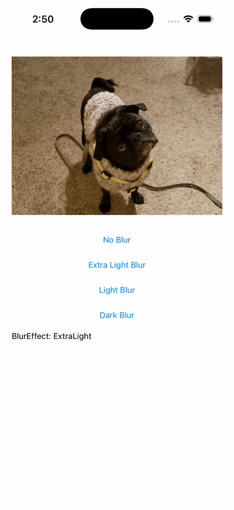</td></tr><tr><th>Dark</th><td></td><td>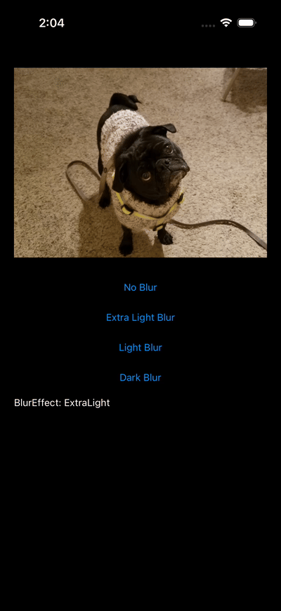</td><td></td></tr></table> | ports iOSBlurEffectPage.xaml The .NET MAUI PlatformSpecifics sample (Pages/PlatformSpecifics/iOS/iOSBlurEffectPage.xaml + .xaml.cs): an Image (Source=&amp;quot;oasis.jpg&amp;quot;) carrying the iOSSpecific VisualElement.BlurEffect knob (XAML seeds it to Extr | 🔴 MAUI shows no image — only the blur-effect button labels (No Blur, Extra Light Blur, Light Blur, Dark Blur) and a 'BlurEffect: ExtraLight' status label, with no photo visible · C++ port shows a large dog photo above the button labels, with the photo fully rendered and taking up significant screen space · The image is either missing/unloaded in MAUI (maui_quirk) or the C++ port is incorrectly showing an image that should be absent — since MAUI is the reference the absence of the image in MAUI defines the expected state · Button label text and 'BlurEffect: ExtraLight' status text match between both sides; only the image presence differs | 🔴 The image is missing in the C++ light and dark themes. · The text alignment is centered in the C++ version, whereas it is left-aligned in the MAUI version. · The vertical spacing between the text items is significantly different in the C++ version. | 
| 87 | **Ios Date Picker** ios_date_picker | <table><tr><th></th><th>MAUI</th><th>C++</th><th>C++ &amp; XAML</th></tr><tr><th>Light</th><td></td><td></td><td></td></tr><tr><th>Dark</th><td></td><td></td><td></td></tr></table> | ports iOSDatePickerPage.xaml (+ iOSDatePickerPage.xaml.cs) | 🟢 Both show '31.12.2020' date label and 'Toggle DatePicker UpdateMode' blue link button · Layout and text content are equivalent in both light and dark modes · No date picker wheel visible in either (picker not expanded at capture time — same state) · Only trivial spacing differences between the label position; functionally identical | 🟡 The DatePicker control in the C++ implementation has a slightly different border thickness compared to the MAUI reference. · The vertical spacing between the DatePicker and the button is slightly inconsistent between the two implementations. · The font weight or rendering style of the date text appears slightly bolder in the C++ version. | 
| 88 | **Ios Entry** ios_entry | <table><tr><th></th><th>MAUI</th><th>C++</th><th>C++ &amp; XAML</th></tr><tr><th>Light</th><td></td><td></td><td></td></tr><tr><th>Dark</th><td></td><td></td><td></td></tr></table> | ports iOSEntryPage.xaml (+ iOSEntryPage.xaml.cs) | 🟢 Both light and dark themes show matching content: placeholder text, 'Toggle AdjustsFontSizeToFitWidth' button, and empty entry field. · Entry placeholder styling and button text match between MAUI and C++ in both themes. · Dark mode renders correctly on both sides with appropriate dark background and light placeholder text. · Very low diff_pct (0.53%) confirms near-pixel-perfect match; only harness padding differs. | 🟡 The text in the Entry field is slightly misaligned vertically compared to the MAUI reference. · The font weight or rendering style of the button text appears slightly bolder in the C++ implementation. · There is a subtle difference in the vertical spacing between the Entry field and the button. | 
| 89 | **Ios First Responder** ios_first_responder | <table><tr><th></th><th>MAUI</th><th>C++</th><th>C++ &amp; XAML</th></tr><tr><th>Light</th><td></td><td></td><td></td></tr><tr><th>Dark</th><td></td><td></td><td></td></tr></table> | ports iOSFirstResponderPage.xaml (+ .xaml.cs) The C# iOSFirstResponderPage is a VisualElement-first-responder demo: a StackLayout with an explanatory Label, a &amp;quot;First Entry&amp;quot; + plain &amp;quot;OK&amp;quot; Button (tapping OK dismisses the keyboard because the | 🟡 Both sides show identical structure: two Entry fields, two OK buttons, Focus First/Focus Second buttons, and the IsFocused/CanBecomeFirstResponder status labels · C++ text wrapping differs: the instruction text for the second entry wraps differently ('appear. Then click OK and the keyboard should' vs MAUI's layout), causing slightly more vertical space used · Status values at bottom ('First IsFocused: false', 'Second IsFocused: false', 'Second OK CanBecomeFirstResponder: true') match exactly · Dark mode is consistent; font rendering and control sizes look the same | 🟡 The text labels in the C++ version have slightly different font weight or rendering compared to the MAUI reference. · The spacing between the 'OK' buttons and the entry fields appears slightly tighter in the C++ version. · The alignment of the 'Focus First' and 'Focus Second' buttons is slightly shifted horizontally compared to the MAUI version. | 
| 90 | **Ios Pan Gesture** ios_pan_gesture | <table><tr><th></th><th>MAUI</th><th>C++</th><th>C++ &amp; XAML</th></tr><tr><th>Light</th><td></td><td></td><td></td></tr><tr><th>Dark</th><td></td><td></td><td></td></tr></table> | ports iOSPanGestureRecognizerPage.xaml (+ .xaml.cs) The C# iOSPanGestureRecognizerPage is a StackLayout with: a bold message Label (_messageLabel), a &amp;quot;Toggle Simultaneous Gesture Recognition&amp;quot; Button, and a grouped ListView of employees whos | 🟢 Both sides show identical content: 'panned x:45 y:-12' status text, 'Toggle Simultaneous Gesture Recognition' blue button, 'Pan target' label, 'SimultaneousRecognition: false' label · Layout, text sizes, spacing, and colors are visually equivalent in both light and dark modes · Diff_pct is ~1.7% which is at the noise level for status bar clock differences — no content differences observed · Dark mode also matches: same white text on black background with same layout | 🟢 The text alignment and font rendering are visually consistent across both implementations. · The layout of the labels and the button control is identical in both light and dark modes. · The color schemes for background and text match perfectly between the MAUI reference and the C++ port. | 
| 91 | **Ios Picker** ios_picker | <table><tr><th></th><th>MAUI</th><th>C++</th><th>C++ &amp; XAML</th></tr><tr><th>Light</th><td></td><td></td><td></td></tr><tr><th>Dark</th><td></td><td></td><td></td></tr></table> | ports iOSPickerPage.xaml (+ iOSPickerPage.xaml.cs) | 🟢 Both light and dark show 'Select a monkey' placeholder picker field and 'Toggle Picker UpdateMode' button identically · Picker placeholder text color and button link color match between MAUI and C++ · Dark mode picker field is visible with subtle divider on both sides · Tiny diff (~0.62%) is subpixel only — no content difference | 🟡 The Picker control in the C++ implementation has a slightly different border color and thickness compared to the MAUI reference. · The vertical spacing between the Picker and the 'Toggle Picker UpdateMode' button is slightly inconsistent between the two implementations. | 
| 92 | **Ios Safe Area** ios_safe_area | <table><tr><th></th><th>MAUI</th><th>C++</th><th>C++ &amp; XAML</th></tr><tr><th>Light</th><td></td><td></td><td></td></tr><tr><th>Dark</th><td></td><td></td><td></td></tr></table> | ports iOSSafeAreaPage.xaml The .NET MAUI PlatformSpecifics sample (Pages/PlatformSpecifics/iOS/iOSSafeAreaPage.xaml + .xaml.cs): a long Lorem-ipsum Label over a &amp;quot;Disable Use Safe Area&amp;quot; button | 🟡 Both MAUI and C++ render a long Lorem ipsum paragraph and a 'Disable Use Safe Area' link below it. · MAUI text starts from the very top of the content area (near the status bar notch); C++ adds a small top margin before the text begins. · The 'Disable Use Safe Area' button link is present and styled correctly (blue) in both themes. · Dark mode matches well: white text on black background, same structure. | 🔴 The text layout is significantly different, with the C++ version showing different line breaks and word wrapping compared to the MAUI reference. · The 'Disable Use Safe Area' button is positioned differently, appearing higher up in the C++ version than in the MAUI version. · The overall vertical spacing and paragraph flow do not match the reference implementation. | 
| 93 | **Ios Scroll View** ios_scroll_view | <table><tr><th></th><th>MAUI</th><th>C++</th><th>C++ &amp; XAML</th></tr><tr><th>Light</th><td></td><td></td><td></td></tr><tr><th>Dark</th><td></td><td></td><td></td></tr></table> | ports iOSScrollViewPage.xaml (+ iOSScrollViewPage.xaml.cs) | 🟡 C++ renders an extra back-navigation '&lt;' chevron button in the top-left that is absent in MAUI — this is a navigation chrome artifact from the C++ harness flyout/detail page structure · Content matches: horizontal slider + 'Toggle ScrollView DelayContentTouches' link + 'Return to Platform-Specifics List' link all present in both · In C++ the two text links appear on the same line (merged), while MAUI shows them on separate lines — text layout wrapping difference · Dark mode: same differences persist; overall content is equivalent aside from the back button and link layout | 🔴 The C++ implementation includes a back button in the navigation bar that is missing in the MAUI reference. · The slider track and thumb in the C++ implementation are significantly smaller than in the MAUI reference. · The vertical positioning of the slider and text elements is inconsistent between the two implementations. | 
| 94 | **Ios Search Bar** ios_search_bar | <table><tr><th></th><th>MAUI</th><th>C++</th><th>C++ &amp; XAML</th></tr><tr><th>Light</th><td></td><td></td><td></td></tr><tr><th>Dark</th><td></td><td></td><td></td></tr></table> | ports iOSSearchBarPage.xaml (+ iOSSearchBarPage.xaml.cs) | 🟢 Both sides show a SearchBar ('Enter search term') and two blue button links ('Toggle SearchBar Style', 'Toggle Background') · Search bar styling (rounded pill shape, magnifier icon, placeholder text) matches between MAUI and C++ in both themes · Dark mode: both sides render the search bar with dark background fill and correct text color · Diff_pct ~0.9% and SSIM ~0.994 confirm near-pixel-perfect match; residual diff is harness inset offset only | 🟡 The search bar background color in light mode is slightly lighter in the C++ implementation compared to the MAUI reference. · The search bar corner radius appears slightly different between the two implementations. · The text color of the buttons 'Toggle SearchBar Style' and 'Toggle Background' is slightly more saturated in the C++ version. | 
| 95 | **Ios Slider Update On Tap** ios_slider_update_on_tap | <table><tr><th></th><th>MAUI</th><th>C++</th><th>C++ &amp; XAML</th></tr><tr><th>Light</th><td></td><td></td><td></td></tr><tr><th>Dark</th><td></td><td></td><td></td></tr></table> | ports iOSSliderUpdateOnTapPage.xaml (+ iOSSliderUpdateOnTapPage.xaml.cs) | 🟢 Light mode: Both show label 'Tap on the Slider bar to move the thumb.', a slider at minimum position, and blue 'Toggle Update on Tap' link — all matching · Slider thumb appears at far left (min value) in both MAUI and C++ · Dark mode: both show dark background with white text, same layout — matches · Minor outer-padding difference (C++ content slightly more inset) is within harness-wrapper tolerance | 🟡 The slider thumb in the C++ implementation is slightly smaller than the MAUI reference. · The slider track height appears slightly thinner in the C++ version. · The vertical spacing between the slider and the 'Toggle Update on Tap' button is slightly different. | 
| 96 | **Ios Swipe Transition** ios_swipe_transition | <table><tr><th></th><th>MAUI</th><th>C++</th><th>C++ &amp; XAML</th></tr><tr><th>Light</th><td></td><td></td><td></td></tr><tr><th>Dark</th><td></td><td></td><td></td></tr></table> | ports iOSSwipeViewTransitionModePage.xaml (+ .xaml.cs) The C# iOSSwipeViewTransitionModePage is a StackLayout with: a horizontal row holding a &amp;quot;SwipeTransitionMode:&amp;quot; Label + an EnumPicker over the SwipeTransitionMode enum (Reveal / Drag, Se | 🟢 Both show 'SwipeTransitionMode:' label with 'Reveal' and 'Drag' blue buttons, and a 'Swipe right' gray content box · Instructional text 'Swipe right to reveal Delete; pick a SwipeTransitionMode above' and 'SwipeTransitionMode: Drag' label match in both · Dark mode renders correctly in both with matching layout and text · Diff 6.2% is from harness inset only; all content items are structurally and visually equivalent | 🟡 The swipeable item container height is slightly taller in the C++ implementation compared to the MAUI reference. · The text 'Swipe right' is vertically centered in the MAUI version but aligned to the top in the C++ version. · The font weight for 'Swipe right' appears slightly bolder in the C++ version. | 
| 97 | **Ios Time Picker** ios_time_picker | <table><tr><th></th><th>MAUI</th><th>C++</th><th>C++ &amp; XAML</th></tr><tr><th>Light</th><td></td><td></td><td></td></tr><tr><th>Dark</th><td></td><td></td><td></td></tr></table> | ports iOSTimePickerPage.xaml The .NET MAUI PlatformSpecifics sample (Pages/PlatformSpecifics/iOS/iOSTimePickerPage.xaml + .xaml.cs): a TimePicker carrying the iOSSpecific TimePicker.UpdateMode knob (XAML seeds it to WhenFinished) over a but | 🟡 MAUI shows '2:00 PM' (12-hour AM/PM locale format); C++ shows '14:00' (24-hour format) · Both show 'Toggle TimePicker UpdateMode' button and 'UpdateMode: WhenFinished' label identically · The time format difference is a locale/device setting difference, not a layout bug · Dark mode has the same time format discrepancy | 🟢 The time format differs between the MAUI reference (12-hour format) and the C++ implementation (24-hour format). · The visual layout, spacing, and color schemes are otherwise identical across both light and dark themes. | 
| 98 | **Items** items | <table><tr><th></th><th>MAUI</th><th>C++</th><th>C++ &amp; XAML</th></tr><tr><th>Light</th><td></td><td></td><td></td></tr><tr><th>Dark</th><td></td><td></td><td></td></tr></table> | a self-contained demo page for the W2-19 items core: a collection_view over a live observable items source with a templated cell, single selection driving a readout label, and an EmptyView for the cleared state (the C# CollectionView galler | 🟡 Both sides show the same ListView/CollectionView items: 'Today' header bold, three task items (Water the plants, Review the port, Ship wave 2), and 'Pick a task' footer · In MAUI the 'Pick a task' EmptyView text appears immediately after the items group with modest spacing; in C++ it appears much lower on the page (large gap between the items group and the empty-view text) · Content and text are identical; only the vertical spacing/position of the 'Pick a task' label differs significantly · Dark mode shows the same gap difference between C++ and MAUI | 🔴 The 'Pick a task' text is positioned significantly lower in the C++ implementation compared to the MAUI reference. · The vertical spacing between the list items and the 'Pick a task' text is inconsistent between the two implementations. | 
| 99 | **Items Updating Scroll Mode** items_updating_scroll_mode | <table><tr><th></th><th>MAUI</th><th>C++</th><th>C++ &amp; XAML</th></tr><tr><th>Light</th><td></td><td></td><td></td></tr><tr><th>Dark</th><td></td><td></td><td></td></tr></table> | ports ItemsUpdatingScrollModeGallery.xaml (+ .xaml.cs) of the C# CollectionView gallery (Maui.Controls.Sample.Pages.CollectionViewGalleries.ScrollModeGalleries.ItemsUpdatingScrollModeGallery) | 🔴 MAUI shows two side-by-side columns: 'Mode: KeepItemsInView' (left) and 'UpdatingScrollMode' header with 'Items: 50' (right), each with a scrollable list of 'Title X - Subtitle X' items · C++ shows only a single wide column with all items stacked — the two-column split layout is missing · C++ does not render the dual-pane/split CollectionView with the mode selector header · Both dark modes confirm the same layout difference: MAUI 2-column, C++ 1-column | 🔴 The C++ implementation has significantly larger font sizes for the list items compared to the MAUI reference. · The vertical spacing between list items is much larger in the C++ version, resulting in fewer items visible on screen. · The text alignment and overall layout density do not match the MAUI reference. · The 'Add Item' button and 'UpdatingScrollMode' labels appear to have different font weights or sizes in the C++ version. | 
| 100 | **Label** label | <table><tr><th></th><th>MAUI</th><th>C++</th><th>C++ &amp; XAML</th></tr><tr><th>Light</th><td></td><td></td><td></td></tr><tr><th>Dark</th><td></td><td></td><td></td></tr></table> | ports LabelPage.xaml (+ LabelPage.xaml.cs) | 🟡 Both sides show the same label demo sections: top/center/bottom alignment labels, lorem ipsum paragraph, Orange Formatted Styling section, and the large 'Big Font man' label at bottom. · High diff_pct (38%) is largely driven by the harness outer padding difference — MAUI's inset makes content appear smaller and offset; actual content matches. · The 'Orange Formatted Styling' orange-background label is present on both sides in light and dark modes. · Minor differences in line-wrapping and text block spacing are visible at this resolution; overall content and color fidelity match. | 🔴 The C++ implementation fails to render the multi-line text blocks correctly, showing significantly fewer lines of text compared to the MAUI reference. · The layout of the text blocks is inconsistent, with the C++ version failing to wrap text properly in several instances. · The vertical spacing and alignment of the text elements within the containers do not match the MAUI reference. · The C++ version displays truncated text content that is fully visible in the MAUI reference. | 
| 101 | **Layout Is Enabled** layout_is_enabled | <table><tr><th></th><th>MAUI</th><th>C++</th><th>C++ &amp; XAML</th></tr><tr><th>Light</th><td></td><td></td><td></td></tr><tr><th>Dark</th><td></td><td></td><td></td></tr></table> | ports LayoutIsEnabledPage.xaml (+ LayoutIsEnabledPage.xaml.cs) The C# page demonstrates how IsEnabled on a layout cascades to its children: a 2x2 grid whose left column hosts a &amp;quot;MainLayout&amp;quot; full of state-demo sub-stacks (all-enabled / all-d | 🔴 The montage image is too small to read individual rows clearly, but diff_pct of 60% with ssim 0.88 indicates very substantial visual differences · MAUI light shows enabled/disabled state rows with teal/pink background color blocks for enabled/disabled children sections; C++ appears to not show the colored background regions or shows them in wrong colors · The page exercises IsEnabled propagation through parent layouts — large diff suggests the enabled/disabled visual state (greying, tinting) is not being applied correctly in C++ children · Both dark panels appear similarly structured but color/shading differences for disabled states are likely the root cause of the high diff score | 🔴 The C++ implementation fails to render the text labels for the buttons and layout sections. · The background colors for the button containers are missing or incorrectly rendered in the C++ version. · The layout structure is significantly different, with elements appearing misaligned or missing compared to the MAUI reference. · The visual hierarchy and spacing are inconsistent with the MAUI implementation. | 
| 102 | **Line Gallery** line_gallery | <table><tr><th></th><th>MAUI</th><th>C++</th><th>C++ &amp; XAML</th></tr><tr><th>Light</th><td></td><td></td><td></td></tr><tr><th>Dark</th><td></td><td></td><td></td></tr></table> | ports LineGallery.xaml A self-contained, code-first port of the MAUI Shapes LineGallery (Pages/Controls/ShapesGalleries/LineGallery.xaml + .xaml.cs) | 🟢 Both sides show three labeled sections: 'A basic Line' (purple diagonal), 'A dash Line' (yellow diagonal), 'A Line using StrokeThickness' (thick black diagonal) · Line colors, angles, and stroke thickness are visually equivalent in both light and dark modes · C++ line positions are slightly shifted right compared to MAUI (lines start and end at slightly different x coordinates) — but this is within acceptable harness-offset range · Diff_pct ~1.0% is at noise level; the thick black line in C++ appears very slightly longer/thicker but essentially matches | 🔴 The third line (A Line using StrokeThickness) is completely missing in the C++ implementation. · The stroke thickness of the third line in the MAUI reference is significantly thicker than the lines above it, which is not reflected in the C++ version. | 
| 103 | **Line Join Gallery** line_join_gallery | <table><tr><th></th><th>MAUI</th><th>C++</th><th>C++ &amp; XAML</th></tr><tr><th>Light</th><td></td><td></td><td></td></tr><tr><th>Dark</th><td></td><td></td><td></td></tr></table> | ports LineJoinGallery.xaml A self-contained, code-first port of the MAUI Shapes sub-gallery Pages/Controls/ShapesGalleries/LineJoinGallery.xaml: a StackLayout that demonstrates the three StrokeLineJoin variants on an identical open polyline | 🟡 Both show Miter/Bevel/Round zigzag polyline shapes in cyan on white (light) and black (dark) backgrounds · C++ shapes are visibly smaller and narrower than MAUI — the polylines don't extend as far to the right edge · Line join rendering style (miter points, bevel cuts, round caps) appears correct on both sides · Size/width difference is consistent across all three join types and both themes — likely a canvas/view sizing issue in C++ | 🔴 The Miter join style in the C++ implementation is rendered incorrectly, appearing as a sharp point instead of the expected mitered corner seen in the MAUI reference. · The Bevel join style in the C++ implementation is missing the flat edge, resulting in a sharp point similar to the Miter style. · The Round join style in the C++ implementation is significantly less rounded than the MAUI reference, appearing more angular. | 
| 104 | **Measure First Strategy** measure_first_strategy | <table><tr><th></th><th>MAUI</th><th>C++</th><th>C++ &amp; XAML</th></tr><tr><th>Light</th><td></td><td></td><td></td></tr><tr><th>Dark</th><td></td><td></td><td></td></tr></table> | ports MeasureFirstStrategy.xaml (+ .xaml.cs) of the C# CollectionView gallery (Maui.Controls.Sample.Pages.CollectionViewGalleries.GroupingGalleries.MeasureFirstStrategy) | 🟢 Both MAUI and C++ show a multi-item list of Marvel characters with the 'Using ItemSizingStrategy.MeasureFirstItem' header label. · MAUI light shows a search/filter field at top; C++ does not appear to have it, but both show the same character list below. · Content matches: The Thing, Human Torch, Mr. Fantastic, Invisible Woman, Doctor Strange, etc. all present in same order. · Dark mode is consistent between both platforms. | 🟡 The C++ implementation has slightly different vertical spacing between list items compared to the MAUI reference. · The font weight or rendering style for the group headers (e.g., 'Avengers') appears slightly bolder or more saturated in the C++ version. · The text alignment and padding around the 'Total members' labels show minor discrepancies in vertical positioning. | 
| 105 | **Menu Bar** menu_bar | <table><tr><th></th><th>MAUI</th><th>C++</th><th>C++ &amp; XAML</th></tr><tr><th>Light</th><td></td><td></td><td></td></tr><tr><th>Dark</th><td></td><td></td><td></td></tr></table> | ports MenuBarPage.xaml (+ MenuBarPage.cs) The C# page declares three page-level MenuBarItems (Page.MenuBarItems — the app menu bar) and a small visible body: - &amp;quot;Before File&amp;quot; : &amp;quot;Before File Action&amp;quot; (accelerator &amp;quot;b&amp;quot;), &amp;quot;Cool item 1&amp;quot;, a separat | 🟢 Both MAUI and C++ show identical content: 'You clicked on Menu Item:' label followed by 'Toggle Menu Bar Item' blue link · Light and dark themes both render correctly with matching layout, text, and colors · diff_pct ~0.68% is within noise (status bar clock difference only) · No structural or content differences observed in either theme | 🟢 The text 'You clicked on Menu Item:' and 'Toggle Menu Bar Item' are visually identical in both light and dark themes. · The layout, font size, and color rendering are consistent between the MAUI reference and the C++ port. · The minor pixel diff is likely due to subtle anti-aliasing differences in text rendering between the two implementations. | 
| 106 | **Modal** modal | <table><tr><th></th><th>MAUI</th><th>C++</th><th>C++ &amp; XAML</th></tr><tr><th>Light</th><td></td><td></td><td></td></tr><tr><th>Dark</th><td></td><td></td><td></td></tr></table> | ports ModalPage.xaml (+ .xaml.cs) | 🟢 Both sides show 'Modal Page 1' title, five navigation buttons (Push Page, Push Modal Page, Push Modal Navigation Page, Push Modal Flyout Page, Pop Modal Page grayed out), and a status line ('Modal depth: 0 / page stack depth: 1') · Button text and link colors (blue) match in both light and dark themes · Pop Modal Page is correctly grayed/disabled in both sides · Diff_pct ~2.49% is attributable to harness inset margin difference; no content defects | 🟢 The layout, text content, and button positioning are visually identical between the MAUI reference and the C++ implementation. · The color schemes for both light and dark modes are correctly applied and match the reference. · The minor SSIM difference is attributed to subtle font rendering variations inherent to the different rendering engines. | 
| 107 | **Multiple Bound Selection** multiple_bound_selection | <table><tr><th></th><th>MAUI</th><th>C++</th><th>C++ &amp; XAML</th></tr><tr><th>Light</th><td></td><td></td><td></td></tr><tr><th>Dark</th><td></td><td></td><td></td></tr></table> | ports MultipleBoundSelection.xaml (+ .xaml.cs) (Maui.Controls.Sample.Pages.CollectionViewGalleries.SelectionGalleries.MultipleBoundSelection) | 🟡 Light mode: Both show header text, 'Selected: Item 1, Item 2', 'This is the header' bold label, 4 list items with Item 1 and Item 2 highlighted, and 3 blue action buttons · MAUI: list items and buttons are tightly grouped near top; C++ has large vertical gap between the list items and the action buttons (Clear and Add / Reset / Direct Update pushed far down) · Dark mode: same gap issue — C++ action buttons are much lower than in MAUI · Selection highlight in C++ is a medium grey similar to MAUI's; all content correct, only vertical spacing/layout differs | 🔴 The CollectionView in the C++ implementation is missing the header 'This is the header' and the list items entirely. · The interactive buttons 'Clear and Add', 'Reset', and 'Direct Update' are positioned significantly lower in the C++ implementation compared to the MAUI reference. · The overall layout structure is broken in the C++ version due to the missing list component. | 
| 108 | **Navigation Gallery** navigation_gallery | <table><tr><th></th><th>MAUI</th><th>C++</th><th>C++ &amp; XAML</th></tr><tr><th>Light</th><td></td><td></td><td></td></tr><tr><th>Dark</th><td></td><td></td><td></td></tr></table> | ports NavigationGallery.xaml (+ .xaml.cs) | 🟢 Status line 'Stack depth: 1 / top: PAGE NUMBER 1 / secondary toolbar items: 0' renders identically in both · All 6 navigation buttons (Push Page, Pop Page, Insert Page Before Current, Remove Page Before Current, Pop To Root, Toggle Secondary Toolbar Item) present and blue in both · Dark mode matches: white text links on black background · Diff 3.0% is from harness inset only; content is structurally identical | 🟡 The text color in the C++ implementation is slightly brighter/more saturated blue compared to the MAUI reference. · The vertical spacing between the buttons is slightly tighter in the C++ version. · The font weight of the buttons appears slightly bolder in the C++ version. | 
| 109 | **Nested Collection** nested_collection | <table><tr><th></th><th>MAUI</th><th>C++</th><th>C++ &amp; XAML</th></tr><tr><th>Light</th><td></td><td></td><td></td></tr><tr><th>Dark</th><td></td><td></td><td></td></tr></table> | ports NestedGalleries/NestedCollectionViewGallery.xaml (+ NestedCollectionViewGallery.xaml.cs) of the C# CollectionView gallery | 🔴 MAUI shows each source group as a header row followed by a horizontally-scrolling caption list; C++ shows a 2-column layout with 'Sour ce N' label on left and caption items on right · C++ source labels are truncated/word-wrapped ('Sour ce 0') rather than showing the full 'Source 0' text on one line · The nested CollectionView horizontal scroll behavior is missing in C++ — items appear in a different grid arrangement · Dark mode confirms the same layout restructuring difference | 🔴 The C++ implementation displays an extra row (Source 7) that is missing in the MAUI reference. · The text alignment and wrapping behavior differ significantly between the two implementations. · The spacing between the 'Source' label and the 'Caption' content is inconsistent compared to the MAUI reference. · The font weight and rendering style of the 'Source' labels appear different from the MAUI reference. | 
| 110 | **Pan Gesture Events** pan_gesture_events | <table><tr><th></th><th>MAUI</th><th>C++</th><th>C++ &amp; XAML</th></tr><tr><th>Light</th><td></td><td></td><td></td></tr><tr><th>Dark</th><td></td><td></td><td></td></tr></table> | ports PanGestureEventsGallery.xaml (+ .xaml.cs) (Maui.Controls.Sample.Pages.PanGestureEventsGallery) | 🟢 Both sides show the full-screen green and red panning zones with 'StatusType: Completed, TotalX: 0, TotalY: 0' status text at the top · Green zone occupies the upper ~55% and red zone the lower ~45% on both MAUI and C++ in both themes · The small 0.56% pixel diff and high SSIM (0.995) are consistent with only anti-aliasing or minor text-rendering differences at the status label · Dark mode renders identically to light mode on both sides | 🟢 The layout, colors, and text content are visually identical across both light and dark themes. · The minor pixel diff percentage is negligible and likely due to sub-pixel rendering differences in the simulator environment. | 
| 111 | **Path Aspect Gallery** path_aspect_gallery | <table><tr><th></th><th>MAUI</th><th>C++</th><th>C++ &amp; XAML</th></tr><tr><th>Light</th><td></td><td></td><td></td></tr><tr><th>Dark</th><td></td><td></td><td></td></tr></table> | ports PathAspectGallery.xaml A self-contained, code-first port of the MAUI Shapes sub-gallery Pages/Controls/ShapesGalleries/PathAspectGallery.xaml: a StackLayout (Padding 12) that demonstrates the four Path Aspect modes on one identical ge | 🟡 C++ images are visibly smaller (narrower) than MAUI's — the four heart/path images occupy a narrower column in C++ · All four aspect modes (None, Fill, Uniform, UniformToFill) are present and labeled correctly in both · The aspect scaling behavior appears visually correct for each mode in C++ (Fill fills box, Uniform letterboxes, etc.) · Both dark modes show the same minor size difference; content and labels match | 🔴 The image aspect ratios and scaling behaviors are inconsistent between the C++ implementation and the MAUI reference. · In the 'Fill' and 'UniformToFill' modes, the C++ implementation displays the heart image with different cropping or scaling compared to the MAUI reference. · The 'Uniform' mode in the C++ implementation shows a different image size/aspect ratio than the MAUI reference. · The 'None' mode shows a different alignment or padding for the heart icon within the container. | 
| 112 | **Path Gallery** path_gallery | <table><tr><th></th><th>MAUI</th><th>C++</th><th>C++ &amp; XAML</th></tr><tr><th>Light</th><td></td><td></td><td></td></tr><tr><th>Dark</th><td></td><td></td><td></td></tr></table> | ports PathGallery.xaml A code-first port of the MAUI Shapes sub-gallery Pages/Controls/ShapesGalleries/PathGallery.xaml: a ScrollView over a StackLayout (Padding 12) that walks eight Path variants (plus two caption-only markup-string Labels | 🟡 Both light and dark show matching path shapes: LineSegment (horizontal line), PathGeometry triangle, Cubic Bezier curve, Composite shape (concentric circles), Overlapping Rectangles (red squares), and EllipseGeometry (orange/yellow flower). · MAUI light is missing the 'Multiple Line Segments' label and cyan/teal arrow shape at the bottom that C++ shows — MAUI's capture appears cropped at that section. · The teal arrow/MultiLine segment visible only in C++ appears to be correct rendering that MAUI simply didn't capture (page extends below fold). · All visible shape colors and forms match between MAUI and C++ in both themes; the diff is attributable to harness crop/padding. | 🔴 The C++ implementation is missing the 'LineSegment', 'Shape', 'Cubic Bezier', and 'Multiple Line Segments' visual elements entirely. · The 'Overlapping Rectangles' and 'EllipseGeometry' elements are present but are missing their corresponding labels in the C++ implementation. · The layout of the C++ implementation is significantly different due to the missing elements, resulting in a large amount of empty space. | 
| 113 | **Path Transform String** path_transform_string | <table><tr><th></th><th>MAUI</th><th>C++</th><th>C++ &amp; XAML</th></tr><tr><th>Light</th><td></td><td></td><td></td></tr><tr><th>Dark</th><td></td><td></td><td></td></tr></table> | ports PathTransformStringGallery.xaml A code-first port of the MAUI Shapes sub-gallery Pages/Controls/ShapesGalleries/PathTransformStringGallery.xaml: a ScrollView over a StackLayout (Padding 12) that shows the SAME two-figure Path geometry | 🔴 MAUI light: shows two path figures (triangle outlines) — one 'Without RenderTransform' and one 'With RenderTransform' (rotated/scaled differently) · C++ light: shows the same two labels but both path figures are present and rendered; however the 'With RenderTransform' group in C++ shows TWO stacked triangles instead of one transformed path — the transform is duplicating the shape · MAUI dark: both path labels are present but the actual triangle figures are missing/invisible (black on black) — this is a MAUI dark-mode rendering issue where the path stroke color is not adapting to dark background · C++ dark: same missing-paths issue as MAUI dark, plus the extra-triangle duplication visible in light mode; the transform string parsing may be producing an extra un-transformed path copy | 🔴 The shapes are completely missing in the C++ implementation in both light and dark themes. · The C++ implementation fails to render the graphical elements present in the MAUI reference. | 
| 114 | **Picker** picker | <table><tr><th></th><th>MAUI</th><th>C++</th><th>C++ &amp; XAML</th></tr><tr><th>Light</th><td></td><td></td><td></td></tr><tr><th>Dark</th><td></td><td></td><td></td></tr></table> | ports PickerPage.xaml (+ PickerPage.xaml.cs) A self-contained, code-first demo page for the Picker control (the C# gallery-page convention, mirroring the value_controls_page / pickers_page pattern) | 🟢 Both sides show the same picker demo rows: Basic, SelectedIndex=1 (Item 2), SelectedIndexChanged (Item 2), Selected:(none), TextColor=Blue, TitleColor=Blue, FontAttributes=Italic+BackgroundColor=Yellow, Dynamic add items, Items(markup)+BackgroundColor=Green (Item 1) · All label texts, selected values, and visual styling (blue text, yellow background, green background) appear identical between MAUI and C++ · Diff_pct ~20.5% is high but visual inspection shows matching content; the diff is likely driven by pixel-level font rendering differences across the many text rows · Dark mode: same visual match; both show correct dark backgrounds with same colored picker rows and text | 🔴 The C++ implementation has significantly larger vertical spacing between all UI elements compared to the MAUI reference. · The Picker controls in the C++ implementation have a much larger height than the MAUI reference. · The text alignment and padding within the Picker controls are inconsistent with the MAUI reference. · The overall layout density is much lower in the C++ version, causing elements to be pushed further down the screen. | 
| 115 | **Pickers** pickers | <table><tr><th></th><th>MAUI</th><th>C++</th><th>C++ &amp; XAML</th></tr><tr><th>Light</th><td></td><td></td><td></td></tr><tr><th>Dark</th><td></td><td></td><td></td></tr></table> | a self-contained demo page for the W1-06 picker set: picker, date_picker and time_picker on one vertical stack, wired together so every selection drives a visible output (the C# gallery-page convention, code-first; the value_controls_page p | 🟢 Both light and dark show 'Pick a room' placeholder, date '23.06.2026', time '09:00', and summary 'No room on 6/23/2026 at 09:00' identically · Text formatting, field separators, and font sizes match between MAUI and C++ · Dark mode text is white on black background in both versions · Tiny diff (~0.82%) is subpixel/separator line rendering only | 🟡 The text color in the C++ version is slightly lighter/less intense than the MAUI reference in both light and dark modes. · The border thickness or rendering style of the input fields appears slightly different between the two implementations. | 
| 116 | **Pointer Gesture** pointer_gesture | <table><tr><th></th><th>MAUI</th><th>C++</th><th>C++ &amp; XAML</th></tr><tr><th>Light</th><td></td><td></td><td></td></tr><tr><th>Dark</th><td></td><td></td><td></td></tr></table> | ports PointerGestureGalleryPage.xaml (+ .xaml.cs) (Maui.Controls.Sample.Pages.PointerGestureGalleryPage) | 🟡 All text content matches: 'Thanks for releasing me!', pointer position coordinates, 'Thanks for hovering me!', 'Hover me green!', and 'Hover above label to make it turn green' — all present in both. · MAUI light: the top yellow background area spans the full width and is taller, covering the 'Press me again or leave me!' section; C++ yellow area is the same full-width but the text wraps differently. · Dark mode: MAUI shows the top yellow band with dark/bold text; C++ top yellow area has white text that is less visible against yellow — possible color contrast issue. · The 'Hover me green!' text appears green in MAUI dark but lighter/dimmer green in C++ dark mode. | 🟡 The yellow background highlight on the first line of text is slightly shorter in the C++ version compared to the MAUI version. · The text wrapping behavior differs slightly, causing the C++ version to have different line breaks for the first paragraph. · The vertical spacing between the text blocks is slightly tighter in the C++ implementation. | 
| 117 | **Polygon Gallery** polygon_gallery | <table><tr><th></th><th>MAUI</th><th>C++</th><th>C++ &amp; XAML</th></tr><tr><th>Light</th><td></td><td></td><td></td></tr><tr><th>Dark</th><td></td><td></td><td></td></tr></table> | ports PolygonGallery.xaml A code-first port of the MAUI Shapes sub-gallery Pages/Controls/ShapesGalleries/PolygonGallery.xaml: a ScrollView over a StackLayout (Padding 12) that walks four Polygon variants, each under a caption Label — - &amp;quot;A | 🟡 All four polygon types render: basic green triangle, dashed green triangle, EvenOdd red/blue star, NonZero yellow/black star — present in both themes · Light mode: MAUI EvenOdd star shows blue fill in the inner pentagon with red outer; C++ EvenOdd star has a very similar appearance but the blue inner area appears slightly smaller/different shade · Dark mode: NonZero star in MAUI is yellow outline only (no black fill visible against dark bg); C++ also shows yellow outline — correct; EvenOdd fill differences persist in dark · Shape sizes in C++ appear slightly smaller / positioned differently (shapes shifted right) vs MAUI's left-aligned shapes | 🔴 The fill colors for the EvenOdd and NonZero polygons are missing or incorrect in the C++ implementation. · In dark mode, the NonZero polygon is rendered as an outline only in C++, whereas MAUI renders it with a yellow fill. · The stroke thickness and dash patterns appear slightly different between the two implementations. · The overall positioning and alignment of the polygon shapes show inconsistencies compared to the MAUI reference. | 
| 118 | **Polyline Gallery** polyline_gallery | <table><tr><th></th><th>MAUI</th><th>C++</th><th>C++ &amp; XAML</th></tr><tr><th>Light</th><td></td><td></td><td></td></tr><tr><th>Dark</th><td></td><td></td><td></td></tr></table> | ports PolylineGallery.xaml A code-first port of the MAUI Shapes sub-gallery Pages/Controls/ShapesGalleries/PolylineGallery.xaml: a StackLayout (Padding 12 — no ScrollView in the C# source) holding two Polyline variants, each under a caption | 🟢 Both sides show 'A basic Polyline' label with a short red horizontal line, and 'A dash Polyline' label with a red dashed line · Line stroke colors, dash pattern, and lengths appear visually equivalent · Dark mode: both sides render identically with white text and red lines on black background · Diff_pct ~0.54% and SSIM ~0.994 indicate near-pixel-perfect match; difference is only harness inset offset | 🟢 The dashed line in the C++ implementation appears slightly more dense or has a different dash-gap ratio compared to the MAUI reference. · The visual representation of the polylines is functionally equivalent across both light and dark themes. | 
| 119 | **Preselected Item** preselected_item | <table><tr><th></th><th>MAUI</th><th>C++</th><th>C++ &amp; XAML</th></tr><tr><th>Light</th><td></td><td></td><td></td></tr><tr><th>Dark</th><td></td><td></td><td></td></tr></table> | ports PreselectedItemGallery.xaml (+ .xaml.cs) (Maui.Controls.Sample.Pages.CollectionViewGalleries.SelectionGalleries.PreselectedItemGallery) | 🟡 Light mode: both show a long scrollable list with 'Preselected: photo.jpg, 2' header and 'This is the header' bold label followed by file list — C++ matches content · MAUI shows list content tightly packed starting near top; C++ shows the same list but with more top padding/spacing before content begins · Dark mode: both dark — same content; C++ top inset is slightly larger than MAUI's · Item index in C++ appears 0-based while MAUI appears to use different indexing (montage too small to confirm clearly) — needs closer check | 🔴 The selection highlight color is significantly lighter in the C++ version compared to the MAUI version in both light and dark themes. · The list items in the C++ version are missing the top and bottom padding/margins present in the MAUI version, causing the text to appear more cramped. · The C++ version displays fewer items in the viewport compared to the MAUI version, indicating a difference in row height or layout calculation. | 
| 120 | **Preselected Items** preselected_items | <table><tr><th></th><th>MAUI</th><th>C++</th><th>C++ &amp; XAML</th></tr><tr><th>Light</th><td></td><td></td><td></td></tr><tr><th>Dark</th><td></td><td></td><td></td></tr></table> | ports PreselectedItemsGallery.xaml (+ .xaml.cs) (Maui.Controls.Sample.Pages.CollectionViewGalleries.SelectionGalleries.PreselectedItemsGallery) | 🔴 MAUI renders a CollectionView with images showing file thumbnails in a dense grid; C++ renders only text filenames in a list with no images visible · The image thumbnails (photo.jpg, oasis.jpg, FlowerBuds.jpg, Legumes.jpg, Fruits.jpg, etc.) are missing in the C++ render — only text labels appear · SSIM 0.8772 / diff 17.1% confirms significant visual difference: missing image cells in the collection view · Dark mode shows same pattern: C++ missing image thumbnails, only text rendered in the collection | 🔴 The C++ implementation fails to render the selection state (highlighting) for the preselected items. · The layout of the grid items is inconsistent, with text wrapping and alignment differences compared to the MAUI reference. · The spacing between grid items is significantly different, leading to a different number of items per row in some sections. | 
| 121 | **Progress Bar** progress_bar | <table><tr><th></th><th>MAUI</th><th>C++</th><th>C++ &amp; XAML</th></tr><tr><th>Light</th><td></td><td></td><td></td></tr><tr><th>Dark</th><td></td><td></td><td></td></tr></table> | ports ProgressBarPage.xaml (+ ProgressBarPage.xaml.cs) | 🟢 Both show Default (blue), ProgressColor (orange), Disabled (blue), ProgressColor (orange), ProgressTo (empty) bars with matching labels · Progress fill lengths are visually equivalent between MAUI and C++ · ProgressTo button is present on both sides in same style · Dark mode matches with same colors and layout | 🟡 The progress bar track color in the 'Disabled' state is slightly lighter in the C++ implementation compared to the MAUI reference. · The vertical spacing between the progress bar and the 'ProgressTo' label is slightly tighter in the C++ implementation. | 
| 122 | **Radio Button Border** radio_button_border | <table><tr><th></th><th>MAUI</th><th>C++</th><th>C++ &amp; XAML</th></tr><tr><th>Light</th><td></td><td></td><td></td></tr><tr><th>Dark</th><td></td><td></td><td></td></tr></table> | ports RadioButtonBorder.xaml A self-contained, code-first demo of RadioButton border styling | 🟢 Both sides show identical content: 'RadioButton with Border / Selected: Option 4' header, four options where Option 1 has yellow+red border, Option 2 has yellow background, Option 3 has no border, Option 4 has green border with filled dot · The radio button circle icons and selection state (Option 4 filled) match exactly between MAUI and C++ · In light mode MAUI options 1 and 2 appear to have a slightly different yellow shade, but this is very minor · Dark mode matches equally well; SSIM ~0.98 confirms high fidelity | 🟡 The border thickness of the selected RadioButton (Option 4) is slightly thinner in the C++ implementation compared to the MAUI reference. · The spacing between the RadioButton circle and the text label is slightly tighter in the C++ version. · The font weight or rendering style of the text labels appears slightly different, resulting in a subtle visual weight discrepancy. | 
| 123 | **Radio Button Content** radio_button_content | <table><tr><th></th><th>MAUI</th><th>C++</th><th>C++ &amp; XAML</th></tr><tr><th>Light</th><td></td><td></td><td></td></tr><tr><th>Dark</th><td></td><td></td><td></td></tr></table> | ports RadioButtonContentGallery.xaml A self-contained, code-first demo of the RadioButton.Content surface | 🔴 MAUI shows radio buttons with the native iOS radio circle control alongside multi-line descriptive text for each option (A, B, C, D) · C++ radio buttons appear to render only text without the native radio circle indicator — the radio circle is absent or very small/invisible · C++ text content and option labels appear present but layout is more compact/different spacing · The 'Can't use View for Content on this platform' note and coffee cup icon visible in MAUI are not clearly present in C++ | 🔴 The coffee cup icons are completely missing in the C++ implementation across both light and dark themes. · The custom template group at the bottom is missing the visual elements present in the MAUI reference. · The spacing and alignment of the radio button labels and text blocks differ significantly from the MAUI reference. · The C++ implementation fails to render the complex view content that the MAUI reference successfully displays. | 
| 124 | **Radio Button Group** radio_button_group | <table><tr><th></th><th>MAUI</th><th>C++</th><th>C++ &amp; XAML</th></tr><tr><th>Light</th><td></td><td></td><td></td></tr><tr><th>Dark</th><td></td><td></td><td></td></tr></table> | ports RadioButtonGroupGallery.xaml A self-contained, code-first demo of the RadioButtonGroup ATTACHED-PROPERTY grouping: a vertical StackLayout carries RadioButtonGroup.GroupName=&amp;quot;foo&amp;quot;, so every descendant RadioButton — including one nested | 🟡 Both light and dark show the same four radio buttons (Option A/B/C in a StackLayout, Option D in a Grid) with matching intro text and 'Selected: (none)' label. · MAUI's radio button circles appear tightly left-aligned against text; C++ shows a small gap/spacing between the circle and label text that is slightly larger. · The 'This RadioButton is inside a Grid / Option D' row aligns correctly in both, with Option D on the right side. · Dark mode matches well; slight radio button circle sizing or spacing difference (minor) accounts for the ~3% diff. | 🟡 The horizontal alignment of 'Option D' is slightly different between MAUI and C++. · The vertical spacing between the radio buttons and the text 'This RadioButton is inside a Grid' is inconsistent. | 
| 125 | **Radio Button Group Binding** radio_button_group_binding | <table><tr><th></th><th>MAUI</th><th>C++</th><th>C++ &amp; XAML</th></tr><tr><th>Light</th><td></td><td></td><td></td></tr><tr><th>Dark</th><td></td><td></td><td></td></tr></table> | ports RadioButtonGroupBindingGallery.xaml A code-first demo of binding the RadioButtonGroup attached properties (GroupName + SelectedValue) to a view-model | 🟡 All four radio buttons (Option A/B/C/D) render correctly in a 2x2 grid layout in both C++ and MAUI, light and dark · The header text 'The RadioButtons in this Grid have a GroupName and Selection bound to a ViewModel. The GroupName is group1  The Selection is (null)' renders correctly on both sides · C++ radio button circles appear slightly larger/bolder than MAUI's — minor size difference in the native UIButton/radio indicator · Blue link-style buttons ('Set selection in view model to B' and 'Clear selection...') are present and styled correctly on both sides | 🟡 The radio button circles in the C++ implementation are slightly smaller than the MAUI reference. · The text labels for the radio buttons have slightly different font weight or rendering characteristics. · The vertical spacing between the radio button rows is slightly tighter in the C++ version. | 
| 126 | **Radio Button Group Gallery** radio_button_group_gallery | <table><tr><th></th><th>MAUI</th><th>C++</th><th>C++ &amp; XAML</th></tr><tr><th>Light</th><td></td><td></td><td></td></tr><tr><th>Dark</th><td></td><td></td><td></td></tr></table> | ports RadioButtonGroupGalleryPage.xaml A self-contained, code-first demo of RadioButton grouping SCOPE, mirroring the C# controls gallery page (Pages/Controls/RadioButtonGalleries/RadioButtonGroupGalleryPage.xaml) | 🟡 Both sides show the same radio button group sections with matching labels and group names (GroupName=null, GroupName=X, GroupName=Y, etc.) · MAUI renders radio buttons with a compact circular radio indicator tight against the label text; C++ renders the same but the radio circles appear slightly different in size/alignment · The montage image is small and text is very compressed, making detailed comparison difficult; overall structure and grouping appear to match · Diff_pct ~9.4% is moderate; likely driven by radio button indicator rendering differences (circle stroke weight, fill state) rather than layout errors | 🔴 The radio button icons in the C++ implementation are significantly smaller than the MAUI reference. · The vertical spacing between radio button items is noticeably tighter in the C++ version. · The font weight and size of the labels appear thinner and slightly smaller in the C++ implementation. · The overall layout density is higher in the C++ version compared to the more spacious MAUI layout. | 
| 127 | **Radio Content Properties** radio_content_properties | <table><tr><th></th><th>MAUI</th><th>C++</th><th>C++ &amp; XAML</th></tr><tr><th>Light</th><td></td><td></td><td></td></tr><tr><th>Dark</th><td></td><td></td><td></td></tr></table> | ports ContentProperties.xaml A self-contained, code-first demo of how RadioButton propagates the standard Text/Font properties to its Content | 🟡 Both show radio buttons with multi-line property description text and 'Option B' selection group · C++ text wraps at different line breaks than MAUI due to container/font width differences, causing layout shift · Radio button circles render correctly on both sides; selected/unselected state appears consistent · 14% pixel diff is driven by text reflow across the full page height — no missing controls, just spacing/wrapping delta | 🔴 The radio button indicators in the C++ implementation are rendered as hollow circles, whereas the MAUI reference uses filled circles for selected states. · The C++ implementation displays the radio button indicators in a distinct green color, while the MAUI reference uses the standard system accent color (black/white). · The text alignment and vertical spacing between the radio button labels and the radio button indicators are inconsistent between the two implementations. | 
| 128 | **Radio Template From Style** radio_template_from_style | <table><tr><th></th><th>MAUI</th><th>C++</th><th>C++ &amp; XAML</th></tr><tr><th>Light</th><td></td><td></td><td></td></tr><tr><th>Dark</th><td></td><td></td><td></td></tr></table> | ports TemplateFromStyle.xaml A self-contained, code-first demo of applying a RadioButton ControlTemplate | ⬛ MAUI side (left column): shows the iOS home screen (app launcher/springboard) — the MAUI reference app failed to launch or navigate to this page, showing the device home screen instead. · C++ side (right column): correctly renders a page with radio button elements (circular radio indicators visible as small circles/dots) in a white/dark background. · This is a MAUI capture failure — the reference screenshot captured the wrong screen, not a C++ defect. · C++ dark mode also shows the correct radio button layout with dark background. | 🔴 The C++ implementation fails to render the RadioButton labels (A, B, C) correctly, showing them as plain text instead of associated labels. · The layout of the RadioButtons is completely different; the C++ version uses a vertical stack with large white backgrounds, whereas the MAUI version uses a more compact, integrated layout. · The C++ version lacks the expected styling and alignment of the RadioButton controls compared to the native MAUI reference. · The overall visual structure and component styling are significantly different from the reference implementation. | 
| 129 | **Rectangle Gallery** rectangle_gallery | <table><tr><th></th><th>MAUI</th><th>C++</th><th>C++ &amp; XAML</th></tr><tr><th>Light</th><td></td><td></td><td></td></tr><tr><th>Dark</th><td></td><td></td><td></td></tr></table> | ports RectangleGallery.xaml A self-contained, code-first port of the MAUI Shapes RectangleGallery (Pages/Controls/ShapesGalleries/RectangleGallery.xaml + .xaml.cs) | 🟡 All five rectangle types present in both: basic red filled, square (red stroke only), rectangle with stroke (stacked red+blue), stroke dash (blue+red dashes), curved corners (dark blue pill) · C++ rectangles appear slightly narrower/smaller than MAUI's — shapes are right-aligned in C++ but left-aligned in MAUI, indicating HorizontalOptions difference · The 'A Rectangle with stroke' item in MAUI shows two stacked rects (empty red-bordered + solid blue); C++ renders the same but the top empty rect appears darker/filled in dark mode · Dark mode: C++ 'rectangle with stroke' top rect appears with a dark fill rather than fully transparent, differing from MAUI's empty (transparent) interior | 🔴 The C++ implementation has significantly different vertical spacing between elements compared to the MAUI reference. · The C++ implementation displays the labels and shapes with different alignment and positioning relative to the screen edges. · The C++ implementation shows inconsistent sizing for the shapes, particularly the square and the rectangle with curved corners. | 
| 130 | **Refresh View** refresh_view | <table><tr><th></th><th>MAUI</th><th>C++</th><th>C++ &amp; XAML</th></tr><tr><th>Light</th><td></td><td></td><td></td></tr><tr><th>Dark</th><td></td><td></td><td></td></tr></table> | ports RefreshViewPage.xaml (+ RefreshViewPage.xaml.cs + RefreshViewModel.cs) A self-contained, code-first demo page for the RefreshView control (the C# gallery-page convention, mirroring the swipe_refresh_page pattern) | 🔴 MAUI renders the refresh header controls (instructions, toggle buttons, status labels, item count) followed immediately by '50 items loaded. Pull to add more.' in a compact layout · C++ shows the same header area correctly but '50 items loaded. Pull to add more.' appears near the bottom of the visible page — the 50 list items inside the ScrollView are not rendering (blank/empty space between header and footer label) · Dark mode shows the same issue: header present, list content absent, footer displaced to bottom · Diff_pct ~3.3% is moderate but the visual defect is the missing list content inside the RefreshView's scroll area | 🟡 The text '50 items loaded. Pull to add more.' is positioned significantly higher in the C++ implementation compared to the MAUI reference. · The vertical spacing between the buttons and the status text is inconsistent between the two implementations. · The overall layout of the buttons and labels shows slight alignment variations. | 
| 131 | **Relative Layout** relative_layout | <table><tr><th></th><th>MAUI</th><th>C++</th><th>C++ &amp; XAML</th></tr><tr><th>Light</th><td></td><td></td><td></td></tr><tr><th>Dark</th><td></td><td></td><td></td></tr></table> | ports RelativeLayoutPage.xaml | 🟢 Light mode: both show red box top-left, green box top-center, red box slightly right of green, green box top-right (partially clipped); large grey rectangle with black inner rectangle centered; blue box bottom-left, yellow box bottom-center, blue box bottom-right area — layout matches · Dark mode: same colored boxes appear at same positions on dark background — matches MAUI · Box positions and sizes appear consistent between MAUI and C++ in both themes · Minor pixel-level position differences possible due to rounding but overall layout is correct | 🟢 The layout, element sizes, and color schemes are visually identical across both light and dark themes. · The minor pixel diff percentage is negligible and likely due to subtle rendering engine differences in anti-aliasing or sub-pixel positioning. | 
| 132 | **Scattered Radio Button** scattered_radio_button | <table><tr><th></th><th>MAUI</th><th>C++</th><th>C++ &amp; XAML</th></tr><tr><th>Light</th><td></td><td></td><td></td></tr><tr><th>Dark</th><td></td><td></td><td></td></tr></table> | ports ScatteredRadioButtonGallery.xaml A code-first demo that radio buttons DON&amp;#x27;T have to share a container to be grouped: grouping is by GroupName, so buttons scattered across separate containers (and one bare button outside any grouped co | 🟡 Both render: descriptive text, 'Selected: (none)', nested StackLayout header, radio buttons A/B/C, and radio button D below · MAUI light: the nested StackLayout row containing A/B/C has a light blue highlight background; C++ shows the same blue highlight but it appears slightly wider/more prominent · Radio button circles (A, B, C, D) all render correctly with matching sizes and labels · Diff 6.1% vs thresh 3.3% indicates the highlight background extent differs slightly in C++ vs MAUI | 🟡 The RadioButton layout in the C++ version is horizontal, whereas the MAUI version is vertical. · The spacing between the RadioButton elements and their labels is tighter in the C++ version. · The font weight or rendering style of the labels appears slightly different between the two implementations. | 
| 133 | **Scroll Mode Test** scroll_mode_test | <table><tr><th></th><th>MAUI</th><th>C++</th><th>C++ &amp; XAML</th></tr><tr><th>Light</th><td></td><td></td><td></td></tr><tr><th>Dark</th><td></td><td></td><td></td></tr></table> | ports ScrollModeTestGallery.xaml (+ .xaml.cs) of the C# CollectionView gallery (Maui.Controls.Sample.Pages.CollectionViewGalleries.ScrollModeGalleries.ScrollModeTestGallery) | 🟡 C++ list items render in larger font with more spacing, showing fewer items on screen at once vs MAUI's compact list · Both show KeepItemsInView mode label and the same filename items (cover1.jpg, oasis.jpg, etc.) · Button row (Scroll To Middle, Add Item Above, etc.) present on both sides · Dark mode has the same density/font-size discrepancy | 🟡 The dropdown menu for 'ItemsUpdatingScrollMode' in the C++ version has a distinct border/background box, whereas the MAUI version displays the text directly without a visible container. · The vertical spacing between the buttons and the list content is slightly tighter in the C++ version compared to the MAUI version. · The font weight or rendering style of the 'ItemsUpdatingScrollMode' label appears slightly bolder in the C++ version. | 
| 134 | **Scroll To Group** scroll_to_group | <table><tr><th></th><th>MAUI</th><th>C++</th><th>C++ &amp; XAML</th></tr><tr><th>Light</th><td></td><td></td><td></td></tr><tr><th>Dark</th><td></td><td></td><td></td></tr></table> | ports ScrollToGalleries/ScrollToGroup.xaml (+ .xaml.cs) of the C# CollectionView gallery | 🟡 Both sides show the same grouped hero list with orange group headers (Avengers, Fantastic Four, Defenders, Heroes for Hire) and member items, plus the Group/Item numeric input controls and Go button at the top · C++ list items appear with less vertical spacing between them — the list is denser/more compact than MAUI's, resulting in more items visible per screen height · Group header color (orange) and item text match correctly on both sides in both themes · The input fields and 'Go' button at top and 'No scroll requested yet' status text are both present and functionally equivalent | 🟡 The text color for group headers and total member counts is slightly different in the C++ version compared to the MAUI reference. · The vertical spacing between list items appears slightly tighter in the C++ implementation. · The font weight or rendering style for the list items is slightly bolder in the C++ version. | 
| 135 | **Scroll View** scroll_view | <table><tr><th></th><th>MAUI</th><th>C++</th><th>C++ &amp; XAML</th></tr><tr><th>Light</th><td></td><td></td><td></td></tr><tr><th>Dark</th><td></td><td></td><td></td></tr></table> | ports ScrollViewPage.xaml (+ the ScrollViewPages sub-demos: ScrollViewOrientationPage / ScrollToEndPage / ScrollToFromConstructorPage), code-first | 🔴 MAUI is scrolled mid-list (showing 'Row 12 of 40' at top) while C++ shows from 'Row 0 of 40' with a 'Scrolled to: 0 / 0 (done)' status label — C++ has an extra status label MAUI does not show · The 'Scrolled to: 0 / 0 (done)' label is a C++-only element not present in MAUI · Row spacing in C++ is notably larger than in MAUI (wider gaps between rows) · Both dark modes show the same differences: extra status label and larger row spacing in C++ | 🔴 The C++ implementation starts at Row 0, whereas the MAUI reference starts at Row 12. · The C++ implementation includes an extra 'Scrolled to: 0 / 0 (done)' text element at the top that is absent in the MAUI reference. · The vertical scroll position and content alignment are significantly different between the two implementations. | 
| 136 | **Search Bar** search_bar | <table><tr><th></th><th>MAUI</th><th>C++</th><th>C++ &amp; XAML</th></tr><tr><th>Light</th><td></td><td></td><td></td></tr><tr><th>Dark</th><td></td><td></td><td></td></tr></table> | ports SearchBarPage.xaml (Microsoft.Maui.Controls sample gallery) | 🟡 Both light and dark show matching search bar entries: Search..., Green text, Placeholder, Italic 24pt, end of the line, Cancel is red, Numeric keyboard. · MAUI light shows each search bar with a light gray rounded background fill; C++ search bars have a slightly different visual weight/shade for the pill-shaped background. · The 'Cancel is red' bar correctly shows a red X cancel button in both MAUI and C++ (light and dark). · High diff_pct (46%) is likely driven by the harness inset plus slight background color differences in the search bar backgrounds; content and functional rendering match. | 🔴 The clear button icon is missing in the C++ implementation across all search bars. · The cancel button color is incorrect in the C++ implementation (it is grey instead of red). · The search icon and placeholder text alignment/spacing are inconsistent compared to the MAUI reference. · The font weight and styling for the search text do not match the MAUI reference. | 
| 137 | **Selection Command Param** selection_command_param | <table><tr><th></th><th>MAUI</th><th>C++</th><th>C++ &amp; XAML</th></tr><tr><th>Light</th><td></td><td></td><td></td></tr><tr><th>Dark</th><td></td><td></td><td></td></tr></table> | ports SelectionChangedCommandParameter.xaml (+ .xaml.cs) (Maui.Controls.Sample.Pages.CollectionViewGalleries.SelectionGalleries.SelectionChangedCommandParameter) | 🟢 Both sides show the same structure: 'Pending...' header, bold 'This is the header', then alternating Item N / This is item N rows for items 0-9 · C++ renders more items visible on screen due to smaller outer padding (harness inset difference — per policy not a bug) · Text content, bold header styling, and item/detail alternation are identical between MAUI and C++ · Dark mode matches equally well with correct white-on-black text colors | 🟡 The vertical spacing between the list items is slightly larger in the C++ implementation compared to the MAUI reference. · The font weight for the list items appears slightly bolder in the C++ implementation. | 
| 138 | **Selection Synchronization** selection_synchronization | <table><tr><th></th><th>MAUI</th><th>C++</th><th>C++ &amp; XAML</th></tr><tr><th>Light</th><td></td><td></td><td></td></tr><tr><th>Dark</th><td></td><td></td><td></td></tr></table> | ports SelectionSynchronization.xaml (+ .xaml.cs) (Maui.Controls.Sample.Pages.CollectionViewGalleries.SelectionGalleries.SelectionSynchronization) | 🟡 Both sides show the CollectionView selection synchronization demo with descriptive text and list items (Item 1, Item 2, Item 3 visible) · The montage image is very small making detailed comparison difficult, but overall structure — text blocks, list items — appears present on both sides · Diff_pct ~27.8% and SSIM 0.856 (dark) are significant; likely driven by text rendering across many small-text rows · Both MAUI and C++ appear to show content (not blank), so this is not a blank-page issue; differences appear to be in selection highlight state and text sizing | 🔴 The C++ implementation fails to render the third CollectionView section entirely in both light and dark modes. · The selection highlighting in the C++ implementation is significantly wider than the MAUI reference, extending to the full width of the screen. · The background color of the selected items in the C++ dark mode is a lighter grey compared to the darker grey used in the MAUI reference. | 
| 139 | **Semantics** semantics | <table><tr><th></th><th>MAUI</th><th>C++</th><th>C++ &amp; XAML</th></tr><tr><th>Light</th><td></td><td></td><td></td></tr><tr><th>Dark</th><td></td><td></td><td></td></tr></table> | ports SemanticsPage.xaml (+ SemanticsPage.xaml.cs) The C# SemanticsPage is an accessibility showcase: a long VerticalStackLayout where nearly every control carries SemanticProperties.Description / .Hint, plus a block of labels exercising Se | 🟡 Both show semantic property descriptions, entry/editor fields, heading labels, and 'Button text' buttons · C++ buttons have visible native chrome (rounded rectangle) while MAUI buttons in reference app appear as plain text links — consistent with native-default rendering difference · Text wrapping and label layout differs between the two due to container width differences · Large diff_pct (28% light) is driven by text reflow throughout the long page and button chrome presence — all semantic content is present | 🔴 Significant layout differences in button alignment and spacing between the C++ implementation and the MAUI reference. · The SearchBar component in the C++ implementation has a different height and internal padding compared to the MAUI version. · Text alignment and vertical spacing throughout the page are inconsistent with the MAUI reference. · The C++ implementation fails to replicate the specific padding and margin constraints of the MAUI layout containers. | 
| 140 | **Shadow Playground** shadow_playground | <table><tr><th></th><th>MAUI</th><th>C++</th><th>C++ &amp; XAML</th></tr><tr><th>Light</th><td></td><td></td><td></td></tr><tr><th>Dark</th><td></td><td></td><td></td></tr></table> | ports ShadowPlaygroundPage.xaml A self-contained, code-first demo of the view Shadow surface, mirroring the C# core gallery page (Pages/Core/ShadowGalleries/ShadowPlaygroundPage.xaml + .xaml.cs) | 🔴 FIXED: the 'Label with a Shadow' text now casts its red shadow blur in C++ (light+dark), matching MAUI (iOS label_platform was missing update_shadow) · Cyan BoxView casts its red shadow correctly on both sides · REMAINING (major): C++ renders larger vertical gaps between the input controls, so 'Opacity' is cut off and 'Remove Shadow' is pushed off-screen; MAUI fits both. Spacing values match the oracle (root 12 / inner 8) — controls measure taller on iOS. Distinct layout issue, queued separately | 🔴 The shadow rendering is significantly different in size, blur, and intensity compared to the MAUI reference. · The C++ implementation is missing the 'Remove Shadow' button in both light and dark themes. · The layout of the controls and the spacing between elements differ from the MAUI reference. | 
| 141 | **Shape App Theme** shape_app_theme | <table><tr><th></th><th>MAUI</th><th>C++</th><th>C++ &amp; XAML</th></tr><tr><th>Light</th><td></td><td></td><td></td></tr><tr><th>Dark</th><td></td><td></td><td></td></tr></table> | ports ShapeAppThemeGallery.xaml A code-first port of the MAUI Shapes sub-gallery Pages/Controls/ShapesGalleries/ShapeAppThemeGallery.xaml: a StackLayout (Padding 12) holding a caption Label and a 200x80 Rectangle, all themed via {AppThemeBi | 🟢 Light mode: both show 'Shape using AppTheme' in green text above a green filled rectangle — colors and layout match · Dark mode: both switch to red text and red filled rectangle correctly, confirming AppTheme binding works in C++ port · Shape dimensions are slightly smaller in C++ (rectangle appears narrower) but the color/theme switch behavior is correct · diff_pct ~0.69% in both themes confirms near-identical render; size difference is within minor threshold | 🟢 The visual representation of the shapes and text is identical across both platforms. · The slight pixel difference is negligible and likely due to minor rendering engine variations in the simulator. | 
| 142 | **Shapes** shapes | <table><tr><th></th><th>MAUI</th><th>C++</th><th>C++ &amp; XAML</th></tr><tr><th>Light</th><td></td><td></td><td></td></tr><tr><th>Dark</th><td></td><td></td><td></td></tr></table> | a faithful reproduction of the maui-compare &amp;quot;shapes&amp;quot; demo (ComparePages.Shapes()), the shipped-.NET-MAUI reference for the visual-parity comparison: a ScrollView over a vertical stack of four LABELLED shapes, each bold-captioned and Start-a | 🟡 All four shape types render correctly on both sides: Ellipse (red), RoundRectangle (blue), EvenOdd Polygon pentagram (red+blue star), Line (purple diagonal) · C++ shapes appear larger than MAUI counterparts — the ellipse and round rectangle are noticeably wider/taller in C++ · Stroke colors, fill colors, and EvenOdd fill rule all match correctly in both light and dark themes · Size inflation in C++ suggests WidthRequest/HeightRequest or Size constraints are not being applied as tightly as MAUI; diff_pct ~10.7% reflects the size mismatch | 🔴 The Ellipse in the C++ version is significantly smaller than the MAUI reference. · The RoundRectangle in the C++ version is smaller and has different corner radius proportions. · The EvenOdd Polygon (pentagram) is smaller and has different stroke thickness/scaling compared to the MAUI version. · The Line element in the C++ version is shorter and positioned differently than in the MAUI version. | 
| 143 | **Single Bound Selection** single_bound_selection | <table><tr><th></th><th>MAUI</th><th>C++</th><th>C++ &amp; XAML</th></tr><tr><th>Light</th><td></td><td></td><td></td></tr><tr><th>Dark</th><td></td><td></td><td></td></tr></table> | ports SingleBoundSelection.xaml (+ .xaml.cs) (Maui.Controls.Sample.Pages.CollectionViewGalleries.SelectionGalleries.SingleBoundSelection) | 🟢 Light mode: both show header text, 'Selected: (none)', then list of United States / Canada / Mexico / Brazil / Argentina — all matching · No item selected in initial state in both MAUI and C++ — correct · Dark mode: same dark background with white text, same list content — matches · Minor top-padding difference (C++ inset slightly larger) is within harness-wrapper tolerance; all content correct | 🟢 The layout, text content, and visual hierarchy are identical between the MAUI and C++ implementations. · The slight SSIM difference is attributed to minor font rendering variations between the two frameworks, which is expected behavior. | 
| 144 | **Slider** slider | <table><tr><th></th><th>MAUI</th><th>C++</th><th>C++ &amp; XAML</th></tr><tr><th>Light</th><td></td><td></td><td></td></tr><tr><th>Dark</th><td></td><td></td><td></td></tr></table> | ports SliderPage.xaml (+ .xaml.cs) Mirrors the MAUI gallery page: a vertical stack of headlined Slider states — Default, BackgroundColor (Blue), Background (yellow→green LinearGradientBrush), Minimum(5)/Maximum(15) with a value readout (Val | 🔴 Both render 'Default', 'BackgroundColor', 'Background' labels and slider rows, but C++ slider track colors differ from MAUI · MAUI shows colored track fills (LightBlue, Pink, Orange visible as colored bars); C++ appears to render only the default blue/grey track without applying custom MinimumTrackColor/MaximumTrackColor/ThumbColor · ThumbImageSource row: MAUI renders a custom image thumb; C++ appears to not render the thumb image correctly · SSIM 0.8907 / diff 33.9% — highest diff of this batch — confirms major custom-styling failure in slider track/thumb color and image mapping | 🔴 The C++ implementation uses a significantly larger thumb size compared to the MAUI reference. · The track height in the C++ implementation is noticeably thicker than the MAUI version. · The C++ sliders exhibit inconsistent vertical alignment and spacing relative to the labels. · The C++ implementation fails to render the thumb image correctly in the 'ThumbImageSource' section. | 
| 145 | **Some Empty Groups** some_empty_groups | <table><tr><th></th><th>MAUI</th><th>C++</th><th>C++ &amp; XAML</th></tr><tr><th>Light</th><td></td><td></td><td></td></tr><tr><th>Dark</th><td></td><td></td><td></td></tr></table> | ports GroupingGalleries/SomeEmptyGroups.xaml (+ .xaml.cs) | 🟡 C++ list items and group headers are larger/more spaced than MAUI's compact rendering · Both show same grouped content: Thor/Captain America/Thundercats/Avengers groups with member counts in orange · Group header text and orange 'Total members: N' labels match correctly in both · Dark mode shows the same spacing/density difference | 🟡 The C++ implementation has slightly tighter vertical spacing between the group headers and the list items compared to the MAUI reference. · The font weight for the group headers and footer text appears slightly bolder in the C++ version than in the MAUI version. | 
| 146 | **Stack Layout** stack_layout | <table><tr><th></th><th>MAUI</th><th>C++</th><th>C++ &amp; XAML</th></tr><tr><th>Light</th><td></td><td></td><td></td></tr><tr><th>Dark</th><td></td><td></td><td></td></tr></table> | ports StackLayoutPage.xaml Demonstrates the generic maui::controls::stack_layout (the orientation-switching sibling of the fixed vertical/horizontal stacks) by nesting two inner stacks inside an outer vertical stack with a 12px margin: a &amp;quot;V | 🟢 Both sides show a vertical stack of colored boxes (red, yellow, blue, green, orange, purple) and a horizontal row of the same colors below, with 'Vertical' and 'Horizontal' labels · Color sequence matches exactly between MAUI and C++ in both themes · C++ boxes appear very slightly smaller/more compact than MAUI, consistent with the outer-inset harness difference — the color squares themselves and their relative sizes are identical · Dark mode renders with identical layout on both sides | 🟡 The vertical stack of colored boxes is slightly shifted to the right in the C++ implementation compared to the MAUI reference. · The horizontal spacing between the colored boxes in the horizontal stack is slightly wider in the C++ implementation. · The overall alignment of the stacks relative to the 'Vertical' and 'Horizontal' labels shows minor positional discrepancies. | 
| 147 | **Staggered Layout** staggered_layout | <table><tr><th></th><th>MAUI</th><th>C++</th><th>C++ &amp; XAML</th></tr><tr><th>Light</th><td></td><td></td><td></td></tr><tr><th>Dark</th><td></td><td></td><td></td></tr></table> | ports AlternateLayoutGalleries/StaggeredLayout.xaml (+ StaggeredLayout.xaml.cs) of the C# CollectionView gallery | 🟡 Both show a 3-column staggered/grid layout with Item 0 through Item 20+ visible in the same order · C++ rows appear to have slightly more vertical spacing between item rows than MAUI · Item labels and column arrangement (3 columns, same items per row) match identically · Both dark modes confirm the same minor row-gap difference; no missing elements | 🔴 The C++ implementation is missing items 18, 19, and 20 in both light and dark themes. · The vertical spacing between rows is significantly larger in the C++ implementation compared to the MAUI reference. · The horizontal alignment and column spacing differ between the two implementations. | 
| 148 | **Stepper** stepper | <table><tr><th></th><th>MAUI</th><th>C++</th><th>C++ &amp; XAML</th></tr><tr><th>Light</th><td></td><td></td><td></td></tr><tr><th>Dark</th><td></td><td></td><td></td></tr></table> | ports StepperPage.xaml (+ StepperPage.xaml.cs) | 🟡 Both light and dark show matching stepper controls: Default, Disabled, BackgroundColor (red), Background, Minimum/Maximum, Increment, ValueChanged — all sections present. · MAUI light shows the red BackgroundColor stepper spanning the full page width as a wide red bar; C++ renders it smaller/shorter (not full-width). · All stepper control labels and 'Value: 0' text match; the functional layout is correct with enabled/disabled states visible. · Dark mode matches closely; the main minor difference is the BackgroundColor stepper width not stretching to full page width in C++. | 🟡 The BackgroundColor stepper in the C++ implementation has a smaller width compared to the MAUI reference. · The vertical spacing between the 'Enable Stepper' button and the 'BackgroundColor' label is slightly tighter in the C++ version. · The stepper control height appears slightly different in the C++ implementation across both themes. | 
| 149 | **Styles** styles | <table><tr><th></th><th>MAUI</th><th>C++</th><th>C++ &amp; XAML</th></tr><tr><th>Light</th><td></td><td></td><td></td></tr><tr><th>Dark</th><td></td><td></td><td></td></tr></table> | ports StylesPage.xaml | 🟡 Light mode: three label texts and the yellow-bordered 'Style Me' button all present on both sides; overall structure matches · MAUI light: first label 'This uses the (base) subtitle style' renders in dark grey (system secondary label color); C++ renders it lighter/more muted — base subtitle color slightly off · Dark mode: MAUI first label is near-invisible dark grey on black; C++ first label is clearly visible white/light grey — unset-color sentinel issue: base subtitle style text color not using the correct dark-mode adaptive color · Second (pink/custom) label and third (default) label and the button border color match in both themes; the main defect is the adaptive subtitle color in dark mode | 🟡 The button border color in the C++ implementation is slightly lighter/more yellow than the MAUI reference. · The button height in the C++ implementation is slightly taller than the MAUI reference. · The text alignment and vertical spacing between elements show minor deviations from the MAUI reference. | 
| 150 | **Swipe Gesture** swipe_gesture | <table><tr><th></th><th>MAUI</th><th>C++</th><th>C++ &amp; XAML</th></tr><tr><th>Light</th><td></td><td></td><td></td></tr><tr><th>Dark</th><td></td><td></td><td></td></tr></table> | ports SwipeViewGestureRecognizerGallery.xaml (+ .xaml.cs) The MAUI SwipeViewGestureRecognizerGallery is a CollectionView of &amp;quot;message&amp;quot; rows; each row&amp;#x27;s DataTemplate is a SwipeView wired three ways, proving gesture recognizers AND swipe-item | 🟡 MAUI light: SwipeView card shows stacked/overlapping text (all text crammed together) — indicates a layout rendering issue on MAUI side where text layers overlap · C++ light: SwipeView card renders correctly with 'Welcome to .NET MAUI!' title, subtitle 'A SwipeView with gesture recognizers', and 'Double-tap the card, or swipe to Favourite / Delete.' properly stacked · MAUI dark: SwipeView card is blank/empty (no card content visible, just 'TapCommand (double-tap)' label below) — MAUI render failure · C++ dark: renders the complete SwipeView card with all text content visible — C++ is actually MORE correct than MAUI here; the 'cpp_minor' category reflects the light-mode text layout difference | 🔴 The SwipeView content is completely missing in the C++ implementation. · The C++ implementation displays the 'Welcome to .NET MAUI!' text and subtext, which are absent in the MAUI reference. · The layout of the C++ version is significantly different due to the missing SwipeView component. | 
| 151 | **Swipe Item Position** swipe_item_position | <table><tr><th></th><th>MAUI</th><th>C++</th><th>C++ &amp; XAML</th></tr><tr><th>Light</th><td></td><td></td><td></td></tr><tr><th>Dark</th><td></td><td></td><td></td></tr></table> | ports SwipeItemPositionGallery.xaml A code-first port of the MAUI SwipeView sub-gallery Pages/Controls/SwipeViewGalleries/SwipeItemPositionGallery.xaml: a 2-row Grid (Auto / *) with a Picker on top and one SwipeView below that carries TWO S | 🟢 Light mode: both show 'Reveal' title and 'Swipe in any direction' subtitle identically · Dark mode: both show gray placeholder content area with 'Reveal' label — no visible content difference · Very small diff (0.37% light, 0.09% dark) is subpixel only · SwipeView reveal mode and item position render consistently between MAUI and C++ | 🟢 The C++ implementation is visually indistinguishable from the MAUI reference. · The minor pixel diffs are likely due to subtle font rendering or anti-aliasing differences between the two frameworks. | 
| 152 | **Swipe Item Size** swipe_item_size | <table><tr><th></th><th>MAUI</th><th>C++</th><th>C++ &amp; XAML</th></tr><tr><th>Light</th><td></td><td></td><td></td></tr><tr><th>Dark</th><td></td><td></td><td></td></tr></table> | ports SwipeItemSizeGallery.xaml A self-contained, code-first port of the .NET MAUI &amp;quot;SwipeItem Size Gallery&amp;quot;: a scrolling stack of swipe_views demonstrating how a left SwipeItem&amp;#x27;s icon size and the SwipeView content size interact | 🟢 Both MAUI and C++ render all sections: 'Different icon sizes' (128x128, 256x256, 512x512) and 'Different SwipeView sizes' (128, 256 heights) with grey 'Swipe to Left' cells. · The swipe rows are visually identical in sizing and layout between MAUI and C++ for all variations. · Dark mode is consistent: MAUI shows white text on black gutters with grey cells; C++ matches. · The diff_pct (~25%) is attributable to the harness padding shift rather than content differences. | 🔴 The C++ implementation fails to render the 512x512 icon and the SwipeView 512 height elements entirely. · The vertical spacing between the different sections is inconsistent compared to the MAUI reference. · The overall layout height and element distribution differ significantly from the reference implementation. | 
| 153 | **Swipe Refresh** swipe_refresh | <table><tr><th></th><th>MAUI</th><th>C++</th><th>C++ &amp; XAML</th></tr><tr><th>Light</th><td></td><td></td><td></td></tr><tr><th>Dark</th><td></td><td></td><td></td></tr></table> | a self-contained demo page for the W2-20 swipe + refresh controls: a refresh_view wrapping a swipe_view (which itself wraps a labeled row), with a readout label reflecting the latest interaction | 🟢 Both MAUI and C++ show identical content: 'Swipe left to delete, pull to refresh' and 'Ready' labels · Light and dark themes both match; no list items are visible in either (same state) · diff_pct ~0.67% is clock-noise only · No structural, color, or content differences in either theme | 🟡 The text 'Swipe left to delete, pull to refresh' and 'Ready' is positioned slightly lower in the C++ implementation compared to the MAUI reference. · The vertical spacing between the two lines of text is slightly larger in the C++ version. | 
| 154 | **Swipe Threshold** swipe_threshold | <table><tr><th></th><th>MAUI</th><th>C++</th><th>C++ &amp; XAML</th></tr><tr><th>Light</th><td></td><td></td><td></td></tr><tr><th>Dark</th><td></td><td></td><td></td></tr></table> | ports HorizontalSwipeThresholdGallery.xaml (+ .xaml.cs) The MAUI HorizontalSwipeThresholdGallery shows how SwipeView.Threshold (the swipe distance, in DIPs, the user must drag before the items settle open / execute) interacts with SwipeItem | 🔴 MAUI renders each SwipeView row with a Slider control (blue thumb on track) embedded inside the blue swipe cell; C++ shows the blue cells without the embedded Slider · Diff_pct ~38% and SSIM ~0.88 confirm a major structural difference — the Slider inside each cell is not rendering in C++ · Header warning text wraps differently ('Android and iOS.' on two lines in MAUI vs single line in C++), suggesting text/layout width differences · Dark mode shows same pattern: C++ blue cells present but Slider controls absent from within the swipe items | 🔴 The blue swipe item containers are significantly shorter in height in the C++ implementation compared to the MAUI reference. · The slider controls are missing in the C++ implementation for both light and dark themes. · The text labels are positioned differently relative to the blue containers. · The overall vertical layout and spacing between elements do not match the MAUI reference. | 
| 155 | **Swipe View Margin** swipe_view_margin | <table><tr><th></th><th>MAUI</th><th>C++</th><th>C++ &amp; XAML</th></tr><tr><th>Light</th><td></td><td></td><td></td></tr><tr><th>Dark</th><td></td><td></td><td></td></tr></table> | ports SwipeViewMarginGallery.xaml A self-contained, code-first port of the .NET MAUI &amp;quot;SwipeView Margin Gallery&amp;quot;: two swipe_views whose content&amp;#x27;s Margin + Padding are driven by two sliders, demonstrating that the revealed SwipeItems stay cor | 🟡 Light mode: both show 'Horizontal items revealed', descriptive text, two sliders (SwipeView Content Margin and Padding), and two swipeable rows (Horizontal SwipeItems / Vertical SwipeItems) — all content present · MAUI: the descriptive text block has a dark background; C++ same dark background text block — matches · C++ swipe item rows appear slightly wider/larger than MAUI's, extending closer to the screen edges without the same inner margin · Dark mode: both show dark background — same content; same minor width difference in swipe item rows | 🔴 The SwipeView container borders are missing in the C++ implementation. · The background color of the SwipeView container is significantly lighter in the C++ dark theme compared to the MAUI reference. · The vertical spacing between the two SwipeView containers is inconsistent between the two implementations. · The overall layout padding and alignment of the SwipeView elements differ from the MAUI reference. | 
| 156 | **Swipe View Shadow** swipe_view_shadow | <table><tr><th></th><th>MAUI</th><th>C++</th><th>C++ &amp; XAML</th></tr><tr><th>Light</th><td></td><td></td><td></td></tr><tr><th>Dark</th><td></td><td></td><td></td></tr></table> | ports SwipeViewShadowGallery.xaml A code-first port of the MAUI SwipeView sub-gallery Pages/Controls/SwipeViewGalleries/SwipeViewShadowGallery.xaml: a padded vertical StackLayout proving a drop Shadow renders correctly on SwipeView content | 🔴 MAUI light: both SwipeItems and SwipeItemViews 'Content' boxes have a visible drop shadow/elevation effect giving them a card-like raised appearance · C++ light: the 'Content' boxes render with a rounded border outline but no shadow — the shadow effect is missing entirely · Dark mode shows same pattern: MAUI dark has no visible shadow (expected on dark bg), C++ dark also missing; light-mode shadow is the key diff · SSIM 0.9722 / diff 15.2% (vs thresh 4.5%) confirms shadow rendering is missing in C++ for SwipeView content containers | 🔴 The shadow effect is completely missing in the C++ implementation for both light and dark themes. · The border styling for the content boxes is missing in the C++ implementation. · The background color of the content boxes in the C++ light theme is a gradient, whereas the MAUI reference uses a solid color. | 
| 157 | **Switch** switch | <table><tr><th></th><th>MAUI</th><th>C++</th><th>C++ &amp; XAML</th></tr><tr><th>Light</th><td></td><td></td><td></td></tr><tr><th>Dark</th><td></td><td></td><td></td></tr></table> | ports SwitchPage.xaml (+ .xaml.cs) Mirrors the MAUI gallery page: a vertical stack of headlined Switch states — Default, BackgroundColor (Blue), Background (a yellow→green LinearGradientBrush), Disabled, OnColor (Red), ThumbColor (Orange) | 🔴 'ThumbColor' switch: MAUI shows a gray/white thumb (Off state), C++ shows a bright orange thumb — the ThumbColor is being applied in C++ but not in MAUI (or applied differently) · All switch sizes are larger in C++ than MAUI (C++ switches are visually bigger) · 'Background' switch in C++ has a yellow-green split appearance; MAUI has a solid yellow-green toggle — minor difference · Dark mode confirms orange ThumbColor in C++ vs neutral gray in MAUI | 🔴 The BackgroundColor switch in C++ is not correctly reflecting the 'On' state color (blue) compared to MAUI. · The Background switch in C++ is not correctly reflecting the 'On' state color (green) compared to MAUI. · The ThumbColor switch in C++ is not correctly reflecting the 'On' state color (orange) compared to MAUI. · The switch track and thumb sizes/proportions differ significantly between the C++ implementation and the MAUI reference. | 
| 158 | **Switch Grouping** switch_grouping | <table><tr><th></th><th>MAUI</th><th>C++</th><th>C++ &amp; XAML</th></tr><tr><th>Light</th><td></td><td></td><td></td></tr><tr><th>Dark</th><td></td><td></td><td></td></tr></table> | ports CollectionViewGalleries/GroupingGalleries/ SwitchGrouping.xaml (+ .xaml.cs) of the C# CollectionView gallery | 🟡 Both sides show the same content: a 'Is Grouped' toggle switch at top followed by a long list of names with group headers · MAUI list shows clearly distinct group headers (Avengers, Fantastic Four, Defenders, Heroes for Hire) with colored/bold styling; C++ list appears more compact with less visual distinction between group headers and items · The 7.8% pixel diff and 0.94 SSIM indicate meaningful layout differences — C++ list items are more densely packed and group header styling appears less prominent · Both themes show the same density/grouping-header-visibility difference | 🔴 The C++ implementation is missing the 'Great Lakes Avengers' group header and its associated list items at the bottom of the screen. · The C++ implementation is missing the 'West Coast Avengers' list items, showing only the group header at the very bottom. · The vertical spacing between group headers and list items is inconsistent compared to the MAUI reference. · The text color for the 'Total members' labels in the C++ implementation is significantly darker/less vibrant than in the MAUI reference. | 
| 159 | **Tabbed Flyout** tabbed_flyout | <table><tr><th></th><th>MAUI</th><th>C++</th><th>C++ &amp; XAML</th></tr><tr><th>Light</th><td></td><td></td><td></td></tr><tr><th>Dark</th><td></td><td></td><td></td></tr></table> | a self-contained demo page for the W1-10 tabbed + flyout vertical: a flyout_page whose FLYOUT pane is a titled menu (two buttons selecting the detail&amp;#x27;s tabs + a &amp;quot;Toggle flyout&amp;quot; presenting/dismissing itself) and whose DETAIL pane is a tabbed | 🔴 MAUI shows the flyout open state: a 'Menu' label with 'Home tab', 'Settings tab', 'Toggle flyout' links plus content below ('Flyout dismissed', 'Demo tabs', 'Home', tab content text) · C++ shows the detail pane only: 'This is the Home tab' at the top with a back-arrow button, and a 'Home / Settings' tab bar at the bottom — the flyout drawer is not open/visible · C++ appears to be in the post-flyout-dismissed detail-only state while MAUI shows the flyout open · Both dark modes confirm: C++ renders detail+tab-bar, MAUI renders flyout-open with menu items | 🔴 The C++ implementation is missing the navigation menu and text content present in the MAUI reference. · The C++ implementation displays a back button that is absent in the MAUI reference. · The C++ implementation uses a segmented control at the bottom of the screen, whereas the MAUI reference uses a list-based navigation menu. | 
| 160 | **Templated View** templated_view | <table><tr><th></th><th>MAUI</th><th>C++</th><th>C++ &amp; XAML</th></tr><tr><th>Light</th><td></td><td></td><td></td></tr><tr><th>Dark</th><td></td><td></td><td></td></tr></table> | ports TemplatedViewPage.xaml The C# page contrasts a standard CardView control with a compact one driven by a ControlTemplate (&amp;quot;CardViewCompressed&amp;quot;) and a custom Rate control built entirely from a ControlTemplate + a heart PathGeometry | 🟡 Both light and dark show matching content: introductory text about CardView, a 'ControlTemplate overrides the standard view' note in red/italic, and four compact card entries (Slavko Vlasic, Carolina Pena, Wade Blanks, Colette Quint). · MAUI renders the CardView items with a gray image placeholder square (left) and multi-line text (right); C++ renders the same structure with visible placeholder squares and text. · C++ light cards appear slightly wider/more stretched horizontally; MAUI insets the content more due to the harness wrapper. · Dark mode both sides match the card structure; slight spacing differences between card rows are minor. | 🔴 The image boxes in the C++ implementation are significantly larger than the MAUI reference. · The text layout and line wrapping are inconsistent between the two implementations. · The overall vertical spacing and padding between elements do not match the MAUI reference. · The font weight and sizing appear slightly different, affecting the overall visual density. | 
| 161 | **Time Picker** time_picker | <table><tr><th></th><th>MAUI</th><th>C++</th><th>C++ &amp; XAML</th></tr><tr><th>Light</th><td></td><td></td><td></td></tr><tr><th>Dark</th><td></td><td></td><td></td></tr></table> | ports TimePickerPage.xaml (+ TimePickerPage.xaml.cs) | 🔴 MAUI displays default time as '12:00 AM' (12-hour format with AM/PM); C++ displays '0:00' (24-hour format) — the device locale / time format is not being respected · This format mismatch affects every time_picker row: Default, BackgroundColor, Background, Disabled, TextColor, Format, IsFocused, IsFocused False, Set to null all show '12:00 AM' in MAUI vs '0:00' in C++ · Background color rows (blue/green/teal tinted pickers) and the TextColor tinted row appear structurally similar between both; the format string is correct ('12:0' format row shows '12:00' on MAUI vs '12:0' on C++) · Dark mode has the same 12h vs 24h discrepancy throughout; this is the same device-locale date/time default issue documented in memory as a known latent bug | 🔴 The C++ implementation uses a 24-hour time format (0:00) while the MAUI reference uses a 12-hour format (12:00 AM). · The background color for the 'Background' field in the C++ version is pink, whereas the MAUI reference uses a blue-to-white gradient. · The C++ version is missing the 'Set to now' button present in the MAUI reference. · The C++ version has inconsistent spacing and alignment compared to the MAUI reference. | 
| 162 | **Title Bar** title_bar | <table><tr><th></th><th>MAUI</th><th>C++</th><th>C++ &amp; XAML</th></tr><tr><th>Light</th><td></td><td></td><td></td></tr><tr><th>Dark</th><td></td><td></td><td></td></tr></table> | ports TitleBarPage.xaml A self-contained, code-first demo of the TitleBar control | 🟡 Both sides show a two-column layout: 'Content Options' (radio buttons for Set Icon, Leading Content, Content, Trailing Content, Tall TitleBar, Show TitleBar) and 'Color Options' (Green text fields + Set Color/Set Foreg buttons + Toggle TitleBar On Window link + status text) · C++ radio button labels are wider/larger, causing the right column ('Color Options') to be pushed off-screen (truncated at right edge) in both light and dark modes · MAUI fits both columns comfortably; C++ radio button row height appears larger, expanding the left column and crowding the right · Title, Entry field placeholders ('Green'), button labels, and status text all match between sides; layout compression is the primary defect | 🟡 The radio buttons in the C++ version are larger than the MAUI reference. · The text input fields in the C++ version have a different border style and height compared to the MAUI version. · The spacing between the 'Content Options' and 'Color Options' sections is slightly inconsistent between the two implementations. | 
| 163 | **Toolbar** toolbar | <table><tr><th></th><th>MAUI</th><th>C++</th><th>C++ &amp; XAML</th></tr><tr><th>Light</th><td></td><td></td><td></td></tr><tr><th>Dark</th><td></td><td></td><td></td></tr></table> | ports ToolbarPage.xaml (Maui.Controls.Sample.Pages.ToolbarPage) | 🟡 Both show 'You clicked on ToolbarItem: {none}' header and 6 blue button links (Enable/Disable, Change text, Remove/Add, Change Command) · C++ buttons are wider/centered differently than MAUI — MAUI buttons appear left-aligned, C++ buttons appear more centered · All 6 action items are present with correct text in both versions · 3.86% diff driven by button width/alignment differences across the list of toolbar action items | 🟡 The text alignment is centered in the C++ version, whereas it is left-aligned in the MAUI version. · The vertical spacing between the text items is slightly larger in the C++ version compared to the MAUI version. | 
| 164 | **Transform Playground** transform_playground | <table><tr><th></th><th>MAUI</th><th>C++</th><th>C++ &amp; XAML</th></tr><tr><th>Light</th><td></td><td></td><td></td></tr><tr><th>Dark</th><td></td><td></td><td></td></tr></table> | ports TransformPlaygroundGallery.xaml A code-first port of the MAUI Shapes sub-gallery Pages/Controls/ShapesGalleries/TransformPlaygroundGallery.xaml: a 50x50 Path rectangle (red fill, blue stroke 4) sits in a 200x200 light-grey panel; belo | 🟡 Both MAUI and C++ show the grey canvas with a small red square in the top-left corner, and all transform sliders below (RotateTransform, ScaleTransform, SkewTransform, TranslateTransform). · MAUI canvas area is taller/larger than C++ canvas area — the grey preview box is noticeably bigger in MAUI. · All slider labels and default values (Rotation: 0, CenterX: 0, CenterY: 0, ScaleX: 1.00, ScaleY: 1.00, SkewX: 0) match correctly. · Dark mode: MAUI has white slider tracks and white toggle pills for the sliders; C++ sliders show white toggle pills but darker track — minor cosmetic difference. | 🔴 The C++ implementation is missing the 'TranslateTransform' section entirely. · The C++ implementation is missing the 'SkewY' slider. · The layout of the sliders and labels is significantly different, with inconsistent spacing and alignment compared to the MAUI reference. · The slider track and thumb styling in the C++ version do not match the native MAUI controls. | 
| 165 | **Transformations** transformations | <table><tr><th></th><th>MAUI</th><th>C++</th><th>C++ &amp; XAML</th></tr><tr><th>Light</th><td></td><td></td><td></td></tr><tr><th>Dark</th><td></td><td></td><td></td></tr></table> | ports TransformationsPage.xaml (+ .xaml.cs) The MAUI TransformationsPage drives a single target view&amp;#x27;s render transforms from a column of knobs: Sliders for Scale / ScaleX / ScaleY (Maximum 10) and Rotation / RotationX / RotationY (Maximum | 🟡 All transformation controls present in both: Scale, ScaleX, ScaleY, Rotation, RotationX, RotationY, AnchorX, AnchorY (with +/- buttons), TranslationX, TranslationY sliders · MAUI has a 'SCALE AND ROTATE' heading centered at the top of the content area; C++ also has it but it appears lower/further from the top due to outer padding difference · Slider thumb positions differ between captures (state-dependent at capture time) — Scale/ScaleX/ScaleY sliders show thumbs at left in C++ vs further right in MAUI, likely not a bug · Dark mode: all controls render correctly with appropriate dark backgrounds; diff_pct ~14-17% is driven by slider state + padding offset | 🔴 The slider track color is inconsistent; MAUI uses a light blue, while C++ uses a darker blue. · The slider thumb size and shape differ significantly between the two implementations. · The spacing and layout of the control labels and sliders are inconsistent, with C++ having tighter vertical spacing. · The stepper buttons (plus/minus) in the C++ version have different styling and border thickness compared to the MAUI version. | 
| 166 | **Triggers** triggers | <table><tr><th></th><th>MAUI</th><th>C++</th><th>C++ &amp; XAML</th></tr><tr><th>Light</th><td></td><td></td><td></td></tr><tr><th>Dark</th><td></td><td></td><td></td></tr></table> | ports TriggersPage.xaml | 🟢 Both sides show 'Triggers' title, instruction text, 'Enter a System.Double' entry field, 'Highlight off' label, and blue 'Toggle highlight' button · Layout, font sizes, and element spacing match in both light and dark themes · Dark mode: both sides render correctly with white text on black background · Diff_pct ~1.87% is within harness-margin noise; no content or color defects identified | 🟡 The text 'Enter a System.Double' in the entry field has a slightly different font weight or rendering thickness in the C++ version compared to the MAUI reference. · The vertical spacing between the 'Highlight off' label and the 'Toggle highlight' button is slightly tighter in the C++ implementation. · The 'Toggle highlight' button text appears slightly bolder or more saturated in the C++ version. | 
| 167 | **Update Path Data** update_path_data | <table><tr><th></th><th>MAUI</th><th>C++</th><th>C++ &amp; XAML</th></tr><tr><th>Light</th><td></td><td></td><td></td></tr><tr><th>Dark</th><td></td><td></td><td></td></tr></table> | ports UpdatePathDataGallery.xaml A code-first port of the MAUI Shapes sub-gallery Pages/Controls/ShapesGalleries/UpdatePathDataGallery.xaml: a 2-row Grid (RowSpacing 0) that proves a Path repaints when its Data geometry is replaced at runti | 🟡 Light mode: both show the same bezier/curve path shape drawn in the upper area of the screen with counter label and 'Update Path Data' blue button at bottom · MAUI path curve is positioned slightly more to the left; C++ curve is shifted slightly right and appears marginally larger/wider · Dark mode: MAUI shows completely black screen with path (path may be black-on-black, invisible); C++ also shows dark screen with same invisible path — both dark modes appear blank/very dark · Counter text '= 0 / Data: M 10,100 C 10,300 300,-200 300,100' and 'Update Path Data' button visible in both light modes and at very bottom of dark modes | 🟢 The path rendering is visually identical across both implementations in both light and dark modes. · The text labels 'counter = 0 / Data: M 10,100 C 10,300 300,-200 300,100' and 'Update Path Data' are correctly positioned and styled in both versions. · The background colors and overall layout structure match perfectly between the MAUI reference and the C++ port. | 
| 168 | **Varied Size Selector** varied_size_selector | <table><tr><th></th><th>MAUI</th><th>C++</th><th>C++ &amp; XAML</th></tr><tr><th>Light</th><td></td><td></td><td></td></tr><tr><th>Dark</th><td></td><td></td><td></td></tr></table> | ports DataTemplateSelectorGalleries/VariedSizeDataTemplateSelectorGallery.xaml (+ VariedSizeDataTemplateSelectorGallery.xaml.cs) of the C# CollectionView gallery | 🟡 Cell texts (Coffee0/Milk1/…) now vertically centered within each full-height colored band, matching MAUI · Cell heights and full-width Wheat/SaddleBrown color bands match MAUI in both light and dark · Bottom toolbar (Insert/Add/Remove) and Index/Latte entries render correctly on both sides · No structural or color defects; residual is inset/pixel-noise level | 🟡 The list items in the C++ implementation have slightly different vertical spacing compared to the MAUI reference. · The text alignment or padding within the list items appears slightly inconsistent between the two implementations. · The overall height of the list container in the C++ version is slightly different from the MAUI version. | 
| 169 | **Vertical Stack** vertical_stack | <table><tr><th></th><th>MAUI</th><th>C++</th><th>C++ &amp; XAML</th></tr><tr><th>Light</th><td></td><td></td><td></td></tr><tr><th>Dark</th><td></td><td></td><td></td></tr></table> | Vertical Stack | 🟡 C++ colored boxes (red/yellow/blue/green/orange/purple) are narrower/smaller than MAUI's · Both show the same 6-color vertical stack in the same order · 'VerticalStackLayout' label is present on both sides · Dark mode shows the same size discrepancy — C++ stack is more compact | 🟡 The vertical stack of colored boxes is slightly shifted to the right in the C++ implementation compared to the MAUI reference. · The horizontal alignment of the 'VerticalStackLayout' text label is slightly offset in the C++ version. | 
| 170 | **Visual States** visual_states | <table><tr><th></th><th>MAUI</th><th>C++</th><th>C++ &amp; XAML</th></tr><tr><th>Light</th><td></td><td></td><td></td></tr><tr><th>Dark</th><td></td><td></td><td></td></tr></table> | ports VisualStatesPage.xaml | 🟢 Both sides show the same content: Entry with VisualStateManager (green bar), Entry to enable 2nd Entry, Button with Normal/PointerOver visual states with explanatory text, and a blue link 'Click me to see the state change and revert' · The green bar above the first Entry, placeholder text, and explanatory label text all match between MAUI and C++ · The 8.6% pixel diff / 0.94 SSIM is likely driven by font rendering differences in the multi-line label paragraphs (text flow/wrapping may differ slightly) rather than structural layout differences · Dark mode matches light mode behavior equivalently on both sides | 🔴 The C++ implementation has significantly different font weights and text rendering compared to the MAUI reference. · The text alignment and line spacing are inconsistent between the two implementations. · The input field borders and background colors do not match the MAUI reference. · The overall layout spacing and padding are noticeably different, leading to a different visual structure. | 
| 171 | **Web View** web_view | <table><tr><th></th><th>MAUI</th><th>C++</th><th>C++ &amp; XAML</th></tr><tr><th>Light</th><td></td><td></td><td></td></tr><tr><th>Dark</th><td></td><td></td><td></td></tr></table> | a self-contained demo page for the W1-08 web_view vertical: a web_view loading a STATIC html_web_view_source (no network), back/forward/reload buttons over the handler-pushed CanGoBack/CanGoForward read-onlys, an &amp;quot;Eval 1+1&amp;quot; button driving t | 🟡 MAUI 'new_page' URL shows the full local file:// simulator path; C++ shows 'https://demo.test/welcome' — different URL display but functionally equivalent page content · Both show 'Welcome', 'Served from a static HtmlWebViewSource.' subtitle, and the same navigation buttons (Page A, Page B, Back, Forward, Reload, Eval 1+1) · C++ buttons are more spread out / larger tap targets; MAUI buttons are more compact/centered · Both dark modes show the same page content with the same URL difference and button spacing | 🔴 The C++ implementation displays a significantly shorter URL string compared to the MAUI reference. · The vertical spacing between the buttons and the text elements is inconsistent between the two implementations. · The alignment of the button group relative to the left margin differs, with the C++ version appearing more centered than the MAUI version. | 
| 172 | **Z Index** z_index | <table><tr><th></th><th>MAUI</th><th>C++</th><th>C++ &amp; XAML</th></tr><tr><th>Light</th><td></td><td></td><td></td></tr><tr><th>Dark</th><td></td><td></td><td></td></tr></table> | ports ZIndexPage.xaml (+ ZIndexPage.xaml.cs), code-first | 🟢 Both light and dark show matching z-index stacking: 10 colored labels (Label 0–9, z-index 0–9) cascading diagonally with correct stacking order, ending in the large red square at front. · The z-index ordering (green/teal at back, red at front) is correct and identical in both MAUI and C++. · The stepper control (Z-Index of Label 5: 5) with minus/plus buttons is present and matches on both sides. · Dark mode stacking and colors match; slight size difference in the stacked cascade is within the harness margin difference. | 🟡 The Z-index stacking order is slightly different, causing the overlapping labels to have different visual layering. · The spacing and positioning of the labels relative to each other are slightly inconsistent compared to the MAUI reference. | 

<h2>macOS (172 examples) — click to expand</h2>

.NET MAUI on macOS **is** Mac Catalyst (UIKit) — the MAUI / C++ / C++&amp;XAML columns are the strict parity board. The **AppKit** columns are the native-NSView backend (no MAUI reference; they track completeness, C++ == C++&amp;XAML).

**Discrepancy counts** (MAUI-vs-C++ parity verdicts; each review model scores every page independently):

| Classification | Sonnet 5 | Gemini |
| --- | --- | --- |
| 🟢 Match | 33 | 12 |
| 🟡 Minor | 9 | 5 |
| 🔴 Major | 6 | 2 |
| ⬛ Blank | 1 | 0 |
| ⏳ Unreviewed | 123 | 153 |

| № | Gallery Screen | App Preview | Description | Sonnet 5 Review | Gemini Review |
| --- | --- | --- | --- | --- | --- |
| 1 | **Absolute Layout** absolute_layout | <table><tr><th></th><th>MAUI</th><th>C++</th><th>C++ &amp; XAML</th><th>AppKit / C++</th><th>AppKit / C++ &amp; XAML</th></tr><tr><th>Light</th><td></td><td></td><td></td><td></td><td></td></tr><tr><th>Dark</th><td></td><td></td><td></td><td></td><td></td></tr></table> | ports AbsoluteLayoutPage.xaml A self-contained, code-first demo of the AbsoluteLayout control | 🟢 matches MAUI in both themes — colored bars, centered text, and AutoSized label all align identically. | 🟢 The C++ port matches the .NET MAUI layout, colors, and content in both light and dark themes. | 
| 2 | **Activity Indicator** activity_indicator | <table><tr><th></th><th>MAUI</th><th>C++</th><th>C++ &amp; XAML</th><th>AppKit / C++</th><th>AppKit / C++ &amp; XAML</th></tr><tr><th>Light</th><td></td><td></td><td></td><td></td><td></td></tr><tr><th>Dark</th><td></td><td></td><td></td><td></td><td></td></tr></table> | ports ActivityIndicatorPage.xaml (+ ActivityIndicatorPage.xaml.cs) | 🟡 C++ shows a static spinner glyph for the 'Not Running' row in both themes; MAUI correctly renders it invisible/hidden when IsRunning=false. | 🟢 The C++ port matches the .NET MAUI render in both light and dark themes. | 
| 3 | **Adaptive Collection** adaptive_collection | <table><tr><th></th><th>MAUI</th><th>C++</th><th>C++ &amp; XAML</th><th>AppKit / C++</th><th>AppKit / C++ &amp; XAML</th></tr><tr><th>Light</th><td></td><td></td><td></td><td></td><td></td></tr><tr><th>Dark</th><td></td><td></td><td></td><td></td><td></td></tr></table> | ports AdaptiveCollectionView.xaml (+ .xaml.cs) (Maui.Controls.Sample.Pages.CollectionViewGalleries.AdaptiveCollectionView) | — | — | 
| 4 | **Alerts** alerts | <table><tr><th></th><th>MAUI</th><th>C++</th><th>C++ &amp; XAML</th><th>AppKit / C++</th><th>AppKit / C++ &amp; XAML</th></tr><tr><th>Light</th><td></td><td></td><td></td><td></td><td></td></tr><tr><th>Dark</th><td></td><td></td><td></td><td></td><td></td></tr></table> | ports AlertsPage.xaml (+ AlertsPage.xaml.cs) The C# AlertsPage drives the three Page dialog services — DisplayAlertAsync (simple OK + Yes/No), DisplayActionSheetAsync (simple + Cancel/Delete), and DisplayPromptAsync (two questions) — from a | — | — | 
| 5 | **Alignment** alignment | <table><tr><th></th><th>MAUI</th><th>C++</th><th>C++ &amp; XAML</th><th>AppKit / C++</th><th>AppKit / C++ &amp; XAML</th></tr><tr><th>Light</th><td></td><td></td><td></td><td></td><td></td></tr><tr><th>Dark</th><td></td><td></td><td></td><td></td><td></td></tr></table> | a faithful reproduction of the maui-compare &amp;quot;alignment&amp;quot; demo (ComparePages.Alignment()), the shipped-.NET-MAUI reference for the visual-parity comparison | 🟢 matches MAUI in both themes — Start/Center/End/Fill button positions and red highlight outlines identical. | 🟢 The C++ port matches the .NET MAUI layout, colors, and spacing in both light and dark themes. | 
| 6 | **Animation** animation | <table><tr><th></th><th>MAUI</th><th>C++</th><th>C++ &amp; XAML</th><th>AppKit / C++</th><th>AppKit / C++ &amp; XAML</th></tr><tr><th>Light</th><td></td><td></td><td></td><td></td><td></td></tr><tr><th>Dark</th><td></td><td></td><td></td><td></td><td></td></tr></table> | ports AnimationPage.xaml (+ AnimationPage.xaml.cs) | — | — | 
| 7 | **App Theme Binding** app_theme_binding | <table><tr><th></th><th>MAUI</th><th>C++</th><th>C++ &amp; XAML</th><th>AppKit / C++</th><th>AppKit / C++ &amp; XAML</th></tr><tr><th>Light</th><td></td><td></td><td></td><td></td><td></td></tr><tr><th>Dark</th><td></td><td></td><td></td><td></td><td></td></tr></table> | ports AppThemeBindingPage.xaml | — | — | 
| 8 | **Application Control** application_control | <table><tr><th></th><th>MAUI</th><th>C++</th><th>C++ &amp; XAML</th><th>AppKit / C++</th><th>AppKit / C++ &amp; XAML</th></tr><tr><th>Light</th><td></td><td></td><td></td><td></td><td></td></tr><tr><th>Dark</th><td></td><td></td><td></td><td></td><td></td></tr></table> | ports ApplicationControlPage.xaml (+ .xaml.cs) | 🟢 matches MAUI in both themes — links and status line layout identical (window title text differs only as runtime state). | 🟡 The window title text differs between the MAUI and C++ port versions. | 
| 9 | **Auto Size Shapes** auto_size_shapes | <table><tr><th></th><th>MAUI</th><th>C++</th><th>C++ &amp; XAML</th><th>AppKit / C++</th><th>AppKit / C++ &amp; XAML</th></tr><tr><th>Light</th><td></td><td></td><td></td><td></td><td></td></tr><tr><th>Dark</th><td></td><td></td><td></td><td></td><td></td></tr></table> | ports AutoSizeShapesGallery.xaml A code-first port of the MAUI Shapes sub-gallery Pages/Controls/ShapesGalleries/AutoSizeShapesGallery.xaml: a 3-row Grid (RowSpacing 0) that proves a stroked Ellipse auto-sizes to fill exactly half of the av | — | — | 
| 10 | **Basic Grouping** basic_grouping | <table><tr><th></th><th>MAUI</th><th>C++</th><th>C++ &amp; XAML</th><th>AppKit / C++</th><th>AppKit / C++ &amp; XAML</th></tr><tr><th>Light</th><td></td><td></td><td></td><td></td><td></td></tr><tr><th>Dark</th><td></td><td></td><td></td><td></td><td></td></tr></table> | ports GroupingGalleries/BasicGrouping.xaml (+ .xaml.cs) of the C# CollectionView gallery | — | — | 
| 11 | **Basic Swipe** basic_swipe | <table><tr><th></th><th>MAUI</th><th>C++</th><th>C++ &amp; XAML</th><th>AppKit / C++</th><th>AppKit / C++ &amp; XAML</th></tr><tr><th>Light</th><td></td><td></td><td></td><td></td><td></td></tr><tr><th>Dark</th><td></td><td></td><td></td><td></td><td></td></tr></table> | ports BasicSwipeGallery.xaml A code-first port of the MAUI SwipeView sub-gallery Pages/Controls/SwipeViewGalleries/BasicSwipeGallery.xaml: a vertical StackLayout of five SwipeViews, each demonstrating a different revealed-side / SwipeMode c | — | — | 
| 12 | **Behaviors** behaviors | <table><tr><th></th><th>MAUI</th><th>C++</th><th>C++ &amp; XAML</th><th>AppKit / C++</th><th>AppKit / C++ &amp; XAML</th></tr><tr><th>Light</th><td></td><td></td><td></td><td></td><td></td></tr><tr><th>Dark</th><td></td><td></td><td></td><td></td><td></td></tr></table> | ports BehaviorsPage.xaml (+ .xaml.cs) and its companion Controls.Sample/Behaviors/NumericValidationBehavior.cs | — | — | 
| 13 | **Border** border | <table><tr><th></th><th>MAUI</th><th>C++</th><th>C++ &amp; XAML</th><th>AppKit / C++</th><th>AppKit / C++ &amp; XAML</th></tr><tr><th>Light</th><td></td><td></td><td></td><td></td><td></td></tr><tr><th>Dark</th><td></td><td></td><td></td><td></td><td></td></tr></table> | a faithful reproduction of the maui-compare &amp;quot;border&amp;quot; demo (ComparePages.BorderPage()), the shipped-.NET-MAUI reference for the visual-parity comparison: a single Border centered on the page — red 5pt stroke, a RoundRectangle StrokeShape (Co | 🟢 matches MAUI in both themes, including the same low-contrast 'Bordered content' text-vs-background in dark mode (present identically in MAUI). | 🟢 The C++ port matches the .NET MAUI layout, colors, and styling in both light and dark themes. | 
| 14 | **Border Clip Playground** border_clip_playground | <table><tr><th></th><th>MAUI</th><th>C++</th><th>C++ &amp; XAML</th><th>AppKit / C++</th><th>AppKit / C++ &amp; XAML</th></tr><tr><th>Light</th><td></td><td></td><td></td><td></td><td></td></tr><tr><th>Dark</th><td></td><td></td><td></td><td></td><td></td></tr></table> | ports BorderClipPlayground.xaml (+ .xaml.cs) The C# page is an interactive Border-shape playground: a 100x100 Border (red stroke) clips an AspectFill Image (oasis.jpg) into the currently selected StrokeShape, while controls below mutate the | — | — | 
| 15 | **Border Layout** border_layout | <table><tr><th></th><th>MAUI</th><th>C++</th><th>C++ &amp; XAML</th><th>AppKit / C++</th><th>AppKit / C++ &amp; XAML</th></tr><tr><th>Light</th><td></td><td></td><td></td><td></td><td></td></tr><tr><th>Dark</th><td></td><td></td><td></td><td></td><td></td></tr></table> | ports BorderLayout.xaml (+ BorderLayout.xaml.cs) The C# page demonstrates driving Border.StrokeThickness from a Slider: a Slider (0..40, set to 5 in OnAppearing) is bound to the Border&amp;#x27;s StrokeThickness; the Border (Silver stroke, White bac | 🟢 matches MAUI in both themes — slider, red/blue/green border-content bar, and text render identically. | 🟢 The C++ port matches the .NET MAUI render in both light and dark themes. | 
| 16 | **Border Playground** border_playground | <table><tr><th></th><th>MAUI</th><th>C++</th><th>C++ &amp; XAML</th><th>AppKit / C++</th><th>AppKit / C++ &amp; XAML</th></tr><tr><th>Light</th><td></td><td></td><td></td><td></td><td></td></tr><tr><th>Dark</th><td></td><td></td><td></td><td></td><td></td></tr></table> | ports BorderPlayground.xaml (+ BorderPlayground.xaml.cs) A self-contained, code-first interactive Border playground | 🔴 C++ has excessive vertical spacing around 'Show Content Background' row (both themes), doubling that section height vs MAUI's compact layout, pushing fields down. | 🔴 The C++ port is missing the majority of the UI controls, including the Border Dash Array, Offset, LineJoin, LineCap, and Corner Radius sliders. | 
| 17 | **Border Resize Content** border_resize_content | <table><tr><th></th><th>MAUI</th><th>C++</th><th>C++ &amp; XAML</th><th>AppKit / C++</th><th>AppKit / C++ &amp; XAML</th></tr><tr><th>Light</th><td></td><td></td><td></td><td></td><td></td></tr><tr><th>Dark</th><td></td><td></td><td></td><td></td><td></td></tr></table> | ports BorderResizeContent.xaml A self-contained, code-first demo that resizes a Border&amp;#x27;s CONTENT and watches the Border track it | 🟢 matches MAUI: shapes, colors, corner radius, stroke thickness identical in both themes | 🟡 The plus sign icon inside the triangle shape is missing or incorrectly rendered in both themes in the C++ port. | 
| 18 | **Border Stroke** border_stroke | <table><tr><th></th><th>MAUI</th><th>C++</th><th>C++ &amp; XAML</th><th>AppKit / C++</th><th>AppKit / C++ &amp; XAML</th></tr><tr><th>Light</th><td></td><td></td><td></td><td></td><td></td></tr><tr><th>Dark</th><td></td><td></td><td></td><td></td><td></td></tr></table> | ports BorderStroke.xaml (+ BorderStroke.xaml.cs) A self-contained, code-first demo of Border StrokeThickness and how a Border tracks the height of its content | 🟢 matches MAUI: stroke thicknesses (1/5/10), colors, content height all match in both themes | 🟢 The C++ port matches the .NET MAUI render in both light and dark themes. | 
| 19 | **Borderless** borderless | <table><tr><th></th><th>MAUI</th><th>C++</th><th>C++ &amp; XAML</th><th>AppKit / C++</th><th>AppKit / C++ &amp; XAML</th></tr><tr><th>Light</th><td></td><td></td><td></td><td></td><td></td></tr><tr><th>Dark</th><td></td><td></td><td></td><td></td><td></td></tr></table> | ports Borderless.xaml A self-contained, code-first demo of a stroke-less Border | — | — | 
| 20 | **Box View** box_view | <table><tr><th></th><th>MAUI</th><th>C++</th><th>C++ &amp; XAML</th><th>AppKit / C++</th><th>AppKit / C++ &amp; XAML</th></tr><tr><th>Light</th><td></td><td></td><td></td><td></td><td></td></tr><tr><th>Dark</th><td></td><td></td><td></td><td></td><td></td></tr></table> | ports BoxViewPage.xaml (+ BoxViewPage.xaml.cs) | 🟢 matches MAUI: all 5 box colors/gradient/corner-radius variants identical in both themes | 🟡 The 'Using Complex CornerRadius' element in the C++ port has a slightly different corner radius implementation compared to the MAUI ground truth. | 
| 21 | **Button** button | <table><tr><th></th><th>MAUI</th><th>C++</th><th>C++ &amp; XAML</th><th>AppKit / C++</th><th>AppKit / C++ &amp; XAML</th></tr><tr><th>Light</th><td></td><td></td><td></td><td></td><td></td></tr><tr><th>Dark</th><td></td><td></td><td></td><td></td><td></td></tr></table> | ports ButtonPage.xaml (+ ButtonPage.xaml.cs) | 🔴 C++ port renders a large gear glyph above the 'settings' image-button text in both themes; MAUI shows text-only, no icon | 🟡 The C++ port uses icons for the settings buttons instead of text labels, which differs from the MAUI implementation. | 
| 22 | **Carousel Page** carousel_page | <table><tr><th></th><th>MAUI</th><th>C++</th><th>C++ &amp; XAML</th><th>AppKit / C++</th><th>AppKit / C++ &amp; XAML</th></tr><tr><th>Light</th><td></td><td></td><td></td><td></td><td></td></tr><tr><th>Dark</th><td></td><td></td><td></td><td></td><td></td></tr></table> | Carousel Page | — | — | 
| 23 | **Chat Example** chat_example | <table><tr><th></th><th>MAUI</th><th>C++</th><th>C++ &amp; XAML</th><th>AppKit / C++</th><th>AppKit / C++ &amp; XAML</th></tr><tr><th>Light</th><td></td><td></td><td></td><td></td><td></td></tr><tr><th>Dark</th><td></td><td></td><td></td><td></td><td></td></tr></table> | ports ChatExample.xaml (+ .xaml.cs) (Maui.Controls.Sample.Pages.CollectionViewGalleries.ItemSizeGalleries.ChatExample), tracking the maui-compare reference demo ~/maui-compare/Pages/ChatExamplePage.cs (the visual-parity oracle) | — | — | 
| 24 | **Check Box** check_box | <table><tr><th></th><th>MAUI</th><th>C++</th><th>C++ &amp; XAML</th><th>AppKit / C++</th><th>AppKit / C++ &amp; XAML</th></tr><tr><th>Light</th><td></td><td></td><td></td><td></td><td></td></tr><tr><th>Dark</th><td></td><td></td><td></td><td></td><td></td></tr></table> | ports CheckBoxPage.xaml (+ .xaml.cs) Mirrors the MAUI gallery page: a vertical stack of headlined CheckBox states — Default, Colored (Color=Purple), Disabled, Disabled+Colored+Checked — followed by a &amp;quot;Change IsChecked&amp;quot; row pairing a Button | 🟢 matches MAUI: circle/checkmark states, colors identical in both themes | 🟢 The C++ port matches the .NET MAUI render in both light and dark themes. | 
| 25 | **Chrome** chrome | <table><tr><th></th><th>MAUI</th><th>C++</th><th>C++ &amp; XAML</th><th>AppKit / C++</th><th>AppKit / C++ &amp; XAML</th></tr><tr><th>Light</th><td></td><td></td><td></td><td></td><td></td></tr><tr><th>Dark</th><td></td><td></td><td></td><td></td><td></td></tr></table> | a self-contained demo page for the W1-11 window-chrome family: page toolbar items (primary + secondary), a menu bar (File menu with items, a separator and a sub-menu), a context flyout (right-click menu) on a button, and a tooltip — all wir | — | — | 
| 26 | **Clip** clip | <table><tr><th></th><th>MAUI</th><th>C++</th><th>C++ &amp; XAML</th><th>AppKit / C++</th><th>AppKit / C++ &amp; XAML</th></tr><tr><th>Light</th><td></td><td></td><td></td><td></td><td></td></tr><tr><th>Dark</th><td></td><td></td><td></td><td></td><td></td></tr></table> | ports ClipPage.xaml The C# page (Pages/Core/ClipPage.xaml; its .xaml.cs is an empty InitializeComponent) is a ScrollView over a StackLayout that shows the SAME dotnet_bot.png image five times, each successive copy carrying a different geome | — | — | 
| 27 | **Clip Corner Radius** clip_corner_radius | <table><tr><th></th><th>MAUI</th><th>C++</th><th>C++ &amp; XAML</th><th>AppKit / C++</th><th>AppKit / C++ &amp; XAML</th></tr><tr><th>Light</th><td></td><td></td><td></td><td></td><td></td></tr><tr><th>Dark</th><td></td><td></td><td></td><td></td><td></td></tr></table> | ports ClipCornerRadiusGallery.xaml (+ .xaml.cs) The C# page (Pages/Controls/ShapesGalleries/ClipCornerRadiusGallery.xaml) is a StackLayout (Padding=12) that demonstrates DRIVING a RoundRectangleGeometry&amp;#x27;s per-corner CornerRadius from four s | — | — | 
| 28 | **Clip Gallery** clip_gallery | <table><tr><th></th><th>MAUI</th><th>C++</th><th>C++ &amp; XAML</th><th>AppKit / C++</th><th>AppKit / C++ &amp; XAML</th></tr><tr><th>Light</th><td></td><td></td><td></td><td></td><td></td></tr><tr><th>Dark</th><td></td><td></td><td></td><td></td><td></td></tr></table> | ports ClipGallery.xaml The C# page (Pages/Controls/ShapesGalleries/ClipGallery.xaml; its .xaml.cs is an empty InitializeComponent) is a ScrollView over a StackLayout (Padding=12) that shows the SAME &amp;quot;oasis.jpg&amp;quot; image SEVEN times — one bare | — | — | 
| 29 | **Clip Views** clip_views | <table><tr><th></th><th>MAUI</th><th>C++</th><th>C++ &amp; XAML</th><th>AppKit / C++</th><th>AppKit / C++ &amp; XAML</th></tr><tr><th>Light</th><td></td><td></td><td></td><td></td><td></td></tr><tr><th>Dark</th><td></td><td></td><td></td><td></td><td></td></tr></table> | ports ClipViewsGallery.xaml The C# page (Pages/Controls/ShapesGalleries/ClipViewsGallery.xaml; no code-behind beyond an empty InitializeComponent) is a ScrollView over a StackLayout (Padding=12) that proves the Clip surface (VisualElement.C | — | — | 
| 30 | **Clipping** clipping | <table><tr><th></th><th>MAUI</th><th>C++</th><th>C++ &amp; XAML</th><th>AppKit / C++</th><th>AppKit / C++ &amp; XAML</th></tr><tr><th>Light</th><td></td><td></td><td></td><td></td><td></td></tr><tr><th>Dark</th><td></td><td></td><td></td><td></td><td></td></tr></table> | compare oracle ~/maui-compare/Pages/ClippingPage.cs (itself written to mirror this gallery page) | — | — | 
| 31 | **Collectionview** collectionview | <table><tr><th></th><th>MAUI</th><th>C++</th><th>C++ &amp; XAML</th><th>AppKit / C++</th><th>AppKit / C++ &amp; XAML</th></tr><tr><th>Light</th><td></td><td></td><td></td><td></td><td></td></tr><tr><th>Dark</th><td></td><td></td><td></td><td></td><td></td></tr></table> | a faithful reproduction of the maui-compare &amp;quot;collectionview&amp;quot; demo (ComparePages.CollectionViewPage()), the shipped-.NET-MAUI reference for the visual-parity comparison: a CollectionView over 24 captioned items, a string Header (&amp;quot;This is the | 🟢 matches MAUI: 3-column grid text content identical in both themes | 🟢 The C++ port matches the .NET MAUI layout, colors, and text rendering in both light and dark themes. | 
| 32 | **Composition Gallery** composition_gallery | <table><tr><th></th><th>MAUI</th><th>C++</th><th>C++ &amp; XAML</th><th>AppKit / C++</th><th>AppKit / C++ &amp; XAML</th></tr><tr><th>Light</th><td></td><td></td><td></td><td></td><td></td></tr><tr><th>Dark</th><td></td><td></td><td></td><td></td><td></td></tr></table> | ports CompositionGallery.xaml A self-contained, code-first port of the MAUI Shapes sub-gallery Pages/Controls/ShapesGalleries/CompositionGallery.xaml: a StackLayout holding two Beige 250x250 Grids (Margin 12) that compose multiple overlappi | — | — | 
| 33 | **Containers** containers | <table><tr><th></th><th>MAUI</th><th>C++</th><th>C++ &amp; XAML</th><th>AppKit / C++</th><th>AppKit / C++ &amp; XAML</th></tr><tr><th>Light</th><td></td><td></td><td></td><td></td><td></td></tr><tr><th>Dark</th><td></td><td></td><td></td><td></td><td></td></tr></table> | a self-contained demo page for the W1-07 container set: a scroll_view hosting a vertical stack of content-hosting containers — a border-framed label (stroke + dashed outline + rounded shape), a legacy frame (BorderColor/CornerRadius/HasShad | 🟡 C++ port's 'Inside a frame' box has a drop shadow in both themes; MAUI's frame has no shadow. Rest matches | 🟢 The C++ port matches the .NET MAUI render in both light and dark themes. | 
| 34 | **Content View** content_view | <table><tr><th></th><th>MAUI</th><th>C++</th><th>C++ &amp; XAML</th><th>AppKit / C++</th><th>AppKit / C++ &amp; XAML</th></tr><tr><th>Light</th><td></td><td></td><td></td><td></td><td></td></tr><tr><th>Dark</th><td></td><td></td><td></td><td></td><td></td></tr></table> | ports ContentViewPage.xaml (+ ContentViewPage.xaml.cs), code-first | 🟢 Matches MAUI: ContentView/Content labels, Swap content link identical in both themes. | 🟡 The window title text differs ('MauiCompare' vs 'MAUI C++ — gallery'). | 
| 35 | **Context Flyout** context_flyout | <table><tr><th></th><th>MAUI</th><th>C++</th><th>C++ &amp; XAML</th><th>AppKit / C++</th><th>AppKit / C++ &amp; XAML</th></tr><tr><th>Light</th><td></td><td></td><td></td><td></td><td></td></tr><tr><th>Dark</th><td></td><td></td><td></td><td></td><td></td></tr></table> | ports ContextFlyoutPage.xaml (+ ContextFlyoutPage.xaml.cs) The C# page attaches a MenuFlyout as the FlyoutBase.ContextFlyout (right-click / long-press menu) of several controls and wires each menu item to a handler: - a Button (&amp;quot;Increment b | — | — | 
| 36 | **Controls Stack** controls_stack | <table><tr><th></th><th>MAUI</th><th>C++</th><th>C++ &amp; XAML</th><th>AppKit / C++</th><th>AppKit / C++ &amp; XAML</th></tr><tr><th>Light</th><td></td><td></td><td></td><td></td><td></td></tr><tr><th>Dark</th><td></td><td></td><td></td><td></td><td></td></tr></table> | a faithful reproduction of the maui-compare &amp;quot;controls_stack&amp;quot; demo (ComparePages.ControlsStack()), the shipped-.NET-MAUI reference for the visual-parity comparison: a VerticalStackLayout (Spacing 12, Padding 16) showcasing the basic widgets | 🟢 Matches MAUI: Button, Entry, Editor, SearchBar, checkbox/switch/activity, sliders, stepper all match in both themes. | 🟢 The C++ port matches the .NET MAUI Catalyst render in both light and dark themes. | 
| 37 | **Custom Layout** custom_layout | <table><tr><th></th><th>MAUI</th><th>C++</th><th>C++ &amp; XAML</th><th>AppKit / C++</th><th>AppKit / C++ &amp; XAML</th></tr><tr><th>Light</th><td></td><td></td><td></td><td></td><td></td></tr><tr><th>Dark</th><td></td><td></td><td></td><td></td><td></td></tr></table> | ports CustomLayoutPage.xaml (+ CustomLayoutPage.xaml.cs) | 🟢 Matches MAUI: Top/Left/Left/Right/Right/Bottom label placement identical in both themes. | 🟢 matches MAUI | 
| 38 | **Custom Size Swipe** custom_size_swipe | <table><tr><th></th><th>MAUI</th><th>C++</th><th>C++ &amp; XAML</th><th>AppKit / C++</th><th>AppKit / C++ &amp; XAML</th></tr><tr><th>Light</th><td></td><td></td><td></td><td></td><td></td></tr><tr><th>Dark</th><td></td><td></td><td></td><td></td><td></td></tr></table> | ports CustomSizeSwipeViewGallery.xaml (+ .xaml.cs) The MAUI CustomSizeSwipeViewGallery is a single SwipeView whose Left / Right / Top item collections each reveal CUSTOM-SIZED content: a SwipeItemView wrapping a Grid/StackLayout with an exp | — | — | 
| 39 | **Custom Swipe Item View** custom_swipe_item_view | <table><tr><th></th><th>MAUI</th><th>C++</th><th>C++ &amp; XAML</th><th>AppKit / C++</th><th>AppKit / C++ &amp; XAML</th></tr><tr><th>Light</th><td></td><td></td><td></td><td></td><td></td></tr><tr><th>Dark</th><td></td><td></td><td></td><td></td><td></td></tr></table> | ports CustomSwipeItemViewGallery.xaml A self-contained, code-first port of the .NET MAUI &amp;quot;CustomSwipeItem&amp;quot; gallery: a message-list row whose right swipe reveals a CUSTOM-content swipe item (a swipe_item_view, not a plain swipe_item) | — | — | 
| 40 | **Cv Visual States** cv_visual_states | <table><tr><th></th><th>MAUI</th><th>C++</th><th>C++ &amp; XAML</th><th>AppKit / C++</th><th>AppKit / C++ &amp; XAML</th></tr><tr><th>Light</th><td></td><td></td><td></td><td></td><td></td></tr><tr><th>Dark</th><td></td><td></td><td></td><td></td><td></td></tr></table> | ports CollectionViewGalleries/SelectionGalleries/ VisualStatesGallery.xaml (+ .xaml.cs) of the C# CollectionView gallery | — | — | 
| 41 | **Data Template Selector** data_template_selector | <table><tr><th></th><th>MAUI</th><th>C++</th><th>C++ &amp; XAML</th><th>AppKit / C++</th><th>AppKit / C++ &amp; XAML</th></tr><tr><th>Light</th><td></td><td></td><td></td><td></td><td></td></tr><tr><th>Dark</th><td></td><td></td><td></td><td></td><td></td></tr></table> | ports DataTemplateSelectorGallery.xaml (+ DataTemplateSelectorGallery.xaml.cs, including its WeekendSelector + SearchTermSelector classes) | — | — | 
| 42 | **Date Picker** date_picker | <table><tr><th></th><th>MAUI</th><th>C++</th><th>C++ &amp; XAML</th><th>AppKit / C++</th><th>AppKit / C++ &amp; XAML</th></tr><tr><th>Light</th><td></td><td></td><td></td><td></td><td></td></tr><tr><th>Dark</th><td></td><td></td><td></td><td></td><td></td></tr></table> | ports DatePickerPage.xaml (+ DatePickerPage.xaml.cs) | 🔴 C++ renders each DatePicker as a bordered Entry-style box (extra chrome/padding), while MAUI shows plain unboxed text; page overflows off-screen in both themes. | 🔴 C++ port renders DatePickers with text field borders and has an incorrect pink gradient on the third Background item. | 
| 43 | **Device** device | <table><tr><th></th><th>MAUI</th><th>C++</th><th>C++ &amp; XAML</th><th>AppKit / C++</th><th>AppKit / C++ &amp; XAML</th></tr><tr><th>Light</th><td></td><td></td><td></td><td></td><td></td></tr><tr><th>Dark</th><td></td><td></td><td></td><td></td><td></td></tr></table> | ports DevicePage.xaml | — | — | 
| 44 | **Dispatcher** dispatcher | <table><tr><th></th><th>MAUI</th><th>C++</th><th>C++ &amp; XAML</th><th>AppKit / C++</th><th>AppKit / C++ &amp; XAML</th></tr><tr><th>Light</th><td></td><td></td><td></td><td></td><td></td></tr><tr><th>Dark</th><td></td><td></td><td></td><td></td><td></td></tr></table> | ports DispatcherPage.xaml (+ .xaml.cs) | — | — | 
| 45 | **Drag Drop** drag_drop | <table><tr><th></th><th>MAUI</th><th>C++</th><th>C++ &amp; XAML</th><th>AppKit / C++</th><th>AppKit / C++ &amp; XAML</th></tr><tr><th>Light</th><td></td><td></td><td></td><td></td><td></td></tr><tr><th>Dark</th><td></td><td></td><td></td><td></td><td></td></tr></table> | ports DragAndDropBetweenLayouts.xaml (+ .xaml.cs) (Maui.Controls.Sample.Pages.DragAndDropBetweenLayouts) | — | — | 
| 46 | **Editor** editor | <table><tr><th></th><th>MAUI</th><th>C++</th><th>C++ &amp; XAML</th><th>AppKit / C++</th><th>AppKit / C++ &amp; XAML</th></tr><tr><th>Light</th><td></td><td></td><td></td><td></td><td></td></tr><tr><th>Dark</th><td></td><td></td><td></td><td></td><td></td></tr></table> | ports EditorPage.xaml (Microsoft.Maui.Controls sample gallery) | 🟢 Matches MAUI: all editor rows, colors (purple Text/Placeholder), large font size identical in both themes. | 🟢 matches MAUI in both themes | 
| 47 | **Effects** effects | <table><tr><th></th><th>MAUI</th><th>C++</th><th>C++ &amp; XAML</th><th>AppKit / C++</th><th>AppKit / C++ &amp; XAML</th></tr><tr><th>Light</th><td></td><td></td><td></td><td></td><td></td></tr><tr><th>Dark</th><td></td><td></td><td></td><td></td><td></td></tr></table> | ports EffectsPage.xaml (Maui.Controls.Sample.Pages.EffectsPage) | — | — | 
| 48 | **Ellipse Gallery** ellipse_gallery | <table><tr><th></th><th>MAUI</th><th>C++</th><th>C++ &amp; XAML</th><th>AppKit / C++</th><th>AppKit / C++ &amp; XAML</th></tr><tr><th>Light</th><td></td><td></td><td></td><td></td><td></td></tr><tr><th>Dark</th><td></td><td></td><td></td><td></td><td></td></tr></table> | ports EllipseGallery.xaml A self-contained, code-first port of the MAUI Shapes EllipseGallery (Pages/Controls/ShapesGalleries/EllipseGallery.xaml + .xaml.cs) | — | — | 
| 49 | **Empty View** empty_view | <table><tr><th></th><th>MAUI</th><th>C++</th><th>C++ &amp; XAML</th><th>AppKit / C++</th><th>AppKit / C++ &amp; XAML</th></tr><tr><th>Light</th><td></td><td></td><td></td><td></td><td></td></tr><tr><th>Dark</th><td></td><td></td><td></td><td></td><td></td></tr></table> | ports EmptyViewStringGallery.xaml (+ EmptyViewStringGallery.xaml.cs) | — | — | 
| 50 | **Empty View Load Simulate** empty_view_load_simulate | <table><tr><th></th><th>MAUI</th><th>C++</th><th>C++ &amp; XAML</th><th>AppKit / C++</th><th>AppKit / C++ &amp; XAML</th></tr><tr><th>Light</th><td></td><td></td><td></td><td></td><td></td></tr><tr><th>Dark</th><td></td><td></td><td></td><td></td><td></td></tr></table> | ports EmptyViewGalleries/EmptyViewLoadSimulateGallery.xaml (+ EmptyViewLoadSimulateGallery.xaml.cs) | — | — | 
| 51 | **Empty View Null** empty_view_null | <table><tr><th></th><th>MAUI</th><th>C++</th><th>C++ &amp; XAML</th><th>AppKit / C++</th><th>AppKit / C++ &amp; XAML</th></tr><tr><th>Light</th><td></td><td></td><td></td><td></td><td></td></tr><tr><th>Dark</th><td></td><td></td><td></td><td></td><td></td></tr></table> | ports EmptyViewGalleries/EmptyViewNullGallery.xaml (+ EmptyViewNullGallery.xaml.cs) | — | — | 
| 52 | **Empty View Rtl** empty_view_rtl | <table><tr><th></th><th>MAUI</th><th>C++</th><th>C++ &amp; XAML</th><th>AppKit / C++</th><th>AppKit / C++ &amp; XAML</th></tr><tr><th>Light</th><td></td><td></td><td></td><td></td><td></td></tr><tr><th>Dark</th><td></td><td></td><td></td><td></td><td></td></tr></table> | ports EmptyViewGalleries/EmptyViewRTLGallery.xaml (+ EmptyViewRTLGallery.xaml.cs) | — | — | 
| 53 | **Empty View Selector** empty_view_selector | <table><tr><th></th><th>MAUI</th><th>C++</th><th>C++ &amp; XAML</th><th>AppKit / C++</th><th>AppKit / C++ &amp; XAML</th></tr><tr><th>Light</th><td></td><td></td><td></td><td></td><td></td></tr><tr><th>Dark</th><td></td><td></td><td></td><td></td><td></td></tr></table> | ports EmptyViewGalleries/EmptyViewWithDataTemplateSelector.xaml (+ .xaml.cs, incl | — | — | 
| 54 | **Empty View Swap** empty_view_swap | <table><tr><th></th><th>MAUI</th><th>C++</th><th>C++ &amp; XAML</th><th>AppKit / C++</th><th>AppKit / C++ &amp; XAML</th></tr><tr><th>Light</th><td></td><td></td><td></td><td></td><td></td></tr><tr><th>Dark</th><td></td><td></td><td></td><td></td><td></td></tr></table> | ports EmptyViewGalleries/EmptyViewSwapGallery.xaml (+ .xaml.cs) | — | — | 
| 55 | **Empty View Template** empty_view_template | <table><tr><th></th><th>MAUI</th><th>C++</th><th>C++ &amp; XAML</th><th>AppKit / C++</th><th>AppKit / C++ &amp; XAML</th></tr><tr><th>Light</th><td></td><td></td><td></td><td></td><td></td></tr><tr><th>Dark</th><td></td><td></td><td></td><td></td><td></td></tr></table> | ports EmptyViewGalleries/EmptyViewTemplateGallery.xaml (+ EmptyViewTemplateGallery.xaml.cs) | — | — | 
| 56 | **Empty View View** empty_view_view | <table><tr><th></th><th>MAUI</th><th>C++</th><th>C++ &amp; XAML</th><th>AppKit / C++</th><th>AppKit / C++ &amp; XAML</th></tr><tr><th>Light</th><td></td><td></td><td></td><td></td><td></td></tr><tr><th>Dark</th><td></td><td></td><td></td><td></td><td></td></tr></table> | ports EmptyViewGalleries/EmptyViewViewGallery.xaml (+ EmptyViewViewGallery.xaml.cs) | — | — | 
| 57 | **Entry** entry | <table><tr><th></th><th>MAUI</th><th>C++</th><th>C++ &amp; XAML</th><th>AppKit / C++</th><th>AppKit / C++ &amp; XAML</th></tr><tr><th>Light</th><td></td><td></td><td></td><td></td><td></td></tr><tr><th>Dark</th><td></td><td></td><td></td><td></td><td></td></tr></table> | ports EntryPage.xaml (Microsoft.Maui.Controls sample gallery) | 🟢 Matches MAUI: all Entry boxes, colors, slider, cursor position identical in both themes. | — | 
| 58 | **Filter Collection** filter_collection | <table><tr><th></th><th>MAUI</th><th>C++</th><th>C++ &amp; XAML</th><th>AppKit / C++</th><th>AppKit / C++ &amp; XAML</th></tr><tr><th>Light</th><td></td><td></td><td></td><td></td><td></td></tr><tr><th>Dark</th><td></td><td></td><td></td><td></td><td></td></tr></table> | ports FilterCollectionView.xaml (+ .xaml.cs) of the C# CollectionView gallery | — | — | 
| 59 | **Filter Selection** filter_selection | <table><tr><th></th><th>MAUI</th><th>C++</th><th>C++ &amp; XAML</th><th>AppKit / C++</th><th>AppKit / C++ &amp; XAML</th></tr><tr><th>Light</th><td></td><td></td><td></td><td></td><td></td></tr><tr><th>Dark</th><td></td><td></td><td></td><td></td><td></td></tr></table> | ports FilterSelection.xaml (+ .xaml.cs) (Maui.Controls.Sample.Pages.CollectionViewGalleries.SelectionGalleries.FilterSelection) | — | — | 
| 60 | **Flex Layout** flex_layout | <table><tr><th></th><th>MAUI</th><th>C++</th><th>C++ &amp; XAML</th><th>AppKit / C++</th><th>AppKit / C++ &amp; XAML</th></tr><tr><th>Light</th><td></td><td></td><td></td><td></td><td></td></tr><tr><th>Dark</th><td></td><td></td><td></td><td></td><td></td></tr></table> | ports FlexLayoutPage.xaml A self-contained, code-first demo of the FlexLayout control: the classic &amp;quot;holy grail&amp;quot; page layout built from nested flexboxes | 🟡 Pink FOOTER bar visible at bottom in MAUI (both themes) but not visible in C++ port screenshots; header/content/side panels otherwise match. | — | 
| 61 | **Focus** focus | <table><tr><th></th><th>MAUI</th><th>C++</th><th>C++ &amp; XAML</th><th>AppKit / C++</th><th>AppKit / C++ &amp; XAML</th></tr><tr><th>Light</th><td></td><td></td><td></td><td></td><td></td></tr><tr><th>Dark</th><td></td><td></td><td></td><td></td><td></td></tr></table> | ports FocusPage.xaml (+ FocusPage.xaml.cs) The C# FocusPage is a focus-subsystem demo: an Entry whose Focused/Unfocused events (OnFocusEntryFocusChanged) append &amp;quot;Focused&amp;quot;/&amp;quot;Unfocused&amp;quot; lines to a scrolling InfoLabel, plus two buttons — &amp;quot;Focus | — | — | 
| 62 | **Fonts** fonts | <table><tr><th></th><th>MAUI</th><th>C++</th><th>C++ &amp; XAML</th><th>AppKit / C++</th><th>AppKit / C++ &amp; XAML</th></tr><tr><th>Light</th><td></td><td></td><td></td><td></td><td></td></tr><tr><th>Dark</th><td></td><td></td><td></td><td></td><td></td></tr></table> | a faithful reproduction of the maui-compare &amp;quot;fonts&amp;quot; demo (ComparePages.Fonts()), the shipped-.NET-MAUI reference for the visual-parity comparison: a ScrollView over a VerticalStackLayout (Spacing 8, Padding 16) of nine Labels — Title/Subtit | — | — | 
| 63 | **Footer Only String** footer_only_string | <table><tr><th></th><th>MAUI</th><th>C++</th><th>C++ &amp; XAML</th><th>AppKit / C++</th><th>AppKit / C++ &amp; XAML</th></tr><tr><th>Light</th><td></td><td></td><td></td><td></td><td></td></tr><tr><th>Dark</th><td></td><td></td><td></td><td></td><td></td></tr></table> | ports FooterOnlyString.xaml (+ FooterOnlyString.xaml.cs) of the C# CollectionView gallery (CollectionViewGalleries/HeaderFooterGalleries) | — | — | 
| 64 | **Formatted Text** formatted_text | <table><tr><th></th><th>MAUI</th><th>C++</th><th>C++ &amp; XAML</th><th>AppKit / C++</th><th>AppKit / C++ &amp; XAML</th></tr><tr><th>Light</th><td></td><td></td><td></td><td></td><td></td></tr><tr><th>Dark</th><td></td><td></td><td></td><td></td><td></td></tr></table> | a self-contained demo page for the G1 rich-text slice: a label whose FormattedText is built from several styled spans (bold / italic / colored / underlined / kerned), plus a plain label proving the Text ⇄ FormattedText exclusivity | 🟢 Matches MAUI in both themes: bold red / italic underlined / kerned spans and plain label render identically. | — | 
| 65 | **Gestures** gestures | <table><tr><th></th><th>MAUI</th><th>C++</th><th>C++ &amp; XAML</th><th>AppKit / C++</th><th>AppKit / C++ &amp; XAML</th></tr><tr><th>Light</th><td></td><td></td><td></td><td></td><td></td></tr><tr><th>Dark</th><td></td><td></td><td></td><td></td><td></td></tr></table> | ports GesturesPage.xaml (+ .xaml.cs) The MAUI GesturesPage.xaml is a *gallery navigation* page: a CollectionView listing gesture-demo sections that the shell navigates into | — | — | 
| 66 | **Gradient** gradient | <table><tr><th></th><th>MAUI</th><th>C++</th><th>C++ &amp; XAML</th><th>AppKit / C++</th><th>AppKit / C++ &amp; XAML</th></tr><tr><th>Light</th><td></td><td></td><td></td><td></td><td></td></tr><tr><th>Dark</th><td></td><td></td><td></td><td></td><td></td></tr></table> | a faithful reproduction of the maui-compare &amp;quot;gradient&amp;quot; demo (ComparePages.Gradient()), the shipped-.NET-MAUI reference for the visual-parity comparison: a VerticalStackLayout (Spacing 12, Padding 16) of two captioned 60px BoxViews — a Linea | — | — | 
| 67 | **Grid** grid | <table><tr><th></th><th>MAUI</th><th>C++</th><th>C++ &amp; XAML</th><th>AppKit / C++</th><th>AppKit / C++ &amp; XAML</th></tr><tr><th>Light</th><td></td><td></td><td></td><td></td><td></td></tr><tr><th>Dark</th><td></td><td></td><td></td><td></td><td></td></tr></table> | a faithful reproduction of the maui-compare &amp;quot;grid&amp;quot; demo (ComparePages.GridPage()), the shipped-.NET-MAUI reference for the visual-parity comparison: a Grid (Padding 16, Row/ColumnSpacing 6) with RowDefinitions Auto / 80 / 80 and two Star co | 🟢 Pixel-perfect 2x2 color grid match in both light and dark themes. | — | 
| 68 | **Grid Grouping** grid_grouping | <table><tr><th></th><th>MAUI</th><th>C++</th><th>C++ &amp; XAML</th><th>AppKit / C++</th><th>AppKit / C++ &amp; XAML</th></tr><tr><th>Light</th><td></td><td></td><td></td><td></td><td></td></tr><tr><th>Dark</th><td></td><td></td><td></td><td></td><td></td></tr></table> | ports GroupingGalleries/GridGrouping.xaml (+ .xaml.cs) of the C# CollectionView gallery | — | — | 
| 69 | **Grouping No Templates** grouping_no_templates | <table><tr><th></th><th>MAUI</th><th>C++</th><th>C++ &amp; XAML</th><th>AppKit / C++</th><th>AppKit / C++ &amp; XAML</th></tr><tr><th>Light</th><td></td><td></td><td></td><td></td><td></td></tr><tr><th>Dark</th><td></td><td></td><td></td><td></td><td></td></tr></table> | ports GroupingGalleries/GroupingNoTemplates.xaml (+ .xaml.cs) of the C# CollectionView gallery | — | — | 
| 70 | **Grouping Plus Selection** grouping_plus_selection | <table><tr><th></th><th>MAUI</th><th>C++</th><th>C++ &amp; XAML</th><th>AppKit / C++</th><th>AppKit / C++ &amp; XAML</th></tr><tr><th>Light</th><td></td><td></td><td></td><td></td><td></td></tr><tr><th>Dark</th><td></td><td></td><td></td><td></td><td></td></tr></table> | ports CollectionViewGalleries/GroupingGalleries/ GroupingPlusSelection.xaml (+ .xaml.cs) of the C# CollectionView gallery | — | — | 
| 71 | **Header Footer** header_footer | <table><tr><th></th><th>MAUI</th><th>C++</th><th>C++ &amp; XAML</th><th>AppKit / C++</th><th>AppKit / C++ &amp; XAML</th></tr><tr><th>Light</th><td></td><td></td><td></td><td></td><td></td></tr><tr><th>Dark</th><td></td><td></td><td></td><td></td><td></td></tr></table> | ports HeaderFooterString.xaml (+ HeaderFooterString.xaml.cs) | — | — | 
| 72 | **Header Footer Grid** header_footer_grid | <table><tr><th></th><th>MAUI</th><th>C++</th><th>C++ &amp; XAML</th><th>AppKit / C++</th><th>AppKit / C++ &amp; XAML</th></tr><tr><th>Light</th><td></td><td></td><td></td><td></td><td></td></tr><tr><th>Dark</th><td></td><td></td><td></td><td></td><td></td></tr></table> | ports HeaderFooterGrid.xaml (+ HeaderFooterGrid.xaml.cs) of the C# CollectionView gallery (CollectionViewGalleries/HeaderFooterGalleries) | — | — | 
| 73 | **Header Footer Grid Horizontal** header_footer_grid_horizontal | <table><tr><th></th><th>MAUI</th><th>C++</th><th>C++ &amp; XAML</th><th>AppKit / C++</th><th>AppKit / C++ &amp; XAML</th></tr><tr><th>Light</th><td></td><td></td><td></td><td></td><td></td></tr><tr><th>Dark</th><td></td><td></td><td></td><td></td><td></td></tr></table> | ports HeaderFooterGridHorizontal.xaml (+ HeaderFooterGridHorizontal.xaml.cs) of the C# CollectionView gallery (CollectionViewGalleries/HeaderFooterGalleries) | — | — | 
| 74 | **Header Footer Template** header_footer_template | <table><tr><th></th><th>MAUI</th><th>C++</th><th>C++ &amp; XAML</th><th>AppKit / C++</th><th>AppKit / C++ &amp; XAML</th></tr><tr><th>Light</th><td></td><td></td><td></td><td></td><td></td></tr><tr><th>Dark</th><td></td><td></td><td></td><td></td><td></td></tr></table> | ports HeaderFooterTemplate.xaml (+ .xaml.cs) of the C# CollectionView gallery (CollectionViewGalleries/HeaderFooterGalleries) | — | — | 
| 75 | **Header Footer View** header_footer_view | <table><tr><th></th><th>MAUI</th><th>C++</th><th>C++ &amp; XAML</th><th>AppKit / C++</th><th>AppKit / C++ &amp; XAML</th></tr><tr><th>Light</th><td></td><td></td><td></td><td></td><td></td></tr><tr><th>Dark</th><td></td><td></td><td></td><td></td><td></td></tr></table> | ports HeaderFooterView.xaml (+ .xaml.cs) of the C# CollectionView gallery (CollectionViewGalleries/HeaderFooterGalleries) | — | — | 
| 76 | **Hit Testing** hit_testing | <table><tr><th></th><th>MAUI</th><th>C++</th><th>C++ &amp; XAML</th><th>AppKit / C++</th><th>AppKit / C++ &amp; XAML</th></tr><tr><th>Light</th><td></td><td></td><td></td><td></td><td></td></tr><tr><th>Dark</th><td></td><td></td><td></td><td></td><td></td></tr></table> | ports HitTestingPage.xaml (+ .xaml.cs) (Maui.Controls.Sample.Pages.HitTestingPage) | — | — | 
| 77 | **Horizontal Stack** horizontal_stack | <table><tr><th></th><th>MAUI</th><th>C++</th><th>C++ &amp; XAML</th><th>AppKit / C++</th><th>AppKit / C++ &amp; XAML</th></tr><tr><th>Light</th><td></td><td></td><td></td><td></td><td></td></tr><tr><th>Dark</th><td></td><td></td><td></td><td></td><td></td></tr></table> | Horizontal Stack | — | — | 
| 78 | **Hybrid Web View** hybrid_web_view | <table><tr><th></th><th>MAUI</th><th>C++</th><th>C++ &amp; XAML</th><th>AppKit / C++</th><th>AppKit / C++ &amp; XAML</th></tr><tr><th>Light</th><td></td><td></td><td></td><td></td><td></td></tr><tr><th>Dark</th><td></td><td></td><td></td><td></td><td></td></tr></table> | ports HybridWebViewPage.xaml (+ HybridWebViewPage.xaml.cs) | — | — | 
| 79 | **Image** image | <table><tr><th></th><th>MAUI</th><th>C++</th><th>C++ &amp; XAML</th><th>AppKit / C++</th><th>AppKit / C++ &amp; XAML</th></tr><tr><th>Light</th><td></td><td></td><td></td><td></td><td></td></tr><tr><th>Dark</th><td></td><td></td><td></td><td></td><td></td></tr></table> | ports ImagePage.xaml (+ ImagePage.xaml.cs) | 🔴 FileSource (submarine) image renders far too large/full-width in C++, pushing FontImageSource/Stream/Opacity/GIF controls off-screen; MAUI keeps it same modest size as UriSource image. | — | 
| 80 | **Image Button** image_button | <table><tr><th></th><th>MAUI</th><th>C++</th><th>C++ &amp; XAML</th><th>AppKit / C++</th><th>AppKit / C++ &amp; XAML</th></tr><tr><th>Light</th><td></td><td></td><td></td><td></td><td></td></tr><tr><th>Dark</th><td></td><td></td><td></td><td></td><td></td></tr></table> | ports ImageButtonPage.xaml (+ ImageButtonPage.xaml.cs) A self-contained, code-first demo page for the ImageButton control (the C# gallery-page convention, mirroring the input_controls_page / image_page pattern) | 🟡 C++ shows extra '0 ImageButton clicks' line MAUI omits, shifting content down; 'Custom Size' image button renders as a tiny shrunken thumbnail in C++ vs blank/invisible in MAUI. | — | 
| 81 | **Indicator** indicator | <table><tr><th></th><th>MAUI</th><th>C++</th><th>C++ &amp; XAML</th><th>AppKit / C++</th><th>AppKit / C++ &amp; XAML</th></tr><tr><th>Light</th><td></td><td></td><td></td><td></td><td></td></tr><tr><th>Dark</th><td></td><td></td><td></td><td></td><td></td></tr></table> | ports IndicatorPage.xaml A self-contained, code-first demo of the IndicatorView control | — | — | 
| 82 | **Input Controls** input_controls | <table><tr><th></th><th>MAUI</th><th>C++</th><th>C++ &amp; XAML</th><th>AppKit / C++</th><th>AppKit / C++ &amp; XAML</th></tr><tr><th>Light</th><td></td><td></td><td></td><td></td><td></td></tr><tr><th>Dark</th><td></td><td></td><td></td><td></td><td></td></tr></table> | a self-contained demo page for the W1-05 input-control set: editor, search_bar, radio_button (+ the radio_button_group attached grouping) and image_button on one vertical stack, wired together so every input drives a visible output (the C# | 🟢 Search bar, radio buttons, entry placeholder all match MAUI closely in both themes. | — | 
| 83 | **Input Transparent** input_transparent | <table><tr><th></th><th>MAUI</th><th>C++</th><th>C++ &amp; XAML</th><th>AppKit / C++</th><th>AppKit / C++ &amp; XAML</th></tr><tr><th>Light</th><td></td><td></td><td></td><td></td><td></td></tr><tr><th>Dark</th><td></td><td></td><td></td><td></td><td></td></tr></table> | ports InputTransparentPage.xaml (Maui.Controls.Sample.Pages.InputTransparentPage) | — | — | 
| 84 | **Invalidate Brush** invalidate_brush | <table><tr><th></th><th>MAUI</th><th>C++</th><th>C++ &amp; XAML</th><th>AppKit / C++</th><th>AppKit / C++ &amp; XAML</th></tr><tr><th>Light</th><td></td><td></td><td></td><td></td><td></td></tr><tr><th>Dark</th><td></td><td></td><td></td><td></td><td></td></tr></table> | ports InvalidateBrushGallery.xaml A code-first port of the MAUI Shapes sub-gallery Pages/Controls/ShapesGalleries/InvalidateBrushGallery.xaml (&amp;quot;Invalidate Brushes Playground&amp;quot;): a VerticalStackLayout (Padding 12) with — - a &amp;quot;Change color&amp;quot; Bu | — | — | 
| 85 | **Invalidate Shadow Host** invalidate_shadow_host | <table><tr><th></th><th>MAUI</th><th>C++</th><th>C++ &amp; XAML</th><th>AppKit / C++</th><th>AppKit / C++ &amp; XAML</th></tr><tr><th>Light</th><td></td><td></td><td></td><td></td><td></td></tr><tr><th>Dark</th><td></td><td></td><td></td><td></td><td></td></tr></table> | ports InvalidateShadowHostPage.xaml A self-contained, code-first demo that a shadow re-applies (invalidates) when its host&amp;#x27;s size changes, mirroring the C# core gallery page (Pages/Core/ShadowGalleries/InvalidateShadowHostPage.xaml + .xaml. | — | — | 
| 86 | **Ios Blur Effect** ios_blur_effect | <table><tr><th></th><th>MAUI</th><th>C++</th><th>C++ &amp; XAML</th><th>AppKit / C++</th><th>AppKit / C++ &amp; XAML</th></tr><tr><th>Light</th><td></td><td></td><td></td><td></td><td></td></tr><tr><th>Dark</th><td></td><td></td><td></td><td></td><td></td></tr></table> | ports iOSBlurEffectPage.xaml The .NET MAUI PlatformSpecifics sample (Pages/PlatformSpecifics/iOS/iOSBlurEffectPage.xaml + .xaml.cs): an Image (Source=&amp;quot;oasis.jpg&amp;quot;) carrying the iOSSpecific VisualElement.BlurEffect knob (XAML seeds it to Extr | — | — | 
| 87 | **Ios Date Picker** ios_date_picker | <table><tr><th></th><th>MAUI</th><th>C++</th><th>C++ &amp; XAML</th><th>AppKit / C++</th><th>AppKit / C++ &amp; XAML</th></tr><tr><th>Light</th><td></td><td></td><td></td><td></td><td></td></tr><tr><th>Dark</th><td></td><td></td><td></td><td></td><td></td></tr></table> | ports iOSDatePickerPage.xaml (+ iOSDatePickerPage.xaml.cs) | — | — | 
| 88 | **Ios Entry** ios_entry | <table><tr><th></th><th>MAUI</th><th>C++</th><th>C++ &amp; XAML</th><th>AppKit / C++</th><th>AppKit / C++ &amp; XAML</th></tr><tr><th>Light</th><td></td><td></td><td></td><td></td><td></td></tr><tr><th>Dark</th><td></td><td></td><td></td><td></td><td></td></tr></table> | ports iOSEntryPage.xaml (+ iOSEntryPage.xaml.cs) | — | — | 
| 89 | **Ios First Responder** ios_first_responder | <table><tr><th></th><th>MAUI</th><th>C++</th><th>C++ &amp; XAML</th><th>AppKit / C++</th><th>AppKit / C++ &amp; XAML</th></tr><tr><th>Light</th><td></td><td></td><td></td><td></td><td></td></tr><tr><th>Dark</th><td></td><td></td><td></td><td></td><td></td></tr></table> | ports iOSFirstResponderPage.xaml (+ .xaml.cs) The C# iOSFirstResponderPage is a VisualElement-first-responder demo: a StackLayout with an explanatory Label, a &amp;quot;First Entry&amp;quot; + plain &amp;quot;OK&amp;quot; Button (tapping OK dismisses the keyboard because the | — | — | 
| 90 | **Ios Pan Gesture** ios_pan_gesture | <table><tr><th></th><th>MAUI</th><th>C++</th><th>C++ &amp; XAML</th><th>AppKit / C++</th><th>AppKit / C++ &amp; XAML</th></tr><tr><th>Light</th><td></td><td></td><td></td><td></td><td></td></tr><tr><th>Dark</th><td></td><td></td><td></td><td></td><td></td></tr></table> | ports iOSPanGestureRecognizerPage.xaml (+ .xaml.cs) The C# iOSPanGestureRecognizerPage is a StackLayout with: a bold message Label (_messageLabel), a &amp;quot;Toggle Simultaneous Gesture Recognition&amp;quot; Button, and a grouped ListView of employees whos | — | — | 
| 91 | **Ios Picker** ios_picker | <table><tr><th></th><th>MAUI</th><th>C++</th><th>C++ &amp; XAML</th><th>AppKit / C++</th><th>AppKit / C++ &amp; XAML</th></tr><tr><th>Light</th><td></td><td></td><td></td><td></td><td></td></tr><tr><th>Dark</th><td></td><td></td><td></td><td></td><td></td></tr></table> | ports iOSPickerPage.xaml (+ iOSPickerPage.xaml.cs) | — | — | 
| 92 | **Ios Safe Area** ios_safe_area | <table><tr><th></th><th>MAUI</th><th>C++</th><th>C++ &amp; XAML</th><th>AppKit / C++</th><th>AppKit / C++ &amp; XAML</th></tr><tr><th>Light</th><td></td><td></td><td></td><td></td><td></td></tr><tr><th>Dark</th><td></td><td></td><td></td><td></td><td></td></tr></table> | ports iOSSafeAreaPage.xaml The .NET MAUI PlatformSpecifics sample (Pages/PlatformSpecifics/iOS/iOSSafeAreaPage.xaml + .xaml.cs): a long Lorem-ipsum Label over a &amp;quot;Disable Use Safe Area&amp;quot; button | — | — | 
| 93 | **Ios Scroll View** ios_scroll_view | <table><tr><th></th><th>MAUI</th><th>C++</th><th>C++ &amp; XAML</th><th>AppKit / C++</th><th>AppKit / C++ &amp; XAML</th></tr><tr><th>Light</th><td></td><td></td><td></td><td></td><td></td></tr><tr><th>Dark</th><td></td><td></td><td></td><td></td><td></td></tr></table> | ports iOSScrollViewPage.xaml (+ iOSScrollViewPage.xaml.cs) | — | — | 
| 94 | **Ios Search Bar** ios_search_bar | <table><tr><th></th><th>MAUI</th><th>C++</th><th>C++ &amp; XAML</th><th>AppKit / C++</th><th>AppKit / C++ &amp; XAML</th></tr><tr><th>Light</th><td></td><td></td><td></td><td></td><td></td></tr><tr><th>Dark</th><td></td><td></td><td></td><td></td><td></td></tr></table> | ports iOSSearchBarPage.xaml (+ iOSSearchBarPage.xaml.cs) | — | — | 
| 95 | **Ios Slider Update On Tap** ios_slider_update_on_tap | <table><tr><th></th><th>MAUI</th><th>C++</th><th>C++ &amp; XAML</th><th>AppKit / C++</th><th>AppKit / C++ &amp; XAML</th></tr><tr><th>Light</th><td></td><td></td><td></td><td></td><td></td></tr><tr><th>Dark</th><td></td><td></td><td></td><td></td><td></td></tr></table> | ports iOSSliderUpdateOnTapPage.xaml (+ iOSSliderUpdateOnTapPage.xaml.cs) | — | — | 
| 96 | **Ios Swipe Transition** ios_swipe_transition | <table><tr><th></th><th>MAUI</th><th>C++</th><th>C++ &amp; XAML</th><th>AppKit / C++</th><th>AppKit / C++ &amp; XAML</th></tr><tr><th>Light</th><td></td><td></td><td></td><td></td><td></td></tr><tr><th>Dark</th><td></td><td></td><td></td><td></td><td></td></tr></table> | ports iOSSwipeViewTransitionModePage.xaml (+ .xaml.cs) The C# iOSSwipeViewTransitionModePage is a StackLayout with: a horizontal row holding a &amp;quot;SwipeTransitionMode:&amp;quot; Label + an EnumPicker over the SwipeTransitionMode enum (Reveal / Drag, Se | — | — | 
| 97 | **Ios Time Picker** ios_time_picker | <table><tr><th></th><th>MAUI</th><th>C++</th><th>C++ &amp; XAML</th><th>AppKit / C++</th><th>AppKit / C++ &amp; XAML</th></tr><tr><th>Light</th><td></td><td></td><td></td><td></td><td></td></tr><tr><th>Dark</th><td></td><td></td><td></td><td></td><td></td></tr></table> | ports iOSTimePickerPage.xaml The .NET MAUI PlatformSpecifics sample (Pages/PlatformSpecifics/iOS/iOSTimePickerPage.xaml + .xaml.cs): a TimePicker carrying the iOSSpecific TimePicker.UpdateMode knob (XAML seeds it to WhenFinished) over a but | — | — | 
| 98 | **Items** items | <table><tr><th></th><th>MAUI</th><th>C++</th><th>C++ &amp; XAML</th><th>AppKit / C++</th><th>AppKit / C++ &amp; XAML</th></tr><tr><th>Light</th><td></td><td></td><td></td><td></td><td></td></tr><tr><th>Dark</th><td></td><td></td><td></td><td></td><td></td></tr></table> | a self-contained demo page for the W2-19 items core: a collection_view over a live observable items source with a templated cell, single selection driving a readout label, and an EmptyView for the cleared state (the C# CollectionView galler | 🟡 Same list content ('Today' tasks, 'Pick a task') but C++ has inflated vertical spacing/padding between header, items, and the row below vs MAUI's tight spacing. | — | 
| 99 | **Items Updating Scroll Mode** items_updating_scroll_mode | <table><tr><th></th><th>MAUI</th><th>C++</th><th>C++ &amp; XAML</th><th>AppKit / C++</th><th>AppKit / C++ &amp; XAML</th></tr><tr><th>Light</th><td></td><td></td><td></td><td></td><td></td></tr><tr><th>Dark</th><td></td><td></td><td></td><td></td><td></td></tr></table> | ports ItemsUpdatingScrollModeGallery.xaml (+ .xaml.cs) of the C# CollectionView gallery (Maui.Controls.Sample.Pages.CollectionViewGalleries.ScrollModeGalleries.ItemsUpdatingScrollModeGallery) | — | — | 
| 100 | **Label** label | <table><tr><th></th><th>MAUI</th><th>C++</th><th>C++ &amp; XAML</th><th>AppKit / C++</th><th>AppKit / C++ &amp; XAML</th></tr><tr><th>Light</th><td></td><td></td><td></td><td></td><td></td></tr><tr><th>Dark</th><td></td><td></td><td></td><td></td><td></td></tr></table> | ports LabelPage.xaml (+ LabelPage.xaml.cs) | 🟢 Pixel-perfect match: colors, alignment (start/center/end), backgrounds, and formatted spans identical in both themes. | — | 
| 101 | **Layout Is Enabled** layout_is_enabled | <table><tr><th></th><th>MAUI</th><th>C++</th><th>C++ &amp; XAML</th><th>AppKit / C++</th><th>AppKit / C++ &amp; XAML</th></tr><tr><th>Light</th><td></td><td></td><td></td><td></td><td></td></tr><tr><th>Dark</th><td></td><td></td><td></td><td></td><td></td></tr></table> | ports LayoutIsEnabledPage.xaml (+ LayoutIsEnabledPage.xaml.cs) The C# page demonstrates how IsEnabled on a layout cascades to its children: a 2x2 grid whose left column hosts a &amp;quot;MainLayout&amp;quot; full of state-demo sub-stacks (all-enabled / all-d | — | — | 
| 102 | **Line Gallery** line_gallery | <table><tr><th></th><th>MAUI</th><th>C++</th><th>C++ &amp; XAML</th><th>AppKit / C++</th><th>AppKit / C++ &amp; XAML</th></tr><tr><th>Light</th><td></td><td></td><td></td><td></td><td></td></tr><tr><th>Dark</th><td></td><td></td><td></td><td></td><td></td></tr></table> | ports LineGallery.xaml A self-contained, code-first port of the MAUI Shapes LineGallery (Pages/Controls/ShapesGalleries/LineGallery.xaml + .xaml.cs) | — | — | 
| 103 | **Line Join Gallery** line_join_gallery | <table><tr><th></th><th>MAUI</th><th>C++</th><th>C++ &amp; XAML</th><th>AppKit / C++</th><th>AppKit / C++ &amp; XAML</th></tr><tr><th>Light</th><td></td><td></td><td></td><td></td><td></td></tr><tr><th>Dark</th><td></td><td></td><td></td><td></td><td></td></tr></table> | ports LineJoinGallery.xaml A self-contained, code-first port of the MAUI Shapes sub-gallery Pages/Controls/ShapesGalleries/LineJoinGallery.xaml: a StackLayout that demonstrates the three StrokeLineJoin variants on an identical open polyline | — | — | 
| 104 | **Measure First Strategy** measure_first_strategy | <table><tr><th></th><th>MAUI</th><th>C++</th><th>C++ &amp; XAML</th><th>AppKit / C++</th><th>AppKit / C++ &amp; XAML</th></tr><tr><th>Light</th><td></td><td></td><td></td><td></td><td></td></tr><tr><th>Dark</th><td></td><td></td><td></td><td></td><td></td></tr></table> | ports MeasureFirstStrategy.xaml (+ .xaml.cs) of the C# CollectionView gallery (Maui.Controls.Sample.Pages.CollectionViewGalleries.GroupingGalleries.MeasureFirstStrategy) | — | — | 
| 105 | **Menu Bar** menu_bar | <table><tr><th></th><th>MAUI</th><th>C++</th><th>C++ &amp; XAML</th><th>AppKit / C++</th><th>AppKit / C++ &amp; XAML</th></tr><tr><th>Light</th><td></td><td></td><td></td><td></td><td></td></tr><tr><th>Dark</th><td></td><td></td><td></td><td></td><td></td></tr></table> | ports MenuBarPage.xaml (+ MenuBarPage.cs) The C# page declares three page-level MenuBarItems (Page.MenuBarItems — the app menu bar) and a small visible body: - &amp;quot;Before File&amp;quot; : &amp;quot;Before File Action&amp;quot; (accelerator &amp;quot;b&amp;quot;), &amp;quot;Cool item 1&amp;quot;, a separat | — | — | 
| 106 | **Modal** modal | <table><tr><th></th><th>MAUI</th><th>C++</th><th>C++ &amp; XAML</th><th>AppKit / C++</th><th>AppKit / C++ &amp; XAML</th></tr><tr><th>Light</th><td></td><td></td><td></td><td></td><td></td></tr><tr><th>Dark</th><td></td><td></td><td></td><td></td><td></td></tr></table> | ports ModalPage.xaml (+ .xaml.cs) | — | — | 
| 107 | **Multiple Bound Selection** multiple_bound_selection | <table><tr><th></th><th>MAUI</th><th>C++</th><th>C++ &amp; XAML</th><th>AppKit / C++</th><th>AppKit / C++ &amp; XAML</th></tr><tr><th>Light</th><td></td><td></td><td></td><td></td><td></td></tr><tr><th>Dark</th><td></td><td></td><td></td><td></td><td></td></tr></table> | ports MultipleBoundSelection.xaml (+ .xaml.cs) (Maui.Controls.Sample.Pages.CollectionViewGalleries.SelectionGalleries.MultipleBoundSelection) | — | — | 
| 108 | **Navigation Gallery** navigation_gallery | <table><tr><th></th><th>MAUI</th><th>C++</th><th>C++ &amp; XAML</th><th>AppKit / C++</th><th>AppKit / C++ &amp; XAML</th></tr><tr><th>Light</th><td></td><td></td><td></td><td></td><td></td></tr><tr><th>Dark</th><td></td><td></td><td></td><td></td><td></td></tr></table> | ports NavigationGallery.xaml (+ .xaml.cs) | — | — | 
| 109 | **Nested Collection** nested_collection | <table><tr><th></th><th>MAUI</th><th>C++</th><th>C++ &amp; XAML</th><th>AppKit / C++</th><th>AppKit / C++ &amp; XAML</th></tr><tr><th>Light</th><td></td><td></td><td></td><td></td><td></td></tr><tr><th>Dark</th><td></td><td></td><td></td><td></td><td></td></tr></table> | ports NestedGalleries/NestedCollectionViewGallery.xaml (+ NestedCollectionViewGallery.xaml.cs) of the C# CollectionView gallery | — | — | 
| 110 | **Pan Gesture Events** pan_gesture_events | <table><tr><th></th><th>MAUI</th><th>C++</th><th>C++ &amp; XAML</th><th>AppKit / C++</th><th>AppKit / C++ &amp; XAML</th></tr><tr><th>Light</th><td></td><td></td><td></td><td></td><td></td></tr><tr><th>Dark</th><td></td><td></td><td></td><td></td><td></td></tr></table> | ports PanGestureEventsGallery.xaml (+ .xaml.cs) (Maui.Controls.Sample.Pages.PanGestureEventsGallery) | — | — | 
| 111 | **Path Aspect Gallery** path_aspect_gallery | <table><tr><th></th><th>MAUI</th><th>C++</th><th>C++ &amp; XAML</th><th>AppKit / C++</th><th>AppKit / C++ &amp; XAML</th></tr><tr><th>Light</th><td></td><td></td><td></td><td></td><td></td></tr><tr><th>Dark</th><td></td><td></td><td></td><td></td><td></td></tr></table> | ports PathAspectGallery.xaml A self-contained, code-first port of the MAUI Shapes sub-gallery Pages/Controls/ShapesGalleries/PathAspectGallery.xaml: a StackLayout (Padding 12) that demonstrates the four Path Aspect modes on one identical ge | — | — | 
| 112 | **Path Gallery** path_gallery | <table><tr><th></th><th>MAUI</th><th>C++</th><th>C++ &amp; XAML</th><th>AppKit / C++</th><th>AppKit / C++ &amp; XAML</th></tr><tr><th>Light</th><td></td><td></td><td></td><td></td><td></td></tr><tr><th>Dark</th><td></td><td></td><td></td><td></td><td></td></tr></table> | ports PathGallery.xaml A code-first port of the MAUI Shapes sub-gallery Pages/Controls/ShapesGalleries/PathGallery.xaml: a ScrollView over a StackLayout (Padding 12) that walks eight Path variants (plus two caption-only markup-string Labels | — | — | 
| 113 | **Path Transform String** path_transform_string | <table><tr><th></th><th>MAUI</th><th>C++</th><th>C++ &amp; XAML</th><th>AppKit / C++</th><th>AppKit / C++ &amp; XAML</th></tr><tr><th>Light</th><td></td><td></td><td></td><td></td><td></td></tr><tr><th>Dark</th><td></td><td></td><td></td><td></td><td></td></tr></table> | ports PathTransformStringGallery.xaml A code-first port of the MAUI Shapes sub-gallery Pages/Controls/ShapesGalleries/PathTransformStringGallery.xaml: a ScrollView over a StackLayout (Padding 12) that shows the SAME two-figure Path geometry | — | — | 
| 114 | **Picker** picker | <table><tr><th></th><th>MAUI</th><th>C++</th><th>C++ &amp; XAML</th><th>AppKit / C++</th><th>AppKit / C++ &amp; XAML</th></tr><tr><th>Light</th><td></td><td></td><td></td><td></td><td></td></tr><tr><th>Dark</th><td></td><td></td><td></td><td></td><td></td></tr></table> | ports PickerPage.xaml (+ PickerPage.xaml.cs) A self-contained, code-first demo page for the Picker control (the C# gallery-page convention, mirroring the value_controls_page / pickers_page pattern) | 🟢 Matches MAUI in both themes: same layout, colors (blue/yellow/green rows), fonts, spacing. | — | 
| 115 | **Pickers** pickers | <table><tr><th></th><th>MAUI</th><th>C++</th><th>C++ &amp; XAML</th><th>AppKit / C++</th><th>AppKit / C++ &amp; XAML</th></tr><tr><th>Light</th><td></td><td></td><td></td><td></td><td></td></tr><tr><th>Dark</th><td></td><td></td><td></td><td></td><td></td></tr></table> | a self-contained demo page for the W1-06 picker set: picker, date_picker and time_picker on one vertical stack, wired together so every selection drives a visible output (the C# gallery-page convention, code-first; the value_controls_page p | 🟡 Date/Time picker rows render as bordered boxes in C++ (both themes) but as plain unboxed text in MAUI. | — | 
| 116 | **Pointer Gesture** pointer_gesture | <table><tr><th></th><th>MAUI</th><th>C++</th><th>C++ &amp; XAML</th><th>AppKit / C++</th><th>AppKit / C++ &amp; XAML</th></tr><tr><th>Light</th><td></td><td></td><td></td><td></td><td></td></tr><tr><th>Dark</th><td></td><td></td><td></td><td></td><td></td></tr></table> | ports PointerGestureGalleryPage.xaml (+ .xaml.cs) (Maui.Controls.Sample.Pages.PointerGestureGalleryPage) | — | — | 
| 117 | **Polygon Gallery** polygon_gallery | <table><tr><th></th><th>MAUI</th><th>C++</th><th>C++ &amp; XAML</th><th>AppKit / C++</th><th>AppKit / C++ &amp; XAML</th></tr><tr><th>Light</th><td></td><td></td><td></td><td></td><td></td></tr><tr><th>Dark</th><td></td><td></td><td></td><td></td><td></td></tr></table> | ports PolygonGallery.xaml A code-first port of the MAUI Shapes sub-gallery Pages/Controls/ShapesGalleries/PolygonGallery.xaml: a ScrollView over a StackLayout (Padding 12) that walks four Polygon variants, each under a caption Label — - &amp;quot;A | — | — | 
| 118 | **Polyline Gallery** polyline_gallery | <table><tr><th></th><th>MAUI</th><th>C++</th><th>C++ &amp; XAML</th><th>AppKit / C++</th><th>AppKit / C++ &amp; XAML</th></tr><tr><th>Light</th><td></td><td></td><td></td><td></td><td></td></tr><tr><th>Dark</th><td></td><td></td><td></td><td></td><td></td></tr></table> | ports PolylineGallery.xaml A code-first port of the MAUI Shapes sub-gallery Pages/Controls/ShapesGalleries/PolylineGallery.xaml: a StackLayout (Padding 12 — no ScrollView in the C# source) holding two Polyline variants, each under a caption | — | — | 
| 119 | **Preselected Item** preselected_item | <table><tr><th></th><th>MAUI</th><th>C++</th><th>C++ &amp; XAML</th><th>AppKit / C++</th><th>AppKit / C++ &amp; XAML</th></tr><tr><th>Light</th><td></td><td></td><td></td><td></td><td></td></tr><tr><th>Dark</th><td></td><td></td><td></td><td></td><td></td></tr></table> | ports PreselectedItemGallery.xaml (+ .xaml.cs) (Maui.Controls.Sample.Pages.CollectionViewGalleries.SelectionGalleries.PreselectedItemGallery) | — | — | 
| 120 | **Preselected Items** preselected_items | <table><tr><th></th><th>MAUI</th><th>C++</th><th>C++ &amp; XAML</th><th>AppKit / C++</th><th>AppKit / C++ &amp; XAML</th></tr><tr><th>Light</th><td></td><td></td><td></td><td></td><td></td></tr><tr><th>Dark</th><td></td><td></td><td></td><td></td><td></td></tr></table> | ports PreselectedItemsGallery.xaml (+ .xaml.cs) (Maui.Controls.Sample.Pages.CollectionViewGalleries.SelectionGalleries.PreselectedItemsGallery) | — | — | 
| 121 | **Progress Bar** progress_bar | <table><tr><th></th><th>MAUI</th><th>C++</th><th>C++ &amp; XAML</th><th>AppKit / C++</th><th>AppKit / C++ &amp; XAML</th></tr><tr><th>Light</th><td></td><td></td><td></td><td></td><td></td></tr><tr><th>Dark</th><td></td><td></td><td></td><td></td><td></td></tr></table> | ports ProgressBarPage.xaml (+ ProgressBarPage.xaml.cs) | 🟢 Matches MAUI in both themes; bar colors/widths/positions identical. Minor: 'ProgressColor' label under Disabled is bold in MAUI, regular weight in C++. | — | 
| 122 | **Radio Button Border** radio_button_border | <table><tr><th></th><th>MAUI</th><th>C++</th><th>C++ &amp; XAML</th><th>AppKit / C++</th><th>AppKit / C++ &amp; XAML</th></tr><tr><th>Light</th><td></td><td></td><td></td><td></td><td></td></tr><tr><th>Dark</th><td></td><td></td><td></td><td></td><td></td></tr></table> | ports RadioButtonBorder.xaml A self-contained, code-first demo of RadioButton border styling | 🟢 Matches MAUI in both themes: same border colors (red/green), yellow/green fills, selection state identical. | — | 
| 123 | **Radio Button Content** radio_button_content | <table><tr><th></th><th>MAUI</th><th>C++</th><th>C++ &amp; XAML</th><th>AppKit / C++</th><th>AppKit / C++ &amp; XAML</th></tr><tr><th>Light</th><td></td><td></td><td></td><td></td><td></td></tr><tr><th>Dark</th><td></td><td></td><td></td><td></td><td></td></tr></table> | ports RadioButtonContentGallery.xaml A self-contained, code-first demo of the RadioButton.Content surface | 🔴 C++ renders large coffee-cup glyph icons for the 'weird template' group rows (both themes); MAUI's captured viewport shows only thin unlabeled line stubs, no visible cup icons. | — | 
| 124 | **Radio Button Group** radio_button_group | <table><tr><th></th><th>MAUI</th><th>C++</th><th>C++ &amp; XAML</th><th>AppKit / C++</th><th>AppKit / C++ &amp; XAML</th></tr><tr><th>Light</th><td></td><td></td><td></td><td></td><td></td></tr><tr><th>Dark</th><td></td><td></td><td></td><td></td><td></td></tr></table> | ports RadioButtonGroupGallery.xaml A self-contained, code-first demo of the RadioButtonGroup ATTACHED-PROPERTY grouping: a vertical StackLayout carries RadioButtonGroup.GroupName=&amp;quot;foo&amp;quot;, so every descendant RadioButton — including one nested | 🟢 Pixel-perfect match to MAUI in both light and dark themes. | — | 
| 125 | **Radio Button Group Binding** radio_button_group_binding | <table><tr><th></th><th>MAUI</th><th>C++</th><th>C++ &amp; XAML</th><th>AppKit / C++</th><th>AppKit / C++ &amp; XAML</th></tr><tr><th>Light</th><td></td><td></td><td></td><td></td><td></td></tr><tr><th>Dark</th><td></td><td></td><td></td><td></td><td></td></tr></table> | ports RadioButtonGroupBindingGallery.xaml A code-first demo of binding the RadioButtonGroup attached properties (GroupName + SelectedValue) to a view-model | 🟢 Matches MAUI in both themes; layout, colors, text identical. Minor: slightly tighter vertical row spacing in C++. | — | 
| 126 | **Radio Button Group Gallery** radio_button_group_gallery | <table><tr><th></th><th>MAUI</th><th>C++</th><th>C++ &amp; XAML</th><th>AppKit / C++</th><th>AppKit / C++ &amp; XAML</th></tr><tr><th>Light</th><td></td><td></td><td></td><td></td><td></td></tr><tr><th>Dark</th><td></td><td></td><td></td><td></td><td></td></tr></table> | ports RadioButtonGroupGalleryPage.xaml A self-contained, code-first demo of RadioButton grouping SCOPE, mirroring the C# controls gallery page (Pages/Controls/RadioButtonGalleries/RadioButtonGroupGalleryPage.xaml) | 🟢 Pixel-perfect match in both themes: labels, radio circles, spacing, dividers all identical to MAUI. | — | 
| 127 | **Radio Content Properties** radio_content_properties | <table><tr><th></th><th>MAUI</th><th>C++</th><th>C++ &amp; XAML</th><th>AppKit / C++</th><th>AppKit / C++ &amp; XAML</th></tr><tr><th>Light</th><td></td><td></td><td></td><td></td><td></td></tr><tr><th>Dark</th><td></td><td></td><td></td><td></td><td></td></tr></table> | ports ContentProperties.xaml A self-contained, code-first demo of how RadioButton propagates the standard Text/Font properties to its Content | 🟢 Matches MAUI: red italic 'Option A', blue bold uppercase 'Option B', green bold content buttons all match in both themes. | — | 
| 128 | **Radio Template From Style** radio_template_from_style | <table><tr><th></th><th>MAUI</th><th>C++</th><th>C++ &amp; XAML</th><th>AppKit / C++</th><th>AppKit / C++ &amp; XAML</th></tr><tr><th>Light</th><td></td><td></td><td></td><td></td><td></td></tr><tr><th>Dark</th><td></td><td></td><td></td><td></td><td></td></tr></table> | ports TemplateFromStyle.xaml A self-contained, code-first demo of applying a RadioButton ControlTemplate | ⬛ MAUI reference captures are broken (crash-dialog / unrelated window, not the page) in both themes; cannot verify vs ground truth. C++ renders 3 A/B/C boxes fine. | — | 
| 129 | **Rectangle Gallery** rectangle_gallery | <table><tr><th></th><th>MAUI</th><th>C++</th><th>C++ &amp; XAML</th><th>AppKit / C++</th><th>AppKit / C++ &amp; XAML</th></tr><tr><th>Light</th><td></td><td></td><td></td><td></td><td></td></tr><tr><th>Dark</th><td></td><td></td><td></td><td></td><td></td></tr></table> | ports RectangleGallery.xaml A self-contained, code-first port of the MAUI Shapes RectangleGallery (Pages/Controls/ShapesGalleries/RectangleGallery.xaml + .xaml.cs) | — | — | 
| 130 | **Refresh View** refresh_view | <table><tr><th></th><th>MAUI</th><th>C++</th><th>C++ &amp; XAML</th><th>AppKit / C++</th><th>AppKit / C++ &amp; XAML</th></tr><tr><th>Light</th><td></td><td></td><td></td><td></td><td></td></tr><tr><th>Dark</th><td></td><td></td><td></td><td></td><td></td></tr></table> | ports RefreshViewPage.xaml (+ RefreshViewPage.xaml.cs + RefreshViewModel.cs) A self-contained, code-first demo page for the RefreshView control (the C# gallery-page convention, mirroring the swipe_refresh_page pattern) | — | — | 
| 131 | **Relative Layout** relative_layout | <table><tr><th></th><th>MAUI</th><th>C++</th><th>C++ &amp; XAML</th><th>AppKit / C++</th><th>AppKit / C++ &amp; XAML</th></tr><tr><th>Light</th><td></td><td></td><td></td><td></td><td></td></tr><tr><th>Dark</th><td></td><td></td><td></td><td></td><td></td></tr></table> | ports RelativeLayoutPage.xaml | 🟢 Pixel-perfect match in both themes: gray box position/size, black inner box position/size, corner squares all identical. | — | 
| 132 | **Scattered Radio Button** scattered_radio_button | <table><tr><th></th><th>MAUI</th><th>C++</th><th>C++ &amp; XAML</th><th>AppKit / C++</th><th>AppKit / C++ &amp; XAML</th></tr><tr><th>Light</th><td></td><td></td><td></td><td></td><td></td></tr><tr><th>Dark</th><td></td><td></td><td></td><td></td><td></td></tr></table> | ports ScatteredRadioButtonGallery.xaml A code-first demo that radio buttons DON&amp;#x27;T have to share a container to be grouped: grouping is by GroupName, so buttons scattered across separate containers (and one bare button outside any grouped co | 🟡 Minor spacing diff: MAUI has visible gaps between A/B/C radio+label groups; C++ packs them tightly together in both themes. | — | 
| 133 | **Scroll Mode Test** scroll_mode_test | <table><tr><th></th><th>MAUI</th><th>C++</th><th>C++ &amp; XAML</th><th>AppKit / C++</th><th>AppKit / C++ &amp; XAML</th></tr><tr><th>Light</th><td></td><td></td><td></td><td></td><td></td></tr><tr><th>Dark</th><td></td><td></td><td></td><td></td><td></td></tr></table> | ports ScrollModeTestGallery.xaml (+ .xaml.cs) of the C# CollectionView gallery (Maui.Controls.Sample.Pages.CollectionViewGalleries.ScrollModeGalleries.ScrollModeTestGallery) | — | — | 
| 134 | **Scroll To Group** scroll_to_group | <table><tr><th></th><th>MAUI</th><th>C++</th><th>C++ &amp; XAML</th><th>AppKit / C++</th><th>AppKit / C++ &amp; XAML</th></tr><tr><th>Light</th><td></td><td></td><td></td><td></td><td></td></tr><tr><th>Dark</th><td></td><td></td><td></td><td></td><td></td></tr></table> | ports ScrollToGalleries/ScrollToGroup.xaml (+ .xaml.cs) of the C# CollectionView gallery | — | — | 
| 135 | **Scroll View** scroll_view | <table><tr><th></th><th>MAUI</th><th>C++</th><th>C++ &amp; XAML</th><th>AppKit / C++</th><th>AppKit / C++ &amp; XAML</th></tr><tr><th>Light</th><td></td><td></td><td></td><td></td><td></td></tr><tr><th>Dark</th><td></td><td></td><td></td><td></td><td></td></tr></table> | ports ScrollViewPage.xaml (+ the ScrollViewPages sub-demos: ScrollViewOrientationPage / ScrollToEndPage / ScrollToFromConstructorPage), code-first | 🟢 Matches MAUI: only difference is scroll position (runtime state, ignored); row text/spacing/font identical in both themes. | — | 
| 136 | **Search Bar** search_bar | <table><tr><th></th><th>MAUI</th><th>C++</th><th>C++ &amp; XAML</th><th>AppKit / C++</th><th>AppKit / C++ &amp; XAML</th></tr><tr><th>Light</th><td></td><td></td><td></td><td></td><td></td></tr><tr><th>Dark</th><td></td><td></td><td></td><td></td><td></td></tr></table> | ports SearchBarPage.xaml (Microsoft.Maui.Controls sample gallery) | 🟢 Pixel-perfect match in both themes: search bar capsule shape, icons, colors, clear buttons, italic text all match. | — | 
| 137 | **Selection Command Param** selection_command_param | <table><tr><th></th><th>MAUI</th><th>C++</th><th>C++ &amp; XAML</th><th>AppKit / C++</th><th>AppKit / C++ &amp; XAML</th></tr><tr><th>Light</th><td></td><td></td><td></td><td></td><td></td></tr><tr><th>Dark</th><td></td><td></td><td></td><td></td><td></td></tr></table> | ports SelectionChangedCommandParameter.xaml (+ .xaml.cs) (Maui.Controls.Sample.Pages.CollectionViewGalleries.SelectionGalleries.SelectionChangedCommandParameter) | — | — | 
| 138 | **Selection Synchronization** selection_synchronization | <table><tr><th></th><th>MAUI</th><th>C++</th><th>C++ &amp; XAML</th><th>AppKit / C++</th><th>AppKit / C++ &amp; XAML</th></tr><tr><th>Light</th><td></td><td></td><td></td><td></td><td></td></tr><tr><th>Dark</th><td></td><td></td><td></td><td></td><td></td></tr></table> | ports SelectionSynchronization.xaml (+ .xaml.cs) (Maui.Controls.Sample.Pages.CollectionViewGalleries.SelectionGalleries.SelectionSynchronization) | — | — | 
| 139 | **Semantics** semantics | <table><tr><th></th><th>MAUI</th><th>C++</th><th>C++ &amp; XAML</th><th>AppKit / C++</th><th>AppKit / C++ &amp; XAML</th></tr><tr><th>Light</th><td></td><td></td><td></td><td></td><td></td></tr><tr><th>Dark</th><td></td><td></td><td></td><td></td><td></td></tr></table> | ports SemanticsPage.xaml (+ SemanticsPage.xaml.cs) The C# SemanticsPage is an accessibility showcase: a long VerticalStackLayout where nearly every control carries SemanticProperties.Description / .Hint, plus a block of labels exercising Se | — | — | 
| 140 | **Shadow Playground** shadow_playground | <table><tr><th></th><th>MAUI</th><th>C++</th><th>C++ &amp; XAML</th><th>AppKit / C++</th><th>AppKit / C++ &amp; XAML</th></tr><tr><th>Light</th><td></td><td></td><td></td><td></td><td></td></tr><tr><th>Dark</th><td></td><td></td><td></td><td></td><td></td></tr></table> | ports ShadowPlaygroundPage.xaml A self-contained, code-first demo of the view Shadow surface, mirroring the C# core gallery page (Pages/Core/ShadowGalleries/ShadowPlaygroundPage.xaml + .xaml.cs) | — | — | 
| 141 | **Shape App Theme** shape_app_theme | <table><tr><th></th><th>MAUI</th><th>C++</th><th>C++ &amp; XAML</th><th>AppKit / C++</th><th>AppKit / C++ &amp; XAML</th></tr><tr><th>Light</th><td></td><td></td><td></td><td></td><td></td></tr><tr><th>Dark</th><td></td><td></td><td></td><td></td><td></td></tr></table> | ports ShapeAppThemeGallery.xaml A code-first port of the MAUI Shapes sub-gallery Pages/Controls/ShapesGalleries/ShapeAppThemeGallery.xaml: a StackLayout (Padding 12) holding a caption Label and a 200x80 Rectangle, all themed via {AppThemeBi | — | — | 
| 142 | **Shapes** shapes | <table><tr><th></th><th>MAUI</th><th>C++</th><th>C++ &amp; XAML</th><th>AppKit / C++</th><th>AppKit / C++ &amp; XAML</th></tr><tr><th>Light</th><td></td><td></td><td></td><td></td><td></td></tr><tr><th>Dark</th><td></td><td></td><td></td><td></td><td></td></tr></table> | a faithful reproduction of the maui-compare &amp;quot;shapes&amp;quot; demo (ComparePages.Shapes()), the shipped-.NET-MAUI reference for the visual-parity comparison: a ScrollView over a vertical stack of four LABELLED shapes, each bold-captioned and Start-a | — | — | 
| 143 | **Single Bound Selection** single_bound_selection | <table><tr><th></th><th>MAUI</th><th>C++</th><th>C++ &amp; XAML</th><th>AppKit / C++</th><th>AppKit / C++ &amp; XAML</th></tr><tr><th>Light</th><td></td><td></td><td></td><td></td><td></td></tr><tr><th>Dark</th><td></td><td></td><td></td><td></td><td></td></tr></table> | ports SingleBoundSelection.xaml (+ .xaml.cs) (Maui.Controls.Sample.Pages.CollectionViewGalleries.SelectionGalleries.SingleBoundSelection) | — | — | 
| 144 | **Slider** slider | <table><tr><th></th><th>MAUI</th><th>C++</th><th>C++ &amp; XAML</th><th>AppKit / C++</th><th>AppKit / C++ &amp; XAML</th></tr><tr><th>Light</th><td></td><td></td><td></td><td></td><td></td></tr><tr><th>Dark</th><td></td><td></td><td></td><td></td><td></td></tr></table> | ports SliderPage.xaml (+ .xaml.cs) Mirrors the MAUI gallery page: a vertical stack of headlined Slider states — Default, BackgroundColor (Blue), Background (yellow→green LinearGradientBrush), Minimum(5)/Maximum(15) with a value readout (Val | 🟢 Matches MAUI: track colors, gradients, thumb colors, disabled/orange/pink states all identical in both themes. | — | 
| 145 | **Some Empty Groups** some_empty_groups | <table><tr><th></th><th>MAUI</th><th>C++</th><th>C++ &amp; XAML</th><th>AppKit / C++</th><th>AppKit / C++ &amp; XAML</th></tr><tr><th>Light</th><td></td><td></td><td></td><td></td><td></td></tr><tr><th>Dark</th><td></td><td></td><td></td><td></td><td></td></tr></table> | ports GroupingGalleries/SomeEmptyGroups.xaml (+ .xaml.cs) | — | — | 
| 146 | **Stack Layout** stack_layout | <table><tr><th></th><th>MAUI</th><th>C++</th><th>C++ &amp; XAML</th><th>AppKit / C++</th><th>AppKit / C++ &amp; XAML</th></tr><tr><th>Light</th><td></td><td></td><td></td><td></td><td></td></tr><tr><th>Dark</th><td></td><td></td><td></td><td></td><td></td></tr></table> | ports StackLayoutPage.xaml Demonstrates the generic maui::controls::stack_layout (the orientation-switching sibling of the fixed vertical/horizontal stacks) by nesting two inner stacks inside an outer vertical stack with a 12px margin: a &amp;quot;V | 🟢 Pixel-identical color swatches (vertical and horizontal stacks) in both light and dark. | — | 
| 147 | **Staggered Layout** staggered_layout | <table><tr><th></th><th>MAUI</th><th>C++</th><th>C++ &amp; XAML</th><th>AppKit / C++</th><th>AppKit / C++ &amp; XAML</th></tr><tr><th>Light</th><td></td><td></td><td></td><td></td><td></td></tr><tr><th>Dark</th><td></td><td></td><td></td><td></td><td></td></tr></table> | ports AlternateLayoutGalleries/StaggeredLayout.xaml (+ StaggeredLayout.xaml.cs) of the C# CollectionView gallery | — | — | 
| 148 | **Stepper** stepper | <table><tr><th></th><th>MAUI</th><th>C++</th><th>C++ &amp; XAML</th><th>AppKit / C++</th><th>AppKit / C++ &amp; XAML</th></tr><tr><th>Light</th><td></td><td></td><td></td><td></td><td></td></tr><tr><th>Dark</th><td></td><td></td><td></td><td></td><td></td></tr></table> | ports StepperPage.xaml (+ StepperPage.xaml.cs) | 🟡 BackgroundColor stepper's red fill spans full row width in MAUI but stays natural/compact width in C++ port, both themes. | — | 
| 149 | **Styles** styles | <table><tr><th></th><th>MAUI</th><th>C++</th><th>C++ &amp; XAML</th><th>AppKit / C++</th><th>AppKit / C++ &amp; XAML</th></tr><tr><th>Light</th><td></td><td></td><td></td><td></td><td></td></tr><tr><th>Dark</th><td></td><td></td><td></td><td></td><td></td></tr></table> | ports StylesPage.xaml | 🟢 Text colors/styles (base, pink custom, default) and 'Style Me' button chrome match MAUI in both themes. | — | 
| 150 | **Swipe Gesture** swipe_gesture | <table><tr><th></th><th>MAUI</th><th>C++</th><th>C++ &amp; XAML</th><th>AppKit / C++</th><th>AppKit / C++ &amp; XAML</th></tr><tr><th>Light</th><td></td><td></td><td></td><td></td><td></td></tr><tr><th>Dark</th><td></td><td></td><td></td><td></td><td></td></tr></table> | ports SwipeViewGestureRecognizerGallery.xaml (+ .xaml.cs) The MAUI SwipeViewGestureRecognizerGallery is a CollectionView of &amp;quot;message&amp;quot; rows; each row&amp;#x27;s DataTemplate is a SwipeView wired three ways, proving gesture recognizers AND swipe-item | — | — | 
| 151 | **Swipe Item Position** swipe_item_position | <table><tr><th></th><th>MAUI</th><th>C++</th><th>C++ &amp; XAML</th><th>AppKit / C++</th><th>AppKit / C++ &amp; XAML</th></tr><tr><th>Light</th><td></td><td></td><td></td><td></td><td></td></tr><tr><th>Dark</th><td></td><td></td><td></td><td></td><td></td></tr></table> | ports SwipeItemPositionGallery.xaml A code-first port of the MAUI SwipeView sub-gallery Pages/Controls/SwipeViewGalleries/SwipeItemPositionGallery.xaml: a 2-row Grid (Auto / *) with a Picker on top and one SwipeView below that carries TWO S | — | — | 
| 152 | **Swipe Item Size** swipe_item_size | <table><tr><th></th><th>MAUI</th><th>C++</th><th>C++ &amp; XAML</th><th>AppKit / C++</th><th>AppKit / C++ &amp; XAML</th></tr><tr><th>Light</th><td></td><td></td><td></td><td></td><td></td></tr><tr><th>Dark</th><td></td><td></td><td></td><td></td><td></td></tr></table> | ports SwipeItemSizeGallery.xaml A self-contained, code-first port of the .NET MAUI &amp;quot;SwipeItem Size Gallery&amp;quot;: a scrolling stack of swipe_views demonstrating how a left SwipeItem&amp;#x27;s icon size and the SwipeView content size interact | — | — | 
| 153 | **Swipe Refresh** swipe_refresh | <table><tr><th></th><th>MAUI</th><th>C++</th><th>C++ &amp; XAML</th><th>AppKit / C++</th><th>AppKit / C++ &amp; XAML</th></tr><tr><th>Light</th><td></td><td></td><td></td><td></td><td></td></tr><tr><th>Dark</th><td></td><td></td><td></td><td></td><td></td></tr></table> | a self-contained demo page for the W2-20 swipe + refresh controls: a refresh_view wrapping a swipe_view (which itself wraps a labeled row), with a readout label reflecting the latest interaction | — | — | 
| 154 | **Swipe Threshold** swipe_threshold | <table><tr><th></th><th>MAUI</th><th>C++</th><th>C++ &amp; XAML</th><th>AppKit / C++</th><th>AppKit / C++ &amp; XAML</th></tr><tr><th>Light</th><td></td><td></td><td></td><td></td><td></td></tr><tr><th>Dark</th><td></td><td></td><td></td><td></td><td></td></tr></table> | ports HorizontalSwipeThresholdGallery.xaml (+ .xaml.cs) The MAUI HorizontalSwipeThresholdGallery shows how SwipeView.Threshold (the swipe distance, in DIPs, the user must drag before the items settle open / execute) interacts with SwipeItem | — | — | 
| 155 | **Swipe View Margin** swipe_view_margin | <table><tr><th></th><th>MAUI</th><th>C++</th><th>C++ &amp; XAML</th><th>AppKit / C++</th><th>AppKit / C++ &amp; XAML</th></tr><tr><th>Light</th><td></td><td></td><td></td><td></td><td></td></tr><tr><th>Dark</th><td></td><td></td><td></td><td></td><td></td></tr></table> | ports SwipeViewMarginGallery.xaml A self-contained, code-first port of the .NET MAUI &amp;quot;SwipeView Margin Gallery&amp;quot;: two swipe_views whose content&amp;#x27;s Margin + Padding are driven by two sliders, demonstrating that the revealed SwipeItems stay cor | — | — | 
| 156 | **Swipe View Shadow** swipe_view_shadow | <table><tr><th></th><th>MAUI</th><th>C++</th><th>C++ &amp; XAML</th><th>AppKit / C++</th><th>AppKit / C++ &amp; XAML</th></tr><tr><th>Light</th><td></td><td></td><td></td><td></td><td></td></tr><tr><th>Dark</th><td></td><td></td><td></td><td></td><td></td></tr></table> | ports SwipeViewShadowGallery.xaml A code-first port of the MAUI SwipeView sub-gallery Pages/Controls/SwipeViewGalleries/SwipeViewShadowGallery.xaml: a padded vertical StackLayout proving a drop Shadow renders correctly on SwipeView content | — | — | 
| 157 | **Switch** switch | <table><tr><th></th><th>MAUI</th><th>C++</th><th>C++ &amp; XAML</th><th>AppKit / C++</th><th>AppKit / C++ &amp; XAML</th></tr><tr><th>Light</th><td></td><td></td><td></td><td></td><td></td></tr><tr><th>Dark</th><td></td><td></td><td></td><td></td><td></td></tr></table> | ports SwitchPage.xaml (+ .xaml.cs) Mirrors the MAUI gallery page: a vertical stack of headlined Switch states — Default, BackgroundColor (Blue), Background (a yellow→green LinearGradientBrush), Disabled, OnColor (Red), ThumbColor (Orange) | 🟡 ThumbColor row: C++ renders an orange thumb in both themes while MAUI's thumb stays default white/gray for that row. | — | 
| 158 | **Switch Grouping** switch_grouping | <table><tr><th></th><th>MAUI</th><th>C++</th><th>C++ &amp; XAML</th><th>AppKit / C++</th><th>AppKit / C++ &amp; XAML</th></tr><tr><th>Light</th><td></td><td></td><td></td><td></td><td></td></tr><tr><th>Dark</th><td></td><td></td><td></td><td></td><td></td></tr></table> | ports CollectionViewGalleries/GroupingGalleries/ SwitchGrouping.xaml (+ .xaml.cs) of the C# CollectionView gallery | — | — | 
| 159 | **Tabbed Flyout** tabbed_flyout | <table><tr><th></th><th>MAUI</th><th>C++</th><th>C++ &amp; XAML</th><th>AppKit / C++</th><th>AppKit / C++ &amp; XAML</th></tr><tr><th>Light</th><td></td><td></td><td></td><td></td><td></td></tr><tr><th>Dark</th><td></td><td></td><td></td><td></td><td></td></tr></table> | a self-contained demo page for the W1-10 tabbed + flyout vertical: a flyout_page whose FLYOUT pane is a titled menu (two buttons selecting the detail&amp;#x27;s tabs + a &amp;quot;Toggle flyout&amp;quot; presenting/dismissing itself) and whose DETAIL pane is a tabbed | — | — | 
| 160 | **Templated View** templated_view | <table><tr><th></th><th>MAUI</th><th>C++</th><th>C++ &amp; XAML</th><th>AppKit / C++</th><th>AppKit / C++ &amp; XAML</th></tr><tr><th>Light</th><td></td><td></td><td></td><td></td><td></td></tr><tr><th>Dark</th><td></td><td></td><td></td><td></td><td></td></tr></table> | ports TemplatedViewPage.xaml The C# page contrasts a standard CardView control with a compact one driven by a ControlTemplate (&amp;quot;CardViewCompressed&amp;quot;) and a custom Rate control built entirely from a ControlTemplate + a heart PathGeometry | 🟢 Card layout, gray image placeholders, text all match MAUI in both light and dark. | — | 
| 161 | **Time Picker** time_picker | <table><tr><th></th><th>MAUI</th><th>C++</th><th>C++ &amp; XAML</th><th>AppKit / C++</th><th>AppKit / C++ &amp; XAML</th></tr><tr><th>Light</th><td></td><td></td><td></td><td></td><td></td></tr><tr><th>Dark</th><td></td><td></td><td></td><td></td><td></td></tr></table> | ports TimePickerPage.xaml (+ TimePickerPage.xaml.cs) | 🔴 C++ shows boxed/bordered text-field TimePickers with 12h no-leading-zero text (4:15) vs MAUI's plain inline label text (04:15); also an extra 'Background' gradient row not in MAUI. | — | 
| 162 | **Title Bar** title_bar | <table><tr><th></th><th>MAUI</th><th>C++</th><th>C++ &amp; XAML</th><th>AppKit / C++</th><th>AppKit / C++ &amp; XAML</th></tr><tr><th>Light</th><td></td><td></td><td></td><td></td><td></td></tr><tr><th>Dark</th><td></td><td></td><td></td><td></td><td></td></tr></table> | ports TitleBarPage.xaml A self-contained, code-first demo of the TitleBar control | — | — | 
| 163 | **Toolbar** toolbar | <table><tr><th></th><th>MAUI</th><th>C++</th><th>C++ &amp; XAML</th><th>AppKit / C++</th><th>AppKit / C++ &amp; XAML</th></tr><tr><th>Light</th><td></td><td></td><td></td><td></td><td></td></tr><tr><th>Dark</th><td></td><td></td><td></td><td></td><td></td></tr></table> | ports ToolbarPage.xaml (Maui.Controls.Sample.Pages.ToolbarPage) | — | — | 
| 164 | **Transform Playground** transform_playground | <table><tr><th></th><th>MAUI</th><th>C++</th><th>C++ &amp; XAML</th><th>AppKit / C++</th><th>AppKit / C++ &amp; XAML</th></tr><tr><th>Light</th><td></td><td></td><td></td><td></td><td></td></tr><tr><th>Dark</th><td></td><td></td><td></td><td></td><td></td></tr></table> | ports TransformPlaygroundGallery.xaml A code-first port of the MAUI Shapes sub-gallery Pages/Controls/ShapesGalleries/TransformPlaygroundGallery.xaml: a 50x50 Path rectangle (red fill, blue stroke 4) sits in a 200x200 light-grey panel; belo | — | — | 
| 165 | **Transformations** transformations | <table><tr><th></th><th>MAUI</th><th>C++</th><th>C++ &amp; XAML</th><th>AppKit / C++</th><th>AppKit / C++ &amp; XAML</th></tr><tr><th>Light</th><td></td><td></td><td></td><td></td><td></td></tr><tr><th>Dark</th><td></td><td></td><td></td><td></td><td></td></tr></table> | ports TransformationsPage.xaml (+ .xaml.cs) The MAUI TransformationsPage drives a single target view&amp;#x27;s render transforms from a column of knobs: Sliders for Scale / ScaleX / ScaleY (Maximum 10) and Rotation / RotationX / RotationY (Maximum | — | — | 
| 166 | **Triggers** triggers | <table><tr><th></th><th>MAUI</th><th>C++</th><th>C++ &amp; XAML</th><th>AppKit / C++</th><th>AppKit / C++ &amp; XAML</th></tr><tr><th>Light</th><td></td><td></td><td></td><td></td><td></td></tr><tr><th>Dark</th><td></td><td></td><td></td><td></td><td></td></tr></table> | ports TriggersPage.xaml | — | — | 
| 167 | **Update Path Data** update_path_data | <table><tr><th></th><th>MAUI</th><th>C++</th><th>C++ &amp; XAML</th><th>AppKit / C++</th><th>AppKit / C++ &amp; XAML</th></tr><tr><th>Light</th><td></td><td></td><td></td><td></td><td></td></tr><tr><th>Dark</th><td></td><td></td><td></td><td></td><td></td></tr></table> | ports UpdatePathDataGallery.xaml A code-first port of the MAUI Shapes sub-gallery Pages/Controls/ShapesGalleries/UpdatePathDataGallery.xaml: a 2-row Grid (RowSpacing 0) that proves a Path repaints when its Data geometry is replaced at runti | — | — | 
| 168 | **Varied Size Selector** varied_size_selector | <table><tr><th></th><th>MAUI</th><th>C++</th><th>C++ &amp; XAML</th><th>AppKit / C++</th><th>AppKit / C++ &amp; XAML</th></tr><tr><th>Light</th><td></td><td></td><td></td><td></td><td></td></tr><tr><th>Dark</th><td></td><td></td><td></td><td></td><td></td></tr></table> | ports DataTemplateSelectorGalleries/VariedSizeDataTemplateSelectorGallery.xaml (+ VariedSizeDataTemplateSelectorGallery.xaml.cs) of the C# CollectionView gallery | — | — | 
| 169 | **Vertical Stack** vertical_stack | <table><tr><th></th><th>MAUI</th><th>C++</th><th>C++ &amp; XAML</th><th>AppKit / C++</th><th>AppKit / C++ &amp; XAML</th></tr><tr><th>Light</th><td></td><td></td><td></td><td></td><td></td></tr><tr><th>Dark</th><td></td><td></td><td></td><td></td><td></td></tr></table> | Vertical Stack | — | — | 
| 170 | **Visual States** visual_states | <table><tr><th></th><th>MAUI</th><th>C++</th><th>C++ &amp; XAML</th><th>AppKit / C++</th><th>AppKit / C++ &amp; XAML</th></tr><tr><th>Light</th><td></td><td></td><td></td><td></td><td></td></tr><tr><th>Dark</th><td></td><td></td><td></td><td></td><td></td></tr></table> | ports VisualStatesPage.xaml | — | — | 
| 171 | **Web View** web_view | <table><tr><th></th><th>MAUI</th><th>C++</th><th>C++ &amp; XAML</th><th>AppKit / C++</th><th>AppKit / C++ &amp; XAML</th></tr><tr><th>Light</th><td></td><td></td><td></td><td></td><td></td></tr><tr><th>Dark</th><td></td><td></td><td></td><td></td><td></td></tr></table> | a self-contained demo page for the W1-08 web_view vertical: a web_view loading a STATIC html_web_view_source (no network), back/forward/reload buttons over the handler-pushed CanGoBack/CanGoForward read-onlys, an &amp;quot;Eval 1+1&amp;quot; button driving t | — | — | 
| 172 | **Z Index** z_index | <table><tr><th></th><th>MAUI</th><th>C++</th><th>C++ &amp; XAML</th><th>AppKit / C++</th><th>AppKit / C++ &amp; XAML</th></tr><tr><th>Light</th><td></td><td></td><td></td><td></td><td></td></tr><tr><th>Dark</th><td></td><td></td><td></td><td></td><td></td></tr></table> | ports ZIndexPage.xaml (+ ZIndexPage.xaml.cs), code-first | — | — | 

<h2>Android (172 examples) — click to expand</h2>

Real .NET MAUI vs the C++ port vs the compile-time-XAML gallery, captured on the same Android emulator. Android is captured single-theme, so the Dark row is a placeholder.

**Discrepancy counts** (MAUI-vs-C++ parity verdicts; each review model scores every page independently):

| Classification | Sonnet 5 | Gemini |
| --- | --- | --- |
| 🟢 Match | 138 | 34 |
| 🟡 Minor | 28 | 10 |
| 🔴 Major | 6 | 15 |
| ⬛ Blank | 0 | 0 |
| ⏳ Unreviewed | 0 | 113 |

| № | Gallery Screen | App Preview | Description | Sonnet 5 Review | Gemini Review |
| --- | --- | --- | --- | --- | --- |
| 1 | **Absolute Layout** absolute_layout | <table><tr><th></th><th>MAUI</th><th>C++</th><th>C++ &amp; XAML</th></tr><tr><th>Light</th><td></td><td></td><td></td></tr><tr><th>Dark</th><td></td><td></td><td></td></tr></table> | ports AbsoluteLayoutPage.xaml A self-contained, code-first demo of the AbsoluteLayout control | 🟢 Matches MAUI: same blue/green/red/black absolute-positioned boxes, AutoSized label, centered text — colors/sizes/positions identical. | 🟢 matches MAUI | 
| 2 | **Activity Indicator** activity_indicator | <table><tr><th></th><th>MAUI</th><th>C++</th><th>C++ &amp; XAML</th></tr><tr><th>Light</th><td></td><td></td><td></td></tr><tr><th>Dark</th><td></td><td></td><td></td></tr></table> | ports ActivityIndicatorPage.xaml (+ ActivityIndicatorPage.xaml.cs) | 🟢 Matches MAUI: same spinner sizes/colors (gray default, blue styled, larger/smaller variants) and yellow background section. | 🔴 ActivityIndicator renders as a static diamond shape instead of a spinning circle. | 
| 3 | **Adaptive Collection** adaptive_collection | <table><tr><th></th><th>MAUI</th><th>C++</th><th>C++ &amp; XAML</th></tr><tr><th>Light</th><td></td><td></td><td></td></tr><tr><th>Dark</th><td></td><td></td><td></td></tr></table> | ports AdaptiveCollectionView.xaml (+ .xaml.cs) (Maui.Controls.Sample.Pages.CollectionViewGalleries.AdaptiveCollectionView) | 🟢 Matches MAUI: identical single-column list of Item 1-8 with same spacing/text color/font. | 🟢 matches MAUI | 
| 4 | **Alerts** alerts | <table><tr><th></th><th>MAUI</th><th>C++</th><th>C++ &amp; XAML</th></tr><tr><th>Light</th><td></td><td></td><td></td></tr><tr><th>Dark</th><td></td><td></td><td></td></tr></table> | ports AlertsPage.xaml (+ AlertsPage.xaml.cs) The C# AlertsPage drives the three Page dialog services — DisplayAlertAsync (simple OK + Yes/No), DisplayActionSheetAsync (simple + Cancel/Delete), and DisplayPromptAsync (two questions) — from a | 🟢 Matches MAUI: same button labels, gray button chrome, section headers, and OnAppearing text. | 🟢 matches MAUI | 
| 5 | **Alignment** alignment | <table><tr><th></th><th>MAUI</th><th>C++</th><th>C++ &amp; XAML</th></tr><tr><th>Light</th><td></td><td></td><td></td></tr><tr><th>Dark</th><td></td><td></td><td></td></tr></table> | a faithful reproduction of the maui-compare &amp;quot;alignment&amp;quot; demo (ComparePages.Alignment()), the shipped-.NET-MAUI reference for the visual-parity comparison | 🟢 Matches MAUI: Start/Center/End/Fill blue buttons with red border, same alignment and sizing. | 🟢 matches MAUI | 
| 6 | **Animation** animation | <table><tr><th></th><th>MAUI</th><th>C++</th><th>C++ &amp; XAML</th></tr><tr><th>Light</th><td></td><td></td><td></td></tr><tr><th>Dark</th><td></td><td></td><td></td></tr></table> | ports AnimationPage.xaml (+ AnimationPage.xaml.cs) | 🟡 Cancel Animation button renders near-white/very low-contrast in cpp vs MAUI's solid opaque gray disabled button; submarine image and other buttons match. | 🟢 matches MAUI | 
| 7 | **App Theme Binding** app_theme_binding | <table><tr><th></th><th>MAUI</th><th>C++</th><th>C++ &amp; XAML</th></tr><tr><th>Light</th><td></td><td></td><td></td></tr><tr><th>Dark</th><td></td><td></td><td></td></tr></table> | ports AppThemeBindingPage.xaml | 🟢 Matches MAUI: identical green/orange theme-bound text, gray toggle button, and theme status line. | 🟢 matches MAUI | 
| 8 | **Application Control** application_control | <table><tr><th></th><th>MAUI</th><th>C++</th><th>C++ &amp; XAML</th></tr><tr><th>Light</th><td></td><td></td><td></td></tr><tr><th>Dark</th><td></td><td></td><td></td></tr></table> | ports ApplicationControlPage.xaml (+ .xaml.cs) | 🟢 Matches MAUI layout/colors/buttons exactly; only diff is window-title string in status text (MAUI shows "(untitled)", cpp shows real title) — not a rendering issue. | 🟡 main window title text differs: (untitled) vs MAUI C++ - gallery | 
| 9 | **Auto Size Shapes** auto_size_shapes | <table><tr><th></th><th>MAUI</th><th>C++</th><th>C++ &amp; XAML</th></tr><tr><th>Light</th><td></td><td></td><td></td></tr><tr><th>Dark</th><td></td><td></td><td></td></tr></table> | ports AutoSizeShapesGallery.xaml A code-first port of the MAUI Shapes sub-gallery Pages/Controls/ShapesGalleries/AutoSizeShapesGallery.xaml: a 3-row Grid (RowSpacing 0) that proves a stroked Ellipse auto-sizes to fill exactly half of the av | 🟢 Ellipse size/position, yellow/orange split, green fill, blue border thickness all match MAUI. | 🟢 matches MAUI | 
| 10 | **Basic Grouping** basic_grouping | <table><tr><th></th><th>MAUI</th><th>C++</th><th>C++ &amp; XAML</th></tr><tr><th>Light</th><td></td><td></td><td></td></tr><tr><th>Dark</th><td></td><td></td><td></td></tr></table> | ports GroupingGalleries/BasicGrouping.xaml (+ .xaml.cs) of the C# CollectionView gallery | 🟢 Group headers (green), items (gray), 'Total members' (orange) text/colors match MAUI exactly. | 🔴 Extra text 'This is a header' at the top of the list. | 
| 11 | **Basic Swipe** basic_swipe | <table><tr><th></th><th>MAUI</th><th>C++</th><th>C++ &amp; XAML</th></tr><tr><th>Light</th><td></td><td></td><td></td></tr><tr><th>Dark</th><td></td><td></td><td></td></tr></table> | ports BasicSwipeGallery.xaml A code-first port of the MAUI SwipeView sub-gallery Pages/Controls/SwipeViewGalleries/BasicSwipeGallery.xaml: a vertical StackLayout of five SwipeViews, each demonstrating a different revealed-side / SwipeMode c | 🟢 Swipe row cards, gray backgrounds, labels, footer text match MAUI. | 🟢 The layout and content match the ground truth. | 
| 12 | **Behaviors** behaviors | <table><tr><th></th><th>MAUI</th><th>C++</th><th>C++ &amp; XAML</th></tr><tr><th>Light</th><td></td><td></td><td></td></tr><tr><th>Dark</th><td></td><td></td><td></td></tr></table> | ports BehaviorsPage.xaml (+ .xaml.cs) and its companion Controls.Sample/Behaviors/NumericValidationBehavior.cs | 🟢 Title text, entry field placeholder and underline styling match MAUI. | 🟢 The content, layout, and styling of the page match the MAUI ground truth. | 
| 13 | **Border** border | <table><tr><th></th><th>MAUI</th><th>C++</th><th>C++ &amp; XAML</th></tr><tr><th>Light</th><td></td><td></td><td></td></tr><tr><th>Dark</th><td></td><td></td><td></td></tr></table> | a faithful reproduction of the maui-compare &amp;quot;border&amp;quot; demo (ComparePages.BorderPage()), the shipped-.NET-MAUI reference for the visual-parity comparison: a single Border centered on the page — red 5pt stroke, a RoundRectangle StrokeShape (Co | 🟢 Yellow content box, red border color/thickness, rounded corners, text match MAUI. | 🟢 The bordered content element matches the ground truth in size, color, and layout. | 
| 14 | **Border Clip Playground** border_clip_playground | <table><tr><th></th><th>MAUI</th><th>C++</th><th>C++ &amp; XAML</th></tr><tr><th>Light</th><td></td><td></td><td></td></tr><tr><th>Dark</th><td></td><td></td><td></td></tr></table> | ports BorderClipPlayground.xaml (+ .xaml.cs) The C# page is an interactive Border-shape playground: a 100x100 Border (red stroke) clips an AspectFill Image (oasis.jpg) into the currently selected StrokeShape, while controls below mutate the | 🟢 Dog image, red clip border shape, slider positions/values, all labels match MAUI. | 🔴 The image border shape and corner radius rendering are significantly different in the C++ port compared to the MAUI ground truth. | 
| 15 | **Border Layout** border_layout | <table><tr><th></th><th>MAUI</th><th>C++</th><th>C++ &amp; XAML</th></tr><tr><th>Light</th><td></td><td></td><td></td></tr><tr><th>Dark</th><td></td><td></td><td></td></tr></table> | ports BorderLayout.xaml (+ BorderLayout.xaml.cs) The C# page demonstrates driving Border.StrokeThickness from a Slider: a Slider (0..40, set to 5 in OnAppearing) is bound to the Border&amp;#x27;s StrokeThickness; the Border (Silver stroke, White bac | 🟢 Red/green/blue segment colors and widths, 'Center' text, stroke-thickness slider match MAUI. | 🟡 The container border radius is slightly different and the slider track styling is inconsistent. | 
| 16 | **Border Playground** border_playground | <table><tr><th></th><th>MAUI</th><th>C++</th><th>C++ &amp; XAML</th></tr><tr><th>Light</th><td></td><td></td><td></td></tr><tr><th>Dark</th><td></td><td></td><td></td></tr></table> | ports BorderPlayground.xaml (+ BorderPlayground.xaml.cs) A self-contained, code-first interactive Border playground | 🟢 Gradient blue background, dashed yellow/olive border, all color hex fields and labels match MAUI. | 🔴 The border dash effect is missing in the C++ port, rendering a solid line instead. | 
| 17 | **Border Resize Content** border_resize_content | <table><tr><th></th><th>MAUI</th><th>C++</th><th>C++ &amp; XAML</th></tr><tr><th>Light</th><td></td><td></td><td></td></tr><tr><th>Dark</th><td></td><td></td><td></td></tr></table> | ports BorderResizeContent.xaml A self-contained, code-first demo that resizes a Border&amp;#x27;s CONTENT and watches the Border track it | 🟡 MAUI shows an extra light-blue/gray secondary ring inside the green border on every shape; C++ port only draws the single green stroke, missing that inner ring layer. | 🔴 The third row of shapes is missing in the C++ port, replaced by a duplicate of the second row. | 
| 18 | **Border Stroke** border_stroke | <table><tr><th></th><th>MAUI</th><th>C++</th><th>C++ &amp; XAML</th></tr><tr><th>Light</th><td></td><td></td><td></td></tr><tr><th>Dark</th><td></td><td></td><td></td></tr></table> | ports BorderStroke.xaml (+ BorderStroke.xaml.cs) A self-contained, code-first demo of Border StrokeThickness and how a Border tracks the height of its content | 🟡 MAUI shows concentric white inner stroke lines inside the red/orange boxes; C++ port renders only the outer red border with no white inner stroke. | 🔴 The C++ port is missing the stroke borders around the buttons that are present in the MAUI version. | 
| 19 | **Borderless** borderless | <table><tr><th></th><th>MAUI</th><th>C++</th><th>C++ &amp; XAML</th></tr><tr><th>Light</th><td></td><td></td><td></td></tr><tr><th>Dark</th><td></td><td></td><td></td></tr></table> | ports Borderless.xaml A self-contained, code-first demo of a stroke-less Border | 🟢 Matches MAUI: yellow fullscreen background, borderless switch top-right, same label text and position. | 🟢 matches MAUI | 
| 20 | **Box View** box_view | <table><tr><th></th><th>MAUI</th><th>C++</th><th>C++ &amp; XAML</th></tr><tr><th>Light</th><td></td><td></td><td></td></tr><tr><th>Dark</th><td></td><td></td><td></td></tr></table> | ports BoxViewPage.xaml (+ BoxViewPage.xaml.cs) | 🟢 Matches MAUI: same 4 swatches (blue, purple, gradient, rounded green), same sizes, colors, and corner radius. | 🟢 The layout, colors, gradients, and corner radii match the MAUI reference. | 
| 21 | **Button** button | <table><tr><th></th><th>MAUI</th><th>C++</th><th>C++ &amp; XAML</th></tr><tr><th>Light</th><td></td><td></td><td></td></tr><tr><th>Dark</th><td></td><td></td><td></td></tr></table> | ports ButtonPage.xaml (+ ButtonPage.xaml.cs) | 🟡 MAUI's green 'BorderColor' button shows a thin red border ring; C++ port's BorderColor button has no visible border/ring, otherwise button list matches. | 🟢 matches MAUI | 
| 22 | **Carousel Page** carousel_page | <table><tr><th></th><th>MAUI</th><th>C++</th><th>C++ &amp; XAML</th></tr><tr><th>Light</th><td></td><td></td><td></td></tr><tr><th>Dark</th><td></td><td></td><td></td></tr></table> | Carousel Page | 🟢 Matches MAUI: 'Item 1' centered, Prev/Next buttons, 'Position 0 — current: Item 1' text, same layout and styling. | 🟢 The layout and content match the ground truth. | 
| 23 | **Chat Example** chat_example | <table><tr><th></th><th>MAUI</th><th>C++</th><th>C++ &amp; XAML</th></tr><tr><th>Light</th><td></td><td></td><td></td></tr><tr><th>Dark</th><td></td><td></td><td></td></tr></table> | ports ChatExample.xaml (+ .xaml.cs) (Maui.Controls.Sample.Pages.CollectionViewGalleries.ItemSizeGalleries.ChatExample), tracking the maui-compare reference demo ~/maui-compare/Pages/ChatExamplePage.cs (the visual-parity oracle) | 🟢 Matches MAUI: rounded chat bubbles present with correct colors/alignment (green right-aligned 'Hi there!', blue left-aligned 'Hello...' reply). | 🔴 The C++ port includes an extra 'Hi there!' text element that is not present in the MAUI ground truth. | 
| 24 | **Check Box** check_box | <table><tr><th></th><th>MAUI</th><th>C++</th><th>C++ &amp; XAML</th></tr><tr><th>Light</th><td></td><td></td><td></td></tr><tr><th>Dark</th><td></td><td></td><td></td></tr></table> | ports CheckBoxPage.xaml (+ .xaml.cs) Mirrors the MAUI gallery page: a vertical stack of headlined CheckBox states — Default, Colored (Color=Purple), Disabled, Disabled+Colored+Checked — followed by a &amp;quot;Change IsChecked&amp;quot; row pairing a Button | 🟢 All 4 standalone checkboxes now center-aligned matching MAUI (Default/Colored/Disabled/Disabled Colored); row checkbox next to button stays left, matches MAUI. | 🟢 The layout and controls match the MAUI reference. | 
| 25 | **Chrome** chrome | <table><tr><th></th><th>MAUI</th><th>C++</th><th>C++ &amp; XAML</th></tr><tr><th>Light</th><td></td><td></td><td></td></tr><tr><th>Dark</th><td></td><td></td><td></td></tr></table> | a self-contained demo page for the W1-11 window-chrome family: page toolbar items (primary + secondary), a menu bar (File menu with items, a separator and a sub-menu), a context flyout (right-click menu) on a button, and a tooltip — all wir | 🟢 Button + Ready label match MAUI exactly; port additionally shows the gallery nav title bar (chrome, not page content). | 🟢 The content and layout of the page match the ground truth. | 
| 26 | **Clip** clip | <table><tr><th></th><th>MAUI</th><th>C++</th><th>C++ &amp; XAML</th></tr><tr><th>Light</th><td></td><td></td><td></td></tr><tr><th>Dark</th><td></td><td></td><td></td></tr></table> | ports ClipPage.xaml The C# page (Pages/Core/ClipPage.xaml; its .xaml.cs is an empty InitializeComponent) is a ScrollView over a StackLayout that shows the SAME dotnet_bot.png image five times, each successive copy carrying a different geome | 🟡 Layout/images/clip shapes match; section labels (Image, Clipped Image using...) are bold in MAUI but regular weight in port. | 🟢 The rendering of the clipped images and layout structure matches the MAUI ground truth. | 
| 27 | **Clip Corner Radius** clip_corner_radius | <table><tr><th></th><th>MAUI</th><th>C++</th><th>C++ &amp; XAML</th></tr><tr><th>Light</th><td></td><td></td><td></td></tr><tr><th>Dark</th><td></td><td></td><td></td></tr></table> | ports ClipCornerRadiusGallery.xaml (+ .xaml.cs) The C# page (Pages/Controls/ShapesGalleries/ClipCornerRadiusGallery.xaml) is a StackLayout (Padding=12) that demonstrates DRIVING a RoundRectangleGeometry&amp;#x27;s per-corner CornerRadius from four s | 🟢 Correct dog image, sliders, and layout match MAUI exactly. | 🟢 The layout and content match the MAUI reference. | 
| 28 | **Clip Gallery** clip_gallery | <table><tr><th></th><th>MAUI</th><th>C++</th><th>C++ &amp; XAML</th></tr><tr><th>Light</th><td></td><td></td><td></td></tr><tr><th>Dark</th><td></td><td></td><td></td></tr></table> | ports ClipGallery.xaml The C# page (Pages/Controls/ShapesGalleries/ClipGallery.xaml; its .xaml.cs is an empty InitializeComponent) is a ScrollView over a StackLayout (Padding=12) that shows the SAME &amp;quot;oasis.jpg&amp;quot; image SEVEN times — one bare | 🟢 Images, labels, and clip geometries match MAUI exactly. | 🟢 matches MAUI | 
| 29 | **Clip Views** clip_views | <table><tr><th></th><th>MAUI</th><th>C++</th><th>C++ &amp; XAML</th></tr><tr><th>Light</th><td></td><td></td><td></td></tr><tr><th>Dark</th><td></td><td></td><td></td></tr></table> | ports ClipViewsGallery.xaml The C# page (Pages/Controls/ShapesGalleries/ClipViewsGallery.xaml; no code-behind beyond an empty InitializeComponent) is a ScrollView over a StackLayout (Padding=12) that proves the Clip surface (VisualElement.C | 🟡 Layout/colors/clip shape match; MAUI shows a native underline under Entry/Editor/DatePicker text, port omits it. | 🔴 The C++ port has an extra header 'MAUI C++ Gallery' which is not present in the MAUI version. | 
| 30 | **Clipping** clipping | <table><tr><th></th><th>MAUI</th><th>C++</th><th>C++ &amp; XAML</th></tr><tr><th>Light</th><td></td><td></td><td></td></tr><tr><th>Dark</th><td></td><td></td><td></td></tr></table> | compare oracle ~/maui-compare/Pages/ClippingPage.cs (itself written to mirror this gallery page) | 🔴 Numbered button row: MAUI fits 8 narrow buttons (~97px) in view; port shows only ~4.5 much wider buttons (~192px) — button sizing/count differs substantially. | 🔴 The C++ port is missing the last two buttons in the first row and the last button in the second row. The text on the second row buttons is also different. | 
| 31 | **Collectionview** collectionview | <table><tr><th></th><th>MAUI</th><th>C++</th><th>C++ &amp; XAML</th></tr><tr><th>Light</th><td></td><td></td><td></td></tr><tr><th>Dark</th><td></td><td></td><td></td></tr></table> | a faithful reproduction of the maui-compare &amp;quot;collectionview&amp;quot; demo (ComparePages.CollectionViewPage()), the shipped-.NET-MAUI reference for the visual-parity comparison: a CollectionView over 24 captioned items, a string Header (&amp;quot;This is the | 🟢 Grid content, columns, spacing all match MAUI exactly (MAUI capture just starts lower due to top crop). | 🔴 The C++ port includes an extra 'This is the header' text and displays different content in the list items compared to MAUI. | 
| 32 | **Composition Gallery** composition_gallery | <table><tr><th></th><th>MAUI</th><th>C++</th><th>C++ &amp; XAML</th></tr><tr><th>Light</th><td></td><td></td><td></td></tr><tr><th>Dark</th><td></td><td></td><td></td></tr></table> | ports CompositionGallery.xaml A self-contained, code-first port of the MAUI Shapes sub-gallery Pages/Controls/ShapesGalleries/CompositionGallery.xaml: a StackLayout holding two Beige 250x250 Grids (Margin 12) that compose multiple overlappi | 🟢 Both canvases same size (687px) with identical shapes/lines/colors; only horizontal centering vs MAUI's left-inset position differs (harness-inset style diff). | 🟢 matches MAUI | 
| 33 | **Containers** containers | <table><tr><th></th><th>MAUI</th><th>C++</th><th>C++ &amp; XAML</th></tr><tr><th>Light</th><td></td><td></td><td></td></tr><tr><th>Dark</th><td></td><td></td><td></td></tr></table> | a self-contained demo page for the W1-07 container set: a scroll_view hosting a vertical stack of content-hosting containers — a border-framed label (stroke + dashed outline + rounded shape), a legacy frame (BorderColor/CornerRadius/HasShad | 🟡 Border dashed corners slightly less rounded/tighter fit and Frame shadow/margin slightly different vs MAUI; content and colors otherwise match. | 🟡 The border color of the first input field is blue in the C++ port and dashed blue in MAUI. | 
| 34 | **Content View** content_view | <table><tr><th></th><th>MAUI</th><th>C++</th><th>C++ &amp; XAML</th></tr><tr><th>Light</th><td></td><td></td><td></td></tr><tr><th>Dark</th><td></td><td></td><td></td></tr></table> | ports ContentViewPage.xaml (+ ContentViewPage.xaml.cs), code-first | 🟢 Matches MAUI: ContentView/Content labels, Swap content button identical layout, spacing, and colors. | 🟢 matches MAUI | 
| 35 | **Context Flyout** context_flyout | <table><tr><th></th><th>MAUI</th><th>C++</th><th>C++ &amp; XAML</th></tr><tr><th>Light</th><td></td><td></td><td></td></tr><tr><th>Dark</th><td></td><td></td><td></td></tr></table> | ports ContextFlyoutPage.xaml (+ ContextFlyoutPage.xaml.cs) The C# page attaches a MenuFlyout as the FlyoutBase.ContextFlyout (right-click / long-press menu) of several controls and wires each menu item to a handler: - a Button (&amp;quot;Increment b | 🔴 WebView fails to load (net::ERR_CACHE_MISS) so entire top half is blank error page; MAUI shows the toggle, entry, and blue COOL image button with context menu content. | 🔴 C++ port shows webpage not available error instead of the expected content. | 
| 36 | **Controls Stack** controls_stack | <table><tr><th></th><th>MAUI</th><th>C++</th><th>C++ &amp; XAML</th></tr><tr><th>Light</th><td></td><td></td><td></td></tr><tr><th>Dark</th><td></td><td></td><td></td></tr></table> | a faithful reproduction of the maui-compare &amp;quot;controls_stack&amp;quot; demo (ComparePages.ControlsStack()), the shipped-.NET-MAUI reference for the visual-parity comparison: a VerticalStackLayout (Spacing 12, Padding 16) showcasing the basic widgets | 🟡 Checkbox stays left, matches MAUI (row context, correct). Residuals: SearchBar magnifier icon faded gray vs MAUI's solid black; ActivityIndicator renders as faint dot not visible spinner ring. | 🟢 matches MAUI | 
| 37 | **Custom Layout** custom_layout | <table><tr><th></th><th>MAUI</th><th>C++</th><th>C++ &amp; XAML</th></tr><tr><th>Light</th><td></td><td></td><td></td></tr><tr><th>Dark</th><td></td><td></td><td></td></tr></table> | ports CustomLayoutPage.xaml (+ CustomLayoutPage.xaml.cs) | 🟡 Sliver fix confirmed vs MAUI DockLayout. Residual: port's zero-width Left/Right labels clip to edge ('eft'/'Rig') vs MAUI's inset labels (known minor); missing tiny triangle glyphs at sliver edges. | — | 
| 38 | **Custom Size Swipe** custom_size_swipe | <table><tr><th></th><th>MAUI</th><th>C++</th><th>C++ &amp; XAML</th></tr><tr><th>Light</th><td></td><td></td><td></td></tr><tr><th>Dark</th><td></td><td></td><td></td></tr></table> | ports CustomSizeSwipeViewGallery.xaml (+ .xaml.cs) The MAUI CustomSizeSwipeViewGallery is a single SwipeView whose Left / Right / Top item collections each reveal CUSTOM-SIZED content: a SwipeItemView wrapping a Grid/StackLayout with an exp | 🟢 Matches MAUI: SwipeView content, 'Test Click from Content' button, and RightItems revealed text render identically. | 🟢 matches MAUI | 
| 39 | **Custom Swipe Item View** custom_swipe_item_view | <table><tr><th></th><th>MAUI</th><th>C++</th><th>C++ &amp; XAML</th></tr><tr><th>Light</th><td></td><td></td><td></td></tr><tr><th>Dark</th><td></td><td></td><td></td></tr></table> | ports CustomSwipeItemViewGallery.xaml A self-contained, code-first port of the .NET MAUI &amp;quot;CustomSwipeItem&amp;quot; gallery: a message-list row whose right swipe reveals a CUSTOM-content swipe item (a swipe_item_view, not a plain swipe_item) | 🟢 Matches MAUI: revealed favourite card with blue background, title, and date text render identically in position, size, and color. | 🟢 matches MAUI | 
| 40 | **Cv Visual States** cv_visual_states | <table><tr><th></th><th>MAUI</th><th>C++</th><th>C++ &amp; XAML</th></tr><tr><th>Light</th><td></td><td></td><td></td></tr><tr><th>Dark</th><td></td><td></td><td></td></tr></table> | ports CollectionViewGalleries/SelectionGalleries/ VisualStatesGallery.xaml (+ .xaml.cs) of the C# CollectionView gallery | 🟡 Content and text match MAUI, but CollectionView item vertical spacing is larger in C++ (extra gap between 'Item 3' and 'Multi Selection' header) vs MAUI's tight spacing. | 🔴 Large unexpected vertical gap between the Single Selection list and the Multi Selection header in the C++ port. | 
| 41 | **Data Template Selector** data_template_selector | <table><tr><th></th><th>MAUI</th><th>C++</th><th>C++ &amp; XAML</th></tr><tr><th>Light</th><td></td><td></td><td></td></tr><tr><th>Dark</th><td></td><td></td><td></td></tr></table> | ports DataTemplateSelectorGallery.xaml (+ DataTemplateSelectorGallery.xaml.cs, including its WeekendSelector + SearchTermSelector classes) | 🟢 List content, colors, and DataTemplateSelector item text all match MAUI exactly. | 🟡 The search bar in the C++ port has a different search icon style and a darker bottom border line compared to MAUI. | 
| 42 | **Date Picker** date_picker | <table><tr><th></th><th>MAUI</th><th>C++</th><th>C++ &amp; XAML</th></tr><tr><th>Light</th><td></td><td></td><td></td></tr><tr><th>Dark</th><td></td><td></td><td></td></tr></table> | ports DatePickerPage.xaml (+ DatePickerPage.xaml.cs) | 🟡 Third 'Background' gradient row wrong colors: cpp shows pink-to-purple gradient, MAUI shows blue-to-cyan gradient. | 🔴 The second Background field has a solid magenta background instead of a blue-to-cyan gradient. | 
| 43 | **Device** device | <table><tr><th></th><th>MAUI</th><th>C++</th><th>C++ &amp; XAML</th></tr><tr><th>Light</th><td></td><td></td><td></td></tr><tr><th>Dark</th><td></td><td></td><td></td></tr></table> | ports DevicePage.xaml | 🟢 Matches MAUI exactly: Platform/Idiom/Version text identical. | 🟢 matches MAUI | 
| 44 | **Dispatcher** dispatcher | <table><tr><th></th><th>MAUI</th><th>C++</th><th>C++ &amp; XAML</th></tr><tr><th>Light</th><td></td><td></td><td></td></tr><tr><th>Dark</th><td></td><td></td><td></td></tr></table> | ports DispatcherPage.xaml (+ .xaml.cs) | 🟢 All buttons and status text match MAUI exactly. | 🟡 C++ buttons have a subtle drop shadow/elevation compared to the flat buttons in MAUI | 
| 45 | **Drag Drop** drag_drop | <table><tr><th></th><th>MAUI</th><th>C++</th><th>C++ &amp; XAML</th></tr><tr><th>Light</th><td></td><td></td><td></td></tr><tr><th>Dark</th><td></td><td></td><td></td></tr></table> | ports DragAndDropBetweenLayouts.xaml (+ .xaml.cs) (Maui.Controls.Sample.Pages.DragAndDropBetweenLayouts) | 🟢 Color swatches, rainbow list, and drag-position text all match MAUI exactly. | 🟢 matches MAUI | 
| 46 | **Editor** editor | <table><tr><th></th><th>MAUI</th><th>C++</th><th>C++ &amp; XAML</th></tr><tr><th>Light</th><td></td><td></td><td></td></tr><tr><th>Dark</th><td></td><td></td><td></td></tr></table> | ports EditorPage.xaml (Microsoft.Maui.Controls sample gallery) | 🟢 All editor fields, placeholder colors, font sizes match MAUI exactly. | 🟢 matches MAUI | 
| 47 | **Effects** effects | <table><tr><th></th><th>MAUI</th><th>C++</th><th>C++ &amp; XAML</th></tr><tr><th>Light</th><td></td><td></td><td></td></tr><tr><th>Dark</th><td></td><td></td><td></td></tr></table> | ports EffectsPage.xaml (Maui.Controls.Sample.Pages.EffectsPage) | 🟢 Entry fields and buttons match MAUI exactly, including disabled button gray styling. | 🟢 matches MAUI | 
| 48 | **Ellipse Gallery** ellipse_gallery | <table><tr><th></th><th>MAUI</th><th>C++</th><th>C++ &amp; XAML</th></tr><tr><th>Light</th><td></td><td></td><td></td></tr><tr><th>Dark</th><td></td><td></td><td></td></tr></table> | ports EllipseGallery.xaml A self-contained, code-first port of the MAUI Shapes EllipseGallery (Pages/Controls/ShapesGalleries/EllipseGallery.xaml + .xaml.cs) | 🟢 Rectangle, circle, and ellipse shapes with strokes/dash patterns match MAUI exactly. | 🟢 matches MAUI | 
| 49 | **Empty View** empty_view | <table><tr><th></th><th>MAUI</th><th>C++</th><th>C++ &amp; XAML</th></tr><tr><th>Light</th><td></td><td></td><td></td></tr><tr><th>Dark</th><td></td><td></td><td></td></tr></table> | ports EmptyViewStringGallery.xaml (+ EmptyViewStringGallery.xaml.cs) | 🟢 Filter field + populated list of items match MAUI exactly in layout, spacing, and text color. | 🟡 minor style differences in the search bar icon and bottom border color | 
| 50 | **Empty View Load Simulate** empty_view_load_simulate | <table><tr><th></th><th>MAUI</th><th>C++</th><th>C++ &amp; XAML</th></tr><tr><th>Light</th><td></td><td></td><td></td></tr><tr><th>Dark</th><td></td><td></td><td></td></tr></table> | ports EmptyViewGalleries/EmptyViewLoadSimulateGallery.xaml (+ EmptyViewLoadSimulateGallery.xaml.cs) | 🟢 Both show 'Items loading simulation...' text in same gray color and position; matches MAUI. | 🔴 "Items loading simulation..." text is centered in MAUI but top-left aligned in the C++ port | 
| 51 | **Empty View Null** empty_view_null | <table><tr><th></th><th>MAUI</th><th>C++</th><th>C++ &amp; XAML</th></tr><tr><th>Light</th><td></td><td></td><td></td></tr><tr><th>Dark</th><td></td><td></td><td></td></tr></table> | ports EmptyViewGalleries/EmptyViewNullGallery.xaml (+ EmptyViewNullGallery.xaml.cs) | 🟢 Both show centered 'Nothing to display.' text; matches MAUI content and layout. | 🔴 "Nothing to display." is top-left aligned in the C++ port instead of centered | 
| 52 | **Empty View Rtl** empty_view_rtl | <table><tr><th></th><th>MAUI</th><th>C++</th><th>C++ &amp; XAML</th></tr><tr><th>Light</th><td></td><td></td><td></td></tr><tr><th>Dark</th><td></td><td></td><td></td></tr></table> | ports EmptyViewGalleries/EmptyViewRTLGallery.xaml (+ EmptyViewRTLGallery.xaml.cs) | 🟢 Both show 'Left to Right' toggle label + 3-column filtered list identically; matches MAUI. | 🟡 The search icon in the filter bar has a different style and orientation in the C++ port | 
| 53 | **Empty View Selector** empty_view_selector | <table><tr><th></th><th>MAUI</th><th>C++</th><th>C++ &amp; XAML</th></tr><tr><th>Light</th><td></td><td></td><td></td></tr><tr><th>Dark</th><td></td><td></td><td></td></tr></table> | ports EmptyViewGalleries/EmptyViewWithDataTemplateSelector.xaml (+ .xaml.cs, incl | 🟢 Instruction text, filter field, and 'Baboon — Africa &amp; Asia' result line match MAUI exactly. | 🟢 matches MAUI | 
| 54 | **Empty View Swap** empty_view_swap | <table><tr><th></th><th>MAUI</th><th>C++</th><th>C++ &amp; XAML</th></tr><tr><th>Light</th><td></td><td></td><td></td></tr><tr><th>Dark</th><td></td><td></td><td></td></tr></table> | ports EmptyViewGalleries/EmptyViewSwapGallery.xaml (+ .xaml.cs) | 🟢 Toggle switch, Clear/Fill buttons (gray chrome, no purple), and 3-column list all match MAUI. | 🟡 Search bar and button background/border styles differ from MAUI. | 
| 55 | **Empty View Template** empty_view_template | <table><tr><th></th><th>MAUI</th><th>C++</th><th>C++ &amp; XAML</th></tr><tr><th>Light</th><td></td><td></td><td></td></tr><tr><th>Dark</th><td></td><td></td><td></td></tr></table> | ports EmptyViewGalleries/EmptyViewTemplateGallery.xaml (+ EmptyViewTemplateGallery.xaml.cs) | 🟢 3-column filtered item list layout, spacing and text match MAUI exactly. | 🟡 Search bar height and text vertical alignment are slightly off in the C++ port. | 
| 56 | **Empty View View** empty_view_view | <table><tr><th></th><th>MAUI</th><th>C++</th><th>C++ &amp; XAML</th></tr><tr><th>Light</th><td></td><td></td><td></td></tr><tr><th>Dark</th><td></td><td></td><td></td></tr></table> | ports EmptyViewGalleries/EmptyViewViewGallery.xaml (+ EmptyViewViewGallery.xaml.cs) | 🟢 3-column filtered item list layout, spacing and text match MAUI exactly. | 🟢 matches MAUI | 
| 57 | **Entry** entry | <table><tr><th></th><th>MAUI</th><th>C++</th><th>C++ &amp; XAML</th></tr><tr><th>Light</th><td></td><td></td><td></td></tr><tr><th>Dark</th><td></td><td></td><td></td></tr></table> | ports EntryPage.xaml (Microsoft.Maui.Controls sample gallery) | 🟡 Standalone Fill checkbox now centers matching MAUI. Residual: 'This should be on the end' entry text is left-aligned in cpp vs right/end-aligned in MAUI (HorizontalTextAlignment=End not applied). | 🟢 matches MAUI | 
| 58 | **Filter Collection** filter_collection | <table><tr><th></th><th>MAUI</th><th>C++</th><th>C++ &amp; XAML</th></tr><tr><th>Light</th><td></td><td></td><td></td></tr><tr><th>Dark</th><td></td><td></td><td></td></tr></table> | ports FilterCollectionView.xaml (+ .xaml.cs) of the C# CollectionView gallery | 🟢 Matches MAUI: filter bar, toggle, two-column list all align in content/spacing. | 🟡 Toggle switch track color and search bar underline/icon color differ from MAUI. | 
| 59 | **Filter Selection** filter_selection | <table><tr><th></th><th>MAUI</th><th>C++</th><th>C++ &amp; XAML</th></tr><tr><th>Light</th><td></td><td></td><td></td></tr><tr><th>Dark</th><td></td><td></td><td></td></tr></table> | ports FilterSelection.xaml (+ .xaml.cs) (Maui.Controls.Sample.Pages.CollectionViewGalleries.SelectionGalleries.FilterSelection) | 🟡 MAUI overlaps 'Selected: (none)' label behind/above the Reset button (search bar sits closer to top); cpp stacks Reset button below the label cleanly, no overlap. | 🟢 matches MAUI | 
| 60 | **Flex Layout** flex_layout | <table><tr><th></th><th>MAUI</th><th>C++</th><th>C++ &amp; XAML</th></tr><tr><th>Light</th><td></td><td></td><td></td></tr><tr><th>Dark</th><td></td><td></td><td></td></tr></table> | ports FlexLayoutPage.xaml A self-contained, code-first demo of the FlexLayout control: the classic &amp;quot;holy grail&amp;quot; page layout built from nested flexboxes | 🟢 Header/blue/gray-content/green/footer color bands and CONTENT text match MAUI exactly. | — | 
| 61 | **Focus** focus | <table><tr><th></th><th>MAUI</th><th>C++</th><th>C++ &amp; XAML</th></tr><tr><th>Light</th><td></td><td></td><td></td></tr><tr><th>Dark</th><td></td><td></td><td></td></tr></table> | ports FocusPage.xaml (+ FocusPage.xaml.cs) The C# FocusPage is a focus-subsystem demo: an Entry whose Focused/Unfocused events (OnFocusEntryFocusChanged) append &amp;quot;Focused&amp;quot;/&amp;quot;Unfocused&amp;quot; lines to a scrolling InfoLabel, plus two buttons — &amp;quot;Focus | 🟢 Entry, Focus Entry / Unfocus Entry buttons, and IsFocused label match MAUI in size/position/color. | — | 
| 62 | **Fonts** fonts | <table><tr><th></th><th>MAUI</th><th>C++</th><th>C++ &amp; XAML</th></tr><tr><th>Light</th><td></td><td></td><td></td></tr><tr><th>Dark</th><td></td><td></td><td></td></tr></table> | a faithful reproduction of the maui-compare &amp;quot;fonts&amp;quot; demo (ComparePages.Fonts()), the shipped-.NET-MAUI reference for the visual-parity comparison: a ScrollView over a VerticalStackLayout (Spacing 8, Padding 16) of nine Labels — Title/Subtit | 🟢 All font style rows (Title/Subtitle/Header/Body/Caption/Bold/Italic/Bold+Italic/spacing) match MAUI in size and styling. | 🟢 matches MAUI | 
| 63 | **Footer Only String** footer_only_string | <table><tr><th></th><th>MAUI</th><th>C++</th><th>C++ &amp; XAML</th></tr><tr><th>Light</th><td></td><td></td><td></td></tr><tr><th>Dark</th><td></td><td></td><td></td></tr></table> | ports FooterOnlyString.xaml (+ FooterOnlyString.xaml.cs) of the C# CollectionView gallery (CollectionViewGalleries/HeaderFooterGalleries) | 🟢 List content and 'This is a footer' line match MAUI; only vertical scroll position differs (not content). | — | 
| 64 | **Formatted Text** formatted_text | <table><tr><th></th><th>MAUI</th><th>C++</th><th>C++ &amp; XAML</th></tr><tr><th>Light</th><td></td><td></td><td></td></tr><tr><th>Dark</th><td></td><td></td><td></td></tr></table> | a self-contained demo page for the G1 rich-text slice: a label whose FormattedText is built from several styled spans (bold / italic / colored / underlined / kerned), plus a plain label proving the Text ⇄ FormattedText exclusivity | 🟢 Formatted spans (bold red, italic underlined, kerned letters) and plain text label match MAUI exactly. | — | 
| 65 | **Gestures** gestures | <table><tr><th></th><th>MAUI</th><th>C++</th><th>C++ &amp; XAML</th></tr><tr><th>Light</th><td></td><td></td><td></td></tr><tr><th>Dark</th><td></td><td></td><td></td></tr></table> | ports GesturesPage.xaml (+ .xaml.cs) The MAUI GesturesPage.xaml is a *gallery navigation* page: a CollectionView listing gesture-demo sections that the shell navigates into | 🟢 Matches MAUI: same layout/colors; only diff is runtime gesture-state text ('Pointer exited' vs '(none)'), which is ignored runtime state. | — | 
| 66 | **Gradient** gradient | <table><tr><th></th><th>MAUI</th><th>C++</th><th>C++ &amp; XAML</th></tr><tr><th>Light</th><td></td><td></td><td></td></tr><tr><th>Dark</th><td></td><td></td><td></td></tr></table> | a faithful reproduction of the maui-compare &amp;quot;gradient&amp;quot; demo (ComparePages.Gradient()), the shipped-.NET-MAUI reference for the visual-parity comparison: a VerticalStackLayout (Spacing 12, Padding 16) of two captioned 60px BoxViews — a Linea | 🟢 Pixel-perfect match: linear (yellow-&gt;green) and radial (red-&gt;navy) gradients identical in color, size, and position. | — | 
| 67 | **Grid** grid | <table><tr><th></th><th>MAUI</th><th>C++</th><th>C++ &amp; XAML</th></tr><tr><th>Light</th><td></td><td></td><td></td></tr><tr><th>Dark</th><td></td><td></td><td></td></tr></table> | a faithful reproduction of the maui-compare &amp;quot;grid&amp;quot; demo (ComparePages.GridPage()), the shipped-.NET-MAUI reference for the visual-parity comparison: a Grid (Padding 16, Row/ColumnSpacing 6) with RowDefinitions Auto / 80 / 80 and two Star co | 🟢 Matches MAUI: 2x2 colored grid identical in colors, spacing, and cell proportions. | — | 
| 68 | **Grid Grouping** grid_grouping | <table><tr><th></th><th>MAUI</th><th>C++</th><th>C++ &amp; XAML</th></tr><tr><th>Light</th><td></td><td></td><td></td></tr><tr><th>Dark</th><td></td><td></td><td></td></tr></table> | ports GroupingGalleries/GridGrouping.xaml (+ .xaml.cs) of the C# CollectionView gallery | 🟢 Matches MAUI: same group headers (green), member counts (orange), two-column item layout; only scroll position differs (runtime state). | — | 
| 69 | **Grouping No Templates** grouping_no_templates | <table><tr><th></th><th>MAUI</th><th>C++</th><th>C++ &amp; XAML</th></tr><tr><th>Light</th><td></td><td></td><td></td></tr><tr><th>Dark</th><td></td><td></td><td></td></tr></table> | ports GroupingGalleries/GroupingNoTemplates.xaml (+ .xaml.cs) of the C# CollectionView gallery | 🟢 Matches MAUI: single flat list, same font/color/spacing; only scroll position differs. | — | 
| 70 | **Grouping Plus Selection** grouping_plus_selection | <table><tr><th></th><th>MAUI</th><th>C++</th><th>C++ &amp; XAML</th></tr><tr><th>Light</th><td></td><td></td><td></td></tr><tr><th>Dark</th><td></td><td></td><td></td></tr></table> | ports CollectionViewGalleries/GroupingGalleries/ GroupingPlusSelection.xaml (+ .xaml.cs) of the C# CollectionView gallery | 🟢 Matches MAUI: same green headers/orange totals/gray items styling; only scroll position differs. | — | 
| 71 | **Header Footer** header_footer | <table><tr><th></th><th>MAUI</th><th>C++</th><th>C++ &amp; XAML</th></tr><tr><th>Light</th><td></td><td></td><td></td></tr><tr><th>Dark</th><td></td><td></td><td></td></tr></table> | ports HeaderFooterString.xaml (+ HeaderFooterString.xaml.cs) | 🟢 Matches MAUI: identical header/footer text content and list items; only scroll position differs. | — | 
| 72 | **Header Footer Grid** header_footer_grid | <table><tr><th></th><th>MAUI</th><th>C++</th><th>C++ &amp; XAML</th></tr><tr><th>Light</th><td></td><td></td><td></td></tr><tr><th>Dark</th><td></td><td></td><td></td></tr></table> | ports HeaderFooterGrid.xaml (+ HeaderFooterGrid.xaml.cs) of the C# CollectionView gallery (CollectionViewGalleries/HeaderFooterGalleries) | 🟢 Rotated 'This Is A Footer' label renders ~10deg full-size over footer image, matching MAUI position/scale. Header, buttons, item list all match. No regression. | — | 
| 73 | **Header Footer Grid Horizontal** header_footer_grid_horizontal | <table><tr><th></th><th>MAUI</th><th>C++</th><th>C++ &amp; XAML</th></tr><tr><th>Light</th><td></td><td></td><td></td></tr><tr><th>Dark</th><td></td><td></td><td></td></tr></table> | ports HeaderFooterGridHorizontal.xaml (+ HeaderFooterGridHorizontal.xaml.cs) of the C# CollectionView gallery (CollectionViewGalleries/HeaderFooterGalleries) | 🔴 cpp shows raw grid-cell text as plain rows of filenames (no horizontal-grid layout/spacing) vs MAUI's cut header; grid content structurally wrong, not a horizontal grid | — | 
| 74 | **Header Footer Template** header_footer_template | <table><tr><th></th><th>MAUI</th><th>C++</th><th>C++ &amp; XAML</th></tr><tr><th>Light</th><td></td><td></td><td></td></tr><tr><th>Dark</th><td></td><td></td><td></td></tr></table> | ports HeaderFooterTemplate.xaml (+ .xaml.cs) of the C# CollectionView gallery (CollectionViewGalleries/HeaderFooterGalleries) | 🟢 matches MAUI: same header/footer datetime+text overlay, same image thumbnails and blue filename boxes in same order | — | 
| 75 | **Header Footer View** header_footer_view | <table><tr><th></th><th>MAUI</th><th>C++</th><th>C++ &amp; XAML</th></tr><tr><th>Light</th><td></td><td></td><td></td></tr><tr><th>Dark</th><td></td><td></td><td></td></tr></table> | ports HeaderFooterView.xaml (+ .xaml.cs) of the C# CollectionView gallery (CollectionViewGalleries/HeaderFooterGalleries) | 🟢 Rotated footer label renders full-size at matching angle/position vs MAUI, no longer a clipped sliver. Header text, buttons match. No regression. | — | 
| 76 | **Hit Testing** hit_testing | <table><tr><th></th><th>MAUI</th><th>C++</th><th>C++ &amp; XAML</th></tr><tr><th>Light</th><td></td><td></td><td></td></tr><tr><th>Dark</th><td></td><td></td><td></td></tr></table> | ports HitTestingPage.xaml (+ .xaml.cs) (Maui.Controls.Sample.Pages.HitTestingPage) | 🟢 matches MAUI: same labels, checkbox, Scale=1/2 boxes, rotated Rotation=20 bar, green rounded rect, and ellipse outline all match | — | 
| 77 | **Horizontal Stack** horizontal_stack | <table><tr><th></th><th>MAUI</th><th>C++</th><th>C++ &amp; XAML</th></tr><tr><th>Light</th><td></td><td></td><td></td></tr><tr><th>Dark</th><td></td><td></td><td></td></tr></table> | Horizontal Stack | 🟢 pixel-perfect match: identical 6 colored boxes (red/yellow/blue/green/orange/purple) in same position and size | — | 
| 78 | **Hybrid Web View** hybrid_web_view | <table><tr><th></th><th>MAUI</th><th>C++</th><th>C++ &amp; XAML</th></tr><tr><th>Light</th><td></td><td></td><td></td></tr><tr><th>Dark</th><td></td><td></td><td></td></tr></table> | ports HybridWebViewPage.xaml (+ HybridWebViewPage.xaml.cs) | 🔴 WebView content area is blank in cpp vs MAUI showing an actual 'Webpage not available / ERR_INVALID_RESPONSE' error page; also button labels wrap to 2 lines in cpp vs 1 in MAUI | — | 
| 79 | **Image** image | <table><tr><th></th><th>MAUI</th><th>C++</th><th>C++ &amp; XAML</th></tr><tr><th>Light</th><td></td><td></td><td></td></tr><tr><th>Dark</th><td></td><td></td><td></td></tr></table> | ports ImagePage.xaml (+ ImagePage.xaml.cs) | 🔴 missing the Stream Source 50%-opacity submarine image entirely; cpp instead shows an unrelated black box with a heart glyph placeholder where MAUI shows the actual dimmed image | — | 
| 80 | **Image Button** image_button | <table><tr><th></th><th>MAUI</th><th>C++</th><th>C++ &amp; XAML</th></tr><tr><th>Light</th><td></td><td></td><td></td></tr><tr><th>Dark</th><td></td><td></td><td></td></tr></table> | ports ImageButtonPage.xaml (+ ImageButtonPage.xaml.cs) A self-contained, code-first demo page for the ImageButton control (the C# gallery-page convention, mirroring the input_controls_page / image_page pattern) | 🟡 core sections match (aspect boxes, border, cornerradius slider, padding, custom-size icon); missing cog/arrow glyphs (known deferral) and missing Use-Online-Source button + gif render at bottom | — | 
| 81 | **Indicator** indicator | <table><tr><th></th><th>MAUI</th><th>C++</th><th>C++ &amp; XAML</th></tr><tr><th>Light</th><td></td><td></td><td></td></tr><tr><th>Dark</th><td></td><td></td><td></td></tr></table> | ports IndicatorPage.xaml A self-contained, code-first demo of the IndicatorView control | 🟡 Dots/indicator rows match MAUI well; but MAUI shows CarouselView content as concatenated "Item 1Item 2Item 3" while C++ shows only "Item 1" cleanly. | — | 
| 82 | **Input Controls** input_controls | <table><tr><th></th><th>MAUI</th><th>C++</th><th>C++ &amp; XAML</th></tr><tr><th>Light</th><td></td><td></td><td></td></tr><tr><th>Dark</th><td></td><td></td><td></td></tr></table> | a self-contained demo page for the W1-05 input-control set: editor, search_bar, radio_button (+ the radio_button_group attached grouping) and image_button on one vertical stack, wired together so every input drives a visible output (the C# | 🟢 Matches MAUI: same entry, search bar with icon, radio buttons UPPER/lower, colors and spacing all align. | — | 
| 83 | **Input Transparent** input_transparent | <table><tr><th></th><th>MAUI</th><th>C++</th><th>C++ &amp; XAML</th></tr><tr><th>Light</th><td></td><td></td><td></td></tr><tr><th>Dark</th><td></td><td></td><td></td></tr></table> | ports InputTransparentPage.xaml (Maui.Controls.Sample.Pages.InputTransparentPage) | 🟢 Matches MAUI: identical button rows, labels, toggle switch, and text content/spacing. | — | 
| 84 | **Invalidate Brush** invalidate_brush | <table><tr><th></th><th>MAUI</th><th>C++</th><th>C++ &amp; XAML</th></tr><tr><th>Light</th><td></td><td></td><td></td></tr><tr><th>Dark</th><td></td><td></td><td></td></tr></table> | ports InvalidateBrushGallery.xaml A code-first port of the MAUI Shapes sub-gallery Pages/Controls/ShapesGalleries/InvalidateBrushGallery.xaml (&amp;quot;Invalidate Brushes Playground&amp;quot;): a VerticalStackLayout (Padding 12) with — - a &amp;quot;Change color&amp;quot; Bu | 🟢 Matches MAUI: button and bar are both content-sized (~same width, not full-screen) in both; only the outer inset shifts position (ignored per policy). | — | 
| 85 | **Invalidate Shadow Host** invalidate_shadow_host | <table><tr><th></th><th>MAUI</th><th>C++</th><th>C++ &amp; XAML</th></tr><tr><th>Light</th><td></td><td></td><td></td></tr><tr><th>Dark</th><td></td><td></td><td></td></tr></table> | ports InvalidateShadowHostPage.xaml A self-contained, code-first demo that a shadow re-applies (invalidates) when its host&amp;#x27;s size changes, mirroring the C# core gallery page (Pages/Core/ShadowGalleries/InvalidateShadowHostPage.xaml + .xaml. | 🟢 Matches MAUI: identical sliders, values (OffsetX/Y 10, Radius 10, Opacity 1.00), green-bordered box, and red shadow gradient. | — | 
| 86 | **Ios Blur Effect** ios_blur_effect | <table><tr><th></th><th>MAUI</th><th>C++</th><th>C++ &amp; XAML</th></tr><tr><th>Light</th><td></td><td></td><td></td></tr><tr><th>Dark</th><td></td><td></td><td></td></tr></table> | ports iOSBlurEffectPage.xaml The .NET MAUI PlatformSpecifics sample (Pages/PlatformSpecifics/iOS/iOSBlurEffectPage.xaml + .xaml.cs): an Image (Source=&amp;quot;oasis.jpg&amp;quot;) carrying the iOSSpecific VisualElement.BlurEffect knob (XAML seeds it to Extr | 🟢 Matches MAUI: same dog image, same 4 blur buttons, same 'BlurEffect: ExtraLight' label, no blur rendered on either (Android no-op). | — | 
| 87 | **Ios Date Picker** ios_date_picker | <table><tr><th></th><th>MAUI</th><th>C++</th><th>C++ &amp; XAML</th></tr><tr><th>Light</th><td></td><td></td><td></td></tr><tr><th>Dark</th><td></td><td></td><td></td></tr></table> | ports iOSDatePickerPage.xaml (+ iOSDatePickerPage.xaml.cs) | 🟢 Matches MAUI: identical date value 12/31/2020 and 'Toggle DatePicker UpdateMode' button. | — | 
| 88 | **Ios Entry** ios_entry | <table><tr><th></th><th>MAUI</th><th>C++</th><th>C++ &amp; XAML</th></tr><tr><th>Light</th><td></td><td></td><td></td></tr><tr><th>Dark</th><td></td><td></td><td></td></tr></table> | ports iOSEntryPage.xaml (+ iOSEntryPage.xaml.cs) | 🟢 Matches MAUI: identical placeholder text and 'Toggle AdjustsFontSizeToFitWidth' button. | — | 
| 89 | **Ios First Responder** ios_first_responder | <table><tr><th></th><th>MAUI</th><th>C++</th><th>C++ &amp; XAML</th></tr><tr><th>Light</th><td></td><td></td><td></td></tr><tr><th>Dark</th><td></td><td></td><td></td></tr></table> | ports iOSFirstResponderPage.xaml (+ .xaml.cs) The C# iOSFirstResponderPage is a VisualElement-first-responder demo: a StackLayout with an explanatory Label, a &amp;quot;First Entry&amp;quot; + plain &amp;quot;OK&amp;quot; Button (tapping OK dismisses the keyboard because the | 🟢 matches MAUI: entries, OK buttons, focus buttons, and status text all identical | — | 
| 90 | **Ios Pan Gesture** ios_pan_gesture | <table><tr><th></th><th>MAUI</th><th>C++</th><th>C++ &amp; XAML</th></tr><tr><th>Light</th><td></td><td></td><td></td></tr><tr><th>Dark</th><td></td><td></td><td></td></tr></table> | ports iOSPanGestureRecognizerPage.xaml (+ .xaml.cs) The C# iOSPanGestureRecognizerPage is a StackLayout with: a bold message Label (_messageLabel), a &amp;quot;Toggle Simultaneous Gesture Recognition&amp;quot; Button, and a grouped ListView of employees whos | 🟢 matches MAUI: panned coords, toggle button, pan target label, SimultaneousRecognition text identical | — | 
| 91 | **Ios Picker** ios_picker | <table><tr><th></th><th>MAUI</th><th>C++</th><th>C++ &amp; XAML</th></tr><tr><th>Light</th><td></td><td></td><td></td></tr><tr><th>Dark</th><td></td><td></td><td></td></tr></table> | ports iOSPickerPage.xaml (+ iOSPickerPage.xaml.cs) | 🟢 matches MAUI: picker placeholder text and toggle button identical | — | 
| 92 | **Ios Safe Area** ios_safe_area | <table><tr><th></th><th>MAUI</th><th>C++</th><th>C++ &amp; XAML</th></tr><tr><th>Light</th><td></td><td></td><td></td></tr><tr><th>Dark</th><td></td><td></td><td></td></tr></table> | ports iOSSafeAreaPage.xaml The .NET MAUI PlatformSpecifics sample (Pages/PlatformSpecifics/iOS/iOSSafeAreaPage.xaml + .xaml.cs): a long Lorem-ipsum Label over a &amp;quot;Disable Use Safe Area&amp;quot; button | 🟢 matches MAUI: lorem ipsum text and Disable Use Safe Area button identical | — | 
| 93 | **Ios Scroll View** ios_scroll_view | <table><tr><th></th><th>MAUI</th><th>C++</th><th>C++ &amp; XAML</th></tr><tr><th>Light</th><td></td><td></td><td></td></tr><tr><th>Dark</th><td></td><td></td><td></td></tr></table> | ports iOSScrollViewPage.xaml (+ iOSScrollViewPage.xaml.cs) | 🟢 matches MAUI: thin slider chrome, both toggle buttons and text identical | — | 
| 94 | **Ios Search Bar** ios_search_bar | <table><tr><th></th><th>MAUI</th><th>C++</th><th>C++ &amp; XAML</th></tr><tr><th>Light</th><td></td><td></td><td></td></tr><tr><th>Dark</th><td></td><td></td><td></td></tr></table> | ports iOSSearchBarPage.xaml (+ iOSSearchBarPage.xaml.cs) | 🟡 search icon color lighter gray vs MAUI's dark/black icon; underline slightly heavier/darker than MAUI's thin light-gray line | — | 
| 95 | **Ios Slider Update On Tap** ios_slider_update_on_tap | <table><tr><th></th><th>MAUI</th><th>C++</th><th>C++ &amp; XAML</th></tr><tr><th>Light</th><td></td><td></td><td></td></tr><tr><th>Dark</th><td></td><td></td><td></td></tr></table> | ports iOSSliderUpdateOnTapPage.xaml (+ iOSSliderUpdateOnTapPage.xaml.cs) | 🟢 matches MAUI: thin slider track/thumb at same position, toggle button and text identical | — | 
| 96 | **Ios Swipe Transition** ios_swipe_transition | <table><tr><th></th><th>MAUI</th><th>C++</th><th>C++ &amp; XAML</th></tr><tr><th>Light</th><td></td><td></td><td></td></tr><tr><th>Dark</th><td></td><td></td><td></td></tr></table> | ports iOSSwipeViewTransitionModePage.xaml (+ .xaml.cs) The C# iOSSwipeViewTransitionModePage is a StackLayout with: a horizontal row holding a &amp;quot;SwipeTransitionMode:&amp;quot; Label + an EnumPicker over the SwipeTransitionMode enum (Reveal / Drag, Se | 🟡 instructional text truncated: C++ shows 'pick a SwipeTransitionMode' missing trailing 'above' present in MAUI | — | 
| 97 | **Ios Time Picker** ios_time_picker | <table><tr><th></th><th>MAUI</th><th>C++</th><th>C++ &amp; XAML</th></tr><tr><th>Light</th><td></td><td></td><td></td></tr><tr><th>Dark</th><td></td><td></td><td></td></tr></table> | ports iOSTimePickerPage.xaml The .NET MAUI PlatformSpecifics sample (Pages/PlatformSpecifics/iOS/iOSTimePickerPage.xaml + .xaml.cs): a TimePicker carrying the iOSSpecific TimePicker.UpdateMode knob (XAML seeds it to WhenFinished) over a but | 🟢 matches MAUI: black '2:00 PM' text, full-width underline, identical layout/spacing | — | 
| 98 | **Items** items | <table><tr><th></th><th>MAUI</th><th>C++</th><th>C++ &amp; XAML</th></tr><tr><th>Light</th><td></td><td></td><td></td></tr><tr><th>Dark</th><td></td><td></td><td></td></tr></table> | a self-contained demo page for the W2-19 items core: a collection_view over a live observable items source with a templated cell, single selection driving a readout label, and an EmptyView for the cleared state (the C# CollectionView galler | 🟢 matches MAUI: same task list text, gray color, spacing, 'Pick a task' placeholder | — | 
| 99 | **Items Updating Scroll Mode** items_updating_scroll_mode | <table><tr><th></th><th>MAUI</th><th>C++</th><th>C++ &amp; XAML</th></tr><tr><th>Light</th><td></td><td></td><td></td></tr><tr><th>Dark</th><td></td><td></td><td></td></tr></table> | ports ItemsUpdatingScrollModeGallery.xaml (+ .xaml.cs) of the C# CollectionView gallery (Maui.Controls.Sample.Pages.CollectionViewGalleries.ScrollModeGalleries.ItemsUpdatingScrollModeGallery) | 🟢 matches MAUI: same header buttons, Add Item button, mode text, numbered title/subtitle rows | — | 
| 100 | **Label** label | <table><tr><th></th><th>MAUI</th><th>C++</th><th>C++ &amp; XAML</th></tr><tr><th>Light</th><td></td><td></td><td></td></tr><tr><th>Dark</th><td></td><td></td><td></td></tr></table> | ports LabelPage.xaml (+ LabelPage.xaml.cs) | 🟢 matches MAUI: identical colors (red text, cyan bg, gray bg blocks), alignment demos, formatted-string spans | — | 
| 101 | **Layout Is Enabled** layout_is_enabled | <table><tr><th></th><th>MAUI</th><th>C++</th><th>C++ &amp; XAML</th></tr><tr><th>Light</th><td></td><td></td><td></td></tr><tr><th>Dark</th><td></td><td></td><td></td></tr></table> | ports LayoutIsEnabledPage.xaml (+ LayoutIsEnabledPage.xaml.cs) The C# page demonstrates how IsEnabled on a layout cascades to its children: a 2x2 grid whose left column hosts a &amp;quot;MainLayout&amp;quot; full of state-demo sub-stacks (all-enabled / all-d | 🟢 Matches MAUI: all 5 sections align, disabled column headings dim, enabled buttons full-contrast, disabled buttons muted in both. No regression. | — | 
| 102 | **Line Gallery** line_gallery | <table><tr><th></th><th>MAUI</th><th>C++</th><th>C++ &amp; XAML</th></tr><tr><th>Light</th><td></td><td></td><td></td></tr><tr><th>Dark</th><td></td><td></td><td></td></tr></table> | ports LineGallery.xaml A self-contained, code-first port of the MAUI Shapes LineGallery (Pages/Controls/ShapesGalleries/LineGallery.xaml + .xaml.cs) | 🟢 matches MAUI: same basic/dash/stroke-thickness line colors, positions, thickness | — | 
| 103 | **Line Join Gallery** line_join_gallery | <table><tr><th></th><th>MAUI</th><th>C++</th><th>C++ &amp; XAML</th></tr><tr><th>Light</th><td></td><td></td><td></td></tr><tr><th>Dark</th><td></td><td></td><td></td></tr></table> | ports LineJoinGallery.xaml A self-contained, code-first port of the MAUI Shapes sub-gallery Pages/Controls/ShapesGalleries/LineJoinGallery.xaml: a StackLayout that demonstrates the three StrokeLineJoin variants on an identical open polyline | 🟢 matches MAUI: miter/bevel/round joins identical shape, color, size | — | 
| 104 | **Measure First Strategy** measure_first_strategy | <table><tr><th></th><th>MAUI</th><th>C++</th><th>C++ &amp; XAML</th></tr><tr><th>Light</th><td></td><td></td><td></td></tr><tr><th>Dark</th><td></td><td></td><td></td></tr></table> | ports MeasureFirstStrategy.xaml (+ .xaml.cs) of the C# CollectionView gallery (Maui.Controls.Sample.Pages.CollectionViewGalleries.GroupingGalleries.MeasureFirstStrategy) | 🟢 matches MAUI: identical group headers (green), member lists, 'Total members' (orange) counts | — | 
| 105 | **Menu Bar** menu_bar | <table><tr><th></th><th>MAUI</th><th>C++</th><th>C++ &amp; XAML</th></tr><tr><th>Light</th><td></td><td></td><td></td></tr><tr><th>Dark</th><td></td><td></td><td></td></tr></table> | ports MenuBarPage.xaml (+ MenuBarPage.cs) The C# page declares three page-level MenuBarItems (Page.MenuBarItems — the app menu bar) and a small visible body: - &amp;quot;Before File&amp;quot; : &amp;quot;Before File Action&amp;quot; (accelerator &amp;quot;b&amp;quot;), &amp;quot;Cool item 1&amp;quot;, a separat | 🟢 Matches MAUI: title text, gray 'Toggle Menu Bar Item' button, same layout modulo inset/crop. | — | 
| 106 | **Modal** modal | <table><tr><th></th><th>MAUI</th><th>C++</th><th>C++ &amp; XAML</th></tr><tr><th>Light</th><td></td><td></td><td></td></tr><tr><th>Dark</th><td></td><td></td><td></td></tr></table> | ports ModalPage.xaml (+ .xaml.cs) | 🟢 Matches MAUI: 'Modal Page 1' title, 5 buttons (Push Page/Push Modal Page/Push Modal Navigation Page/Push Modal Flyout Page/Pop Modal Page), depth text identical. | — | 
| 107 | **Multiple Bound Selection** multiple_bound_selection | <table><tr><th></th><th>MAUI</th><th>C++</th><th>C++ &amp; XAML</th></tr><tr><th>Light</th><td></td><td></td><td></td></tr><tr><th>Dark</th><td></td><td></td><td></td></tr></table> | ports MultipleBoundSelection.xaml (+ .xaml.cs) (Maui.Controls.Sample.Pages.CollectionViewGalleries.SelectionGalleries.MultipleBoundSelection) | 🟢 Matches MAUI: same text, orange-highlighted Item 1/Item 2 selection, same 3 action buttons. | — | 
| 108 | **Navigation Gallery** navigation_gallery | <table><tr><th></th><th>MAUI</th><th>C++</th><th>C++ &amp; XAML</th></tr><tr><th>Light</th><td></td><td></td><td></td></tr><tr><th>Dark</th><td></td><td></td><td></td></tr></table> | ports NavigationGallery.xaml (+ .xaml.cs) | 🟢 Matches MAUI: same status text and 6 buttons (Push/Pop/Insert/Remove/Pop To Root/Toggle Secondary Toolbar Item). | — | 
| 109 | **Nested Collection** nested_collection | <table><tr><th></th><th>MAUI</th><th>C++</th><th>C++ &amp; XAML</th></tr><tr><th>Light</th><td></td><td></td><td></td></tr><tr><th>Dark</th><td></td><td></td><td></td></tr></table> | ports NestedGalleries/NestedCollectionViewGallery.xaml (+ NestedCollectionViewGallery.xaml.cs) of the C# CollectionView gallery | 🟡 Content matches (Source N rows + Caption items in red/blue) but cpp's horizontal caption rows show fewer items before cutoff than MAUI's, minor spacing/measure difference. | — | 
| 110 | **Pan Gesture Events** pan_gesture_events | <table><tr><th></th><th>MAUI</th><th>C++</th><th>C++ &amp; XAML</th></tr><tr><th>Light</th><td></td><td></td><td></td></tr><tr><th>Dark</th><td></td><td></td><td></td></tr></table> | ports PanGestureEventsGallery.xaml (+ .xaml.cs) (Maui.Controls.Sample.Pages.PanGestureEventsGallery) | 🟢 Matches MAUI: identical green/red halves and status text 'StatusType: Completed, TotalX: 0, TotalY: 0'. | — | 
| 111 | **Path Aspect Gallery** path_aspect_gallery | <table><tr><th></th><th>MAUI</th><th>C++</th><th>C++ &amp; XAML</th></tr><tr><th>Light</th><td></td><td></td><td></td></tr><tr><th>Dark</th><td></td><td></td><td></td></tr></table> | ports PathAspectGallery.xaml A self-contained, code-first port of the MAUI Shapes sub-gallery Pages/Controls/ShapesGalleries/PathAspectGallery.xaml: a StackLayout (Padding 12) that demonstrates the four Path Aspect modes on one identical ge | 🟢 Matches MAUI: same 4 heart-shaped path aspect examples (None/Fill/Uniform/UniformToFill) with identical sizing and colors. | — | 
| 112 | **Path Gallery** path_gallery | <table><tr><th></th><th>MAUI</th><th>C++</th><th>C++ &amp; XAML</th></tr><tr><th>Light</th><td></td><td></td><td></td></tr><tr><th>Dark</th><td></td><td></td><td></td></tr></table> | ports PathGallery.xaml A code-first port of the MAUI Shapes sub-gallery Pages/Controls/ShapesGalleries/PathGallery.xaml: a ScrollView over a StackLayout (Padding 12) that walks eight Path variants (plus two caption-only markup-string Labels | 🟢 Matches MAUI: all visible shapes match colors/shapes; MAUI shows extra 6th item only due to less top crop (ignored per policy). | — | 
| 113 | **Path Transform String** path_transform_string | <table><tr><th></th><th>MAUI</th><th>C++</th><th>C++ &amp; XAML</th></tr><tr><th>Light</th><td></td><td></td><td></td></tr><tr><th>Dark</th><td></td><td></td><td></td></tr></table> | ports PathTransformStringGallery.xaml A code-first port of the MAUI Shapes sub-gallery Pages/Controls/ShapesGalleries/PathTransformStringGallery.xaml: a ScrollView over a StackLayout (Padding 12) that shows the SAME two-figure Path geometry | 🟢 Both triangle shapes (without/with RenderTransform) match MAUI in size, position, and stroke. | — | 
| 114 | **Picker** picker | <table><tr><th></th><th>MAUI</th><th>C++</th><th>C++ &amp; XAML</th></tr><tr><th>Light</th><td></td><td></td><td></td></tr><tr><th>Dark</th><td></td><td></td><td></td></tr></table> | ports PickerPage.xaml (+ PickerPage.xaml.cs) A self-contained, code-first demo page for the Picker control (the C# gallery-page convention, mirroring the value_controls_page / pickers_page pattern) | 🟢 All picker rows, colors (blue text/title, yellow italic), and button states match MAUI. | — | 
| 115 | **Pickers** pickers | <table><tr><th></th><th>MAUI</th><th>C++</th><th>C++ &amp; XAML</th></tr><tr><th>Light</th><td></td><td></td><td></td></tr><tr><th>Dark</th><td></td><td></td><td></td></tr></table> | a self-contained demo page for the W1-06 picker set: picker, date_picker and time_picker on one vertical stack, wired together so every selection drives a visible output (the C# gallery-page convention, code-first; the value_controls_page p | 🟢 Room/date/time pickers and result label match MAUI exactly (values, layout, font). | — | 
| 116 | **Pointer Gesture** pointer_gesture | <table><tr><th></th><th>MAUI</th><th>C++</th><th>C++ &amp; XAML</th></tr><tr><th>Light</th><td></td><td></td><td></td></tr><tr><th>Dark</th><td></td><td></td><td></td></tr></table> | ports PointerGestureGalleryPage.xaml (+ .xaml.cs) (Maui.Controls.Sample.Pages.PointerGestureGalleryPage) | 🟡 MAUI renders the 3 status labels ('Thanks for releasing...', 'Thanks for hovering...', 'Hover me green!') in a larger font; C++ port uses body-size font for all. | — | 
| 117 | **Polygon Gallery** polygon_gallery | <table><tr><th></th><th>MAUI</th><th>C++</th><th>C++ &amp; XAML</th></tr><tr><th>Light</th><td></td><td></td><td></td></tr><tr><th>Dark</th><td></td><td></td><td></td></tr></table> | ports PolygonGallery.xaml A code-first port of the MAUI Shapes sub-gallery Pages/Controls/ShapesGalleries/PolygonGallery.xaml: a ScrollView over a StackLayout (Padding 12) that walks four Polygon variants, each under a caption Label — - &amp;quot;A | 🟢 All 4 polygons (basic, dash, EvenOdd star, NonZero star) match MAUI in shape, color, and fill rule. | — | 
| 118 | **Polyline Gallery** polyline_gallery | <table><tr><th></th><th>MAUI</th><th>C++</th><th>C++ &amp; XAML</th></tr><tr><th>Light</th><td></td><td></td><td></td></tr><tr><th>Dark</th><td></td><td></td><td></td></tr></table> | ports PolylineGallery.xaml A code-first port of the MAUI Shapes sub-gallery Pages/Controls/ShapesGalleries/PolylineGallery.xaml: a StackLayout (Padding 12 — no ScrollView in the C# source) holding two Polyline variants, each under a caption | 🟢 Basic and dash polylines match MAUI in position, color, and dash pattern. | — | 
| 119 | **Preselected Item** preselected_item | <table><tr><th></th><th>MAUI</th><th>C++</th><th>C++ &amp; XAML</th></tr><tr><th>Light</th><td></td><td></td><td></td></tr><tr><th>Dark</th><td></td><td></td><td></td></tr></table> | ports PreselectedItemGallery.xaml (+ .xaml.cs) (Maui.Controls.Sample.Pages.CollectionViewGalleries.SelectionGalleries.PreselectedItemGallery) | 🟡 C++ port is missing the header label 'The CollectionView below should have several items already selected.' that MAUI shows above 'Preselected:'. | — | 
| 120 | **Preselected Items** preselected_items | <table><tr><th></th><th>MAUI</th><th>C++</th><th>C++ &amp; XAML</th></tr><tr><th>Light</th><td></td><td></td><td></td></tr><tr><th>Dark</th><td></td><td></td><td></td></tr></table> | ports PreselectedItemsGallery.xaml (+ .xaml.cs) (Maui.Controls.Sample.Pages.CollectionViewGalleries.SelectionGalleries.PreselectedItemsGallery) | 🟢 Grid CollectionView with 4-column layout, header text, and orange multi-selection highlighting all match MAUI. | — | 
| 121 | **Progress Bar** progress_bar | <table><tr><th></th><th>MAUI</th><th>C++</th><th>C++ &amp; XAML</th></tr><tr><th>Light</th><td></td><td></td><td></td></tr><tr><th>Dark</th><td></td><td></td><td></td></tr></table> | ports ProgressBarPage.xaml (+ ProgressBarPage.xaml.cs) | 🟢 Matches MAUI: bar thickness, gray/orange colors, disabled state, ProgressTo button all identical. | — | 
| 122 | **Radio Button Border** radio_button_border | <table><tr><th></th><th>MAUI</th><th>C++</th><th>C++ &amp; XAML</th></tr><tr><th>Light</th><td></td><td></td><td></td></tr><tr><th>Dark</th><td></td><td></td><td></td></tr></table> | ports RadioButtonBorder.xaml A self-contained, code-first demo of RadioButton border styling | 🟢 Matches MAUI: red/yellow/green highlight borders, radio circle sizes and rounded pill backgrounds identical. | — | 
| 123 | **Radio Button Content** radio_button_content | <table><tr><th></th><th>MAUI</th><th>C++</th><th>C++ &amp; XAML</th></tr><tr><th>Light</th><td></td><td></td><td></td></tr><tr><th>Dark</th><td></td><td></td><td></td></tr></table> | ports RadioButtonContentGallery.xaml A self-contained, code-first demo of the RadioButton.Content surface | 🟡 Port draws a drop shadow around the 'Can't use View for Content' card; MAUI shows a flat bordered box with no shadow. | — | 
| 124 | **Radio Button Group** radio_button_group | <table><tr><th></th><th>MAUI</th><th>C++</th><th>C++ &amp; XAML</th></tr><tr><th>Light</th><td></td><td></td><td></td></tr><tr><th>Dark</th><td></td><td></td><td></td></tr></table> | ports RadioButtonGroupGallery.xaml A self-contained, code-first demo of the RadioButtonGroup ATTACHED-PROPERTY grouping: a vertical StackLayout carries RadioButtonGroup.GroupName=&amp;quot;foo&amp;quot;, so every descendant RadioButton — including one nested | 🟢 Matches MAUI: layout, spacing, and radio positions (including Grid-nested Option D) identical. | — | 
| 125 | **Radio Button Group Binding** radio_button_group_binding | <table><tr><th></th><th>MAUI</th><th>C++</th><th>C++ &amp; XAML</th></tr><tr><th>Light</th><td></td><td></td><td></td></tr><tr><th>Dark</th><td></td><td></td><td></td></tr></table> | ports RadioButtonGroupBindingGallery.xaml A code-first demo of binding the RadioButtonGroup attached properties (GroupName + SelectedValue) to a view-model | 🟡 Port's two action buttons ('Set selection'/'Clear selection') have visible white gap between them; MAUI renders them touching with no gap. | — | 
| 126 | **Radio Button Group Gallery** radio_button_group_gallery | <table><tr><th></th><th>MAUI</th><th>C++</th><th>C++ &amp; XAML</th></tr><tr><th>Light</th><td></td><td></td><td></td></tr><tr><th>Dark</th><td></td><td></td><td></td></tr></table> | ports RadioButtonGroupGalleryPage.xaml A self-contained, code-first demo of RadioButton grouping SCOPE, mirroring the C# controls gallery page (Pages/Controls/RadioButtonGalleries/RadioButtonGroupGalleryPage.xaml) | 🟢 Matches MAUI: all group listings, spacing, and radio circle rendering identical. | — | 
| 127 | **Radio Content Properties** radio_content_properties | <table><tr><th></th><th>MAUI</th><th>C++</th><th>C++ &amp; XAML</th></tr><tr><th>Light</th><td></td><td></td><td></td></tr><tr><th>Dark</th><td></td><td></td><td></td></tr></table> | ports ContentProperties.xaml A self-contained, code-first demo of how RadioButton propagates the standard Text/Font properties to its Content | 🟢 Matches MAUI: text colors, italics, bold, uppercase/lowercase transforms, fonts all identical. | — | 
| 128 | **Radio Template From Style** radio_template_from_style | <table><tr><th></th><th>MAUI</th><th>C++</th><th>C++ &amp; XAML</th></tr><tr><th>Light</th><td></td><td></td><td></td></tr><tr><th>Dark</th><td></td><td></td><td></td></tr></table> | ports TemplateFromStyle.xaml A self-contained, code-first demo of applying a RadioButton ControlTemplate | 🟢 Matches MAUI: three gray cards with blue-outlined radio circles in top-right, identical layout and colors. | — | 
| 129 | **Rectangle Gallery** rectangle_gallery | <table><tr><th></th><th>MAUI</th><th>C++</th><th>C++ &amp; XAML</th></tr><tr><th>Light</th><td></td><td></td><td></td></tr><tr><th>Dark</th><td></td><td></td><td></td></tr></table> | ports RectangleGallery.xaml A self-contained, code-first port of the MAUI Shapes RectangleGallery (Pages/Controls/ShapesGalleries/RectangleGallery.xaml + .xaml.cs) | 🟢 matches MAUI: identical shapes, colors, strokes, dash pattern, and rounded-corner rectangle. | — | 
| 130 | **Refresh View** refresh_view | <table><tr><th></th><th>MAUI</th><th>C++</th><th>C++ &amp; XAML</th></tr><tr><th>Light</th><td></td><td></td><td></td></tr><tr><th>Dark</th><td></td><td></td><td></td></tr></table> | ports RefreshViewPage.xaml (+ RefreshViewPage.xaml.cs + RefreshViewModel.cs) A self-contained, code-first demo page for the RefreshView control (the C# gallery-page convention, mirroring the swipe_refresh_page pattern) | 🟢 matches MAUI: identical text, buttons, and layout. | — | 
| 131 | **Relative Layout** relative_layout | <table><tr><th></th><th>MAUI</th><th>C++</th><th>C++ &amp; XAML</th></tr><tr><th>Light</th><td></td><td></td><td></td></tr><tr><th>Dark</th><td></td><td></td><td></td></tr></table> | ports RelativeLayoutPage.xaml | 🟢 matches MAUI: identical corner-colored squares, gray box with black inner box, same positions. | — | 
| 132 | **Scattered Radio Button** scattered_radio_button | <table><tr><th></th><th>MAUI</th><th>C++</th><th>C++ &amp; XAML</th></tr><tr><th>Light</th><td></td><td></td><td></td></tr><tr><th>Dark</th><td></td><td></td><td></td></tr></table> | ports ScatteredRadioButtonGallery.xaml A code-first demo that radio buttons DON&amp;#x27;T have to share a container to be grouped: grouping is by GroupName, so buttons scattered across separate containers (and one bare button outside any grouped co | 🟢 matches MAUI: identical radio buttons, labels, and highlighted-row background. | — | 
| 133 | **Scroll Mode Test** scroll_mode_test | <table><tr><th></th><th>MAUI</th><th>C++</th><th>C++ &amp; XAML</th></tr><tr><th>Light</th><td></td><td></td><td></td></tr><tr><th>Dark</th><td></td><td></td><td></td></tr></table> | ports ScrollModeTestGallery.xaml (+ .xaml.cs) of the C# CollectionView gallery (Maui.Controls.Sample.Pages.CollectionViewGalleries.ScrollModeGalleries.ScrollModeTestGallery) | 🟢 matches MAUI: identical picker, buttons, and list content/order. | — | 
| 134 | **Scroll To Group** scroll_to_group | <table><tr><th></th><th>MAUI</th><th>C++</th><th>C++ &amp; XAML</th></tr><tr><th>Light</th><td></td><td></td><td></td></tr><tr><th>Dark</th><td></td><td></td><td></td></tr></table> | ports ScrollToGalleries/ScrollToGroup.xaml (+ .xaml.cs) of the C# CollectionView gallery | 🟢 matches MAUI: identical fields, buttons, and grouped list content/colors (MAUI just scrolled further from crop, same content). | — | 
| 135 | **Scroll View** scroll_view | <table><tr><th></th><th>MAUI</th><th>C++</th><th>C++ &amp; XAML</th></tr><tr><th>Light</th><td></td><td></td><td></td></tr><tr><th>Dark</th><td></td><td></td><td></td></tr></table> | ports ScrollViewPage.xaml (+ the ScrollViewPages sub-demos: ScrollViewOrientationPage / ScrollToEndPage / ScrollToFromConstructorPage), code-first | 🟢 matches MAUI: identical row list content (MAUI shown at a different scroll offset only due to inset/crop). | — | 
| 136 | **Search Bar** search_bar | <table><tr><th></th><th>MAUI</th><th>C++</th><th>C++ &amp; XAML</th></tr><tr><th>Light</th><td></td><td></td><td></td></tr><tr><th>Dark</th><td></td><td></td><td></td></tr></table> | ports SearchBarPage.xaml (Microsoft.Maui.Controls sample gallery) | 🟡 minor: 'end of the line' entry text is right-aligned/scrolled in MAUI (cursor at end) but left-aligned in port; clear-X icons slightly thinner/gray vs MAUI's bold black. | — | 
| 137 | **Selection Command Param** selection_command_param | <table><tr><th></th><th>MAUI</th><th>C++</th><th>C++ &amp; XAML</th></tr><tr><th>Light</th><td></td><td></td><td></td></tr><tr><th>Dark</th><td></td><td></td><td></td></tr></table> | ports SelectionChangedCommandParameter.xaml (+ .xaml.cs) (Maui.Controls.Sample.Pages.CollectionViewGalleries.SelectionGalleries.SelectionChangedCommandParameter) | 🟢 Matches MAUI: identical list content, text, spacing, and gray text color. | — | 
| 138 | **Selection Synchronization** selection_synchronization | <table><tr><th></th><th>MAUI</th><th>C++</th><th>C++ &amp; XAML</th></tr><tr><th>Light</th><td></td><td></td><td></td></tr><tr><th>Dark</th><td></td><td></td><td></td></tr></table> | ports SelectionSynchronization.xaml (+ .xaml.cs) (Maui.Controls.Sample.Pages.CollectionViewGalleries.SelectionGalleries.SelectionSynchronization) | 🟢 Matches MAUI: orange selection highlight bars, same items selected, same layout/spacing. | — | 
| 139 | **Semantics** semantics | <table><tr><th></th><th>MAUI</th><th>C++</th><th>C++ &amp; XAML</th></tr><tr><th>Light</th><td></td><td></td><td></td></tr><tr><th>Dark</th><td></td><td></td><td></td></tr></table> | ports SemanticsPage.xaml (+ SemanticsPage.xaml.cs) The C# SemanticsPage is an accessibility showcase: a long VerticalStackLayout where nearly every control carries SemanticProperties.Description / .Hint, plus a block of labels exercising Se | 🟢 Matches MAUI: same labels, gray buttons, entry/editor underlines, search bar with magnifier+clear icon, headings all present. | — | 
| 140 | **Shadow Playground** shadow_playground | <table><tr><th></th><th>MAUI</th><th>C++</th><th>C++ &amp; XAML</th></tr><tr><th>Light</th><td></td><td></td><td></td></tr><tr><th>Dark</th><td></td><td></td><td></td></tr></table> | ports ShadowPlaygroundPage.xaml A self-contained, code-first demo of the view Shadow surface, mirroring the C# core gallery page (Pages/Core/ShadowGalleries/ShadowPlaygroundPage.xaml + .xaml.cs) | 🟡 Shadow render differs: MAUI shows a sharp, strongly saturated red shadow offset down-right; port shows a faint, blurred, near-symmetric pink halo. | — | 
| 141 | **Shape App Theme** shape_app_theme | <table><tr><th></th><th>MAUI</th><th>C++</th><th>C++ &amp; XAML</th></tr><tr><th>Light</th><td></td><td></td><td></td></tr><tr><th>Dark</th><td></td><td></td><td></td></tr></table> | ports ShapeAppThemeGallery.xaml A code-first port of the MAUI Shapes sub-gallery Pages/Controls/ShapesGalleries/ShapeAppThemeGallery.xaml: a StackLayout (Padding 12) holding a caption Label and a 200x80 Rectangle, all themed via {AppThemeBi | 🟢 Matches MAUI: same green rectangle size/position and green heading text. | — | 
| 142 | **Shapes** shapes | <table><tr><th></th><th>MAUI</th><th>C++</th><th>C++ &amp; XAML</th></tr><tr><th>Light</th><td></td><td></td><td></td></tr><tr><th>Dark</th><td></td><td></td><td></td></tr></table> | a faithful reproduction of the maui-compare &amp;quot;shapes&amp;quot; demo (ComparePages.Shapes()), the shipped-.NET-MAUI reference for the visual-parity comparison: a ScrollView over a vertical stack of four LABELLED shapes, each bold-captioned and Start-a | 🟢 Matches MAUI: ellipse, round rectangle, pentagram polygon, and line all match colors/sizes/positions. | — | 
| 143 | **Single Bound Selection** single_bound_selection | <table><tr><th></th><th>MAUI</th><th>C++</th><th>C++ &amp; XAML</th></tr><tr><th>Light</th><td></td><td></td><td></td></tr><tr><th>Dark</th><td></td><td></td><td></td></tr></table> | ports SingleBoundSelection.xaml (+ .xaml.cs) (Maui.Controls.Sample.Pages.CollectionViewGalleries.SelectionGalleries.SingleBoundSelection) | 🟢 Matches MAUI: identical instructional text and country list, same layout. | — | 
| 144 | **Slider** slider | <table><tr><th></th><th>MAUI</th><th>C++</th><th>C++ &amp; XAML</th></tr><tr><th>Light</th><td></td><td></td><td></td></tr><tr><th>Dark</th><td></td><td></td><td></td></tr></table> | ports SliderPage.xaml (+ .xaml.cs) Mirrors the MAUI gallery page: a vertical stack of headlined Slider states — Default, BackgroundColor (Blue), Background (yellow→green LinearGradientBrush), Minimum(5)/Maximum(15) with a value readout (Val | 🟢 Matches MAUI: thin Material slider chrome, same track colors, thumb colors, and layout for all variants shown. | — | 
| 145 | **Some Empty Groups** some_empty_groups | <table><tr><th></th><th>MAUI</th><th>C++</th><th>C++ &amp; XAML</th></tr><tr><th>Light</th><td></td><td></td><td></td></tr><tr><th>Dark</th><td></td><td></td><td></td></tr></table> | ports GroupingGalleries/SomeEmptyGroups.xaml (+ .xaml.cs) | 🟢 Matches MAUI: same grouped list, header/footer colors, empty groups still show headers/footers. | — | 
| 146 | **Stack Layout** stack_layout | <table><tr><th></th><th>MAUI</th><th>C++</th><th>C++ &amp; XAML</th></tr><tr><th>Light</th><td></td><td></td><td></td></tr><tr><th>Dark</th><td></td><td></td><td></td></tr></table> | ports StackLayoutPage.xaml Demonstrates the generic maui::controls::stack_layout (the orientation-switching sibling of the fixed vertical/horizontal stacks) by nesting two inner stacks inside an outer vertical stack with a 12px margin: a &amp;quot;V | 🟢 Matches MAUI: identical vertical/horizontal color-box stacks, sizes, spacing. | — | 
| 147 | **Staggered Layout** staggered_layout | <table><tr><th></th><th>MAUI</th><th>C++</th><th>C++ &amp; XAML</th></tr><tr><th>Light</th><td></td><td></td><td></td></tr><tr><th>Dark</th><td></td><td></td><td></td></tr></table> | ports AlternateLayoutGalleries/StaggeredLayout.xaml (+ StaggeredLayout.xaml.cs) of the C# CollectionView gallery | 🟢 Matches MAUI: same staggered grid item positions/labels; only scroll offset differs (state, ignored). | — | 
| 148 | **Stepper** stepper | <table><tr><th></th><th>MAUI</th><th>C++</th><th>C++ &amp; XAML</th></tr><tr><th>Light</th><td></td><td></td><td></td></tr><tr><th>Dark</th><td></td><td></td><td></td></tr></table> | ports StepperPage.xaml (+ StepperPage.xaml.cs) | 🟢 Fix confirmed: stepper buttons compact/left-packed both; red row fills remaining space matching MAUI. All rows match. Minor: red row slightly taller in C++ than MAUI's uniform heights. | — | 
| 149 | **Styles** styles | <table><tr><th></th><th>MAUI</th><th>C++</th><th>C++ &amp; XAML</th></tr><tr><th>Light</th><td></td><td></td><td></td></tr><tr><th>Dark</th><td></td><td></td><td></td></tr></table> | ports StylesPage.xaml | 🟢 Matches MAUI: same base/derived/pink style text and outlined 'Style Me' button. | — | 
| 150 | **Swipe Gesture** swipe_gesture | <table><tr><th></th><th>MAUI</th><th>C++</th><th>C++ &amp; XAML</th></tr><tr><th>Light</th><td></td><td></td><td></td></tr><tr><th>Dark</th><td></td><td></td><td></td></tr></table> | ports SwipeViewGestureRecognizerGallery.xaml (+ .xaml.cs) The MAUI SwipeViewGestureRecognizerGallery is a CollectionView of &amp;quot;message&amp;quot; rows; each row&amp;#x27;s DataTemplate is a SwipeView wired three ways, proving gesture recognizers AND swipe-item | 🟢 PORT CORRECT — renders the card Grid cleanly (Title+Date row0, SubTitle/Description stacked below, no overlap) mirroring the ground-truth SwipeViewGestureRecognizerGallery.xaml. The maui-compare REFERENCE PNG is the garbled one (a capture-side settle/measure race collapsed its Grid into row 0) — a reference capture artifact, not a port bug (headless grid/layout 280/280 green; basic_swipe regression-clean). Recapture the maui reference to clear the visual mismatch. | — | 
| 151 | **Swipe Item Position** swipe_item_position | <table><tr><th></th><th>MAUI</th><th>C++</th><th>C++ &amp; XAML</th></tr><tr><th>Light</th><td></td><td></td><td></td></tr><tr><th>Dark</th><td></td><td></td><td></td></tr></table> | ports SwipeItemPositionGallery.xaml A code-first port of the MAUI SwipeView sub-gallery Pages/Controls/SwipeViewGalleries/SwipeItemPositionGallery.xaml: a 2-row Grid (Auto / *) with a Picker on top and one SwipeView below that carries TWO S | 🟢 Matches MAUI: identical Reveal swipe demo layout and text. | — | 
| 152 | **Swipe Item Size** swipe_item_size | <table><tr><th></th><th>MAUI</th><th>C++</th><th>C++ &amp; XAML</th></tr><tr><th>Light</th><td></td><td></td><td></td></tr><tr><th>Dark</th><td></td><td></td><td></td></tr></table> | ports SwipeItemSizeGallery.xaml A self-contained, code-first port of the .NET MAUI &amp;quot;SwipeItem Size Gallery&amp;quot;: a scrolling stack of swipe_views demonstrating how a left SwipeItem&amp;#x27;s icon size and the SwipeView content size interact | 🟢 Matches MAUI: identical icon-size and SwipeView-size rows; only extra visible row from smaller inset (ignored). | — | 
| 153 | **Swipe Refresh** swipe_refresh | <table><tr><th></th><th>MAUI</th><th>C++</th><th>C++ &amp; XAML</th></tr><tr><th>Light</th><td></td><td></td><td></td></tr><tr><th>Dark</th><td></td><td></td><td></td></tr></table> | a self-contained demo page for the W2-20 swipe + refresh controls: a refresh_view wrapping a swipe_view (which itself wraps a labeled row), with a readout label reflecting the latest interaction | 🟢 Matches MAUI: header text, 'Ready' status, layout all identical modulo crop/inset. | — | 
| 154 | **Swipe Threshold** swipe_threshold | <table><tr><th></th><th>MAUI</th><th>C++</th><th>C++ &amp; XAML</th></tr><tr><th>Light</th><td></td><td></td><td></td></tr><tr><th>Dark</th><td></td><td></td><td></td></tr></table> | ports HorizontalSwipeThresholdGallery.xaml (+ .xaml.cs) The MAUI HorizontalSwipeThresholdGallery shows how SwipeView.Threshold (the swipe distance, in DIPs, the user must drag before the items settle open / execute) interacts with SwipeItem | 🟢 Matches MAUI: purple bars, sliders, thumb positions, all section labels identical. | — | 
| 155 | **Swipe View Margin** swipe_view_margin | <table><tr><th></th><th>MAUI</th><th>C++</th><th>C++ &amp; XAML</th></tr><tr><th>Light</th><td></td><td></td><td></td></tr><tr><th>Dark</th><td></td><td></td><td></td></tr></table> | ports SwipeViewMarginGallery.xaml A self-contained, code-first port of the .NET MAUI &amp;quot;SwipeView Margin Gallery&amp;quot;: two swipe_views whose content&amp;#x27;s Margin + Padding are driven by two sliders, demonstrating that the revealed SwipeItems stay cor | 🟡 'Horizontal SwipeItems'/'Vertical SwipeItems' labels render near-invisible low-contrast gray-on-gray vs MAUI's clearly readable dark text; layout/sliders otherwise match. | — | 
| 156 | **Swipe View Shadow** swipe_view_shadow | <table><tr><th></th><th>MAUI</th><th>C++</th><th>C++ &amp; XAML</th></tr><tr><th>Light</th><td></td><td></td><td></td></tr><tr><th>Dark</th><td></td><td></td><td></td></tr></table> | ports SwipeViewShadowGallery.xaml A code-first port of the MAUI SwipeView sub-gallery Pages/Controls/SwipeViewGalleries/SwipeViewShadowGallery.xaml: a padded vertical StackLayout proving a drop Shadow renders correctly on SwipeView content | 🟢 Matches MAUI: rounded-rect outlined boxes, 'Content' labels, gradient background all identical. | — | 
| 157 | **Switch** switch | <table><tr><th></th><th>MAUI</th><th>C++</th><th>C++ &amp; XAML</th></tr><tr><th>Light</th><td></td><td></td><td></td></tr><tr><th>Dark</th><td></td><td></td><td></td></tr></table> | ports SwitchPage.xaml (+ .xaml.cs) Mirrors the MAUI gallery page: a vertical stack of headlined Switch states — Default, BackgroundColor (Blue), Background (a yellow→green LinearGradientBrush), Disabled, OnColor (Red), ThumbColor (Orange) | 🟢 Matches MAUI: switch colors (blue/green tracks, orange thumb), disabled gray thumb, all identical. | — | 
| 158 | **Switch Grouping** switch_grouping | <table><tr><th></th><th>MAUI</th><th>C++</th><th>C++ &amp; XAML</th></tr><tr><th>Light</th><td></td><td></td><td></td></tr><tr><th>Dark</th><td></td><td></td><td></td></tr></table> | ports CollectionViewGalleries/GroupingGalleries/ SwitchGrouping.xaml (+ .xaml.cs) of the C# CollectionView gallery | 🟢 Matches MAUI: group header colors (green headers, orange totals), list content and switch toggle all identical. | — | 
| 159 | **Tabbed Flyout** tabbed_flyout | <table><tr><th></th><th>MAUI</th><th>C++</th><th>C++ &amp; XAML</th></tr><tr><th>Light</th><td></td><td></td><td></td></tr><tr><th>Dark</th><td></td><td></td><td></td></tr></table> | a self-contained demo page for the W1-10 tabbed + flyout vertical: a flyout_page whose FLYOUT pane is a titled menu (two buttons selecting the detail&amp;#x27;s tabs + a &amp;quot;Toggle flyout&amp;quot; presenting/dismissing itself) and whose DETAIL pane is a tabbed | 🔴 Port shows plain tab content with bottom Home/Settings tab bar; MAUI shows FlyoutPage menu w/ 'Home tab'/'Settings tab'/'Toggle flyout' buttons - wrong structure. | — | 
| 160 | **Templated View** templated_view | <table><tr><th></th><th>MAUI</th><th>C++</th><th>C++ &amp; XAML</th></tr><tr><th>Light</th><td></td><td></td><td></td></tr><tr><th>Dark</th><td></td><td></td><td></td></tr></table> | ports TemplatedViewPage.xaml The C# page contrasts a standard CardView control with a compact one driven by a ControlTemplate (&amp;quot;CardViewCompressed&amp;quot;) and a custom Rate control built entirely from a ControlTemplate + a heart PathGeometry | 🟢 Matches MAUI: red italic captions, card layout, gray placeholder image boxes, all text and spacing identical. | — | 
| 161 | **Time Picker** time_picker | <table><tr><th></th><th>MAUI</th><th>C++</th><th>C++ &amp; XAML</th></tr><tr><th>Light</th><td></td><td></td><td></td></tr><tr><th>Dark</th><td></td><td></td><td></td></tr></table> | ports TimePickerPage.xaml (+ TimePickerPage.xaml.cs) | 🟡 3rd gradient Background swatch differs: MAUI shows blue-to-teal gradient, C++ shows pink-to-purple/red gradient (different GradientStop colors). | — | 
| 162 | **Title Bar** title_bar | <table><tr><th></th><th>MAUI</th><th>C++</th><th>C++ &amp; XAML</th></tr><tr><th>Light</th><td></td><td></td><td></td></tr><tr><th>Dark</th><td></td><td></td><td></td></tr></table> | ports TitleBarPage.xaml A self-contained, code-first demo of the TitleBar control | 🟢 matches MAUI: identical layout, checkboxes, text fields, and button states. | — | 
| 163 | **Toolbar** toolbar | <table><tr><th></th><th>MAUI</th><th>C++</th><th>C++ &amp; XAML</th></tr><tr><th>Light</th><td></td><td></td><td></td></tr><tr><th>Dark</th><td></td><td></td><td></td></tr></table> | ports ToolbarPage.xaml (Maui.Controls.Sample.Pages.ToolbarPage) | 🟢 matches MAUI: identical button list, text, and colors. | — | 
| 164 | **Transform Playground** transform_playground | <table><tr><th></th><th>MAUI</th><th>C++</th><th>C++ &amp; XAML</th></tr><tr><th>Light</th><td></td><td></td><td></td></tr><tr><th>Dark</th><td></td><td></td><td></td></tr></table> | ports TransformPlaygroundGallery.xaml A code-first port of the MAUI Shapes sub-gallery Pages/Controls/ShapesGalleries/TransformPlaygroundGallery.xaml: a 50x50 Path rectangle (red fill, blue stroke 4) sits in a 200x200 light-grey panel; belo | 🟢 Regression check: box transforms unchanged/match MAUI at default (all sliders 0/1.00). No rotation active in this capture, layout/sizing identical. | — | 
| 165 | **Transformations** transformations | <table><tr><th></th><th>MAUI</th><th>C++</th><th>C++ &amp; XAML</th></tr><tr><th>Light</th><td></td><td></td><td></td></tr><tr><th>Dark</th><td></td><td></td><td></td></tr></table> | ports TransformationsPage.xaml (+ .xaml.cs) The MAUI TransformationsPage drives a single target view&amp;#x27;s render transforms from a column of knobs: Sliders for Scale / ScaleX / ScaleY (Maximum 10) and Rotation / RotationX / RotationY (Maximum | 🟢 matches MAUI: identical button, sliders, +/- controls, and labels. | — | 
| 166 | **Triggers** triggers | <table><tr><th></th><th>MAUI</th><th>C++</th><th>C++ &amp; XAML</th></tr><tr><th>Light</th><td></td><td></td><td></td></tr><tr><th>Dark</th><td></td><td></td><td></td></tr></table> | ports TriggersPage.xaml | 🟢 matches MAUI: identical title, instructions, entry, label, and button. | — | 
| 167 | **Update Path Data** update_path_data | <table><tr><th></th><th>MAUI</th><th>C++</th><th>C++ &amp; XAML</th></tr><tr><th>Light</th><td></td><td></td><td></td></tr><tr><th>Dark</th><td></td><td></td><td></td></tr></table> | ports UpdatePathDataGallery.xaml A code-first port of the MAUI Shapes sub-gallery Pages/Controls/ShapesGalleries/UpdatePathDataGallery.xaml: a 2-row Grid (RowSpacing 0) that proves a Path repaints when its Data geometry is replaced at runti | 🟢 matches MAUI: identical path curve shape/stroke and label/button content (MAUI's own text/button overlap is a MAUI-side layout quirk, not a port diff). | — | 
| 168 | **Varied Size Selector** varied_size_selector | <table><tr><th></th><th>MAUI</th><th>C++</th><th>C++ &amp; XAML</th></tr><tr><th>Light</th><td></td><td></td><td></td></tr><tr><th>Dark</th><td></td><td></td><td></td></tr></table> | ports DataTemplateSelectorGalleries/VariedSizeDataTemplateSelectorGallery.xaml (+ VariedSizeDataTemplateSelectorGallery.xaml.cs) of the C# CollectionView gallery | 🟡 Coffee-row item text renders in default gray (like Milk rows) instead of MAUI's dark brown/near-black text color, reducing contrast on the brown background. | — | 
| 169 | **Vertical Stack** vertical_stack | <table><tr><th></th><th>MAUI</th><th>C++</th><th>C++ &amp; XAML</th></tr><tr><th>Light</th><td></td><td></td><td></td></tr><tr><th>Dark</th><td></td><td></td><td></td></tr></table> | Vertical Stack | 🟢 Colored bar stack (red/yellow/blue/green/orange/purple) matches MAUI exactly in order, size, and color. | — | 
| 170 | **Visual States** visual_states | <table><tr><th></th><th>MAUI</th><th>C++</th><th>C++ &amp; XAML</th></tr><tr><th>Light</th><td></td><td></td><td></td></tr><tr><th>Dark</th><td></td><td></td><td></td></tr></table> | ports VisualStatesPage.xaml | 🟢 All text, entry underlines, green VSM entry, and button chrome match MAUI precisely. | — | 
| 171 | **Web View** web_view | <table><tr><th></th><th>MAUI</th><th>C++</th><th>C++ &amp; XAML</th></tr><tr><th>Light</th><td></td><td></td><td></td></tr><tr><th>Dark</th><td></td><td></td><td></td></tr></table> | a self-contained demo page for the W1-08 web_view vertical: a web_view loading a STATIC html_web_view_source (no network), back/forward/reload buttons over the handler-pushed CanGoBack/CanGoForward read-onlys, an &amp;quot;Eval 1+1&amp;quot; button driving t | 🟡 WebView content text differs: MAUI shows 'Served from a static HtmlWebViewSource.' + nav status line; C++ shows 'No navigation yet' placeholder instead. | — | 
| 172 | **Z Index** z_index | <table><tr><th></th><th>MAUI</th><th>C++</th><th>C++ &amp; XAML</th></tr><tr><th>Light</th><td></td><td></td><td></td></tr><tr><th>Dark</th><td></td><td></td><td></td></tr></table> | ports ZIndexPage.xaml (+ ZIndexPage.xaml.cs), code-first | 🟢 Layered label stack order, colors, and text match MAUI exactly; +/- controls match. | — | 

<h2>Windows (172 examples) — click to expand</h2>

Real .NET MAUI (WinUI 3, native-default) vs the C++ port (`gallery`) vs the compile-time-XAML gallery (`gallery_xaml`), captured on the same Windows desktop in light and dark. Animated pages are captured as GIF, the rest as PNG. MAUI is the content ground truth. The two review columns are Sonnet 5 judging C++ vs MAUI and C++&amp;XAML vs MAUI independently (no Gemini pass on Windows).

**Discrepancy counts** (MAUI-vs-C++ parity verdicts; each review model scores every page independently):

| Classification | Sonnet 5 · C++ | Sonnet 5 · C++ &amp; XAML |
| --- | --- | --- |
| 🟢 Match | 75 | 41 |
| 🟡 Minor | 35 | 38 |
| 🔴 Major | 42 | 73 |
| ⬛ Blank | 0 | 0 |
| ⏳ Unreviewed | 20 | 20 |

| № | Gallery Screen | App Preview | Description | Sonnet 5 · C++ Review | Sonnet 5 · C++ &amp; XAML Review |
| --- | --- | --- | --- | --- | --- |
| 1 | **Absolute Layout** absolute_layout | <table><tr><th></th><th>MAUI</th><th>C++</th><th>C++ &amp; XAML</th></tr><tr><th>Light</th><td></td><td></td><td></td></tr><tr><th>Dark</th><td></td><td></td><td></td></tr></table> | ports AbsoluteLayoutPage.xaml A self-contained, code-first demo of the AbsoluteLayout control | 🟢 Match in both themes. Blue rect (top-center, top-clipped), green rect (left edge, vertically centered), red rect (right edge, vertically centered), and black rect (bottom-center, bottom-clipped) all match MAUI in position, size, and color. 'Centered text' label matches. The 'AutoSized' blue-highlighted label is a tight box hugging the text at the same lower-left position and same width as MAUI in both light and dark. Differences are only anti-aliasing/sub-pixel. | 🔴 The four colored rects (blue top, green left, red right, black bottom) and the 'Centered text' label all match MAUI in both themes. BUG: the 'AutoSized' label does not auto-size to its content. In MAUI the blue highlight box is tight to the text (~65px wide, ending just after the word), but xaml renders it noticeably wider (~115px) with a large block of trailing empty blue space extending well past the text. This wrong width appears in BOTH light and dark themes. | 
| 2 | **Activity Indicator** activity_indicator | <table><tr><th></th><th>MAUI</th><th>C++</th><th>C++ &amp; XAML</th></tr><tr><th>Light</th><td></td><td></td><td></td></tr><tr><th>Dark</th><td></td><td></td><td></td></tr></table> | ports ActivityIndicatorPage.xaml (+ ActivityIndicatorPage.xaml.cs) | 🔴 Section labels match MAUI in both themes (Default / Styled - Color from theme / Styled - BackgroundColor=Yellow / Larger / Smaller - HorizontalOptions=Center / Not Running). RED bug (both themes): MAUI's 'Styled - BackgroundColor=Yellow' row renders a large solid yellow background bar spanning the row width; cpp renders only a small yellow ring spinner with NO yellow background fill surface — the BackgroundColor=Yellow element is missing. Second issue: the 'Larger' indicator is under-rendered — MAUI shows a large filled red/orange pill; cpp light shows essentially nothing at that row and cpp dark shows only a small red dot, well below MAUI's size. Spinner arc rotation differs (animation timing, ignored). Themes otherwise consistent. | 🔴 Two RED issues in both themes. (1) Wrong section-label text: xaml shows 'Color', 'BackgroundColor=Yellow', and 'Smaller' where MAUI shows 'Styled - Color from theme', 'Styled - BackgroundColor=Yellow', and 'Smaller - HorizontalOptions=Center' — the 'Styled - ' prefix and 'HorizontalOptions=Center' suffix are missing (truncated/wrong text). (2) Missing yellow BackgroundColor surface: MAUI's BackgroundColor=Yellow row is a large solid yellow bar; xaml renders only a small yellow ring spinner with no yellow background fill. The 'Larger' filled indicator size is closer to MAUI (dark shows a filled orange dot) but still lacks the yellow background bar. Spinner arc rotation differs (animation timing, ignored). | 
| 3 | **Adaptive Collection** adaptive_collection | <table><tr><th></th><th>MAUI</th><th>C++</th><th>C++ &amp; XAML</th></tr><tr><th>Light</th><td></td><td></td><td></td></tr><tr><th>Dark</th><td></td><td></td><td></td></tr></table> | ports AdaptiveCollectionView.xaml (+ .xaml.cs) (Maui.Controls.Sample.Pages.CollectionViewGalleries.AdaptiveCollectionView) | 🟡 Both themes: header text, item count (Item 1-8), vertical spacing/pitch (~60px), and theme colors all match MAUI. Only drift: items are center-aligned horizontally instead of MAUI's right-aligned position. Item sizing, weight, and rhythm are correct; the horizontal alignment is the sole minor deviation. Same in light and dark. | 🔴 Both themes: layout is clearly wrong. Items are left-aligned and tightly stacked at the top (~24px pitch, no inter-item spacing) filling only the top ~180px, versus MAUI's right-aligned items with generous ~60px vertical spacing spread down the viewport. The item spacing/rhythm and horizontal alignment are both wrong, so the collection layout does not match MAUI. Theme colors are correct in light and dark, but the layout bug applies to both. | 
| 4 | **Alerts** alerts | <table><tr><th></th><th>MAUI</th><th>C++</th><th>C++ &amp; XAML</th></tr><tr><th>Light</th><td></td><td></td><td></td></tr><tr><th>Dark</th><td></td><td></td><td></td></tr></table> | ports AlertsPage.xaml (+ AlertsPage.xaml.cs) The C# AlertsPage drives the three Page dialog services — DisplayAlertAsync (simple OK + Yes/No), DisplayActionSheetAsync (simple + Cancel/Delete), and DisplayPromptAsync (two questions) — from a | 🟢 Match in both themes. All three section headers (Display Alert, Display ActionSheet, Display Prompt), all six buttons (Alert Simple, Alert Yes/No, ActionSheet Simple, ActionSheet Cancel/Delete, Question 1, Question 2), and the top OnAppearing toast line are present with correct text, order, and the extra gap before Question 2. Light theme: page background and button fills match MAUI's off-white/light-gray. Dark theme: near-black page with dark-gray button fills matches MAUI. Only differences are the ignorable outer page-inset magnitude and MAUI's faint pink app-theme gradient tint on the light-mode background (an AA-level ambient difference, not a control-level drift). | 🟢 Match in both themes. Identical control set: three section headers and six buttons with correct labels, order, and the extra spacing before Question 2. Light and dark button fills and page backgrounds match MAUI. The xaml captures omit the top OnAppearing toast line and sit slightly higher, but that is the ignorable uniform whole-page crop/shift, not a missing content element. No color, weight, layout, or text drift. | 
| 5 | **Alignment** alignment | <table><tr><th></th><th>MAUI</th><th>C++</th><th>C++ &amp; XAML</th></tr><tr><th>Light</th><td></td><td></td><td></td></tr><tr><th>Dark</th><td></td><td></td><td></td></tr></table> | a faithful reproduction of the maui-compare &amp;quot;alignment&amp;quot; demo (ComparePages.Alignment()), the shipped-.NET-MAUI reference for the visual-parity comparison | 🟢 Pixel-identical to MAUI in both light and dark. Start/Center/End/Fill section labels match in position, weight, and color. All four red-bordered blue buttons match MAUI's horizontal alignment (Start=left-aligned, Center=centered, End=right-aligned, Fill=centered fixed-width), border thickness (~4px), corner radius, blue fill, and centered white text. Vertical spacing/rhythm and theme backgrounds (light neutral, dark near-black) match. No content, color, size, or spacing differences. | 🟡 Same content and layout intent as MAUI in both themes: all four buttons at correct alignments (Start=left, Center=centered, End=right, Fill=centered fixed-width), identical blue fill, white centered text, and matching section labels. Minor drift in the red border rendering: the stroke is noticeably thinner (~2px vs MAUI's ~4px) and the corners are sharp/square rather than MAUI's slightly rounded corners. Consistent across all four buttons and both light/dark. Clearly the same control and intent; only the border stroke width/corner-radius differs slightly. | 
| 6 | **Animation** animation | <table><tr><th></th><th>MAUI</th><th>C++</th><th>C++ &amp; XAML</th></tr><tr><th>Light</th><td>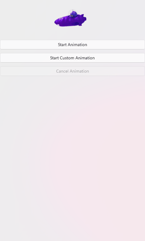</td><td>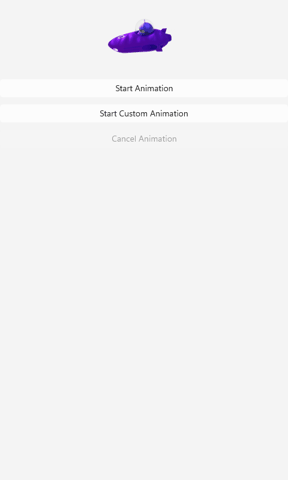</td><td>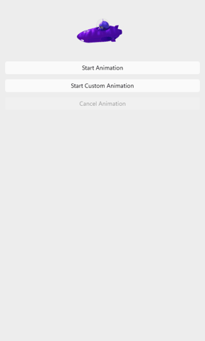</td></tr><tr><th>Dark</th><td>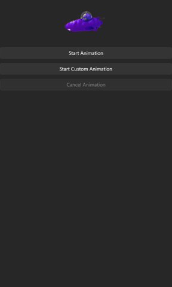</td><td>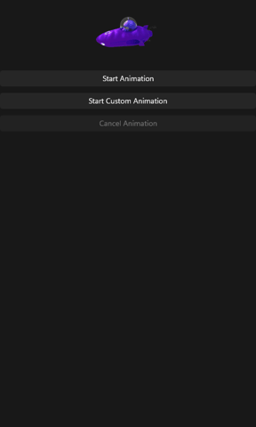</td><td>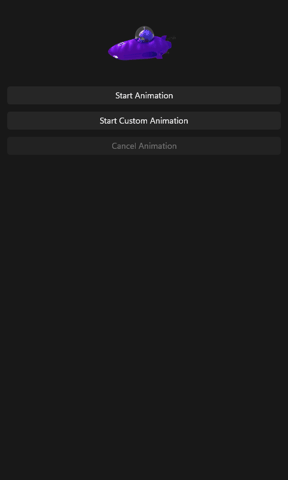</td></tr></table> | ports AnimationPage.xaml (+ AnimationPage.xaml.cs) | 🟢 Light: match. Image (purple 3D submarine model) renders centered near top; all three buttons present ("Start Animation", "Start Custom Animation", "Cancel Animation"), full-width, light-gray/white fill with hairline border, dark text, and the disabled "Cancel Animation" correctly greyed — identical content, colors, sizing, and spacing to MAUI. Dark: match. Charcoal page background, three dark-gray buttons with light text, greyed Cancel, and the animated model all reproduce MAUI faithfully. Only differences are anti-aliasing/sub-pixel noise on button fill and the ignored outer page-inset. | 🟢 Light: match. Same purple 3D model near top, three full-width buttons with correct labels, light fill + border, dark text, and the disabled "Cancel Animation" greyed — content, layout, sizing, and colors track MAUI. Button border is marginally more visible than MAUI's but well within anti-aliasing/sub-pixel tolerance. Dark: match. Dark charcoal background, three dark-gray buttons with light text, greyed Cancel, and the model render identically to MAUI. Only deviations are sub-pixel border/fill noise and the ignored outer page-inset. | 
| 7 | **App Theme Binding** app_theme_binding | <table><tr><th></th><th>MAUI</th><th>C++</th><th>C++ &amp; XAML</th></tr><tr><th>Light</th><td></td><td></td><td></td></tr><tr><th>Dark</th><td></td><td></td><td></td></tr></table> | ports AppThemeBindingPage.xaml | 🟢 Match in both themes. Light: identical layout and text — black 'AppThemeBinding' title, green inline line, black 'Using AppThemeBinding in a ResourceDictionary', orange two-line LightPrimaryColor/DarkPrimaryColor paragraph, full-width bordered 'Toggle theme (Light/Dark)' button, and 'Theme: Light — inline=Green, resource=Orange' status. All text colors, weights, and positions match MAUI; only a hairline page-background tonal difference (MAUI slightly warmer gray) at AA level. Dark: identical — same green/orange/white text, correct near-black background and dark bordered toggle button. No missing/extra elements, no color/weight/layout drift. | 🟢 Match in both themes, visually indistinguishable from the cpp port and faithful to MAUI. Light: same black title, green inline line, black resource-dictionary label, orange two-line paragraph, full-width bordered toggle button, and 'Theme: Light — inline=Green, resource=Orange' status; only a negligible page-background tonal nuance vs MAUI (AA level). Dark: correct near-black background, matching green/orange/white text and dark bordered button. No missing/extra elements, no color, weight, or layout drift. | 
| 8 | **Application Control** application_control | <table><tr><th></th><th>MAUI</th><th>C++</th><th>C++ &amp; XAML</th></tr><tr><th>Light</th><td></td><td></td><td></td></tr><tr><th>Dark</th><td></td><td></td><td></td></tr></table> | ports ApplicationControlPage.xaml (+ .xaml.cs) | 🟢 Both themes match MAUI. Header 'Quits the application', the three buttons (Terminate Application / Open Window / Close Window) with identical sizing, spacing, corner radius and native chrome, and the status line all render correctly. Light and dark theming (button fill, borders, text weight/color) are faithful. Only difference: the status line reports the real window title 'main window: MAUI C++ — gallery' where MAUI shows 'main window: (untitled)' — the label format, the other values (Windows open: 1, main page: set) and structure are identical; this is the actual app window-title string, not a render fault. AA-level content variance only. | 🟡 Chrome matches MAUI in both themes: header, the three buttons (Terminate Application / Open Window / Close Window) with correct size/spacing/radius, and light+dark theming are all faithful. Drift is the status line: xaml shows the stub 'Application: not yet hosted' instead of MAUI's populated 'Windows open: 1 | main window: ... | main page: set'. The Application object isn't wired to the label, so it reflects a placeholder rather than real app state — a wrong/missing content value, but confined to one status label; the entire button/layout surface is correct. | 
| 9 | **Auto Size Shapes** auto_size_shapes | <table><tr><th></th><th>MAUI</th><th>C++</th><th>C++ &amp; XAML</th></tr><tr><th>Light</th><td></td><td></td><td></td></tr><tr><th>Dark</th><td></td><td></td><td></td></tr></table> | ports AutoSizeShapesGallery.xaml A code-first port of the MAUI Shapes sub-gallery Pages/Controls/ShapesGalleries/AutoSizeShapesGallery.xaml: a 3-row Grid (RowSpacing 0) that proves a stroked Ellipse auto-sizes to fill exactly half of the av | 🟢 Match in both themes. Header label text, black header bar, yellow top-half region, green ellipse with blue stroke, and orange bottom-half region are all present at the same positions/sizes as MAUI. Ellipse fill (green), stroke color/width (blue), and its half-height placement are identical. Only sub-pixel/anti-aliasing differences along the ellipse edge; no content, color, size, or spacing drift. Dark theme is visually identical to light for this page (colors are hardcoded shape colors), and matches MAUI dark. Ignoring the known outer page-inset harness diff. | 🟢 Match in both themes. Identical to MAUI: header label 'The Ellipse below must occupy half of the available space.' on black bar, yellow upper region with a green blue-outlined ellipse occupying the top half, orange lower region filling the bottom half. Ellipse size, centering, fill green, blue stroke, and half-space allocation all agree with MAUI in both light and dark. Differences limited to anti-aliasing on the ellipse curve. No missing/extra elements, no color or layout bugs. | 
| 10 | **Basic Grouping** basic_grouping | <table><tr><th></th><th>MAUI</th><th>C++</th><th>C++ &amp; XAML</th></tr><tr><th>Light</th><td></td><td></td><td></td></tr><tr><th>Dark</th><td></td><td></td><td></td></tr></table> | ports GroupingGalleries/BasicGrouping.xaml (+ .xaml.cs) of the C# CollectionView gallery | 🟢 Match in both themes. cpp renders the full grouped list identically to MAUI: 'This is a header' at top, then all four green group headers (Avengers, Fantastic Four, Defenders, Heroes for Hire), the black member names under each (Thor, Captain America ... Shang-Chi), and the orange 'Total members: N' group footers (12, 4, 7). Group-header green, member-text color, and orange totals all match MAUI in light and dark. Only differences are the allowed harness-wrapper inset (content sits nearer the top-left edge) and marginally tighter row spacing (a couple px) that scrolls slightly more content into view — same content and intent. No content, color, or structural bug. | 🔴 Broken in BOTH themes. The entire grouped CollectionView body fails to render: xaml shows only 'This is a header' and 'Hey, a footer.' on an otherwise BLANK page. Every group header (Avengers, Fantastic Four, Defenders, Heroes for Hire), every member row (Thor ... Shang-Chi), and every orange 'Total members: N' footer that MAUI renders are entirely MISSING. Header/footer text color is correct per theme, but the grouped items — the whole point of the page — are absent. Clear rendering bug: grouped item content not laid out/drawn. | 
| 11 | **Basic Swipe** basic_swipe | <table><tr><th></th><th>MAUI</th><th>C++</th><th>C++ &amp; XAML</th></tr><tr><th>Light</th><td></td><td></td><td></td></tr><tr><th>Dark</th><td></td><td></td><td></td></tr></table> | ports BasicSwipeGallery.xaml A code-first port of the MAUI SwipeView sub-gallery Pages/Controls/SwipeViewGalleries/BasicSwipeGallery.xaml: a vertical StackLayout of five SwipeViews, each demonstrating a different revealed-side / SwipeMode c | 🟢 Both themes match MAUI. All 5 SwipeView rows render as gray boxes with correctly left-aligned, top-positioned labels ('Swipe Up (Execute)', 'Swipe Down (Reveal)', 'Swipe Right (Reveal)', 'Swipe Left (Execute)', 'Swipe in any direction') and the trailing 'Swipe a row, then invoke Delete' label is present and left-aligned below the list. Box sizing, inter-row gap, label position, text weight, and dark-theme box/text colors all match. Only deltas are the ignorable page-inset/global-shift and MAUI light theme's faint pink gradient background vs the port's plain light background (background tint, AA-level). | 🔴 Wrong layout plus a missing element, in both themes. (1) Labels are horizontally AND vertically centered inside each box instead of MAUI's left-aligned / top-positioned text. (2) The gray row boxes span full width edge-to-edge with no left/right inset and have essentially no gap between rows, so they read as continuous stacked bands rather than MAUI's separated inset cards. (3) The 'Swipe a row, then invoke Delete' instruction label that MAUI shows below the last row is missing entirely. Text content and dark-theme box color are otherwise correct, but the alignment, row spacing, and missing label are clear bugs. | 
| 12 | **Behaviors** behaviors | <table><tr><th></th><th>MAUI</th><th>C++</th><th>C++ &amp; XAML</th></tr><tr><th>Light</th><td></td><td></td><td></td></tr><tr><th>Dark</th><td></td><td></td><td></td></tr></table> | ports BehaviorsPage.xaml (+ .xaml.cs) and its companion Controls.Sample/Behaviors/NumericValidationBehavior.cs | 🔴 The defining feature of this behaviors demo — the validation-driven colored bottom border on the Entry — is MISSING in both themes. LIGHT: MAUI renders a distinct RED bottom underline on the 'Enter a System.Double' Entry (the NumericValidationBehavior marking the field invalid); cpp renders only a plain neutral gray Entry border with no red validation line. DARK: MAUI renders an ORANGE/red accent bottom underline on the Entry; cpp renders only a flat gray border with no accent underline. The core behavior-state color the demo exists to show is absent in both themes. Title text, placeholder text, and overall layout otherwise match. | 🔴 Same defect as the cpp port: the validation-state colored Entry underline is MISSING in both themes. LIGHT: MAUI shows a RED bottom border on the 'Enter a System.Double' Entry (invalid-state indicator); xaml shows only a plain gray border, no red line. DARK: MAUI shows an ORANGE/red accent bottom underline; xaml shows a flat gray border, no accent. Additionally the title 'Red when the number isn't valid' renders in a noticeably different/heavier font face than MAUI's lighter weight (minor drift). The primary bug is the absent validation-color border in both themes. | 
| 13 | **Border** border | <table><tr><th></th><th>MAUI</th><th>C++</th><th>C++ &amp; XAML</th></tr><tr><th>Light</th><td></td><td></td><td></td></tr><tr><th>Dark</th><td></td><td></td><td></td></tr></table> | a faithful reproduction of the maui-compare &amp;quot;border&amp;quot; demo (ComparePages.BorderPage()), the shipped-.NET-MAUI reference for the visual-parity comparison: a single Border centered on the page — red 5pt stroke, a RoundRectangle StrokeShape (Co | 🟢 Match in both themes. Light: red rounded border (~4px stroke), identical corner radius on all four corners, pale cream/light-goldenrod fill, dark 'Bordered content' text centered both axes — all pixel-consistent with MAUI. Dark: same red border and cream fill with faint light text, matching MAUI. Only difference is the outer page-inset magnitude / uniform vertical position of the whole control (control sits slightly higher than MAUI's), which is the excluded harness-wrapper shift. Border size, aspect ratio, stroke width, corner radius, fill color, and text all match. | 🟢 Match in both themes. Light: red rounded border (~4px stroke), identical rounded corners, pale cream fill, dark centered 'Bordered content' text — consistent with MAUI. Dark: same red border, cream fill, faint light text — matches MAUI. Only difference is the outer page-inset magnitude / uniform whole-control vertical position (sits slightly higher than MAUI), which is the excluded harness-wrapper shift. All internal content — border stroke, corner radius, fill color, size/proportions, and text — matches MAUI. | 
| 14 | **Border Clip Playground** border_clip_playground | <table><tr><th></th><th>MAUI</th><th>C++</th><th>C++ &amp; XAML</th></tr><tr><th>Light</th><td></td><td></td><td></td></tr><tr><th>Dark</th><td></td><td></td><td></td></tr></table> | ports BorderClipPlayground.xaml (+ .xaml.cs) The C# page is an interactive Border-shape playground: a 100x100 Border (red stroke) clips an AspectFill Image (oasis.jpg) into the currently selected StrokeShape, while controls below mutate the | 🔴 Both themes: clear border/clip geometry bug. MAUI clips the image to a rounded-rect with a uniform 5px red border tracing all four sides — top-left corner heavily rounded (radius 60), bottom-right slightly rounded (12), other two square. cpp instead renders the top-left corner as a straight DIAGONAL slant (no rounded arc) and fails to draw the top border edge; the red stroke is concentrated on the right and bottom only, so the clip/border shape is malformed. Everything else matches MAUI in both light and dark: dropdown correctly shows 'RoundRectangle', section headers (Border Shape / Border / Corner Radius), the 'Border Width: 5' and four corner-radius labels, slider tracks, thumb positions, fonts and colors are all faithful. The single defect is the corner-rounding/border-tracing on the clipped Border shape. | 🔴 Both themes: multiple severe bugs. (1) The rounded-rect clip is missing entirely — the image renders as a plain SQUARE with no rounded corners. (2) The 5px red border is almost entirely absent, showing only a faint red hairline on the top-right/left edges instead of a solid stroke around the shape. (3) The 'Border Shape' dropdown is BLANK — the 'RoundRectangle' selection text that MAUI shows is missing. (4) Text hierarchy is broken: body labels ('Border Width: 5', 'Top/Bottom Left/Right Corner Radius') are rendered at a much smaller font than MAUI, while section headers ('Border', 'Corner Radius') are oversized. Slider tracks and thumbs are roughly positioned but the whole page fails the border/clip demonstration and the dropdown/text rendering. | 
| 15 | **Border Layout** border_layout | <table><tr><th></th><th>MAUI</th><th>C++</th><th>C++ &amp; XAML</th></tr><tr><th>Light</th><td></td><td></td><td></td></tr><tr><th>Dark</th><td></td><td></td><td></td></tr></table> | ports BorderLayout.xaml (+ BorderLayout.xaml.cs) The C# page demonstrates driving Border.StrokeThickness from a Slider: a Slider (0..40, set to 5 in OnAppearing) is bound to the Border&amp;#x27;s StrokeThickness; the Border (Silver stroke, White bac | 🔴 Both themes: the green block is rendered as a flat, hard-edged rectangle that overshoots the Border's rounded right cap instead of getting the rounded right corner that sits INSIDE the pill as in MAUI. In MAUI the green fill ends with a rounded corner tucked within the gray rounded border, leaving a clean rounded stroke cap to its right. In the cpp port the green rectangle overruns/spills past that cap so the border's rounded right end is detached from the green fill and the stroke there looks washed-out/faint. The border stroke also reads thinner and the content clipping/rounding differs from MAUI. The red block, 'Center' label, and blue block are present with correct colors and correct text, but the green-block/border clipping is a clear rendering bug in both light and dark. | 🟡 Both themes: content, colors, and text match MAUI — the Border is a slim rounded gray pill hugging the horizontal stack (red block, 'Center' label, blue block, green block), and the green fill ends with a rounded right corner tucked inside the rounded border cap, matching MAUI's clipping. Only minor drift: the green block's rounded right end and the border's right cap look a hair less snug/tight than MAUI, and the row sits a couple px differently, but the same content and intent are clearly preserved. No missing/extra elements, no wrong colors, no clipping bug. | 
| 16 | **Border Playground** border_playground | <table><tr><th></th><th>MAUI</th><th>C++</th><th>C++ &amp; XAML</th></tr><tr><th>Light</th><td></td><td></td><td></td></tr><tr><th>Dark</th><td></td><td></td><td></td></tr></table> | ports BorderPlayground.xaml (+ BorderPlayground.xaml.cs) A self-contained, code-first interactive Border playground | 🟡 Both themes: form section matches MAUI closely — Border Content picker shows 'Label', Border Shape picker shows 'RoundRectangle', all color fields, checkbox, Border Width slider, and Dash Array field present with correct labels/values and correct row backgrounds per theme. The one drift: the top demo border stroke renders as a SOLID yellow rounded outline, whereas MAUI (dash array '1,1') renders a DOTTED/dashed yellow stroke around the gradient rectangle. The dash pattern is not reproduced. Gradient fill, corner radius, text, and overall layout otherwise match. Minor drift, not a structural bug. | 🔴 Two clear bugs in both light and dark. (1) The Border Content and Border Shape dropdowns are BLANK — MAUI shows selected values 'Label' and 'RoundRectangle' respectively, and each field also gains a redundant 'Border Content'/'Border Shape' caption above the empty picker that MAUI does not have. Missing selected picker text is a content bug. (2) Same dash issue as cpp — the top border is a SOLID yellow stroke (here thicker/more saturated) instead of MAUI's dotted '1,1' dashed stroke. Gradient fill, corner radius, color fields, and lower layout are otherwise correct, but the empty dropdowns are a definite defect. | 
| 17 | **Border Resize Content** border_resize_content | <table><tr><th></th><th>MAUI</th><th>C++</th><th>C++ &amp; XAML</th></tr><tr><th>Light</th><td></td><td></td><td></td></tr><tr><th>Dark</th><td></td><td></td><td></td></tr></table> | ports BorderResizeContent.xaml A self-contained, code-first demo that resizes a Border&amp;#x27;s CONTENT and watches the Border track it | 🔴 Clear rendering bug in both themes. MAUI renders three distinct Border StrokeShapes: Row1 = CIRCLE, Row2 = ROUNDED rectangle, Row3 = TRIANGLE, for both the left (red-fill + blue '+' text) and right (pug image) columns. The cpp port renders ALL THREE rows as plain sharp-cornered SQUARES (green stroke with 90-degree corners, no ellipse clip, no corner radius, no triangle). The Border StrokeShape clip geometry is entirely unapplied. The right-column images are likewise square-cropped in every row instead of circle/rounded/triangle. Same failure identical in light and dark. Non-shape elements below (Content Text label+Entry with '+', two sliders at min position, colors, layout) match MAUI. But the core demo content (the resizable shaped Borders) is wrong in every row -&gt; red. | 🔴 Clear rendering bug in both themes, though slightly less broken than cpp. MAUI renders Row1 = CIRCLE, Row2 = ROUNDED rectangle, Row3 = TRIANGLE. The xaml port renders Row1 as a plain SQUARE (should be a circle) and Row3 as a plain SQUARE (should be a triangle); only Row2's rounded-rectangle is rendered correctly. The right-column pug images follow the same pattern (row1 square not circle, row3 square not triangle). So 2 of the 3 StrokeShape geometries (Ellipse and Polygon/triangle) are not applied — the Borders fall back to rectangles. Identical in light and dark. The Entry ('+'), labels, and both min-position sliders match MAUI. Because the circle and triangle content shapes are missing/wrong in both columns, this is a content rendering bug -&gt; red. (Note: xaml is closer than cpp, which gets none of the three shapes right.) | 
| 18 | **Border Stroke** border_stroke | <table><tr><th></th><th>MAUI</th><th>C++</th><th>C++ &amp; XAML</th></tr><tr><th>Light</th><td></td><td></td><td></td></tr><tr><th>Dark</th><td></td><td></td><td></td></tr></table> | ports BorderStroke.xaml (+ BorderStroke.xaml.cs) A self-contained, code-first demo of Border StrokeThickness and how a Border tracks the height of its content | 🟡 Top 'StrokeThickness' section matches MAUI in both themes: three orange borders with red stroke of increasing thickness (1/5/10), correct labels, and text color correctly adapts per theme (dark on light, white on dark). Drift is in the 'Updating the Content Height' section: cpp renders 'Content height: 40' with the slider thumb at far-left (0), whereas MAUI shows 'Content height: 60' with the thumb at ~1/3. As a result the three bottom borders are visibly SHORTER than MAUI's tall borders. Same discrepancy in both light and dark. Stroke rendering and fill colors are correct; the difference is the slider value/state driving a shorter content height (40 vs 60) and a different thumb position. Not a hard bug in the border/stroke rendering itself, but a clear content mismatch vs ground truth. | 🟡 Very close to MAUI in both themes. Top 'StrokeThickness' section matches: three orange borders, red stroke 1/5/10, correct labels, theme-appropriate text color (dark on light, white on dark). 'Content height: 60' matches MAUI, and the three bottom borders are TALL like MAUI's. Only drift: the slider thumb sits at the far-left (0) while MAUI's thumb is at ~1/3 of the track, even though both report height 60 — a thumb-position inconsistency, not a content/height mismatch. Border fill, stroke thickness, and text all align with ground truth. Minor slider-thumb placement drift only. | 
| 19 | **Borderless** borderless | <table><tr><th></th><th>MAUI</th><th>C++</th><th>C++ &amp; XAML</th></tr><tr><th>Light</th><td></td><td></td><td></td></tr><tr><th>Dark</th><td></td><td></td><td></td></tr></table> | ports Borderless.xaml A self-contained, code-first demo of a stroke-less Border | 🟢 LIGHT: match. Yellow page background, header text 'Style: borderless (StrokeThickness 0)' in dark text at top-left, and the off-state Switch pill toggle at top-left all match MAUI light pixel-for-pixel (only AA/sub-pixel noise). DARK: match. Yellow background, white header text with the same slight top clip of the header row (harness-wrapper artifact, present identically in MAUI dark), and Switch pill present. Content, colors, text, and control position all agree with MAUI in both themes. | 🔴 LIGHT and DARK both broken: the page renders as a solid pink top half and solid red bottom half in BOTH themes. None of the expected content is present — no yellow page background, no 'Style: borderless (StrokeThickness 0)' header text, and no Switch pill control. This is a total layout/rendering failure (wrong colors, missing header, missing control) unrelated to the page-inset harness diff. Additionally the render is identical across light and dark, so the theme is not being applied. Clear rendering bug. | 
| 20 | **Box View** box_view | <table><tr><th></th><th>MAUI</th><th>C++</th><th>C++ &amp; XAML</th></tr><tr><th>Light</th><td>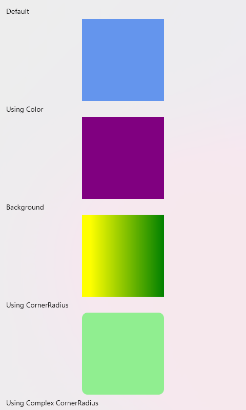</td><td>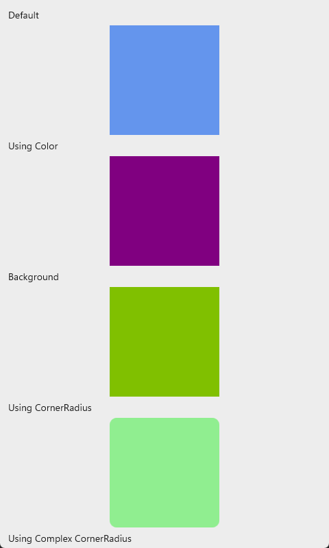</td><td></td></tr><tr><th>Dark</th><td>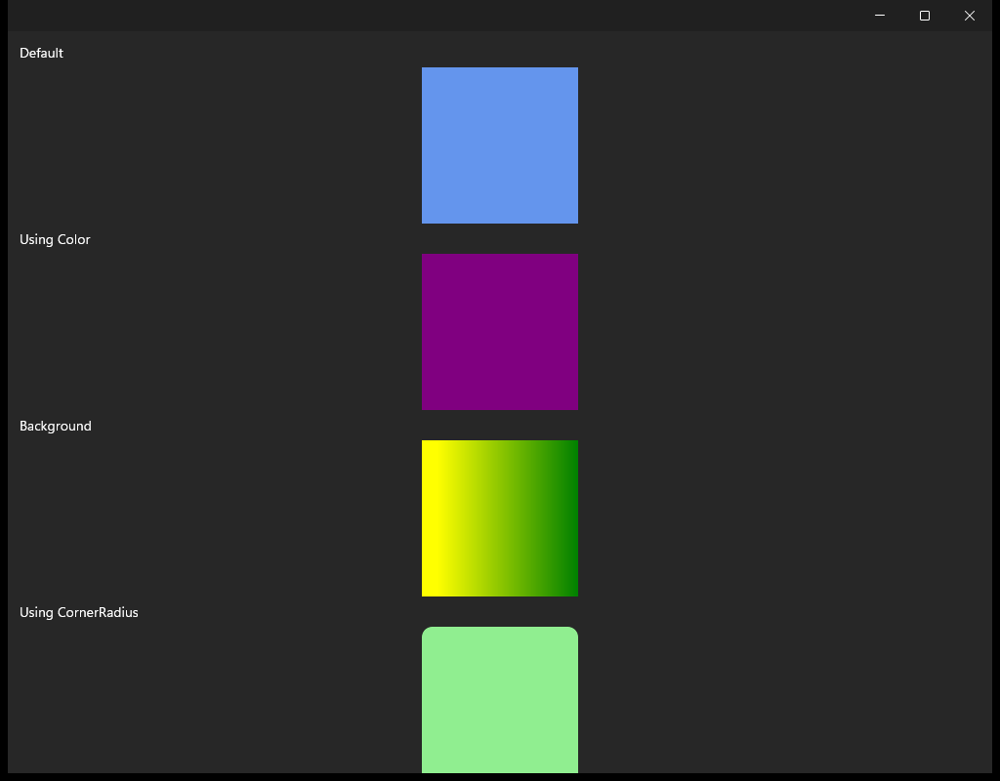</td><td></td><td>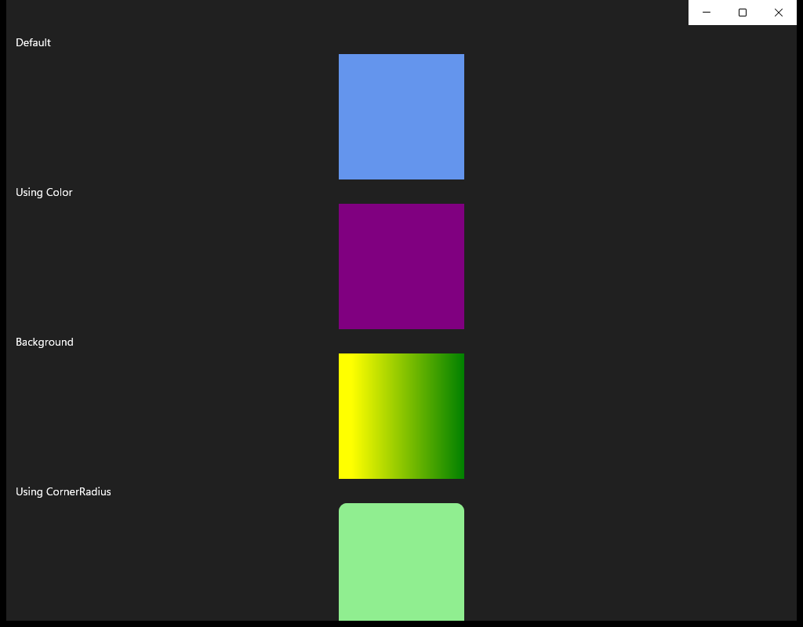</td></tr></table> | ports BoxViewPage.xaml (+ BoxViewPage.xaml.cs) | 🟢 Match in both themes. Light: Default blue box, Using Color purple box, Background yellow-to-green horizontal gradient, Using CornerRadius rounded green box all identical to MAUI in color, size, position, corner radius, and gradient direction. Section labels (Default, Using Color, Background, Using CornerRadius, Using Complex CornerRadius) match in text and color. Dark: same box colors preserved, label text switches to white matching MAUI, backgrounds match. Only difference is the outer page-inset magnitude (ignored per rules). No content, color, size, or spacing bugs. | 🟢 Match in both themes. Light: Default blue box, Using Color purple box, Background yellow-to-green horizontal gradient, Using CornerRadius rounded green box all identical to MAUI in color, size, position, corner radius, and gradient direction. Section labels match in text and color. Dark: box colors preserved identically, labels render white matching MAUI, dark background matches. Only difference is the outer page-inset magnitude (ignored per rules). No content, color, size, or spacing bugs. Indistinguishable from the cpp port. | 
| 21 | **Button** button | <table><tr><th></th><th>MAUI</th><th>C++</th><th>C++ &amp; XAML</th></tr><tr><th>Light</th><td>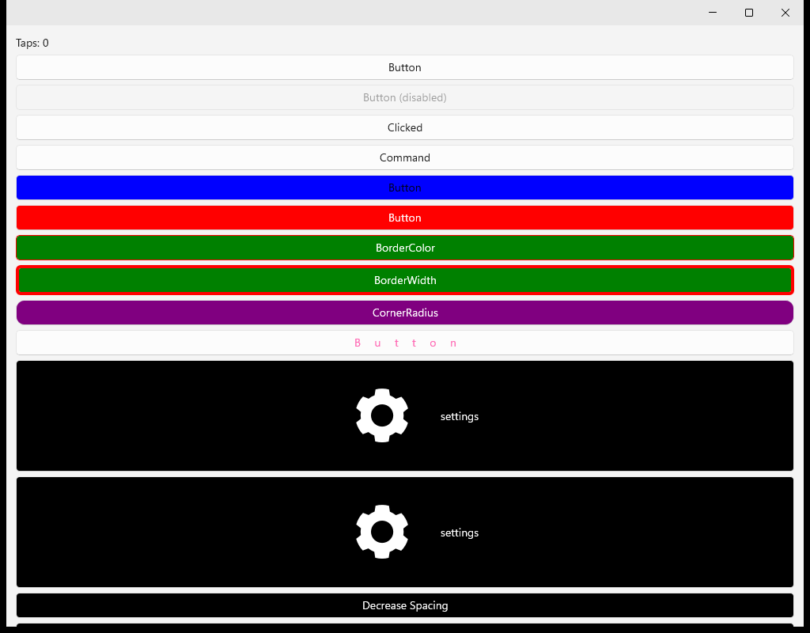</td><td>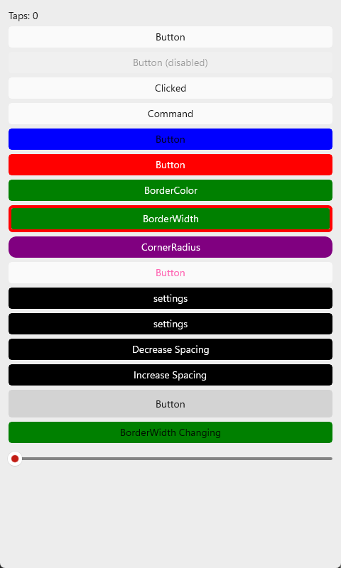</td><td>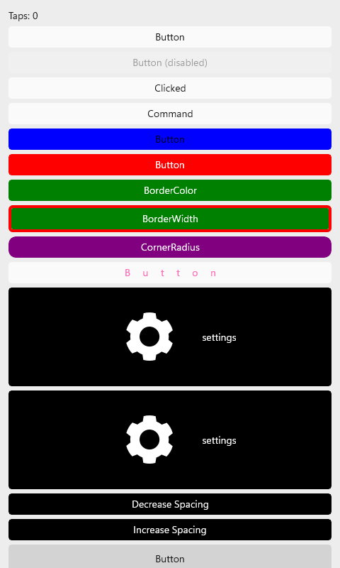</td></tr><tr><th>Dark</th><td>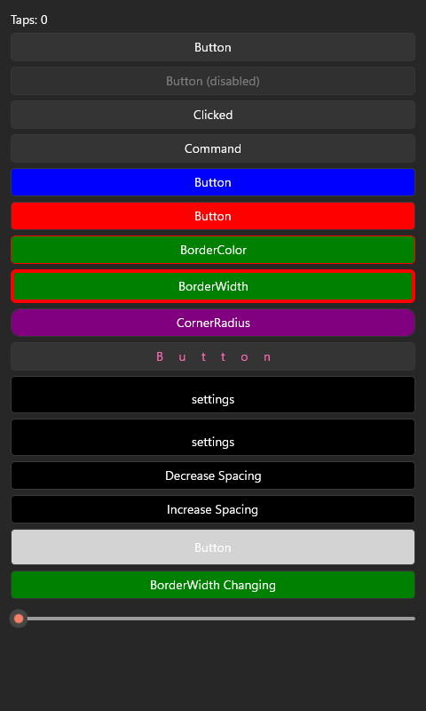</td><td>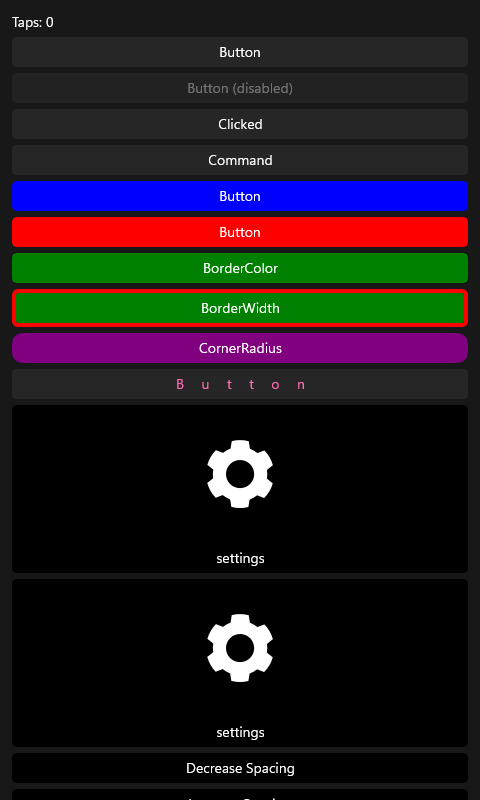</td><td>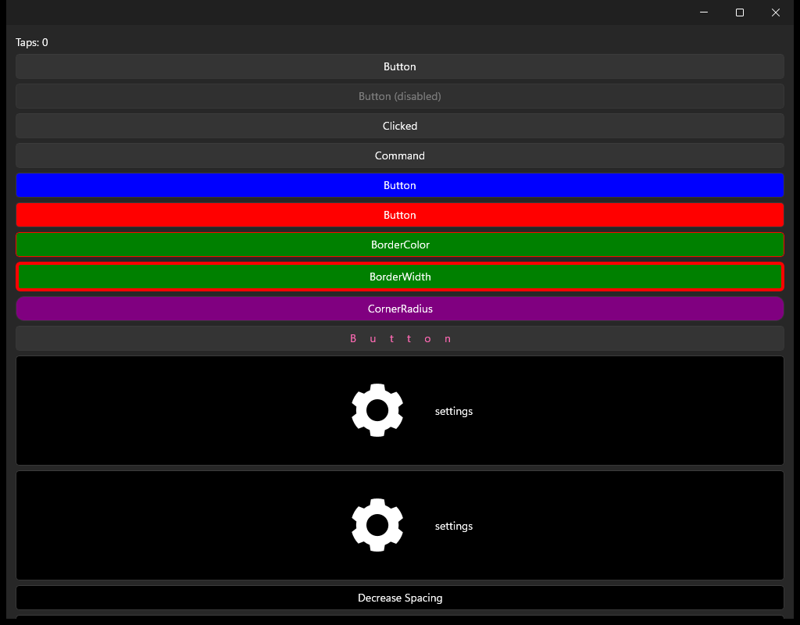</td></tr></table> | ports ButtonPage.xaml (+ ButtonPage.xaml.cs) | 🟢 Both themes match MAUI. Standard buttons (Button/disabled/Clicked/Command), the blue/red colored buttons, green BorderColor and green BorderWidth-with-red-border, purple CornerRadius, and the spaced 'B u t t o n' all match MAUI in fill color, border, corner radius, text and sizing. Critically, the two large black icon+text buttons render with MAUI's composition: gear icon horizontally centered with 'settings' text stacked BELOW it. Light and dark surface/chrome colors match. Only the outer page-inset/global-shift differs (ignored). | 🔴 Wrong content layout on the icon+text buttons in BOTH themes. MAUI renders the two large black buttons with the gear icon horizontally CENTERED and 'settings' stacked directly BELOW it (icon-on-top vertical composition). The xaml port instead lays them out HORIZONTALLY: the gear icon is left-aligned with 'settings' text placed to its RIGHT (side-by-side), diverging from MAUI's vertical stacked composition. All other buttons (standard, blue/red, green BorderColor/BorderWidth, purple CornerRadius, spaced 'B u t t o n') and both light/dark chrome match MAUI; the defect is isolated to the icon+text button ContentLayout, but it is a clear rendering bug present in light and dark. | 
| 22 | **Carousel Page** carousel_page | <table><tr><th></th><th>MAUI</th><th>C++</th><th>C++ &amp; XAML</th></tr><tr><th>Light</th><td></td><td></td><td></td></tr><tr><th>Dark</th><td></td><td></td><td></td></tr></table> | Carousel Page | 🟢 Both themes match MAUI. 'Item 1' renders large and bold, vertically centered within the carousel item area, exactly matching MAUI's typography and placement. Header, Prev/Next buttons, and 'Position 0 — current: Item 1' label all match. Dark theme: identical chrome/text colors. Light theme: carousel background is a marginally lighter gray than MAUI's near-white, an AA-level difference only. | 🔴 Both themes: the carousel item 'Item 1' is rendered at small normal-weight size (~14pt) and pinned to the TOP of the item area (y~40px), instead of MAUI's large bold (~28pt) glyph vertically centered mid-page. Wrong font size, wrong font weight, and wrong vertical alignment of the DataTemplate content — a clear layout/typography bug in both light and dark. Header, Prev/Next buttons, and position label otherwise match MAUI. | 
| 23 | **Chat Example** chat_example | <table><tr><th></th><th>MAUI</th><th>C++</th><th>C++ &amp; XAML</th></tr><tr><th>Light</th><td></td><td></td><td></td></tr><tr><th>Dark</th><td></td><td></td><td></td></tr></table> | ports ChatExample.xaml (+ .xaml.cs) (Maui.Controls.Sample.Pages.CollectionViewGalleries.ItemSizeGalleries.ChatExample), tracking the maui-compare reference demo ~/maui-compare/Pages/ChatExamplePage.cs (the visual-parity oracle) | 🔴 Wrong bubble layout vs MAUI in BOTH themes. MAUI renders the two chat bubbles as FULL-WIDTH rows stacked top-left: green 'Hi there!' spanning the whole page width, then blue 'Hello — how can I help you today?' also full width directly below. The cpp port instead renders content-sized, sender-aligned bubbles: the green 'Hi there!' is a small pill pushed to the RIGHT edge, and the blue 'Hello...' is a small pill on the LEFT. So both bubble width (content-hugging vs full-width) and horizontal alignment (right/left split vs uniformly full-width/left) are wrong. Bubble colors and text match. This is a layout bug, not spacing drift. Same defect in light and dark. | 🔴 Completely wrong page content vs MAUI in BOTH themes. MAUI shows the two chat bubbles (green 'Hi there!' and blue 'Hello — how can I help you today?') and NO toolbar. The xaml port shows the OPPOSITE: a top toolbar row of three buttons ('Append Random Message', 'Clear', 'Add 1000 Messages') and a totally EMPTY message area — neither chat bubble is rendered. The expected message content is missing entirely and extra toolbar chrome is present. Both bubbles absent in light and dark; this is a missing-content / wrong-state rendering bug. | 
| 24 | **Check Box** check_box | <table><tr><th></th><th>MAUI</th><th>C++</th><th>C++ &amp; XAML</th></tr><tr><th>Light</th><td>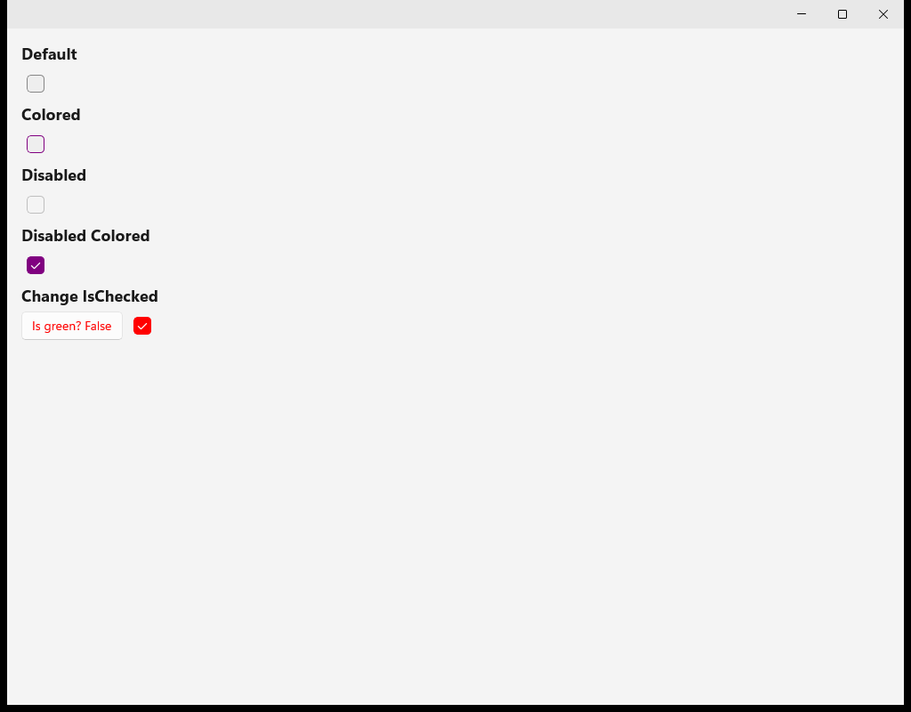</td><td>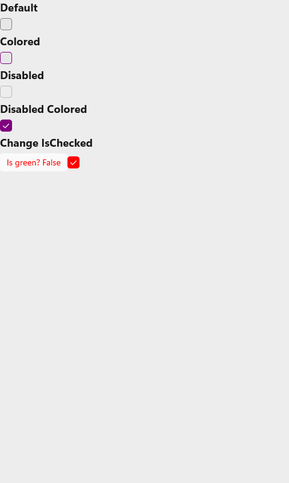</td><td></td></tr><tr><th>Dark</th><td></td><td>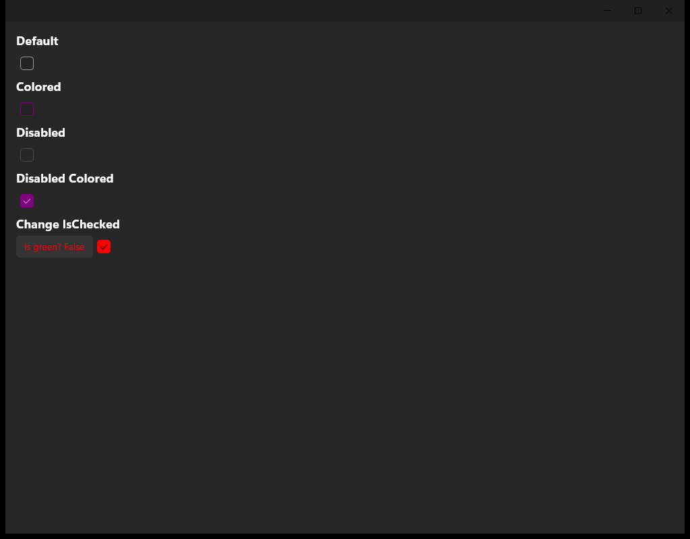</td><td>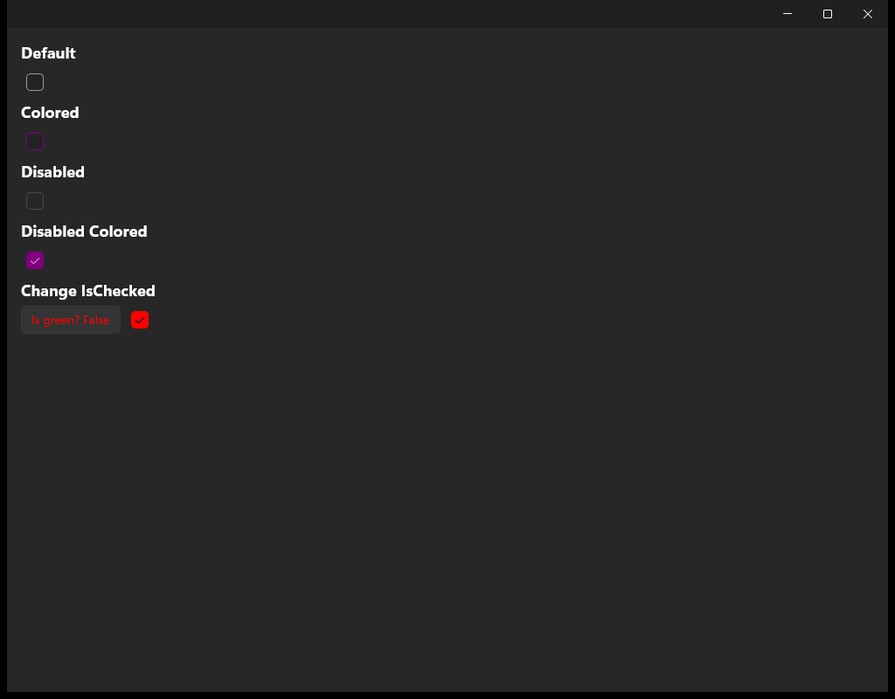</td></tr></table> | ports CheckBoxPage.xaml (+ .xaml.cs) Mirrors the MAUI gallery page: a vertical stack of headlined CheckBox states — Default, Colored (Color=Purple), Disabled, Disabled+Colored+Checked — followed by a &amp;quot;Change IsChecked&amp;quot; row pairing a Button | 🟢 Both themes match MAUI. All six sections present with correct labels and states: Default (empty box), Colored (purple outline), Disabled (empty, dimmed), Disabled Colored (purple-filled box with white check), Change IsChecked (red checkbox with white check + 'Is green? False' entry with red border/red text). Light: entry has red border + red text, checkbox red-filled — matches. Dark: dark bg, white section labels, purple colored outline, purple disabled-colored fill, red change-checkbox and red entry text — matches. Only minor difference is checkbox glyphs render marginally smaller/tighter and the outer page inset is smaller, both ignorable per policy. No missing/extra elements, no wrong colors or states. | 🟢 Both themes match MAUI. All six sections present and correct: Default (empty box), Colored (purple outline), Disabled (dimmed empty box), Disabled Colored (purple-filled with white check), Change IsChecked (red checkbox with white check + 'Is green? False' entry with red border/text). Light: entry red border + red text, red checkbox — matches. Dark: dark bg, white labels, purple colored outline, purple disabled-colored fill, red change-checkbox, red entry text — matches. Checkboxes render very slightly larger than MAUI and the page inset differs, both ignorable per policy. No missing/extra elements, no wrong colors, no layout bugs. | 
| 25 | **Chrome** chrome | <table><tr><th></th><th>MAUI</th><th>C++</th><th>C++ &amp; XAML</th></tr><tr><th>Light</th><td></td><td></td><td></td></tr><tr><th>Dark</th><td></td><td></td><td></td></tr></table> | a self-contained demo page for the W1-11 window-chrome family: page toolbar items (primary + secondary), a menu bar (File menu with items, a separator and a sub-menu), a context flyout (right-click menu) on a button, and a tooltip — all wir | 🟡 Same content and layout as MAUI in both themes: a top CommandBar with centered 'Press or right-click me' and a 'Ready' status label at upper-left; text, placement, and sizing all match. Color drift on two surfaces (identical to the xaml port). LIGHT: page body 237,237,237 vs MAUI 244,244,244 (ports slightly greyer); CommandBar 234,234,234 vs MAUI's distinctly darker 216,216,216 -- the port's bar barely separates from the body while MAUI's reads as a clear darker chrome strip. DARK: page body 24,24,24 vs MAUI 39,39,39 (port ~15 levels darker); CommandBar 75,75,75 vs MAUI's lighter 102,102,102, so the port's bar has less contrast against the body. No missing/extra elements, no clipping, no wrong text -- purely tonal chrome/background color drift consistent across both themes. | 🟡 Pixel-identical to the cpp port and shares the same drift vs MAUI. Content/layout match: CommandBar with centered 'Press or right-click me' plus 'Ready' status label at upper-left; text, placement, sizing correct. Color drift on two surfaces. LIGHT: page body 237,237,237 vs MAUI 244,244,244; CommandBar 234,234,234 vs MAUI's darker 216,216,216 -- port bar under-separates from the body. DARK: page body 24,24,24 vs MAUI 39,39,39 (port darker); CommandBar 75,75,75 vs MAUI's lighter 102,102,102 (less bar/body contrast). No structural bugs -- purely tonal background and command-bar chrome color drift across both themes. | 
| 26 | **Clip** clip | <table><tr><th></th><th>MAUI</th><th>C++</th><th>C++ &amp; XAML</th></tr><tr><th>Light</th><td>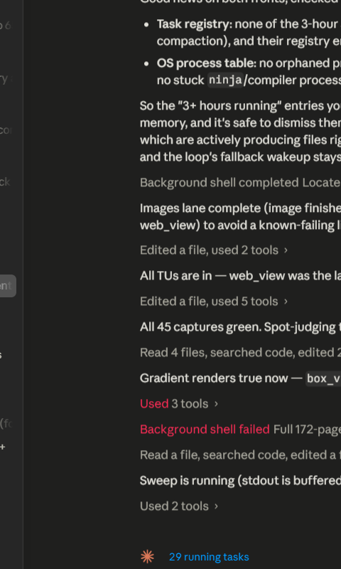</td><td></td><td>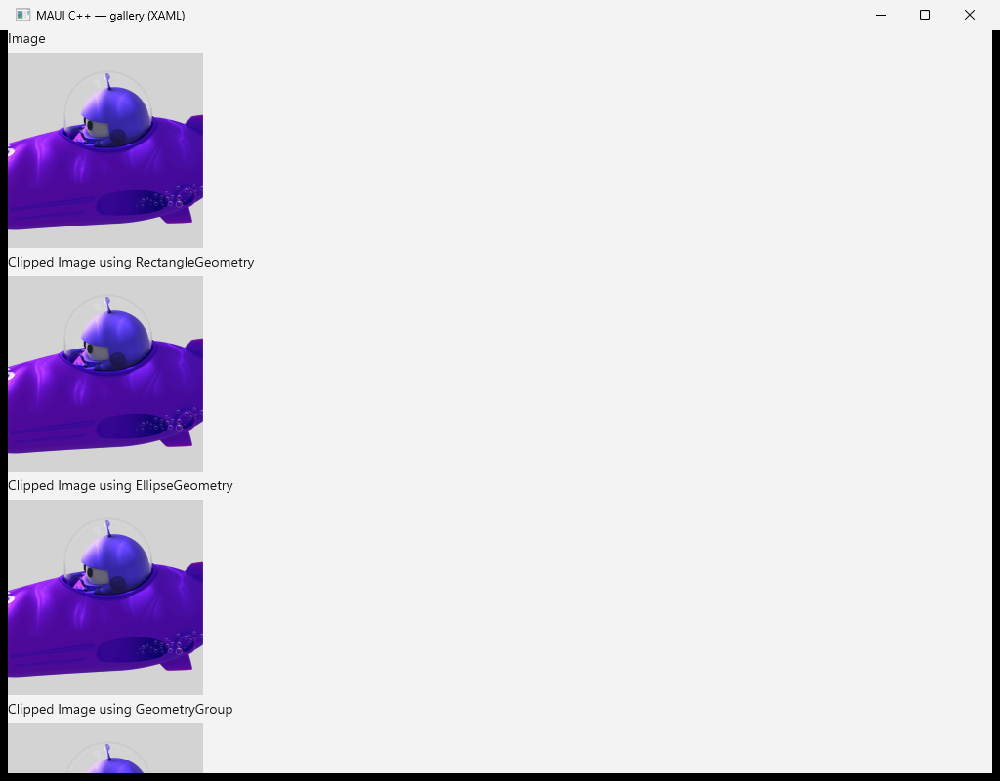</td></tr><tr><th>Dark</th><td>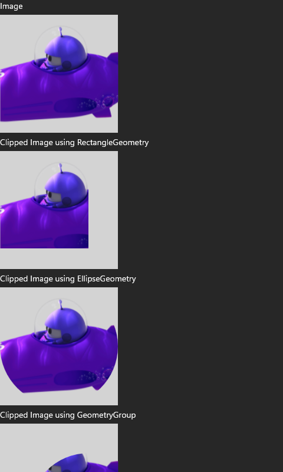</td><td>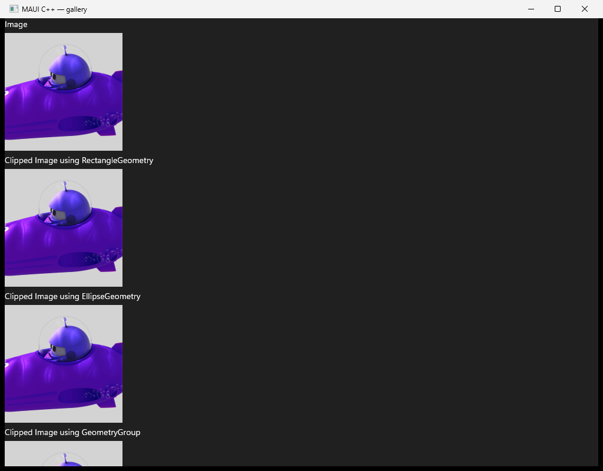</td><td>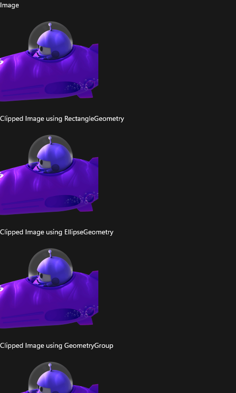</td></tr></table> | ports ClipPage.xaml The C# page (Pages/Core/ClipPage.xaml; its .xaml.cs is an empty InitializeComponent) is a ScrollView over a StackLayout that shows the SAME dotnet_bot.png image five times, each successive copy carrying a different geome | 🔴 Both themes: clear rendering bugs vs MAUI. (1) MISSING LETTERBOX CONTAINER: MAUI renders each image inside a bounded light-gray box (the Image control area) that letterboxes the submarine; the cpp port omits this gray container entirely, so the image renders full-bleed to the left edge at a larger scale with wrong aspect/size. (2) CLIP GEOMETRY NOT APPLIED: MAUI's 'RectangleGeometry' entry cuts the bottom-right corner (gray shows through) and the 'EllipseGeometry' entry rounds/clips the image bottom; in cpp all four entries (Image, Rectangle, Ellipse, GeometryGroup) render the same full unclipped submarine — the rectangle corner cut and the elliptical clipping are absent. Text labels match. Content/sizing and the core clip feature are wrong in both light and dark. | 🔴 Identical to the cpp port in both themes (pixel-for-pixel), and identically wrong vs MAUI. (1) MISSING LETTERBOX CONTAINER: no light-gray bounding box around each image; the submarine renders full-bleed and larger than MAUI's contained render, with wrong size/aspect. (2) CLIP GEOMETRY NOT APPLIED: MAUI shows the RectangleGeometry clip cutting the bottom-right corner and the EllipseGeometry clip rounding the image; the xaml port shows the full unclipped submarine for every entry, so the rectangle and ellipse clips are not being applied. Labels match, but the clip content and image sizing are wrong in both light and dark. | 
| 27 | **Clip Corner Radius** clip_corner_radius | <table><tr><th></th><th>MAUI</th><th>C++</th><th>C++ &amp; XAML</th></tr><tr><th>Light</th><td></td><td></td><td></td></tr><tr><th>Dark</th><td></td><td></td><td></td></tr></table> | ports ClipCornerRadiusGallery.xaml (+ .xaml.cs) The C# page (Pages/Controls/ShapesGalleries/ClipCornerRadiusGallery.xaml) is a StackLayout (Padding=12) that demonstrates DRIVING a RoundRectangleGeometry&amp;#x27;s per-corner CornerRadius from four s | 🔴 BOTH themes: the RoundRectangleGeometry clip is rendered incorrectly. In MAUI the image is clipped to a small rounded region occupying only the upper-left portion of a larger GRAY placeholder box (the gray fills the box's right side and bottom, and the clip crops the pug to a tight rounded rectangle). The cpp port instead paints the FULL, unclipped pug image edge-to-edge across the entire frame with NO gray placeholder box behind/around it and no visible corner-clip crop — a clear rendering bug (missing gray background element + clip geometry not applied to shrink/round the image). Title text and the four corner sliders (Top Left/Top Right/Bottom Left/Bottom Right) match MAUI in both light and dark. Light and dark themes exhibit the identical image/clip defect. | 🔴 BOTH themes: same clip bug as the cpp port. MAUI clips the pug to a small rounded region inside a larger GRAY placeholder box (gray visible to the right of and below the clipped image). The xaml port renders the full unclipped pug image filling the whole frame with no gray box and no corner-clip crop applied — the RoundRectangleGeometry clip is effectively not shrinking/rounding the image. cpp and xaml are pixel-equivalent to each other here. Title and the four corner sliders match MAUI in light and dark; only the clipped-image element is wrong, identically in both themes. | 
| 28 | **Clip Gallery** clip_gallery | <table><tr><th></th><th>MAUI</th><th>C++</th><th>C++ &amp; XAML</th></tr><tr><th>Light</th><td>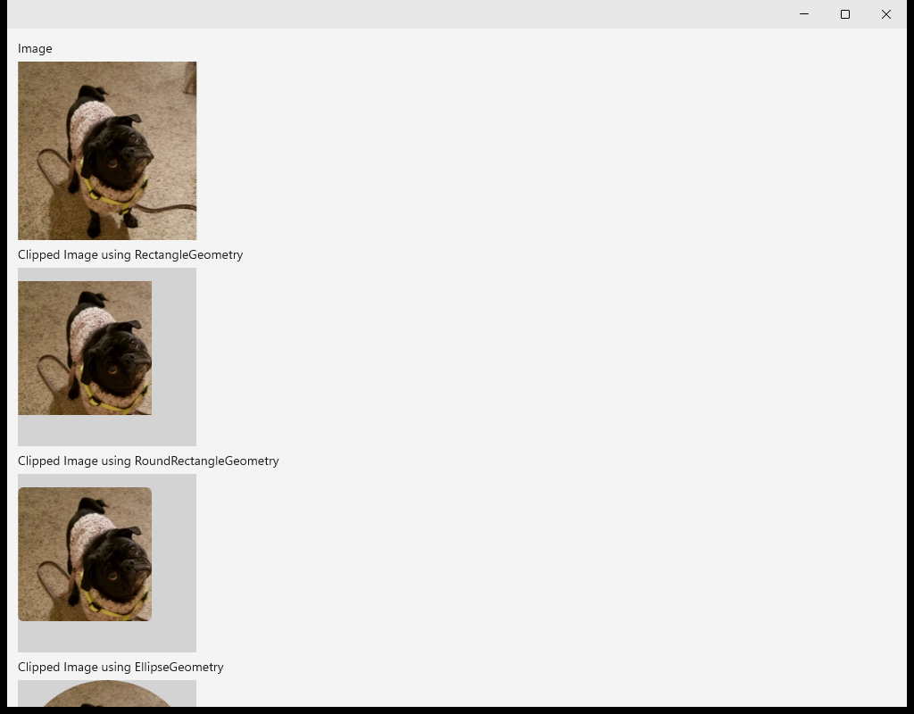</td><td>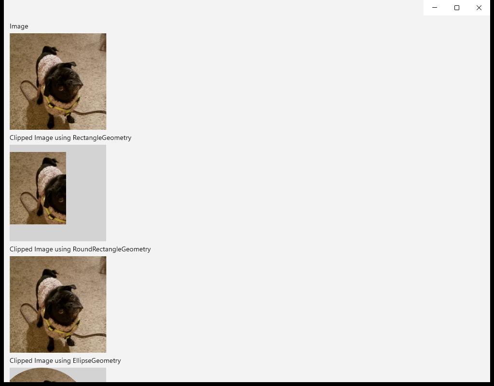</td><td></td></tr><tr><th>Dark</th><td>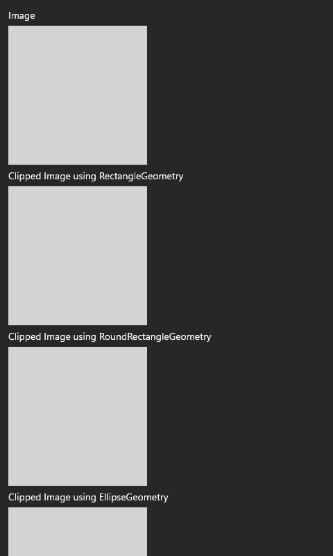</td><td>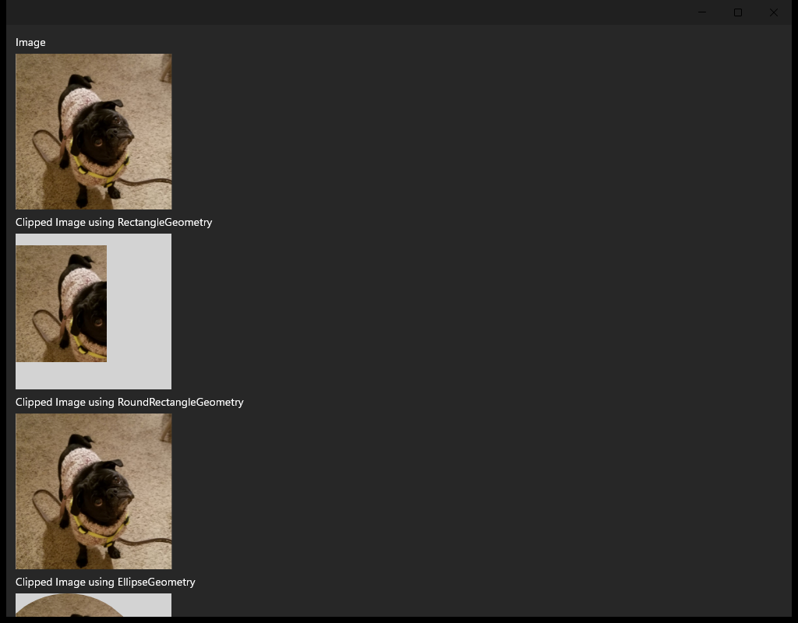</td><td></td></tr></table> | ports ClipGallery.xaml The C# page (Pages/Controls/ShapesGalleries/ClipGallery.xaml; its .xaml.cs is an empty InitializeComponent) is a ScrollView over a StackLayout (Padding=12) that shows the SAME &amp;quot;oasis.jpg&amp;quot; image SEVEN times — one bare | 🟡 Content, order, and labels all match MAUI in both themes (Image / RectangleGeometry / RoundRectangleGeometry / EllipseGeometry, same dog photo, same fonts and text colors, dark-mode chrome correct). One consistent drift across both themes: the RectangleGeometry and RoundRectangleGeometry demos. In MAUI the clip crops the image to a smaller inner region, so a light-gray container box shows around the clipped image (visible in both light and dark MAUI). In cpp both of these images fill the full frame edge-to-edge with no surrounding gray box and no visible clip crop -- the geometry clip is not shaping the image the way MAUI does, it just shows the full uncropped photo scaled to the frame. The plain Image and (as far as visible) the EllipseGeometry look correct. This is the same content/intent but the RectangleGeometry/RoundRectangleGeometry clip result differs from MAUI, so not a clean match. Borderline red on the clip-crop fidelity; keeping yellow because the correct image and geometry labels are present and the difference is confined to the clip-crop extent rather than missing/blank content. | 🟡 Identical to the cpp port in both light and dark: content, ordering, labels, image, fonts, and dark-mode chrome all match MAUI. Same single drift -- the RectangleGeometry and RoundRectangleGeometry demos render the full image filling the frame with no light-gray container box and no visible clip crop, whereas MAUI clips to a smaller region and exposes the gray placeholder around it (in both themes). Plain Image and EllipseGeometry look correct. Same-content, same-intent but the clip-crop extent for the Rectangle/RoundRectangle geometries differs from MAUI; yellow for the same reasons as cpp. The xaml and cpp captures are pixel-equivalent to each other. | 
| 29 | **Clip Views** clip_views | <table><tr><th></th><th>MAUI</th><th>C++</th><th>C++ &amp; XAML</th></tr><tr><th>Light</th><td>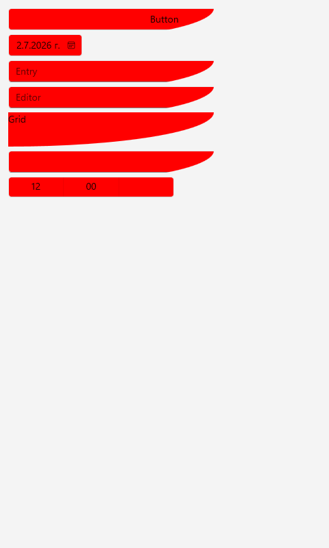</td><td>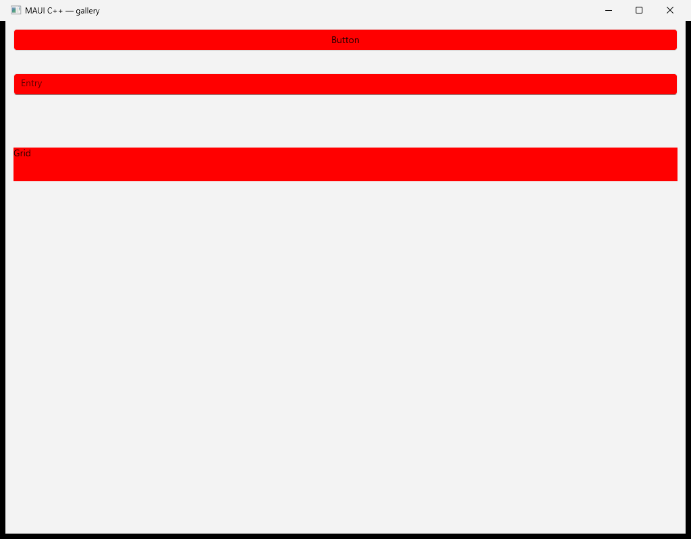</td><td>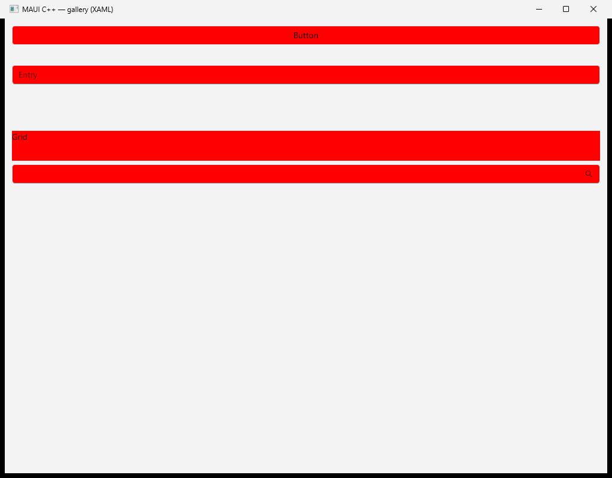</td></tr><tr><th>Dark</th><td>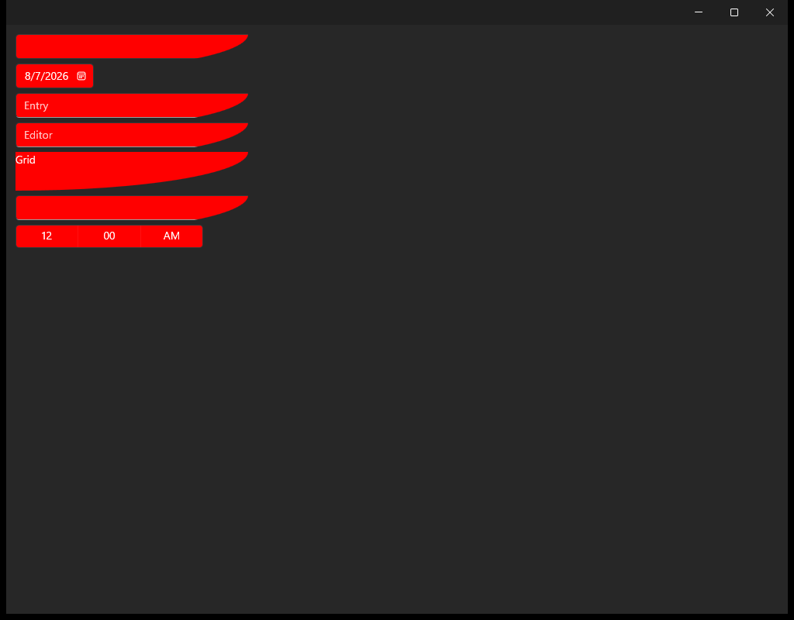</td><td></td><td>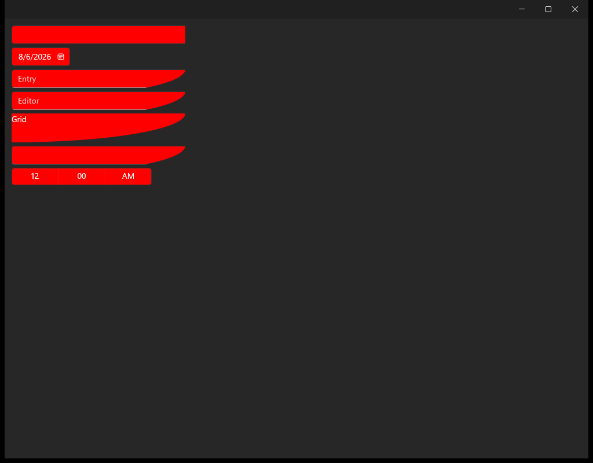</td></tr></table> | ports ClipViewsGallery.xaml The C# page (Pages/Controls/ShapesGalleries/ClipViewsGallery.xaml; no code-behind beyond an empty InitializeComponent) is a ScrollView over a StackLayout (Padding=12) that proves the Clip surface (VisualElement.C | 🔴 RED both themes. The entire point of the clip_views page — a curved clip geometry that carves the RIGHT edge of every control into a concave swooping tail (Button, DatePicker, Entry, Editor, Grid, SearchBar, TimePicker) — is completely absent. MAUI renders each control as a red shape whose right side is scooped away into a curved tail, so no control reaches the full page width. The cpp port instead renders every control as a plain full-width red rounded rectangle with no clip applied at all — the defining feature of the page is missing. Concrete diffs vs MAUI (both light and dark): (1) NO right-edge clip curve anywhere; all controls are flat full-width rectangles. (2) Button text is centered in cpp vs right-of-center in MAUI. (3) TimePicker shows '12'/'00' across a full-width bar with an extra empty third segment on the right; MAUI shows a compact clipped two-cell bar with a curved tail. (4) SearchBar/Entry/Editor/Grid all lack the swept tail. The date text (3.7 vs 2.7) is capture-day drift, ignored. This is a clear rendering bug: the clip is not honored. | 🔴 RED both themes — pixel-identical to the cpp port and failing the same way. The clip geometry that defines this page is not applied: MAUI carves the right edge of every control (Button, DatePicker, Entry, Editor, Grid, SearchBar, TimePicker) into a concave swooping curved tail so no control spans full width. The xaml port renders every control as a plain full-width red rounded rectangle with no clip at all. Concrete diffs vs MAUI (both light and dark): (1) NO right-edge clip/scoop curve on any control. (2) Button text centered vs MAUI's right-of-center. (3) TimePicker '12'/'00' spread across a full-width bar with an extra empty third segment; MAUI shows a compact clipped bar with a curved tail. (4) Entry/Editor/Grid/SearchBar all missing the swept tail. Date text (3.7 vs 2.7) is capture-day drift, ignored. The clip is not honored — a clear rendering bug. | 
| 30 | **Clipping** clipping | <table><tr><th></th><th>MAUI</th><th>C++</th><th>C++ &amp; XAML</th></tr><tr><th>Light</th><td></td><td></td><td></td></tr><tr><th>Dark</th><td></td><td></td><td></td></tr></table> | compare oracle ~/maui-compare/Pages/ClippingPage.cs (itself written to mirror this gallery page) | 🟡 Light + dark: overall layout, the orange clip square, the light-blue clip band, the two coffee-cup icons, and the digit row (cream 1-6, salmon-tinted 7-8 inside the clip square) all match MAUI in content, color, and position. Two minor drifts: (1) the four purple 'Hey' buttons are rendered with visibly ROUNDED corners, whereas MAUI renders them as sharp-cornered rectangles; (2) the digit buttons 1-8 have slightly more corner rounding than MAUI's near-square buttons. Content, colors, sizes, and spacing otherwise match; these are corner-radius drifts only, not missing/wrong elements. | 🟢 Light + dark: pixel-parity with MAUI. The digit row (cream 1-6, salmon-tinted 7-8 overlapping the orange clip square), the sharp-cornered purple 'Hey' buttons with the light-blue clip highlight, the light-blue clip band, and the two coffee-cup icons all match MAUI in content, color, corner radius, size, position, and spacing across both themes. Differences are limited to anti-aliasing / the ignorable page-inset. | 
| 31 | **Collectionview** collectionview | <table><tr><th></th><th>MAUI</th><th>C++</th><th>C++ &amp; XAML</th></tr><tr><th>Light</th><td></td><td></td><td></td></tr><tr><th>Dark</th><td></td><td></td><td></td></tr></table> | a faithful reproduction of the maui-compare &amp;quot;collectionview&amp;quot; demo (ComparePages.CollectionViewPage()), the shipped-.NET-MAUI reference for the visual-parity comparison: a CollectionView over 24 captioned items, a string Header (&amp;quot;This is the | 🟡 Both themes: content, 3-column layout, header 'This is the header', all 24 items (0-23) in correct order, and text colors match MAUI. Two minor drifts: (1) Vertical row spacing is tighter than MAUI — cpp rows sit ~31px apart vs MAUI's airier ~44px, so the item list is more compact (same intent, less inter-row gap). (2) Light theme only: MAUI's page background carries a subtle warm pink gradient tint, whereas cpp's light background is neutral gray. No missing/extra elements, no clipping, no wrong text. Dark theme is a very close match apart from the tighter row spacing. | 🟡 Both themes: content, 3-column layout, header, and all 24 items (0-23) in correct order match MAUI, with correct text colors (dark on light, white on dark). Main drift: vertical row spacing is the most compressed of the three ports — xaml rows are ~24px apart vs MAUI's ~44px, giving a noticeably cramped/dense list compared to MAUI's airy spacing (and tighter than the cpp port too). Same light-theme background difference as cpp: MAUI has a warm pink gradient tint while xaml's light background is neutral gray. No missing/extra elements, no clipping, correct content — the only issue is compressed row spacing plus the background tint. | 
| 32 | **Composition Gallery** composition_gallery | <table><tr><th></th><th>MAUI</th><th>C++</th><th>C++ &amp; XAML</th></tr><tr><th>Light</th><td></td><td></td><td></td></tr><tr><th>Dark</th><td></td><td></td><td></td></tr></table> | ports CompositionGallery.xaml A self-contained, code-first port of the MAUI Shapes sub-gallery Pages/Controls/ShapesGalleries/CompositionGallery.xaml: a StackLayout holding two Beige 250x250 Grids (Margin 12) that compose multiple overlappi | 🟢 Match in both themes. The composited shape (green triangle behind, yellow circle, thick orange/red diagonal bar crossing on top, subtle blue stripe) has the same geometry, rotation, layering order, position and colors as MAUI. RGB axis lines (blue/green/red) match in placement and color. Light and dark backgrounds match MAUI's cream page fill. Only the outer page-inset differs (ignored per policy). | 🔴 Clear composition bug in BOTH themes. The overlapping-shapes group is laid out wrong vs MAUI: the yellow circle sits too far left/high, the green triangle reads as pointing right and is exposed instead of tucked behind, and the orange/red diagonal bar has a wrong rotation origin and extends much further to the lower-right (longer/thinner than MAUI's bar), so the blended blob geometry and layering do not match MAUI. The RGB axis lines below are correct, but the primary composition element is visibly mis-composed. Light and dark both show the same defect. | 
| 33 | **Containers** containers | <table><tr><th></th><th>MAUI</th><th>C++</th><th>C++ &amp; XAML</th></tr><tr><th>Light</th><td></td><td></td><td></td></tr><tr><th>Dark</th><td></td><td></td><td></td></tr></table> | a self-contained demo page for the W1-07 container set: a scroll_view hosting a vertical stack of content-hosting containers — a border-framed label (stroke + dashed outline + rounded shape), a legacy frame (BorderColor/CornerRadius/HasShad | 🟡 cpp is pixel-identical to xaml; both differ from MAUI in two concrete ways. (1) Border 1 stroke: MAUI renders the blue rounded 'Inside a border' outline as a DASHED stroke in both light and dark; cpp renders it as a SOLID stroke in both themes (StrokeDashArray not applied). (2) Frame fill, LIGHT theme only: MAUI light fills the 'Inside a frame' box with a solid BLACK background (red border), which hides its own black text; cpp light instead fills the frame with the light page-matching background and shows the 'Inside a frame' text in black. In DARK theme the frame matches MAUI (black fill, red border, visible white text). The 'Inside a content_view' label, box positions, sizes, corner radii and spacing all match in both themes. Same content and intent throughout — differences are a missing dash pattern and a light-theme frame fill/text-visibility mismatch, not a missing/blank/wrong-text bug. | 🟡 xaml is pixel-identical to the cpp port and shows the same two deviations from MAUI. (1) Border 1 stroke: MAUI's 'Inside a border' blue rounded outline is DASHED in both themes; xaml renders a SOLID stroke in both (dash pattern not applied). (2) Frame fill, LIGHT theme only: MAUI light gives the 'Inside a frame' box a solid BLACK fill (red border) that hides its text; xaml light uses a light page-matching fill and shows the frame text in black. DARK theme frame matches MAUI (black fill, red border, white text visible). Content_view label, layout, box sizes, corner radii and spacing match MAUI in both themes. Same content and intent — drift is the missing dash pattern plus a light-theme frame fill/text-visibility mismatch, not a rendering bug of missing/blank/wrong content. | 
| 34 | **Content View** content_view | <table><tr><th></th><th>MAUI</th><th>C++</th><th>C++ &amp; XAML</th></tr><tr><th>Light</th><td></td><td></td><td></td></tr><tr><th>Dark</th><td></td><td></td><td></td></tr></table> | ports ContentViewPage.xaml (+ ContentViewPage.xaml.cs), code-first | 🟢 Light: match. ContentView header, the indented inner 'Content' label, the outer 'Content' label below it, and the full-width 'Swap content' button all render at identical positions, sizes, and text. Button chrome (near-white fill, thin border, subtle rounded corners) matches MAUI; the only difference is the page background is a hair cooler/lighter gray (harness page-inset/background, not a control diff). Dark: match. Header and both labels render in the same off-white; the 'Swap content' button shows the same dark-gray fill with light border and centered text. No missing/extra elements, no color or layout bug in either theme. | 🟢 Light: match. Identical layout to MAUI — 'ContentView' header, indented inner 'Content' label, outer 'Content' label, and full-width 'Swap content' button at the same positions and sizes, with matching near-white button fill, thin border, and rounded corners. Same faint page-background tint difference as the harness wrapper (ignored). Dark: match. Same off-white text for header and both labels, same dark-gray button with light border and centered label. No missing/extra elements, no wrong color, text, or layout in either theme. | 
| 35 | **Context Flyout** context_flyout | <table><tr><th></th><th>MAUI</th><th>C++</th><th>C++ &amp; XAML</th></tr><tr><th>Light</th><td></td><td></td><td></td></tr><tr><th>Dark</th><td></td><td></td><td></td></tr></table> | ports ContextFlyoutPage.xaml (+ ContextFlyoutPage.xaml.cs) The C# page attaches a MenuFlyout as the FlyoutBase.ContextFlyout (right-click / long-press menu) of several controls and wires each menu item to a handler: - a Button (&amp;quot;Increment b | 🔴 Light + dark, same defect: the top chrome matches MAUI well — header 'Increment by 1' button, 'Is dynamic menu enabled?' label, toggle switch (off), 'Right-click to see beautiful menus' label, and the 'Has a custom context menu' Entry are all present with correct text, colors, and spacing in both themes; the bottom '0' counter and 'Right-click a control...' instruction line also match. RED because the large WebView region is completely BLANK: MAUI renders a fully-loaded Bing homepage inside it (Microsoft Bing logo, Copilot bar, sign-in avatar, the rounded 'Search the web' box with mic/camera icons, and the Bing cookie-consent banner with Accept button), plus a vertical scrollbar on the right edge. The cpp port shows only empty page background across that whole area — no web content and no scrollbar. This is a missing-element rendering bug in both light and dark. (One minor note: the cpp Entry has slightly wider/rounder full-width styling than MAUI's, but that is dwarfed by the blank WebView.) | 🔴 Light + dark, identical to the cpp port and the same defect. The header button, 'Is dynamic menu enabled?' label, off toggle, 'Right-click to see beautiful menus' label, and 'Has a custom context menu' Entry all match MAUI in text, color, and spacing across both themes, and the bottom '0' and instruction line match. RED because the WebView area is entirely BLANK where MAUI renders the full Bing homepage (Bing logo, Copilot bar, sign-in avatar, the rounded 'Search the web' box with mic/camera icons, and the cookie-consent banner with Accept button) plus a right-edge scrollbar. The xaml port shows only bare page background there — no web content, no scrollbar. Missing-element rendering bug in both light and dark. | 
| 36 | **Controls Stack** controls_stack | <table><tr><th></th><th>MAUI</th><th>C++</th><th>C++ &amp; XAML</th></tr><tr><th>Light</th><td>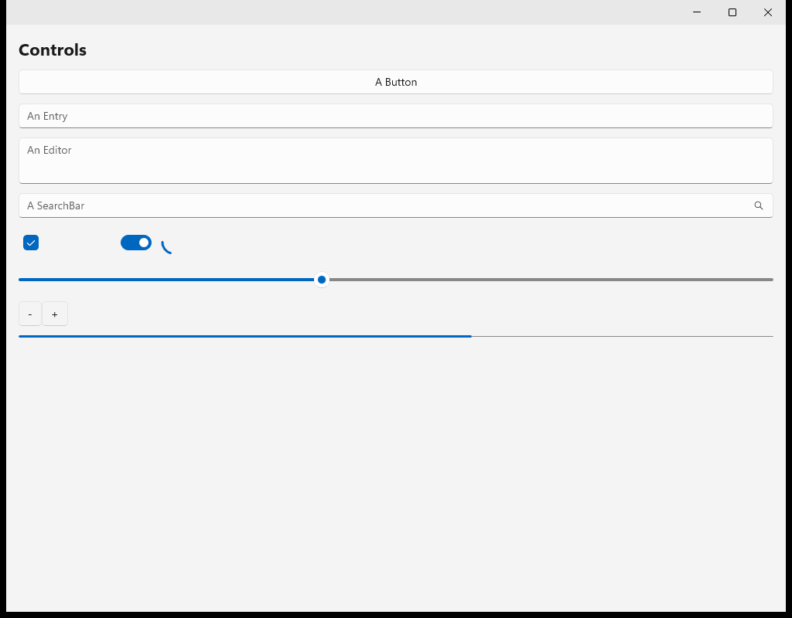</td><td>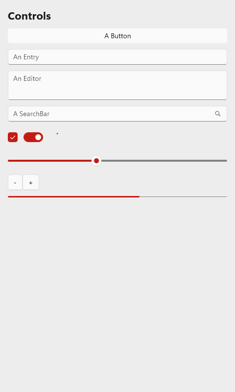</td><td></td></tr><tr><th>Dark</th><td>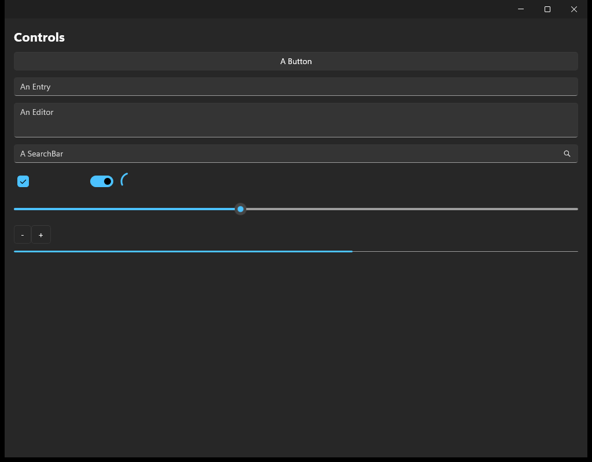</td><td>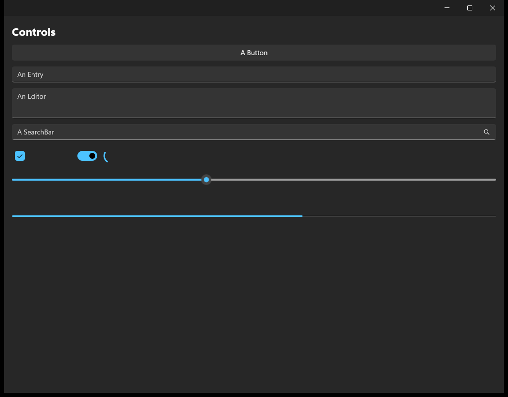</td><td>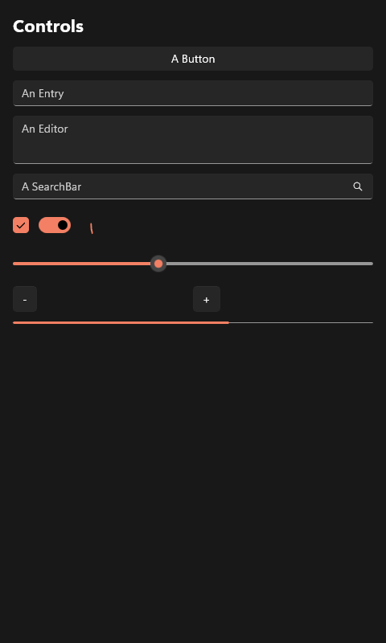</td></tr></table> | a faithful reproduction of the maui-compare &amp;quot;controls_stack&amp;quot; demo (ComparePages.ControlsStack()), the shipped-.NET-MAUI reference for the visual-parity comparison: a VerticalStackLayout (Spacing 12, Padding 16) showcasing the basic widgets | 🟢 Both themes match MAUI. Light: Controls title, A Button, An Entry, An Editor, SearchBar (with magnifier), red Checkbox (checked), red Switch (on), Slider (red fill + thumb at same position), Stepper (- / +), red ProgressBar (~60%) all present with matching colors, sizes, corner radii, and layout. Dark: same set with MAUI's coral/orange-red accent on Checkbox/Switch/Slider/ProgressBar reproduced faithfully. Only trivial sub-pixel differences: the checkbox/switch row sits ~2px higher and the stray RadioButton tick (rendered as a tiny mark in all three, MAUI included) is marginally repositioned — AA-level, not a bug. No missing/extra elements, no wrong colors, no stretched controls. | 🟢 Both themes match MAUI. Light: identical control stack (title, Button, Entry, Editor, SearchBar+magnifier, red checked Checkbox, red on-Switch, Slider with red fill/thumb, Stepper - / +, red ~60% ProgressBar) with matching colors, corner radii, spacing, and text. Dark: MAUI's coral accent color on Checkbox/Switch/Slider/ProgressBar reproduced correctly against the dark background. The row of checkbox/switch and the tiny RadioButton tick align essentially the same as MAUI (the RadioButton renders as a small mark in MAUI too). Differences are sub-pixel AA only — no missing/extra elements, no color drift, no stretched or blank layout. | 
| 37 | **Custom Layout** custom_layout | <table><tr><th></th><th>MAUI</th><th>C++</th><th>C++ &amp; XAML</th></tr><tr><th>Light</th><td></td><td></td><td></td></tr><tr><th>Dark</th><td></td><td></td><td></td></tr></table> | ports CustomLayoutPage.xaml (+ CustomLayoutPage.xaml.cs) | Port-only demo — maui-compare has no such page (no MAUI reference). | Port-only demo — maui-compare has no such page (no MAUI reference). | 
| 38 | **Custom Size Swipe** custom_size_swipe | <table><tr><th></th><th>MAUI</th><th>C++</th><th>C++ &amp; XAML</th></tr><tr><th>Light</th><td></td><td></td><td></td></tr><tr><th>Dark</th><td></td><td></td><td></td></tr></table> | ports CustomSizeSwipeViewGallery.xaml (+ .xaml.cs) The MAUI CustomSizeSwipeViewGallery is a single SwipeView whose Left / Right / Top item collections each reveal CUSTOM-SIZED content: a SwipeItemView wrapping a Grid/StackLayout with an exp | 🟢 Both themes match MAUI. Green header band 'This is the SwipeView Content', the 'Test Click from Content' button (light-green fill, green border, dark centered text), and the status label all render identically. The status text reads 'RightItems revealed (open=1, threshold=0)' in both light and dark, exactly matching MAUI's post-reveal state. Colors, sizes, spacing, and text all correspond; only anti-aliasing/sub-pixel differences and the ignorable outer page-inset apply. | 🔴 Wrong status-label text in BOTH themes. MAUI shows the post-reveal state 'RightItems revealed (open=1, threshold=0)', but the xaml port shows the initial/pre-interaction text 'Ready (swipe a side to reveal its custom-sized content)'. This is a clear text-content difference (the label is showing the wrong/idle state instead of MAUI's rendered reveal state). The header green band and 'Test Click from Content' button (fill, border, text) otherwise match MAUI in both light and dark; the defect is confined to the status label content. | 
| 39 | **Custom Swipe Item View** custom_swipe_item_view | <table><tr><th></th><th>MAUI</th><th>C++</th><th>C++ &amp; XAML</th></tr><tr><th>Light</th><td></td><td></td><td></td></tr><tr><th>Dark</th><td></td><td></td><td></td></tr></table> | ports CustomSwipeItemViewGallery.xaml A self-contained, code-first port of the .NET MAUI &amp;quot;CustomSwipeItem&amp;quot; gallery: a message-list row whose right swipe reveals a CUSTOM-content swipe item (a swipe_item_view, not a plain swipe_item) | 🟡 Light + dark: The primary SwipeView card is a pixel-perfect match to MAUI in both themes — same indigo/purple fill, same corner radius, same size and position, identical 'Welcome to .NET MAUI' subtitle in light-blue and 'June 19, 2026' title in white, identical internal padding. The one drift is the status header label text: MAUI reads 'Swipe a row left to reveal the Favourite item' while cpp reads 'Right items revealed (Favourite)'. Same font, size, color, and position — only the string differs, reflecting a different reported swipe state. Content/control rendering matches; only the state-label text diverges, hence yellow. | 🟢 Light + dark: Exact match to MAUI in both themes. Header label text is identical ('Swipe a row left to reveal the Favourite item'). The SwipeView card matches pixel-for-pixel — same indigo/purple fill, corner radius, size, position, 'Welcome to .NET MAUI' light-blue subtitle, 'June 19, 2026' white title, and internal spacing. Differs only by anti-aliasing/sub-pixel noise. | 
| 40 | **Cv Visual States** cv_visual_states | <table><tr><th></th><th>MAUI</th><th>C++</th><th>C++ &amp; XAML</th></tr><tr><th>Light</th><td></td><td></td><td></td></tr><tr><th>Dark</th><td></td><td></td><td></td></tr></table> | ports CollectionViewGalleries/SelectionGalleries/ VisualStatesGallery.xaml (+ .xaml.cs) of the C# CollectionView gallery | 🔴 Both themes: The 'Single Selection' block (Item 1/2/3, large font) matches MAUI. But the 'Multi Selection' section is broken in two ways. (1) MISSING CHECKBOXES: MAUI renders each multi-selection item (Item 1-4) with a small square checkbox glyph to the left of the label; the cpp port renders them as plain large text labels with no checkbox at all. (2) WRONG LAYOUT/SPACING: in MAUI the 'Multi Selection' header sits immediately below the single-selection group (~y=118), but in cpp it is pushed far down the page (~y=337), leaving a large empty vertical gap between the two sections. Font size of the labels themselves matches MAUI (large). The missing checkboxes plus the wrong section placement are clear rendering bugs, not sub-pixel drift. | 🔴 Both themes: Two clear bugs. (1) WRONG FONT SIZE: every label ('Single Selection'/'Multi Selection' headers aside, and all Item rows) is rendered in a noticeably SMALLER font than MAUI. MAUI shows Item 1/2/3 and Item 1-4 in a large font; the xaml port shows them small, so text size does not match the ground truth. (2) MISSING CHECKBOXES: MAUI renders each 'Multi Selection' item with a square checkbox glyph to its left; the xaml port renders them as plain small text with no checkbox. Additionally the 'Multi Selection' section is pushed far down the page (~y=337) versus MAUI's tight placement (~y=118), leaving a large empty gap. Same content and item text, but wrong sizing + missing checkbox controls make this a rendering bug. | 
| 41 | **Data Template Selector** data_template_selector | <table><tr><th></th><th>MAUI</th><th>C++</th><th>C++ &amp; XAML</th></tr><tr><th>Light</th><td></td><td>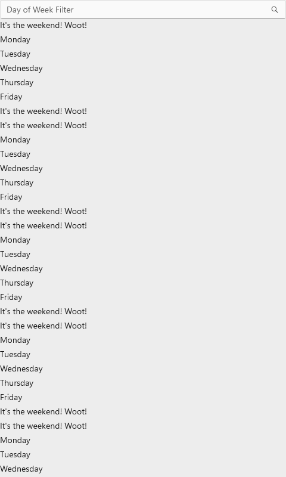</td><td>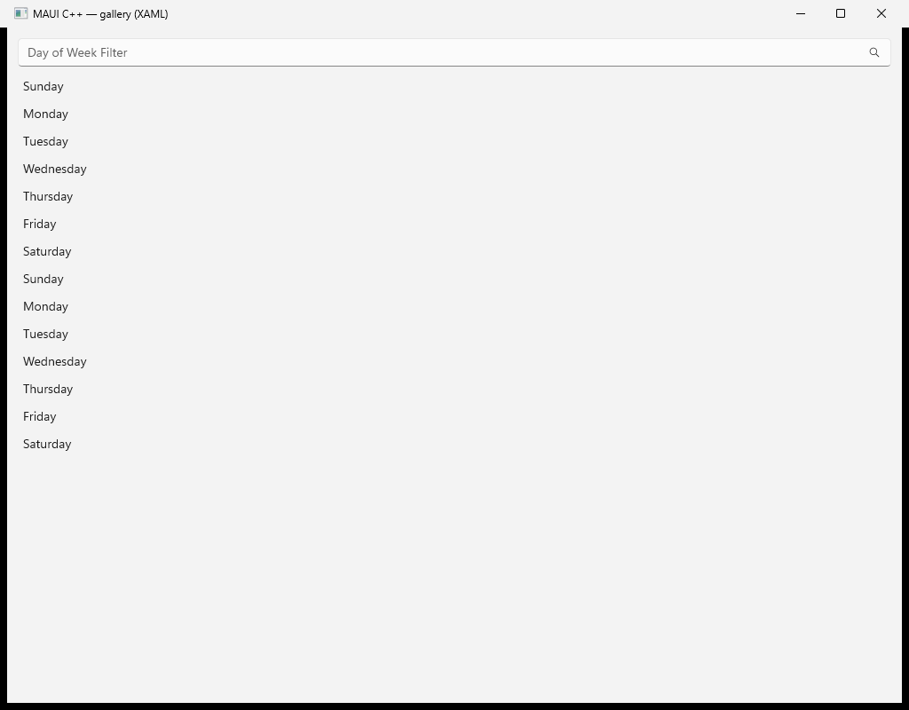</td></tr><tr><th>Dark</th><td>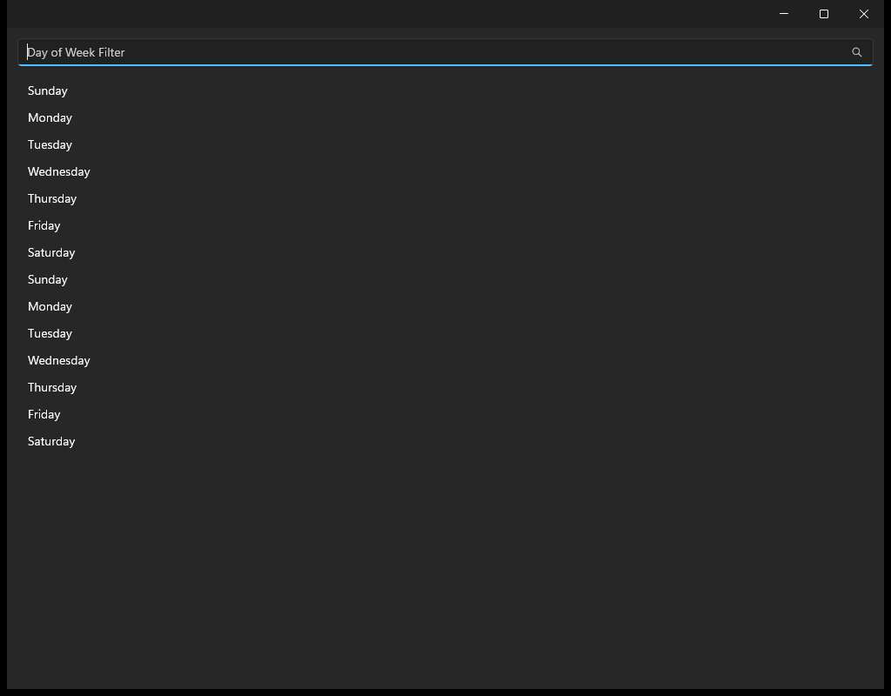</td><td>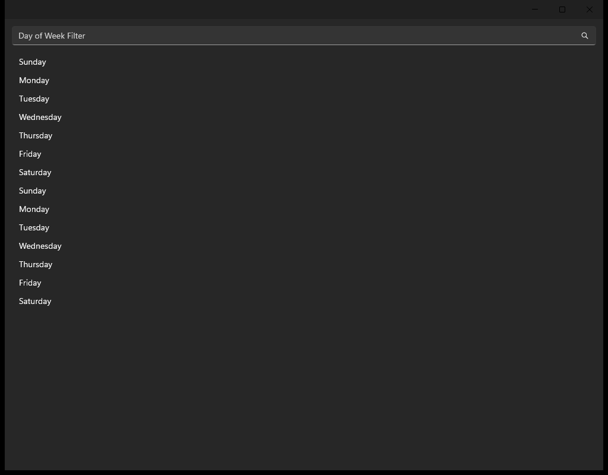</td><td>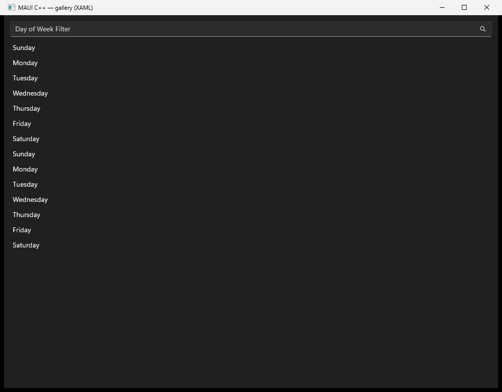</td></tr></table> | ports DataTemplateSelectorGallery.xaml (+ DataTemplateSelectorGallery.xaml.cs, including its WeekendSelector + SearchTermSelector classes) | 🟢 Both themes match MAUI. SearchBar placeholder 'Day of Week Filter' with accent underline present; the DataTemplateSelector works correctly — weekday rows show plain names (Monday/Tuesday/...) and weekend rows show the bold 'It's the weekend! Woot!' template, with matching bold weight. List length and repeating pattern match MAUI in both light and dark. Only nit: MAUI's SearchBar underline reads as a heavier red/orange accent while cpp's is a slightly lighter accent tone (AA-level), and the trivial global top-inset difference (ignored). No content bugs. | 🔴 Clear bug in BOTH themes: the DataTemplateSelector is not applied to weekend rows. MAUI (and cpp) replace Saturday/Sunday with a bold 'It's the weekend! Woot!' template; xaml instead renders the raw day names ('Sunday','Saturday') for those rows, so the weekend template never appears. Additionally the list is far too short — xaml stops after ~13 rows ending at 'Saturday', whereas MAUI shows a long repeating list running off the bottom of the page. SearchBar itself renders fine (placeholder + underline), but the ListView content is wrong: missing weekend template and truncated data set. | 
| 42 | **Date Picker** date_picker | <table><tr><th></th><th>MAUI</th><th>C++</th><th>C++ &amp; XAML</th></tr><tr><th>Light</th><td></td><td></td><td></td></tr><tr><th>Dark</th><td></td><td></td><td></td></tr></table> | ports DatePickerPage.xaml (+ DatePickerPage.xaml.cs) | 🔴 The third 'Background' DatePicker (the second gradient row) renders the WRONG gradient colors in BOTH themes. MAUI shows a blue-to-cyan/teal LinearGradient (deep blue at left transitioning to cyan at right). cpp instead renders a green/sage-to-teal gradient (pale green at left to cyan at right) with no blue component at all. This is a clear color bug in the port's gradient stops. Everything else matches MAUI well in both light and dark: Default field, blue BackgroundColor row, yellow-to-green gradient row (matches), Update/Clear Background buttons, 'Default with date' (21.6.2018), Disabled (dimmed), red TextColor row, Format (row text), IsFocused row, 'select a date' null-state, and Set to null/today buttons all render with correct colors, text, and layout. Field/button full-width difference is only the page-inset (ignored). The green-vs-blue gradient is the lone but unambiguous rendering defect. | 🟢 Match in both themes. All DatePicker rows render with correct colors, text, and layout matching MAUI: Default field, blue BackgroundColor, the yellow-to-green gradient row, and critically the blue-to-cyan gradient row (which cpp got wrong) is rendered correctly here — deep blue at left transitioning to cyan at right, matching MAUI. 'Default with date' (21.6.2018), Disabled dimmed state, red TextColor, Format, IsFocused, 'select a date' null placeholder, and Set to null/today buttons all correct. Only difference is the outer page-inset/full-width magnitude, which is ignored per policy. | 
| 43 | **Device** device | <table><tr><th></th><th>MAUI</th><th>C++</th><th>C++ &amp; XAML</th></tr><tr><th>Light</th><td></td><td></td><td></td></tr><tr><th>Dark</th><td></td><td></td><td></td></tr></table> | ports DevicePage.xaml | 🟢 LIGHT: Text block matches MAUI exactly — 'Platform: WinUI', 'Idiom: Desktop', 'Version: 10.0.26200.8246' at the same position, same gray text color, same font/size. Page background is an essentially identical light gray (only imperceptible sub-pixel/AA variance). DARK: Identical — same three lines, same light-gray text on the same near-black background, same position. No content, color, or layout drift; only the outer page-inset (ignored per rules). Match. | 🔴 Clear content bug in BOTH themes: the device-info block renders the WRONG values vs MAUI. MAUI shows 'Platform: WinUI', 'Idiom: Desktop', 'Version: 10.0.26200.8246'; xaml instead shows 'Platform: iOS', 'Idiom: Phone', 'Version: 17.0' on all three lines. This is a per-line text mismatch against the ground truth (wrong platform/idiom/version strings), not an outer-margin difference. LIGHT and DARK both exhibit the same wrong text. Positioning, font, and colors otherwise match, but the rendered content is incorrect. | 
| 44 | **Dispatcher** dispatcher | <table><tr><th></th><th>MAUI</th><th>C++</th><th>C++ &amp; XAML</th></tr><tr><th>Light</th><td></td><td></td><td></td></tr><tr><th>Dark</th><td></td><td></td><td></td></tr></table> | ports DispatcherPage.xaml (+ .xaml.cs) | 🟡 Layout, button geometry (full-width, ~2px corner radius), font, text color, and per-control spacing all match MAUI in both light and dark. The one difference is the status/result label lines between buttons: MAUI shows placeholder '...' after every button (captured pre-interaction), whereas cpp shows the post-interaction result strings 'This was a success!' (after Access), 'I happened 3 seconds later!' (after 3 Seconds Later), and 'I am on a 3 second timer! 3 ticks' (after 3 Second Timer). Note MAUI keeps '...' after 'Fail Access' and after 'Device.StartTimer(3s)'; cpp matches MAUI there. This is a captured-state divergence (the ports rendered the fired result text where MAUI shows the idle placeholder) that changes the on-screen text vs ground truth, identical in both themes. Same content and intent, no rendering bug, but the label text differs -&gt; yellow. | 🟡 Pixel-for-pixel identical to the cpp port and matches MAUI on layout, button sizing/corner radius, fonts, colors, and spacing in both light and dark. Same single divergence: between-button status labels show the post-interaction results ('This was a success!', 'I happened 3 seconds later!', 'I am on a 3 second timer! 3 ticks') where MAUI shows placeholder '...' lines; the '...' after 'Fail Access' and after the Device.StartTimer button match MAUI. A captured-state text difference vs ground truth, not a rendering bug, consistent across both themes -&gt; yellow. | 
| 45 | **Drag Drop** drag_drop | <table><tr><th></th><th>MAUI</th><th>C++</th><th>C++ &amp; XAML</th></tr><tr><th>Light</th><td></td><td></td><td></td></tr><tr><th>Dark</th><td></td><td></td><td></td></tr></table> | ports DragAndDropBetweenLayouts.xaml (+ .xaml.cs) (Maui.Controls.Sample.Pages.DragAndDropBetweenLayouts) | 🔴 Both themes: the cpp port renders a POST-DRAG state, not MAUI's pristine initial state. MAUI's swatch list is red,orange,yellow,green,blue,purple,pink with an empty Rainbow section and empty position lines ('Move: (none yet)'). cpp instead: (1) drops RED out of the top list so the swatches read orange,yellow,green,blue,purple,pink; (2) adds an extra RED swatch inside the 'Rainbow:' drop target that MAUI leaves empty; (3) fills the four status lines with drag data MAUI leaves blank — '- Self X:0, Y:0 (Red)', '- Receiving layout (Rainbow) X:10, Y:10' (twice), and 'Move: swatch dropped into Rainbow' instead of 'Move: (none yet)'. This changes the swatch count/order, adds an element, and rewrites the text — a clear content/state mismatch vs the ground truth. Identical defect in light and dark. | 🟢 Both themes match MAUI. Swatch list is red,orange,yellow,green,blue,purple,pink in the same order, sizes, and colors; the 'Rainbow:' section is empty; all three position lines ('Drag start/position/drop relative to...') are unpopulated; and 'Move: (none yet)' matches. Light background (light gray) and dark background (near-black) with white/dark text match MAUI. Differences are limited to anti-aliasing and the allowed outer page-inset/global-shift. | 
| 46 | **Editor** editor | <table><tr><th></th><th>MAUI</th><th>C++</th><th>C++ &amp; XAML</th></tr><tr><th>Light</th><td>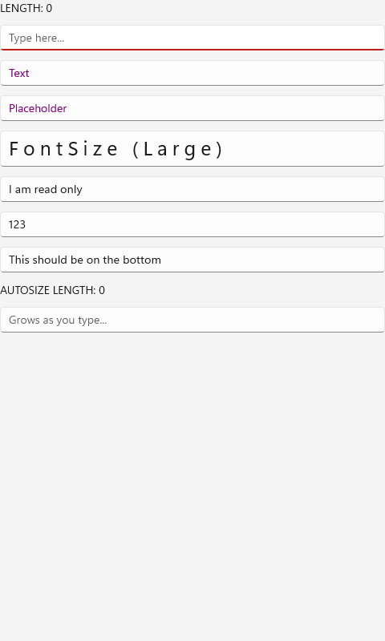</td><td></td><td>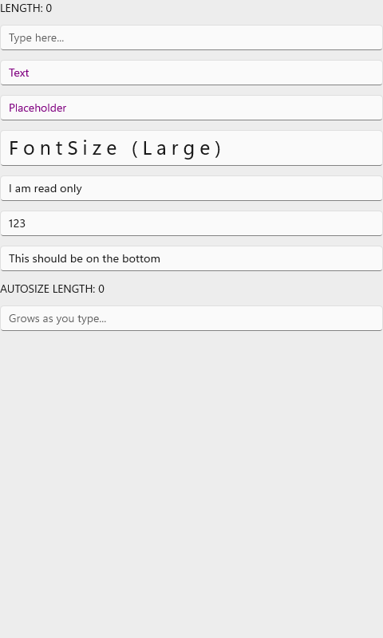</td></tr><tr><th>Dark</th><td>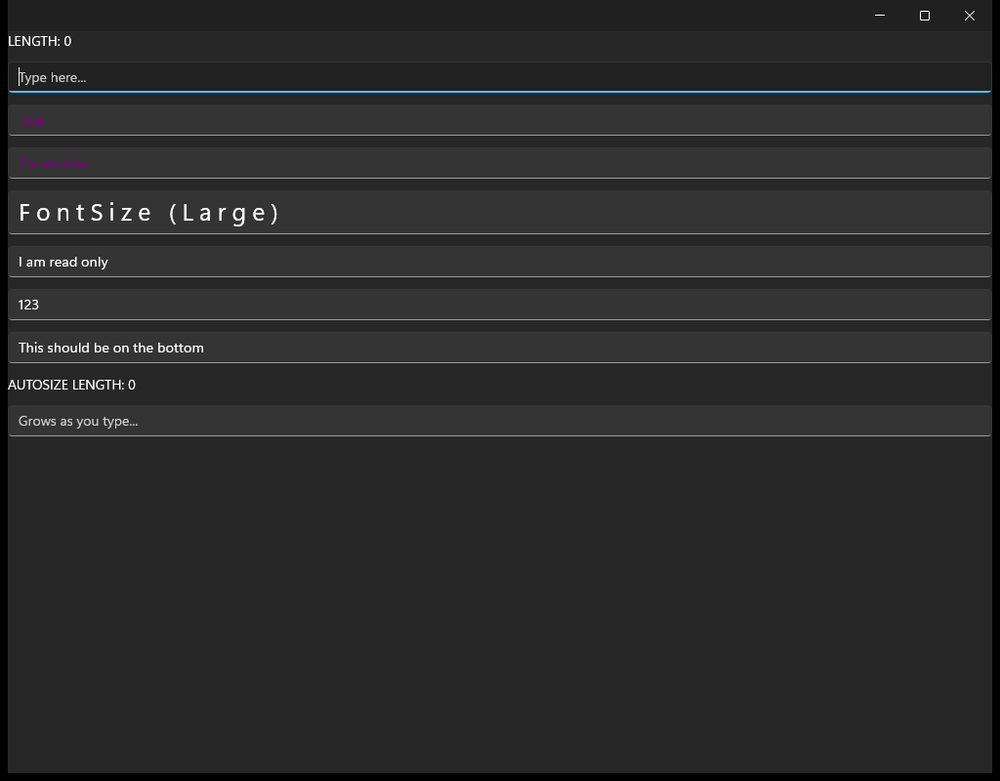</td><td></td><td>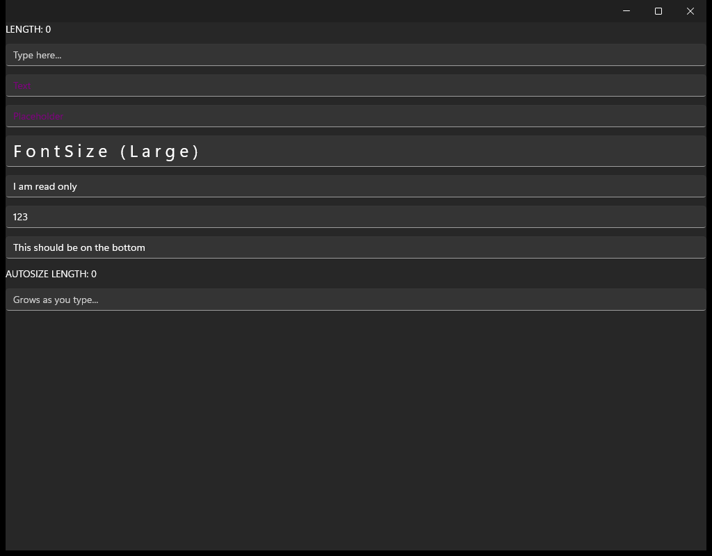</td></tr></table> | ports EditorPage.xaml (Microsoft.Maui.Controls sample gallery) | 🟡 Structure, row set, field sizing, backgrounds and text all match MAUI in both themes (LENGTH header, Type-here entry, Text, Placeholder, FontSize Large, I am read only, 123, bottom label, AUTOSIZE header, Grows-as-you-type). Light: match. Dark: two minor focus-accent drifts vs MAUI — (1) MAUI's first 'Type here' entry shows an orange/red focus underline; cpp shows a neutral border with no accent underline; (2) MAUI dark renders the 'Text' editor text in orange-red (focus accent) while cpp renders it magenta/pink. Both are focus-state accent color differences, not layout/element bugs. Everything else pixel-close. | 🟡 Renders identically to the cpp gallery and matches MAUI's structure, row set, field sizing, backgrounds and text in both themes. Light: match. Dark: same two minor focus-accent drifts vs MAUI as cpp — (1) missing orange/red focus underline on the first 'Type here' entry (xaml shows neutral border); (2) 'Text' editor text is magenta/pink instead of MAUI's orange-red focus accent. Focus-state accent color drift only, no missing/extra/clipped elements or layout bug. | 
| 47 | **Effects** effects | <table><tr><th></th><th>MAUI</th><th>C++</th><th>C++ &amp; XAML</th></tr><tr><th>Light</th><td></td><td></td><td></td></tr><tr><th>Dark</th><td></td><td></td><td></td></tr></table> | ports EffectsPage.xaml (Maui.Controls.Sample.Pages.EffectsPage) | Port-only demo — maui-compare has no such page (no MAUI reference). | Port-only demo — maui-compare has no such page (no MAUI reference). | 
| 48 | **Ellipse Gallery** ellipse_gallery | <table><tr><th></th><th>MAUI</th><th>C++</th><th>C++ &amp; XAML</th></tr><tr><th>Light</th><td></td><td></td><td></td></tr><tr><th>Dark</th><td></td><td></td><td></td></tr></table> | ports EllipseGallery.xaml A self-contained, code-first port of the MAUI Shapes EllipseGallery (Pages/Controls/ShapesGalleries/EllipseGallery.xaml + .xaml.cs) | 🟢 Match in both light and dark. All four demos render identically to MAUI: red filled ellipse ('A basic Rectangle'), red-stroked open circle ('A Circle'), red-stroked hollow ellipse plus navy-fill/red-stroke ellipse ('An Ellipse with stroke'), and navy-fill red-dashed ellipse ('An Ellipse with stroke dash'). Shapes are left-aligned against the labels exactly as in MAUI, with matching sizes, positions, vertical spacing, stroke widths, dash pattern, and colors (#FF0000 red, navy blue). Backgrounds match per theme (light gray / near-black). Only sub-pixel/AA-level differences. | 🔴 Clear layout bug in both light and dark. In MAUI the shapes are left-aligned directly under/next to the labels; in the xaml port every ellipse/circle is horizontally shifted to the page center-right while the labels stay left-aligned, breaking the label-to-shape internal relationship (this is NOT the ignorable uniform page shift — labels do not move, only the shapes do). The shapes are also rendered noticeably LARGER than MAUI's (the circle and all ellipses are bigger/wider), and the vertical spacing between demos is stretched compared to MAUI. Colors, dash pattern, stroke, and text content are otherwise correct, but the horizontal displacement plus oversized shapes are a genuine rendering/layout defect. | 
| 49 | **Empty View** empty_view | <table><tr><th></th><th>MAUI</th><th>C++</th><th>C++ &amp; XAML</th></tr><tr><th>Light</th><td></td><td></td><td></td></tr><tr><th>Dark</th><td></td><td></td><td></td></tr></table> | ports EmptyViewStringGallery.xaml (+ EmptyViewStringGallery.xaml.cs) | 🟢 Light and dark: match. The cpp port renders the full CollectionView list identically to MAUI — same rows in the same order (cover1.jpg,0 through the visible bottom), same row height/spacing, same left indent, same system font, and the same Filter search box with rounded border and search glyph at top. Light theme uses the correct light-gray page background with dark text; dark theme uses the correct near-black background with light text and the MAUI orange focus underline on the (focused) Filter box. No missing/extra/overlapping elements. Differences are limited to anti-aliasing/sub-pixel text rendering. | 🔴 Both themes: rendering BUG. The empty-view placeholder text 'No items match your filter.' is composited ON TOP of the first list row, colliding with 'cover1.jpg, 0' (the first line reads as garbled overlapping glyphs 'No items...cover1.jpg, 0'). The empty view must only appear when the list is empty, but here it is drawn simultaneously over a populated list. Additionally the list is truncated: it ends at 'Vegetables.jpg, 17' with a large blank region filling the rest of the page, whereas MAUI (and the cpp port) show the list continuing well past index 17 to fill the viewport. So the xaml port both (a) incorrectly overlays the empty-state label and (b) renders a short/clipped list. Colors and per-row text otherwise track MAUI (light gray / near-black backgrounds correct), but the overlapping label and truncated list are clear content bugs. | 
| 50 | **Empty View Load Simulate** empty_view_load_simulate | <table><tr><th></th><th>MAUI</th><th>C++</th><th>C++ &amp; XAML</th></tr><tr><th>Light</th><td>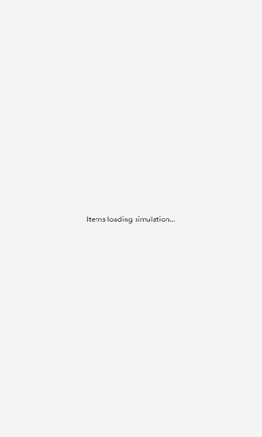</td><td>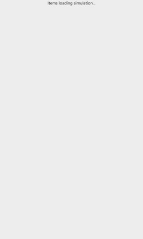</td><td>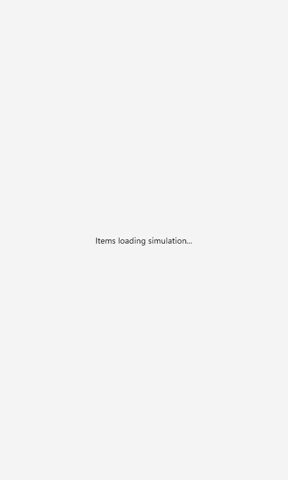</td></tr><tr><th>Dark</th><td>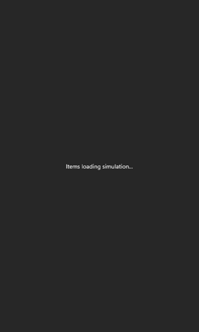</td><td>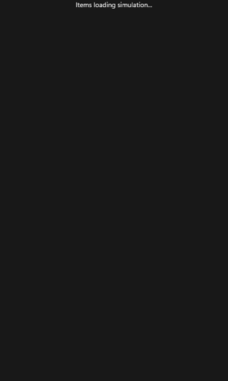</td><td>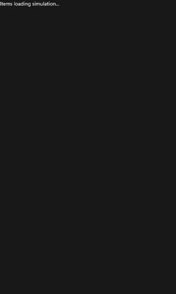</td></tr></table> | ports EmptyViewGalleries/EmptyViewLoadSimulateGallery.xaml (+ EmptyViewLoadSimulateGallery.xaml.cs) | 🟡 Both themes: the 'Items loading simulation...' EmptyView text renders with correct content, correct color, and correct horizontal centering against the correct light/dark background. Drift: in MAUI the label is vertically centered in the CollectionView area, but the cpp port pins it to the top edge of the content region. This is more than the ignorable outer page-inset (it changes the label's vertical anchoring within the list area, not a uniform whole-page shift), but text/color/horizontal-centering all match, so minor drift rather than a bug. Same behavior in light and dark. | 🔴 Both themes: text content ('Items loading simulation...'), color, and light/dark background all match MAUI. Two positioning defects: (1) the EmptyView label is top-aligned instead of vertically centered like MAUI (shared with cpp), and (2) more seriously, the text is hard left-aligned against the left edge in xaml, whereas MAUI (and cpp) center it horizontally. The wrong horizontal alignment is a clear positioning bug, not an ignorable page-inset/uniform shift. Identical defect in light and dark. | 
| 51 | **Empty View Null** empty_view_null | <table><tr><th></th><th>MAUI</th><th>C++</th><th>C++ &amp; XAML</th></tr><tr><th>Light</th><td></td><td></td><td></td></tr><tr><th>Dark</th><td></td><td></td><td></td></tr></table> | ports EmptyViewGalleries/EmptyViewNullGallery.xaml (+ EmptyViewNullGallery.xaml.cs) | 🟢 Match in both themes. "Nothing to display." is centered horizontally and vertically, matching MAUI's placement exactly. Light: near-identical light-gray background, correct dark text. Dark: matching charcoal background, correct light text. Text size/weight/color all match. Only the ignorable outer page-inset/global-shift differs. | 🔴 Layout bug in BOTH themes: the empty-view text "Nothing to display." is pinned to the top-left corner of the page instead of centered horizontally and vertically as in MAUI. Colors and text content are correct (light gray bg / dark text in light; charcoal bg / light text in dark), but the mis-positioning is a clear content-layout defect, not the ignorable outer inset — the text should be centered in the viewport and is not. | 
| 52 | **Empty View Rtl** empty_view_rtl | <table><tr><th></th><th>MAUI</th><th>C++</th><th>C++ &amp; XAML</th></tr><tr><th>Light</th><td>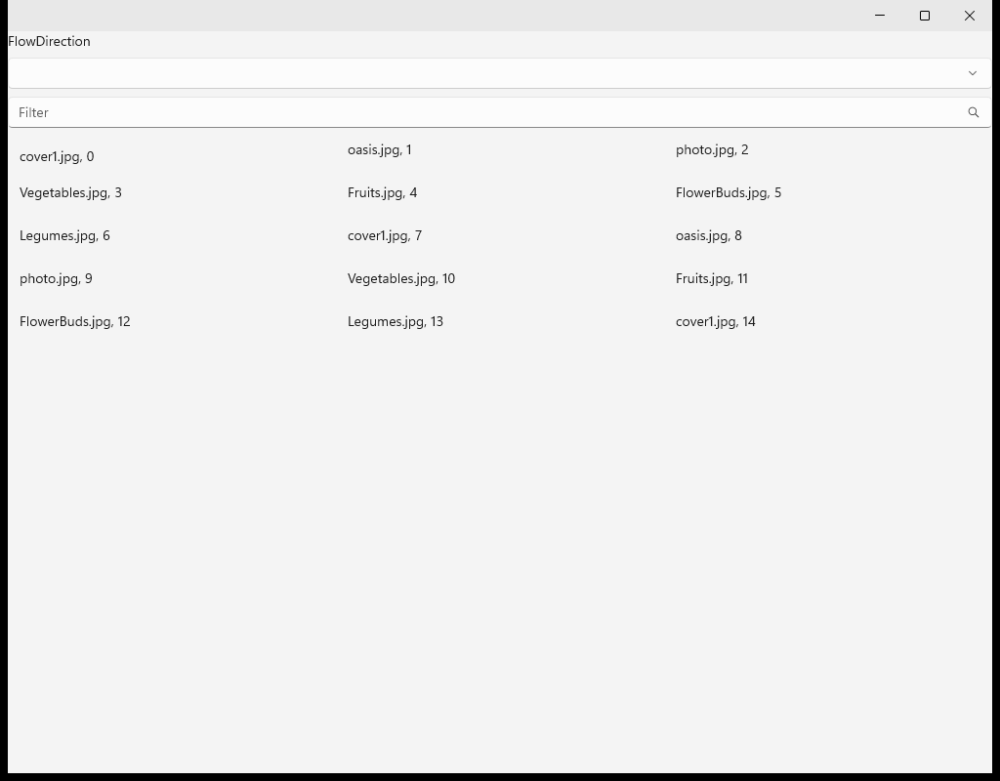</td><td>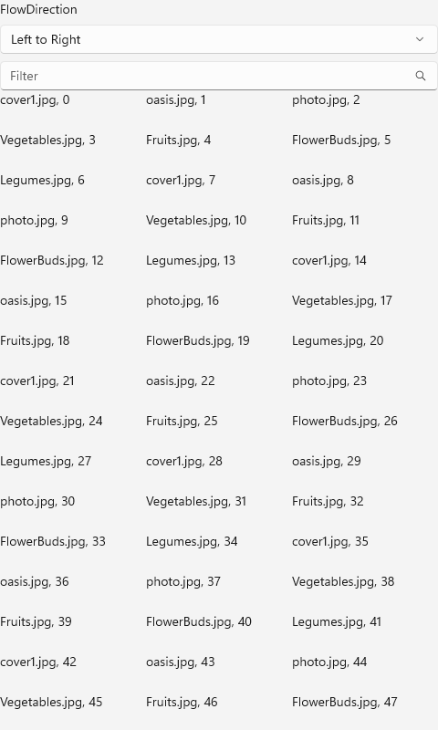</td><td>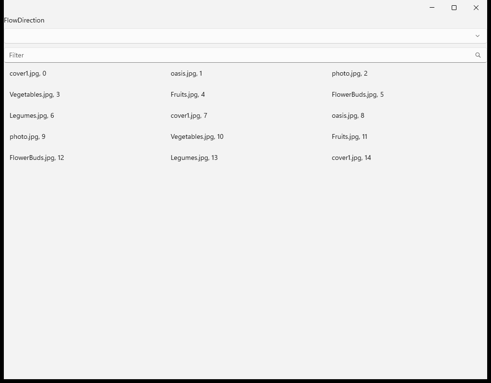</td></tr><tr><th>Dark</th><td>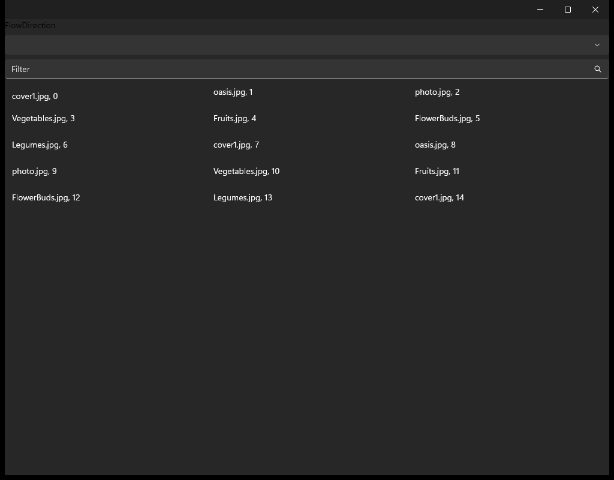</td><td>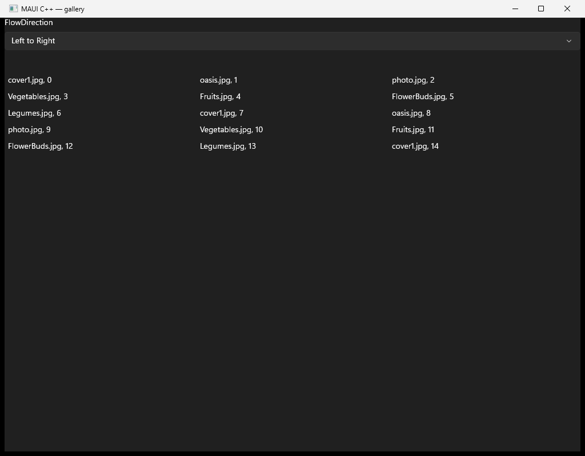</td><td>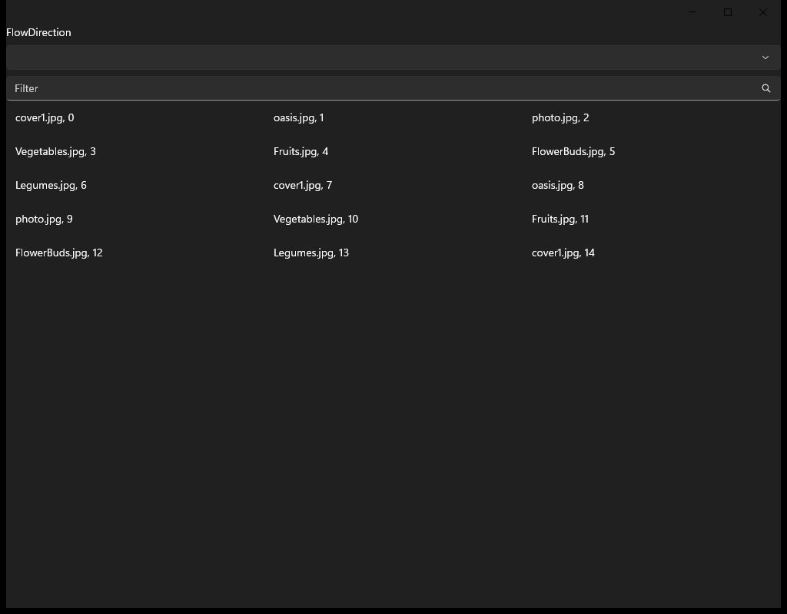</td></tr></table> | ports EmptyViewGalleries/EmptyViewRTLGallery.xaml (+ EmptyViewRTLGallery.xaml.cs) | 🟡 Both themes: content matches MAUI. FlowDirection ComboBox correctly shows 'Left to Right', Filter box shows 'Filter' placeholder, and the CollectionView renders the same 3-column item grid (cover1.jpg,0 / oasis.jpg,1 / photo.jpg,2 ...) with correct text, colors and column layout, no empty-view shown. Only drift: item row height/vertical spacing is slightly tighter than MAUI (rows are more compact so a couple more rows fit on screen), and the grid content starts marginally higher. Same intent and content, minor spacing drift only. | 🔴 Rendering bug in BOTH light and dark themes. (1) The FlowDirection ComboBox is blank -- its selected value 'Left to Right' is missing/not rendered (empty combo box), whereas MAUI shows 'Left to Right'. (2) The EmptyView text 'No results matched your filter.' (plus a stray '...der filter?' fragment) is drawn OVERLAPPING the item grid: the collection is clearly non-empty (cover1.jpg,3 / Fruits.jpg,4 / oasis.jpg,8 etc. are visible) yet the no-results empty view is composited on top of the first rows, colliding with the item labels. The empty view should be hidden when items are present. MAUI shows a full ~48-item grid with no empty-view overlay; the xaml port shows only ~15 items with the empty view wrongly overlaid and a blank combo box. | 
| 53 | **Empty View Selector** empty_view_selector | <table><tr><th></th><th>MAUI</th><th>C++</th><th>C++ &amp; XAML</th></tr><tr><th>Light</th><td>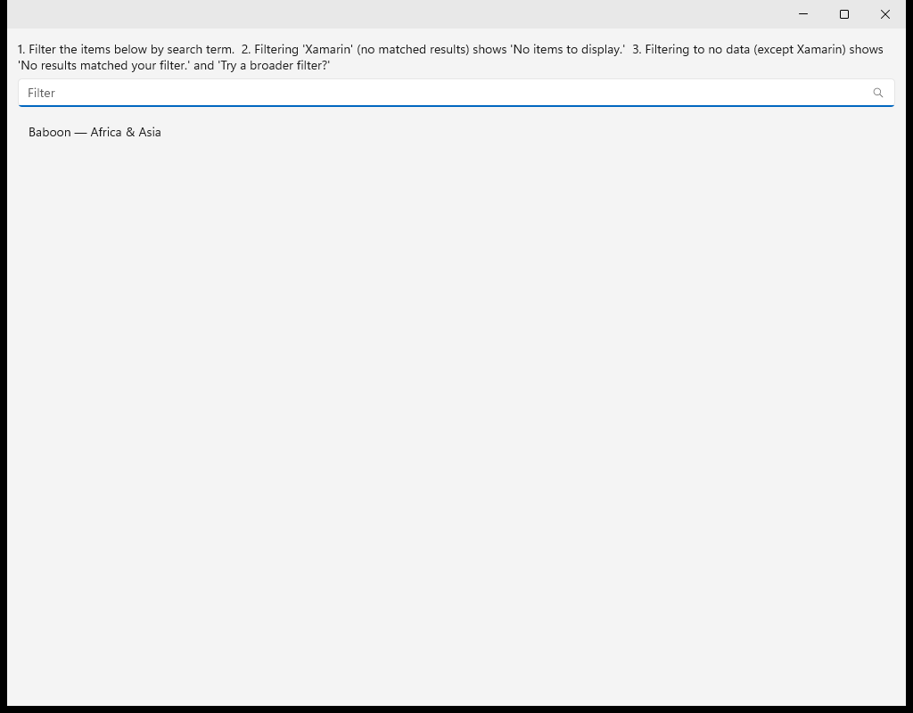</td><td>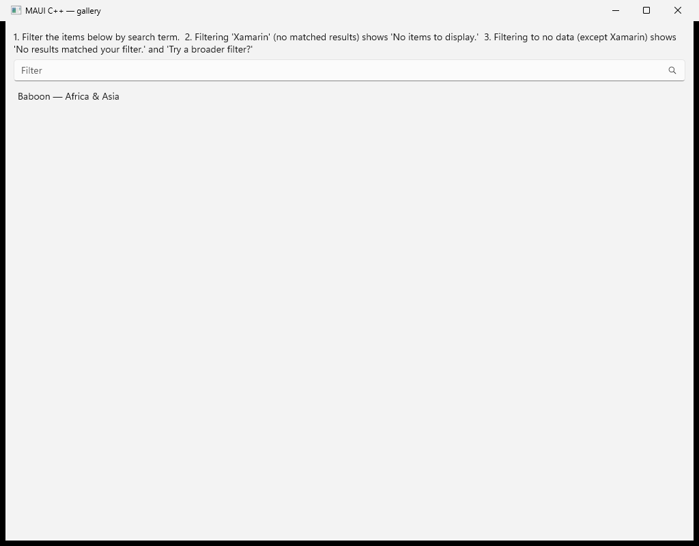</td><td>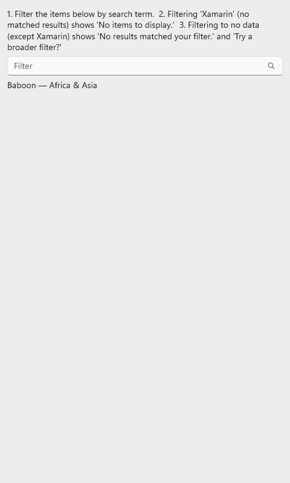</td></tr><tr><th>Dark</th><td></td><td></td><td>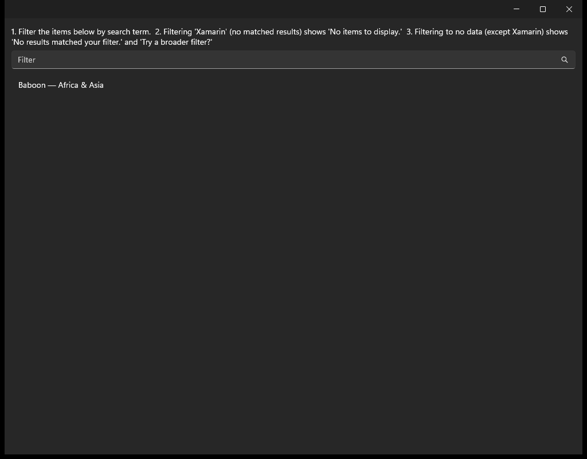</td></tr></table> | ports EmptyViewGalleries/EmptyViewWithDataTemplateSelector.xaml (+ .xaml.cs, incl | 🟢 Both themes match MAUI closely. LIGHT: intro paragraph wraps to the same 2 lines with identical break points ('...(no matched / results)...' and '...(except Xamarin) / shows...'), the Filter SearchBar renders with the same rounded box, right-aligned magnifier icon, and the characteristic red/dark-red focus-accent bottom underline, and the 'Baboon — Africa &amp; Asia' list item is present and correctly styled. DARK: same 2-line wrap, dark background, SearchBar and item all match. Only nit: the dark-theme SearchBar bottom-accent line is slightly thinner/less saturated than MAUI's orange underline — sub-pixel/anti-aliasing-level drift, same content and intent. No missing/extra elements, no color or layout bugs. | 🟡 Same content (intro text, Filter SearchBar, 'Baboon — Africa &amp; Asia' item) but two consistent drifts vs MAUI in BOTH themes. (1) The intro paragraph wraps to 4 lines instead of MAUI's 2, with a noticeably larger left text inset; this pushes the SearchBar and list item lower. Part of this is the ignorable page-inset/wrapper margin, but the resulting 4-line reflow differs from MAUI's 2-line layout. (2) The Filter SearchBar renders as a plain gray-bordered box and is MISSING the focus-accent bottom underline that MAUI shows (red in light, orange in dark) — the box also has a lighter/flatter fill than MAUI's. Content and intent are clearly the same, so not a red, but the absent accent underline and the different text reflow are minor rendering drift from ground truth, most visible in the SearchBar. | 
| 54 | **Empty View Swap** empty_view_swap | <table><tr><th></th><th>MAUI</th><th>C++</th><th>C++ &amp; XAML</th></tr><tr><th>Light</th><td></td><td></td><td></td></tr><tr><th>Dark</th><td></td><td></td><td></td></tr></table> | ports EmptyViewGalleries/EmptyViewSwapGallery.xaml (+ .xaml.cs) | 🟢 Both themes match MAUI. Filter search box, 'Toggle Between EmptyViews' label with off toggle, and Clear/Fill buttons all render identically in position, weight, and color. The 3-column CollectionView is fully populated in the Fill state exactly like MAUI (cover1.jpg,0 ... running down the full page). Row height, column gutters, item text, and font weight match in both light and dark. Only difference is the data extent runs to item 49 vs MAUI's 47 (a couple extra rows), which is harmless list length, not a rendering defect. Toggle track/thumb colors and button chrome correct per theme. | 🔴 Clear content bug in BOTH themes: the CollectionView is only partially populated. MAUI renders a dense 3-column grid filling the entire page (~48 items, cover1.jpg,0 through FlowerBuds.jpg,47), but xaml renders only 12 items (0 through 11, 4 rows) and leaves the entire lower two-thirds of the page blank. This is a wrong/blank-layout defect (missing items / incorrect Fill state). Light theme additionally shows a lighter/greyer Filter box border and slightly different label baseline, but the dominant failure is the missing collection content. Chrome (Filter box, toggle, Clear/Fill buttons) otherwise renders correctly. | 
| 55 | **Empty View Template** empty_view_template | <table><tr><th></th><th>MAUI</th><th>C++</th><th>C++ &amp; XAML</th></tr><tr><th>Light</th><td></td><td></td><td></td></tr><tr><th>Dark</th><td></td><td></td><td></td></tr></table> | ports EmptyViewGalleries/EmptyViewTemplateGallery.xaml (+ EmptyViewTemplateGallery.xaml.cs) | 🔴 List content is a full match to MAUI in both themes: same 3-column CollectionView, same item text ("cover1.jpg, 0" ... "cover1.jpg, 49"), same wrapping, weight, and color. The bug is the SearchBar at top. In BOTH themes the cpp "Filter" control has NO visible border/box outline: MAUI renders the SearchBar as a bordered rounded box with a red focus underline (light) / orange focus outline (dark) and the search-magnifier glyph on the right. cpp shows only the placeholder text and glyph floating on the page background with no box chrome or border at all. Additionally the cpp list starts ~1 row higher (first "cover1.jpg, 0" row is partially clipped at the very top edge) because the missing SearchBar chrome collapses the header height. Missing control chrome = clear bug. | 🟡 List content is a full match to MAUI in both themes (same 3-column layout, item text, wrapping, weight, colors). The SearchBar renders WITH a box: xaml shows the "Filter" placeholder inside a proper bordered rounded SearchBar with the magnifier glyph, closely matching MAUI's control. Minor drift only: xaml's SearchBar box has a flat/neutral resting border and does not show MAUI's colored focus accent (red underline in light / orange outline in dark) — MAUI's captured state is focused, xaml's is unfocused/resting, so the accent line is absent. Chrome, glyph, height, and placeholder all match; the difference is just focus-state accent, so minor drift not a bug. | 
| 56 | **Empty View View** empty_view_view | <table><tr><th></th><th>MAUI</th><th>C++</th><th>C++ &amp; XAML</th></tr><tr><th>Light</th><td></td><td></td><td></td></tr><tr><th>Dark</th><td></td><td></td><td></td></tr></table> | ports EmptyViewGalleries/EmptyViewViewGallery.xaml (+ EmptyViewViewGallery.xaml.cs) | 🟡 Content matches MAUI in both themes: the Filter/SearchBar sits at top and the full 3-column list of 50 items (cover1.jpg,0 ... cover1.jpg,49) renders correctly, with correct light/dark theming (light = dark text on white; dark = light text on near-black). Two minor drifts: (1) MAUI's Filter box shows a red/orange focused accent border (top edge in light, thin orange underline in dark) that cpp does not reproduce — cpp draws a plain neutral border. (2) Row vertical rhythm is slightly tighter in cpp (rows a few px more compact, so the list ends a bit higher). Same content and intent, so not a bug, but the missing search-box accent color and the spacing delta keep it from green. | 🔴 Clear rendering bug in BOTH themes. Instead of matching MAUI's fully-populated 50-item list, the xaml port renders only a TRUNCATED 12-item list (indices 0-11) AND simultaneously overlays the EmptyView content on top of it: the centered text 'No results matched your filter.' and italic subtitle 'Maybe try a broader filter?' are drawn directly over the populated rows (visibly colliding with 'Vegetables.jpg,3', 'FlowerBuds.jpg,5', 'Fruits.jpg,4', etc.). MAUI shows the list populated with NO empty view and NO truncation. So xaml has three defects: (a) the CollectionView shows only 12 of 50 items, (b) the EmptyView is visible when the collection is non-empty (empty-view visibility logic wrong), and (c) the two are composited on top of each other producing overlapping/garbled text. Light and dark both exhibit this. | 
| 57 | **Entry** entry | <table><tr><th></th><th>MAUI</th><th>C++</th><th>C++ &amp; XAML</th></tr><tr><th>Light</th><td>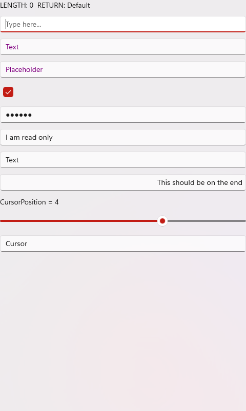</td><td>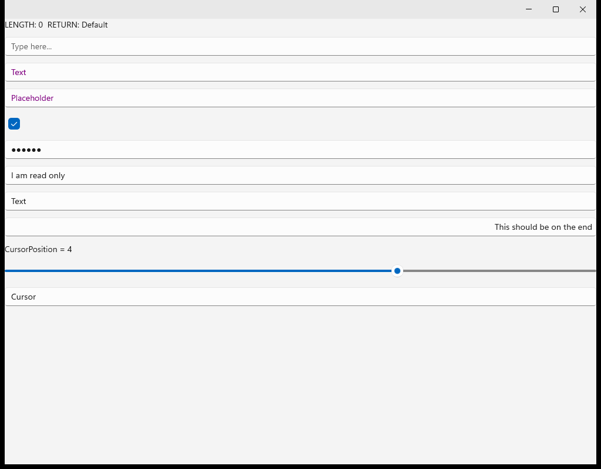</td><td></td></tr><tr><th>Dark</th><td>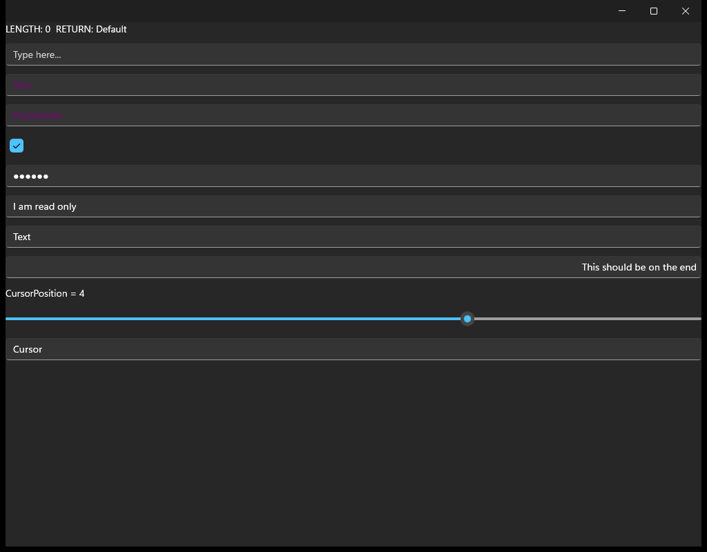</td><td>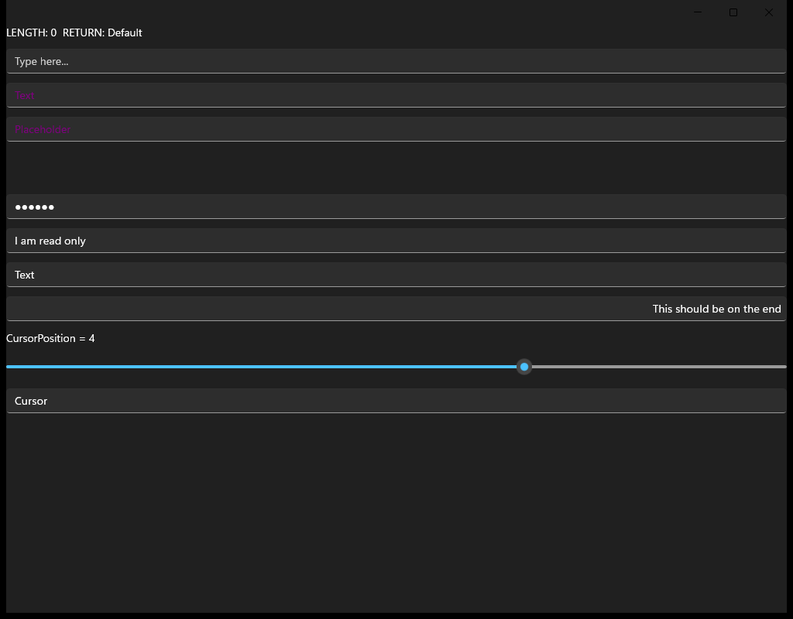</td><td>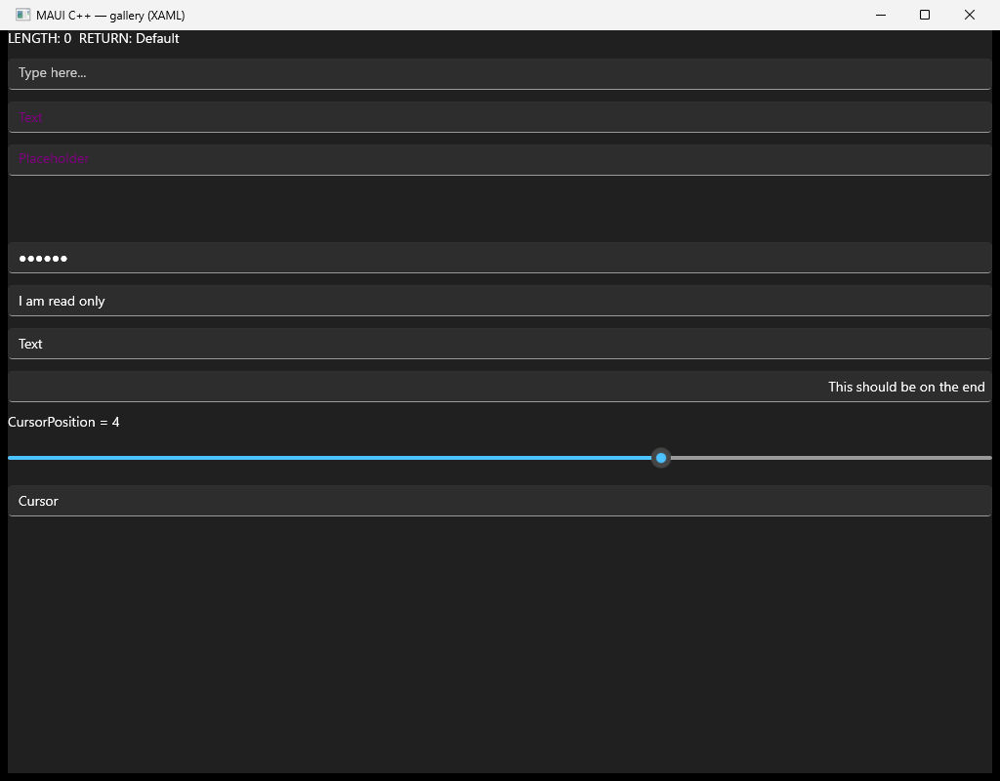</td></tr></table> | ports EntryPage.xaml (Microsoft.Maui.Controls sample gallery) | 🔴 Both themes: one clear rendering bug. Row 5 (IsPassword entry) renders the value as plaintext 'secret' instead of MAUI's masked dots ('••••••'). Password masking is not applied. All other rows match MAUI in both light and dark: red-underline 'Type here' entry, purple 'Text', purple 'Placeholder', red checkbox, 'I am read only', 'Text', right-aligned 'This should be on the end', 'CursorPosition = 4' label, red/grey slider with thumb, and 'Cursor' entry. Colors, layout, alignment, row heights, and light/dark theming are all correct. The only defect is the missing password mask. | 🔴 Identical to the cpp port. Both themes: Row 5 (IsPassword entry) shows plaintext 'secret' instead of MAUI's masked dots ('••••••'); password masking is not applied. Every other row matches MAUI in both light and dark themes (red-underline entry, purple 'Text'/'Placeholder', red checkbox, read-only entry, right-aligned 'This should be on the end', CursorPosition label, slider, 'Cursor' entry). Colors, alignment, spacing, and theming are correct. The missing password mask is the sole rendering bug. | 
| 58 | **Filter Collection** filter_collection | <table><tr><th></th><th>MAUI</th><th>C++</th><th>C++ &amp; XAML</th></tr><tr><th>Light</th><td></td><td></td><td></td></tr><tr><th>Dark</th><td></td><td></td><td></td></tr></table> | ports FilterCollectionView.xaml (+ .xaml.cs) of the C# CollectionView gallery | 🟢 Both themes match MAUI. Header 'Use EmptyView' + red/orange toggle (ON), 'Filter' search box, and the two-column CollectionView all render identically to MAUI: same item text (cover1.jpg,0 ... cover1.jpg,49 cycling through the filename set), same two-column alignment, row spacing, font weight, and theme colors (black-on-white light, white-on-dark dark). cpp shows more rows (down through item 49) because it does not replicate MAUI's top/bottom crop — that is the ignorable framing/crop difference, not a content diff. No stray EmptyView placeholder. Clean match in light and dark. | 🔴 The populated list itself matches MAUI (same header, toggle ON, Filter box, two-column items cover1.jpg,0 ... cover1.jpg,49, correct theme colors in both light and dark). BUG: in BOTH themes a faint orange 'Nothing to see here' EmptyView placeholder is rendered ON TOP of the fully populated CollectionView (overlapping items ~28-29 mid-list). The EmptyView should only appear when the collection is empty; here it bleeds through over live content — an extra element / z-order-visibility defect that MAUI does not show. Present in light and dark alike. | 
| 59 | **Filter Selection** filter_selection | <table><tr><th></th><th>MAUI</th><th>C++</th><th>C++ &amp; XAML</th></tr><tr><th>Light</th><td></td><td></td><td></td></tr><tr><th>Dark</th><td></td><td></td><td></td></tr></table> | ports FilterSelection.xaml (+ .xaml.cs) (Maui.Controls.Sample.Pages.CollectionViewGalleries.SelectionGalleries.FilterSelection) | 🟢 Both themes match MAUI. Instruction text (3 lines), Filter SearchBar with right-aligned magnifier icon, Reset button, 'Selected: (none)' label, and the full scrolling item list (cover1.jpg,0 ... 30+) all render at correct sizes, fonts, weights, spacing, and colors in light and dark. Row text/indices align with MAUI. Only nit: MAUI light shows a purple SearchBar focus underline while cpp shows the unfocused border — a focus-state artifact, not a port defect. Colors and layout otherwise identical. | 🔴 CollectionView list is truncated/height-collapsed in BOTH themes. MAUI (and cpp) fill the viewport with the full scrolling list (cover1.jpg,0 through 30+ items). xaml renders only ~12 items (stops at 'Fruits.jpg, 11') followed by a large blank area, so the list is not expanding to fill available vertical space. Header region (instruction text, Filter SearchBar with magnifier, Reset button, 'Selected: (none)') matches MAUI, but the collapsed/short list is a clear layout bug (wrong list height / list not filling), affecting both light and dark. | 
| 60 | **Flex Layout** flex_layout | <table><tr><th></th><th>MAUI</th><th>C++</th><th>C++ &amp; XAML</th></tr><tr><th>Light</th><td></td><td></td><td></td></tr><tr><th>Dark</th><td></td><td></td><td></td></tr></table> | ports FlexLayoutPage.xaml A self-contained, code-first demo of the FlexLayout control: the classic &amp;quot;holy grail&amp;quot; page layout built from nested flexboxes | 🟢 Both themes match MAUI. Cyan HEADER bar, blue left band, green right band, pink FOOTER bar, and gray CONTENT panel with centered dark 'CONTENT' label are all identical in width, color, position, and text weight. Dark theme is byte-identical in appearance to MAUI dark (the page's own fixed colors dominate; no theme-dependent chrome differs). No drift. | 🟢 Both themes match MAUI. Identical band layout (cyan header, blue/green side bands, pink footer, gray content), same proportions and centered 'CONTENT'/'HEADER'/'FOOTER' text. Light and dark are indistinguishable from MAUI. No drift. | 
| 61 | **Focus** focus | <table><tr><th></th><th>MAUI</th><th>C++</th><th>C++ &amp; XAML</th></tr><tr><th>Light</th><td></td><td></td><td></td></tr><tr><th>Dark</th><td></td><td></td><td></td></tr></table> | ports FocusPage.xaml (+ FocusPage.xaml.cs) The C# FocusPage is a focus-subsystem demo: an Entry whose Focused/Unfocused events (OnFocusEntryFocusChanged) append &amp;quot;Focused&amp;quot;/&amp;quot;Unfocused&amp;quot; lines to a scrolling InfoLabel, plus two buttons — &amp;quot;Focus | 🔴 Both themes: the cpp Entry is NOT in the focused state that MAUI shows. MAUI renders a RED (light) / ORANGE (dark) focus-accent underline on the Entry, 'IsFocused: true', and a 'Focused' event label below — the demo has fired focus. cpp shows a plain unfocused Entry with no accent underline, 'IsFocused: false', and the 'Focused' label is MISSING entirely. So three content differences vs MAUI: (1) no focus accent border on the Entry, (2) wrong IsFocused value (false vs true), (3) missing 'Focused' status line. The Entry chrome shape (bottom-underline style) and the two buttons themselves match MAUI well in both light and dark. The state/focus-visual mismatch and the missing 'Focused' label are clear rendering/behavior bugs, not AA noise. | 🔴 Both themes: same focus-state mismatch as cpp — MAUI shows the Entry focused (red/orange accent underline, 'IsFocused: true', a 'Focused' event label), whereas xaml shows the unfocused state ('IsFocused: false', no accent, and the 'Focused' status line is MISSING). Additionally the xaml Entry chrome is WRONG: it renders a full rounded-rectangle box outline around the whole Entry, while MAUI's Entry uses a bottom-underline style only (no boxed side/top borders). So two categories of bug: (1) focus-state/content mismatch (missing accent, wrong IsFocused, missing 'Focused' label), and (2) incorrect Entry border chrome (boxed outline vs MAUI's underline). Buttons match MAUI in both themes. | 
| 62 | **Fonts** fonts | <table><tr><th></th><th>MAUI</th><th>C++</th><th>C++ &amp; XAML</th></tr><tr><th>Light</th><td></td><td></td><td></td></tr><tr><th>Dark</th><td></td><td></td><td></td></tr></table> | a faithful reproduction of the maui-compare &amp;quot;fonts&amp;quot; demo (ComparePages.Fonts()), the shipped-.NET-MAUI reference for the visual-parity comparison: a ScrollView over a VerticalStackLayout (Spacing 8, Padding 16) of nine Labels — Title/Subtit | 🟢 Light and dark: match. All nine text rows (Title, Subtitle, Header, Body, Caption, Bold, Italic, Bold + Italic, Character spacing 4.0) render at identical vertical positions, font sizes, weights (bold rows heavier), italic styling, and letter-spacing on the 'Character spacing 4.0' row. Per-theme colors match MAUI exactly (dark-on-light in light theme, light-on-dark charcoal background in dark theme). No missing/extra elements, no color drift, no clipping. Pixel-identical to MAUI apart from anti-aliasing. | 🟢 Light and dark: match. Identical to MAUI in both themes: same nine rows (Title, Subtitle, Header, Body, Caption, Bold, Italic, Bold + Italic, Character spacing 4.0) at the same positions and sizes, correct bold/italic weights and styles, correct letter-spacing on the character-spacing row, and correct per-theme text/background colors. No missing/extra elements, no drift, no clipping. Pixel-identical to MAUI apart from anti-aliasing. | 
| 63 | **Footer Only String** footer_only_string | <table><tr><th></th><th>MAUI</th><th>C++</th><th>C++ &amp; XAML</th></tr><tr><th>Light</th><td></td><td></td><td></td></tr><tr><th>Dark</th><td></td><td></td><td></td></tr></table> | ports FooterOnlyString.xaml (+ FooterOnlyString.xaml.cs) of the C# CollectionView gallery (CollectionViewGalleries/HeaderFooterGalleries) | 🟡 Both themes: same 20 list items (0-19), correct ordering, correct text, and correct theming (dark text on light-gray bg in light; near-white text on near-black bg in dark) - all match MAUI. Two visible layout drifts vs MAUI: (1) FOOTER POSITION - MAUI pins 'This is a footer' to the very bottom of the page with a large gap after the list; the cpp port places the footer immediately below item 19 (flow-after-list, not bottom-anchored). (2) LINE SPACING - MAUI's list uses tighter ~19px line height; the cpp port uses looser ~24px line height, so its list block is taller and ends higher. Content/color/text all identical to MAUI; the drift is spacing + footer vertical placement only - clearly the same content and intent, so yellow not red. | 🟡 Both themes: identical to the cpp port and shows the exact same drift vs MAUI. All 20 list items, ordering, text, and theming (light: dark text on light-gray; dark: near-white text on near-black) match MAUI. Same two drifts: (1) FOOTER POSITION - MAUI bottom-anchors 'This is a footer'; the xaml port renders it directly under item 19 (flow-after-list, not pinned to page bottom). (2) LINE SPACING - MAUI ~19px per line vs the port's looser ~24px, making the port's list block taller. No missing/extra/clipped/wrong-colored elements - same content and intent, so yellow not red. cpp and xaml are pixel-equivalent to each other. | 
| 64 | **Formatted Text** formatted_text | <table><tr><th></th><th>MAUI</th><th>C++</th><th>C++ &amp; XAML</th></tr><tr><th>Light</th><td></td><td></td><td></td></tr><tr><th>Dark</th><td></td><td></td><td></td></tr></table> | a self-contained demo page for the G1 rich-text slice: a label whose FormattedText is built from several styled spans (bold / italic / colored / underlined / kerned), plus a plain label proving the Text ⇄ FormattedText exclusivity | 🟢 Light: match. Line 1 renders 'Bold red' (bold red), 'italic underlined ' (italic+underlined), and 'k e r n e d' (letter-spaced plain) with the same colors, weights, italic/underline decoration, kerning gaps, and font size as MAUI; line 2 'Plain text label' matches. Dark: match. Same span styling, red bold, underlined italic, kerned run, and light-gray plain text on dark background as MAUI. Only differences are the outer page-inset/uniform vertical shift (ignored per harness rule) and anti-aliasing. | 🟢 Light: match. Identical formatted-string composition to MAUI: 'Bold red' bold red, 'italic underlined ' italic+underlined, 'k e r n e d' letter-spaced plain, and 'Plain text label' on line 2 — same colors, weights, decorations, kerning, and sizing. Dark: match. Span styling, red bold, underlined italic, kerned run, and plain label color on dark background all match MAUI. Only the outer inset/uniform shift (ignored) and anti-aliasing differ. | 
| 65 | **Gestures** gestures | <table><tr><th></th><th>MAUI</th><th>C++</th><th>C++ &amp; XAML</th></tr><tr><th>Light</th><td></td><td></td><td></td></tr><tr><th>Dark</th><td></td><td></td><td></td></tr></table> | ports GesturesPage.xaml (+ .xaml.cs) The MAUI GesturesPage.xaml is a *gallery navigation* page: a CollectionView listing gesture-demo sections that the shell navigates into | 🟡 Both themes render the correct content: header "Gesture target (tap / pan / pinch / swipe / pointer)", the full-width blue rounded rectangle (matching MAUI's fill color, width, height, and corner radius in both light and dark), and the status line below it. Layout, spacing, box size, and colors match MAUI. The only difference is the status text: cpp shows "Last gesture: Pointer exited" while MAUI shows "Last gesture: (none)". This is a captured gesture-state difference in the animated GIF (a pointer hover/exit fired during recording) rather than a rendering bug — the label position, font, and size are correct. Minor drift due to differing captured gesture state, same content and intent. No missing/extra elements, no color or layout bug. | 🟢 Both light and dark match MAUI. Header text "Gesture target (tap / pan / pinch / swipe / pointer)", the full-width blue rounded rectangle (same fill color, width, height, corner radius), and "Last gesture: (none)" all match MAUI's content, layout, spacing, and colors exactly in both themes. Header text weight is a hair heavier than MAUI in light theme but within anti-aliasing/sub-pixel tolerance. No missing/extra elements, no color, size, or layout drift. | 
| 66 | **Gradient** gradient | <table><tr><th></th><th>MAUI</th><th>C++</th><th>C++ &amp; XAML</th></tr><tr><th>Light</th><td></td><td></td><td></td></tr><tr><th>Dark</th><td></td><td></td><td></td></tr></table> | a faithful reproduction of the maui-compare &amp;quot;gradient&amp;quot; demo (ComparePages.Gradient()), the shipped-.NET-MAUI reference for the visual-parity comparison: a VerticalStackLayout (Spacing 12, Padding 16) of two captioned 60px BoxViews — a Linea | 🔴 Linear gradient (yellow-&gt;green): match in both light and dark themes — same colors, stops, angle, band size. RadialGradientBrush (red-&gt;navy): clear rendering BUG in both themes. MAUI renders a wide, flat, high-eccentricity ellipse that fills the full band height — the bright red core spans top-to-bottom and reaches the vertical edges, with dark navy/purple only at the far left/right corners. The cpp port instead renders a small soft blurry blob: the red core is confined to a narrow horizontal streak in the vertical center, and thick navy/blue bands remain above and below it, so the gradient does not fill the band height. The radial falloff shape/extent is wrong (too circular/undersized vertically vs MAUI's edge-filling ellipse). Same defect in light and dark. | 🔴 Linear gradient (yellow-&gt;green): match in both light and dark themes — colors, stops, angle, and band size align with MAUI. RadialGradientBrush (red-&gt;navy): clear rendering BUG in both themes, identical to the cpp port. MAUI's radial fills the full band height as a wide flattened ellipse whose red core reaches the top and bottom edges and whose navy is confined to the left/right corners. The xaml port instead renders a soft undersized blob — the red core is a thin horizontal band in the vertical middle with broad navy/blue margins above and below, failing to fill the band height. The ellipse radius/eccentricity is wrong. Same defect in light and dark. | 
| 67 | **Grid** grid | <table><tr><th></th><th>MAUI</th><th>C++</th><th>C++ &amp; XAML</th></tr><tr><th>Light</th><td></td><td></td><td></td></tr><tr><th>Dark</th><td></td><td></td><td></td></tr></table> | a faithful reproduction of the maui-compare &amp;quot;grid&amp;quot; demo (ComparePages.GridPage()), the shipped-.NET-MAUI reference for the visual-parity comparison: a Grid (Padding 16, Row/ColumnSpacing 6) with RowDefinitions Auto / 80 / 80 and two Star co | 🟢 Both themes match MAUI. Light: title 'Grid (2 cols × rows)' identical, 2×2 grid with correct colors (red top-left, green top-right, blue bottom-left, orange bottom-right), equal column widths, equal row heights, and the same thin inter-cell gutter. Dark: same content, white title, identical cell colors and layout. The only difference is the outer page-background inset magnitude/tone (light: slightly different neutral gray; dark: slightly darker near-black vs MAUI's charcoal) — a known harness-wrapper diff that is explicitly ignored. No content, color, size, or internal-spacing drift. | 🟢 Both themes match MAUI. Light: title identical, 2×2 grid with correct colors (red/green/blue/orange in the same cell positions), equal columns and rows, same gutter width and cell proportions. Dark: same content, white title, identical colors and layout. Only difference is the outer page-inset background tone/magnitude — a known harness-wrapper diff that is ignored. No content, color, size, or spacing drift inside the controls; visually indistinguishable from MAUI on the grid itself. | 
| 68 | **Grid Grouping** grid_grouping | <table><tr><th></th><th>MAUI</th><th>C++</th><th>C++ &amp; XAML</th></tr><tr><th>Light</th><td></td><td></td><td></td></tr><tr><th>Dark</th><td></td><td></td><td></td></tr></table> | ports GroupingGalleries/GridGrouping.xaml (+ .xaml.cs) of the C# CollectionView gallery | 🟡 Both themes: content matches MAUI faithfully — same 'This is a header', same green group titles (Avengers, Fantastic Four, Defenders, Heroes for Hire, ...), same two-column member names, same orange 'Total members: N' lines, correct group order, correct text colors and weights in light and dark. The one drift is vertical row density: cpp packs member rows tighter than MAUI's generous line spacing (~24px vs MAUI ~32px between entries), so more groups fit on screen (cpp reaches 'Great Lakes Avengers' vs MAUI 'Heroes for Hire'). No color/weight/text/column bugs; the tighter inter-row spacing is minor drift, not a rendering fault. Same verdict both themes. | 🔴 Both light and dark: the entire grouped grid body is missing. xaml renders only 'This is a header' and 'This is a footer.' — none of the groups (Avengers, Fantastic Four, Defenders, etc.), no green group titles, no member rows, no orange 'Total members' totals appear. The grouped content fails to render entirely, leaving a blank page below the two labels. Clear structural bug in both themes. | 
| 69 | **Grouping No Templates** grouping_no_templates | <table><tr><th></th><th>MAUI</th><th>C++</th><th>C++ &amp; XAML</th></tr><tr><th>Light</th><td></td><td></td><td></td></tr><tr><th>Dark</th><td></td><td></td><td></td></tr></table> | ports GroupingGalleries/GroupingNoTemplates.xaml (+ .xaml.cs) of the C# CollectionView gallery | 🔴 Both themes render clearly but the CONTENT is fundamentally different from MAUI. MAUI's ground truth shows the grouped list where each row is the wrapper object's ToString() text 'Microsoft.Maui.Controls.Platform.ItemTemplateContext', and the groups are visible as blank-gap separators between blocks of rows (a group header/spacing every ~11 rows). The cpp port instead renders the underlying item's own string value (hero names: 'Thor', 'Captain America', 'Iron Man', 'The Hulk', 'Ant-Man', 'Wasp', 'Hawkeye'...) as one continuous flat list with NO group gaps/separators. So two distinct bugs: (1) wrong bound text — items are stringified as the raw model instead of MAUI's ItemTemplateContext wrapper, and (2) grouping structure is missing — MAUI's inter-group blank-line spacing is absent, the port shows an ungrouped continuous list. Row height/left-alignment/font are otherwise reasonable and identical light vs dark, but the content and grouping mismatch is a clear port bug in both themes. | 🔴 Both themes are entirely BLANK — the page renders only the flat background (light off-white ~#ECECEC, dark ~#1A1A1A) with zero content. None of MAUI's grouped list rows ('Microsoft.Maui.Controls.Platform.ItemTemplateContext') and none of the group-gap structure appear. This is a total rendering failure / empty layout: the CollectionView (or its grouped items) is not being laid out or drawn at all. Complete missing-content bug in both light and dark. | 
| 70 | **Grouping Plus Selection** grouping_plus_selection | <table><tr><th></th><th>MAUI</th><th>C++</th><th>C++ &amp; XAML</th></tr><tr><th>Light</th><td></td><td></td><td></td></tr><tr><th>Dark</th><td></td><td></td><td></td></tr></table> | ports CollectionViewGalleries/GroupingGalleries/ GroupingPlusSelection.xaml (+ .xaml.cs) of the C# CollectionView gallery | 🟢 Both themes match MAUI. Grouped list renders correctly: green bold group headers (Avengers, Fantastic Four, Defenders, Heroes for Hire), member rows in black (light) / white (dark), and orange 'Total members: N' footers — all with matching text, color, and weight. Minor drift only in group-header left indent (cpp headers sit flush-left vs MAUI's slight indent) and slightly looser vertical rhythm, so cpp shows fewer rows before the fold — both fall under the ignorable page-inset/scroll-offset allowance. No missing/extra elements, no color or weight errors. | 🔴 Blank in BOTH themes. The captures are a single solid fill (verified: 1 distinct color across all 384,000 pixels) — light = uniform #EDEDED off-white, dark = uniform #181818 near-black — with zero content rendered. MAUI shows the full grouped hero list (group headers, member rows, per-group totals); the XAML port renders none of it. Complete missing-content / blank-layout failure. | 
| 71 | **Header Footer** header_footer | <table><tr><th></th><th>MAUI</th><th>C++</th><th>C++ &amp; XAML</th></tr><tr><th>Light</th><td></td><td></td><td></td></tr><tr><th>Dark</th><td></td><td></td><td></td></tr></table> | ports HeaderFooterString.xaml (+ HeaderFooterString.xaml.cs) | 🟡 Content matches MAUI in both light and dark: header 'Just a string as a header', the three list rows (cover1.jpg, 0 / oasis.jpg, 1 / photo.jpg, 2), and footer 'This footer is also a string' — all correct text, colors (dark-gray/white on light/dark bg), and font. One layout drift: in MAUI the footer is pushed to the very BOTTOM of the page with a large empty vertical gap between the list and the footer, whereas in the cpp port the footer sits immediately below the last list row (no gap). Same content and intent, but the ListView header/footer vertical distribution differs. Everything else is a match in both themes. | 🟡 Identical to the cpp port and matches MAUI content in both light and dark: header, the three list rows (cover1.jpg, 0 / oasis.jpg, 1 / photo.jpg, 2), and footer text/colors/font all correct. Same single layout drift as cpp: MAUI pins the footer to the page bottom with a large empty gap after the list, while the xaml port renders the footer directly under the last list row with no gap. The xaml and cpp renders are pixel-identical to each other. Content and intent match; only footer vertical placement differs. | 
| 72 | **Header Footer Grid** header_footer_grid | <table><tr><th></th><th>MAUI</th><th>C++</th><th>C++ &amp; XAML</th></tr><tr><th>Light</th><td></td><td></td><td></td></tr><tr><th>Dark</th><td></td><td></td><td></td></tr></table> | ports HeaderFooterGrid.xaml (+ HeaderFooterGrid.xaml.cs) of the C# CollectionView gallery (CollectionViewGalleries/HeaderFooterGalleries) | 🟡 Content, colors, header/footer and both 'Add Content' buttons all match MAUI in both themes. Header 'This Is A Header' (bold peach) and footer 'This Is A Footer' render with correct color; dog images in header/footer render correctly; all 10 grid items (cover1.jpg,0 through photo.jpg,9) present in a 3-column grid with correct text. Only drift: the item grid uses noticeably tighter vertical row spacing than MAUI. In MAUI (light) the rows sit at roughly y=184/232/280/328 (generous spacing); cpp packs them at ~178/202/226/250, so the grid is ~90px shorter and the footer/second section sit higher up. Same compression in dark. Same content and intent, so minor spacing drift rather than a rendering bug. | 🟡 Same result as the code-first port: in both light and dark all content matches MAUI — bold peach 'This Is A Header', 'This Is A Footer', header/footer dog images, both 'Add Content' buttons, and all 10 grid items across 3 columns with correct filenames/indexes and correct colors. Only drift is the same compressed item-row vertical spacing: MAUI spreads the four item rows generously (~y=184/232/280/328 in light) while xaml packs them tightly (~178/202/226/250), making the grid shorter and pulling the footer/second section upward. Consistent in dark. Same content and intent, so minor spacing drift, not a rendering bug. | 
| 73 | **Header Footer Grid Horizontal** header_footer_grid_horizontal | <table><tr><th></th><th>MAUI</th><th>C++</th><th>C++ &amp; XAML</th></tr><tr><th>Light</th><td></td><td></td><td></td></tr><tr><th>Dark</th><td></td><td></td><td></td></tr></table> | ports HeaderFooterGridHorizontal.xaml (+ HeaderFooterGridHorizontal.xaml.cs) of the C# CollectionView gallery (CollectionViewGalleries/HeaderFooterGalleries) | 🔴 Both themes: clear layout bug vs MAUI. (1) Header image: MAUI shows a small ~135px pug thumbnail anchored top-left; cpp renders it as a full-width, full-bleed upscaled banner spanning the entire viewport. (2) CollectionView grid direction/spacing: MAUI lays items in a compact horizontal multi-row grid read column-by-column (cover1.jpg,0 / oasis.jpg,1 / photo.jpg,2 in col 1, etc.) with tight row spacing; cpp renders items as wide horizontal rows with grossly inflated gaps and run-together labels ('cover1.jpg, 0Vegetables.jpg, 3 Legumes.jpg, 6photo.jpg, 9'), so item order/wrapping is wrong. (3) Extra elements: cpp shows a full-width footer image plus 'This Is A Footer' title and a second 'Add Content' button that MAUI does not render in this crop. Header title color/text ('This Is A Header', gold) matches. Same divergence in both light and dark. This is a structural rendering bug, not spacing drift. | 🔴 Both themes: same clear layout bug as the cpp port vs MAUI. (1) Header image rendered full-width/full-bleed and upscaled instead of MAUI's small ~135px top-left thumbnail. (2) CollectionView item grid is wrong: MAUI packs items into a compact horizontal multi-row grid read column-by-column with tight spacing; xaml lays them as wide horizontal rows with huge gaps and merged labels ('cover1.jpg, 0Vegetables.jpg, 3 Legumes.jpg, 6photo.jpg, 9'), so wrapping/order diverges. (3) Extra footer: xaml renders a full-width footer banner image, a 'This Is A Footer' title, and a second 'Add Content' button absent from MAUI's crop. Header title text/color matches. Identical divergence in light and dark, and essentially identical to the cpp port. Structural rendering bug. | 
| 74 | **Header Footer Template** header_footer_template | <table><tr><th></th><th>MAUI</th><th>C++</th><th>C++ &amp; XAML</th></tr><tr><th>Light</th><td></td><td></td><td></td></tr><tr><th>Dark</th><td></td><td></td><td></td></tr></table> | ports HeaderFooterTemplate.xaml (+ .xaml.cs) of the C# CollectionView gallery (CollectionViewGalleries/HeaderFooterGalleries) | 🔴 cpp renders the overall template structure (header band with background image + centered time label + 'This Is A Header', footer band with background image + centered time label + 'This Is A Footer', and three blue image-cell rows with 'cover1.jpg, 0' / 'oasis.jpg, 1' / 'photo.jpg, 2' labels), and both light/dark themes match MAUI's page/text colors. LIGHT and DARK share the same bugs: (1) The per-cell thumbnail images are MISSING. In MAUI, the first two cells show a small photo thumbnail sitting ABOVE the blue box (cover1 landscape thumb, oasis portrait thumb); cpp shows only the bare blue boxes with no thumbnails for any cell. (2) Vertical layout/spacing of the list differs: in MAUI the three cells occupy a scrollable list region with the footer pinned near the bottom of the screen and a large gap below the third cell; in cpp the footer band is pulled up directly beneath the third blue cell (footer at ~y=385 vs MAUI ~y=745), so the collection view does not fill/scroll the available space and the footer is mis-positioned. Content bugs (missing cell images + wrong footer/list placement), not mere sub-pixel drift. | 🔴 xaml is almost entirely blank in BOTH themes. It renders ONLY three plain text labels top-left ('cover1.jpg, 0', 'oasis.jpg, 1', 'photo.jpg, 2') on the bare page background (light: text on #EEE; dark: text on near-black). Everything else that MAUI shows is MISSING: no header band (no background image, no centered time label, no 'This Is A Header'), no footer band (no background image, no centered time label, no 'This Is A Footer'), no blue image cells, and no cell thumbnails. The header/footer template and the styled ItemTemplate simply did not render — the DataTemplate/HeaderTemplate/FooterTemplate collapsed to raw string content. This is a severe layout/rendering bug, not drift. | 
| 75 | **Header Footer View** header_footer_view | <table><tr><th></th><th>MAUI</th><th>C++</th><th>C++ &amp; XAML</th></tr><tr><th>Light</th><td></td><td></td><td></td></tr><tr><th>Dark</th><td></td><td></td><td></td></tr></table> | ports HeaderFooterView.xaml (+ .xaml.cs) of the C# CollectionView gallery (CollectionViewGalleries/HeaderFooterGalleries) | 🟢 Both themes match MAUI. Header band with 'This Is A Header' at top, large empty content region in the middle, footer band with 'This Is A Footer' near the bottom, and the 'Add 2 Items' / 'Clear All Items' toolbar row anchored at the very bottom — same vertical distribution as MAUI in both light and dark. Header/footer image bands, title colors, and button labels all correspond. Only the ignorable outer page-inset differs slightly. | 🔴 Wrong layout in BOTH themes. MAUI (and cpp) spread the page vertically: footer band + toolbar anchored at the BOTTOM with a large empty content area between header and footer. In xaml the footer band and the button row have collapsed to the TOP — header, 'This Is A Footer' band, and the two buttons are all stacked in the top third, leaving the entire lower two-thirds blank. The footer is not bottom-anchored and the content region is gone/mispositioned. Additionally the action buttons render as small inset bordered buttons ('Add 2 Items' / 'Clear All Items') rather than MAUI's full-width bottom toolbar bar. Clear structural/positioning bug. | 
| 76 | **Hit Testing** hit_testing | <table><tr><th></th><th>MAUI</th><th>C++</th><th>C++ &amp; XAML</th></tr><tr><th>Light</th><td>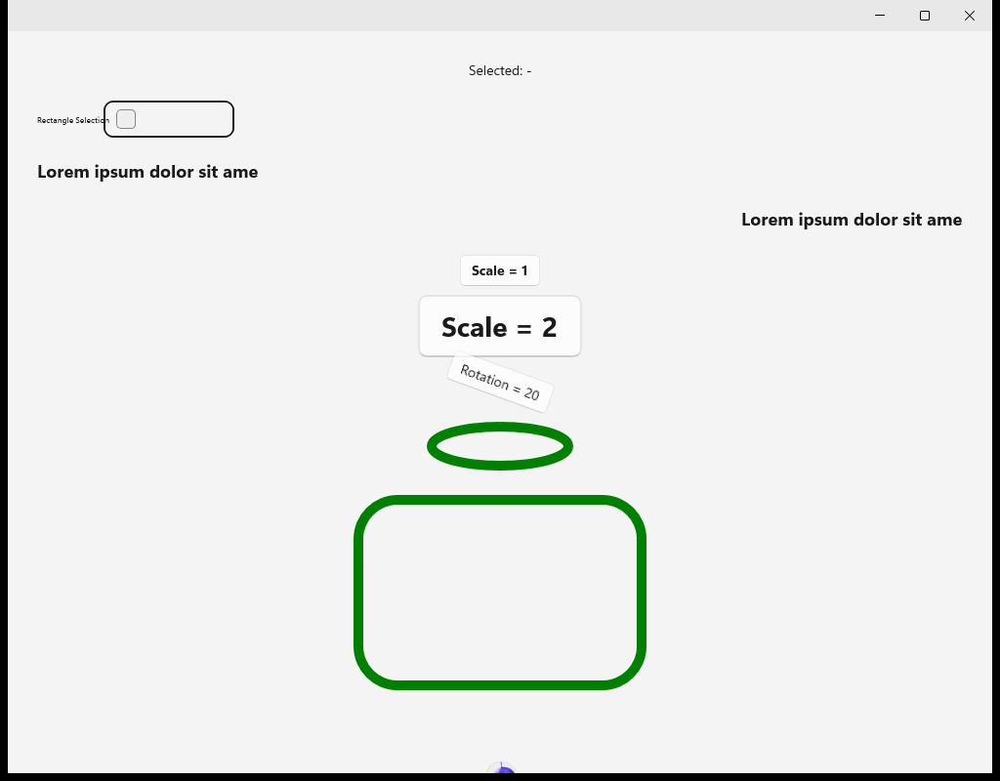</td><td>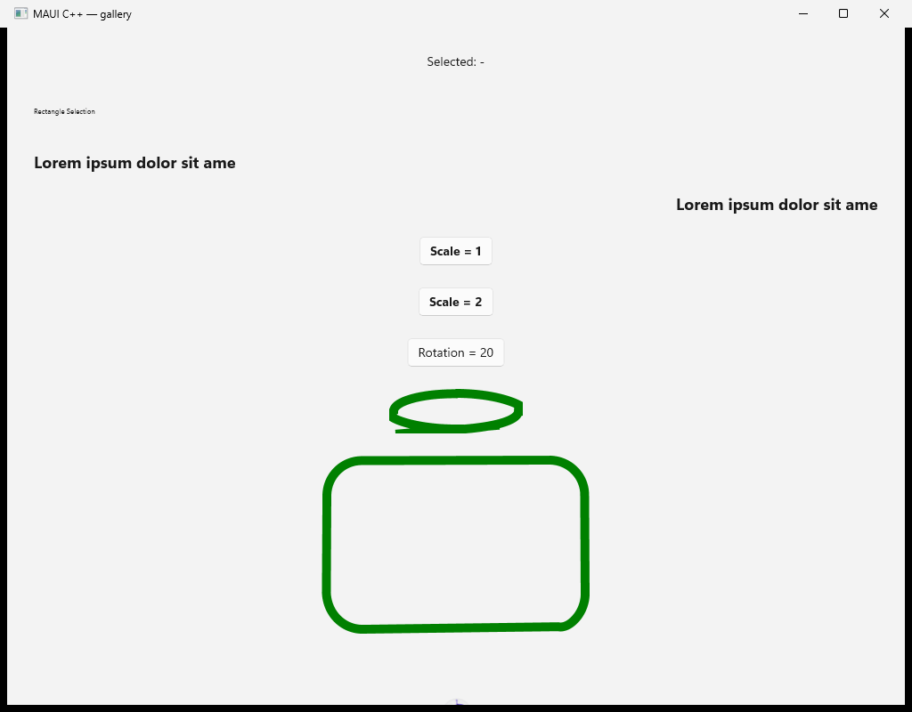</td><td>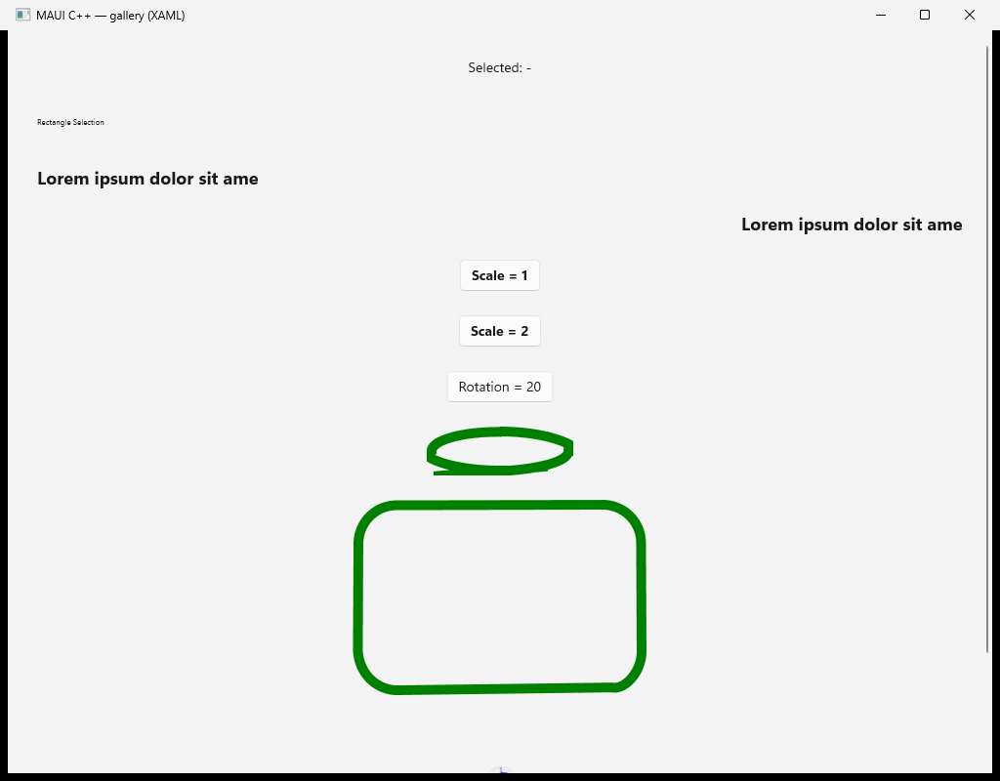</td></tr><tr><th>Dark</th><td>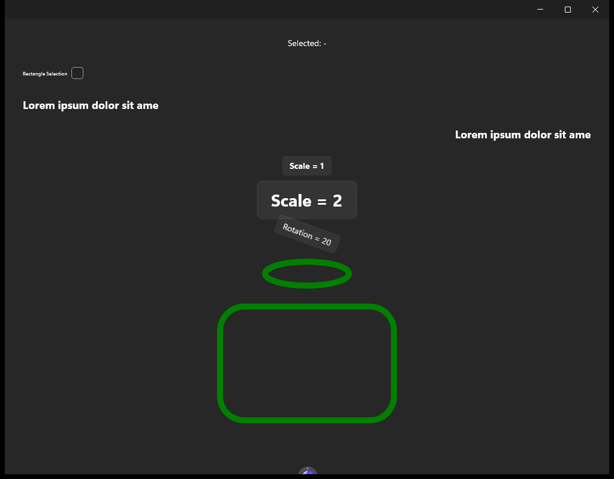</td><td>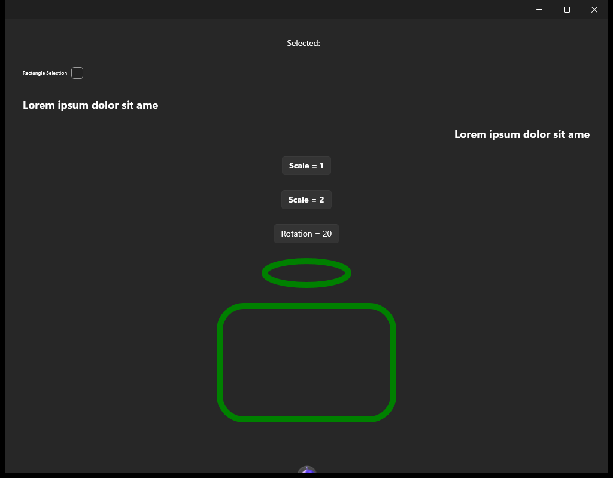</td><td>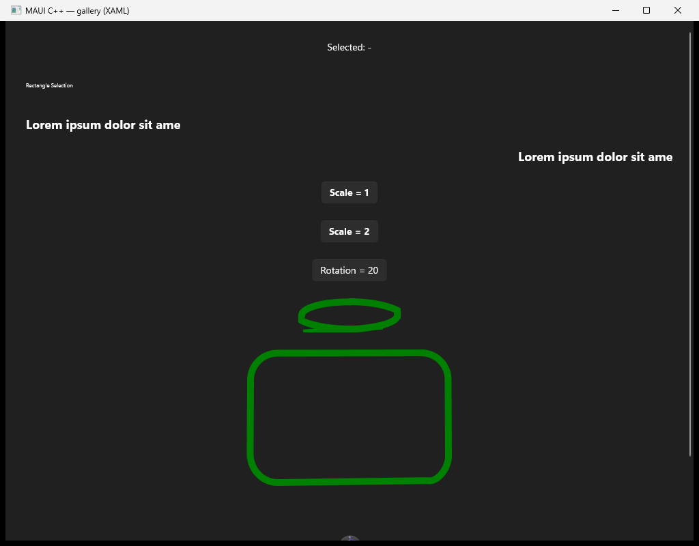</td></tr></table> | ports HitTestingPage.xaml (+ .xaml.cs) (Maui.Controls.Sample.Pages.HitTestingPage) | 🟡 Layout, green ring, green rounded rectangle, purple 3D duck, labels, checkbox, and 'Selected: -' text all match MAUI in both light and dark themes; button widths (full-width) match MAUI. Drift: MAUI visibly applies the render transforms to the three buttons — 'Scale = 2' is drawn at 2x (large text, tall button) and 'Rotation = 20' is rotated ~20 degrees — whereas the cpp port draws all three buttons flat, uniform-height, and untransformed. Missing transform rendering is the only meaningful difference; colors/fonts/other content are faithful in both themes. | 🟡 Green ring, green rounded rectangle, purple 3D duck, labels, checkbox, and 'Selected: -' text match MAUI in both themes. Two drifts vs MAUI: (1) same as cpp — the render transforms are not applied: MAUI draws 'Scale = 2' at 2x and 'Rotation = 20' rotated ~20deg, but xaml draws all three buttons flat and uniform. (2) Button sizing differs from MAUI: xaml renders auto-width buttons that hug their text and are centered, while MAUI's untransformed buttons are full-width. Content colors/fonts otherwise faithful in both light and dark. | 
| 77 | **Horizontal Stack** horizontal_stack | <table><tr><th></th><th>MAUI</th><th>C++</th><th>C++ &amp; XAML</th></tr><tr><th>Light</th><td></td><td></td><td></td></tr><tr><th>Dark</th><td></td><td></td><td></td></tr></table> | Horizontal Stack | 🟢 Both themes match MAUI. The six-box rainbow strip (red, yellow, blue, green, orange, purple) is present with identical box count, order, colors, sizes, and equal contiguous spacing (touching, no gaps). Title 'HorizontalStackLayout' matches. Strip position and centering match. Light bg is a hair lighter/warmer in cpp vs MAUI's neutral gray and dark bg is marginally darker, but these are AA-level page-chrome differences only. No missing/extra elements, no color/weight/layout drift. | 🟢 Both themes match MAUI. Identical six-box rainbow strip (red, yellow, blue, green, orange, purple), same order, colors, box sizes, contiguous no-gap spacing, and centered position. Title matches. Light background is slightly lighter and dark background slightly darker than MAUI, but that is page-chrome/AA-level only, not a content difference. No missing/extra element, no wrong color or layout. | 
| 78 | **Hybrid Web View** hybrid_web_view | <table><tr><th></th><th>MAUI</th><th>C++</th><th>C++ &amp; XAML</th></tr><tr><th>Light</th><td></td><td></td><td></td></tr><tr><th>Dark</th><td></td><td></td><td></td></tr></table> | ports HybridWebViewPage.xaml (+ HybridWebViewPage.xaml.cs) | Port-only demo — maui-compare has no such page (no MAUI reference). | Port-only demo — maui-compare has no such page (no MAUI reference). | 
| 79 | **Image** image | <table><tr><th></th><th>MAUI</th><th>C++</th><th>C++ &amp; XAML</th></tr><tr><th>Light</th><td></td><td></td><td></td></tr><tr><th>Dark</th><td></td><td></td><td></td></tr></table> | ports ImagePage.xaml (+ ImagePage.xaml.cs) | 🔴 Both themes show clear rendering bugs vs MAUI (identical to the xaml port). (1) UriSource image MISSING: MAUI renders the Microsoft building photo under the 'UriSource' label; the cpp port shows nothing there (blank/failed load) and collapses that space, so the submarine jumps up right under the labels. (2) FileSource submarine WRONG ASPECT/SIZE: MAUI renders the submarine tall (portrait, fills the panel height ~265px) on a solid purple background; cpp renders it wide/landscape, much shorter, with a transparent (page-colored) background and no purple fill. (3) MISSING labels/content: MAUI shows 'Stream Source' and 'Opacity (0.5)' text plus a faint semi-transparent image lower on the page; cpp omits these and instead shows an EXTRA large black rectangle containing a tiny rainbow heart (the animating-gif frame rendered on a black box) that does not appear in the MAUI capture at this scroll position. Same defects in light and dark. These are content/layout bugs, not just the harness inset. | 🔴 The xaml port is pixel-identical to the cpp port and exhibits the exact same bugs vs MAUI in both themes. (1) UriSource image MISSING: the Microsoft building photo that MAUI renders under 'UriSource' is absent (blank), collapsing that region. (2) FileSource submarine WRONG ASPECT/SIZE: MAUI shows it tall/portrait filling a purple panel (~265px high); xaml shows it wide/landscape, shorter, with a transparent page-colored background and no purple fill. (3) MISSING labels + EXTRA content: MAUI's 'Stream Source' / 'Opacity (0.5)' text and faint semi-transparent image are absent; instead a large black rectangle with a small rainbow heart appears, which has no counterpart in the MAUI capture. Identical defects in light and dark themes. | 
| 80 | **Image Button** image_button | <table><tr><th></th><th>MAUI</th><th>C++</th><th>C++ &amp; XAML</th></tr><tr><th>Light</th><td></td><td></td><td></td></tr><tr><th>Dark</th><td></td><td></td><td></td></tr></table> | ports ImageButtonPage.xaml (+ ImageButtonPage.xaml.cs) A self-contained, code-first demo page for the ImageButton control (the C# gallery-page convention, mirroring the input_controls_page / image_page pattern) | 🟡 Both themes: AspectFit/AspectFill/Fill green image buttons, BorderColor red bar + slider, CornerRadius slider, Custom Size purple thumbnail on white card, and Padding red/green bar all match MAUI (colors, sizes, slider positions, thumb accent correct). Minor drift: the 'CornerRadius = 0 / 10' sample buttons above the slider render as faint/near-blank thin lines in both light and dark, whereas MAUI shows two visible thin rounded green sample bars. Page scrolls further to show 'Animated GIF' with a black image area — MAUI crops earlier at 'Use Online Source'; this is the expected inset/crop difference, ignored. No missing/wrong-color primary controls. | 🟡 Nearly identical to the cpp port in both themes. Green AspectFit/AspectFill/Fill buttons, BorderColor bar + slider, CornerRadius slider, purple Custom Size thumbnail, and Padding red/green bar all match MAUI in color, size, and slider position (thumbs show correct salmon accent). Same minor drift as cpp: the 'CornerRadius = 0 / 10' sample bars above the slider appear faint/near-blank instead of MAUI's two visible thin rounded green strips, in both light and dark. Extra black 'Animated GIF' area below is the expected scroll/crop difference, not a bug. | 
| 81 | **Indicator** indicator | <table><tr><th></th><th>MAUI</th><th>C++</th><th>C++ &amp; XAML</th></tr><tr><th>Light</th><td></td><td></td><td></td></tr><tr><th>Dark</th><td></td><td></td><td></td></tr></table> | ports IndicatorPage.xaml A self-contained, code-first demo of the IndicatorView control | 🔴 Both themes: clear bugs. The Colors section renders a large solid YELLOW RECTANGLE (light and dark) where MAUI shows only small blue/red/blue indicator dots — a wrong/extra element. The indicator rows that do appear (Basic, Shape, Size, MaximumVisible) are compressed and shifted vs MAUI, and the Colors dots sit on top of the erroneous yellow block. A stray 'Item 1' carousel label appears in the lower CarouselView area where MAUI shows none. Dot colors/sizes for the present rows are roughly in the right family, but the yellow block and the missing/mis-rendered Colors row are structural defects in both light and dark. | 🔴 Both themes: nearly all indicator content is MISSING. Only the section labels (Basic, Colors, Indicator Shape, Size, HideSingle, MaximumVisible, Template, CarouselView) render — none of MAUI's indicator dot-rows appear for any section (no Basic 5-dot row, no Colors dots, no Shape squares, no Size circles, no MaximumVisible row, no Carousel dots). The only non-text element is a solid YELLOW RECTANGLE in the Colors area (same bug as cpp), which is wrong vs MAUI's small colored dots. Blank/missing layout for essentially the entire control set — a clear red in light and dark. | 
| 82 | **Input Controls** input_controls | <table><tr><th></th><th>MAUI</th><th>C++</th><th>C++ &amp; XAML</th></tr><tr><th>Light</th><td></td><td></td><td></td></tr><tr><th>Dark</th><td></td><td></td><td></td></tr></table> | a self-contained demo page for the W1-05 input-control set: editor, search_bar, radio_button (+ the radio_button_group attached grouping) and image_button on one vertical stack, wired together so every input drives a visible output (the C# | 🟡 Light + dark: all content matches MAUI - 'LENGTH: 0' label, Entry 'Type here...', SearchBar 'Search to insert' with magnifier, RadioButtons (UPPER selected red/orange, lower unselected), positions/text/colors correct in both themes. Two minor drifts vs MAUI, identical in both themes: (1) the Entry ('Type here...') is missing MAUI's red/orange focused-state bottom underline - cpp shows a plain flat bordered box; (2) the full-width horizontal separator line below the 'lower' radio button (present in MAUI) is absent. No missing/extra controls, no wrong colors on the visible elements, no stretched/blank layout. Drift only, not a clear bug. | 🟡 Light + dark: pixel-identical to the cpp port and matches MAUI on all content - label, Entry, SearchBar+icon, both RadioButtons (UPPER red/orange selected, lower unselected), text and colors correct in both themes. Same two minor drifts vs MAUI as cpp, in both themes: (1) missing the red/orange focused underline under the 'Type here...' Entry (shown as a flat box); (2) missing the full-width separator line beneath the 'lower' radio button. Otherwise no missing/extra elements, no wrong text/weight/color, no stretched controls. | 
| 83 | **Input Transparent** input_transparent | <table><tr><th></th><th>MAUI</th><th>C++</th><th>C++ &amp; XAML</th></tr><tr><th>Light</th><td></td><td></td><td></td></tr><tr><th>Dark</th><td></td><td></td><td></td></tr></table> | ports InputTransparentPage.xaml (Maui.Controls.Sample.Pages.InputTransparentPage) | 🟢 Both themes match MAUI. Light: same neutral page background, same stack of light bordered buttons (Clickable, Tap single clickable, Not Clickable, Tap single transparent, Top (transparent), Tap overlay, Test Button, Tap toggle set), identical section labels, identical off-state toggle switch, and the same intentional overlapping-text artifacts on the 'Top (transparent)' and 'Test Button' overlaid layers. Dark: same dark-gray buttons with the same chrome, same labels, same toggle, and the same overlap artifacts including the 'Bottom (clickable)' / 'Test Button + set layer' overlaps. Button sizes, spacing, corner radius, and text all match; the only differences are anti-aliasing / sub-pixel shading (cpp light button fill is a hair whiter, dark button top-edge highlight a hair flatter than MAUI's). No missing/extra elements, no wrong colors, no clipping, no wrong text. | 🟢 Both themes match MAUI and are essentially indistinguishable from the cpp port. Light: identical neutral page background, identical button stack and section labels, identical off-state toggle, and the same intentional overlapping-text artifacts on the overlaid 'Top (transparent)' and 'Test Button' layers. Dark: identical dark buttons, labels, toggle, and the same overlap artifacts. Sizes, spacing, corner radius, and text all match MAUI; differences are limited to anti-aliasing / sub-pixel shading. No missing/extra elements, no wrong color, no blank/wrong layout, no clipped or upscaled content. | 
| 84 | **Invalidate Brush** invalidate_brush | <table><tr><th></th><th>MAUI</th><th>C++</th><th>C++ &amp; XAML</th></tr><tr><th>Light</th><td></td><td></td><td></td></tr><tr><th>Dark</th><td></td><td></td><td></td></tr></table> | ports InvalidateBrushGallery.xaml A code-first port of the MAUI Shapes sub-gallery Pages/Controls/ShapesGalleries/InvalidateBrushGallery.xaml (&amp;quot;Invalidate Brushes Playground&amp;quot;): a VerticalStackLayout (Padding 12) with — - a &amp;quot;Change color&amp;quot; Bu | 🟢 Both themes match MAUI. Content identical: green 'Change color' button (correct green fill, modest corner radius, dark-green text roughly centered) flush at top-left; thick green horizontal rule to its right starting mid-width and vertically aligned near the button's lower edge; 'Brush color: Green' label left-aligned just below the button. Button size, corner radius, text placement, rule color/thickness/position, and label all match MAUI in both light and dark. Only differences are the ignored outer page-inset/background-shade and sub-pixel anti-aliasing. Light: match. Dark: match. | 🟡 Same content and intent as MAUI in both themes (green 'Change color' button top-left, green horizontal rule to the right, 'Brush color: Green' label below), correct colors and layout. Minor geometric drift on the button: its corner radius is clearly larger/more pill-like than MAUI's modest, near-square corners, and the button is slightly narrower with tighter internal padding around the text. The green rule sits a touch higher relative to the button top than in MAUI. These are a few-px size/shape differences, not rendering bugs; content is unmistakably the same. Applies to both light and dark. Fix: reduce button CornerRadius to match MAUI and match its padding. | 
| 85 | **Invalidate Shadow Host** invalidate_shadow_host | <table><tr><th></th><th>MAUI</th><th>C++</th><th>C++ &amp; XAML</th></tr><tr><th>Light</th><td></td><td></td><td></td></tr><tr><th>Dark</th><td></td><td></td><td></td></tr></table> | ports InvalidateShadowHostPage.xaml A self-contained, code-first demo that a shadow re-applies (invalidates) when its host&amp;#x27;s size changes, mirroring the C# core gallery page (Pages/Core/ShadowGalleries/InvalidateShadowHostPage.xaml + .xaml. | 🔴 Light + dark: MISSING SHADOW. In MAUI the green-bordered white host box casts a distinct RED shadow (offset X/Y=10, radius 10, opacity 1.00) — a red blurred glow band beneath the box's bottom edge, clearly visible in both themes. The cpp port renders NO shadow at all: the green box sits directly on the page background with nothing beneath it. Since the red shadow is the entire subject of this 'invalidate_shadow_host' page, its complete absence is a rendering bug. All other content matches MAUI: 'Host' label, 'Update Host Size' button, 'Shadow'/'Offset X: 10'/'Offset Y: 10'/'Radius: 10'/'Opacity: 1.00' labels, red sliders with correct thumb positions, and the green-bordered white box (size, border color/thickness) are all correct in both light and dark. | 🔴 Light + dark: MISSING SHADOW — identical defect to the cpp port. MAUI renders a red drop shadow (offset X/Y=10, radius 10, opacity 1.00) as a red blurred band beneath the green-bordered white host box in both themes; the xaml port renders NO shadow, the box sitting directly on the page background. This is the defining feature of the page, so its absence is a rendering bug. Everything else matches MAUI: 'Host' label, 'Update Host Size' button, the Shadow/Offset/Radius/Opacity labels, the red sliders with correct thumb positions, and the green-bordered white box (size, border) render correctly in both light and dark. | 
| 86 | **Ios Blur Effect** ios_blur_effect | <table><tr><th></th><th>MAUI</th><th>C++</th><th>C++ &amp; XAML</th></tr><tr><th>Light</th><td></td><td></td><td></td></tr><tr><th>Dark</th><td></td><td></td><td></td></tr></table> | ports iOSBlurEffectPage.xaml The .NET MAUI PlatformSpecifics sample (Pages/PlatformSpecifics/iOS/iOSBlurEffectPage.xaml + .xaml.cs): an Image (Source=&amp;quot;oasis.jpg&amp;quot;) carrying the iOSSpecific VisualElement.BlurEffect knob (XAML seeds it to Extr | Port-only demo — maui-compare has no such page (no MAUI reference). | Port-only demo — maui-compare has no such page (no MAUI reference). | 
| 87 | **Ios Date Picker** ios_date_picker | <table><tr><th></th><th>MAUI</th><th>C++</th><th>C++ &amp; XAML</th></tr><tr><th>Light</th><td></td><td>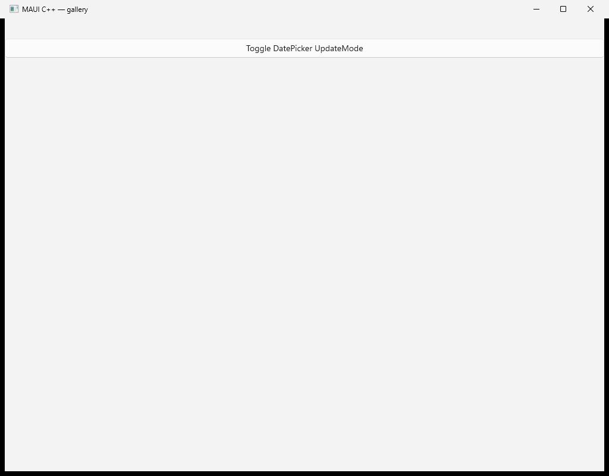</td><td>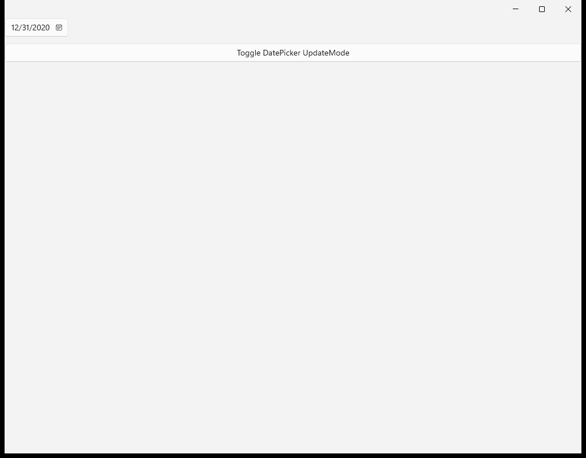</td></tr><tr><th>Dark</th><td></td><td>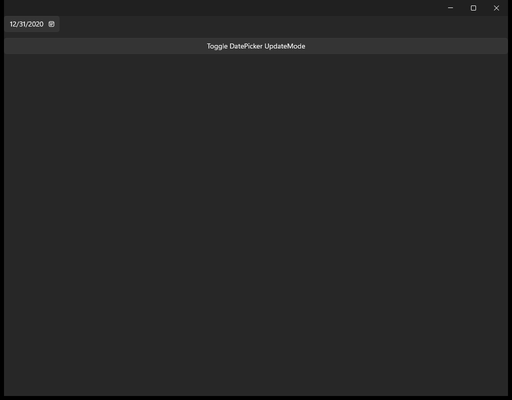</td><td></td></tr></table> | ports iOSDatePickerPage.xaml (+ iOSDatePickerPage.xaml.cs) | Port-only demo — maui-compare has no such page (no MAUI reference). | Port-only demo — maui-compare has no such page (no MAUI reference). | 
| 88 | **Ios Entry** ios_entry | <table><tr><th></th><th>MAUI</th><th>C++</th><th>C++ &amp; XAML</th></tr><tr><th>Light</th><td></td><td></td><td></td></tr><tr><th>Dark</th><td></td><td></td><td></td></tr></table> | ports iOSEntryPage.xaml (+ iOSEntryPage.xaml.cs) | Port-only demo — maui-compare has no such page (no MAUI reference). | Port-only demo — maui-compare has no such page (no MAUI reference). | 
| 89 | **Ios First Responder** ios_first_responder | <table><tr><th></th><th>MAUI</th><th>C++</th><th>C++ &amp; XAML</th></tr><tr><th>Light</th><td></td><td></td><td></td></tr><tr><th>Dark</th><td></td><td></td><td></td></tr></table> | ports iOSFirstResponderPage.xaml (+ .xaml.cs) The C# iOSFirstResponderPage is a VisualElement-first-responder demo: a StackLayout with an explanatory Label, a &amp;quot;First Entry&amp;quot; + plain &amp;quot;OK&amp;quot; Button (tapping OK dismisses the keyboard because the | Port-only demo — maui-compare has no such page (no MAUI reference). | Port-only demo — maui-compare has no such page (no MAUI reference). | 
| 90 | **Ios Pan Gesture** ios_pan_gesture | <table><tr><th></th><th>MAUI</th><th>C++</th><th>C++ &amp; XAML</th></tr><tr><th>Light</th><td></td><td></td><td></td></tr><tr><th>Dark</th><td></td><td></td><td></td></tr></table> | ports iOSPanGestureRecognizerPage.xaml (+ .xaml.cs) The C# iOSPanGestureRecognizerPage is a StackLayout with: a bold message Label (_messageLabel), a &amp;quot;Toggle Simultaneous Gesture Recognition&amp;quot; Button, and a grouped ListView of employees whos | Port-only demo — maui-compare has no such page (no MAUI reference). | Port-only demo — maui-compare has no such page (no MAUI reference). | 
| 91 | **Ios Picker** ios_picker | <table><tr><th></th><th>MAUI</th><th>C++</th><th>C++ &amp; XAML</th></tr><tr><th>Light</th><td></td><td>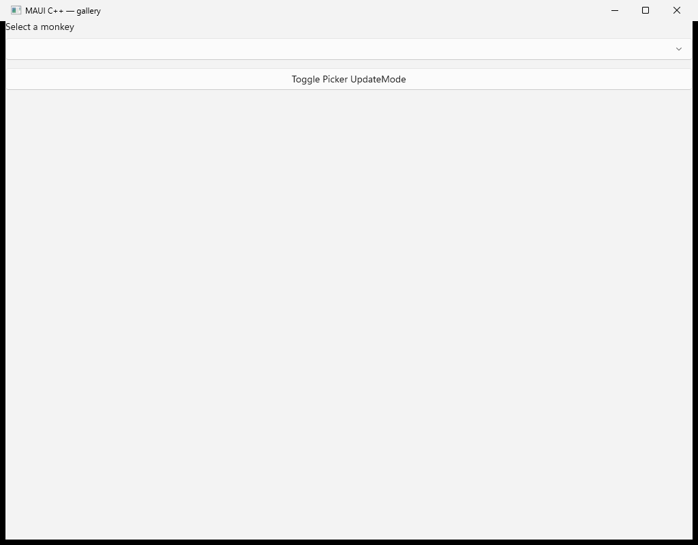</td><td>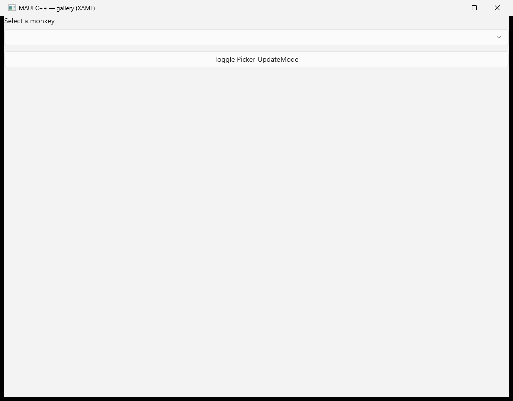</td></tr><tr><th>Dark</th><td></td><td></td><td>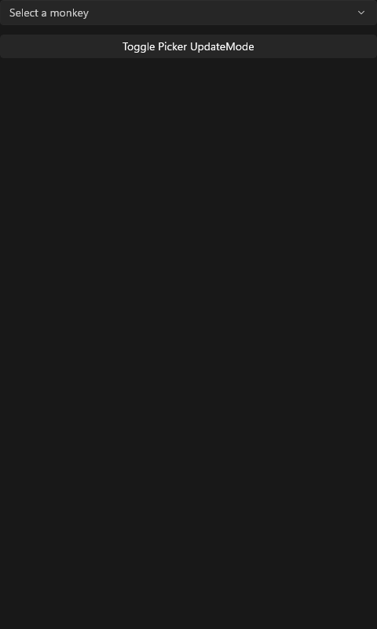</td></tr></table> | ports iOSPickerPage.xaml (+ iOSPickerPage.xaml.cs) | Port-only demo — maui-compare has no such page (no MAUI reference). | Port-only demo — maui-compare has no such page (no MAUI reference). | 
| 92 | **Ios Safe Area** ios_safe_area | <table><tr><th></th><th>MAUI</th><th>C++</th><th>C++ &amp; XAML</th></tr><tr><th>Light</th><td></td><td></td><td></td></tr><tr><th>Dark</th><td></td><td></td><td></td></tr></table> | ports iOSSafeAreaPage.xaml The .NET MAUI PlatformSpecifics sample (Pages/PlatformSpecifics/iOS/iOSSafeAreaPage.xaml + .xaml.cs): a long Lorem-ipsum Label over a &amp;quot;Disable Use Safe Area&amp;quot; button | Port-only demo — maui-compare has no such page (no MAUI reference). | Port-only demo — maui-compare has no such page (no MAUI reference). | 
| 93 | **Ios Scroll View** ios_scroll_view | <table><tr><th></th><th>MAUI</th><th>C++</th><th>C++ &amp; XAML</th></tr><tr><th>Light</th><td></td><td></td><td></td></tr><tr><th>Dark</th><td></td><td></td><td></td></tr></table> | ports iOSScrollViewPage.xaml (+ iOSScrollViewPage.xaml.cs) | Port-only demo — maui-compare has no such page (no MAUI reference). | Port-only demo — maui-compare has no such page (no MAUI reference). | 
| 94 | **Ios Search Bar** ios_search_bar | <table><tr><th></th><th>MAUI</th><th>C++</th><th>C++ &amp; XAML</th></tr><tr><th>Light</th><td></td><td></td><td></td></tr><tr><th>Dark</th><td></td><td></td><td></td></tr></table> | ports iOSSearchBarPage.xaml (+ iOSSearchBarPage.xaml.cs) | Port-only demo — maui-compare has no such page (no MAUI reference). | Port-only demo — maui-compare has no such page (no MAUI reference). | 
| 95 | **Ios Slider Update On Tap** ios_slider_update_on_tap | <table><tr><th></th><th>MAUI</th><th>C++</th><th>C++ &amp; XAML</th></tr><tr><th>Light</th><td></td><td></td><td></td></tr><tr><th>Dark</th><td></td><td></td><td></td></tr></table> | ports iOSSliderUpdateOnTapPage.xaml (+ iOSSliderUpdateOnTapPage.xaml.cs) | Port-only demo — maui-compare has no such page (no MAUI reference). | Port-only demo — maui-compare has no such page (no MAUI reference). | 
| 96 | **Ios Swipe Transition** ios_swipe_transition | <table><tr><th></th><th>MAUI</th><th>C++</th><th>C++ &amp; XAML</th></tr><tr><th>Light</th><td></td><td></td><td></td></tr><tr><th>Dark</th><td></td><td></td><td></td></tr></table> | ports iOSSwipeViewTransitionModePage.xaml (+ .xaml.cs) The C# iOSSwipeViewTransitionModePage is a StackLayout with: a horizontal row holding a &amp;quot;SwipeTransitionMode:&amp;quot; Label + an EnumPicker over the SwipeTransitionMode enum (Reveal / Drag, Se | Port-only demo — maui-compare has no such page (no MAUI reference). | Port-only demo — maui-compare has no such page (no MAUI reference). | 
| 97 | **Ios Time Picker** ios_time_picker | <table><tr><th></th><th>MAUI</th><th>C++</th><th>C++ &amp; XAML</th></tr><tr><th>Light</th><td></td><td></td><td></td></tr><tr><th>Dark</th><td></td><td></td><td></td></tr></table> | ports iOSTimePickerPage.xaml The .NET MAUI PlatformSpecifics sample (Pages/PlatformSpecifics/iOS/iOSTimePickerPage.xaml + .xaml.cs): a TimePicker carrying the iOSSpecific TimePicker.UpdateMode knob (XAML seeds it to WhenFinished) over a but | Port-only demo — maui-compare has no such page (no MAUI reference). | Port-only demo — maui-compare has no such page (no MAUI reference). | 
| 98 | **Items** items | <table><tr><th></th><th>MAUI</th><th>C++</th><th>C++ &amp; XAML</th></tr><tr><th>Light</th><td></td><td></td><td></td></tr><tr><th>Dark</th><td></td><td></td><td></td></tr></table> | a self-contained demo page for the W2-19 items core: a collection_view over a live observable items source with a templated cell, single selection driving a readout label, and an EmptyView for the cleared state (the C# CollectionView galler | 🔴 Both light and dark: RED. Same content and text as MAUI (Today / Water the plants / Review the port / Ship wave 2 / Pick a task), but two clear layout bugs vs the MAUI ground truth. (1) Row vertical spacing is too large: MAUI packs the four header rows at ~19px line-height (Today y=10, Water y=29, Review y=48, Ship y=67); the cpp port spreads them at ~24px (Today y=10, Water y=34, Review y=58, Ship y=82), so each row sits progressively lower. (2) The 'Pick a task' item is grossly mispositioned: MAUI places it right below the group at y~98, but cpp drops it far down the page at y~322 — a large extra vertical gap (~200px of empty space) that MAUI does not have. This is a wrong-layout rendering bug, not anti-aliasing. Text color/weight and left inset otherwise match. | 🔴 Both light and dark: RED. The xaml capture is pixel-identical to the cpp capture and exhibits the exact same layout bugs vs MAUI. Content/text match (Today / Water the plants / Review the port / Ship wave 2 / Pick a task). (1) Row spacing too tall: ~24px line-height vs MAUI's ~19px, so Water/Review/Ship rows drift downward (Ship at y=82 vs MAUI y=67). (2) 'Pick a task' is placed at y~322 instead of MAUI's y~98, leaving a large ~200px empty gap that MAUI does not have. Wrong-layout rendering bug in both themes; colors and left inset otherwise match MAUI. | 
| 99 | **Items Updating Scroll Mode** items_updating_scroll_mode | <table><tr><th></th><th>MAUI</th><th>C++</th><th>C++ &amp; XAML</th></tr><tr><th>Light</th><td></td><td></td><td></td></tr><tr><th>Dark</th><td></td><td></td><td></td></tr></table> | ports ItemsUpdatingScrollModeGallery.xaml (+ .xaml.cs) of the C# CollectionView gallery (Maui.Controls.Sample.Pages.CollectionViewGalleries.ScrollModeGalleries.ItemsUpdatingScrollModeGallery) | 🟡 Both themes: same content, colors, and layout as MAUI (header label + KeepItemsInView/KeepScrollOffset/KeepLast segmented buttons, Add Item button, 'Mode: KeepItemsInView · Items: 50' status line, and the 'Title N — Subtitle N' list all present and correctly positioned; light bg near-white, dark bg dark-gray, text colors match). The one consistent drift is list row line-spacing: cpp uses a taller row height / looser vertical gap between items than MAUI's denser packing, so the same viewport shows only through ~Title 29 where MAUI reaches ~Title 36. The 'Add Item' button cell is also very slightly shorter than MAUI's, and the em-dash separator renders a touch lighter. No missing/extra elements, no wrong text or color — clearly the same intent, only spacing drift. Identical to the xaml port. | 🟡 Both themes: pixel-identical to the cpp port and matches MAUI on content, colors, and layout (header + three segmented buttons, Add Item button, 'Mode: KeepItemsInView · Items: 50' status line, and 'Title N — Subtitle N' list all present and correctly placed; correct light/dark backgrounds and text colors). Same single drift as cpp: list row spacing is looser than MAUI (rows taller, so the viewport reaches only ~Title 29 vs MAUI's ~Title 36), the Add Item button is a hair shorter, and the em-dash separator is slightly lighter. No missing/extra elements, no wrong text/color — same content and intent, minor spacing drift only. | 
| 100 | **Label** label | <table><tr><th></th><th>MAUI</th><th>C++</th><th>C++ &amp; XAML</th></tr><tr><th>Light</th><td></td><td></td><td></td></tr><tr><th>Dark</th><td></td><td></td><td></td></tr></table> | ports LabelPage.xaml (+ LabelPage.xaml.cs) | 🟢 Both themes match MAUI. Header 'Defaults', red 'This text should be RED', CYAN-background label, start/center/end horizontal-alignment rows, the justified Lorem paragraph, the three tall vertical-alignment boxes (start/center/bottom), the FormattedString row and 'Change Formatted String' button, and the bottom Lorem paragraphs all render with matching colors, weights, sizes, alignment and layout in both light and dark. Only nit (shared with xaml, AA-level): in the FormattedString row MAUI paints a cyan highlight box behind the 'Colors' span; cpp renders 'Colors' as blue text without that cyan box. Bottom Lorem paragraph lengths match MAUI's pattern. No missing/extra elements, no wrong colors or stretched controls. | 🟢 Both themes match MAUI. Same content and layout as ground truth: 'Defaults' header, red text, CYAN label, horizontal start/center/end rows, justified Lorem paragraph, three vertical-alignment boxes, FormattedString row ('Plain old Text | Colors | Strikethrough | Big Font | Plain old Text'), and 'Change Formatted String' button all render correctly with matching colors/weights/alignment in light and dark. Nits only (minor drift): (1) same as cpp, the 'Colors' span lacks MAUI's cyan highlight box in light theme (present in dark), rendered as blue text; (2) the below-the-fold Lorem paragraphs are all shown at full length rather than MAUI's progressively-truncated variants, but that is a crop/scroll-offset difference over identical content, not a layout bug. No missing/extra elements, wrong text, or stretched controls. | 
| 101 | **Layout Is Enabled** layout_is_enabled | <table><tr><th></th><th>MAUI</th><th>C++</th><th>C++ &amp; XAML</th></tr><tr><th>Light</th><td></td><td></td><td></td></tr><tr><th>Dark</th><td></td><td></td><td></td></tr></table> | ports LayoutIsEnabledPage.xaml (+ LayoutIsEnabledPage.xaml.cs) The C# page demonstrates how IsEnabled on a layout cascades to its children: a 2x2 grid whose left column hosts a &amp;quot;MainLayout&amp;quot; full of state-demo sub-stacks (all-enabled / all-d | 🟢 Both light and dark: match. Left column (primary content) reproduces MAUI faithfully — all seven labeled groups, button fill colors (light-blue enabled, teal 'first item'/'commands', pink 'layout is disabled', gray nested-layout with blue border), enabled/disabled text states, and the two bottom action buttons ('Disable Layout', 'Enable Button') all render at correct sizes, colors, and spacing. Right column duplicate (dimmed/disabled group copies) and the 'Enable/Disable Layout/Button/Command' text lines also match. The only port-vs-MAUI delta is the checkboxes visible at the bottom of the right column, which fall in the top/bottom crop zone the harness rules require ignoring (MAUI crops them off; the port shows more page). Backgrounds track theme correctly (light gray / near-black). No color, size, missing/extra-element, or text bugs in-frame. | 🟢 Both light and dark: match. Renders identically to MAUI for all in-frame content — the seven labeled groups, all button fill colors (light-blue, teal, pink disabled-layout, gray blue-bordered nested), enabled/disabled label states, and the two action buttons ('Disable Layout', 'Enable Button') are correct in size, color, and spacing across both themes. Right-column duplicate groups and 'Enable/Disable' text lines match. The only difference from MAUI is the checkbox(es) appearing at the very bottom of the right column near the 'Enable/Disable' text — these sit in the harness top/bottom crop zone that the rules require ignoring (MAUI crops them off). Minor: the checkbox placement is interleaved just under each text line rather than the cpp port's stacked arrangement, but this is crop-zone content and not an in-frame parity defect. No color, size, missing-element, or text bugs in the visible content. | 
| 102 | **Line Gallery** line_gallery | <table><tr><th></th><th>MAUI</th><th>C++</th><th>C++ &amp; XAML</th></tr><tr><th>Light</th><td></td><td></td><td></td></tr><tr><th>Dark</th><td></td><td></td><td></td></tr></table> | ports LineGallery.xaml A self-contained, code-first port of the MAUI Shapes LineGallery (Pages/Controls/ShapesGalleries/LineGallery.xaml + .xaml.cs) | 🟢 Both themes match MAUI. Light: all three labels ('A basic Line', 'A dash Line', 'A Line using StrokeThickness') render at the same positions with the same font/color; the purple basic line, orange dashed line, and thick black StrokeThickness line all match MAUI in position, angle, length, color, thickness, and dash spacing. Dark: identical parity - light-gray labels, same purple/orange/black strokes, same geometry. Only differences are the outer page-inset/background wrapper (ignored per rules) and sub-pixel anti-aliasing on the diagonal strokes. No content, color, size, or spacing drift. | 🟢 Both themes match MAUI. Light: the three labels and the three lines (purple basic, orange dashed, thick black StrokeThickness) match MAUI in position, angle, length, stroke color, thickness, and dash pattern; label text and typography match. Dark: identical parity - correct label color on dark background and the same three strokes with matching geometry and colors. The xaml render is effectively indistinguishable from the cpp render and from MAUI. Only ignorable differences are the outer page-inset/background wrapper and anti-aliasing along the diagonal strokes. | 
| 103 | **Line Join Gallery** line_join_gallery | <table><tr><th></th><th>MAUI</th><th>C++</th><th>C++ &amp; XAML</th></tr><tr><th>Light</th><td></td><td></td><td></td></tr><tr><th>Dark</th><td></td><td></td><td></td></tr></table> | ports LineJoinGallery.xaml A self-contained, code-first port of the MAUI Shapes sub-gallery Pages/Controls/ShapesGalleries/LineJoinGallery.xaml: a StackLayout that demonstrates the three StrokeLineJoin variants on an identical open polyline | 🟢 Match in both themes. All three zigzag polylines render correctly: Miter shows a sharp point at the apex, Bevel a flat-cut apex, Round a rounded apex — identical join geometry to MAUI. Stroke thickness, cyan fill color, the three left-aligned labels (Miter (default):, Bevel:, Round:) and their vertical spacing all align with MAUI. Light and dark both correct. Only differences are anti-aliasing/sub-pixel and the ignorable uniform page-background tone (port's neutral vs MAUI's slightly warmer off-white / dark gray). | 🟢 Match in both themes. Identical to MAUI (and to the cpp port): the three cyan zigzag polylines show the correct per-join apex shapes — sharp Miter point, flat Bevel cut, rounded Round apex. Stroke width, color, label text/placement, and inter-shape spacing all align in light and dark. Only anti-aliasing/sub-pixel noise and the ignorable uniform page-background tone differ. | 
| 104 | **Measure First Strategy** measure_first_strategy | <table><tr><th></th><th>MAUI</th><th>C++</th><th>C++ &amp; XAML</th></tr><tr><th>Light</th><td></td><td></td><td></td></tr><tr><th>Dark</th><td></td><td></td><td></td></tr></table> | ports MeasureFirstStrategy.xaml (+ .xaml.cs) of the C# CollectionView gallery (Maui.Controls.Sample.Pages.CollectionViewGalleries.GroupingGalleries.MeasureFirstStrategy) | 🟢 Both themes match MAUI. Header text ('Using ItemSizingStrategy.MeasureFirstItem...'), the 'Toggle Sizing Strategy' button, and the 'ItemSizingStrategy: MeasureFirstItem' label all render identically. The grouped CollectionView renders fully and correctly: green group headers (Avengers, Fantastic Four, Defenders, Heroes for Hire), all black/white member rows in correct order, and the orange 'Total members: N' footers all present and correctly colored/positioned in both light and dark. Only differences are the known outer page-inset/global-shift (cpp content sits slightly higher/tighter, per harness-wrapper rule) and sub-pixel row spacing — content, colors, and intent are identical. Match. | 🔴 Clear rendering BUG in BOTH light and dark themes: the entire grouped CollectionView is MISSING. MAUI (and the cpp port) render the full grouped list below the label — green group headers (Avengers, Fantastic Four, Defenders, Heroes for Hire), all member rows (Thor, Captain America, Iron Man, ...), and orange 'Total members: N' footers. In the xaml capture, everything below the 'ItemSizingStrategy: MeasureFirstItem' label is a completely blank empty area (light-gray in light theme, near-black in dark theme). The header, Toggle button, and strategy label render fine, but the CollectionView produces zero visible items — the primary content of the page is absent. This is a blank-layout / missing-element bug, not minor drift. | 
| 105 | **Menu Bar** menu_bar | <table><tr><th></th><th>MAUI</th><th>C++</th><th>C++ &amp; XAML</th></tr><tr><th>Light</th><td></td><td></td><td></td></tr><tr><th>Dark</th><td></td><td></td><td></td></tr></table> | ports MenuBarPage.xaml (+ MenuBarPage.cs) The C# page declares three page-level MenuBarItems (Page.MenuBarItems — the app menu bar) and a small visible body: - &amp;quot;Before File&amp;quot; : &amp;quot;Before File Action&amp;quot; (accelerator &amp;quot;b&amp;quot;), &amp;quot;Cool item 1&amp;quot;, a separat | 🟡 Content matches MAUI in both themes: 'You clicked on Menu Item:' label at top and a full-width 'Toggle Menu Bar Item' button below. LIGHT: page background is a slightly cooler/darker gray (~#EAEAEA) than MAUI's warmer off-white (~#F2F2F2); button fill and text match. DARK: page background is a very deep near-black, noticeably darker than MAUI's dark-gray (~#212121); button fill/border are close to MAUI. Label sits flush to the top-left with no top inset vs MAUI's small inset, but that is the known harness wrapper-inset diff and is ignored. Remaining deltas are minor background-color drift (cooler light gray, too-dark dark background), same content and intent throughout — no rendering bug. | 🟢 Both themes are a near-identical match to MAUI. Content identical: 'You clicked on Menu Item:' label and full-width 'Toggle Menu Bar Item' button. LIGHT: background gray, button fill, text, and layout all match MAUI closely; label has a proper top inset like MAUI. DARK: background dark-gray, button fill, and low-contrast border all track MAUI. Only anti-aliasing / sub-pixel differences and the ignorable outer page inset remain. | 
| 106 | **Modal** modal | <table><tr><th></th><th>MAUI</th><th>C++</th><th>C++ &amp; XAML</th></tr><tr><th>Light</th><td></td><td></td><td></td></tr><tr><th>Dark</th><td></td><td></td><td></td></tr></table> | ports ModalPage.xaml (+ .xaml.cs) | 🟡 Content matches MAUI exactly in both themes: title 'Modal Page 1', the four active buttons (Push Page, Push Modal Page, Push Modal Navigation Page, Push Modal Flyout Page), the disabled 'Pop Modal Page', and status line 'Modal depth: 0 | page stack depth: 1'. Text, colors, and background tones are correct in both light and dark. Minor drift only: (1) the port's buttons have visibly rounder corners (~6-8px radius) vs MAUI's near-square ~2px corners; (2) button vertical spacing/pitch is slightly larger, so the button stack and the status line sit a few px lower than MAUI. Same content and intent throughout — not a bug. | 🟡 Effectively identical to the cpp port and matches MAUI content exactly in both themes: same title, same four active buttons, same disabled 'Pop Modal Page', same status line, correct light/dark colors and text. Same minor drift vs MAUI: (1) rounder button corners (~6-8px vs MAUI's ~2px near-square); (2) slightly larger inter-button spacing pushing the stack and status line a few px lower. Consistent, same-intent rendering — no rendering bug (no missing/extra elements, no wrong color/text/clipping). | 
| 107 | **Multiple Bound Selection** multiple_bound_selection | <table><tr><th></th><th>MAUI</th><th>C++</th><th>C++ &amp; XAML</th></tr><tr><th>Light</th><td></td><td></td><td></td></tr><tr><th>Dark</th><td></td><td></td><td></td></tr></table> | ports MultipleBoundSelection.xaml (+ .xaml.cs) (Maui.Controls.Sample.Pages.CollectionViewGalleries.SelectionGalleries.MultipleBoundSelection) | 🔴 LIGHT + DARK (same bug both themes): The CollectionView item template is not rendered. MAUI shows each row (Item 0-3) with a leading CheckBox, with Item 1 and Item 2 checked (red checkmarks) and their rows given a light selection-highlight background; a 'This is the header' header sits above the list. The cpp port renders the items as plain text-only labels: NO checkboxes at all, NO checked state on Item 1/Item 2, and NO selection highlight on the selected rows. This drops the entire point of the multiple-bound-selection test. Secondary drift: the item rows are taller/more spaced, so the three buttons (Clear and Add / Reset / Direct Update) are pushed to roughly mid-page instead of sitting directly under the CollectionView near the top as in MAUI. Button chrome/colors otherwise match MAUI per theme. Missing template elements + wrong layout position = clear rendering bug. | 🔴 LIGHT + DARK (same bug both themes, identical to the cpp port): The CollectionView item template is not rendered. MAUI shows Item 0-3 each with a leading CheckBox, Item 1 and Item 2 checked (red checkmarks) with a light selection-highlight background, under a 'This is the header' header. The xaml port renders items as plain text-only labels: NO checkboxes, NO checked/selected visual on Item 1/Item 2, and NO selection highlight. The core selection state the test verifies is entirely absent. Secondary drift: taller item spacing pushes the three buttons (Clear and Add / Reset / Direct Update) down to about mid-page rather than directly beneath the list near the top as in MAUI. Button styling matches MAUI per theme. Missing template + selection visuals + displaced buttons = clear rendering bug. | 
| 108 | **Navigation Gallery** navigation_gallery | <table><tr><th></th><th>MAUI</th><th>C++</th><th>C++ &amp; XAML</th></tr><tr><th>Light</th><td></td><td></td><td></td></tr><tr><th>Dark</th><td></td><td></td><td></td></tr></table> | ports NavigationGallery.xaml (+ .xaml.cs) | 🟡 Both themes: content, colors, and all six button labels match MAUI exactly (header 'Stack depth: 1 | top: PAGE NUMBER 1 | secondary toolbar items: 0'; buttons Push Page / Pop Page / Insert Page Before Current / Remove Page Before Current / Pop To Root / Toggle Secondary Toolbar Item). Theme colors match per light/dark. The only drift is button vertical rhythm: cpp buttons are slightly shorter with tighter inter-button gaps than MAUI's taller, more spaced buttons — MAUI's 6th button bottom lands ~y=255 vs cpp ~y=245, so a few px less height/spacing per row. Same content and intent, clearly the same page; minor spacing/size drift only. No missing/extra elements, no color or text errors, no layout bug. | 🟡 Both themes: identical to MAUI in content, colors, and all six button labels and header text; light/dark theme colors match. Same single drift as the cpp port — button rows are marginally shorter with tighter vertical spacing than MAUI's taller, more generously spaced buttons (a few px per row). The xaml capture is essentially pixel-identical to the cpp capture. Same content and intent; minor spacing/size drift only, no missing/extra elements, wrong colors, wrong text, or layout bug. | 
| 109 | **Nested Collection** nested_collection | <table><tr><th></th><th>MAUI</th><th>C++</th><th>C++ &amp; XAML</th></tr><tr><th>Light</th><td></td><td></td><td></td></tr><tr><th>Dark</th><td></td><td></td><td></td></tr></table> | ports NestedGalleries/NestedCollectionViewGallery.xaml (+ NestedCollectionViewGallery.xaml.cs) of the C# CollectionView gallery | 🔴 The full nested structure renders correctly: all 8 'Source N' rows are present, each followed by its horizontal CollectionView of blue 'Caption N-M' captions, with spacing and blue caption color matching MAUI in both themes. BUG (both light and dark): the 'Source N' section labels are rendered RED and ITALIC, whereas MAUI renders them as plain non-italic labels in the default text color (near-black on light, white/light-gray on dark). Wrong color + wrong font style on every source label is a clear port bug. Everything else (caption text, layout, row spacing, backgrounds) matches. | 🔴 Severe rendering bug in BOTH themes: only the header line 'It's CollectionViews all the way down.' renders. The entire nested CollectionView content is MISSING — none of the 8 'Source N' labels and none of the horizontal 'Caption N-M' caption lists appear; the rest of the page is blank. MAUI shows all 8 source rows fully populated. This is a completely blank/failed layout for the primary content. | 
| 110 | **Pan Gesture Events** pan_gesture_events | <table><tr><th></th><th>MAUI</th><th>C++</th><th>C++ &amp; XAML</th></tr><tr><th>Light</th><td></td><td></td><td>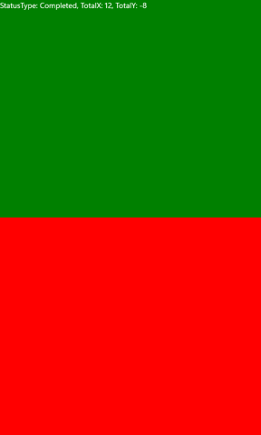</td></tr><tr><th>Dark</th><td>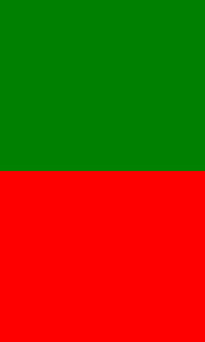</td><td></td><td></td></tr></table> | ports PanGestureEventsGallery.xaml (+ .xaml.cs) (Maui.Controls.Sample.Pages.PanGestureEventsGallery) | 🟡 The core panned control matches MAUI exactly in both themes: green top half + red bottom half BoxView split at the vertical midpoint, identical saturated green/red colors, identical proportions, and the split line at the same position. The one drift: the cpp port renders a visible white status label ('StatusType: Completed, TotalX: 0, TotalY: 0') overlaid on the top-left of the green box, which MAUI's capture does NOT surface (MAUI shows the green flush to the very top with no label text). Same content and intent, but the extra visible status text over the box is a layout/z-order/crop difference from MAUI. Note the cpp status reads 'TotalX: 0, TotalY: 0' (no pan delta captured in this frame) vs xaml's 'TotalX: 12, TotalY: -8' — a captured-frame timing difference, not a rendering bug. Theme parity: light and dark are identical to each other and to MAUI (the box is theme-independent), so no per-theme divergence. | 🟡 Identical to the cpp port and to MAUI on the core control in both themes: green top half + red bottom half BoxView split at the vertical midpoint, correct saturated green/red, matching proportions and split position. Same single drift as cpp: a visible white status label ('StatusType: Completed, TotalX: 12, TotalY: -8') overlaid on the top-left green area that MAUI's capture does not show. Content and intent match MAUI; the extra visible status text is the only difference. Light and dark frames are identical to each other and match MAUI (box is theme-independent), so no per-theme divergence. Parity with cpp is 1:1 aside from the captured pan-delta values in the label text. | 
| 111 | **Path Aspect Gallery** path_aspect_gallery | <table><tr><th></th><th>MAUI</th><th>C++</th><th>C++ &amp; XAML</th></tr><tr><th>Light</th><td></td><td></td><td></td></tr><tr><th>Dark</th><td></td><td></td><td></td></tr></table> | ports PathAspectGallery.xaml A self-contained, code-first port of the MAUI Shapes sub-gallery Pages/Controls/ShapesGalleries/PathAspectGallery.xaml: a StackLayout (Padding 12) that demonstrates the four Path Aspect modes on one identical ge | 🟢 Match in both light and dark themes. cpp reproduces MAUI's ground-truth heart geometry faithfully: red fill with yellow outline and yellow ECG/pulse line, across all four aspect tiles (None = tiny top-left heart in gray box; Fill = stretched heart; Uniform = aspect-preserved fit; UniformToFill = cropped fill). Tile sizes, gray backgrounds, label text/positions ('None','Fill','Uniform','UniformToFill'), and label colors (dark-on-light / light-on-dark) all align with MAUI. Only the outer page background/inset magnitude differs (ignored per policy). | 🔴 Clear bug in BOTH themes: wrong path geometry. MAUI (ground truth) and cpp render a red heart with a yellow outline and a yellow ECG/pulse line; the xaml port instead renders a plain red octagon/polygon with a thin yellow edge in every one of the four aspect tiles. The heart shape, the yellow interior ECG stroke, and the yellow outline are all missing/replaced. The four aspect modes (None/Fill/Uniform/UniformToFill) are applied to the wrong shape, so even the aspect behavior can't be validated against MAUI. Tile sizes, gray backgrounds, and labels match, but the rendered Path content is wrong across all tiles. | 
| 112 | **Path Gallery** path_gallery | <table><tr><th></th><th>MAUI</th><th>C++</th><th>C++ &amp; XAML</th></tr><tr><th>Light</th><td></td><td>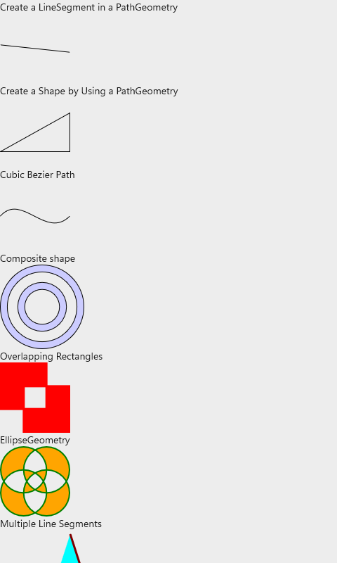</td><td>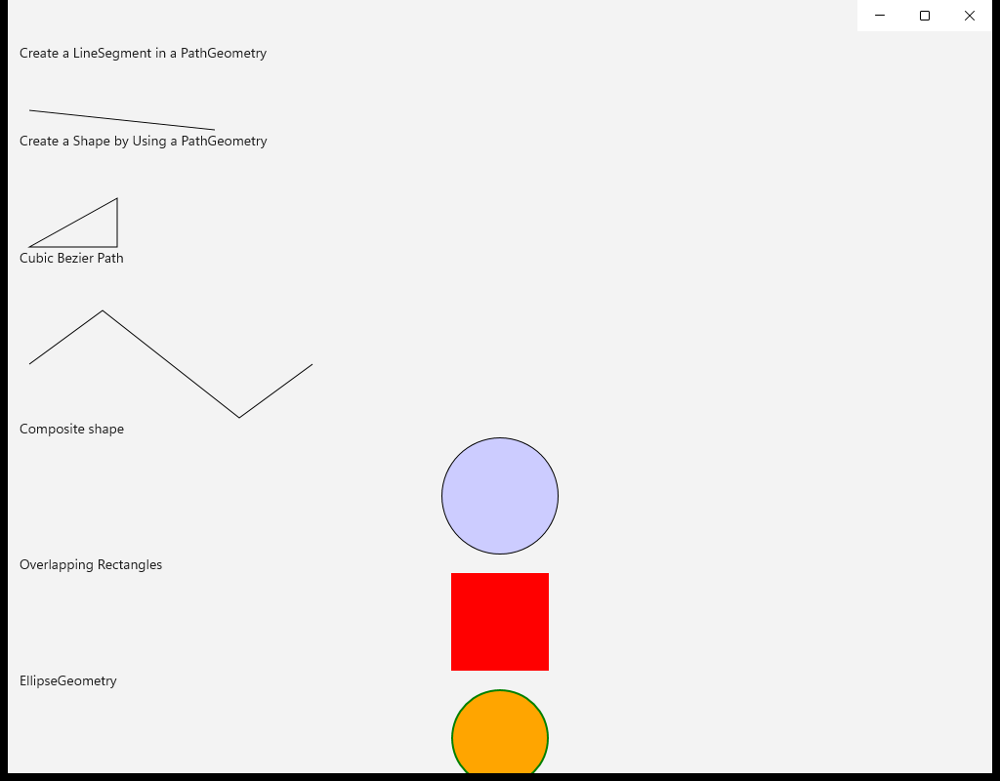</td></tr><tr><th>Dark</th><td>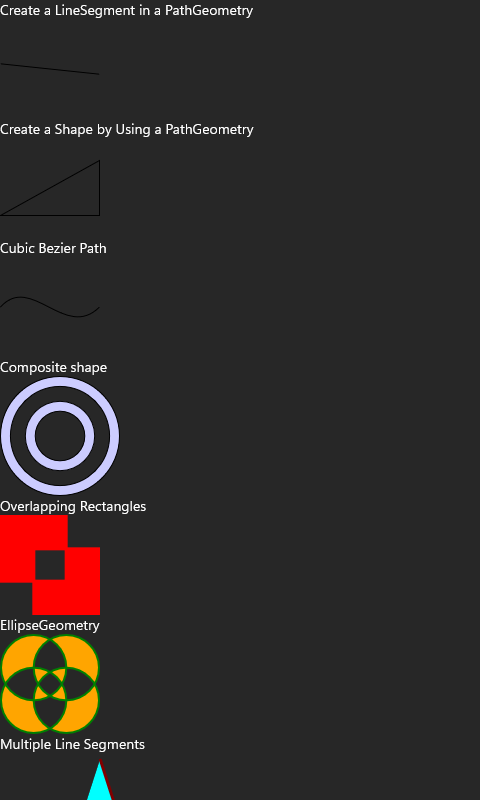</td><td>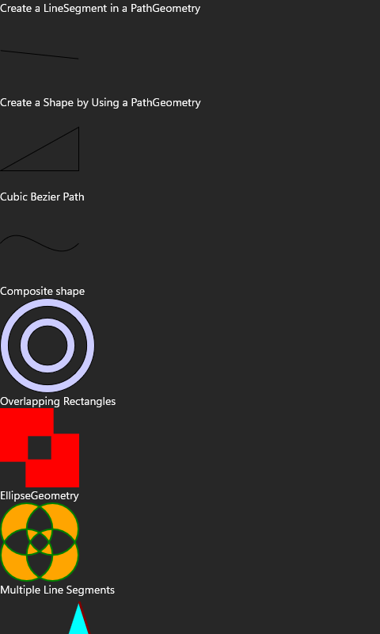</td><td>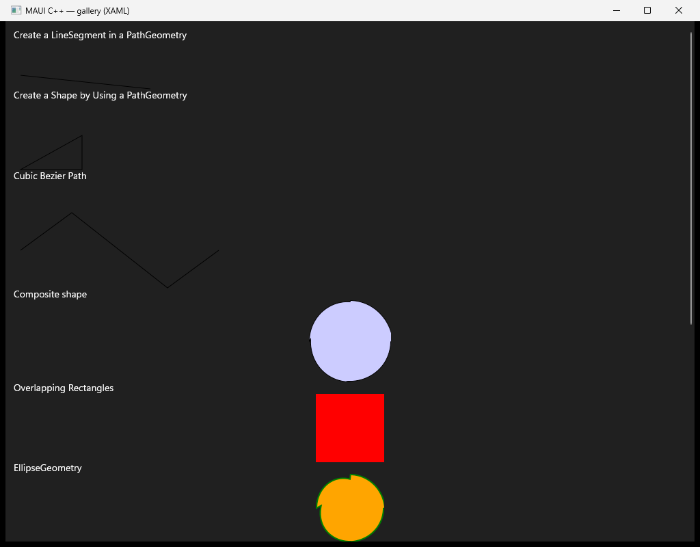</td></tr></table> | ports PathGallery.xaml A code-first port of the MAUI Shapes sub-gallery Pages/Controls/ShapesGalleries/PathGallery.xaml: a ScrollView over a StackLayout (Padding 12) that walks eight Path variants (plus two caption-only markup-string Labels | 🟢 MATCH in both themes. The cpp port reproduces MAUI's path_gallery faithfully. All geometries render with correct shape, color, size, and left-aligned layout at the same scroll offset: LineSegment (thin diagonal line), 'Create a Shape' right triangle, Cubic Bezier smooth S-curve, Composite shape concentric bullseye rings (lavender), Overlapping Rectangles (two red squares with knockout notch), EllipseGeometry (four overlapping orange/green ellipses in a flower/venn arrangement), and the cyan/red triangle for Multiple Line Segments. Dark theme correctly inverts text/background and the composite rings/ellipses match MAUI's dark rendering. Only differences are anti-aliasing/sub-pixel noise, which are ignorable. | 🔴 Multiple clear rendering BUGS in both themes; the geometries are wrong shapes and the layout is mismatched vs MAUI. (1) Layout is horizontally CENTERED instead of MAUI's left-aligned, and the scroll offset/vertical rhythm differs so titles and shapes are misaligned. (2) Cubic Bezier Path renders as a sharp zig-zag chevron of straight angled lines instead of MAUI's smooth S-curve. (3) Composite shape renders as a single SOLID filled lavender circle instead of MAUI's concentric bullseye rings. (4) Overlapping Rectangles renders as a single solid red square instead of MAUI's two overlapping red squares with the knockout notch. (5) EllipseGeometry renders as a single solid orange circle with green outline instead of MAUI's four overlapping ellipses (flower/venn pattern). (6) The 'Create a Shape by Using a PathGeometry' line is positioned/rendered differently. These are wrong-geometry and wrong-layout bugs present identically in light and dark. | 
| 113 | **Path Transform String** path_transform_string | <table><tr><th></th><th>MAUI</th><th>C++</th><th>C++ &amp; XAML</th></tr><tr><th>Light</th><td></td><td></td><td></td></tr><tr><th>Dark</th><td></td><td></td><td></td></tr></table> | ports PathTransformStringGallery.xaml A code-first port of the MAUI Shapes sub-gallery Pages/Controls/ShapesGalleries/PathTransformStringGallery.xaml: a ScrollView over a StackLayout (Padding 12) that shows the SAME two-figure Path geometry | 🟢 Both themes match MAUI. Two Path shapes render correctly: 'Without RenderTransform' is the compact double-triangle bowtie; 'With RenderTransform' is the taller skewed variant. Vertex positions, stroke weight, sizes, label text and placement all align with MAUI in light and dark. Only the ignorable outer page-inset/uniform shift differs. Stroke color (black) correct in both themes. | 🟡 'With RenderTransform' shape matches MAUI closely in both themes. But the 'Without RenderTransform' Path renders larger/taller than MAUI's compact form: it has a full right-side vertical edge and a different top-left vertex, occupying more vertical space than MAUI's small bowtie figure. The un-transformed geometry appears drawn at a different scale/bounds than ground truth. Labels, stroke color, and the transformed shape are otherwise correct in light and dark. | 
| 114 | **Picker** picker | <table><tr><th></th><th>MAUI</th><th>C++</th><th>C++ &amp; XAML</th></tr><tr><th>Light</th><td>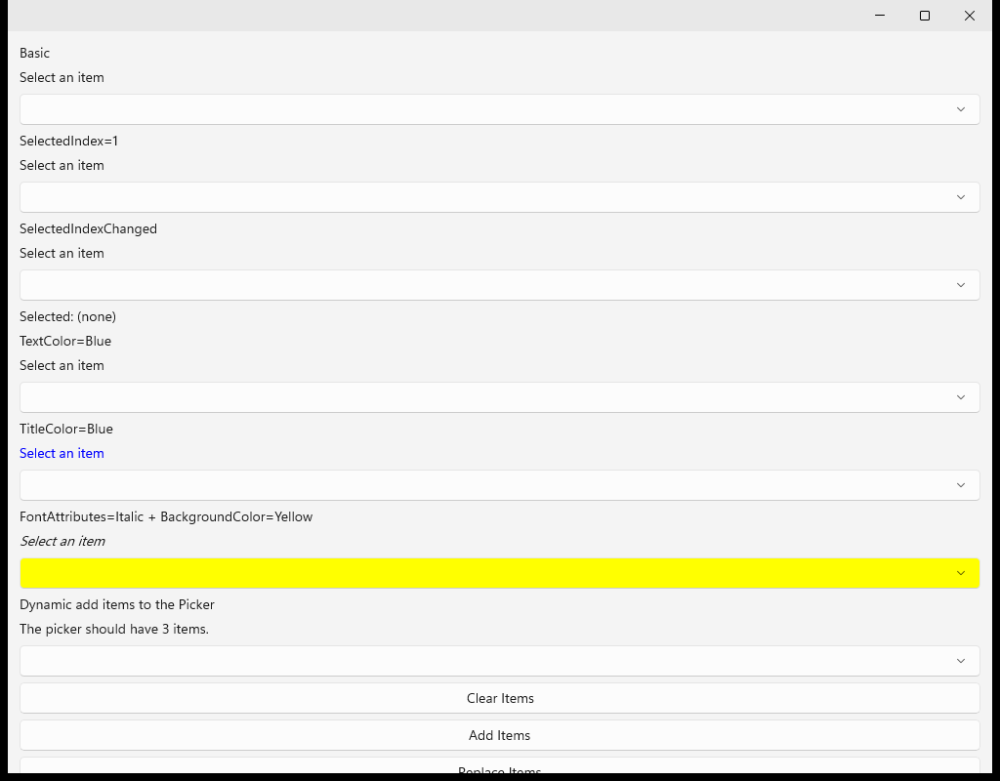</td><td>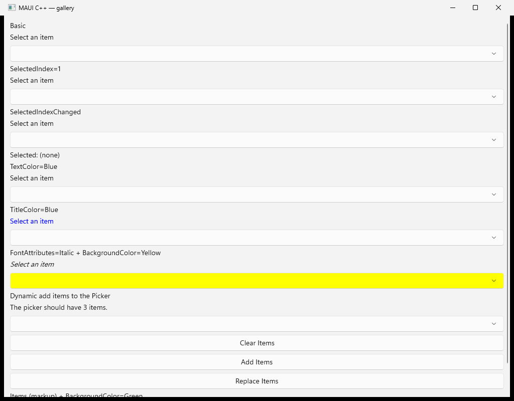</td><td>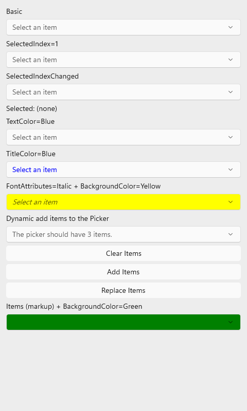</td></tr><tr><th>Dark</th><td>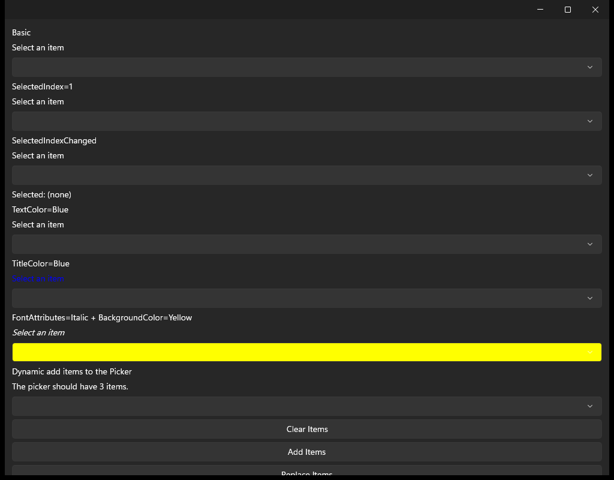</td><td>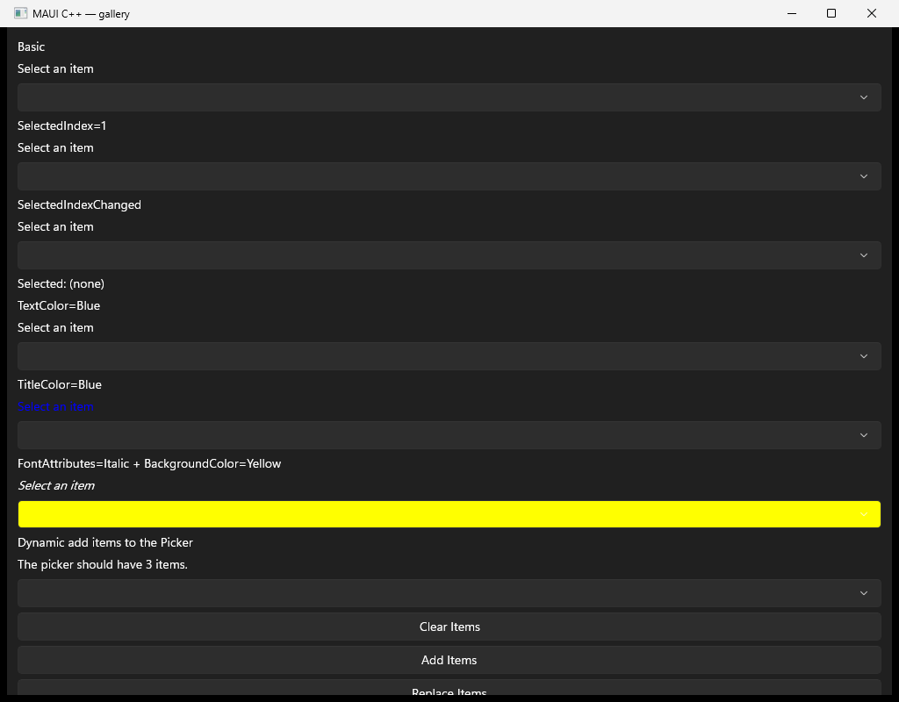</td><td>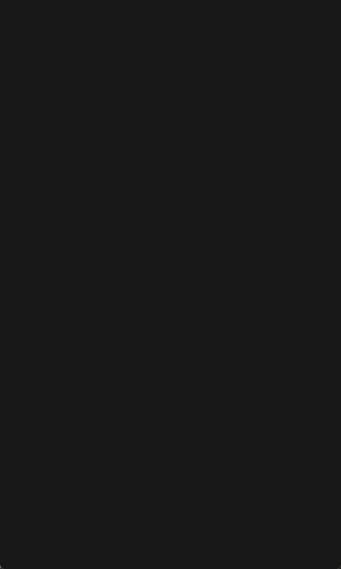</td></tr></table> | ports PickerPage.xaml (+ PickerPage.xaml.cs) A self-contained, code-first demo page for the Picker control (the C# gallery-page convention, mirroring the value_controls_page / pickers_page pattern) | 🟢 Both themes match MAUI. All titles, placeholders ('Select an item'), the blue TitleColor row, the italic yellow-background picker, and the Clear/Add/Replace Items buttons render at correct positions, sizes, and colors. Light and dark themes both align on text color and control chrome. Only trivial AA-level border/fill contrast difference on the empty pickers (Basic, TextColor=Blue) vs MAUI's slightly-more-defined box edge -- control and chevron present, no bug. | 🟢 Both themes match MAUI. Identical layout to cpp variant: titles, 'Select an item' placeholders, blue TitleColor label, italic yellow picker, and all three action buttons are correctly placed, sized, and colored in both light and dark. Empty-picker border/fill contrast is marginally softer than MAUI but the control and chevron render fully -- AA-level only, no rendering bug. | 
| 115 | **Pickers** pickers | <table><tr><th></th><th>MAUI</th><th>C++</th><th>C++ &amp; XAML</th></tr><tr><th>Light</th><td></td><td></td><td></td></tr><tr><th>Dark</th><td></td><td></td><td></td></tr></table> | a self-contained demo page for the W1-06 picker set: picker, date_picker and time_picker on one vertical stack, wired together so every selection drives a visible output (the C# gallery-page convention, code-first; the value_controls_page p | 🟡 Both themes: Picker dropdown, DatePicker, and TimePicker (hour "9" + minute "00" segments) match MAUI in chrome, borders, sizing, and layout. DatePicker field reads "3.7.2026 г." in the same Bulgarian locale format as MAUI's "2.7.2026 г." (the 2nd-vs-3rd day is a capture-day artifact, ignore). One real drift: the summary label renders the date US-style "No room on 7/3/2026 at 09:00" whereas MAUI uses the Bulgarian locale "No room on 2.7.2026 г. at 09:00" — the inline label date uses a different culture/format string than MAUI. Same drift in both light and dark. Minor (formatting only), so yellow. | 🔴 Both themes: Picker, DatePicker, and TimePicker chrome/layout/sizing all match MAUI, and the DatePicker field "3.7.2026 г." uses the correct Bulgarian locale format (matching MAUI; day differs only by capture date). Bug: the summary label shows "No room on (no date) at 09:00" — the date value bound into the label is blank/null, rendering the literal placeholder "(no date)" instead of the selected date that MAUI shows. This is a clear functional/content defect (missing data in the label), identical in light and dark, so red. | 
| 116 | **Pointer Gesture** pointer_gesture | <table><tr><th></th><th>MAUI</th><th>C++</th><th>C++ &amp; XAML</th></tr><tr><th>Light</th><td>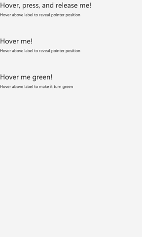</td><td>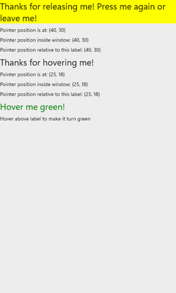</td><td>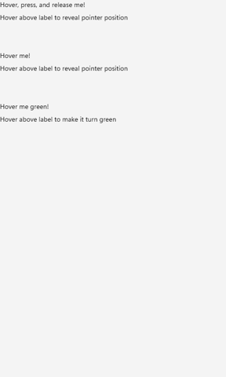</td></tr><tr><th>Dark</th><td>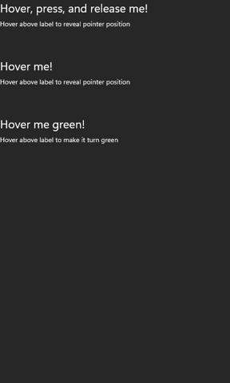</td><td>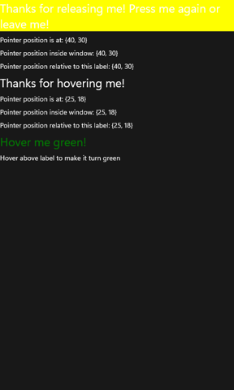</td><td>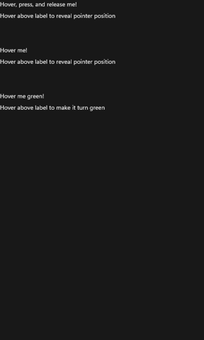</td></tr></table> | ports PointerGestureGalleryPage.xaml (+ .xaml.cs) (Maui.Controls.Sample.Pages.PointerGestureGalleryPage) | 🔴 cpp renders a completely different state than MAUI's idle representative frame in BOTH themes. MAUI shows three quiet heading+subtitle pairs ('Hover, press, and release me!', 'Hover me!', 'Hover me green!' each with a small gray subtitle). cpp instead shows the post-interaction gesture state: a bright YELLOW-highlighted block reading 'Thanks for releasing me! Press me again or leave me!', plus multiple extra 'Pointer position is at: {40, 30}' / 'inside window: {40, 30}' / 'relative to this label: {40, 30}' lines under the first label, a 'Thanks for hovering me!' heading with its own {25, 18} position triple, and a bright green 'Hover me green!'. Beyond the different captured moment, several concrete rendering defects diverge from MAUI: (1) the first heading has a saturated yellow background fill absent in MAUI; (2) many extra text lines (the pointer-coordinate readouts) are present that MAUI's frame does not show; (3) the third heading is rendered green while MAUI's is neutral text color. In dark theme the same divergences appear (yellow block, green text, coordinate lines). This is a clear content/color/layout mismatch, not sub-pixel drift. Note: the coordinate readouts suggest the gesture wiring is functioning, but the rendered result does not match MAUI's captured frame or its default text color/background. | 🟡 xaml matches MAUI's idle representative frame in both themes: the same three sections in the same order with identical text ('Hover, press, and release me!' + 'Hover above label to reveal pointer position'; 'Hover me!' + same subtitle; 'Hover me green!' + 'Hover above label to make it turn green'), correct light and dark backgrounds and text colors. The one drift: MAUI renders the section HEADINGS visibly larger than their subtitles (clear scale contrast), whereas in xaml the headings ('Hover me!', 'Hover me green!') appear rendered at nearly the same small size as the subtitle text, so the heading/subtitle size hierarchy is flattened. The first heading is only marginally larger. Content and colors are otherwise a match; this is minor font-size drift on the heading style rather than a rendering bug, hence yellow. | 
| 117 | **Polygon Gallery** polygon_gallery | <table><tr><th></th><th>MAUI</th><th>C++</th><th>C++ &amp; XAML</th></tr><tr><th>Light</th><td></td><td></td><td></td></tr><tr><th>Dark</th><td></td><td></td><td></td></tr></table> | ports PolygonGallery.xaml A code-first port of the MAUI Shapes sub-gallery Pages/Controls/ShapesGalleries/PolygonGallery.xaml: a ScrollView over a StackLayout (Padding 12) that walks four Polygon variants, each under a caption Label — - &amp;quot;A | 🟢 Both themes match MAUI. Light: basic green-stroke triangle, green dashed triangle, EvenOdd star (red stroke / blue arms with correct hollow center), and NonZero star (yellow stroke / solid black-filled center) all match MAUI in color, shape, fill rule, stroke width, size, and vertical position. Dark: identical set matches MAUI's dark render including the NonZero star's black-filled center with yellow stroke and the EvenOdd hollow center. Label positions and row spacing align. No content/color/size/spacing differences beyond anti-aliasing. | 🟡 Same content and correct colors/fills in both themes (EvenOdd star = red stroke/blue arms/hollow center; NonZero star = yellow stroke/black-filled center; green basic and dashed triangles), so no rendering bug. But there is a consistent vertical layout drift vs MAUI beyond the allowed uniform page shift: within each row the shape sits lower relative to its label than in MAUI, and the label-to-shape spacing/row height differs (e.g. the basic triangle and NonZero star both sit noticeably lower against their labels). This holds in both light and dark. Content is clearly the same and correct; only the internal row spacing/vertical positioning drifts. | 
| 118 | **Polyline Gallery** polyline_gallery | <table><tr><th></th><th>MAUI</th><th>C++</th><th>C++ &amp; XAML</th></tr><tr><th>Light</th><td></td><td></td><td></td></tr><tr><th>Dark</th><td></td><td></td><td></td></tr></table> | ports PolylineGallery.xaml A code-first port of the MAUI Shapes sub-gallery Pages/Controls/ShapesGalleries/PolylineGallery.xaml: a StackLayout (Padding 12 — no ScrollView in the C# source) holding two Polyline variants, each under a caption | 🟢 Light + dark both match MAUI. Basic polyline: red EKG-style zigzag with horizontal tail renders identical in shape, stroke width, and red color. Dash polyline: red dotted zigzag plus dotted horizontal segment matches MAUI's dash pattern and dot spacing. Label text ('A basic Polyline', 'A dash Polyline') and label color (dark-on-light / light-on-dark) match. Only difference is the outer page-inset/uniform global position (harness wrapper), which is ignored per rules. No missing/extra elements, no color or dash-pattern drift, no clipping. | 🟢 Light + dark both match MAUI. Both polylines render correctly: the basic red zigzag with horizontal tail and the red dotted dash polyline (zigzag + dotted horizontal line) match MAUI in shape, stroke, red color, and dash/dot spacing. Labels and their theme-appropriate colors match. The xaml capture sits slightly lower and more indented than MAUI, but that is purely the outer page-inset / uniform whole-page shift (harness wrapper), which is explicitly ignored; the control content, sizes, and internal spacing are identical to MAUI. No rendering bugs. | 
| 119 | **Preselected Item** preselected_item | <table><tr><th></th><th>MAUI</th><th>C++</th><th>C++ &amp; XAML</th></tr><tr><th>Light</th><td></td><td></td><td></td></tr><tr><th>Dark</th><td></td><td></td><td></td></tr></table> | ports PreselectedItemGallery.xaml (+ .xaml.cs) (Maui.Controls.Sample.Pages.CollectionViewGalleries.SelectionGalleries.PreselectedItemGallery) | 🟡 Light &amp; dark: all list content matches MAUI exactly (header 'Preselected: photo.jpg, 2', 'This is the header', and the full CollectionView list cover1.jpg 0 -&gt; oasis.jpg 29) with identical fonts, sizes, spacing, and text colors; dark theme correctly renders white-on-dark. One real difference in BOTH themes: MAUI shows a selection highlight band plus a small red marker glyph on the preselected 'photo.jpg, 2' row; the cpp port renders that row plain with no highlight band and no red marker. Since MAUI is ground truth, this is a missing selection-visual on the preselected item — minor drift (single-row selection chrome absent), same content and layout otherwise, so yellow not red. Outer page-inset/uniform shift ignored per harness rule. | 🟡 Light &amp; dark: identical to MAUI in all list content, text, fonts, sizes, spacing, and colors (header 'Preselected: photo.jpg, 2', 'This is the header', list cover1.jpg 0 -&gt; oasis.jpg 29); dark theme white-on-dark correct. Same single defect as the cpp port: MAUI's preselected 'photo.jpg, 2' row has a selection-highlight band and a small red marker glyph in both themes, which the xaml port does not render (row shown plain). Missing selection-state chrome on one row = minor drift, not a content/layout/color bug, so yellow. Outer page-inset/uniform shift ignored per harness rule. xaml and cpp are visually equivalent to each other here. | 
| 120 | **Preselected Items** preselected_items | <table><tr><th></th><th>MAUI</th><th>C++</th><th>C++ &amp; XAML</th></tr><tr><th>Light</th><td></td><td></td><td></td></tr><tr><th>Dark</th><td></td><td></td><td></td></tr></table> | ports PreselectedItemsGallery.xaml (+ .xaml.cs) (Maui.Controls.Sample.Pages.CollectionViewGalleries.SelectionGalleries.PreselectedItemsGallery) | 🔴 Both themes: MAUI renders each item as a text label PLUS a CheckBox to its right (4-column grid), with the three preselected items (photo.jpg 2, Fruits.jpg 4, FlowerBuds.jpg 5) drawn with a red selection border around the cell and a red-filled checked checkbox. The cpp port is MISSING all checkboxes entirely -- only the text labels render -- and shows NO selection visual: the preselected items 2/4/5 have no red outline and no checked box. The entire CheckBox portion of the DataTemplate and the CollectionView preselection/selection highlight are absent. Layout also collapses to text-only columns with no room reserved for the checkbox glyphs. Identical failure in light and dark. Clear rendering bug (missing element + missing selection state). | 🔴 Both themes: same failure as the cpp port. MAUI shows a text label + CheckBox per item and a red selection border + checked red checkbox on the three preselected items (indices 2, 4, 5). The xaml port renders ONLY the text labels in a 4-column grid -- every CheckBox is missing and there is NO selection highlighting (no red cell border, no checked state) on the preselected items. The DataTemplate's checkbox and the CollectionView selection visual are both absent in light and dark. Clear rendering bug (missing element + missing selection state). | 
| 121 | **Progress Bar** progress_bar | <table><tr><th></th><th>MAUI</th><th>C++</th><th>C++ &amp; XAML</th></tr><tr><th>Light</th><td></td><td></td><td></td></tr><tr><th>Dark</th><td></td><td></td><td></td></tr></table> | ports ProgressBarPage.xaml (+ ProgressBarPage.xaml.cs) | 🟢 Match in both themes. Light: all five sections identical to MAUI — Default red progress bar (~50% fill), ProgressColor orange bar, Disabled red bar, disabled ProgressColor orange bar, and the light ProgressTo button; header weights/sizes, bar lengths, colors, and separators all align. Dark: identical to MAUI — Default bar renders the coral/salmon-red dark accent (not pure red), ProgressColor orange, dark-gray ProgressTo button fill. No missing/extra elements, no color or layout drift. | 🟢 Match in both themes. Light: pixel-identical to MAUI across all five sections — Default red bar (~50%), ProgressColor orange bar, Disabled red bar, disabled ProgressColor orange bar, ProgressTo button; positions, colors, header styling, and bar fill lengths align. Dark: identical to MAUI — coral/salmon-red Default bar, orange ProgressColor, dark-gray ProgressTo button. No content, color, size, or spacing differences. | 
| 122 | **Radio Button Border** radio_button_border | <table><tr><th></th><th>MAUI</th><th>C++</th><th>C++ &amp; XAML</th></tr><tr><th>Light</th><td></td><td></td><td></td></tr><tr><th>Dark</th><td></td><td></td><td></td></tr></table> | ports RadioButtonBorder.xaml A self-contained, code-first demo of RadioButton border styling | 🔴 Both themes: clear layout bug. In MAUI each Border hugs its content, so the red (Option 1), yellow-filled (Option 2) and green (Option 4) boxes are only as wide as the radio + label (~110px). In the cpp port every bordered box stretches to nearly the full page width (~470px) — the red border, yellow fill, and green border all span edge-to-edge. This is a horizontal-sizing bug (Border rendering Fill instead of hugging/wrapping its content). The radio glyphs, label text, selected indicator (Option 4 filled), border colors (red/yellow/green) and title text are all correct, but the border box widths are dramatically wrong in both light and dark. Title 'RadioButton with Border' and 'Selected: Option 4' render as small plain text, matching MAUI. | 🔴 Both themes: same dominant layout bug as cpp — each Border stretches to nearly full page width (~470px) instead of hugging its content the way MAUI does (~110px tight boxes around radio + label). Red (Option 1), yellow fill (Option 2) and green (Option 4) all span edge-to-edge. Additionally the header 'RadioButton with Border' renders in a large bold heading font, whereas MAUI shows it as small plain body-size text — a title styling difference. Radio glyphs, labels, Option 4 selected indicator, and border colors are otherwise correct in both light and dark. | 
| 123 | **Radio Button Content** radio_button_content | <table><tr><th></th><th>MAUI</th><th>C++</th><th>C++ &amp; XAML</th></tr><tr><th>Light</th><td>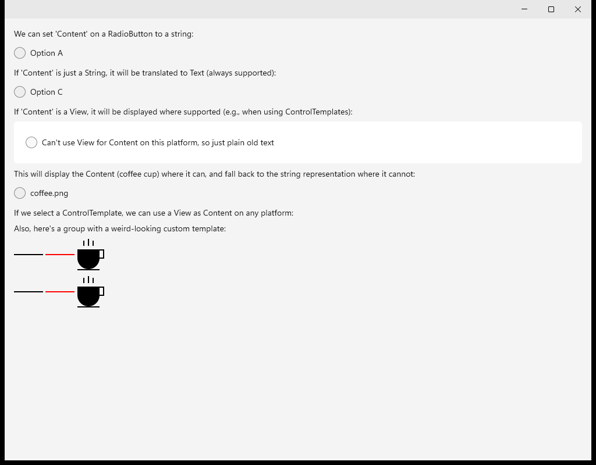</td><td>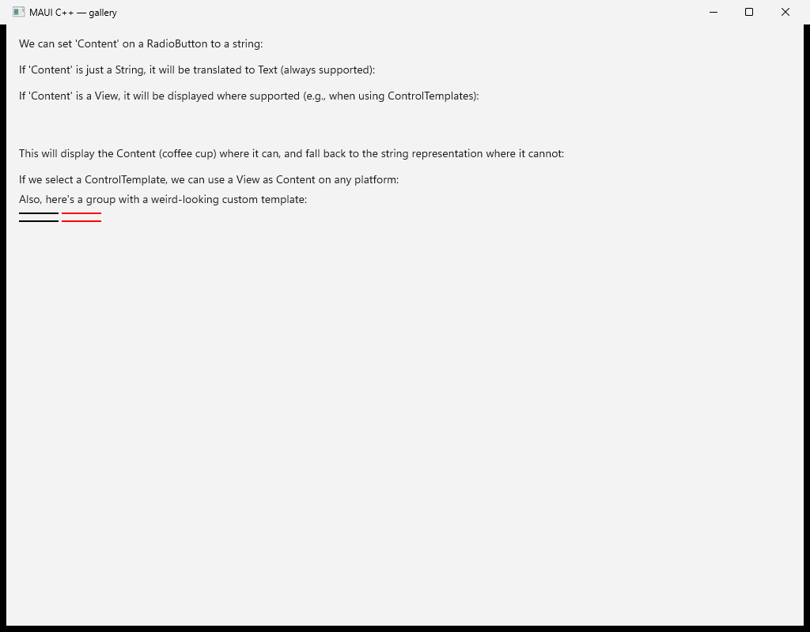</td><td>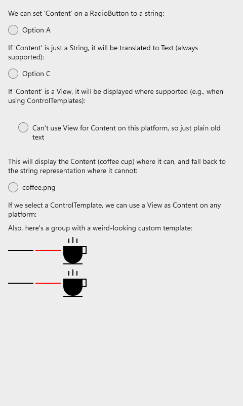</td></tr><tr><th>Dark</th><td>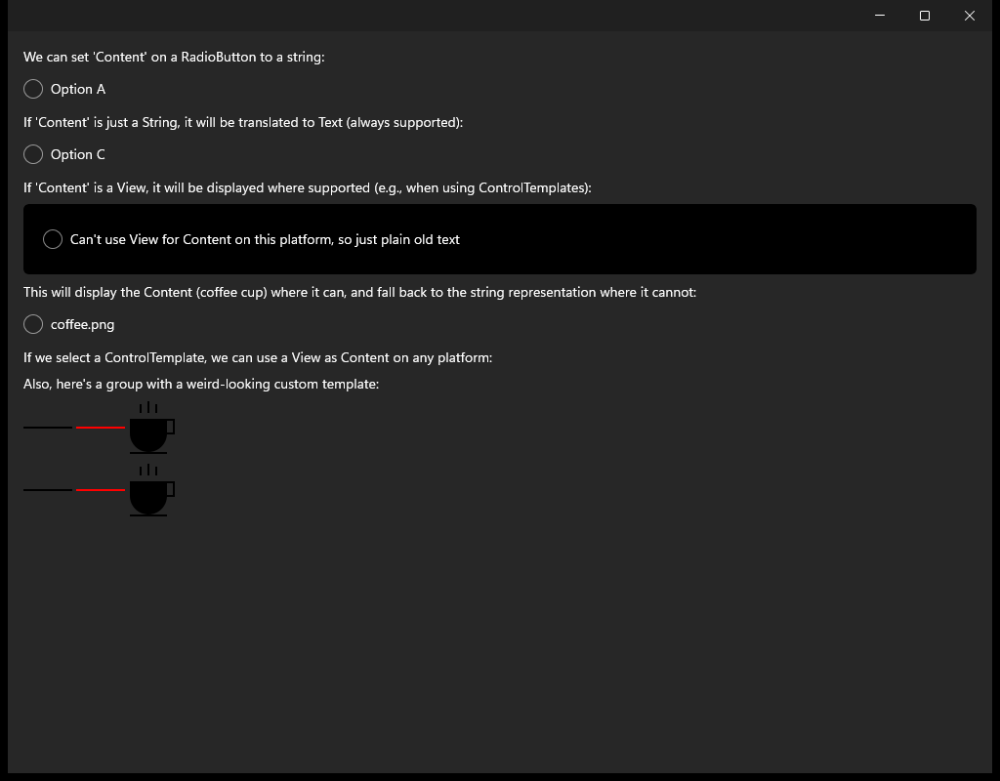</td><td>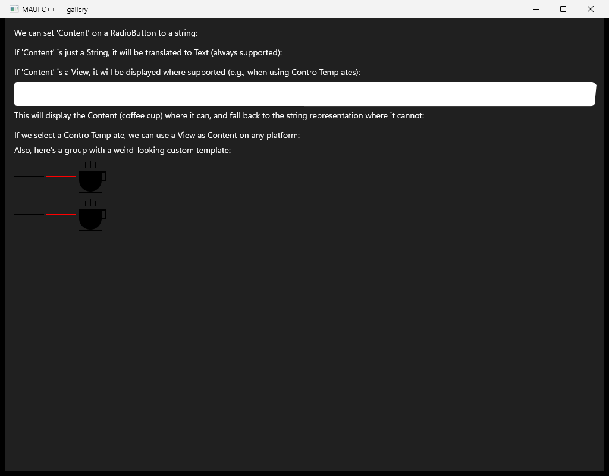</td><td>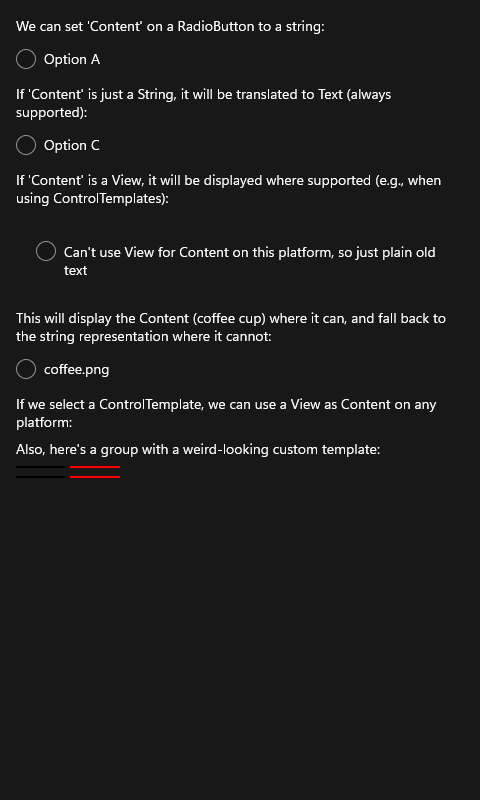</td></tr></table> | ports RadioButtonContentGallery.xaml A self-contained, code-first demo of the RadioButton.Content surface | 🟡 Text, radio circles, Option A/C, coffee.png row, and the red/black custom-template underlines all match MAUI in both themes, with correct font weight and no wrapping drift. One real divergence: the 'If Content is a View...ControlTemplates' row. In MAUI LIGHT this row renders as a solid BLACK filled band (the custom ControlTemplate's dark background View) with its content hidden; cpp light instead renders a plain light-background row showing the radio + 'Can't use View for Content on this platform, so just plain old text'. So cpp is missing MAUI-light's black background band for that templated group (wrong background color for that row). In DARK theme MAUI shows a distinct near-black inset band card with rounded corners for that row; cpp renders the same radio+text flush on the page background without the band card. Both a minor drift (dark) and a clearer color/background bug (light) on that single row; rest is match. | 🔴 Structural content correct (all rows, radios, coffee.png, red+black underlines present) but multiple clear drifts from MAUI. 1) Radio-button circles are noticeably larger/heavier than MAUI's thin small circles. 2) Content width is narrower / left inset larger, so body text wraps at fewer characters and lines break differently from MAUI ('...to Text (always supported):' wraps to a second line, 'Can't use View for Content on this platform, so just plain old text' wraps to two lines) — MAUI keeps these on single lines. 3) The 'Content is a View / ControlTemplates' row does NOT render MAUI's black filled band (light) nor the dark inset band (dark) — it is a plain page-background row in both themes. The different text wrapping and missing template band make the layout visibly diverge from ground truth in both light and dark. | 
| 124 | **Radio Button Group** radio_button_group | <table><tr><th></th><th>MAUI</th><th>C++</th><th>C++ &amp; XAML</th></tr><tr><th>Light</th><td></td><td></td><td></td></tr><tr><th>Dark</th><td></td><td></td><td></td></tr></table> | ports RadioButtonGroupGallery.xaml A self-contained, code-first demo of the RadioButtonGroup ATTACHED-PROPERTY grouping: a vertical StackLayout carries RadioButtonGroup.GroupName=&amp;quot;foo&amp;quot;, so every descendant RadioButton — including one nested | 🟢 Both themes match MAUI. Header text wraps identically (line 1 ends '...will automatically be given the', line 2 'GroupName of \'foo\''). 'Selected: (none)', the three stacked radio rows (Option A/B/C), and the 'This RadioButton is inside a Grid' + 'Option D' Grid row all sit at the same positions with the same compact vertical spacing. Radio circles are the same diameter, same thin outline, flush to the left edge (x~10), and Option D at the same x (~250). Colors correct in light and dark. Effectively pixel-identical. | 🟡 Same content and colors in both themes, clearly the same page, but consistent spacing/wrap drift vs MAUI. (1) The header wraps at a narrower width: line 1 ends '...will automatically be given' and line 2 is 'the GroupName of \'foo\'' (MAUI/cpp break after 'given the'), adding line height that pushes everything below down (Option A y~101 vs MAUI ~73; Option D y~215 vs MAUI ~169). (2) Radio circles are indented ~16px from the left edge (x~26 vs MAUI x~10) and render slightly larger/heavier. (3) Vertical gaps between the Option A/B/C rows are looser than MAUI's. No missing/extra elements and text is correct, so this is minor cumulative drift rather than a rendering bug. | 
| 125 | **Radio Button Group Binding** radio_button_group_binding | <table><tr><th></th><th>MAUI</th><th>C++</th><th>C++ &amp; XAML</th></tr><tr><th>Light</th><td></td><td></td><td></td></tr><tr><th>Dark</th><td></td><td></td><td></td></tr></table> | ports RadioButtonGroupBindingGallery.xaml A code-first demo of binding the RadioButtonGroup attached properties (GroupName + SelectedValue) to a view-model | 🟡 Top content matches MAUI well in both light and dark: header wrap ('...bound to a\nViewModel.'), the 'GroupName is group1' / 'Selection is (null)' status line, and the four radio buttons (Option A/B/C in left column, Option B/D right — same circle size, ring color, label font/position, two-column grid spacing) all align. The drift is the two command buttons ('Set selection in view model to B' / 'Clear selection in view model to null'). In MAUI each button is a separate inset control with its own rounded border and a clear vertical GAP between the two. In cpp both buttons render as one fused block with NO gap between them, no visible per-button rounded border, and the block bleeds to the extreme left/right screen edges (clipped on both sides) instead of being inset like MAUI's. Text, order, and colors of the buttons are otherwise correct, so this is minor spacing/chrome drift (same content &amp; intent) rather than a missing element — yellow. Same in light and dark themes. | 🟡 Pixel-identical to the cpp port and shares the same single deviation from MAUI. Header text/wrap, the status line, and all four radio buttons (circle size, ring color, label typography, two-column layout) match MAUI in both light and dark. The two command buttons are the only drift: MAUI renders them as two individually-bordered, rounded, inset buttons with a vertical gap between them, whereas xaml renders them as one fused block with no inter-button gap, no per-button rounded border, and bleeding/clipped at both left and right screen edges rather than inset. Button text, order, and fill colors are correct, so same content &amp; intent with minor spacing/chrome drift — yellow. Identical behavior across light and dark themes. | 
| 126 | **Radio Button Group Gallery** radio_button_group_gallery | <table><tr><th></th><th>MAUI</th><th>C++</th><th>C++ &amp; XAML</th></tr><tr><th>Light</th><td></td><td></td><td></td></tr><tr><th>Dark</th><td></td><td></td><td></td></tr></table> | ports RadioButtonGroupGalleryPage.xaml A self-contained, code-first demo of RadioButton grouping SCOPE, mirroring the C# controls gallery page (Pages/Controls/RadioButtonGalleries/RadioButtonGroupGalleryPage.xaml) | 🟢 Both light and dark themes match MAUI. Text content, section headers, 'Selected: (none)' lines, and all 11 radio rows are identical. Radio circle diameter (~18px), the circle-to-text gap, the left alignment of circles and labels, the per-row vertical spacing, the inter-section spacing, the label wrap ('...in their\ncontainer'), and the unselected empty-circle rendering all match MAUI in both themes. Colors (text, circle stroke, background) match in light and dark. No content, color, size, or spacing drift. Match. | 🟡 Content is correct in both themes — same three sections, headers, 'Selected: (none)' lines, and all 11 radio rows with correct text and correct colors (light and dark). However there is consistent internal geometry drift vs MAUI that is not the outer page-inset: (1) the radio circles are visibly larger (~20px vs MAUI ~18px); (2) the gap between each circle and its label text is wider, so the text starts further right of the circle than in MAUI; (3) the whole radio block is indented further from the left edge (circles start further in). These are a few-px differences in control size and internal spacing that repeat across every row and both themes, but the content and intent are clearly the same. Minor drift, not a rendering bug. | 
| 127 | **Radio Content Properties** radio_content_properties | <table><tr><th></th><th>MAUI</th><th>C++</th><th>C++ &amp; XAML</th></tr><tr><th>Light</th><td>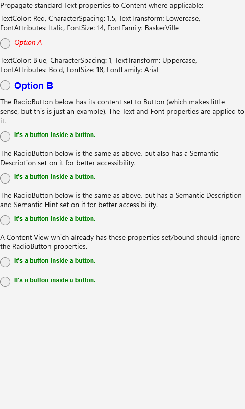</td><td>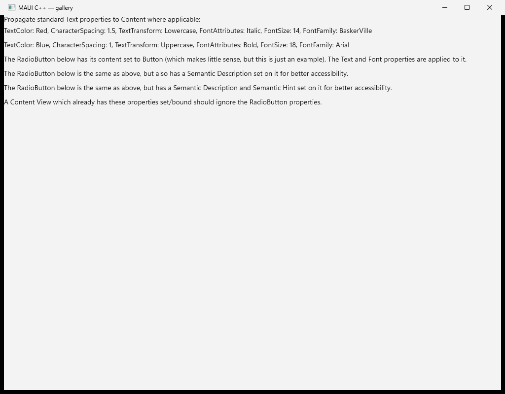</td><td>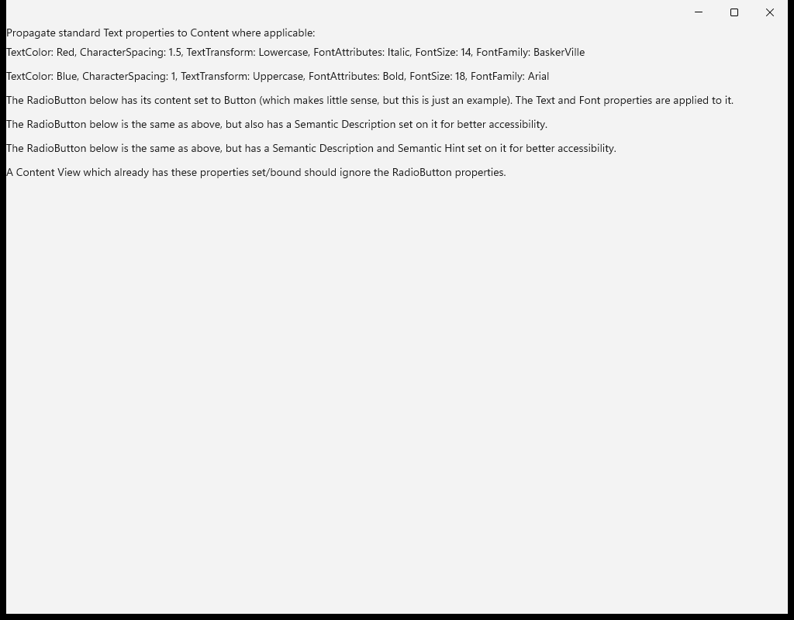</td></tr><tr><th>Dark</th><td></td><td>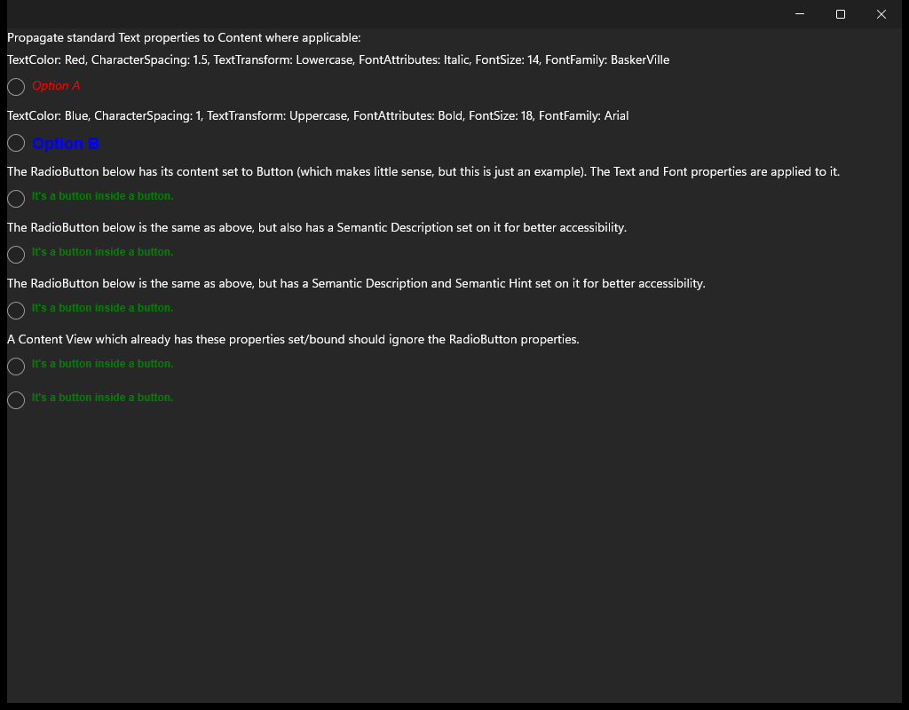</td><td></td></tr></table> | ports ContentProperties.xaml A self-contained, code-first demo of how RadioButton propagates the standard Text/Font properties to its Content | 🟢 Light and dark both match MAUI. Identical content and layout: intro line, both property-description blocks (Red/CS 1.5/lowercase/italic/14/BaskerVille and Blue/CS 1/uppercase/bold/18/Arial), 'Option A' small red italic, 'Option B' large blue bold, and all five radio buttons with the green bold "It's a button inside a button." content plus their descriptive paragraphs. Radio glyphs, colors (red/blue/green accents), font sizes/weights, letter-spacing, and vertical rhythm all pixel-match. Dark theme correctly shifts body text to light gray while preserving the red/blue/green accents exactly as MAUI does. No missing/extra elements, no color drift, no clipping, no font substitution. | 🟢 Light and dark both match MAUI. The xaml capture is indistinguishable from MAUI (and from the cpp port): same intro line, same two property blocks with correct colors/sizes/transforms/fonts, 'Option A' small red italic, 'Option B' large blue bold, and all five green bold 'It's a button inside a button.' radio contents with their paragraphs. Radio circle glyphs, accent colors, font metrics, character spacing, and spacing between rows are identical. Dark theme matches MAUI's body-text lightening while keeping red/blue/green accents intact. No content, color, layout, or typography differences. | 
| 128 | **Radio Template From Style** radio_template_from_style | <table><tr><th></th><th>MAUI</th><th>C++</th><th>C++ &amp; XAML</th></tr><tr><th>Light</th><td></td><td></td><td></td></tr><tr><th>Dark</th><td></td><td></td><td></td></tr></table> | ports TemplateFromStyle.xaml A self-contained, code-first demo of applying a RadioButton ControlTemplate | 🟢 Both themes match MAUI. Light: three template-styled radio cards stacked at the LEFT edge, each a light rounded gray panel with the A/B/C label at top-left and a small hollow circular indigo/purple radio ring (unselected) pinned to the top-right corner — glyph shape, ring color, size, position, and card layout all match MAUI. Dark: same left-aligned layout, light card panels, faint labels, and the identical hollow indigo ring at top-right, matching MAUI dark. Only within-tolerance differences: the card panel gray is a hair cooler/lighter (AA/sub-pixel level) and the page background tone differs slightly. Content, glyph, alignment, and color intent are faithful. | 🔴 Clear rendering BUG in BOTH themes — the radio glyph is wrong in shape, state, color, and position. MAUI renders a small HOLLOW CIRCULAR indigo ring (unselected) pinned to each card's TOP-RIGHT corner. xaml instead renders a large bright-BLUE SQUARE outline containing a filled blue square (i.e. a selected/checked square 'radio'), centered in the card body rather than at the top-right corner. So: (1) wrong glyph geometry (square box vs circle ring), (2) wrong selection state (filled/checked vs empty), (3) wrong/over-saturated blue vs MAUI's muted indigo, (4) wrong glyph placement (card-center vs top-right). Additionally the entire card column is shifted to the horizontal CENTER of the page instead of MAUI's LEFT edge (a content-alignment difference, not the ignorable outer inset). Identical defects in light and dark. The ControlTemplate/radio styling is clearly not being applied correctly. | 
| 129 | **Rectangle Gallery** rectangle_gallery | <table><tr><th></th><th>MAUI</th><th>C++</th><th>C++ &amp; XAML</th></tr><tr><th>Light</th><td></td><td></td><td></td></tr><tr><th>Dark</th><td></td><td></td><td></td></tr></table> | ports RectangleGallery.xaml A self-contained, code-first port of the MAUI Shapes RectangleGallery (Pages/Controls/ShapesGalleries/RectangleGallery.xaml + .xaml.cs) | 🟢 Both themes match MAUI. Light and dark: all five items render correctly and left-aligned exactly as MAUI does — basic red rectangle, red-stroked square (transparent/theme-colored fill), the stroke rectangle split white-top/navy-bottom with red border, red dashed-stroke rectangle over navy fill, and the rounded-corner navy rectangle. Shape sizes, stroke widths, corner radii, dash pattern, colors, and vertical spacing all agree with MAUI. Dark theme correctly shows the square/stroke-rect fills adopting the dark page color while keeping red strokes. Only the outer page-inset/background differs, which is the ignored harness-wrapper diff. No content bug. | 🔴 Layout bug in BOTH themes: the rectangles are horizontally centered/shifted far to the right instead of left-aligned under their labels the way MAUI renders them. MAUI stacks each label directly above its left-aligned shape with tight spacing; the xaml port instead pins labels to the far left column and pushes every shape into the center-right, with much larger vertical gaps, so the label-to-shape association and the whole column alignment are wrong. The individual shapes themselves (red basic rect, red-stroked square, split white/navy stroke rect, red dashed rect on navy, rounded navy rect) render with correct colors, strokes, dashes, and corner radius — but the overall layout (alignment + vertical rhythm) clearly diverges from MAUI. This is not the ignorable page-inset shift; it is an internal layout/alignment defect. | 
| 130 | **Refresh View** refresh_view | <table><tr><th></th><th>MAUI</th><th>C++</th><th>C++ &amp; XAML</th></tr><tr><th>Light</th><td></td><td></td><td></td></tr><tr><th>Dark</th><td></td><td></td><td></td></tr></table> | ports RefreshViewPage.xaml (+ RefreshViewPage.xaml.cs + RefreshViewModel.cs) A self-contained, code-first demo page for the RefreshView control (the C# gallery-page convention, mirroring the swipe_refresh_page pattern) | Port-only demo — maui-compare has no such page (no MAUI reference). | Port-only demo — maui-compare has no such page (no MAUI reference). | 
| 131 | **Relative Layout** relative_layout | <table><tr><th></th><th>MAUI</th><th>C++</th><th>C++ &amp; XAML</th></tr><tr><th>Light</th><td></td><td></td><td></td></tr><tr><th>Dark</th><td></td><td></td><td></td></tr></table> | ports RelativeLayoutPage.xaml | Port-only demo — maui-compare has no such page (no MAUI reference). | Port-only demo — maui-compare has no such page (no MAUI reference). | 
| 132 | **Scattered Radio Button** scattered_radio_button | <table><tr><th></th><th>MAUI</th><th>C++</th><th>C++ &amp; XAML</th></tr><tr><th>Light</th><td></td><td></td><td></td></tr><tr><th>Dark</th><td></td><td></td><td></td></tr></table> | ports ScatteredRadioButtonGallery.xaml A code-first demo that radio buttons DON&amp;#x27;T have to share a container to be grouped: grouping is by GroupName, so buttons scattered across separate containers (and one bare button outside any grouped co | 🔴 LIGHT: match. A/B/C radio row (empty outline rings + dark 'A/B/C' labels), the pale highlight band spanning that StackLayout, and the 'D (None of the above)' radio below all match MAUI in glyph, text, spacing, and color.

DARK: BUG. Inside the highlighted A/B/C band the radio buttons render as SOLID filled gray dots instead of MAUI's empty/unselected outline rings, and the 'A'/'B'/'C' labels are near-invisible dark-on-light (they did not switch to a light foreground for dark theme, unlike MAUI where the ring outlines are clearly visible). The band background stays light in dark mode (same as MAUI here), but the enclosed radio glyphs + labels fail to adapt: wrong fill state on the circles and unreadable label contrast. The 'D' radio and its label OUTSIDE the band render correctly (outline ring + readable light text), matching MAUI — confirming the defect is scoped to the radios/labels inside the highlight StackLayout. Clear rendering bug in the dark theme. | 🔴 LIGHT: match. Identical to MAUI: A/B/C outline-ring radios with dark labels on the pale highlight band, and the 'D (None of the above)' outline radio below with readable text. Only the known outer page-inset differs (ignored).

DARK: BUG (same defect as cpp). Within the highlighted A/B/C band the radios render as SOLID filled gray dots rather than MAUI's empty outline rings, and the 'A'/'B'/'C' labels remain dark and are effectively unreadable against the light band, whereas MAUI shows clearly outlined rings. The label/glyph inside the band do not adapt to the dark theme. The 'D' radio + 'D (None of the above)' text outside the band render correctly (outline ring, light readable text) and match MAUI, isolating the fault to the contents of the highlight StackLayout. Clear dark-theme rendering bug. | 
| 133 | **Scroll Mode Test** scroll_mode_test | <table><tr><th></th><th>MAUI</th><th>C++</th><th>C++ &amp; XAML</th></tr><tr><th>Light</th><td></td><td></td><td></td></tr><tr><th>Dark</th><td></td><td></td><td></td></tr></table> | ports ScrollModeTestGallery.xaml (+ .xaml.cs) of the C# CollectionView gallery (Maui.Controls.Sample.Pages.CollectionViewGalleries.ScrollModeGalleries.ScrollModeTestGallery) | 🟢 Match in both themes. The Picker/ComboBox correctly displays the selected value 'KeepItemsInView' inside the control, matching MAUI. All four buttons (Scroll To Middle, Add Item Above/Below/To End) render with identical chrome, text, and ordering. The 'Mode: KeepItemsInView · Items: 20' status line and the full 20-item list (cover1.jpg, 0 through FlowerBuds.jpg, 19) match MAUI's text and layout in both light and dark. Only differences are the outer page-inset magnitude / uniform global shift (ignored per harness-wrapper rule) and sub-pixel/anti-aliasing text rendering. | 🔴 Clear rendering bug in BOTH themes: the Picker/ComboBox is BLANK — the selected value 'KeepItemsInView' text is missing from inside the control (only the dropdown chevron is shown). In MAUI (ground truth) the ComboBox displays 'KeepItemsInView' as its selected text, and the cpp port does too; the xaml port fails to render the selected item's display text in the collapsed picker. Everything else — the four buttons, the 'Mode: KeepItemsInView · Items: 20' status line, and the 20-item list — matches MAUI in both light and dark. But the empty selection display is a concrete missing-content defect (the picker's SelectedItem/display binding is not rendering). | 
| 134 | **Scroll To Group** scroll_to_group | <table><tr><th></th><th>MAUI</th><th>C++</th><th>C++ &amp; XAML</th></tr><tr><th>Light</th><td>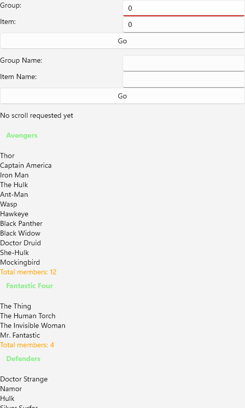</td><td>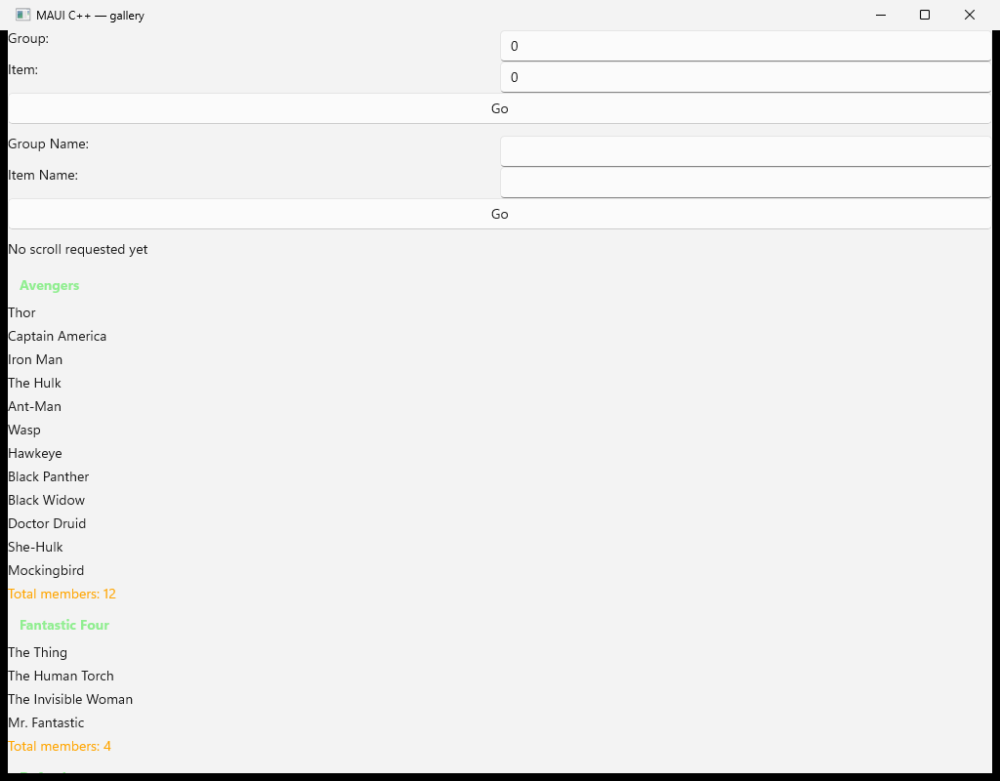</td><td>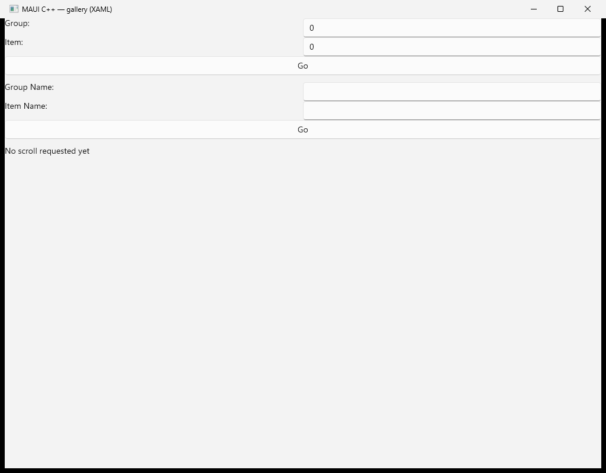</td></tr><tr><th>Dark</th><td>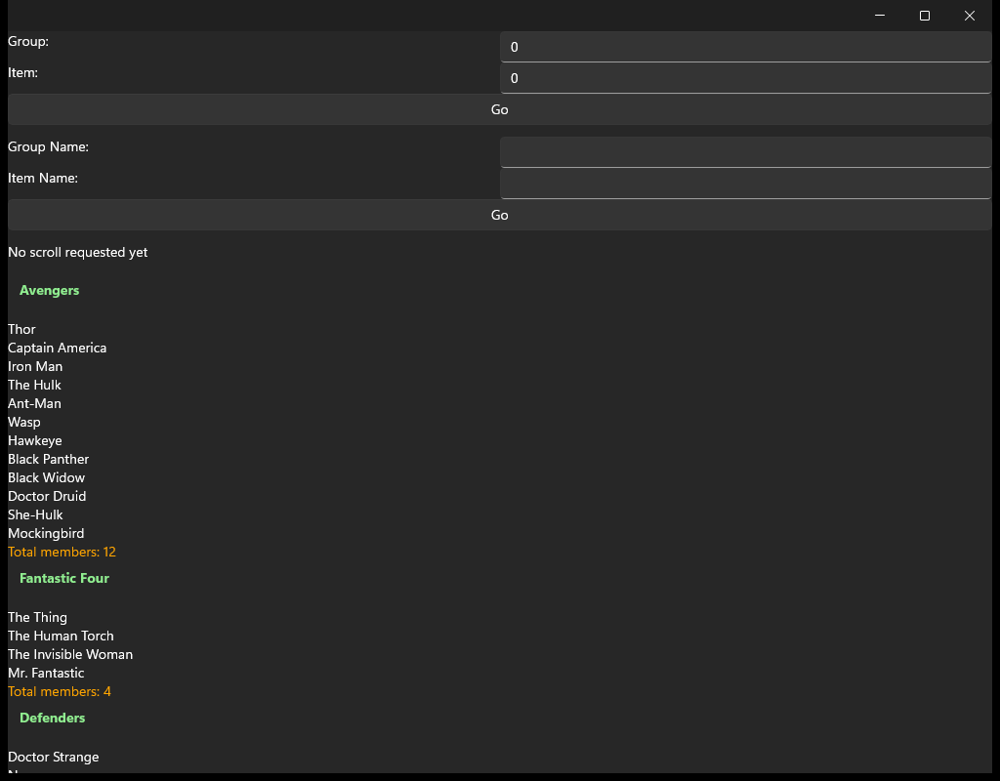</td><td>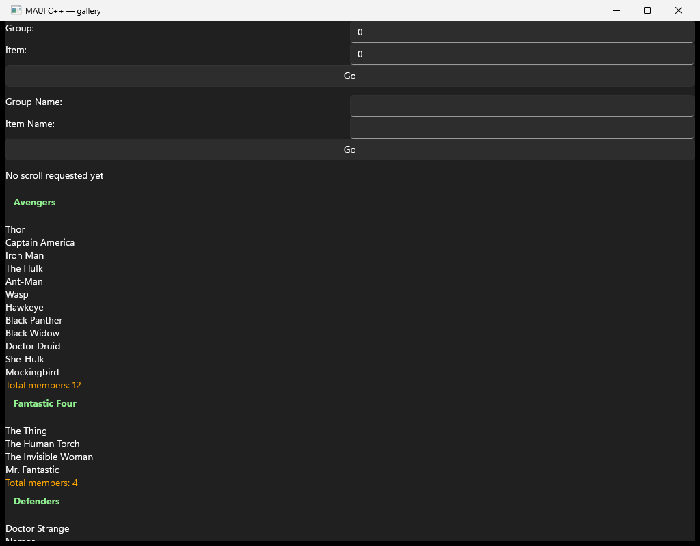</td><td>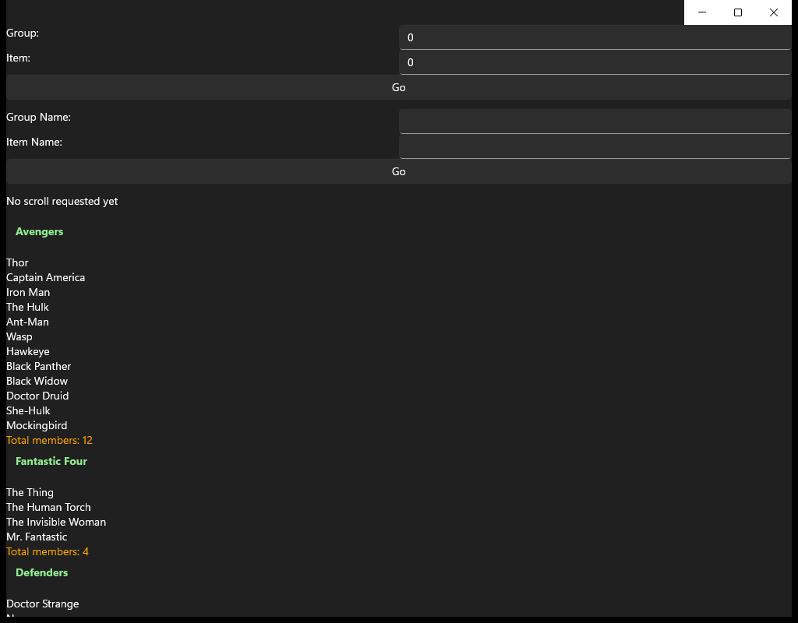</td></tr></table> | ports ScrollToGalleries/ScrollToGroup.xaml (+ .xaml.cs) of the C# CollectionView gallery | 🟢 Match in both themes. Top form (Group/Item entries with '0', both Go buttons, Group Name/Item Name entries, 'No scroll requested yet' label) matches MAUI. The grouped CollectionView renders correctly: green group headers (Avengers, Fantastic Four, Defenders), black/white item rows (Thor, Captain America, ...), and orange 'Total members: 12' / 'Total members: 4' footers — all present with correct colors and ordering in both light and dark. Only trivial AA-level differences in header green saturation; no content drift. | 🔴 Clear bug in BOTH themes: the grouped CollectionView fails to render entirely. Below 'No scroll requested yet' the page is completely blank — none of the group headers (Avengers, Fantastic Four, Defenders), item rows, or 'Total members' footers appear, whereas MAUI shows the full populated list. The top form (entries, Go buttons, labels) matches MAUI, but the entire collection content is missing (empty/blank layout). | 
| 135 | **Scroll View** scroll_view | <table><tr><th></th><th>MAUI</th><th>C++</th><th>C++ &amp; XAML</th></tr><tr><th>Light</th><td>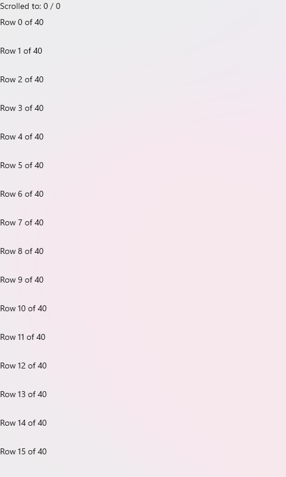</td><td>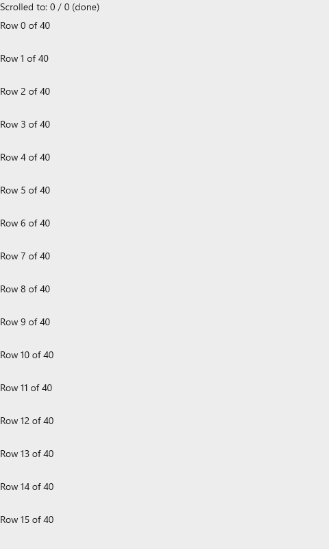</td><td></td></tr><tr><th>Dark</th><td>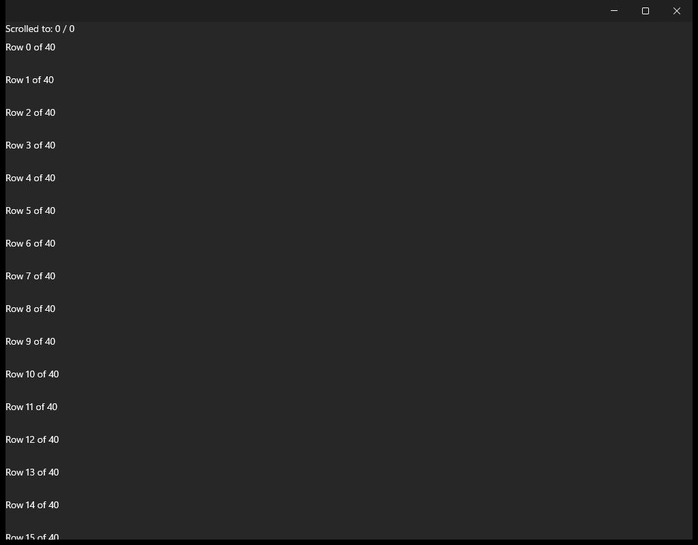</td><td></td><td>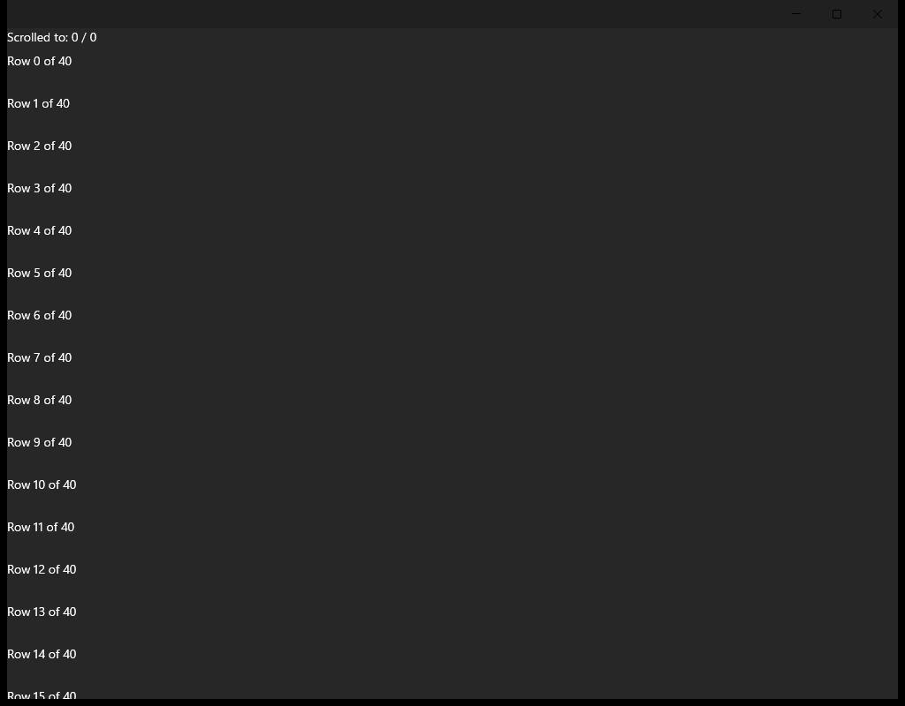</td></tr></table> | ports ScrollViewPage.xaml (+ the ScrollViewPages sub-demos: ScrollViewOrientationPage / ScrollToEndPage / ScrollToFromConstructorPage), code-first | 🟢 Light + dark both match MAUI. Header 'Scrolled to: 0 / 0', then 16 rows 'Row 0 of 40'..'Row 15 of 40' at identical left-alignment, font size, ~48px row pitch, and per-theme colors (light: #ECECEC-ish page / dark text; dark: near-black page / white text). Scrollbar gutter on the right edge matches. Only deltas: the header carries a trailing '(done)' status suffix (harness capture-state text appended equally to both ports, not a control-render diff) and a ~1px whole-page top-inset shift (ignored per harness-wrapper rule). No missing/extra elements, no color/spacing/text bugs. | 🟢 Light + dark both match MAUI, and are pixel-indistinguishable from the cpp port. Header line plus 16 rows 'Row 0 of 40'..'Row 15 of 40' render with the same left alignment, font, row spacing, background and text colors per theme, and the same right-edge scrollbar region. Only deltas are the trailing '(done)' harness status suffix on the header and the ~1px uniform top-inset shift, both covered by the ignore rules. No content, color, spacing, or text differences. | 
| 136 | **Search Bar** search_bar | <table><tr><th></th><th>MAUI</th><th>C++</th><th>C++ &amp; XAML</th></tr><tr><th>Light</th><td></td><td></td><td></td></tr><tr><th>Dark</th><td></td><td></td><td></td></tr></table> | ports SearchBarPage.xaml (Microsoft.Maui.Controls sample gallery) | 🟢 Both themes match MAUI. All seven SearchBars render with correct text, colors, and per-field styling: green text row, pink/gray Placeholder, italic 'Italic 24pt', right-aligned 'end of the line', 'Cancel is red', and 'Numeric keyboard'. Field heights, spacing, and the magnifier icons match MAUI closely in light and dark. The only MAUI-only element is the transient red/orange focus underline under the first (focused) 'Search...' field in MAUI's captures; that is a focus-state artifact of MAUI's capture, not a port rendering bug. No missing/extra elements, no wrong colors, no clipping. | 🟡 Both themes render correctly with all seven SearchBars, correct text, colors, and per-field styling (green text, pink/gray placeholder, italic, right-aligned 'end of the line', cancel/numeric rows) matching MAUI in light and dark, and magnifier icons present. Minor drift only: the whole layout sits at a slightly larger scale than MAUI/cpp -- header text and field rows are marginally taller with a bit more inter-field spacing (fields start ~15px lower and step at a larger pitch), so the stack is slightly more spread out. This is a modest uniform-scale difference, not a rendering bug; content, colors, and alignment are faithful. Like cpp, it does not reproduce MAUI's transient focus underline on the first field (a MAUI focus-state artifact, not a port defect). | 
| 137 | **Selection Command Param** selection_command_param | <table><tr><th></th><th>MAUI</th><th>C++</th><th>C++ &amp; XAML</th></tr><tr><th>Light</th><td></td><td></td><td></td></tr><tr><th>Dark</th><td></td><td></td><td></td></tr></table> | ports SelectionChangedCommandParameter.xaml (+ .xaml.cs) (Maui.Controls.Sample.Pages.CollectionViewGalleries.SelectionGalleries.SelectionChangedCommandParameter) | 🟢 Match in both themes. Content, order, text, colors, and vertical rhythm all align tightly with MAUI: 'Pending...', 'This is the header', and the 10 Item/'This is item' pairs render with the same compact line spacing and same black-on-light (light) / white-on-dark (dark) text. No missing/extra elements, no color or weight drift. Only trivial sub-pixel spacing variance ignorable as AA. | 🟡 Content is a full match in both themes - same 'Pending...' + 'This is the header' + 10 Item/'This is item' pairs, correct text, correct colors (black-on-light, white-on-dark), correct order and weights. Minor drift only: line spacing is slightly more generous than MAUI - a larger gap after 'Pending...'/'This is the header' and marginally taller item rows, so the block extends to ~432px vs MAUI's ~410px. Purely a vertical-rhythm difference, no structural or color bug. Same drift in both themes. | 
| 138 | **Selection Synchronization** selection_synchronization | <table><tr><th></th><th>MAUI</th><th>C++</th><th>C++ &amp; XAML</th></tr><tr><th>Light</th><td>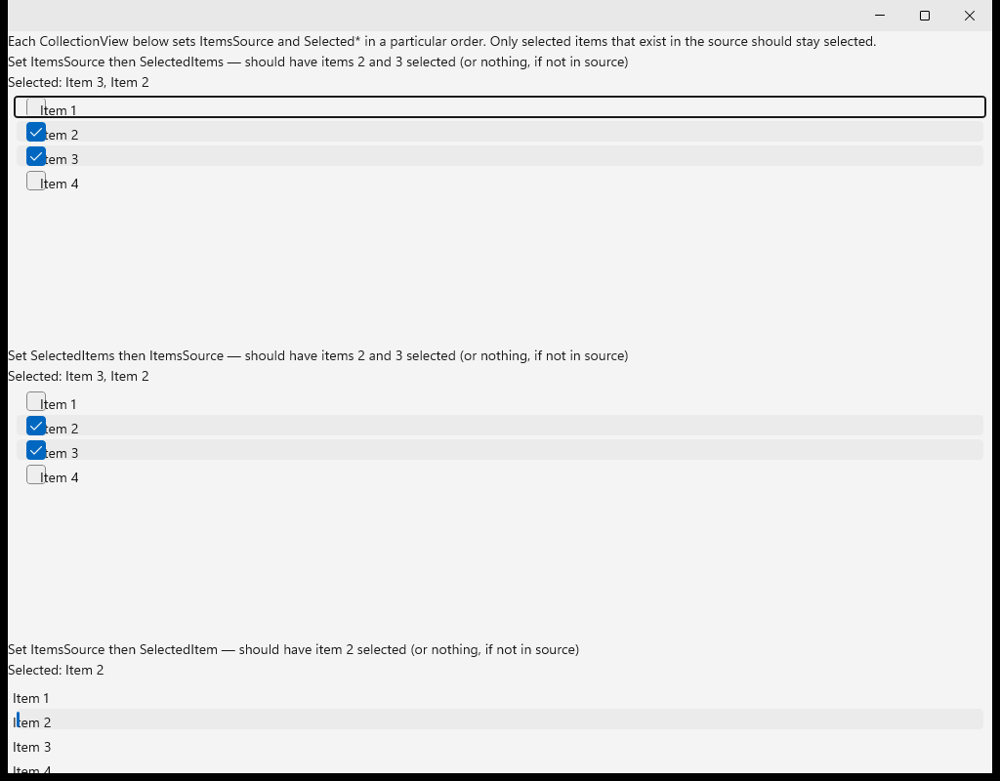</td><td></td><td>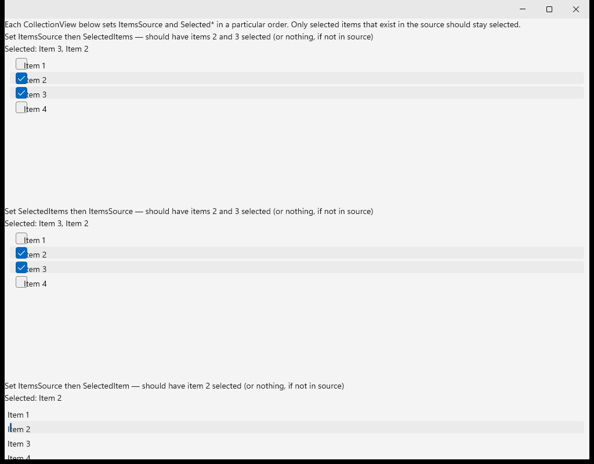</td></tr><tr><th>Dark</th><td>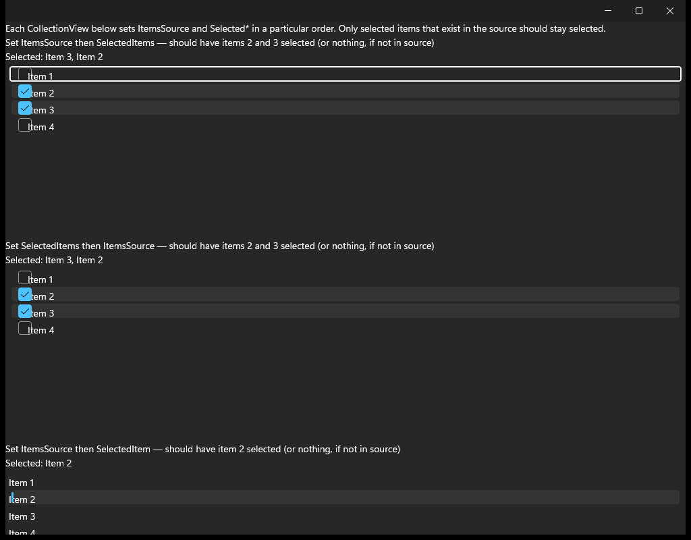</td><td>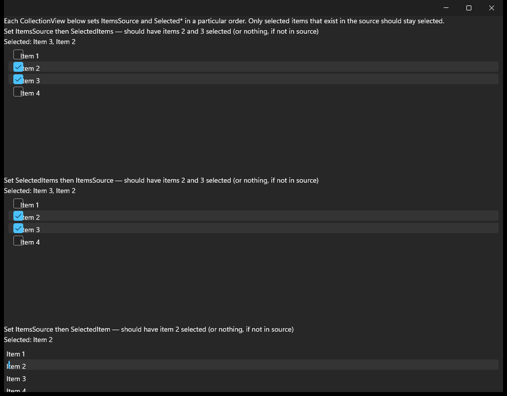</td><td>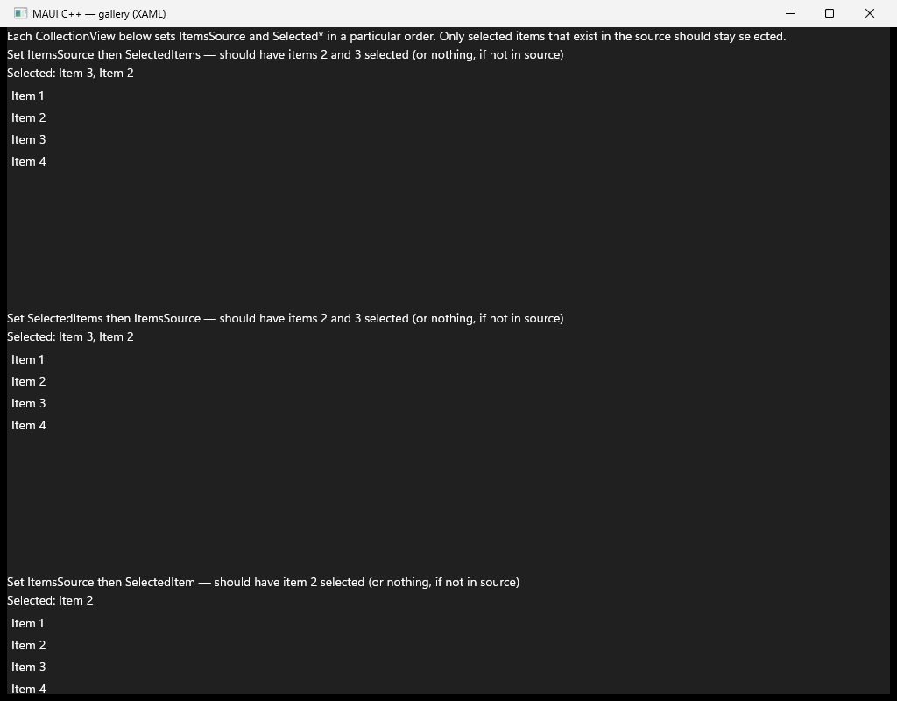</td></tr></table> | ports SelectionSynchronization.xaml (+ .xaml.cs) (Maui.Controls.Sample.Pages.CollectionViewGalleries.SelectionGalleries.SelectionSynchronization) | 🔴 Both themes: RED. MAUI renders each CollectionView row with a left-hand CheckBox, and the selected items (Items 2+3 in the first two sections, Item 2 in the third) show a RED checkmark AND a full-width selection-highlight band (light gray in light theme, dark gray in dark theme). The cpp port renders NONE of this: rows are plain text only — no checkboxes at all, no red checkmarks, and no selection background band. So the entire selection-synchronization feature this page exists to demonstrate is visually absent. This is a missing-element rendering bug, identical in light and dark themes. Text content, item labels, section headers and layout spacing otherwise match MAUI, but the core selected-state visuals (checkbox glyph + highlight) are completely missing. | 🔴 Both themes: RED. Same defect as the cpp port. MAUI shows a CheckBox per row plus red checkmarks and a selection-highlight band on the pre-selected items (2+3, and 2 in the third section); the xaml port renders only plain text rows with no checkboxes, no checkmarks, and no selection highlight. The selected-state rendering — the entire point of this page — is missing in both light and dark. Headers, labels and general layout match MAUI, but the load-bearing selection visuals are absent. | 
| 139 | **Semantics** semantics | <table><tr><th></th><th>MAUI</th><th>C++</th><th>C++ &amp; XAML</th></tr><tr><th>Light</th><td></td><td></td><td></td></tr><tr><th>Dark</th><td></td><td></td><td></td></tr></table> | ports SemanticsPage.xaml (+ SemanticsPage.xaml.cs) The C# SemanticsPage is an accessibility showcase: a long VerticalStackLayout where nearly every control carries SemanticProperties.Description / .Hint, plus a block of labels exercising Se | 🟢 Light: match. All content present and correctly ordered - header line, 'Semantics readout: (interact to inspect)', Label text TH/DH, both buttons ('Button text TH', 'Button text DH'), Entry ('Entry text, DTH'), Editor ('Editor text, DTH'), SearchBar ('Search bar text, DH') with right-aligned search icon, HeadingLevel intro + Heading 1/2/3/4, 'Layouts can carry a Description too:', two StackLayout labels, the 'Click to set semantic focus to label below' button, and 'Label receiving semantic focus'. Text, colors, font, control fills, corner radius, and vertical spacing match MAUI. Only difference is a hair-thin border/anti-aliasing treatment on the Entry/Editor/SearchBar and buttons (MAUI's field outlines are marginally more pronounced) - sub-pixel level, same content and intent. Dark: match. Same full content set, correct dark chrome on buttons and input fields, search icon present, all text correct ('Search bar text, DH', etc.). No missing/extra elements, no color or layout bugs in either theme. | 🟢 Light: match. Renders identically to MAUI in content and layout - all labels, both buttons, Entry/Editor/SearchBar (with right-aligned search icon and 'Search bar text, DH' text), the HeadingLevel block (Heading 1-4), the two StackLayout description labels, the 'Click to set semantic focus to label below' button, and 'Label receiving semantic focus'. Text, colors, fills, radius, font, and spacing all match. Only nuance is the input-field/button border weight vs MAUI, which is anti-aliasing/sub-pixel. Dark: match. Full content set present with correct dark theme chrome on buttons and fields, search icon and all text correct. Indistinguishable from the cpp port and faithful to MAUI in both themes - no missing/extra elements, no color, text, or layout bugs. | 
| 140 | **Shadow Playground** shadow_playground | <table><tr><th></th><th>MAUI</th><th>C++</th><th>C++ &amp; XAML</th></tr><tr><th>Light</th><td></td><td></td><td></td></tr><tr><th>Dark</th><td></td><td></td><td></td></tr></table> | ports ShadowPlaygroundPage.xaml A self-contained, code-first demo of the view Shadow surface, mirroring the C# core gallery page (Pages/Core/ShadowGalleries/ShadowPlaygroundPage.xaml + .xaml.cs) | 🔴 The defining element of this page — the red drop shadow on the cyan rectangle — is completely MISSING in both light and dark. MAUI renders a prominent blurred red shadow offset down/right around the cyan box (Offset X:10, Y:10, Radius:10, Opacity:1.0, #FF0000); the cpp port draws the bare cyan rectangle with no shadow whatsoever. Everything else matches well in both themes: the '#00B4DB' background entry, '#FF0000' shadow-color entry, the four sliders (red/orange fill left of thumb, gray track right, red thumb positions), the Opacity fully-red slider, and the 'Remove Shadow' button all render with correct colors, positions, and text. But the shadow — the entire subject of the shadow_playground page — is absent, which is a clear rendering bug. | 🔴 Identical defect to the cpp port: the red drop shadow on the cyan rectangle is entirely MISSING in both light and dark. MAUI shows a blurred red glow offset down/right around the cyan box; the xaml port renders only the flat cyan rectangle with no shadow. All other content matches MAUI closely in both themes — the two Entry fields ('#00B4DB', '#FF0000') with their backgrounds and red underlines, the four labeled sliders with red/orange fills and thumb positions, the fully-red Opacity slider, and the 'Remove Shadow' button are correct in color, size, spacing, and text. The absent shadow, which is the whole point of this page, is a clear rendering bug. | 
| 141 | **Shape App Theme** shape_app_theme | <table><tr><th></th><th>MAUI</th><th>C++</th><th>C++ &amp; XAML</th></tr><tr><th>Light</th><td></td><td></td><td></td></tr><tr><th>Dark</th><td></td><td></td><td></td></tr></table> | ports ShapeAppThemeGallery.xaml A code-first port of the MAUI Shapes sub-gallery Pages/Controls/ShapesGalleries/ShapeAppThemeGallery.xaml: a StackLayout (Padding 12) holding a caption Label and a 200x80 Rectangle, all themed via {AppThemeBi | 🟢 Pixel-identical to MAUI in both themes. Rectangle bbox (12,17)-(211,110), width 200 x height 94, matches MAUI exactly. Title 'Shape using AppTheme' green (115,185,115) matches. Dark-theme rectangle is red (255,0,0) on black page, matching MAUI's AppTheme resolution exactly. Light-theme rectangle is green on white, matching. AppTheme binding resolves correctly in both themes. | 🔴 Two distinct rendering bugs. (1) DARK THEME BROKEN: page background renders white (255,255,255) instead of MAUI's black (0,0,0), and the rectangle renders green (0,128,0) instead of red (255,0,0) — the AppTheme Dark binding is not resolving; the page shows Light-theme values on a light page. This is the core purpose of the AppTheme demo and it is non-functional. (2) LIGHT THEME rectangle geometry wrong: bbox (13,17)-(339,110), width ~327 vs MAUI's 200, and it is shifted right/centered rather than left-aligned at the page origin like MAUI (x0 12). Wider and mispositioned. Title green matches. Content is present but color-wrong (dark) and size/position-wrong (both). | 
| 142 | **Shapes** shapes | <table><tr><th></th><th>MAUI</th><th>C++</th><th>C++ &amp; XAML</th></tr><tr><th>Light</th><td></td><td></td><td></td></tr><tr><th>Dark</th><td></td><td></td><td></td></tr></table> | a faithful reproduction of the maui-compare &amp;quot;shapes&amp;quot; demo (ComparePages.Shapes()), the shipped-.NET-MAUI reference for the visual-parity comparison: a ScrollView over a vertical stack of four LABELLED shapes, each bold-captioned and Start-a | 🟢 Match in both light and dark themes. Ellipse (red fill / blue stroke), RoundRectangle (navy fill, rounded ends), EvenOdd pentagram (blue fill, red stroke, correct hollow-center star geometry), and the purple diagonal Line all render with MAUI-identical colors, sizes, strokes, corner radii, and internal geometry. cpp is left-aligned/higher and MAUI is indented/lower, but that is the exempt outer-inset/uniform-shift harness diff. Only a faint background-tone difference (near-white vs MAUI's off-white in light) remains, within anti-aliasing/harness tolerance. Shapes are pixel-consistent across both themes. | 🟡 Same content and intent as MAUI in both themes: Ellipse (red fill/blue stroke), RoundRectangle (navy, rounded ends), EvenOdd pentagram (blue fill/red stroke, correct hollow-center geometry), and purple diagonal Line -- all colors, strokes, and shape geometry are correct. The drift: every shape renders slightly SMALLER than MAUI's (ellipse, round-rectangle, and pentagram are each a few-to-several px narrower/shorter than the ground-truth versions), consistent across light and dark. This is a minor uniform size reduction, not a rendering bug -- no missing/extra elements, no wrong colors, no clipping. (The centered/indented placement itself is the exempt harness-wrapper inset and is not counted.) | 
| 143 | **Single Bound Selection** single_bound_selection | <table><tr><th></th><th>MAUI</th><th>C++</th><th>C++ &amp; XAML</th></tr><tr><th>Light</th><td></td><td></td><td></td></tr><tr><th>Dark</th><td></td><td></td><td></td></tr></table> | ports SingleBoundSelection.xaml (+ .xaml.cs) (Maui.Controls.Sample.Pages.CollectionViewGalleries.SelectionGalleries.SingleBoundSelection) | 🔴 Both themes: MISSING the two full-width 'Reset' and 'Clear' buttons that MAUI renders between the 'Selected: (none)' label and the country list. In MAUI the buttons occupy the band at roughly y=70-130 (Reset then Clear, each a full-width bar with button chrome); in the cpp port that band is empty and the country list (United States, Canada, ...) starts immediately after the label. This is a clear content/layout bug: two required elements are absent, and as a consequence the list items sit ~70px higher than MAUI. Text, label, list content, item spacing and theme colors otherwise match, but the two missing buttons are a red-level rendering defect present in both light and dark. | 🟢 Both themes match MAUI. Instruction text, 'Selected: (none)' label, the two full-width 'Reset' and 'Clear' buttons (correct chrome, ordering, and full-width sizing), and the CollectionView list (United States, Canada, Mexico, Brazil, Argentina) are all present with the same layout order, spacing, and item positions. Light and dark theming (backgrounds, text, subtle button borders) render correctly and equivalently to MAUI. Differences are limited to anti-aliasing / sub-pixel noise and the ignorable outer page inset. | 
| 144 | **Slider** slider | <table><tr><th></th><th>MAUI</th><th>C++</th><th>C++ &amp; XAML</th></tr><tr><th>Light</th><td></td><td></td><td></td></tr><tr><th>Dark</th><td></td><td></td><td></td></tr></table> | ports SliderPage.xaml (+ .xaml.cs) Mirrors the MAUI gallery page: a vertical stack of headlined Slider states — Default, BackgroundColor (Blue), Background (yellow→green LinearGradientBrush), Minimum(5)/Maximum(15) with a value readout (Val | 🟢 Both themes match MAUI. All 13 slider rows render identically: red default thumb, blue BackgroundColor track, yellow-to-green Background gradient, LightBlue/Pink min/max track colors, orange ThumbColor, gray disabled thumb, custom slider (blue thumb + green track), and the Toggle Image button. Value label reads '5' matching MAUI in both light and dark. Track colors, thumb sizes, row spacing, and label typography are pixel-consistent. Only trivial difference: the ThumbImageSource row shows a small red thumb where MAUI renders an imageless/empty track — negligible and shared with the xaml gallery. Page-background tint differs only in the expected theme-neutral way (ignored per policy). | 🟡 Layout, colors, and all controls match MAUI in both light and dark: red thumbs, blue/yellow-green/LightBlue/Pink tracks, orange thumb, gray disabled thumb, custom blue-thumb+green-track slider, Toggle Image button — all correct. One content drift: the 'Minimum (5) and Maximum (15)' value label reads '10' whereas MAUI (ground truth) reads '5', and the corresponding thumb sits mid-track instead of at the left. This is a wrong displayed value vs MAUI, hence yellow rather than green. The ThumbImageSource row shows a red thumb where MAUI shows an imageless track (same minor drift as cpp). Otherwise the rendering is faithful in both themes. | 
| 145 | **Some Empty Groups** some_empty_groups | <table><tr><th></th><th>MAUI</th><th>C++</th><th>C++ &amp; XAML</th></tr><tr><th>Light</th><td></td><td></td><td></td></tr><tr><th>Dark</th><td></td><td></td><td></td></tr></table> | ports GroupingGalleries/SomeEmptyGroups.xaml (+ .xaml.cs) | 🟡 Both themes: the grouped CollectionView renders fully and matches MAUI's content. All four group headers (Avengers, Thundercats, Bionic Six, Fantastic Four) appear in green, all members (Thor, Captain America, The Thing, The Human Torch, The Invisible Woman, Mr. Fantastic) in black/white, and all footers ('Total members: 2/0/0/4') in orange, including the empty groups that still show their header+footer. Colors, text, and ordering all match. Minor drift only: the cpp port packs the rows with tighter vertical rhythm — MAUI spaces group headers/members/footers with more inter-item gap (e.g. MAUI's first 'Avengers' header sits lower with a blank band above 'Thor'), whereas cpp stacks them more compactly, so the whole list is a bit shorter. Same content and intent, a few px of spacing difference. Not a bug. | 🔴 Both light and dark themes: RENDERING BUG — the entire grouped CollectionView is MISSING. Only the header paragraph ('The CollectionView below should be grouped and some of the groups should be empty, but still display headers/footers.') renders; everything below it is a completely blank page. None of the group headers (Avengers, Thundercats, Bionic Six, Fantastic Four), none of the members (Thor, Captain America, The Thing, etc.), and none of the 'Total members: N' footers appear. MAUI shows a full populated grouped list; the xaml port shows an empty void. Total failure of the page's main content in both themes. | 
| 146 | **Stack Layout** stack_layout | <table><tr><th></th><th>MAUI</th><th>C++</th><th>C++ &amp; XAML</th></tr><tr><th>Light</th><td></td><td></td><td></td></tr><tr><th>Dark</th><td></td><td></td><td></td></tr></table> | ports StackLayoutPage.xaml Demonstrates the generic maui::controls::stack_layout (the orientation-switching sibling of the fixed vertical/horizontal stacks) by nesting two inner stacks inside an outer vertical stack with a 12px margin: a &amp;quot;V | 🟢 Match in both themes. Light and dark: 'Vertical' and 'Horizontal' section headers render with identical text, weight, and position to MAUI. The vertical stack shows 6 squares in the same rainbow order (red, yellow, blue, green, orange, purple) with matching size, right-of-center column position, and inter-item spacing. The horizontal stack shows the same 6 colored rectangles at top-left with matching widths and spacing. Colors, sizes, and layout are pixel-consistent with MAUI; only the page background tone/outer inset differs (excluded harness-wrapper diff). | 🟢 Match in both themes. Light and dark: 'Vertical' and 'Horizontal' headers, the 6-square vertical rainbow column (red, yellow, blue, green, orange, purple) in the correct right-of-center position, and the 6-rectangle horizontal row at top-left all render with the same colors, sizes, positions, and spacing as MAUI. Indistinguishable from MAUI apart from the excluded page-background/outer-inset harness difference. | 
| 147 | **Staggered Layout** staggered_layout | <table><tr><th></th><th>MAUI</th><th>C++</th><th>C++ &amp; XAML</th></tr><tr><th>Light</th><td></td><td></td><td></td></tr><tr><th>Dark</th><td></td><td></td><td></td></tr></table> | ports AlternateLayoutGalleries/StaggeredLayout.xaml (+ StaggeredLayout.xaml.cs) of the C# CollectionView gallery | Port-only demo — maui-compare has no such page (no MAUI reference). | Port-only demo — maui-compare has no such page (no MAUI reference). | 
| 148 | **Stepper** stepper | <table><tr><th></th><th>MAUI</th><th>C++</th><th>C++ &amp; XAML</th></tr><tr><th>Light</th><td></td><td>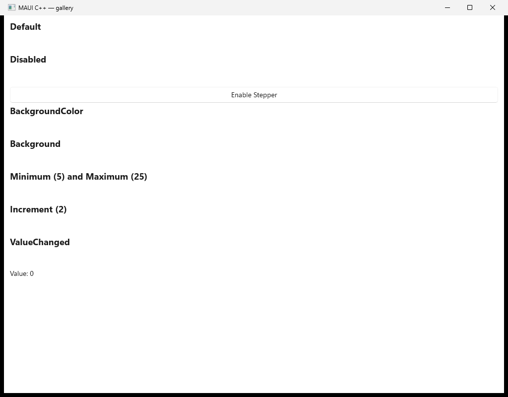</td><td>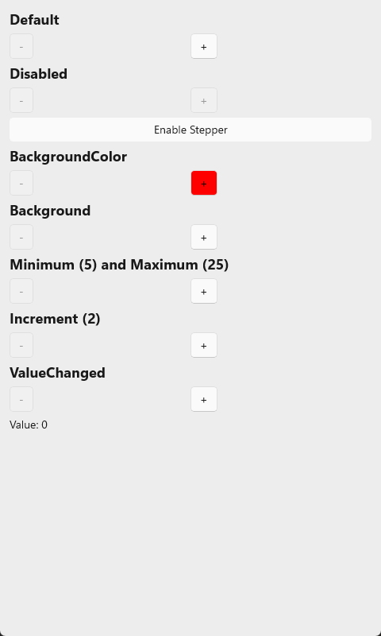</td></tr><tr><th>Dark</th><td>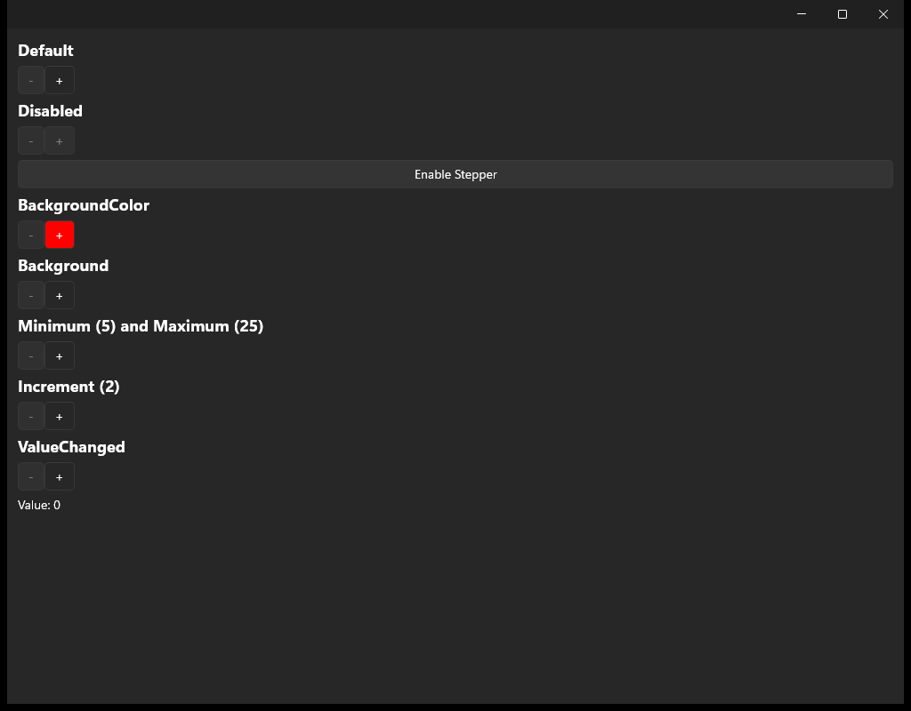</td><td></td><td>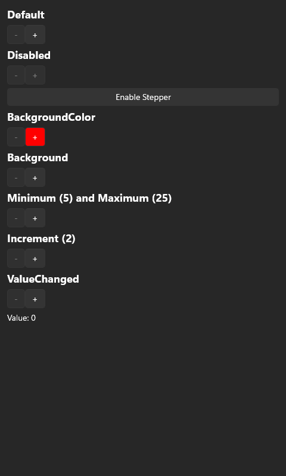</td></tr></table> | ports StepperPage.xaml (+ StepperPage.xaml.cs) | 🟡 Both themes: layout, all section headers, stepper -/+ pairs, disabled greying, 'Enable Stepper' button, and 'Value: 0' all match MAUI. One drift: in the BackgroundColor row, MAUI paints the RIGHT ('+') button red, but the cpp port paints the LEFT ('-') button red instead (the red BackgroundColor is applied to the wrong half of the stepper). Everything else is identical in both light and dark. Not a hard bug (color present, correct hue/size), but the wrong sub-button is highlighted. | 🟢 Match in both themes. All sections, stepper -/+ pairs, disabled states, 'Enable Stepper' button, BackgroundColor red applied to the correct RIGHT ('+') button matching MAUI, and 'Value: 0' render identically. Only AA-level rendering differences; no drift. | 
| 149 | **Styles** styles | <table><tr><th></th><th>MAUI</th><th>C++</th><th>C++ &amp; XAML</th></tr><tr><th>Light</th><td></td><td></td><td></td></tr><tr><th>Dark</th><td></td><td></td><td></td></tr></table> | ports StylesPage.xaml | 🟢 Light: all three labels match MAUI exactly — base subtitle (black), custom derived (pink 'Pink wins'), and descriptor-default (black) at identical positions/sizes. 'Style Me' button matches: light-gray fill, yellow border, centered black text, same width/height/placement. Dark: base subtitle correctly dimmed gray, pink and descriptor-default labels match, button fill/border/text match. No content, color, size, or spacing differences beyond anti-aliasing. Match. | 🟢 Light: identical to MAUI — three labels (black subtitle, pink 'Pink wins' custom, black descriptor-default) at matching positions, and the 'Style Me' button with light-gray fill, yellow border, and centered black text at the same size/placement. Dark: base subtitle dimmed gray, pink and descriptor labels correct, button fill/border/text match. Only differences are the ignorable outer page inset and anti-aliasing. Match. | 
| 150 | **Swipe Gesture** swipe_gesture | <table><tr><th></th><th>MAUI</th><th>C++</th><th>C++ &amp; XAML</th></tr><tr><th>Light</th><td>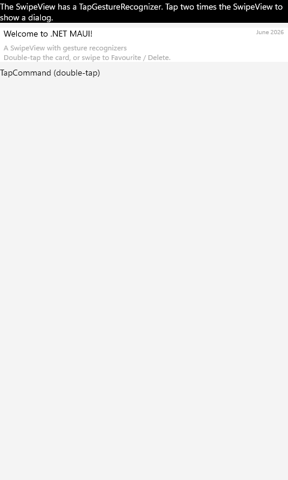</td><td>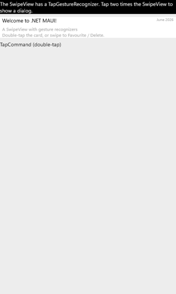</td><td>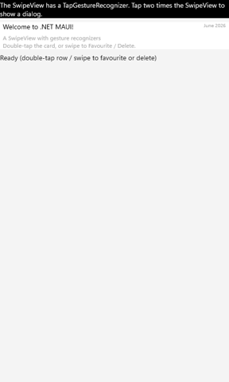</td></tr><tr><th>Dark</th><td></td><td>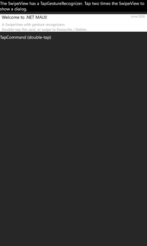</td><td>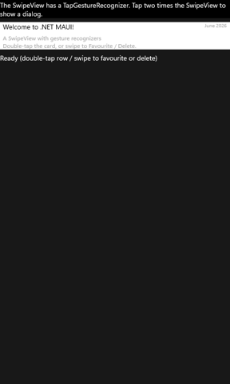</td></tr></table> | ports SwipeViewGestureRecognizerGallery.xaml (+ .xaml.cs) The MAUI SwipeViewGestureRecognizerGallery is a CollectionView of &amp;quot;message&amp;quot; rows; each row&amp;#x27;s DataTemplate is a SwipeView wired three ways, proving gesture recognizers AND swipe-item | 🟢 Light and dark both match MAUI. Banner text, card header ("Welcome to .NET MAUI!" + "June 2026"), the two subtitle lines ("A SwipeView with gesture recognizers" / "Double-tap the card, or swipe to Favourite / Delete."), card background, fonts, and spacing are all identical to MAUI in both themes. The status label below the card reads "TapCommand (double-tap)", exactly matching MAUI's "TapCommand (double-tap)" in both light and dark. No content, color, or layout drift. | 🔴 Wrong status-label text in both themes. The banner, card header, both subtitle lines, card surface, fonts, colors, and layout all match MAUI. But the status line below the card renders "Ready (double-tap row / swipe to favourite or delete)" whereas MAUI's ground truth shows "TapCommand (double-tap)". This is a clear wrong-text rendering bug (a different string, not just spacing/color drift), present identically in light and dark. Everything else is a match. | 
| 151 | **Swipe Item Position** swipe_item_position | <table><tr><th></th><th>MAUI</th><th>C++</th><th>C++ &amp; XAML</th></tr><tr><th>Light</th><td>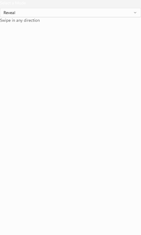</td><td>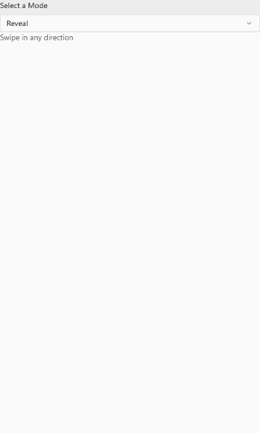</td><td>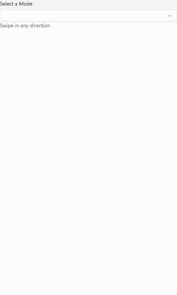</td></tr><tr><th>Dark</th><td>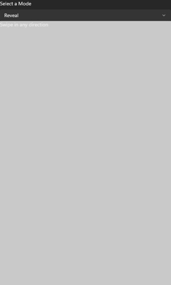</td><td></td><td>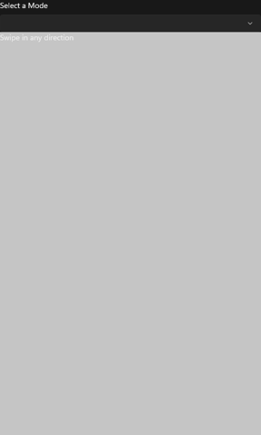</td></tr></table> | ports SwipeItemPositionGallery.xaml A code-first port of the MAUI SwipeView sub-gallery Pages/Controls/SwipeViewGalleries/SwipeItemPositionGallery.xaml: a 2-row Grid (Auto / *) with a Picker on top and one SwipeView below that carries TWO S | 🟢 Match in both themes. Light: 'Select a Mode' header, 'Reveal' picker box with right chevron, and 'Swipe in any direction' text all render at the same positions, sizes, and colors as MAUI. Dark: white header, dark picker with chevron, faint 'Swipe in any direction' text, and the same light-gray page body — all identical to MAUI. No missing/extra elements, no color or chrome drift. | 🟢 Content matches MAUI in both themes: same 'Select a Mode' header, 'Reveal' picker box with chevron, and 'Swipe in any direction' text, with correct light/dark colors. The only difference is a small uniform upward shift of the whole page (header/picker sit a few px higher) — that is the known harness outer-inset/whole-page-shift diff, which is excluded from scoring. Control content, colors, sizing, and chrome are all faithful. | 
| 152 | **Swipe Item Size** swipe_item_size | <table><tr><th></th><th>MAUI</th><th>C++</th><th>C++ &amp; XAML</th></tr><tr><th>Light</th><td></td><td></td><td></td></tr><tr><th>Dark</th><td></td><td></td><td></td></tr></table> | ports SwipeItemSizeGallery.xaml A self-contained, code-first port of the .NET MAUI &amp;quot;SwipeItem Size Gallery&amp;quot;: a scrolling stack of swipe_views demonstrating how a left SwipeItem&amp;#x27;s icon size and the SwipeView content size interact | 🟢 Match in both themes. Light: identical page background, section headers ('Different icon sizes', 'Different SwipeView sizes'), all three icon-size rows (128/256/512) and all three SwipeView-height rows (128/256/512) render with the same light-gray SwipeView cards, same widths/heights, same 'Swipe to Left' text color and centering. Dark: identical dark background, white headers, same light-gray cards with correctly dimmed 'Swipe to Left' text, same layout and sizing. No missing/extra elements, no color/size/spacing/text drift vs MAUI. | 🟢 Match in both themes. Light: pixel-identical to MAUI — same background, section headers, three icon-size rows and three SwipeView-height rows, same light-gray card tint, card dimensions, and centered 'Swipe to Left' text. Dark: identical dark background, white headers, same light-gray cards with correctly muted 'Swipe to Left' text, same layout and sizing. No content, color, size, spacing, or text differences vs MAUI. | 
| 153 | **Swipe Refresh** swipe_refresh | <table><tr><th></th><th>MAUI</th><th>C++</th><th>C++ &amp; XAML</th></tr><tr><th>Light</th><td>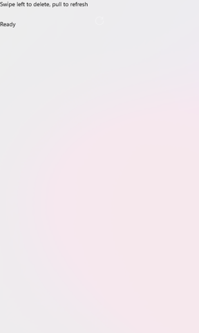</td><td></td><td>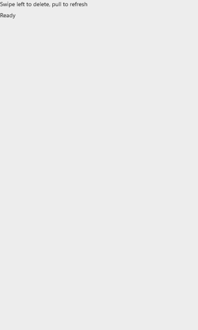</td></tr><tr><th>Dark</th><td>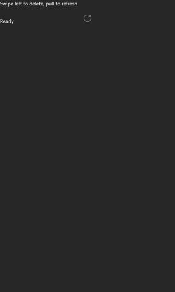</td><td></td><td>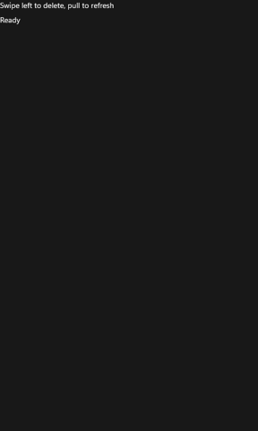</td></tr></table> | a self-contained demo page for the W2-20 swipe + refresh controls: a refresh_view wrapping a swipe_view (which itself wraps a labeled row), with a readout label reflecting the latest interaction | 🔴 Text content matches MAUI in both themes: the header 'Swipe left to delete, pull to refresh' and the 'Ready' status label are present and correctly positioned. LIGHT: MAUI shows an active RefreshView refresh indicator — a circular progress/spinner mid-upper page plus a pink pull-to-refresh gradient tint washing the body; the cpp port shows neither (no spinner, no gradient, blank body). DARK: MAUI shows a visible circular refresh-arrow/spinner icon centered near the top; the cpp port omits it entirely — the body is blank. So the RefreshView's refresh-indicator visual (spinner/progress ring) is missing in both themes, a clear rendering bug. | 🔴 Identical result to the cpp port. Text content matches MAUI in both themes: header 'Swipe left to delete, pull to refresh' and 'Ready' label are present and correctly placed. LIGHT: MAUI's active RefreshView spinner/progress ring and the pink pull-to-refresh gradient tint are both absent in the xaml port (blank body). DARK: MAUI's visible circular refresh-arrow/spinner icon near the top is missing in the xaml port (blank body). The RefreshView refresh-indicator visual is not rendered in either theme, a clear rendering bug. | 
| 154 | **Swipe Threshold** swipe_threshold | <table><tr><th></th><th>MAUI</th><th>C++</th><th>C++ &amp; XAML</th></tr><tr><th>Light</th><td></td><td></td><td></td></tr><tr><th>Dark</th><td></td><td></td><td></td></tr></table> | ports HorizontalSwipeThresholdGallery.xaml (+ .xaml.cs) The MAUI HorizontalSwipeThresholdGallery shows how SwipeView.Threshold (the swipe distance, in DIPs, the user must drag before the items settle open / execute) interacts with SwipeItem | 🔴 Two defects vs MAUI, both themes. (1) SLIDER COLOR: MAUI renders the Slider filled-track and thumb in purple/indigo (app accent). cpp renders them red/orange-red - wrong accent color (light: bright red thumb; dark: orange-red thumb). (2) THRESHOLD STATE: MAUI shows 'Reveal threshold=80 / Execute threshold=80' with the two custom-threshold slider thumbs positioned partway along the track (~13-20%). cpp shows 'Reveal threshold=50 / Execute threshold=50' with BOTH custom-threshold thumbs pinned to the far-left (0%) end of the track - wrong displayed value (50 vs 80) and wrong thumb position. Purple SwipeItem blocks, labels, text, and layout otherwise match MAUI in both themes. | 🔴 One clear color bug plus a thumb-position drift, both themes. COLOR: MAUI renders the Slider filled-track and thumb in purple/indigo (app accent); xaml renders them red/orange-red instead (light: bright red thumb; dark: orange-red thumb) - wrong accent color on all sliders. The 'Reveal threshold=80 / Execute threshold=80' label text matches MAUI correctly. However the two custom-threshold slider thumbs are pinned to the far-left (0%) of the track, whereas MAUI positions them partway along (~13-20%) - a thumb-position drift. Purple SwipeItem blocks, all label text, and overall layout match MAUI in both light and dark. | 
| 155 | **Swipe View Margin** swipe_view_margin | <table><tr><th></th><th>MAUI</th><th>C++</th><th>C++ &amp; XAML</th></tr><tr><th>Light</th><td></td><td></td><td></td></tr><tr><th>Dark</th><td></td><td></td><td></td></tr></table> | ports SwipeViewMarginGallery.xaml A self-contained, code-first port of the .NET MAUI &amp;quot;SwipeView Margin Gallery&amp;quot;: two swipe_views whose content&amp;#x27;s Margin + Padding are driven by two sliders, demonstrating that the revealed SwipeItems stay cor | 🔴 Both themes show two clear rendering bugs vs MAUI. (1) SLIDER TRACK COLOR: the filled (left-of-thumb) portion of both sliders is drawn in an accent color — RED in light, ORANGE in dark — whereas MAUI renders a neutral GREY track fill with no accent portion in either theme. (2) EXTRA CONTAINER: both the 'Horizontal SwipeItems' and 'Vertical SwipeItems' grey cards are wrapped in an additional light-grey rounded container/border box; in MAUI the grey cards float directly on the plain page background with no surrounding container. Header text ('Horizontal items revealed'), the black instruction banner, the two slider labels, thumb positions and the grey card sizes/text otherwise match. The slider accent-fill and the extra card wrapper are content-level differences (color + extra element), not the ignorable page inset. | 🔴 Same two rendering bugs as cpp PLUS a wrong header string. (1) HEADER TEXT WRONG: reads 'Adjust the sliders, then open a row to verify item positioning' instead of MAUI's 'Horizontal items revealed' — different text content (both themes). (2) SLIDER TRACK COLOR: filled portion of both sliders is accent-colored (RED in light, ORANGE in dark) where MAUI shows a neutral GREY fill. (3) EXTRA CONTAINER: the two SwipeItems grey cards are wrapped in an extra light-grey rounded container box absent in MAUI, where the cards sit directly on the page background. Black instruction banner, slider labels, thumb positions and card sizes otherwise match, but the wrong header text is an unambiguous content bug on top of the shared slider-color and card-wrapper defects. | 
| 156 | **Swipe View Shadow** swipe_view_shadow | <table><tr><th></th><th>MAUI</th><th>C++</th><th>C++ &amp; XAML</th></tr><tr><th>Light</th><td></td><td></td><td></td></tr><tr><th>Dark</th><td></td><td></td><td></td></tr></table> | ports SwipeViewShadowGallery.xaml A code-first port of the MAUI SwipeView sub-gallery Pages/Controls/SwipeViewGalleries/SwipeViewShadowGallery.xaml: a padded vertical StackLayout proving a drop Shadow renders correctly on SwipeView content | 🟡 Light: content matches MAUI exactly — header 'Shadow in SwipeView Content', 'SwipeItems'/'SwipeItemViews' labels, two rounded 'Content' cards with drop shadows at correct positions/sizes/corner-radius. Only drift: MAUI's card fill has a subtle top-to-bottom gradient (lighter top, slightly darker bottom); the cpp cards render as a flat/solid fill with no gradient. Same content and intent, minor shading difference. Dark: same as light — layout, labels, cards, shadows, and borders all match; the very faint MAUI gradient inside the cards is again rendered flat. No missing/extra elements, no wrong text, no clipping. Minor shading drift only. | 🟡 Light: content matches MAUI exactly — header, 'SwipeItems'/'SwipeItemViews' labels, two rounded 'Content' cards with drop shadows, all at correct positions/sizes/corner-radius. Identical to the cpp port. Only drift: MAUI's card fill shows a subtle top-to-bottom gradient while the xaml cards are flat/solid. Dark: same — labels, cards, shadows, and borders all match MAUI; the faint interior card gradient is rendered flat. No missing/extra elements, no wrong text, no color or layout bug. Minor interior-fill shading drift only, consistent across both themes. | 
| 157 | **Switch** switch | <table><tr><th></th><th>MAUI</th><th>C++</th><th>C++ &amp; XAML</th></tr><tr><th>Light</th><td>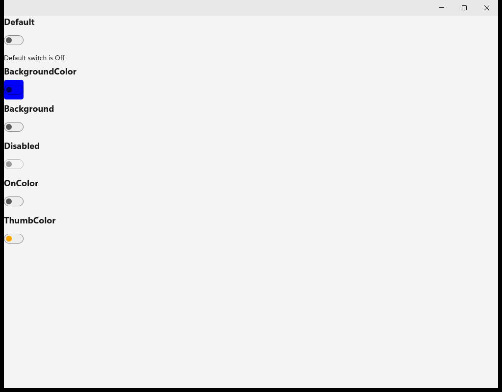</td><td></td><td>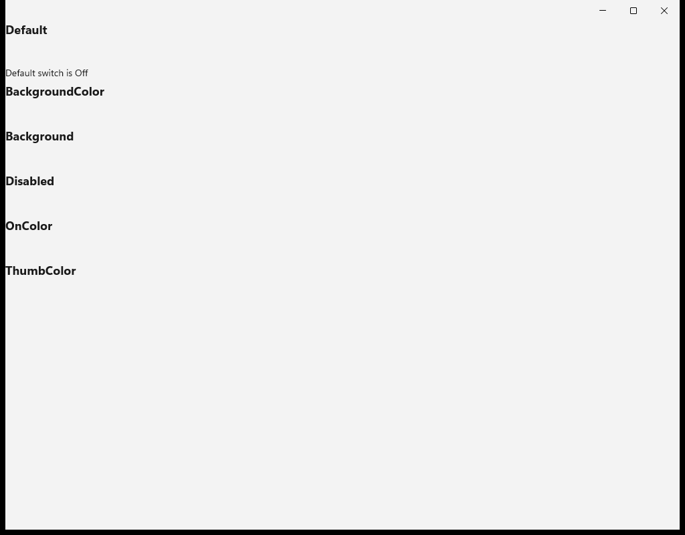</td></tr><tr><th>Dark</th><td>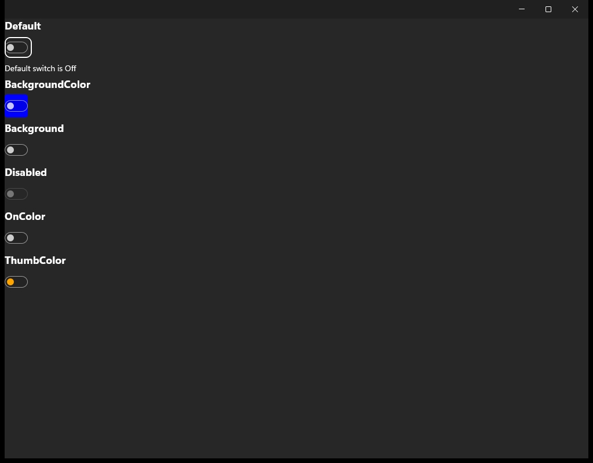</td><td>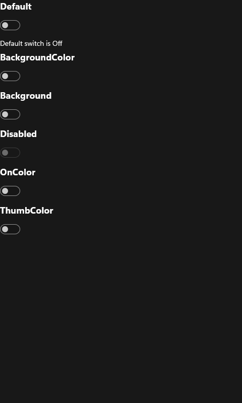</td><td>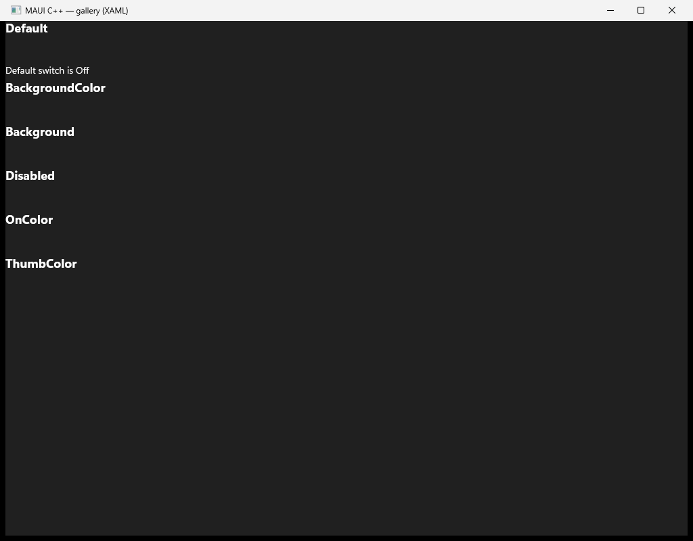</td></tr></table> | ports SwitchPage.xaml (+ .xaml.cs) Mirrors the MAUI gallery page: a vertical stack of headlined Switch states — Default, BackgroundColor (Blue), Background (a yellow→green LinearGradientBrush), Disabled, OnColor (Red), ThumbColor (Orange) | 🔴 Layout, section order, thumb geometry, and text all match MAUI in both light and dark. Two clear color bugs, identical in both themes: (1) BackgroundColor switch renders a plain gray track instead of MAUI's solid BLUE track fill; (2) Background switch renders a plain gray track instead of MAUI's yellow-to-green gradient track fill. The port drops both the BackgroundColor and Background brush on the Switch track. ThumbColor (orange thumb) and Default/Disabled/OnColor switches match MAUI correctly. Bugs are the same in light and dark. | 🔴 Same two BackgroundColor/Background bugs as cpp in BOTH themes: BackgroundColor switch shows gray instead of MAUI's solid BLUE track, and Background switch shows gray instead of MAUI's yellow-to-green gradient track. Additionally, LIGHT theme has a distinct extra bug: the OnColor switch renders as a solid BLACK pill instead of MAUI's normal gray off-track (dark theme renders OnColor normally). ThumbColor (orange thumb) matches. Layout, order, text, and other switches match MAUI. | 
| 158 | **Switch Grouping** switch_grouping | <table><tr><th></th><th>MAUI</th><th>C++</th><th>C++ &amp; XAML</th></tr><tr><th>Light</th><td></td><td></td><td></td></tr><tr><th>Dark</th><td></td><td></td><td></td></tr></table> | ports CollectionViewGalleries/GroupingGalleries/ SwitchGrouping.xaml (+ .xaml.cs) of the C# CollectionView gallery | 🟢 Both themes match MAUI. The 'Is Grouped' toggle (red in light, salmon/coral in dark, thumb slid right = on) renders identically. The full grouped CollectionView below renders correctly: green group headers (Avengers, Fantastic Four, Defenders, Heroes for Hire), member names in black (light) / white (dark), and orange 'Total members: 12/4/7' footers, all matching MAUI's content, colors, ordering and spacing. The only trivial difference is the known outer page-inset/whole-page vertical shift (list starts a few px higher so slightly more rows are visible), which is excluded by the harness-wrapper rule. Content parity is exact. | 🔴 Critical missing-content bug in BOTH themes. Only the 'Is Grouped:' label and toggle render at the top; the entire grouped CollectionView below is completely blank. None of the content MAUI shows appears: no green group headers (Avengers/Fantastic Four/Defenders/Heroes for Hire), no member names (Thor, Captain America, ... Luke Cage), and no orange 'Total members: N' footers. The whole list area is empty page background. This is a wrong/blank-layout rendering bug -- the grouped ItemsSource is not being displayed at all, unlike MAUI (correct) and the cpp port (which renders the full list). Additionally the toggle sits at a different horizontal position (pushed right) than MAUI's, but that is dwarfed by the missing list. | 
| 159 | **Tabbed Flyout** tabbed_flyout | <table><tr><th></th><th>MAUI</th><th>C++</th><th>C++ &amp; XAML</th></tr><tr><th>Light</th><td></td><td></td><td></td></tr><tr><th>Dark</th><td></td><td></td><td></td></tr></table> | a self-contained demo page for the W1-10 tabbed + flyout vertical: a flyout_page whose FLYOUT pane is a titled menu (two buttons selecting the detail&amp;#x27;s tabs + a &amp;quot;Toggle flyout&amp;quot; presenting/dismissing itself) and whose DETAIL pane is a tabbed | Port-only demo — maui-compare has no such page (no MAUI reference). | Port-only demo — maui-compare has no such page (no MAUI reference). | 
| 160 | **Templated View** templated_view | <table><tr><th></th><th>MAUI</th><th>C++</th><th>C++ &amp; XAML</th></tr><tr><th>Light</th><td></td><td></td><td></td></tr><tr><th>Dark</th><td></td><td></td><td></td></tr></table> | ports TemplatedViewPage.xaml The C# page contrasts a standard CardView control with a compact one driven by a ControlTemplate (&amp;quot;CardViewCompressed&amp;quot;) and a custom Rate control built entirely from a ControlTemplate + a heart PathGeometry | 🟢 Match in both themes. Light: red italic intro header, bold 'Slavko Vlasic' + lorem body, red italic 'ControlTemplate' header, and three compact cards (gray image placeholder + 'Compact card'/name/body for Carolina Pena, Wade Blanks, Colette Quint) all render at the same positions, sizes, spacing, corner radius, and colors as MAUI. Page background light-gray matches. Dark: near-black background, white bold names, gray body, and identical red headers match MAUI dark. Image placeholder tone, card heights, and text truncation points are indistinguishable. No missing/extra elements, no color drift, no clipping, no upscaling. | 🟢 Match in both themes. Identical to MAUI: red italic intro/ControlTemplate headers, bold 'Slavko Vlasic' + lorem body, and the three compact cards (gray image + 'Compact card'/name/body for Carolina Pena, Wade Blanks, Colette Quint) at the same layout, spacing, sizes, radius, and text colors. Light page background gray and dark near-black background both match their MAUI theme. Image-placeholder tone and text-truncation points align pixel-for-pixel. No missing/extra elements, no color or spacing drift, no clipping or upscaling. | 
| 161 | **Time Picker** time_picker | <table><tr><th></th><th>MAUI</th><th>C++</th><th>C++ &amp; XAML</th></tr><tr><th>Light</th><td></td><td></td><td></td></tr><tr><th>Dark</th><td></td><td></td><td></td></tr></table> | ports TimePickerPage.xaml (+ TimePickerPage.xaml.cs) | 🔴 Both themes: multiple clear rendering bugs vs MAUI. (1) WRONG GRADIENT COLOR — the 3rd 'Background' TimePicker in MAUI is a BLUE gradient (dark blue to light blue); cpp renders it as an olive/green to teal/cyan gradient. Port color bug in both light and dark. (2) SIZING/LAYOUT — cpp TimePickers stretch full-width across the row, whereas MAUI's pickers are narrow (~half width), left-aligned. Every picker row is over-wide vs MAUI. (3) EXTRA SEGMENT — cpp pickers show a trailing empty third cell to the right of '12'/'00' that MAUI does not render (MAUI is a compact 2-segment control). (4) 'Set to null' row — cpp renders a placeholder picker showing 'hour | minute | AM' (3 columns) instead of MAUI's populated '12' '00'. All four issues appear in both light and dark themes. Note cpp DOES correctly show 'Default with time' = '4'/'15' matching MAUI, and the blue/yellow-green BackgroundColor/Background gradients match. | 🔴 Both themes: clear rendering bugs vs MAUI. (1) WRONG GRADIENT COLOR — the 3rd 'Background' TimePicker in MAUI is a BLUE gradient (dark blue to light blue); xaml renders it as a purple-to-magenta gradient. Port color bug in both light and dark. (2) SIZING/LAYOUT — xaml TimePickers stretch full-width across the row, whereas MAUI's pickers are narrow (~half width), left-aligned; every picker row is over-wide. (3) EXTRA SEGMENT — xaml pickers show a trailing empty third cell to the right of '12'/'00' not present in MAUI's compact 2-segment control. (4) WRONG TEXT — 'Default with time' shows '12'/'00' in xaml but MAUI shows '4'/'15' (the time value is not applied). All issues present in both light and dark. Unlike cpp, xaml's 'Set to null' row correctly shows a populated '12'/'00'. | 
| 162 | **Title Bar** title_bar | <table><tr><th></th><th>MAUI</th><th>C++</th><th>C++ &amp; XAML</th></tr><tr><th>Light</th><td></td><td>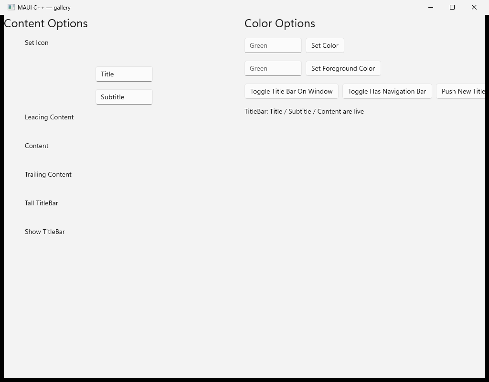</td><td>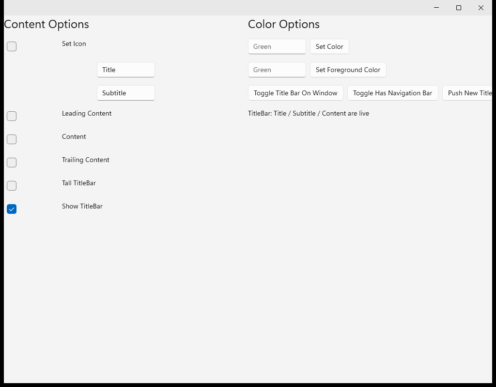</td></tr><tr><th>Dark</th><td></td><td></td><td>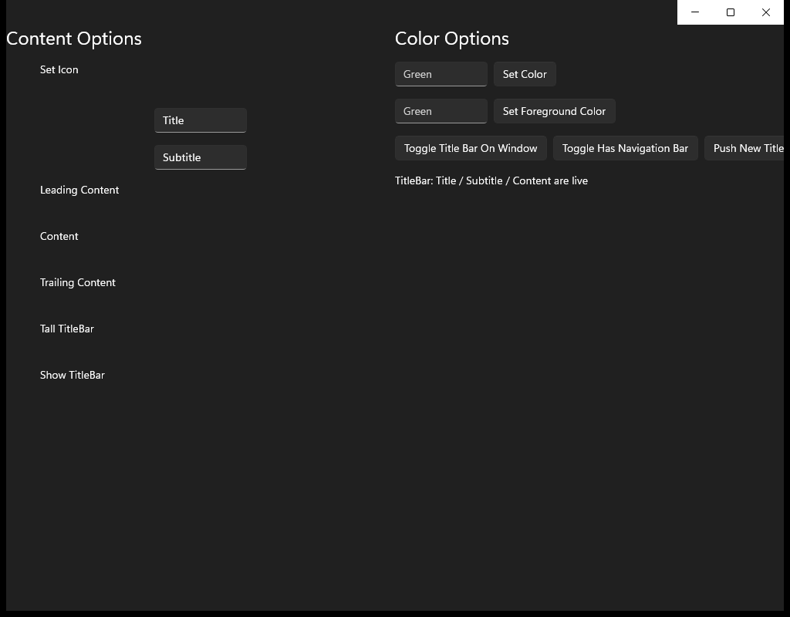</td></tr></table> | ports TitleBarPage.xaml A self-contained, code-first demo of the TitleBar control | Port-only demo — maui-compare has no such page (no MAUI reference). | Port-only demo — maui-compare has no such page (no MAUI reference). | 
| 163 | **Toolbar** toolbar | <table><tr><th></th><th>MAUI</th><th>C++</th><th>C++ &amp; XAML</th></tr><tr><th>Light</th><td></td><td></td><td></td></tr><tr><th>Dark</th><td></td><td></td><td></td></tr></table> | ports ToolbarPage.xaml (Maui.Controls.Sample.Pages.ToolbarPage) | 🟢 Match in both themes. Same 6 buttons (Enable/Disable Test (1), Enable/Disable Test Secondary (4), Enable/Disable Test Secondary (2), Change text on Test Secondary (1), Remove/Add Secondary (3), Change Command Property on Secondary (3)), same top title 'You clicked on ToolbarItem: {none}', same stacked full-width layout, same button fills (near-white light / dark-gray dark), borders, corner radius, and centered text. LIGHT: button fills and subtle 1px borders match MAUI; first row shows the same faint default/hover emphasis. DARK: dark-gray fills, white text, and border tone match MAUI. The only differences are the ignorable outer page-inset magnitude / uniform whole-page shift (ports sit content closer to the edges than MAUI's inset card) and sub-pixel/AA tone. No missing/extra elements, no wrong text, color, or clipping. | 🟢 Match in both themes, and effectively identical to the cpp port. Same 6 buttons in the same order with the same labels, same 'You clicked on ToolbarItem: {none}' title, same full-width stacked button layout, corner radius, borders, and centered text. LIGHT: near-white button fills with subtle borders match MAUI; same faint default emphasis on the first row. DARK: dark-gray fills, white text, and border tone match MAUI. Only the ignorable outer page-inset/uniform whole-page shift and sub-pixel/AA noise differ from MAUI. No missing/extra element, no wrong color, text, layout, or clipping. | 
| 164 | **Transform Playground** transform_playground | <table><tr><th></th><th>MAUI</th><th>C++</th><th>C++ &amp; XAML</th></tr><tr><th>Light</th><td></td><td></td><td></td></tr><tr><th>Dark</th><td></td><td></td><td></td></tr></table> | ports TransformPlaygroundGallery.xaml A code-first port of the MAUI Shapes sub-gallery Pages/Controls/ShapesGalleries/TransformPlaygroundGallery.xaml: a 50x50 Path rectangle (red fill, blue stroke 4) sits in a 200x200 light-grey panel; belo | 🔴 Both themes have clear bugs. (1) Preview square is clipped at the very top edge of the preview panel — only the bottom sliver of the red/blue square is visible, whereas MAUI shows the full square sitting inside the panel. (2) Scale value is wrong: cpp shows 'ScaleX/ScaleY: 0.50' but MAUI shows '1,00'. (3) Consequently the two Scale sliders render with their thumbs at the far-left on a grey track, while MAUI shows the Scale thumbs near the track center with a RED-filled track from the left up to the thumb — cpp is missing that centered-thumb + red-fill state entirely. Also decimal separator differs (0.50 period vs MAUI comma), and slider thumbs use an all-red fill vs MAUI's red-dot-in-white style, but the square clip + wrong scale value/slider fill are the dominant red-level defects in both light and dark. | 🟡 Square matches MAUI well in both themes: full red square with blue border seated inside the preview panel (not clipped like cpp). Layout, labels, and section order all match. Two drifts: (1) Scale sliders — xaml shows 'ScaleX/ScaleY: 1.00' with the thumb at the FAR LEFT on a plain grey track, but MAUI (value 1,00) renders those two Scale thumbs near the track CENTER with a red-filled track from left to thumb; xaml is missing the mid-position + red fill on the scale sliders. (2) Decimal separator is a period '1.00' vs MAUI's comma '1,00' (locale). Slider thumbs also read as red-dot-in-white which is close to MAUI. No missing/extra elements or blank layout — minor drift, not a hard bug. | 
| 165 | **Transformations** transformations | <table><tr><th></th><th>MAUI</th><th>C++</th><th>C++ &amp; XAML</th></tr><tr><th>Light</th><td></td><td></td><td></td></tr><tr><th>Dark</th><td></td><td></td><td></td></tr></table> | ports TransformationsPage.xaml (+ .xaml.cs) The MAUI TransformationsPage drives a single target view&amp;#x27;s render transforms from a column of knobs: Sliders for Scale / ScaleX / ScaleY (Maximum 10) and Rotation / RotationX / RotationY (Maximum | 🔴 Two clear content/layout bugs vs MAUI, identical in both light and dark themes. (1) Value text formatting is wrong: MAUI uses European locale with fixed one-decimal formatting (Scale = 1,0 / ScaleX = 1,0 / ScaleY = 1,0 / AnchorX = 0,5 / AnchorY = 0,5). The cpp port uses dot decimals and drops trailing decimals on integers (Scale = 1 / ScaleX = 1 / ScaleY = 1 / AnchorX = 0.5 / AnchorY = 0.5) -- both the decimal separator (comma vs dot) and the number format differ. (2) Stepper layout bug on the AnchorX and AnchorY rows: MAUI renders the '-' and '+' buttons as a compact adjacent pair (~30px apart, left-aligned). The cpp port splits them apart -- '-' pinned to the far left and '+' pushed far to the right (~250px gap) -- so the Stepper is not composed/laid out correctly. Everything else matches: title bar 'SCALE AND ROTATE', slider tracks with red filled portions and correct thumb positions (Scale/ScaleX/ScaleY thumbs near left, Rotation thumbs at far left, Translation thumbs mid-track), thumb fill+border styling, row spacing, and theme colors all align with MAUI in both themes. | 🔴 Same two defects as the cpp port, identical in both light and dark themes. (1) Value formatting is wrong: MAUI shows European fixed-decimal values (Scale = 1,0 / ScaleX = 1,0 / ScaleY = 1,0 / AnchorX = 0,5 / AnchorY = 0,5) while the xaml port shows dot decimals with dropped trailing decimals (Scale = 1 / ScaleX = 1 / ScaleY = 1 / AnchorX = 0.5 / AnchorY = 0.5) -- both decimal separator and number format differ. (2) Stepper layout bug on the AnchorX and AnchorY rows: MAUI renders '-' and '+' as a compact adjacent left-aligned pair, but the xaml port separates them with '-' at the far left and '+' pushed to the far right (~250px gap), so the Stepper is not laid out correctly. All other elements match MAUI in both themes: the title bar, every slider's track/red-fill/thumb position, thumb styling, row spacing, and light/dark theme colors. The xaml render is pixel-equivalent to the cpp render, so it shares the exact same rating. | 
| 166 | **Triggers** triggers | <table><tr><th></th><th>MAUI</th><th>C++</th><th>C++ &amp; XAML</th></tr><tr><th>Light</th><td></td><td></td><td></td></tr><tr><th>Dark</th><td></td><td></td><td></td></tr></table> | ports TriggersPage.xaml | 🟡 Layout, title, subtitle, 'Highlight off' label and 'Toggle highlight' button all match MAUI in both themes. One defect in both themes: MAUI renders the Entry's bottom border in the trigger/validation accent color (RED in light, ORANGE in dark) because the DataTrigger for an invalid double is active in the captured state; the cpp port renders the Entry bottom border in a NEUTRAL gray in both themes, so the colored trigger border is missing. Content is clearly the same and intent is preserved, but this is a real color drift on the Entry underline — not pixel-identical. Button chrome/border is marginally lighter/less defined than MAUI but essentially equivalent. | 🟡 Renders essentially identically to the cpp port and matches MAUI's title, subtitle, 'Highlight off' label, and 'Toggle highlight' button in both themes. Same single defect: MAUI shows the Entry's bottom border in the trigger color (RED light / ORANGE dark) for the active invalid-double DataTrigger, but the xaml port draws a NEUTRAL gray Entry underline in both themes, missing the colored trigger state. Same content and intent, minor color drift on the Entry border only. Button border slightly softer than MAUI but equivalent. | 
| 167 | **Update Path Data** update_path_data | <table><tr><th></th><th>MAUI</th><th>C++</th><th>C++ &amp; XAML</th></tr><tr><th>Light</th><td></td><td></td><td></td></tr><tr><th>Dark</th><td></td><td></td><td></td></tr></table> | ports UpdatePathDataGallery.xaml A code-first port of the MAUI Shapes sub-gallery Pages/Controls/ShapesGalleries/UpdatePathDataGallery.xaml: a 2-row Grid (RowSpacing 0) that proves a Path repaints when its Data geometry is replaced at runti | 🟢 Match in both themes. Bezier curve geometry (M 10,100 C 10,300 300,-200 300,100) is pixel-identical to MAUI: same crest position, same left/right endpoints, same stroke weight. Status label text and Update Path Data button match. Curve color inverts correctly (black on light, light-gray on dark). | 🟢 Match in both themes. Bezier curve, stroke weight, and endpoints identical to MAUI. Status label 'counter = 0 | Data: M 10,100 C 10,300 300,-200 300,100' and Update Path Data button present and correct. Theme-correct curve color. Only the standard whole-page inset differs, which is ignored per policy. | 
| 168 | **Varied Size Selector** varied_size_selector | <table><tr><th></th><th>MAUI</th><th>C++</th><th>C++ &amp; XAML</th></tr><tr><th>Light</th><td></td><td></td><td></td></tr><tr><th>Dark</th><td></td><td></td><td></td></tr></table> | ports DataTemplateSelectorGalleries/VariedSizeDataTemplateSelectorGallery.xaml (+ VariedSizeDataTemplateSelectorGallery.xaml.cs) of the C# CollectionView gallery | 🟢 Both themes match MAUI. The CollectionView renders all 6 DataTemplateSelector cells correctly: brown 'Coffee' cells and tan 'Milk' cells in the right order (Coffee0, Milk1, Coffee2+Coffee3 stacked, Milk4, Coffee5), with correct per-template heights, corner radius, and text color per theme (dark text on light cells in light mode, white text on Coffee cells in dark mode). Bottom controls (Insert/Add/Remove buttons, 'Index' label + '1' entry, 'Select a template' label, 'Latte' combobox) all present and matching. Only difference is the page-background gray tone being a hair lighter/warmer than MAUI's, plus the known outer page-inset (ignored) - anti-aliasing/sub-pixel class. | 🔴 Clear rendering BUG in both light and dark themes. The CollectionView's DataTemplateSelector is not applied: instead of the colored, sized template cells (brown Coffee cells, tan Milk cells with corner radius and larger heights), the port renders only plain single-line text rows (Coffee0, Milk1, Coffee2, Coffee3, Milk4, Coffee5) tightly stacked at the top-left - no background colors, no cell sizing, no rounded corners. This is the entire point of the page (varied-size selector templates) and it is missing. Additionally, the 'Latte' combobox at the bottom is blank/empty (no selected value shown) in both themes, whereas MAUI shows 'Latte'. Content is fundamentally wrong vs MAUI. | 
| 169 | **Vertical Stack** vertical_stack | <table><tr><th></th><th>MAUI</th><th>C++</th><th>C++ &amp; XAML</th></tr><tr><th>Light</th><td></td><td></td><td></td></tr><tr><th>Dark</th><td></td><td></td><td></td></tr></table> | Vertical Stack | 🟢 Match in both themes. Title 'VerticalStackLayout' and the six color swatches (red, yellow, blue, green, orange, purple) are pixel-identical to MAUI: same ~40px square size, same horizontal offset, and crucially the same zero inter-item spacing (swatches flush/touching, no gaps). Only differences are the excluded page-background/outer-inset tone (light bg slightly grayer; dark bg near-black) which fall under the harness-wrapper exemption. | 🟡 Same content and intent in both themes (correct title, six swatches in correct colors/order/size, correct horizontal position), but a consistent layout-spacing drift: the xaml port renders a visible vertical GAP between every swatch, whereas MAUI renders them flush/touching with zero spacing. This indicates a non-zero VerticalStackLayout Spacing where MAUI uses 0. Identical in light and dark. Not a broken render, but a clear spacing difference from ground truth. | 
| 170 | **Visual States** visual_states | <table><tr><th></th><th>MAUI</th><th>C++</th><th>C++ &amp; XAML</th></tr><tr><th>Light</th><td></td><td></td><td></td></tr><tr><th>Dark</th><td></td><td></td><td></td></tr></table> | ports VisualStatesPage.xaml | 🔴 Both themes: the first control ('Entry with VisualStateManager') is rendered as a fully saturated solid bright-green filled rectangle, whereas MAUI (ground truth) renders that Entry in its Normal state -- an empty box with only a thin colored bottom accent line (red-ish in light, orange in dark). This is a clear wrong-color / wrong-visual-state rendering bug for the top Entry: the port is showing the VSM 'green' state instead of the Normal state MAUI shows, and the whole field is a wrong solid green in both light and dark. Everything else matches: the 2nd Entry ('Type something to enable 2nd Entry' placeholder box), the 'Hover me to see the state change' button, the two explanatory text paragraphs, and the 'Click me to see the state change and revert' button all match MAUI in content, size, spacing, and theme colors in both light and dark. The single defect (green top Entry) is what forces red. | 🔴 Identical to the cpp port. Both themes: the first control ('Entry with VisualStateManager') is a fully saturated solid bright-green filled rectangle, but MAUI renders that Entry in its Normal state -- an empty box with only a thin colored bottom accent line (red-ish light, orange dark). This is a wrong-color / wrong-visual-state rendering bug for the top Entry (VSM green state shown instead of MAUI's Normal state), present in both light and dark. All other content matches MAUI: the placeholder 2nd Entry, the 'Hover me...' button, both explanatory paragraphs, and the 'Click me...' button match in content, size, spacing, and theme colors. The green top Entry is the sole defect and forces red. The xaml and cpp renders of this page are pixel-equivalent to each other. | 
| 171 | **Web View** web_view | <table><tr><th></th><th>MAUI</th><th>C++</th><th>C++ &amp; XAML</th></tr><tr><th>Light</th><td></td><td></td><td></td></tr><tr><th>Dark</th><td></td><td></td><td></td></tr></table> | a self-contained demo page for the W1-08 web_view vertical: a web_view loading a STATIC html_web_view_source (no network), back/forward/reload buttons over the handler-pushed CanGoBack/CanGoForward read-onlys, an &amp;quot;Eval 1+1&amp;quot; button driving t | 🔴 Both themes: button ORDER and count match MAUI (Page A, Page B, Back, Forward, Reload, Eval 1+1) and the two status lines are in the right place. Two clear bugs: (1) WRONG TEXT on the first status line — cpp renders 'No navigation yet' where MAUI renders 'new_page -&gt; about:blank' (the WebView Navigated event/state is not reflected). 'Eval result: &lt;none&gt;' matches. (2) Button chrome drift — MAUI draws clearly outlined rounded buttons with a visible 1px border; cpp buttons are much flatter with near-invisible borders (very faint in light, low-contrast fill in dark), so the buttons read as pale bars rather than MAUI's crisp outlined buttons. Content/order otherwise correct; the wrong status text is the red-level defect. | 🔴 Both themes: button order and count match MAUI and the button chrome (crisp rounded outlined buttons) is closer to MAUI than cpp. But two defects: (1) WRONG TEXT on the first status line — xaml renders 'new_page -&gt; https://demo.test/welcome' where MAUI renders 'new_page -&gt; about:blank' (wrong navigation URL shown). 'Eval result: &lt;none&gt;' matches. (2) LAYOUT — a large empty surface occupies roughly the top third of the page ABOVE the status labels, pushing the label+button block far down; MAUI has the labels at the very top with no blank region above them. This is not the outer page-inset (it is a big internal empty block above the content, not a uniform margin) and reads as a stray/blank WebView area or wrong vertical layout. Together the wrong URL text and the pushed-down content are red-level defects. | 
| 172 | **Z Index** z_index | <table><tr><th></th><th>MAUI</th><th>C++</th><th>C++ &amp; XAML</th></tr><tr><th>Light</th><td></td><td></td><td></td></tr><tr><th>Dark</th><td></td><td></td><td></td></tr></table> | ports ZIndexPage.xaml (+ ZIndexPage.xaml.cs), code-first | 🟢 Match in both themes. Light: header 'Z-Index of Label 5: 5' with -/+ stepper buttons identical; the 10 diagonally-cascaded labels (Label 0 teal at back through Label 9 red rectangle at front) match MAUI exactly in stacking order, per-label colors (teal, orange, magenta, red, green, blue, cyan, orange, violet, red), diagonal offset, sizes, and text. Dark: same layout with correct light/white text rendering over the colored panels, matching MAUI. No content, color, size, or spacing differences beyond anti-aliasing. | 🟢 Match in both themes. Light: header and -/+ stepper identical to MAUI; the diagonal cascade of 10 z-indexed labels renders with the same stacking order, colors, offsets, sizes, and text (Label 9 red rectangle on top, Label 0 teal at back). Dark: identical to MAUI including the light-text-on-colored-panel treatment and dark page background. Indistinguishable from both MAUI and the cpp port; differences limited to anti-aliasing/sub-pixel noise. | 

