# .NET MAUI C++ port — visual parity comparison

Per-page MAUI-vs-C++ visual parity for the **172 gallery pages**, on **iOS**, **macOS** (Mac Catalyst + AppKit) and **Android**. Each section is collapsible and holds a discrepancy-count summary, then one subheader per page titled with a `{Sonnet}/{Gemini}` status-emoji combo (🟢 match / 🟡 minor / 🔴 major / ⬛ blank / ⏳ unreviewed). Under each page: the MAUI / C++ / C++&amp;XAML renders (light over dark; missing captures show a placeholder), then a subsubheader per review model (Sonnet, Gemini, Pixel-Perfect Score) titled with that model's own status emoji and holding its review prose. Generated from `comparison.json` by `tools/gen_readme.py` — do not edit by hand.

**Cost of the implementation strategy.** Parity is the *control condition* for the size, memory and startup numbers below: both columns drive the same native widgets and produce the same pixels, so a cost difference is attributable to the implementation strategy rather than to one side doing less work. The hypotheses these tables test were registered **before** any number existed — see `PREDICTIONS.md`. Sizes come from `tools/measure_size.py`; per-page memory/startup glyphs in a page header read `RAM cpp/maui` and `start cpp/maui`.

<table>
<tr><th rowspan="2">Platform</th><th colspan="5">Pixel-Perfect Score — C++ (C1/C3)</th><th colspan="5">Pixel-Perfect Score — C++ &amp; XAML (C2/C4)</th></tr>
<tr><th>🟢</th><th>🟡</th><th>🔴</th><th>⬛</th><th>⏳</th><th>🟢</th><th>🟡</th><th>🔴</th><th>⬛</th><th>⏳</th></tr>
<tr><td>iOS</td><td>157</td><td>9</td><td>6</td><td>0</td><td>0</td><td>157</td><td>10</td><td>5</td><td>0</td><td>0</td></tr>
<tr><td>macOS</td><td>156</td><td>12</td><td>4</td><td>0</td><td>0</td><td>157</td><td>13</td><td>2</td><td>0</td><td>0</td></tr>
<tr><td>Android</td><td>95</td><td>50</td><td>27</td><td>0</td><td>0</td><td>98</td><td>49</td><td>25</td><td>0</td><td>0</td></tr>
<tr><td>Windows</td><td>161</td><td>10</td><td>1</td><td>0</td><td>0</td><td>162</td><td>9</td><td>1</td><td>0</td><td>0</td></tr>
<tr><td><strong>Total</strong></td><td><strong>569</strong></td><td><strong>81</strong></td><td><strong>38</strong></td><td><strong>0</strong></td><td><strong>0</strong></td><td><strong>574</strong></td><td><strong>81</strong></td><td><strong>33</strong></td><td><strong>0</strong></td><td><strong>0</strong></td></tr>
</table>

_macOS row = **Mac Catalyst**. The AppKit columns (`appkit_cpp`, `appkit_xaml`) are captured and shown per page but are not pixel-scored — AppKit is a different UI framework (NSViews vs UIKit) and cannot pixel-match, so its requirement is element completeness plus cpp-vs-xaml agreement, not a parity score._

_Android **dark** is not currently comparable: the MAUI reference renders light under both `MAUI_THEME=Light` and `=Dark` (measured body mean 137.7 vs 139.3) while the port renders genuinely dark, so Android's reds are the port being correct against a broken ground truth rather than a port defect. See `PARITY_REVIEW.md`._

**Motion parity — reported SEPARATELY from the colours above, on purpose.** A cell gets a motion verdict when the page is driven or animated; that is a minority of cells, and the layer is younger than the static one. So a non-`PASS` verdict caps a cell at 🟡 (it can never be 🟢) but does not force it 🔴 — ANDing a partial, still-settling layer into the board's colour would turn every motion flake into a board regression. Read the two together: 🟢 with ✅ PASS is a page whose pixels AND whose motion were compared and agreed.

🚫 **INVALID means there is no usable evidence, not that the port failed** — the commonest cause by far is that no scenario was ever authored to drive the page, in which case nothing about the port can be concluded from the cell at all. The per-page badge names the reason (`no-scenario`, `not-driven`, `no-frames`, `provenance`, …).

| Platform | Cells with motion evidence | ✅ PASS | ❌ FAIL | 🚫 INVALID | ❔ INCONCLUSIVE |
| --- | --- | --- | --- | --- | --- |
| iOS | 86 | 50 | 18 | 18 | 0 |
| macOS | 86 | 52 | 4 | 30 | 0 |
| Android | 86 | 34 | 13 | 19 | 20 |
| Windows | 86 | 49 | 7 | 30 | 0 |
| **Total** | **344** | **185** | **42** | **97** | **20** |

<h2>Artifact size — click to expand</h2>

Per-lane artifact size, decomposed. Answers **H1** in `PREDICTIONS.md`. `Stripped` is always measured, never estimated, but it is obtained differently per platform because debug information lives in different places: on Apple lanes it is an actual `strip -S -x` of a copy of the main binary (symbols sit *inside* the Mach-O); on Windows it is total minus the sidecar `.pdb` files, which is exact since they are never deployed. Android APKs report no stripped figure — read their `native_libs` bucket instead, which is where an unstripped `lib/*.so` hides. The Windows rows are walked on the guest over SSH; every other lane is measured locally.

> **⚠ PROVISIONAL — no ratio may be quoted from this table yet.** Rows marked ⚠ are not release-grade: the managed reference is a `Debug` build and the native builds have an empty `CMAKE_BUILD_TYPE` (no `-O`, no `NDEBUG`). Comparing them is a strawman in *both* directions. H1 stays open until both sides are rebuilt release-grade (managed: `-c Release` + trimming + AOT; native: `CMAKE_BUILD_TYPE=Release` + strip).

| Lane | Column | On disk | Stripped | Build config | Notes |
| --- | --- | --- | --- | --- | --- |
| macos-arm64 | `maui_xaml` | 78.7 MB | 47.3 MB | Release | symbols 31.8 MB |
| macos-arm64 | `cpp` | 9.1 MB | 9.1 MB | Release | symbols 0.9 MB |
| macos-arm64 | `cpp_xaml` | 22.1 MB | 22.1 MB | Release | symbols 6.7 MB |
| macos-appkit | `appkit_cpp` | 9.0 MB | 9.0 MB | Release | symbols 0.9 MB |
| macos-appkit | `appkit_xaml` | 21.9 MB | 21.9 MB | Release | symbols 6.7 MB |
| windows-x64 | `maui_xaml` | 149.4 MB | 149.2 MB | Debug ⚠ | symbols 0.3 MB |
| windows-x64 | `cpp` | 340.2 MB | 74.0 MB | Debug ⚠ | symbols 266.2 MB |
| windows-x64 | `cpp_xaml` | 437.5 MB | 83.2 MB | Debug ⚠ | symbols 354.2 MB |
| ios | `maui_xaml` | 97.4 MB | 95.1 MB | Debug ⚠ | symbols 2.4 MB |
| ios | `cpp` | 57.1 MB | 24.8 MB | (unset) ⚠ | symbols 38.5 MB |
| ios | `cpp_xaml` | 98.8 MB | 47.9 MB | (unset) ⚠ | symbols 69.2 MB |
| android | `maui_xaml` | 28.9 MB | — | Release |  |
| android | `cpp` | 360.0 MB | — | Debug ⚠ |  |
| android | `cpp_xaml` | 161.3 MB | — | Debug ⚠ |  |

<h2>iOS (172 examples) — click to expand</h2>

Real .NET MAUI (native-default) vs the C++ port vs the compile-time-XAML gallery, captured on the same iOS simulator in light and dark. MAUI is the content ground truth.

**Discrepancy counts** (MAUI-vs-C++ parity verdicts from the deterministic pixel-perfect score — SSIM + per-pixel diff; AI-based review has been invalidated/removed):

| Classification | Pixel-Perfect Score — C++ (C1/C3) | Pixel-Perfect Score — C++ &amp; XAML (C2/C4) |
| --- | --- | --- |
| 🟢 Match | 157 | 157 |
| 🟡 Minor | 9 | 10 |
| 🔴 Major | 6 | 5 |
| ⬛ Blank | 0 | 0 |
| ⏳ Unreviewed | 0 | 0 |

### 1. Absolute Layout — 🟢/🟢
absolute_layout

<table><tr><th></th><th>MAUI</th><th>C++</th><th>C++ &amp; XAML</th></tr><tr><th>Light</th><td></td><td></td><td></td></tr><tr><th>Dark</th><td></td><td></td><td></td></tr></table>

ports AbsoluteLayoutPage.xaml A self-contained, code-first demo of the AbsoluteLayout control

#### 🟢 Pixel-Perfect Score — C++ (C1/C3)

Light: SSIM 0.9915, 0.58% pixels differ · Dark: SSIM 0.9913, 0.58% pixels differ

#### 🟢 Pixel-Perfect Score — C++ &amp; XAML (C2/C4)

Light: SSIM 1.0000, 0.00% pixels differ · Dark: SSIM 1.0000, 0.00% pixels differ

### 2. Activity Indicator — 🟢/🟢
activity_indicator

<table><tr><th></th><th>MAUI</th><th>C++</th><th>C++ &amp; XAML</th></tr><tr><th>Light</th><td></td><td></td><td></td></tr><tr><th>Dark</th><td></td><td></td><td></td></tr></table>

ports ActivityIndicatorPage.xaml (+ ActivityIndicatorPage.xaml.cs)

#### 🟢 Pixel-Perfect Score — C++ (C1/C3)

**Motion:** ✅ PASS · run 2026-08-14-01_52_22 · 2026-08-14

Light: MOTION 11 frames paired by step (run 2026-08-14-01_52_22, commit 74dde0864a, 2026-08-14); 1 frame(s) had no partner and were NOT scored — worst SSIM 0.9996 at frame 1 'gif00000' (0.03% pixels differ), mean SSIM 0.9998; per-frame diff% 0.03/0.00/0.02/0.02/0.00/0.02/0.02/0.00/0.02/0.02/0.00; self-motion MAUI 0.1249% (3948 px) vs C++ 0.1408% (4451 px) · Dark: MOTION 10 frames paired by step (run 2026-08-14-01_52_22, commit 74dde0864a, 2026-08-14); 4 frame(s) had no partner and were NOT scored; column frames realigned by +2 sample(s) — a sampling drift, not a defect (see _align) — worst SSIM 0.9995 at frame 3 'gif00667' (0.04% pixels differ), mean SSIM 0.9999; per-frame diff% 0.00/0.00/0.04/0.04/0.00/0.00/0.00/0.00/0.00/0.00; self-motion MAUI 0.1779% (5625 px) vs C++ 0.1775% (5614 px)

#### 🟢 Pixel-Perfect Score — C++ &amp; XAML (C2/C4)

**Motion:** ✅ PASS · run 2026-08-14-01_52_22 · 2026-08-14

Light: MOTION 11 frames paired by step (run 2026-08-14-01_52_22, commit 74dde0864a, 2026-08-14); 1 frame(s) had no partner and were NOT scored — worst SSIM 0.9996 at frame 4 'gif01000' (0.02% pixels differ), mean SSIM 0.9998; per-frame diff% 0.02/0.00/0.00/0.02/0.00/0.02/0.02/0.00/0.01/0.02/0.00; self-motion MAUI 0.1249% (3948 px) vs C++ &amp; XAML 0.1361% (4305 px) · Dark: MOTION 12 frames paired by step (run 2026-08-14-01_52_22, commit 74dde0864a, 2026-08-14) — worst SSIM 0.9995 at frame 2 'gif00333' (0.02% pixels differ), mean SSIM 0.9998; per-frame diff% 0.03/0.02/0.00/0.00/0.02/0.00/0.02/0.02/0.00/0.02/0.02/0.00; self-motion MAUI 0.1779% (5625 px) vs C++ &amp; XAML 0.1854% (5863 px)

### 3. Adaptive Collection — 🟢/🟢
adaptive_collection

<table><tr><th></th><th>MAUI</th><th>C++</th><th>C++ &amp; XAML</th></tr><tr><th>Light</th><td></td><td></td><td></td></tr><tr><th>Dark</th><td></td><td></td><td></td></tr></table>

ports AdaptiveCollectionView.xaml (+ .xaml.cs) (Maui.Controls.Sample.Pages.CollectionViewGalleries.AdaptiveCollectionView)

#### 🟢 Pixel-Perfect Score — C++ (C1/C3)

Light: SSIM 0.9988, 0.17% pixels differ · Dark: SSIM 0.9986, 0.17% pixels differ

#### 🟢 Pixel-Perfect Score — C++ &amp; XAML (C2/C4)

Light: SSIM 1.0000, 0.00% pixels differ · Dark: SSIM 1.0000, 0.00% pixels differ

### 4. Alerts — 🟢/🟢
alerts

<table><tr><th></th><th>MAUI</th><th>C++</th><th>C++ &amp; XAML</th></tr><tr><th>Light</th><td></td><td></td><td></td></tr><tr><th>Dark</th><td></td><td></td><td></td></tr></table>

ports AlertsPage.xaml (+ AlertsPage.xaml.cs) The C# AlertsPage drives the three Page dialog services — DisplayAlertAsync (simple OK + Yes/No), DisplayActionSheetAsync (simple + Cancel/Delete), and DisplayPromptAsync (two questions) — from a

#### 🟢 Pixel-Perfect Score — C++ (C1/C3)

Light: SSIM 1.0000, 0.00% pixels differ · Dark: SSIM 1.0000, 0.00% pixels differ

#### 🟢 Pixel-Perfect Score — C++ &amp; XAML (C2/C4)

Light: SSIM 1.0000, 0.00% pixels differ · Dark: SSIM 1.0000, 0.00% pixels differ

### 5. Alignment — 🟢/🟢
alignment

<table><tr><th></th><th>MAUI</th><th>C++</th><th>C++ &amp; XAML</th></tr><tr><th>Light</th><td></td><td></td><td></td></tr><tr><th>Dark</th><td></td><td></td><td></td></tr></table>

a faithful reproduction of the maui-compare &amp;quot;alignment&amp;quot; demo (ComparePages.Alignment()), the shipped-.NET-MAUI reference for the visual-parity comparison

#### 🟢 Pixel-Perfect Score — C++ (C1/C3)

Light: SSIM 0.9958, 0.14% pixels differ · Dark: SSIM 0.9990, 0.14% pixels differ

#### 🟢 Pixel-Perfect Score — C++ &amp; XAML (C2/C4)

Light: SSIM 0.9958, 0.14% pixels differ · Dark: SSIM 0.9990, 0.14% pixels differ

### 6. Animation — 🟢/🟢
animation

<table><tr><th></th><th>MAUI</th><th>C++</th><th>C++ &amp; XAML</th></tr><tr><th>Light</th><td></td><td></td><td></td></tr><tr><th>Dark</th><td></td><td></td><td></td></tr></table>

ports AnimationPage.xaml (+ AnimationPage.xaml.cs)

#### 🟢 Pixel-Perfect Score — C++ (C1/C3)

**Motion:** 🚫 INVALID · `no-scenario` · run 2026-08-14-01_52_22 · 2026-08-14

Light: !! NO MOTION EVIDENCE: neither MAUI nor C++ changed by more than 0.012% of its own frame across the sequence (60 px vs 0 px), on a page the board treats as ANIMATED. NO ACTION SCENARIO EXISTS for this page — docs/comparison/scenarios/animation.toml is absent or declares no `action` — so nothing was ever aimed at it and both columns are at rest by construction. This is NOT a port finding and nothing about the port can be concluded from it; the missing artifact is the scenario. 80 of the 139 cells that carried the old 'NOTHING MOVED' banner were this, including 10 of the 14 hard-coded ANIMATED pages. MOTION 3 frames paired by step (run 2026-08-14-01_52_22, commit 74dde0864a, 2026-08-14); 12 frame(s) had no partner and were NOT scored; column frames realigned by -2 sample(s) — a sampling drift, not a defect (see _align) — worst SSIM 0.9997 at frame 1 'gif01000' (0.14% pixels differ), mean SSIM 0.9997; per-frame diff% 0.14/0.14/0.14; self-motion MAUI 0.0019% (60 px) vs C++ 0.0000% (0 px) · Dark: !! NO MOTION EVIDENCE: neither MAUI nor C++ changed by more than 0.012% of its own frame across the sequence (56 px vs 0 px), on a page the board treats as ANIMATED. NO ACTION SCENARIO EXISTS for this page — docs/comparison/scenarios/animation.toml is absent or declares no `action` — so nothing was ever aimed at it and both columns are at rest by construction. This is NOT a port finding and nothing about the port can be concluded from it; the missing artifact is the scenario. 80 of the 139 cells that carried the old 'NOTHING MOVED' banner were this, including 10 of the 14 hard-coded ANIMATED pages. MOTION 3 frames paired by step (run 2026-08-14-01_52_22, commit 74dde0864a, 2026-08-14); 11 frame(s) had no partner and were NOT scored; column frames realigned by -1 sample(s) — a sampling drift, not a defect (see _align) — worst SSIM 0.9995 at frame 1 'gif00667' (0.15% pixels differ), mean SSIM 0.9996; per-frame diff% 0.15/0.14/0.14; self-motion MAUI 0.0018% (56 px) vs C++ 0.0000% (0 px)

#### 🟢 Pixel-Perfect Score — C++ &amp; XAML (C2/C4)

**Motion:** 🚫 INVALID · `no-scenario` · run 2026-08-14-01_52_22 · 2026-08-14

Light: !! NO MOTION EVIDENCE: neither MAUI nor C++ &amp; XAML changed by more than 0.012% of its own frame across the sequence (60 px vs 0 px), on a page the board treats as ANIMATED. NO ACTION SCENARIO EXISTS for this page — docs/comparison/scenarios/animation.toml is absent or declares no `action` — so nothing was ever aimed at it and both columns are at rest by construction. This is NOT a port finding and nothing about the port can be concluded from it; the missing artifact is the scenario. 80 of the 139 cells that carried the old 'NOTHING MOVED' banner were this, including 10 of the 14 hard-coded ANIMATED pages. MOTION 3 frames paired by step (run 2026-08-14-01_52_22, commit 74dde0864a, 2026-08-14); 12 frame(s) had no partner and were NOT scored; column frames realigned by -2 sample(s) — a sampling drift, not a defect (see _align) — worst SSIM 0.9997 at frame 1 'gif01000' (0.14% pixels differ), mean SSIM 0.9997; per-frame diff% 0.14/0.14/0.14; self-motion MAUI 0.0019% (60 px) vs C++ &amp; XAML 0.0000% (0 px) · Dark: !! NO MOTION EVIDENCE: neither MAUI nor C++ &amp; XAML changed by more than 0.012% of its own frame across the sequence (56 px vs 0 px), on a page the board treats as ANIMATED. NO ACTION SCENARIO EXISTS for this page — docs/comparison/scenarios/animation.toml is absent or declares no `action` — so nothing was ever aimed at it and both columns are at rest by construction. This is NOT a port finding and nothing about the port can be concluded from it; the missing artifact is the scenario. 80 of the 139 cells that carried the old 'NOTHING MOVED' banner were this, including 10 of the 14 hard-coded ANIMATED pages. MOTION 3 frames paired by step (run 2026-08-14-01_52_22, commit 74dde0864a, 2026-08-14); 11 frame(s) had no partner and were NOT scored; column frames realigned by -1 sample(s) — a sampling drift, not a defect (see _align) — worst SSIM 0.9995 at frame 1 'gif00667' (0.15% pixels differ), mean SSIM 0.9996; per-frame diff% 0.15/0.14/0.14; self-motion MAUI 0.0018% (56 px) vs C++ &amp; XAML 0.0000% (0 px)

### 7. App Theme Binding — 🟢/🟢
app_theme_binding

<table><tr><th></th><th>MAUI</th><th>C++</th><th>C++ &amp; XAML</th></tr><tr><th>Light</th><td></td><td></td><td></td></tr><tr><th>Dark</th><td></td><td></td><td></td></tr></table>

ports AppThemeBindingPage.xaml

#### 🟢 Pixel-Perfect Score — C++ (C1/C3)

Light: SSIM 1.0000, 0.00% pixels differ · Dark: SSIM 1.0000, 0.00% pixels differ

#### 🟢 Pixel-Perfect Score — C++ &amp; XAML (C2/C4)

Light: SSIM 1.0000, 0.00% pixels differ · Dark: SSIM 1.0000, 0.00% pixels differ

### 8. Application Control — 🟢/🟢
application_control

<table><tr><th></th><th>MAUI</th><th>C++</th><th>C++ &amp; XAML</th></tr><tr><th>Light</th><td></td><td></td><td></td></tr><tr><th>Dark</th><td></td><td></td><td></td></tr></table>

ports ApplicationControlPage.xaml (+ .xaml.cs)

#### 🟢 Pixel-Perfect Score — C++ (C1/C3)

Light: SSIM 1.0000, 0.00% pixels differ · Dark: SSIM 1.0000, 0.00% pixels differ

#### 🟢 Pixel-Perfect Score — C++ &amp; XAML (C2/C4)

Light: SSIM 1.0000, 0.00% pixels differ · Dark: SSIM 1.0000, 0.00% pixels differ

### 9. Auto Size Shapes — 🟢/🟢
auto_size_shapes

<table><tr><th></th><th>MAUI</th><th>C++</th><th>C++ &amp; XAML</th></tr><tr><th>Light</th><td></td><td></td><td></td></tr><tr><th>Dark</th><td></td><td></td><td></td></tr></table>

ports AutoSizeShapesGallery.xaml A code-first port of the MAUI Shapes sub-gallery Pages/Controls/ShapesGalleries/AutoSizeShapesGallery.xaml: a 3-row Grid (RowSpacing 0) that proves a stroked Ellipse auto-sizes to fill exactly half of the av

#### 🟢 Pixel-Perfect Score — C++ (C1/C3)

Light: SSIM 1.0000, 0.00% pixels differ · Dark: SSIM 1.0000, 0.00% pixels differ

#### 🟢 Pixel-Perfect Score — C++ &amp; XAML (C2/C4)

Light: SSIM 1.0000, 0.00% pixels differ · Dark: SSIM 1.0000, 0.00% pixels differ

### 10. Basic Grouping — 🟢/🟢
basic_grouping

<table><tr><th></th><th>MAUI</th><th>C++</th><th>C++ &amp; XAML</th></tr><tr><th>Light</th><td></td><td></td><td></td></tr><tr><th>Dark</th><td></td><td></td><td></td></tr></table>

ports GroupingGalleries/BasicGrouping.xaml (+ .xaml.cs) of the C# CollectionView gallery

#### 🟢 Pixel-Perfect Score — C++ (C1/C3)

Light: SSIM 1.0000, 0.00% pixels differ · Dark: SSIM 1.0000, 0.00% pixels differ

#### 🟢 Pixel-Perfect Score — C++ &amp; XAML (C2/C4)

Light: SSIM 1.0000, 0.00% pixels differ · Dark: SSIM 1.0000, 0.00% pixels differ

### 11. Basic Swipe — 🟢/🟢
basic_swipe

<table><tr><th></th><th>MAUI</th><th>C++</th><th>C++ &amp; XAML</th></tr><tr><th>Light</th><td></td><td></td><td></td></tr><tr><th>Dark</th><td></td><td></td><td></td></tr></table>

ports BasicSwipeGallery.xaml A code-first port of the MAUI SwipeView sub-gallery Pages/Controls/SwipeViewGalleries/BasicSwipeGallery.xaml: a vertical StackLayout of five SwipeViews, each demonstrating a different revealed-side / SwipeMode c

#### 🟢 Pixel-Perfect Score — C++ (C1/C3)

Light: SSIM 1.0000, 0.00% pixels differ · Dark: SSIM 1.0000, 0.00% pixels differ

#### 🟢 Pixel-Perfect Score — C++ &amp; XAML (C2/C4)

Light: SSIM 1.0000, 0.00% pixels differ · Dark: SSIM 1.0000, 0.00% pixels differ

### 12. Behaviors — 🟢/🟢
behaviors

<table><tr><th></th><th>MAUI</th><th>C++</th><th>C++ &amp; XAML</th></tr><tr><th>Light</th><td></td><td></td><td></td></tr><tr><th>Dark</th><td></td><td></td><td></td></tr></table>

ports BehaviorsPage.xaml (+ .xaml.cs) and its companion Controls.Sample/Behaviors/NumericValidationBehavior.cs

#### 🟢 Pixel-Perfect Score — C++ (C1/C3)

Light: SSIM 1.0000, 0.00% pixels differ · Dark: SSIM 1.0000, 0.00% pixels differ

#### 🟢 Pixel-Perfect Score — C++ &amp; XAML (C2/C4)

Light: SSIM 1.0000, 0.00% pixels differ · Dark: SSIM 1.0000, 0.00% pixels differ

### 13. Border — 🟢/🟢
border

<table><tr><th></th><th>MAUI</th><th>C++</th><th>C++ &amp; XAML</th></tr><tr><th>Light</th><td></td><td></td><td></td></tr><tr><th>Dark</th><td></td><td></td><td></td></tr></table>

a faithful reproduction of the maui-compare &amp;quot;border&amp;quot; demo (ComparePages.BorderPage()), the shipped-.NET-MAUI reference for the visual-parity comparison: a single Border centered on the page — red 5pt stroke, a RoundRectangle StrokeShape (Co

#### 🟢 Pixel-Perfect Score — C++ (C1/C3)

Light: SSIM 1.0000, 0.01% pixels differ · Dark: SSIM 0.9992, 0.08% pixels differ

#### 🟢 Pixel-Perfect Score — C++ &amp; XAML (C2/C4)

Light: SSIM 1.0000, 0.01% pixels differ · Dark: SSIM 0.9992, 0.08% pixels differ

### 14. Border Clip Playground — 🟡/🟡
border_clip_playground

<table><tr><th></th><th>MAUI</th><th>C++</th><th>C++ &amp; XAML</th></tr><tr><th>Light</th><td></td><td></td><td></td></tr><tr><th>Dark</th><td></td><td></td><td></td></tr></table>

ports BorderClipPlayground.xaml (+ .xaml.cs) The C# page is an interactive Border-shape playground: a 100x100 Border (red stroke) clips an AspectFill Image (oasis.jpg) into the currently selected StrokeShape, while controls below mutate the

#### 🟡 Pixel-Perfect Score — C++ (C1/C3)

Light: SSIM 0.9713, 1.81% pixels differ · Dark: SSIM 0.9712, 1.81% pixels differ

#### 🟡 Pixel-Perfect Score — C++ &amp; XAML (C2/C4)

Light: SSIM 0.9755, 1.30% pixels differ · Dark: SSIM 0.9754, 1.30% pixels differ

### 15. Border Layout — 🟢/🟢
border_layout

<table><tr><th></th><th>MAUI</th><th>C++</th><th>C++ &amp; XAML</th></tr><tr><th>Light</th><td></td><td></td><td></td></tr><tr><th>Dark</th><td></td><td></td><td></td></tr></table>

ports BorderLayout.xaml (+ BorderLayout.xaml.cs) The C# page demonstrates driving Border.StrokeThickness from a Slider: a Slider (0..40, set to 5 in OnAppearing) is bound to the Border&amp;#x27;s StrokeThickness; the Border (Silver stroke, White bac

#### 🟢 Pixel-Perfect Score — C++ (C1/C3)

Light: SSIM 0.9997, 0.01% pixels differ · Dark: SSIM 0.9995, 0.08% pixels differ

#### 🟢 Pixel-Perfect Score — C++ &amp; XAML (C2/C4)

Light: SSIM 0.9997, 0.01% pixels differ · Dark: SSIM 0.9995, 0.08% pixels differ

### 16. Border Playground — 🟢/🟢
border_playground

<table><tr><th></th><th>MAUI</th><th>C++</th><th>C++ &amp; XAML</th></tr><tr><th>Light</th><td></td><td></td><td></td></tr><tr><th>Dark</th><td></td><td></td><td></td></tr></table>

ports BorderPlayground.xaml (+ BorderPlayground.xaml.cs) A self-contained, code-first interactive Border playground

#### 🟢 Pixel-Perfect Score — C++ (C1/C3)

Light: SSIM 0.9989, 0.15% pixels differ · Dark: SSIM 0.9992, 0.15% pixels differ

#### 🟢 Pixel-Perfect Score — C++ &amp; XAML (C2/C4)

Light: SSIM 0.9989, 0.15% pixels differ · Dark: SSIM 0.9992, 0.15% pixels differ

### 17. Border Resize Content — 🟡/🟡
border_resize_content

<table><tr><th></th><th>MAUI</th><th>C++</th><th>C++ &amp; XAML</th></tr><tr><th>Light</th><td></td><td></td><td></td></tr><tr><th>Dark</th><td></td><td></td><td></td></tr></table>

ports BorderResizeContent.xaml A self-contained, code-first demo that resizes a Border&amp;#x27;s CONTENT and watches the Border track it

#### 🟡 Pixel-Perfect Score — C++ (C1/C3)

Light: SSIM 0.9894, 1.00% pixels differ · Dark: SSIM 0.9887, 1.07% pixels differ

#### 🟡 Pixel-Perfect Score — C++ &amp; XAML (C2/C4)

Light: SSIM 0.9860, 1.07% pixels differ · Dark: SSIM 0.9837, 1.13% pixels differ

### 18. Border Stroke — 🟢/🟢
border_stroke

<table><tr><th></th><th>MAUI</th><th>C++</th><th>C++ &amp; XAML</th></tr><tr><th>Light</th><td></td><td></td><td></td></tr><tr><th>Dark</th><td></td><td></td><td></td></tr></table>

ports BorderStroke.xaml (+ BorderStroke.xaml.cs) A self-contained, code-first demo of Border StrokeThickness and how a Border tracks the height of its content

#### 🟢 Pixel-Perfect Score — C++ (C1/C3)

Light: SSIM 0.9945, 0.46% pixels differ · Dark: SSIM 0.9992, 0.46% pixels differ

#### 🟢 Pixel-Perfect Score — C++ &amp; XAML (C2/C4)

Light: SSIM 0.9945, 0.46% pixels differ · Dark: SSIM 0.9992, 0.46% pixels differ

### 19. Borderless — 🟢/🟢
borderless

<table><tr><th></th><th>MAUI</th><th>C++</th><th>C++ &amp; XAML</th></tr><tr><th>Light</th><td></td><td></td><td></td></tr><tr><th>Dark</th><td></td><td></td><td></td></tr></table>

ports Borderless.xaml A self-contained, code-first demo of a stroke-less Border

#### 🟢 Pixel-Perfect Score — C++ (C1/C3)

Light: SSIM 1.0000, 0.00% pixels differ · Dark: SSIM 1.0000, 0.00% pixels differ

#### 🟢 Pixel-Perfect Score — C++ &amp; XAML (C2/C4)

Light: SSIM 1.0000, 0.00% pixels differ · Dark: SSIM 1.0000, 0.00% pixels differ

### 20. Box View — 🔴/🔴
box_view

<table><tr><th></th><th>MAUI</th><th>C++</th><th>C++ &amp; XAML</th></tr><tr><th>Light</th><td></td><td></td><td></td></tr><tr><th>Dark</th><td></td><td></td><td></td></tr></table>

ports BoxViewPage.xaml (+ BoxViewPage.xaml.cs)

#### 🔴 Pixel-Perfect Score — C++ (C1/C3)

**Motion:** ❌ FAIL · `frames-disagree` · run 2026-08-14-01_52_22 · 2026-08-14

Light: MOTION 2 frames paired by step (run 2026-08-14-01_52_22, commit 74dde0864a, 2026-08-14) — worst SSIM 0.9396 at frame 2 'driven' (6.97% pixels differ), mean SSIM 0.9698; per-frame diff% 0.00/6.97; self-motion MAUI 38.3550% (1212835 px) vs C++ 40.1207% (1268670 px) · Dark: MOTION 2 frames paired by step (run 2026-08-14-01_52_22, commit 74dde0864a, 2026-08-14) — worst SSIM 0.8980 at frame 2 'driven' (7.37% pixels differ), mean SSIM 0.9490; per-frame diff% 0.00/7.37; self-motion MAUI 39.6268% (1253051 px) vs C++ 39.9920% (1264601 px)

#### 🔴 Pixel-Perfect Score — C++ &amp; XAML (C2/C4)

**Motion:** ❌ FAIL · `frames-disagree` · run 2026-08-14-01_52_22 · 2026-08-14

Light: MOTION 2 frames paired by step (run 2026-08-14-01_52_22, commit 74dde0864a, 2026-08-14) — worst SSIM 0.9426 at frame 2 'driven' (17.02% pixels differ), mean SSIM 0.9713; per-frame diff% 0.00/17.02; self-motion MAUI 38.3550% (1212835 px) vs C++ &amp; XAML 39.6721% (1254485 px) · Dark: MOTION 2 frames paired by step (run 2026-08-14-01_52_22, commit 74dde0864a, 2026-08-14) — worst SSIM 0.9667 at frame 2 'driven' (1.31% pixels differ), mean SSIM 0.9833; per-frame diff% 0.00/1.31; self-motion MAUI 39.6268% (1253051 px) vs C++ &amp; XAML 39.6744% (1254557 px)

### 21. Button — 🟢/🟢
button

<table><tr><th></th><th>MAUI</th><th>C++</th><th>C++ &amp; XAML</th></tr><tr><th>Light</th><td></td><td></td><td></td></tr><tr><th>Dark</th><td></td><td></td><td></td></tr></table>

ports ButtonPage.xaml (+ ButtonPage.xaml.cs)

#### 🟢 Pixel-Perfect Score — C++ (C1/C3)

**Motion:** ✅ PASS · run 2026-08-14-01_52_22 · 2026-08-14

Light: MOTION 2 frames paired by step (run 2026-08-14-01_52_22, commit 74dde0864a, 2026-08-14) — worst SSIM 0.9824 at frame 1 'initial' (0.95% pixels differ), mean SSIM 0.9824; per-frame diff% 0.95/0.95; self-motion MAUI 0.0129% (407 px) vs C++ 0.0129% (407 px) · Dark: MOTION 2 frames paired by step (run 2026-08-14-01_52_22, commit 74dde0864a, 2026-08-14) — worst SSIM 0.9824 at frame 1 'initial' (0.95% pixels differ), mean SSIM 0.9824; per-frame diff% 0.95/0.95; self-motion MAUI 0.0129% (407 px) vs C++ 0.0129% (407 px)

#### 🟢 Pixel-Perfect Score — C++ &amp; XAML (C2/C4)

**Motion:** ✅ PASS · run 2026-08-14-01_52_22 · 2026-08-14

Light: MOTION 2 frames paired by step (run 2026-08-14-01_52_22, commit 74dde0864a, 2026-08-14) — worst SSIM 0.9824 at frame 1 'initial' (0.95% pixels differ), mean SSIM 0.9824; per-frame diff% 0.95/0.95; self-motion MAUI 0.0129% (407 px) vs C++ &amp; XAML 0.0129% (407 px) · Dark: MOTION 2 frames paired by step (run 2026-08-14-01_52_22, commit 74dde0864a, 2026-08-14) — worst SSIM 0.9824 at frame 1 'initial' (0.95% pixels differ), mean SSIM 0.9824; per-frame diff% 0.95/0.95; self-motion MAUI 0.0129% (407 px) vs C++ &amp; XAML 0.0129% (407 px)

### 22. Carousel Page — 🟡/🟡
carousel_page

<table><tr><th></th><th>MAUI</th><th>C++</th><th>C++ &amp; XAML</th></tr><tr><th>Light</th><td></td><td></td><td></td></tr><tr><th>Dark</th><td></td><td></td><td></td></tr></table>

Carousel Page

#### 🟡 Pixel-Perfect Score — C++ (C1/C3)

**Motion:** ❌ FAIL · `frames-disagree` · run 2026-08-14-01_52_22 · 2026-08-14

Light: MOTION 10 frames paired by step (run 2026-08-14-01_52_22, commit 74dde0864a, 2026-08-14); 1 frame(s) had no partner and were NOT scored — worst SSIM 0.9592 at frame 9 'gif02000' (2.17% pixels differ), mean SSIM 0.9723; per-frame diff% 0.05/2.17/0.05/0.05/2.17/2.16/1.64/2.17/2.17/2.18; self-motion MAUI 2.2927% (72498 px) vs C++ 2.3455% (74167 px) · Dark: MOTION 11 frames paired by step (run 2026-08-14-01_52_22, commit 74dde0864a, 2026-08-14) — worst SSIM 0.9576 at frame 11 'gif02667' (2.23% pixels differ), mean SSIM 0.9767; per-frame diff% 0.05/2.17/0.05/0.05/0.11/0.10/2.24/2.16/2.17/2.17/2.23; self-motion MAUI 2.3298% (73672 px) vs C++ 2.4518% (77529 px)

#### 🟡 Pixel-Perfect Score — C++ &amp; XAML (C2/C4)

**Motion:** ❌ FAIL · `frames-disagree` · run 2026-08-14-01_52_22 · 2026-08-14

Light: MOTION 10 frames paired by step (run 2026-08-14-01_52_22, commit 74dde0864a, 2026-08-14); 1 frame(s) had no partner and were NOT scored — worst SSIM 0.9589 at frame 7 'gif01333' (2.24% pixels differ), mean SSIM 0.9711; per-frame diff% 0.05/2.17/0.05/0.05/2.18/2.17/2.24/2.16/2.17/2.17; self-motion MAUI 2.2927% (72498 px) vs C++ &amp; XAML 2.4165% (76413 px) · Dark: MOTION 11 frames paired by step (run 2026-08-14-01_52_22, commit 74dde0864a, 2026-08-14) — worst SSIM 0.9576 at frame 11 'gif02667' (2.23% pixels differ), mean SSIM 0.9767; per-frame diff% 0.05/2.17/0.05/0.05/0.11/0.10/2.24/2.16/2.17/2.17/2.23; self-motion MAUI 2.3298% (73672 px) vs C++ &amp; XAML 2.4518% (77529 px)

### 23. Chat Example — 🟢/🟢
chat_example

<table><tr><th></th><th>MAUI</th><th>C++</th><th>C++ &amp; XAML</th></tr><tr><th>Light</th><td></td><td></td><td></td></tr><tr><th>Dark</th><td></td><td></td><td></td></tr></table>

ports ChatExample.xaml (+ .xaml.cs) (Maui.Controls.Sample.Pages.CollectionViewGalleries.ItemSizeGalleries.ChatExample), tracking the maui-compare reference demo ~/maui-compare/Pages/ChatExamplePage.cs (the visual-parity oracle)

#### 🟢 Pixel-Perfect Score — C++ (C1/C3)

Light: SSIM 1.0000, 0.00% pixels differ · Dark: SSIM 1.0000, 0.00% pixels differ

#### 🟢 Pixel-Perfect Score — C++ &amp; XAML (C2/C4)

Light: SSIM 1.0000, 0.00% pixels differ · Dark: SSIM 1.0000, 0.00% pixels differ

### 24. Check Box — 🟢/🟢
check_box

<table><tr><th></th><th>MAUI</th><th>C++</th><th>C++ &amp; XAML</th></tr><tr><th>Light</th><td></td><td></td><td></td></tr><tr><th>Dark</th><td></td><td></td><td></td></tr></table>

ports CheckBoxPage.xaml (+ .xaml.cs) Mirrors the MAUI gallery page: a vertical stack of headlined CheckBox states — Default, Colored (Color=Purple), Disabled, Disabled+Colored+Checked — followed by a &amp;quot;Change IsChecked&amp;quot; row pairing a Button

#### 🟢 Pixel-Perfect Score — C++ (C1/C3)

**Motion:** ✅ PASS · run 2026-08-14-01_52_22 · 2026-08-14

Light: MOTION 2 frames paired by step (run 2026-08-14-01_52_22, commit 74dde0864a, 2026-08-14) — worst SSIM 0.9986 at frame 1 'initial' (0.07% pixels differ), mean SSIM 0.9986; per-frame diff% 0.07/0.07; self-motion MAUI 0.0414% (1309 px) vs C++ 0.0414% (1309 px) · Dark: MOTION 2 frames paired by step (run 2026-08-14-01_52_22, commit 74dde0864a, 2026-08-14) — worst SSIM 0.9986 at frame 1 'initial' (0.07% pixels differ), mean SSIM 0.9986; per-frame diff% 0.07/0.07; self-motion MAUI 0.0414% (1309 px) vs C++ 0.0414% (1309 px)

#### 🟢 Pixel-Perfect Score — C++ &amp; XAML (C2/C4)

**Motion:** ✅ PASS · run 2026-08-14-01_52_22 · 2026-08-14

Light: MOTION 2 frames paired by step (run 2026-08-14-01_52_22, commit 74dde0864a, 2026-08-14) — worst SSIM 1.0000 at frame 1 'initial' (0.00% pixels differ), mean SSIM 1.0000; per-frame diff% 0.00/0.00; self-motion MAUI 0.0414% (1309 px) vs C++ &amp; XAML 0.0414% (1309 px) · Dark: MOTION 2 frames paired by step (run 2026-08-14-01_52_22, commit 74dde0864a, 2026-08-14) — worst SSIM 1.0000 at frame 1 'initial' (0.00% pixels differ), mean SSIM 1.0000; per-frame diff% 0.00/0.00; self-motion MAUI 0.0414% (1309 px) vs C++ &amp; XAML 0.0414% (1309 px)

### 25. Chrome — 🟢/🟢
chrome

<table><tr><th></th><th>MAUI</th><th>C++</th><th>C++ &amp; XAML</th></tr><tr><th>Light</th><td></td><td></td><td></td></tr><tr><th>Dark</th><td></td><td></td><td></td></tr></table>

a self-contained demo page for the W1-11 window-chrome family: page toolbar items (primary + secondary), a menu bar (File menu with items, a separator and a sub-menu), a context flyout (right-click menu) on a button, and a tooltip — all wir

#### 🟢 Pixel-Perfect Score — C++ (C1/C3)

**Motion:** ✅ PASS · run 2026-08-14-01_52_22 · 2026-08-14

Light: MOTION 5 frames paired by step (run 2026-08-14-01_52_22, commit 74dde0864a, 2026-08-14) — worst SSIM 1.0000 at frame 1 'initial' (0.00% pixels differ), mean SSIM 1.0000; per-frame diff% 0.00/0.00/0.00/0.00/0.00; self-motion MAUI 0.2381% (7530 px) vs C++ 0.2429% (7682 px) · Dark: MOTION 5 frames paired by step (run 2026-08-14-01_52_22, commit 74dde0864a, 2026-08-14) — worst SSIM 1.0000 at frame 1 'initial' (0.00% pixels differ), mean SSIM 1.0000; per-frame diff% 0.00/0.00/0.00/0.00/0.00; self-motion MAUI 0.2389% (7555 px) vs C++ 0.2442% (7723 px)

#### 🟢 Pixel-Perfect Score — C++ &amp; XAML (C2/C4)

**Motion:** ✅ PASS · run 2026-08-14-01_52_22 · 2026-08-14

Light: MOTION 5 frames paired by step (run 2026-08-14-01_52_22, commit 74dde0864a, 2026-08-14) — worst SSIM 1.0000 at frame 1 'initial' (0.00% pixels differ), mean SSIM 1.0000; per-frame diff% 0.00/0.00/0.00/0.00/0.00; self-motion MAUI 0.2381% (7530 px) vs C++ &amp; XAML 0.2331% (7370 px) · Dark: MOTION 5 frames paired by step (run 2026-08-14-01_52_22, commit 74dde0864a, 2026-08-14) — worst SSIM 1.0000 at frame 1 'initial' (0.00% pixels differ), mean SSIM 1.0000; per-frame diff% 0.00/0.00/0.00/0.00/0.01; self-motion MAUI 0.2389% (7555 px) vs C++ &amp; XAML 0.2214% (7000 px)

### 26. Clip — 🟢/🟢
clip

<table><tr><th></th><th>MAUI</th><th>C++</th><th>C++ &amp; XAML</th></tr><tr><th>Light</th><td></td><td></td><td></td></tr><tr><th>Dark</th><td></td><td></td><td></td></tr></table>

ports ClipPage.xaml The C# page (Pages/Core/ClipPage.xaml; its .xaml.cs is an empty InitializeComponent) is a ScrollView over a StackLayout that shows the SAME dotnet_bot.png image five times, each successive copy carrying a different geome

#### 🟢 Pixel-Perfect Score — C++ (C1/C3)

**Motion:** ✅ PASS · run 2026-08-14-01_52_22 · 2026-08-14

Light: MOTION 2 frames paired by step (run 2026-08-14-01_52_22, commit 74dde0864a, 2026-08-14) — worst SSIM 0.9974 at frame 2 'driven' (0.12% pixels differ), mean SSIM 0.9987; per-frame diff% 0.00/0.12; self-motion MAUI 39.5205% (1249691 px) vs C++ 39.5210% (1249705 px) · Dark: MOTION 2 frames paired by step (run 2026-08-14-01_52_22, commit 74dde0864a, 2026-08-14) — worst SSIM 0.9973 at frame 2 'driven' (0.12% pixels differ), mean SSIM 0.9987; per-frame diff% 0.00/0.12; self-motion MAUI 39.5216% (1249726 px) vs C++ 39.5220% (1249739 px)

#### 🟢 Pixel-Perfect Score — C++ &amp; XAML (C2/C4)

**Motion:** ✅ PASS · run 2026-08-14-01_52_22 · 2026-08-14

Light: MOTION 2 frames paired by step (run 2026-08-14-01_52_22, commit 74dde0864a, 2026-08-14) — worst SSIM 0.9974 at frame 2 'driven' (0.12% pixels differ), mean SSIM 0.9987; per-frame diff% 0.00/0.12; self-motion MAUI 39.5205% (1249691 px) vs C++ &amp; XAML 39.5210% (1249705 px) · Dark: MOTION 2 frames paired by step (run 2026-08-14-01_52_22, commit 74dde0864a, 2026-08-14) — worst SSIM 0.9973 at frame 2 'driven' (0.12% pixels differ), mean SSIM 0.9987; per-frame diff% 0.00/0.12; self-motion MAUI 39.5216% (1249726 px) vs C++ &amp; XAML 39.5220% (1249739 px)

### 27. Clip Corner Radius — 🟢/🟢
clip_corner_radius

<table><tr><th></th><th>MAUI</th><th>C++</th><th>C++ &amp; XAML</th></tr><tr><th>Light</th><td></td><td></td><td></td></tr><tr><th>Dark</th><td></td><td></td><td></td></tr></table>

ports ClipCornerRadiusGallery.xaml (+ .xaml.cs) The C# page (Pages/Controls/ShapesGalleries/ClipCornerRadiusGallery.xaml) is a StackLayout (Padding=12) that demonstrates DRIVING a RoundRectangleGeometry&amp;#x27;s per-corner CornerRadius from four s

#### 🟢 Pixel-Perfect Score — C++ (C1/C3)

Light: SSIM 1.0000, 0.00% pixels differ · Dark: SSIM 1.0000, 0.00% pixels differ

#### 🟢 Pixel-Perfect Score — C++ &amp; XAML (C2/C4)

Light: SSIM 1.0000, 0.00% pixels differ · Dark: SSIM 1.0000, 0.00% pixels differ

### 28. Clip Gallery — 🔴/🔴
clip_gallery

<table><tr><th></th><th>MAUI</th><th>C++</th><th>C++ &amp; XAML</th></tr><tr><th>Light</th><td></td><td></td><td></td></tr><tr><th>Dark</th><td></td><td></td><td></td></tr></table>

ports ClipGallery.xaml The C# page (Pages/Controls/ShapesGalleries/ClipGallery.xaml; its .xaml.cs is an empty InitializeComponent) is a ScrollView over a StackLayout (Padding=12) that shows the SAME &amp;quot;oasis.jpg&amp;quot; image SEVEN times — one bare

#### 🔴 Pixel-Perfect Score — C++ (C1/C3)

**Motion:** ❌ FAIL · `frames-disagree` · run 2026-08-14-01_52_22 · 2026-08-14

Light: MOTION 2 frames paired by step (run 2026-08-14-01_52_22, commit 74dde0864a, 2026-08-14) — worst SSIM 0.8276 at frame 2 'driven' (5.51% pixels differ), mean SSIM 0.9138; per-frame diff% 0.00/5.51; self-motion MAUI 38.3570% (1212899 px) vs C++ 38.2924% (1210855 px) · Dark: MOTION 2 frames paired by step (run 2026-08-14-01_52_22, commit 74dde0864a, 2026-08-14) — worst SSIM 0.8382 at frame 2 'driven' (4.85% pixels differ), mean SSIM 0.9191; per-frame diff% 0.00/4.85; self-motion MAUI 34.7985% (1100375 px) vs C++ 34.8088% (1100701 px)

#### 🔴 Pixel-Perfect Score — C++ &amp; XAML (C2/C4)

**Motion:** ❌ FAIL · `frames-disagree` · run 2026-08-14-01_52_22 · 2026-08-14

Light: MOTION 2 frames paired by step (run 2026-08-14-01_52_22, commit 74dde0864a, 2026-08-14) — worst SSIM 0.8119 at frame 2 'driven' (6.54% pixels differ), mean SSIM 0.9060; per-frame diff% 0.00/6.54; self-motion MAUI 38.3570% (1212899 px) vs C++ &amp; XAML 38.2364% (1209087 px) · Dark: MOTION 2 frames paired by step (run 2026-08-14-01_52_22, commit 74dde0864a, 2026-08-14) — worst SSIM 0.9064 at frame 2 'driven' (2.59% pixels differ), mean SSIM 0.9532; per-frame diff% 0.00/2.59; self-motion MAUI 34.7985% (1100375 px) vs C++ &amp; XAML 34.8099% (1100736 px)

### 29. Clip Views — 🟢/🟢
clip_views

<table><tr><th></th><th>MAUI</th><th>C++</th><th>C++ &amp; XAML</th></tr><tr><th>Light</th><td></td><td></td><td></td></tr><tr><th>Dark</th><td></td><td></td><td></td></tr></table>

ports ClipViewsGallery.xaml The C# page (Pages/Controls/ShapesGalleries/ClipViewsGallery.xaml; no code-behind beyond an empty InitializeComponent) is a ScrollView over a StackLayout (Padding=12) that proves the Clip surface (VisualElement.C

#### 🟢 Pixel-Perfect Score — C++ (C1/C3)

**Motion:** ✅ PASS · run 2026-08-14-01_52_22 · 2026-08-14

Light: MOTION 2 frames paired by step (run 2026-08-14-01_52_22, commit 74dde0864a, 2026-08-14) — worst SSIM 0.9984 at frame 1 'initial' (0.09% pixels differ), mean SSIM 0.9984; per-frame diff% 0.09/0.09; self-motion MAUI 0.5673% (17940 px) vs C++ 0.5673% (17940 px) · Dark: MOTION 2 frames paired by step (run 2026-08-14-01_52_22, commit 74dde0864a, 2026-08-14) — worst SSIM 0.9990 at frame 1 'initial' (0.04% pixels differ), mean SSIM 0.9990; per-frame diff% 0.04/0.05; self-motion MAUI 0.5676% (17949 px) vs C++ 0.5789% (18305 px)

#### 🟢 Pixel-Perfect Score — C++ &amp; XAML (C2/C4)

**Motion:** ✅ PASS · run 2026-08-14-01_52_22 · 2026-08-14

Light: MOTION 2 frames paired by step (run 2026-08-14-01_52_22, commit 74dde0864a, 2026-08-14) — worst SSIM 0.9984 at frame 1 'initial' (0.09% pixels differ), mean SSIM 0.9984; per-frame diff% 0.09/0.09; self-motion MAUI 0.5673% (17940 px) vs C++ &amp; XAML 0.5673% (17940 px) · Dark: MOTION 2 frames paired by step (run 2026-08-14-01_52_22, commit 74dde0864a, 2026-08-14) — worst SSIM 0.9990 at frame 1 'initial' (0.04% pixels differ), mean SSIM 0.9990; per-frame diff% 0.04/0.04; self-motion MAUI 0.5676% (17949 px) vs C++ &amp; XAML 0.5676% (17949 px)

### 30. Clipping — 🟢/🟢
clipping

<table><tr><th></th><th>MAUI</th><th>C++</th><th>C++ &amp; XAML</th></tr><tr><th>Light</th><td></td><td></td><td></td></tr><tr><th>Dark</th><td></td><td></td><td></td></tr></table>

compare oracle ~/maui-compare/Pages/ClippingPage.cs (itself written to mirror this gallery page)

#### 🟢 Pixel-Perfect Score — C++ (C1/C3)

Light: SSIM 0.9938, 0.18% pixels differ · Dark: SSIM 1.0000, 0.00% pixels differ

#### 🟢 Pixel-Perfect Score — C++ &amp; XAML (C2/C4)

Light: SSIM 0.9938, 0.18% pixels differ · Dark: SSIM 1.0000, 0.00% pixels differ

### 31. Collectionview — 🟢/🟢
collectionview

<table><tr><th></th><th>MAUI</th><th>C++</th><th>C++ &amp; XAML</th></tr><tr><th>Light</th><td></td><td></td><td></td></tr><tr><th>Dark</th><td></td><td></td><td></td></tr></table>

a faithful reproduction of the maui-compare &amp;quot;collectionview&amp;quot; demo (ComparePages.CollectionViewPage()), the shipped-.NET-MAUI reference for the visual-parity comparison: a CollectionView over 24 captioned items, a string Header (&amp;quot;This is the

#### 🟢 Pixel-Perfect Score — C++ (C1/C3)

Light: SSIM 1.0000, 0.00% pixels differ · Dark: SSIM 1.0000, 0.00% pixels differ

#### 🟢 Pixel-Perfect Score — C++ &amp; XAML (C2/C4)

Light: SSIM 1.0000, 0.00% pixels differ · Dark: SSIM 1.0000, 0.00% pixels differ

### 32. Composition Gallery — 🟢/🟢
composition_gallery

<table><tr><th></th><th>MAUI</th><th>C++</th><th>C++ &amp; XAML</th></tr><tr><th>Light</th><td></td><td></td><td></td></tr><tr><th>Dark</th><td></td><td></td><td></td></tr></table>

ports CompositionGallery.xaml A self-contained, code-first port of the MAUI Shapes sub-gallery Pages/Controls/ShapesGalleries/CompositionGallery.xaml: a StackLayout holding two Beige 250x250 Grids (Margin 12) that compose multiple overlappi

#### 🟢 Pixel-Perfect Score — C++ (C1/C3)

Light: SSIM 1.0000, 0.00% pixels differ · Dark: SSIM 1.0000, 0.00% pixels differ

#### 🟢 Pixel-Perfect Score — C++ &amp; XAML (C2/C4)

Light: SSIM 1.0000, 0.00% pixels differ · Dark: SSIM 1.0000, 0.00% pixels differ

### 33. Containers — 🟢/🟢
containers

<table><tr><th></th><th>MAUI</th><th>C++</th><th>C++ &amp; XAML</th></tr><tr><th>Light</th><td></td><td></td><td></td></tr><tr><th>Dark</th><td></td><td></td><td></td></tr></table>

a self-contained demo page for the W1-07 container set: a scroll_view hosting a vertical stack of content-hosting containers — a border-framed label (stroke + dashed outline + rounded shape), a legacy frame (BorderColor/CornerRadius/HasShad

#### 🟢 Pixel-Perfect Score — C++ (C1/C3)

Light: SSIM 0.9930, 0.41% pixels differ · Dark: SSIM 0.9901, 0.40% pixels differ

#### 🟢 Pixel-Perfect Score — C++ &amp; XAML (C2/C4)

Light: SSIM 0.9939, 0.38% pixels differ · Dark: SSIM 0.9910, 0.38% pixels differ

### 34. Content View — 🟢/🟢
content_view

<table><tr><th></th><th>MAUI</th><th>C++</th><th>C++ &amp; XAML</th></tr><tr><th>Light</th><td></td><td></td><td></td></tr><tr><th>Dark</th><td></td><td></td><td></td></tr></table>

ports ContentViewPage.xaml (+ ContentViewPage.xaml.cs), code-first

#### 🟢 Pixel-Perfect Score — C++ (C1/C3)

Light: SSIM 1.0000, 0.00% pixels differ · Dark: SSIM 1.0000, 0.00% pixels differ

#### 🟢 Pixel-Perfect Score — C++ &amp; XAML (C2/C4)

Light: SSIM 1.0000, 0.00% pixels differ · Dark: SSIM 1.0000, 0.00% pixels differ

### 35. Context Flyout — 🟢/🟢
context_flyout

<table><tr><th></th><th>MAUI</th><th>C++</th><th>C++ &amp; XAML</th></tr><tr><th>Light</th><td></td><td></td><td></td></tr><tr><th>Dark</th><td></td><td></td><td></td></tr></table>

ports ContextFlyoutPage.xaml (+ ContextFlyoutPage.xaml.cs) The C# page attaches a MenuFlyout as the FlyoutBase.ContextFlyout (right-click / long-press menu) of several controls and wires each menu item to a handler: - a Button (&amp;quot;Increment b

#### 🟢 Pixel-Perfect Score — C++ (C1/C3)

Light: SSIM 1.0000, 0.02% pixels differ · Dark: SSIM 0.9999, 0.02% pixels differ

#### 🟢 Pixel-Perfect Score — C++ &amp; XAML (C2/C4)

Light: SSIM 1.0000, 0.02% pixels differ · Dark: SSIM 0.9999, 0.02% pixels differ

### 36. Controls Stack — 🟢/🟢
controls_stack

<table><tr><th></th><th>MAUI</th><th>C++</th><th>C++ &amp; XAML</th></tr><tr><th>Light</th><td></td><td></td><td></td></tr><tr><th>Dark</th><td></td><td></td><td></td></tr></table>

a faithful reproduction of the maui-compare &amp;quot;controls_stack&amp;quot; demo (ComparePages.ControlsStack()), the shipped-.NET-MAUI reference for the visual-parity comparison: a VerticalStackLayout (Spacing 12, Padding 16) showcasing the basic widgets

#### 🟢 Pixel-Perfect Score — C++ (C1/C3)

**Motion:** ✅ PASS · run 2026-08-14-01_52_22 · 2026-08-14

Light: MOTION 2 frames paired by step (run 2026-08-14-01_52_22, commit 74dde0864a, 2026-08-14) — worst SSIM 0.9959 at frame 1 'initial' (0.17% pixels differ), mean SSIM 0.9960; per-frame diff% 0.17/0.17; self-motion MAUI 0.0673% (2128 px) vs C++ 0.0658% (2080 px) · Dark: MOTION 2 frames paired by step (run 2026-08-14-01_52_22, commit 74dde0864a, 2026-08-14) — worst SSIM 0.9954 at frame 1 'initial' (0.18% pixels differ), mean SSIM 0.9954; per-frame diff% 0.18/0.18; self-motion MAUI 0.0678% (2145 px) vs C++ 0.0679% (2147 px)

#### 🟢 Pixel-Perfect Score — C++ &amp; XAML (C2/C4)

**Motion:** ✅ PASS · run 2026-08-14-01_52_22 · 2026-08-14

Light: MOTION 2 frames paired by step (run 2026-08-14-01_52_22, commit 74dde0864a, 2026-08-14) — worst SSIM 0.9959 at frame 2 'driven' (0.17% pixels differ), mean SSIM 0.9960; per-frame diff% 0.17/0.17; self-motion MAUI 0.0673% (2128 px) vs C++ &amp; XAML 0.0638% (2016 px) · Dark: MOTION 2 frames paired by step (run 2026-08-14-01_52_22, commit 74dde0864a, 2026-08-14) — worst SSIM 0.9954 at frame 1 'initial' (0.18% pixels differ), mean SSIM 0.9954; per-frame diff% 0.18/0.17; self-motion MAUI 0.0678% (2145 px) vs C++ &amp; XAML 0.0670% (2119 px)

### 37. Custom Layout — 🟢/🟢
custom_layout

<table><tr><th></th><th>MAUI</th><th>C++</th><th>C++ &amp; XAML</th></tr><tr><th>Light</th><td></td><td></td><td></td></tr><tr><th>Dark</th><td></td><td></td><td></td></tr></table>

ports CustomLayoutPage.xaml (+ CustomLayoutPage.xaml.cs)

#### 🟢 Pixel-Perfect Score — C++ (C1/C3)

Light: SSIM 1.0000, 0.00% pixels differ · Dark: SSIM 1.0000, 0.00% pixels differ

#### 🟢 Pixel-Perfect Score — C++ &amp; XAML (C2/C4)

Light: SSIM 1.0000, 0.00% pixels differ · Dark: SSIM 1.0000, 0.00% pixels differ

### 38. Custom Size Swipe — 🟢/🟢
custom_size_swipe

<table><tr><th></th><th>MAUI</th><th>C++</th><th>C++ &amp; XAML</th></tr><tr><th>Light</th><td></td><td></td><td></td></tr><tr><th>Dark</th><td></td><td></td><td></td></tr></table>

ports CustomSizeSwipeViewGallery.xaml (+ .xaml.cs) The MAUI CustomSizeSwipeViewGallery is a single SwipeView whose Left / Right / Top item collections each reveal CUSTOM-SIZED content: a SwipeItemView wrapping a Grid/StackLayout with an exp

#### 🟢 Pixel-Perfect Score — C++ (C1/C3)

Light: SSIM 1.0000, 0.00% pixels differ · Dark: SSIM 1.0000, 0.00% pixels differ

#### 🟢 Pixel-Perfect Score — C++ &amp; XAML (C2/C4)

Light: SSIM 1.0000, 0.00% pixels differ · Dark: SSIM 1.0000, 0.00% pixels differ

### 39. Custom Swipe Item View — 🟢/🟢
custom_swipe_item_view

<table><tr><th></th><th>MAUI</th><th>C++</th><th>C++ &amp; XAML</th></tr><tr><th>Light</th><td></td><td></td><td></td></tr><tr><th>Dark</th><td></td><td></td><td></td></tr></table>

ports CustomSwipeItemViewGallery.xaml A self-contained, code-first port of the .NET MAUI &amp;quot;CustomSwipeItem&amp;quot; gallery: a message-list row whose right swipe reveals a CUSTOM-content swipe item (a swipe_item_view, not a plain swipe_item)

#### 🟢 Pixel-Perfect Score — C++ (C1/C3)

Light: SSIM 0.9999, 0.00% pixels differ · Dark: SSIM 1.0000, 0.00% pixels differ

#### 🟢 Pixel-Perfect Score — C++ &amp; XAML (C2/C4)

Light: SSIM 0.9999, 0.00% pixels differ · Dark: SSIM 1.0000, 0.00% pixels differ

### 40. Cv Visual States — 🟢/🟢
cv_visual_states

<table><tr><th></th><th>MAUI</th><th>C++</th><th>C++ &amp; XAML</th></tr><tr><th>Light</th><td></td><td></td><td></td></tr><tr><th>Dark</th><td></td><td></td><td></td></tr></table>

ports CollectionViewGalleries/SelectionGalleries/ VisualStatesGallery.xaml (+ .xaml.cs) of the C# CollectionView gallery

#### 🟢 Pixel-Perfect Score — C++ (C1/C3)

Light: SSIM 1.0000, 0.00% pixels differ · Dark: SSIM 1.0000, 0.00% pixels differ

#### 🟢 Pixel-Perfect Score — C++ &amp; XAML (C2/C4)

Light: SSIM 1.0000, 0.00% pixels differ · Dark: SSIM 1.0000, 0.00% pixels differ

### 41. Data Template Selector — 🟢/🟢
data_template_selector

<table><tr><th></th><th>MAUI</th><th>C++</th><th>C++ &amp; XAML</th></tr><tr><th>Light</th><td></td><td></td><td></td></tr><tr><th>Dark</th><td></td><td></td><td></td></tr></table>

ports DataTemplateSelectorGallery.xaml (+ DataTemplateSelectorGallery.xaml.cs, including its WeekendSelector + SearchTermSelector classes)

#### 🟢 Pixel-Perfect Score — C++ (C1/C3)

**Motion:** ✅ PASS · run 2026-08-14-01_52_22 · 2026-08-14

Light: MOTION 2 frames paired by step (run 2026-08-14-01_52_22, commit 74dde0864a, 2026-08-14) — worst SSIM 0.9989 at frame 1 'initial' (0.10% pixels differ), mean SSIM 0.9994; per-frame diff% 0.10/0.00; self-motion MAUI 0.1850% (5850 px) vs C++ 0.1954% (6179 px) · Dark: MOTION 2 frames paired by step (run 2026-08-14-01_52_22, commit 74dde0864a, 2026-08-14) — worst SSIM 0.9989 at frame 1 'initial' (0.10% pixels differ), mean SSIM 0.9994; per-frame diff% 0.10/0.00; self-motion MAUI 0.2282% (7217 px) vs C++ 0.2362% (7469 px)

#### 🟢 Pixel-Perfect Score — C++ &amp; XAML (C2/C4)

**Motion:** ✅ PASS · run 2026-08-14-01_52_22 · 2026-08-14

Light: MOTION 2 frames paired by step (run 2026-08-14-01_52_22, commit 74dde0864a, 2026-08-14) — worst SSIM 0.9989 at frame 1 'initial' (0.10% pixels differ), mean SSIM 0.9994; per-frame diff% 0.10/0.00; self-motion MAUI 0.1850% (5850 px) vs C++ &amp; XAML 0.1954% (6179 px) · Dark: MOTION 2 frames paired by step (run 2026-08-14-01_52_22, commit 74dde0864a, 2026-08-14) — worst SSIM 0.9989 at frame 1 'initial' (0.10% pixels differ), mean SSIM 0.9994; per-frame diff% 0.10/0.00; self-motion MAUI 0.2282% (7217 px) vs C++ &amp; XAML 0.2362% (7469 px)

### 42. Date Picker — 🟢/🟢
date_picker

<table><tr><th></th><th>MAUI</th><th>C++</th><th>C++ &amp; XAML</th></tr><tr><th>Light</th><td></td><td></td><td></td></tr><tr><th>Dark</th><td></td><td></td><td></td></tr></table>

ports DatePickerPage.xaml (+ DatePickerPage.xaml.cs)

#### 🟢 Pixel-Perfect Score — C++ (C1/C3)

Light: SSIM 0.9877, 0.74% pixels differ · Dark: SSIM 0.9909, 0.47% pixels differ

#### 🟢 Pixel-Perfect Score — C++ &amp; XAML (C2/C4)

Light: SSIM 0.9895, 0.71% pixels differ · Dark: SSIM 0.9935, 0.39% pixels differ

### 43. Device — 🟢/🟢
device

<table><tr><th></th><th>MAUI</th><th>C++</th><th>C++ &amp; XAML</th></tr><tr><th>Light</th><td></td><td></td><td></td></tr><tr><th>Dark</th><td></td><td></td><td></td></tr></table>

ports DevicePage.xaml

#### 🟢 Pixel-Perfect Score — C++ (C1/C3)

Light: SSIM 0.9990, 0.04% pixels differ · Dark: SSIM 0.9990, 0.04% pixels differ

#### 🟢 Pixel-Perfect Score — C++ &amp; XAML (C2/C4)

Light: SSIM 1.0000, 0.00% pixels differ · Dark: SSIM 1.0000, 0.00% pixels differ

### 44. Dispatcher — 🟢/🟢
dispatcher

<table><tr><th></th><th>MAUI</th><th>C++</th><th>C++ &amp; XAML</th></tr><tr><th>Light</th><td></td><td></td><td></td></tr><tr><th>Dark</th><td></td><td></td><td></td></tr></table>

ports DispatcherPage.xaml (+ .xaml.cs)

#### 🟢 Pixel-Perfect Score — C++ (C1/C3)

Light: SSIM 1.0000, 0.00% pixels differ · Dark: SSIM 1.0000, 0.00% pixels differ

#### 🟢 Pixel-Perfect Score — C++ &amp; XAML (C2/C4)

Light: SSIM 1.0000, 0.00% pixels differ · Dark: SSIM 1.0000, 0.00% pixels differ

### 45. Drag Drop — 🟢/🟢
drag_drop

<table><tr><th></th><th>MAUI</th><th>C++</th><th>C++ &amp; XAML</th></tr><tr><th>Light</th><td></td><td></td><td></td></tr><tr><th>Dark</th><td></td><td></td><td></td></tr></table>

ports DragAndDropBetweenLayouts.xaml (+ .xaml.cs) (Maui.Controls.Sample.Pages.DragAndDropBetweenLayouts)

#### 🟢 Pixel-Perfect Score — C++ (C1/C3)

Light: SSIM 1.0000, 0.00% pixels differ · Dark: SSIM 1.0000, 0.00% pixels differ

#### 🟢 Pixel-Perfect Score — C++ &amp; XAML (C2/C4)

Light: SSIM 1.0000, 0.00% pixels differ · Dark: SSIM 1.0000, 0.00% pixels differ

### 46. Editor — 🟢/🟢
editor

<table><tr><th></th><th>MAUI</th><th>C++</th><th>C++ &amp; XAML</th></tr><tr><th>Light</th><td></td><td></td><td></td></tr><tr><th>Dark</th><td></td><td></td><td></td></tr></table>

ports EditorPage.xaml (Microsoft.Maui.Controls sample gallery)

#### 🟢 Pixel-Perfect Score — C++ (C1/C3)

**Motion:** ✅ PASS · run 2026-08-14-01_52_22 · 2026-08-14

Light: MOTION 2 frames paired by step (run 2026-08-14-01_52_22, commit 74dde0864a, 2026-08-14) — worst SSIM 0.9987 at frame 1 'initial' (0.09% pixels differ), mean SSIM 0.9987; per-frame diff% 0.09/0.09; self-motion MAUI 0.5541% (17520 px) vs C++ 0.5541% (17520 px) · Dark: MOTION 2 frames paired by step (run 2026-08-14-01_52_22, commit 74dde0864a, 2026-08-14) — worst SSIM 0.9984 at frame 1 'initial' (0.09% pixels differ), mean SSIM 0.9984; per-frame diff% 0.09/0.09; self-motion MAUI 0.5528% (17479 px) vs C++ 0.5528% (17479 px)

#### 🟢 Pixel-Perfect Score — C++ &amp; XAML (C2/C4)

**Motion:** ✅ PASS · run 2026-08-14-01_52_22 · 2026-08-14

Light: MOTION 2 frames paired by step (run 2026-08-14-01_52_22, commit 74dde0864a, 2026-08-14) — worst SSIM 0.9987 at frame 1 'initial' (0.09% pixels differ), mean SSIM 0.9987; per-frame diff% 0.09/0.09; self-motion MAUI 0.5541% (17520 px) vs C++ &amp; XAML 0.5541% (17520 px) · Dark: MOTION 2 frames paired by step (run 2026-08-14-01_52_22, commit 74dde0864a, 2026-08-14) — worst SSIM 0.9984 at frame 1 'initial' (0.09% pixels differ), mean SSIM 0.9984; per-frame diff% 0.09/0.09; self-motion MAUI 0.5528% (17479 px) vs C++ &amp; XAML 0.5528% (17479 px)

### 47. Effects — 🟢/🟢
effects

<table><tr><th></th><th>MAUI</th><th>C++</th><th>C++ &amp; XAML</th></tr><tr><th>Light</th><td></td><td></td><td></td></tr><tr><th>Dark</th><td></td><td></td><td></td></tr></table>

ports EffectsPage.xaml (Maui.Controls.Sample.Pages.EffectsPage)

#### 🟢 Pixel-Perfect Score — C++ (C1/C3)

Light: SSIM 1.0000, 0.00% pixels differ · Dark: SSIM 1.0000, 0.00% pixels differ

#### 🟢 Pixel-Perfect Score — C++ &amp; XAML (C2/C4)

Light: SSIM 1.0000, 0.00% pixels differ · Dark: SSIM 1.0000, 0.00% pixels differ

### 48. Ellipse Gallery — 🟢/🟢
ellipse_gallery

<table><tr><th></th><th>MAUI</th><th>C++</th><th>C++ &amp; XAML</th></tr><tr><th>Light</th><td></td><td></td><td></td></tr><tr><th>Dark</th><td></td><td></td><td></td></tr></table>

ports EllipseGallery.xaml A self-contained, code-first port of the MAUI Shapes EllipseGallery (Pages/Controls/ShapesGalleries/EllipseGallery.xaml + .xaml.cs)

#### 🟢 Pixel-Perfect Score — C++ (C1/C3)

Light: SSIM 1.0000, 0.00% pixels differ · Dark: SSIM 1.0000, 0.00% pixels differ

#### 🟢 Pixel-Perfect Score — C++ &amp; XAML (C2/C4)

Light: SSIM 1.0000, 0.00% pixels differ · Dark: SSIM 1.0000, 0.00% pixels differ

### 49. Empty View — 🟢/🟢
empty_view

<table><tr><th></th><th>MAUI</th><th>C++</th><th>C++ &amp; XAML</th></tr><tr><th>Light</th><td></td><td></td><td></td></tr><tr><th>Dark</th><td></td><td></td><td></td></tr></table>

ports EmptyViewStringGallery.xaml (+ EmptyViewStringGallery.xaml.cs)

#### 🟢 Pixel-Perfect Score — C++ (C1/C3)

Light: SSIM 0.9997, 0.03% pixels differ · Dark: SSIM 0.9997, 0.03% pixels differ

#### 🟢 Pixel-Perfect Score — C++ &amp; XAML (C2/C4)

Light: SSIM 0.9997, 0.03% pixels differ · Dark: SSIM 0.9997, 0.03% pixels differ

### 50. Empty View Load Simulate — 🟢/🟢
empty_view_load_simulate

<table><tr><th></th><th>MAUI</th><th>C++</th><th>C++ &amp; XAML</th></tr><tr><th>Light</th><td></td><td></td><td></td></tr><tr><th>Dark</th><td></td><td></td><td></td></tr></table>

ports EmptyViewGalleries/EmptyViewLoadSimulateGallery.xaml (+ EmptyViewLoadSimulateGallery.xaml.cs)

#### 🟢 Pixel-Perfect Score — C++ (C1/C3)

**Motion:** 🚫 INVALID · `no-scenario` · run 2026-08-14-01_52_22 · 2026-08-14

Light: !! NO MOTION EVIDENCE: neither MAUI nor C++ changed by more than 0.012% of its own frame across the sequence (31 px vs 0 px), on a page the board treats as ANIMATED. NO ACTION SCENARIO EXISTS for this page — docs/comparison/scenarios/empty_view_load_simulate.toml is absent or declares no `action` — so nothing was ever aimed at it and both columns are at rest by construction. This is NOT a port finding and nothing about the port can be concluded from it; the missing artifact is the scenario. 80 of the 139 cells that carried the old 'NOTHING MOVED' banner were this, including 10 of the 14 hard-coded ANIMATED pages. MOTION 3 frames paired by step (run 2026-08-14-01_52_22, commit 74dde0864a, 2026-08-14); 12 frame(s) had no partner and were NOT scored; column frames realigned by -2 sample(s) — a sampling drift, not a defect (see _align) — worst SSIM 0.9999 at frame 1 'gif01000' (0.00% pixels differ), mean SSIM 0.9999; per-frame diff% 0.00/0.00/0.00; self-motion MAUI 0.0010% (31 px) vs C++ 0.0000% (0 px) · Dark: !! NO MOTION EVIDENCE: neither MAUI nor C++ changed by more than 0.012% of its own frame across the sequence (29 px vs 0 px), on a page the board treats as ANIMATED. NO ACTION SCENARIO EXISTS for this page — docs/comparison/scenarios/empty_view_load_simulate.toml is absent or declares no `action` — so nothing was ever aimed at it and both columns are at rest by construction. This is NOT a port finding and nothing about the port can be concluded from it; the missing artifact is the scenario. 80 of the 139 cells that carried the old 'NOTHING MOVED' banner were this, including 10 of the 14 hard-coded ANIMATED pages. MOTION 3 frames paired by step (run 2026-08-14-01_52_22, commit 74dde0864a, 2026-08-14); 11 frame(s) had no partner and were NOT scored; column frames realigned by -1 sample(s) — a sampling drift, not a defect (see _align) — worst SSIM 1.0000 at frame 1 'gif00667' (0.00% pixels differ), mean SSIM 1.0000; per-frame diff% 0.00/0.00/0.00; self-motion MAUI 0.0009% (29 px) vs C++ 0.0000% (0 px)

#### 🟢 Pixel-Perfect Score — C++ &amp; XAML (C2/C4)

**Motion:** 🚫 INVALID · `no-scenario` · run 2026-08-14-01_52_22 · 2026-08-14

Light: !! NO MOTION EVIDENCE: neither MAUI nor C++ &amp; XAML changed by more than 0.012% of its own frame across the sequence (31 px vs 0 px), on a page the board treats as ANIMATED. NO ACTION SCENARIO EXISTS for this page — docs/comparison/scenarios/empty_view_load_simulate.toml is absent or declares no `action` — so nothing was ever aimed at it and both columns are at rest by construction. This is NOT a port finding and nothing about the port can be concluded from it; the missing artifact is the scenario. 80 of the 139 cells that carried the old 'NOTHING MOVED' banner were this, including 10 of the 14 hard-coded ANIMATED pages. MOTION 3 frames paired by step (run 2026-08-14-01_52_22, commit 74dde0864a, 2026-08-14); 12 frame(s) had no partner and were NOT scored; column frames realigned by -2 sample(s) — a sampling drift, not a defect (see _align) — worst SSIM 0.9999 at frame 1 'gif01000' (0.00% pixels differ), mean SSIM 0.9999; per-frame diff% 0.00/0.00/0.00; self-motion MAUI 0.0010% (31 px) vs C++ &amp; XAML 0.0000% (0 px) · Dark: !! NO MOTION EVIDENCE: neither MAUI nor C++ &amp; XAML changed by more than 0.012% of its own frame across the sequence (29 px vs 0 px), on a page the board treats as ANIMATED. NO ACTION SCENARIO EXISTS for this page — docs/comparison/scenarios/empty_view_load_simulate.toml is absent or declares no `action` — so nothing was ever aimed at it and both columns are at rest by construction. This is NOT a port finding and nothing about the port can be concluded from it; the missing artifact is the scenario. 80 of the 139 cells that carried the old 'NOTHING MOVED' banner were this, including 10 of the 14 hard-coded ANIMATED pages. MOTION 3 frames paired by step (run 2026-08-14-01_52_22, commit 74dde0864a, 2026-08-14); 11 frame(s) had no partner and were NOT scored; column frames realigned by -1 sample(s) — a sampling drift, not a defect (see _align) — worst SSIM 1.0000 at frame 1 'gif00667' (0.00% pixels differ), mean SSIM 1.0000; per-frame diff% 0.00/0.00/0.00; self-motion MAUI 0.0009% (29 px) vs C++ &amp; XAML 0.0000% (0 px)

### 51. Empty View Null — 🟢/🟢
empty_view_null

<table><tr><th></th><th>MAUI</th><th>C++</th><th>C++ &amp; XAML</th></tr><tr><th>Light</th><td></td><td></td><td></td></tr><tr><th>Dark</th><td></td><td></td><td></td></tr></table>

ports EmptyViewGalleries/EmptyViewNullGallery.xaml (+ EmptyViewNullGallery.xaml.cs)

#### 🟢 Pixel-Perfect Score — C++ (C1/C3)

Light: SSIM 1.0000, 0.00% pixels differ · Dark: SSIM 1.0000, 0.00% pixels differ

#### 🟢 Pixel-Perfect Score — C++ &amp; XAML (C2/C4)

Light: SSIM 1.0000, 0.00% pixels differ · Dark: SSIM 1.0000, 0.00% pixels differ

### 52. Empty View Rtl — 🟢/🟢
empty_view_rtl

<table><tr><th></th><th>MAUI</th><th>C++</th><th>C++ &amp; XAML</th></tr><tr><th>Light</th><td></td><td></td><td></td></tr><tr><th>Dark</th><td></td><td></td><td></td></tr></table>

ports EmptyViewGalleries/EmptyViewRTLGallery.xaml (+ EmptyViewRTLGallery.xaml.cs)

#### 🟢 Pixel-Perfect Score — C++ (C1/C3)

**Motion:** ✅ PASS · run 2026-08-14-01_52_22 · 2026-08-14

Light: MOTION 2 frames paired by step (run 2026-08-14-01_52_22, commit 74dde0864a, 2026-08-14) — worst SSIM 0.9966 at frame 1 'initial' (0.16% pixels differ), mean SSIM 0.9968; per-frame diff% 0.16/0.13; self-motion MAUI 0.1158% (3661 px) vs C++ 0.1185% (3746 px) · Dark: MOTION 2 frames paired by step (run 2026-08-14-01_52_22, commit 74dde0864a, 2026-08-14) — worst SSIM 0.9965 at frame 1 'initial' (0.16% pixels differ), mean SSIM 0.9967; per-frame diff% 0.16/0.13; self-motion MAUI 0.1573% (4973 px) vs C++ 0.1598% (5054 px)

#### 🟢 Pixel-Perfect Score — C++ &amp; XAML (C2/C4)

**Motion:** ✅ PASS · run 2026-08-14-01_52_22 · 2026-08-14

Light: MOTION 2 frames paired by step (run 2026-08-14-01_52_22, commit 74dde0864a, 2026-08-14) — worst SSIM 0.9997 at frame 1 'initial' (0.03% pixels differ), mean SSIM 0.9999; per-frame diff% 0.03/0.00; self-motion MAUI 0.1158% (3661 px) vs C++ &amp; XAML 0.1185% (3746 px) · Dark: MOTION 2 frames paired by step (run 2026-08-14-01_52_22, commit 74dde0864a, 2026-08-14) — worst SSIM 0.9997 at frame 1 'initial' (0.03% pixels differ), mean SSIM 0.9999; per-frame diff% 0.03/0.00; self-motion MAUI 0.1573% (4973 px) vs C++ &amp; XAML 0.1598% (5054 px)

### 53. Empty View Selector — 🟢/🟢
empty_view_selector

<table><tr><th></th><th>MAUI</th><th>C++</th><th>C++ &amp; XAML</th></tr><tr><th>Light</th><td></td><td></td><td></td></tr><tr><th>Dark</th><td></td><td></td><td></td></tr></table>

ports EmptyViewGalleries/EmptyViewWithDataTemplateSelector.xaml (+ .xaml.cs, incl

#### 🟢 Pixel-Perfect Score — C++ (C1/C3)

**Motion:** ✅ PASS · run 2026-08-14-01_52_22 · 2026-08-14

Light: MOTION 2 frames paired by step (run 2026-08-14-01_52_22, commit 74dde0864a, 2026-08-14) — worst SSIM 0.9997 at frame 1 'initial' (0.03% pixels differ), mean SSIM 0.9999; per-frame diff% 0.03/0.00; self-motion MAUI 0.1132% (3579 px) vs C++ 0.1154% (3650 px) · Dark: MOTION 2 frames paired by step (run 2026-08-14-01_52_22, commit 74dde0864a, 2026-08-14) — worst SSIM 0.9997 at frame 1 'initial' (0.03% pixels differ), mean SSIM 0.9999; per-frame diff% 0.03/0.00; self-motion MAUI 0.1551% (4905 px) vs C++ 0.1568% (4959 px)

#### 🟢 Pixel-Perfect Score — C++ &amp; XAML (C2/C4)

**Motion:** ✅ PASS · run 2026-08-14-01_52_22 · 2026-08-14

Light: MOTION 2 frames paired by step (run 2026-08-14-01_52_22, commit 74dde0864a, 2026-08-14) — worst SSIM 0.9997 at frame 1 'initial' (0.03% pixels differ), mean SSIM 0.9999; per-frame diff% 0.03/0.00; self-motion MAUI 0.1132% (3579 px) vs C++ &amp; XAML 0.1154% (3650 px) · Dark: MOTION 2 frames paired by step (run 2026-08-14-01_52_22, commit 74dde0864a, 2026-08-14) — worst SSIM 0.9997 at frame 1 'initial' (0.03% pixels differ), mean SSIM 0.9999; per-frame diff% 0.03/0.00; self-motion MAUI 0.1551% (4905 px) vs C++ &amp; XAML 0.1568% (4959 px)

### 54. Empty View Swap — 🟢/🟢
empty_view_swap

<table><tr><th></th><th>MAUI</th><th>C++</th><th>C++ &amp; XAML</th></tr><tr><th>Light</th><td></td><td></td><td></td></tr><tr><th>Dark</th><td></td><td></td><td></td></tr></table>

ports EmptyViewGalleries/EmptyViewSwapGallery.xaml (+ .xaml.cs)

#### 🟢 Pixel-Perfect Score — C++ (C1/C3)

Light: SSIM 0.9997, 0.03% pixels differ · Dark: SSIM 0.9997, 0.03% pixels differ

#### 🟢 Pixel-Perfect Score — C++ &amp; XAML (C2/C4)

Light: SSIM 0.9997, 0.03% pixels differ · Dark: SSIM 0.9997, 0.03% pixels differ

### 55. Empty View Template — 🟢/🟢
empty_view_template

<table><tr><th></th><th>MAUI</th><th>C++</th><th>C++ &amp; XAML</th></tr><tr><th>Light</th><td></td><td></td><td></td></tr><tr><th>Dark</th><td></td><td></td><td></td></tr></table>

ports EmptyViewGalleries/EmptyViewTemplateGallery.xaml (+ EmptyViewTemplateGallery.xaml.cs)

#### 🟢 Pixel-Perfect Score — C++ (C1/C3)

Light: SSIM 0.9997, 0.03% pixels differ · Dark: SSIM 0.9997, 0.03% pixels differ

#### 🟢 Pixel-Perfect Score — C++ &amp; XAML (C2/C4)

Light: SSIM 0.9997, 0.03% pixels differ · Dark: SSIM 0.9997, 0.03% pixels differ

### 56. Empty View View — 🟢/🟢
empty_view_view

<table><tr><th></th><th>MAUI</th><th>C++</th><th>C++ &amp; XAML</th></tr><tr><th>Light</th><td></td><td></td><td></td></tr><tr><th>Dark</th><td></td><td></td><td></td></tr></table>

ports EmptyViewGalleries/EmptyViewViewGallery.xaml (+ EmptyViewViewGallery.xaml.cs)

#### 🟢 Pixel-Perfect Score — C++ (C1/C3)

Light: SSIM 0.9997, 0.03% pixels differ · Dark: SSIM 0.9997, 0.03% pixels differ

#### 🟢 Pixel-Perfect Score — C++ &amp; XAML (C2/C4)

Light: SSIM 0.9997, 0.03% pixels differ · Dark: SSIM 0.9997, 0.03% pixels differ

### 57. Entry — 🟢/🟢
entry

<table><tr><th></th><th>MAUI</th><th>C++</th><th>C++ &amp; XAML</th></tr><tr><th>Light</th><td></td><td></td><td></td></tr><tr><th>Dark</th><td></td><td></td><td></td></tr></table>

ports EntryPage.xaml (Microsoft.Maui.Controls sample gallery)

#### 🟢 Pixel-Perfect Score — C++ (C1/C3)

**Motion:** ✅ PASS · run 2026-08-14-01_52_22 · 2026-08-14

Light: MOTION 2 frames paired by step (run 2026-08-14-01_52_22, commit 74dde0864a, 2026-08-14) — worst SSIM 0.9986 at frame 2 'driven' (0.06% pixels differ), mean SSIM 0.9993; per-frame diff% 0.00/0.06; self-motion MAUI 0.5993% (18951 px) vs C++ 0.6626% (20952 px) · Dark: MOTION 2 frames paired by step (run 2026-08-14-01_52_22, commit 74dde0864a, 2026-08-14) — worst SSIM 0.9986 at frame 2 'driven' (0.06% pixels differ), mean SSIM 0.9993; per-frame diff% 0.00/0.06; self-motion MAUI 0.6010% (19003 px) vs C++ 0.6642% (21004 px)

#### 🟢 Pixel-Perfect Score — C++ &amp; XAML (C2/C4)

**Motion:** ✅ PASS · run 2026-08-14-01_52_22 · 2026-08-14

Light: MOTION 2 frames paired by step (run 2026-08-14-01_52_22, commit 74dde0864a, 2026-08-14) — worst SSIM 1.0000 at frame 1 'initial' (0.00% pixels differ), mean SSIM 1.0000; per-frame diff% 0.00/0.00; self-motion MAUI 0.5993% (18951 px) vs C++ &amp; XAML 0.5993% (18951 px) · Dark: MOTION 2 frames paired by step (run 2026-08-14-01_52_22, commit 74dde0864a, 2026-08-14) — worst SSIM 1.0000 at frame 1 'initial' (0.00% pixels differ), mean SSIM 1.0000; per-frame diff% 0.00/0.00; self-motion MAUI 0.6010% (19003 px) vs C++ &amp; XAML 0.6010% (19003 px)

### 58. Filter Collection — 🟢/🟢
filter_collection

<table><tr><th></th><th>MAUI</th><th>C++</th><th>C++ &amp; XAML</th></tr><tr><th>Light</th><td></td><td></td><td></td></tr><tr><th>Dark</th><td></td><td></td><td></td></tr></table>

ports FilterCollectionView.xaml (+ .xaml.cs) of the C# CollectionView gallery

#### 🟢 Pixel-Perfect Score — C++ (C1/C3)

Light: SSIM 0.9949, 0.20% pixels differ · Dark: SSIM 0.9948, 0.20% pixels differ

#### 🟢 Pixel-Perfect Score — C++ &amp; XAML (C2/C4)

Light: SSIM 0.9997, 0.03% pixels differ · Dark: SSIM 0.9997, 0.03% pixels differ

### 59. Filter Selection — 🟢/🟢
filter_selection

<table><tr><th></th><th>MAUI</th><th>C++</th><th>C++ &amp; XAML</th></tr><tr><th>Light</th><td></td><td></td><td></td></tr><tr><th>Dark</th><td></td><td></td><td></td></tr></table>

ports FilterSelection.xaml (+ .xaml.cs) (Maui.Controls.Sample.Pages.CollectionViewGalleries.SelectionGalleries.FilterSelection)

#### 🟢 Pixel-Perfect Score — C++ (C1/C3)

Light: SSIM 0.9997, 0.03% pixels differ · Dark: SSIM 0.9997, 0.03% pixels differ

#### 🟢 Pixel-Perfect Score — C++ &amp; XAML (C2/C4)

Light: SSIM 0.9997, 0.03% pixels differ · Dark: SSIM 0.9997, 0.03% pixels differ

### 60. Flex Layout — 🟢/🟢
flex_layout

<table><tr><th></th><th>MAUI</th><th>C++</th><th>C++ &amp; XAML</th></tr><tr><th>Light</th><td></td><td></td><td></td></tr><tr><th>Dark</th><td></td><td></td><td></td></tr></table>

ports FlexLayoutPage.xaml A self-contained, code-first demo of the FlexLayout control: the classic &amp;quot;holy grail&amp;quot; page layout built from nested flexboxes

#### 🟢 Pixel-Perfect Score — C++ (C1/C3)

Light: SSIM 1.0000, 0.00% pixels differ · Dark: SSIM 1.0000, 0.00% pixels differ

#### 🟢 Pixel-Perfect Score — C++ &amp; XAML (C2/C4)

Light: SSIM 1.0000, 0.00% pixels differ · Dark: SSIM 1.0000, 0.00% pixels differ

### 61. Focus — 🟢/🟢
focus

<table><tr><th></th><th>MAUI</th><th>C++</th><th>C++ &amp; XAML</th></tr><tr><th>Light</th><td></td><td></td><td></td></tr><tr><th>Dark</th><td></td><td></td><td></td></tr></table>

ports FocusPage.xaml (+ FocusPage.xaml.cs) The C# FocusPage is a focus-subsystem demo: an Entry whose Focused/Unfocused events (OnFocusEntryFocusChanged) append &amp;quot;Focused&amp;quot;/&amp;quot;Unfocused&amp;quot; lines to a scrolling InfoLabel, plus two buttons — &amp;quot;Focus

#### 🟢 Pixel-Perfect Score — C++ (C1/C3)

Light: SSIM 1.0000, 0.00% pixels differ · Dark: SSIM 1.0000, 0.00% pixels differ

#### 🟢 Pixel-Perfect Score — C++ &amp; XAML (C2/C4)

Light: SSIM 1.0000, 0.00% pixels differ · Dark: SSIM 1.0000, 0.00% pixels differ

### 62. Fonts — 🟢/🟢
fonts

<table><tr><th></th><th>MAUI</th><th>C++</th><th>C++ &amp; XAML</th></tr><tr><th>Light</th><td></td><td></td><td></td></tr><tr><th>Dark</th><td></td><td></td><td></td></tr></table>

a faithful reproduction of the maui-compare &amp;quot;fonts&amp;quot; demo (ComparePages.Fonts()), the shipped-.NET-MAUI reference for the visual-parity comparison: a ScrollView over a VerticalStackLayout (Spacing 8, Padding 16) of nine Labels — Title/Subtit

#### 🟢 Pixel-Perfect Score — C++ (C1/C3)

Light: SSIM 1.0000, 0.00% pixels differ · Dark: SSIM 1.0000, 0.00% pixels differ

#### 🟢 Pixel-Perfect Score — C++ &amp; XAML (C2/C4)

Light: SSIM 1.0000, 0.00% pixels differ · Dark: SSIM 1.0000, 0.00% pixels differ

### 63. Footer Only String — 🟢/🟢
footer_only_string

<table><tr><th></th><th>MAUI</th><th>C++</th><th>C++ &amp; XAML</th></tr><tr><th>Light</th><td></td><td></td><td></td></tr><tr><th>Dark</th><td></td><td></td><td></td></tr></table>

ports FooterOnlyString.xaml (+ FooterOnlyString.xaml.cs) of the C# CollectionView gallery (CollectionViewGalleries/HeaderFooterGalleries)

#### 🟢 Pixel-Perfect Score — C++ (C1/C3)

Light: SSIM 1.0000, 0.00% pixels differ · Dark: SSIM 1.0000, 0.00% pixels differ

#### 🟢 Pixel-Perfect Score — C++ &amp; XAML (C2/C4)

Light: SSIM 1.0000, 0.00% pixels differ · Dark: SSIM 1.0000, 0.00% pixels differ

### 64. Formatted Text — 🟢/🟢
formatted_text

<table><tr><th></th><th>MAUI</th><th>C++</th><th>C++ &amp; XAML</th></tr><tr><th>Light</th><td></td><td></td><td></td></tr><tr><th>Dark</th><td></td><td></td><td></td></tr></table>

a self-contained demo page for the G1 rich-text slice: a label whose FormattedText is built from several styled spans (bold / italic / colored / underlined / kerned), plus a plain label proving the Text ⇄ FormattedText exclusivity

#### 🟢 Pixel-Perfect Score — C++ (C1/C3)

Light: SSIM 0.9980, 0.08% pixels differ · Dark: SSIM 0.9979, 0.08% pixels differ

#### 🟢 Pixel-Perfect Score — C++ &amp; XAML (C2/C4)

Light: SSIM 1.0000, 0.00% pixels differ · Dark: SSIM 1.0000, 0.00% pixels differ

### 65. Gestures — 🟢/🟢
gestures

<table><tr><th></th><th>MAUI</th><th>C++</th><th>C++ &amp; XAML</th></tr><tr><th>Light</th><td>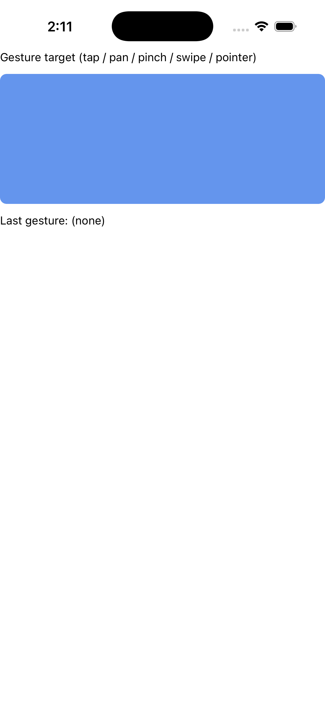</td><td></td><td></td></tr><tr><th>Dark</th><td></td><td></td><td></td></tr></table>

ports GesturesPage.xaml (+ .xaml.cs) The MAUI GesturesPage.xaml is a *gallery navigation* page: a CollectionView listing gesture-demo sections that the shell navigates into

#### 🟢 Pixel-Perfect Score — C++ (C1/C3)

**Motion:** ✅ PASS · run 2026-08-14-01_52_22 · 2026-08-14

Light: MOTION 4 frames paired by step (run 2026-08-14-01_52_22, commit 74dde0864a, 2026-08-14) — worst SSIM 1.0000 at frame 1 'initial' (0.00% pixels differ), mean SSIM 1.0000; per-frame diff% 0.00/0.00/0.00/0.00; self-motion MAUI 0.1244% (3935 px) vs C++ 0.1244% (3935 px) · Dark: MOTION 4 frames paired by step (run 2026-08-14-01_52_22, commit 74dde0864a, 2026-08-14); 1 frame(s) had no partner and were NOT scored — worst SSIM 1.0000 at frame 1 'initial' (0.00% pixels differ), mean SSIM 1.0000; per-frame diff% 0.00/0.00/0.00/0.00; self-motion MAUI 0.1978% (6255 px) vs C++ 0.1244% (3935 px)

#### 🟢 Pixel-Perfect Score — C++ &amp; XAML (C2/C4)

**Motion:** ✅ PASS · run 2026-08-14-01_52_22 · 2026-08-14

Light: MOTION 4 frames paired by step (run 2026-08-14-01_52_22, commit 74dde0864a, 2026-08-14); 2 frame(s) had no partner and were NOT scored — worst SSIM 0.9966 at frame 2 'driven' (0.13% pixels differ), mean SSIM 0.9991; per-frame diff% 0.00/0.13/0.00/0.00; self-motion MAUI 0.1244% (3935 px) vs C++ &amp; XAML 0.1512% (4782 px) · Dark: MOTION 5 frames paired by step (run 2026-08-14-01_52_22, commit 74dde0864a, 2026-08-14); 1 frame(s) had no partner and were NOT scored — worst SSIM 0.9966 at frame 2 'driven' (0.13% pixels differ), mean SSIM 0.9986; per-frame diff% 0.00/0.13/0.00/0.00/0.13; self-motion MAUI 0.1978% (6255 px) vs C++ &amp; XAML 0.1514% (4786 px)

### 66. Gradient — 🟢/🟢
gradient

<table><tr><th></th><th>MAUI</th><th>C++</th><th>C++ &amp; XAML</th></tr><tr><th>Light</th><td></td><td></td><td></td></tr><tr><th>Dark</th><td></td><td></td><td></td></tr></table>

a faithful reproduction of the maui-compare &amp;quot;gradient&amp;quot; demo (ComparePages.Gradient()), the shipped-.NET-MAUI reference for the visual-parity comparison: a VerticalStackLayout (Spacing 12, Padding 16) of two captioned 60px BoxViews — a Linea

#### 🟢 Pixel-Perfect Score — C++ (C1/C3)

Light: SSIM 1.0000, 0.00% pixels differ · Dark: SSIM 1.0000, 0.00% pixels differ

#### 🟢 Pixel-Perfect Score — C++ &amp; XAML (C2/C4)

Light: SSIM 1.0000, 0.00% pixels differ · Dark: SSIM 1.0000, 0.00% pixels differ

### 67. Grid — 🟢/🟢
grid

<table><tr><th></th><th>MAUI</th><th>C++</th><th>C++ &amp; XAML</th></tr><tr><th>Light</th><td></td><td></td><td></td></tr><tr><th>Dark</th><td></td><td></td><td></td></tr></table>

a faithful reproduction of the maui-compare &amp;quot;grid&amp;quot; demo (ComparePages.GridPage()), the shipped-.NET-MAUI reference for the visual-parity comparison: a Grid (Padding 16, Row/ColumnSpacing 6) with RowDefinitions Auto / 80 / 80 and two Star co

#### 🟢 Pixel-Perfect Score — C++ (C1/C3)

Light: SSIM 1.0000, 0.00% pixels differ · Dark: SSIM 1.0000, 0.00% pixels differ

#### 🟢 Pixel-Perfect Score — C++ &amp; XAML (C2/C4)

Light: SSIM 1.0000, 0.00% pixels differ · Dark: SSIM 1.0000, 0.00% pixels differ

### 68. Grid Grouping — 🟢/🟢
grid_grouping

<table><tr><th></th><th>MAUI</th><th>C++</th><th>C++ &amp; XAML</th></tr><tr><th>Light</th><td></td><td></td><td></td></tr><tr><th>Dark</th><td></td><td></td><td></td></tr></table>

ports GroupingGalleries/GridGrouping.xaml (+ .xaml.cs) of the C# CollectionView gallery

#### 🟢 Pixel-Perfect Score — C++ (C1/C3)

Light: SSIM 1.0000, 0.00% pixels differ · Dark: SSIM 1.0000, 0.00% pixels differ

#### 🟢 Pixel-Perfect Score — C++ &amp; XAML (C2/C4)

Light: SSIM 1.0000, 0.00% pixels differ · Dark: SSIM 1.0000, 0.00% pixels differ

### 69. Grouping No Templates — 🟢/🟢
grouping_no_templates

<table><tr><th></th><th>MAUI</th><th>C++</th><th>C++ &amp; XAML</th></tr><tr><th>Light</th><td></td><td></td><td></td></tr><tr><th>Dark</th><td></td><td></td><td></td></tr></table>

ports GroupingGalleries/GroupingNoTemplates.xaml (+ .xaml.cs) of the C# CollectionView gallery

#### 🟢 Pixel-Perfect Score — C++ (C1/C3)

Light: SSIM 1.0000, 0.00% pixels differ · Dark: SSIM 1.0000, 0.00% pixels differ

#### 🟢 Pixel-Perfect Score — C++ &amp; XAML (C2/C4)

Light: SSIM 1.0000, 0.00% pixels differ · Dark: SSIM 1.0000, 0.00% pixels differ

### 70. Grouping Plus Selection — 🟢/🟢
grouping_plus_selection

<table><tr><th></th><th>MAUI</th><th>C++</th><th>C++ &amp; XAML</th></tr><tr><th>Light</th><td></td><td></td><td></td></tr><tr><th>Dark</th><td></td><td></td><td></td></tr></table>

ports CollectionViewGalleries/GroupingGalleries/ GroupingPlusSelection.xaml (+ .xaml.cs) of the C# CollectionView gallery

#### 🟢 Pixel-Perfect Score — C++ (C1/C3)

Light: SSIM 1.0000, 0.00% pixels differ · Dark: SSIM 1.0000, 0.00% pixels differ

#### 🟢 Pixel-Perfect Score — C++ &amp; XAML (C2/C4)

Light: SSIM 1.0000, 0.00% pixels differ · Dark: SSIM 1.0000, 0.00% pixels differ

### 71. Header Footer — 🟢/🟢
header_footer

<table><tr><th></th><th>MAUI</th><th>C++</th><th>C++ &amp; XAML</th></tr><tr><th>Light</th><td></td><td></td><td></td></tr><tr><th>Dark</th><td></td><td></td><td></td></tr></table>

ports HeaderFooterString.xaml (+ HeaderFooterString.xaml.cs)

#### 🟢 Pixel-Perfect Score — C++ (C1/C3)

Light: SSIM 1.0000, 0.00% pixels differ · Dark: SSIM 1.0000, 0.00% pixels differ

#### 🟢 Pixel-Perfect Score — C++ &amp; XAML (C2/C4)

Light: SSIM 1.0000, 0.00% pixels differ · Dark: SSIM 1.0000, 0.00% pixels differ

### 72. Header Footer Grid — 🟢/🟢
header_footer_grid

<table><tr><th></th><th>MAUI</th><th>C++</th><th>C++ &amp; XAML</th></tr><tr><th>Light</th><td></td><td></td><td></td></tr><tr><th>Dark</th><td></td><td></td><td></td></tr></table>

ports HeaderFooterGrid.xaml (+ HeaderFooterGrid.xaml.cs) of the C# CollectionView gallery (CollectionViewGalleries/HeaderFooterGalleries)

#### 🟢 Pixel-Perfect Score — C++ (C1/C3)

Light: SSIM 0.9948, 0.37% pixels differ · Dark: SSIM 0.9907, 0.44% pixels differ

#### 🟢 Pixel-Perfect Score — C++ &amp; XAML (C2/C4)

Light: SSIM 0.9948, 0.37% pixels differ · Dark: SSIM 0.9907, 0.44% pixels differ

### 73. Header Footer Grid Horizontal — 🟡/🟡
header_footer_grid_horizontal

<table><tr><th></th><th>MAUI</th><th>C++</th><th>C++ &amp; XAML</th></tr><tr><th>Light</th><td></td><td></td><td></td></tr><tr><th>Dark</th><td></td><td></td><td></td></tr></table>

ports HeaderFooterGridHorizontal.xaml (+ HeaderFooterGridHorizontal.xaml.cs) of the C# CollectionView gallery (CollectionViewGalleries/HeaderFooterGalleries)

#### 🟡 Pixel-Perfect Score — C++ (C1/C3)

Light: SSIM 0.9767, 0.70% pixels differ · Dark: SSIM 0.9764, 0.70% pixels differ

#### 🟡 Pixel-Perfect Score — C++ &amp; XAML (C2/C4)

Light: SSIM 0.9767, 0.70% pixels differ · Dark: SSIM 0.9764, 0.70% pixels differ

### 74. Header Footer Template — 🟢/🟢
header_footer_template

<table><tr><th></th><th>MAUI</th><th>C++</th><th>C++ &amp; XAML</th></tr><tr><th>Light</th><td></td><td></td><td></td></tr><tr><th>Dark</th><td></td><td></td><td></td></tr></table>

ports HeaderFooterTemplate.xaml (+ .xaml.cs) of the C# CollectionView gallery (CollectionViewGalleries/HeaderFooterGalleries)

#### 🟢 Pixel-Perfect Score — C++ (C1/C3)

Light: SSIM 1.0000, 0.00% pixels differ · Dark: SSIM 1.0000, 0.00% pixels differ

#### 🟢 Pixel-Perfect Score — C++ &amp; XAML (C2/C4)

Light: SSIM 1.0000, 0.00% pixels differ · Dark: SSIM 1.0000, 0.00% pixels differ

### 75. Header Footer View — 🟢/🟢
header_footer_view

<table><tr><th></th><th>MAUI</th><th>C++</th><th>C++ &amp; XAML</th></tr><tr><th>Light</th><td></td><td></td><td></td></tr><tr><th>Dark</th><td></td><td></td><td></td></tr></table>

ports HeaderFooterView.xaml (+ .xaml.cs) of the C# CollectionView gallery (CollectionViewGalleries/HeaderFooterGalleries)

#### 🟢 Pixel-Perfect Score — C++ (C1/C3)

Light: SSIM 1.0000, 0.00% pixels differ · Dark: SSIM 1.0000, 0.00% pixels differ

#### 🟢 Pixel-Perfect Score — C++ &amp; XAML (C2/C4)

Light: SSIM 1.0000, 0.00% pixels differ · Dark: SSIM 1.0000, 0.00% pixels differ

### 76. Hit Testing — 🟢/🟢
hit_testing

<table><tr><th></th><th>MAUI</th><th>C++</th><th>C++ &amp; XAML</th></tr><tr><th>Light</th><td></td><td></td><td></td></tr><tr><th>Dark</th><td></td><td></td><td></td></tr></table>

ports HitTestingPage.xaml (+ .xaml.cs) (Maui.Controls.Sample.Pages.HitTestingPage)

#### 🟢 Pixel-Perfect Score — C++ (C1/C3)

**Motion:** ✅ PASS · run 2026-08-14-01_52_22 · 2026-08-14

Light: MOTION 2 frames paired by step (run 2026-08-14-01_52_22, commit 74dde0864a, 2026-08-14) — worst SSIM 0.9999 at frame 1 'initial' (0.04% pixels differ), mean SSIM 0.9999; per-frame diff% 0.04/0.04; self-motion MAUI 0.0414% (1309 px) vs C++ 0.0414% (1309 px) · Dark: MOTION 2 frames paired by step (run 2026-08-14-01_52_22, commit 74dde0864a, 2026-08-14) — worst SSIM 0.9999 at frame 1 'initial' (0.04% pixels differ), mean SSIM 0.9999; per-frame diff% 0.04/0.04; self-motion MAUI 0.0414% (1309 px) vs C++ 0.0414% (1309 px)

#### 🟢 Pixel-Perfect Score — C++ &amp; XAML (C2/C4)

**Motion:** ✅ PASS · run 2026-08-14-01_52_22 · 2026-08-14

Light: MOTION 2 frames paired by step (run 2026-08-14-01_52_22, commit 74dde0864a, 2026-08-14) — worst SSIM 0.9999 at frame 1 'initial' (0.04% pixels differ), mean SSIM 0.9999; per-frame diff% 0.04/0.04; self-motion MAUI 0.0414% (1309 px) vs C++ &amp; XAML 0.0414% (1309 px) · Dark: MOTION 2 frames paired by step (run 2026-08-14-01_52_22, commit 74dde0864a, 2026-08-14) — worst SSIM 0.9999 at frame 1 'initial' (0.04% pixels differ), mean SSIM 0.9999; per-frame diff% 0.04/0.04; self-motion MAUI 0.0414% (1309 px) vs C++ &amp; XAML 0.0414% (1309 px)

### 77. Horizontal Stack — 🟢/🟢
horizontal_stack

<table><tr><th></th><th>MAUI</th><th>C++</th><th>C++ &amp; XAML</th></tr><tr><th>Light</th><td></td><td></td><td></td></tr><tr><th>Dark</th><td></td><td></td><td></td></tr></table>

Horizontal Stack

#### 🟢 Pixel-Perfect Score — C++ (C1/C3)

Light: SSIM 1.0000, 0.00% pixels differ · Dark: SSIM 1.0000, 0.00% pixels differ

#### 🟢 Pixel-Perfect Score — C++ &amp; XAML (C2/C4)

Light: SSIM 1.0000, 0.00% pixels differ · Dark: SSIM 1.0000, 0.00% pixels differ

### 78. Hybrid Web View — 🟢/🟢
hybrid_web_view

<table><tr><th></th><th>MAUI</th><th>C++</th><th>C++ &amp; XAML</th></tr><tr><th>Light</th><td></td><td></td><td></td></tr><tr><th>Dark</th><td></td><td></td><td></td></tr></table>

ports HybridWebViewPage.xaml (+ HybridWebViewPage.xaml.cs)

#### 🟢 Pixel-Perfect Score — C++ (C1/C3)

Light: SSIM 0.9883, 0.50% pixels differ · Dark: SSIM 0.9881, 0.50% pixels differ

#### 🟢 Pixel-Perfect Score — C++ &amp; XAML (C2/C4)

Light: SSIM 0.9883, 0.50% pixels differ · Dark: SSIM 0.9881, 0.50% pixels differ

### 79. Image — 🔴/🔴
image

<table><tr><th></th><th>MAUI</th><th>C++</th><th>C++ &amp; XAML</th></tr><tr><th>Light</th><td></td><td></td><td></td></tr><tr><th>Dark</th><td></td><td></td><td></td></tr></table>

ports ImagePage.xaml (+ ImagePage.xaml.cs)

#### 🔴 Pixel-Perfect Score — C++ (C1/C3)

Light: SSIM 0.5240, 65.19% pixels differ · Dark: SSIM 0.9983, 0.13% pixels differ

#### 🔴 Pixel-Perfect Score — C++ &amp; XAML (C2/C4)

Light: SSIM 0.5240, 65.19% pixels differ · Dark: SSIM 0.9983, 0.13% pixels differ

### 80. Image Button — 🟢/🟢
image_button

<table><tr><th></th><th>MAUI</th><th>C++</th><th>C++ &amp; XAML</th></tr><tr><th>Light</th><td></td><td></td><td></td></tr><tr><th>Dark</th><td></td><td></td><td></td></tr></table>

ports ImageButtonPage.xaml (+ ImageButtonPage.xaml.cs) A self-contained, code-first demo page for the ImageButton control (the C# gallery-page convention, mirroring the input_controls_page / image_page pattern)

#### 🟢 Pixel-Perfect Score — C++ (C1/C3)

Light: SSIM 0.9888, 0.74% pixels differ · Dark: SSIM 0.9888, 0.74% pixels differ

#### 🟢 Pixel-Perfect Score — C++ &amp; XAML (C2/C4)

Light: SSIM 0.9888, 0.74% pixels differ · Dark: SSIM 0.9888, 0.74% pixels differ

### 81. Indicator — 🟢/🟢
indicator

<table><tr><th></th><th>MAUI</th><th>C++</th><th>C++ &amp; XAML</th></tr><tr><th>Light</th><td></td><td></td><td></td></tr><tr><th>Dark</th><td></td><td></td><td></td></tr></table>

ports IndicatorPage.xaml A self-contained, code-first demo of the IndicatorView control

#### 🟢 Pixel-Perfect Score — C++ (C1/C3)

Light: SSIM 0.9876, 0.77% pixels differ · Dark: SSIM 0.9839, 0.82% pixels differ

#### 🟢 Pixel-Perfect Score — C++ &amp; XAML (C2/C4)

Light: SSIM 0.9891, 0.72% pixels differ · Dark: SSIM 0.9855, 0.77% pixels differ

### 82. Input Controls — 🟢/🟢
input_controls

<table><tr><th></th><th>MAUI</th><th>C++</th><th>C++ &amp; XAML</th></tr><tr><th>Light</th><td></td><td></td><td></td></tr><tr><th>Dark</th><td></td><td></td><td></td></tr></table>

a self-contained demo page for the W1-05 input-control set: editor, search_bar, radio_button (+ the radio_button_group attached grouping) and image_button on one vertical stack, wired together so every input drives a visible output (the C#

#### 🟢 Pixel-Perfect Score — C++ (C1/C3)

Light: SSIM 0.9964, 0.19% pixels differ · Dark: SSIM 0.9963, 0.19% pixels differ

#### 🟢 Pixel-Perfect Score — C++ &amp; XAML (C2/C4)

Light: SSIM 0.9964, 0.19% pixels differ · Dark: SSIM 0.9963, 0.19% pixels differ

### 83. Input Transparent — 🟢/🟢
input_transparent

<table><tr><th></th><th>MAUI</th><th>C++</th><th>C++ &amp; XAML</th></tr><tr><th>Light</th><td></td><td></td><td></td></tr><tr><th>Dark</th><td></td><td></td><td></td></tr></table>

ports InputTransparentPage.xaml (Maui.Controls.Sample.Pages.InputTransparentPage)

#### 🟢 Pixel-Perfect Score — C++ (C1/C3)

Light: SSIM 1.0000, 0.00% pixels differ · Dark: SSIM 1.0000, 0.00% pixels differ

#### 🟢 Pixel-Perfect Score — C++ &amp; XAML (C2/C4)

Light: SSIM 1.0000, 0.00% pixels differ · Dark: SSIM 1.0000, 0.00% pixels differ

### 84. Invalidate Brush — 🟢/🟢
invalidate_brush

<table><tr><th></th><th>MAUI</th><th>C++</th><th>C++ &amp; XAML</th></tr><tr><th>Light</th><td></td><td></td><td></td></tr><tr><th>Dark</th><td></td><td></td><td></td></tr></table>

ports InvalidateBrushGallery.xaml A code-first port of the MAUI Shapes sub-gallery Pages/Controls/ShapesGalleries/InvalidateBrushGallery.xaml (&amp;quot;Invalidate Brushes Playground&amp;quot;): a VerticalStackLayout (Padding 12) with — - a &amp;quot;Change color&amp;quot; Bu

#### 🟢 Pixel-Perfect Score — C++ (C1/C3)

Light: SSIM 1.0000, 0.00% pixels differ · Dark: SSIM 1.0000, 0.00% pixels differ

#### 🟢 Pixel-Perfect Score — C++ &amp; XAML (C2/C4)

Light: SSIM 1.0000, 0.00% pixels differ · Dark: SSIM 1.0000, 0.00% pixels differ

### 85. Invalidate Shadow Host — 🟢/🟢
invalidate_shadow_host

<table><tr><th></th><th>MAUI</th><th>C++</th><th>C++ &amp; XAML</th></tr><tr><th>Light</th><td></td><td></td><td></td></tr><tr><th>Dark</th><td></td><td></td><td></td></tr></table>

ports InvalidateShadowHostPage.xaml A self-contained, code-first demo that a shadow re-applies (invalidates) when its host&amp;#x27;s size changes, mirroring the C# core gallery page (Pages/Core/ShadowGalleries/InvalidateShadowHostPage.xaml + .xaml.

#### 🟢 Pixel-Perfect Score — C++ (C1/C3)

Light: SSIM 1.0000, 0.00% pixels differ · Dark: SSIM 0.9985, 0.13% pixels differ

#### 🟢 Pixel-Perfect Score — C++ &amp; XAML (C2/C4)

Light: SSIM 1.0000, 0.00% pixels differ · Dark: SSIM 0.9985, 0.13% pixels differ

### 86. Ios Blur Effect — 🟢/🟢
ios_blur_effect

<table><tr><th></th><th>MAUI</th><th>C++</th><th>C++ &amp; XAML</th></tr><tr><th>Light</th><td></td><td></td><td></td></tr><tr><th>Dark</th><td></td><td></td><td></td></tr></table>

ports iOSBlurEffectPage.xaml The .NET MAUI PlatformSpecifics sample (Pages/PlatformSpecifics/iOS/iOSBlurEffectPage.xaml + .xaml.cs): an Image (Source=&amp;quot;oasis.jpg&amp;quot;) carrying the iOSSpecific VisualElement.BlurEffect knob (XAML seeds it to Extr

#### 🟢 Pixel-Perfect Score — C++ (C1/C3)

**Motion:** 🚫 INVALID · `no-scenario` · run 2026-08-14-01_52_22 · 2026-08-14

Light: !! NO MOTION EVIDENCE: neither MAUI nor C++ changed by more than 0.012% of its own frame across the sequence (0 px vs 0 px), on a page the board treats as ANIMATED. NO ACTION SCENARIO EXISTS for this page — docs/comparison/scenarios/ios_blur_effect.toml is absent or declares no `action` — so nothing was ever aimed at it and both columns are at rest by construction. This is NOT a port finding and nothing about the port can be concluded from it; the missing artifact is the scenario. 80 of the 139 cells that carried the old 'NOTHING MOVED' banner were this, including 10 of the 14 hard-coded ANIMATED pages. MOTION 9 frames paired by step (run 2026-08-14-01_52_22, commit 74dde0864a, 2026-08-14); 6 frame(s) had no partner and were NOT scored; column frames realigned by -3 sample(s) — a sampling drift, not a defect (see _align) — worst SSIM 1.0000 at frame 1 'gif01333' (0.00% pixels differ), mean SSIM 1.0000; per-frame diff% 0.00/0.00/0.00/0.00/0.00/0.00/0.00/0.00/0.00; self-motion MAUI 0.0000% (0 px) vs C++ 0.0000% (0 px) · Dark: !! NO MOTION EVIDENCE: neither MAUI nor C++ changed by more than 0.012% of its own frame across the sequence (66 px vs 0 px), on a page the board treats as ANIMATED. NO ACTION SCENARIO EXISTS for this page — docs/comparison/scenarios/ios_blur_effect.toml is absent or declares no `action` — so nothing was ever aimed at it and both columns are at rest by construction. This is NOT a port finding and nothing about the port can be concluded from it; the missing artifact is the scenario. 80 of the 139 cells that carried the old 'NOTHING MOVED' banner were this, including 10 of the 14 hard-coded ANIMATED pages. MOTION 3 frames paired by step (run 2026-08-14-01_52_22, commit 74dde0864a, 2026-08-14); 12 frame(s) had no partner and were NOT scored; column frames realigned by -2 sample(s) — a sampling drift, not a defect (see _align) — worst SSIM 0.9952 at frame 1 'gif01000' (0.13% pixels differ), mean SSIM 0.9952; per-frame diff% 0.13/0.13/0.13; self-motion MAUI 0.0021% (66 px) vs C++ 0.0000% (0 px)

#### 🟢 Pixel-Perfect Score — C++ &amp; XAML (C2/C4)

**Motion:** 🚫 INVALID · `no-scenario` · run 2026-08-14-01_52_22 · 2026-08-14

Light: !! NO MOTION EVIDENCE: neither MAUI nor C++ &amp; XAML changed by more than 0.012% of its own frame across the sequence (0 px vs 0 px), on a page the board treats as ANIMATED. NO ACTION SCENARIO EXISTS for this page — docs/comparison/scenarios/ios_blur_effect.toml is absent or declares no `action` — so nothing was ever aimed at it and both columns are at rest by construction. This is NOT a port finding and nothing about the port can be concluded from it; the missing artifact is the scenario. 80 of the 139 cells that carried the old 'NOTHING MOVED' banner were this, including 10 of the 14 hard-coded ANIMATED pages. MOTION 9 frames paired by step (run 2026-08-14-01_52_22, commit 74dde0864a, 2026-08-14); 6 frame(s) had no partner and were NOT scored; column frames realigned by -3 sample(s) — a sampling drift, not a defect (see _align) — worst SSIM 1.0000 at frame 1 'gif01333' (0.00% pixels differ), mean SSIM 1.0000; per-frame diff% 0.00/0.00/0.00/0.00/0.00/0.00/0.00/0.00/0.00; self-motion MAUI 0.0000% (0 px) vs C++ &amp; XAML 0.0000% (0 px) · Dark: !! NO MOTION EVIDENCE: neither MAUI nor C++ &amp; XAML changed by more than 0.012% of its own frame across the sequence (66 px vs 0 px), on a page the board treats as ANIMATED. NO ACTION SCENARIO EXISTS for this page — docs/comparison/scenarios/ios_blur_effect.toml is absent or declares no `action` — so nothing was ever aimed at it and both columns are at rest by construction. This is NOT a port finding and nothing about the port can be concluded from it; the missing artifact is the scenario. 80 of the 139 cells that carried the old 'NOTHING MOVED' banner were this, including 10 of the 14 hard-coded ANIMATED pages. MOTION 3 frames paired by step (run 2026-08-14-01_52_22, commit 74dde0864a, 2026-08-14); 12 frame(s) had no partner and were NOT scored; column frames realigned by -2 sample(s) — a sampling drift, not a defect (see _align) — worst SSIM 0.9952 at frame 1 'gif01000' (0.13% pixels differ), mean SSIM 0.9952; per-frame diff% 0.13/0.13/0.13; self-motion MAUI 0.0021% (66 px) vs C++ &amp; XAML 0.0000% (0 px)

### 87. Ios Date Picker — 🟢/🟢
ios_date_picker

<table><tr><th></th><th>MAUI</th><th>C++</th><th>C++ &amp; XAML</th></tr><tr><th>Light</th><td></td><td></td><td></td></tr><tr><th>Dark</th><td></td><td></td><td></td></tr></table>

ports iOSDatePickerPage.xaml (+ iOSDatePickerPage.xaml.cs)

#### 🟢 Pixel-Perfect Score — C++ (C1/C3)

**Motion:** ✅ PASS · run 2026-08-14-01_52_22 · 2026-08-14

Light: MOTION 2 frames paired by step (run 2026-08-14-01_52_22, commit 74dde0864a, 2026-08-14) — worst SSIM 0.9997 at frame 2 'driven' (0.01% pixels differ), mean SSIM 0.9999; per-frame diff% 0.00/0.01; self-motion MAUI 24.5073% (774954 px) vs C++ 24.5186% (775312 px) · Dark: MOTION 2 frames paired by step (run 2026-08-14-01_52_22, commit 74dde0864a, 2026-08-14) — worst SSIM 0.9997 at frame 2 'driven' (0.01% pixels differ), mean SSIM 0.9999; per-frame diff% 0.00/0.01; self-motion MAUI 5.3755% (169979 px) vs C++ 5.3868% (170337 px)

#### 🟢 Pixel-Perfect Score — C++ &amp; XAML (C2/C4)

**Motion:** ✅ PASS · run 2026-08-14-01_52_22 · 2026-08-14

Light: MOTION 2 frames paired by step (run 2026-08-14-01_52_22, commit 74dde0864a, 2026-08-14) — worst SSIM 0.9997 at frame 2 'driven' (0.01% pixels differ), mean SSIM 0.9999; per-frame diff% 0.00/0.01; self-motion MAUI 24.5073% (774954 px) vs C++ &amp; XAML 24.5186% (775312 px) · Dark: MOTION 2 frames paired by step (run 2026-08-14-01_52_22, commit 74dde0864a, 2026-08-14) — worst SSIM 0.9997 at frame 2 'driven' (0.01% pixels differ), mean SSIM 0.9999; per-frame diff% 0.00/0.01; self-motion MAUI 5.3755% (169979 px) vs C++ &amp; XAML 5.3868% (170337 px)

### 88. Ios Entry — 🟢/🟢
ios_entry

<table><tr><th></th><th>MAUI</th><th>C++</th><th>C++ &amp; XAML</th></tr><tr><th>Light</th><td></td><td></td><td></td></tr><tr><th>Dark</th><td></td><td></td><td></td></tr></table>

ports iOSEntryPage.xaml (+ iOSEntryPage.xaml.cs)

#### 🟢 Pixel-Perfect Score — C++ (C1/C3)

Light: SSIM 0.9858, 0.61% pixels differ · Dark: SSIM 0.9847, 0.64% pixels differ

#### 🟢 Pixel-Perfect Score — C++ &amp; XAML (C2/C4)

Light: SSIM 1.0000, 0.00% pixels differ · Dark: SSIM 1.0000, 0.00% pixels differ

### 89. Ios First Responder — 🟢/🟢
ios_first_responder

<table><tr><th></th><th>MAUI</th><th>C++</th><th>C++ &amp; XAML</th></tr><tr><th>Light</th><td></td><td></td><td></td></tr><tr><th>Dark</th><td></td><td></td><td></td></tr></table>

ports iOSFirstResponderPage.xaml (+ .xaml.cs) The C# iOSFirstResponderPage is a VisualElement-first-responder demo: a StackLayout with an explanatory Label, a &amp;quot;First Entry&amp;quot; + plain &amp;quot;OK&amp;quot; Button (tapping OK dismisses the keyboard because the

#### 🟢 Pixel-Perfect Score — C++ (C1/C3)

Light: SSIM 1.0000, 0.00% pixels differ · Dark: SSIM 1.0000, 0.00% pixels differ

#### 🟢 Pixel-Perfect Score — C++ &amp; XAML (C2/C4)

Light: SSIM 1.0000, 0.00% pixels differ · Dark: SSIM 1.0000, 0.00% pixels differ

### 90. Ios Pan Gesture — 🟢/🟢
ios_pan_gesture

<table><tr><th></th><th>MAUI</th><th>C++</th><th>C++ &amp; XAML</th></tr><tr><th>Light</th><td></td><td></td><td></td></tr><tr><th>Dark</th><td></td><td></td><td></td></tr></table>

ports iOSPanGestureRecognizerPage.xaml (+ .xaml.cs) The C# iOSPanGestureRecognizerPage is a StackLayout with: a bold message Label (_messageLabel), a &amp;quot;Toggle Simultaneous Gesture Recognition&amp;quot; Button, and a grouped ListView of employees whos

#### 🟢 Pixel-Perfect Score — C++ (C1/C3)

**Motion:** 🚫 INVALID · `no-scenario` · run 2026-08-14-01_52_22 · 2026-08-14

Light: !! NO MOTION EVIDENCE: neither MAUI nor C++ changed by more than 0.012% of its own frame across the sequence (106 px vs 0 px), on a page the board treats as ANIMATED. NO ACTION SCENARIO EXISTS for this page — docs/comparison/scenarios/ios_pan_gesture.toml is absent or declares no `action` — so nothing was ever aimed at it and both columns are at rest by construction. This is NOT a port finding and nothing about the port can be concluded from it; the missing artifact is the scenario. 80 of the 139 cells that carried the old 'NOTHING MOVED' banner were this, including 10 of the 14 hard-coded ANIMATED pages. MOTION 3 frames paired by step (run 2026-08-14-01_52_22, commit 74dde0864a, 2026-08-14); 11 frame(s) had no partner and were NOT scored; column frames realigned by -1 sample(s) — a sampling drift, not a defect (see _align) — worst SSIM 0.9998 at frame 1 'gif00667' (0.12% pixels differ), mean SSIM 0.9999; per-frame diff% 0.12/0.12/0.12; self-motion MAUI 0.0034% (106 px) vs C++ 0.0000% (0 px) · Dark: !! NO MOTION EVIDENCE: neither MAUI nor C++ changed by more than 0.012% of its own frame across the sequence (84 px vs 0 px), on a page the board treats as ANIMATED. NO ACTION SCENARIO EXISTS for this page — docs/comparison/scenarios/ios_pan_gesture.toml is absent or declares no `action` — so nothing was ever aimed at it and both columns are at rest by construction. This is NOT a port finding and nothing about the port can be concluded from it; the missing artifact is the scenario. 80 of the 139 cells that carried the old 'NOTHING MOVED' banner were this, including 10 of the 14 hard-coded ANIMATED pages. MOTION 3 frames paired by step (run 2026-08-14-01_52_22, commit 74dde0864a, 2026-08-14); 11 frame(s) had no partner and were NOT scored; column frames realigned by -1 sample(s) — a sampling drift, not a defect (see _align) — worst SSIM 0.9999 at frame 1 'gif00667' (0.12% pixels differ), mean SSIM 0.9999; per-frame diff% 0.12/0.12/0.12; self-motion MAUI 0.0027% (84 px) vs C++ 0.0000% (0 px)

#### 🟢 Pixel-Perfect Score — C++ &amp; XAML (C2/C4)

**Motion:** 🚫 INVALID · `no-scenario` · run 2026-08-14-01_52_22 · 2026-08-14

Light: !! NO MOTION EVIDENCE: neither MAUI nor C++ &amp; XAML changed by more than 0.012% of its own frame across the sequence (106 px vs 0 px), on a page the board treats as ANIMATED. NO ACTION SCENARIO EXISTS for this page — docs/comparison/scenarios/ios_pan_gesture.toml is absent or declares no `action` — so nothing was ever aimed at it and both columns are at rest by construction. This is NOT a port finding and nothing about the port can be concluded from it; the missing artifact is the scenario. 80 of the 139 cells that carried the old 'NOTHING MOVED' banner were this, including 10 of the 14 hard-coded ANIMATED pages. MOTION 3 frames paired by step (run 2026-08-14-01_52_22, commit 74dde0864a, 2026-08-14); 11 frame(s) had no partner and were NOT scored; column frames realigned by -1 sample(s) — a sampling drift, not a defect (see _align) — worst SSIM 0.9998 at frame 1 'gif00667' (0.12% pixels differ), mean SSIM 0.9999; per-frame diff% 0.12/0.12/0.12; self-motion MAUI 0.0034% (106 px) vs C++ &amp; XAML 0.0000% (0 px) · Dark: !! NO MOTION EVIDENCE: neither MAUI nor C++ &amp; XAML changed by more than 0.012% of its own frame across the sequence (84 px vs 0 px), on a page the board treats as ANIMATED. NO ACTION SCENARIO EXISTS for this page — docs/comparison/scenarios/ios_pan_gesture.toml is absent or declares no `action` — so nothing was ever aimed at it and both columns are at rest by construction. This is NOT a port finding and nothing about the port can be concluded from it; the missing artifact is the scenario. 80 of the 139 cells that carried the old 'NOTHING MOVED' banner were this, including 10 of the 14 hard-coded ANIMATED pages. MOTION 3 frames paired by step (run 2026-08-14-01_52_22, commit 74dde0864a, 2026-08-14); 11 frame(s) had no partner and were NOT scored; column frames realigned by -1 sample(s) — a sampling drift, not a defect (see _align) — worst SSIM 0.9999 at frame 1 'gif00667' (0.12% pixels differ), mean SSIM 0.9999; per-frame diff% 0.12/0.12/0.12; self-motion MAUI 0.0027% (84 px) vs C++ &amp; XAML 0.0000% (0 px)

### 91. Ios Picker — 🟢/🟢
ios_picker

<table><tr><th></th><th>MAUI</th><th>C++</th><th>C++ &amp; XAML</th></tr><tr><th>Light</th><td></td><td></td><td></td></tr><tr><th>Dark</th><td></td><td></td><td></td></tr></table>

ports iOSPickerPage.xaml (+ iOSPickerPage.xaml.cs)

#### 🟢 Pixel-Perfect Score — C++ (C1/C3)

**Motion:** ✅ PASS · run 2026-08-14-01_52_22 · 2026-08-14

Light: MOTION 2 frames paired by step (run 2026-08-14-01_52_22, commit 74dde0864a, 2026-08-14) — worst SSIM 0.9997 at frame 2 'driven' (0.01% pixels differ), mean SSIM 0.9999; per-frame diff% 0.00/0.01; self-motion MAUI 24.5073% (774954 px) vs C++ 24.5187% (775314 px) · Dark: MOTION 2 frames paired by step (run 2026-08-14-01_52_22, commit 74dde0864a, 2026-08-14) — worst SSIM 0.9997 at frame 2 'driven' (0.01% pixels differ), mean SSIM 0.9999; per-frame diff% 0.00/0.01; self-motion MAUI 4.8412% (153085 px) vs C++ 4.8526% (153445 px)

#### 🟢 Pixel-Perfect Score — C++ &amp; XAML (C2/C4)

**Motion:** ✅ PASS · run 2026-08-14-01_52_22 · 2026-08-14

Light: MOTION 2 frames paired by step (run 2026-08-14-01_52_22, commit 74dde0864a, 2026-08-14) — worst SSIM 0.9997 at frame 2 'driven' (0.01% pixels differ), mean SSIM 0.9999; per-frame diff% 0.00/0.01; self-motion MAUI 24.5073% (774954 px) vs C++ &amp; XAML 24.5187% (775314 px) · Dark: MOTION 2 frames paired by step (run 2026-08-14-01_52_22, commit 74dde0864a, 2026-08-14) — worst SSIM 0.9875 at frame 2 'driven' (0.35% pixels differ), mean SSIM 0.9938; per-frame diff% 0.00/0.35; self-motion MAUI 4.8412% (153085 px) vs C++ &amp; XAML 4.8594% (153662 px)

### 92. Ios Safe Area — 🟢/🟢
ios_safe_area

<table><tr><th></th><th>MAUI</th><th>C++</th><th>C++ &amp; XAML</th></tr><tr><th>Light</th><td></td><td></td><td></td></tr><tr><th>Dark</th><td></td><td></td><td></td></tr></table>

ports iOSSafeAreaPage.xaml The .NET MAUI PlatformSpecifics sample (Pages/PlatformSpecifics/iOS/iOSSafeAreaPage.xaml + .xaml.cs): a long Lorem-ipsum Label over a &amp;quot;Disable Use Safe Area&amp;quot; button

#### 🟢 Pixel-Perfect Score — C++ (C1/C3)

Light: SSIM 1.0000, 0.00% pixels differ · Dark: SSIM 1.0000, 0.00% pixels differ

#### 🟢 Pixel-Perfect Score — C++ &amp; XAML (C2/C4)

Light: SSIM 1.0000, 0.00% pixels differ · Dark: SSIM 1.0000, 0.00% pixels differ

### 93. Ios Scroll View — 🟢/🟢
ios_scroll_view

<table><tr><th></th><th>MAUI</th><th>C++</th><th>C++ &amp; XAML</th></tr><tr><th>Light</th><td></td><td></td><td></td></tr><tr><th>Dark</th><td></td><td></td><td></td></tr></table>

ports iOSScrollViewPage.xaml (+ iOSScrollViewPage.xaml.cs)

#### 🟢 Pixel-Perfect Score — C++ (C1/C3)

**Motion:** ✅ PASS · run 2026-08-14-01_52_22 · 2026-08-14

Light: MOTION 2 frames paired by step (run 2026-08-14-01_52_22, commit 74dde0864a, 2026-08-14) — worst SSIM 1.0000 at frame 1 'initial' (0.00% pixels differ), mean SSIM 1.0000; per-frame diff% 0.00/0.00; self-motion MAUI 0.2342% (7406 px) vs C++ 0.2341% (7404 px) · Dark: MOTION 2 frames paired by step (run 2026-08-14-01_52_22, commit 74dde0864a, 2026-08-14) — worst SSIM 1.0000 at frame 1 'initial' (0.00% pixels differ), mean SSIM 1.0000; per-frame diff% 0.00/0.00; self-motion MAUI 0.6066% (19180 px) vs C++ 0.6066% (19180 px)

#### 🟢 Pixel-Perfect Score — C++ &amp; XAML (C2/C4)

**Motion:** ✅ PASS · run 2026-08-14-01_52_22 · 2026-08-14

Light: MOTION 2 frames paired by step (run 2026-08-14-01_52_22, commit 74dde0864a, 2026-08-14) — worst SSIM 0.9995 at frame 2 'driven' (0.01% pixels differ), mean SSIM 0.9998; per-frame diff% 0.00/0.01; self-motion MAUI 0.2342% (7406 px) vs C++ &amp; XAML 0.2291% (7244 px) · Dark: MOTION 2 frames paired by step (run 2026-08-14-01_52_22, commit 74dde0864a, 2026-08-14) — worst SSIM 1.0000 at frame 1 'initial' (0.00% pixels differ), mean SSIM 1.0000; per-frame diff% 0.00/0.00; self-motion MAUI 0.6066% (19180 px) vs C++ &amp; XAML 0.6066% (19180 px)

### 94. Ios Search Bar — 🟢/🟢
ios_search_bar

<table><tr><th></th><th>MAUI</th><th>C++</th><th>C++ &amp; XAML</th></tr><tr><th>Light</th><td></td><td></td><td></td></tr><tr><th>Dark</th><td></td><td></td><td></td></tr></table>

ports iOSSearchBarPage.xaml (+ iOSSearchBarPage.xaml.cs)

#### 🟢 Pixel-Perfect Score — C++ (C1/C3)

Light: SSIM 0.9990, 0.10% pixels differ · Dark: SSIM 0.9989, 0.09% pixels differ

#### 🟢 Pixel-Perfect Score — C++ &amp; XAML (C2/C4)

Light: SSIM 0.9990, 0.10% pixels differ · Dark: SSIM 0.9989, 0.09% pixels differ

### 95. Ios Slider Update On Tap — 🟢/🟢
ios_slider_update_on_tap

<table><tr><th></th><th>MAUI</th><th>C++</th><th>C++ &amp; XAML</th></tr><tr><th>Light</th><td></td><td></td><td></td></tr><tr><th>Dark</th><td></td><td></td><td></td></tr></table>

ports iOSSliderUpdateOnTapPage.xaml (+ iOSSliderUpdateOnTapPage.xaml.cs)

#### 🟢 Pixel-Perfect Score — C++ (C1/C3)

Light: SSIM 1.0000, 0.00% pixels differ · Dark: SSIM 1.0000, 0.00% pixels differ

#### 🟢 Pixel-Perfect Score — C++ &amp; XAML (C2/C4)

Light: SSIM 1.0000, 0.00% pixels differ · Dark: SSIM 1.0000, 0.00% pixels differ

### 96. Ios Swipe Transition — 🟢/🟢
ios_swipe_transition

<table><tr><th></th><th>MAUI</th><th>C++</th><th>C++ &amp; XAML</th></tr><tr><th>Light</th><td></td><td></td><td></td></tr><tr><th>Dark</th><td></td><td></td><td></td></tr></table>

ports iOSSwipeViewTransitionModePage.xaml (+ .xaml.cs) The C# iOSSwipeViewTransitionModePage is a StackLayout with: a horizontal row holding a &amp;quot;SwipeTransitionMode:&amp;quot; Label + an EnumPicker over the SwipeTransitionMode enum (Reveal / Drag, Se

#### 🟢 Pixel-Perfect Score — C++ (C1/C3)

**Motion:** 🚫 INVALID · `no-scenario` · run 2026-08-14-01_52_22 · 2026-08-14

Light: !! NO MOTION EVIDENCE: neither MAUI nor C++ changed by more than 0.012% of its own frame across the sequence (281 px vs 0 px), on a page the board treats as ANIMATED. NO ACTION SCENARIO EXISTS for this page — docs/comparison/scenarios/ios_swipe_transition.toml is absent or declares no `action` — so nothing was ever aimed at it and both columns are at rest by construction. This is NOT a port finding and nothing about the port can be concluded from it; the missing artifact is the scenario. 80 of the 139 cells that carried the old 'NOTHING MOVED' banner were this, including 10 of the 14 hard-coded ANIMATED pages. MOTION 2 frames paired by step (run 2026-08-14-01_52_22, commit 74dde0864a, 2026-08-14); 11 frame(s) had no partner and were NOT scored — worst SSIM 0.9998 at frame 1 'gif00333' (0.05% pixels differ), mean SSIM 0.9998; per-frame diff% 0.05/0.04; self-motion MAUI 0.0089% (281 px) vs C++ 0.0000% (0 px) · Dark: !! NO MOTION EVIDENCE: neither MAUI nor C++ changed by more than 0.012% of its own frame across the sequence (0 px vs 0 px), on a page the board treats as ANIMATED. NO ACTION SCENARIO EXISTS for this page — docs/comparison/scenarios/ios_swipe_transition.toml is absent or declares no `action` — so nothing was ever aimed at it and both columns are at rest by construction. This is NOT a port finding and nothing about the port can be concluded from it; the missing artifact is the scenario. 80 of the 139 cells that carried the old 'NOTHING MOVED' banner were this, including 10 of the 14 hard-coded ANIMATED pages. MOTION 9 frames paired by step (run 2026-08-14-01_52_22, commit 74dde0864a, 2026-08-14); 6 frame(s) had no partner and were NOT scored; column frames realigned by -3 sample(s) — a sampling drift, not a defect (see _align) — worst SSIM 1.0000 at frame 1 'gif01333' (0.00% pixels differ), mean SSIM 1.0000; per-frame diff% 0.00/0.00/0.00/0.00/0.00/0.00/0.00/0.00/0.00; self-motion MAUI 0.0000% (0 px) vs C++ 0.0000% (0 px)

#### 🟢 Pixel-Perfect Score — C++ &amp; XAML (C2/C4)

**Motion:** 🚫 INVALID · `no-scenario` · run 2026-08-14-01_52_22 · 2026-08-14

Light: !! NO MOTION EVIDENCE: neither MAUI nor C++ &amp; XAML changed by more than 0.012% of its own frame across the sequence (281 px vs 0 px), on a page the board treats as ANIMATED. NO ACTION SCENARIO EXISTS for this page — docs/comparison/scenarios/ios_swipe_transition.toml is absent or declares no `action` — so nothing was ever aimed at it and both columns are at rest by construction. This is NOT a port finding and nothing about the port can be concluded from it; the missing artifact is the scenario. 80 of the 139 cells that carried the old 'NOTHING MOVED' banner were this, including 10 of the 14 hard-coded ANIMATED pages. MOTION 2 frames paired by step (run 2026-08-14-01_52_22, commit 74dde0864a, 2026-08-14); 11 frame(s) had no partner and were NOT scored — worst SSIM 0.9998 at frame 1 'gif00333' (0.05% pixels differ), mean SSIM 0.9998; per-frame diff% 0.05/0.04; self-motion MAUI 0.0089% (281 px) vs C++ &amp; XAML 0.0000% (0 px) · Dark: !! NO MOTION EVIDENCE: neither MAUI nor C++ &amp; XAML changed by more than 0.012% of its own frame across the sequence (0 px vs 0 px), on a page the board treats as ANIMATED. NO ACTION SCENARIO EXISTS for this page — docs/comparison/scenarios/ios_swipe_transition.toml is absent or declares no `action` — so nothing was ever aimed at it and both columns are at rest by construction. This is NOT a port finding and nothing about the port can be concluded from it; the missing artifact is the scenario. 80 of the 139 cells that carried the old 'NOTHING MOVED' banner were this, including 10 of the 14 hard-coded ANIMATED pages. MOTION 9 frames paired by step (run 2026-08-14-01_52_22, commit 74dde0864a, 2026-08-14); 6 frame(s) had no partner and were NOT scored; column frames realigned by -3 sample(s) — a sampling drift, not a defect (see _align) — worst SSIM 1.0000 at frame 1 'gif01333' (0.00% pixels differ), mean SSIM 1.0000; per-frame diff% 0.00/0.00/0.00/0.00/0.00/0.00/0.00/0.00/0.00; self-motion MAUI 0.0000% (0 px) vs C++ &amp; XAML 0.0000% (0 px)

### 97. Ios Time Picker — 🟢/🟢
ios_time_picker

<table><tr><th></th><th>MAUI</th><th>C++</th><th>C++ &amp; XAML</th></tr><tr><th>Light</th><td></td><td></td><td></td></tr><tr><th>Dark</th><td></td><td></td><td></td></tr></table>

ports iOSTimePickerPage.xaml The .NET MAUI PlatformSpecifics sample (Pages/PlatformSpecifics/iOS/iOSTimePickerPage.xaml + .xaml.cs): a TimePicker carrying the iOSSpecific TimePicker.UpdateMode knob (XAML seeds it to WhenFinished) over a but

#### 🟢 Pixel-Perfect Score — C++ (C1/C3)

Light: SSIM 0.9991, 0.04% pixels differ · Dark: SSIM 0.9991, 0.04% pixels differ

#### 🟢 Pixel-Perfect Score — C++ &amp; XAML (C2/C4)

Light: SSIM 0.9991, 0.04% pixels differ · Dark: SSIM 0.9991, 0.04% pixels differ

### 98. Items — 🟢/🟢
items

<table><tr><th></th><th>MAUI</th><th>C++</th><th>C++ &amp; XAML</th></tr><tr><th>Light</th><td></td><td></td><td></td></tr><tr><th>Dark</th><td></td><td></td><td></td></tr></table>

a self-contained demo page for the W2-19 items core: a collection_view over a live observable items source with a templated cell, single selection driving a readout label, and an EmptyView for the cleared state (the C# CollectionView galler

#### 🟢 Pixel-Perfect Score — C++ (C1/C3)

Light: SSIM 1.0000, 0.00% pixels differ · Dark: SSIM 1.0000, 0.00% pixels differ

#### 🟢 Pixel-Perfect Score — C++ &amp; XAML (C2/C4)

Light: SSIM 1.0000, 0.00% pixels differ · Dark: SSIM 1.0000, 0.00% pixels differ

### 99. Items Updating Scroll Mode — 🟢/🟢
items_updating_scroll_mode

<table><tr><th></th><th>MAUI</th><th>C++</th><th>C++ &amp; XAML</th></tr><tr><th>Light</th><td></td><td></td><td></td></tr><tr><th>Dark</th><td></td><td></td><td></td></tr></table>

ports ItemsUpdatingScrollModeGallery.xaml (+ .xaml.cs) of the C# CollectionView gallery (Maui.Controls.Sample.Pages.CollectionViewGalleries.ScrollModeGalleries.ItemsUpdatingScrollModeGallery)

#### 🟢 Pixel-Perfect Score — C++ (C1/C3)

Light: SSIM 1.0000, 0.00% pixels differ · Dark: SSIM 1.0000, 0.00% pixels differ

#### 🟢 Pixel-Perfect Score — C++ &amp; XAML (C2/C4)

Light: SSIM 1.0000, 0.00% pixels differ · Dark: SSIM 1.0000, 0.00% pixels differ

### 100. Label — 🟢/🟢
label

<table><tr><th></th><th>MAUI</th><th>C++</th><th>C++ &amp; XAML</th></tr><tr><th>Light</th><td></td><td></td><td></td></tr><tr><th>Dark</th><td></td><td></td><td></td></tr></table>

ports LabelPage.xaml (+ LabelPage.xaml.cs)

#### 🟢 Pixel-Perfect Score — C++ (C1/C3)

Light: SSIM 0.9975, 0.09% pixels differ · Dark: SSIM 0.9974, 0.09% pixels differ

#### 🟢 Pixel-Perfect Score — C++ &amp; XAML (C2/C4)

Light: SSIM 0.9975, 0.09% pixels differ · Dark: SSIM 0.9974, 0.09% pixels differ

### 101. Layout Is Enabled — 🟢/🟢
layout_is_enabled

<table><tr><th></th><th>MAUI</th><th>C++</th><th>C++ &amp; XAML</th></tr><tr><th>Light</th><td></td><td></td><td></td></tr><tr><th>Dark</th><td></td><td></td><td></td></tr></table>

ports LayoutIsEnabledPage.xaml (+ LayoutIsEnabledPage.xaml.cs) The C# page demonstrates how IsEnabled on a layout cascades to its children: a 2x2 grid whose left column hosts a &amp;quot;MainLayout&amp;quot; full of state-demo sub-stacks (all-enabled / all-d

#### 🟢 Pixel-Perfect Score — C++ (C1/C3)

Light: SSIM 1.0000, 0.00% pixels differ · Dark: SSIM 1.0000, 0.00% pixels differ

#### 🟢 Pixel-Perfect Score — C++ &amp; XAML (C2/C4)

Light: SSIM 1.0000, 0.00% pixels differ · Dark: SSIM 1.0000, 0.00% pixels differ

### 102. Line Gallery — 🟢/🟢
line_gallery

<table><tr><th></th><th>MAUI</th><th>C++</th><th>C++ &amp; XAML</th></tr><tr><th>Light</th><td></td><td></td><td></td></tr><tr><th>Dark</th><td></td><td></td><td></td></tr></table>

ports LineGallery.xaml A self-contained, code-first port of the MAUI Shapes LineGallery (Pages/Controls/ShapesGalleries/LineGallery.xaml + .xaml.cs)

#### 🟢 Pixel-Perfect Score — C++ (C1/C3)

Light: SSIM 1.0000, 0.00% pixels differ · Dark: SSIM 1.0000, 0.00% pixels differ

#### 🟢 Pixel-Perfect Score — C++ &amp; XAML (C2/C4)

Light: SSIM 1.0000, 0.00% pixels differ · Dark: SSIM 1.0000, 0.00% pixels differ

### 103. Line Join Gallery — 🟢/🟢
line_join_gallery

<table><tr><th></th><th>MAUI</th><th>C++</th><th>C++ &amp; XAML</th></tr><tr><th>Light</th><td></td><td></td><td></td></tr><tr><th>Dark</th><td></td><td></td><td></td></tr></table>

ports LineJoinGallery.xaml A self-contained, code-first port of the MAUI Shapes sub-gallery Pages/Controls/ShapesGalleries/LineJoinGallery.xaml: a StackLayout that demonstrates the three StrokeLineJoin variants on an identical open polyline

#### 🟢 Pixel-Perfect Score — C++ (C1/C3)

Light: SSIM 1.0000, 0.00% pixels differ · Dark: SSIM 1.0000, 0.00% pixels differ

#### 🟢 Pixel-Perfect Score — C++ &amp; XAML (C2/C4)

Light: SSIM 1.0000, 0.00% pixels differ · Dark: SSIM 1.0000, 0.00% pixels differ

### 104. Measure First Strategy — 🟢/🟢
measure_first_strategy

<table><tr><th></th><th>MAUI</th><th>C++</th><th>C++ &amp; XAML</th></tr><tr><th>Light</th><td></td><td></td><td></td></tr><tr><th>Dark</th><td></td><td></td><td></td></tr></table>

ports MeasureFirstStrategy.xaml (+ .xaml.cs) of the C# CollectionView gallery (Maui.Controls.Sample.Pages.CollectionViewGalleries.GroupingGalleries.MeasureFirstStrategy)

#### 🟢 Pixel-Perfect Score — C++ (C1/C3)

Light: SSIM 1.0000, 0.00% pixels differ · Dark: SSIM 1.0000, 0.00% pixels differ

#### 🟢 Pixel-Perfect Score — C++ &amp; XAML (C2/C4)

Light: SSIM 1.0000, 0.00% pixels differ · Dark: SSIM 1.0000, 0.00% pixels differ

### 105. Menu Bar — 🟢/🟢
menu_bar

<table><tr><th></th><th>MAUI</th><th>C++</th><th>C++ &amp; XAML</th></tr><tr><th>Light</th><td></td><td></td><td></td></tr><tr><th>Dark</th><td></td><td></td><td></td></tr></table>

ports MenuBarPage.xaml (+ MenuBarPage.cs) The C# page declares three page-level MenuBarItems (Page.MenuBarItems — the app menu bar) and a small visible body: - &amp;quot;Before File&amp;quot; : &amp;quot;Before File Action&amp;quot; (accelerator &amp;quot;b&amp;quot;), &amp;quot;Cool item 1&amp;quot;, a separat

#### 🟢 Pixel-Perfect Score — C++ (C1/C3)

Light: SSIM 1.0000, 0.00% pixels differ · Dark: SSIM 1.0000, 0.00% pixels differ

#### 🟢 Pixel-Perfect Score — C++ &amp; XAML (C2/C4)

Light: SSIM 1.0000, 0.00% pixels differ · Dark: SSIM 1.0000, 0.00% pixels differ

### 106. Modal — 🟢/🟢
modal

<table><tr><th></th><th>MAUI</th><th>C++</th><th>C++ &amp; XAML</th></tr><tr><th>Light</th><td></td><td></td><td></td></tr><tr><th>Dark</th><td></td><td></td><td></td></tr></table>

ports ModalPage.xaml (+ .xaml.cs)

#### 🟢 Pixel-Perfect Score — C++ (C1/C3)

Light: SSIM 1.0000, 0.00% pixels differ · Dark: SSIM 1.0000, 0.00% pixels differ

#### 🟢 Pixel-Perfect Score — C++ &amp; XAML (C2/C4)

Light: SSIM 1.0000, 0.00% pixels differ · Dark: SSIM 1.0000, 0.00% pixels differ

### 107. Multiple Bound Selection — 🟢/🟢
multiple_bound_selection

<table><tr><th></th><th>MAUI</th><th>C++</th><th>C++ &amp; XAML</th></tr><tr><th>Light</th><td></td><td></td><td></td></tr><tr><th>Dark</th><td></td><td></td><td></td></tr></table>

ports MultipleBoundSelection.xaml (+ .xaml.cs) (Maui.Controls.Sample.Pages.CollectionViewGalleries.SelectionGalleries.MultipleBoundSelection)

#### 🟢 Pixel-Perfect Score — C++ (C1/C3)

Light: SSIM 1.0000, 0.00% pixels differ · Dark: SSIM 1.0000, 0.00% pixels differ

#### 🟢 Pixel-Perfect Score — C++ &amp; XAML (C2/C4)

Light: SSIM 1.0000, 0.00% pixels differ · Dark: SSIM 1.0000, 0.00% pixels differ

### 108. Navigation Gallery — 🟢/🟢
navigation_gallery

<table><tr><th></th><th>MAUI</th><th>C++</th><th>C++ &amp; XAML</th></tr><tr><th>Light</th><td></td><td></td><td></td></tr><tr><th>Dark</th><td></td><td></td><td></td></tr></table>

ports NavigationGallery.xaml (+ .xaml.cs)

#### 🟢 Pixel-Perfect Score — C++ (C1/C3)

Light: SSIM 1.0000, 0.00% pixels differ · Dark: SSIM 1.0000, 0.00% pixels differ

#### 🟢 Pixel-Perfect Score — C++ &amp; XAML (C2/C4)

Light: SSIM 1.0000, 0.00% pixels differ · Dark: SSIM 1.0000, 0.00% pixels differ

### 109. Nested Collection — 🟢/🟢
nested_collection

<table><tr><th></th><th>MAUI</th><th>C++</th><th>C++ &amp; XAML</th></tr><tr><th>Light</th><td></td><td></td><td></td></tr><tr><th>Dark</th><td></td><td></td><td></td></tr></table>

ports NestedGalleries/NestedCollectionViewGallery.xaml (+ NestedCollectionViewGallery.xaml.cs) of the C# CollectionView gallery

#### 🟢 Pixel-Perfect Score — C++ (C1/C3)

Light: SSIM 1.0000, 0.00% pixels differ · Dark: SSIM 1.0000, 0.00% pixels differ

#### 🟢 Pixel-Perfect Score — C++ &amp; XAML (C2/C4)

Light: SSIM 1.0000, 0.00% pixels differ · Dark: SSIM 1.0000, 0.00% pixels differ

### 110. Pan Gesture Events — 🟢/🟢
pan_gesture_events

<table><tr><th></th><th>MAUI</th><th>C++</th><th>C++ &amp; XAML</th></tr><tr><th>Light</th><td></td><td></td><td></td></tr><tr><th>Dark</th><td></td><td></td><td></td></tr></table>

ports PanGestureEventsGallery.xaml (+ .xaml.cs) (Maui.Controls.Sample.Pages.PanGestureEventsGallery)

#### 🟢 Pixel-Perfect Score — C++ (C1/C3)

**Motion:** 🚫 INVALID · `no-scenario` · run 2026-08-14-01_52_22 · 2026-08-14

Light: !! NO MOTION EVIDENCE: neither MAUI nor C++ changed by more than 0.012% of its own frame across the sequence (0 px vs 0 px), on a page the board treats as ANIMATED. NO ACTION SCENARIO EXISTS for this page — docs/comparison/scenarios/pan_gesture_events.toml is absent or declares no `action` — so nothing was ever aimed at it and both columns are at rest by construction. This is NOT a port finding and nothing about the port can be concluded from it; the missing artifact is the scenario. 80 of the 139 cells that carried the old 'NOTHING MOVED' banner were this, including 10 of the 14 hard-coded ANIMATED pages. MOTION 9 frames paired by step (run 2026-08-14-01_52_22, commit 74dde0864a, 2026-08-14); 6 frame(s) had no partner and were NOT scored; column frames realigned by -3 sample(s) — a sampling drift, not a defect (see _align) — worst SSIM 0.9970 at frame 1 'gif01333' (0.11% pixels differ), mean SSIM 0.9970; per-frame diff% 0.11/0.11/0.11/0.11/0.11/0.11/0.11/0.11/0.11; self-motion MAUI 0.0000% (0 px) vs C++ 0.0000% (0 px) · Dark: !! NO MOTION EVIDENCE: neither MAUI nor C++ changed by more than 0.012% of its own frame across the sequence (0 px vs 0 px), on a page the board treats as ANIMATED. NO ACTION SCENARIO EXISTS for this page — docs/comparison/scenarios/pan_gesture_events.toml is absent or declares no `action` — so nothing was ever aimed at it and both columns are at rest by construction. This is NOT a port finding and nothing about the port can be concluded from it; the missing artifact is the scenario. 80 of the 139 cells that carried the old 'NOTHING MOVED' banner were this, including 10 of the 14 hard-coded ANIMATED pages. MOTION 9 frames paired by step (run 2026-08-14-01_52_22, commit 74dde0864a, 2026-08-14); 6 frame(s) had no partner and were NOT scored; column frames realigned by -3 sample(s) — a sampling drift, not a defect (see _align) — worst SSIM 0.9970 at frame 1 'gif01333' (0.11% pixels differ), mean SSIM 0.9970; per-frame diff% 0.11/0.11/0.11/0.11/0.11/0.11/0.11/0.11/0.11; self-motion MAUI 0.0000% (0 px) vs C++ 0.0000% (0 px)

#### 🟢 Pixel-Perfect Score — C++ &amp; XAML (C2/C4)

**Motion:** 🚫 INVALID · `no-scenario` · run 2026-08-14-01_52_22 · 2026-08-14

Light: !! NO MOTION EVIDENCE: neither MAUI nor C++ &amp; XAML changed by more than 0.012% of its own frame across the sequence (0 px vs 40 px), on a page the board treats as ANIMATED. NO ACTION SCENARIO EXISTS for this page — docs/comparison/scenarios/pan_gesture_events.toml is absent or declares no `action` — so nothing was ever aimed at it and both columns are at rest by construction. This is NOT a port finding and nothing about the port can be concluded from it; the missing artifact is the scenario. 80 of the 139 cells that carried the old 'NOTHING MOVED' banner were this, including 10 of the 14 hard-coded ANIMATED pages. MOTION 1 frames paired by step (run 2026-08-14-01_52_22, commit 74dde0864a, 2026-08-14); 12 frame(s) had no partner and were NOT scored — worst SSIM 0.9980 at frame 1 'gif00333' (0.14% pixels differ), mean SSIM 0.9980; per-frame diff% 0.14; self-motion MAUI 0.0000% (0 px) vs C++ &amp; XAML 0.0013% (40 px) · Dark: !! NO MOTION EVIDENCE: neither MAUI nor C++ &amp; XAML changed by more than 0.012% of its own frame across the sequence (0 px vs 0 px), on a page the board treats as ANIMATED. NO ACTION SCENARIO EXISTS for this page — docs/comparison/scenarios/pan_gesture_events.toml is absent or declares no `action` — so nothing was ever aimed at it and both columns are at rest by construction. This is NOT a port finding and nothing about the port can be concluded from it; the missing artifact is the scenario. 80 of the 139 cells that carried the old 'NOTHING MOVED' banner were this, including 10 of the 14 hard-coded ANIMATED pages. MOTION 9 frames paired by step (run 2026-08-14-01_52_22, commit 74dde0864a, 2026-08-14); 6 frame(s) had no partner and were NOT scored; column frames realigned by -3 sample(s) — a sampling drift, not a defect (see _align) — worst SSIM 1.0000 at frame 1 'gif01333' (0.00% pixels differ), mean SSIM 1.0000; per-frame diff% 0.00/0.00/0.00/0.00/0.00/0.00/0.00/0.00/0.00; self-motion MAUI 0.0000% (0 px) vs C++ &amp; XAML 0.0000% (0 px)

### 111. Path Aspect Gallery — 🟢/🟢
path_aspect_gallery

<table><tr><th></th><th>MAUI</th><th>C++</th><th>C++ &amp; XAML</th></tr><tr><th>Light</th><td></td><td></td><td></td></tr><tr><th>Dark</th><td></td><td></td><td></td></tr></table>

ports PathAspectGallery.xaml A self-contained, code-first port of the MAUI Shapes sub-gallery Pages/Controls/ShapesGalleries/PathAspectGallery.xaml: a StackLayout (Padding 12) that demonstrates the four Path Aspect modes on one identical ge

#### 🟢 Pixel-Perfect Score — C++ (C1/C3)

Light: SSIM 1.0000, 0.00% pixels differ · Dark: SSIM 1.0000, 0.00% pixels differ

#### 🟢 Pixel-Perfect Score — C++ &amp; XAML (C2/C4)

Light: SSIM 1.0000, 0.00% pixels differ · Dark: SSIM 1.0000, 0.00% pixels differ

### 112. Path Gallery — 🔴/🟡
path_gallery

<table><tr><th></th><th>MAUI</th><th>C++</th><th>C++ &amp; XAML</th></tr><tr><th>Light</th><td></td><td></td><td></td></tr><tr><th>Dark</th><td></td><td></td><td></td></tr></table>

ports PathGallery.xaml A code-first port of the MAUI Shapes sub-gallery Pages/Controls/ShapesGalleries/PathGallery.xaml: a ScrollView over a StackLayout (Padding 12) that walks eight Path variants (plus two caption-only markup-string Labels

#### 🔴 Pixel-Perfect Score — C++ (C1/C3)

**Motion:** ❌ FAIL · `frames-disagree` · run 2026-08-14-01_52_22 · 2026-08-14

Light: MOTION 2 frames paired by step (run 2026-08-14-01_52_22, commit 74dde0864a, 2026-08-14) — worst SSIM 0.6318 at frame 2 'driven' (18.30% pixels differ), mean SSIM 0.8159; per-frame diff% 0.00/18.30; self-motion MAUI 17.7346% (560793 px) vs C++ 18.0766% (571605 px) · Dark: MOTION 2 frames paired by step (run 2026-08-14-01_52_22, commit 74dde0864a, 2026-08-14) — worst SSIM 0.6466 at frame 2 'driven' (17.42% pixels differ), mean SSIM 0.8233; per-frame diff% 0.00/17.42; self-motion MAUI 17.3356% (548174 px) vs C++ 18.4013% (581872 px)

#### 🟡 Pixel-Perfect Score — C++ &amp; XAML (C2/C4)

**Motion:** ❌ FAIL · `frames-disagree` · dark PASS / light FAIL · run 2026-08-14-01_52_22 · 2026-08-14

Light: MOTION 2 frames paired by step (run 2026-08-14-01_52_22, commit 74dde0864a, 2026-08-14) — worst SSIM 0.9365 at frame 2 'driven' (2.81% pixels differ), mean SSIM 0.9683; per-frame diff% 0.00/2.81; self-motion MAUI 17.7346% (560793 px) vs C++ &amp; XAML 17.8851% (565549 px) · Dark: MOTION 2 frames paired by step (run 2026-08-14-01_52_22, commit 74dde0864a, 2026-08-14) — worst SSIM 0.9973 at frame 2 'driven' (0.12% pixels differ), mean SSIM 0.9987; per-frame diff% 0.00/0.12; self-motion MAUI 17.3356% (548174 px) vs C++ &amp; XAML 17.4510% (551825 px)

### 113. Path Transform String — 🟢/🟢
path_transform_string

<table><tr><th></th><th>MAUI</th><th>C++</th><th>C++ &amp; XAML</th></tr><tr><th>Light</th><td></td><td></td><td></td></tr><tr><th>Dark</th><td></td><td></td><td></td></tr></table>

ports PathTransformStringGallery.xaml A code-first port of the MAUI Shapes sub-gallery Pages/Controls/ShapesGalleries/PathTransformStringGallery.xaml: a ScrollView over a StackLayout (Padding 12) that shows the SAME two-figure Path geometry

#### 🟢 Pixel-Perfect Score — C++ (C1/C3)

Light: SSIM 0.9878, 0.54% pixels differ · Dark: SSIM 1.0000, 0.00% pixels differ

#### 🟢 Pixel-Perfect Score — C++ &amp; XAML (C2/C4)

Light: SSIM 1.0000, 0.00% pixels differ · Dark: SSIM 1.0000, 0.00% pixels differ

### 114. Picker — 🟢/🟢
picker

<table><tr><th></th><th>MAUI</th><th>C++</th><th>C++ &amp; XAML</th></tr><tr><th>Light</th><td></td><td></td><td></td></tr><tr><th>Dark</th><td></td><td></td><td></td></tr></table>

ports PickerPage.xaml (+ PickerPage.xaml.cs) A self-contained, code-first demo page for the Picker control (the C# gallery-page convention, mirroring the value_controls_page / pickers_page pattern)

#### 🟢 Pixel-Perfect Score — C++ (C1/C3)

**Motion:** ✅ PASS · run 2026-08-14-01_52_22 · 2026-08-14

Light: MOTION 2 frames paired by step (run 2026-08-14-01_52_22, commit 74dde0864a, 2026-08-14) — worst SSIM 0.9996 at frame 2 'driven' (0.01% pixels differ), mean SSIM 0.9998; per-frame diff% 0.00/0.01; self-motion MAUI 24.6171% (778426 px) vs C++ 24.6284% (778781 px) · Dark: MOTION 2 frames paired by step (run 2026-08-14-01_52_22, commit 74dde0864a, 2026-08-14) — worst SSIM 0.9997 at frame 2 'driven' (0.01% pixels differ), mean SSIM 0.9999; per-frame diff% 0.00/0.01; self-motion MAUI 10.6787% (337675 px) vs C++ 10.6900% (338031 px)

#### 🟢 Pixel-Perfect Score — C++ &amp; XAML (C2/C4)

**Motion:** ✅ PASS · run 2026-08-14-01_52_22 · 2026-08-14

Light: MOTION 2 frames paired by step (run 2026-08-14-01_52_22, commit 74dde0864a, 2026-08-14) — worst SSIM 0.9996 at frame 2 'driven' (0.01% pixels differ), mean SSIM 0.9998; per-frame diff% 0.00/0.01; self-motion MAUI 24.6171% (778426 px) vs C++ &amp; XAML 24.6284% (778782 px) · Dark: MOTION 2 frames paired by step (run 2026-08-14-01_52_22, commit 74dde0864a, 2026-08-14) — worst SSIM 0.9997 at frame 2 'driven' (0.01% pixels differ), mean SSIM 0.9999; per-frame diff% 0.00/0.01; self-motion MAUI 10.6787% (337675 px) vs C++ &amp; XAML 10.6901% (338035 px)

### 115. Pickers — 🟢/🟢
pickers

<table><tr><th></th><th>MAUI</th><th>C++</th><th>C++ &amp; XAML</th></tr><tr><th>Light</th><td></td><td></td><td></td></tr><tr><th>Dark</th><td></td><td></td><td></td></tr></table>

a self-contained demo page for the W1-06 picker set: picker, date_picker and time_picker on one vertical stack, wired together so every selection drives a visible output (the C# gallery-page convention, code-first; the value_controls_page p

#### 🟢 Pixel-Perfect Score — C++ (C1/C3)

Light: SSIM 0.9943, 0.25% pixels differ · Dark: SSIM 0.9950, 0.20% pixels differ

#### 🟢 Pixel-Perfect Score — C++ &amp; XAML (C2/C4)

Light: SSIM 0.9993, 0.05% pixels differ · Dark: SSIM 1.0000, 0.00% pixels differ

### 116. Pointer Gesture — 🟢/🟢
pointer_gesture

<table><tr><th></th><th>MAUI</th><th>C++</th><th>C++ &amp; XAML</th></tr><tr><th>Light</th><td></td><td></td><td></td></tr><tr><th>Dark</th><td></td><td></td><td></td></tr></table>

ports PointerGestureGalleryPage.xaml (+ .xaml.cs) (Maui.Controls.Sample.Pages.PointerGestureGalleryPage)

#### 🟢 Pixel-Perfect Score — C++ (C1/C3)

**Motion:** 🚫 INVALID · `no-scenario` · run 2026-08-14-01_52_22 · 2026-08-14

Light: !! NO MOTION EVIDENCE: neither MAUI nor C++ changed by more than 0.012% of its own frame across the sequence (0 px vs 0 px), on a page the board treats as ANIMATED. NO ACTION SCENARIO EXISTS for this page — docs/comparison/scenarios/pointer_gesture.toml is absent or declares no `action` — so nothing was ever aimed at it and both columns are at rest by construction. This is NOT a port finding and nothing about the port can be concluded from it; the missing artifact is the scenario. 80 of the 139 cells that carried the old 'NOTHING MOVED' banner were this, including 10 of the 14 hard-coded ANIMATED pages. MOTION 9 frames paired by step (run 2026-08-14-01_52_22, commit 74dde0864a, 2026-08-14); 6 frame(s) had no partner and were NOT scored; column frames realigned by -3 sample(s) — a sampling drift, not a defect (see _align) — worst SSIM 1.0000 at frame 1 'gif01333' (0.00% pixels differ), mean SSIM 1.0000; per-frame diff% 0.00/0.00/0.00/0.00/0.00/0.00/0.00/0.00/0.00; self-motion MAUI 0.0000% (0 px) vs C++ 0.0000% (0 px) · Dark: !! NO MOTION EVIDENCE: neither MAUI nor C++ changed by more than 0.012% of its own frame across the sequence (0 px vs 0 px), on a page the board treats as ANIMATED. NO ACTION SCENARIO EXISTS for this page — docs/comparison/scenarios/pointer_gesture.toml is absent or declares no `action` — so nothing was ever aimed at it and both columns are at rest by construction. This is NOT a port finding and nothing about the port can be concluded from it; the missing artifact is the scenario. 80 of the 139 cells that carried the old 'NOTHING MOVED' banner were this, including 10 of the 14 hard-coded ANIMATED pages. MOTION 9 frames paired by step (run 2026-08-14-01_52_22, commit 74dde0864a, 2026-08-14); 6 frame(s) had no partner and were NOT scored; column frames realigned by -3 sample(s) — a sampling drift, not a defect (see _align) — worst SSIM 1.0000 at frame 1 'gif01333' (0.00% pixels differ), mean SSIM 1.0000; per-frame diff% 0.00/0.00/0.00/0.00/0.00/0.00/0.00/0.00/0.00; self-motion MAUI 0.0000% (0 px) vs C++ 0.0000% (0 px)

#### 🟢 Pixel-Perfect Score — C++ &amp; XAML (C2/C4)

**Motion:** 🚫 INVALID · `no-scenario` · run 2026-08-14-01_52_22 · 2026-08-14

Light: !! NO MOTION EVIDENCE: neither MAUI nor C++ &amp; XAML changed by more than 0.012% of its own frame across the sequence (0 px vs 0 px), on a page the board treats as ANIMATED. NO ACTION SCENARIO EXISTS for this page — docs/comparison/scenarios/pointer_gesture.toml is absent or declares no `action` — so nothing was ever aimed at it and both columns are at rest by construction. This is NOT a port finding and nothing about the port can be concluded from it; the missing artifact is the scenario. 80 of the 139 cells that carried the old 'NOTHING MOVED' banner were this, including 10 of the 14 hard-coded ANIMATED pages. MOTION 9 frames paired by step (run 2026-08-14-01_52_22, commit 74dde0864a, 2026-08-14); 6 frame(s) had no partner and were NOT scored; column frames realigned by -3 sample(s) — a sampling drift, not a defect (see _align) — worst SSIM 1.0000 at frame 1 'gif01333' (0.00% pixels differ), mean SSIM 1.0000; per-frame diff% 0.00/0.00/0.00/0.00/0.00/0.00/0.00/0.00/0.00; self-motion MAUI 0.0000% (0 px) vs C++ &amp; XAML 0.0000% (0 px) · Dark: !! NO MOTION EVIDENCE: neither MAUI nor C++ &amp; XAML changed by more than 0.012% of its own frame across the sequence (0 px vs 0 px), on a page the board treats as ANIMATED. NO ACTION SCENARIO EXISTS for this page — docs/comparison/scenarios/pointer_gesture.toml is absent or declares no `action` — so nothing was ever aimed at it and both columns are at rest by construction. This is NOT a port finding and nothing about the port can be concluded from it; the missing artifact is the scenario. 80 of the 139 cells that carried the old 'NOTHING MOVED' banner were this, including 10 of the 14 hard-coded ANIMATED pages. MOTION 9 frames paired by step (run 2026-08-14-01_52_22, commit 74dde0864a, 2026-08-14); 6 frame(s) had no partner and were NOT scored; column frames realigned by -3 sample(s) — a sampling drift, not a defect (see _align) — worst SSIM 1.0000 at frame 1 'gif01333' (0.00% pixels differ), mean SSIM 1.0000; per-frame diff% 0.00/0.00/0.00/0.00/0.00/0.00/0.00/0.00/0.00; self-motion MAUI 0.0000% (0 px) vs C++ &amp; XAML 0.0000% (0 px)

### 117. Polygon Gallery — 🟢/🟢
polygon_gallery

<table><tr><th></th><th>MAUI</th><th>C++</th><th>C++ &amp; XAML</th></tr><tr><th>Light</th><td></td><td></td><td></td></tr><tr><th>Dark</th><td></td><td></td><td></td></tr></table>

ports PolygonGallery.xaml A code-first port of the MAUI Shapes sub-gallery Pages/Controls/ShapesGalleries/PolygonGallery.xaml: a ScrollView over a StackLayout (Padding 12) that walks four Polygon variants, each under a caption Label — - &amp;quot;A

#### 🟢 Pixel-Perfect Score — C++ (C1/C3)

Light: SSIM 1.0000, 0.00% pixels differ · Dark: SSIM 1.0000, 0.00% pixels differ

#### 🟢 Pixel-Perfect Score — C++ &amp; XAML (C2/C4)

Light: SSIM 1.0000, 0.00% pixels differ · Dark: SSIM 1.0000, 0.00% pixels differ

### 118. Polyline Gallery — 🟢/🟢
polyline_gallery

<table><tr><th></th><th>MAUI</th><th>C++</th><th>C++ &amp; XAML</th></tr><tr><th>Light</th><td></td><td></td><td></td></tr><tr><th>Dark</th><td></td><td></td><td></td></tr></table>

ports PolylineGallery.xaml A code-first port of the MAUI Shapes sub-gallery Pages/Controls/ShapesGalleries/PolylineGallery.xaml: a StackLayout (Padding 12 — no ScrollView in the C# source) holding two Polyline variants, each under a caption

#### 🟢 Pixel-Perfect Score — C++ (C1/C3)

Light: SSIM 0.9846, 0.45% pixels differ · Dark: SSIM 0.9845, 0.45% pixels differ

#### 🟢 Pixel-Perfect Score — C++ &amp; XAML (C2/C4)

Light: SSIM 1.0000, 0.00% pixels differ · Dark: SSIM 1.0000, 0.00% pixels differ

### 119. Preselected Item — 🟢/🟢
preselected_item

<table><tr><th></th><th>MAUI</th><th>C++</th><th>C++ &amp; XAML</th></tr><tr><th>Light</th><td></td><td></td><td></td></tr><tr><th>Dark</th><td></td><td></td><td></td></tr></table>

ports PreselectedItemGallery.xaml (+ .xaml.cs) (Maui.Controls.Sample.Pages.CollectionViewGalleries.SelectionGalleries.PreselectedItemGallery)

#### 🟢 Pixel-Perfect Score — C++ (C1/C3)

Light: SSIM 1.0000, 0.00% pixels differ · Dark: SSIM 1.0000, 0.00% pixels differ

#### 🟢 Pixel-Perfect Score — C++ &amp; XAML (C2/C4)

Light: SSIM 1.0000, 0.00% pixels differ · Dark: SSIM 1.0000, 0.00% pixels differ

### 120. Preselected Items — 🟢/🟢
preselected_items

<table><tr><th></th><th>MAUI</th><th>C++</th><th>C++ &amp; XAML</th></tr><tr><th>Light</th><td></td><td></td><td></td></tr><tr><th>Dark</th><td></td><td></td><td></td></tr></table>

ports PreselectedItemsGallery.xaml (+ .xaml.cs) (Maui.Controls.Sample.Pages.CollectionViewGalleries.SelectionGalleries.PreselectedItemsGallery)

#### 🟢 Pixel-Perfect Score — C++ (C1/C3)

Light: SSIM 1.0000, 0.00% pixels differ · Dark: SSIM 1.0000, 0.00% pixels differ

#### 🟢 Pixel-Perfect Score — C++ &amp; XAML (C2/C4)

Light: SSIM 1.0000, 0.00% pixels differ · Dark: SSIM 1.0000, 0.00% pixels differ

### 121. Progress Bar — 🟢/🟢
progress_bar

<table><tr><th></th><th>MAUI</th><th>C++</th><th>C++ &amp; XAML</th></tr><tr><th>Light</th><td></td><td></td><td></td></tr><tr><th>Dark</th><td></td><td></td><td></td></tr></table>

ports ProgressBarPage.xaml (+ ProgressBarPage.xaml.cs)

#### 🟢 Pixel-Perfect Score — C++ (C1/C3)

Light: SSIM 1.0000, 0.00% pixels differ · Dark: SSIM 1.0000, 0.00% pixels differ

#### 🟢 Pixel-Perfect Score — C++ &amp; XAML (C2/C4)

Light: SSIM 1.0000, 0.00% pixels differ · Dark: SSIM 1.0000, 0.00% pixels differ

### 122. Radio Button Border — 🟡/🟡
radio_button_border

<table><tr><th></th><th>MAUI</th><th>C++</th><th>C++ &amp; XAML</th></tr><tr><th>Light</th><td></td><td></td><td></td></tr><tr><th>Dark</th><td></td><td></td><td></td></tr></table>

ports RadioButtonBorder.xaml A self-contained, code-first demo of RadioButton border styling

#### 🟡 Pixel-Perfect Score — C++ (C1/C3)

Light: SSIM 0.9451, 2.76% pixels differ · Dark: SSIM 0.9415, 2.76% pixels differ

#### 🟡 Pixel-Perfect Score — C++ &amp; XAML (C2/C4)

Light: SSIM 0.9451, 2.76% pixels differ · Dark: SSIM 0.9415, 2.76% pixels differ

### 123. Radio Button Content — 🟡/🟡
radio_button_content

<table><tr><th></th><th>MAUI</th><th>C++</th><th>C++ &amp; XAML</th></tr><tr><th>Light</th><td></td><td></td><td></td></tr><tr><th>Dark</th><td></td><td></td><td></td></tr></table>

ports RadioButtonContentGallery.xaml A self-contained, code-first demo of the RadioButton.Content surface

#### 🟡 Pixel-Perfect Score — C++ (C1/C3)

**Motion:** ❌ FAIL · `frames-disagree` · run 2026-08-14-01_52_22 · 2026-08-14

Light: MOTION 2 frames paired by step (run 2026-08-14-01_52_22, commit 74dde0864a, 2026-08-14) — worst SSIM 0.9762 at frame 1 'initial' (1.35% pixels differ), mean SSIM 0.9762; per-frame diff% 1.35/1.35; self-motion MAUI 0.0280% (885 px) vs C++ 0.0280% (885 px) · Dark: MOTION 2 frames paired by step (run 2026-08-14-01_52_22, commit 74dde0864a, 2026-08-14) — worst SSIM 0.9774 at frame 1 'initial' (1.18% pixels differ), mean SSIM 0.9774; per-frame diff% 1.18/1.18; self-motion MAUI 0.0280% (885 px) vs C++ 0.0280% (885 px)

#### 🟡 Pixel-Perfect Score — C++ &amp; XAML (C2/C4)

**Motion:** ❌ FAIL · `frames-disagree` · run 2026-08-14-01_52_22 · 2026-08-14

Light: MOTION 2 frames paired by step (run 2026-08-14-01_52_22, commit 74dde0864a, 2026-08-14) — worst SSIM 0.9762 at frame 1 'initial' (1.35% pixels differ), mean SSIM 0.9762; per-frame diff% 1.35/1.35; self-motion MAUI 0.0280% (885 px) vs C++ &amp; XAML 0.0280% (885 px) · Dark: MOTION 2 frames paired by step (run 2026-08-14-01_52_22, commit 74dde0864a, 2026-08-14) — worst SSIM 0.9774 at frame 1 'initial' (1.18% pixels differ), mean SSIM 0.9774; per-frame diff% 1.18/1.18; self-motion MAUI 0.0280% (885 px) vs C++ &amp; XAML 0.0280% (885 px)

### 124. Radio Button Group — 🟢/🟢
radio_button_group

<table><tr><th></th><th>MAUI</th><th>C++</th><th>C++ &amp; XAML</th></tr><tr><th>Light</th><td></td><td></td><td></td></tr><tr><th>Dark</th><td></td><td></td><td></td></tr></table>

ports RadioButtonGroupGallery.xaml A self-contained, code-first demo of the RadioButtonGroup ATTACHED-PROPERTY grouping: a vertical StackLayout carries RadioButtonGroup.GroupName=&amp;quot;foo&amp;quot;, so every descendant RadioButton — including one nested

#### 🟢 Pixel-Perfect Score — C++ (C1/C3)

Light: SSIM 0.9926, 0.28% pixels differ · Dark: SSIM 0.9924, 0.28% pixels differ

#### 🟢 Pixel-Perfect Score — C++ &amp; XAML (C2/C4)

Light: SSIM 0.9926, 0.28% pixels differ · Dark: SSIM 0.9924, 0.28% pixels differ

### 125. Radio Button Group Binding — 🟢/🟢
radio_button_group_binding

<table><tr><th></th><th>MAUI</th><th>C++</th><th>C++ &amp; XAML</th></tr><tr><th>Light</th><td></td><td></td><td></td></tr><tr><th>Dark</th><td></td><td></td><td></td></tr></table>

ports RadioButtonGroupBindingGallery.xaml A code-first demo of binding the RadioButtonGroup attached properties (GroupName + SelectedValue) to a view-model

#### 🟢 Pixel-Perfect Score — C++ (C1/C3)

Light: SSIM 0.9926, 0.28% pixels differ · Dark: SSIM 0.9924, 0.28% pixels differ

#### 🟢 Pixel-Perfect Score — C++ &amp; XAML (C2/C4)

Light: SSIM 0.9926, 0.28% pixels differ · Dark: SSIM 0.9924, 0.28% pixels differ

### 126. Radio Button Group Gallery — 🟡/🟡
radio_button_group_gallery

<table><tr><th></th><th>MAUI</th><th>C++</th><th>C++ &amp; XAML</th></tr><tr><th>Light</th><td></td><td></td><td></td></tr><tr><th>Dark</th><td></td><td></td><td></td></tr></table>

ports RadioButtonGroupGalleryPage.xaml A self-contained, code-first demo of RadioButton grouping SCOPE, mirroring the C# controls gallery page (Pages/Controls/RadioButtonGalleries/RadioButtonGroupGalleryPage.xaml)

#### 🟡 Pixel-Perfect Score — C++ (C1/C3)

Light: SSIM 0.9404, 2.31% pixels differ · Dark: SSIM 0.9385, 2.31% pixels differ

#### 🟡 Pixel-Perfect Score — C++ &amp; XAML (C2/C4)

Light: SSIM 0.9404, 2.31% pixels differ · Dark: SSIM 0.9385, 2.31% pixels differ

### 127. Radio Content Properties — 🟡/🟡
radio_content_properties

<table><tr><th></th><th>MAUI</th><th>C++</th><th>C++ &amp; XAML</th></tr><tr><th>Light</th><td></td><td></td><td></td></tr><tr><th>Dark</th><td></td><td></td><td></td></tr></table>

ports ContentProperties.xaml A self-contained, code-first demo of how RadioButton propagates the standard Text/Font properties to its Content

#### 🟡 Pixel-Perfect Score — C++ (C1/C3)

**Motion:** ❌ FAIL · `frames-disagree` · run 2026-08-14-01_52_22 · 2026-08-14

Light: MOTION 2 frames paired by step (run 2026-08-14-01_52_22, commit 74dde0864a, 2026-08-14) — worst SSIM 0.9697 at frame 1 'initial' (1.31% pixels differ), mean SSIM 0.9697; per-frame diff% 1.31/1.31; self-motion MAUI 0.0280% (885 px) vs C++ 0.0280% (885 px) · Dark: MOTION 2 frames paired by step (run 2026-08-14-01_52_22, commit 74dde0864a, 2026-08-14) — worst SSIM 0.9698 at frame 1 'initial' (1.26% pixels differ), mean SSIM 0.9698; per-frame diff% 1.26/1.26; self-motion MAUI 0.0280% (885 px) vs C++ 0.0280% (885 px)

#### 🟡 Pixel-Perfect Score — C++ &amp; XAML (C2/C4)

**Motion:** ❌ FAIL · `frames-disagree` · run 2026-08-14-01_52_22 · 2026-08-14

Light: MOTION 2 frames paired by step (run 2026-08-14-01_52_22, commit 74dde0864a, 2026-08-14) — worst SSIM 0.9697 at frame 1 'initial' (1.31% pixels differ), mean SSIM 0.9697; per-frame diff% 1.31/1.31; self-motion MAUI 0.0280% (885 px) vs C++ &amp; XAML 0.0280% (885 px) · Dark: MOTION 2 frames paired by step (run 2026-08-14-01_52_22, commit 74dde0864a, 2026-08-14) — worst SSIM 0.9698 at frame 1 'initial' (1.26% pixels differ), mean SSIM 0.9698; per-frame diff% 1.26/1.26; self-motion MAUI 0.0280% (885 px) vs C++ &amp; XAML 0.0280% (885 px)

### 128. Radio Template From Style — 🟢/🟢
radio_template_from_style

<table><tr><th></th><th>MAUI</th><th>C++</th><th>C++ &amp; XAML</th></tr><tr><th>Light</th><td></td><td></td><td></td></tr><tr><th>Dark</th><td></td><td></td><td></td></tr></table>

ports TemplateFromStyle.xaml A self-contained, code-first demo of applying a RadioButton ControlTemplate

#### 🟢 Pixel-Perfect Score — C++ (C1/C3)

Light: SSIM 0.9956, 0.11% pixels differ · Dark: SSIM 0.9965, 0.17% pixels differ

#### 🟢 Pixel-Perfect Score — C++ &amp; XAML (C2/C4)

Light: SSIM 1.0000, 0.00% pixels differ · Dark: SSIM 0.9999, 0.11% pixels differ

### 129. Rectangle Gallery — 🟢/🟢
rectangle_gallery

<table><tr><th></th><th>MAUI</th><th>C++</th><th>C++ &amp; XAML</th></tr><tr><th>Light</th><td></td><td></td><td></td></tr><tr><th>Dark</th><td></td><td></td><td></td></tr></table>

ports RectangleGallery.xaml A self-contained, code-first port of the MAUI Shapes RectangleGallery (Pages/Controls/ShapesGalleries/RectangleGallery.xaml + .xaml.cs)

#### 🟢 Pixel-Perfect Score — C++ (C1/C3)

Light: SSIM 1.0000, 0.00% pixels differ · Dark: SSIM 1.0000, 0.00% pixels differ

#### 🟢 Pixel-Perfect Score — C++ &amp; XAML (C2/C4)

Light: SSIM 1.0000, 0.00% pixels differ · Dark: SSIM 1.0000, 0.00% pixels differ

### 130. Refresh View — 🟢/🟢
refresh_view

<table><tr><th></th><th>MAUI</th><th>C++</th><th>C++ &amp; XAML</th></tr><tr><th>Light</th><td></td><td></td><td></td></tr><tr><th>Dark</th><td></td><td></td><td></td></tr></table>

ports RefreshViewPage.xaml (+ RefreshViewPage.xaml.cs + RefreshViewModel.cs) A self-contained, code-first demo page for the RefreshView control (the C# gallery-page convention, mirroring the swipe_refresh_page pattern)

#### 🟢 Pixel-Perfect Score — C++ (C1/C3)

Light: SSIM 1.0000, 0.00% pixels differ · Dark: SSIM 1.0000, 0.00% pixels differ

#### 🟢 Pixel-Perfect Score — C++ &amp; XAML (C2/C4)

Light: SSIM 1.0000, 0.00% pixels differ · Dark: SSIM 1.0000, 0.00% pixels differ

### 131. Relative Layout — 🟢/🟢
relative_layout

<table><tr><th></th><th>MAUI</th><th>C++</th><th>C++ &amp; XAML</th></tr><tr><th>Light</th><td></td><td></td><td></td></tr><tr><th>Dark</th><td></td><td></td><td></td></tr></table>

ports RelativeLayoutPage.xaml

#### 🟢 Pixel-Perfect Score — C++ (C1/C3)

Light: SSIM 1.0000, 0.00% pixels differ · Dark: SSIM 1.0000, 0.00% pixels differ

#### 🟢 Pixel-Perfect Score — C++ &amp; XAML (C2/C4)

Light: SSIM 1.0000, 0.00% pixels differ · Dark: SSIM 1.0000, 0.00% pixels differ

### 132. Scattered Radio Button — 🟢/🟢
scattered_radio_button

<table><tr><th></th><th>MAUI</th><th>C++</th><th>C++ &amp; XAML</th></tr><tr><th>Light</th><td></td><td></td><td></td></tr><tr><th>Dark</th><td></td><td></td><td></td></tr></table>

ports ScatteredRadioButtonGallery.xaml A code-first demo that radio buttons DON&amp;#x27;T have to share a container to be grouped: grouping is by GroupName, so buttons scattered across separate containers (and one bare button outside any grouped co

#### 🟢 Pixel-Perfect Score — C++ (C1/C3)

Light: SSIM 0.9930, 0.27% pixels differ · Dark: SSIM 0.9949, 0.16% pixels differ

#### 🟢 Pixel-Perfect Score — C++ &amp; XAML (C2/C4)

Light: SSIM 0.9930, 0.27% pixels differ · Dark: SSIM 0.9949, 0.16% pixels differ

### 133. Scroll Mode Test — 🟢/🟢
scroll_mode_test

<table><tr><th></th><th>MAUI</th><th>C++</th><th>C++ &amp; XAML</th></tr><tr><th>Light</th><td></td><td></td><td></td></tr><tr><th>Dark</th><td></td><td></td><td></td></tr></table>

ports ScrollModeTestGallery.xaml (+ .xaml.cs) of the C# CollectionView gallery (Maui.Controls.Sample.Pages.CollectionViewGalleries.ScrollModeGalleries.ScrollModeTestGallery)

#### 🟢 Pixel-Perfect Score — C++ (C1/C3)

Light: SSIM 0.9963, 0.12% pixels differ · Dark: SSIM 0.9963, 0.12% pixels differ

#### 🟢 Pixel-Perfect Score — C++ &amp; XAML (C2/C4)

Light: SSIM 1.0000, 0.00% pixels differ · Dark: SSIM 1.0000, 0.00% pixels differ

### 134. Scroll To Group — 🟢/🟢
scroll_to_group

<table><tr><th></th><th>MAUI</th><th>C++</th><th>C++ &amp; XAML</th></tr><tr><th>Light</th><td></td><td></td><td></td></tr><tr><th>Dark</th><td></td><td></td><td></td></tr></table>

ports ScrollToGalleries/ScrollToGroup.xaml (+ .xaml.cs) of the C# CollectionView gallery

#### 🟢 Pixel-Perfect Score — C++ (C1/C3)

**Motion:** ✅ PASS · run 2026-08-14-01_52_22 · 2026-08-14

Light: MOTION 2 frames paired by step (run 2026-08-14-01_52_22, commit 74dde0864a, 2026-08-14) — worst SSIM 1.0000 at frame 1 'initial' (0.00% pixels differ), mean SSIM 1.0000; per-frame diff% 0.00/0.00; self-motion MAUI 0.5238% (16564 px) vs C++ 0.5238% (16564 px) · Dark: MOTION 2 frames paired by step (run 2026-08-14-01_52_22, commit 74dde0864a, 2026-08-14) — worst SSIM 1.0000 at frame 1 'initial' (0.00% pixels differ), mean SSIM 1.0000; per-frame diff% 0.00/0.00; self-motion MAUI 0.5238% (16564 px) vs C++ 0.5238% (16564 px)

#### 🟢 Pixel-Perfect Score — C++ &amp; XAML (C2/C4)

**Motion:** ✅ PASS · run 2026-08-14-01_52_22 · 2026-08-14

Light: MOTION 2 frames paired by step (run 2026-08-14-01_52_22, commit 74dde0864a, 2026-08-14) — worst SSIM 1.0000 at frame 1 'initial' (0.00% pixels differ), mean SSIM 1.0000; per-frame diff% 0.00/0.00; self-motion MAUI 0.5238% (16564 px) vs C++ &amp; XAML 0.5238% (16564 px) · Dark: MOTION 2 frames paired by step (run 2026-08-14-01_52_22, commit 74dde0864a, 2026-08-14) — worst SSIM 1.0000 at frame 1 'initial' (0.00% pixels differ), mean SSIM 1.0000; per-frame diff% 0.00/0.00; self-motion MAUI 0.5238% (16564 px) vs C++ &amp; XAML 0.5238% (16564 px)

### 135. Scroll View — 🟡/🟡
scroll_view

<table><tr><th></th><th>MAUI</th><th>C++</th><th>C++ &amp; XAML</th></tr><tr><th>Light</th><td></td><td></td><td></td></tr><tr><th>Dark</th><td></td><td></td><td></td></tr></table>

ports ScrollViewPage.xaml (+ the ScrollViewPages sub-demos: ScrollViewOrientationPage / ScrollToEndPage / ScrollToFromConstructorPage), code-first

#### 🟡 Pixel-Perfect Score — C++ (C1/C3)

**Motion:** ❌ FAIL · `frames-disagree` · run 2026-08-14-01_52_22 · 2026-08-14

Light: MOTION 2 frames paired by step (run 2026-08-14-01_52_22, commit 74dde0864a, 2026-08-14) — worst SSIM 0.9417 at frame 2 'driven' (2.32% pixels differ), mean SSIM 0.9704; per-frame diff% 0.03/2.32; self-motion MAUI 2.7838% (88027 px) vs C++ 2.7432% (86743 px) · Dark: MOTION 2 frames paired by step (run 2026-08-14-01_52_22, commit 74dde0864a, 2026-08-14) — worst SSIM 0.9280 at frame 2 'driven' (2.63% pixels differ), mean SSIM 0.9636; per-frame diff% 0.03/2.63; self-motion MAUI 2.0003% (63251 px) vs C++ 2.9079% (91951 px)

#### 🟡 Pixel-Perfect Score — C++ &amp; XAML (C2/C4)

**Motion:** ❌ FAIL · `frames-disagree` · run 2026-08-14-01_52_22 · 2026-08-14

Light: MOTION 2 frames paired by step (run 2026-08-14-01_52_22, commit 74dde0864a, 2026-08-14) — worst SSIM 0.9292 at frame 2 'driven' (2.65% pixels differ), mean SSIM 0.9646; per-frame diff% 0.00/2.65; self-motion MAUI 2.7838% (88027 px) vs C++ &amp; XAML 2.1399% (67666 px) · Dark: MOTION 2 frames paired by step (run 2026-08-14-01_52_22, commit 74dde0864a, 2026-08-14) — worst SSIM 0.9478 at frame 2 'driven' (2.08% pixels differ), mean SSIM 0.9739; per-frame diff% 0.00/2.08; self-motion MAUI 2.0003% (63251 px) vs C++ &amp; XAML 2.4331% (76939 px)

### 136. Search Bar — 🟢/🟢
search_bar

<table><tr><th></th><th>MAUI</th><th>C++</th><th>C++ &amp; XAML</th></tr><tr><th>Light</th><td></td><td></td><td></td></tr><tr><th>Dark</th><td></td><td></td><td></td></tr></table>

ports SearchBarPage.xaml (Microsoft.Maui.Controls sample gallery)

#### 🟢 Pixel-Perfect Score — C++ (C1/C3)

**Motion:** ✅ PASS · run 2026-08-14-01_52_22 · 2026-08-14

Light: MOTION 2 frames paired by step (run 2026-08-14-01_52_22, commit 74dde0864a, 2026-08-14) — worst SSIM 0.9982 at frame 2 'driven' (0.16% pixels differ), mean SSIM 0.9983; per-frame diff% 0.15/0.16; self-motion MAUI 0.0766% (2421 px) vs C++ 0.0677% (2140 px) · Dark: MOTION 2 frames paired by step (run 2026-08-14-01_52_22, commit 74dde0864a, 2026-08-14) — worst SSIM 0.9984 at frame 1 'initial' (0.15% pixels differ), mean SSIM 0.9984; per-frame diff% 0.15/0.15; self-motion MAUI 0.0630% (1993 px) vs C++ 0.0630% (1993 px)

#### 🟢 Pixel-Perfect Score — C++ &amp; XAML (C2/C4)

**Motion:** ✅ PASS · run 2026-08-14-01_52_22 · 2026-08-14

Light: MOTION 2 frames paired by step (run 2026-08-14-01_52_22, commit 74dde0864a, 2026-08-14) — worst SSIM 0.9982 at frame 2 'driven' (0.16% pixels differ), mean SSIM 0.9983; per-frame diff% 0.15/0.16; self-motion MAUI 0.0766% (2421 px) vs C++ &amp; XAML 0.0677% (2140 px) · Dark: MOTION 2 frames paired by step (run 2026-08-14-01_52_22, commit 74dde0864a, 2026-08-14) — worst SSIM 0.9984 at frame 1 'initial' (0.15% pixels differ), mean SSIM 0.9984; per-frame diff% 0.15/0.15; self-motion MAUI 0.0630% (1993 px) vs C++ &amp; XAML 0.0630% (1993 px)

### 137. Selection Command Param — 🟢/🟢
selection_command_param

<table><tr><th></th><th>MAUI</th><th>C++</th><th>C++ &amp; XAML</th></tr><tr><th>Light</th><td></td><td></td><td></td></tr><tr><th>Dark</th><td></td><td></td><td></td></tr></table>

ports SelectionChangedCommandParameter.xaml (+ .xaml.cs) (Maui.Controls.Sample.Pages.CollectionViewGalleries.SelectionGalleries.SelectionChangedCommandParameter)

#### 🟢 Pixel-Perfect Score — C++ (C1/C3)

Light: SSIM 1.0000, 0.00% pixels differ · Dark: SSIM 1.0000, 0.00% pixels differ

#### 🟢 Pixel-Perfect Score — C++ &amp; XAML (C2/C4)

Light: SSIM 1.0000, 0.00% pixels differ · Dark: SSIM 1.0000, 0.00% pixels differ

### 138. Selection Synchronization — 🔴/🔴
selection_synchronization

<table><tr><th></th><th>MAUI</th><th>C++</th><th>C++ &amp; XAML</th></tr><tr><th>Light</th><td></td><td></td><td></td></tr><tr><th>Dark</th><td></td><td></td><td></td></tr></table>

ports SelectionSynchronization.xaml (+ .xaml.cs) (Maui.Controls.Sample.Pages.CollectionViewGalleries.SelectionGalleries.SelectionSynchronization)

#### 🔴 Pixel-Perfect Score — C++ (C1/C3)

**Motion:** ❌ FAIL · `frames-disagree` · run 2026-08-14-01_52_22 · 2026-08-14

Light: MOTION 2 frames paired by step (run 2026-08-14-01_52_22, commit 74dde0864a, 2026-08-14) — worst SSIM 0.8269 at frame 2 'driven' (13.15% pixels differ), mean SSIM 0.9134; per-frame diff% 0.00/13.15; self-motion MAUI 21.8257% (690159 px) vs C++ 23.2709% (735855 px) · Dark: MOTION 2 frames paired by step (run 2026-08-14-01_52_22, commit 74dde0864a, 2026-08-14) — worst SSIM 0.8976 at frame 2 'driven' (3.81% pixels differ), mean SSIM 0.9488; per-frame diff% 0.00/3.81; self-motion MAUI 23.1107% (730790 px) vs C++ 23.1558% (732216 px)

#### 🔴 Pixel-Perfect Score — C++ &amp; XAML (C2/C4)

**Motion:** ❌ FAIL · `frames-disagree` · run 2026-08-14-01_52_22 · 2026-08-14

Light: MOTION 2 frames paired by step (run 2026-08-14-01_52_22, commit 74dde0864a, 2026-08-14) — worst SSIM 0.8330 at frame 2 'driven' (12.85% pixels differ), mean SSIM 0.9165; per-frame diff% 0.00/12.85; self-motion MAUI 21.8257% (690159 px) vs C++ &amp; XAML 23.1641% (732479 px) · Dark: MOTION 2 frames paired by step (run 2026-08-14-01_52_22, commit 74dde0864a, 2026-08-14) — worst SSIM 0.8933 at frame 2 'driven' (4.14% pixels differ), mean SSIM 0.9466; per-frame diff% 0.00/4.14; self-motion MAUI 23.1107% (730790 px) vs C++ &amp; XAML 23.2538% (735315 px)

### 139. Semantics — 🟢/🟢
semantics

<table><tr><th></th><th>MAUI</th><th>C++</th><th>C++ &amp; XAML</th></tr><tr><th>Light</th><td></td><td></td><td></td></tr><tr><th>Dark</th><td></td><td></td><td></td></tr></table>

ports SemanticsPage.xaml (+ SemanticsPage.xaml.cs) The C# SemanticsPage is an accessibility showcase: a long VerticalStackLayout where nearly every control carries SemanticProperties.Description / .Hint, plus a block of labels exercising Se

#### 🟢 Pixel-Perfect Score — C++ (C1/C3)

**Motion:** ✅ PASS · run 2026-08-14-01_52_22 · 2026-08-14

Light: MOTION 2 frames paired by step (run 2026-08-14-01_52_22, commit 74dde0864a, 2026-08-14) — worst SSIM 1.0000 at frame 1 'initial' (0.00% pixels differ), mean SSIM 1.0000; per-frame diff% 0.00/0.00; self-motion MAUI 0.5541% (17520 px) vs C++ 0.5541% (17520 px) · Dark: MOTION 2 frames paired by step (run 2026-08-14-01_52_22, commit 74dde0864a, 2026-08-14) — worst SSIM 1.0000 at frame 1 'initial' (0.00% pixels differ), mean SSIM 1.0000; per-frame diff% 0.00/0.00; self-motion MAUI 0.5541% (17520 px) vs C++ 0.5541% (17520 px)

#### 🟢 Pixel-Perfect Score — C++ &amp; XAML (C2/C4)

**Motion:** ✅ PASS · run 2026-08-14-01_52_22 · 2026-08-14

Light: MOTION 2 frames paired by step (run 2026-08-14-01_52_22, commit 74dde0864a, 2026-08-14) — worst SSIM 1.0000 at frame 1 'initial' (0.00% pixels differ), mean SSIM 1.0000; per-frame diff% 0.00/0.00; self-motion MAUI 0.5541% (17520 px) vs C++ &amp; XAML 0.5541% (17520 px) · Dark: MOTION 2 frames paired by step (run 2026-08-14-01_52_22, commit 74dde0864a, 2026-08-14) — worst SSIM 1.0000 at frame 1 'initial' (0.00% pixels differ), mean SSIM 1.0000; per-frame diff% 0.00/0.00; self-motion MAUI 0.5541% (17520 px) vs C++ &amp; XAML 0.5541% (17520 px)

### 140. Shadow Playground — 🟢/🟢
shadow_playground

<table><tr><th></th><th>MAUI</th><th>C++</th><th>C++ &amp; XAML</th></tr><tr><th>Light</th><td></td><td></td><td></td></tr><tr><th>Dark</th><td></td><td></td><td></td></tr></table>

ports ShadowPlaygroundPage.xaml A self-contained, code-first demo of the view Shadow surface, mirroring the C# core gallery page (Pages/Core/ShadowGalleries/ShadowPlaygroundPage.xaml + .xaml.cs)

#### 🟢 Pixel-Perfect Score — C++ (C1/C3)

Light: SSIM 1.0000, 0.00% pixels differ · Dark: SSIM 1.0000, 0.00% pixels differ

#### 🟢 Pixel-Perfect Score — C++ &amp; XAML (C2/C4)

Light: SSIM 1.0000, 0.00% pixels differ · Dark: SSIM 1.0000, 0.00% pixels differ

### 141. Shape App Theme — 🟢/🟢
shape_app_theme

<table><tr><th></th><th>MAUI</th><th>C++</th><th>C++ &amp; XAML</th></tr><tr><th>Light</th><td></td><td></td><td></td></tr><tr><th>Dark</th><td></td><td></td><td></td></tr></table>

ports ShapeAppThemeGallery.xaml A code-first port of the MAUI Shapes sub-gallery Pages/Controls/ShapesGalleries/ShapeAppThemeGallery.xaml: a StackLayout (Padding 12) holding a caption Label and a 200x80 Rectangle, all themed via {AppThemeBi

#### 🟢 Pixel-Perfect Score — C++ (C1/C3)

Light: SSIM 1.0000, 0.00% pixels differ · Dark: SSIM 1.0000, 0.00% pixels differ

#### 🟢 Pixel-Perfect Score — C++ &amp; XAML (C2/C4)

Light: SSIM 1.0000, 0.00% pixels differ · Dark: SSIM 1.0000, 0.00% pixels differ

### 142. Shapes — 🟢/🟢
shapes

<table><tr><th></th><th>MAUI</th><th>C++</th><th>C++ &amp; XAML</th></tr><tr><th>Light</th><td></td><td></td><td></td></tr><tr><th>Dark</th><td></td><td></td><td></td></tr></table>

a faithful reproduction of the maui-compare &amp;quot;shapes&amp;quot; demo (ComparePages.Shapes()), the shipped-.NET-MAUI reference for the visual-parity comparison: a ScrollView over a vertical stack of four LABELLED shapes, each bold-captioned and Start-a

#### 🟢 Pixel-Perfect Score — C++ (C1/C3)

Light: SSIM 1.0000, 0.00% pixels differ · Dark: SSIM 1.0000, 0.00% pixels differ

#### 🟢 Pixel-Perfect Score — C++ &amp; XAML (C2/C4)

Light: SSIM 1.0000, 0.00% pixels differ · Dark: SSIM 1.0000, 0.00% pixels differ

### 143. Single Bound Selection — 🟢/🟢
single_bound_selection

<table><tr><th></th><th>MAUI</th><th>C++</th><th>C++ &amp; XAML</th></tr><tr><th>Light</th><td></td><td></td><td></td></tr><tr><th>Dark</th><td></td><td></td><td></td></tr></table>

ports SingleBoundSelection.xaml (+ .xaml.cs) (Maui.Controls.Sample.Pages.CollectionViewGalleries.SelectionGalleries.SingleBoundSelection)

#### 🟢 Pixel-Perfect Score — C++ (C1/C3)

Light: SSIM 1.0000, 0.00% pixels differ · Dark: SSIM 1.0000, 0.00% pixels differ

#### 🟢 Pixel-Perfect Score — C++ &amp; XAML (C2/C4)

Light: SSIM 1.0000, 0.00% pixels differ · Dark: SSIM 1.0000, 0.00% pixels differ

### 144. Slider — 🟢/🟢
slider

<table><tr><th></th><th>MAUI</th><th>C++</th><th>C++ &amp; XAML</th></tr><tr><th>Light</th><td></td><td></td><td></td></tr><tr><th>Dark</th><td></td><td></td><td></td></tr></table>

ports SliderPage.xaml (+ .xaml.cs) Mirrors the MAUI gallery page: a vertical stack of headlined Slider states — Default, BackgroundColor (Blue), Background (yellow→green LinearGradientBrush), Minimum(5)/Maximum(15) with a value readout (Val

#### 🟢 Pixel-Perfect Score — C++ (C1/C3)

**Motion:** ✅ PASS · run 2026-08-14-01_52_22 · 2026-08-14

Light: MOTION 2 frames paired by step (run 2026-08-14-01_52_22, commit 74dde0864a, 2026-08-14) — worst SSIM 0.9996 at frame 2 'driven' (0.01% pixels differ), mean SSIM 0.9998; per-frame diff% 0.00/0.01; self-motion MAUI 0.2846% (9000 px) vs C++ 0.2813% (8894 px) · Dark: MOTION 2 frames paired by step (run 2026-08-14-01_52_22, commit 74dde0864a, 2026-08-14) — worst SSIM 1.0000 at frame 1 'initial' (0.00% pixels differ), mean SSIM 1.0000; per-frame diff% 0.00/0.00; self-motion MAUI 0.6595% (20854 px) vs C++ 0.6595% (20854 px)

#### 🟢 Pixel-Perfect Score — C++ &amp; XAML (C2/C4)

**Motion:** ✅ PASS · run 2026-08-14-01_52_22 · 2026-08-14

Light: MOTION 2 frames paired by step (run 2026-08-14-01_52_22, commit 74dde0864a, 2026-08-14) — worst SSIM 0.9996 at frame 2 'driven' (0.01% pixels differ), mean SSIM 0.9998; per-frame diff% 0.00/0.01; self-motion MAUI 0.2846% (9000 px) vs C++ &amp; XAML 0.2813% (8894 px) · Dark: MOTION 2 frames paired by step (run 2026-08-14-01_52_22, commit 74dde0864a, 2026-08-14) — worst SSIM 1.0000 at frame 1 'initial' (0.00% pixels differ), mean SSIM 1.0000; per-frame diff% 0.00/0.00; self-motion MAUI 0.6595% (20854 px) vs C++ &amp; XAML 0.6595% (20854 px)

### 145. Some Empty Groups — 🟢/🟢
some_empty_groups

<table><tr><th></th><th>MAUI</th><th>C++</th><th>C++ &amp; XAML</th></tr><tr><th>Light</th><td></td><td></td><td></td></tr><tr><th>Dark</th><td></td><td></td><td></td></tr></table>

ports GroupingGalleries/SomeEmptyGroups.xaml (+ .xaml.cs)

#### 🟢 Pixel-Perfect Score — C++ (C1/C3)

Light: SSIM 0.9908, 0.46% pixels differ · Dark: SSIM 0.9895, 0.50% pixels differ

#### 🟢 Pixel-Perfect Score — C++ &amp; XAML (C2/C4)

Light: SSIM 1.0000, 0.00% pixels differ · Dark: SSIM 1.0000, 0.00% pixels differ

### 146. Stack Layout — 🟢/🟢
stack_layout

<table><tr><th></th><th>MAUI</th><th>C++</th><th>C++ &amp; XAML</th></tr><tr><th>Light</th><td></td><td></td><td></td></tr><tr><th>Dark</th><td></td><td></td><td></td></tr></table>

ports StackLayoutPage.xaml Demonstrates the generic maui::controls::stack_layout (the orientation-switching sibling of the fixed vertical/horizontal stacks) by nesting two inner stacks inside an outer vertical stack with a 12px margin: a &amp;quot;V

#### 🟢 Pixel-Perfect Score — C++ (C1/C3)

Light: SSIM 1.0000, 0.00% pixels differ · Dark: SSIM 1.0000, 0.00% pixels differ

#### 🟢 Pixel-Perfect Score — C++ &amp; XAML (C2/C4)

Light: SSIM 1.0000, 0.00% pixels differ · Dark: SSIM 1.0000, 0.00% pixels differ

### 147. Staggered Layout — 🟢/🟢
staggered_layout

<table><tr><th></th><th>MAUI</th><th>C++</th><th>C++ &amp; XAML</th></tr><tr><th>Light</th><td></td><td></td><td></td></tr><tr><th>Dark</th><td></td><td></td><td></td></tr></table>

ports AlternateLayoutGalleries/StaggeredLayout.xaml (+ StaggeredLayout.xaml.cs) of the C# CollectionView gallery

#### 🟢 Pixel-Perfect Score — C++ (C1/C3)

Light: SSIM 1.0000, 0.00% pixels differ · Dark: SSIM 1.0000, 0.00% pixels differ

#### 🟢 Pixel-Perfect Score — C++ &amp; XAML (C2/C4)

Light: SSIM 1.0000, 0.00% pixels differ · Dark: SSIM 1.0000, 0.00% pixels differ

### 148. Stepper — 🟢/🟢
stepper

<table><tr><th></th><th>MAUI</th><th>C++</th><th>C++ &amp; XAML</th></tr><tr><th>Light</th><td></td><td></td><td></td></tr><tr><th>Dark</th><td></td><td></td><td></td></tr></table>

ports StepperPage.xaml (+ StepperPage.xaml.cs)

#### 🟢 Pixel-Perfect Score — C++ (C1/C3)

**Motion:** ✅ PASS · run 2026-08-14-01_52_22 · 2026-08-14

Light: MOTION 2 frames paired by step (run 2026-08-14-01_52_22, commit 74dde0864a, 2026-08-14) — worst SSIM 1.0000 at frame 1 'initial' (0.00% pixels differ), mean SSIM 1.0000; per-frame diff% 0.00/0.00; self-motion MAUI 0.0074% (234 px) vs C++ 0.0074% (234 px) · Dark: MOTION 2 frames paired by step (run 2026-08-14-01_52_22, commit 74dde0864a, 2026-08-14) — worst SSIM 1.0000 at frame 1 'initial' (0.00% pixels differ), mean SSIM 1.0000; per-frame diff% 0.00/0.00; self-motion MAUI 0.0064% (203 px) vs C++ 0.0064% (203 px)

#### 🟢 Pixel-Perfect Score — C++ &amp; XAML (C2/C4)

**Motion:** ✅ PASS · run 2026-08-14-01_52_22 · 2026-08-14

Light: MOTION 2 frames paired by step (run 2026-08-14-01_52_22, commit 74dde0864a, 2026-08-14) — worst SSIM 1.0000 at frame 1 'initial' (0.00% pixels differ), mean SSIM 1.0000; per-frame diff% 0.00/0.00; self-motion MAUI 0.0074% (234 px) vs C++ &amp; XAML 0.0074% (234 px) · Dark: MOTION 2 frames paired by step (run 2026-08-14-01_52_22, commit 74dde0864a, 2026-08-14) — worst SSIM 1.0000 at frame 1 'initial' (0.00% pixels differ), mean SSIM 1.0000; per-frame diff% 0.00/0.00; self-motion MAUI 0.0064% (203 px) vs C++ &amp; XAML 0.0064% (203 px)

### 149. Styles — 🟢/🟢
styles

<table><tr><th></th><th>MAUI</th><th>C++</th><th>C++ &amp; XAML</th></tr><tr><th>Light</th><td></td><td></td><td></td></tr><tr><th>Dark</th><td></td><td></td><td></td></tr></table>

ports StylesPage.xaml

#### 🟢 Pixel-Perfect Score — C++ (C1/C3)

Light: SSIM 1.0000, 0.00% pixels differ · Dark: SSIM 1.0000, 0.00% pixels differ

#### 🟢 Pixel-Perfect Score — C++ &amp; XAML (C2/C4)

Light: SSIM 1.0000, 0.00% pixels differ · Dark: SSIM 1.0000, 0.00% pixels differ

### 150. Swipe Gesture — 🟢/🟢
swipe_gesture

<table><tr><th></th><th>MAUI</th><th>C++</th><th>C++ &amp; XAML</th></tr><tr><th>Light</th><td></td><td></td><td></td></tr><tr><th>Dark</th><td></td><td></td><td></td></tr></table>

ports SwipeViewGestureRecognizerGallery.xaml (+ .xaml.cs) The MAUI SwipeViewGestureRecognizerGallery is a CollectionView of &amp;quot;message&amp;quot; rows; each row&amp;#x27;s DataTemplate is a SwipeView wired three ways, proving gesture recognizers AND swipe-item

#### 🟢 Pixel-Perfect Score — C++ (C1/C3)

**Motion:** 🚫 INVALID · `no-scenario` · run 2026-08-14-01_52_22 · 2026-08-14

Light: !! NO MOTION EVIDENCE: neither MAUI nor C++ changed by more than 0.012% of its own frame across the sequence (113 px vs 0 px), on a page the board treats as ANIMATED. NO ACTION SCENARIO EXISTS for this page — docs/comparison/scenarios/swipe_gesture.toml is absent or declares no `action` — so nothing was ever aimed at it and both columns are at rest by construction. This is NOT a port finding and nothing about the port can be concluded from it; the missing artifact is the scenario. 80 of the 139 cells that carried the old 'NOTHING MOVED' banner were this, including 10 of the 14 hard-coded ANIMATED pages. MOTION 2 frames paired by step (run 2026-08-14-01_52_22, commit 74dde0864a, 2026-08-14); 12 frame(s) had no partner and were NOT scored; column frames realigned by -1 sample(s) — a sampling drift, not a defect (see _align) — worst SSIM 0.9999 at frame 1 'gif00667' (0.00% pixels differ), mean SSIM 0.9999; per-frame diff% 0.00/0.00; self-motion MAUI 0.0036% (113 px) vs C++ 0.0000% (0 px) · Dark: !! NO MOTION EVIDENCE: neither MAUI nor C++ changed by more than 0.012% of its own frame across the sequence (97 px vs 0 px), on a page the board treats as ANIMATED. NO ACTION SCENARIO EXISTS for this page — docs/comparison/scenarios/swipe_gesture.toml is absent or declares no `action` — so nothing was ever aimed at it and both columns are at rest by construction. This is NOT a port finding and nothing about the port can be concluded from it; the missing artifact is the scenario. 80 of the 139 cells that carried the old 'NOTHING MOVED' banner were this, including 10 of the 14 hard-coded ANIMATED pages. MOTION 3 frames paired by step (run 2026-08-14-01_52_22, commit 74dde0864a, 2026-08-14); 12 frame(s) had no partner and were NOT scored; column frames realigned by -2 sample(s) — a sampling drift, not a defect (see _align) — worst SSIM 0.9999 at frame 1 'gif01000' (0.00% pixels differ), mean SSIM 0.9999; per-frame diff% 0.00/0.00/0.00; self-motion MAUI 0.0031% (97 px) vs C++ 0.0000% (0 px)

#### 🟢 Pixel-Perfect Score — C++ &amp; XAML (C2/C4)

**Motion:** 🚫 INVALID · `no-scenario` · run 2026-08-14-01_52_22 · 2026-08-14

Light: !! NO MOTION EVIDENCE: neither MAUI nor C++ &amp; XAML changed by more than 0.012% of its own frame across the sequence (113 px vs 0 px), on a page the board treats as ANIMATED. NO ACTION SCENARIO EXISTS for this page — docs/comparison/scenarios/swipe_gesture.toml is absent or declares no `action` — so nothing was ever aimed at it and both columns are at rest by construction. This is NOT a port finding and nothing about the port can be concluded from it; the missing artifact is the scenario. 80 of the 139 cells that carried the old 'NOTHING MOVED' banner were this, including 10 of the 14 hard-coded ANIMATED pages. MOTION 2 frames paired by step (run 2026-08-14-01_52_22, commit 74dde0864a, 2026-08-14); 12 frame(s) had no partner and were NOT scored; column frames realigned by -1 sample(s) — a sampling drift, not a defect (see _align) — worst SSIM 0.9999 at frame 1 'gif00667' (0.00% pixels differ), mean SSIM 0.9999; per-frame diff% 0.00/0.00; self-motion MAUI 0.0036% (113 px) vs C++ &amp; XAML 0.0000% (0 px) · Dark: !! NO MOTION EVIDENCE: neither MAUI nor C++ &amp; XAML changed by more than 0.012% of its own frame across the sequence (97 px vs 0 px), on a page the board treats as ANIMATED. NO ACTION SCENARIO EXISTS for this page — docs/comparison/scenarios/swipe_gesture.toml is absent or declares no `action` — so nothing was ever aimed at it and both columns are at rest by construction. This is NOT a port finding and nothing about the port can be concluded from it; the missing artifact is the scenario. 80 of the 139 cells that carried the old 'NOTHING MOVED' banner were this, including 10 of the 14 hard-coded ANIMATED pages. MOTION 3 frames paired by step (run 2026-08-14-01_52_22, commit 74dde0864a, 2026-08-14); 12 frame(s) had no partner and were NOT scored; column frames realigned by -2 sample(s) — a sampling drift, not a defect (see _align) — worst SSIM 0.9999 at frame 1 'gif01000' (0.00% pixels differ), mean SSIM 0.9999; per-frame diff% 0.00/0.00/0.00; self-motion MAUI 0.0031% (97 px) vs C++ &amp; XAML 0.0000% (0 px)

### 151. Swipe Item Position — 🟢/🟢
swipe_item_position

<table><tr><th></th><th>MAUI</th><th>C++</th><th>C++ &amp; XAML</th></tr><tr><th>Light</th><td>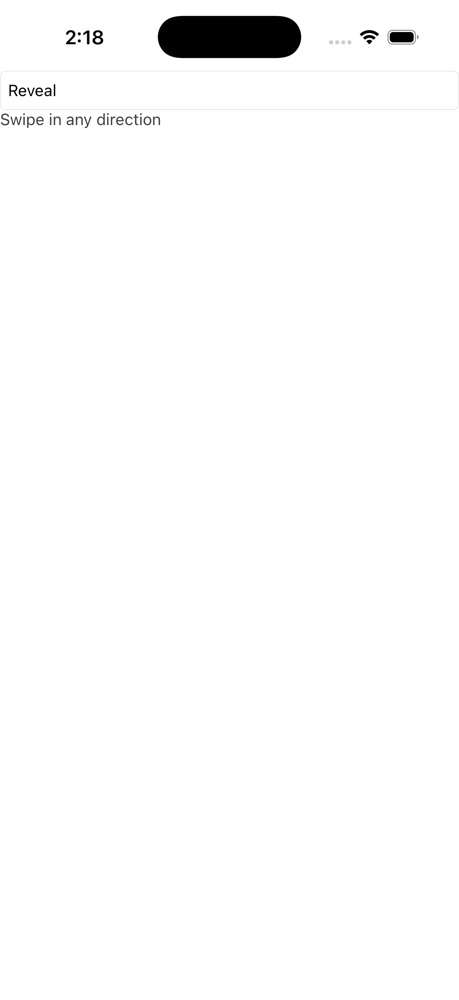</td><td></td><td></td></tr><tr><th>Dark</th><td>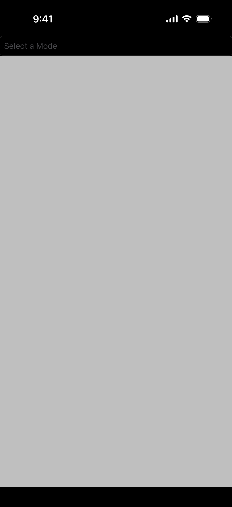</td><td></td><td></td></tr></table>

ports SwipeItemPositionGallery.xaml A code-first port of the MAUI SwipeView sub-gallery Pages/Controls/SwipeViewGalleries/SwipeItemPositionGallery.xaml: a 2-row Grid (Auto / *) with a Picker on top and one SwipeView below that carries TWO S

#### 🟢 Pixel-Perfect Score — C++ (C1/C3)

**Motion:** 🚫 INVALID · `no-scenario` · run 2026-08-14-01_52_22 · 2026-08-14

Light: !! NO MOTION EVIDENCE: neither MAUI nor C++ changed by more than 0.012% of its own frame across the sequence (0 px vs 0 px), on a page the board treats as ANIMATED. NO ACTION SCENARIO EXISTS for this page — docs/comparison/scenarios/swipe_item_position.toml is absent or declares no `action` — so nothing was ever aimed at it and both columns are at rest by construction. This is NOT a port finding and nothing about the port can be concluded from it; the missing artifact is the scenario. 80 of the 139 cells that carried the old 'NOTHING MOVED' banner were this, including 10 of the 14 hard-coded ANIMATED pages. MOTION 9 frames paired by step (run 2026-08-14-01_52_22, commit 74dde0864a, 2026-08-14); 6 frame(s) had no partner and were NOT scored; column frames realigned by -3 sample(s) — a sampling drift, not a defect (see _align) — worst SSIM 1.0000 at frame 1 'gif01333' (0.00% pixels differ), mean SSIM 1.0000; per-frame diff% 0.00/0.00/0.00/0.00/0.00/0.00/0.00/0.00/0.00; self-motion MAUI 0.0000% (0 px) vs C++ 0.0000% (0 px) · Dark: !! NO MOTION EVIDENCE: neither MAUI nor C++ changed by more than 0.012% of its own frame across the sequence (0 px vs 0 px), on a page the board treats as ANIMATED. NO ACTION SCENARIO EXISTS for this page — docs/comparison/scenarios/swipe_item_position.toml is absent or declares no `action` — so nothing was ever aimed at it and both columns are at rest by construction. This is NOT a port finding and nothing about the port can be concluded from it; the missing artifact is the scenario. 80 of the 139 cells that carried the old 'NOTHING MOVED' banner were this, including 10 of the 14 hard-coded ANIMATED pages. MOTION 9 frames paired by step (run 2026-08-14-01_52_22, commit 74dde0864a, 2026-08-14); 6 frame(s) had no partner and were NOT scored; column frames realigned by -3 sample(s) — a sampling drift, not a defect (see _align) — worst SSIM 1.0000 at frame 1 'gif01333' (0.00% pixels differ), mean SSIM 1.0000; per-frame diff% 0.00/0.00/0.00/0.00/0.00/0.00/0.00/0.00/0.00; self-motion MAUI 0.0000% (0 px) vs C++ 0.0000% (0 px)

#### 🟢 Pixel-Perfect Score — C++ &amp; XAML (C2/C4)

**Motion:** 🚫 INVALID · `no-scenario` · run 2026-08-14-01_52_22 · 2026-08-14

Light: !! NO MOTION EVIDENCE: neither MAUI nor C++ &amp; XAML changed by more than 0.012% of its own frame across the sequence (0 px vs 0 px), on a page the board treats as ANIMATED. NO ACTION SCENARIO EXISTS for this page — docs/comparison/scenarios/swipe_item_position.toml is absent or declares no `action` — so nothing was ever aimed at it and both columns are at rest by construction. This is NOT a port finding and nothing about the port can be concluded from it; the missing artifact is the scenario. 80 of the 139 cells that carried the old 'NOTHING MOVED' banner were this, including 10 of the 14 hard-coded ANIMATED pages. MOTION 9 frames paired by step (run 2026-08-14-01_52_22, commit 74dde0864a, 2026-08-14); 6 frame(s) had no partner and were NOT scored; column frames realigned by -3 sample(s) — a sampling drift, not a defect (see _align) — worst SSIM 1.0000 at frame 1 'gif01333' (0.00% pixels differ), mean SSIM 1.0000; per-frame diff% 0.00/0.00/0.00/0.00/0.00/0.00/0.00/0.00/0.00; self-motion MAUI 0.0000% (0 px) vs C++ &amp; XAML 0.0000% (0 px) · Dark: !! NO MOTION EVIDENCE: neither MAUI nor C++ &amp; XAML changed by more than 0.012% of its own frame across the sequence (0 px vs 0 px), on a page the board treats as ANIMATED. NO ACTION SCENARIO EXISTS for this page — docs/comparison/scenarios/swipe_item_position.toml is absent or declares no `action` — so nothing was ever aimed at it and both columns are at rest by construction. This is NOT a port finding and nothing about the port can be concluded from it; the missing artifact is the scenario. 80 of the 139 cells that carried the old 'NOTHING MOVED' banner were this, including 10 of the 14 hard-coded ANIMATED pages. MOTION 9 frames paired by step (run 2026-08-14-01_52_22, commit 74dde0864a, 2026-08-14); 6 frame(s) had no partner and were NOT scored; column frames realigned by -3 sample(s) — a sampling drift, not a defect (see _align) — worst SSIM 1.0000 at frame 1 'gif01333' (0.00% pixels differ), mean SSIM 1.0000; per-frame diff% 0.00/0.00/0.00/0.00/0.00/0.00/0.00/0.00/0.00; self-motion MAUI 0.0000% (0 px) vs C++ &amp; XAML 0.0000% (0 px)

### 152. Swipe Item Size — 🟢/🟢
swipe_item_size

<table><tr><th></th><th>MAUI</th><th>C++</th><th>C++ &amp; XAML</th></tr><tr><th>Light</th><td></td><td></td><td></td></tr><tr><th>Dark</th><td></td><td></td><td></td></tr></table>

ports SwipeItemSizeGallery.xaml A self-contained, code-first port of the .NET MAUI &amp;quot;SwipeItem Size Gallery&amp;quot;: a scrolling stack of swipe_views demonstrating how a left SwipeItem&amp;#x27;s icon size and the SwipeView content size interact

#### 🟢 Pixel-Perfect Score — C++ (C1/C3)

Light: SSIM 1.0000, 0.00% pixels differ · Dark: SSIM 1.0000, 0.00% pixels differ

#### 🟢 Pixel-Perfect Score — C++ &amp; XAML (C2/C4)

Light: SSIM 1.0000, 0.00% pixels differ · Dark: SSIM 1.0000, 0.00% pixels differ

### 153. Swipe Refresh — 🔴/🔴
swipe_refresh

<table><tr><th></th><th>MAUI</th><th>C++</th><th>C++ &amp; XAML</th></tr><tr><th>Light</th><td>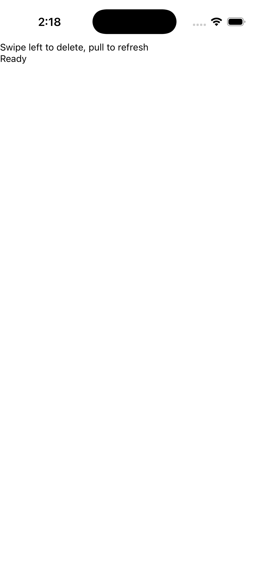</td><td></td><td></td></tr><tr><th>Dark</th><td>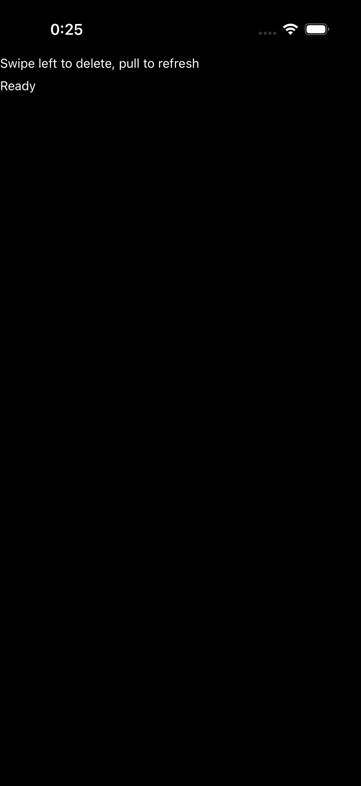</td><td></td><td></td></tr></table>

a self-contained demo page for the W2-20 swipe + refresh controls: a refresh_view wrapping a swipe_view (which itself wraps a labeled row), with a readout label reflecting the latest interaction

#### 🔴 Pixel-Perfect Score — C++ (C1/C3)

**Motion:** ❌ FAIL · `mismatch` · run 2026-08-14-01_52_22 · 2026-08-14

Light: !! MOTION MISMATCH: C++ ANIMATES and MAUI IS FROZEN (1.2897% vs 0.0000% of its own frame changed across the sequence) — the end state may match while the animation does not. MOTION 11 frames paired by step (run 2026-08-14-01_52_22, commit 74dde0864a, 2026-08-14); 4 frame(s) had no partner and were NOT scored — worst SSIM 0.9668 at frame 6 'gif01333' (1.29% pixels differ), mean SSIM 0.9828; per-frame diff% 0.00/0.76/0.00/1.14/1.14/1.29/1.05/0.76/0.76/0.76/0.08; self-motion MAUI 0.0000% (0 px) vs C++ 1.2897% (40783 px) · Dark: !! MOTION MISMATCH: C++ ANIMATES and MAUI IS FROZEN (1.2473% vs 0.0000% of its own frame changed across the sequence) — the end state may match while the animation does not. MOTION 11 frames paired by step (run 2026-08-14-01_52_22, commit 74dde0864a, 2026-08-14); 4 frame(s) had no partner and were NOT scored — worst SSIM 0.9669 at frame 6 'gif01333' (1.25% pixels differ), mean SSIM 0.9813; per-frame diff% 0.00/0.76/0.00/1.19/1.19/1.25/1.10/0.76/0.76/0.76/0.76; self-motion MAUI 0.0000% (0 px) vs C++ 1.2473% (39441 px)

#### 🔴 Pixel-Perfect Score — C++ &amp; XAML (C2/C4)

**Motion:** ❌ FAIL · `mismatch` · run 2026-08-14-01_52_22 · 2026-08-14

Light: !! MOTION MISMATCH: C++ &amp; XAML ANIMATES and MAUI IS FROZEN (1.2425% vs 0.0000% of its own frame changed across the sequence) — the end state may match while the animation does not. MOTION 13 frames paired by step (run 2026-08-14-01_52_22, commit 74dde0864a, 2026-08-14); 2 frame(s) had no partner and were NOT scored — worst SSIM 0.9683 at frame 7 'gif01667' (1.24% pixels differ), mean SSIM 0.9768; per-frame diff% 0.00/1.22/0.00/1.14/1.14/1.23/1.24/1.22/1.22/1.22/0.56/0.56/0.56; self-motion MAUI 0.0000% (0 px) vs C++ &amp; XAML 1.2425% (39290 px) · Dark: !! MOTION MISMATCH: C++ &amp; XAML ANIMATES and MAUI IS FROZEN (1.2974% vs 0.0000% of its own frame changed across the sequence) — the end state may match while the animation does not. MOTION 13 frames paired by step (run 2026-08-14-01_52_22, commit 74dde0864a, 2026-08-14); 2 frame(s) had no partner and were NOT scored — worst SSIM 0.9671 at frame 7 'gif01667' (1.30% pixels differ), mean SSIM 0.9753; per-frame diff% 0.00/1.22/0.00/1.18/1.18/1.22/1.30/1.28/1.21/1.27/0.56/0.56/0.56; self-motion MAUI 0.0000% (0 px) vs C++ &amp; XAML 1.2974% (41027 px)

### 154. Swipe Threshold — 🟢/🟢
swipe_threshold

<table><tr><th></th><th>MAUI</th><th>C++</th><th>C++ &amp; XAML</th></tr><tr><th>Light</th><td></td><td></td><td></td></tr><tr><th>Dark</th><td></td><td></td><td></td></tr></table>

ports HorizontalSwipeThresholdGallery.xaml (+ .xaml.cs) The MAUI HorizontalSwipeThresholdGallery shows how SwipeView.Threshold (the swipe distance, in DIPs, the user must drag before the items settle open / execute) interacts with SwipeItem

#### 🟢 Pixel-Perfect Score — C++ (C1/C3)

Light: SSIM 1.0000, 0.00% pixels differ · Dark: SSIM 1.0000, 0.00% pixels differ

#### 🟢 Pixel-Perfect Score — C++ &amp; XAML (C2/C4)

Light: SSIM 1.0000, 0.00% pixels differ · Dark: SSIM 1.0000, 0.00% pixels differ

### 155. Swipe View Margin — 🟢/🟢
swipe_view_margin

<table><tr><th></th><th>MAUI</th><th>C++</th><th>C++ &amp; XAML</th></tr><tr><th>Light</th><td></td><td></td><td></td></tr><tr><th>Dark</th><td></td><td></td><td></td></tr></table>

ports SwipeViewMarginGallery.xaml A self-contained, code-first port of the .NET MAUI &amp;quot;SwipeView Margin Gallery&amp;quot;: two swipe_views whose content&amp;#x27;s Margin + Padding are driven by two sliders, demonstrating that the revealed SwipeItems stay cor

#### 🟢 Pixel-Perfect Score — C++ (C1/C3)

Light: SSIM 1.0000, 0.00% pixels differ · Dark: SSIM 1.0000, 0.00% pixels differ

#### 🟢 Pixel-Perfect Score — C++ &amp; XAML (C2/C4)

Light: SSIM 1.0000, 0.00% pixels differ · Dark: SSIM 1.0000, 0.00% pixels differ

### 156. Swipe View Shadow — 🟢/🟢
swipe_view_shadow

<table><tr><th></th><th>MAUI</th><th>C++</th><th>C++ &amp; XAML</th></tr><tr><th>Light</th><td></td><td></td><td></td></tr><tr><th>Dark</th><td></td><td></td><td></td></tr></table>

ports SwipeViewShadowGallery.xaml A code-first port of the MAUI SwipeView sub-gallery Pages/Controls/SwipeViewGalleries/SwipeViewShadowGallery.xaml: a padded vertical StackLayout proving a drop Shadow renders correctly on SwipeView content

#### 🟢 Pixel-Perfect Score — C++ (C1/C3)

Light: SSIM 0.9991, 0.01% pixels differ · Dark: SSIM 1.0000, 0.00% pixels differ

#### 🟢 Pixel-Perfect Score — C++ &amp; XAML (C2/C4)

Light: SSIM 1.0000, 0.01% pixels differ · Dark: SSIM 1.0000, 0.00% pixels differ

### 157. Switch — 🟢/🟢
switch

<table><tr><th></th><th>MAUI</th><th>C++</th><th>C++ &amp; XAML</th></tr><tr><th>Light</th><td></td><td></td><td></td></tr><tr><th>Dark</th><td></td><td></td><td></td></tr></table>

ports SwitchPage.xaml (+ .xaml.cs) Mirrors the MAUI gallery page: a vertical stack of headlined Switch states — Default, BackgroundColor (Blue), Background (a yellow→green LinearGradientBrush), Disabled, OnColor (Red), ThumbColor (Orange)

#### 🟢 Pixel-Perfect Score — C++ (C1/C3)

**Motion:** ✅ PASS · run 2026-08-14-01_52_22 · 2026-08-14

Light: MOTION 2 frames paired by step (run 2026-08-14-01_52_22, commit 74dde0864a, 2026-08-14) — worst SSIM 0.9985 at frame 1 'initial' (0.22% pixels differ), mean SSIM 0.9985; per-frame diff% 0.22/0.22; self-motion MAUI 0.3908% (12358 px) vs C++ 0.3908% (12358 px) · Dark: MOTION 2 frames paired by step (run 2026-08-14-01_52_22, commit 74dde0864a, 2026-08-14) — worst SSIM 0.9997 at frame 1 'initial' (0.22% pixels differ), mean SSIM 0.9997; per-frame diff% 0.22/0.22; self-motion MAUI 0.3906% (12350 px) vs C++ 0.3907% (12354 px)

#### 🟢 Pixel-Perfect Score — C++ &amp; XAML (C2/C4)

**Motion:** ✅ PASS · run 2026-08-14-01_52_22 · 2026-08-14

Light: MOTION 2 frames paired by step (run 2026-08-14-01_52_22, commit 74dde0864a, 2026-08-14) — worst SSIM 0.9985 at frame 1 'initial' (0.22% pixels differ), mean SSIM 0.9985; per-frame diff% 0.22/0.22; self-motion MAUI 0.3908% (12358 px) vs C++ &amp; XAML 0.3908% (12358 px) · Dark: MOTION 2 frames paired by step (run 2026-08-14-01_52_22, commit 74dde0864a, 2026-08-14) — worst SSIM 0.9997 at frame 1 'initial' (0.22% pixels differ), mean SSIM 0.9997; per-frame diff% 0.22/0.22; self-motion MAUI 0.3906% (12350 px) vs C++ &amp; XAML 0.3907% (12354 px)

### 158. Switch Grouping — 🟢/🟢
switch_grouping

<table><tr><th></th><th>MAUI</th><th>C++</th><th>C++ &amp; XAML</th></tr><tr><th>Light</th><td></td><td></td><td></td></tr><tr><th>Dark</th><td></td><td></td><td></td></tr></table>

ports CollectionViewGalleries/GroupingGalleries/ SwitchGrouping.xaml (+ .xaml.cs) of the C# CollectionView gallery

#### 🟢 Pixel-Perfect Score — C++ (C1/C3)

Light: SSIM 1.0000, 0.00% pixels differ · Dark: SSIM 1.0000, 0.00% pixels differ

#### 🟢 Pixel-Perfect Score — C++ &amp; XAML (C2/C4)

Light: SSIM 1.0000, 0.00% pixels differ · Dark: SSIM 1.0000, 0.00% pixels differ

### 159. Tabbed Flyout — 🟢/🟢
tabbed_flyout

<table><tr><th></th><th>MAUI</th><th>C++</th><th>C++ &amp; XAML</th></tr><tr><th>Light</th><td></td><td></td><td></td></tr><tr><th>Dark</th><td></td><td></td><td></td></tr></table>

a self-contained demo page for the W1-10 tabbed + flyout vertical: a flyout_page whose FLYOUT pane is a titled menu (two buttons selecting the detail&amp;#x27;s tabs + a &amp;quot;Toggle flyout&amp;quot; presenting/dismissing itself) and whose DETAIL pane is a tabbed

#### 🟢 Pixel-Perfect Score — C++ (C1/C3)

Light: SSIM 1.0000, 0.00% pixels differ · Dark: SSIM 1.0000, 0.00% pixels differ

#### 🟢 Pixel-Perfect Score — C++ &amp; XAML (C2/C4)

Light: SSIM 1.0000, 0.00% pixels differ · Dark: SSIM 1.0000, 0.00% pixels differ

### 160. Templated View — 🟢/🟢
templated_view

<table><tr><th></th><th>MAUI</th><th>C++</th><th>C++ &amp; XAML</th></tr><tr><th>Light</th><td></td><td></td><td></td></tr><tr><th>Dark</th><td></td><td></td><td></td></tr></table>

ports TemplatedViewPage.xaml The C# page contrasts a standard CardView control with a compact one driven by a ControlTemplate (&amp;quot;CardViewCompressed&amp;quot;) and a custom Rate control built entirely from a ControlTemplate + a heart PathGeometry

#### 🟢 Pixel-Perfect Score — C++ (C1/C3)

Light: SSIM 1.0000, 0.00% pixels differ · Dark: SSIM 1.0000, 0.00% pixels differ

#### 🟢 Pixel-Perfect Score — C++ &amp; XAML (C2/C4)

Light: SSIM 1.0000, 0.00% pixels differ · Dark: SSIM 1.0000, 0.00% pixels differ

### 161. Time Picker — 🟢/🟢
time_picker

<table><tr><th></th><th>MAUI</th><th>C++</th><th>C++ &amp; XAML</th></tr><tr><th>Light</th><td></td><td></td><td></td></tr><tr><th>Dark</th><td></td><td></td><td></td></tr></table>

ports TimePickerPage.xaml (+ TimePickerPage.xaml.cs)

#### 🟢 Pixel-Perfect Score — C++ (C1/C3)

Light: SSIM 0.9864, 0.64% pixels differ · Dark: SSIM 0.9864, 0.65% pixels differ

#### 🟢 Pixel-Perfect Score — C++ &amp; XAML (C2/C4)

Light: SSIM 0.9875, 0.62% pixels differ · Dark: SSIM 0.9875, 0.63% pixels differ

### 162. Title Bar — 🟢/🟢
title_bar

<table><tr><th></th><th>MAUI</th><th>C++</th><th>C++ &amp; XAML</th></tr><tr><th>Light</th><td></td><td></td><td></td></tr><tr><th>Dark</th><td></td><td></td><td></td></tr></table>

ports TitleBarPage.xaml A self-contained, code-first demo of the TitleBar control

#### 🟢 Pixel-Perfect Score — C++ (C1/C3)

**Motion:** ✅ PASS · run 2026-08-14-01_52_22 · 2026-08-14

Light: MOTION 2 frames paired by step (run 2026-08-14-01_52_22, commit 74dde0864a, 2026-08-14) — worst SSIM 1.0000 at frame 1 'initial' (0.00% pixels differ), mean SSIM 1.0000; per-frame diff% 0.00/0.00; self-motion MAUI 0.5600% (17709 px) vs C++ 0.5600% (17709 px) · Dark: MOTION 2 frames paired by step (run 2026-08-14-01_52_22, commit 74dde0864a, 2026-08-14) — worst SSIM 1.0000 at frame 1 'initial' (0.00% pixels differ), mean SSIM 1.0000; per-frame diff% 0.00/0.00; self-motion MAUI 0.5600% (17709 px) vs C++ 0.5600% (17709 px)

#### 🟢 Pixel-Perfect Score — C++ &amp; XAML (C2/C4)

**Motion:** ✅ PASS · run 2026-08-14-01_52_22 · 2026-08-14

Light: MOTION 2 frames paired by step (run 2026-08-14-01_52_22, commit 74dde0864a, 2026-08-14) — worst SSIM 1.0000 at frame 1 'initial' (0.00% pixels differ), mean SSIM 1.0000; per-frame diff% 0.00/0.00; self-motion MAUI 0.5600% (17709 px) vs C++ &amp; XAML 0.5600% (17709 px) · Dark: MOTION 2 frames paired by step (run 2026-08-14-01_52_22, commit 74dde0864a, 2026-08-14) — worst SSIM 1.0000 at frame 1 'initial' (0.00% pixels differ), mean SSIM 1.0000; per-frame diff% 0.00/0.00; self-motion MAUI 0.5600% (17709 px) vs C++ &amp; XAML 0.5600% (17709 px)

### 163. Toolbar — 🟢/🟢
toolbar

<table><tr><th></th><th>MAUI</th><th>C++</th><th>C++ &amp; XAML</th></tr><tr><th>Light</th><td></td><td></td><td></td></tr><tr><th>Dark</th><td></td><td></td><td></td></tr></table>

ports ToolbarPage.xaml (Maui.Controls.Sample.Pages.ToolbarPage)

#### 🟢 Pixel-Perfect Score — C++ (C1/C3)

Light: SSIM 1.0000, 0.00% pixels differ · Dark: SSIM 1.0000, 0.00% pixels differ

#### 🟢 Pixel-Perfect Score — C++ &amp; XAML (C2/C4)

Light: SSIM 1.0000, 0.00% pixels differ · Dark: SSIM 1.0000, 0.00% pixels differ

### 164. Transform Playground — 🟢/🟢
transform_playground

<table><tr><th></th><th>MAUI</th><th>C++</th><th>C++ &amp; XAML</th></tr><tr><th>Light</th><td></td><td></td><td></td></tr><tr><th>Dark</th><td></td><td></td><td></td></tr></table>

ports TransformPlaygroundGallery.xaml A code-first port of the MAUI Shapes sub-gallery Pages/Controls/ShapesGalleries/TransformPlaygroundGallery.xaml: a 50x50 Path rectangle (red fill, blue stroke 4) sits in a 200x200 light-grey panel; belo

#### 🟢 Pixel-Perfect Score — C++ (C1/C3)

Light: SSIM 0.9968, 0.22% pixels differ · Dark: SSIM 0.9968, 0.22% pixels differ

#### 🟢 Pixel-Perfect Score — C++ &amp; XAML (C2/C4)

Light: SSIM 1.0000, 0.00% pixels differ · Dark: SSIM 1.0000, 0.00% pixels differ

### 165. Transformations — 🟢/🟢
transformations

<table><tr><th></th><th>MAUI</th><th>C++</th><th>C++ &amp; XAML</th></tr><tr><th>Light</th><td></td><td></td><td></td></tr><tr><th>Dark</th><td></td><td></td><td></td></tr></table>

ports TransformationsPage.xaml (+ .xaml.cs) The MAUI TransformationsPage drives a single target view&amp;#x27;s render transforms from a column of knobs: Sliders for Scale / ScaleX / ScaleY (Maximum 10) and Rotation / RotationX / RotationY (Maximum

#### 🟢 Pixel-Perfect Score — C++ (C1/C3)

Light: SSIM 1.0000, 0.00% pixels differ · Dark: SSIM 1.0000, 0.00% pixels differ

#### 🟢 Pixel-Perfect Score — C++ &amp; XAML (C2/C4)

Light: SSIM 1.0000, 0.00% pixels differ · Dark: SSIM 1.0000, 0.00% pixels differ

### 166. Triggers — 🟢/🟢
triggers

<table><tr><th></th><th>MAUI</th><th>C++</th><th>C++ &amp; XAML</th></tr><tr><th>Light</th><td></td><td></td><td></td></tr><tr><th>Dark</th><td></td><td></td><td></td></tr></table>

ports TriggersPage.xaml

#### 🟢 Pixel-Perfect Score — C++ (C1/C3)

Light: SSIM 1.0000, 0.00% pixels differ · Dark: SSIM 1.0000, 0.00% pixels differ

#### 🟢 Pixel-Perfect Score — C++ &amp; XAML (C2/C4)

Light: SSIM 1.0000, 0.00% pixels differ · Dark: SSIM 1.0000, 0.00% pixels differ

### 167. Update Path Data — 🟢/🟢
update_path_data

<table><tr><th></th><th>MAUI</th><th>C++</th><th>C++ &amp; XAML</th></tr><tr><th>Light</th><td></td><td></td><td></td></tr><tr><th>Dark</th><td></td><td></td><td></td></tr></table>

ports UpdatePathDataGallery.xaml A code-first port of the MAUI Shapes sub-gallery Pages/Controls/ShapesGalleries/UpdatePathDataGallery.xaml: a 2-row Grid (RowSpacing 0) that proves a Path repaints when its Data geometry is replaced at runti

#### 🟢 Pixel-Perfect Score — C++ (C1/C3)

Light: SSIM 1.0000, 0.00% pixels differ · Dark: SSIM 1.0000, 0.00% pixels differ

#### 🟢 Pixel-Perfect Score — C++ &amp; XAML (C2/C4)

Light: SSIM 1.0000, 0.00% pixels differ · Dark: SSIM 1.0000, 0.00% pixels differ

### 168. Varied Size Selector — 🟢/🟢
varied_size_selector

<table><tr><th></th><th>MAUI</th><th>C++</th><th>C++ &amp; XAML</th></tr><tr><th>Light</th><td></td><td></td><td></td></tr><tr><th>Dark</th><td></td><td></td><td></td></tr></table>

ports DataTemplateSelectorGalleries/VariedSizeDataTemplateSelectorGallery.xaml (+ VariedSizeDataTemplateSelectorGallery.xaml.cs) of the C# CollectionView gallery

#### 🟢 Pixel-Perfect Score — C++ (C1/C3)

Light: SSIM 0.9990, 0.00% pixels differ · Dark: SSIM 0.9982, 0.57% pixels differ

#### 🟢 Pixel-Perfect Score — C++ &amp; XAML (C2/C4)

Light: SSIM 0.9990, 0.00% pixels differ · Dark: SSIM 0.9982, 0.57% pixels differ

### 169. Vertical Stack — 🟢/🟢
vertical_stack

<table><tr><th></th><th>MAUI</th><th>C++</th><th>C++ &amp; XAML</th></tr><tr><th>Light</th><td></td><td></td><td></td></tr><tr><th>Dark</th><td></td><td></td><td></td></tr></table>

Vertical Stack

#### 🟢 Pixel-Perfect Score — C++ (C1/C3)

Light: SSIM 1.0000, 0.00% pixels differ · Dark: SSIM 1.0000, 0.00% pixels differ

#### 🟢 Pixel-Perfect Score — C++ &amp; XAML (C2/C4)

Light: SSIM 1.0000, 0.00% pixels differ · Dark: SSIM 1.0000, 0.00% pixels differ

### 170. Visual States — 🟢/🟢
visual_states

<table><tr><th></th><th>MAUI</th><th>C++</th><th>C++ &amp; XAML</th></tr><tr><th>Light</th><td></td><td></td><td></td></tr><tr><th>Dark</th><td></td><td></td><td></td></tr></table>

ports VisualStatesPage.xaml

#### 🟢 Pixel-Perfect Score — C++ (C1/C3)

Light: SSIM 1.0000, 0.00% pixels differ · Dark: SSIM 1.0000, 0.00% pixels differ

#### 🟢 Pixel-Perfect Score — C++ &amp; XAML (C2/C4)

Light: SSIM 1.0000, 0.00% pixels differ · Dark: SSIM 1.0000, 0.00% pixels differ

### 171. Web View — 🟢/🟢
web_view

<table><tr><th></th><th>MAUI</th><th>C++</th><th>C++ &amp; XAML</th></tr><tr><th>Light</th><td></td><td></td><td></td></tr><tr><th>Dark</th><td></td><td></td><td></td></tr></table>

a self-contained demo page for the W1-08 web_view vertical: a web_view loading a STATIC html_web_view_source (no network), back/forward/reload buttons over the handler-pushed CanGoBack/CanGoForward read-onlys, an &amp;quot;Eval 1+1&amp;quot; button driving t

#### 🟢 Pixel-Perfect Score — C++ (C1/C3)

Light: SSIM 0.9915, 0.30% pixels differ · Dark: SSIM 0.9914, 0.30% pixels differ

#### 🟢 Pixel-Perfect Score — C++ &amp; XAML (C2/C4)

Light: SSIM 0.9846, 0.55% pixels differ · Dark: SSIM 0.9846, 0.55% pixels differ

### 172. Z Index — 🟢/🟢
z_index

<table><tr><th></th><th>MAUI</th><th>C++</th><th>C++ &amp; XAML</th></tr><tr><th>Light</th><td></td><td></td><td></td></tr><tr><th>Dark</th><td></td><td></td><td></td></tr></table>

ports ZIndexPage.xaml (+ ZIndexPage.xaml.cs), code-first

#### 🟢 Pixel-Perfect Score — C++ (C1/C3)

Light: SSIM 1.0000, 0.00% pixels differ · Dark: SSIM 1.0000, 0.00% pixels differ

#### 🟢 Pixel-Perfect Score — C++ &amp; XAML (C2/C4)

Light: SSIM 1.0000, 0.00% pixels differ · Dark: SSIM 1.0000, 0.00% pixels differ

<h2>macOS (172 examples) — click to expand</h2>

.NET MAUI on macOS **is** Mac Catalyst (UIKit) — the MAUI / C++ / C++&amp;XAML columns are the strict parity board. The **AppKit** columns are the native-NSView backend (no MAUI reference; they track completeness, C++ == C++&amp;XAML).

**Discrepancy counts** (MAUI-vs-C++ parity verdicts from the deterministic pixel-perfect score — SSIM + per-pixel diff; AI-based review has been invalidated/removed):

| Classification | Pixel-Perfect Score — C++ (C1/C3) | Pixel-Perfect Score — C++ &amp; XAML (C2/C4) |
| --- | --- | --- |
| 🟢 Match | 156 | 157 |
| 🟡 Minor | 12 | 13 |
| 🔴 Major | 4 | 2 |
| ⬛ Blank | 0 | 0 |
| ⏳ Unreviewed | 0 | 0 |

### 1. Absolute Layout — 🟢/🟢
absolute_layout

<table><tr><th></th><th>MAUI</th><th>C++</th><th>C++ &amp; XAML</th><th>AppKit / C++</th><th>AppKit / C++ &amp; XAML</th></tr><tr><th>Light</th><td></td><td></td><td></td><td></td><td></td></tr><tr><th>Dark</th><td></td><td></td><td></td><td></td><td></td></tr></table>

ports AbsoluteLayoutPage.xaml A self-contained, code-first demo of the AbsoluteLayout control

#### 🟢 Pixel-Perfect Score — C++ (C1/C3)

Light: SSIM 0.9947, 0.26% pixels differ · Dark: SSIM 0.9960, 0.27% pixels differ

#### 🟢 Pixel-Perfect Score — C++ &amp; XAML (C2/C4)

Light: SSIM 0.9965, 0.12% pixels differ · Dark: SSIM 0.9966, 0.11% pixels differ

### 2. Activity Indicator — 🟢/🟢
activity_indicator

<table><tr><th></th><th>MAUI</th><th>C++</th><th>C++ &amp; XAML</th><th>AppKit / C++</th><th>AppKit / C++ &amp; XAML</th></tr><tr><th>Light</th><td></td><td></td><td></td><td></td><td></td></tr><tr><th>Dark</th><td></td><td></td><td></td><td></td><td></td></tr></table>

ports ActivityIndicatorPage.xaml (+ ActivityIndicatorPage.xaml.cs)

#### 🟢 Pixel-Perfect Score — C++ (C1/C3)

**Motion:** ✅ PASS · run 2026-08-13-21_07_16 · 2026-08-13

Light: MOTION 12 frames paired by step (run 2026-08-13-21_07_16, commit 74dde0864a, 2026-08-13) — worst SSIM 0.9975 at frame 9 'gif09' (0.09% pixels differ), mean SSIM 0.9977; per-frame diff% 0.09/0.09/0.09/0.09/0.09/0.09/0.09/0.09/0.09/0.09/0.09/0.09; self-motion MAUI 0.0356% (292 px) vs C++ 0.0339% (278 px) · Dark: MOTION 10 frames paired by step (run 2026-08-13-21_07_16, commit 74dde0864a, 2026-08-13); 4 frame(s) had no partner and were NOT scored; column frames realigned by +2 sample(s) — a sampling drift, not a defect (see _align) — worst SSIM 0.9976 at frame 1 'gif01' (0.09% pixels differ), mean SSIM 0.9977; per-frame diff% 0.09/0.08/0.08/0.09/0.08/0.09/0.08/0.08/0.09/0.09; self-motion MAUI 0.0367% (301 px) vs C++ 0.0409% (335 px)

#### 🟢 Pixel-Perfect Score — C++ &amp; XAML (C2/C4)

**Motion:** ✅ PASS · run 2026-08-13-21_07_16 · 2026-08-13

Light: MOTION 9 frames paired by step (run 2026-08-13-21_07_16, commit 74dde0864a, 2026-08-13); 6 frame(s) had no partner and were NOT scored; column frames realigned by +3 sample(s) — a sampling drift, not a defect (see _align) — worst SSIM 0.9962 at frame 1 'gif01' (0.13% pixels differ), mean SSIM 0.9963; per-frame diff% 0.13/0.13/0.13/0.12/0.13/0.13/0.13/0.12/0.13; self-motion MAUI 0.0356% (292 px) vs C++ &amp; XAML 0.0289% (237 px) · Dark: MOTION 10 frames paired by step (run 2026-08-13-21_07_16, commit 74dde0864a, 2026-08-13); 4 frame(s) had no partner and were NOT scored; column frames realigned by +2 sample(s) — a sampling drift, not a defect (see _align) — worst SSIM 0.9961 at frame 2 'gif02' (0.15% pixels differ), mean SSIM 0.9963; per-frame diff% 0.14/0.15/0.15/0.14/0.12/0.12/0.11/0.11/0.12/0.11; self-motion MAUI 0.0367% (301 px) vs C++ &amp; XAML 0.0409% (335 px)

### 3. Adaptive Collection — 🟢/🟢
adaptive_collection

<table><tr><th></th><th>MAUI</th><th>C++</th><th>C++ &amp; XAML</th><th>AppKit / C++</th><th>AppKit / C++ &amp; XAML</th></tr><tr><th>Light</th><td></td><td></td><td></td><td></td><td></td></tr><tr><th>Dark</th><td></td><td></td><td></td><td></td><td></td></tr></table>

ports AdaptiveCollectionView.xaml (+ .xaml.cs) (Maui.Controls.Sample.Pages.CollectionViewGalleries.AdaptiveCollectionView)

#### 🟢 Pixel-Perfect Score — C++ (C1/C3)

Light: SSIM 0.9970, 0.19% pixels differ · Dark: SSIM 0.9970, 0.18% pixels differ

#### 🟢 Pixel-Perfect Score — C++ &amp; XAML (C2/C4)

Light: SSIM 0.9965, 0.12% pixels differ · Dark: SSIM 0.9966, 0.11% pixels differ

### 4. Alerts — 🟢/🟢
alerts

<table><tr><th></th><th>MAUI</th><th>C++</th><th>C++ &amp; XAML</th><th>AppKit / C++</th><th>AppKit / C++ &amp; XAML</th></tr><tr><th>Light</th><td></td><td></td><td></td><td></td><td></td></tr><tr><th>Dark</th><td></td><td></td><td></td><td></td><td></td></tr></table>

ports AlertsPage.xaml (+ AlertsPage.xaml.cs) The C# AlertsPage drives the three Page dialog services — DisplayAlertAsync (simple OK + Yes/No), DisplayActionSheetAsync (simple + Cancel/Delete), and DisplayPromptAsync (two questions) — from a

#### 🟢 Pixel-Perfect Score — C++ (C1/C3)

Light: SSIM 0.9978, 0.09% pixels differ · Dark: SSIM 0.9978, 0.08% pixels differ

#### 🟢 Pixel-Perfect Score — C++ &amp; XAML (C2/C4)

Light: SSIM 0.9965, 0.12% pixels differ · Dark: SSIM 0.9966, 0.11% pixels differ

### 5. Alignment — 🟢/🟢
alignment

<table><tr><th></th><th>MAUI</th><th>C++</th><th>C++ &amp; XAML</th><th>AppKit / C++</th><th>AppKit / C++ &amp; XAML</th></tr><tr><th>Light</th><td></td><td></td><td></td><td></td><td></td></tr><tr><th>Dark</th><td></td><td></td><td></td><td></td><td></td></tr></table>

a faithful reproduction of the maui-compare &amp;quot;alignment&amp;quot; demo (ComparePages.Alignment()), the shipped-.NET-MAUI reference for the visual-parity comparison

#### 🟢 Pixel-Perfect Score — C++ (C1/C3)

Light: SSIM 0.9970, 0.26% pixels differ · Dark: SSIM 0.9976, 0.21% pixels differ

#### 🟢 Pixel-Perfect Score — C++ &amp; XAML (C2/C4)

Light: SSIM 0.9957, 0.30% pixels differ · Dark: SSIM 0.9963, 0.25% pixels differ

### 6. Animation — 🟢/🟢
animation

<table><tr><th></th><th>MAUI</th><th>C++</th><th>C++ &amp; XAML</th><th>AppKit / C++</th><th>AppKit / C++ &amp; XAML</th></tr><tr><th>Light</th><td></td><td></td><td></td><td></td><td></td></tr><tr><th>Dark</th><td></td><td></td><td></td><td></td><td></td></tr></table>

ports AnimationPage.xaml (+ AnimationPage.xaml.cs)

#### 🟢 Pixel-Perfect Score — C++ (C1/C3)

**Motion:** 🚫 INVALID · `no-scenario` · run 2026-08-13-21_07_16 · 2026-08-13

Light: !! NO MOTION EVIDENCE: neither MAUI nor C++ changed by more than 0.012% of its own frame across the sequence (0 px vs 0 px), on a page the board treats as ANIMATED. NO ACTION SCENARIO EXISTS for this page — docs/comparison/scenarios/animation.toml is absent or declares no `action` — so nothing was ever aimed at it and both columns are at rest by construction. This is NOT a port finding and nothing about the port can be concluded from it; the missing artifact is the scenario. 80 of the 139 cells that carried the old 'NOTHING MOVED' banner were this, including 10 of the 14 hard-coded ANIMATED pages. MOTION 9 frames paired by step (run 2026-08-13-21_07_16, commit 74dde0864a, 2026-08-13); 6 frame(s) had no partner and were NOT scored; column frames realigned by -3 sample(s) — a sampling drift, not a defect (see _align) — worst SSIM 0.9978 at frame 1 'gif04' (0.09% pixels differ), mean SSIM 0.9978; per-frame diff% 0.09/0.09/0.09/0.09/0.09/0.09/0.09/0.09/0.09; self-motion MAUI 0.0000% (0 px) vs C++ 0.0000% (0 px) · Dark: !! NO MOTION EVIDENCE: neither MAUI nor C++ changed by more than 0.012% of its own frame across the sequence (0 px vs 0 px), on a page the board treats as ANIMATED. NO ACTION SCENARIO EXISTS for this page — docs/comparison/scenarios/animation.toml is absent or declares no `action` — so nothing was ever aimed at it and both columns are at rest by construction. This is NOT a port finding and nothing about the port can be concluded from it; the missing artifact is the scenario. 80 of the 139 cells that carried the old 'NOTHING MOVED' banner were this, including 10 of the 14 hard-coded ANIMATED pages. MOTION 9 frames paired by step (run 2026-08-13-21_07_16, commit 74dde0864a, 2026-08-13); 6 frame(s) had no partner and were NOT scored; column frames realigned by -3 sample(s) — a sampling drift, not a defect (see _align) — worst SSIM 0.9978 at frame 1 'gif04' (0.08% pixels differ), mean SSIM 0.9978; per-frame diff% 0.08/0.08/0.08/0.08/0.08/0.08/0.08/0.08/0.08; self-motion MAUI 0.0000% (0 px) vs C++ 0.0000% (0 px)

#### 🟢 Pixel-Perfect Score — C++ &amp; XAML (C2/C4)

**Motion:** 🚫 INVALID · `no-scenario` · run 2026-08-13-21_07_16 · 2026-08-13

Light: !! NO MOTION EVIDENCE: neither MAUI nor C++ &amp; XAML changed by more than 0.012% of its own frame across the sequence (0 px vs 0 px), on a page the board treats as ANIMATED. NO ACTION SCENARIO EXISTS for this page — docs/comparison/scenarios/animation.toml is absent or declares no `action` — so nothing was ever aimed at it and both columns are at rest by construction. This is NOT a port finding and nothing about the port can be concluded from it; the missing artifact is the scenario. 80 of the 139 cells that carried the old 'NOTHING MOVED' banner were this, including 10 of the 14 hard-coded ANIMATED pages. MOTION 9 frames paired by step (run 2026-08-13-21_07_16, commit 74dde0864a, 2026-08-13); 6 frame(s) had no partner and were NOT scored; column frames realigned by -3 sample(s) — a sampling drift, not a defect (see _align) — worst SSIM 0.9965 at frame 1 'gif04' (0.12% pixels differ), mean SSIM 0.9965; per-frame diff% 0.12/0.12/0.12/0.12/0.12/0.12/0.12/0.12/0.12; self-motion MAUI 0.0000% (0 px) vs C++ &amp; XAML 0.0000% (0 px) · Dark: !! NO MOTION EVIDENCE: neither MAUI nor C++ &amp; XAML changed by more than 0.012% of its own frame across the sequence (0 px vs 0 px), on a page the board treats as ANIMATED. NO ACTION SCENARIO EXISTS for this page — docs/comparison/scenarios/animation.toml is absent or declares no `action` — so nothing was ever aimed at it and both columns are at rest by construction. This is NOT a port finding and nothing about the port can be concluded from it; the missing artifact is the scenario. 80 of the 139 cells that carried the old 'NOTHING MOVED' banner were this, including 10 of the 14 hard-coded ANIMATED pages. MOTION 9 frames paired by step (run 2026-08-13-21_07_16, commit 74dde0864a, 2026-08-13); 6 frame(s) had no partner and were NOT scored; column frames realigned by -3 sample(s) — a sampling drift, not a defect (see _align) — worst SSIM 0.9966 at frame 1 'gif04' (0.11% pixels differ), mean SSIM 0.9966; per-frame diff% 0.11/0.11/0.11/0.11/0.11/0.11/0.11/0.11/0.11; self-motion MAUI 0.0000% (0 px) vs C++ &amp; XAML 0.0000% (0 px)

### 7. App Theme Binding — 🟢/🟢
app_theme_binding

<table><tr><th></th><th>MAUI</th><th>C++</th><th>C++ &amp; XAML</th><th>AppKit / C++</th><th>AppKit / C++ &amp; XAML</th></tr><tr><th>Light</th><td></td><td></td><td></td><td></td><td></td></tr><tr><th>Dark</th><td></td><td></td><td></td><td></td><td></td></tr></table>

ports AppThemeBindingPage.xaml

#### 🟢 Pixel-Perfect Score — C++ (C1/C3)

Light: SSIM 0.9978, 0.09% pixels differ · Dark: SSIM 0.9978, 0.08% pixels differ

#### 🟢 Pixel-Perfect Score — C++ &amp; XAML (C2/C4)

Light: SSIM 0.9965, 0.12% pixels differ · Dark: SSIM 0.9966, 0.11% pixels differ

### 8. Application Control — 🟢/🟢
application_control

<table><tr><th></th><th>MAUI</th><th>C++</th><th>C++ &amp; XAML</th><th>AppKit / C++</th><th>AppKit / C++ &amp; XAML</th></tr><tr><th>Light</th><td></td><td></td><td></td><td></td><td></td></tr><tr><th>Dark</th><td></td><td></td><td></td><td></td><td></td></tr></table>

ports ApplicationControlPage.xaml (+ .xaml.cs)

#### 🟢 Pixel-Perfect Score — C++ (C1/C3)

Light: SSIM 0.9978, 0.09% pixels differ · Dark: SSIM 0.9978, 0.08% pixels differ

#### 🟢 Pixel-Perfect Score — C++ &amp; XAML (C2/C4)

Light: SSIM 0.9965, 0.12% pixels differ · Dark: SSIM 0.9966, 0.11% pixels differ

### 9. Auto Size Shapes — 🟢/🟢
auto_size_shapes

<table><tr><th></th><th>MAUI</th><th>C++</th><th>C++ &amp; XAML</th><th>AppKit / C++</th><th>AppKit / C++ &amp; XAML</th></tr><tr><th>Light</th><td></td><td></td><td></td><td></td><td></td></tr><tr><th>Dark</th><td></td><td></td><td></td><td></td><td></td></tr></table>

ports AutoSizeShapesGallery.xaml A code-first port of the MAUI Shapes sub-gallery Pages/Controls/ShapesGalleries/AutoSizeShapesGallery.xaml: a 3-row Grid (RowSpacing 0) that proves a stroked Ellipse auto-sizes to fill exactly half of the av

#### 🟢 Pixel-Perfect Score — C++ (C1/C3)

Light: SSIM 0.9978, 0.09% pixels differ · Dark: SSIM 0.9979, 0.08% pixels differ

#### 🟢 Pixel-Perfect Score — C++ &amp; XAML (C2/C4)

Light: SSIM 0.9966, 0.12% pixels differ · Dark: SSIM 0.9966, 0.11% pixels differ

### 10. Basic Grouping — 🟢/🟢
basic_grouping

<table><tr><th></th><th>MAUI</th><th>C++</th><th>C++ &amp; XAML</th><th>AppKit / C++</th><th>AppKit / C++ &amp; XAML</th></tr><tr><th>Light</th><td></td><td></td><td></td><td></td><td></td></tr><tr><th>Dark</th><td></td><td></td><td></td><td></td><td></td></tr></table>

ports GroupingGalleries/BasicGrouping.xaml (+ .xaml.cs) of the C# CollectionView gallery

#### 🟢 Pixel-Perfect Score — C++ (C1/C3)

Light: SSIM 0.9978, 0.09% pixels differ · Dark: SSIM 0.9978, 0.08% pixels differ

#### 🟢 Pixel-Perfect Score — C++ &amp; XAML (C2/C4)

Light: SSIM 0.9965, 0.12% pixels differ · Dark: SSIM 0.9966, 0.11% pixels differ

### 11. Basic Swipe — 🟢/🟢
basic_swipe

<table><tr><th></th><th>MAUI</th><th>C++</th><th>C++ &amp; XAML</th><th>AppKit / C++</th><th>AppKit / C++ &amp; XAML</th></tr><tr><th>Light</th><td></td><td></td><td></td><td></td><td></td></tr><tr><th>Dark</th><td></td><td></td><td></td><td></td><td></td></tr></table>

ports BasicSwipeGallery.xaml A code-first port of the MAUI SwipeView sub-gallery Pages/Controls/SwipeViewGalleries/BasicSwipeGallery.xaml: a vertical StackLayout of five SwipeViews, each demonstrating a different revealed-side / SwipeMode c

#### 🟢 Pixel-Perfect Score — C++ (C1/C3)

Light: SSIM 0.9978, 0.09% pixels differ · Dark: SSIM 0.9978, 0.08% pixels differ

#### 🟢 Pixel-Perfect Score — C++ &amp; XAML (C2/C4)

Light: SSIM 0.9965, 0.12% pixels differ · Dark: SSIM 0.9966, 0.11% pixels differ

### 12. Behaviors — 🟢/🟢
behaviors

<table><tr><th></th><th>MAUI</th><th>C++</th><th>C++ &amp; XAML</th><th>AppKit / C++</th><th>AppKit / C++ &amp; XAML</th></tr><tr><th>Light</th><td></td><td></td><td></td><td></td><td></td></tr><tr><th>Dark</th><td></td><td></td><td></td><td></td><td></td></tr></table>

ports BehaviorsPage.xaml (+ .xaml.cs) and its companion Controls.Sample/Behaviors/NumericValidationBehavior.cs

#### 🟢 Pixel-Perfect Score — C++ (C1/C3)

Light: SSIM 0.9978, 0.09% pixels differ · Dark: SSIM 0.9978, 0.08% pixels differ

#### 🟢 Pixel-Perfect Score — C++ &amp; XAML (C2/C4)

Light: SSIM 0.9965, 0.12% pixels differ · Dark: SSIM 0.9966, 0.11% pixels differ

### 13. Border — 🟢/🟢
border

<table><tr><th></th><th>MAUI</th><th>C++</th><th>C++ &amp; XAML</th><th>AppKit / C++</th><th>AppKit / C++ &amp; XAML</th></tr><tr><th>Light</th><td></td><td></td><td></td><td></td><td></td></tr><tr><th>Dark</th><td></td><td></td><td></td><td></td><td></td></tr></table>

a faithful reproduction of the maui-compare &amp;quot;border&amp;quot; demo (ComparePages.BorderPage()), the shipped-.NET-MAUI reference for the visual-parity comparison: a single Border centered on the page — red 5pt stroke, a RoundRectangle StrokeShape (Co

#### 🟢 Pixel-Perfect Score — C++ (C1/C3)

Light: SSIM 0.9978, 0.09% pixels differ · Dark: SSIM 0.9976, 0.09% pixels differ

#### 🟢 Pixel-Perfect Score — C++ &amp; XAML (C2/C4)

Light: SSIM 0.9965, 0.12% pixels differ · Dark: SSIM 0.9964, 0.12% pixels differ

### 14. Border Clip Playground — 🟢/🟢
border_clip_playground

<table><tr><th></th><th>MAUI</th><th>C++</th><th>C++ &amp; XAML</th><th>AppKit / C++</th><th>AppKit / C++ &amp; XAML</th></tr><tr><th>Light</th><td></td><td></td><td></td><td></td><td></td></tr><tr><th>Dark</th><td></td><td></td><td></td><td></td><td></td></tr></table>

ports BorderClipPlayground.xaml (+ .xaml.cs) The C# page is an interactive Border-shape playground: a 100x100 Border (red stroke) clips an AspectFill Image (oasis.jpg) into the currently selected StrokeShape, while controls below mutate the

#### 🟢 Pixel-Perfect Score — C++ (C1/C3)

Light: SSIM 0.9887, 0.59% pixels differ · Dark: SSIM 0.9887, 0.61% pixels differ

#### 🟢 Pixel-Perfect Score — C++ &amp; XAML (C2/C4)

Light: SSIM 0.9902, 0.46% pixels differ · Dark: SSIM 0.9906, 0.47% pixels differ

### 15. Border Layout — 🟢/🟢
border_layout

<table><tr><th></th><th>MAUI</th><th>C++</th><th>C++ &amp; XAML</th><th>AppKit / C++</th><th>AppKit / C++ &amp; XAML</th></tr><tr><th>Light</th><td></td><td></td><td></td><td></td><td></td></tr><tr><th>Dark</th><td></td><td></td><td></td><td></td><td></td></tr></table>

ports BorderLayout.xaml (+ BorderLayout.xaml.cs) The C# page demonstrates driving Border.StrokeThickness from a Slider: a Slider (0..40, set to 5 in OnAppearing) is bound to the Border&amp;#x27;s StrokeThickness; the Border (Silver stroke, White bac

#### 🟢 Pixel-Perfect Score — C++ (C1/C3)

Light: SSIM 0.9976, 0.09% pixels differ · Dark: SSIM 0.9973, 0.09% pixels differ

#### 🟢 Pixel-Perfect Score — C++ &amp; XAML (C2/C4)

Light: SSIM 0.9964, 0.12% pixels differ · Dark: SSIM 0.9961, 0.12% pixels differ

### 16. Border Playground — 🟢/🟢
border_playground

<table><tr><th></th><th>MAUI</th><th>C++</th><th>C++ &amp; XAML</th><th>AppKit / C++</th><th>AppKit / C++ &amp; XAML</th></tr><tr><th>Light</th><td></td><td></td><td></td><td></td><td></td></tr><tr><th>Dark</th><td></td><td></td><td></td><td></td><td></td></tr></table>

ports BorderPlayground.xaml (+ BorderPlayground.xaml.cs) A self-contained, code-first interactive Border playground

#### 🟢 Pixel-Perfect Score — C++ (C1/C3)

Light: SSIM 0.9943, 0.29% pixels differ · Dark: SSIM 0.9940, 0.28% pixels differ

#### 🟢 Pixel-Perfect Score — C++ &amp; XAML (C2/C4)

Light: SSIM 0.9958, 0.27% pixels differ · Dark: SSIM 0.9960, 0.23% pixels differ

### 17. Border Resize Content — 🟢/🟢
border_resize_content

<table><tr><th></th><th>MAUI</th><th>C++</th><th>C++ &amp; XAML</th><th>AppKit / C++</th><th>AppKit / C++ &amp; XAML</th></tr><tr><th>Light</th><td></td><td></td><td></td><td></td><td></td></tr><tr><th>Dark</th><td></td><td></td><td></td><td></td><td></td></tr></table>

ports BorderResizeContent.xaml A self-contained, code-first demo that resizes a Border&amp;#x27;s CONTENT and watches the Border track it

#### 🟢 Pixel-Perfect Score — C++ (C1/C3)

Light: SSIM 0.9936, 0.37% pixels differ · Dark: SSIM 0.9942, 0.40% pixels differ

#### 🟢 Pixel-Perfect Score — C++ &amp; XAML (C2/C4)

Light: SSIM 0.9924, 0.44% pixels differ · Dark: SSIM 0.9927, 0.50% pixels differ

### 18. Border Stroke — 🟡/🟡
border_stroke

<table><tr><th></th><th>MAUI</th><th>C++</th><th>C++ &amp; XAML</th><th>AppKit / C++</th><th>AppKit / C++ &amp; XAML</th></tr><tr><th>Light</th><td></td><td></td><td></td><td></td><td></td></tr><tr><th>Dark</th><td></td><td></td><td></td><td></td><td></td></tr></table>

ports BorderStroke.xaml (+ BorderStroke.xaml.cs) A self-contained, code-first demo of Border StrokeThickness and how a Border tracks the height of its content

#### 🟡 Pixel-Perfect Score — C++ (C1/C3)

Light: SSIM 0.9835, 2.02% pixels differ · Dark: SSIM 0.9973, 1.16% pixels differ

#### 🟡 Pixel-Perfect Score — C++ &amp; XAML (C2/C4)

Light: SSIM 0.9822, 2.05% pixels differ · Dark: SSIM 0.9960, 1.19% pixels differ

### 19. Borderless — 🟢/🟢
borderless

<table><tr><th></th><th>MAUI</th><th>C++</th><th>C++ &amp; XAML</th><th>AppKit / C++</th><th>AppKit / C++ &amp; XAML</th></tr><tr><th>Light</th><td></td><td></td><td></td><td></td><td></td></tr><tr><th>Dark</th><td></td><td></td><td></td><td></td><td></td></tr></table>

ports Borderless.xaml A self-contained, code-first demo of a stroke-less Border

#### 🟢 Pixel-Perfect Score — C++ (C1/C3)

Light: SSIM 0.9978, 0.09% pixels differ · Dark: SSIM 0.9992, 0.08% pixels differ

#### 🟢 Pixel-Perfect Score — C++ &amp; XAML (C2/C4)

Light: SSIM 0.9966, 0.12% pixels differ · Dark: SSIM 0.9989, 0.11% pixels differ

### 20. Box View — 🟢/🟢
box_view

<table><tr><th></th><th>MAUI</th><th>C++</th><th>C++ &amp; XAML</th><th>AppKit / C++</th><th>AppKit / C++ &amp; XAML</th></tr><tr><th>Light</th><td></td><td></td><td></td><td></td><td></td></tr><tr><th>Dark</th><td></td><td></td><td></td><td></td><td></td></tr></table>

ports BoxViewPage.xaml (+ BoxViewPage.xaml.cs)

#### 🟢 Pixel-Perfect Score — C++ (C1/C3)

**Motion:** ✅ PASS · run 2026-08-13-21_07_16 · 2026-08-13

Light: MOTION 2 frames paired by step (run 2026-08-13-21_07_16, commit 74dde0864a, 2026-08-13) — worst SSIM 0.9918 at frame 2 'scrolled-down' (0.31% pixels differ), mean SSIM 0.9948; per-frame diff% 0.09/0.31; self-motion MAUI 12.1218% (99302 px) vs C++ 12.2303% (100191 px) · Dark: MOTION 2 frames paired by step (run 2026-08-13-21_07_16, commit 74dde0864a, 2026-08-13) — worst SSIM 0.9965 at frame 2 'scrolled-down' (0.31% pixels differ), mean SSIM 0.9971; per-frame diff% 0.08/0.31; self-motion MAUI 12.4791% (102229 px) vs C++ 12.5714% (102985 px)

#### 🟢 Pixel-Perfect Score — C++ &amp; XAML (C2/C4)

**Motion:** ✅ PASS · run 2026-08-13-21_07_16 · 2026-08-13

Light: MOTION 2 frames paired by step (run 2026-08-13-21_07_16, commit 74dde0864a, 2026-08-13) — worst SSIM 0.9965 at frame 1 'initial' (0.12% pixels differ), mean SSIM 0.9965; per-frame diff% 0.12/0.12; self-motion MAUI 12.1218% (99302 px) vs C++ &amp; XAML 12.1218% (99302 px) · Dark: MOTION 2 frames paired by step (run 2026-08-13-21_07_16, commit 74dde0864a, 2026-08-13) — worst SSIM 0.9966 at frame 1 'initial' (0.11% pixels differ), mean SSIM 0.9966; per-frame diff% 0.11/0.11; self-motion MAUI 12.4791% (102229 px) vs C++ &amp; XAML 12.4791% (102229 px)

### 21. Button — 🟢/🟢
button

<table><tr><th></th><th>MAUI</th><th>C++</th><th>C++ &amp; XAML</th><th>AppKit / C++</th><th>AppKit / C++ &amp; XAML</th></tr><tr><th>Light</th><td></td><td></td><td></td><td></td><td></td></tr><tr><th>Dark</th><td></td><td></td><td></td><td></td><td></td></tr></table>

ports ButtonPage.xaml (+ ButtonPage.xaml.cs)

#### 🟢 Pixel-Perfect Score — C++ (C1/C3)

**Motion:** ✅ PASS · run 2026-08-13-21_07_16 · 2026-08-13

Light: MOTION 2 frames paired by step (run 2026-08-13-21_07_16, commit 74dde0864a, 2026-08-13) — worst SSIM 0.9907 at frame 1 'initial' (0.36% pixels differ), mean SSIM 0.9907; per-frame diff% 0.36/0.36; self-motion MAUI 0.0050% (41 px) vs C++ 0.0050% (41 px) · Dark: MOTION 2 frames paired by step (run 2026-08-13-21_07_16, commit 74dde0864a, 2026-08-13) — worst SSIM 0.9907 at frame 1 'initial' (0.35% pixels differ), mean SSIM 0.9907; per-frame diff% 0.35/0.35; self-motion MAUI 0.0059% (48 px) vs C++ 0.0059% (48 px)

#### 🟢 Pixel-Perfect Score — C++ &amp; XAML (C2/C4)

**Motion:** ✅ PASS · run 2026-08-13-21_07_16 · 2026-08-13

Light: MOTION 2 frames paired by step (run 2026-08-13-21_07_16, commit 74dde0864a, 2026-08-13) — worst SSIM 0.9894 at frame 1 'initial' (0.39% pixels differ), mean SSIM 0.9894; per-frame diff% 0.39/0.39; self-motion MAUI 0.0050% (41 px) vs C++ &amp; XAML 0.0050% (41 px) · Dark: MOTION 2 frames paired by step (run 2026-08-13-21_07_16, commit 74dde0864a, 2026-08-13) — worst SSIM 0.9895 at frame 1 'initial' (0.39% pixels differ), mean SSIM 0.9895; per-frame diff% 0.39/0.39; self-motion MAUI 0.0059% (48 px) vs C++ &amp; XAML 0.0059% (48 px)

### 22. Carousel Page — 🟡/🟡
carousel_page

<table><tr><th></th><th>MAUI</th><th>C++</th><th>C++ &amp; XAML</th><th>AppKit / C++</th><th>AppKit / C++ &amp; XAML</th></tr><tr><th>Light</th><td></td><td></td><td></td><td>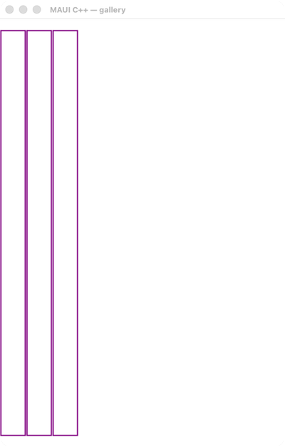</td><td>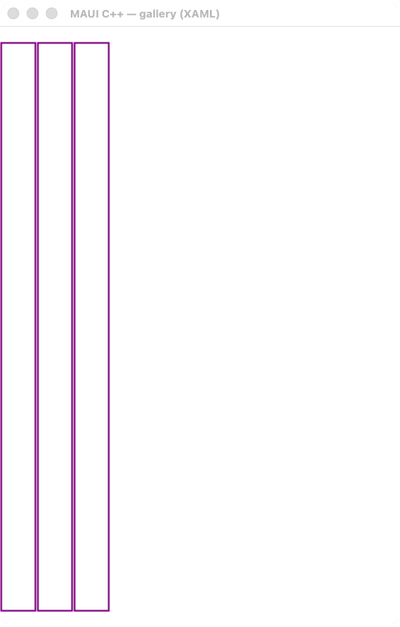</td></tr><tr><th>Dark</th><td></td><td></td><td></td><td>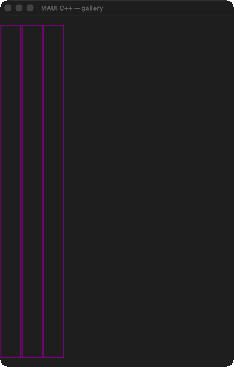</td><td>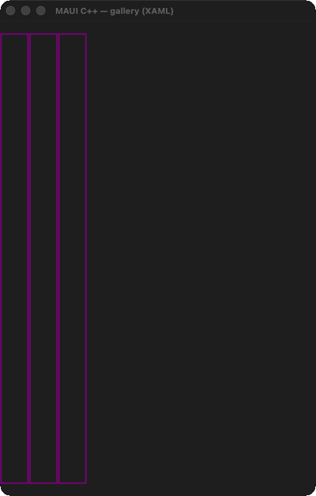</td></tr></table>

Carousel Page

#### 🟡 Pixel-Perfect Score — C++ (C1/C3)

**Motion:** 🚫 INVALID · `not-driven` · run 2026-08-13-21_07_16 · 2026-08-13

Light: !! NO MOTION EVIDENCE: neither MAUI nor C++ changed by more than 0.012% of its own frame across the sequence (0 px vs 0 px), on a page the board treats as ANIMATED. An action WAS injected here — carousel_page.toml declares one — and NEITHER column reacted to it. So either the coordinate misses its target on this lane, or the interaction is not reachable here. This is the actionable half of the old 'NOTHING MOVED' bucket: 59 of the 139 cells that carried it. MOTION 11 frames paired by step (run 2026-08-13-21_07_16, commit 74dde0864a, 2026-08-13); 6 frame(s) had no partner and were NOT scored; column frames realigned by -3 sample(s) — a sampling drift, not a defect (see _align) — worst SSIM 0.9971 at frame 1 'gif02' (0.11% pixels differ), mean SSIM 0.9971; per-frame diff% 0.11/0.11/0.11/0.11/0.11/0.11/0.11/0.11/0.11/0.11/0.11; self-motion MAUI 0.0000% (0 px) vs C++ 0.0000% (0 px) · Dark: !! NO MOTION EVIDENCE: neither MAUI nor C++ changed by more than 0.012% of its own frame across the sequence (0 px vs 0 px), on a page the board treats as ANIMATED. An action WAS injected here — carousel_page.toml declares one — and NEITHER column reacted to it. So either the coordinate misses its target on this lane, or the interaction is not reachable here. This is the actionable half of the old 'NOTHING MOVED' bucket: 59 of the 139 cells that carried it. MOTION 11 frames paired by step (run 2026-08-13-21_07_16, commit 74dde0864a, 2026-08-13); 6 frame(s) had no partner and were NOT scored; column frames realigned by -3 sample(s) — a sampling drift, not a defect (see _align) — worst SSIM 0.9971 at frame 1 'gif02' (0.11% pixels differ), mean SSIM 0.9971; per-frame diff% 0.11/0.11/0.11/0.11/0.11/0.11/0.11/0.11/0.11/0.11/0.11; self-motion MAUI 0.0000% (0 px) vs C++ 0.0000% (0 px)

#### 🟡 Pixel-Perfect Score — C++ &amp; XAML (C2/C4)

**Motion:** 🚫 INVALID · `not-driven` · run 2026-08-13-21_07_16 · 2026-08-13

Light: !! NO MOTION EVIDENCE: neither MAUI nor C++ &amp; XAML changed by more than 0.012% of its own frame across the sequence (0 px vs 0 px), on a page the board treats as ANIMATED. An action WAS injected here — carousel_page.toml declares one — and NEITHER column reacted to it. So either the coordinate misses its target on this lane, or the interaction is not reachable here. This is the actionable half of the old 'NOTHING MOVED' bucket: 59 of the 139 cells that carried it. MOTION 11 frames paired by step (run 2026-08-13-21_07_16, commit 74dde0864a, 2026-08-13); 6 frame(s) had no partner and were NOT scored; column frames realigned by -3 sample(s) — a sampling drift, not a defect (see _align) — worst SSIM 0.9959 at frame 1 'gif02' (0.14% pixels differ), mean SSIM 0.9959; per-frame diff% 0.14/0.14/0.14/0.14/0.14/0.14/0.14/0.14/0.14/0.14/0.14; self-motion MAUI 0.0000% (0 px) vs C++ &amp; XAML 0.0000% (0 px) · Dark: !! NO MOTION EVIDENCE: neither MAUI nor C++ &amp; XAML changed by more than 0.012% of its own frame across the sequence (0 px vs 0 px), on a page the board treats as ANIMATED. An action WAS injected here — carousel_page.toml declares one — and NEITHER column reacted to it. So either the coordinate misses its target on this lane, or the interaction is not reachable here. This is the actionable half of the old 'NOTHING MOVED' bucket: 59 of the 139 cells that carried it. MOTION 11 frames paired by step (run 2026-08-13-21_07_16, commit 74dde0864a, 2026-08-13); 6 frame(s) had no partner and were NOT scored; column frames realigned by -3 sample(s) — a sampling drift, not a defect (see _align) — worst SSIM 0.9958 at frame 1 'gif02' (0.14% pixels differ), mean SSIM 0.9958; per-frame diff% 0.14/0.14/0.14/0.14/0.14/0.14/0.14/0.14/0.14/0.14/0.14; self-motion MAUI 0.0000% (0 px) vs C++ &amp; XAML 0.0000% (0 px)

### 23. Chat Example — 🟢/🟢
chat_example

<table><tr><th></th><th>MAUI</th><th>C++</th><th>C++ &amp; XAML</th><th>AppKit / C++</th><th>AppKit / C++ &amp; XAML</th></tr><tr><th>Light</th><td></td><td></td><td></td><td></td><td></td></tr><tr><th>Dark</th><td></td><td></td><td></td><td></td><td></td></tr></table>

ports ChatExample.xaml (+ .xaml.cs) (Maui.Controls.Sample.Pages.CollectionViewGalleries.ItemSizeGalleries.ChatExample), tracking the maui-compare reference demo ~/maui-compare/Pages/ChatExamplePage.cs (the visual-parity oracle)

#### 🟢 Pixel-Perfect Score — C++ (C1/C3)

Light: SSIM 0.9978, 0.09% pixels differ · Dark: SSIM 0.9978, 0.08% pixels differ

#### 🟢 Pixel-Perfect Score — C++ &amp; XAML (C2/C4)

Light: SSIM 0.9965, 0.12% pixels differ · Dark: SSIM 0.9966, 0.11% pixels differ

### 24. Check Box — 🟢/🟢
check_box

<table><tr><th></th><th>MAUI</th><th>C++</th><th>C++ &amp; XAML</th><th>AppKit / C++</th><th>AppKit / C++ &amp; XAML</th></tr><tr><th>Light</th><td></td><td></td><td></td><td></td><td></td></tr><tr><th>Dark</th><td></td><td></td><td></td><td></td><td></td></tr></table>

ports CheckBoxPage.xaml (+ .xaml.cs) Mirrors the MAUI gallery page: a vertical stack of headlined CheckBox states — Default, Colored (Color=Purple), Disabled, Disabled+Colored+Checked — followed by a &amp;quot;Change IsChecked&amp;quot; row pairing a Button

#### 🟢 Pixel-Perfect Score — C++ (C1/C3)

**Motion:** ✅ PASS · run 2026-08-13-21_07_16 · 2026-08-13

Light: MOTION 2 frames paired by step (run 2026-08-13-21_07_16, commit 74dde0864a, 2026-08-13) — worst SSIM 0.9972 at frame 1 'initial' (0.11% pixels differ), mean SSIM 0.9972; per-frame diff% 0.11/0.11; self-motion MAUI 0.0133% (109 px) vs C++ 0.0133% (109 px) · Dark: MOTION 2 frames paired by step (run 2026-08-13-21_07_16, commit 74dde0864a, 2026-08-13) — worst SSIM 0.9973 at frame 1 'initial' (0.11% pixels differ), mean SSIM 0.9973; per-frame diff% 0.11/0.11; self-motion MAUI 0.0109% (89 px) vs C++ 0.0109% (89 px)

#### 🟢 Pixel-Perfect Score — C++ &amp; XAML (C2/C4)

**Motion:** ✅ PASS · run 2026-08-13-21_07_16 · 2026-08-13

Light: MOTION 2 frames paired by step (run 2026-08-13-21_07_16, commit 74dde0864a, 2026-08-13) — worst SSIM 0.9965 at frame 1 'initial' (0.12% pixels differ), mean SSIM 0.9965; per-frame diff% 0.12/0.12; self-motion MAUI 0.0133% (109 px) vs C++ &amp; XAML 0.0133% (109 px) · Dark: MOTION 2 frames paired by step (run 2026-08-13-21_07_16, commit 74dde0864a, 2026-08-13) — worst SSIM 0.9966 at frame 1 'initial' (0.11% pixels differ), mean SSIM 0.9966; per-frame diff% 0.11/0.11; self-motion MAUI 0.0109% (89 px) vs C++ &amp; XAML 0.0109% (89 px)

### 25. Chrome — 🟢/🟢
chrome

<table><tr><th></th><th>MAUI</th><th>C++</th><th>C++ &amp; XAML</th><th>AppKit / C++</th><th>AppKit / C++ &amp; XAML</th></tr><tr><th>Light</th><td></td><td></td><td></td><td>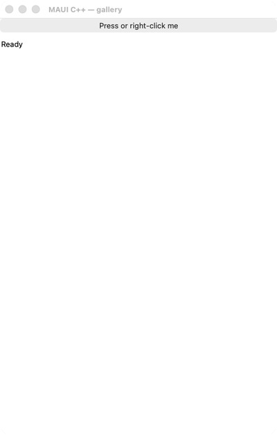</td><td>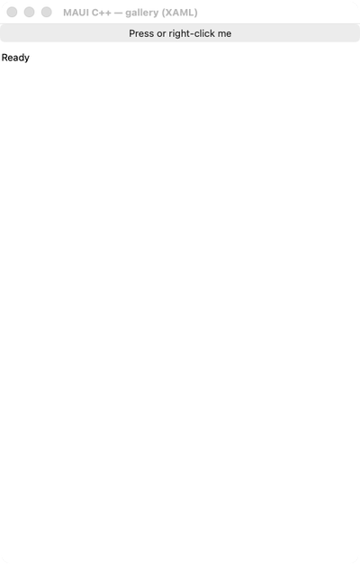</td></tr><tr><th>Dark</th><td></td><td></td><td></td><td>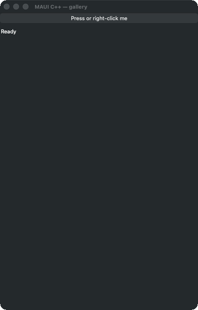</td><td>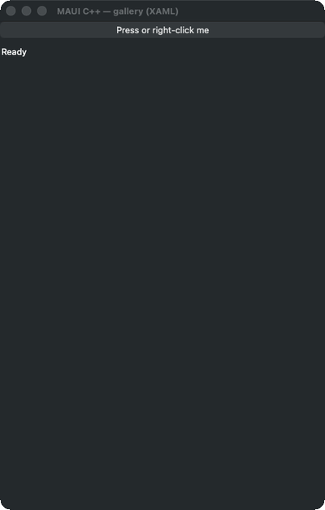</td></tr></table>

a self-contained demo page for the W1-11 window-chrome family: page toolbar items (primary + secondary), a menu bar (File menu with items, a separator and a sub-menu), a context flyout (right-click menu) on a button, and a tooltip — all wir

#### 🟢 Pixel-Perfect Score — C++ (C1/C3)

**Motion:** ✅ PASS · run 2026-08-13-21_07_16 · 2026-08-13

Light: MOTION 14 frames paired by step (run 2026-08-13-21_07_16, commit 74dde0864a, 2026-08-13) — worst SSIM 0.9978 at frame 1 'initial' (0.09% pixels differ), mean SSIM 0.9978; per-frame diff% 0.09/0.09/0.09/0.09/0.09/0.09/0.09/0.09/0.09/0.09/0.09/0.09/0.09/0.09; self-motion MAUI 0.0631% (517 px) vs C++ 0.0631% (517 px) · Dark: MOTION 14 frames paired by step (run 2026-08-13-21_07_16, commit 74dde0864a, 2026-08-13) — worst SSIM 0.9978 at frame 1 'initial' (0.08% pixels differ), mean SSIM 0.9978; per-frame diff% 0.08/0.08/0.08/0.08/0.08/0.08/0.08/0.08/0.08/0.08/0.08/0.08/0.08/0.08; self-motion MAUI 0.0883% (723 px) vs C++ 0.0883% (723 px)

#### 🟢 Pixel-Perfect Score — C++ &amp; XAML (C2/C4)

**Motion:** ✅ PASS · run 2026-08-13-21_07_16 · 2026-08-13

Light: MOTION 14 frames paired by step (run 2026-08-13-21_07_16, commit 74dde0864a, 2026-08-13) — worst SSIM 0.9965 at frame 1 'initial' (0.12% pixels differ), mean SSIM 0.9965; per-frame diff% 0.12/0.12/0.12/0.12/0.12/0.12/0.12/0.12/0.12/0.12/0.12/0.12/0.12/0.12; self-motion MAUI 0.0631% (517 px) vs C++ &amp; XAML 0.0631% (517 px) · Dark: MOTION 14 frames paired by step (run 2026-08-13-21_07_16, commit 74dde0864a, 2026-08-13) — worst SSIM 0.9966 at frame 1 'initial' (0.11% pixels differ), mean SSIM 0.9966; per-frame diff% 0.11/0.11/0.11/0.11/0.11/0.11/0.11/0.11/0.11/0.11/0.11/0.11/0.11/0.11; self-motion MAUI 0.0883% (723 px) vs C++ &amp; XAML 0.0883% (723 px)

### 26. Clip — 🔴/🔴
clip

<table><tr><th></th><th>MAUI</th><th>C++</th><th>C++ &amp; XAML</th><th>AppKit / C++</th><th>AppKit / C++ &amp; XAML</th></tr><tr><th>Light</th><td></td><td></td><td></td><td></td><td></td></tr><tr><th>Dark</th><td></td><td></td><td></td><td></td><td></td></tr></table>

ports ClipPage.xaml The C# page (Pages/Core/ClipPage.xaml; its .xaml.cs is an empty InitializeComponent) is a ScrollView over a StackLayout that shows the SAME dotnet_bot.png image five times, each successive copy carrying a different geome

#### 🔴 Pixel-Perfect Score — C++ (C1/C3)

**Motion:** ❌ FAIL · `frames-disagree` · run 2026-08-13-21_07_16 · 2026-08-13

Light: MOTION 2 frames paired by step (run 2026-08-13-21_07_16, commit 74dde0864a, 2026-08-13) — worst SSIM 0.8883 at frame 1 'initial' (9.18% pixels differ), mean SSIM 0.9430; per-frame diff% 9.18/0.09; self-motion MAUI 11.5961% (94995 px) vs C++ 11.6097% (95107 px) · Dark: MOTION 2 frames paired by step (run 2026-08-13-21_07_16, commit 74dde0864a, 2026-08-13) — worst SSIM 0.8853 at frame 1 'initial' (9.55% pixels differ), mean SSIM 0.9415; per-frame diff% 9.55/0.08; self-motion MAUI 11.7976% (96646 px) vs C++ 11.8179% (96812 px)

#### 🔴 Pixel-Perfect Score — C++ &amp; XAML (C2/C4)

**Motion:** ❌ FAIL · `frames-disagree` · run 2026-08-13-21_07_16 · 2026-08-13

Light: MOTION 2 frames paired by step (run 2026-08-13-21_07_16, commit 74dde0864a, 2026-08-13) — worst SSIM 0.8870 at frame 1 'initial' (9.21% pixels differ), mean SSIM 0.9418; per-frame diff% 9.21/0.12; self-motion MAUI 11.5961% (94995 px) vs C++ &amp; XAML 11.6097% (95107 px) · Dark: MOTION 2 frames paired by step (run 2026-08-13-21_07_16, commit 74dde0864a, 2026-08-13) — worst SSIM 0.8841 at frame 1 'initial' (9.58% pixels differ), mean SSIM 0.9404; per-frame diff% 9.58/0.11; self-motion MAUI 11.7976% (96646 px) vs C++ &amp; XAML 11.8179% (96812 px)

### 27. Clip Corner Radius — 🟢/🟢
clip_corner_radius

<table><tr><th></th><th>MAUI</th><th>C++</th><th>C++ &amp; XAML</th><th>AppKit / C++</th><th>AppKit / C++ &amp; XAML</th></tr><tr><th>Light</th><td></td><td></td><td></td><td></td><td></td></tr><tr><th>Dark</th><td></td><td></td><td></td><td></td><td></td></tr></table>

ports ClipCornerRadiusGallery.xaml (+ .xaml.cs) The C# page (Pages/Controls/ShapesGalleries/ClipCornerRadiusGallery.xaml) is a StackLayout (Padding=12) that demonstrates DRIVING a RoundRectangleGeometry&amp;#x27;s per-corner CornerRadius from four s

#### 🟢 Pixel-Perfect Score — C++ (C1/C3)

Light: SSIM 0.9978, 0.09% pixels differ · Dark: SSIM 0.9978, 0.08% pixels differ

#### 🟢 Pixel-Perfect Score — C++ &amp; XAML (C2/C4)

Light: SSIM 0.9965, 0.12% pixels differ · Dark: SSIM 0.9966, 0.11% pixels differ

### 28. Clip Gallery — 🟢/🟢
clip_gallery

<table><tr><th></th><th>MAUI</th><th>C++</th><th>C++ &amp; XAML</th><th>AppKit / C++</th><th>AppKit / C++ &amp; XAML</th></tr><tr><th>Light</th><td></td><td></td><td></td><td></td><td></td></tr><tr><th>Dark</th><td></td><td></td><td></td><td></td><td></td></tr></table>

ports ClipGallery.xaml The C# page (Pages/Controls/ShapesGalleries/ClipGallery.xaml; its .xaml.cs is an empty InitializeComponent) is a ScrollView over a StackLayout (Padding=12) that shows the SAME &amp;quot;oasis.jpg&amp;quot; image SEVEN times — one bare

#### 🟢 Pixel-Perfect Score — C++ (C1/C3)

**Motion:** ✅ PASS · run 2026-08-13-21_07_16 · 2026-08-13

Light: MOTION 2 frames paired by step (run 2026-08-13-21_07_16, commit 74dde0864a, 2026-08-13) — worst SSIM 0.9978 at frame 1 'initial' (0.09% pixels differ), mean SSIM 0.9978; per-frame diff% 0.09/0.09; self-motion MAUI 11.0671% (90662 px) vs C++ 11.0671% (90662 px) · Dark: MOTION 2 frames paired by step (run 2026-08-13-21_07_16, commit 74dde0864a, 2026-08-13) — worst SSIM 0.9978 at frame 1 'initial' (0.08% pixels differ), mean SSIM 0.9978; per-frame diff% 0.08/0.08; self-motion MAUI 10.8369% (88776 px) vs C++ 10.8369% (88776 px)

#### 🟢 Pixel-Perfect Score — C++ &amp; XAML (C2/C4)

**Motion:** ✅ PASS · run 2026-08-13-21_07_16 · 2026-08-13

Light: MOTION 2 frames paired by step (run 2026-08-13-21_07_16, commit 74dde0864a, 2026-08-13) — worst SSIM 0.9965 at frame 1 'initial' (0.12% pixels differ), mean SSIM 0.9965; per-frame diff% 0.12/0.12; self-motion MAUI 11.0671% (90662 px) vs C++ &amp; XAML 11.0671% (90662 px) · Dark: MOTION 2 frames paired by step (run 2026-08-13-21_07_16, commit 74dde0864a, 2026-08-13) — worst SSIM 0.9966 at frame 1 'initial' (0.11% pixels differ), mean SSIM 0.9966; per-frame diff% 0.11/0.11; self-motion MAUI 10.8369% (88776 px) vs C++ &amp; XAML 10.8369% (88776 px)

### 29. Clip Views — 🟢/🟢
clip_views

<table><tr><th></th><th>MAUI</th><th>C++</th><th>C++ &amp; XAML</th><th>AppKit / C++</th><th>AppKit / C++ &amp; XAML</th></tr><tr><th>Light</th><td></td><td></td><td></td><td></td><td></td></tr><tr><th>Dark</th><td></td><td></td><td></td><td></td><td></td></tr></table>

ports ClipViewsGallery.xaml The C# page (Pages/Controls/ShapesGalleries/ClipViewsGallery.xaml; no code-behind beyond an empty InitializeComponent) is a ScrollView over a StackLayout (Padding=12) that proves the Clip surface (VisualElement.C

#### 🟢 Pixel-Perfect Score — C++ (C1/C3)

**Motion:** ✅ PASS · run 2026-08-13-21_07_16 · 2026-08-13

Light: MOTION 3 frames paired by step (run 2026-08-13-21_07_16, commit 74dde0864a, 2026-08-13) — worst SSIM 0.9978 at frame 1 'initial' (0.09% pixels differ), mean SSIM 0.9978; per-frame diff% 0.09/0.09/0.09; self-motion MAUI 0.9155% (7500 px) vs C++ 0.9155% (7500 px) · Dark: MOTION 3 frames paired by step (run 2026-08-13-21_07_16, commit 74dde0864a, 2026-08-13) — worst SSIM 0.9978 at frame 1 'initial' (0.08% pixels differ), mean SSIM 0.9978; per-frame diff% 0.08/0.08/0.08; self-motion MAUI 1.0470% (8577 px) vs C++ 1.0447% (8558 px)

#### 🟢 Pixel-Perfect Score — C++ &amp; XAML (C2/C4)

**Motion:** ✅ PASS · run 2026-08-13-21_07_16 · 2026-08-13

Light: MOTION 3 frames paired by step (run 2026-08-13-21_07_16, commit 74dde0864a, 2026-08-13) — worst SSIM 0.9965 at frame 1 'initial' (0.12% pixels differ), mean SSIM 0.9965; per-frame diff% 0.12/0.12/0.13; self-motion MAUI 0.9155% (7500 px) vs C++ &amp; XAML 0.9154% (7499 px) · Dark: MOTION 3 frames paired by step (run 2026-08-13-21_07_16, commit 74dde0864a, 2026-08-13) — worst SSIM 0.9966 at frame 1 'initial' (0.11% pixels differ), mean SSIM 0.9966; per-frame diff% 0.11/0.11/0.11; self-motion MAUI 1.0470% (8577 px) vs C++ &amp; XAML 1.0470% (8577 px)

### 30. Clipping — 🟢/🟢
clipping

<table><tr><th></th><th>MAUI</th><th>C++</th><th>C++ &amp; XAML</th><th>AppKit / C++</th><th>AppKit / C++ &amp; XAML</th></tr><tr><th>Light</th><td></td><td></td><td></td><td></td><td></td></tr><tr><th>Dark</th><td></td><td></td><td></td><td></td><td></td></tr></table>

compare oracle ~/maui-compare/Pages/ClippingPage.cs (itself written to mirror this gallery page)

#### 🟢 Pixel-Perfect Score — C++ (C1/C3)

Light: SSIM 0.9963, 0.15% pixels differ · Dark: SSIM 0.9965, 0.15% pixels differ

#### 🟢 Pixel-Perfect Score — C++ &amp; XAML (C2/C4)

Light: SSIM 0.9951, 0.18% pixels differ · Dark: SSIM 0.9954, 0.18% pixels differ

### 31. Collectionview — 🟢/🟢
collectionview

<table><tr><th></th><th>MAUI</th><th>C++</th><th>C++ &amp; XAML</th><th>AppKit / C++</th><th>AppKit / C++ &amp; XAML</th></tr><tr><th>Light</th><td></td><td></td><td></td><td></td><td></td></tr><tr><th>Dark</th><td></td><td></td><td></td><td></td><td></td></tr></table>

a faithful reproduction of the maui-compare &amp;quot;collectionview&amp;quot; demo (ComparePages.CollectionViewPage()), the shipped-.NET-MAUI reference for the visual-parity comparison: a CollectionView over 24 captioned items, a string Header (&amp;quot;This is the

#### 🟢 Pixel-Perfect Score — C++ (C1/C3)

Light: SSIM 0.9978, 0.09% pixels differ · Dark: SSIM 0.9978, 0.08% pixels differ

#### 🟢 Pixel-Perfect Score — C++ &amp; XAML (C2/C4)

Light: SSIM 0.9965, 0.12% pixels differ · Dark: SSIM 0.9966, 0.11% pixels differ

### 32. Composition Gallery — 🟢/🟢
composition_gallery

<table><tr><th></th><th>MAUI</th><th>C++</th><th>C++ &amp; XAML</th><th>AppKit / C++</th><th>AppKit / C++ &amp; XAML</th></tr><tr><th>Light</th><td></td><td></td><td></td><td></td><td></td></tr><tr><th>Dark</th><td></td><td></td><td></td><td></td><td></td></tr></table>

ports CompositionGallery.xaml A self-contained, code-first port of the MAUI Shapes sub-gallery Pages/Controls/ShapesGalleries/CompositionGallery.xaml: a StackLayout holding two Beige 250x250 Grids (Margin 12) that compose multiple overlappi

#### 🟢 Pixel-Perfect Score — C++ (C1/C3)

Light: SSIM 0.9978, 0.09% pixels differ · Dark: SSIM 0.9978, 0.08% pixels differ

#### 🟢 Pixel-Perfect Score — C++ &amp; XAML (C2/C4)

Light: SSIM 0.9965, 0.12% pixels differ · Dark: SSIM 0.9966, 0.11% pixels differ

### 33. Containers — 🟢/🟢
containers

<table><tr><th></th><th>MAUI</th><th>C++</th><th>C++ &amp; XAML</th><th>AppKit / C++</th><th>AppKit / C++ &amp; XAML</th></tr><tr><th>Light</th><td></td><td></td><td></td><td></td><td></td></tr><tr><th>Dark</th><td></td><td></td><td></td><td></td><td></td></tr></table>

a self-contained demo page for the W1-07 container set: a scroll_view hosting a vertical stack of content-hosting containers — a border-framed label (stroke + dashed outline + rounded shape), a legacy frame (BorderColor/CornerRadius/HasShad

#### 🟢 Pixel-Perfect Score — C++ (C1/C3)

Light: SSIM 0.9937, 0.61% pixels differ · Dark: SSIM 0.9888, 0.61% pixels differ

#### 🟢 Pixel-Perfect Score — C++ &amp; XAML (C2/C4)

Light: SSIM 0.9924, 0.64% pixels differ · Dark: SSIM 0.9876, 0.64% pixels differ

### 34. Content View — 🟢/🟢
content_view

<table><tr><th></th><th>MAUI</th><th>C++</th><th>C++ &amp; XAML</th><th>AppKit / C++</th><th>AppKit / C++ &amp; XAML</th></tr><tr><th>Light</th><td></td><td></td><td></td><td></td><td></td></tr><tr><th>Dark</th><td></td><td></td><td></td><td></td><td></td></tr></table>

ports ContentViewPage.xaml (+ ContentViewPage.xaml.cs), code-first

#### 🟢 Pixel-Perfect Score — C++ (C1/C3)

Light: SSIM 0.9978, 0.09% pixels differ · Dark: SSIM 0.9978, 0.08% pixels differ

#### 🟢 Pixel-Perfect Score — C++ &amp; XAML (C2/C4)

Light: SSIM 0.9965, 0.12% pixels differ · Dark: SSIM 0.9966, 0.11% pixels differ

### 35. Context Flyout — 🔴/🟡
context_flyout

<table><tr><th></th><th>MAUI</th><th>C++</th><th>C++ &amp; XAML</th><th>AppKit / C++</th><th>AppKit / C++ &amp; XAML</th></tr><tr><th>Light</th><td></td><td></td><td></td><td></td><td></td></tr><tr><th>Dark</th><td></td><td></td><td></td><td></td><td></td></tr></table>

ports ContextFlyoutPage.xaml (+ ContextFlyoutPage.xaml.cs) The C# page attaches a MenuFlyout as the FlyoutBase.ContextFlyout (right-click / long-press menu) of several controls and wires each menu item to a handler: - a Button (&amp;quot;Increment b

#### 🔴 Pixel-Perfect Score — C++ (C1/C3)

Light: SSIM 0.8556, 7.86% pixels differ · Dark: SSIM 0.8531, 7.91% pixels differ

#### 🟡 Pixel-Perfect Score — C++ &amp; XAML (C2/C4)

Light: SSIM 0.9179, 3.34% pixels differ · Dark: SSIM 0.9148, 3.47% pixels differ

### 36. Controls Stack — 🟢/🟢
controls_stack

<table><tr><th></th><th>MAUI</th><th>C++</th><th>C++ &amp; XAML</th><th>AppKit / C++</th><th>AppKit / C++ &amp; XAML</th></tr><tr><th>Light</th><td></td><td></td><td></td><td></td><td></td></tr><tr><th>Dark</th><td></td><td></td><td></td><td></td><td></td></tr></table>

a faithful reproduction of the maui-compare &amp;quot;controls_stack&amp;quot; demo (ComparePages.ControlsStack()), the shipped-.NET-MAUI reference for the visual-parity comparison: a VerticalStackLayout (Spacing 12, Padding 16) showcasing the basic widgets

#### 🟢 Pixel-Perfect Score — C++ (C1/C3)

**Motion:** ✅ PASS · run 2026-08-13-21_07_16 · 2026-08-13

Light: MOTION 2 frames paired by step (run 2026-08-13-21_07_16, commit 74dde0864a, 2026-08-13) — worst SSIM 0.9961 at frame 1 'initial' (0.12% pixels differ), mean SSIM 0.9961; per-frame diff% 0.12/0.12; self-motion MAUI 0.0051% (42 px) vs C++ 0.0060% (49 px) · Dark: MOTION 2 frames paired by step (run 2026-08-13-21_07_16, commit 74dde0864a, 2026-08-13) — worst SSIM 0.9961 at frame 1 'initial' (0.13% pixels differ), mean SSIM 0.9961; per-frame diff% 0.13/0.12; self-motion MAUI 0.0054% (44 px) vs C++ 0.0065% (53 px)

#### 🟢 Pixel-Perfect Score — C++ &amp; XAML (C2/C4)

**Motion:** ✅ PASS · run 2026-08-13-21_07_16 · 2026-08-13

Light: MOTION 2 frames paired by step (run 2026-08-13-21_07_16, commit 74dde0864a, 2026-08-13) — worst SSIM 0.9948 at frame 1 'initial' (0.16% pixels differ), mean SSIM 0.9949; per-frame diff% 0.16/0.15; self-motion MAUI 0.0051% (42 px) vs C++ &amp; XAML 0.0060% (49 px) · Dark: MOTION 2 frames paired by step (run 2026-08-13-21_07_16, commit 74dde0864a, 2026-08-13) — worst SSIM 0.9948 at frame 2 'unchecked' (0.16% pixels differ), mean SSIM 0.9949; per-frame diff% 0.16/0.16; self-motion MAUI 0.0054% (44 px) vs C++ &amp; XAML 0.0068% (56 px)

### 37. Custom Layout — 🟢/🟢
custom_layout

<table><tr><th></th><th>MAUI</th><th>C++</th><th>C++ &amp; XAML</th><th>AppKit / C++</th><th>AppKit / C++ &amp; XAML</th></tr><tr><th>Light</th><td></td><td></td><td></td><td></td><td></td></tr><tr><th>Dark</th><td></td><td></td><td></td><td></td><td></td></tr></table>

ports CustomLayoutPage.xaml (+ CustomLayoutPage.xaml.cs)

#### 🟢 Pixel-Perfect Score — C++ (C1/C3)

Light: SSIM 0.9978, 0.09% pixels differ · Dark: SSIM 0.9978, 0.08% pixels differ

#### 🟢 Pixel-Perfect Score — C++ &amp; XAML (C2/C4)

Light: SSIM 0.9965, 0.12% pixels differ · Dark: SSIM 0.9966, 0.11% pixels differ

### 38. Custom Size Swipe — 🟢/🟢
custom_size_swipe

<table><tr><th></th><th>MAUI</th><th>C++</th><th>C++ &amp; XAML</th><th>AppKit / C++</th><th>AppKit / C++ &amp; XAML</th></tr><tr><th>Light</th><td></td><td></td><td></td><td></td><td></td></tr><tr><th>Dark</th><td></td><td></td><td></td><td></td><td></td></tr></table>

ports CustomSizeSwipeViewGallery.xaml (+ .xaml.cs) The MAUI CustomSizeSwipeViewGallery is a single SwipeView whose Left / Right / Top item collections each reveal CUSTOM-SIZED content: a SwipeItemView wrapping a Grid/StackLayout with an exp

#### 🟢 Pixel-Perfect Score — C++ (C1/C3)

Light: SSIM 0.9978, 0.09% pixels differ · Dark: SSIM 0.9979, 0.08% pixels differ

#### 🟢 Pixel-Perfect Score — C++ &amp; XAML (C2/C4)

Light: SSIM 0.9966, 0.12% pixels differ · Dark: SSIM 0.9967, 0.11% pixels differ

### 39. Custom Swipe Item View — 🟢/🟢
custom_swipe_item_view

<table><tr><th></th><th>MAUI</th><th>C++</th><th>C++ &amp; XAML</th><th>AppKit / C++</th><th>AppKit / C++ &amp; XAML</th></tr><tr><th>Light</th><td></td><td></td><td></td><td></td><td></td></tr><tr><th>Dark</th><td></td><td></td><td></td><td></td><td></td></tr></table>

ports CustomSwipeItemViewGallery.xaml A self-contained, code-first port of the .NET MAUI &amp;quot;CustomSwipeItem&amp;quot; gallery: a message-list row whose right swipe reveals a CUSTOM-content swipe item (a swipe_item_view, not a plain swipe_item)

#### 🟢 Pixel-Perfect Score — C++ (C1/C3)

Light: SSIM 0.9978, 0.09% pixels differ · Dark: SSIM 0.9978, 0.08% pixels differ

#### 🟢 Pixel-Perfect Score — C++ &amp; XAML (C2/C4)

Light: SSIM 0.9965, 0.12% pixels differ · Dark: SSIM 0.9966, 0.12% pixels differ

### 40. Cv Visual States — 🟢/🟢
cv_visual_states

<table><tr><th></th><th>MAUI</th><th>C++</th><th>C++ &amp; XAML</th><th>AppKit / C++</th><th>AppKit / C++ &amp; XAML</th></tr><tr><th>Light</th><td></td><td></td><td></td><td></td><td></td></tr><tr><th>Dark</th><td></td><td></td><td></td><td></td><td></td></tr></table>

ports CollectionViewGalleries/SelectionGalleries/ VisualStatesGallery.xaml (+ .xaml.cs) of the C# CollectionView gallery

#### 🟢 Pixel-Perfect Score — C++ (C1/C3)

Light: SSIM 0.9978, 0.09% pixels differ · Dark: SSIM 0.9978, 0.08% pixels differ

#### 🟢 Pixel-Perfect Score — C++ &amp; XAML (C2/C4)

Light: SSIM 0.9965, 0.12% pixels differ · Dark: SSIM 0.9966, 0.11% pixels differ

### 41. Data Template Selector — 🟢/🟢
data_template_selector

<table><tr><th></th><th>MAUI</th><th>C++</th><th>C++ &amp; XAML</th><th>AppKit / C++</th><th>AppKit / C++ &amp; XAML</th></tr><tr><th>Light</th><td></td><td></td><td></td><td></td><td></td></tr><tr><th>Dark</th><td></td><td></td><td></td><td></td><td></td></tr></table>

ports DataTemplateSelectorGallery.xaml (+ DataTemplateSelectorGallery.xaml.cs, including its WeekendSelector + SearchTermSelector classes)

#### 🟢 Pixel-Perfect Score — C++ (C1/C3)

**Motion:** ✅ PASS · run 2026-08-13-21_07_16 · 2026-08-13

Light: MOTION 3 frames paired by step (run 2026-08-13-21_07_16, commit 74dde0864a, 2026-08-13) — worst SSIM 0.9978 at frame 1 'initial' (0.09% pixels differ), mean SSIM 0.9978; per-frame diff% 0.09/0.09/0.09; self-motion MAUI 0.9108% (7461 px) vs C++ 0.9108% (7461 px) · Dark: MOTION 3 frames paired by step (run 2026-08-13-21_07_16, commit 74dde0864a, 2026-08-13) — worst SSIM 0.9978 at frame 1 'initial' (0.08% pixels differ), mean SSIM 0.9978; per-frame diff% 0.08/0.08/0.08; self-motion MAUI 1.1284% (9244 px) vs C++ 1.1261% (9225 px)

#### 🟢 Pixel-Perfect Score — C++ &amp; XAML (C2/C4)

**Motion:** ✅ PASS · run 2026-08-13-21_07_16 · 2026-08-13

Light: MOTION 3 frames paired by step (run 2026-08-13-21_07_16, commit 74dde0864a, 2026-08-13) — worst SSIM 0.9965 at frame 1 'initial' (0.12% pixels differ), mean SSIM 0.9965; per-frame diff% 0.12/0.12/0.12; self-motion MAUI 0.9108% (7461 px) vs C++ &amp; XAML 0.9108% (7461 px) · Dark: MOTION 3 frames paired by step (run 2026-08-13-21_07_16, commit 74dde0864a, 2026-08-13) — worst SSIM 0.9965 at frame 1 'initial' (0.11% pixels differ), mean SSIM 0.9966; per-frame diff% 0.11/0.11/0.12; self-motion MAUI 1.1284% (9244 px) vs C++ &amp; XAML 1.1262% (9226 px)

### 42. Date Picker — 🟢/🟢
date_picker

<table><tr><th></th><th>MAUI</th><th>C++</th><th>C++ &amp; XAML</th><th>AppKit / C++</th><th>AppKit / C++ &amp; XAML</th></tr><tr><th>Light</th><td></td><td></td><td></td><td></td><td></td></tr><tr><th>Dark</th><td></td><td></td><td></td><td></td><td></td></tr></table>

ports DatePickerPage.xaml (+ DatePickerPage.xaml.cs)

#### 🟢 Pixel-Perfect Score — C++ (C1/C3)

Light: SSIM 0.9978, 0.09% pixels differ · Dark: SSIM 0.9978, 0.08% pixels differ

#### 🟢 Pixel-Perfect Score — C++ &amp; XAML (C2/C4)

Light: SSIM 0.9965, 0.12% pixels differ · Dark: SSIM 0.9966, 0.11% pixels differ

### 43. Device — 🟢/🟢
device

<table><tr><th></th><th>MAUI</th><th>C++</th><th>C++ &amp; XAML</th><th>AppKit / C++</th><th>AppKit / C++ &amp; XAML</th></tr><tr><th>Light</th><td></td><td></td><td></td><td></td><td></td></tr><tr><th>Dark</th><td></td><td></td><td></td><td></td><td></td></tr></table>

ports DevicePage.xaml

#### 🟢 Pixel-Perfect Score — C++ (C1/C3)

Light: SSIM 0.9925, 0.28% pixels differ · Dark: SSIM 0.9923, 0.31% pixels differ

#### 🟢 Pixel-Perfect Score — C++ &amp; XAML (C2/C4)

Light: SSIM 0.9965, 0.12% pixels differ · Dark: SSIM 0.9966, 0.11% pixels differ

### 44. Dispatcher — 🟢/🟢
dispatcher

<table><tr><th></th><th>MAUI</th><th>C++</th><th>C++ &amp; XAML</th><th>AppKit / C++</th><th>AppKit / C++ &amp; XAML</th></tr><tr><th>Light</th><td></td><td></td><td></td><td></td><td></td></tr><tr><th>Dark</th><td></td><td></td><td></td><td></td><td></td></tr></table>

ports DispatcherPage.xaml (+ .xaml.cs)

#### 🟢 Pixel-Perfect Score — C++ (C1/C3)

Light: SSIM 0.9978, 0.09% pixels differ · Dark: SSIM 0.9978, 0.08% pixels differ

#### 🟢 Pixel-Perfect Score — C++ &amp; XAML (C2/C4)

Light: SSIM 0.9965, 0.12% pixels differ · Dark: SSIM 0.9966, 0.11% pixels differ

### 45. Drag Drop — 🟢/🟢
drag_drop

<table><tr><th></th><th>MAUI</th><th>C++</th><th>C++ &amp; XAML</th><th>AppKit / C++</th><th>AppKit / C++ &amp; XAML</th></tr><tr><th>Light</th><td></td><td></td><td></td><td></td><td></td></tr><tr><th>Dark</th><td></td><td></td><td></td><td></td><td></td></tr></table>

ports DragAndDropBetweenLayouts.xaml (+ .xaml.cs) (Maui.Controls.Sample.Pages.DragAndDropBetweenLayouts)

#### 🟢 Pixel-Perfect Score — C++ (C1/C3)

Light: SSIM 0.9978, 0.09% pixels differ · Dark: SSIM 0.9978, 0.08% pixels differ

#### 🟢 Pixel-Perfect Score — C++ &amp; XAML (C2/C4)

Light: SSIM 0.9965, 0.12% pixels differ · Dark: SSIM 0.9966, 0.11% pixels differ

### 46. Editor — 🟢/🟢
editor

<table><tr><th></th><th>MAUI</th><th>C++</th><th>C++ &amp; XAML</th><th>AppKit / C++</th><th>AppKit / C++ &amp; XAML</th></tr><tr><th>Light</th><td></td><td></td><td></td><td></td><td></td></tr><tr><th>Dark</th><td></td><td></td><td></td><td></td><td></td></tr></table>

ports EditorPage.xaml (Microsoft.Maui.Controls sample gallery)

#### 🟢 Pixel-Perfect Score — C++ (C1/C3)

**Motion:** ✅ PASS · run 2026-08-13-21_07_16 · 2026-08-13

Light: MOTION 3 frames paired by step (run 2026-08-13-21_07_16, commit 74dde0864a, 2026-08-13) — worst SSIM 0.9978 at frame 1 'initial' (0.09% pixels differ), mean SSIM 0.9978; per-frame diff% 0.09/0.09/0.09; self-motion MAUI 0.0400% (328 px) vs C++ 0.0409% (335 px) · Dark: MOTION 3 frames paired by step (run 2026-08-13-21_07_16, commit 74dde0864a, 2026-08-13) — worst SSIM 0.9978 at frame 1 'initial' (0.08% pixels differ), mean SSIM 0.9978; per-frame diff% 0.08/0.08/0.08; self-motion MAUI 0.0435% (356 px) vs C++ 0.0435% (356 px)

#### 🟢 Pixel-Perfect Score — C++ &amp; XAML (C2/C4)

**Motion:** ✅ PASS · run 2026-08-13-21_07_16 · 2026-08-13

Light: MOTION 3 frames paired by step (run 2026-08-13-21_07_16, commit 74dde0864a, 2026-08-13) — worst SSIM 0.9965 at frame 1 'initial' (0.12% pixels differ), mean SSIM 0.9965; per-frame diff% 0.12/0.12/0.12; self-motion MAUI 0.0400% (328 px) vs C++ &amp; XAML 0.0409% (335 px) · Dark: MOTION 3 frames paired by step (run 2026-08-13-21_07_16, commit 74dde0864a, 2026-08-13) — worst SSIM 0.9966 at frame 1 'initial' (0.11% pixels differ), mean SSIM 0.9966; per-frame diff% 0.11/0.12/0.11; self-motion MAUI 0.0435% (356 px) vs C++ &amp; XAML 0.0435% (356 px)

### 47. Effects — 🟢/🟢
effects

<table><tr><th></th><th>MAUI</th><th>C++</th><th>C++ &amp; XAML</th><th>AppKit / C++</th><th>AppKit / C++ &amp; XAML</th></tr><tr><th>Light</th><td></td><td></td><td></td><td></td><td></td></tr><tr><th>Dark</th><td></td><td></td><td></td><td></td><td></td></tr></table>

ports EffectsPage.xaml (Maui.Controls.Sample.Pages.EffectsPage)

#### 🟢 Pixel-Perfect Score — C++ (C1/C3)

Light: SSIM 0.9978, 0.09% pixels differ · Dark: SSIM 0.9978, 0.08% pixels differ

#### 🟢 Pixel-Perfect Score — C++ &amp; XAML (C2/C4)

Light: SSIM 0.9965, 0.12% pixels differ · Dark: SSIM 0.9966, 0.11% pixels differ

### 48. Ellipse Gallery — 🟢/🟢
ellipse_gallery

<table><tr><th></th><th>MAUI</th><th>C++</th><th>C++ &amp; XAML</th><th>AppKit / C++</th><th>AppKit / C++ &amp; XAML</th></tr><tr><th>Light</th><td></td><td></td><td></td><td></td><td></td></tr><tr><th>Dark</th><td></td><td></td><td></td><td></td><td></td></tr></table>

ports EllipseGallery.xaml A self-contained, code-first port of the MAUI Shapes EllipseGallery (Pages/Controls/ShapesGalleries/EllipseGallery.xaml + .xaml.cs)

#### 🟢 Pixel-Perfect Score — C++ (C1/C3)

Light: SSIM 0.9978, 0.09% pixels differ · Dark: SSIM 0.9978, 0.08% pixels differ

#### 🟢 Pixel-Perfect Score — C++ &amp; XAML (C2/C4)

Light: SSIM 0.9965, 0.12% pixels differ · Dark: SSIM 0.9966, 0.11% pixels differ

### 49. Empty View — 🟢/🟢
empty_view

<table><tr><th></th><th>MAUI</th><th>C++</th><th>C++ &amp; XAML</th><th>AppKit / C++</th><th>AppKit / C++ &amp; XAML</th></tr><tr><th>Light</th><td></td><td></td><td></td><td></td><td></td></tr><tr><th>Dark</th><td></td><td></td><td></td><td></td><td></td></tr></table>

ports EmptyViewStringGallery.xaml (+ EmptyViewStringGallery.xaml.cs)

#### 🟢 Pixel-Perfect Score — C++ (C1/C3)

Light: SSIM 0.9978, 0.09% pixels differ · Dark: SSIM 0.9979, 0.08% pixels differ

#### 🟢 Pixel-Perfect Score — C++ &amp; XAML (C2/C4)

Light: SSIM 0.9965, 0.12% pixels differ · Dark: SSIM 0.9965, 0.11% pixels differ

### 50. Empty View Load Simulate — 🟢/🟢
empty_view_load_simulate

<table><tr><th></th><th>MAUI</th><th>C++</th><th>C++ &amp; XAML</th><th>AppKit / C++</th><th>AppKit / C++ &amp; XAML</th></tr><tr><th>Light</th><td></td><td></td><td></td><td></td><td></td></tr><tr><th>Dark</th><td></td><td></td><td></td><td></td><td></td></tr></table>

ports EmptyViewGalleries/EmptyViewLoadSimulateGallery.xaml (+ EmptyViewLoadSimulateGallery.xaml.cs)

#### 🟢 Pixel-Perfect Score — C++ (C1/C3)

**Motion:** 🚫 INVALID · `no-scenario` · run 2026-08-13-21_07_16 · 2026-08-13

Light: !! NO MOTION EVIDENCE: neither MAUI nor C++ changed by more than 0.012% of its own frame across the sequence (0 px vs 0 px), on a page the board treats as ANIMATED. NO ACTION SCENARIO EXISTS for this page — docs/comparison/scenarios/empty_view_load_simulate.toml is absent or declares no `action` — so nothing was ever aimed at it and both columns are at rest by construction. This is NOT a port finding and nothing about the port can be concluded from it; the missing artifact is the scenario. 80 of the 139 cells that carried the old 'NOTHING MOVED' banner were this, including 10 of the 14 hard-coded ANIMATED pages. MOTION 9 frames paired by step (run 2026-08-13-21_07_16, commit 74dde0864a, 2026-08-13); 6 frame(s) had no partner and were NOT scored; column frames realigned by -3 sample(s) — a sampling drift, not a defect (see _align) — worst SSIM 0.9978 at frame 1 'gif04' (0.09% pixels differ), mean SSIM 0.9978; per-frame diff% 0.09/0.09/0.09/0.09/0.09/0.09/0.09/0.09/0.09; self-motion MAUI 0.0000% (0 px) vs C++ 0.0000% (0 px) · Dark: !! NO MOTION EVIDENCE: neither MAUI nor C++ changed by more than 0.012% of its own frame across the sequence (0 px vs 0 px), on a page the board treats as ANIMATED. NO ACTION SCENARIO EXISTS for this page — docs/comparison/scenarios/empty_view_load_simulate.toml is absent or declares no `action` — so nothing was ever aimed at it and both columns are at rest by construction. This is NOT a port finding and nothing about the port can be concluded from it; the missing artifact is the scenario. 80 of the 139 cells that carried the old 'NOTHING MOVED' banner were this, including 10 of the 14 hard-coded ANIMATED pages. MOTION 9 frames paired by step (run 2026-08-13-21_07_16, commit 74dde0864a, 2026-08-13); 6 frame(s) had no partner and were NOT scored; column frames realigned by -3 sample(s) — a sampling drift, not a defect (see _align) — worst SSIM 0.9978 at frame 1 'gif04' (0.08% pixels differ), mean SSIM 0.9978; per-frame diff% 0.08/0.08/0.08/0.08/0.08/0.08/0.08/0.08/0.08; self-motion MAUI 0.0000% (0 px) vs C++ 0.0000% (0 px)

#### 🟢 Pixel-Perfect Score — C++ &amp; XAML (C2/C4)

**Motion:** 🚫 INVALID · `no-scenario` · run 2026-08-13-21_07_16 · 2026-08-13

Light: !! NO MOTION EVIDENCE: neither MAUI nor C++ &amp; XAML changed by more than 0.012% of its own frame across the sequence (0 px vs 0 px), on a page the board treats as ANIMATED. NO ACTION SCENARIO EXISTS for this page — docs/comparison/scenarios/empty_view_load_simulate.toml is absent or declares no `action` — so nothing was ever aimed at it and both columns are at rest by construction. This is NOT a port finding and nothing about the port can be concluded from it; the missing artifact is the scenario. 80 of the 139 cells that carried the old 'NOTHING MOVED' banner were this, including 10 of the 14 hard-coded ANIMATED pages. MOTION 9 frames paired by step (run 2026-08-13-21_07_16, commit 74dde0864a, 2026-08-13); 6 frame(s) had no partner and were NOT scored; column frames realigned by -3 sample(s) — a sampling drift, not a defect (see _align) — worst SSIM 0.9965 at frame 1 'gif04' (0.12% pixels differ), mean SSIM 0.9965; per-frame diff% 0.12/0.12/0.12/0.12/0.12/0.12/0.12/0.12/0.12; self-motion MAUI 0.0000% (0 px) vs C++ &amp; XAML 0.0000% (0 px) · Dark: !! NO MOTION EVIDENCE: neither MAUI nor C++ &amp; XAML changed by more than 0.012% of its own frame across the sequence (0 px vs 0 px), on a page the board treats as ANIMATED. NO ACTION SCENARIO EXISTS for this page — docs/comparison/scenarios/empty_view_load_simulate.toml is absent or declares no `action` — so nothing was ever aimed at it and both columns are at rest by construction. This is NOT a port finding and nothing about the port can be concluded from it; the missing artifact is the scenario. 80 of the 139 cells that carried the old 'NOTHING MOVED' banner were this, including 10 of the 14 hard-coded ANIMATED pages. MOTION 9 frames paired by step (run 2026-08-13-21_07_16, commit 74dde0864a, 2026-08-13); 6 frame(s) had no partner and were NOT scored; column frames realigned by -3 sample(s) — a sampling drift, not a defect (see _align) — worst SSIM 0.9966 at frame 1 'gif04' (0.11% pixels differ), mean SSIM 0.9966; per-frame diff% 0.11/0.11/0.11/0.11/0.11/0.11/0.11/0.11/0.11; self-motion MAUI 0.0000% (0 px) vs C++ &amp; XAML 0.0000% (0 px)

### 51. Empty View Null — 🟢/🟢
empty_view_null

<table><tr><th></th><th>MAUI</th><th>C++</th><th>C++ &amp; XAML</th><th>AppKit / C++</th><th>AppKit / C++ &amp; XAML</th></tr><tr><th>Light</th><td></td><td></td><td></td><td></td><td></td></tr><tr><th>Dark</th><td></td><td></td><td></td><td></td><td></td></tr></table>

ports EmptyViewGalleries/EmptyViewNullGallery.xaml (+ EmptyViewNullGallery.xaml.cs)

#### 🟢 Pixel-Perfect Score — C++ (C1/C3)

Light: SSIM 0.9978, 0.09% pixels differ · Dark: SSIM 0.9978, 0.08% pixels differ

#### 🟢 Pixel-Perfect Score — C++ &amp; XAML (C2/C4)

Light: SSIM 0.9965, 0.12% pixels differ · Dark: SSIM 0.9966, 0.11% pixels differ

### 52. Empty View Rtl — 🟢/🟢
empty_view_rtl

<table><tr><th></th><th>MAUI</th><th>C++</th><th>C++ &amp; XAML</th><th>AppKit / C++</th><th>AppKit / C++ &amp; XAML</th></tr><tr><th>Light</th><td></td><td></td><td></td><td></td><td></td></tr><tr><th>Dark</th><td></td><td></td><td></td><td></td><td></td></tr></table>

ports EmptyViewGalleries/EmptyViewRTLGallery.xaml (+ EmptyViewRTLGallery.xaml.cs)

#### 🟢 Pixel-Perfect Score — C++ (C1/C3)

**Motion:** ✅ PASS · run 2026-08-13-21_07_16 · 2026-08-13

Light: MOTION 3 frames paired by step (run 2026-08-13-21_07_16, commit 74dde0864a, 2026-08-13) — worst SSIM 0.9952 at frame 3 'typed' (0.18% pixels differ), mean SSIM 0.9961; per-frame diff% 0.13/0.13/0.18; self-motion MAUI 0.7832% (6416 px) vs C++ 0.7966% (6526 px) · Dark: MOTION 3 frames paired by step (run 2026-08-13-21_07_16, commit 74dde0864a, 2026-08-13) — worst SSIM 0.9951 at frame 3 'typed' (0.20% pixels differ), mean SSIM 0.9960; per-frame diff% 0.14/0.14/0.20; self-motion MAUI 0.9138% (7486 px) vs C++ 0.9252% (7579 px)

#### 🟢 Pixel-Perfect Score — C++ &amp; XAML (C2/C4)

**Motion:** ✅ PASS · run 2026-08-13-21_07_16 · 2026-08-13

Light: MOTION 3 frames paired by step (run 2026-08-13-21_07_16, commit 74dde0864a, 2026-08-13) — worst SSIM 0.9952 at frame 3 'typed' (0.17% pixels differ), mean SSIM 0.9961; per-frame diff% 0.12/0.12/0.17; self-motion MAUI 0.7832% (6416 px) vs C++ &amp; XAML 0.7965% (6525 px) · Dark: MOTION 3 frames paired by step (run 2026-08-13-21_07_16, commit 74dde0864a, 2026-08-13) — worst SSIM 0.9953 at frame 3 'typed' (0.17% pixels differ), mean SSIM 0.9962; per-frame diff% 0.11/0.11/0.17; self-motion MAUI 0.9138% (7486 px) vs C++ &amp; XAML 0.9247% (7575 px)

### 53. Empty View Selector — 🟢/🟢
empty_view_selector

<table><tr><th></th><th>MAUI</th><th>C++</th><th>C++ &amp; XAML</th><th>AppKit / C++</th><th>AppKit / C++ &amp; XAML</th></tr><tr><th>Light</th><td></td><td></td><td></td><td></td><td></td></tr><tr><th>Dark</th><td></td><td></td><td></td><td></td><td></td></tr></table>

ports EmptyViewGalleries/EmptyViewWithDataTemplateSelector.xaml (+ .xaml.cs, incl

#### 🟢 Pixel-Perfect Score — C++ (C1/C3)

**Motion:** ✅ PASS · run 2026-08-13-21_07_16 · 2026-08-13

Light: MOTION 3 frames paired by step (run 2026-08-13-21_07_16, commit 74dde0864a, 2026-08-13) — worst SSIM 0.9966 at frame 3 'typed' (0.13% pixels differ), mean SSIM 0.9974; per-frame diff% 0.09/0.09/0.13; self-motion MAUI 1.0010% (8200 px) vs C++ 0.9990% (8184 px) · Dark: MOTION 3 frames paired by step (run 2026-08-13-21_07_16, commit 74dde0864a, 2026-08-13) — worst SSIM 0.9967 at frame 3 'typed' (0.13% pixels differ), mean SSIM 0.9974; per-frame diff% 0.08/0.08/0.13; self-motion MAUI 1.0095% (8270 px) vs C++ 1.0107% (8280 px)

#### 🟢 Pixel-Perfect Score — C++ &amp; XAML (C2/C4)

**Motion:** ✅ PASS · run 2026-08-13-21_07_16 · 2026-08-13

Light: MOTION 3 frames paired by step (run 2026-08-13-21_07_16, commit 74dde0864a, 2026-08-13) — worst SSIM 0.9953 at frame 3 'typed' (0.16% pixels differ), mean SSIM 0.9961; per-frame diff% 0.12/0.12/0.16; self-motion MAUI 1.0010% (8200 px) vs C++ &amp; XAML 0.9962% (8161 px) · Dark: MOTION 3 frames paired by step (run 2026-08-13-21_07_16, commit 74dde0864a, 2026-08-13) — worst SSIM 0.9954 at frame 3 'typed' (0.16% pixels differ), mean SSIM 0.9962; per-frame diff% 0.11/0.11/0.16; self-motion MAUI 1.0095% (8270 px) vs C++ &amp; XAML 1.0107% (8280 px)

### 54. Empty View Swap — 🟢/🟢
empty_view_swap

<table><tr><th></th><th>MAUI</th><th>C++</th><th>C++ &amp; XAML</th><th>AppKit / C++</th><th>AppKit / C++ &amp; XAML</th></tr><tr><th>Light</th><td></td><td></td><td></td><td></td><td></td></tr><tr><th>Dark</th><td></td><td></td><td></td><td></td><td></td></tr></table>

ports EmptyViewGalleries/EmptyViewSwapGallery.xaml (+ .xaml.cs)

#### 🟢 Pixel-Perfect Score — C++ (C1/C3)

Light: SSIM 0.9978, 0.09% pixels differ · Dark: SSIM 0.9978, 0.08% pixels differ

#### 🟢 Pixel-Perfect Score — C++ &amp; XAML (C2/C4)

Light: SSIM 0.9965, 0.12% pixels differ · Dark: SSIM 0.9966, 0.11% pixels differ

### 55. Empty View Template — 🟢/🟢
empty_view_template

<table><tr><th></th><th>MAUI</th><th>C++</th><th>C++ &amp; XAML</th><th>AppKit / C++</th><th>AppKit / C++ &amp; XAML</th></tr><tr><th>Light</th><td></td><td></td><td></td><td></td><td></td></tr><tr><th>Dark</th><td></td><td></td><td></td><td></td><td></td></tr></table>

ports EmptyViewGalleries/EmptyViewTemplateGallery.xaml (+ EmptyViewTemplateGallery.xaml.cs)

#### 🟢 Pixel-Perfect Score — C++ (C1/C3)

Light: SSIM 0.9978, 0.09% pixels differ · Dark: SSIM 0.9978, 0.08% pixels differ

#### 🟢 Pixel-Perfect Score — C++ &amp; XAML (C2/C4)

Light: SSIM 0.9965, 0.12% pixels differ · Dark: SSIM 0.9966, 0.11% pixels differ

### 56. Empty View View — 🟢/🟢
empty_view_view

<table><tr><th></th><th>MAUI</th><th>C++</th><th>C++ &amp; XAML</th><th>AppKit / C++</th><th>AppKit / C++ &amp; XAML</th></tr><tr><th>Light</th><td></td><td></td><td></td><td></td><td></td></tr><tr><th>Dark</th><td></td><td></td><td></td><td></td><td></td></tr></table>

ports EmptyViewGalleries/EmptyViewViewGallery.xaml (+ EmptyViewViewGallery.xaml.cs)

#### 🟢 Pixel-Perfect Score — C++ (C1/C3)

Light: SSIM 0.9978, 0.09% pixels differ · Dark: SSIM 0.9978, 0.08% pixels differ

#### 🟢 Pixel-Perfect Score — C++ &amp; XAML (C2/C4)

Light: SSIM 0.9965, 0.12% pixels differ · Dark: SSIM 0.9965, 0.11% pixels differ

### 57. Entry — 🟡/🟡
entry

<table><tr><th></th><th>MAUI</th><th>C++</th><th>C++ &amp; XAML</th><th>AppKit / C++</th><th>AppKit / C++ &amp; XAML</th></tr><tr><th>Light</th><td></td><td></td><td></td><td></td><td></td></tr><tr><th>Dark</th><td></td><td></td><td></td><td></td><td></td></tr></table>

ports EntryPage.xaml (Microsoft.Maui.Controls sample gallery)

#### 🟡 Pixel-Perfect Score — C++ (C1/C3)

**Motion:** 🚫 INVALID · `not-driven` · run 2026-08-13-21_07_16 · 2026-08-13

Light: !! NO MOTION EVIDENCE: neither MAUI nor C++ changed by more than a single pixel across the sequence (0 px vs 0 px), on a page the board treats as ANIMATED. An action WAS injected here — entry.toml declares one — and NEITHER column reacted to it. So either the coordinate misses its target on this lane, or the interaction is not reachable here. This is the actionable half of the old 'NOTHING MOVED' bucket: 59 of the 139 cells that carried it. MOTION 2 frames paired by step (run 2026-08-13-21_07_16, commit 74dde0864a, 2026-08-13); 2 frame(s) had no partner and were NOT scored; column frames realigned by -1 sample(s) — a sampling drift, not a defect (see _align) — worst SSIM 0.9978 at frame 1 'focus-field' (0.09% pixels differ), mean SSIM 0.9978; per-frame diff% 0.09/0.09; self-motion MAUI 0.0000% (0 px) vs C++ 0.0000% (0 px) · Dark: !! NO MOTION EVIDENCE: neither MAUI nor C++ changed by more than a single pixel across the sequence (0 px vs 0 px), on a page the board treats as ANIMATED. An action WAS injected here — entry.toml declares one — and NEITHER column reacted to it. So either the coordinate misses its target on this lane, or the interaction is not reachable here. This is the actionable half of the old 'NOTHING MOVED' bucket: 59 of the 139 cells that carried it. MOTION 2 frames paired by step (run 2026-08-13-21_07_16, commit 74dde0864a, 2026-08-13); 2 frame(s) had no partner and were NOT scored; column frames realigned by -1 sample(s) — a sampling drift, not a defect (see _align) — worst SSIM 0.9978 at frame 1 'focus-field' (0.08% pixels differ), mean SSIM 0.9978; per-frame diff% 0.08/0.08; self-motion MAUI 0.0000% (0 px) vs C++ 0.0000% (0 px)

#### 🟡 Pixel-Perfect Score — C++ &amp; XAML (C2/C4)

**Motion:** 🚫 INVALID · `not-driven` · run 2026-08-13-21_07_16 · 2026-08-13

Light: !! NO MOTION EVIDENCE: neither MAUI nor C++ &amp; XAML changed by more than a single pixel across the sequence (0 px vs 0 px), on a page the board treats as ANIMATED. An action WAS injected here — entry.toml declares one — and NEITHER column reacted to it. So either the coordinate misses its target on this lane, or the interaction is not reachable here. This is the actionable half of the old 'NOTHING MOVED' bucket: 59 of the 139 cells that carried it. MOTION 2 frames paired by step (run 2026-08-13-21_07_16, commit 74dde0864a, 2026-08-13); 2 frame(s) had no partner and were NOT scored; column frames realigned by -1 sample(s) — a sampling drift, not a defect (see _align) — worst SSIM 0.9965 at frame 1 'focus-field' (0.12% pixels differ), mean SSIM 0.9965; per-frame diff% 0.12/0.12; self-motion MAUI 0.0000% (0 px) vs C++ &amp; XAML 0.0000% (0 px) · Dark: !! NO MOTION EVIDENCE: neither MAUI nor C++ &amp; XAML changed by more than a single pixel across the sequence (0 px vs 0 px), on a page the board treats as ANIMATED. An action WAS injected here — entry.toml declares one — and NEITHER column reacted to it. So either the coordinate misses its target on this lane, or the interaction is not reachable here. This is the actionable half of the old 'NOTHING MOVED' bucket: 59 of the 139 cells that carried it. MOTION 2 frames paired by step (run 2026-08-13-21_07_16, commit 74dde0864a, 2026-08-13); 2 frame(s) had no partner and were NOT scored; column frames realigned by -1 sample(s) — a sampling drift, not a defect (see _align) — worst SSIM 0.9966 at frame 1 'focus-field' (0.11% pixels differ), mean SSIM 0.9966; per-frame diff% 0.11/0.11; self-motion MAUI 0.0000% (0 px) vs C++ &amp; XAML 0.0000% (0 px)

### 58. Filter Collection — 🟢/🟢
filter_collection

<table><tr><th></th><th>MAUI</th><th>C++</th><th>C++ &amp; XAML</th><th>AppKit / C++</th><th>AppKit / C++ &amp; XAML</th></tr><tr><th>Light</th><td></td><td></td><td></td><td></td><td></td></tr><tr><th>Dark</th><td></td><td></td><td></td><td></td><td></td></tr></table>

ports FilterCollectionView.xaml (+ .xaml.cs) of the C# CollectionView gallery

#### 🟢 Pixel-Perfect Score — C++ (C1/C3)

Light: SSIM 0.9955, 0.16% pixels differ · Dark: SSIM 0.9955, 0.18% pixels differ

#### 🟢 Pixel-Perfect Score — C++ &amp; XAML (C2/C4)

Light: SSIM 0.9965, 0.12% pixels differ · Dark: SSIM 0.9965, 0.11% pixels differ

### 59. Filter Selection — 🟢/🟢
filter_selection

<table><tr><th></th><th>MAUI</th><th>C++</th><th>C++ &amp; XAML</th><th>AppKit / C++</th><th>AppKit / C++ &amp; XAML</th></tr><tr><th>Light</th><td></td><td></td><td></td><td></td><td></td></tr><tr><th>Dark</th><td></td><td></td><td></td><td></td><td></td></tr></table>

ports FilterSelection.xaml (+ .xaml.cs) (Maui.Controls.Sample.Pages.CollectionViewGalleries.SelectionGalleries.FilterSelection)

#### 🟢 Pixel-Perfect Score — C++ (C1/C3)

Light: SSIM 0.9978, 0.09% pixels differ · Dark: SSIM 0.9978, 0.08% pixels differ

#### 🟢 Pixel-Perfect Score — C++ &amp; XAML (C2/C4)

Light: SSIM 0.9965, 0.12% pixels differ · Dark: SSIM 0.9965, 0.11% pixels differ

### 60. Flex Layout — 🟢/🟢
flex_layout

<table><tr><th></th><th>MAUI</th><th>C++</th><th>C++ &amp; XAML</th><th>AppKit / C++</th><th>AppKit / C++ &amp; XAML</th></tr><tr><th>Light</th><td></td><td></td><td></td><td></td><td></td></tr><tr><th>Dark</th><td></td><td></td><td></td><td></td><td></td></tr></table>

ports FlexLayoutPage.xaml A self-contained, code-first demo of the FlexLayout control: the classic &amp;quot;holy grail&amp;quot; page layout built from nested flexboxes

#### 🟢 Pixel-Perfect Score — C++ (C1/C3)

Light: SSIM 0.9978, 0.09% pixels differ · Dark: SSIM 0.9979, 0.08% pixels differ

#### 🟢 Pixel-Perfect Score — C++ &amp; XAML (C2/C4)

Light: SSIM 0.9966, 0.12% pixels differ · Dark: SSIM 0.9967, 0.11% pixels differ

### 61. Focus — 🟢/🟢
focus

<table><tr><th></th><th>MAUI</th><th>C++</th><th>C++ &amp; XAML</th><th>AppKit / C++</th><th>AppKit / C++ &amp; XAML</th></tr><tr><th>Light</th><td></td><td></td><td></td><td></td><td></td></tr><tr><th>Dark</th><td></td><td></td><td></td><td></td><td></td></tr></table>

ports FocusPage.xaml (+ FocusPage.xaml.cs) The C# FocusPage is a focus-subsystem demo: an Entry whose Focused/Unfocused events (OnFocusEntryFocusChanged) append &amp;quot;Focused&amp;quot;/&amp;quot;Unfocused&amp;quot; lines to a scrolling InfoLabel, plus two buttons — &amp;quot;Focus

#### 🟢 Pixel-Perfect Score — C++ (C1/C3)

Light: SSIM 0.9978, 0.09% pixels differ · Dark: SSIM 0.9978, 0.08% pixels differ

#### 🟢 Pixel-Perfect Score — C++ &amp; XAML (C2/C4)

Light: SSIM 0.9965, 0.12% pixels differ · Dark: SSIM 0.9966, 0.11% pixels differ

### 62. Fonts — 🟢/🟢
fonts

<table><tr><th></th><th>MAUI</th><th>C++</th><th>C++ &amp; XAML</th><th>AppKit / C++</th><th>AppKit / C++ &amp; XAML</th></tr><tr><th>Light</th><td></td><td></td><td></td><td></td><td></td></tr><tr><th>Dark</th><td></td><td></td><td></td><td></td><td></td></tr></table>

a faithful reproduction of the maui-compare &amp;quot;fonts&amp;quot; demo (ComparePages.Fonts()), the shipped-.NET-MAUI reference for the visual-parity comparison: a ScrollView over a VerticalStackLayout (Spacing 8, Padding 16) of nine Labels — Title/Subtit

#### 🟢 Pixel-Perfect Score — C++ (C1/C3)

Light: SSIM 0.9978, 0.09% pixels differ · Dark: SSIM 0.9978, 0.08% pixels differ

#### 🟢 Pixel-Perfect Score — C++ &amp; XAML (C2/C4)

Light: SSIM 0.9965, 0.12% pixels differ · Dark: SSIM 0.9966, 0.11% pixels differ

### 63. Footer Only String — 🟢/🟢
footer_only_string

<table><tr><th></th><th>MAUI</th><th>C++</th><th>C++ &amp; XAML</th><th>AppKit / C++</th><th>AppKit / C++ &amp; XAML</th></tr><tr><th>Light</th><td></td><td></td><td></td><td></td><td></td></tr><tr><th>Dark</th><td></td><td></td><td></td><td></td><td></td></tr></table>

ports FooterOnlyString.xaml (+ FooterOnlyString.xaml.cs) of the C# CollectionView gallery (CollectionViewGalleries/HeaderFooterGalleries)

#### 🟢 Pixel-Perfect Score — C++ (C1/C3)

Light: SSIM 0.9978, 0.09% pixels differ · Dark: SSIM 0.9978, 0.08% pixels differ

#### 🟢 Pixel-Perfect Score — C++ &amp; XAML (C2/C4)

Light: SSIM 0.9965, 0.12% pixels differ · Dark: SSIM 0.9966, 0.11% pixels differ

### 64. Formatted Text — 🟢/🟢
formatted_text

<table><tr><th></th><th>MAUI</th><th>C++</th><th>C++ &amp; XAML</th><th>AppKit / C++</th><th>AppKit / C++ &amp; XAML</th></tr><tr><th>Light</th><td></td><td></td><td></td><td></td><td></td></tr><tr><th>Dark</th><td></td><td></td><td></td><td></td><td></td></tr></table>

a self-contained demo page for the G1 rich-text slice: a label whose FormattedText is built from several styled spans (bold / italic / colored / underlined / kerned), plus a plain label proving the Text ⇄ FormattedText exclusivity

#### 🟢 Pixel-Perfect Score — C++ (C1/C3)

Light: SSIM 0.9967, 0.12% pixels differ · Dark: SSIM 0.9967, 0.12% pixels differ

#### 🟢 Pixel-Perfect Score — C++ &amp; XAML (C2/C4)

Light: SSIM 0.9965, 0.12% pixels differ · Dark: SSIM 0.9966, 0.11% pixels differ

### 65. Gestures — 🟢/🟢
gestures

<table><tr><th></th><th>MAUI</th><th>C++</th><th>C++ &amp; XAML</th><th>AppKit / C++</th><th>AppKit / C++ &amp; XAML</th></tr><tr><th>Light</th><td></td><td></td><td></td><td>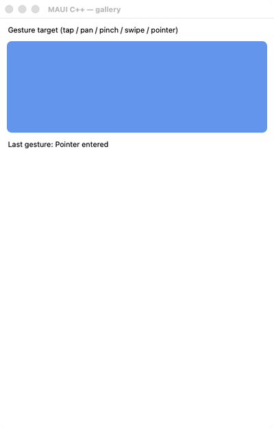</td><td>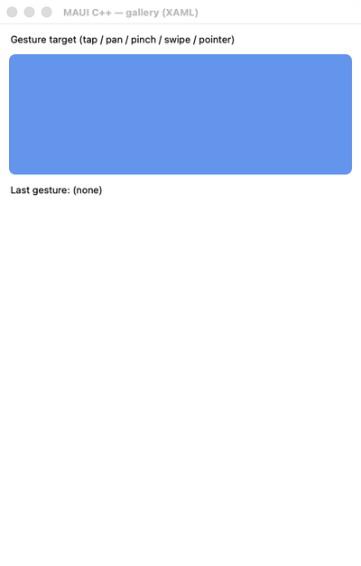</td></tr><tr><th>Dark</th><td></td><td></td><td></td><td>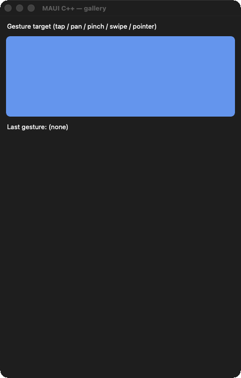</td><td>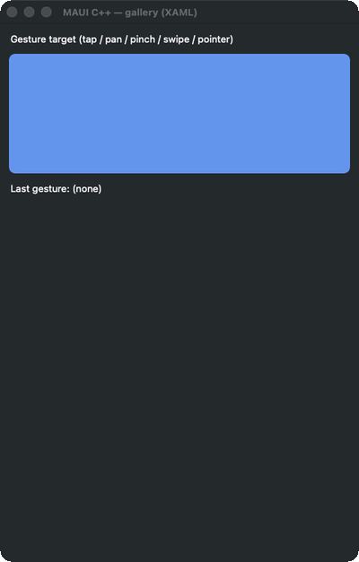</td></tr></table>

ports GesturesPage.xaml (+ .xaml.cs) The MAUI GesturesPage.xaml is a *gallery navigation* page: a CollectionView listing gesture-demo sections that the shell navigates into

#### 🟢 Pixel-Perfect Score — C++ (C1/C3)

**Motion:** ✅ PASS · run 2026-08-13-21_07_16 · 2026-08-13

Light: MOTION 14 frames paired by step (run 2026-08-13-21_07_16, commit 74dde0864a, 2026-08-13) — worst SSIM 0.9971 at frame 2 'tapped' (0.11% pixels differ), mean SSIM 0.9972; per-frame diff% 0.09/0.11/0.11/0.11/0.11/0.11/0.11/0.11/0.11/0.11/0.11/0.11/0.11/0.11; self-motion MAUI 0.0251% (206 px) vs C++ 0.0298% (244 px) · Dark: MOTION 14 frames paired by step (run 2026-08-13-21_07_16, commit 74dde0864a, 2026-08-13) — worst SSIM 0.9972 at frame 2 'tapped' (0.11% pixels differ), mean SSIM 0.9972; per-frame diff% 0.08/0.11/0.11/0.11/0.11/0.11/0.11/0.11/0.11/0.11/0.11/0.11/0.11/0.11; self-motion MAUI 0.0277% (227 px) vs C++ 0.0343% (281 px)

#### 🟢 Pixel-Perfect Score — C++ &amp; XAML (C2/C4)

**Motion:** ✅ PASS · run 2026-08-13-21_07_16 · 2026-08-13

Light: MOTION 11 frames paired by step (run 2026-08-13-21_07_16, commit 74dde0864a, 2026-08-13); 6 frame(s) had no partner and were NOT scored; column frames realigned by -3 sample(s) — a sampling drift, not a defect (see _align) — worst SSIM 0.9951 at frame 1 'gif02' (0.17% pixels differ), mean SSIM 0.9951; per-frame diff% 0.17/0.17/0.17/0.17/0.17/0.17/0.17/0.17/0.17/0.17/0.17; self-motion MAUI 0.0251% (206 px) vs C++ &amp; XAML 0.0282% (231 px) · Dark: MOTION 11 frames paired by step (run 2026-08-13-21_07_16, commit 74dde0864a, 2026-08-13); 6 frame(s) had no partner and were NOT scored; column frames realigned by -3 sample(s) — a sampling drift, not a defect (see _align) — worst SSIM 0.9951 at frame 1 'gif02' (0.17% pixels differ), mean SSIM 0.9951; per-frame diff% 0.17/0.17/0.17/0.17/0.17/0.17/0.17/0.17/0.17/0.17/0.17; self-motion MAUI 0.0277% (227 px) vs C++ &amp; XAML 0.0328% (269 px)

### 66. Gradient — 🟢/🟢
gradient

<table><tr><th></th><th>MAUI</th><th>C++</th><th>C++ &amp; XAML</th><th>AppKit / C++</th><th>AppKit / C++ &amp; XAML</th></tr><tr><th>Light</th><td></td><td></td><td></td><td></td><td></td></tr><tr><th>Dark</th><td></td><td></td><td></td><td></td><td></td></tr></table>

a faithful reproduction of the maui-compare &amp;quot;gradient&amp;quot; demo (ComparePages.Gradient()), the shipped-.NET-MAUI reference for the visual-parity comparison: a VerticalStackLayout (Spacing 12, Padding 16) of two captioned 60px BoxViews — a Linea

#### 🟢 Pixel-Perfect Score — C++ (C1/C3)

Light: SSIM 0.9978, 0.09% pixels differ · Dark: SSIM 0.9978, 0.08% pixels differ

#### 🟢 Pixel-Perfect Score — C++ &amp; XAML (C2/C4)

Light: SSIM 0.9965, 0.12% pixels differ · Dark: SSIM 0.9966, 0.11% pixels differ

### 67. Grid — 🟢/🟢
grid

<table><tr><th></th><th>MAUI</th><th>C++</th><th>C++ &amp; XAML</th><th>AppKit / C++</th><th>AppKit / C++ &amp; XAML</th></tr><tr><th>Light</th><td></td><td></td><td></td><td></td><td></td></tr><tr><th>Dark</th><td></td><td></td><td></td><td></td><td></td></tr></table>

a faithful reproduction of the maui-compare &amp;quot;grid&amp;quot; demo (ComparePages.GridPage()), the shipped-.NET-MAUI reference for the visual-parity comparison: a Grid (Padding 16, Row/ColumnSpacing 6) with RowDefinitions Auto / 80 / 80 and two Star co

#### 🟢 Pixel-Perfect Score — C++ (C1/C3)

Light: SSIM 0.9978, 0.09% pixels differ · Dark: SSIM 0.9978, 0.08% pixels differ

#### 🟢 Pixel-Perfect Score — C++ &amp; XAML (C2/C4)

Light: SSIM 0.9965, 0.12% pixels differ · Dark: SSIM 0.9966, 0.11% pixels differ

### 68. Grid Grouping — 🟢/🟢
grid_grouping

<table><tr><th></th><th>MAUI</th><th>C++</th><th>C++ &amp; XAML</th><th>AppKit / C++</th><th>AppKit / C++ &amp; XAML</th></tr><tr><th>Light</th><td></td><td></td><td></td><td></td><td></td></tr><tr><th>Dark</th><td></td><td></td><td></td><td></td><td></td></tr></table>

ports GroupingGalleries/GridGrouping.xaml (+ .xaml.cs) of the C# CollectionView gallery

#### 🟢 Pixel-Perfect Score — C++ (C1/C3)

Light: SSIM 0.9978, 0.09% pixels differ · Dark: SSIM 0.9979, 0.08% pixels differ

#### 🟢 Pixel-Perfect Score — C++ &amp; XAML (C2/C4)

Light: SSIM 0.9966, 0.12% pixels differ · Dark: SSIM 0.9967, 0.11% pixels differ

### 69. Grouping No Templates — 🟢/🟢
grouping_no_templates

<table><tr><th></th><th>MAUI</th><th>C++</th><th>C++ &amp; XAML</th><th>AppKit / C++</th><th>AppKit / C++ &amp; XAML</th></tr><tr><th>Light</th><td></td><td></td><td></td><td></td><td></td></tr><tr><th>Dark</th><td></td><td></td><td></td><td></td><td></td></tr></table>

ports GroupingGalleries/GroupingNoTemplates.xaml (+ .xaml.cs) of the C# CollectionView gallery

#### 🟢 Pixel-Perfect Score — C++ (C1/C3)

Light: SSIM 0.9978, 0.09% pixels differ · Dark: SSIM 0.9978, 0.08% pixels differ

#### 🟢 Pixel-Perfect Score — C++ &amp; XAML (C2/C4)

Light: SSIM 0.9965, 0.12% pixels differ · Dark: SSIM 0.9966, 0.11% pixels differ

### 70. Grouping Plus Selection — 🟢/🟢
grouping_plus_selection

<table><tr><th></th><th>MAUI</th><th>C++</th><th>C++ &amp; XAML</th><th>AppKit / C++</th><th>AppKit / C++ &amp; XAML</th></tr><tr><th>Light</th><td></td><td></td><td></td><td></td><td></td></tr><tr><th>Dark</th><td></td><td></td><td></td><td></td><td></td></tr></table>

ports CollectionViewGalleries/GroupingGalleries/ GroupingPlusSelection.xaml (+ .xaml.cs) of the C# CollectionView gallery

#### 🟢 Pixel-Perfect Score — C++ (C1/C3)

Light: SSIM 0.9978, 0.09% pixels differ · Dark: SSIM 0.9979, 0.08% pixels differ

#### 🟢 Pixel-Perfect Score — C++ &amp; XAML (C2/C4)

Light: SSIM 0.9966, 0.12% pixels differ · Dark: SSIM 0.9967, 0.11% pixels differ

### 71. Header Footer — 🟢/🟢
header_footer

<table><tr><th></th><th>MAUI</th><th>C++</th><th>C++ &amp; XAML</th><th>AppKit / C++</th><th>AppKit / C++ &amp; XAML</th></tr><tr><th>Light</th><td></td><td></td><td></td><td></td><td></td></tr><tr><th>Dark</th><td></td><td></td><td></td><td></td><td></td></tr></table>

ports HeaderFooterString.xaml (+ HeaderFooterString.xaml.cs)

#### 🟢 Pixel-Perfect Score — C++ (C1/C3)

Light: SSIM 0.9978, 0.09% pixels differ · Dark: SSIM 0.9978, 0.08% pixels differ

#### 🟢 Pixel-Perfect Score — C++ &amp; XAML (C2/C4)

Light: SSIM 0.9965, 0.12% pixels differ · Dark: SSIM 0.9966, 0.11% pixels differ

### 72. Header Footer Grid — 🟢/🟢
header_footer_grid

<table><tr><th></th><th>MAUI</th><th>C++</th><th>C++ &amp; XAML</th><th>AppKit / C++</th><th>AppKit / C++ &amp; XAML</th></tr><tr><th>Light</th><td></td><td></td><td></td><td></td><td></td></tr><tr><th>Dark</th><td></td><td></td><td></td><td></td><td></td></tr></table>

ports HeaderFooterGrid.xaml (+ HeaderFooterGrid.xaml.cs) of the C# CollectionView gallery (CollectionViewGalleries/HeaderFooterGalleries)

#### 🟢 Pixel-Perfect Score — C++ (C1/C3)

Light: SSIM 0.9951, 0.24% pixels differ · Dark: SSIM 0.9917, 0.31% pixels differ

#### 🟢 Pixel-Perfect Score — C++ &amp; XAML (C2/C4)

Light: SSIM 0.9938, 0.27% pixels differ · Dark: SSIM 0.9904, 0.34% pixels differ

### 73. Header Footer Grid Horizontal — 🟡/🟡
header_footer_grid_horizontal

<table><tr><th></th><th>MAUI</th><th>C++</th><th>C++ &amp; XAML</th><th>AppKit / C++</th><th>AppKit / C++ &amp; XAML</th></tr><tr><th>Light</th><td></td><td></td><td></td><td></td><td></td></tr><tr><th>Dark</th><td></td><td></td><td></td><td></td><td></td></tr></table>

ports HeaderFooterGridHorizontal.xaml (+ HeaderFooterGridHorizontal.xaml.cs) of the C# CollectionView gallery (CollectionViewGalleries/HeaderFooterGalleries)

#### 🟡 Pixel-Perfect Score — C++ (C1/C3)

Light: SSIM 0.9802, 0.52% pixels differ · Dark: SSIM 0.9790, 0.71% pixels differ

#### 🟡 Pixel-Perfect Score — C++ &amp; XAML (C2/C4)

Light: SSIM 0.9789, 0.55% pixels differ · Dark: SSIM 0.9778, 0.74% pixels differ

### 74. Header Footer Template — 🟢/🟢
header_footer_template

<table><tr><th></th><th>MAUI</th><th>C++</th><th>C++ &amp; XAML</th><th>AppKit / C++</th><th>AppKit / C++ &amp; XAML</th></tr><tr><th>Light</th><td></td><td></td><td></td><td></td><td></td></tr><tr><th>Dark</th><td></td><td></td><td></td><td></td><td></td></tr></table>

ports HeaderFooterTemplate.xaml (+ .xaml.cs) of the C# CollectionView gallery (CollectionViewGalleries/HeaderFooterGalleries)

#### 🟢 Pixel-Perfect Score — C++ (C1/C3)

Light: SSIM 0.9978, 0.09% pixels differ · Dark: SSIM 0.9979, 0.08% pixels differ

#### 🟢 Pixel-Perfect Score — C++ &amp; XAML (C2/C4)

Light: SSIM 0.9966, 0.12% pixels differ · Dark: SSIM 0.9967, 0.11% pixels differ

### 75. Header Footer View — 🟢/🟢
header_footer_view

<table><tr><th></th><th>MAUI</th><th>C++</th><th>C++ &amp; XAML</th><th>AppKit / C++</th><th>AppKit / C++ &amp; XAML</th></tr><tr><th>Light</th><td></td><td></td><td></td><td></td><td></td></tr><tr><th>Dark</th><td></td><td></td><td></td><td></td><td></td></tr></table>

ports HeaderFooterView.xaml (+ .xaml.cs) of the C# CollectionView gallery (CollectionViewGalleries/HeaderFooterGalleries)

#### 🟢 Pixel-Perfect Score — C++ (C1/C3)

Light: SSIM 0.9978, 0.09% pixels differ · Dark: SSIM 0.9979, 0.08% pixels differ

#### 🟢 Pixel-Perfect Score — C++ &amp; XAML (C2/C4)

Light: SSIM 0.9966, 0.12% pixels differ · Dark: SSIM 0.9967, 0.11% pixels differ

### 76. Hit Testing — 🟢/🟢
hit_testing

<table><tr><th></th><th>MAUI</th><th>C++</th><th>C++ &amp; XAML</th><th>AppKit / C++</th><th>AppKit / C++ &amp; XAML</th></tr><tr><th>Light</th><td></td><td></td><td></td><td></td><td></td></tr><tr><th>Dark</th><td></td><td></td><td></td><td></td><td></td></tr></table>

ports HitTestingPage.xaml (+ .xaml.cs) (Maui.Controls.Sample.Pages.HitTestingPage)

#### 🟢 Pixel-Perfect Score — C++ (C1/C3)

**Motion:** ✅ PASS · run 2026-08-13-21_07_16 · 2026-08-13

Light: MOTION 2 frames paired by step (run 2026-08-13-21_07_16, commit 74dde0864a, 2026-08-13) — worst SSIM 0.9977 at frame 1 'initial' (0.11% pixels differ), mean SSIM 0.9977; per-frame diff% 0.11/0.11; self-motion MAUI 0.0134% (110 px) vs C++ 0.0134% (110 px) · Dark: MOTION 2 frames paired by step (run 2026-08-13-21_07_16, commit 74dde0864a, 2026-08-13) — worst SSIM 0.9977 at frame 1 'initial' (0.11% pixels differ), mean SSIM 0.9977; per-frame diff% 0.11/0.11; self-motion MAUI 0.0134% (110 px) vs C++ 0.0134% (110 px)

#### 🟢 Pixel-Perfect Score — C++ &amp; XAML (C2/C4)

**Motion:** ✅ PASS · run 2026-08-13-21_07_16 · 2026-08-13

Light: MOTION 2 frames paired by step (run 2026-08-13-21_07_16, commit 74dde0864a, 2026-08-13) — worst SSIM 0.9964 at frame 1 'initial' (0.14% pixels differ), mean SSIM 0.9964; per-frame diff% 0.14/0.14; self-motion MAUI 0.0134% (110 px) vs C++ &amp; XAML 0.0134% (110 px) · Dark: MOTION 2 frames paired by step (run 2026-08-13-21_07_16, commit 74dde0864a, 2026-08-13) — worst SSIM 0.9965 at frame 1 'initial' (0.14% pixels differ), mean SSIM 0.9965; per-frame diff% 0.14/0.14; self-motion MAUI 0.0134% (110 px) vs C++ &amp; XAML 0.0134% (110 px)

### 77. Horizontal Stack — 🟢/🟢
horizontal_stack

<table><tr><th></th><th>MAUI</th><th>C++</th><th>C++ &amp; XAML</th><th>AppKit / C++</th><th>AppKit / C++ &amp; XAML</th></tr><tr><th>Light</th><td></td><td></td><td></td><td></td><td></td></tr><tr><th>Dark</th><td></td><td></td><td></td><td></td><td></td></tr></table>

Horizontal Stack

#### 🟢 Pixel-Perfect Score — C++ (C1/C3)

Light: SSIM 0.9978, 0.09% pixels differ · Dark: SSIM 0.9978, 0.08% pixels differ

#### 🟢 Pixel-Perfect Score — C++ &amp; XAML (C2/C4)

Light: SSIM 0.9965, 0.12% pixels differ · Dark: SSIM 0.9966, 0.11% pixels differ

### 78. Hybrid Web View — 🟢/🟢
hybrid_web_view

<table><tr><th></th><th>MAUI</th><th>C++</th><th>C++ &amp; XAML</th><th>AppKit / C++</th><th>AppKit / C++ &amp; XAML</th></tr><tr><th>Light</th><td></td><td></td><td></td><td></td><td></td></tr><tr><th>Dark</th><td></td><td></td><td></td><td></td><td></td></tr></table>

ports HybridWebViewPage.xaml (+ HybridWebViewPage.xaml.cs)

#### 🟢 Pixel-Perfect Score — C++ (C1/C3)

Light: SSIM 0.9978, 0.09% pixels differ · Dark: SSIM 0.9978, 0.08% pixels differ

#### 🟢 Pixel-Perfect Score — C++ &amp; XAML (C2/C4)

Light: SSIM 0.9965, 0.12% pixels differ · Dark: SSIM 0.9966, 0.11% pixels differ

### 79. Image — 🟢/🟢
image

<table><tr><th></th><th>MAUI</th><th>C++</th><th>C++ &amp; XAML</th><th>AppKit / C++</th><th>AppKit / C++ &amp; XAML</th></tr><tr><th>Light</th><td></td><td></td><td></td><td></td><td></td></tr><tr><th>Dark</th><td></td><td></td><td></td><td></td><td></td></tr></table>

ports ImagePage.xaml (+ ImagePage.xaml.cs)

#### 🟢 Pixel-Perfect Score — C++ (C1/C3)

Light: SSIM 0.9978, 0.09% pixels differ · Dark: SSIM 0.9978, 0.08% pixels differ

#### 🟢 Pixel-Perfect Score — C++ &amp; XAML (C2/C4)

Light: SSIM 0.9965, 0.12% pixels differ · Dark: SSIM 0.9966, 0.11% pixels differ

### 80. Image Button — 🟢/🟢
image_button

<table><tr><th></th><th>MAUI</th><th>C++</th><th>C++ &amp; XAML</th><th>AppKit / C++</th><th>AppKit / C++ &amp; XAML</th></tr><tr><th>Light</th><td></td><td></td><td></td><td></td><td></td></tr><tr><th>Dark</th><td></td><td></td><td></td><td></td><td></td></tr></table>

ports ImageButtonPage.xaml (+ ImageButtonPage.xaml.cs) A self-contained, code-first demo page for the ImageButton control (the C# gallery-page convention, mirroring the input_controls_page / image_page pattern)

#### 🟢 Pixel-Perfect Score — C++ (C1/C3)

Light: SSIM 0.9947, 0.24% pixels differ · Dark: SSIM 0.9947, 0.23% pixels differ

#### 🟢 Pixel-Perfect Score — C++ &amp; XAML (C2/C4)

Light: SSIM 0.9935, 0.27% pixels differ · Dark: SSIM 0.9935, 0.26% pixels differ

### 81. Indicator — 🟢/🟢
indicator

<table><tr><th></th><th>MAUI</th><th>C++</th><th>C++ &amp; XAML</th><th>AppKit / C++</th><th>AppKit / C++ &amp; XAML</th></tr><tr><th>Light</th><td></td><td></td><td></td><td></td><td></td></tr><tr><th>Dark</th><td></td><td></td><td></td><td></td><td></td></tr></table>

ports IndicatorPage.xaml A self-contained, code-first demo of the IndicatorView control

#### 🟢 Pixel-Perfect Score — C++ (C1/C3)

Light: SSIM 0.9911, 0.30% pixels differ · Dark: SSIM 0.9890, 0.37% pixels differ

#### 🟢 Pixel-Perfect Score — C++ &amp; XAML (C2/C4)

Light: SSIM 0.9907, 0.31% pixels differ · Dark: SSIM 0.9888, 0.38% pixels differ

### 82. Input Controls — 🟢/🟢
input_controls

<table><tr><th></th><th>MAUI</th><th>C++</th><th>C++ &amp; XAML</th><th>AppKit / C++</th><th>AppKit / C++ &amp; XAML</th></tr><tr><th>Light</th><td></td><td></td><td></td><td></td><td></td></tr><tr><th>Dark</th><td></td><td></td><td></td><td></td><td></td></tr></table>

a self-contained demo page for the W1-05 input-control set: editor, search_bar, radio_button (+ the radio_button_group attached grouping) and image_button on one vertical stack, wired together so every input drives a visible output (the C#

#### 🟢 Pixel-Perfect Score — C++ (C1/C3)

Light: SSIM 0.9967, 0.15% pixels differ · Dark: SSIM 0.9967, 0.16% pixels differ

#### 🟢 Pixel-Perfect Score — C++ &amp; XAML (C2/C4)

Light: SSIM 0.9954, 0.18% pixels differ · Dark: SSIM 0.9954, 0.19% pixels differ

### 83. Input Transparent — 🟢/🟢
input_transparent

<table><tr><th></th><th>MAUI</th><th>C++</th><th>C++ &amp; XAML</th><th>AppKit / C++</th><th>AppKit / C++ &amp; XAML</th></tr><tr><th>Light</th><td></td><td></td><td></td><td></td><td></td></tr><tr><th>Dark</th><td></td><td></td><td></td><td></td><td></td></tr></table>

ports InputTransparentPage.xaml (Maui.Controls.Sample.Pages.InputTransparentPage)

#### 🟢 Pixel-Perfect Score — C++ (C1/C3)

Light: SSIM 0.9978, 0.09% pixels differ · Dark: SSIM 0.9978, 0.08% pixels differ

#### 🟢 Pixel-Perfect Score — C++ &amp; XAML (C2/C4)

Light: SSIM 0.9965, 0.12% pixels differ · Dark: SSIM 0.9966, 0.11% pixels differ

### 84. Invalidate Brush — 🟢/🟢
invalidate_brush

<table><tr><th></th><th>MAUI</th><th>C++</th><th>C++ &amp; XAML</th><th>AppKit / C++</th><th>AppKit / C++ &amp; XAML</th></tr><tr><th>Light</th><td></td><td></td><td></td><td></td><td></td></tr><tr><th>Dark</th><td></td><td></td><td></td><td></td><td></td></tr></table>

ports InvalidateBrushGallery.xaml A code-first port of the MAUI Shapes sub-gallery Pages/Controls/ShapesGalleries/InvalidateBrushGallery.xaml (&amp;quot;Invalidate Brushes Playground&amp;quot;): a VerticalStackLayout (Padding 12) with — - a &amp;quot;Change color&amp;quot; Bu

#### 🟢 Pixel-Perfect Score — C++ (C1/C3)

Light: SSIM 0.9978, 0.09% pixels differ · Dark: SSIM 0.9978, 0.08% pixels differ

#### 🟢 Pixel-Perfect Score — C++ &amp; XAML (C2/C4)

Light: SSIM 0.9965, 0.12% pixels differ · Dark: SSIM 0.9966, 0.11% pixels differ

### 85. Invalidate Shadow Host — 🟢/🟢
invalidate_shadow_host

<table><tr><th></th><th>MAUI</th><th>C++</th><th>C++ &amp; XAML</th><th>AppKit / C++</th><th>AppKit / C++ &amp; XAML</th></tr><tr><th>Light</th><td></td><td></td><td></td><td></td><td></td></tr><tr><th>Dark</th><td></td><td></td><td></td><td></td><td></td></tr></table>

ports InvalidateShadowHostPage.xaml A self-contained, code-first demo that a shadow re-applies (invalidates) when its host&amp;#x27;s size changes, mirroring the C# core gallery page (Pages/Core/ShadowGalleries/InvalidateShadowHostPage.xaml + .xaml.

#### 🟢 Pixel-Perfect Score — C++ (C1/C3)

Light: SSIM 0.9978, 0.09% pixels differ · Dark: SSIM 0.9969, 0.08% pixels differ

#### 🟢 Pixel-Perfect Score — C++ &amp; XAML (C2/C4)

Light: SSIM 0.9965, 0.12% pixels differ · Dark: SSIM 0.9956, 0.11% pixels differ

### 86. Ios Blur Effect — 🟢/🟢
ios_blur_effect

<table><tr><th></th><th>MAUI</th><th>C++</th><th>C++ &amp; XAML</th><th>AppKit / C++</th><th>AppKit / C++ &amp; XAML</th></tr><tr><th>Light</th><td></td><td></td><td></td><td></td><td></td></tr><tr><th>Dark</th><td></td><td></td><td></td><td></td><td></td></tr></table>

ports iOSBlurEffectPage.xaml The .NET MAUI PlatformSpecifics sample (Pages/PlatformSpecifics/iOS/iOSBlurEffectPage.xaml + .xaml.cs): an Image (Source=&amp;quot;oasis.jpg&amp;quot;) carrying the iOSSpecific VisualElement.BlurEffect knob (XAML seeds it to Extr

#### 🟢 Pixel-Perfect Score — C++ (C1/C3)

**Motion:** 🚫 INVALID · `no-scenario` · run 2026-08-13-21_07_16 · 2026-08-13

Light: !! NO MOTION EVIDENCE: neither MAUI nor C++ changed by more than 0.012% of its own frame across the sequence (0 px vs 0 px), on a page the board treats as ANIMATED. NO ACTION SCENARIO EXISTS for this page — docs/comparison/scenarios/ios_blur_effect.toml is absent or declares no `action` — so nothing was ever aimed at it and both columns are at rest by construction. This is NOT a port finding and nothing about the port can be concluded from it; the missing artifact is the scenario. 80 of the 139 cells that carried the old 'NOTHING MOVED' banner were this, including 10 of the 14 hard-coded ANIMATED pages. MOTION 9 frames paired by step (run 2026-08-13-21_07_16, commit 74dde0864a, 2026-08-13); 6 frame(s) had no partner and were NOT scored; column frames realigned by -3 sample(s) — a sampling drift, not a defect (see _align) — worst SSIM 0.9978 at frame 1 'gif04' (0.09% pixels differ), mean SSIM 0.9978; per-frame diff% 0.09/0.09/0.09/0.09/0.09/0.09/0.09/0.09/0.09; self-motion MAUI 0.0000% (0 px) vs C++ 0.0000% (0 px) · Dark: !! NO MOTION EVIDENCE: neither MAUI nor C++ changed by more than 0.012% of its own frame across the sequence (0 px vs 0 px), on a page the board treats as ANIMATED. NO ACTION SCENARIO EXISTS for this page — docs/comparison/scenarios/ios_blur_effect.toml is absent or declares no `action` — so nothing was ever aimed at it and both columns are at rest by construction. This is NOT a port finding and nothing about the port can be concluded from it; the missing artifact is the scenario. 80 of the 139 cells that carried the old 'NOTHING MOVED' banner were this, including 10 of the 14 hard-coded ANIMATED pages. MOTION 9 frames paired by step (run 2026-08-13-21_07_16, commit 74dde0864a, 2026-08-13); 6 frame(s) had no partner and were NOT scored; column frames realigned by -3 sample(s) — a sampling drift, not a defect (see _align) — worst SSIM 0.9978 at frame 1 'gif04' (0.08% pixels differ), mean SSIM 0.9978; per-frame diff% 0.08/0.08/0.08/0.08/0.08/0.08/0.08/0.08/0.08; self-motion MAUI 0.0000% (0 px) vs C++ 0.0000% (0 px)

#### 🟢 Pixel-Perfect Score — C++ &amp; XAML (C2/C4)

**Motion:** 🚫 INVALID · `no-scenario` · run 2026-08-13-21_07_16 · 2026-08-13

Light: !! NO MOTION EVIDENCE: neither MAUI nor C++ &amp; XAML changed by more than 0.012% of its own frame across the sequence (0 px vs 0 px), on a page the board treats as ANIMATED. NO ACTION SCENARIO EXISTS for this page — docs/comparison/scenarios/ios_blur_effect.toml is absent or declares no `action` — so nothing was ever aimed at it and both columns are at rest by construction. This is NOT a port finding and nothing about the port can be concluded from it; the missing artifact is the scenario. 80 of the 139 cells that carried the old 'NOTHING MOVED' banner were this, including 10 of the 14 hard-coded ANIMATED pages. MOTION 9 frames paired by step (run 2026-08-13-21_07_16, commit 74dde0864a, 2026-08-13); 6 frame(s) had no partner and were NOT scored; column frames realigned by -3 sample(s) — a sampling drift, not a defect (see _align) — worst SSIM 0.9965 at frame 1 'gif04' (0.12% pixels differ), mean SSIM 0.9965; per-frame diff% 0.12/0.12/0.12/0.12/0.12/0.12/0.12/0.12/0.12; self-motion MAUI 0.0000% (0 px) vs C++ &amp; XAML 0.0000% (0 px) · Dark: !! NO MOTION EVIDENCE: neither MAUI nor C++ &amp; XAML changed by more than 0.012% of its own frame across the sequence (0 px vs 0 px), on a page the board treats as ANIMATED. NO ACTION SCENARIO EXISTS for this page — docs/comparison/scenarios/ios_blur_effect.toml is absent or declares no `action` — so nothing was ever aimed at it and both columns are at rest by construction. This is NOT a port finding and nothing about the port can be concluded from it; the missing artifact is the scenario. 80 of the 139 cells that carried the old 'NOTHING MOVED' banner were this, including 10 of the 14 hard-coded ANIMATED pages. MOTION 9 frames paired by step (run 2026-08-13-21_07_16, commit 74dde0864a, 2026-08-13); 6 frame(s) had no partner and were NOT scored; column frames realigned by -3 sample(s) — a sampling drift, not a defect (see _align) — worst SSIM 0.9966 at frame 1 'gif04' (0.11% pixels differ), mean SSIM 0.9966; per-frame diff% 0.11/0.11/0.11/0.11/0.11/0.11/0.11/0.11/0.11; self-motion MAUI 0.0000% (0 px) vs C++ &amp; XAML 0.0000% (0 px)

### 87. Ios Date Picker — 🟡/🟡
ios_date_picker

<table><tr><th></th><th>MAUI</th><th>C++</th><th>C++ &amp; XAML</th><th>AppKit / C++</th><th>AppKit / C++ &amp; XAML</th></tr><tr><th>Light</th><td></td><td></td><td></td><td></td><td></td></tr><tr><th>Dark</th><td></td><td></td><td></td><td></td><td></td></tr></table>

ports iOSDatePickerPage.xaml (+ iOSDatePickerPage.xaml.cs)

#### 🟡 Pixel-Perfect Score — C++ (C1/C3)

**Motion:** 🚫 INVALID · `unpairable`

Light: SSIM 0.9978, 0.09% pixels differ (single frame only) — NOT motion-scored: run 2026-08-13-21_07_16 has 0 MAUI and 0 C++ frames but NO step name occurs in both, so nothing can be paired — a comparison by frame index would be a guess. Re-capture this page · Dark: SSIM 0.9978, 0.08% pixels differ (single frame only) — NOT motion-scored: run 2026-08-13-21_07_16 has 0 MAUI and 0 C++ frames but NO step name occurs in both, so nothing can be paired — a comparison by frame index would be a guess. Re-capture this page

#### 🟡 Pixel-Perfect Score — C++ &amp; XAML (C2/C4)

**Motion:** 🚫 INVALID · `unpairable`

Light: SSIM 0.9965, 0.12% pixels differ (single frame only) — NOT motion-scored: run 2026-08-13-21_07_16 has 0 MAUI and 0 C++ &amp; XAML frames but NO step name occurs in both, so nothing can be paired — a comparison by frame index would be a guess. Re-capture this page · Dark: SSIM 0.9966, 0.11% pixels differ (single frame only) — NOT motion-scored: run 2026-08-13-21_07_16 has 0 MAUI and 0 C++ &amp; XAML frames but NO step name occurs in both, so nothing can be paired — a comparison by frame index would be a guess. Re-capture this page

### 88. Ios Entry — 🟢/🟢
ios_entry

<table><tr><th></th><th>MAUI</th><th>C++</th><th>C++ &amp; XAML</th><th>AppKit / C++</th><th>AppKit / C++ &amp; XAML</th></tr><tr><th>Light</th><td></td><td></td><td></td><td></td><td></td></tr><tr><th>Dark</th><td></td><td></td><td></td><td></td><td></td></tr></table>

ports iOSEntryPage.xaml (+ iOSEntryPage.xaml.cs)

#### 🟢 Pixel-Perfect Score — C++ (C1/C3)

Light: SSIM 0.9978, 0.09% pixels differ · Dark: SSIM 0.9979, 0.08% pixels differ

#### 🟢 Pixel-Perfect Score — C++ &amp; XAML (C2/C4)

Light: SSIM 0.9965, 0.12% pixels differ · Dark: SSIM 0.9966, 0.11% pixels differ

### 89. Ios First Responder — 🟢/🟢
ios_first_responder

<table><tr><th></th><th>MAUI</th><th>C++</th><th>C++ &amp; XAML</th><th>AppKit / C++</th><th>AppKit / C++ &amp; XAML</th></tr><tr><th>Light</th><td></td><td></td><td></td><td></td><td></td></tr><tr><th>Dark</th><td></td><td></td><td></td><td></td><td></td></tr></table>

ports iOSFirstResponderPage.xaml (+ .xaml.cs) The C# iOSFirstResponderPage is a VisualElement-first-responder demo: a StackLayout with an explanatory Label, a &amp;quot;First Entry&amp;quot; + plain &amp;quot;OK&amp;quot; Button (tapping OK dismisses the keyboard because the

#### 🟢 Pixel-Perfect Score — C++ (C1/C3)

Light: SSIM 0.9978, 0.09% pixels differ · Dark: SSIM 0.9978, 0.08% pixels differ

#### 🟢 Pixel-Perfect Score — C++ &amp; XAML (C2/C4)

Light: SSIM 0.9965, 0.12% pixels differ · Dark: SSIM 0.9966, 0.11% pixels differ

### 90. Ios Pan Gesture — 🟢/🟢
ios_pan_gesture

<table><tr><th></th><th>MAUI</th><th>C++</th><th>C++ &amp; XAML</th><th>AppKit / C++</th><th>AppKit / C++ &amp; XAML</th></tr><tr><th>Light</th><td></td><td></td><td></td><td></td><td></td></tr><tr><th>Dark</th><td></td><td></td><td></td><td></td><td></td></tr></table>

ports iOSPanGestureRecognizerPage.xaml (+ .xaml.cs) The C# iOSPanGestureRecognizerPage is a StackLayout with: a bold message Label (_messageLabel), a &amp;quot;Toggle Simultaneous Gesture Recognition&amp;quot; Button, and a grouped ListView of employees whos

#### 🟢 Pixel-Perfect Score — C++ (C1/C3)

**Motion:** 🚫 INVALID · `no-scenario` · run 2026-08-13-21_07_16 · 2026-08-13

Light: !! NO MOTION EVIDENCE: neither MAUI nor C++ changed by more than 0.012% of its own frame across the sequence (0 px vs 0 px), on a page the board treats as ANIMATED. NO ACTION SCENARIO EXISTS for this page — docs/comparison/scenarios/ios_pan_gesture.toml is absent or declares no `action` — so nothing was ever aimed at it and both columns are at rest by construction. This is NOT a port finding and nothing about the port can be concluded from it; the missing artifact is the scenario. 80 of the 139 cells that carried the old 'NOTHING MOVED' banner were this, including 10 of the 14 hard-coded ANIMATED pages. MOTION 9 frames paired by step (run 2026-08-13-21_07_16, commit 74dde0864a, 2026-08-13); 6 frame(s) had no partner and were NOT scored; column frames realigned by -3 sample(s) — a sampling drift, not a defect (see _align) — worst SSIM 0.9978 at frame 1 'gif04' (0.09% pixels differ), mean SSIM 0.9978; per-frame diff% 0.09/0.09/0.09/0.09/0.09/0.09/0.09/0.09/0.09; self-motion MAUI 0.0000% (0 px) vs C++ 0.0000% (0 px) · Dark: !! NO MOTION EVIDENCE: neither MAUI nor C++ changed by more than 0.012% of its own frame across the sequence (0 px vs 0 px), on a page the board treats as ANIMATED. NO ACTION SCENARIO EXISTS for this page — docs/comparison/scenarios/ios_pan_gesture.toml is absent or declares no `action` — so nothing was ever aimed at it and both columns are at rest by construction. This is NOT a port finding and nothing about the port can be concluded from it; the missing artifact is the scenario. 80 of the 139 cells that carried the old 'NOTHING MOVED' banner were this, including 10 of the 14 hard-coded ANIMATED pages. MOTION 9 frames paired by step (run 2026-08-13-21_07_16, commit 74dde0864a, 2026-08-13); 6 frame(s) had no partner and were NOT scored; column frames realigned by -3 sample(s) — a sampling drift, not a defect (see _align) — worst SSIM 0.9978 at frame 1 'gif04' (0.08% pixels differ), mean SSIM 0.9978; per-frame diff% 0.08/0.08/0.08/0.08/0.08/0.08/0.08/0.08/0.08; self-motion MAUI 0.0000% (0 px) vs C++ 0.0000% (0 px)

#### 🟢 Pixel-Perfect Score — C++ &amp; XAML (C2/C4)

**Motion:** 🚫 INVALID · `no-scenario` · run 2026-08-13-21_07_16 · 2026-08-13

Light: !! NO MOTION EVIDENCE: neither MAUI nor C++ &amp; XAML changed by more than 0.012% of its own frame across the sequence (0 px vs 0 px), on a page the board treats as ANIMATED. NO ACTION SCENARIO EXISTS for this page — docs/comparison/scenarios/ios_pan_gesture.toml is absent or declares no `action` — so nothing was ever aimed at it and both columns are at rest by construction. This is NOT a port finding and nothing about the port can be concluded from it; the missing artifact is the scenario. 80 of the 139 cells that carried the old 'NOTHING MOVED' banner were this, including 10 of the 14 hard-coded ANIMATED pages. MOTION 9 frames paired by step (run 2026-08-13-21_07_16, commit 74dde0864a, 2026-08-13); 6 frame(s) had no partner and were NOT scored; column frames realigned by -3 sample(s) — a sampling drift, not a defect (see _align) — worst SSIM 0.9965 at frame 1 'gif04' (0.12% pixels differ), mean SSIM 0.9965; per-frame diff% 0.12/0.12/0.12/0.12/0.12/0.12/0.12/0.12/0.12; self-motion MAUI 0.0000% (0 px) vs C++ &amp; XAML 0.0000% (0 px) · Dark: !! NO MOTION EVIDENCE: neither MAUI nor C++ &amp; XAML changed by more than 0.012% of its own frame across the sequence (0 px vs 0 px), on a page the board treats as ANIMATED. NO ACTION SCENARIO EXISTS for this page — docs/comparison/scenarios/ios_pan_gesture.toml is absent or declares no `action` — so nothing was ever aimed at it and both columns are at rest by construction. This is NOT a port finding and nothing about the port can be concluded from it; the missing artifact is the scenario. 80 of the 139 cells that carried the old 'NOTHING MOVED' banner were this, including 10 of the 14 hard-coded ANIMATED pages. MOTION 9 frames paired by step (run 2026-08-13-21_07_16, commit 74dde0864a, 2026-08-13); 6 frame(s) had no partner and were NOT scored; column frames realigned by -3 sample(s) — a sampling drift, not a defect (see _align) — worst SSIM 0.9966 at frame 1 'gif04' (0.11% pixels differ), mean SSIM 0.9966; per-frame diff% 0.11/0.11/0.11/0.11/0.11/0.11/0.11/0.11/0.11; self-motion MAUI 0.0000% (0 px) vs C++ &amp; XAML 0.0000% (0 px)

### 91. Ios Picker — 🟢/🟢
ios_picker

<table><tr><th></th><th>MAUI</th><th>C++</th><th>C++ &amp; XAML</th><th>AppKit / C++</th><th>AppKit / C++ &amp; XAML</th></tr><tr><th>Light</th><td></td><td></td><td></td><td></td><td></td></tr><tr><th>Dark</th><td></td><td></td><td></td><td></td><td></td></tr></table>

ports iOSPickerPage.xaml (+ iOSPickerPage.xaml.cs)

#### 🟢 Pixel-Perfect Score — C++ (C1/C3)

**Motion:** ✅ PASS · run 2026-08-13-21_07_16 · 2026-08-13

Light: MOTION 2 frames paired by step (run 2026-08-13-21_07_16, commit 74dde0864a, 2026-08-13) — worst SSIM 0.9978 at frame 1 'initial' (0.09% pixels differ), mean SSIM 0.9978; per-frame diff% 0.09/0.08; self-motion MAUI 94.1802% (771524 px) vs C++ 94.1781% (771507 px) · Dark: MOTION 2 frames paired by step (run 2026-08-13-21_07_16, commit 74dde0864a, 2026-08-13) — worst SSIM 0.9978 at frame 2 'opened' (0.08% pixels differ), mean SSIM 0.9979; per-frame diff% 0.08/0.08; self-motion MAUI 1.9984% (16371 px) vs C++ 1.9984% (16371 px)

#### 🟢 Pixel-Perfect Score — C++ &amp; XAML (C2/C4)

**Motion:** ✅ PASS · run 2026-08-13-21_07_16 · 2026-08-13

Light: MOTION 2 frames paired by step (run 2026-08-13-21_07_16, commit 74dde0864a, 2026-08-13) — worst SSIM 0.9965 at frame 1 'initial' (0.12% pixels differ), mean SSIM 0.9966; per-frame diff% 0.12/0.12; self-motion MAUI 94.1802% (771524 px) vs C++ &amp; XAML 94.1576% (771339 px) · Dark: MOTION 2 frames paired by step (run 2026-08-13-21_07_16, commit 74dde0864a, 2026-08-13) — worst SSIM 0.9966 at frame 1 'initial' (0.11% pixels differ), mean SSIM 0.9966; per-frame diff% 0.11/0.11; self-motion MAUI 1.9984% (16371 px) vs C++ &amp; XAML 1.9984% (16371 px)

### 92. Ios Safe Area — 🟢/🟢
ios_safe_area

<table><tr><th></th><th>MAUI</th><th>C++</th><th>C++ &amp; XAML</th><th>AppKit / C++</th><th>AppKit / C++ &amp; XAML</th></tr><tr><th>Light</th><td></td><td></td><td></td><td></td><td></td></tr><tr><th>Dark</th><td></td><td></td><td></td><td></td><td></td></tr></table>

ports iOSSafeAreaPage.xaml The .NET MAUI PlatformSpecifics sample (Pages/PlatformSpecifics/iOS/iOSSafeAreaPage.xaml + .xaml.cs): a long Lorem-ipsum Label over a &amp;quot;Disable Use Safe Area&amp;quot; button

#### 🟢 Pixel-Perfect Score — C++ (C1/C3)

Light: SSIM 0.9978, 0.09% pixels differ · Dark: SSIM 0.9978, 0.08% pixels differ

#### 🟢 Pixel-Perfect Score — C++ &amp; XAML (C2/C4)

Light: SSIM 0.9965, 0.12% pixels differ · Dark: SSIM 0.9966, 0.11% pixels differ

### 93. Ios Scroll View — 🟢/🟢
ios_scroll_view

<table><tr><th></th><th>MAUI</th><th>C++</th><th>C++ &amp; XAML</th><th>AppKit / C++</th><th>AppKit / C++ &amp; XAML</th></tr><tr><th>Light</th><td></td><td></td><td></td><td></td><td></td></tr><tr><th>Dark</th><td></td><td></td><td></td><td></td><td></td></tr></table>

ports iOSScrollViewPage.xaml (+ iOSScrollViewPage.xaml.cs)

#### 🟢 Pixel-Perfect Score — C++ (C1/C3)

**Motion:** ✅ PASS · run 2026-08-13-21_07_16 · 2026-08-13

Light: MOTION 2 frames paired by step (run 2026-08-13-21_07_16, commit 74dde0864a, 2026-08-13) — worst SSIM 0.9978 at frame 1 'initial' (0.09% pixels differ), mean SSIM 0.9978; per-frame diff% 0.09/0.09; self-motion MAUI 0.2185% (1790 px) vs C++ 0.2185% (1790 px) · Dark: MOTION 2 frames paired by step (run 2026-08-13-21_07_16, commit 74dde0864a, 2026-08-13) — worst SSIM 0.9978 at frame 1 'initial' (0.08% pixels differ), mean SSIM 0.9978; per-frame diff% 0.08/0.08; self-motion MAUI 0.3932% (3221 px) vs C++ 0.3932% (3221 px)

#### 🟢 Pixel-Perfect Score — C++ &amp; XAML (C2/C4)

**Motion:** ✅ PASS · run 2026-08-13-21_07_16 · 2026-08-13

Light: MOTION 2 frames paired by step (run 2026-08-13-21_07_16, commit 74dde0864a, 2026-08-13) — worst SSIM 0.9965 at frame 1 'initial' (0.12% pixels differ), mean SSIM 0.9965; per-frame diff% 0.12/0.12; self-motion MAUI 0.2185% (1790 px) vs C++ &amp; XAML 0.2185% (1790 px) · Dark: MOTION 2 frames paired by step (run 2026-08-13-21_07_16, commit 74dde0864a, 2026-08-13) — worst SSIM 0.9966 at frame 1 'initial' (0.11% pixels differ), mean SSIM 0.9966; per-frame diff% 0.11/0.11; self-motion MAUI 0.3932% (3221 px) vs C++ &amp; XAML 0.3932% (3221 px)

### 94. Ios Search Bar — 🟢/🟢
ios_search_bar

<table><tr><th></th><th>MAUI</th><th>C++</th><th>C++ &amp; XAML</th><th>AppKit / C++</th><th>AppKit / C++ &amp; XAML</th></tr><tr><th>Light</th><td></td><td></td><td></td><td></td><td></td></tr><tr><th>Dark</th><td></td><td></td><td></td><td></td><td></td></tr></table>

ports iOSSearchBarPage.xaml (+ iOSSearchBarPage.xaml.cs)

#### 🟢 Pixel-Perfect Score — C++ (C1/C3)

Light: SSIM 0.9978, 0.09% pixels differ · Dark: SSIM 0.9979, 0.08% pixels differ

#### 🟢 Pixel-Perfect Score — C++ &amp; XAML (C2/C4)

Light: SSIM 0.9965, 0.12% pixels differ · Dark: SSIM 0.9965, 0.11% pixels differ

### 95. Ios Slider Update On Tap — 🟢/🟢
ios_slider_update_on_tap

<table><tr><th></th><th>MAUI</th><th>C++</th><th>C++ &amp; XAML</th><th>AppKit / C++</th><th>AppKit / C++ &amp; XAML</th></tr><tr><th>Light</th><td></td><td></td><td></td><td></td><td></td></tr><tr><th>Dark</th><td></td><td></td><td></td><td></td><td></td></tr></table>

ports iOSSliderUpdateOnTapPage.xaml (+ iOSSliderUpdateOnTapPage.xaml.cs)

#### 🟢 Pixel-Perfect Score — C++ (C1/C3)

Light: SSIM 0.9978, 0.09% pixels differ · Dark: SSIM 0.9978, 0.08% pixels differ

#### 🟢 Pixel-Perfect Score — C++ &amp; XAML (C2/C4)

Light: SSIM 0.9965, 0.12% pixels differ · Dark: SSIM 0.9966, 0.11% pixels differ

### 96. Ios Swipe Transition — 🟢/🟢
ios_swipe_transition

<table><tr><th></th><th>MAUI</th><th>C++</th><th>C++ &amp; XAML</th><th>AppKit / C++</th><th>AppKit / C++ &amp; XAML</th></tr><tr><th>Light</th><td></td><td></td><td></td><td></td><td></td></tr><tr><th>Dark</th><td></td><td></td><td></td><td></td><td></td></tr></table>

ports iOSSwipeViewTransitionModePage.xaml (+ .xaml.cs) The C# iOSSwipeViewTransitionModePage is a StackLayout with: a horizontal row holding a &amp;quot;SwipeTransitionMode:&amp;quot; Label + an EnumPicker over the SwipeTransitionMode enum (Reveal / Drag, Se

#### 🟢 Pixel-Perfect Score — C++ (C1/C3)

**Motion:** 🚫 INVALID · `no-scenario` · run 2026-08-13-21_07_16 · 2026-08-13

Light: !! NO MOTION EVIDENCE: neither MAUI nor C++ changed by more than 0.012% of its own frame across the sequence (0 px vs 0 px), on a page the board treats as ANIMATED. NO ACTION SCENARIO EXISTS for this page — docs/comparison/scenarios/ios_swipe_transition.toml is absent or declares no `action` — so nothing was ever aimed at it and both columns are at rest by construction. This is NOT a port finding and nothing about the port can be concluded from it; the missing artifact is the scenario. 80 of the 139 cells that carried the old 'NOTHING MOVED' banner were this, including 10 of the 14 hard-coded ANIMATED pages. MOTION 9 frames paired by step (run 2026-08-13-21_07_16, commit 74dde0864a, 2026-08-13); 6 frame(s) had no partner and were NOT scored; column frames realigned by -3 sample(s) — a sampling drift, not a defect (see _align) — worst SSIM 0.9978 at frame 1 'gif04' (0.09% pixels differ), mean SSIM 0.9978; per-frame diff% 0.09/0.09/0.09/0.09/0.09/0.09/0.09/0.09/0.09; self-motion MAUI 0.0000% (0 px) vs C++ 0.0000% (0 px) · Dark: !! NO MOTION EVIDENCE: neither MAUI nor C++ changed by more than 0.012% of its own frame across the sequence (0 px vs 0 px), on a page the board treats as ANIMATED. NO ACTION SCENARIO EXISTS for this page — docs/comparison/scenarios/ios_swipe_transition.toml is absent or declares no `action` — so nothing was ever aimed at it and both columns are at rest by construction. This is NOT a port finding and nothing about the port can be concluded from it; the missing artifact is the scenario. 80 of the 139 cells that carried the old 'NOTHING MOVED' banner were this, including 10 of the 14 hard-coded ANIMATED pages. MOTION 9 frames paired by step (run 2026-08-13-21_07_16, commit 74dde0864a, 2026-08-13); 6 frame(s) had no partner and were NOT scored; column frames realigned by -3 sample(s) — a sampling drift, not a defect (see _align) — worst SSIM 0.9978 at frame 1 'gif04' (0.08% pixels differ), mean SSIM 0.9978; per-frame diff% 0.08/0.08/0.08/0.08/0.08/0.08/0.08/0.08/0.08; self-motion MAUI 0.0000% (0 px) vs C++ 0.0000% (0 px)

#### 🟢 Pixel-Perfect Score — C++ &amp; XAML (C2/C4)

**Motion:** 🚫 INVALID · `no-scenario` · run 2026-08-13-21_07_16 · 2026-08-13

Light: !! NO MOTION EVIDENCE: neither MAUI nor C++ &amp; XAML changed by more than 0.012% of its own frame across the sequence (0 px vs 0 px), on a page the board treats as ANIMATED. NO ACTION SCENARIO EXISTS for this page — docs/comparison/scenarios/ios_swipe_transition.toml is absent or declares no `action` — so nothing was ever aimed at it and both columns are at rest by construction. This is NOT a port finding and nothing about the port can be concluded from it; the missing artifact is the scenario. 80 of the 139 cells that carried the old 'NOTHING MOVED' banner were this, including 10 of the 14 hard-coded ANIMATED pages. MOTION 9 frames paired by step (run 2026-08-13-21_07_16, commit 74dde0864a, 2026-08-13); 6 frame(s) had no partner and were NOT scored; column frames realigned by -3 sample(s) — a sampling drift, not a defect (see _align) — worst SSIM 0.9965 at frame 1 'gif04' (0.12% pixels differ), mean SSIM 0.9965; per-frame diff% 0.12/0.12/0.12/0.12/0.12/0.12/0.12/0.12/0.12; self-motion MAUI 0.0000% (0 px) vs C++ &amp; XAML 0.0000% (0 px) · Dark: !! NO MOTION EVIDENCE: neither MAUI nor C++ &amp; XAML changed by more than 0.012% of its own frame across the sequence (0 px vs 0 px), on a page the board treats as ANIMATED. NO ACTION SCENARIO EXISTS for this page — docs/comparison/scenarios/ios_swipe_transition.toml is absent or declares no `action` — so nothing was ever aimed at it and both columns are at rest by construction. This is NOT a port finding and nothing about the port can be concluded from it; the missing artifact is the scenario. 80 of the 139 cells that carried the old 'NOTHING MOVED' banner were this, including 10 of the 14 hard-coded ANIMATED pages. MOTION 9 frames paired by step (run 2026-08-13-21_07_16, commit 74dde0864a, 2026-08-13); 6 frame(s) had no partner and were NOT scored; column frames realigned by -3 sample(s) — a sampling drift, not a defect (see _align) — worst SSIM 0.9966 at frame 1 'gif04' (0.11% pixels differ), mean SSIM 0.9966; per-frame diff% 0.11/0.11/0.11/0.11/0.11/0.11/0.11/0.11/0.11; self-motion MAUI 0.0000% (0 px) vs C++ &amp; XAML 0.0000% (0 px)

### 97. Ios Time Picker — 🟢/🟢
ios_time_picker

<table><tr><th></th><th>MAUI</th><th>C++</th><th>C++ &amp; XAML</th><th>AppKit / C++</th><th>AppKit / C++ &amp; XAML</th></tr><tr><th>Light</th><td></td><td></td><td></td><td></td><td></td></tr><tr><th>Dark</th><td></td><td></td><td></td><td></td><td></td></tr></table>

ports iOSTimePickerPage.xaml The .NET MAUI PlatformSpecifics sample (Pages/PlatformSpecifics/iOS/iOSTimePickerPage.xaml + .xaml.cs): a TimePicker carrying the iOSSpecific TimePicker.UpdateMode knob (XAML seeds it to WhenFinished) over a but

#### 🟢 Pixel-Perfect Score — C++ (C1/C3)

Light: SSIM 0.9978, 0.09% pixels differ · Dark: SSIM 0.9978, 0.08% pixels differ

#### 🟢 Pixel-Perfect Score — C++ &amp; XAML (C2/C4)

Light: SSIM 0.9965, 0.12% pixels differ · Dark: SSIM 0.9966, 0.11% pixels differ

### 98. Items — 🟢/🟢
items

<table><tr><th></th><th>MAUI</th><th>C++</th><th>C++ &amp; XAML</th><th>AppKit / C++</th><th>AppKit / C++ &amp; XAML</th></tr><tr><th>Light</th><td></td><td></td><td></td><td></td><td></td></tr><tr><th>Dark</th><td></td><td></td><td></td><td></td><td></td></tr></table>

a self-contained demo page for the W2-19 items core: a collection_view over a live observable items source with a templated cell, single selection driving a readout label, and an EmptyView for the cleared state (the C# CollectionView galler

#### 🟢 Pixel-Perfect Score — C++ (C1/C3)

Light: SSIM 0.9978, 0.09% pixels differ · Dark: SSIM 0.9978, 0.08% pixels differ

#### 🟢 Pixel-Perfect Score — C++ &amp; XAML (C2/C4)

Light: SSIM 0.9965, 0.12% pixels differ · Dark: SSIM 0.9966, 0.11% pixels differ

### 99. Items Updating Scroll Mode — 🟢/🟢
items_updating_scroll_mode

<table><tr><th></th><th>MAUI</th><th>C++</th><th>C++ &amp; XAML</th><th>AppKit / C++</th><th>AppKit / C++ &amp; XAML</th></tr><tr><th>Light</th><td></td><td></td><td></td><td></td><td></td></tr><tr><th>Dark</th><td></td><td></td><td></td><td></td><td></td></tr></table>

ports ItemsUpdatingScrollModeGallery.xaml (+ .xaml.cs) of the C# CollectionView gallery (Maui.Controls.Sample.Pages.CollectionViewGalleries.ScrollModeGalleries.ItemsUpdatingScrollModeGallery)

#### 🟢 Pixel-Perfect Score — C++ (C1/C3)

Light: SSIM 0.9978, 0.09% pixels differ · Dark: SSIM 0.9978, 0.08% pixels differ

#### 🟢 Pixel-Perfect Score — C++ &amp; XAML (C2/C4)

Light: SSIM 0.9965, 0.12% pixels differ · Dark: SSIM 0.9966, 0.11% pixels differ

### 100. Label — 🟢/🟢
label

<table><tr><th></th><th>MAUI</th><th>C++</th><th>C++ &amp; XAML</th><th>AppKit / C++</th><th>AppKit / C++ &amp; XAML</th></tr><tr><th>Light</th><td></td><td></td><td></td><td></td><td></td></tr><tr><th>Dark</th><td></td><td></td><td></td><td></td><td></td></tr></table>

ports LabelPage.xaml (+ LabelPage.xaml.cs)

#### 🟢 Pixel-Perfect Score — C++ (C1/C3)

Light: SSIM 0.9978, 0.09% pixels differ · Dark: SSIM 0.9978, 0.08% pixels differ

#### 🟢 Pixel-Perfect Score — C++ &amp; XAML (C2/C4)

Light: SSIM 0.9965, 0.12% pixels differ · Dark: SSIM 0.9966, 0.11% pixels differ

### 101. Layout Is Enabled — 🟢/🟢
layout_is_enabled

<table><tr><th></th><th>MAUI</th><th>C++</th><th>C++ &amp; XAML</th><th>AppKit / C++</th><th>AppKit / C++ &amp; XAML</th></tr><tr><th>Light</th><td></td><td></td><td></td><td></td><td></td></tr><tr><th>Dark</th><td></td><td></td><td></td><td></td><td></td></tr></table>

ports LayoutIsEnabledPage.xaml (+ LayoutIsEnabledPage.xaml.cs) The C# page demonstrates how IsEnabled on a layout cascades to its children: a 2x2 grid whose left column hosts a &amp;quot;MainLayout&amp;quot; full of state-demo sub-stacks (all-enabled / all-d

#### 🟢 Pixel-Perfect Score — C++ (C1/C3)

Light: SSIM 0.9978, 0.09% pixels differ · Dark: SSIM 0.9978, 0.08% pixels differ

#### 🟢 Pixel-Perfect Score — C++ &amp; XAML (C2/C4)

Light: SSIM 0.9965, 0.12% pixels differ · Dark: SSIM 0.9966, 0.11% pixels differ

### 102. Line Gallery — 🟢/🟢
line_gallery

<table><tr><th></th><th>MAUI</th><th>C++</th><th>C++ &amp; XAML</th><th>AppKit / C++</th><th>AppKit / C++ &amp; XAML</th></tr><tr><th>Light</th><td></td><td></td><td></td><td></td><td></td></tr><tr><th>Dark</th><td></td><td></td><td></td><td></td><td></td></tr></table>

ports LineGallery.xaml A self-contained, code-first port of the MAUI Shapes LineGallery (Pages/Controls/ShapesGalleries/LineGallery.xaml + .xaml.cs)

#### 🟢 Pixel-Perfect Score — C++ (C1/C3)

Light: SSIM 0.9978, 0.09% pixels differ · Dark: SSIM 0.9978, 0.08% pixels differ

#### 🟢 Pixel-Perfect Score — C++ &amp; XAML (C2/C4)

Light: SSIM 0.9965, 0.12% pixels differ · Dark: SSIM 0.9966, 0.11% pixels differ

### 103. Line Join Gallery — 🟢/🟢
line_join_gallery

<table><tr><th></th><th>MAUI</th><th>C++</th><th>C++ &amp; XAML</th><th>AppKit / C++</th><th>AppKit / C++ &amp; XAML</th></tr><tr><th>Light</th><td></td><td></td><td></td><td></td><td></td></tr><tr><th>Dark</th><td></td><td></td><td></td><td></td><td></td></tr></table>

ports LineJoinGallery.xaml A self-contained, code-first port of the MAUI Shapes sub-gallery Pages/Controls/ShapesGalleries/LineJoinGallery.xaml: a StackLayout that demonstrates the three StrokeLineJoin variants on an identical open polyline

#### 🟢 Pixel-Perfect Score — C++ (C1/C3)

Light: SSIM 0.9978, 0.09% pixels differ · Dark: SSIM 0.9978, 0.08% pixels differ

#### 🟢 Pixel-Perfect Score — C++ &amp; XAML (C2/C4)

Light: SSIM 0.9965, 0.12% pixels differ · Dark: SSIM 0.9966, 0.11% pixels differ

### 104. Measure First Strategy — 🟢/🟢
measure_first_strategy

<table><tr><th></th><th>MAUI</th><th>C++</th><th>C++ &amp; XAML</th><th>AppKit / C++</th><th>AppKit / C++ &amp; XAML</th></tr><tr><th>Light</th><td></td><td></td><td></td><td></td><td></td></tr><tr><th>Dark</th><td></td><td></td><td></td><td></td><td></td></tr></table>

ports MeasureFirstStrategy.xaml (+ .xaml.cs) of the C# CollectionView gallery (Maui.Controls.Sample.Pages.CollectionViewGalleries.GroupingGalleries.MeasureFirstStrategy)

#### 🟢 Pixel-Perfect Score — C++ (C1/C3)

Light: SSIM 0.9978, 0.09% pixels differ · Dark: SSIM 0.9978, 0.08% pixels differ

#### 🟢 Pixel-Perfect Score — C++ &amp; XAML (C2/C4)

Light: SSIM 0.9965, 0.12% pixels differ · Dark: SSIM 0.9966, 0.11% pixels differ

### 105. Menu Bar — 🟢/🟢
menu_bar

<table><tr><th></th><th>MAUI</th><th>C++</th><th>C++ &amp; XAML</th><th>AppKit / C++</th><th>AppKit / C++ &amp; XAML</th></tr><tr><th>Light</th><td></td><td></td><td></td><td></td><td></td></tr><tr><th>Dark</th><td></td><td></td><td></td><td></td><td></td></tr></table>

ports MenuBarPage.xaml (+ MenuBarPage.cs) The C# page declares three page-level MenuBarItems (Page.MenuBarItems — the app menu bar) and a small visible body: - &amp;quot;Before File&amp;quot; : &amp;quot;Before File Action&amp;quot; (accelerator &amp;quot;b&amp;quot;), &amp;quot;Cool item 1&amp;quot;, a separat

#### 🟢 Pixel-Perfect Score — C++ (C1/C3)

Light: SSIM 0.9978, 0.09% pixels differ · Dark: SSIM 0.9978, 0.08% pixels differ

#### 🟢 Pixel-Perfect Score — C++ &amp; XAML (C2/C4)

Light: SSIM 0.9965, 0.12% pixels differ · Dark: SSIM 0.9966, 0.11% pixels differ

### 106. Modal — 🟢/🟢
modal

<table><tr><th></th><th>MAUI</th><th>C++</th><th>C++ &amp; XAML</th><th>AppKit / C++</th><th>AppKit / C++ &amp; XAML</th></tr><tr><th>Light</th><td></td><td></td><td></td><td></td><td></td></tr><tr><th>Dark</th><td></td><td></td><td></td><td></td><td></td></tr></table>

ports ModalPage.xaml (+ .xaml.cs)

#### 🟢 Pixel-Perfect Score — C++ (C1/C3)

Light: SSIM 0.9978, 0.09% pixels differ · Dark: SSIM 0.9978, 0.08% pixels differ

#### 🟢 Pixel-Perfect Score — C++ &amp; XAML (C2/C4)

Light: SSIM 0.9965, 0.12% pixels differ · Dark: SSIM 0.9966, 0.11% pixels differ

### 107. Multiple Bound Selection — 🟢/🟢
multiple_bound_selection

<table><tr><th></th><th>MAUI</th><th>C++</th><th>C++ &amp; XAML</th><th>AppKit / C++</th><th>AppKit / C++ &amp; XAML</th></tr><tr><th>Light</th><td></td><td></td><td></td><td></td><td></td></tr><tr><th>Dark</th><td></td><td></td><td></td><td></td><td></td></tr></table>

ports MultipleBoundSelection.xaml (+ .xaml.cs) (Maui.Controls.Sample.Pages.CollectionViewGalleries.SelectionGalleries.MultipleBoundSelection)

#### 🟢 Pixel-Perfect Score — C++ (C1/C3)

Light: SSIM 0.9978, 0.09% pixels differ · Dark: SSIM 0.9978, 0.08% pixels differ

#### 🟢 Pixel-Perfect Score — C++ &amp; XAML (C2/C4)

Light: SSIM 0.9965, 0.12% pixels differ · Dark: SSIM 0.9966, 0.11% pixels differ

### 108. Navigation Gallery — 🟢/🟢
navigation_gallery

<table><tr><th></th><th>MAUI</th><th>C++</th><th>C++ &amp; XAML</th><th>AppKit / C++</th><th>AppKit / C++ &amp; XAML</th></tr><tr><th>Light</th><td></td><td></td><td></td><td></td><td></td></tr><tr><th>Dark</th><td></td><td></td><td></td><td></td><td></td></tr></table>

ports NavigationGallery.xaml (+ .xaml.cs)

#### 🟢 Pixel-Perfect Score — C++ (C1/C3)

Light: SSIM 0.9978, 0.09% pixels differ · Dark: SSIM 0.9978, 0.08% pixels differ

#### 🟢 Pixel-Perfect Score — C++ &amp; XAML (C2/C4)

Light: SSIM 0.9965, 0.12% pixels differ · Dark: SSIM 0.9966, 0.11% pixels differ

### 109. Nested Collection — 🟢/🟢
nested_collection

<table><tr><th></th><th>MAUI</th><th>C++</th><th>C++ &amp; XAML</th><th>AppKit / C++</th><th>AppKit / C++ &amp; XAML</th></tr><tr><th>Light</th><td></td><td></td><td></td><td></td><td></td></tr><tr><th>Dark</th><td></td><td></td><td></td><td></td><td></td></tr></table>

ports NestedGalleries/NestedCollectionViewGallery.xaml (+ NestedCollectionViewGallery.xaml.cs) of the C# CollectionView gallery

#### 🟢 Pixel-Perfect Score — C++ (C1/C3)

Light: SSIM 0.9978, 0.09% pixels differ · Dark: SSIM 0.9978, 0.08% pixels differ

#### 🟢 Pixel-Perfect Score — C++ &amp; XAML (C2/C4)

Light: SSIM 0.9965, 0.12% pixels differ · Dark: SSIM 0.9966, 0.11% pixels differ

### 110. Pan Gesture Events — 🟢/🟢
pan_gesture_events

<table><tr><th></th><th>MAUI</th><th>C++</th><th>C++ &amp; XAML</th><th>AppKit / C++</th><th>AppKit / C++ &amp; XAML</th></tr><tr><th>Light</th><td></td><td></td><td></td><td></td><td></td></tr><tr><th>Dark</th><td></td><td></td><td></td><td></td><td></td></tr></table>

ports PanGestureEventsGallery.xaml (+ .xaml.cs) (Maui.Controls.Sample.Pages.PanGestureEventsGallery)

#### 🟢 Pixel-Perfect Score — C++ (C1/C3)

**Motion:** 🚫 INVALID · `no-scenario` · run 2026-08-13-21_07_16 · 2026-08-13

Light: !! NO MOTION EVIDENCE: neither MAUI nor C++ changed by more than 0.012% of its own frame across the sequence (0 px vs 0 px), on a page the board treats as ANIMATED. NO ACTION SCENARIO EXISTS for this page — docs/comparison/scenarios/pan_gesture_events.toml is absent or declares no `action` — so nothing was ever aimed at it and both columns are at rest by construction. This is NOT a port finding and nothing about the port can be concluded from it; the missing artifact is the scenario. 80 of the 139 cells that carried the old 'NOTHING MOVED' banner were this, including 10 of the 14 hard-coded ANIMATED pages. MOTION 9 frames paired by step (run 2026-08-13-21_07_16, commit 74dde0864a, 2026-08-13); 6 frame(s) had no partner and were NOT scored; column frames realigned by -3 sample(s) — a sampling drift, not a defect (see _align) — worst SSIM 0.9968 at frame 1 'gif04' (0.14% pixels differ), mean SSIM 0.9968; per-frame diff% 0.14/0.14/0.14/0.14/0.14/0.14/0.14/0.14/0.14; self-motion MAUI 0.0000% (0 px) vs C++ 0.0000% (0 px) · Dark: !! NO MOTION EVIDENCE: neither MAUI nor C++ changed by more than 0.012% of its own frame across the sequence (0 px vs 0 px), on a page the board treats as ANIMATED. NO ACTION SCENARIO EXISTS for this page — docs/comparison/scenarios/pan_gesture_events.toml is absent or declares no `action` — so nothing was ever aimed at it and both columns are at rest by construction. This is NOT a port finding and nothing about the port can be concluded from it; the missing artifact is the scenario. 80 of the 139 cells that carried the old 'NOTHING MOVED' banner were this, including 10 of the 14 hard-coded ANIMATED pages. MOTION 9 frames paired by step (run 2026-08-13-21_07_16, commit 74dde0864a, 2026-08-14); 6 frame(s) had no partner and were NOT scored; column frames realigned by -3 sample(s) — a sampling drift, not a defect (see _align) — worst SSIM 0.9967 at frame 1 'gif04' (0.14% pixels differ), mean SSIM 0.9967; per-frame diff% 0.14/0.14/0.14/0.14/0.14/0.14/0.14/0.14/0.14; self-motion MAUI 0.0000% (0 px) vs C++ 0.0000% (0 px)

#### 🟢 Pixel-Perfect Score — C++ &amp; XAML (C2/C4)

**Motion:** 🚫 INVALID · `no-scenario` · run 2026-08-13-21_07_16 · 2026-08-13

Light: !! NO MOTION EVIDENCE: neither MAUI nor C++ &amp; XAML changed by more than 0.012% of its own frame across the sequence (0 px vs 0 px), on a page the board treats as ANIMATED. NO ACTION SCENARIO EXISTS for this page — docs/comparison/scenarios/pan_gesture_events.toml is absent or declares no `action` — so nothing was ever aimed at it and both columns are at rest by construction. This is NOT a port finding and nothing about the port can be concluded from it; the missing artifact is the scenario. 80 of the 139 cells that carried the old 'NOTHING MOVED' banner were this, including 10 of the 14 hard-coded ANIMATED pages. MOTION 9 frames paired by step (run 2026-08-13-21_07_16, commit 74dde0864a, 2026-08-13); 6 frame(s) had no partner and were NOT scored; column frames realigned by -3 sample(s) — a sampling drift, not a defect (see _align) — worst SSIM 0.9966 at frame 1 'gif04' (0.12% pixels differ), mean SSIM 0.9966; per-frame diff% 0.12/0.12/0.12/0.12/0.12/0.12/0.12/0.12/0.12; self-motion MAUI 0.0000% (0 px) vs C++ &amp; XAML 0.0000% (0 px) · Dark: !! NO MOTION EVIDENCE: neither MAUI nor C++ &amp; XAML changed by more than 0.012% of its own frame across the sequence (0 px vs 0 px), on a page the board treats as ANIMATED. NO ACTION SCENARIO EXISTS for this page — docs/comparison/scenarios/pan_gesture_events.toml is absent or declares no `action` — so nothing was ever aimed at it and both columns are at rest by construction. This is NOT a port finding and nothing about the port can be concluded from it; the missing artifact is the scenario. 80 of the 139 cells that carried the old 'NOTHING MOVED' banner were this, including 10 of the 14 hard-coded ANIMATED pages. MOTION 9 frames paired by step (run 2026-08-13-21_07_16, commit 74dde0864a, 2026-08-14); 6 frame(s) had no partner and were NOT scored; column frames realigned by -3 sample(s) — a sampling drift, not a defect (see _align) — worst SSIM 0.9967 at frame 1 'gif04' (0.11% pixels differ), mean SSIM 0.9967; per-frame diff% 0.11/0.11/0.11/0.11/0.11/0.11/0.11/0.11/0.11; self-motion MAUI 0.0000% (0 px) vs C++ &amp; XAML 0.0000% (0 px)

### 111. Path Aspect Gallery — 🟢/🟢
path_aspect_gallery

<table><tr><th></th><th>MAUI</th><th>C++</th><th>C++ &amp; XAML</th><th>AppKit / C++</th><th>AppKit / C++ &amp; XAML</th></tr><tr><th>Light</th><td></td><td></td><td></td><td></td><td></td></tr><tr><th>Dark</th><td></td><td></td><td></td><td></td><td></td></tr></table>

ports PathAspectGallery.xaml A self-contained, code-first port of the MAUI Shapes sub-gallery Pages/Controls/ShapesGalleries/PathAspectGallery.xaml: a StackLayout (Padding 12) that demonstrates the four Path Aspect modes on one identical ge

#### 🟢 Pixel-Perfect Score — C++ (C1/C3)

Light: SSIM 0.9978, 0.09% pixels differ · Dark: SSIM 0.9978, 0.08% pixels differ

#### 🟢 Pixel-Perfect Score — C++ &amp; XAML (C2/C4)

Light: SSIM 0.9965, 0.12% pixels differ · Dark: SSIM 0.9966, 0.11% pixels differ

### 112. Path Gallery — 🔴/🟡
path_gallery

<table><tr><th></th><th>MAUI</th><th>C++</th><th>C++ &amp; XAML</th><th>AppKit / C++</th><th>AppKit / C++ &amp; XAML</th></tr><tr><th>Light</th><td></td><td></td><td></td><td></td><td></td></tr><tr><th>Dark</th><td></td><td></td><td></td><td></td><td></td></tr></table>

ports PathGallery.xaml A code-first port of the MAUI Shapes sub-gallery Pages/Controls/ShapesGalleries/PathGallery.xaml: a ScrollView over a StackLayout (Padding 12) that walks eight Path variants (plus two caption-only markup-string Labels

#### 🔴 Pixel-Perfect Score — C++ (C1/C3)

**Motion:** ❌ FAIL · `frames-disagree` · run 2026-08-13-21_07_16 · 2026-08-13

Light: MOTION 2 frames paired by step (run 2026-08-13-21_07_16, commit 74dde0864a, 2026-08-13) — worst SSIM 0.6846 at frame 2 'scrolled-down' (12.89% pixels differ), mean SSIM 0.7970; per-frame diff% 3.45/12.89; self-motion MAUI 6.4034% (52457 px) vs C++ 13.5520% (111018 px); !! SELF-MOTION ASYMMETRY 2x — C++ moved far more over its OWN sequence than the other column did. The verdict is taken on the PAIRED frames only, so this does not by itself contradict it, and it is not treated as a defect. It is flagged because a ratio this size means the two columns did visibly different amounts of work and the paired numbers cannot say why · Dark: MOTION 2 frames paired by step (run 2026-08-13-21_07_16, commit 74dde0864a, 2026-08-14) — worst SSIM 0.6955 at frame 2 'scrolled-down' (16.66% pixels differ), mean SSIM 0.8125; per-frame diff% 3.56/16.66; self-motion MAUI 6.6978% (54868 px) vs C++ 17.3679% (142278 px); !! SELF-MOTION ASYMMETRY 3x — C++ moved far more over its OWN sequence than the other column did. The verdict is taken on the PAIRED frames only, so this does not by itself contradict it, and it is not treated as a defect. It is flagged because a ratio this size means the two columns did visibly different amounts of work and the paired numbers cannot say why

#### 🟡 Pixel-Perfect Score — C++ &amp; XAML (C2/C4)

**Motion:** ❌ FAIL · `frames-disagree` · run 2026-08-13-21_07_16 · 2026-08-13

Light: MOTION 2 frames paired by step (run 2026-08-13-21_07_16, commit 74dde0864a, 2026-08-13) — worst SSIM 0.9082 at frame 1 'initial' (3.49% pixels differ), mean SSIM 0.9524; per-frame diff% 3.49/0.12; self-motion MAUI 6.4034% (52457 px) vs C++ &amp; XAML 6.6342% (54347 px) · Dark: MOTION 2 frames paired by step (run 2026-08-13-21_07_16, commit 74dde0864a, 2026-08-14) — worst SSIM 0.9282 at frame 1 'initial' (3.59% pixels differ), mean SSIM 0.9624; per-frame diff% 3.59/0.11; self-motion MAUI 6.6978% (54868 px) vs C++ &amp; XAML 6.9440% (56885 px)

### 113. Path Transform String — 🟢/🟢
path_transform_string

<table><tr><th></th><th>MAUI</th><th>C++</th><th>C++ &amp; XAML</th><th>AppKit / C++</th><th>AppKit / C++ &amp; XAML</th></tr><tr><th>Light</th><td></td><td></td><td></td><td></td><td></td></tr><tr><th>Dark</th><td></td><td></td><td></td><td></td><td></td></tr></table>

ports PathTransformStringGallery.xaml A code-first port of the MAUI Shapes sub-gallery Pages/Controls/ShapesGalleries/PathTransformStringGallery.xaml: a ScrollView over a StackLayout (Padding 12) that shows the SAME two-figure Path geometry

#### 🟢 Pixel-Perfect Score — C++ (C1/C3)

Light: SSIM 0.9939, 0.30% pixels differ · Dark: SSIM 0.9952, 0.13% pixels differ

#### 🟢 Pixel-Perfect Score — C++ &amp; XAML (C2/C4)

Light: SSIM 0.9965, 0.12% pixels differ · Dark: SSIM 0.9966, 0.11% pixels differ

### 114. Picker — 🟢/🟢
picker

<table><tr><th></th><th>MAUI</th><th>C++</th><th>C++ &amp; XAML</th><th>AppKit / C++</th><th>AppKit / C++ &amp; XAML</th></tr><tr><th>Light</th><td></td><td></td><td></td><td></td><td></td></tr><tr><th>Dark</th><td></td><td></td><td></td><td></td><td></td></tr></table>

ports PickerPage.xaml (+ PickerPage.xaml.cs) A self-contained, code-first demo page for the Picker control (the C# gallery-page convention, mirroring the value_controls_page / pickers_page pattern)

#### 🟢 Pixel-Perfect Score — C++ (C1/C3)

**Motion:** ✅ PASS · run 2026-08-13-21_07_16 · 2026-08-13

Light: MOTION 2 frames paired by step (run 2026-08-13-21_07_16, commit 74dde0864a, 2026-08-13) — worst SSIM 0.9978 at frame 1 'initial' (0.09% pixels differ), mean SSIM 0.9978; per-frame diff% 0.09/0.08; self-motion MAUI 97.4930% (798663 px) vs C++ 97.4908% (798645 px) · Dark: MOTION 2 frames paired by step (run 2026-08-13-21_07_16, commit 74dde0864a, 2026-08-14) — worst SSIM 0.9978 at frame 1 'initial' (0.08% pixels differ), mean SSIM 0.9978; per-frame diff% 0.08/0.08; self-motion MAUI 9.8480% (80675 px) vs C++ 9.8481% (80676 px)

#### 🟢 Pixel-Perfect Score — C++ &amp; XAML (C2/C4)

**Motion:** ✅ PASS · run 2026-08-13-21_07_16 · 2026-08-13

Light: MOTION 2 frames paired by step (run 2026-08-13-21_07_16, commit 74dde0864a, 2026-08-13) — worst SSIM 0.9965 at frame 1 'initial' (0.12% pixels differ), mean SSIM 0.9965; per-frame diff% 0.12/0.12; self-motion MAUI 97.4930% (798663 px) vs C++ &amp; XAML 97.4703% (798477 px) · Dark: MOTION 2 frames paired by step (run 2026-08-13-21_07_16, commit 74dde0864a, 2026-08-14) — worst SSIM 0.9966 at frame 1 'initial' (0.11% pixels differ), mean SSIM 0.9966; per-frame diff% 0.11/0.11; self-motion MAUI 9.8480% (80675 px) vs C++ &amp; XAML 9.8481% (80676 px)

### 115. Pickers — 🟢/🟢
pickers

<table><tr><th></th><th>MAUI</th><th>C++</th><th>C++ &amp; XAML</th><th>AppKit / C++</th><th>AppKit / C++ &amp; XAML</th></tr><tr><th>Light</th><td></td><td></td><td></td><td></td><td></td></tr><tr><th>Dark</th><td></td><td></td><td></td><td></td><td></td></tr></table>

a self-contained demo page for the W1-06 picker set: picker, date_picker and time_picker on one vertical stack, wired together so every selection drives a visible output (the C# gallery-page convention, code-first; the value_controls_page p

#### 🟢 Pixel-Perfect Score — C++ (C1/C3)

Light: SSIM 0.9957, 0.16% pixels differ · Dark: SSIM 0.9955, 0.18% pixels differ

#### 🟢 Pixel-Perfect Score — C++ &amp; XAML (C2/C4)

Light: SSIM 0.9965, 0.12% pixels differ · Dark: SSIM 0.9965, 0.12% pixels differ

### 116. Pointer Gesture — 🟡/🟢
pointer_gesture

<table><tr><th></th><th>MAUI</th><th>C++</th><th>C++ &amp; XAML</th><th>AppKit / C++</th><th>AppKit / C++ &amp; XAML</th></tr><tr><th>Light</th><td></td><td></td><td></td><td></td><td></td></tr><tr><th>Dark</th><td></td><td></td><td></td><td></td><td></td></tr></table>

ports PointerGestureGalleryPage.xaml (+ .xaml.cs) (Maui.Controls.Sample.Pages.PointerGestureGalleryPage)

#### 🟡 Pixel-Perfect Score — C++ (C1/C3)

**Motion:** 🚫 INVALID · `no-scenario` · run 2026-08-13-21_07_16 · 2026-08-13

Light: !! NO MOTION EVIDENCE: neither MAUI nor C++ changed by more than 0.012% of its own frame across the sequence (0 px vs 0 px), on a page the board treats as ANIMATED. NO ACTION SCENARIO EXISTS for this page — docs/comparison/scenarios/pointer_gesture.toml is absent or declares no `action` — so nothing was ever aimed at it and both columns are at rest by construction. This is NOT a port finding and nothing about the port can be concluded from it; the missing artifact is the scenario. 80 of the 139 cells that carried the old 'NOTHING MOVED' banner were this, including 10 of the 14 hard-coded ANIMATED pages. MOTION 9 frames paired by step (run 2026-08-13-21_07_16, commit 74dde0864a, 2026-08-13); 6 frame(s) had no partner and were NOT scored; column frames realigned by -3 sample(s) — a sampling drift, not a defect (see _align) — worst SSIM 0.9728 at frame 1 'gif04' (2.83% pixels differ), mean SSIM 0.9728; per-frame diff% 2.83/2.83/2.83/2.83/2.83/2.83/2.83/2.83/2.83; self-motion MAUI 0.0000% (0 px) vs C++ 0.0000% (0 px) · Dark: !! NO MOTION EVIDENCE: neither MAUI nor C++ changed by more than 0.012% of its own frame across the sequence (0 px vs 0 px), on a page the board treats as ANIMATED. NO ACTION SCENARIO EXISTS for this page — docs/comparison/scenarios/pointer_gesture.toml is absent or declares no `action` — so nothing was ever aimed at it and both columns are at rest by construction. This is NOT a port finding and nothing about the port can be concluded from it; the missing artifact is the scenario. 80 of the 139 cells that carried the old 'NOTHING MOVED' banner were this, including 10 of the 14 hard-coded ANIMATED pages. MOTION 9 frames paired by step (run 2026-08-13-21_07_16, commit 74dde0864a, 2026-08-14); 6 frame(s) had no partner and were NOT scored; column frames realigned by -3 sample(s) — a sampling drift, not a defect (see _align) — worst SSIM 0.9978 at frame 1 'gif04' (0.08% pixels differ), mean SSIM 0.9978; per-frame diff% 0.08/0.08/0.08/0.08/0.08/0.08/0.08/0.08/0.08; self-motion MAUI 0.0000% (0 px) vs C++ 0.0000% (0 px)

#### 🟢 Pixel-Perfect Score — C++ &amp; XAML (C2/C4)

**Motion:** 🚫 INVALID · `no-scenario` · run 2026-08-13-21_07_16 · 2026-08-13

Light: !! NO MOTION EVIDENCE: neither MAUI nor C++ &amp; XAML changed by more than 0.012% of its own frame across the sequence (0 px vs 0 px), on a page the board treats as ANIMATED. NO ACTION SCENARIO EXISTS for this page — docs/comparison/scenarios/pointer_gesture.toml is absent or declares no `action` — so nothing was ever aimed at it and both columns are at rest by construction. This is NOT a port finding and nothing about the port can be concluded from it; the missing artifact is the scenario. 80 of the 139 cells that carried the old 'NOTHING MOVED' banner were this, including 10 of the 14 hard-coded ANIMATED pages. MOTION 9 frames paired by step (run 2026-08-13-21_07_16, commit 74dde0864a, 2026-08-13); 6 frame(s) had no partner and were NOT scored; column frames realigned by -3 sample(s) — a sampling drift, not a defect (see _align) — worst SSIM 0.9965 at frame 1 'gif04' (0.12% pixels differ), mean SSIM 0.9965; per-frame diff% 0.12/0.12/0.12/0.12/0.12/0.12/0.12/0.12/0.12; self-motion MAUI 0.0000% (0 px) vs C++ &amp; XAML 0.0000% (0 px) · Dark: !! NO MOTION EVIDENCE: neither MAUI nor C++ &amp; XAML changed by more than 0.012% of its own frame across the sequence (0 px vs 0 px), on a page the board treats as ANIMATED. NO ACTION SCENARIO EXISTS for this page — docs/comparison/scenarios/pointer_gesture.toml is absent or declares no `action` — so nothing was ever aimed at it and both columns are at rest by construction. This is NOT a port finding and nothing about the port can be concluded from it; the missing artifact is the scenario. 80 of the 139 cells that carried the old 'NOTHING MOVED' banner were this, including 10 of the 14 hard-coded ANIMATED pages. MOTION 9 frames paired by step (run 2026-08-13-21_07_16, commit 74dde0864a, 2026-08-14); 6 frame(s) had no partner and were NOT scored; column frames realigned by -3 sample(s) — a sampling drift, not a defect (see _align) — worst SSIM 0.9966 at frame 1 'gif04' (0.11% pixels differ), mean SSIM 0.9966; per-frame diff% 0.11/0.11/0.11/0.11/0.11/0.11/0.11/0.11/0.11; self-motion MAUI 0.0000% (0 px) vs C++ &amp; XAML 0.0000% (0 px)

### 117. Polygon Gallery — 🟢/🟢
polygon_gallery

<table><tr><th></th><th>MAUI</th><th>C++</th><th>C++ &amp; XAML</th><th>AppKit / C++</th><th>AppKit / C++ &amp; XAML</th></tr><tr><th>Light</th><td></td><td></td><td></td><td></td><td></td></tr><tr><th>Dark</th><td></td><td></td><td></td><td></td><td></td></tr></table>

ports PolygonGallery.xaml A code-first port of the MAUI Shapes sub-gallery Pages/Controls/ShapesGalleries/PolygonGallery.xaml: a ScrollView over a StackLayout (Padding 12) that walks four Polygon variants, each under a caption Label — - &amp;quot;A

#### 🟢 Pixel-Perfect Score — C++ (C1/C3)

Light: SSIM 0.9978, 0.09% pixels differ · Dark: SSIM 0.9978, 0.08% pixels differ

#### 🟢 Pixel-Perfect Score — C++ &amp; XAML (C2/C4)

Light: SSIM 0.9965, 0.12% pixels differ · Dark: SSIM 0.9966, 0.11% pixels differ

### 118. Polyline Gallery — 🟢/🟢
polyline_gallery

<table><tr><th></th><th>MAUI</th><th>C++</th><th>C++ &amp; XAML</th><th>AppKit / C++</th><th>AppKit / C++ &amp; XAML</th></tr><tr><th>Light</th><td></td><td></td><td></td><td></td><td></td></tr><tr><th>Dark</th><td></td><td></td><td></td><td></td><td></td></tr></table>

ports PolylineGallery.xaml A code-first port of the MAUI Shapes sub-gallery Pages/Controls/ShapesGalleries/PolylineGallery.xaml: a StackLayout (Padding 12 — no ScrollView in the C# source) holding two Polyline variants, each under a caption

#### 🟢 Pixel-Perfect Score — C++ (C1/C3)

Light: SSIM 0.9853, 0.42% pixels differ · Dark: SSIM 0.9865, 0.56% pixels differ

#### 🟢 Pixel-Perfect Score — C++ &amp; XAML (C2/C4)

Light: SSIM 0.9965, 0.12% pixels differ · Dark: SSIM 0.9966, 0.11% pixels differ

### 119. Preselected Item — 🟢/🟢
preselected_item

<table><tr><th></th><th>MAUI</th><th>C++</th><th>C++ &amp; XAML</th><th>AppKit / C++</th><th>AppKit / C++ &amp; XAML</th></tr><tr><th>Light</th><td></td><td></td><td></td><td></td><td></td></tr><tr><th>Dark</th><td></td><td></td><td></td><td></td><td></td></tr></table>

ports PreselectedItemGallery.xaml (+ .xaml.cs) (Maui.Controls.Sample.Pages.CollectionViewGalleries.SelectionGalleries.PreselectedItemGallery)

#### 🟢 Pixel-Perfect Score — C++ (C1/C3)

Light: SSIM 0.9978, 0.09% pixels differ · Dark: SSIM 0.9978, 0.08% pixels differ

#### 🟢 Pixel-Perfect Score — C++ &amp; XAML (C2/C4)

Light: SSIM 0.9965, 0.12% pixels differ · Dark: SSIM 0.9966, 0.11% pixels differ

### 120. Preselected Items — 🟢/🟢
preselected_items

<table><tr><th></th><th>MAUI</th><th>C++</th><th>C++ &amp; XAML</th><th>AppKit / C++</th><th>AppKit / C++ &amp; XAML</th></tr><tr><th>Light</th><td></td><td></td><td></td><td></td><td></td></tr><tr><th>Dark</th><td></td><td></td><td></td><td></td><td></td></tr></table>

ports PreselectedItemsGallery.xaml (+ .xaml.cs) (Maui.Controls.Sample.Pages.CollectionViewGalleries.SelectionGalleries.PreselectedItemsGallery)

#### 🟢 Pixel-Perfect Score — C++ (C1/C3)

Light: SSIM 0.9978, 0.09% pixels differ · Dark: SSIM 0.9978, 0.08% pixels differ

#### 🟢 Pixel-Perfect Score — C++ &amp; XAML (C2/C4)

Light: SSIM 0.9965, 0.12% pixels differ · Dark: SSIM 0.9966, 0.11% pixels differ

### 121. Progress Bar — 🟢/🟢
progress_bar

<table><tr><th></th><th>MAUI</th><th>C++</th><th>C++ &amp; XAML</th><th>AppKit / C++</th><th>AppKit / C++ &amp; XAML</th></tr><tr><th>Light</th><td></td><td></td><td></td><td></td><td></td></tr><tr><th>Dark</th><td></td><td></td><td></td><td></td><td></td></tr></table>

ports ProgressBarPage.xaml (+ ProgressBarPage.xaml.cs)

#### 🟢 Pixel-Perfect Score — C++ (C1/C3)

Light: SSIM 0.9978, 0.09% pixels differ · Dark: SSIM 0.9978, 0.08% pixels differ

#### 🟢 Pixel-Perfect Score — C++ &amp; XAML (C2/C4)

Light: SSIM 0.9965, 0.12% pixels differ · Dark: SSIM 0.9966, 0.11% pixels differ

### 122. Radio Button Border — 🟡/🟡
radio_button_border

<table><tr><th></th><th>MAUI</th><th>C++</th><th>C++ &amp; XAML</th><th>AppKit / C++</th><th>AppKit / C++ &amp; XAML</th></tr><tr><th>Light</th><td></td><td></td><td></td><td></td><td></td></tr><tr><th>Dark</th><td></td><td></td><td></td><td></td><td></td></tr></table>

ports RadioButtonBorder.xaml A self-contained, code-first demo of RadioButton border styling

#### 🟡 Pixel-Perfect Score — C++ (C1/C3)

Light: SSIM 0.9411, 3.19% pixels differ · Dark: SSIM 0.9450, 3.59% pixels differ

#### 🟡 Pixel-Perfect Score — C++ &amp; XAML (C2/C4)

Light: SSIM 0.9398, 3.22% pixels differ · Dark: SSIM 0.9438, 3.62% pixels differ

### 123. Radio Button Content — 🟢/🟢
radio_button_content

<table><tr><th></th><th>MAUI</th><th>C++</th><th>C++ &amp; XAML</th><th>AppKit / C++</th><th>AppKit / C++ &amp; XAML</th></tr><tr><th>Light</th><td></td><td></td><td></td><td></td><td></td></tr><tr><th>Dark</th><td></td><td></td><td></td><td></td><td></td></tr></table>

ports RadioButtonContentGallery.xaml A self-contained, code-first demo of the RadioButton.Content surface

#### 🟢 Pixel-Perfect Score — C++ (C1/C3)

**Motion:** ✅ PASS · run 2026-08-13-21_07_16 · 2026-08-13

Light: MOTION 2 frames paired by step (run 2026-08-13-21_07_16, commit 74dde0864a, 2026-08-13) — worst SSIM 0.9907 at frame 1 'initial' (0.38% pixels differ), mean SSIM 0.9907; per-frame diff% 0.38/0.38; self-motion MAUI 0.0082% (67 px) vs C++ 0.0079% (65 px) · Dark: MOTION 2 frames paired by step (run 2026-08-13-21_07_16, commit 74dde0864a, 2026-08-14) — worst SSIM 0.9904 at frame 1 'initial' (0.46% pixels differ), mean SSIM 0.9904; per-frame diff% 0.46/0.47; self-motion MAUI 0.0093% (76 px) vs C++ 0.0090% (74 px)

#### 🟢 Pixel-Perfect Score — C++ &amp; XAML (C2/C4)

**Motion:** ✅ PASS · run 2026-08-13-21_07_16 · 2026-08-13

Light: MOTION 2 frames paired by step (run 2026-08-13-21_07_16, commit 74dde0864a, 2026-08-13) — worst SSIM 0.9894 at frame 1 'initial' (0.41% pixels differ), mean SSIM 0.9894; per-frame diff% 0.41/0.42; self-motion MAUI 0.0082% (67 px) vs C++ &amp; XAML 0.0079% (65 px) · Dark: MOTION 2 frames paired by step (run 2026-08-13-21_07_16, commit 74dde0864a, 2026-08-14) — worst SSIM 0.9892 at frame 1 'initial' (0.49% pixels differ), mean SSIM 0.9892; per-frame diff% 0.49/0.50; self-motion MAUI 0.0093% (76 px) vs C++ &amp; XAML 0.0090% (74 px)

### 124. Radio Button Group — 🟢/🟢
radio_button_group

<table><tr><th></th><th>MAUI</th><th>C++</th><th>C++ &amp; XAML</th><th>AppKit / C++</th><th>AppKit / C++ &amp; XAML</th></tr><tr><th>Light</th><td></td><td></td><td></td><td></td><td></td></tr><tr><th>Dark</th><td></td><td></td><td></td><td></td><td></td></tr></table>

ports RadioButtonGroupGallery.xaml A self-contained, code-first demo of the RadioButtonGroup ATTACHED-PROPERTY grouping: a vertical StackLayout carries RadioButtonGroup.GroupName=&amp;quot;foo&amp;quot;, so every descendant RadioButton — including one nested

#### 🟢 Pixel-Perfect Score — C++ (C1/C3)

Light: SSIM 0.9947, 0.22% pixels differ · Dark: SSIM 0.9945, 0.26% pixels differ

#### 🟢 Pixel-Perfect Score — C++ &amp; XAML (C2/C4)

Light: SSIM 0.9934, 0.25% pixels differ · Dark: SSIM 0.9932, 0.29% pixels differ

### 125. Radio Button Group Binding — 🟢/🟢
radio_button_group_binding

<table><tr><th></th><th>MAUI</th><th>C++</th><th>C++ &amp; XAML</th><th>AppKit / C++</th><th>AppKit / C++ &amp; XAML</th></tr><tr><th>Light</th><td></td><td></td><td></td><td></td><td></td></tr><tr><th>Dark</th><td></td><td></td><td></td><td></td><td></td></tr></table>

ports RadioButtonGroupBindingGallery.xaml A code-first demo of binding the RadioButtonGroup attached properties (GroupName + SelectedValue) to a view-model

#### 🟢 Pixel-Perfect Score — C++ (C1/C3)

Light: SSIM 0.9947, 0.22% pixels differ · Dark: SSIM 0.9946, 0.26% pixels differ

#### 🟢 Pixel-Perfect Score — C++ &amp; XAML (C2/C4)

Light: SSIM 0.9934, 0.25% pixels differ · Dark: SSIM 0.9933, 0.30% pixels differ

### 126. Radio Button Group Gallery — 🟡/🟡
radio_button_group_gallery

<table><tr><th></th><th>MAUI</th><th>C++</th><th>C++ &amp; XAML</th><th>AppKit / C++</th><th>AppKit / C++ &amp; XAML</th></tr><tr><th>Light</th><td></td><td></td><td></td><td></td><td></td></tr><tr><th>Dark</th><td></td><td></td><td></td><td></td><td></td></tr></table>

ports RadioButtonGroupGalleryPage.xaml A self-contained, code-first demo of RadioButton grouping SCOPE, mirroring the C# controls gallery page (Pages/Controls/RadioButtonGalleries/RadioButtonGroupGalleryPage.xaml)

#### 🟡 Pixel-Perfect Score — C++ (C1/C3)

Light: SSIM 0.9750, 1.07% pixels differ · Dark: SSIM 0.9724, 1.31% pixels differ

#### 🟡 Pixel-Perfect Score — C++ &amp; XAML (C2/C4)

Light: SSIM 0.9737, 1.10% pixels differ · Dark: SSIM 0.9711, 1.35% pixels differ

### 127. Radio Content Properties — 🟡/🟡
radio_content_properties

<table><tr><th></th><th>MAUI</th><th>C++</th><th>C++ &amp; XAML</th><th>AppKit / C++</th><th>AppKit / C++ &amp; XAML</th></tr><tr><th>Light</th><td></td><td></td><td></td><td></td><td></td></tr><tr><th>Dark</th><td></td><td></td><td></td><td></td><td></td></tr></table>

ports ContentProperties.xaml A self-contained, code-first demo of how RadioButton propagates the standard Text/Font properties to its Content

#### 🟡 Pixel-Perfect Score — C++ (C1/C3)

**Motion:** 🚫 INVALID · `not-driven` · run 2026-08-13-21_07_16 · 2026-08-13

Light: !! NO MOTION EVIDENCE: neither MAUI nor C++ changed by more than a single pixel across the sequence (0 px vs 0 px), on a page the board treats as ANIMATED. An action WAS injected here — radio_content_properties.toml declares one — and NEITHER column reacted to it. So either the coordinate misses its target on this lane, or the interaction is not reachable here. This is the actionable half of the old 'NOTHING MOVED' bucket: 59 of the 139 cells that carried it. MOTION 2 frames paired by step (run 2026-08-13-21_07_16, commit 74dde0864a, 2026-08-13) — worst SSIM 0.9843 at frame 1 'initial' (0.70% pixels differ), mean SSIM 0.9843; per-frame diff% 0.70/0.70; self-motion MAUI 0.0000% (0 px) vs C++ 0.0000% (0 px) · Dark: !! NO MOTION EVIDENCE: neither MAUI nor C++ changed by more than a single pixel across the sequence (0 px vs 0 px), on a page the board treats as ANIMATED. An action WAS injected here — radio_content_properties.toml declares one — and NEITHER column reacted to it. So either the coordinate misses its target on this lane, or the interaction is not reachable here. This is the actionable half of the old 'NOTHING MOVED' bucket: 59 of the 139 cells that carried it. MOTION 2 frames paired by step (run 2026-08-13-21_07_16, commit 74dde0864a, 2026-08-14) — worst SSIM 0.9871 at frame 1 'initial' (0.64% pixels differ), mean SSIM 0.9871; per-frame diff% 0.64/0.64; self-motion MAUI 0.0000% (0 px) vs C++ 0.0000% (0 px)

#### 🟡 Pixel-Perfect Score — C++ &amp; XAML (C2/C4)

**Motion:** 🚫 INVALID · `not-driven` · run 2026-08-13-21_07_16 · 2026-08-13

Light: !! NO MOTION EVIDENCE: neither MAUI nor C++ &amp; XAML changed by more than a single pixel across the sequence (0 px vs 0 px), on a page the board treats as ANIMATED. An action WAS injected here — radio_content_properties.toml declares one — and NEITHER column reacted to it. So either the coordinate misses its target on this lane, or the interaction is not reachable here. This is the actionable half of the old 'NOTHING MOVED' bucket: 59 of the 139 cells that carried it. MOTION 2 frames paired by step (run 2026-08-13-21_07_16, commit 74dde0864a, 2026-08-13) — worst SSIM 0.9830 at frame 1 'initial' (0.73% pixels differ), mean SSIM 0.9830; per-frame diff% 0.73/0.73; self-motion MAUI 0.0000% (0 px) vs C++ &amp; XAML 0.0000% (0 px) · Dark: !! NO MOTION EVIDENCE: neither MAUI nor C++ &amp; XAML changed by more than a single pixel across the sequence (0 px vs 0 px), on a page the board treats as ANIMATED. An action WAS injected here — radio_content_properties.toml declares one — and NEITHER column reacted to it. So either the coordinate misses its target on this lane, or the interaction is not reachable here. This is the actionable half of the old 'NOTHING MOVED' bucket: 59 of the 139 cells that carried it. MOTION 2 frames paired by step (run 2026-08-13-21_07_16, commit 74dde0864a, 2026-08-14) — worst SSIM 0.9859 at frame 1 'initial' (0.67% pixels differ), mean SSIM 0.9859; per-frame diff% 0.67/0.67; self-motion MAUI 0.0000% (0 px) vs C++ &amp; XAML 0.0000% (0 px)

### 128. Radio Template From Style — 🟢/🟢
radio_template_from_style

<table><tr><th></th><th>MAUI</th><th>C++</th><th>C++ &amp; XAML</th><th>AppKit / C++</th><th>AppKit / C++ &amp; XAML</th></tr><tr><th>Light</th><td></td><td></td><td></td><td></td><td></td></tr><tr><th>Dark</th><td></td><td></td><td></td><td></td><td></td></tr></table>

ports TemplateFromStyle.xaml A self-contained, code-first demo of applying a RadioButton ControlTemplate

#### 🟢 Pixel-Perfect Score — C++ (C1/C3)

Light: SSIM 0.9954, 0.14% pixels differ · Dark: SSIM 0.9969, 0.11% pixels differ

#### 🟢 Pixel-Perfect Score — C++ &amp; XAML (C2/C4)

Light: SSIM 0.9965, 0.12% pixels differ · Dark: SSIM 0.9965, 0.11% pixels differ

### 129. Rectangle Gallery — 🟢/🟢
rectangle_gallery

<table><tr><th></th><th>MAUI</th><th>C++</th><th>C++ &amp; XAML</th><th>AppKit / C++</th><th>AppKit / C++ &amp; XAML</th></tr><tr><th>Light</th><td></td><td></td><td></td><td></td><td></td></tr><tr><th>Dark</th><td></td><td></td><td></td><td></td><td></td></tr></table>

ports RectangleGallery.xaml A self-contained, code-first port of the MAUI Shapes RectangleGallery (Pages/Controls/ShapesGalleries/RectangleGallery.xaml + .xaml.cs)

#### 🟢 Pixel-Perfect Score — C++ (C1/C3)

Light: SSIM 0.9978, 0.09% pixels differ · Dark: SSIM 0.9978, 0.08% pixels differ

#### 🟢 Pixel-Perfect Score — C++ &amp; XAML (C2/C4)

Light: SSIM 0.9965, 0.12% pixels differ · Dark: SSIM 0.9966, 0.11% pixels differ

### 130. Refresh View — 🟢/🟢
refresh_view

<table><tr><th></th><th>MAUI</th><th>C++</th><th>C++ &amp; XAML</th><th>AppKit / C++</th><th>AppKit / C++ &amp; XAML</th></tr><tr><th>Light</th><td></td><td></td><td></td><td></td><td></td></tr><tr><th>Dark</th><td></td><td></td><td></td><td></td><td></td></tr></table>

ports RefreshViewPage.xaml (+ RefreshViewPage.xaml.cs + RefreshViewModel.cs) A self-contained, code-first demo page for the RefreshView control (the C# gallery-page convention, mirroring the swipe_refresh_page pattern)

#### 🟢 Pixel-Perfect Score — C++ (C1/C3)

Light: SSIM 0.9978, 0.09% pixels differ · Dark: SSIM 0.9978, 0.08% pixels differ

#### 🟢 Pixel-Perfect Score — C++ &amp; XAML (C2/C4)

Light: SSIM 0.9965, 0.12% pixels differ · Dark: SSIM 0.9966, 0.11% pixels differ

### 131. Relative Layout — 🟢/🟢
relative_layout

<table><tr><th></th><th>MAUI</th><th>C++</th><th>C++ &amp; XAML</th><th>AppKit / C++</th><th>AppKit / C++ &amp; XAML</th></tr><tr><th>Light</th><td></td><td></td><td></td><td></td><td></td></tr><tr><th>Dark</th><td></td><td></td><td></td><td></td><td></td></tr></table>

ports RelativeLayoutPage.xaml

#### 🟢 Pixel-Perfect Score — C++ (C1/C3)

Light: SSIM 0.9978, 0.09% pixels differ · Dark: SSIM 0.9978, 0.08% pixels differ

#### 🟢 Pixel-Perfect Score — C++ &amp; XAML (C2/C4)

Light: SSIM 0.9965, 0.12% pixels differ · Dark: SSIM 0.9966, 0.11% pixels differ

### 132. Scattered Radio Button — 🟢/🟢
scattered_radio_button

<table><tr><th></th><th>MAUI</th><th>C++</th><th>C++ &amp; XAML</th><th>AppKit / C++</th><th>AppKit / C++ &amp; XAML</th></tr><tr><th>Light</th><td></td><td></td><td></td><td></td><td></td></tr><tr><th>Dark</th><td></td><td></td><td></td><td></td><td></td></tr></table>

ports ScatteredRadioButtonGallery.xaml A code-first demo that radio buttons DON&amp;#x27;T have to share a container to be grouped: grouping is by GroupName, so buttons scattered across separate containers (and one bare button outside any grouped co

#### 🟢 Pixel-Perfect Score — C++ (C1/C3)

Light: SSIM 0.9955, 0.19% pixels differ · Dark: SSIM 0.9961, 0.17% pixels differ

#### 🟢 Pixel-Perfect Score — C++ &amp; XAML (C2/C4)

Light: SSIM 0.9942, 0.23% pixels differ · Dark: SSIM 0.9949, 0.20% pixels differ

### 133. Scroll Mode Test — 🟢/🟢
scroll_mode_test

<table><tr><th></th><th>MAUI</th><th>C++</th><th>C++ &amp; XAML</th><th>AppKit / C++</th><th>AppKit / C++ &amp; XAML</th></tr><tr><th>Light</th><td></td><td></td><td></td><td></td><td></td></tr><tr><th>Dark</th><td></td><td></td><td></td><td></td><td></td></tr></table>

ports ScrollModeTestGallery.xaml (+ .xaml.cs) of the C# CollectionView gallery (Maui.Controls.Sample.Pages.CollectionViewGalleries.ScrollModeGalleries.ScrollModeTestGallery)

#### 🟢 Pixel-Perfect Score — C++ (C1/C3)

Light: SSIM 0.9959, 0.14% pixels differ · Dark: SSIM 0.9958, 0.14% pixels differ

#### 🟢 Pixel-Perfect Score — C++ &amp; XAML (C2/C4)

Light: SSIM 0.9965, 0.12% pixels differ · Dark: SSIM 0.9966, 0.11% pixels differ

### 134. Scroll To Group — 🟢/🟢
scroll_to_group

<table><tr><th></th><th>MAUI</th><th>C++</th><th>C++ &amp; XAML</th><th>AppKit / C++</th><th>AppKit / C++ &amp; XAML</th></tr><tr><th>Light</th><td></td><td></td><td></td><td></td><td></td></tr><tr><th>Dark</th><td></td><td></td><td></td><td></td><td></td></tr></table>

ports ScrollToGalleries/ScrollToGroup.xaml (+ .xaml.cs) of the C# CollectionView gallery

#### 🟢 Pixel-Perfect Score — C++ (C1/C3)

**Motion:** ✅ PASS · run 2026-08-13-21_07_16 · 2026-08-13

Light: MOTION 3 frames paired by step (run 2026-08-13-21_07_16, commit 74dde0864a, 2026-08-13) — worst SSIM 0.9978 at frame 1 'initial' (0.09% pixels differ), mean SSIM 0.9978; per-frame diff% 0.09/0.09/0.09; self-motion MAUI 0.3887% (3184 px) vs C++ 0.3887% (3184 px) · Dark: MOTION 3 frames paired by step (run 2026-08-13-21_07_16, commit 74dde0864a, 2026-08-14) — worst SSIM 0.9978 at frame 1 'initial' (0.08% pixels differ), mean SSIM 0.9978; per-frame diff% 0.08/0.08/0.08; self-motion MAUI 0.4543% (3722 px) vs C++ 0.4518% (3701 px)

#### 🟢 Pixel-Perfect Score — C++ &amp; XAML (C2/C4)

**Motion:** ✅ PASS · run 2026-08-13-21_07_16 · 2026-08-13

Light: MOTION 3 frames paired by step (run 2026-08-13-21_07_16, commit 74dde0864a, 2026-08-13) — worst SSIM 0.9965 at frame 1 'initial' (0.12% pixels differ), mean SSIM 0.9965; per-frame diff% 0.12/0.12/0.12; self-motion MAUI 0.3887% (3184 px) vs C++ &amp; XAML 0.3905% (3199 px) · Dark: MOTION 3 frames paired by step (run 2026-08-13-21_07_16, commit 74dde0864a, 2026-08-14) — worst SSIM 0.9966 at frame 1 'initial' (0.11% pixels differ), mean SSIM 0.9966; per-frame diff% 0.11/0.11/0.12; self-motion MAUI 0.4543% (3722 px) vs C++ &amp; XAML 0.4518% (3701 px)

### 135. Scroll View — 🟢/🟢
scroll_view

<table><tr><th></th><th>MAUI</th><th>C++</th><th>C++ &amp; XAML</th><th>AppKit / C++</th><th>AppKit / C++ &amp; XAML</th></tr><tr><th>Light</th><td></td><td></td><td></td><td></td><td></td></tr><tr><th>Dark</th><td></td><td></td><td></td><td></td><td></td></tr></table>

ports ScrollViewPage.xaml (+ the ScrollViewPages sub-demos: ScrollViewOrientationPage / ScrollToEndPage / ScrollToFromConstructorPage), code-first

#### 🟢 Pixel-Perfect Score — C++ (C1/C3)

**Motion:** ✅ PASS · run 2026-08-13-21_07_16 · 2026-08-13

Light: MOTION 2 frames paired by step (run 2026-08-13-21_07_16, commit 74dde0864a, 2026-08-13) — worst SSIM 0.9978 at frame 1 'initial' (0.09% pixels differ), mean SSIM 0.9978; per-frame diff% 0.09/0.09; self-motion MAUI 1.4167% (11606 px) vs C++ 1.4167% (11606 px) · Dark: MOTION 2 frames paired by step (run 2026-08-13-21_07_16, commit 74dde0864a, 2026-08-14) — worst SSIM 0.9978 at frame 1 'initial' (0.08% pixels differ), mean SSIM 0.9978; per-frame diff% 0.08/0.08; self-motion MAUI 2.0343% (16665 px) vs C++ 2.0343% (16665 px)

#### 🟢 Pixel-Perfect Score — C++ &amp; XAML (C2/C4)

**Motion:** ✅ PASS · run 2026-08-13-21_07_16 · 2026-08-13

Light: MOTION 2 frames paired by step (run 2026-08-13-21_07_16, commit 74dde0864a, 2026-08-13) — worst SSIM 0.9965 at frame 1 'initial' (0.12% pixels differ), mean SSIM 0.9965; per-frame diff% 0.12/0.12; self-motion MAUI 1.4167% (11606 px) vs C++ &amp; XAML 1.4167% (11606 px) · Dark: MOTION 2 frames paired by step (run 2026-08-13-21_07_16, commit 74dde0864a, 2026-08-14) — worst SSIM 0.9966 at frame 1 'initial' (0.11% pixels differ), mean SSIM 0.9966; per-frame diff% 0.11/0.11; self-motion MAUI 2.0343% (16665 px) vs C++ &amp; XAML 2.0343% (16665 px)

### 136. Search Bar — 🟢/🟢
search_bar

<table><tr><th></th><th>MAUI</th><th>C++</th><th>C++ &amp; XAML</th><th>AppKit / C++</th><th>AppKit / C++ &amp; XAML</th></tr><tr><th>Light</th><td></td><td></td><td></td><td></td><td></td></tr><tr><th>Dark</th><td></td><td></td><td></td><td></td><td></td></tr></table>

ports SearchBarPage.xaml (Microsoft.Maui.Controls sample gallery)

#### 🟢 Pixel-Perfect Score — C++ (C1/C3)

**Motion:** ✅ PASS · run 2026-08-13-21_07_16 · 2026-08-13

Light: MOTION 3 frames paired by step (run 2026-08-13-21_07_16, commit 74dde0864a, 2026-08-13) — worst SSIM 0.9978 at frame 1 'initial' (0.09% pixels differ), mean SSIM 0.9978; per-frame diff% 0.09/0.09/0.09; self-motion MAUI 0.8934% (7319 px) vs C++ 0.8942% (7325 px) · Dark: MOTION 3 frames paired by step (run 2026-08-13-21_07_16, commit 74dde0864a, 2026-08-14) — worst SSIM 0.9977 at frame 1 'initial' (0.08% pixels differ), mean SSIM 0.9977; per-frame diff% 0.08/0.08/0.09; self-motion MAUI 1.0270% (8413 px) vs C++ 1.0305% (8442 px)

#### 🟢 Pixel-Perfect Score — C++ &amp; XAML (C2/C4)

**Motion:** ✅ PASS · run 2026-08-13-21_07_16 · 2026-08-13

Light: MOTION 3 frames paired by step (run 2026-08-13-21_07_16, commit 74dde0864a, 2026-08-13) — worst SSIM 0.9965 at frame 1 'initial' (0.12% pixels differ), mean SSIM 0.9965; per-frame diff% 0.12/0.12/0.12; self-motion MAUI 0.8934% (7319 px) vs C++ &amp; XAML 0.8934% (7319 px) · Dark: MOTION 3 frames paired by step (run 2026-08-13-21_07_16, commit 74dde0864a, 2026-08-14) — worst SSIM 0.9965 at frame 1 'initial' (0.11% pixels differ), mean SSIM 0.9965; per-frame diff% 0.11/0.11/0.11; self-motion MAUI 1.0270% (8413 px) vs C++ &amp; XAML 1.0270% (8413 px)

### 137. Selection Command Param — 🟢/🟢
selection_command_param

<table><tr><th></th><th>MAUI</th><th>C++</th><th>C++ &amp; XAML</th><th>AppKit / C++</th><th>AppKit / C++ &amp; XAML</th></tr><tr><th>Light</th><td></td><td></td><td></td><td></td><td></td></tr><tr><th>Dark</th><td></td><td></td><td></td><td></td><td></td></tr></table>

ports SelectionChangedCommandParameter.xaml (+ .xaml.cs) (Maui.Controls.Sample.Pages.CollectionViewGalleries.SelectionGalleries.SelectionChangedCommandParameter)

#### 🟢 Pixel-Perfect Score — C++ (C1/C3)

Light: SSIM 0.9978, 0.09% pixels differ · Dark: SSIM 0.9978, 0.08% pixels differ

#### 🟢 Pixel-Perfect Score — C++ &amp; XAML (C2/C4)

Light: SSIM 0.9965, 0.12% pixels differ · Dark: SSIM 0.9966, 0.11% pixels differ

### 138. Selection Synchronization — 🟡/🟡
selection_synchronization

<table><tr><th></th><th>MAUI</th><th>C++</th><th>C++ &amp; XAML</th><th>AppKit / C++</th><th>AppKit / C++ &amp; XAML</th></tr><tr><th>Light</th><td></td><td></td><td></td><td></td><td></td></tr><tr><th>Dark</th><td></td><td></td><td></td><td></td><td></td></tr></table>

ports SelectionSynchronization.xaml (+ .xaml.cs) (Maui.Controls.Sample.Pages.CollectionViewGalleries.SelectionGalleries.SelectionSynchronization)

#### 🟡 Pixel-Perfect Score — C++ (C1/C3)

**Motion:** 🚫 INVALID · `not-driven` · run 2026-08-13-21_07_16 · 2026-08-13

Light: !! NO MOTION EVIDENCE: neither MAUI nor C++ changed by more than a single pixel across the sequence (0 px vs 0 px), on a page the board treats as ANIMATED. An action WAS injected here — selection_synchronization.toml declares one — and NEITHER column reacted to it. So either the coordinate misses its target on this lane, or the interaction is not reachable here. This is the actionable half of the old 'NOTHING MOVED' bucket: 59 of the 139 cells that carried it. MOTION 2 frames paired by step (run 2026-08-13-21_07_16, commit 74dde0864a, 2026-08-13) — worst SSIM 0.9978 at frame 1 'initial' (0.09% pixels differ), mean SSIM 0.9978; per-frame diff% 0.09/0.09; self-motion MAUI 0.0000% (0 px) vs C++ 0.0000% (0 px) · Dark: !! NO MOTION EVIDENCE: neither MAUI nor C++ changed by more than a single pixel across the sequence (0 px vs 0 px), on a page the board treats as ANIMATED. An action WAS injected here — selection_synchronization.toml declares one — and NEITHER column reacted to it. So either the coordinate misses its target on this lane, or the interaction is not reachable here. This is the actionable half of the old 'NOTHING MOVED' bucket: 59 of the 139 cells that carried it. MOTION 2 frames paired by step (run 2026-08-13-21_07_16, commit 74dde0864a, 2026-08-14) — worst SSIM 0.9978 at frame 1 'initial' (0.08% pixels differ), mean SSIM 0.9978; per-frame diff% 0.08/0.08; self-motion MAUI 0.0000% (0 px) vs C++ 0.0000% (0 px)

#### 🟡 Pixel-Perfect Score — C++ &amp; XAML (C2/C4)

**Motion:** 🚫 INVALID · `not-driven` · run 2026-08-13-21_07_16 · 2026-08-13

Light: !! NO MOTION EVIDENCE: neither MAUI nor C++ &amp; XAML changed by more than a single pixel across the sequence (0 px vs 0 px), on a page the board treats as ANIMATED. An action WAS injected here — selection_synchronization.toml declares one — and NEITHER column reacted to it. So either the coordinate misses its target on this lane, or the interaction is not reachable here. This is the actionable half of the old 'NOTHING MOVED' bucket: 59 of the 139 cells that carried it. MOTION 2 frames paired by step (run 2026-08-13-21_07_16, commit 74dde0864a, 2026-08-13) — worst SSIM 0.9965 at frame 1 'initial' (0.12% pixels differ), mean SSIM 0.9965; per-frame diff% 0.12/0.12; self-motion MAUI 0.0000% (0 px) vs C++ &amp; XAML 0.0000% (0 px) · Dark: !! NO MOTION EVIDENCE: neither MAUI nor C++ &amp; XAML changed by more than a single pixel across the sequence (0 px vs 0 px), on a page the board treats as ANIMATED. An action WAS injected here — selection_synchronization.toml declares one — and NEITHER column reacted to it. So either the coordinate misses its target on this lane, or the interaction is not reachable here. This is the actionable half of the old 'NOTHING MOVED' bucket: 59 of the 139 cells that carried it. MOTION 2 frames paired by step (run 2026-08-13-21_07_16, commit 74dde0864a, 2026-08-14) — worst SSIM 0.9966 at frame 1 'initial' (0.11% pixels differ), mean SSIM 0.9966; per-frame diff% 0.11/0.11; self-motion MAUI 0.0000% (0 px) vs C++ &amp; XAML 0.0000% (0 px)

### 139. Semantics — 🟢/🟢
semantics

<table><tr><th></th><th>MAUI</th><th>C++</th><th>C++ &amp; XAML</th><th>AppKit / C++</th><th>AppKit / C++ &amp; XAML</th></tr><tr><th>Light</th><td></td><td></td><td></td><td></td><td></td></tr><tr><th>Dark</th><td></td><td></td><td></td><td></td><td></td></tr></table>

ports SemanticsPage.xaml (+ SemanticsPage.xaml.cs) The C# SemanticsPage is an accessibility showcase: a long VerticalStackLayout where nearly every control carries SemanticProperties.Description / .Hint, plus a block of labels exercising Se

#### 🟢 Pixel-Perfect Score — C++ (C1/C3)

**Motion:** ✅ PASS · run 2026-08-13-21_07_16 · 2026-08-13

Light: MOTION 3 frames paired by step (run 2026-08-13-21_07_16, commit 74dde0864a, 2026-08-13) — worst SSIM 0.9978 at frame 1 'initial' (0.09% pixels differ), mean SSIM 0.9978; per-frame diff% 0.09/0.09/0.09; self-motion MAUI 0.8918% (7306 px) vs C++ 0.8905% (7295 px) · Dark: MOTION 3 frames paired by step (run 2026-08-13-21_07_16, commit 74dde0864a, 2026-08-14) — worst SSIM 0.9978 at frame 1 'initial' (0.08% pixels differ), mean SSIM 0.9978; per-frame diff% 0.08/0.08/0.09; self-motion MAUI 1.0211% (8365 px) vs C++ 1.0221% (8373 px)

#### 🟢 Pixel-Perfect Score — C++ &amp; XAML (C2/C4)

**Motion:** ✅ PASS · run 2026-08-13-21_07_16 · 2026-08-13

Light: MOTION 3 frames paired by step (run 2026-08-13-21_07_16, commit 74dde0864a, 2026-08-13) — worst SSIM 0.9965 at frame 1 'initial' (0.12% pixels differ), mean SSIM 0.9965; per-frame diff% 0.12/0.12/0.12; self-motion MAUI 0.8918% (7306 px) vs C++ &amp; XAML 0.8918% (7306 px) · Dark: MOTION 3 frames paired by step (run 2026-08-13-21_07_16, commit 74dde0864a, 2026-08-14) — worst SSIM 0.9965 at frame 1 'initial' (0.11% pixels differ), mean SSIM 0.9966; per-frame diff% 0.11/0.11/0.11; self-motion MAUI 1.0211% (8365 px) vs C++ &amp; XAML 1.0212% (8366 px)

### 140. Shadow Playground — 🟢/🟢
shadow_playground

<table><tr><th></th><th>MAUI</th><th>C++</th><th>C++ &amp; XAML</th><th>AppKit / C++</th><th>AppKit / C++ &amp; XAML</th></tr><tr><th>Light</th><td></td><td></td><td></td><td></td><td></td></tr><tr><th>Dark</th><td></td><td></td><td></td><td></td><td></td></tr></table>

ports ShadowPlaygroundPage.xaml A self-contained, code-first demo of the view Shadow surface, mirroring the C# core gallery page (Pages/Core/ShadowGalleries/ShadowPlaygroundPage.xaml + .xaml.cs)

#### 🟢 Pixel-Perfect Score — C++ (C1/C3)

Light: SSIM 0.9978, 0.09% pixels differ · Dark: SSIM 0.9978, 0.08% pixels differ

#### 🟢 Pixel-Perfect Score — C++ &amp; XAML (C2/C4)

Light: SSIM 0.9965, 0.12% pixels differ · Dark: SSIM 0.9966, 0.11% pixels differ

### 141. Shape App Theme — 🟢/🟢
shape_app_theme

<table><tr><th></th><th>MAUI</th><th>C++</th><th>C++ &amp; XAML</th><th>AppKit / C++</th><th>AppKit / C++ &amp; XAML</th></tr><tr><th>Light</th><td></td><td></td><td></td><td></td><td></td></tr><tr><th>Dark</th><td></td><td></td><td></td><td></td><td></td></tr></table>

ports ShapeAppThemeGallery.xaml A code-first port of the MAUI Shapes sub-gallery Pages/Controls/ShapesGalleries/ShapeAppThemeGallery.xaml: a StackLayout (Padding 12) holding a caption Label and a 200x80 Rectangle, all themed via {AppThemeBi

#### 🟢 Pixel-Perfect Score — C++ (C1/C3)

Light: SSIM 0.9978, 0.09% pixels differ · Dark: SSIM 0.9979, 0.08% pixels differ

#### 🟢 Pixel-Perfect Score — C++ &amp; XAML (C2/C4)

Light: SSIM 0.9965, 0.12% pixels differ · Dark: SSIM 0.9966, 0.11% pixels differ

### 142. Shapes — 🟢/🟢
shapes

<table><tr><th></th><th>MAUI</th><th>C++</th><th>C++ &amp; XAML</th><th>AppKit / C++</th><th>AppKit / C++ &amp; XAML</th></tr><tr><th>Light</th><td></td><td></td><td></td><td></td><td></td></tr><tr><th>Dark</th><td></td><td></td><td></td><td></td><td></td></tr></table>

a faithful reproduction of the maui-compare &amp;quot;shapes&amp;quot; demo (ComparePages.Shapes()), the shipped-.NET-MAUI reference for the visual-parity comparison: a ScrollView over a vertical stack of four LABELLED shapes, each bold-captioned and Start-a

#### 🟢 Pixel-Perfect Score — C++ (C1/C3)

Light: SSIM 0.9978, 0.09% pixels differ · Dark: SSIM 0.9978, 0.08% pixels differ

#### 🟢 Pixel-Perfect Score — C++ &amp; XAML (C2/C4)

Light: SSIM 0.9965, 0.12% pixels differ · Dark: SSIM 0.9966, 0.11% pixels differ

### 143. Single Bound Selection — 🟢/🟢
single_bound_selection

<table><tr><th></th><th>MAUI</th><th>C++</th><th>C++ &amp; XAML</th><th>AppKit / C++</th><th>AppKit / C++ &amp; XAML</th></tr><tr><th>Light</th><td></td><td></td><td></td><td></td><td></td></tr><tr><th>Dark</th><td></td><td></td><td></td><td></td><td></td></tr></table>

ports SingleBoundSelection.xaml (+ .xaml.cs) (Maui.Controls.Sample.Pages.CollectionViewGalleries.SelectionGalleries.SingleBoundSelection)

#### 🟢 Pixel-Perfect Score — C++ (C1/C3)

Light: SSIM 0.9978, 0.09% pixels differ · Dark: SSIM 0.9978, 0.08% pixels differ

#### 🟢 Pixel-Perfect Score — C++ &amp; XAML (C2/C4)

Light: SSIM 0.9965, 0.12% pixels differ · Dark: SSIM 0.9966, 0.11% pixels differ

### 144. Slider — 🟢/🟢
slider

<table><tr><th></th><th>MAUI</th><th>C++</th><th>C++ &amp; XAML</th><th>AppKit / C++</th><th>AppKit / C++ &amp; XAML</th></tr><tr><th>Light</th><td></td><td></td><td></td><td></td><td></td></tr><tr><th>Dark</th><td></td><td></td><td></td><td></td><td></td></tr></table>

ports SliderPage.xaml (+ .xaml.cs) Mirrors the MAUI gallery page: a vertical stack of headlined Slider states — Default, BackgroundColor (Blue), Background (yellow→green LinearGradientBrush), Minimum(5)/Maximum(15) with a value readout (Val

#### 🟢 Pixel-Perfect Score — C++ (C1/C3)

**Motion:** ✅ PASS · run 2026-08-13-21_07_16 · 2026-08-13

Light: MOTION 2 frames paired by step (run 2026-08-13-21_07_16, commit 74dde0864a, 2026-08-13) — worst SSIM 0.9978 at frame 1 'initial' (0.09% pixels differ), mean SSIM 0.9978; per-frame diff% 0.09/0.09; self-motion MAUI 0.3010% (2466 px) vs C++ 0.3010% (2466 px) · Dark: MOTION 2 frames paired by step (run 2026-08-13-21_07_16, commit 74dde0864a, 2026-08-14) — worst SSIM 0.9978 at frame 1 'initial' (0.08% pixels differ), mean SSIM 0.9978; per-frame diff% 0.08/0.08; self-motion MAUI 0.5101% (4179 px) vs C++ 0.5101% (4179 px)

#### 🟢 Pixel-Perfect Score — C++ &amp; XAML (C2/C4)

**Motion:** ✅ PASS · run 2026-08-13-21_07_16 · 2026-08-13

Light: MOTION 2 frames paired by step (run 2026-08-13-21_07_16, commit 74dde0864a, 2026-08-13) — worst SSIM 0.9965 at frame 1 'initial' (0.12% pixels differ), mean SSIM 0.9965; per-frame diff% 0.12/0.12; self-motion MAUI 0.3010% (2466 px) vs C++ &amp; XAML 0.3010% (2466 px) · Dark: MOTION 2 frames paired by step (run 2026-08-13-21_07_16, commit 74dde0864a, 2026-08-14) — worst SSIM 0.9966 at frame 1 'initial' (0.11% pixels differ), mean SSIM 0.9966; per-frame diff% 0.11/0.11; self-motion MAUI 0.5101% (4179 px) vs C++ &amp; XAML 0.5101% (4179 px)

### 145. Some Empty Groups — 🟢/🟢
some_empty_groups

<table><tr><th></th><th>MAUI</th><th>C++</th><th>C++ &amp; XAML</th><th>AppKit / C++</th><th>AppKit / C++ &amp; XAML</th></tr><tr><th>Light</th><td></td><td></td><td></td><td></td><td></td></tr><tr><th>Dark</th><td></td><td></td><td></td><td></td><td></td></tr></table>

ports GroupingGalleries/SomeEmptyGroups.xaml (+ .xaml.cs)

#### 🟢 Pixel-Perfect Score — C++ (C1/C3)

Light: SSIM 0.9950, 0.25% pixels differ · Dark: SSIM 0.9944, 0.32% pixels differ

#### 🟢 Pixel-Perfect Score — C++ &amp; XAML (C2/C4)

Light: SSIM 0.9965, 0.12% pixels differ · Dark: SSIM 0.9966, 0.11% pixels differ

### 146. Stack Layout — 🟢/🟢
stack_layout

<table><tr><th></th><th>MAUI</th><th>C++</th><th>C++ &amp; XAML</th><th>AppKit / C++</th><th>AppKit / C++ &amp; XAML</th></tr><tr><th>Light</th><td></td><td></td><td></td><td></td><td></td></tr><tr><th>Dark</th><td></td><td></td><td></td><td></td><td></td></tr></table>

ports StackLayoutPage.xaml Demonstrates the generic maui::controls::stack_layout (the orientation-switching sibling of the fixed vertical/horizontal stacks) by nesting two inner stacks inside an outer vertical stack with a 12px margin: a &amp;quot;V

#### 🟢 Pixel-Perfect Score — C++ (C1/C3)

Light: SSIM 0.9978, 0.09% pixels differ · Dark: SSIM 0.9978, 0.08% pixels differ

#### 🟢 Pixel-Perfect Score — C++ &amp; XAML (C2/C4)

Light: SSIM 0.9965, 0.12% pixels differ · Dark: SSIM 0.9966, 0.11% pixels differ

### 147. Staggered Layout — 🟢/🟢
staggered_layout

<table><tr><th></th><th>MAUI</th><th>C++</th><th>C++ &amp; XAML</th><th>AppKit / C++</th><th>AppKit / C++ &amp; XAML</th></tr><tr><th>Light</th><td></td><td></td><td></td><td></td><td></td></tr><tr><th>Dark</th><td></td><td></td><td></td><td></td><td></td></tr></table>

ports AlternateLayoutGalleries/StaggeredLayout.xaml (+ StaggeredLayout.xaml.cs) of the C# CollectionView gallery

#### 🟢 Pixel-Perfect Score — C++ (C1/C3)

Light: SSIM 0.9978, 0.09% pixels differ · Dark: SSIM 0.9978, 0.08% pixels differ

#### 🟢 Pixel-Perfect Score — C++ &amp; XAML (C2/C4)

Light: SSIM 0.9965, 0.12% pixels differ · Dark: SSIM 0.9966, 0.11% pixels differ

### 148. Stepper — 🟢/🟢
stepper

<table><tr><th></th><th>MAUI</th><th>C++</th><th>C++ &amp; XAML</th><th>AppKit / C++</th><th>AppKit / C++ &amp; XAML</th></tr><tr><th>Light</th><td></td><td></td><td></td><td></td><td></td></tr><tr><th>Dark</th><td></td><td></td><td></td><td></td><td></td></tr></table>

ports StepperPage.xaml (+ StepperPage.xaml.cs)

#### 🟢 Pixel-Perfect Score — C++ (C1/C3)

**Motion:** ✅ PASS · run 2026-08-13-21_07_16 · 2026-08-13

Light: MOTION 2 frames paired by step (run 2026-08-13-21_07_16, commit 74dde0864a, 2026-08-13) — worst SSIM 0.9978 at frame 1 'initial' (0.09% pixels differ), mean SSIM 0.9978; per-frame diff% 0.09/0.09; self-motion MAUI 0.0024% (20 px) vs C++ 0.0024% (20 px) · Dark: MOTION 2 frames paired by step (run 2026-08-13-21_07_16, commit 74dde0864a, 2026-08-14) — worst SSIM 0.9978 at frame 1 'initial' (0.08% pixels differ), mean SSIM 0.9978; per-frame diff% 0.08/0.08; self-motion MAUI 0.0042% (34 px) vs C++ 0.0042% (34 px)

#### 🟢 Pixel-Perfect Score — C++ &amp; XAML (C2/C4)

**Motion:** ✅ PASS · run 2026-08-13-21_07_16 · 2026-08-13

Light: MOTION 2 frames paired by step (run 2026-08-13-21_07_16, commit 74dde0864a, 2026-08-13) — worst SSIM 0.9965 at frame 1 'initial' (0.12% pixels differ), mean SSIM 0.9965; per-frame diff% 0.12/0.12; self-motion MAUI 0.0024% (20 px) vs C++ &amp; XAML 0.0024% (20 px) · Dark: MOTION 2 frames paired by step (run 2026-08-13-21_07_16, commit 74dde0864a, 2026-08-14) — worst SSIM 0.9966 at frame 1 'initial' (0.11% pixels differ), mean SSIM 0.9966; per-frame diff% 0.11/0.11; self-motion MAUI 0.0042% (34 px) vs C++ &amp; XAML 0.0042% (34 px)

### 149. Styles — 🟢/🟢
styles

<table><tr><th></th><th>MAUI</th><th>C++</th><th>C++ &amp; XAML</th><th>AppKit / C++</th><th>AppKit / C++ &amp; XAML</th></tr><tr><th>Light</th><td></td><td></td><td></td><td></td><td></td></tr><tr><th>Dark</th><td></td><td></td><td></td><td></td><td></td></tr></table>

ports StylesPage.xaml

#### 🟢 Pixel-Perfect Score — C++ (C1/C3)

Light: SSIM 0.9978, 0.09% pixels differ · Dark: SSIM 0.9978, 0.08% pixels differ

#### 🟢 Pixel-Perfect Score — C++ &amp; XAML (C2/C4)

Light: SSIM 0.9965, 0.12% pixels differ · Dark: SSIM 0.9966, 0.11% pixels differ

### 150. Swipe Gesture — 🟢/🟢
swipe_gesture

<table><tr><th></th><th>MAUI</th><th>C++</th><th>C++ &amp; XAML</th><th>AppKit / C++</th><th>AppKit / C++ &amp; XAML</th></tr><tr><th>Light</th><td></td><td></td><td></td><td></td><td></td></tr><tr><th>Dark</th><td>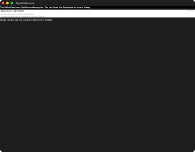</td><td></td><td></td><td></td><td></td></tr></table>

ports SwipeViewGestureRecognizerGallery.xaml (+ .xaml.cs) The MAUI SwipeViewGestureRecognizerGallery is a CollectionView of &amp;quot;message&amp;quot; rows; each row&amp;#x27;s DataTemplate is a SwipeView wired three ways, proving gesture recognizers AND swipe-item

#### 🟢 Pixel-Perfect Score — C++ (C1/C3)

**Motion:** 🚫 INVALID · `no-scenario` · run 2026-08-13-21_07_16 · 2026-08-13

Light: !! NO MOTION EVIDENCE: neither MAUI nor C++ changed by more than 0.012% of its own frame across the sequence (0 px vs 0 px), on a page the board treats as ANIMATED. NO ACTION SCENARIO EXISTS for this page — docs/comparison/scenarios/swipe_gesture.toml is absent or declares no `action` — so nothing was ever aimed at it and both columns are at rest by construction. This is NOT a port finding and nothing about the port can be concluded from it; the missing artifact is the scenario. 80 of the 139 cells that carried the old 'NOTHING MOVED' banner were this, including 10 of the 14 hard-coded ANIMATED pages. MOTION 9 frames paired by step (run 2026-08-13-21_07_16, commit 74dde0864a, 2026-08-13); 6 frame(s) had no partner and were NOT scored; column frames realigned by -3 sample(s) — a sampling drift, not a defect (see _align) — worst SSIM 0.9978 at frame 1 'gif04' (0.09% pixels differ), mean SSIM 0.9978; per-frame diff% 0.09/0.09/0.09/0.09/0.09/0.09/0.09/0.09/0.09; self-motion MAUI 0.0000% (0 px) vs C++ 0.0000% (0 px) · Dark: !! NO MOTION EVIDENCE: neither MAUI nor C++ changed by more than 0.012% of its own frame across the sequence (0 px vs 0 px), on a page the board treats as ANIMATED. NO ACTION SCENARIO EXISTS for this page — docs/comparison/scenarios/swipe_gesture.toml is absent or declares no `action` — so nothing was ever aimed at it and both columns are at rest by construction. This is NOT a port finding and nothing about the port can be concluded from it; the missing artifact is the scenario. 80 of the 139 cells that carried the old 'NOTHING MOVED' banner were this, including 10 of the 14 hard-coded ANIMATED pages. MOTION 9 frames paired by step (run 2026-08-13-21_07_16, commit 74dde0864a, 2026-08-14); 6 frame(s) had no partner and were NOT scored; column frames realigned by -3 sample(s) — a sampling drift, not a defect (see _align) — worst SSIM 0.9979 at frame 1 'gif04' (0.08% pixels differ), mean SSIM 0.9979; per-frame diff% 0.08/0.08/0.08/0.08/0.08/0.08/0.08/0.08/0.08; self-motion MAUI 0.0000% (0 px) vs C++ 0.0000% (0 px)

#### 🟢 Pixel-Perfect Score — C++ &amp; XAML (C2/C4)

**Motion:** 🚫 INVALID · `no-scenario` · run 2026-08-13-21_07_16 · 2026-08-13

Light: !! NO MOTION EVIDENCE: neither MAUI nor C++ &amp; XAML changed by more than 0.012% of its own frame across the sequence (0 px vs 0 px), on a page the board treats as ANIMATED. NO ACTION SCENARIO EXISTS for this page — docs/comparison/scenarios/swipe_gesture.toml is absent or declares no `action` — so nothing was ever aimed at it and both columns are at rest by construction. This is NOT a port finding and nothing about the port can be concluded from it; the missing artifact is the scenario. 80 of the 139 cells that carried the old 'NOTHING MOVED' banner were this, including 10 of the 14 hard-coded ANIMATED pages. MOTION 9 frames paired by step (run 2026-08-13-21_07_16, commit 74dde0864a, 2026-08-13); 6 frame(s) had no partner and were NOT scored; column frames realigned by -3 sample(s) — a sampling drift, not a defect (see _align) — worst SSIM 0.9966 at frame 1 'gif04' (0.12% pixels differ), mean SSIM 0.9966; per-frame diff% 0.12/0.12/0.12/0.12/0.12/0.12/0.12/0.12/0.12; self-motion MAUI 0.0000% (0 px) vs C++ &amp; XAML 0.0000% (0 px) · Dark: !! NO MOTION EVIDENCE: neither MAUI nor C++ &amp; XAML changed by more than 0.012% of its own frame across the sequence (0 px vs 0 px), on a page the board treats as ANIMATED. NO ACTION SCENARIO EXISTS for this page — docs/comparison/scenarios/swipe_gesture.toml is absent or declares no `action` — so nothing was ever aimed at it and both columns are at rest by construction. This is NOT a port finding and nothing about the port can be concluded from it; the missing artifact is the scenario. 80 of the 139 cells that carried the old 'NOTHING MOVED' banner were this, including 10 of the 14 hard-coded ANIMATED pages. MOTION 9 frames paired by step (run 2026-08-13-21_07_16, commit 74dde0864a, 2026-08-14); 6 frame(s) had no partner and were NOT scored; column frames realigned by -3 sample(s) — a sampling drift, not a defect (see _align) — worst SSIM 0.9966 at frame 1 'gif04' (0.11% pixels differ), mean SSIM 0.9966; per-frame diff% 0.11/0.11/0.11/0.11/0.11/0.11/0.11/0.11/0.11; self-motion MAUI 0.0000% (0 px) vs C++ &amp; XAML 0.0000% (0 px)

### 151. Swipe Item Position — 🟢/🟢
swipe_item_position

<table><tr><th></th><th>MAUI</th><th>C++</th><th>C++ &amp; XAML</th><th>AppKit / C++</th><th>AppKit / C++ &amp; XAML</th></tr><tr><th>Light</th><td></td><td></td><td></td><td></td><td></td></tr><tr><th>Dark</th><td></td><td></td><td></td><td></td><td></td></tr></table>

ports SwipeItemPositionGallery.xaml A code-first port of the MAUI SwipeView sub-gallery Pages/Controls/SwipeViewGalleries/SwipeItemPositionGallery.xaml: a 2-row Grid (Auto / *) with a Picker on top and one SwipeView below that carries TWO S

#### 🟢 Pixel-Perfect Score — C++ (C1/C3)

**Motion:** 🚫 INVALID · `no-scenario` · run 2026-08-13-21_07_16 · 2026-08-13

Light: !! NO MOTION EVIDENCE: neither MAUI nor C++ changed by more than 0.012% of its own frame across the sequence (0 px vs 0 px), on a page the board treats as ANIMATED. NO ACTION SCENARIO EXISTS for this page — docs/comparison/scenarios/swipe_item_position.toml is absent or declares no `action` — so nothing was ever aimed at it and both columns are at rest by construction. This is NOT a port finding and nothing about the port can be concluded from it; the missing artifact is the scenario. 80 of the 139 cells that carried the old 'NOTHING MOVED' banner were this, including 10 of the 14 hard-coded ANIMATED pages. MOTION 9 frames paired by step (run 2026-08-13-21_07_16, commit 74dde0864a, 2026-08-13); 6 frame(s) had no partner and were NOT scored; column frames realigned by -3 sample(s) — a sampling drift, not a defect (see _align) — worst SSIM 0.9978 at frame 1 'gif04' (0.09% pixels differ), mean SSIM 0.9978; per-frame diff% 0.09/0.09/0.09/0.09/0.09/0.09/0.09/0.09/0.09; self-motion MAUI 0.0000% (0 px) vs C++ 0.0000% (0 px) · Dark: !! NO MOTION EVIDENCE: neither MAUI nor C++ changed by more than 0.012% of its own frame across the sequence (0 px vs 0 px), on a page the board treats as ANIMATED. NO ACTION SCENARIO EXISTS for this page — docs/comparison/scenarios/swipe_item_position.toml is absent or declares no `action` — so nothing was ever aimed at it and both columns are at rest by construction. This is NOT a port finding and nothing about the port can be concluded from it; the missing artifact is the scenario. 80 of the 139 cells that carried the old 'NOTHING MOVED' banner were this, including 10 of the 14 hard-coded ANIMATED pages. MOTION 9 frames paired by step (run 2026-08-13-21_07_16, commit 74dde0864a, 2026-08-14); 6 frame(s) had no partner and were NOT scored; column frames realigned by -3 sample(s) — a sampling drift, not a defect (see _align) — worst SSIM 0.9979 at frame 1 'gif04' (0.08% pixels differ), mean SSIM 0.9979; per-frame diff% 0.08/0.08/0.08/0.08/0.08/0.08/0.08/0.08/0.08; self-motion MAUI 0.0000% (0 px) vs C++ 0.0000% (0 px)

#### 🟢 Pixel-Perfect Score — C++ &amp; XAML (C2/C4)

**Motion:** 🚫 INVALID · `no-scenario` · run 2026-08-13-21_07_16 · 2026-08-13

Light: !! NO MOTION EVIDENCE: neither MAUI nor C++ &amp; XAML changed by more than 0.012% of its own frame across the sequence (0 px vs 0 px), on a page the board treats as ANIMATED. NO ACTION SCENARIO EXISTS for this page — docs/comparison/scenarios/swipe_item_position.toml is absent or declares no `action` — so nothing was ever aimed at it and both columns are at rest by construction. This is NOT a port finding and nothing about the port can be concluded from it; the missing artifact is the scenario. 80 of the 139 cells that carried the old 'NOTHING MOVED' banner were this, including 10 of the 14 hard-coded ANIMATED pages. MOTION 9 frames paired by step (run 2026-08-13-21_07_16, commit 74dde0864a, 2026-08-13); 6 frame(s) had no partner and were NOT scored; column frames realigned by -3 sample(s) — a sampling drift, not a defect (see _align) — worst SSIM 0.9965 at frame 1 'gif04' (0.12% pixels differ), mean SSIM 0.9965; per-frame diff% 0.12/0.12/0.12/0.12/0.12/0.12/0.12/0.12/0.12; self-motion MAUI 0.0000% (0 px) vs C++ &amp; XAML 0.0000% (0 px) · Dark: !! NO MOTION EVIDENCE: neither MAUI nor C++ &amp; XAML changed by more than 0.012% of its own frame across the sequence (0 px vs 0 px), on a page the board treats as ANIMATED. NO ACTION SCENARIO EXISTS for this page — docs/comparison/scenarios/swipe_item_position.toml is absent or declares no `action` — so nothing was ever aimed at it and both columns are at rest by construction. This is NOT a port finding and nothing about the port can be concluded from it; the missing artifact is the scenario. 80 of the 139 cells that carried the old 'NOTHING MOVED' banner were this, including 10 of the 14 hard-coded ANIMATED pages. MOTION 9 frames paired by step (run 2026-08-13-21_07_16, commit 74dde0864a, 2026-08-14); 6 frame(s) had no partner and were NOT scored; column frames realigned by -3 sample(s) — a sampling drift, not a defect (see _align) — worst SSIM 0.9966 at frame 1 'gif04' (0.11% pixels differ), mean SSIM 0.9966; per-frame diff% 0.11/0.11/0.11/0.11/0.11/0.11/0.11/0.11/0.11; self-motion MAUI 0.0000% (0 px) vs C++ &amp; XAML 0.0000% (0 px)

### 152. Swipe Item Size — 🔴/🔴
swipe_item_size

<table><tr><th></th><th>MAUI</th><th>C++</th><th>C++ &amp; XAML</th><th>AppKit / C++</th><th>AppKit / C++ &amp; XAML</th></tr><tr><th>Light</th><td></td><td></td><td></td><td></td><td></td></tr><tr><th>Dark</th><td></td><td></td><td></td><td></td><td></td></tr></table>

ports SwipeItemSizeGallery.xaml A self-contained, code-first port of the .NET MAUI &amp;quot;SwipeItem Size Gallery&amp;quot;: a scrolling stack of swipe_views demonstrating how a left SwipeItem&amp;#x27;s icon size and the SwipeView content size interact

#### 🔴 Pixel-Perfect Score — C++ (C1/C3)

Light: SSIM 0.7397, 23.02% pixels differ · Dark: SSIM 0.6414, 23.86% pixels differ

#### 🔴 Pixel-Perfect Score — C++ &amp; XAML (C2/C4)

Light: SSIM 0.7384, 23.05% pixels differ · Dark: SSIM 0.6401, 23.89% pixels differ

### 153. Swipe Refresh — 🟡/🟡
swipe_refresh

<table><tr><th></th><th>MAUI</th><th>C++</th><th>C++ &amp; XAML</th><th>AppKit / C++</th><th>AppKit / C++ &amp; XAML</th></tr><tr><th>Light</th><td></td><td></td><td></td><td>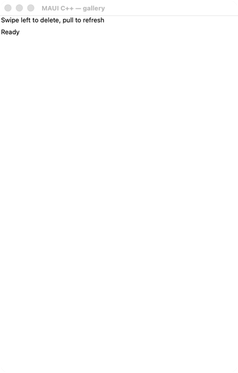</td><td>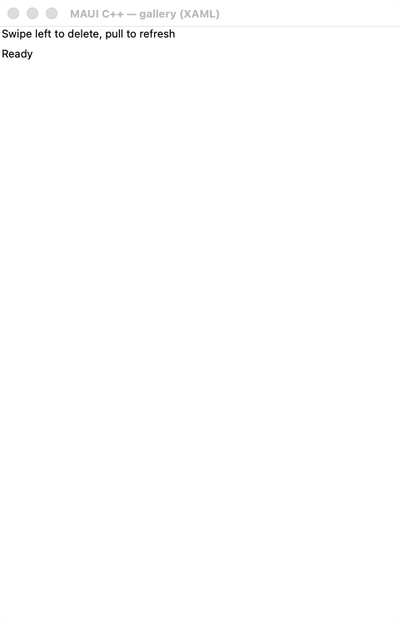</td></tr><tr><th>Dark</th><td></td><td></td><td></td><td>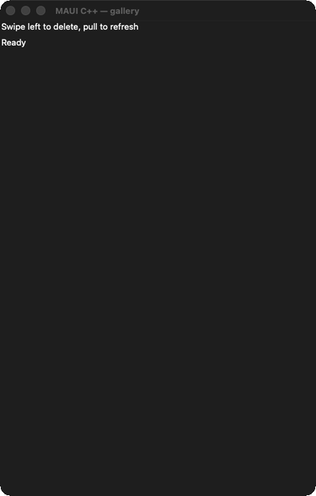</td><td>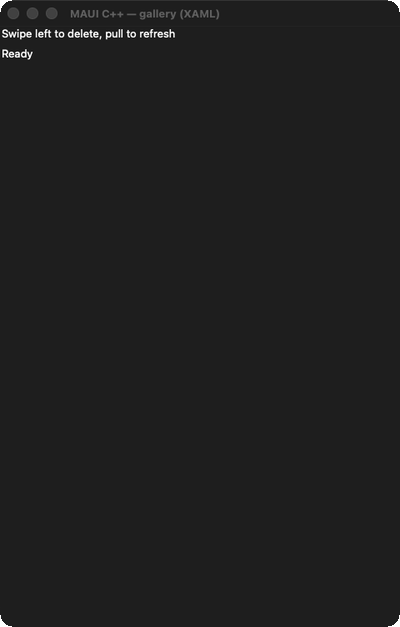</td></tr></table>

a self-contained demo page for the W2-20 swipe + refresh controls: a refresh_view wrapping a swipe_view (which itself wraps a labeled row), with a readout label reflecting the latest interaction

#### 🟡 Pixel-Perfect Score — C++ (C1/C3)

**Motion:** 🚫 INVALID · `not-driven` · run 2026-08-13-21_07_16 · 2026-08-13

Light: !! NO MOTION EVIDENCE: neither MAUI nor C++ changed by more than 0.012% of its own frame across the sequence (0 px vs 0 px), on a page the board treats as ANIMATED. An action WAS injected here — swipe_refresh.toml declares one — and NEITHER column reacted to it. So either the coordinate misses its target on this lane, or the interaction is not reachable here. This is the actionable half of the old 'NOTHING MOVED' bucket: 59 of the 139 cells that carried it. MOTION 11 frames paired by step (run 2026-08-13-21_07_16, commit 74dde0864a, 2026-08-13); 6 frame(s) had no partner and were NOT scored; column frames realigned by -3 sample(s) — a sampling drift, not a defect (see _align) — worst SSIM 0.9978 at frame 1 'gif02' (0.09% pixels differ), mean SSIM 0.9978; per-frame diff% 0.09/0.09/0.09/0.09/0.09/0.09/0.09/0.09/0.09/0.09/0.09; self-motion MAUI 0.0000% (0 px) vs C++ 0.0000% (0 px) · Dark: !! NO MOTION EVIDENCE: neither MAUI nor C++ changed by more than 0.012% of its own frame across the sequence (0 px vs 0 px), on a page the board treats as ANIMATED. An action WAS injected here — swipe_refresh.toml declares one — and NEITHER column reacted to it. So either the coordinate misses its target on this lane, or the interaction is not reachable here. This is the actionable half of the old 'NOTHING MOVED' bucket: 59 of the 139 cells that carried it. MOTION 11 frames paired by step (run 2026-08-13-21_07_16, commit 74dde0864a, 2026-08-14); 6 frame(s) had no partner and were NOT scored; column frames realigned by -3 sample(s) — a sampling drift, not a defect (see _align) — worst SSIM 0.9978 at frame 1 'gif02' (0.08% pixels differ), mean SSIM 0.9978; per-frame diff% 0.08/0.08/0.08/0.08/0.08/0.08/0.08/0.08/0.08/0.08/0.08; self-motion MAUI 0.0000% (0 px) vs C++ 0.0000% (0 px)

#### 🟡 Pixel-Perfect Score — C++ &amp; XAML (C2/C4)

**Motion:** 🚫 INVALID · `not-driven` · run 2026-08-13-21_07_16 · 2026-08-13

Light: !! NO MOTION EVIDENCE: neither MAUI nor C++ &amp; XAML changed by more than 0.012% of its own frame across the sequence (0 px vs 0 px), on a page the board treats as ANIMATED. An action WAS injected here — swipe_refresh.toml declares one — and NEITHER column reacted to it. So either the coordinate misses its target on this lane, or the interaction is not reachable here. This is the actionable half of the old 'NOTHING MOVED' bucket: 59 of the 139 cells that carried it. MOTION 11 frames paired by step (run 2026-08-13-21_07_16, commit 74dde0864a, 2026-08-13); 6 frame(s) had no partner and were NOT scored; column frames realigned by -3 sample(s) — a sampling drift, not a defect (see _align) — worst SSIM 0.9965 at frame 1 'gif02' (0.12% pixels differ), mean SSIM 0.9965; per-frame diff% 0.12/0.12/0.12/0.12/0.12/0.12/0.12/0.12/0.12/0.12/0.12; self-motion MAUI 0.0000% (0 px) vs C++ &amp; XAML 0.0000% (0 px) · Dark: !! NO MOTION EVIDENCE: neither MAUI nor C++ &amp; XAML changed by more than 0.012% of its own frame across the sequence (0 px vs 0 px), on a page the board treats as ANIMATED. An action WAS injected here — swipe_refresh.toml declares one — and NEITHER column reacted to it. So either the coordinate misses its target on this lane, or the interaction is not reachable here. This is the actionable half of the old 'NOTHING MOVED' bucket: 59 of the 139 cells that carried it. MOTION 11 frames paired by step (run 2026-08-13-21_07_16, commit 74dde0864a, 2026-08-14); 6 frame(s) had no partner and were NOT scored; column frames realigned by -3 sample(s) — a sampling drift, not a defect (see _align) — worst SSIM 0.9966 at frame 1 'gif02' (0.11% pixels differ), mean SSIM 0.9966; per-frame diff% 0.11/0.11/0.11/0.11/0.11/0.11/0.11/0.11/0.11/0.11/0.11; self-motion MAUI 0.0000% (0 px) vs C++ &amp; XAML 0.0000% (0 px)

### 154. Swipe Threshold — 🟢/🟢
swipe_threshold

<table><tr><th></th><th>MAUI</th><th>C++</th><th>C++ &amp; XAML</th><th>AppKit / C++</th><th>AppKit / C++ &amp; XAML</th></tr><tr><th>Light</th><td></td><td></td><td></td><td></td><td></td></tr><tr><th>Dark</th><td></td><td></td><td></td><td></td><td></td></tr></table>

ports HorizontalSwipeThresholdGallery.xaml (+ .xaml.cs) The MAUI HorizontalSwipeThresholdGallery shows how SwipeView.Threshold (the swipe distance, in DIPs, the user must drag before the items settle open / execute) interacts with SwipeItem

#### 🟢 Pixel-Perfect Score — C++ (C1/C3)

Light: SSIM 0.9978, 0.09% pixels differ · Dark: SSIM 0.9979, 0.08% pixels differ

#### 🟢 Pixel-Perfect Score — C++ &amp; XAML (C2/C4)

Light: SSIM 0.9966, 0.12% pixels differ · Dark: SSIM 0.9966, 0.11% pixels differ

### 155. Swipe View Margin — 🟢/🟢
swipe_view_margin

<table><tr><th></th><th>MAUI</th><th>C++</th><th>C++ &amp; XAML</th><th>AppKit / C++</th><th>AppKit / C++ &amp; XAML</th></tr><tr><th>Light</th><td></td><td></td><td></td><td></td><td></td></tr><tr><th>Dark</th><td></td><td></td><td></td><td></td><td></td></tr></table>

ports SwipeViewMarginGallery.xaml A self-contained, code-first port of the .NET MAUI &amp;quot;SwipeView Margin Gallery&amp;quot;: two swipe_views whose content&amp;#x27;s Margin + Padding are driven by two sliders, demonstrating that the revealed SwipeItems stay cor

#### 🟢 Pixel-Perfect Score — C++ (C1/C3)

Light: SSIM 0.9978, 0.09% pixels differ · Dark: SSIM 0.9978, 0.08% pixels differ

#### 🟢 Pixel-Perfect Score — C++ &amp; XAML (C2/C4)

Light: SSIM 0.9965, 0.12% pixels differ · Dark: SSIM 0.9966, 0.11% pixels differ

### 156. Swipe View Shadow — 🟢/🟢
swipe_view_shadow

<table><tr><th></th><th>MAUI</th><th>C++</th><th>C++ &amp; XAML</th><th>AppKit / C++</th><th>AppKit / C++ &amp; XAML</th></tr><tr><th>Light</th><td></td><td></td><td></td><td></td><td></td></tr><tr><th>Dark</th><td></td><td></td><td></td><td></td><td></td></tr></table>

ports SwipeViewShadowGallery.xaml A code-first port of the MAUI SwipeView sub-gallery Pages/Controls/SwipeViewGalleries/SwipeViewShadowGallery.xaml: a padded vertical StackLayout proving a drop Shadow renders correctly on SwipeView content

#### 🟢 Pixel-Perfect Score — C++ (C1/C3)

Light: SSIM 0.9969, 0.09% pixels differ · Dark: SSIM 0.9977, 0.08% pixels differ

#### 🟢 Pixel-Perfect Score — C++ &amp; XAML (C2/C4)

Light: SSIM 0.9965, 0.12% pixels differ · Dark: SSIM 0.9966, 0.11% pixels differ

### 157. Switch — 🟢/🟢
switch

<table><tr><th></th><th>MAUI</th><th>C++</th><th>C++ &amp; XAML</th><th>AppKit / C++</th><th>AppKit / C++ &amp; XAML</th></tr><tr><th>Light</th><td></td><td></td><td></td><td></td><td></td></tr><tr><th>Dark</th><td></td><td></td><td></td><td></td><td></td></tr></table>

ports SwitchPage.xaml (+ .xaml.cs) Mirrors the MAUI gallery page: a vertical stack of headlined Switch states — Default, BackgroundColor (Blue), Background (a yellow→green LinearGradientBrush), Disabled, OnColor (Red), ThumbColor (Orange)

#### 🟢 Pixel-Perfect Score — C++ (C1/C3)

**Motion:** ✅ PASS · run 2026-08-13-21_07_16 · 2026-08-13

Light: MOTION 2 frames paired by step (run 2026-08-13-21_07_16, commit 74dde0864a, 2026-08-13) — worst SSIM 0.9969 at frame 1 'initial' (0.15% pixels differ), mean SSIM 0.9969; per-frame diff% 0.15/0.15; self-motion MAUI 0.1044% (855 px) vs C++ 0.1038% (850 px) · Dark: MOTION 2 frames paired by step (run 2026-08-13-21_07_16, commit 74dde0864a, 2026-08-14) — worst SSIM 0.9977 at frame 1 'initial' (0.14% pixels differ), mean SSIM 0.9977; per-frame diff% 0.14/0.14; self-motion MAUI 0.1068% (875 px) vs C++ 0.1080% (885 px)

#### 🟢 Pixel-Perfect Score — C++ &amp; XAML (C2/C4)

**Motion:** ✅ PASS · run 2026-08-13-21_07_16 · 2026-08-13

Light: MOTION 2 frames paired by step (run 2026-08-13-21_07_16, commit 74dde0864a, 2026-08-13) — worst SSIM 0.9957 at frame 1 'initial' (0.18% pixels differ), mean SSIM 0.9957; per-frame diff% 0.18/0.18; self-motion MAUI 0.1044% (855 px) vs C++ &amp; XAML 0.1038% (850 px) · Dark: MOTION 2 frames paired by step (run 2026-08-13-21_07_16, commit 74dde0864a, 2026-08-14) — worst SSIM 0.9964 at frame 1 'initial' (0.17% pixels differ), mean SSIM 0.9964; per-frame diff% 0.17/0.17; self-motion MAUI 0.1068% (875 px) vs C++ &amp; XAML 0.1080% (885 px)

### 158. Switch Grouping — 🟢/🟢
switch_grouping

<table><tr><th></th><th>MAUI</th><th>C++</th><th>C++ &amp; XAML</th><th>AppKit / C++</th><th>AppKit / C++ &amp; XAML</th></tr><tr><th>Light</th><td></td><td></td><td></td><td></td><td></td></tr><tr><th>Dark</th><td></td><td></td><td></td><td></td><td></td></tr></table>

ports CollectionViewGalleries/GroupingGalleries/ SwitchGrouping.xaml (+ .xaml.cs) of the C# CollectionView gallery

#### 🟢 Pixel-Perfect Score — C++ (C1/C3)

Light: SSIM 0.9978, 0.09% pixels differ · Dark: SSIM 0.9978, 0.08% pixels differ

#### 🟢 Pixel-Perfect Score — C++ &amp; XAML (C2/C4)

Light: SSIM 0.9965, 0.12% pixels differ · Dark: SSIM 0.9966, 0.11% pixels differ

### 159. Tabbed Flyout — 🟢/🟢
tabbed_flyout

<table><tr><th></th><th>MAUI</th><th>C++</th><th>C++ &amp; XAML</th><th>AppKit / C++</th><th>AppKit / C++ &amp; XAML</th></tr><tr><th>Light</th><td></td><td></td><td></td><td></td><td></td></tr><tr><th>Dark</th><td></td><td></td><td></td><td></td><td></td></tr></table>

a self-contained demo page for the W1-10 tabbed + flyout vertical: a flyout_page whose FLYOUT pane is a titled menu (two buttons selecting the detail&amp;#x27;s tabs + a &amp;quot;Toggle flyout&amp;quot; presenting/dismissing itself) and whose DETAIL pane is a tabbed

#### 🟢 Pixel-Perfect Score — C++ (C1/C3)

Light: SSIM 0.9978, 0.09% pixels differ · Dark: SSIM 0.9978, 0.08% pixels differ

#### 🟢 Pixel-Perfect Score — C++ &amp; XAML (C2/C4)

Light: SSIM 0.9965, 0.12% pixels differ · Dark: SSIM 0.9966, 0.11% pixels differ

### 160. Templated View — 🟢/🟢
templated_view

<table><tr><th></th><th>MAUI</th><th>C++</th><th>C++ &amp; XAML</th><th>AppKit / C++</th><th>AppKit / C++ &amp; XAML</th></tr><tr><th>Light</th><td></td><td></td><td></td><td></td><td></td></tr><tr><th>Dark</th><td></td><td></td><td></td><td></td><td></td></tr></table>

ports TemplatedViewPage.xaml The C# page contrasts a standard CardView control with a compact one driven by a ControlTemplate (&amp;quot;CardViewCompressed&amp;quot;) and a custom Rate control built entirely from a ControlTemplate + a heart PathGeometry

#### 🟢 Pixel-Perfect Score — C++ (C1/C3)

Light: SSIM 0.9978, 0.09% pixels differ · Dark: SSIM 0.9978, 0.08% pixels differ

#### 🟢 Pixel-Perfect Score — C++ &amp; XAML (C2/C4)

Light: SSIM 0.9965, 0.12% pixels differ · Dark: SSIM 0.9966, 0.11% pixels differ

### 161. Time Picker — 🟢/🟢
time_picker

<table><tr><th></th><th>MAUI</th><th>C++</th><th>C++ &amp; XAML</th><th>AppKit / C++</th><th>AppKit / C++ &amp; XAML</th></tr><tr><th>Light</th><td></td><td></td><td></td><td></td><td></td></tr><tr><th>Dark</th><td></td><td></td><td></td><td></td><td></td></tr></table>

ports TimePickerPage.xaml (+ TimePickerPage.xaml.cs)

#### 🟢 Pixel-Perfect Score — C++ (C1/C3)

Light: SSIM 0.9978, 0.09% pixels differ · Dark: SSIM 0.9978, 0.08% pixels differ

#### 🟢 Pixel-Perfect Score — C++ &amp; XAML (C2/C4)

Light: SSIM 0.9965, 0.12% pixels differ · Dark: SSIM 0.9966, 0.11% pixels differ

### 162. Title Bar — 🟢/🟢
title_bar

<table><tr><th></th><th>MAUI</th><th>C++</th><th>C++ &amp; XAML</th><th>AppKit / C++</th><th>AppKit / C++ &amp; XAML</th></tr><tr><th>Light</th><td></td><td></td><td></td><td></td><td></td></tr><tr><th>Dark</th><td></td><td></td><td></td><td></td><td></td></tr></table>

ports TitleBarPage.xaml A self-contained, code-first demo of the TitleBar control

#### 🟢 Pixel-Perfect Score — C++ (C1/C3)

**Motion:** ✅ PASS · run 2026-08-13-21_07_16 · 2026-08-13

Light: MOTION 3 frames paired by step (run 2026-08-13-21_07_16, commit 74dde0864a, 2026-08-13) — worst SSIM 0.9978 at frame 1 'initial' (0.09% pixels differ), mean SSIM 0.9978; per-frame diff% 0.09/0.09/0.09; self-motion MAUI 0.0969% (794 px) vs C++ 0.0988% (809 px) · Dark: MOTION 3 frames paired by step (run 2026-08-13-21_07_16, commit 74dde0864a, 2026-08-14) — worst SSIM 0.9978 at frame 1 'initial' (0.08% pixels differ), mean SSIM 0.9978; per-frame diff% 0.08/0.08/0.08; self-motion MAUI 0.1183% (969 px) vs C++ 0.1210% (991 px)

#### 🟢 Pixel-Perfect Score — C++ &amp; XAML (C2/C4)

**Motion:** ✅ PASS · run 2026-08-13-21_07_16 · 2026-08-13

Light: MOTION 3 frames paired by step (run 2026-08-13-21_07_16, commit 74dde0864a, 2026-08-13) — worst SSIM 0.9965 at frame 1 'initial' (0.12% pixels differ), mean SSIM 0.9965; per-frame diff% 0.12/0.12/0.12; self-motion MAUI 0.0969% (794 px) vs C++ &amp; XAML 0.0988% (809 px) · Dark: MOTION 3 frames paired by step (run 2026-08-13-21_07_16, commit 74dde0864a, 2026-08-14) — worst SSIM 0.9965 at frame 3 'typed' (0.12% pixels differ), mean SSIM 0.9966; per-frame diff% 0.11/0.11/0.12; self-motion MAUI 0.1183% (969 px) vs C++ &amp; XAML 0.1228% (1006 px)

### 163. Toolbar — 🟢/🟢
toolbar

<table><tr><th></th><th>MAUI</th><th>C++</th><th>C++ &amp; XAML</th><th>AppKit / C++</th><th>AppKit / C++ &amp; XAML</th></tr><tr><th>Light</th><td></td><td></td><td></td><td></td><td></td></tr><tr><th>Dark</th><td></td><td></td><td></td><td></td><td></td></tr></table>

ports ToolbarPage.xaml (Maui.Controls.Sample.Pages.ToolbarPage)

#### 🟢 Pixel-Perfect Score — C++ (C1/C3)

Light: SSIM 0.9978, 0.09% pixels differ · Dark: SSIM 0.9978, 0.08% pixels differ

#### 🟢 Pixel-Perfect Score — C++ &amp; XAML (C2/C4)

Light: SSIM 0.9965, 0.12% pixels differ · Dark: SSIM 0.9966, 0.11% pixels differ

### 164. Transform Playground — 🟢/🟢
transform_playground

<table><tr><th></th><th>MAUI</th><th>C++</th><th>C++ &amp; XAML</th><th>AppKit / C++</th><th>AppKit / C++ &amp; XAML</th></tr><tr><th>Light</th><td></td><td></td><td></td><td></td><td></td></tr><tr><th>Dark</th><td></td><td></td><td></td><td></td><td></td></tr></table>

ports TransformPlaygroundGallery.xaml A code-first port of the MAUI Shapes sub-gallery Pages/Controls/ShapesGalleries/TransformPlaygroundGallery.xaml: a 50x50 Path rectangle (red fill, blue stroke 4) sits in a 200x200 light-grey panel; belo

#### 🟢 Pixel-Perfect Score — C++ (C1/C3)

Light: SSIM 0.9965, 0.15% pixels differ · Dark: SSIM 0.9965, 0.14% pixels differ

#### 🟢 Pixel-Perfect Score — C++ &amp; XAML (C2/C4)

Light: SSIM 0.9965, 0.12% pixels differ · Dark: SSIM 0.9966, 0.11% pixels differ

### 165. Transformations — 🟢/🟢
transformations

<table><tr><th></th><th>MAUI</th><th>C++</th><th>C++ &amp; XAML</th><th>AppKit / C++</th><th>AppKit / C++ &amp; XAML</th></tr><tr><th>Light</th><td></td><td></td><td></td><td></td><td></td></tr><tr><th>Dark</th><td></td><td></td><td></td><td></td><td></td></tr></table>

ports TransformationsPage.xaml (+ .xaml.cs) The MAUI TransformationsPage drives a single target view&amp;#x27;s render transforms from a column of knobs: Sliders for Scale / ScaleX / ScaleY (Maximum 10) and Rotation / RotationX / RotationY (Maximum

#### 🟢 Pixel-Perfect Score — C++ (C1/C3)

Light: SSIM 0.9978, 0.09% pixels differ · Dark: SSIM 0.9978, 0.08% pixels differ

#### 🟢 Pixel-Perfect Score — C++ &amp; XAML (C2/C4)

Light: SSIM 0.9965, 0.12% pixels differ · Dark: SSIM 0.9966, 0.11% pixels differ

### 166. Triggers — 🟢/🟢
triggers

<table><tr><th></th><th>MAUI</th><th>C++</th><th>C++ &amp; XAML</th><th>AppKit / C++</th><th>AppKit / C++ &amp; XAML</th></tr><tr><th>Light</th><td></td><td></td><td></td><td></td><td></td></tr><tr><th>Dark</th><td></td><td></td><td></td><td></td><td></td></tr></table>

ports TriggersPage.xaml

#### 🟢 Pixel-Perfect Score — C++ (C1/C3)

Light: SSIM 0.9978, 0.09% pixels differ · Dark: SSIM 0.9978, 0.08% pixels differ

#### 🟢 Pixel-Perfect Score — C++ &amp; XAML (C2/C4)

Light: SSIM 0.9965, 0.12% pixels differ · Dark: SSIM 0.9966, 0.11% pixels differ

### 167. Update Path Data — 🟢/🟢
update_path_data

<table><tr><th></th><th>MAUI</th><th>C++</th><th>C++ &amp; XAML</th><th>AppKit / C++</th><th>AppKit / C++ &amp; XAML</th></tr><tr><th>Light</th><td></td><td></td><td></td><td></td><td></td></tr><tr><th>Dark</th><td></td><td></td><td></td><td></td><td></td></tr></table>

ports UpdatePathDataGallery.xaml A code-first port of the MAUI Shapes sub-gallery Pages/Controls/ShapesGalleries/UpdatePathDataGallery.xaml: a 2-row Grid (RowSpacing 0) that proves a Path repaints when its Data geometry is replaced at runti

#### 🟢 Pixel-Perfect Score — C++ (C1/C3)

Light: SSIM 0.9978, 0.09% pixels differ · Dark: SSIM 0.9978, 0.08% pixels differ

#### 🟢 Pixel-Perfect Score — C++ &amp; XAML (C2/C4)

Light: SSIM 0.9965, 0.12% pixels differ · Dark: SSIM 0.9966, 0.11% pixels differ

### 168. Varied Size Selector — 🟡/🟡
varied_size_selector

<table><tr><th></th><th>MAUI</th><th>C++</th><th>C++ &amp; XAML</th><th>AppKit / C++</th><th>AppKit / C++ &amp; XAML</th></tr><tr><th>Light</th><td></td><td></td><td></td><td></td><td></td></tr><tr><th>Dark</th><td></td><td></td><td></td><td></td><td></td></tr></table>

ports DataTemplateSelectorGalleries/VariedSizeDataTemplateSelectorGallery.xaml (+ VariedSizeDataTemplateSelectorGallery.xaml.cs) of the C# CollectionView gallery

#### 🟡 Pixel-Perfect Score — C++ (C1/C3)

Light: SSIM 0.9951, 0.09% pixels differ · Dark: SSIM 0.9846, 1.07% pixels differ

#### 🟡 Pixel-Perfect Score — C++ &amp; XAML (C2/C4)

Light: SSIM 0.9938, 0.12% pixels differ · Dark: SSIM 0.9835, 1.10% pixels differ

### 169. Vertical Stack — 🟢/🟢
vertical_stack

<table><tr><th></th><th>MAUI</th><th>C++</th><th>C++ &amp; XAML</th><th>AppKit / C++</th><th>AppKit / C++ &amp; XAML</th></tr><tr><th>Light</th><td></td><td></td><td></td><td></td><td></td></tr><tr><th>Dark</th><td></td><td></td><td></td><td></td><td></td></tr></table>

Vertical Stack

#### 🟢 Pixel-Perfect Score — C++ (C1/C3)

Light: SSIM 0.9978, 0.09% pixels differ · Dark: SSIM 0.9978, 0.08% pixels differ

#### 🟢 Pixel-Perfect Score — C++ &amp; XAML (C2/C4)

Light: SSIM 0.9965, 0.12% pixels differ · Dark: SSIM 0.9966, 0.11% pixels differ

### 170. Visual States — 🟢/🟢
visual_states

<table><tr><th></th><th>MAUI</th><th>C++</th><th>C++ &amp; XAML</th><th>AppKit / C++</th><th>AppKit / C++ &amp; XAML</th></tr><tr><th>Light</th><td></td><td></td><td></td><td></td><td></td></tr><tr><th>Dark</th><td></td><td></td><td></td><td></td><td></td></tr></table>

ports VisualStatesPage.xaml

#### 🟢 Pixel-Perfect Score — C++ (C1/C3)

Light: SSIM 0.9978, 0.09% pixels differ · Dark: SSIM 0.9978, 0.08% pixels differ

#### 🟢 Pixel-Perfect Score — C++ &amp; XAML (C2/C4)

Light: SSIM 0.9965, 0.12% pixels differ · Dark: SSIM 0.9966, 0.11% pixels differ

### 171. Web View — 🟢/🟢
web_view

<table><tr><th></th><th>MAUI</th><th>C++</th><th>C++ &amp; XAML</th><th>AppKit / C++</th><th>AppKit / C++ &amp; XAML</th></tr><tr><th>Light</th><td></td><td></td><td></td><td></td><td></td></tr><tr><th>Dark</th><td></td><td></td><td></td><td></td><td></td></tr></table>

a self-contained demo page for the W1-08 web_view vertical: a web_view loading a STATIC html_web_view_source (no network), back/forward/reload buttons over the handler-pushed CanGoBack/CanGoForward read-onlys, an &amp;quot;Eval 1+1&amp;quot; button driving t

#### 🟢 Pixel-Perfect Score — C++ (C1/C3)

Light: SSIM 0.9940, 0.22% pixels differ · Dark: SSIM 0.9942, 0.25% pixels differ

#### 🟢 Pixel-Perfect Score — C++ &amp; XAML (C2/C4)

Light: SSIM 0.9888, 0.35% pixels differ · Dark: SSIM 0.9890, 0.35% pixels differ

### 172. Z Index — 🟢/🟢
z_index

<table><tr><th></th><th>MAUI</th><th>C++</th><th>C++ &amp; XAML</th><th>AppKit / C++</th><th>AppKit / C++ &amp; XAML</th></tr><tr><th>Light</th><td></td><td></td><td></td><td></td><td></td></tr><tr><th>Dark</th><td></td><td></td><td></td><td></td><td></td></tr></table>

ports ZIndexPage.xaml (+ ZIndexPage.xaml.cs), code-first

#### 🟢 Pixel-Perfect Score — C++ (C1/C3)

Light: SSIM 0.9978, 0.09% pixels differ · Dark: SSIM 0.9978, 0.08% pixels differ

#### 🟢 Pixel-Perfect Score — C++ &amp; XAML (C2/C4)

Light: SSIM 0.9965, 0.12% pixels differ · Dark: SSIM 0.9966, 0.11% pixels differ

<h2>Android (172 examples) — click to expand</h2>

Real .NET MAUI vs the C++ port vs the compile-time-XAML gallery, captured on the same Android emulator in light and dark. MAUI is the content ground truth.

**Discrepancy counts** (MAUI-vs-C++ parity verdicts from the deterministic pixel-perfect score — SSIM + per-pixel diff; AI-based review has been invalidated/removed):

| Classification | Pixel-Perfect Score — C++ (C1/C3) | Pixel-Perfect Score — C++ &amp; XAML (C2/C4) |
| --- | --- | --- |
| 🟢 Match | 95 | 98 |
| 🟡 Minor | 50 | 49 |
| 🔴 Major | 27 | 25 |
| ⬛ Blank | 0 | 0 |
| ⏳ Unreviewed | 0 | 0 |

### 1. Absolute Layout — 🟢/🟢
absolute_layout

<table><tr><th></th><th>MAUI</th><th>C++</th><th>C++ &amp; XAML</th></tr><tr><th>Light</th><td></td><td></td><td></td></tr><tr><th>Dark</th><td></td><td></td><td></td></tr></table>

ports AbsoluteLayoutPage.xaml A self-contained, code-first demo of the AbsoluteLayout control

#### 🟢 Pixel-Perfect Score — C++ (C1/C3)

Light: SSIM 0.9903, 0.63% pixels differ · Dark: SSIM 0.9948, 0.64% pixels differ

#### 🟢 Pixel-Perfect Score — C++ &amp; XAML (C2/C4)

Light: SSIM 0.9999, 0.00% pixels differ · Dark: SSIM 1.0000, 0.00% pixels differ

### 2. Activity Indicator — 🟡/🟡
activity_indicator

<table><tr><th></th><th>MAUI</th><th>C++</th><th>C++ &amp; XAML</th></tr><tr><th>Light</th><td></td><td></td><td></td></tr><tr><th>Dark</th><td></td><td></td><td></td></tr></table>

ports ActivityIndicatorPage.xaml (+ ActivityIndicatorPage.xaml.cs)

#### 🟡 Pixel-Perfect Score — C++ (C1/C3)

**Motion:** ❌ FAIL · `frames-disagree` · run 2026-08-13-21_06_47 · 2026-08-13

Light: MOTION 9 frames paired by step (run 2026-08-13-21_06_47, commit 74dde0864a, 2026-08-13); 6 frame(s) had no partner and were NOT scored; column frames realigned by +3 sample(s) — a sampling drift, not a defect (see _align) — worst SSIM 0.9882 at frame 9 'gif09@4s/12f' (1.66% pixels differ), mean SSIM 0.9935; per-frame diff% 1.48/0.52/0.33/1.19/0.48/0.24/0.52/0.89/1.66; self-motion MAUI 1.6023% (38070 px) vs C++ 1.5158% (36016 px) · Dark: MOTION 10 frames paired by step (run 2026-08-13-21_06_47, commit 74dde0864a, 2026-08-14); 4 frame(s) had no partner and were NOT scored; column frames realigned by -2 sample(s) — a sampling drift, not a defect (see _align) — worst SSIM 0.9782 at frame 8 'gif10@4s/12f' (1.66% pixels differ), mean SSIM 0.9890; per-frame diff% 0.34/0.89/0.89/0.61/0.57/0.64/1.07/1.66/0.35/1.00; self-motion MAUI 1.4019% (33308 px) vs C++ 1.4338% (34066 px)

#### 🟡 Pixel-Perfect Score — C++ &amp; XAML (C2/C4)

**Motion:** ❌ FAIL · `frames-disagree` · dark FAIL / light INCONCLUSIVE · run 2026-08-13-21_06_47 · 2026-08-13

Light: !! PHASE ONLY, NOT DECIDABLE ON THIS LANE: MAUI and C++ &amp; XAML both moved and moved the SAME distance (1.6023% vs 1.6141% of their own frame, 0.7% apart) from a resting frame that already agreed to 0.59%. What differs is WHEN, not whether or how far. An `input swipe` releases at full velocity and the fling coasts a random distance — measured on THIS lane, MAUI's own column differs from ITSELF by up to 11.57% across two runs of the same page while it is byte-stable at rest — so the per-frame SSIM below samples two different moments of the same motion. Capped YELLOW: frame parity was NOT established, and no port defect is evidenced either. MOTION 12 frames paired by step (run 2026-08-13-21_06_47, commit 74dde0864a, 2026-08-13) — worst SSIM 0.9886 at frame 5 'gif05@4s/12f' (1.61% pixels differ), mean SSIM 0.9936; per-frame diff% 0.59/1.46/0.25/1.27/1.61/0.36/1.06/0.89/0.85/0.54/0.48/0.30; self-motion MAUI 1.6023% (38070 px) vs C++ &amp; XAML 1.6141% (38352 px) · Dark: MOTION 11 frames paired by step (run 2026-08-13-21_06_47, commit 74dde0864a, 2026-08-14); 2 frame(s) had no partner and were NOT scored; column frames realigned by -1 sample(s) — a sampling drift, not a defect (see _align) — worst SSIM 0.9800 at frame 5 'gif06@4s/12f' (1.47% pixels differ), mean SSIM 0.9882; per-frame diff% 0.24/0.82/1.35/0.65/1.47/0.88/1.36/0.26/0.36/1.22/0.89; self-motion MAUI 1.4019% (33308 px) vs C++ &amp; XAML 1.5718% (37346 px)

### 3. Adaptive Collection — 🟢/🟢
adaptive_collection

<table><tr><th></th><th>MAUI</th><th>C++</th><th>C++ &amp; XAML</th></tr><tr><th>Light</th><td></td><td></td><td></td></tr><tr><th>Dark</th><td></td><td></td><td></td></tr></table>

ports AdaptiveCollectionView.xaml (+ .xaml.cs) (Maui.Controls.Sample.Pages.CollectionViewGalleries.AdaptiveCollectionView)

#### 🟢 Pixel-Perfect Score — C++ (C1/C3)

Light: SSIM 0.9977, 0.14% pixels differ · Dark: SSIM 0.9976, 0.15% pixels differ

#### 🟢 Pixel-Perfect Score — C++ &amp; XAML (C2/C4)

Light: SSIM 1.0000, 0.00% pixels differ · Dark: SSIM 1.0000, 0.00% pixels differ

### 4. Alerts — 🟡/🟡
alerts

<table><tr><th></th><th>MAUI</th><th>C++</th><th>C++ &amp; XAML</th></tr><tr><th>Light</th><td></td><td></td><td></td></tr><tr><th>Dark</th><td></td><td></td><td></td></tr></table>

ports AlertsPage.xaml (+ AlertsPage.xaml.cs) The C# AlertsPage drives the three Page dialog services — DisplayAlertAsync (simple OK + Yes/No), DisplayActionSheetAsync (simple + Cancel/Delete), and DisplayPromptAsync (two questions) — from a

#### 🟡 Pixel-Perfect Score — C++ (C1/C3)

Light: SSIM 1.0000, 0.00% pixels differ · Dark: SSIM 0.9962, 4.26% pixels differ

#### 🟡 Pixel-Perfect Score — C++ &amp; XAML (C2/C4)

Light: SSIM 1.0000, 0.00% pixels differ · Dark: SSIM 0.9962, 4.26% pixels differ

### 5. Alignment — 🟢/🟢
alignment

<table><tr><th></th><th>MAUI</th><th>C++</th><th>C++ &amp; XAML</th></tr><tr><th>Light</th><td></td><td></td><td></td></tr><tr><th>Dark</th><td></td><td></td><td></td></tr></table>

a faithful reproduction of the maui-compare &amp;quot;alignment&amp;quot; demo (ComparePages.Alignment()), the shipped-.NET-MAUI reference for the visual-parity comparison

#### 🟢 Pixel-Perfect Score — C++ (C1/C3)

Light: SSIM 0.9976, 0.35% pixels differ · Dark: SSIM 0.9984, 0.35% pixels differ

#### 🟢 Pixel-Perfect Score — C++ &amp; XAML (C2/C4)

Light: SSIM 0.9976, 0.35% pixels differ · Dark: SSIM 0.9984, 0.35% pixels differ

### 6. Animation — 🟡/🟡
animation

<table><tr><th></th><th>MAUI</th><th>C++</th><th>C++ &amp; XAML</th></tr><tr><th>Light</th><td></td><td></td><td></td></tr><tr><th>Dark</th><td></td><td></td><td></td></tr></table>

ports AnimationPage.xaml (+ AnimationPage.xaml.cs)

#### 🟡 Pixel-Perfect Score — C++ (C1/C3)

**Motion:** 🚫 INVALID · `no-scenario` · run 2026-08-13-21_06_47 · 2026-08-13

Light: !! NO MOTION EVIDENCE: neither MAUI nor C++ changed by more than 0.012% of its own frame across the sequence (0 px vs 0 px), on a page the board treats as ANIMATED. NO ACTION SCENARIO EXISTS for this page — docs/comparison/scenarios/animation.toml is absent or declares no `action` — so nothing was ever aimed at it and both columns are at rest by construction. This is NOT a port finding and nothing about the port can be concluded from it; the missing artifact is the scenario. 80 of the 139 cells that carried the old 'NOTHING MOVED' banner were this, including 10 of the 14 hard-coded ANIMATED pages. MOTION 9 frames paired by step (run 2026-08-13-21_06_47, commit 74dde0864a, 2026-08-13); 6 frame(s) had no partner and were NOT scored; column frames realigned by -3 sample(s) — a sampling drift, not a defect (see _align) — worst SSIM 0.9991 at frame 1 'gif04@4s/12f' (0.00% pixels differ), mean SSIM 0.9991; per-frame diff% 0.00/0.00/0.00/0.00/0.00/0.00/0.00/0.00/0.00; self-motion MAUI 0.0000% (0 px) vs C++ 0.0000% (0 px) · Dark: !! NO MOTION EVIDENCE: neither MAUI nor C++ changed by more than 0.012% of its own frame across the sequence (0 px vs 0 px), on a page the board treats as ANIMATED. NO ACTION SCENARIO EXISTS for this page — docs/comparison/scenarios/animation.toml is absent or declares no `action` — so nothing was ever aimed at it and both columns are at rest by construction. This is NOT a port finding and nothing about the port can be concluded from it; the missing artifact is the scenario. 80 of the 139 cells that carried the old 'NOTHING MOVED' banner were this, including 10 of the 14 hard-coded ANIMATED pages. MOTION 9 frames paired by step (run 2026-08-13-21_06_47, commit 74dde0864a, 2026-08-14); 6 frame(s) had no partner and were NOT scored; column frames realigned by -3 sample(s) — a sampling drift, not a defect (see _align) — worst SSIM 0.9995 at frame 1 'gif04@4s/12f' (4.26% pixels differ), mean SSIM 0.9995; per-frame diff% 4.26/4.26/4.26/4.26/4.26/4.26/4.26/4.26/4.26; self-motion MAUI 0.0000% (0 px) vs C++ 0.0000% (0 px)

#### 🟡 Pixel-Perfect Score — C++ &amp; XAML (C2/C4)

**Motion:** 🚫 INVALID · `no-scenario` · run 2026-08-13-21_06_47 · 2026-08-13

Light: !! NO MOTION EVIDENCE: neither MAUI nor C++ &amp; XAML changed by more than 0.012% of its own frame across the sequence (0 px vs 0 px), on a page the board treats as ANIMATED. NO ACTION SCENARIO EXISTS for this page — docs/comparison/scenarios/animation.toml is absent or declares no `action` — so nothing was ever aimed at it and both columns are at rest by construction. This is NOT a port finding and nothing about the port can be concluded from it; the missing artifact is the scenario. 80 of the 139 cells that carried the old 'NOTHING MOVED' banner were this, including 10 of the 14 hard-coded ANIMATED pages. MOTION 9 frames paired by step (run 2026-08-13-21_06_47, commit 74dde0864a, 2026-08-13); 6 frame(s) had no partner and were NOT scored; column frames realigned by -3 sample(s) — a sampling drift, not a defect (see _align) — worst SSIM 0.9991 at frame 1 'gif04@4s/12f' (0.00% pixels differ), mean SSIM 0.9991; per-frame diff% 0.00/0.00/0.00/0.00/0.00/0.00/0.00/0.00/0.00; self-motion MAUI 0.0000% (0 px) vs C++ &amp; XAML 0.0000% (0 px) · Dark: !! NO MOTION EVIDENCE: neither MAUI nor C++ &amp; XAML changed by more than 0.012% of its own frame across the sequence (0 px vs 0 px), on a page the board treats as ANIMATED. NO ACTION SCENARIO EXISTS for this page — docs/comparison/scenarios/animation.toml is absent or declares no `action` — so nothing was ever aimed at it and both columns are at rest by construction. This is NOT a port finding and nothing about the port can be concluded from it; the missing artifact is the scenario. 80 of the 139 cells that carried the old 'NOTHING MOVED' banner were this, including 10 of the 14 hard-coded ANIMATED pages. MOTION 9 frames paired by step (run 2026-08-13-21_06_47, commit 74dde0864a, 2026-08-14); 6 frame(s) had no partner and were NOT scored; column frames realigned by -3 sample(s) — a sampling drift, not a defect (see _align) — worst SSIM 0.9995 at frame 1 'gif04@4s/12f' (4.26% pixels differ), mean SSIM 0.9995; per-frame diff% 4.26/4.26/4.26/4.26/4.26/4.26/4.26/4.26/4.26; self-motion MAUI 0.0000% (0 px) vs C++ &amp; XAML 0.0000% (0 px)

### 7. App Theme Binding — 🟢/🟢
app_theme_binding

<table><tr><th></th><th>MAUI</th><th>C++</th><th>C++ &amp; XAML</th></tr><tr><th>Light</th><td></td><td></td><td></td></tr><tr><th>Dark</th><td></td><td></td><td></td></tr></table>

ports AppThemeBindingPage.xaml

#### 🟢 Pixel-Perfect Score — C++ (C1/C3)

Light: SSIM 1.0000, 0.00% pixels differ · Dark: SSIM 1.0000, 0.00% pixels differ

#### 🟢 Pixel-Perfect Score — C++ &amp; XAML (C2/C4)

Light: SSIM 1.0000, 0.00% pixels differ · Dark: SSIM 1.0000, 0.00% pixels differ

### 8. Application Control — 🟡/🟡
application_control

<table><tr><th></th><th>MAUI</th><th>C++</th><th>C++ &amp; XAML</th></tr><tr><th>Light</th><td></td><td></td><td></td></tr><tr><th>Dark</th><td></td><td></td><td></td></tr></table>

ports ApplicationControlPage.xaml (+ .xaml.cs)

#### 🟡 Pixel-Perfect Score — C++ (C1/C3)

Light: SSIM 1.0000, 0.00% pixels differ · Dark: SSIM 0.9995, 4.54% pixels differ

#### 🟡 Pixel-Perfect Score — C++ &amp; XAML (C2/C4)

Light: SSIM 1.0000, 0.00% pixels differ · Dark: SSIM 0.9995, 4.54% pixels differ

### 9. Auto Size Shapes — 🟢/🟢
auto_size_shapes

<table><tr><th></th><th>MAUI</th><th>C++</th><th>C++ &amp; XAML</th></tr><tr><th>Light</th><td></td><td></td><td></td></tr><tr><th>Dark</th><td></td><td></td><td></td></tr></table>

ports AutoSizeShapesGallery.xaml A code-first port of the MAUI Shapes sub-gallery Pages/Controls/ShapesGalleries/AutoSizeShapesGallery.xaml: a 3-row Grid (RowSpacing 0) that proves a stroked Ellipse auto-sizes to fill exactly half of the av

#### 🟢 Pixel-Perfect Score — C++ (C1/C3)

Light: SSIM 1.0000, 0.00% pixels differ · Dark: SSIM 1.0000, 0.00% pixels differ

#### 🟢 Pixel-Perfect Score — C++ &amp; XAML (C2/C4)

Light: SSIM 1.0000, 0.00% pixels differ · Dark: SSIM 1.0000, 0.00% pixels differ

### 10. Basic Grouping — 🟢/🟢
basic_grouping

<table><tr><th></th><th>MAUI</th><th>C++</th><th>C++ &amp; XAML</th></tr><tr><th>Light</th><td></td><td></td><td></td></tr><tr><th>Dark</th><td></td><td></td><td></td></tr></table>

ports GroupingGalleries/BasicGrouping.xaml (+ .xaml.cs) of the C# CollectionView gallery

#### 🟢 Pixel-Perfect Score — C++ (C1/C3)

Light: SSIM 1.0000, 0.00% pixels differ · Dark: SSIM 0.9999, 0.00% pixels differ

#### 🟢 Pixel-Perfect Score — C++ &amp; XAML (C2/C4)

Light: SSIM 1.0000, 0.00% pixels differ · Dark: SSIM 0.9999, 0.00% pixels differ

### 11. Basic Swipe — 🟢/🟢
basic_swipe

<table><tr><th></th><th>MAUI</th><th>C++</th><th>C++ &amp; XAML</th></tr><tr><th>Light</th><td></td><td></td><td></td></tr><tr><th>Dark</th><td></td><td></td><td></td></tr></table>

ports BasicSwipeGallery.xaml A code-first port of the MAUI SwipeView sub-gallery Pages/Controls/SwipeViewGalleries/BasicSwipeGallery.xaml: a vertical StackLayout of five SwipeViews, each demonstrating a different revealed-side / SwipeMode c

#### 🟢 Pixel-Perfect Score — C++ (C1/C3)

Light: SSIM 1.0000, 0.00% pixels differ · Dark: SSIM 1.0000, 0.00% pixels differ

#### 🟢 Pixel-Perfect Score — C++ &amp; XAML (C2/C4)

Light: SSIM 1.0000, 0.00% pixels differ · Dark: SSIM 1.0000, 0.00% pixels differ

### 12. Behaviors — 🟢/🟢
behaviors

<table><tr><th></th><th>MAUI</th><th>C++</th><th>C++ &amp; XAML</th></tr><tr><th>Light</th><td></td><td></td><td></td></tr><tr><th>Dark</th><td></td><td></td><td></td></tr></table>

ports BehaviorsPage.xaml (+ .xaml.cs) and its companion Controls.Sample/Behaviors/NumericValidationBehavior.cs

#### 🟢 Pixel-Perfect Score — C++ (C1/C3)

Light: SSIM 1.0000, 0.00% pixels differ · Dark: SSIM 0.9994, 0.22% pixels differ

#### 🟢 Pixel-Perfect Score — C++ &amp; XAML (C2/C4)

Light: SSIM 1.0000, 0.00% pixels differ · Dark: SSIM 0.9997, 0.21% pixels differ

### 13. Border — 🟡/🟡
border

<table><tr><th></th><th>MAUI</th><th>C++</th><th>C++ &amp; XAML</th></tr><tr><th>Light</th><td></td><td></td><td></td></tr><tr><th>Dark</th><td></td><td></td><td></td></tr></table>

a faithful reproduction of the maui-compare &amp;quot;border&amp;quot; demo (ComparePages.BorderPage()), the shipped-.NET-MAUI reference for the visual-parity comparison: a single Border centered on the page — red 5pt stroke, a RoundRectangle StrokeShape (Co

#### 🟡 Pixel-Perfect Score — C++ (C1/C3)

Light: SSIM 0.9612, 3.49% pixels differ · Dark: SSIM 0.9646, 3.25% pixels differ

#### 🟡 Pixel-Perfect Score — C++ &amp; XAML (C2/C4)

Light: SSIM 0.9612, 3.49% pixels differ · Dark: SSIM 0.9646, 3.25% pixels differ

### 14. Border Clip Playground — 🔴/🔴
border_clip_playground

<table><tr><th></th><th>MAUI</th><th>C++</th><th>C++ &amp; XAML</th></tr><tr><th>Light</th><td></td><td></td><td></td></tr><tr><th>Dark</th><td></td><td></td><td></td></tr></table>

ports BorderClipPlayground.xaml (+ .xaml.cs) The C# page is an interactive Border-shape playground: a 100x100 Border (red stroke) clips an AspectFill Image (oasis.jpg) into the currently selected StrokeShape, while controls below mutate the

#### 🔴 Pixel-Perfect Score — C++ (C1/C3)

Light: SSIM 0.9672, 1.99% pixels differ · Dark: SSIM 0.7296, 71.03% pixels differ

#### 🔴 Pixel-Perfect Score — C++ &amp; XAML (C2/C4)

Light: SSIM 0.9719, 1.41% pixels differ · Dark: SSIM 0.7331, 70.60% pixels differ

### 15. Border Layout — 🟡/🟡
border_layout

<table><tr><th></th><th>MAUI</th><th>C++</th><th>C++ &amp; XAML</th></tr><tr><th>Light</th><td></td><td></td><td></td></tr><tr><th>Dark</th><td></td><td></td><td></td></tr></table>

ports BorderLayout.xaml (+ BorderLayout.xaml.cs) The C# page demonstrates driving Border.StrokeThickness from a Slider: a Slider (0..40, set to 5 in OnAppearing) is bound to the Border&amp;#x27;s StrokeThickness; the Border (Silver stroke, White bac

#### 🟡 Pixel-Perfect Score — C++ (C1/C3)

Light: SSIM 0.9963, 0.18% pixels differ · Dark: SSIM 0.9800, 3.62% pixels differ

#### 🟡 Pixel-Perfect Score — C++ &amp; XAML (C2/C4)

Light: SSIM 0.9963, 0.18% pixels differ · Dark: SSIM 0.9800, 3.62% pixels differ

### 16. Border Playground — 🔴/🔴
border_playground

<table><tr><th></th><th>MAUI</th><th>C++</th><th>C++ &amp; XAML</th></tr><tr><th>Light</th><td></td><td></td><td></td></tr><tr><th>Dark</th><td></td><td></td><td></td></tr></table>

ports BorderPlayground.xaml (+ BorderPlayground.xaml.cs) A self-contained, code-first interactive Border playground

#### 🔴 Pixel-Perfect Score — C++ (C1/C3)

Light: SSIM 0.9761, 1.53% pixels differ · Dark: SSIM 0.7168, 40.62% pixels differ

#### 🔴 Pixel-Perfect Score — C++ &amp; XAML (C2/C4)

Light: SSIM 0.9761, 1.53% pixels differ · Dark: SSIM 0.7166, 40.62% pixels differ

### 17. Border Resize Content — 🟡/🟡
border_resize_content

<table><tr><th></th><th>MAUI</th><th>C++</th><th>C++ &amp; XAML</th></tr><tr><th>Light</th><td></td><td></td><td></td></tr><tr><th>Dark</th><td></td><td></td><td></td></tr></table>

ports BorderResizeContent.xaml A self-contained, code-first demo that resizes a Border&amp;#x27;s CONTENT and watches the Border track it

#### 🟡 Pixel-Perfect Score — C++ (C1/C3)

Light: SSIM 0.9851, 1.41% pixels differ · Dark: SSIM 0.9825, 1.67% pixels differ

#### 🟡 Pixel-Perfect Score — C++ &amp; XAML (C2/C4)

Light: SSIM 0.9765, 3.36% pixels differ · Dark: SSIM 0.9596, 3.64% pixels differ

### 18. Border Stroke — 🔴/🔴
border_stroke

<table><tr><th></th><th>MAUI</th><th>C++</th><th>C++ &amp; XAML</th></tr><tr><th>Light</th><td></td><td></td><td></td></tr><tr><th>Dark</th><td></td><td></td><td></td></tr></table>

ports BorderStroke.xaml (+ BorderStroke.xaml.cs) A self-contained, code-first demo of Border StrokeThickness and how a Border tracks the height of its content

#### 🔴 Pixel-Perfect Score — C++ (C1/C3)

Light: SSIM 0.9517, 2.47% pixels differ · Dark: SSIM 0.7609, 92.75% pixels differ

#### 🔴 Pixel-Perfect Score — C++ &amp; XAML (C2/C4)

Light: SSIM 0.9517, 2.47% pixels differ · Dark: SSIM 0.7609, 92.75% pixels differ

### 19. Borderless — 🟢/🟢
borderless

<table><tr><th></th><th>MAUI</th><th>C++</th><th>C++ &amp; XAML</th></tr><tr><th>Light</th><td></td><td></td><td></td></tr><tr><th>Dark</th><td></td><td></td><td></td></tr></table>

ports Borderless.xaml A self-contained, code-first demo of a stroke-less Border

#### 🟢 Pixel-Perfect Score — C++ (C1/C3)

Light: SSIM 1.0000, 0.00% pixels differ · Dark: SSIM 1.0000, 0.00% pixels differ

#### 🟢 Pixel-Perfect Score — C++ &amp; XAML (C2/C4)

Light: SSIM 1.0000, 0.00% pixels differ · Dark: SSIM 1.0000, 0.00% pixels differ

### 20. Box View — 🔴/🔴
box_view

<table><tr><th></th><th>MAUI</th><th>C++</th><th>C++ &amp; XAML</th></tr><tr><th>Light</th><td></td><td></td><td></td></tr><tr><th>Dark</th><td></td><td></td><td></td></tr></table>

ports BoxViewPage.xaml (+ BoxViewPage.xaml.cs)

#### 🔴 Pixel-Perfect Score — C++ (C1/C3)

**Motion:** ❌ FAIL · `frames-disagree` · dark INCONCLUSIVE / light FAIL · run 2026-08-13-21_06_47 · 2026-08-13

Light: MOTION 13 frames paired by step (run 2026-08-13-21_06_47, commit 74dde0864a, 2026-08-13) — worst SSIM 0.9113 at frame 3 'gif02@4s/12f' (13.86% pixels differ), mean SSIM 0.9208; per-frame diff% 0.00/3.23/13.86/13.86/13.86/13.86/13.86/13.86/13.86/13.86/13.86/13.86/13.86; self-motion MAUI 27.1824% (645855 px) vs C++ 33.9201% (805941 px) · Dark: !! PHASE ONLY, NOT DECIDABLE ON THIS LANE: MAUI and C++ both moved and moved the SAME distance (91.6001% vs 88.2303% of their own frame, 3.7% apart) from a resting frame that already agreed to 0.00%. What differs is WHEN, not whether or how far. An `input swipe` releases at full velocity and the fling coasts a random distance — measured on THIS lane, MAUI's own column differs from ITSELF by up to 11.57% across two runs of the same page while it is byte-stable at rest — so the per-frame SSIM below samples two different moments of the same motion. Capped YELLOW: frame parity was NOT established, and no port defect is evidenced either. MOTION 13 frames paired by step (run 2026-08-13-21_06_47, commit 74dde0864a, 2026-08-14) — worst SSIM 0.8652 at frame 3 'gif02@4s/12f' (13.95% pixels differ), mean SSIM 0.8818; per-frame diff% 0.00/2.95/13.95/13.95/13.95/13.95/13.95/13.95/13.95/13.95/13.95/13.95/13.95; self-motion MAUI 91.6001% (2176419 px) vs C++ 88.2303% (2096352 px)

#### 🔴 Pixel-Perfect Score — C++ &amp; XAML (C2/C4)

**Motion:** ❌ FAIL · `frames-disagree` · dark INCONCLUSIVE / light FAIL · run 2026-08-13-21_06_47 · 2026-08-13

Light: MOTION 13 frames paired by step (run 2026-08-13-21_06_47, commit 74dde0864a, 2026-08-13) — worst SSIM 0.9116 at frame 3 'gif02@4s/12f' (13.48% pixels differ), mean SSIM 0.9225; per-frame diff% 0.00/1.26/13.48/13.48/13.48/13.48/13.48/13.48/13.48/13.48/13.48/13.48/13.48; self-motion MAUI 27.1824% (645855 px) vs C++ &amp; XAML 33.5497% (797141 px) · Dark: !! PHASE ONLY, NOT DECIDABLE ON THIS LANE: MAUI and C++ &amp; XAML both moved and moved the SAME distance (91.6001% vs 93.6377% of their own frame, 2.2% apart) from a resting frame that already agreed to 0.00%. What differs is WHEN, not whether or how far. An `input swipe` releases at full velocity and the fling coasts a random distance — measured on THIS lane, MAUI's own column differs from ITSELF by up to 11.57% across two runs of the same page while it is byte-stable at rest — so the per-frame SSIM below samples two different moments of the same motion. Capped YELLOW: frame parity was NOT established, and no port defect is evidenced either. MOTION 13 frames paired by step (run 2026-08-13-21_06_47, commit 74dde0864a, 2026-08-14) — worst SSIM 0.8953 at frame 3 'gif02@4s/12f' (9.07% pixels differ), mean SSIM 0.9083; per-frame diff% 0.00/1.67/9.07/9.07/9.07/9.07/9.07/9.07/9.07/9.07/9.07/9.07/9.07; self-motion MAUI 91.6001% (2176419 px) vs C++ &amp; XAML 93.6377% (2224832 px)

### 21. Button — 🟢/🟢
button

<table><tr><th></th><th>MAUI</th><th>C++</th><th>C++ &amp; XAML</th></tr><tr><th>Light</th><td></td><td></td><td></td></tr><tr><th>Dark</th><td></td><td></td><td></td></tr></table>

ports ButtonPage.xaml (+ ButtonPage.xaml.cs)

#### 🟢 Pixel-Perfect Score — C++ (C1/C3)

**Motion:** ✅ PASS · run 2026-08-13-21_06_47 · 2026-08-13

Light: MOTION 13 frames paired by step (run 2026-08-13-21_06_47, commit 74dde0864a, 2026-08-13) — worst SSIM 0.9960 at frame 1 'at-rest' (0.60% pixels differ), mean SSIM 0.9960; per-frame diff% 0.60/0.60/0.60/0.60/0.60/0.60/0.60/0.60/0.60/0.60/0.60/0.60/0.60; self-motion MAUI 0.0136% (324 px) vs C++ 0.0136% (324 px) · Dark: MOTION 13 frames paired by step (run 2026-08-13-21_06_47, commit 74dde0864a, 2026-08-14) — worst SSIM 0.9960 at frame 1 'at-rest' (0.60% pixels differ), mean SSIM 0.9960; per-frame diff% 0.60/0.60/0.60/0.60/0.60/0.60/0.60/0.60/0.60/0.60/0.60/0.60/0.60; self-motion MAUI 0.0139% (331 px) vs C++ 0.0139% (331 px)

#### 🟢 Pixel-Perfect Score — C++ &amp; XAML (C2/C4)

**Motion:** ✅ PASS · run 2026-08-13-21_06_47 · 2026-08-13

Light: MOTION 13 frames paired by step (run 2026-08-13-21_06_47, commit 74dde0864a, 2026-08-13) — worst SSIM 0.9960 at frame 1 'at-rest' (0.60% pixels differ), mean SSIM 0.9960; per-frame diff% 0.60/0.60/0.60/0.60/0.60/0.60/0.60/0.60/0.60/0.60/0.60/0.60/0.60; self-motion MAUI 0.0136% (324 px) vs C++ &amp; XAML 0.0136% (324 px) · Dark: MOTION 13 frames paired by step (run 2026-08-13-21_06_47, commit 74dde0864a, 2026-08-14) — worst SSIM 0.9960 at frame 1 'at-rest' (0.60% pixels differ), mean SSIM 0.9960; per-frame diff% 0.60/0.60/0.60/0.60/0.60/0.60/0.60/0.60/0.60/0.60/0.60/0.60/0.60; self-motion MAUI 0.0139% (331 px) vs C++ &amp; XAML 0.0139% (331 px)

### 22. Carousel Page — 🟡/🟡
carousel_page

<table><tr><th></th><th>MAUI</th><th>C++</th><th>C++ &amp; XAML</th></tr><tr><th>Light</th><td></td><td></td><td></td></tr><tr><th>Dark</th><td></td><td></td><td></td></tr></table>

Carousel Page

#### 🟡 Pixel-Perfect Score — C++ (C1/C3)

**Motion:** ❔ INCONCLUSIVE · `phase-only` · run 2026-08-13-21_06_47 · 2026-08-13

Light: !! PHASE ONLY, NOT DECIDABLE ON THIS LANE: MAUI and C++ both moved and moved the SAME distance (2.2421% vs 2.2293% of their own frame, 0.6% apart) from a resting frame that already agreed to 0.49%. What differs is WHEN, not whether or how far. An `input swipe` releases at full velocity and the fling coasts a random distance — measured on THIS lane, MAUI's own column differs from ITSELF by up to 11.57% across two runs of the same page while it is byte-stable at rest — so the per-frame SSIM below samples two different moments of the same motion. Capped YELLOW: frame parity was NOT established, and no port defect is evidenced either. MOTION 13 frames paired by step (run 2026-08-13-21_06_47, commit 74dde0864a, 2026-08-13) — worst SSIM 0.9540 at frame 4 'gif03@4s/12f' (2.38% pixels differ), mean SSIM 0.9613; per-frame diff% 0.49/2.35/0.50/2.38/2.36/2.37/2.37/2.37/2.37/2.37/2.37/2.37/2.37; self-motion MAUI 2.2421% (53273 px) vs C++ 2.2293% (52967 px) · Dark: !! PHASE ONLY, NOT DECIDABLE ON THIS LANE: MAUI and C++ both moved and moved the SAME distance (2.2514% vs 2.2401% of their own frame, 0.5% apart) from a resting frame that already agreed to 0.22%. What differs is WHEN, not whether or how far. An `input swipe` releases at full velocity and the fling coasts a random distance — measured on THIS lane, MAUI's own column differs from ITSELF by up to 11.57% across two runs of the same page while it is byte-stable at rest — so the per-frame SSIM below samples two different moments of the same motion. Capped YELLOW: frame parity was NOT established, and no port defect is evidenced either. MOTION 13 frames paired by step (run 2026-08-13-21_06_47, commit 74dde0864a, 2026-08-14) — worst SSIM 0.9617 at frame 5 'gif04@4s/12f' (2.29% pixels differ), mean SSIM 0.9732; per-frame diff% 0.22/0.22/0.23/0.23/2.29/2.29/2.29/2.29/2.29/2.29/2.29/2.29/2.29; self-motion MAUI 2.2514% (53494 px) vs C++ 2.2401% (53224 px)

#### 🟡 Pixel-Perfect Score — C++ &amp; XAML (C2/C4)

**Motion:** ❔ INCONCLUSIVE · `phase-only` · run 2026-08-13-21_06_47 · 2026-08-13

Light: !! PHASE ONLY, NOT DECIDABLE ON THIS LANE: MAUI and C++ &amp; XAML both moved and moved the SAME distance (2.2421% vs 2.2293% of their own frame, 0.6% apart) from a resting frame that already agreed to 0.49%. What differs is WHEN, not whether or how far. An `input swipe` releases at full velocity and the fling coasts a random distance — measured on THIS lane, MAUI's own column differs from ITSELF by up to 11.57% across two runs of the same page while it is byte-stable at rest — so the per-frame SSIM below samples two different moments of the same motion. Capped YELLOW: frame parity was NOT established, and no port defect is evidenced either. MOTION 13 frames paired by step (run 2026-08-13-21_06_47, commit 74dde0864a, 2026-08-13) — worst SSIM 0.9540 at frame 5 'gif04@4s/12f' (2.37% pixels differ), mean SSIM 0.9647; per-frame diff% 0.49/2.35/0.50/0.50/2.37/2.37/2.37/2.37/2.37/2.37/2.37/2.37/2.37; self-motion MAUI 2.2421% (53273 px) vs C++ &amp; XAML 2.2293% (52967 px) · Dark: !! PHASE ONLY, NOT DECIDABLE ON THIS LANE: MAUI and C++ &amp; XAML both moved and moved the SAME distance (2.2514% vs 2.2401% of their own frame, 0.5% apart) from a resting frame that already agreed to 0.22%. What differs is WHEN, not whether or how far. An `input swipe` releases at full velocity and the fling coasts a random distance — measured on THIS lane, MAUI's own column differs from ITSELF by up to 11.57% across two runs of the same page while it is byte-stable at rest — so the per-frame SSIM below samples two different moments of the same motion. Capped YELLOW: frame parity was NOT established, and no port defect is evidenced either. MOTION 13 frames paired by step (run 2026-08-13-21_06_47, commit 74dde0864a, 2026-08-14) — worst SSIM 0.9617 at frame 5 'gif04@4s/12f' (2.29% pixels differ), mean SSIM 0.9677; per-frame diff% 0.22/2.27/0.23/2.29/2.29/2.29/2.29/2.29/2.29/2.29/2.29/2.29/2.29; self-motion MAUI 2.2514% (53494 px) vs C++ &amp; XAML 2.2401% (53224 px)

### 23. Chat Example — 🟡/🟡
chat_example

<table><tr><th></th><th>MAUI</th><th>C++</th><th>C++ &amp; XAML</th></tr><tr><th>Light</th><td></td><td></td><td></td></tr><tr><th>Dark</th><td></td><td></td><td></td></tr></table>

ports ChatExample.xaml (+ .xaml.cs) (Maui.Controls.Sample.Pages.CollectionViewGalleries.ItemSizeGalleries.ChatExample), tracking the maui-compare reference demo ~/maui-compare/Pages/ChatExamplePage.cs (the visual-parity oracle)

#### 🟡 Pixel-Perfect Score — C++ (C1/C3)

Light: SSIM 1.0000, 0.00% pixels differ · Dark: SSIM 0.9997, 2.23% pixels differ

#### 🟡 Pixel-Perfect Score — C++ &amp; XAML (C2/C4)

Light: SSIM 1.0000, 0.00% pixels differ · Dark: SSIM 0.9997, 2.23% pixels differ

### 24. Check Box — 🟢/🟢
check_box

<table><tr><th></th><th>MAUI</th><th>C++</th><th>C++ &amp; XAML</th></tr><tr><th>Light</th><td></td><td></td><td></td></tr><tr><th>Dark</th><td></td><td></td><td></td></tr></table>

ports CheckBoxPage.xaml (+ .xaml.cs) Mirrors the MAUI gallery page: a vertical stack of headlined CheckBox states — Default, Colored (Color=Purple), Disabled, Disabled+Colored+Checked — followed by a &amp;quot;Change IsChecked&amp;quot; row pairing a Button

#### 🟢 Pixel-Perfect Score — C++ (C1/C3)

**Motion:** ✅ PASS · run 2026-08-13-21_06_47 · 2026-08-13

Light: MOTION 13 frames paired by step (run 2026-08-13-21_06_47, commit 74dde0864a, 2026-08-13) — worst SSIM 0.9981 at frame 2 'gif01@4s/12f' (0.10% pixels differ), mean SSIM 0.9985; per-frame diff% 0.09/0.10/0.09/0.09/0.09/0.09/0.09/0.09/0.09/0.09/0.09/0.09/0.09; self-motion MAUI 0.0518% (1230 px) vs C++ 0.0477% (1134 px) · Dark: MOTION 12 frames paired by step (run 2026-08-13-21_06_47, commit 74dde0864a, 2026-08-14); 2 frame(s) had no partner and were NOT scored; column frames realigned by -1 sample(s) — a sampling drift, not a defect (see _align) — worst SSIM 0.9975 at frame 2 'gif02@4s/12f' (0.12% pixels differ), mean SSIM 0.9985; per-frame diff% 0.10/0.12/0.09/0.09/0.09/0.09/0.09/0.09/0.09/0.09/0.09/0.09; self-motion MAUI 0.0573% (1362 px) vs C++ 0.0900% (2138 px)

#### 🟢 Pixel-Perfect Score — C++ &amp; XAML (C2/C4)

**Motion:** ✅ PASS · run 2026-08-13-21_06_47 · 2026-08-13

Light: MOTION 13 frames paired by step (run 2026-08-13-21_06_47, commit 74dde0864a, 2026-08-13) — worst SSIM 0.9995 at frame 2 'gif01@4s/12f' (0.01% pixels differ), mean SSIM 1.0000; per-frame diff% 0.00/0.01/0.00/0.00/0.00/0.00/0.00/0.00/0.00/0.00/0.00/0.00/0.00; self-motion MAUI 0.0518% (1230 px) vs C++ &amp; XAML 0.0684% (1625 px) · Dark: MOTION 13 frames paired by step (run 2026-08-13-21_06_47, commit 74dde0864a, 2026-08-14) — worst SSIM 1.0000 at frame 1 'at-rest' (0.00% pixels differ), mean SSIM 1.0000; per-frame diff% 0.00/0.01/0.00/0.00/0.00/0.00/0.00/0.00/0.00/0.00/0.00/0.00/0.00; self-motion MAUI 0.0573% (1362 px) vs C++ &amp; XAML 0.0573% (1362 px)

### 25. Chrome — 🟢/🟢
chrome

<table><tr><th></th><th>MAUI</th><th>C++</th><th>C++ &amp; XAML</th></tr><tr><th>Light</th><td></td><td></td><td></td></tr><tr><th>Dark</th><td></td><td></td><td></td></tr></table>

a self-contained demo page for the W1-11 window-chrome family: page toolbar items (primary + secondary), a menu bar (File menu with items, a separator and a sub-menu), a context flyout (right-click menu) on a button, and a tooltip — all wir

#### 🟢 Pixel-Perfect Score — C++ (C1/C3)

**Motion:** ✅ PASS · run 2026-08-13-21_06_47 · 2026-08-13

Light: MOTION 13 frames paired by step (run 2026-08-13-21_06_47, commit 74dde0864a, 2026-08-13) — worst SSIM 1.0000 at frame 1 'at-rest' (0.00% pixels differ), mean SSIM 1.0000; per-frame diff% 0.00/0.00/0.00/0.00/0.00/0.00/0.00/0.00/0.00/0.00/0.00/0.00/0.00; self-motion MAUI 0.1548% (3679 px) vs C++ 0.1548% (3679 px) · Dark: MOTION 13 frames paired by step (run 2026-08-13-21_06_47, commit 74dde0864a, 2026-08-14) — worst SSIM 1.0000 at frame 1 'at-rest' (0.00% pixels differ), mean SSIM 1.0000; per-frame diff% 0.00/0.00/0.00/0.00/0.00/0.00/0.00/0.00/0.00/0.00/0.00/0.00/0.00; self-motion MAUI 0.1711% (4066 px) vs C++ 0.1717% (4079 px)

#### 🟢 Pixel-Perfect Score — C++ &amp; XAML (C2/C4)

**Motion:** ✅ PASS · run 2026-08-13-21_06_47 · 2026-08-13

Light: MOTION 13 frames paired by step (run 2026-08-13-21_06_47, commit 74dde0864a, 2026-08-13) — worst SSIM 1.0000 at frame 1 'at-rest' (0.00% pixels differ), mean SSIM 1.0000; per-frame diff% 0.00/0.00/0.00/0.00/0.00/0.00/0.00/0.00/0.00/0.00/0.00/0.00/0.00; self-motion MAUI 0.1548% (3679 px) vs C++ &amp; XAML 0.1548% (3679 px) · Dark: MOTION 13 frames paired by step (run 2026-08-13-21_06_47, commit 74dde0864a, 2026-08-14) — worst SSIM 1.0000 at frame 1 'at-rest' (0.00% pixels differ), mean SSIM 1.0000; per-frame diff% 0.00/0.00/0.00/0.00/0.00/0.00/0.00/0.00/0.00/0.00/0.00/0.00/0.00; self-motion MAUI 0.1711% (4066 px) vs C++ &amp; XAML 0.1717% (4079 px)

### 26. Clip — 🟡/🟡
clip

<table><tr><th></th><th>MAUI</th><th>C++</th><th>C++ &amp; XAML</th></tr><tr><th>Light</th><td></td><td></td><td></td></tr><tr><th>Dark</th><td></td><td></td><td></td></tr></table>

ports ClipPage.xaml The C# page (Pages/Core/ClipPage.xaml; its .xaml.cs is an empty InitializeComponent) is a ScrollView over a StackLayout that shows the SAME dotnet_bot.png image five times, each successive copy carrying a different geome

#### 🟡 Pixel-Perfect Score — C++ (C1/C3)

**Motion:** ❔ INCONCLUSIVE · `phase-only` · run 2026-08-13-21_06_47 · 2026-08-13

Light: !! PHASE ONLY, NOT DECIDABLE ON THIS LANE: MAUI and C++ both moved and moved the SAME distance (39.7888% vs 40.2508% of their own frame, 1.1% apart) from a resting frame that already agreed to 0.31%. What differs is WHEN, not whether or how far. An `input swipe` releases at full velocity and the fling coasts a random distance — measured on THIS lane, MAUI's own column differs from ITSELF by up to 11.57% across two runs of the same page while it is byte-stable at rest — so the per-frame SSIM below samples two different moments of the same motion. Capped YELLOW: frame parity was NOT established, and no port defect is evidenced either. MOTION 13 frames paired by step (run 2026-08-13-21_06_47, commit 74dde0864a, 2026-08-13) — worst SSIM 0.7588 at frame 3 'gif02@4s/12f' (33.27% pixels differ), mean SSIM 0.7830; per-frame diff% 0.31/13.21/33.27/33.27/33.27/33.27/33.27/33.27/33.27/33.27/33.27/33.27/33.27; self-motion MAUI 39.7888% (945383 px) vs C++ 40.2508% (956359 px) · Dark: !! PHASE ONLY, NOT DECIDABLE ON THIS LANE: MAUI and C++ both moved and moved the SAME distance (39.8968% vs 40.2296% of their own frame, 0.8% apart) from a resting frame that already agreed to 0.31%. What differs is WHEN, not whether or how far. An `input swipe` releases at full velocity and the fling coasts a random distance — measured on THIS lane, MAUI's own column differs from ITSELF by up to 11.57% across two runs of the same page while it is byte-stable at rest — so the per-frame SSIM below samples two different moments of the same motion. Capped YELLOW: frame parity was NOT established, and no port defect is evidenced either. MOTION 13 frames paired by step (run 2026-08-13-21_06_47, commit 74dde0864a, 2026-08-14) — worst SSIM 0.7222 at frame 3 'gif02@4s/12f' (33.38% pixels differ), mean SSIM 0.7587; per-frame diff% 0.31/2.95/33.38/33.38/33.38/33.38/33.38/33.38/33.38/33.38/33.38/33.38/33.38; self-motion MAUI 39.8968% (947949 px) vs C++ 40.2296% (955856 px)

#### 🟡 Pixel-Perfect Score — C++ &amp; XAML (C2/C4)

**Motion:** ❔ INCONCLUSIVE · `phase-only` · run 2026-08-13-21_06_47 · 2026-08-13

Light: !! PHASE ONLY, NOT DECIDABLE ON THIS LANE: MAUI and C++ &amp; XAML both moved and moved the SAME distance (39.7888% vs 39.9643% of their own frame, 0.4% apart) from a resting frame that already agreed to 0.31%. What differs is WHEN, not whether or how far. An `input swipe` releases at full velocity and the fling coasts a random distance — measured on THIS lane, MAUI's own column differs from ITSELF by up to 11.57% across two runs of the same page while it is byte-stable at rest — so the per-frame SSIM below samples two different moments of the same motion. Capped YELLOW: frame parity was NOT established, and no port defect is evidenced either. MOTION 13 frames paired by step (run 2026-08-13-21_06_47, commit 74dde0864a, 2026-08-13) — worst SSIM 0.7486 at frame 3 'gif02@4s/12f' (34.35% pixels differ), mean SSIM 0.7743; per-frame diff% 0.31/13.21/34.35/34.35/34.35/34.35/34.35/34.35/34.35/34.35/34.35/34.35/34.35; self-motion MAUI 39.7888% (945383 px) vs C++ &amp; XAML 39.9643% (949551 px) · Dark: !! PHASE ONLY, NOT DECIDABLE ON THIS LANE: MAUI and C++ &amp; XAML both moved and moved the SAME distance (39.8968% vs 40.5132% of their own frame, 1.5% apart) from a resting frame that already agreed to 0.31%. What differs is WHEN, not whether or how far. An `input swipe` releases at full velocity and the fling coasts a random distance — measured on THIS lane, MAUI's own column differs from ITSELF by up to 11.57% across two runs of the same page while it is byte-stable at rest — so the per-frame SSIM below samples two different moments of the same motion. Capped YELLOW: frame parity was NOT established, and no port defect is evidenced either. MOTION 13 frames paired by step (run 2026-08-13-21_06_47, commit 74dde0864a, 2026-08-14) — worst SSIM 0.7316 at frame 3 'gif02@4s/12f' (30.54% pixels differ), mean SSIM 0.7646; per-frame diff% 0.31/4.23/30.54/30.54/30.54/30.54/30.54/30.54/30.54/30.54/30.54/30.54/30.54; self-motion MAUI 39.8968% (947949 px) vs C++ &amp; XAML 40.5132% (962593 px)

### 27. Clip Corner Radius — 🟡/🟡
clip_corner_radius

<table><tr><th></th><th>MAUI</th><th>C++</th><th>C++ &amp; XAML</th></tr><tr><th>Light</th><td></td><td></td><td></td></tr><tr><th>Dark</th><td></td><td></td><td></td></tr></table>

ports ClipCornerRadiusGallery.xaml (+ .xaml.cs) The C# page (Pages/Controls/ShapesGalleries/ClipCornerRadiusGallery.xaml) is a StackLayout (Padding=12) that demonstrates DRIVING a RoundRectangleGeometry&amp;#x27;s per-corner CornerRadius from four s

#### 🟡 Pixel-Perfect Score — C++ (C1/C3)

Light: SSIM 0.9999, 0.00% pixels differ · Dark: SSIM 0.9833, 3.52% pixels differ

#### 🟡 Pixel-Perfect Score — C++ &amp; XAML (C2/C4)

Light: SSIM 0.9999, 0.00% pixels differ · Dark: SSIM 0.9833, 3.52% pixels differ

### 28. Clip Gallery — 🔴/🟡
clip_gallery

<table><tr><th></th><th>MAUI</th><th>C++</th><th>C++ &amp; XAML</th></tr><tr><th>Light</th><td></td><td></td><td></td></tr><tr><th>Dark</th><td></td><td></td><td></td></tr></table>

ports ClipGallery.xaml The C# page (Pages/Controls/ShapesGalleries/ClipGallery.xaml; its .xaml.cs is an empty InitializeComponent) is a ScrollView over a StackLayout (Padding=12) that shows the SAME &amp;quot;oasis.jpg&amp;quot; image SEVEN times — one bare

#### 🔴 Pixel-Perfect Score — C++ (C1/C3)

**Motion:** ❌ FAIL · `frames-disagree` · dark FAIL / light INCONCLUSIVE · run 2026-08-13-21_06_47 · 2026-08-13

Light: !! PHASE ONLY, NOT DECIDABLE ON THIS LANE: MAUI and C++ both moved and moved the SAME distance (39.0166% vs 40.4078% of their own frame, 3.4% apart) from a resting frame that already agreed to 0.00%. What differs is WHEN, not whether or how far. An `input swipe` releases at full velocity and the fling coasts a random distance — measured on THIS lane, MAUI's own column differs from ITSELF by up to 11.57% across two runs of the same page while it is byte-stable at rest — so the per-frame SSIM below samples two different moments of the same motion. Capped YELLOW: frame parity was NOT established, and no port defect is evidenced either. MOTION 13 frames paired by step (run 2026-08-13-21_06_47, commit 74dde0864a, 2026-08-13) — worst SSIM 0.6456 at frame 3 'gif02@4s/12f' (31.93% pixels differ), mean SSIM 0.6808; per-frame diff% 0.00/7.94/31.93/31.93/31.93/31.93/31.93/31.93/31.93/31.93/31.93/31.93/31.93; self-motion MAUI 39.0166% (927034 px) vs C++ 40.4078% (960089 px) · Dark: MOTION 10 frames paired by step (run 2026-08-13-21_06_47, commit 74dde0864a, 2026-08-14); 6 frame(s) had no partner and were NOT scored; column frames realigned by +3 sample(s) — a sampling drift, not a defect (see _align) — worst SSIM 0.6066 at frame 3 'gif02@4s/12f' (36.27% pixels differ), mean SSIM 0.6521; per-frame diff% 0.00/16.64/36.27/36.27/36.27/36.27/36.27/36.27/36.27/36.27; self-motion MAUI 36.3601% (863916 px) vs C++ 37.7897% (897883 px)

#### 🟡 Pixel-Perfect Score — C++ &amp; XAML (C2/C4)

**Motion:** ❔ INCONCLUSIVE · `phase-only` · run 2026-08-13-21_06_47 · 2026-08-13

Light: !! PHASE ONLY, NOT DECIDABLE ON THIS LANE: MAUI and C++ &amp; XAML both moved and moved the SAME distance (39.0166% vs 39.9542% of their own frame, 2.3% apart) from a resting frame that already agreed to 0.00%. What differs is WHEN, not whether or how far. An `input swipe` releases at full velocity and the fling coasts a random distance — measured on THIS lane, MAUI's own column differs from ITSELF by up to 11.57% across two runs of the same page while it is byte-stable at rest — so the per-frame SSIM below samples two different moments of the same motion. Capped YELLOW: frame parity was NOT established, and no port defect is evidenced either. MOTION 13 frames paired by step (run 2026-08-13-21_06_47, commit 74dde0864a, 2026-08-13) — worst SSIM 0.6622 at frame 3 'gif02@4s/12f' (24.06% pixels differ), mean SSIM 0.6924; per-frame diff% 0.00/10.69/24.06/24.06/24.06/24.06/24.06/24.06/24.06/24.06/24.06/24.06/24.06; self-motion MAUI 39.0166% (927034 px) vs C++ &amp; XAML 39.9542% (949312 px) · Dark: !! PHASE ONLY, NOT DECIDABLE ON THIS LANE: MAUI and C++ &amp; XAML both moved and moved the SAME distance (36.3601% vs 36.3652% of their own frame, 0.0% apart) from a resting frame that already agreed to 0.00%. What differs is WHEN, not whether or how far. An `input swipe` releases at full velocity and the fling coasts a random distance — measured on THIS lane, MAUI's own column differs from ITSELF by up to 11.57% across two runs of the same page while it is byte-stable at rest — so the per-frame SSIM below samples two different moments of the same motion. Capped YELLOW: frame parity was NOT established, and no port defect is evidenced either. MOTION 13 frames paired by step (run 2026-08-13-21_06_47, commit 74dde0864a, 2026-08-14) — worst SSIM 0.6465 at frame 3 'gif02@4s/12f' (20.11% pixels differ), mean SSIM 0.6778; per-frame diff% 0.00/12.04/20.11/20.11/20.11/20.11/20.11/20.11/20.11/20.11/20.11/20.11/20.11; self-motion MAUI 36.3601% (863916 px) vs C++ &amp; XAML 36.3652% (864038 px)

### 29. Clip Views — 🟡/🟡
clip_views

<table><tr><th></th><th>MAUI</th><th>C++</th><th>C++ &amp; XAML</th></tr><tr><th>Light</th><td></td><td></td><td></td></tr><tr><th>Dark</th><td></td><td></td><td></td></tr></table>

ports ClipViewsGallery.xaml The C# page (Pages/Controls/ShapesGalleries/ClipViewsGallery.xaml; no code-behind beyond an empty InitializeComponent) is a ScrollView over a StackLayout (Padding=12) that proves the Clip surface (VisualElement.C

#### 🟡 Pixel-Perfect Score — C++ (C1/C3)

**Motion:** ❔ INCONCLUSIVE · `phase-only` · run 2026-08-13-21_06_47 · 2026-08-13

Light: !! PHASE ONLY, NOT DECIDABLE ON THIS LANE: MAUI and C++ both moved and moved the SAME distance (7.7230% vs 7.5721% of their own frame, 2.0% apart) from a resting frame that already agreed to 0.72%. What differs is WHEN, not whether or how far. An `input swipe` releases at full velocity and the fling coasts a random distance — measured on THIS lane, MAUI's own column differs from ITSELF by up to 11.57% across two runs of the same page while it is byte-stable at rest — so the per-frame SSIM below samples two different moments of the same motion. Capped YELLOW: frame parity was NOT established, and no port defect is evidenced either. MOTION 12 frames paired by step (run 2026-08-13-21_06_47, commit 74dde0864a, 2026-08-13); 2 frame(s) had no partner and were NOT scored; column frames realigned by -1 sample(s) — a sampling drift, not a defect (see _align) — worst SSIM 0.9492 at frame 3 'gif03@4s/12f' (2.15% pixels differ), mean SSIM 0.9823; per-frame diff% 0.78/0.63/2.15/1.01/0.62/0.63/0.62/0.63/0.63/0.62/0.62/0.63; self-motion MAUI 7.7230% (183498 px) vs C++ 7.5721% (179914 px) · Dark: !! PHASE ONLY, NOT DECIDABLE ON THIS LANE: MAUI and C++ both moved and moved the SAME distance (20.7955% vs 20.6945% of their own frame, 0.5% apart) from a resting frame that already agreed to 0.63%. What differs is WHEN, not whether or how far. An `input swipe` releases at full velocity and the fling coasts a random distance — measured on THIS lane, MAUI's own column differs from ITSELF by up to 11.57% across two runs of the same page while it is byte-stable at rest — so the per-frame SSIM below samples two different moments of the same motion. Capped YELLOW: frame parity was NOT established, and no port defect is evidenced either. MOTION 13 frames paired by step (run 2026-08-13-07_36_52, commit 051d1fe3c5, 2026-08-13) — worst SSIM 0.9677 at frame 3 'gif02@4s/12f' (0.97% pixels differ), mean SSIM 0.9758; per-frame diff% 0.63/0.64/0.97/0.66/0.66/0.64/0.64/0.64/0.64/0.64/0.64/0.64/0.64; self-motion MAUI 20.7955% (494101 px) vs C++ 20.6945% (491702 px)

#### 🟡 Pixel-Perfect Score — C++ &amp; XAML (C2/C4)

**Motion:** ❌ FAIL · `frames-disagree` · dark FAIL / light INCONCLUSIVE · run 2026-08-13-21_06_47 · 2026-08-13

Light: !! PHASE ONLY, NOT DECIDABLE ON THIS LANE: MAUI and C++ &amp; XAML both moved and moved the SAME distance (7.7230% vs 7.5104% of their own frame, 2.8% apart) from a resting frame that already agreed to 0.57%. What differs is WHEN, not whether or how far. An `input swipe` releases at full velocity and the fling coasts a random distance — measured on THIS lane, MAUI's own column differs from ITSELF by up to 11.57% across two runs of the same page while it is byte-stable at rest — so the per-frame SSIM below samples two different moments of the same motion. Capped YELLOW: frame parity was NOT established, and no port defect is evidenced either. MOTION 12 frames paired by step (run 2026-08-13-21_06_47, commit 74dde0864a, 2026-08-13); 2 frame(s) had no partner and were NOT scored; column frames realigned by -1 sample(s) — a sampling drift, not a defect (see _align) — worst SSIM 0.9647 at frame 3 'gif03@4s/12f' (1.60% pixels differ), mean SSIM 0.9837; per-frame diff% 0.63/0.64/1.60/1.03/0.63/0.62/0.63/0.62/0.63/0.62/0.63/0.62; self-motion MAUI 7.7230% (183498 px) vs C++ &amp; XAML 7.5104% (178448 px) · Dark: MOTION 12 frames paired by step (run 2026-08-13-21_06_47, commit 74dde0864a, 2026-08-14); 2 frame(s) had no partner and were NOT scored; column frames realigned by -1 sample(s) — a sampling drift, not a defect (see _align) — worst SSIM 0.9366 at frame 3 'gif03@4s/12f' (2.01% pixels differ), mean SSIM 0.9724; per-frame diff% 0.70/0.73/2.01/0.66/0.66/0.67/0.67/0.67/0.66/0.67/0.67/0.67; self-motion MAUI 23.2764% (553047 px) vs C++ &amp; XAML 20.6873% (491531 px)

### 30. Clipping — 🟡/🟡
clipping

<table><tr><th></th><th>MAUI</th><th>C++</th><th>C++ &amp; XAML</th></tr><tr><th>Light</th><td></td><td></td><td></td></tr><tr><th>Dark</th><td></td><td></td><td></td></tr></table>

compare oracle ~/maui-compare/Pages/ClippingPage.cs (itself written to mirror this gallery page)

#### 🟡 Pixel-Perfect Score — C++ (C1/C3)

Light: SSIM 0.9926, 0.39% pixels differ · Dark: SSIM 0.9907, 3.82% pixels differ

#### 🟡 Pixel-Perfect Score — C++ &amp; XAML (C2/C4)

Light: SSIM 0.9926, 0.39% pixels differ · Dark: SSIM 0.9907, 3.82% pixels differ

### 31. Collectionview — 🔴/🔴
collectionview

<table><tr><th></th><th>MAUI</th><th>C++</th><th>C++ &amp; XAML</th></tr><tr><th>Light</th><td></td><td></td><td></td></tr><tr><th>Dark</th><td></td><td></td><td></td></tr></table>

a faithful reproduction of the maui-compare &amp;quot;collectionview&amp;quot; demo (ComparePages.CollectionViewPage()), the shipped-.NET-MAUI reference for the visual-parity comparison: a CollectionView over 24 captioned items, a string Header (&amp;quot;This is the

#### 🔴 Pixel-Perfect Score — C++ (C1/C3)

Light: SSIM 1.0000, 0.00% pixels differ · Dark: SSIM 0.7004, 93.02% pixels differ

#### 🔴 Pixel-Perfect Score — C++ &amp; XAML (C2/C4)

Light: SSIM 1.0000, 0.00% pixels differ · Dark: SSIM 0.7004, 93.02% pixels differ

### 32. Composition Gallery — 🟢/🟢
composition_gallery

<table><tr><th></th><th>MAUI</th><th>C++</th><th>C++ &amp; XAML</th></tr><tr><th>Light</th><td></td><td></td><td></td></tr><tr><th>Dark</th><td></td><td></td><td></td></tr></table>

ports CompositionGallery.xaml A self-contained, code-first port of the MAUI Shapes sub-gallery Pages/Controls/ShapesGalleries/CompositionGallery.xaml: a StackLayout holding two Beige 250x250 Grids (Margin 12) that compose multiple overlappi

#### 🟢 Pixel-Perfect Score — C++ (C1/C3)

Light: SSIM 1.0000, 0.00% pixels differ · Dark: SSIM 1.0000, 0.00% pixels differ

#### 🟢 Pixel-Perfect Score — C++ &amp; XAML (C2/C4)

Light: SSIM 1.0000, 0.00% pixels differ · Dark: SSIM 1.0000, 0.00% pixels differ

### 33. Containers — 🟢/🟢
containers

<table><tr><th></th><th>MAUI</th><th>C++</th><th>C++ &amp; XAML</th></tr><tr><th>Light</th><td></td><td></td><td></td></tr><tr><th>Dark</th><td></td><td></td><td></td></tr></table>

a self-contained demo page for the W1-07 container set: a scroll_view hosting a vertical stack of content-hosting containers — a border-framed label (stroke + dashed outline + rounded shape), a legacy frame (BorderColor/CornerRadius/HasShad

#### 🟢 Pixel-Perfect Score — C++ (C1/C3)

Light: SSIM 0.9914, 0.39% pixels differ · Dark: SSIM 0.9927, 0.34% pixels differ

#### 🟢 Pixel-Perfect Score — C++ &amp; XAML (C2/C4)

Light: SSIM 0.9914, 0.39% pixels differ · Dark: SSIM 0.9927, 0.34% pixels differ

### 34. Content View — 🔴/🔴
content_view

<table><tr><th></th><th>MAUI</th><th>C++</th><th>C++ &amp; XAML</th></tr><tr><th>Light</th><td></td><td></td><td></td></tr><tr><th>Dark</th><td></td><td></td><td></td></tr></table>

ports ContentViewPage.xaml (+ ContentViewPage.xaml.cs), code-first

#### 🔴 Pixel-Perfect Score — C++ (C1/C3)

Light: SSIM 1.0000, 0.00% pixels differ · Dark: SSIM 0.6951, 92.23% pixels differ

#### 🔴 Pixel-Perfect Score — C++ &amp; XAML (C2/C4)

Light: SSIM 1.0000, 0.00% pixels differ · Dark: SSIM 0.6951, 92.23% pixels differ

### 35. Context Flyout — 🔴/🔴
context_flyout

<table><tr><th></th><th>MAUI</th><th>C++</th><th>C++ &amp; XAML</th></tr><tr><th>Light</th><td></td><td></td><td></td></tr><tr><th>Dark</th><td></td><td></td><td></td></tr></table>

ports ContextFlyoutPage.xaml (+ ContextFlyoutPage.xaml.cs) The C# page attaches a MenuFlyout as the FlyoutBase.ContextFlyout (right-click / long-press menu) of several controls and wires each menu item to a handler: - a Button (&amp;quot;Increment b

#### 🔴 Pixel-Perfect Score — C++ (C1/C3)

Light: SSIM 0.9599, 1.50% pixels differ · Dark: SSIM 0.5242, 90.13% pixels differ

#### 🔴 Pixel-Perfect Score — C++ &amp; XAML (C2/C4)

Light: SSIM 0.9599, 1.50% pixels differ · Dark: SSIM 0.5108, 89.74% pixels differ

### 36. Controls Stack — 🟢/🟢
controls_stack

<table><tr><th></th><th>MAUI</th><th>C++</th><th>C++ &amp; XAML</th></tr><tr><th>Light</th><td></td><td></td><td></td></tr><tr><th>Dark</th><td></td><td></td><td></td></tr></table>

a faithful reproduction of the maui-compare &amp;quot;controls_stack&amp;quot; demo (ComparePages.ControlsStack()), the shipped-.NET-MAUI reference for the visual-parity comparison: a VerticalStackLayout (Spacing 12, Padding 16) showcasing the basic widgets

#### 🟢 Pixel-Perfect Score — C++ (C1/C3)

**Motion:** ✅ PASS · run 2026-08-13-21_06_47 · 2026-08-13

Light: MOTION 13 frames paired by step (run 2026-08-13-21_06_47, commit 74dde0864a, 2026-08-13) — worst SSIM 0.9966 at frame 1 'at-rest' (0.20% pixels differ), mean SSIM 0.9984; per-frame diff% 0.20/0.18/0.16/0.11/0.16/0.21/0.13/0.12/0.18/0.13/0.15/0.13/0.17; self-motion MAUI 0.1694% (4025 px) vs C++ 0.1512% (3593 px) · Dark: MOTION 13 frames paired by step (run 2026-08-13-21_06_47, commit 74dde0864a, 2026-08-14) — worst SSIM 0.9958 at frame 5 'gif04@4s/12f' (0.35% pixels differ), mean SSIM 0.9971; per-frame diff% 0.29/0.33/0.26/0.26/0.35/0.31/0.30/0.28/0.24/0.27/0.24/0.28/0.35; self-motion MAUI 0.1839% (4369 px) vs C++ 0.1974% (4690 px)

#### 🟢 Pixel-Perfect Score — C++ &amp; XAML (C2/C4)

**Motion:** ✅ PASS · run 2026-08-13-21_06_47 · 2026-08-13

Light: MOTION 10 frames paired by step (run 2026-08-13-21_06_47, commit 74dde0864a, 2026-08-13); 6 frame(s) had no partner and were NOT scored; column frames realigned by -3 sample(s) — a sampling drift, not a defect (see _align) — worst SSIM 0.9978 at frame 1 'gif03@4s/12f' (0.15% pixels differ), mean SSIM 0.9984; per-frame diff% 0.15/0.19/0.13/0.17/0.12/0.16/0.16/0.11/0.21/0.18; self-motion MAUI 0.1694% (4025 px) vs C++ &amp; XAML 0.1602% (3807 px) · Dark: MOTION 12 frames paired by step (run 2026-08-13-21_06_47, commit 74dde0864a, 2026-08-14); 2 frame(s) had no partner and were NOT scored; column frames realigned by +1 sample(s) — a sampling drift, not a defect (see _align) — worst SSIM 0.9957 at frame 3 'gif02@4s/12f' (0.37% pixels differ), mean SSIM 0.9970; per-frame diff% 0.31/0.29/0.37/0.33/0.26/0.27/0.24/0.33/0.24/0.31/0.32/0.28; self-motion MAUI 0.1839% (4369 px) vs C++ &amp; XAML 0.2154% (5118 px)

### 37. Custom Layout — 🟡/🟡
custom_layout

<table><tr><th></th><th>MAUI</th><th>C++</th><th>C++ &amp; XAML</th></tr><tr><th>Light</th><td></td><td></td><td></td></tr><tr><th>Dark</th><td></td><td></td><td></td></tr></table>

ports CustomLayoutPage.xaml (+ CustomLayoutPage.xaml.cs)

#### 🟡 Pixel-Perfect Score — C++ (C1/C3)

Light: SSIM 1.0000, 0.00% pixels differ · Dark: SSIM 0.9972, 6.09% pixels differ

#### 🟡 Pixel-Perfect Score — C++ &amp; XAML (C2/C4)

Light: SSIM 1.0000, 0.00% pixels differ · Dark: SSIM 0.9972, 6.09% pixels differ

### 38. Custom Size Swipe — 🟡/🟡
custom_size_swipe

<table><tr><th></th><th>MAUI</th><th>C++</th><th>C++ &amp; XAML</th></tr><tr><th>Light</th><td></td><td></td><td></td></tr><tr><th>Dark</th><td></td><td></td><td></td></tr></table>

ports CustomSizeSwipeViewGallery.xaml (+ .xaml.cs) The MAUI CustomSizeSwipeViewGallery is a single SwipeView whose Left / Right / Top item collections each reveal CUSTOM-SIZED content: a SwipeItemView wrapping a Grid/StackLayout with an exp

#### 🟡 Pixel-Perfect Score — C++ (C1/C3)

Light: SSIM 1.0000, 0.00% pixels differ · Dark: SSIM 0.9968, 4.54% pixels differ

#### 🟡 Pixel-Perfect Score — C++ &amp; XAML (C2/C4)

Light: SSIM 1.0000, 0.00% pixels differ · Dark: SSIM 0.9968, 4.54% pixels differ

### 39. Custom Swipe Item View — 🟢/🟢
custom_swipe_item_view

<table><tr><th></th><th>MAUI</th><th>C++</th><th>C++ &amp; XAML</th></tr><tr><th>Light</th><td></td><td></td><td></td></tr><tr><th>Dark</th><td></td><td></td><td></td></tr></table>

ports CustomSwipeItemViewGallery.xaml A self-contained, code-first port of the .NET MAUI &amp;quot;CustomSwipeItem&amp;quot; gallery: a message-list row whose right swipe reveals a CUSTOM-content swipe item (a swipe_item_view, not a plain swipe_item)

#### 🟢 Pixel-Perfect Score — C++ (C1/C3)

Light: SSIM 1.0000, 0.00% pixels differ · Dark: SSIM 1.0000, 0.00% pixels differ

#### 🟢 Pixel-Perfect Score — C++ &amp; XAML (C2/C4)

Light: SSIM 1.0000, 0.00% pixels differ · Dark: SSIM 1.0000, 0.00% pixels differ

### 40. Cv Visual States — 🟢/🟢
cv_visual_states

<table><tr><th></th><th>MAUI</th><th>C++</th><th>C++ &amp; XAML</th></tr><tr><th>Light</th><td></td><td></td><td></td></tr><tr><th>Dark</th><td></td><td></td><td></td></tr></table>

ports CollectionViewGalleries/SelectionGalleries/ VisualStatesGallery.xaml (+ .xaml.cs) of the C# CollectionView gallery

#### 🟢 Pixel-Perfect Score — C++ (C1/C3)

Light: SSIM 0.9834, 0.70% pixels differ · Dark: SSIM 0.9809, 0.69% pixels differ

#### 🟢 Pixel-Perfect Score — C++ &amp; XAML (C2/C4)

Light: SSIM 0.9834, 0.70% pixels differ · Dark: SSIM 0.9809, 0.69% pixels differ

### 41. Data Template Selector — 🟢/🟢
data_template_selector

<table><tr><th></th><th>MAUI</th><th>C++</th><th>C++ &amp; XAML</th></tr><tr><th>Light</th><td></td><td></td><td></td></tr><tr><th>Dark</th><td></td><td></td><td></td></tr></table>

ports DataTemplateSelectorGallery.xaml (+ DataTemplateSelectorGallery.xaml.cs, including its WeekendSelector + SearchTermSelector classes)

#### 🟢 Pixel-Perfect Score — C++ (C1/C3)

**Motion:** ✅ PASS · run 2026-08-13-21_06_47 · 2026-08-13

Light: MOTION 13 frames paired by step (run 2026-08-13-21_06_47, commit 74dde0864a, 2026-08-13) — worst SSIM 0.9965 at frame 3 'gif02@4s/12f' (0.21% pixels differ), mean SSIM 0.9989; per-frame diff% 0.00/0.00/0.21/0.06/0.07/0.06/0.07/0.07/0.06/0.07/0.07/0.06/0.07; self-motion MAUI 7.6363% (181438 px) vs C++ 7.6071% (180745 px) · Dark: MOTION 13 frames paired by step (run 2026-08-13-21_06_47, commit 74dde0864a, 2026-08-14) — worst SSIM 0.9936 at frame 3 'gif02@4s/12f' (0.27% pixels differ), mean SSIM 0.9986; per-frame diff% 0.00/0.00/0.27/0.05/0.03/0.03/0.03/0.05/0.03/0.05/0.05/0.03/0.03; self-motion MAUI 20.8815% (496145 px) vs C++ 20.8441% (495256 px)

#### 🟢 Pixel-Perfect Score — C++ &amp; XAML (C2/C4)

**Motion:** ✅ PASS · run 2026-08-13-21_06_47 · 2026-08-13

Light: MOTION 13 frames paired by step (run 2026-08-13-21_06_47, commit 74dde0864a, 2026-08-13) — worst SSIM 0.9888 at frame 3 'gif02@4s/12f' (0.52% pixels differ), mean SSIM 0.9941; per-frame diff% 0.00/0.00/0.52/0.31/0.31/0.29/0.29/0.29/0.31/0.31/0.29/0.31/0.31; self-motion MAUI 7.6363% (181438 px) vs C++ &amp; XAML 7.6702% (182244 px) · Dark: MOTION 13 frames paired by step (run 2026-08-13-21_06_47, commit 74dde0864a, 2026-08-14) — worst SSIM 0.9914 at frame 3 'gif02@4s/12f' (0.34% pixels differ), mean SSIM 0.9984; per-frame diff% 0.00/0.00/0.34/0.03/0.05/0.05/0.05/0.03/0.03/0.03/0.05/0.03/0.03; self-motion MAUI 20.8815% (496145 px) vs C++ &amp; XAML 20.8441% (495256 px)

### 42. Date Picker — 🔴/🔴
date_picker

<table><tr><th></th><th>MAUI</th><th>C++</th><th>C++ &amp; XAML</th></tr><tr><th>Light</th><td></td><td></td><td></td></tr><tr><th>Dark</th><td></td><td></td><td></td></tr></table>

ports DatePickerPage.xaml (+ DatePickerPage.xaml.cs)

#### 🔴 Pixel-Perfect Score — C++ (C1/C3)

Light: SSIM 0.9956, 0.57% pixels differ · Dark: SSIM 0.7393, 86.03% pixels differ

#### 🔴 Pixel-Perfect Score — C++ &amp; XAML (C2/C4)

Light: SSIM 0.9956, 0.57% pixels differ · Dark: SSIM 0.7393, 86.03% pixels differ

### 43. Device — 🟢/🟢
device

<table><tr><th></th><th>MAUI</th><th>C++</th><th>C++ &amp; XAML</th></tr><tr><th>Light</th><td></td><td></td><td></td></tr><tr><th>Dark</th><td></td><td></td><td></td></tr></table>

ports DevicePage.xaml

#### 🟢 Pixel-Perfect Score — C++ (C1/C3)

Light: SSIM 0.9884, 0.43% pixels differ · Dark: SSIM 0.9881, 0.47% pixels differ

#### 🟢 Pixel-Perfect Score — C++ &amp; XAML (C2/C4)

Light: SSIM 1.0000, 0.00% pixels differ · Dark: SSIM 1.0000, 0.00% pixels differ

### 44. Dispatcher — 🔴/🔴
dispatcher

<table><tr><th></th><th>MAUI</th><th>C++</th><th>C++ &amp; XAML</th></tr><tr><th>Light</th><td></td><td></td><td></td></tr><tr><th>Dark</th><td></td><td></td><td></td></tr></table>

ports DispatcherPage.xaml (+ .xaml.cs)

#### 🔴 Pixel-Perfect Score — C++ (C1/C3)

Light: SSIM 1.0000, 0.00% pixels differ · Dark: SSIM 0.7719, 74.20% pixels differ

#### 🔴 Pixel-Perfect Score — C++ &amp; XAML (C2/C4)

Light: SSIM 1.0000, 0.00% pixels differ · Dark: SSIM 0.7719, 74.20% pixels differ

### 45. Drag Drop — 🟢/🟢
drag_drop

<table><tr><th></th><th>MAUI</th><th>C++</th><th>C++ &amp; XAML</th></tr><tr><th>Light</th><td></td><td></td><td></td></tr><tr><th>Dark</th><td></td><td></td><td></td></tr></table>

ports DragAndDropBetweenLayouts.xaml (+ .xaml.cs) (Maui.Controls.Sample.Pages.DragAndDropBetweenLayouts)

#### 🟢 Pixel-Perfect Score — C++ (C1/C3)

Light: SSIM 1.0000, 0.00% pixels differ · Dark: SSIM 1.0000, 0.00% pixels differ

#### 🟢 Pixel-Perfect Score — C++ &amp; XAML (C2/C4)

Light: SSIM 1.0000, 0.00% pixels differ · Dark: SSIM 1.0000, 0.00% pixels differ

### 46. Editor — 🟡/🟡
editor

<table><tr><th></th><th>MAUI</th><th>C++</th><th>C++ &amp; XAML</th></tr><tr><th>Light</th><td></td><td></td><td></td></tr><tr><th>Dark</th><td></td><td></td><td></td></tr></table>

ports EditorPage.xaml (Microsoft.Maui.Controls sample gallery)

#### 🟡 Pixel-Perfect Score — C++ (C1/C3)

**Motion:** ❔ INCONCLUSIVE · `phase-only` · dark PASS / light INCONCLUSIVE · run 2026-08-13-21_06_47 · 2026-08-13

Light: !! PHASE ONLY, NOT DECIDABLE ON THIS LANE: MAUI and C++ both moved and moved the SAME distance (8.1326% vs 7.8218% of their own frame, 3.8% apart) from a resting frame that already agreed to 0.73%. What differs is WHEN, not whether or how far. An `input swipe` releases at full velocity and the fling coasts a random distance — measured on THIS lane, MAUI's own column differs from ITSELF by up to 11.57% across two runs of the same page while it is byte-stable at rest — so the per-frame SSIM below samples two different moments of the same motion. Capped YELLOW: frame parity was NOT established, and no port defect is evidenced either. MOTION 13 frames paired by step (run 2026-08-13-21_06_47, commit 74dde0864a, 2026-08-13) — worst SSIM 0.9617 at frame 3 'gif02@4s/12f' (2.19% pixels differ), mean SSIM 0.9861; per-frame diff% 0.73/0.74/2.19/1.06/1.05/1.06/1.06/1.05/1.06/1.05/1.06/1.05/1.05; self-motion MAUI 8.1326% (193230 px) vs C++ 7.8218% (185846 px) · Dark: MOTION 13 frames paired by step (run 2026-08-13-21_06_47, commit 74dde0864a, 2026-08-14) — worst SSIM 0.9893 at frame 3 'gif02@4s/12f' (0.75% pixels differ), mean SSIM 0.9970; per-frame diff% 0.43/0.45/0.75/0.45/0.45/0.45/0.43/0.43/0.43/0.43/0.43/0.43/0.43; self-motion MAUI 21.0569% (500312 px) vs C++ 21.0109% (499219 px)

#### 🟡 Pixel-Perfect Score — C++ &amp; XAML (C2/C4)

**Motion:** ❔ INCONCLUSIVE · `phase-only` · dark PASS / light INCONCLUSIVE · run 2026-08-13-21_06_47 · 2026-08-13

Light: !! PHASE ONLY, NOT DECIDABLE ON THIS LANE: MAUI and C++ &amp; XAML both moved and moved the SAME distance (8.1326% vs 7.8247% of their own frame, 3.8% apart) from a resting frame that already agreed to 0.73%. What differs is WHEN, not whether or how far. An `input swipe` releases at full velocity and the fling coasts a random distance — measured on THIS lane, MAUI's own column differs from ITSELF by up to 11.57% across two runs of the same page while it is byte-stable at rest — so the per-frame SSIM below samples two different moments of the same motion. Capped YELLOW: frame parity was NOT established, and no port defect is evidenced either. MOTION 13 frames paired by step (run 2026-08-13-21_06_47, commit 74dde0864a, 2026-08-13) — worst SSIM 0.9612 at frame 3 'gif02@4s/12f' (2.19% pixels differ), mean SSIM 0.9860; per-frame diff% 0.73/0.74/2.19/1.06/1.06/1.06/1.05/1.06/1.05/1.06/1.06/1.06/1.06; self-motion MAUI 8.1326% (193230 px) vs C++ &amp; XAML 7.8247% (185915 px) · Dark: MOTION 13 frames paired by step (run 2026-08-13-21_06_47, commit 74dde0864a, 2026-08-14) — worst SSIM 0.9893 at frame 3 'gif02@4s/12f' (0.75% pixels differ), mean SSIM 0.9970; per-frame diff% 0.43/0.44/0.75/0.43/0.43/0.45/0.45/0.45/0.43/0.43/0.45/0.45/0.45; self-motion MAUI 21.0569% (500312 px) vs C++ &amp; XAML 21.0109% (499219 px)

### 47. Effects — 🟢/🟢
effects

<table><tr><th></th><th>MAUI</th><th>C++</th><th>C++ &amp; XAML</th></tr><tr><th>Light</th><td></td><td></td><td></td></tr><tr><th>Dark</th><td></td><td></td><td></td></tr></table>

ports EffectsPage.xaml (Maui.Controls.Sample.Pages.EffectsPage)

#### 🟢 Pixel-Perfect Score — C++ (C1/C3)

Light: SSIM 0.9999, 0.12% pixels differ · Dark: SSIM 0.9994, 0.23% pixels differ

#### 🟢 Pixel-Perfect Score — C++ &amp; XAML (C2/C4)

Light: SSIM 0.9999, 0.12% pixels differ · Dark: SSIM 0.9994, 0.23% pixels differ

### 48. Ellipse Gallery — 🟢/🟢
ellipse_gallery

<table><tr><th></th><th>MAUI</th><th>C++</th><th>C++ &amp; XAML</th></tr><tr><th>Light</th><td></td><td></td><td></td></tr><tr><th>Dark</th><td></td><td></td><td></td></tr></table>

ports EllipseGallery.xaml A self-contained, code-first port of the MAUI Shapes EllipseGallery (Pages/Controls/ShapesGalleries/EllipseGallery.xaml + .xaml.cs)

#### 🟢 Pixel-Perfect Score — C++ (C1/C3)

Light: SSIM 0.9877, 0.62% pixels differ · Dark: SSIM 0.9901, 0.62% pixels differ

#### 🟢 Pixel-Perfect Score — C++ &amp; XAML (C2/C4)

Light: SSIM 0.9877, 0.62% pixels differ · Dark: SSIM 0.9901, 0.62% pixels differ

### 49. Empty View — 🟢/🟢
empty_view

<table><tr><th></th><th>MAUI</th><th>C++</th><th>C++ &amp; XAML</th></tr><tr><th>Light</th><td></td><td></td><td></td></tr><tr><th>Dark</th><td></td><td></td><td></td></tr></table>

ports EmptyViewStringGallery.xaml (+ EmptyViewStringGallery.xaml.cs)

#### 🟢 Pixel-Perfect Score — C++ (C1/C3)

Light: SSIM 1.0000, 0.00% pixels differ · Dark: SSIM 0.9996, 0.01% pixels differ

#### 🟢 Pixel-Perfect Score — C++ &amp; XAML (C2/C4)

Light: SSIM 1.0000, 0.00% pixels differ · Dark: SSIM 1.0000, 0.00% pixels differ

### 50. Empty View Load Simulate — 🟢/🟢
empty_view_load_simulate

<table><tr><th></th><th>MAUI</th><th>C++</th><th>C++ &amp; XAML</th></tr><tr><th>Light</th><td></td><td></td><td></td></tr><tr><th>Dark</th><td></td><td></td><td></td></tr></table>

ports EmptyViewGalleries/EmptyViewLoadSimulateGallery.xaml (+ EmptyViewLoadSimulateGallery.xaml.cs)

#### 🟢 Pixel-Perfect Score — C++ (C1/C3)

**Motion:** 🚫 INVALID · `no-scenario` · run 2026-08-13-21_06_47 · 2026-08-13

Light: !! NO MOTION EVIDENCE: neither MAUI nor C++ changed by more than 0.012% of its own frame across the sequence (0 px vs 0 px), on a page the board treats as ANIMATED. NO ACTION SCENARIO EXISTS for this page — docs/comparison/scenarios/empty_view_load_simulate.toml is absent or declares no `action` — so nothing was ever aimed at it and both columns are at rest by construction. This is NOT a port finding and nothing about the port can be concluded from it; the missing artifact is the scenario. 80 of the 139 cells that carried the old 'NOTHING MOVED' banner were this, including 10 of the 14 hard-coded ANIMATED pages. MOTION 11 frames paired by step (run 2026-08-13-21_06_47, commit 74dde0864a, 2026-08-13); 2 frame(s) had no partner and were NOT scored; column frames realigned by -1 sample(s) — a sampling drift, not a defect (see _align) — worst SSIM 0.9954 at frame 1 'gif02@4s/12f' (0.20% pixels differ), mean SSIM 0.9954; per-frame diff% 0.20/0.20/0.20/0.20/0.20/0.20/0.20/0.20/0.20/0.20/0.20; self-motion MAUI 0.0000% (0 px) vs C++ 0.0000% (0 px) · Dark: !! NO MOTION EVIDENCE: neither MAUI nor C++ changed by more than 0.012% of its own frame across the sequence (0 px vs 0 px), on a page the board treats as ANIMATED. NO ACTION SCENARIO EXISTS for this page — docs/comparison/scenarios/empty_view_load_simulate.toml is absent or declares no `action` — so nothing was ever aimed at it and both columns are at rest by construction. This is NOT a port finding and nothing about the port can be concluded from it; the missing artifact is the scenario. 80 of the 139 cells that carried the old 'NOTHING MOVED' banner were this, including 10 of the 14 hard-coded ANIMATED pages. MOTION 11 frames paired by step (run 2026-08-13-21_06_47, commit 74dde0864a, 2026-08-14); 2 frame(s) had no partner and were NOT scored; column frames realigned by -1 sample(s) — a sampling drift, not a defect (see _align) — worst SSIM 0.9954 at frame 1 'gif02@4s/12f' (0.21% pixels differ), mean SSIM 0.9954; per-frame diff% 0.21/0.21/0.21/0.21/0.21/0.21/0.21/0.21/0.21/0.21/0.21; self-motion MAUI 0.0000% (0 px) vs C++ 0.0000% (0 px)

#### 🟢 Pixel-Perfect Score — C++ &amp; XAML (C2/C4)

**Motion:** 🚫 INVALID · `no-scenario` · run 2026-08-13-21_06_47 · 2026-08-13

Light: !! NO MOTION EVIDENCE: neither MAUI nor C++ &amp; XAML changed by more than 0.012% of its own frame across the sequence (0 px vs 0 px), on a page the board treats as ANIMATED. NO ACTION SCENARIO EXISTS for this page — docs/comparison/scenarios/empty_view_load_simulate.toml is absent or declares no `action` — so nothing was ever aimed at it and both columns are at rest by construction. This is NOT a port finding and nothing about the port can be concluded from it; the missing artifact is the scenario. 80 of the 139 cells that carried the old 'NOTHING MOVED' banner were this, including 10 of the 14 hard-coded ANIMATED pages. MOTION 11 frames paired by step (run 2026-08-13-21_06_47, commit 74dde0864a, 2026-08-13); 2 frame(s) had no partner and were NOT scored; column frames realigned by -1 sample(s) — a sampling drift, not a defect (see _align) — worst SSIM 0.9954 at frame 1 'gif02@4s/12f' (0.20% pixels differ), mean SSIM 0.9954; per-frame diff% 0.20/0.20/0.20/0.20/0.20/0.20/0.20/0.20/0.20/0.20/0.20; self-motion MAUI 0.0000% (0 px) vs C++ &amp; XAML 0.0000% (0 px) · Dark: !! NO MOTION EVIDENCE: neither MAUI nor C++ &amp; XAML changed by more than 0.012% of its own frame across the sequence (0 px vs 0 px), on a page the board treats as ANIMATED. NO ACTION SCENARIO EXISTS for this page — docs/comparison/scenarios/empty_view_load_simulate.toml is absent or declares no `action` — so nothing was ever aimed at it and both columns are at rest by construction. This is NOT a port finding and nothing about the port can be concluded from it; the missing artifact is the scenario. 80 of the 139 cells that carried the old 'NOTHING MOVED' banner were this, including 10 of the 14 hard-coded ANIMATED pages. MOTION 11 frames paired by step (run 2026-08-13-21_06_47, commit 74dde0864a, 2026-08-14); 2 frame(s) had no partner and were NOT scored; column frames realigned by -1 sample(s) — a sampling drift, not a defect (see _align) — worst SSIM 0.9954 at frame 1 'gif02@4s/12f' (0.21% pixels differ), mean SSIM 0.9954; per-frame diff% 0.21/0.21/0.21/0.21/0.21/0.21/0.21/0.21/0.21/0.21/0.21; self-motion MAUI 0.0000% (0 px) vs C++ &amp; XAML 0.0000% (0 px)

### 51. Empty View Null — 🟢/🟢
empty_view_null

<table><tr><th></th><th>MAUI</th><th>C++</th><th>C++ &amp; XAML</th></tr><tr><th>Light</th><td></td><td></td><td></td></tr><tr><th>Dark</th><td></td><td></td><td></td></tr></table>

ports EmptyViewGalleries/EmptyViewNullGallery.xaml (+ EmptyViewNullGallery.xaml.cs)

#### 🟢 Pixel-Perfect Score — C++ (C1/C3)

Light: SSIM 0.9960, 0.18% pixels differ · Dark: SSIM 0.9960, 0.18% pixels differ

#### 🟢 Pixel-Perfect Score — C++ &amp; XAML (C2/C4)

Light: SSIM 0.9960, 0.18% pixels differ · Dark: SSIM 0.9960, 0.18% pixels differ

### 52. Empty View Rtl — 🟡/🟢
empty_view_rtl

<table><tr><th></th><th>MAUI</th><th>C++</th><th>C++ &amp; XAML</th></tr><tr><th>Light</th><td></td><td></td><td></td></tr><tr><th>Dark</th><td></td><td></td><td></td></tr></table>

ports EmptyViewGalleries/EmptyViewRTLGallery.xaml (+ EmptyViewRTLGallery.xaml.cs)

#### 🟡 Pixel-Perfect Score — C++ (C1/C3)

**Motion:** ❌ FAIL · `frames-disagree` · dark FAIL / light PASS · run 2026-08-13-21_06_47 · 2026-08-13

Light: MOTION 11 frames paired by step (run 2026-08-13-21_06_47, commit 74dde0864a, 2026-08-13); 4 frame(s) had no partner and were NOT scored; column frames realigned by -2 sample(s) — a sampling drift, not a defect (see _align) — worst SSIM 0.9821 at frame 1 'gif02@4s/12f' (0.76% pixels differ), mean SSIM 0.9934; per-frame diff% 0.76/0.61/0.21/0.21/0.21/0.21/0.20/0.20/0.20/0.21/0.21; self-motion MAUI 7.7864% (185004 px) vs C++ 0.6073% (14430 px); !! SELF-MOTION ASYMMETRY 13x — MAUI moved far more over its OWN sequence than the other column did. The verdict is taken on the PAIRED frames only, so this does not by itself contradict it, and it is not treated as a defect. Its own frames did not all pair (see the frame count above), so part of that motion was never compared at all. It is flagged because a ratio this size means the two columns did visibly different amounts of work and the paired numbers cannot say why · Dark: MOTION 11 frames paired by step (run 2026-08-13-21_06_47, commit 74dde0864a, 2026-08-14); 4 frame(s) had no partner and were NOT scored; column frames realigned by -2 sample(s) — a sampling drift, not a defect (see _align) — worst SSIM 0.9783 at frame 1 'gif02@4s/12f' (0.63% pixels differ), mean SSIM 0.9926; per-frame diff% 0.63/0.62/0.19/0.19/0.19/0.19/0.20/0.20/0.20/0.20/0.19; self-motion MAUI 20.9116% (496859 px) vs C++ 0.4474% (10631 px); !! SELF-MOTION ASYMMETRY 47x — MAUI moved far more over its OWN sequence than the other column did. The verdict is taken on the PAIRED frames only, so this does not by itself contradict it, and it is not treated as a defect. Its own frames did not all pair (see the frame count above), so part of that motion was never compared at all. It is flagged because a ratio this size means the two columns did visibly different amounts of work and the paired numbers cannot say why

#### 🟢 Pixel-Perfect Score — C++ &amp; XAML (C2/C4)

**Motion:** ✅ PASS · run 2026-08-13-21_06_47 · 2026-08-13

Light: MOTION 11 frames paired by step (run 2026-08-13-21_06_47, commit 74dde0864a, 2026-08-13); 4 frame(s) had no partner and were NOT scored; column frames realigned by -2 sample(s) — a sampling drift, not a defect (see _align) — worst SSIM 0.9852 at frame 1 'gif02@4s/12f' (0.61% pixels differ), mean SSIM 0.9964; per-frame diff% 0.61/0.47/0.07/0.07/0.07/0.07/0.06/0.06/0.06/0.07/0.07; self-motion MAUI 7.7864% (185004 px) vs C++ &amp; XAML 0.5778% (13729 px); !! SELF-MOTION ASYMMETRY 13x — MAUI moved far more over its OWN sequence than the other column did. The verdict is taken on the PAIRED frames only, so this does not by itself contradict it, and it is not treated as a defect. Its own frames did not all pair (see the frame count above), so part of that motion was never compared at all. It is flagged because a ratio this size means the two columns did visibly different amounts of work and the paired numbers cannot say why · Dark: MOTION 11 frames paired by step (run 2026-08-13-21_06_47, commit 74dde0864a, 2026-08-14); 4 frame(s) had no partner and were NOT scored; column frames realigned by -2 sample(s) — a sampling drift, not a defect (see _align) — worst SSIM 0.9814 at frame 1 'gif02@4s/12f' (0.48% pixels differ), mean SSIM 0.9957; per-frame diff% 0.48/0.47/0.03/0.03/0.03/0.03/0.05/0.05/0.05/0.05/0.03; self-motion MAUI 20.9116% (496859 px) vs C++ &amp; XAML 0.4474% (10631 px); !! SELF-MOTION ASYMMETRY 47x — MAUI moved far more over its OWN sequence than the other column did. The verdict is taken on the PAIRED frames only, so this does not by itself contradict it, and it is not treated as a defect. Its own frames did not all pair (see the frame count above), so part of that motion was never compared at all. It is flagged because a ratio this size means the two columns did visibly different amounts of work and the paired numbers cannot say why

### 53. Empty View Selector — 🟢/🟢
empty_view_selector

<table><tr><th></th><th>MAUI</th><th>C++</th><th>C++ &amp; XAML</th></tr><tr><th>Light</th><td></td><td></td><td></td></tr><tr><th>Dark</th><td></td><td></td><td></td></tr></table>

ports EmptyViewGalleries/EmptyViewWithDataTemplateSelector.xaml (+ .xaml.cs, incl

#### 🟢 Pixel-Perfect Score — C++ (C1/C3)

**Motion:** ✅ PASS · run 2026-08-13-21_06_47 · 2026-08-13

Light: MOTION 13 frames paired by step (run 2026-08-13-21_06_47, commit 74dde0864a, 2026-08-13) — worst SSIM 0.9985 at frame 1 'at-rest' (0.16% pixels differ), mean SSIM 0.9990; per-frame diff% 0.16/0.00/0.05/0.05/0.05/0.05/0.05/0.05/0.05/0.05/0.05/0.07/0.05; self-motion MAUI 0.6552% (15568 px) vs C++ 0.6386% (15173 px) · Dark: MOTION 13 frames paired by step (run 2026-08-13-21_06_47, commit 74dde0864a, 2026-08-14) — worst SSIM 0.9986 at frame 8 'gif07@4s/12f' (0.05% pixels differ), mean SSIM 0.9990; per-frame diff% 0.01/0.01/0.03/0.03/0.03/0.03/0.03/0.05/0.05/0.03/0.03/0.03/0.03; self-motion MAUI 0.5141% (12216 px) vs C++ 0.4723% (11223 px)

#### 🟢 Pixel-Perfect Score — C++ &amp; XAML (C2/C4)

**Motion:** ✅ PASS · run 2026-08-13-21_06_47 · 2026-08-13

Light: MOTION 13 frames paired by step (run 2026-08-13-21_06_47, commit 74dde0864a, 2026-08-13) — worst SSIM 0.9981 at frame 1 'at-rest' (0.16% pixels differ), mean SSIM 0.9989; per-frame diff% 0.16/0.05/0.05/0.05/0.05/0.05/0.05/0.05/0.05/0.05/0.05/0.05/0.05; self-motion MAUI 0.6552% (15568 px) vs C++ &amp; XAML 0.6386% (15173 px) · Dark: MOTION 13 frames paired by step (run 2026-08-13-21_06_47, commit 74dde0864a, 2026-08-14) — worst SSIM 0.9990 at frame 3 'gif02@4s/12f' (0.03% pixels differ), mean SSIM 0.9992; per-frame diff% 0.00/0.00/0.03/0.03/0.03/0.03/0.03/0.03/0.03/0.03/0.03/0.03/0.03; self-motion MAUI 0.5141% (12216 px) vs C++ &amp; XAML 0.4804% (11414 px)

### 54. Empty View Swap — 🟢/🟢
empty_view_swap

<table><tr><th></th><th>MAUI</th><th>C++</th><th>C++ &amp; XAML</th></tr><tr><th>Light</th><td></td><td></td><td></td></tr><tr><th>Dark</th><td></td><td></td><td></td></tr></table>

ports EmptyViewGalleries/EmptyViewSwapGallery.xaml (+ .xaml.cs)

#### 🟢 Pixel-Perfect Score — C++ (C1/C3)

Light: SSIM 0.9993, 0.05% pixels differ · Dark: SSIM 0.9991, 0.16% pixels differ

#### 🟢 Pixel-Perfect Score — C++ &amp; XAML (C2/C4)

Light: SSIM 0.9993, 0.05% pixels differ · Dark: SSIM 0.9991, 0.16% pixels differ

### 55. Empty View Template — 🟢/🟢
empty_view_template

<table><tr><th></th><th>MAUI</th><th>C++</th><th>C++ &amp; XAML</th></tr><tr><th>Light</th><td></td><td></td><td></td></tr><tr><th>Dark</th><td></td><td></td><td></td></tr></table>

ports EmptyViewGalleries/EmptyViewTemplateGallery.xaml (+ EmptyViewTemplateGallery.xaml.cs)

#### 🟢 Pixel-Perfect Score — C++ (C1/C3)

Light: SSIM 1.0000, 0.00% pixels differ · Dark: SSIM 1.0000, 0.00% pixels differ

#### 🟢 Pixel-Perfect Score — C++ &amp; XAML (C2/C4)

Light: SSIM 1.0000, 0.00% pixels differ · Dark: SSIM 1.0000, 0.00% pixels differ

### 56. Empty View View — 🟢/🟢
empty_view_view

<table><tr><th></th><th>MAUI</th><th>C++</th><th>C++ &amp; XAML</th></tr><tr><th>Light</th><td></td><td></td><td></td></tr><tr><th>Dark</th><td></td><td></td><td></td></tr></table>

ports EmptyViewGalleries/EmptyViewViewGallery.xaml (+ EmptyViewViewGallery.xaml.cs)

#### 🟢 Pixel-Perfect Score — C++ (C1/C3)

Light: SSIM 1.0000, 0.00% pixels differ · Dark: SSIM 0.9996, 0.01% pixels differ

#### 🟢 Pixel-Perfect Score — C++ &amp; XAML (C2/C4)

Light: SSIM 1.0000, 0.00% pixels differ · Dark: SSIM 0.9996, 0.01% pixels differ

### 57. Entry — 🟡/🟡
entry

<table><tr><th></th><th>MAUI</th><th>C++</th><th>C++ &amp; XAML</th></tr><tr><th>Light</th><td></td><td></td><td></td></tr><tr><th>Dark</th><td></td><td></td><td></td></tr></table>

ports EntryPage.xaml (Microsoft.Maui.Controls sample gallery)

#### 🟡 Pixel-Perfect Score — C++ (C1/C3)

**Motion:** ❔ INCONCLUSIVE · `phase-only` · run 2026-08-13-21_06_47 · 2026-08-13

Light: !! PHASE ONLY, NOT DECIDABLE ON THIS LANE: MAUI and C++ both moved and moved the SAME distance (7.8485% vs 7.7638% of their own frame, 1.1% apart) from a resting frame that already agreed to 0.78%. What differs is WHEN, not whether or how far. An `input swipe` releases at full velocity and the fling coasts a random distance — measured on THIS lane, MAUI's own column differs from ITSELF by up to 11.57% across two runs of the same page while it is byte-stable at rest — so the per-frame SSIM below samples two different moments of the same motion. Capped YELLOW: frame parity was NOT established, and no port defect is evidenced either. MOTION 13 frames paired by step (run 2026-08-13-21_06_47, commit 74dde0864a, 2026-08-13) — worst SSIM 0.9504 at frame 3 'gif02@4s/12f' (2.13% pixels differ), mean SSIM 0.9804; per-frame diff% 0.78/0.77/2.13/0.79/0.79/0.78/0.78/0.78/0.78/0.78/0.78/0.79/0.79; self-motion MAUI 7.8485% (186480 px) vs C++ 7.7638% (184469 px) · Dark: !! PHASE ONLY, NOT DECIDABLE ON THIS LANE: MAUI and C++ both moved and moved the SAME distance (20.9681% vs 20.9407% of their own frame, 0.1% apart) from a resting frame that already agreed to 0.65%. What differs is WHEN, not whether or how far. An `input swipe` releases at full velocity and the fling coasts a random distance — measured on THIS lane, MAUI's own column differs from ITSELF by up to 11.57% across two runs of the same page while it is byte-stable at rest — so the per-frame SSIM below samples two different moments of the same motion. Capped YELLOW: frame parity was NOT established, and no port defect is evidenced either. MOTION 13 frames paired by step (run 2026-08-13-21_06_47, commit 74dde0864a, 2026-08-14) — worst SSIM 0.9582 at frame 3 'gif02@4s/12f' (1.83% pixels differ), mean SSIM 0.9844; per-frame diff% 0.65/0.65/1.83/0.64/0.65/0.65/0.64/0.65/0.65/0.65/0.64/0.65/0.64; self-motion MAUI 20.9681% (498203 px) vs C++ 20.9407% (497550 px)

#### 🟡 Pixel-Perfect Score — C++ &amp; XAML (C2/C4)

**Motion:** ❔ INCONCLUSIVE · `phase-only` · run 2026-08-13-21_06_47 · 2026-08-13

Light: !! PHASE ONLY, NOT DECIDABLE ON THIS LANE: MAUI and C++ &amp; XAML both moved and moved the SAME distance (7.8485% vs 7.8157% of their own frame, 0.4% apart) from a resting frame that already agreed to 0.78%. What differs is WHEN, not whether or how far. An `input swipe` releases at full velocity and the fling coasts a random distance — measured on THIS lane, MAUI's own column differs from ITSELF by up to 11.57% across two runs of the same page while it is byte-stable at rest — so the per-frame SSIM below samples two different moments of the same motion. Capped YELLOW: frame parity was NOT established, and no port defect is evidenced either. MOTION 13 frames paired by step (run 2026-08-13-21_06_47, commit 74dde0864a, 2026-08-13) — worst SSIM 0.9515 at frame 3 'gif02@4s/12f' (2.17% pixels differ), mean SSIM 0.9805; per-frame diff% 0.78/0.77/2.17/0.78/0.78/0.78/0.78/0.78/0.78/0.78/0.78/0.78/0.78; self-motion MAUI 7.8485% (186480 px) vs C++ &amp; XAML 7.8157% (185702 px) · Dark: !! PHASE ONLY, NOT DECIDABLE ON THIS LANE: MAUI and C++ &amp; XAML both moved and moved the SAME distance (20.9681% vs 20.9237% of their own frame, 0.2% apart) from a resting frame that already agreed to 0.65%. What differs is WHEN, not whether or how far. An `input swipe` releases at full velocity and the fling coasts a random distance — measured on THIS lane, MAUI's own column differs from ITSELF by up to 11.57% across two runs of the same page while it is byte-stable at rest — so the per-frame SSIM below samples two different moments of the same motion. Capped YELLOW: frame parity was NOT established, and no port defect is evidenced either. MOTION 13 frames paired by step (run 2026-08-13-21_06_47, commit 74dde0864a, 2026-08-14) — worst SSIM 0.9560 at frame 3 'gif02@4s/12f' (1.91% pixels differ), mean SSIM 0.9843; per-frame diff% 0.65/0.64/1.91/0.65/0.64/0.65/0.65/0.64/0.64/0.65/0.65/0.65/0.64; self-motion MAUI 20.9681% (498203 px) vs C++ &amp; XAML 20.9237% (497146 px)

### 58. Filter Collection — 🟢/🟢
filter_collection

<table><tr><th></th><th>MAUI</th><th>C++</th><th>C++ &amp; XAML</th></tr><tr><th>Light</th><td></td><td></td><td></td></tr><tr><th>Dark</th><td></td><td></td><td></td></tr></table>

ports FilterCollectionView.xaml (+ .xaml.cs) of the C# CollectionView gallery

#### 🟢 Pixel-Perfect Score — C++ (C1/C3)

Light: SSIM 0.9923, 0.31% pixels differ · Dark: SSIM 0.9886, 0.80% pixels differ

#### 🟢 Pixel-Perfect Score — C++ &amp; XAML (C2/C4)

Light: SSIM 0.9996, 0.10% pixels differ · Dark: SSIM 0.9961, 0.56% pixels differ

### 59. Filter Selection — 🟢/🟢
filter_selection

<table><tr><th></th><th>MAUI</th><th>C++</th><th>C++ &amp; XAML</th></tr><tr><th>Light</th><td></td><td></td><td></td></tr><tr><th>Dark</th><td></td><td></td><td></td></tr></table>

ports FilterSelection.xaml (+ .xaml.cs) (Maui.Controls.Sample.Pages.CollectionViewGalleries.SelectionGalleries.FilterSelection)

#### 🟢 Pixel-Perfect Score — C++ (C1/C3)

Light: SSIM 1.0000, 0.00% pixels differ · Dark: SSIM 1.0000, 0.00% pixels differ

#### 🟢 Pixel-Perfect Score — C++ &amp; XAML (C2/C4)

Light: SSIM 1.0000, 0.00% pixels differ · Dark: SSIM 1.0000, 0.00% pixels differ

### 60. Flex Layout — 🟢/🟢
flex_layout

<table><tr><th></th><th>MAUI</th><th>C++</th><th>C++ &amp; XAML</th></tr><tr><th>Light</th><td></td><td></td><td></td></tr><tr><th>Dark</th><td></td><td></td><td></td></tr></table>

ports FlexLayoutPage.xaml A self-contained, code-first demo of the FlexLayout control: the classic &amp;quot;holy grail&amp;quot; page layout built from nested flexboxes

#### 🟢 Pixel-Perfect Score — C++ (C1/C3)

Light: SSIM 1.0000, 0.00% pixels differ · Dark: SSIM 1.0000, 0.00% pixels differ

#### 🟢 Pixel-Perfect Score — C++ &amp; XAML (C2/C4)

Light: SSIM 1.0000, 0.00% pixels differ · Dark: SSIM 1.0000, 0.00% pixels differ

### 61. Focus — 🔴/🔴
focus

<table><tr><th></th><th>MAUI</th><th>C++</th><th>C++ &amp; XAML</th></tr><tr><th>Light</th><td></td><td></td><td></td></tr><tr><th>Dark</th><td></td><td></td><td></td></tr></table>

ports FocusPage.xaml (+ FocusPage.xaml.cs) The C# FocusPage is a focus-subsystem demo: an Entry whose Focused/Unfocused events (OnFocusEntryFocusChanged) append &amp;quot;Focused&amp;quot;/&amp;quot;Unfocused&amp;quot; lines to a scrolling InfoLabel, plus two buttons — &amp;quot;Focus

#### 🔴 Pixel-Perfect Score — C++ (C1/C3)

Light: SSIM 1.0000, 0.00% pixels differ · Dark: SSIM 0.8254, 23.27% pixels differ

#### 🔴 Pixel-Perfect Score — C++ &amp; XAML (C2/C4)

Light: SSIM 1.0000, 0.00% pixels differ · Dark: SSIM 0.8254, 23.27% pixels differ

### 62. Fonts — 🟢/🟢
fonts

<table><tr><th></th><th>MAUI</th><th>C++</th><th>C++ &amp; XAML</th></tr><tr><th>Light</th><td></td><td></td><td></td></tr><tr><th>Dark</th><td></td><td></td><td></td></tr></table>

a faithful reproduction of the maui-compare &amp;quot;fonts&amp;quot; demo (ComparePages.Fonts()), the shipped-.NET-MAUI reference for the visual-parity comparison: a ScrollView over a VerticalStackLayout (Spacing 8, Padding 16) of nine Labels — Title/Subtit

#### 🟢 Pixel-Perfect Score — C++ (C1/C3)

Light: SSIM 1.0000, 0.00% pixels differ · Dark: SSIM 1.0000, 0.00% pixels differ

#### 🟢 Pixel-Perfect Score — C++ &amp; XAML (C2/C4)

Light: SSIM 1.0000, 0.00% pixels differ · Dark: SSIM 1.0000, 0.00% pixels differ

### 63. Footer Only String — 🟢/🟢
footer_only_string

<table><tr><th></th><th>MAUI</th><th>C++</th><th>C++ &amp; XAML</th></tr><tr><th>Light</th><td></td><td></td><td></td></tr><tr><th>Dark</th><td></td><td></td><td></td></tr></table>

ports FooterOnlyString.xaml (+ FooterOnlyString.xaml.cs) of the C# CollectionView gallery (CollectionViewGalleries/HeaderFooterGalleries)

#### 🟢 Pixel-Perfect Score — C++ (C1/C3)

Light: SSIM 1.0000, 0.00% pixels differ · Dark: SSIM 1.0000, 0.00% pixels differ

#### 🟢 Pixel-Perfect Score — C++ &amp; XAML (C2/C4)

Light: SSIM 1.0000, 0.00% pixels differ · Dark: SSIM 1.0000, 0.00% pixels differ

### 64. Formatted Text — 🟢/🟢
formatted_text

<table><tr><th></th><th>MAUI</th><th>C++</th><th>C++ &amp; XAML</th></tr><tr><th>Light</th><td></td><td></td><td></td></tr><tr><th>Dark</th><td></td><td></td><td></td></tr></table>

a self-contained demo page for the G1 rich-text slice: a label whose FormattedText is built from several styled spans (bold / italic / colored / underlined / kerned), plus a plain label proving the Text ⇄ FormattedText exclusivity

#### 🟢 Pixel-Perfect Score — C++ (C1/C3)

Light: SSIM 0.9967, 0.11% pixels differ · Dark: SSIM 0.9966, 0.12% pixels differ

#### 🟢 Pixel-Perfect Score — C++ &amp; XAML (C2/C4)

Light: SSIM 0.9967, 0.11% pixels differ · Dark: SSIM 0.9966, 0.12% pixels differ

### 65. Gestures — 🟢/🟢
gestures

<table><tr><th></th><th>MAUI</th><th>C++</th><th>C++ &amp; XAML</th></tr><tr><th>Light</th><td></td><td></td><td></td></tr><tr><th>Dark</th><td></td><td></td><td></td></tr></table>

ports GesturesPage.xaml (+ .xaml.cs) The MAUI GesturesPage.xaml is a *gallery navigation* page: a CollectionView listing gesture-demo sections that the shell navigates into

#### 🟢 Pixel-Perfect Score — C++ (C1/C3)

**Motion:** ✅ PASS · run 2026-08-13-21_06_47 · 2026-08-13

Light: MOTION 13 frames paired by step (run 2026-08-13-21_06_47, commit 74dde0864a, 2026-08-13) — worst SSIM 0.9944 at frame 1 'at-rest' (0.00% pixels differ), mean SSIM 0.9996; per-frame diff% 0.00/0.00/0.00/0.00/0.00/0.00/0.00/0.00/0.00/0.00/0.00/0.00/0.00; self-motion MAUI 0.1256% (2985 px) vs C++ 0.1213% (2883 px) · Dark: MOTION 12 frames paired by step (run 2026-08-13-21_06_47, commit 74dde0864a, 2026-08-14); 2 frame(s) had no partner and were NOT scored; column frames realigned by +1 sample(s) — a sampling drift, not a defect (see _align) — worst SSIM 0.9963 at frame 1 'at-rest' (0.14% pixels differ), mean SSIM 0.9997; per-frame diff% 0.14/0.00/0.00/0.00/0.00/0.00/0.00/0.00/0.00/0.00/0.00/0.00; self-motion MAUI 0.1394% (3311 px) vs C++ 34.4345% (818163 px); !! SELF-MOTION ASYMMETRY 247x — C++ moved far more over its OWN sequence than the other column did. The verdict is taken on the PAIRED frames only, so this does not by itself contradict it, and it is not treated as a defect. Its own frames did not all pair (see the frame count above), so part of that motion was never compared at all. It is flagged because a ratio this size means the two columns did visibly different amounts of work and the paired numbers cannot say why

#### 🟢 Pixel-Perfect Score — C++ &amp; XAML (C2/C4)

**Motion:** ✅ PASS · run 2026-08-13-21_06_47 · 2026-08-13

Light: MOTION 13 frames paired by step (run 2026-08-13-21_06_47, commit 74dde0864a, 2026-08-13) — worst SSIM 0.9944 at frame 1 'at-rest' (0.00% pixels differ), mean SSIM 0.9962; per-frame diff% 0.00/0.13/0.13/0.13/0.13/0.13/0.13/0.13/0.13/0.13/0.13/0.13/0.13; self-motion MAUI 0.1256% (2985 px) vs C++ &amp; XAML 0.0766% (1820 px) · Dark: MOTION 10 frames paired by step (run 2026-08-13-21_06_47, commit 74dde0864a, 2026-08-14); 6 frame(s) had no partner and were NOT scored; column frames realigned by +3 sample(s) — a sampling drift, not a defect (see _align) — worst SSIM 0.9963 at frame 2 'gif01@4s/12f' (0.15% pixels differ), mean SSIM 0.9965; per-frame diff% 0.09/0.15/0.15/0.15/0.15/0.15/0.15/0.15/0.15/0.15; self-motion MAUI 0.1394% (3311 px) vs C++ &amp; XAML 34.4466% (818452 px); !! SELF-MOTION ASYMMETRY 247x — C++ &amp; XAML moved far more over its OWN sequence than the other column did. The verdict is taken on the PAIRED frames only, so this does not by itself contradict it, and it is not treated as a defect. Its own frames did not all pair (see the frame count above), so part of that motion was never compared at all. It is flagged because a ratio this size means the two columns did visibly different amounts of work and the paired numbers cannot say why

### 66. Gradient — 🟢/🟢
gradient

<table><tr><th></th><th>MAUI</th><th>C++</th><th>C++ &amp; XAML</th></tr><tr><th>Light</th><td></td><td></td><td></td></tr><tr><th>Dark</th><td></td><td></td><td></td></tr></table>

a faithful reproduction of the maui-compare &amp;quot;gradient&amp;quot; demo (ComparePages.Gradient()), the shipped-.NET-MAUI reference for the visual-parity comparison: a VerticalStackLayout (Spacing 12, Padding 16) of two captioned 60px BoxViews — a Linea

#### 🟢 Pixel-Perfect Score — C++ (C1/C3)

Light: SSIM 1.0000, 0.00% pixels differ · Dark: SSIM 1.0000, 0.00% pixels differ

#### 🟢 Pixel-Perfect Score — C++ &amp; XAML (C2/C4)

Light: SSIM 1.0000, 0.00% pixels differ · Dark: SSIM 1.0000, 0.00% pixels differ

### 67. Grid — 🟢/🟢
grid

<table><tr><th></th><th>MAUI</th><th>C++</th><th>C++ &amp; XAML</th></tr><tr><th>Light</th><td></td><td></td><td></td></tr><tr><th>Dark</th><td></td><td></td><td></td></tr></table>

a faithful reproduction of the maui-compare &amp;quot;grid&amp;quot; demo (ComparePages.GridPage()), the shipped-.NET-MAUI reference for the visual-parity comparison: a Grid (Padding 16, Row/ColumnSpacing 6) with RowDefinitions Auto / 80 / 80 and two Star co

#### 🟢 Pixel-Perfect Score — C++ (C1/C3)

Light: SSIM 0.9993, 0.02% pixels differ · Dark: SSIM 0.9993, 0.02% pixels differ

#### 🟢 Pixel-Perfect Score — C++ &amp; XAML (C2/C4)

Light: SSIM 0.9993, 0.02% pixels differ · Dark: SSIM 0.9993, 0.02% pixels differ

### 68. Grid Grouping — 🟢/🟢
grid_grouping

<table><tr><th></th><th>MAUI</th><th>C++</th><th>C++ &amp; XAML</th></tr><tr><th>Light</th><td></td><td></td><td></td></tr><tr><th>Dark</th><td></td><td></td><td></td></tr></table>

ports GroupingGalleries/GridGrouping.xaml (+ .xaml.cs) of the C# CollectionView gallery

#### 🟢 Pixel-Perfect Score — C++ (C1/C3)

Light: SSIM 1.0000, 0.00% pixels differ · Dark: SSIM 0.9999, 0.00% pixels differ

#### 🟢 Pixel-Perfect Score — C++ &amp; XAML (C2/C4)

Light: SSIM 1.0000, 0.00% pixels differ · Dark: SSIM 0.9999, 0.00% pixels differ

### 69. Grouping No Templates — 🟢/🟢
grouping_no_templates

<table><tr><th></th><th>MAUI</th><th>C++</th><th>C++ &amp; XAML</th></tr><tr><th>Light</th><td></td><td></td><td></td></tr><tr><th>Dark</th><td></td><td></td><td></td></tr></table>

ports GroupingGalleries/GroupingNoTemplates.xaml (+ .xaml.cs) of the C# CollectionView gallery

#### 🟢 Pixel-Perfect Score — C++ (C1/C3)

Light: SSIM 1.0000, 0.00% pixels differ · Dark: SSIM 0.9998, 0.00% pixels differ

#### 🟢 Pixel-Perfect Score — C++ &amp; XAML (C2/C4)

Light: SSIM 1.0000, 0.00% pixels differ · Dark: SSIM 0.9998, 0.00% pixels differ

### 70. Grouping Plus Selection — 🔴/🔴
grouping_plus_selection

<table><tr><th></th><th>MAUI</th><th>C++</th><th>C++ &amp; XAML</th></tr><tr><th>Light</th><td></td><td></td><td></td></tr><tr><th>Dark</th><td></td><td></td><td></td></tr></table>

ports CollectionViewGalleries/GroupingGalleries/ GroupingPlusSelection.xaml (+ .xaml.cs) of the C# CollectionView gallery

#### 🔴 Pixel-Perfect Score — C++ (C1/C3)

Light: SSIM 1.0000, 0.00% pixels differ · Dark: SSIM 0.7841, 78.61% pixels differ

#### 🔴 Pixel-Perfect Score — C++ &amp; XAML (C2/C4)

Light: SSIM 1.0000, 0.00% pixels differ · Dark: SSIM 0.7841, 78.61% pixels differ

### 71. Header Footer — 🟢/🟢
header_footer

<table><tr><th></th><th>MAUI</th><th>C++</th><th>C++ &amp; XAML</th></tr><tr><th>Light</th><td></td><td></td><td></td></tr><tr><th>Dark</th><td></td><td></td><td></td></tr></table>

ports HeaderFooterString.xaml (+ HeaderFooterString.xaml.cs)

#### 🟢 Pixel-Perfect Score — C++ (C1/C3)

Light: SSIM 1.0000, 0.00% pixels differ · Dark: SSIM 1.0000, 0.00% pixels differ

#### 🟢 Pixel-Perfect Score — C++ &amp; XAML (C2/C4)

Light: SSIM 1.0000, 0.00% pixels differ · Dark: SSIM 1.0000, 0.00% pixels differ

### 72. Header Footer Grid — 🟡/🟡
header_footer_grid

<table><tr><th></th><th>MAUI</th><th>C++</th><th>C++ &amp; XAML</th></tr><tr><th>Light</th><td></td><td></td><td></td></tr><tr><th>Dark</th><td></td><td></td><td></td></tr></table>

ports HeaderFooterGrid.xaml (+ HeaderFooterGrid.xaml.cs) of the C# CollectionView gallery (CollectionViewGalleries/HeaderFooterGalleries)

#### 🟡 Pixel-Perfect Score — C++ (C1/C3)

Light: SSIM 1.0000, 0.00% pixels differ · Dark: SSIM 0.9995, 1.35% pixels differ

#### 🟡 Pixel-Perfect Score — C++ &amp; XAML (C2/C4)

Light: SSIM 1.0000, 0.00% pixels differ · Dark: SSIM 0.9995, 1.35% pixels differ

### 73. Header Footer Grid Horizontal — 🟡/🟡
header_footer_grid_horizontal

<table><tr><th></th><th>MAUI</th><th>C++</th><th>C++ &amp; XAML</th></tr><tr><th>Light</th><td></td><td></td><td></td></tr><tr><th>Dark</th><td></td><td></td><td></td></tr></table>

ports HeaderFooterGridHorizontal.xaml (+ HeaderFooterGridHorizontal.xaml.cs) of the C# CollectionView gallery (CollectionViewGalleries/HeaderFooterGalleries)

#### 🟡 Pixel-Perfect Score — C++ (C1/C3)

Light: SSIM 1.0000, 0.00% pixels differ · Dark: SSIM 0.9995, 1.35% pixels differ

#### 🟡 Pixel-Perfect Score — C++ &amp; XAML (C2/C4)

Light: SSIM 1.0000, 0.00% pixels differ · Dark: SSIM 0.9995, 1.35% pixels differ

### 74. Header Footer Template — 🟢/🟢
header_footer_template

<table><tr><th></th><th>MAUI</th><th>C++</th><th>C++ &amp; XAML</th></tr><tr><th>Light</th><td></td><td></td><td></td></tr><tr><th>Dark</th><td></td><td></td><td></td></tr></table>

ports HeaderFooterTemplate.xaml (+ .xaml.cs) of the C# CollectionView gallery (CollectionViewGalleries/HeaderFooterGalleries)

#### 🟢 Pixel-Perfect Score — C++ (C1/C3)

Light: SSIM 1.0000, 0.00% pixels differ · Dark: SSIM 1.0000, 0.00% pixels differ

#### 🟢 Pixel-Perfect Score — C++ &amp; XAML (C2/C4)

Light: SSIM 1.0000, 0.00% pixels differ · Dark: SSIM 1.0000, 0.00% pixels differ

### 75. Header Footer View — 🟢/🟢
header_footer_view

<table><tr><th></th><th>MAUI</th><th>C++</th><th>C++ &amp; XAML</th></tr><tr><th>Light</th><td></td><td></td><td></td></tr><tr><th>Dark</th><td></td><td></td><td></td></tr></table>

ports HeaderFooterView.xaml (+ .xaml.cs) of the C# CollectionView gallery (CollectionViewGalleries/HeaderFooterGalleries)

#### 🟢 Pixel-Perfect Score — C++ (C1/C3)

Light: SSIM 1.0000, 0.00% pixels differ · Dark: SSIM 0.9996, 0.00% pixels differ

#### 🟢 Pixel-Perfect Score — C++ &amp; XAML (C2/C4)

Light: SSIM 1.0000, 0.00% pixels differ · Dark: SSIM 0.9996, 0.00% pixels differ

### 76. Hit Testing — 🟢/🟢
hit_testing

<table><tr><th></th><th>MAUI</th><th>C++</th><th>C++ &amp; XAML</th></tr><tr><th>Light</th><td></td><td></td><td></td></tr><tr><th>Dark</th><td></td><td></td><td></td></tr></table>

ports HitTestingPage.xaml (+ .xaml.cs) (Maui.Controls.Sample.Pages.HitTestingPage)

#### 🟢 Pixel-Perfect Score — C++ (C1/C3)

**Motion:** ✅ PASS · run 2026-08-13-21_06_47 · 2026-08-13

Light: MOTION 13 frames paired by step (run 2026-08-13-21_06_47, commit 74dde0864a, 2026-08-13) — worst SSIM 0.9946 at frame 1 'at-rest' (0.23% pixels differ), mean SSIM 0.9946; per-frame diff% 0.23/0.23/0.23/0.23/0.23/0.23/0.23/0.23/0.23/0.23/0.23/0.23/0.23; self-motion MAUI 0.0477% (1134 px) vs C++ 0.0477% (1134 px) · Dark: MOTION 13 frames paired by step (run 2026-08-13-21_06_47, commit 74dde0864a, 2026-08-14) — worst SSIM 0.9956 at frame 1 'at-rest' (0.23% pixels differ), mean SSIM 0.9956; per-frame diff% 0.23/0.23/0.23/0.23/0.23/0.23/0.23/0.23/0.23/0.23/0.23/0.23/0.23; self-motion MAUI 0.0573% (1362 px) vs C++ 0.0573% (1362 px)

#### 🟢 Pixel-Perfect Score — C++ &amp; XAML (C2/C4)

**Motion:** ✅ PASS · run 2026-08-13-21_06_47 · 2026-08-13

Light: MOTION 13 frames paired by step (run 2026-08-13-21_06_47, commit 74dde0864a, 2026-08-13) — worst SSIM 0.9946 at frame 1 'at-rest' (0.23% pixels differ), mean SSIM 0.9946; per-frame diff% 0.23/0.23/0.23/0.23/0.23/0.23/0.23/0.23/0.23/0.23/0.23/0.23/0.23; self-motion MAUI 0.0477% (1134 px) vs C++ &amp; XAML 0.0477% (1134 px) · Dark: MOTION 13 frames paired by step (run 2026-08-13-21_06_47, commit 74dde0864a, 2026-08-14) — worst SSIM 0.9956 at frame 1 'at-rest' (0.23% pixels differ), mean SSIM 0.9956; per-frame diff% 0.23/0.23/0.23/0.23/0.23/0.23/0.23/0.23/0.23/0.23/0.23/0.23/0.23; self-motion MAUI 0.0573% (1362 px) vs C++ &amp; XAML 0.0573% (1362 px)

### 77. Horizontal Stack — 🟢/🟢
horizontal_stack

<table><tr><th></th><th>MAUI</th><th>C++</th><th>C++ &amp; XAML</th></tr><tr><th>Light</th><td></td><td></td><td></td></tr><tr><th>Dark</th><td></td><td></td><td></td></tr></table>

Horizontal Stack

#### 🟢 Pixel-Perfect Score — C++ (C1/C3)

Light: SSIM 1.0000, 0.00% pixels differ · Dark: SSIM 1.0000, 0.00% pixels differ

#### 🟢 Pixel-Perfect Score — C++ &amp; XAML (C2/C4)

Light: SSIM 1.0000, 0.00% pixels differ · Dark: SSIM 1.0000, 0.00% pixels differ

### 78. Hybrid Web View — 🟡/🟡
hybrid_web_view

<table><tr><th></th><th>MAUI</th><th>C++</th><th>C++ &amp; XAML</th></tr><tr><th>Light</th><td></td><td></td><td></td></tr><tr><th>Dark</th><td></td><td></td><td></td></tr></table>

ports HybridWebViewPage.xaml (+ HybridWebViewPage.xaml.cs)

#### 🟡 Pixel-Perfect Score — C++ (C1/C3)

Light: SSIM 0.9912, 0.47% pixels differ · Dark: SSIM 0.9907, 1.76% pixels differ

#### 🟡 Pixel-Perfect Score — C++ &amp; XAML (C2/C4)

Light: SSIM 0.9912, 0.47% pixels differ · Dark: SSIM 0.9907, 1.76% pixels differ

### 79. Image — 🔴/🔴
image

<table><tr><th></th><th>MAUI</th><th>C++</th><th>C++ &amp; XAML</th></tr><tr><th>Light</th><td></td><td></td><td></td></tr><tr><th>Dark</th><td></td><td></td><td></td></tr></table>

ports ImagePage.xaml (+ ImagePage.xaml.cs)

#### 🔴 Pixel-Perfect Score — C++ (C1/C3)

Light: SSIM 0.9984, 0.12% pixels differ · Dark: SSIM 0.8470, 68.62% pixels differ

#### 🔴 Pixel-Perfect Score — C++ &amp; XAML (C2/C4)

Light: SSIM 0.9984, 0.12% pixels differ · Dark: SSIM 0.8470, 68.62% pixels differ

### 80. Image Button — 🔴/🔴
image_button

<table><tr><th></th><th>MAUI</th><th>C++</th><th>C++ &amp; XAML</th></tr><tr><th>Light</th><td></td><td></td><td></td></tr><tr><th>Dark</th><td></td><td></td><td></td></tr></table>

ports ImageButtonPage.xaml (+ ImageButtonPage.xaml.cs) A self-contained, code-first demo page for the ImageButton control (the C# gallery-page convention, mirroring the input_controls_page / image_page pattern)

#### 🔴 Pixel-Perfect Score — C++ (C1/C3)

Light: SSIM 0.9926, 0.43% pixels differ · Dark: SSIM 0.8145, 78.49% pixels differ

#### 🔴 Pixel-Perfect Score — C++ &amp; XAML (C2/C4)

Light: SSIM 0.9926, 0.43% pixels differ · Dark: SSIM 0.8145, 78.49% pixels differ

### 81. Indicator — 🟡/🟢
indicator

<table><tr><th></th><th>MAUI</th><th>C++</th><th>C++ &amp; XAML</th></tr><tr><th>Light</th><td></td><td></td><td></td></tr><tr><th>Dark</th><td></td><td></td><td></td></tr></table>

ports IndicatorPage.xaml A self-contained, code-first demo of the IndicatorView control

#### 🟡 Pixel-Perfect Score — C++ (C1/C3)

Light: SSIM 0.9860, 0.76% pixels differ · Dark: SSIM 0.9614, 6.44% pixels differ

#### 🟢 Pixel-Perfect Score — C++ &amp; XAML (C2/C4)

Light: SSIM 0.9874, 0.73% pixels differ · Dark: SSIM 0.9852, 0.67% pixels differ

### 82. Input Controls — 🟢/🟢
input_controls

<table><tr><th></th><th>MAUI</th><th>C++</th><th>C++ &amp; XAML</th></tr><tr><th>Light</th><td></td><td></td><td></td></tr><tr><th>Dark</th><td></td><td></td><td></td></tr></table>

a self-contained demo page for the W1-05 input-control set: editor, search_bar, radio_button (+ the radio_button_group attached grouping) and image_button on one vertical stack, wired together so every input drives a visible output (the C#

#### 🟢 Pixel-Perfect Score — C++ (C1/C3)

Light: SSIM 0.9996, 0.01% pixels differ · Dark: SSIM 0.9983, 0.33% pixels differ

#### 🟢 Pixel-Perfect Score — C++ &amp; XAML (C2/C4)

Light: SSIM 0.9996, 0.01% pixels differ · Dark: SSIM 0.9987, 0.32% pixels differ

### 83. Input Transparent — 🟡/🟡
input_transparent

<table><tr><th></th><th>MAUI</th><th>C++</th><th>C++ &amp; XAML</th></tr><tr><th>Light</th><td></td><td></td><td></td></tr><tr><th>Dark</th><td></td><td></td><td></td></tr></table>

ports InputTransparentPage.xaml (Maui.Controls.Sample.Pages.InputTransparentPage)

#### 🟡 Pixel-Perfect Score — C++ (C1/C3)

Light: SSIM 0.9993, 0.05% pixels differ · Dark: SSIM 0.9989, 4.69% pixels differ

#### 🟡 Pixel-Perfect Score — C++ &amp; XAML (C2/C4)

Light: SSIM 0.9993, 0.05% pixels differ · Dark: SSIM 0.9989, 4.69% pixels differ

### 84. Invalidate Brush — 🟡/🟡
invalidate_brush

<table><tr><th></th><th>MAUI</th><th>C++</th><th>C++ &amp; XAML</th></tr><tr><th>Light</th><td></td><td></td><td></td></tr><tr><th>Dark</th><td></td><td></td><td></td></tr></table>

ports InvalidateBrushGallery.xaml A code-first port of the MAUI Shapes sub-gallery Pages/Controls/ShapesGalleries/InvalidateBrushGallery.xaml (&amp;quot;Invalidate Brushes Playground&amp;quot;): a VerticalStackLayout (Padding 12) with — - a &amp;quot;Change color&amp;quot; Bu

#### 🟡 Pixel-Perfect Score — C++ (C1/C3)

Light: SSIM 0.9999, 0.00% pixels differ · Dark: SSIM 0.9986, 1.32% pixels differ

#### 🟡 Pixel-Perfect Score — C++ &amp; XAML (C2/C4)

Light: SSIM 0.9999, 0.00% pixels differ · Dark: SSIM 0.9986, 1.32% pixels differ

### 85. Invalidate Shadow Host — 🟡/🟡
invalidate_shadow_host

<table><tr><th></th><th>MAUI</th><th>C++</th><th>C++ &amp; XAML</th></tr><tr><th>Light</th><td></td><td></td><td></td></tr><tr><th>Dark</th><td></td><td></td><td></td></tr></table>

ports InvalidateShadowHostPage.xaml A self-contained, code-first demo that a shadow re-applies (invalidates) when its host&amp;#x27;s size changes, mirroring the C# core gallery page (Pages/Core/ShadowGalleries/InvalidateShadowHostPage.xaml + .xaml.

#### 🟡 Pixel-Perfect Score — C++ (C1/C3)

Light: SSIM 0.9952, 0.32% pixels differ · Dark: SSIM 0.9958, 4.83% pixels differ

#### 🟡 Pixel-Perfect Score — C++ &amp; XAML (C2/C4)

Light: SSIM 0.9952, 0.32% pixels differ · Dark: SSIM 0.9958, 4.83% pixels differ

### 86. Ios Blur Effect — 🟡/🟡
ios_blur_effect

<table><tr><th></th><th>MAUI</th><th>C++</th><th>C++ &amp; XAML</th></tr><tr><th>Light</th><td></td><td></td><td></td></tr><tr><th>Dark</th><td></td><td></td><td></td></tr></table>

ports iOSBlurEffectPage.xaml The .NET MAUI PlatformSpecifics sample (Pages/PlatformSpecifics/iOS/iOSBlurEffectPage.xaml + .xaml.cs): an Image (Source=&amp;quot;oasis.jpg&amp;quot;) carrying the iOSSpecific VisualElement.BlurEffect knob (XAML seeds it to Extr

#### 🟡 Pixel-Perfect Score — C++ (C1/C3)

**Motion:** 🚫 INVALID · `no-scenario` · run 2026-08-13-21_06_47 · 2026-08-13

Light: !! NO MOTION EVIDENCE: neither MAUI nor C++ changed by more than 0.012% of its own frame across the sequence (0 px vs 0 px), on a page the board treats as ANIMATED. NO ACTION SCENARIO EXISTS for this page — docs/comparison/scenarios/ios_blur_effect.toml is absent or declares no `action` — so nothing was ever aimed at it and both columns are at rest by construction. This is NOT a port finding and nothing about the port can be concluded from it; the missing artifact is the scenario. 80 of the 139 cells that carried the old 'NOTHING MOVED' banner were this, including 10 of the 14 hard-coded ANIMATED pages. MOTION 9 frames paired by step (run 2026-08-13-21_06_47, commit 74dde0864a, 2026-08-13); 6 frame(s) had no partner and were NOT scored; column frames realigned by -3 sample(s) — a sampling drift, not a defect (see _align) — worst SSIM 0.9760 at frame 1 'gif04@4s/12f' (0.48% pixels differ), mean SSIM 0.9760; per-frame diff% 0.48/0.48/0.48/0.48/0.48/0.48/0.48/0.48/0.48; self-motion MAUI 0.0000% (0 px) vs C++ 0.0000% (0 px) · Dark: !! NO MOTION EVIDENCE: neither MAUI nor C++ changed by more than 0.012% of its own frame across the sequence (0 px vs 0 px), on a page the board treats as ANIMATED. NO ACTION SCENARIO EXISTS for this page — docs/comparison/scenarios/ios_blur_effect.toml is absent or declares no `action` — so nothing was ever aimed at it and both columns are at rest by construction. This is NOT a port finding and nothing about the port can be concluded from it; the missing artifact is the scenario. 80 of the 139 cells that carried the old 'NOTHING MOVED' banner were this, including 10 of the 14 hard-coded ANIMATED pages. MOTION 9 frames paired by step (run 2026-08-13-21_06_47, commit 74dde0864a, 2026-08-14); 6 frame(s) had no partner and were NOT scored; column frames realigned by -3 sample(s) — a sampling drift, not a defect (see _align) — worst SSIM 0.9709 at frame 1 'gif04@4s/12f' (0.60% pixels differ), mean SSIM 0.9709; per-frame diff% 0.60/0.60/0.60/0.60/0.60/0.60/0.60/0.60/0.60; self-motion MAUI 0.0000% (0 px) vs C++ 0.0000% (0 px)

#### 🟡 Pixel-Perfect Score — C++ &amp; XAML (C2/C4)

**Motion:** 🚫 INVALID · `no-scenario` · run 2026-08-13-21_06_47 · 2026-08-13

Light: !! NO MOTION EVIDENCE: neither MAUI nor C++ &amp; XAML changed by more than 0.012% of its own frame across the sequence (0 px vs 0 px), on a page the board treats as ANIMATED. NO ACTION SCENARIO EXISTS for this page — docs/comparison/scenarios/ios_blur_effect.toml is absent or declares no `action` — so nothing was ever aimed at it and both columns are at rest by construction. This is NOT a port finding and nothing about the port can be concluded from it; the missing artifact is the scenario. 80 of the 139 cells that carried the old 'NOTHING MOVED' banner were this, including 10 of the 14 hard-coded ANIMATED pages. MOTION 9 frames paired by step (run 2026-08-13-21_06_47, commit 74dde0864a, 2026-08-13); 6 frame(s) had no partner and were NOT scored; column frames realigned by -3 sample(s) — a sampling drift, not a defect (see _align) — worst SSIM 0.9760 at frame 1 'gif04@4s/12f' (0.48% pixels differ), mean SSIM 0.9760; per-frame diff% 0.48/0.48/0.48/0.48/0.48/0.48/0.48/0.48/0.48; self-motion MAUI 0.0000% (0 px) vs C++ &amp; XAML 0.0000% (0 px) · Dark: !! NO MOTION EVIDENCE: neither MAUI nor C++ &amp; XAML changed by more than 0.012% of its own frame across the sequence (0 px vs 0 px), on a page the board treats as ANIMATED. NO ACTION SCENARIO EXISTS for this page — docs/comparison/scenarios/ios_blur_effect.toml is absent or declares no `action` — so nothing was ever aimed at it and both columns are at rest by construction. This is NOT a port finding and nothing about the port can be concluded from it; the missing artifact is the scenario. 80 of the 139 cells that carried the old 'NOTHING MOVED' banner were this, including 10 of the 14 hard-coded ANIMATED pages. MOTION 9 frames paired by step (run 2026-08-13-21_06_47, commit 74dde0864a, 2026-08-14); 6 frame(s) had no partner and were NOT scored; column frames realigned by -3 sample(s) — a sampling drift, not a defect (see _align) — worst SSIM 0.9709 at frame 1 'gif04@4s/12f' (0.60% pixels differ), mean SSIM 0.9709; per-frame diff% 0.60/0.60/0.60/0.60/0.60/0.60/0.60/0.60/0.60; self-motion MAUI 0.0000% (0 px) vs C++ &amp; XAML 0.0000% (0 px)

### 87. Ios Date Picker — 🟢/🟢
ios_date_picker

<table><tr><th></th><th>MAUI</th><th>C++</th><th>C++ &amp; XAML</th></tr><tr><th>Light</th><td></td><td></td><td></td></tr><tr><th>Dark</th><td></td><td></td><td></td></tr></table>

ports iOSDatePickerPage.xaml (+ iOSDatePickerPage.xaml.cs)

#### 🟢 Pixel-Perfect Score — C++ (C1/C3)

**Motion:** ✅ PASS · run 2026-08-13-21_06_47 · 2026-08-13

Light: MOTION 13 frames paired by step (run 2026-08-13-21_06_47, commit 74dde0864a, 2026-08-13) — worst SSIM 0.9957 at frame 2 'gif01@4s/12f' (0.27% pixels differ), mean SSIM 0.9997; per-frame diff% 0.00/0.27/0.00/0.00/0.00/0.00/0.00/0.00/0.00/0.00/0.00/0.00/0.00; self-motion MAUI 61.2895% (1456238 px) vs C++ 61.2895% (1456238 px) · Dark: MOTION 13 frames paired by step (run 2026-08-13-21_06_47, commit 74dde0864a, 2026-08-14) — worst SSIM 0.9998 at frame 2 'gif01@4s/12f' (0.22% pixels differ), mean SSIM 1.0000; per-frame diff% 0.00/0.22/0.00/0.00/0.00/0.00/0.00/0.00/0.00/0.00/0.00/0.00/0.00; self-motion MAUI 14.2746% (339165 px) vs C++ 14.2746% (339165 px)

#### 🟢 Pixel-Perfect Score — C++ &amp; XAML (C2/C4)

**Motion:** ✅ PASS · run 2026-08-13-21_06_47 · 2026-08-13

Light: MOTION 13 frames paired by step (run 2026-08-13-21_06_47, commit 74dde0864a, 2026-08-13) — worst SSIM 0.9957 at frame 2 'gif01@4s/12f' (0.27% pixels differ), mean SSIM 0.9997; per-frame diff% 0.00/0.27/0.00/0.00/0.00/0.00/0.00/0.00/0.00/0.00/0.00/0.00/0.00; self-motion MAUI 61.2895% (1456238 px) vs C++ &amp; XAML 61.2895% (1456238 px) · Dark: MOTION 13 frames paired by step (run 2026-08-13-21_06_47, commit 74dde0864a, 2026-08-14) — worst SSIM 0.9998 at frame 2 'gif01@4s/12f' (0.22% pixels differ), mean SSIM 1.0000; per-frame diff% 0.00/0.22/0.00/0.00/0.00/0.00/0.00/0.00/0.00/0.00/0.00/0.00/0.00; self-motion MAUI 14.2746% (339165 px) vs C++ &amp; XAML 14.2746% (339165 px)

### 88. Ios Entry — 🟢/🟢
ios_entry

<table><tr><th></th><th>MAUI</th><th>C++</th><th>C++ &amp; XAML</th></tr><tr><th>Light</th><td></td><td></td><td></td></tr><tr><th>Dark</th><td></td><td></td><td></td></tr></table>

ports iOSEntryPage.xaml (+ iOSEntryPage.xaml.cs)

#### 🟢 Pixel-Perfect Score — C++ (C1/C3)

Light: SSIM 0.9999, 0.00% pixels differ · Dark: SSIM 0.9992, 0.29% pixels differ

#### 🟢 Pixel-Perfect Score — C++ &amp; XAML (C2/C4)

Light: SSIM 0.9999, 0.00% pixels differ · Dark: SSIM 0.9992, 0.29% pixels differ

### 89. Ios First Responder — 🟢/🟢
ios_first_responder

<table><tr><th></th><th>MAUI</th><th>C++</th><th>C++ &amp; XAML</th></tr><tr><th>Light</th><td></td><td></td><td></td></tr><tr><th>Dark</th><td></td><td></td><td></td></tr></table>

ports iOSFirstResponderPage.xaml (+ .xaml.cs) The C# iOSFirstResponderPage is a VisualElement-first-responder demo: a StackLayout with an explanatory Label, a &amp;quot;First Entry&amp;quot; + plain &amp;quot;OK&amp;quot; Button (tapping OK dismisses the keyboard because the

#### 🟢 Pixel-Perfect Score — C++ (C1/C3)

Light: SSIM 1.0000, 0.00% pixels differ · Dark: SSIM 0.9997, 0.21% pixels differ

#### 🟢 Pixel-Perfect Score — C++ &amp; XAML (C2/C4)

Light: SSIM 1.0000, 0.00% pixels differ · Dark: SSIM 0.9997, 0.21% pixels differ

### 90. Ios Pan Gesture — 🟢/🟢
ios_pan_gesture

<table><tr><th></th><th>MAUI</th><th>C++</th><th>C++ &amp; XAML</th></tr><tr><th>Light</th><td></td><td></td><td></td></tr><tr><th>Dark</th><td></td><td></td><td></td></tr></table>

ports iOSPanGestureRecognizerPage.xaml (+ .xaml.cs) The C# iOSPanGestureRecognizerPage is a StackLayout with: a bold message Label (_messageLabel), a &amp;quot;Toggle Simultaneous Gesture Recognition&amp;quot; Button, and a grouped ListView of employees whos

#### 🟢 Pixel-Perfect Score — C++ (C1/C3)

**Motion:** 🚫 INVALID · `no-scenario` · run 2026-08-13-21_06_47 · 2026-08-13

Light: !! NO MOTION EVIDENCE: neither MAUI nor C++ changed by more than 0.012% of its own frame across the sequence (0 px vs 0 px), on a page the board treats as ANIMATED. NO ACTION SCENARIO EXISTS for this page — docs/comparison/scenarios/ios_pan_gesture.toml is absent or declares no `action` — so nothing was ever aimed at it and both columns are at rest by construction. This is NOT a port finding and nothing about the port can be concluded from it; the missing artifact is the scenario. 80 of the 139 cells that carried the old 'NOTHING MOVED' banner were this, including 10 of the 14 hard-coded ANIMATED pages. MOTION 9 frames paired by step (run 2026-08-13-21_06_47, commit 74dde0864a, 2026-08-13); 6 frame(s) had no partner and were NOT scored; column frames realigned by -3 sample(s) — a sampling drift, not a defect (see _align) — worst SSIM 1.0000 at frame 1 'gif04@4s/12f' (0.00% pixels differ), mean SSIM 1.0000; per-frame diff% 0.00/0.00/0.00/0.00/0.00/0.00/0.00/0.00/0.00; self-motion MAUI 0.0000% (0 px) vs C++ 0.0000% (0 px) · Dark: !! NO MOTION EVIDENCE: neither MAUI nor C++ changed by more than 0.012% of its own frame across the sequence (0 px vs 0 px), on a page the board treats as ANIMATED. NO ACTION SCENARIO EXISTS for this page — docs/comparison/scenarios/ios_pan_gesture.toml is absent or declares no `action` — so nothing was ever aimed at it and both columns are at rest by construction. This is NOT a port finding and nothing about the port can be concluded from it; the missing artifact is the scenario. 80 of the 139 cells that carried the old 'NOTHING MOVED' banner were this, including 10 of the 14 hard-coded ANIMATED pages. MOTION 9 frames paired by step (run 2026-08-13-21_06_47, commit 74dde0864a, 2026-08-14); 6 frame(s) had no partner and were NOT scored; column frames realigned by -3 sample(s) — a sampling drift, not a defect (see _align) — worst SSIM 1.0000 at frame 1 'gif04@4s/12f' (0.00% pixels differ), mean SSIM 1.0000; per-frame diff% 0.00/0.00/0.00/0.00/0.00/0.00/0.00/0.00/0.00; self-motion MAUI 0.0000% (0 px) vs C++ 0.0000% (0 px)

#### 🟢 Pixel-Perfect Score — C++ &amp; XAML (C2/C4)

**Motion:** 🚫 INVALID · `no-scenario` · run 2026-08-13-21_06_47 · 2026-08-13

Light: !! NO MOTION EVIDENCE: neither MAUI nor C++ &amp; XAML changed by more than 0.012% of its own frame across the sequence (0 px vs 0 px), on a page the board treats as ANIMATED. NO ACTION SCENARIO EXISTS for this page — docs/comparison/scenarios/ios_pan_gesture.toml is absent or declares no `action` — so nothing was ever aimed at it and both columns are at rest by construction. This is NOT a port finding and nothing about the port can be concluded from it; the missing artifact is the scenario. 80 of the 139 cells that carried the old 'NOTHING MOVED' banner were this, including 10 of the 14 hard-coded ANIMATED pages. MOTION 9 frames paired by step (run 2026-08-13-21_06_47, commit 74dde0864a, 2026-08-13); 6 frame(s) had no partner and were NOT scored; column frames realigned by -3 sample(s) — a sampling drift, not a defect (see _align) — worst SSIM 1.0000 at frame 1 'gif04@4s/12f' (0.00% pixels differ), mean SSIM 1.0000; per-frame diff% 0.00/0.00/0.00/0.00/0.00/0.00/0.00/0.00/0.00; self-motion MAUI 0.0000% (0 px) vs C++ &amp; XAML 0.0000% (0 px) · Dark: !! NO MOTION EVIDENCE: neither MAUI nor C++ &amp; XAML changed by more than 0.012% of its own frame across the sequence (0 px vs 0 px), on a page the board treats as ANIMATED. NO ACTION SCENARIO EXISTS for this page — docs/comparison/scenarios/ios_pan_gesture.toml is absent or declares no `action` — so nothing was ever aimed at it and both columns are at rest by construction. This is NOT a port finding and nothing about the port can be concluded from it; the missing artifact is the scenario. 80 of the 139 cells that carried the old 'NOTHING MOVED' banner were this, including 10 of the 14 hard-coded ANIMATED pages. MOTION 9 frames paired by step (run 2026-08-13-21_06_47, commit 74dde0864a, 2026-08-14); 6 frame(s) had no partner and were NOT scored; column frames realigned by -3 sample(s) — a sampling drift, not a defect (see _align) — worst SSIM 1.0000 at frame 1 'gif04@4s/12f' (0.00% pixels differ), mean SSIM 1.0000; per-frame diff% 0.00/0.00/0.00/0.00/0.00/0.00/0.00/0.00/0.00; self-motion MAUI 0.0000% (0 px) vs C++ &amp; XAML 0.0000% (0 px)

### 91. Ios Picker — 🟡/🟡
ios_picker

<table><tr><th></th><th>MAUI</th><th>C++</th><th>C++ &amp; XAML</th></tr><tr><th>Light</th><td></td><td></td><td></td></tr><tr><th>Dark</th><td></td><td></td><td></td></tr></table>

ports iOSPickerPage.xaml (+ iOSPickerPage.xaml.cs)

#### 🟡 Pixel-Perfect Score — C++ (C1/C3)

**Motion:** ❔ INCONCLUSIVE · `phase-only` · run 2026-08-13-21_06_47 · 2026-08-13

Light: !! PHASE ONLY, NOT DECIDABLE ON THIS LANE: MAUI and C++ both moved and moved the SAME distance (53.3929% vs 53.1056% of their own frame, 0.5% apart) from a resting frame that already agreed to 0.00%. What differs is WHEN, not whether or how far. An `input swipe` releases at full velocity and the fling coasts a random distance — measured on THIS lane, MAUI's own column differs from ITSELF by up to 11.57% across two runs of the same page while it is byte-stable at rest — so the per-frame SSIM below samples two different moments of the same motion. Capped YELLOW: frame parity was NOT established, and no port defect is evidenced either. MOTION 13 frames paired by step (run 2026-08-13-21_06_47, commit 74dde0864a, 2026-08-13) — worst SSIM 0.9474 at frame 3 'gif02@4s/12f' (1.95% pixels differ), mean SSIM 0.9555; per-frame diff% 0.00/0.00/1.95/1.95/1.95/1.95/1.95/1.95/1.95/1.95/1.95/1.95/1.95; self-motion MAUI 53.3929% (1268615 px) vs C++ 53.1056% (1261788 px) · Dark: !! PHASE ONLY, NOT DECIDABLE ON THIS LANE: MAUI and C++ both moved and moved the SAME distance (49.7442% vs 49.7388% of their own frame, 0.0% apart) from a resting frame that already agreed to 0.00%. What differs is WHEN, not whether or how far. An `input swipe` releases at full velocity and the fling coasts a random distance — measured on THIS lane, MAUI's own column differs from ITSELF by up to 11.57% across two runs of the same page while it is byte-stable at rest — so the per-frame SSIM below samples two different moments of the same motion. Capped YELLOW: frame parity was NOT established, and no port defect is evidenced either. MOTION 13 frames paired by step (run 2026-08-13-21_06_47, commit 74dde0864a, 2026-08-14) — worst SSIM 0.9475 at frame 3 'gif02@4s/12f' (1.98% pixels differ), mean SSIM 0.9556; per-frame diff% 0.00/0.22/1.98/1.98/1.98/1.98/1.98/1.98/1.98/1.98/1.98/1.98/1.98; self-motion MAUI 49.7442% (1181923 px) vs C++ 49.7388% (1181795 px)

#### 🟡 Pixel-Perfect Score — C++ &amp; XAML (C2/C4)

**Motion:** ❔ INCONCLUSIVE · `phase-only` · run 2026-08-13-21_06_47 · 2026-08-13

Light: !! PHASE ONLY, NOT DECIDABLE ON THIS LANE: MAUI and C++ &amp; XAML both moved and moved the SAME distance (53.3929% vs 53.1056% of their own frame, 0.5% apart) from a resting frame that already agreed to 0.00%. What differs is WHEN, not whether or how far. An `input swipe` releases at full velocity and the fling coasts a random distance — measured on THIS lane, MAUI's own column differs from ITSELF by up to 11.57% across two runs of the same page while it is byte-stable at rest — so the per-frame SSIM below samples two different moments of the same motion. Capped YELLOW: frame parity was NOT established, and no port defect is evidenced either. MOTION 13 frames paired by step (run 2026-08-13-21_06_47, commit 74dde0864a, 2026-08-13) — worst SSIM 0.9474 at frame 3 'gif02@4s/12f' (1.95% pixels differ), mean SSIM 0.9555; per-frame diff% 0.00/0.00/1.95/1.95/1.95/1.95/1.95/1.95/1.95/1.95/1.95/1.95/1.95; self-motion MAUI 53.3929% (1268615 px) vs C++ &amp; XAML 53.1056% (1261788 px) · Dark: !! PHASE ONLY, NOT DECIDABLE ON THIS LANE: MAUI and C++ &amp; XAML both moved and moved the SAME distance (49.7442% vs 49.7388% of their own frame, 0.0% apart) from a resting frame that already agreed to 0.00%. What differs is WHEN, not whether or how far. An `input swipe` releases at full velocity and the fling coasts a random distance — measured on THIS lane, MAUI's own column differs from ITSELF by up to 11.57% across two runs of the same page while it is byte-stable at rest — so the per-frame SSIM below samples two different moments of the same motion. Capped YELLOW: frame parity was NOT established, and no port defect is evidenced either. MOTION 13 frames paired by step (run 2026-08-13-21_06_47, commit 74dde0864a, 2026-08-14) — worst SSIM 0.9475 at frame 3 'gif02@4s/12f' (1.98% pixels differ), mean SSIM 0.9556; per-frame diff% 0.00/0.22/1.98/1.98/1.98/1.98/1.98/1.98/1.98/1.98/1.98/1.98/1.98; self-motion MAUI 49.7442% (1181923 px) vs C++ &amp; XAML 49.7388% (1181795 px)

### 92. Ios Safe Area — 🟡/🟡
ios_safe_area

<table><tr><th></th><th>MAUI</th><th>C++</th><th>C++ &amp; XAML</th></tr><tr><th>Light</th><td></td><td></td><td></td></tr><tr><th>Dark</th><td></td><td></td><td></td></tr></table>

ports iOSSafeAreaPage.xaml The .NET MAUI PlatformSpecifics sample (Pages/PlatformSpecifics/iOS/iOSSafeAreaPage.xaml + .xaml.cs): a long Lorem-ipsum Label over a &amp;quot;Disable Use Safe Area&amp;quot; button

#### 🟡 Pixel-Perfect Score — C++ (C1/C3)

Light: SSIM 1.0000, 0.00% pixels differ · Dark: SSIM 0.9994, 4.54% pixels differ

#### 🟡 Pixel-Perfect Score — C++ &amp; XAML (C2/C4)

Light: SSIM 1.0000, 0.00% pixels differ · Dark: SSIM 0.9994, 4.54% pixels differ

### 93. Ios Scroll View — 🟢/🟢
ios_scroll_view

<table><tr><th></th><th>MAUI</th><th>C++</th><th>C++ &amp; XAML</th></tr><tr><th>Light</th><td></td><td></td><td></td></tr><tr><th>Dark</th><td></td><td></td><td></td></tr></table>

ports iOSScrollViewPage.xaml (+ iOSScrollViewPage.xaml.cs)

#### 🟢 Pixel-Perfect Score — C++ (C1/C3)

**Motion:** ✅ PASS · run 2026-08-13-21_06_47 · 2026-08-13

Light: MOTION 13 frames paired by step (run 2026-08-13-21_06_47, commit 74dde0864a, 2026-08-13) — worst SSIM 0.9985 at frame 3 'gif02@4s/12f' (0.11% pixels differ), mean SSIM 0.9997; per-frame diff% 0.00/0.00/0.11/0.02/0.00/0.00/0.00/0.00/0.00/0.00/0.00/0.00/0.00; self-motion MAUI 0.1201% (2853 px) vs C++ 0.0946% (2248 px) · Dark: MOTION 13 frames paired by step (run 2026-08-13-21_06_47, commit 74dde0864a, 2026-08-14) — worst SSIM 0.9978 at frame 3 'gif02@4s/12f' (0.20% pixels differ), mean SSIM 0.9996; per-frame diff% 0.01/0.01/0.20/0.19/0.01/0.01/0.01/0.01/0.01/0.01/0.01/0.01/0.01; self-motion MAUI 0.3376% (8021 px) vs C++ 0.1757% (4175 px)

#### 🟢 Pixel-Perfect Score — C++ &amp; XAML (C2/C4)

**Motion:** ✅ PASS · run 2026-08-13-21_06_47 · 2026-08-13

Light: MOTION 13 frames paired by step (run 2026-08-13-21_06_47, commit 74dde0864a, 2026-08-13) — worst SSIM 0.9988 at frame 3 'gif02@4s/12f' (0.05% pixels differ), mean SSIM 0.9997; per-frame diff% 0.00/0.00/0.05/0.05/0.00/0.00/0.00/0.00/0.00/0.00/0.00/0.00/0.00; self-motion MAUI 0.1201% (2853 px) vs C++ &amp; XAML 0.0946% (2248 px) · Dark: MOTION 13 frames paired by step (run 2026-08-13-21_06_47, commit 74dde0864a, 2026-08-14) — worst SSIM 0.9989 at frame 3 'gif02@4s/12f' (0.16% pixels differ), mean SSIM 0.9997; per-frame diff% 0.01/0.01/0.16/0.16/0.01/0.01/0.01/0.01/0.01/0.01/0.01/0.01/0.01; self-motion MAUI 0.3376% (8021 px) vs C++ &amp; XAML 0.1803% (4283 px)

### 94. Ios Search Bar — 🟢/🟢
ios_search_bar

<table><tr><th></th><th>MAUI</th><th>C++</th><th>C++ &amp; XAML</th></tr><tr><th>Light</th><td></td><td></td><td></td></tr><tr><th>Dark</th><td></td><td></td><td></td></tr></table>

ports iOSSearchBarPage.xaml (+ iOSSearchBarPage.xaml.cs)

#### 🟢 Pixel-Perfect Score — C++ (C1/C3)

Light: SSIM 1.0000, 0.00% pixels differ · Dark: SSIM 0.9997, 0.01% pixels differ

#### 🟢 Pixel-Perfect Score — C++ &amp; XAML (C2/C4)

Light: SSIM 1.0000, 0.00% pixels differ · Dark: SSIM 1.0000, 0.00% pixels differ

### 95. Ios Slider Update On Tap — 🟡/🟡
ios_slider_update_on_tap

<table><tr><th></th><th>MAUI</th><th>C++</th><th>C++ &amp; XAML</th></tr><tr><th>Light</th><td></td><td></td><td></td></tr><tr><th>Dark</th><td></td><td></td><td></td></tr></table>

ports iOSSliderUpdateOnTapPage.xaml (+ iOSSliderUpdateOnTapPage.xaml.cs)

#### 🟡 Pixel-Perfect Score — C++ (C1/C3)

Light: SSIM 1.0000, 0.00% pixels differ · Dark: SSIM 0.9845, 3.34% pixels differ

#### 🟡 Pixel-Perfect Score — C++ &amp; XAML (C2/C4)

Light: SSIM 1.0000, 0.00% pixels differ · Dark: SSIM 0.9845, 3.34% pixels differ

### 96. Ios Swipe Transition — 🟢/🟢
ios_swipe_transition

<table><tr><th></th><th>MAUI</th><th>C++</th><th>C++ &amp; XAML</th></tr><tr><th>Light</th><td></td><td></td><td></td></tr><tr><th>Dark</th><td></td><td></td><td></td></tr></table>

ports iOSSwipeViewTransitionModePage.xaml (+ .xaml.cs) The C# iOSSwipeViewTransitionModePage is a StackLayout with: a horizontal row holding a &amp;quot;SwipeTransitionMode:&amp;quot; Label + an EnumPicker over the SwipeTransitionMode enum (Reveal / Drag, Se

#### 🟢 Pixel-Perfect Score — C++ (C1/C3)

**Motion:** 🚫 INVALID · `no-scenario` · run 2026-08-13-21_06_47 · 2026-08-13

Light: !! NO MOTION EVIDENCE: neither MAUI nor C++ changed by more than 0.012% of its own frame across the sequence (0 px vs 0 px), on a page the board treats as ANIMATED. NO ACTION SCENARIO EXISTS for this page — docs/comparison/scenarios/ios_swipe_transition.toml is absent or declares no `action` — so nothing was ever aimed at it and both columns are at rest by construction. This is NOT a port finding and nothing about the port can be concluded from it; the missing artifact is the scenario. 80 of the 139 cells that carried the old 'NOTHING MOVED' banner were this, including 10 of the 14 hard-coded ANIMATED pages. MOTION 9 frames paired by step (run 2026-08-13-21_06_47, commit 74dde0864a, 2026-08-13); 6 frame(s) had no partner and were NOT scored; column frames realigned by -3 sample(s) — a sampling drift, not a defect (see _align) — worst SSIM 1.0000 at frame 1 'gif04@4s/12f' (0.00% pixels differ), mean SSIM 1.0000; per-frame diff% 0.00/0.00/0.00/0.00/0.00/0.00/0.00/0.00/0.00; self-motion MAUI 0.0000% (0 px) vs C++ 0.0000% (0 px) · Dark: !! NO MOTION EVIDENCE: neither MAUI nor C++ changed by more than 0.012% of its own frame across the sequence (0 px vs 0 px), on a page the board treats as ANIMATED. NO ACTION SCENARIO EXISTS for this page — docs/comparison/scenarios/ios_swipe_transition.toml is absent or declares no `action` — so nothing was ever aimed at it and both columns are at rest by construction. This is NOT a port finding and nothing about the port can be concluded from it; the missing artifact is the scenario. 80 of the 139 cells that carried the old 'NOTHING MOVED' banner were this, including 10 of the 14 hard-coded ANIMATED pages. MOTION 9 frames paired by step (run 2026-08-13-21_06_47, commit 74dde0864a, 2026-08-14); 6 frame(s) had no partner and were NOT scored; column frames realigned by -3 sample(s) — a sampling drift, not a defect (see _align) — worst SSIM 1.0000 at frame 1 'gif04@4s/12f' (0.00% pixels differ), mean SSIM 1.0000; per-frame diff% 0.00/0.00/0.00/0.00/0.00/0.00/0.00/0.00/0.00; self-motion MAUI 0.0000% (0 px) vs C++ 0.0000% (0 px)

#### 🟢 Pixel-Perfect Score — C++ &amp; XAML (C2/C4)

**Motion:** 🚫 INVALID · `no-scenario` · run 2026-08-13-21_06_47 · 2026-08-13

Light: !! NO MOTION EVIDENCE: neither MAUI nor C++ &amp; XAML changed by more than 0.012% of its own frame across the sequence (0 px vs 0 px), on a page the board treats as ANIMATED. NO ACTION SCENARIO EXISTS for this page — docs/comparison/scenarios/ios_swipe_transition.toml is absent or declares no `action` — so nothing was ever aimed at it and both columns are at rest by construction. This is NOT a port finding and nothing about the port can be concluded from it; the missing artifact is the scenario. 80 of the 139 cells that carried the old 'NOTHING MOVED' banner were this, including 10 of the 14 hard-coded ANIMATED pages. MOTION 9 frames paired by step (run 2026-08-13-21_06_47, commit 74dde0864a, 2026-08-13); 6 frame(s) had no partner and were NOT scored; column frames realigned by -3 sample(s) — a sampling drift, not a defect (see _align) — worst SSIM 1.0000 at frame 1 'gif04@4s/12f' (0.00% pixels differ), mean SSIM 1.0000; per-frame diff% 0.00/0.00/0.00/0.00/0.00/0.00/0.00/0.00/0.00; self-motion MAUI 0.0000% (0 px) vs C++ &amp; XAML 0.0000% (0 px) · Dark: !! NO MOTION EVIDENCE: neither MAUI nor C++ &amp; XAML changed by more than 0.012% of its own frame across the sequence (0 px vs 0 px), on a page the board treats as ANIMATED. NO ACTION SCENARIO EXISTS for this page — docs/comparison/scenarios/ios_swipe_transition.toml is absent or declares no `action` — so nothing was ever aimed at it and both columns are at rest by construction. This is NOT a port finding and nothing about the port can be concluded from it; the missing artifact is the scenario. 80 of the 139 cells that carried the old 'NOTHING MOVED' banner were this, including 10 of the 14 hard-coded ANIMATED pages. MOTION 9 frames paired by step (run 2026-08-13-21_06_47, commit 74dde0864a, 2026-08-14); 6 frame(s) had no partner and were NOT scored; column frames realigned by -3 sample(s) — a sampling drift, not a defect (see _align) — worst SSIM 1.0000 at frame 1 'gif04@4s/12f' (0.00% pixels differ), mean SSIM 1.0000; per-frame diff% 0.00/0.00/0.00/0.00/0.00/0.00/0.00/0.00/0.00; self-motion MAUI 0.0000% (0 px) vs C++ &amp; XAML 0.0000% (0 px)

### 97. Ios Time Picker — 🟢/🟢
ios_time_picker

<table><tr><th></th><th>MAUI</th><th>C++</th><th>C++ &amp; XAML</th></tr><tr><th>Light</th><td></td><td></td><td></td></tr><tr><th>Dark</th><td></td><td></td><td></td></tr></table>

ports iOSTimePickerPage.xaml The .NET MAUI PlatformSpecifics sample (Pages/PlatformSpecifics/iOS/iOSTimePickerPage.xaml + .xaml.cs): a TimePicker carrying the iOSSpecific TimePicker.UpdateMode knob (XAML seeds it to WhenFinished) over a but

#### 🟢 Pixel-Perfect Score — C++ (C1/C3)

Light: SSIM 1.0000, 0.00% pixels differ · Dark: SSIM 0.9965, 0.37% pixels differ

#### 🟢 Pixel-Perfect Score — C++ &amp; XAML (C2/C4)

Light: SSIM 1.0000, 0.00% pixels differ · Dark: SSIM 0.9965, 0.37% pixels differ

### 98. Items — 🟡/🟡
items

<table><tr><th></th><th>MAUI</th><th>C++</th><th>C++ &amp; XAML</th></tr><tr><th>Light</th><td></td><td></td><td></td></tr><tr><th>Dark</th><td></td><td></td><td></td></tr></table>

a self-contained demo page for the W2-19 items core: a collection_view over a live observable items source with a templated cell, single selection driving a readout label, and an EmptyView for the cleared state (the C# CollectionView galler

#### 🟡 Pixel-Perfect Score — C++ (C1/C3)

Light: SSIM 0.9997, 0.03% pixels differ · Dark: SSIM 0.9709, 6.73% pixels differ

#### 🟡 Pixel-Perfect Score — C++ &amp; XAML (C2/C4)

Light: SSIM 0.9997, 0.03% pixels differ · Dark: SSIM 0.9709, 6.73% pixels differ

### 99. Items Updating Scroll Mode — 🟡/🟡
items_updating_scroll_mode

<table><tr><th></th><th>MAUI</th><th>C++</th><th>C++ &amp; XAML</th></tr><tr><th>Light</th><td></td><td></td><td></td></tr><tr><th>Dark</th><td></td><td></td><td></td></tr></table>

ports ItemsUpdatingScrollModeGallery.xaml (+ .xaml.cs) of the C# CollectionView gallery (Maui.Controls.Sample.Pages.CollectionViewGalleries.ScrollModeGalleries.ItemsUpdatingScrollModeGallery)

#### 🟡 Pixel-Perfect Score — C++ (C1/C3)

Light: SSIM 1.0000, 0.00% pixels differ · Dark: SSIM 0.9997, 1.54% pixels differ

#### 🟡 Pixel-Perfect Score — C++ &amp; XAML (C2/C4)

Light: SSIM 1.0000, 0.00% pixels differ · Dark: SSIM 0.9997, 1.54% pixels differ

### 100. Label — 🟡/🟡
label

<table><tr><th></th><th>MAUI</th><th>C++</th><th>C++ &amp; XAML</th></tr><tr><th>Light</th><td></td><td></td><td></td></tr><tr><th>Dark</th><td></td><td></td><td></td></tr></table>

ports LabelPage.xaml (+ LabelPage.xaml.cs)

#### 🟡 Pixel-Perfect Score — C++ (C1/C3)

Light: SSIM 0.9865, 0.62% pixels differ · Dark: SSIM 0.9856, 4.92% pixels differ

#### 🟡 Pixel-Perfect Score — C++ &amp; XAML (C2/C4)

Light: SSIM 0.9865, 0.62% pixels differ · Dark: SSIM 0.9856, 4.92% pixels differ

### 101. Layout Is Enabled — 🔴/🔴
layout_is_enabled

<table><tr><th></th><th>MAUI</th><th>C++</th><th>C++ &amp; XAML</th></tr><tr><th>Light</th><td></td><td></td><td></td></tr><tr><th>Dark</th><td></td><td></td><td></td></tr></table>

ports LayoutIsEnabledPage.xaml (+ LayoutIsEnabledPage.xaml.cs) The C# page demonstrates how IsEnabled on a layout cascades to its children: a 2x2 grid whose left column hosts a &amp;quot;MainLayout&amp;quot; full of state-demo sub-stacks (all-enabled / all-d

#### 🔴 Pixel-Perfect Score — C++ (C1/C3)

Light: SSIM 0.9762, 1.55% pixels differ · Dark: SSIM 0.8938, 37.78% pixels differ

#### 🔴 Pixel-Perfect Score — C++ &amp; XAML (C2/C4)

Light: SSIM 0.9762, 1.55% pixels differ · Dark: SSIM 0.8938, 37.78% pixels differ

### 102. Line Gallery — 🟢/🟢
line_gallery

<table><tr><th></th><th>MAUI</th><th>C++</th><th>C++ &amp; XAML</th></tr><tr><th>Light</th><td></td><td></td><td></td></tr><tr><th>Dark</th><td></td><td></td><td></td></tr></table>

ports LineGallery.xaml A self-contained, code-first port of the MAUI Shapes LineGallery (Pages/Controls/ShapesGalleries/LineGallery.xaml + .xaml.cs)

#### 🟢 Pixel-Perfect Score — C++ (C1/C3)

Light: SSIM 0.9996, 0.02% pixels differ · Dark: SSIM 0.9998, 0.00% pixels differ

#### 🟢 Pixel-Perfect Score — C++ &amp; XAML (C2/C4)

Light: SSIM 0.9996, 0.02% pixels differ · Dark: SSIM 0.9998, 0.00% pixels differ

### 103. Line Join Gallery — 🟢/🟢
line_join_gallery

<table><tr><th></th><th>MAUI</th><th>C++</th><th>C++ &amp; XAML</th></tr><tr><th>Light</th><td></td><td></td><td></td></tr><tr><th>Dark</th><td></td><td></td><td></td></tr></table>

ports LineJoinGallery.xaml A self-contained, code-first port of the MAUI Shapes sub-gallery Pages/Controls/ShapesGalleries/LineJoinGallery.xaml: a StackLayout that demonstrates the three StrokeLineJoin variants on an identical open polyline

#### 🟢 Pixel-Perfect Score — C++ (C1/C3)

Light: SSIM 1.0000, 0.00% pixels differ · Dark: SSIM 1.0000, 0.00% pixels differ

#### 🟢 Pixel-Perfect Score — C++ &amp; XAML (C2/C4)

Light: SSIM 1.0000, 0.00% pixels differ · Dark: SSIM 1.0000, 0.00% pixels differ

### 104. Measure First Strategy — 🟡/🟡
measure_first_strategy

<table><tr><th></th><th>MAUI</th><th>C++</th><th>C++ &amp; XAML</th></tr><tr><th>Light</th><td></td><td></td><td></td></tr><tr><th>Dark</th><td></td><td></td><td></td></tr></table>

ports MeasureFirstStrategy.xaml (+ .xaml.cs) of the C# CollectionView gallery (Maui.Controls.Sample.Pages.CollectionViewGalleries.GroupingGalleries.MeasureFirstStrategy)

#### 🟡 Pixel-Perfect Score — C++ (C1/C3)

Light: SSIM 1.0000, 0.00% pixels differ · Dark: SSIM 0.9994, 4.54% pixels differ

#### 🟡 Pixel-Perfect Score — C++ &amp; XAML (C2/C4)

Light: SSIM 1.0000, 0.00% pixels differ · Dark: SSIM 0.9994, 4.54% pixels differ

### 105. Menu Bar — 🟡/🟡
menu_bar

<table><tr><th></th><th>MAUI</th><th>C++</th><th>C++ &amp; XAML</th></tr><tr><th>Light</th><td></td><td></td><td></td></tr><tr><th>Dark</th><td></td><td></td><td></td></tr></table>

ports MenuBarPage.xaml (+ MenuBarPage.cs) The C# page declares three page-level MenuBarItems (Page.MenuBarItems — the app menu bar) and a small visible body: - &amp;quot;Before File&amp;quot; : &amp;quot;Before File Action&amp;quot; (accelerator &amp;quot;b&amp;quot;), &amp;quot;Cool item 1&amp;quot;, a separat

#### 🟡 Pixel-Perfect Score — C++ (C1/C3)

Light: SSIM 1.0000, 0.00% pixels differ · Dark: SSIM 0.9995, 4.26% pixels differ

#### 🟡 Pixel-Perfect Score — C++ &amp; XAML (C2/C4)

Light: SSIM 1.0000, 0.00% pixels differ · Dark: SSIM 0.9995, 4.26% pixels differ

### 106. Modal — 🟡/🟡
modal

<table><tr><th></th><th>MAUI</th><th>C++</th><th>C++ &amp; XAML</th></tr><tr><th>Light</th><td></td><td></td><td></td></tr><tr><th>Dark</th><td></td><td></td><td></td></tr></table>

ports ModalPage.xaml (+ .xaml.cs)

#### 🟡 Pixel-Perfect Score — C++ (C1/C3)

Light: SSIM 1.0000, 0.00% pixels differ · Dark: SSIM 0.9995, 4.54% pixels differ

#### 🟡 Pixel-Perfect Score — C++ &amp; XAML (C2/C4)

Light: SSIM 1.0000, 0.00% pixels differ · Dark: SSIM 0.9995, 4.54% pixels differ

### 107. Multiple Bound Selection — 🔴/🔴
multiple_bound_selection

<table><tr><th></th><th>MAUI</th><th>C++</th><th>C++ &amp; XAML</th></tr><tr><th>Light</th><td></td><td></td><td></td></tr><tr><th>Dark</th><td></td><td></td><td></td></tr></table>

ports MultipleBoundSelection.xaml (+ .xaml.cs) (Maui.Controls.Sample.Pages.CollectionViewGalleries.SelectionGalleries.MultipleBoundSelection)

#### 🔴 Pixel-Perfect Score — C++ (C1/C3)

Light: SSIM 0.9848, 4.73% pixels differ · Dark: SSIM 0.9368, 9.31% pixels differ

#### 🔴 Pixel-Perfect Score — C++ &amp; XAML (C2/C4)

Light: SSIM 0.9848, 4.73% pixels differ · Dark: SSIM 0.9368, 9.31% pixels differ

### 108. Navigation Gallery — 🟡/🟡
navigation_gallery

<table><tr><th></th><th>MAUI</th><th>C++</th><th>C++ &amp; XAML</th></tr><tr><th>Light</th><td></td><td></td><td></td></tr><tr><th>Dark</th><td></td><td></td><td></td></tr></table>

ports NavigationGallery.xaml (+ .xaml.cs)

#### 🟡 Pixel-Perfect Score — C++ (C1/C3)

Light: SSIM 1.0000, 0.00% pixels differ · Dark: SSIM 0.9995, 4.54% pixels differ

#### 🟡 Pixel-Perfect Score — C++ &amp; XAML (C2/C4)

Light: SSIM 1.0000, 0.00% pixels differ · Dark: SSIM 0.9995, 4.54% pixels differ

### 109. Nested Collection — 🟢/🟢
nested_collection

<table><tr><th></th><th>MAUI</th><th>C++</th><th>C++ &amp; XAML</th></tr><tr><th>Light</th><td></td><td></td><td></td></tr><tr><th>Dark</th><td></td><td></td><td></td></tr></table>

ports NestedGalleries/NestedCollectionViewGallery.xaml (+ NestedCollectionViewGallery.xaml.cs) of the C# CollectionView gallery

#### 🟢 Pixel-Perfect Score — C++ (C1/C3)

Light: SSIM 1.0000, 0.00% pixels differ · Dark: SSIM 1.0000, 0.00% pixels differ

#### 🟢 Pixel-Perfect Score — C++ &amp; XAML (C2/C4)

Light: SSIM 1.0000, 0.00% pixels differ · Dark: SSIM 1.0000, 0.00% pixels differ

### 110. Pan Gesture Events — 🟢/🟢
pan_gesture_events

<table><tr><th></th><th>MAUI</th><th>C++</th><th>C++ &amp; XAML</th></tr><tr><th>Light</th><td></td><td></td><td></td></tr><tr><th>Dark</th><td></td><td></td><td></td></tr></table>

ports PanGestureEventsGallery.xaml (+ .xaml.cs) (Maui.Controls.Sample.Pages.PanGestureEventsGallery)

#### 🟢 Pixel-Perfect Score — C++ (C1/C3)

**Motion:** 🚫 INVALID · `no-scenario` · run 2026-08-13-21_06_47 · 2026-08-13

Light: !! NO MOTION EVIDENCE: neither MAUI nor C++ changed by more than 0.012% of its own frame across the sequence (0 px vs 0 px), on a page the board treats as ANIMATED. NO ACTION SCENARIO EXISTS for this page — docs/comparison/scenarios/pan_gesture_events.toml is absent or declares no `action` — so nothing was ever aimed at it and both columns are at rest by construction. This is NOT a port finding and nothing about the port can be concluded from it; the missing artifact is the scenario. 80 of the 139 cells that carried the old 'NOTHING MOVED' banner were this, including 10 of the 14 hard-coded ANIMATED pages. MOTION 9 frames paired by step (run 2026-08-13-21_06_47, commit 74dde0864a, 2026-08-13); 6 frame(s) had no partner and were NOT scored; column frames realigned by -3 sample(s) — a sampling drift, not a defect (see _align) — worst SSIM 0.9967 at frame 1 'gif04@4s/12f' (0.13% pixels differ), mean SSIM 0.9967; per-frame diff% 0.13/0.13/0.13/0.13/0.13/0.13/0.13/0.13/0.13; self-motion MAUI 0.0000% (0 px) vs C++ 0.0000% (0 px) · Dark: !! NO MOTION EVIDENCE: neither MAUI nor C++ changed by more than 0.012% of its own frame across the sequence (0 px vs 0 px), on a page the board treats as ANIMATED. NO ACTION SCENARIO EXISTS for this page — docs/comparison/scenarios/pan_gesture_events.toml is absent or declares no `action` — so nothing was ever aimed at it and both columns are at rest by construction. This is NOT a port finding and nothing about the port can be concluded from it; the missing artifact is the scenario. 80 of the 139 cells that carried the old 'NOTHING MOVED' banner were this, including 10 of the 14 hard-coded ANIMATED pages. MOTION 9 frames paired by step (run 2026-08-13-21_06_47, commit 74dde0864a, 2026-08-14); 6 frame(s) had no partner and were NOT scored; column frames realigned by -3 sample(s) — a sampling drift, not a defect (see _align) — worst SSIM 0.9967 at frame 1 'gif04@4s/12f' (0.13% pixels differ), mean SSIM 0.9967; per-frame diff% 0.13/0.13/0.13/0.13/0.13/0.13/0.13/0.13/0.13; self-motion MAUI 0.0000% (0 px) vs C++ 0.0000% (0 px)

#### 🟢 Pixel-Perfect Score — C++ &amp; XAML (C2/C4)

**Motion:** 🚫 INVALID · `no-scenario` · run 2026-08-13-21_06_47 · 2026-08-13

Light: !! NO MOTION EVIDENCE: neither MAUI nor C++ &amp; XAML changed by more than 0.012% of its own frame across the sequence (0 px vs 0 px), on a page the board treats as ANIMATED. NO ACTION SCENARIO EXISTS for this page — docs/comparison/scenarios/pan_gesture_events.toml is absent or declares no `action` — so nothing was ever aimed at it and both columns are at rest by construction. This is NOT a port finding and nothing about the port can be concluded from it; the missing artifact is the scenario. 80 of the 139 cells that carried the old 'NOTHING MOVED' banner were this, including 10 of the 14 hard-coded ANIMATED pages. MOTION 9 frames paired by step (run 2026-08-13-21_06_47, commit 74dde0864a, 2026-08-13); 6 frame(s) had no partner and were NOT scored; column frames realigned by -3 sample(s) — a sampling drift, not a defect (see _align) — worst SSIM 1.0000 at frame 1 'gif04@4s/12f' (0.00% pixels differ), mean SSIM 1.0000; per-frame diff% 0.00/0.00/0.00/0.00/0.00/0.00/0.00/0.00/0.00; self-motion MAUI 0.0000% (0 px) vs C++ &amp; XAML 0.0000% (0 px) · Dark: !! NO MOTION EVIDENCE: neither MAUI nor C++ &amp; XAML changed by more than 0.012% of its own frame across the sequence (0 px vs 0 px), on a page the board treats as ANIMATED. NO ACTION SCENARIO EXISTS for this page — docs/comparison/scenarios/pan_gesture_events.toml is absent or declares no `action` — so nothing was ever aimed at it and both columns are at rest by construction. This is NOT a port finding and nothing about the port can be concluded from it; the missing artifact is the scenario. 80 of the 139 cells that carried the old 'NOTHING MOVED' banner were this, including 10 of the 14 hard-coded ANIMATED pages. MOTION 9 frames paired by step (run 2026-08-13-21_06_47, commit 74dde0864a, 2026-08-14); 6 frame(s) had no partner and were NOT scored; column frames realigned by -3 sample(s) — a sampling drift, not a defect (see _align) — worst SSIM 1.0000 at frame 1 'gif04@4s/12f' (0.00% pixels differ), mean SSIM 1.0000; per-frame diff% 0.00/0.00/0.00/0.00/0.00/0.00/0.00/0.00/0.00; self-motion MAUI 0.0000% (0 px) vs C++ &amp; XAML 0.0000% (0 px)

### 111. Path Aspect Gallery — 🟢/🟢
path_aspect_gallery

<table><tr><th></th><th>MAUI</th><th>C++</th><th>C++ &amp; XAML</th></tr><tr><th>Light</th><td></td><td></td><td></td></tr><tr><th>Dark</th><td></td><td></td><td></td></tr></table>

ports PathAspectGallery.xaml A self-contained, code-first port of the MAUI Shapes sub-gallery Pages/Controls/ShapesGalleries/PathAspectGallery.xaml: a StackLayout (Padding 12) that demonstrates the four Path Aspect modes on one identical ge

#### 🟢 Pixel-Perfect Score — C++ (C1/C3)

Light: SSIM 1.0000, 0.00% pixels differ · Dark: SSIM 1.0000, 0.00% pixels differ

#### 🟢 Pixel-Perfect Score — C++ &amp; XAML (C2/C4)

Light: SSIM 1.0000, 0.00% pixels differ · Dark: SSIM 1.0000, 0.00% pixels differ

### 112. Path Gallery — 🟡/🟡
path_gallery

<table><tr><th></th><th>MAUI</th><th>C++</th><th>C++ &amp; XAML</th></tr><tr><th>Light</th><td></td><td></td><td></td></tr><tr><th>Dark</th><td></td><td></td><td></td></tr></table>

ports PathGallery.xaml A code-first port of the MAUI Shapes sub-gallery Pages/Controls/ShapesGalleries/PathGallery.xaml: a ScrollView over a StackLayout (Padding 12) that walks eight Path variants (plus two caption-only markup-string Labels

#### 🟡 Pixel-Perfect Score — C++ (C1/C3)

**Motion:** ❔ INCONCLUSIVE · `phase-only` · run 2026-08-13-21_06_47 · 2026-08-13

Light: !! PHASE ONLY, NOT DECIDABLE ON THIS LANE: MAUI and C++ both moved and moved the SAME distance (15.7400% vs 16.0947% of their own frame, 2.2% apart) from a resting frame that already agreed to 0.00%. What differs is WHEN, not whether or how far. An `input swipe` releases at full velocity and the fling coasts a random distance — measured on THIS lane, MAUI's own column differs from ITSELF by up to 11.57% across two runs of the same page while it is byte-stable at rest — so the per-frame SSIM below samples two different moments of the same motion. Capped YELLOW: frame parity was NOT established, and no port defect is evidenced either. MOTION 13 frames paired by step (run 2026-08-13-21_06_47, commit 74dde0864a, 2026-08-13) — worst SSIM 0.8887 at frame 3 'gif02@4s/12f' (7.95% pixels differ), mean SSIM 0.8998; per-frame diff% 0.00/4.38/7.95/7.63/7.63/7.63/7.63/7.63/7.63/7.63/7.63/7.63/7.63; self-motion MAUI 15.7400% (373982 px) vs C++ 16.0947% (382410 px) · Dark: !! PHASE ONLY, NOT DECIDABLE ON THIS LANE: MAUI and C++ both moved and moved the SAME distance (14.7649% vs 14.7252% of their own frame, 0.3% apart) from a resting frame that already agreed to 0.00%. What differs is WHEN, not whether or how far. An `input swipe` releases at full velocity and the fling coasts a random distance — measured on THIS lane, MAUI's own column differs from ITSELF by up to 11.57% across two runs of the same page while it is byte-stable at rest — so the per-frame SSIM below samples two different moments of the same motion. Capped YELLOW: frame parity was NOT established, and no port defect is evidenced either. MOTION 13 frames paired by step (run 2026-08-13-21_06_47, commit 74dde0864a, 2026-08-14) — worst SSIM 0.9611 at frame 3 'gif02@4s/12f' (1.33% pixels differ), mean SSIM 0.9643; per-frame diff% 0.00/1.54/1.33/1.33/1.33/1.33/1.33/1.33/1.33/1.33/1.33/1.33/1.33; self-motion MAUI 14.7649% (350815 px) vs C++ 14.7252% (349871 px)

#### 🟡 Pixel-Perfect Score — C++ &amp; XAML (C2/C4)

**Motion:** ❔ INCONCLUSIVE · `phase-only` · run 2026-08-13-21_06_47 · 2026-08-13

Light: !! PHASE ONLY, NOT DECIDABLE ON THIS LANE: MAUI and C++ &amp; XAML both moved and moved the SAME distance (15.7400% vs 15.4623% of their own frame, 1.8% apart) from a resting frame that already agreed to 0.00%. What differs is WHEN, not whether or how far. An `input swipe` releases at full velocity and the fling coasts a random distance — measured on THIS lane, MAUI's own column differs from ITSELF by up to 11.57% across two runs of the same page while it is byte-stable at rest — so the per-frame SSIM below samples two different moments of the same motion. Capped YELLOW: frame parity was NOT established, and no port defect is evidenced either. MOTION 13 frames paired by step (run 2026-08-13-21_06_47, commit 74dde0864a, 2026-08-13) — worst SSIM 0.8973 at frame 3 'gif02@4s/12f' (5.25% pixels differ), mean SSIM 0.9117; per-frame diff% 0.00/1.12/5.25/5.25/5.25/5.25/5.25/5.25/5.25/5.25/5.25/5.25/5.25; self-motion MAUI 15.7400% (373982 px) vs C++ &amp; XAML 15.4623% (367385 px) · Dark: !! PHASE ONLY, NOT DECIDABLE ON THIS LANE: MAUI and C++ &amp; XAML both moved and moved the SAME distance (14.7649% vs 15.0818% of their own frame, 2.1% apart) from a resting frame that already agreed to 0.00%. What differs is WHEN, not whether or how far. An `input swipe` releases at full velocity and the fling coasts a random distance — measured on THIS lane, MAUI's own column differs from ITSELF by up to 11.57% across two runs of the same page while it is byte-stable at rest — so the per-frame SSIM below samples two different moments of the same motion. Capped YELLOW: frame parity was NOT established, and no port defect is evidenced either. MOTION 13 frames paired by step (run 2026-08-13-21_06_47, commit 74dde0864a, 2026-08-14) — worst SSIM 0.9291 at frame 3 'gif02@4s/12f' (3.11% pixels differ), mean SSIM 0.9389; per-frame diff% 0.00/0.83/3.11/3.11/3.11/3.11/3.11/3.11/3.11/3.11/3.11/3.11/3.11; self-motion MAUI 14.7649% (350815 px) vs C++ &amp; XAML 15.0818% (358343 px)

### 113. Path Transform String — 🟢/🟢
path_transform_string

<table><tr><th></th><th>MAUI</th><th>C++</th><th>C++ &amp; XAML</th></tr><tr><th>Light</th><td></td><td></td><td></td></tr><tr><th>Dark</th><td></td><td></td><td></td></tr></table>

ports PathTransformStringGallery.xaml A code-first port of the MAUI Shapes sub-gallery Pages/Controls/ShapesGalleries/PathTransformStringGallery.xaml: a ScrollView over a StackLayout (Padding 12) that shows the SAME two-figure Path geometry

#### 🟢 Pixel-Perfect Score — C++ (C1/C3)

Light: SSIM 0.9858, 0.64% pixels differ · Dark: SSIM 0.9935, 0.00% pixels differ

#### 🟢 Pixel-Perfect Score — C++ &amp; XAML (C2/C4)

Light: SSIM 0.9999, 0.00% pixels differ · Dark: SSIM 1.0000, 0.00% pixels differ

### 114. Picker — 🟡/🟡
picker

<table><tr><th></th><th>MAUI</th><th>C++</th><th>C++ &amp; XAML</th></tr><tr><th>Light</th><td></td><td></td><td></td></tr><tr><th>Dark</th><td></td><td></td><td></td></tr></table>

ports PickerPage.xaml (+ PickerPage.xaml.cs) A self-contained, code-first demo page for the Picker control (the C# gallery-page convention, mirroring the value_controls_page / pickers_page pattern)

#### 🟡 Pixel-Perfect Score — C++ (C1/C3)

**Motion:** ❔ INCONCLUSIVE · `phase-only` · run 2026-08-13-21_06_47 · 2026-08-13

Light: !! PHASE ONLY, NOT DECIDABLE ON THIS LANE: MAUI and C++ both moved and moved the SAME distance (53.1073% vs 52.9015% of their own frame, 0.4% apart) from a resting frame that already agreed to 0.29%. What differs is WHEN, not whether or how far. An `input swipe` releases at full velocity and the fling coasts a random distance — measured on THIS lane, MAUI's own column differs from ITSELF by up to 11.57% across two runs of the same page while it is byte-stable at rest — so the per-frame SSIM below samples two different moments of the same motion. Capped YELLOW: frame parity was NOT established, and no port defect is evidenced either. MOTION 13 frames paired by step (run 2026-08-13-21_06_47, commit 74dde0864a, 2026-08-13) — worst SSIM 0.9509 at frame 3 'gif02@4s/12f' (1.60% pixels differ), mean SSIM 0.9569; per-frame diff% 0.29/0.29/1.60/1.60/1.60/1.60/1.60/1.60/1.60/1.60/1.60/1.60/1.60; self-motion MAUI 53.1073% (1261830 px) vs C++ 52.9015% (1256939 px) · Dark: !! PHASE ONLY, NOT DECIDABLE ON THIS LANE: MAUI and C++ both moved and moved the SAME distance (69.2320% vs 69.2171% of their own frame, 0.0% apart) from a resting frame that already agreed to 0.42%. What differs is WHEN, not whether or how far. An `input swipe` releases at full velocity and the fling coasts a random distance — measured on THIS lane, MAUI's own column differs from ITSELF by up to 11.57% across two runs of the same page while it is byte-stable at rest — so the per-frame SSIM below samples two different moments of the same motion. Capped YELLOW: frame parity was NOT established, and no port defect is evidenced either. MOTION 13 frames paired by step (run 2026-08-13-21_06_47, commit 74dde0864a, 2026-08-14) — worst SSIM 0.9485 at frame 3 'gif02@4s/12f' (1.73% pixels differ), mean SSIM 0.9544; per-frame diff% 0.42/0.63/1.73/1.73/1.73/1.73/1.73/1.73/1.73/1.73/1.73/1.73/1.73; self-motion MAUI 69.2320% (1644953 px) vs C++ 69.2171% (1644599 px)

#### 🟡 Pixel-Perfect Score — C++ &amp; XAML (C2/C4)

**Motion:** ❔ INCONCLUSIVE · `phase-only` · run 2026-08-13-21_06_47 · 2026-08-13

Light: !! PHASE ONLY, NOT DECIDABLE ON THIS LANE: MAUI and C++ &amp; XAML both moved and moved the SAME distance (53.1073% vs 52.9015% of their own frame, 0.4% apart) from a resting frame that already agreed to 0.29%. What differs is WHEN, not whether or how far. An `input swipe` releases at full velocity and the fling coasts a random distance — measured on THIS lane, MAUI's own column differs from ITSELF by up to 11.57% across two runs of the same page while it is byte-stable at rest — so the per-frame SSIM below samples two different moments of the same motion. Capped YELLOW: frame parity was NOT established, and no port defect is evidenced either. MOTION 13 frames paired by step (run 2026-08-13-21_06_47, commit 74dde0864a, 2026-08-13) — worst SSIM 0.9509 at frame 3 'gif02@4s/12f' (1.60% pixels differ), mean SSIM 0.9569; per-frame diff% 0.29/0.29/1.60/1.60/1.60/1.60/1.60/1.60/1.60/1.60/1.60/1.60/1.60; self-motion MAUI 53.1073% (1261830 px) vs C++ &amp; XAML 52.9015% (1256939 px) · Dark: !! PHASE ONLY, NOT DECIDABLE ON THIS LANE: MAUI and C++ &amp; XAML both moved and moved the SAME distance (69.2320% vs 69.2171% of their own frame, 0.0% apart) from a resting frame that already agreed to 0.42%. What differs is WHEN, not whether or how far. An `input swipe` releases at full velocity and the fling coasts a random distance — measured on THIS lane, MAUI's own column differs from ITSELF by up to 11.57% across two runs of the same page while it is byte-stable at rest — so the per-frame SSIM below samples two different moments of the same motion. Capped YELLOW: frame parity was NOT established, and no port defect is evidenced either. MOTION 13 frames paired by step (run 2026-08-13-21_06_47, commit 74dde0864a, 2026-08-14) — worst SSIM 0.9485 at frame 3 'gif02@4s/12f' (1.73% pixels differ), mean SSIM 0.9544; per-frame diff% 0.42/0.63/1.73/1.73/1.73/1.73/1.73/1.73/1.73/1.73/1.73/1.73/1.73; self-motion MAUI 69.2320% (1644953 px) vs C++ &amp; XAML 69.2171% (1644599 px)

### 115. Pickers — 🟢/🟢
pickers

<table><tr><th></th><th>MAUI</th><th>C++</th><th>C++ &amp; XAML</th></tr><tr><th>Light</th><td></td><td></td><td></td></tr><tr><th>Dark</th><td></td><td></td><td></td></tr></table>

a self-contained demo page for the W1-06 picker set: picker, date_picker and time_picker on one vertical stack, wired together so every selection drives a visible output (the C# gallery-page convention, code-first; the value_controls_page p

#### 🟢 Pixel-Perfect Score — C++ (C1/C3)

Light: SSIM 0.9946, 0.21% pixels differ · Dark: SSIM 0.9909, 0.45% pixels differ

#### 🟢 Pixel-Perfect Score — C++ &amp; XAML (C2/C4)

Light: SSIM 1.0000, 0.00% pixels differ · Dark: SSIM 0.9964, 0.22% pixels differ

### 116. Pointer Gesture — 🟢/🟢
pointer_gesture

<table><tr><th></th><th>MAUI</th><th>C++</th><th>C++ &amp; XAML</th></tr><tr><th>Light</th><td></td><td></td><td></td></tr><tr><th>Dark</th><td></td><td></td><td></td></tr></table>

ports PointerGestureGalleryPage.xaml (+ .xaml.cs) (Maui.Controls.Sample.Pages.PointerGestureGalleryPage)

#### 🟢 Pixel-Perfect Score — C++ (C1/C3)

**Motion:** 🚫 INVALID · `no-scenario` · run 2026-08-13-21_06_47 · 2026-08-13

Light: !! NO MOTION EVIDENCE: neither MAUI nor C++ changed by more than 0.012% of its own frame across the sequence (0 px vs 0 px), on a page the board treats as ANIMATED. NO ACTION SCENARIO EXISTS for this page — docs/comparison/scenarios/pointer_gesture.toml is absent or declares no `action` — so nothing was ever aimed at it and both columns are at rest by construction. This is NOT a port finding and nothing about the port can be concluded from it; the missing artifact is the scenario. 80 of the 139 cells that carried the old 'NOTHING MOVED' banner were this, including 10 of the 14 hard-coded ANIMATED pages. MOTION 9 frames paired by step (run 2026-08-13-21_06_47, commit 74dde0864a, 2026-08-13); 6 frame(s) had no partner and were NOT scored; column frames realigned by -3 sample(s) — a sampling drift, not a defect (see _align) — worst SSIM 1.0000 at frame 1 'gif04@4s/12f' (0.00% pixels differ), mean SSIM 1.0000; per-frame diff% 0.00/0.00/0.00/0.00/0.00/0.00/0.00/0.00/0.00; self-motion MAUI 0.0000% (0 px) vs C++ 0.0000% (0 px) · Dark: !! NO MOTION EVIDENCE: neither MAUI nor C++ changed by more than 0.012% of its own frame across the sequence (0 px vs 0 px), on a page the board treats as ANIMATED. NO ACTION SCENARIO EXISTS for this page — docs/comparison/scenarios/pointer_gesture.toml is absent or declares no `action` — so nothing was ever aimed at it and both columns are at rest by construction. This is NOT a port finding and nothing about the port can be concluded from it; the missing artifact is the scenario. 80 of the 139 cells that carried the old 'NOTHING MOVED' banner were this, including 10 of the 14 hard-coded ANIMATED pages. MOTION 9 frames paired by step (run 2026-08-13-21_06_47, commit 74dde0864a, 2026-08-14); 6 frame(s) had no partner and were NOT scored; column frames realigned by -3 sample(s) — a sampling drift, not a defect (see _align) — worst SSIM 1.0000 at frame 1 'gif04@4s/12f' (0.00% pixels differ), mean SSIM 1.0000; per-frame diff% 0.00/0.00/0.00/0.00/0.00/0.00/0.00/0.00/0.00; self-motion MAUI 0.0000% (0 px) vs C++ 0.0000% (0 px)

#### 🟢 Pixel-Perfect Score — C++ &amp; XAML (C2/C4)

**Motion:** 🚫 INVALID · `no-scenario` · run 2026-08-13-21_06_47 · 2026-08-13

Light: !! NO MOTION EVIDENCE: neither MAUI nor C++ &amp; XAML changed by more than 0.012% of its own frame across the sequence (0 px vs 0 px), on a page the board treats as ANIMATED. NO ACTION SCENARIO EXISTS for this page — docs/comparison/scenarios/pointer_gesture.toml is absent or declares no `action` — so nothing was ever aimed at it and both columns are at rest by construction. This is NOT a port finding and nothing about the port can be concluded from it; the missing artifact is the scenario. 80 of the 139 cells that carried the old 'NOTHING MOVED' banner were this, including 10 of the 14 hard-coded ANIMATED pages. MOTION 9 frames paired by step (run 2026-08-13-21_06_47, commit 74dde0864a, 2026-08-13); 6 frame(s) had no partner and were NOT scored; column frames realigned by -3 sample(s) — a sampling drift, not a defect (see _align) — worst SSIM 1.0000 at frame 1 'gif04@4s/12f' (0.00% pixels differ), mean SSIM 1.0000; per-frame diff% 0.00/0.00/0.00/0.00/0.00/0.00/0.00/0.00/0.00; self-motion MAUI 0.0000% (0 px) vs C++ &amp; XAML 0.0000% (0 px) · Dark: !! NO MOTION EVIDENCE: neither MAUI nor C++ &amp; XAML changed by more than 0.012% of its own frame across the sequence (0 px vs 0 px), on a page the board treats as ANIMATED. NO ACTION SCENARIO EXISTS for this page — docs/comparison/scenarios/pointer_gesture.toml is absent or declares no `action` — so nothing was ever aimed at it and both columns are at rest by construction. This is NOT a port finding and nothing about the port can be concluded from it; the missing artifact is the scenario. 80 of the 139 cells that carried the old 'NOTHING MOVED' banner were this, including 10 of the 14 hard-coded ANIMATED pages. MOTION 9 frames paired by step (run 2026-08-13-21_06_47, commit 74dde0864a, 2026-08-14); 6 frame(s) had no partner and were NOT scored; column frames realigned by -3 sample(s) — a sampling drift, not a defect (see _align) — worst SSIM 1.0000 at frame 1 'gif04@4s/12f' (0.00% pixels differ), mean SSIM 1.0000; per-frame diff% 0.00/0.00/0.00/0.00/0.00/0.00/0.00/0.00/0.00; self-motion MAUI 0.0000% (0 px) vs C++ &amp; XAML 0.0000% (0 px)

### 117. Polygon Gallery — 🟢/🟢
polygon_gallery

<table><tr><th></th><th>MAUI</th><th>C++</th><th>C++ &amp; XAML</th></tr><tr><th>Light</th><td></td><td></td><td></td></tr><tr><th>Dark</th><td></td><td></td><td></td></tr></table>

ports PolygonGallery.xaml A code-first port of the MAUI Shapes sub-gallery Pages/Controls/ShapesGalleries/PolygonGallery.xaml: a ScrollView over a StackLayout (Padding 12) that walks four Polygon variants, each under a caption Label — - &amp;quot;A

#### 🟢 Pixel-Perfect Score — C++ (C1/C3)

Light: SSIM 0.9990, 0.04% pixels differ · Dark: SSIM 0.9989, 0.04% pixels differ

#### 🟢 Pixel-Perfect Score — C++ &amp; XAML (C2/C4)

Light: SSIM 0.9990, 0.04% pixels differ · Dark: SSIM 0.9989, 0.04% pixels differ

### 118. Polyline Gallery — 🟢/🟢
polyline_gallery

<table><tr><th></th><th>MAUI</th><th>C++</th><th>C++ &amp; XAML</th></tr><tr><th>Light</th><td></td><td></td><td></td></tr><tr><th>Dark</th><td></td><td></td><td></td></tr></table>

ports PolylineGallery.xaml A code-first port of the MAUI Shapes sub-gallery Pages/Controls/ShapesGalleries/PolylineGallery.xaml: a StackLayout (Padding 12 — no ScrollView in the C# source) holding two Polyline variants, each under a caption

#### 🟢 Pixel-Perfect Score — C++ (C1/C3)

Light: SSIM 0.9829, 0.51% pixels differ · Dark: SSIM 0.9830, 0.55% pixels differ

#### 🟢 Pixel-Perfect Score — C++ &amp; XAML (C2/C4)

Light: SSIM 1.0000, 0.00% pixels differ · Dark: SSIM 1.0000, 0.00% pixels differ

### 119. Preselected Item — 🔴/🔴
preselected_item

<table><tr><th></th><th>MAUI</th><th>C++</th><th>C++ &amp; XAML</th></tr><tr><th>Light</th><td></td><td></td><td></td></tr><tr><th>Dark</th><td></td><td></td><td></td></tr></table>

ports PreselectedItemGallery.xaml (+ .xaml.cs) (Maui.Controls.Sample.Pages.CollectionViewGalleries.SelectionGalleries.PreselectedItemGallery)

#### 🔴 Pixel-Perfect Score — C++ (C1/C3)

Light: SSIM 1.0000, 0.00% pixels differ · Dark: SSIM 0.7378, 83.70% pixels differ

#### 🔴 Pixel-Perfect Score — C++ &amp; XAML (C2/C4)

Light: SSIM 1.0000, 0.00% pixels differ · Dark: SSIM 0.7378, 83.70% pixels differ

### 120. Preselected Items — 🔴/🔴
preselected_items

<table><tr><th></th><th>MAUI</th><th>C++</th><th>C++ &amp; XAML</th></tr><tr><th>Light</th><td></td><td></td><td></td></tr><tr><th>Dark</th><td></td><td></td><td></td></tr></table>

ports PreselectedItemsGallery.xaml (+ .xaml.cs) (Maui.Controls.Sample.Pages.CollectionViewGalleries.SelectionGalleries.PreselectedItemsGallery)

#### 🔴 Pixel-Perfect Score — C++ (C1/C3)

Light: SSIM 0.9824, 5.66% pixels differ · Dark: SSIM 0.8244, 45.31% pixels differ

#### 🔴 Pixel-Perfect Score — C++ &amp; XAML (C2/C4)

Light: SSIM 0.9824, 5.66% pixels differ · Dark: SSIM 0.8244, 45.31% pixels differ

### 121. Progress Bar — 🟡/🟡
progress_bar

<table><tr><th></th><th>MAUI</th><th>C++</th><th>C++ &amp; XAML</th></tr><tr><th>Light</th><td></td><td></td><td></td></tr><tr><th>Dark</th><td></td><td></td><td></td></tr></table>

ports ProgressBarPage.xaml (+ ProgressBarPage.xaml.cs)

#### 🟡 Pixel-Perfect Score — C++ (C1/C3)

Light: SSIM 0.9989, 0.00% pixels differ · Dark: SSIM 0.9973, 4.50% pixels differ

#### 🟡 Pixel-Perfect Score — C++ &amp; XAML (C2/C4)

Light: SSIM 0.9989, 0.00% pixels differ · Dark: SSIM 0.9973, 4.50% pixels differ

### 122. Radio Button Border — 🟢/🟢
radio_button_border

<table><tr><th></th><th>MAUI</th><th>C++</th><th>C++ &amp; XAML</th></tr><tr><th>Light</th><td></td><td></td><td></td></tr><tr><th>Dark</th><td></td><td></td><td></td></tr></table>

ports RadioButtonBorder.xaml A self-contained, code-first demo of RadioButton border styling

#### 🟢 Pixel-Perfect Score — C++ (C1/C3)

Light: SSIM 1.0000, 0.10% pixels differ · Dark: SSIM 0.9969, 0.13% pixels differ

#### 🟢 Pixel-Perfect Score — C++ &amp; XAML (C2/C4)

Light: SSIM 1.0000, 0.10% pixels differ · Dark: SSIM 0.9969, 0.13% pixels differ

### 123. Radio Button Content — 🟢/🟢
radio_button_content

<table><tr><th></th><th>MAUI</th><th>C++</th><th>C++ &amp; XAML</th></tr><tr><th>Light</th><td></td><td></td><td></td></tr><tr><th>Dark</th><td></td><td></td><td></td></tr></table>

ports RadioButtonContentGallery.xaml A self-contained, code-first demo of the RadioButton.Content surface

#### 🟢 Pixel-Perfect Score — C++ (C1/C3)

**Motion:** ✅ PASS · run 2026-08-13-21_06_47 · 2026-08-13

Light: MOTION 13 frames paired by step (run 2026-08-13-21_06_47, commit 74dde0864a, 2026-08-13) — worst SSIM 0.9911 at frame 1 'at-rest' (0.27% pixels differ), mean SSIM 0.9911; per-frame diff% 0.27/0.27/0.27/0.27/0.27/0.27/0.27/0.27/0.27/0.27/0.27/0.27/0.27; self-motion MAUI 0.0634% (1507 px) vs C++ 0.0634% (1507 px) · Dark: MOTION 12 frames paired by step (run 2026-08-13-21_06_47, commit 74dde0864a, 2026-08-14); 2 frame(s) had no partner and were NOT scored; column frames realigned by -1 sample(s) — a sampling drift, not a defect (see _align) — worst SSIM 0.9965 at frame 2 'gif02@4s/12f' (0.19% pixels differ), mean SSIM 0.9973; per-frame diff% 0.18/0.19/0.14/0.14/0.14/0.14/0.14/0.14/0.14/0.14/0.14/0.14; self-motion MAUI 0.0601% (1428 px) vs C++ 0.0882% (2095 px)

#### 🟢 Pixel-Perfect Score — C++ &amp; XAML (C2/C4)

**Motion:** ✅ PASS · run 2026-08-13-21_06_47 · 2026-08-13

Light: MOTION 13 frames paired by step (run 2026-08-13-21_06_47, commit 74dde0864a, 2026-08-13) — worst SSIM 0.9911 at frame 1 'at-rest' (0.27% pixels differ), mean SSIM 0.9911; per-frame diff% 0.27/0.27/0.27/0.27/0.27/0.27/0.27/0.27/0.27/0.27/0.27/0.27/0.27; self-motion MAUI 0.0634% (1507 px) vs C++ &amp; XAML 0.0634% (1507 px) · Dark: MOTION 12 frames paired by step (run 2026-08-13-21_06_47, commit 74dde0864a, 2026-08-14); 2 frame(s) had no partner and were NOT scored; column frames realigned by -1 sample(s) — a sampling drift, not a defect (see _align) — worst SSIM 0.9967 at frame 2 'gif02@4s/12f' (0.18% pixels differ), mean SSIM 0.9973; per-frame diff% 0.18/0.18/0.14/0.14/0.14/0.14/0.14/0.14/0.14/0.14/0.14/0.14; self-motion MAUI 0.0601% (1428 px) vs C++ &amp; XAML 0.0822% (1952 px)

### 124. Radio Button Group — 🟢/🟢
radio_button_group

<table><tr><th></th><th>MAUI</th><th>C++</th><th>C++ &amp; XAML</th></tr><tr><th>Light</th><td></td><td></td><td></td></tr><tr><th>Dark</th><td></td><td></td><td></td></tr></table>

ports RadioButtonGroupGallery.xaml A self-contained, code-first demo of the RadioButtonGroup ATTACHED-PROPERTY grouping: a vertical StackLayout carries RadioButtonGroup.GroupName=&amp;quot;foo&amp;quot;, so every descendant RadioButton — including one nested

#### 🟢 Pixel-Perfect Score — C++ (C1/C3)

Light: SSIM 1.0000, 0.00% pixels differ · Dark: SSIM 0.9988, 0.15% pixels differ

#### 🟢 Pixel-Perfect Score — C++ &amp; XAML (C2/C4)

Light: SSIM 1.0000, 0.00% pixels differ · Dark: SSIM 0.9988, 0.15% pixels differ

### 125. Radio Button Group Binding — 🟢/🟢
radio_button_group_binding

<table><tr><th></th><th>MAUI</th><th>C++</th><th>C++ &amp; XAML</th></tr><tr><th>Light</th><td></td><td></td><td></td></tr><tr><th>Dark</th><td></td><td></td><td></td></tr></table>

ports RadioButtonGroupBindingGallery.xaml A code-first demo of binding the RadioButtonGroup attached properties (GroupName + SelectedValue) to a view-model

#### 🟢 Pixel-Perfect Score — C++ (C1/C3)

Light: SSIM 1.0000, 0.00% pixels differ · Dark: SSIM 0.9988, 0.15% pixels differ

#### 🟢 Pixel-Perfect Score — C++ &amp; XAML (C2/C4)

Light: SSIM 1.0000, 0.00% pixels differ · Dark: SSIM 0.9988, 0.15% pixels differ

### 126. Radio Button Group Gallery — 🔴/🔴
radio_button_group_gallery

<table><tr><th></th><th>MAUI</th><th>C++</th><th>C++ &amp; XAML</th></tr><tr><th>Light</th><td></td><td></td><td></td></tr><tr><th>Dark</th><td></td><td></td><td></td></tr></table>

ports RadioButtonGroupGalleryPage.xaml A self-contained, code-first demo of RadioButton grouping SCOPE, mirroring the C# controls gallery page (Pages/Controls/RadioButtonGalleries/RadioButtonGroupGalleryPage.xaml)

#### 🔴 Pixel-Perfect Score — C++ (C1/C3)

Light: SSIM 1.0000, 0.00% pixels differ · Dark: SSIM 0.7153, 89.39% pixels differ

#### 🔴 Pixel-Perfect Score — C++ &amp; XAML (C2/C4)

Light: SSIM 1.0000, 0.00% pixels differ · Dark: SSIM 0.7153, 89.39% pixels differ

### 127. Radio Content Properties — 🟢/🟢
radio_content_properties

<table><tr><th></th><th>MAUI</th><th>C++</th><th>C++ &amp; XAML</th></tr><tr><th>Light</th><td></td><td></td><td></td></tr><tr><th>Dark</th><td></td><td></td><td></td></tr></table>

ports ContentProperties.xaml A self-contained, code-first demo of how RadioButton propagates the standard Text/Font properties to its Content

#### 🟢 Pixel-Perfect Score — C++ (C1/C3)

**Motion:** ✅ PASS · run 2026-08-13-21_06_47 · 2026-08-13

Light: MOTION 13 frames paired by step (run 2026-08-13-21_06_47, commit 74dde0864a, 2026-08-13) — worst SSIM 0.9992 at frame 2 'gif01@4s/12f' (0.07% pixels differ), mean SSIM 0.9999; per-frame diff% 0.00/0.07/0.00/0.00/0.00/0.00/0.00/0.00/0.00/0.00/0.00/0.00/0.00; self-motion MAUI 0.0633% (1505 px) vs C++ 0.0982% (2334 px) · Dark: MOTION 12 frames paired by step (run 2026-08-13-21_06_47, commit 74dde0864a, 2026-08-14); 2 frame(s) had no partner and were NOT scored; column frames realigned by -1 sample(s) — a sampling drift, not a defect (see _align) — worst SSIM 0.9967 at frame 2 'gif02@4s/12f' (0.29% pixels differ), mean SSIM 0.9980; per-frame diff% 0.26/0.29/0.23/0.23/0.23/0.23/0.23/0.23/0.23/0.23/0.23/0.23; self-motion MAUI 0.0601% (1428 px) vs C++ 0.0984% (2338 px)

#### 🟢 Pixel-Perfect Score — C++ &amp; XAML (C2/C4)

**Motion:** ✅ PASS · run 2026-08-13-21_06_47 · 2026-08-13

Light: MOTION 13 frames paired by step (run 2026-08-13-21_06_47, commit 74dde0864a, 2026-08-13) — worst SSIM 0.9993 at frame 2 'gif01@4s/12f' (0.07% pixels differ), mean SSIM 0.9999; per-frame diff% 0.00/0.07/0.00/0.00/0.00/0.00/0.00/0.00/0.00/0.00/0.00/0.00/0.00; self-motion MAUI 0.0633% (1505 px) vs C++ &amp; XAML 0.0934% (2220 px) · Dark: MOTION 13 frames paired by step (run 2026-08-13-21_06_47, commit 74dde0864a, 2026-08-14) — worst SSIM 0.9977 at frame 1 'at-rest' (0.26% pixels differ), mean SSIM 0.9980; per-frame diff% 0.26/0.26/0.23/0.23/0.23/0.23/0.23/0.23/0.23/0.23/0.23/0.23/0.23; self-motion MAUI 0.0601% (1428 px) vs C++ &amp; XAML 0.0660% (1568 px)

### 128. Radio Template From Style — 🟢/🟢
radio_template_from_style

<table><tr><th></th><th>MAUI</th><th>C++</th><th>C++ &amp; XAML</th></tr><tr><th>Light</th><td></td><td></td><td></td></tr><tr><th>Dark</th><td></td><td></td><td></td></tr></table>

ports TemplateFromStyle.xaml A self-contained, code-first demo of applying a RadioButton ControlTemplate

#### 🟢 Pixel-Perfect Score — C++ (C1/C3)

Light: SSIM 0.9947, 0.12% pixels differ · Dark: SSIM 0.9945, 0.21% pixels differ

#### 🟢 Pixel-Perfect Score — C++ &amp; XAML (C2/C4)

Light: SSIM 0.9997, 0.00% pixels differ · Dark: SSIM 0.9982, 0.14% pixels differ

### 129. Rectangle Gallery — 🟢/🟢
rectangle_gallery

<table><tr><th></th><th>MAUI</th><th>C++</th><th>C++ &amp; XAML</th></tr><tr><th>Light</th><td></td><td></td><td></td></tr><tr><th>Dark</th><td></td><td></td><td></td></tr></table>

ports RectangleGallery.xaml A self-contained, code-first port of the MAUI Shapes RectangleGallery (Pages/Controls/ShapesGalleries/RectangleGallery.xaml + .xaml.cs)

#### 🟢 Pixel-Perfect Score — C++ (C1/C3)

Light: SSIM 0.9813, 0.76% pixels differ · Dark: SSIM 0.9857, 0.78% pixels differ

#### 🟢 Pixel-Perfect Score — C++ &amp; XAML (C2/C4)

Light: SSIM 0.9813, 0.76% pixels differ · Dark: SSIM 0.9857, 0.78% pixels differ

### 130. Refresh View — 🟡/🟡
refresh_view

<table><tr><th></th><th>MAUI</th><th>C++</th><th>C++ &amp; XAML</th></tr><tr><th>Light</th><td></td><td></td><td></td></tr><tr><th>Dark</th><td></td><td></td><td></td></tr></table>

ports RefreshViewPage.xaml (+ RefreshViewPage.xaml.cs + RefreshViewModel.cs) A self-contained, code-first demo page for the RefreshView control (the C# gallery-page convention, mirroring the swipe_refresh_page pattern)

#### 🟡 Pixel-Perfect Score — C++ (C1/C3)

Light: SSIM 1.0000, 0.00% pixels differ · Dark: SSIM 0.9997, 1.85% pixels differ

#### 🟡 Pixel-Perfect Score — C++ &amp; XAML (C2/C4)

Light: SSIM 1.0000, 0.00% pixels differ · Dark: SSIM 0.9997, 1.85% pixels differ

### 131. Relative Layout — 🟢/🟢
relative_layout

<table><tr><th></th><th>MAUI</th><th>C++</th><th>C++ &amp; XAML</th></tr><tr><th>Light</th><td></td><td></td><td></td></tr><tr><th>Dark</th><td></td><td></td><td></td></tr></table>

ports RelativeLayoutPage.xaml

#### 🟢 Pixel-Perfect Score — C++ (C1/C3)

Light: SSIM 0.9995, 0.01% pixels differ · Dark: SSIM 0.9995, 0.01% pixels differ

#### 🟢 Pixel-Perfect Score — C++ &amp; XAML (C2/C4)

Light: SSIM 0.9996, 0.01% pixels differ · Dark: SSIM 0.9996, 0.01% pixels differ

### 132. Scattered Radio Button — 🟢/🟢
scattered_radio_button

<table><tr><th></th><th>MAUI</th><th>C++</th><th>C++ &amp; XAML</th></tr><tr><th>Light</th><td></td><td></td><td></td></tr><tr><th>Dark</th><td></td><td></td><td></td></tr></table>

ports ScatteredRadioButtonGallery.xaml A code-first demo that radio buttons DON&amp;#x27;T have to share a container to be grouped: grouping is by GroupName, so buttons scattered across separate containers (and one bare button outside any grouped co

#### 🟢 Pixel-Perfect Score — C++ (C1/C3)

Light: SSIM 0.9947, 0.19% pixels differ · Dark: SSIM 0.9918, 0.53% pixels differ

#### 🟢 Pixel-Perfect Score — C++ &amp; XAML (C2/C4)

Light: SSIM 0.9947, 0.19% pixels differ · Dark: SSIM 0.9918, 0.53% pixels differ

### 133. Scroll Mode Test — 🟢/🟢
scroll_mode_test

<table><tr><th></th><th>MAUI</th><th>C++</th><th>C++ &amp; XAML</th></tr><tr><th>Light</th><td></td><td></td><td></td></tr><tr><th>Dark</th><td></td><td></td><td></td></tr></table>

ports ScrollModeTestGallery.xaml (+ .xaml.cs) of the C# CollectionView gallery (Maui.Controls.Sample.Pages.CollectionViewGalleries.ScrollModeGalleries.ScrollModeTestGallery)

#### 🟢 Pixel-Perfect Score — C++ (C1/C3)

Light: SSIM 0.9958, 0.14% pixels differ · Dark: SSIM 0.9939, 0.33% pixels differ

#### 🟢 Pixel-Perfect Score — C++ &amp; XAML (C2/C4)

Light: SSIM 1.0000, 0.00% pixels differ · Dark: SSIM 0.9981, 0.19% pixels differ

### 134. Scroll To Group — 🟢/🟢
scroll_to_group

<table><tr><th></th><th>MAUI</th><th>C++</th><th>C++ &amp; XAML</th></tr><tr><th>Light</th><td></td><td></td><td></td></tr><tr><th>Dark</th><td></td><td></td><td></td></tr></table>

ports ScrollToGalleries/ScrollToGroup.xaml (+ .xaml.cs) of the C# CollectionView gallery

#### 🟢 Pixel-Perfect Score — C++ (C1/C3)

**Motion:** ✅ PASS · run 2026-08-13-21_06_47 · 2026-08-13

Light: MOTION 13 frames paired by step (run 2026-08-13-21_06_47, commit 74dde0864a, 2026-08-13) — worst SSIM 0.9977 at frame 3 'gif02@4s/12f' (0.15% pixels differ), mean SSIM 0.9980; per-frame diff% 0.01/0.14/0.15/0.16/0.16/0.15/0.15/0.15/0.15/0.15/0.16/0.15/0.16; self-motion MAUI 8.7332% (207501 px) vs C++ 8.6679% (205949 px) · Dark: MOTION 13 frames paired by step (run 2026-08-13-21_06_47, commit 74dde0864a, 2026-08-14) — worst SSIM 0.9995 at frame 2 'gif01@4s/12f' (0.12% pixels differ), mean SSIM 0.9998; per-frame diff% 0.00/0.12/0.12/0.11/0.12/0.11/0.12/0.12/0.11/0.11/0.11/0.11/0.11; self-motion MAUI 23.8040% (565582 px) vs C++ 23.7627% (564602 px)

#### 🟢 Pixel-Perfect Score — C++ &amp; XAML (C2/C4)

**Motion:** ✅ PASS · run 2026-08-13-21_06_47 · 2026-08-13

Light: MOTION 13 frames paired by step (run 2026-08-13-21_06_47, commit 74dde0864a, 2026-08-13) — worst SSIM 0.9973 at frame 3 'gif02@4s/12f' (0.29% pixels differ), mean SSIM 0.9980; per-frame diff% 0.01/0.14/0.29/0.15/0.15/0.15/0.15/0.16/0.15/0.16/0.15/0.15/0.16; self-motion MAUI 8.7332% (207501 px) vs C++ &amp; XAML 8.6677% (205945 px) · Dark: MOTION 13 frames paired by step (run 2026-08-13-21_06_47, commit 74dde0864a, 2026-08-14) — worst SSIM 0.9995 at frame 4 'gif03@4s/12f' (0.12% pixels differ), mean SSIM 0.9997; per-frame diff% 0.00/0.11/0.11/0.12/0.12/0.11/0.11/0.11/0.11/0.12/0.12/0.12/0.12; self-motion MAUI 23.8040% (565582 px) vs C++ &amp; XAML 23.7627% (564602 px)

### 135. Scroll View — 🟡/🟡
scroll_view

<table><tr><th></th><th>MAUI</th><th>C++</th><th>C++ &amp; XAML</th></tr><tr><th>Light</th><td></td><td></td><td></td></tr><tr><th>Dark</th><td></td><td></td><td></td></tr></table>

ports ScrollViewPage.xaml (+ the ScrollViewPages sub-demos: ScrollViewOrientationPage / ScrollToEndPage / ScrollToFromConstructorPage), code-first

#### 🟡 Pixel-Perfect Score — C++ (C1/C3)

**Motion:** ❌ FAIL · `frames-disagree` · dark INCONCLUSIVE / light FAIL · run 2026-08-13-21_06_47 · 2026-08-13

Light: MOTION 13 frames paired by step (run 2026-08-13-21_06_47, commit 74dde0864a, 2026-08-13) — worst SSIM 0.9122 at frame 2 'gif01@4s/12f' (2.55% pixels differ), mean SSIM 0.9440; per-frame diff% 0.00/2.55/2.00/2.00/2.00/2.00/2.00/2.00/2.00/2.00/2.00/2.00/2.00; self-motion MAUI 3.0658% (72844 px) vs C++ 2.7439% (65195 px) · Dark: !! PHASE ONLY, NOT DECIDABLE ON THIS LANE: MAUI and C++ both moved and moved the SAME distance (96.8360% vs 96.8320% of their own frame, 0.0% apart) from a resting frame that already agreed to 0.00%. What differs is WHEN, not whether or how far. An `input swipe` releases at full velocity and the fling coasts a random distance — measured on THIS lane, MAUI's own column differs from ITSELF by up to 11.57% across two runs of the same page while it is byte-stable at rest — so the per-frame SSIM below samples two different moments of the same motion. Capped YELLOW: frame parity was NOT established, and no port defect is evidenced either. MOTION 13 frames paired by step (run 2026-08-13-21_06_47, commit 74dde0864a, 2026-08-14) — worst SSIM 0.9079 at frame 3 'gif02@4s/12f' (2.81% pixels differ), mean SSIM 0.9180; per-frame diff% 0.00/1.98/2.81/2.81/2.81/2.81/2.81/2.81/2.81/2.81/2.81/2.81/2.81; self-motion MAUI 96.8360% (2300824 px) vs C++ 96.8320% (2300729 px)

#### 🟡 Pixel-Perfect Score — C++ &amp; XAML (C2/C4)

**Motion:** ❔ INCONCLUSIVE · `phase-only` · run 2026-08-13-21_06_47 · 2026-08-13

Light: !! PHASE ONLY, NOT DECIDABLE ON THIS LANE: MAUI and C++ &amp; XAML both moved and moved the SAME distance (3.0658% vs 3.0136% of their own frame, 1.7% apart) from a resting frame that already agreed to 0.00%. What differs is WHEN, not whether or how far. An `input swipe` releases at full velocity and the fling coasts a random distance — measured on THIS lane, MAUI's own column differs from ITSELF by up to 11.57% across two runs of the same page while it is byte-stable at rest — so the per-frame SSIM below samples two different moments of the same motion. Capped YELLOW: frame parity was NOT established, and no port defect is evidenced either. MOTION 13 frames paired by step (run 2026-08-13-21_06_47, commit 74dde0864a, 2026-08-13) — worst SSIM 0.9116 at frame 3 'gif02@4s/12f' (2.55% pixels differ), mean SSIM 0.9186; per-frame diff% 0.00/2.56/2.55/2.55/2.55/2.55/2.55/2.55/2.55/2.55/2.55/2.55/2.55; self-motion MAUI 3.0658% (72844 px) vs C++ &amp; XAML 3.0136% (71603 px) · Dark: !! PHASE ONLY, NOT DECIDABLE ON THIS LANE: MAUI and C++ &amp; XAML both moved and moved the SAME distance (96.8360% vs 96.8363% of their own frame, 0.0% apart) from a resting frame that already agreed to 0.00%. What differs is WHEN, not whether or how far. An `input swipe` releases at full velocity and the fling coasts a random distance — measured on THIS lane, MAUI's own column differs from ITSELF by up to 11.57% across two runs of the same page while it is byte-stable at rest — so the per-frame SSIM below samples two different moments of the same motion. Capped YELLOW: frame parity was NOT established, and no port defect is evidenced either. MOTION 13 frames paired by step (run 2026-08-13-21_06_47, commit 74dde0864a, 2026-08-14) — worst SSIM 0.9028 at frame 2 'gif01@4s/12f' (3.26% pixels differ), mean SSIM 0.9146; per-frame diff% 0.00/3.26/3.05/3.21/3.21/2.82/2.82/2.82/2.82/2.82/2.82/2.82/2.82; self-motion MAUI 96.8360% (2300824 px) vs C++ &amp; XAML 96.8363% (2300831 px)

### 136. Search Bar — 🟡/🟢
search_bar

<table><tr><th></th><th>MAUI</th><th>C++</th><th>C++ &amp; XAML</th></tr><tr><th>Light</th><td></td><td></td><td></td></tr><tr><th>Dark</th><td></td><td></td><td></td></tr></table>

ports SearchBarPage.xaml (Microsoft.Maui.Controls sample gallery)

#### 🟡 Pixel-Perfect Score — C++ (C1/C3)

**Motion:** ❔ INCONCLUSIVE · `phase-only` · run 2026-08-13-21_06_47 · 2026-08-13

Light: !! PHASE ONLY, NOT DECIDABLE ON THIS LANE: MAUI and C++ both moved and moved the SAME distance (7.7529% vs 7.5723% of their own frame, 2.3% apart) from a resting frame that already agreed to 0.52%. What differs is WHEN, not whether or how far. An `input swipe` releases at full velocity and the fling coasts a random distance — measured on THIS lane, MAUI's own column differs from ITSELF by up to 11.57% across two runs of the same page while it is byte-stable at rest — so the per-frame SSIM below samples two different moments of the same motion. Capped YELLOW: frame parity was NOT established, and no port defect is evidenced either. MOTION 13 frames paired by step (run 2026-08-13-21_06_47, commit 74dde0864a, 2026-08-13) — worst SSIM 0.9628 at frame 3 'gif02@4s/12f' (1.88% pixels differ), mean SSIM 0.9896; per-frame diff% 0.52/0.53/1.88/0.60/0.59/0.59/0.59/0.59/0.59/0.60/0.59/0.59/0.60; self-motion MAUI 7.7529% (184208 px) vs C++ 7.5723% (179919 px) · Dark: !! PHASE ONLY, NOT DECIDABLE ON THIS LANE: MAUI and C++ both moved and moved the SAME distance (20.7628% vs 20.7677% of their own frame, 0.0% apart) from a resting frame that already agreed to 0.30%. What differs is WHEN, not whether or how far. An `input swipe` releases at full velocity and the fling coasts a random distance — measured on THIS lane, MAUI's own column differs from ITSELF by up to 11.57% across two runs of the same page while it is byte-stable at rest — so the per-frame SSIM below samples two different moments of the same motion. Capped YELLOW: frame parity was NOT established, and no port defect is evidenced either. MOTION 13 frames paired by step (run 2026-08-13-21_06_47, commit 74dde0864a, 2026-08-14) — worst SSIM 0.9609 at frame 3 'gif02@4s/12f' (1.62% pixels differ), mean SSIM 0.9895; per-frame diff% 0.30/0.30/1.62/0.34/0.35/0.34/0.35/0.35/0.34/0.35/0.34/0.35/0.35; self-motion MAUI 20.7628% (493324 px) vs C++ 20.7677% (493441 px)

#### 🟢 Pixel-Perfect Score — C++ &amp; XAML (C2/C4)

**Motion:** ✅ PASS · run 2026-08-13-21_06_47 · 2026-08-13

Light: MOTION 13 frames paired by step (run 2026-08-13-21_06_47, commit 74dde0864a, 2026-08-13) — worst SSIM 0.9846 at frame 3 'gif02@4s/12f' (0.97% pixels differ), mean SSIM 0.9913; per-frame diff% 0.52/0.52/0.97/0.59/0.59/0.60/0.60/0.59/0.59/0.59/0.59/0.59/0.59; self-motion MAUI 7.7529% (184208 px) vs C++ &amp; XAML 7.6289% (181263 px) · Dark: MOTION 13 frames paired by step (run 2026-08-13-21_06_47, commit 74dde0864a, 2026-08-14) — worst SSIM 0.9837 at frame 3 'gif02@4s/12f' (0.63% pixels differ), mean SSIM 0.9913; per-frame diff% 0.30/0.30/0.63/0.34/0.35/0.35/0.34/0.35/0.34/0.34/0.34/0.35/0.34; self-motion MAUI 20.7628% (493324 px) vs C++ &amp; XAML 20.7279% (492495 px)

### 137. Selection Command Param — 🔴/🔴
selection_command_param

<table><tr><th></th><th>MAUI</th><th>C++</th><th>C++ &amp; XAML</th></tr><tr><th>Light</th><td></td><td></td><td></td></tr><tr><th>Dark</th><td></td><td></td><td></td></tr></table>

ports SelectionChangedCommandParameter.xaml (+ .xaml.cs) (Maui.Controls.Sample.Pages.CollectionViewGalleries.SelectionGalleries.SelectionChangedCommandParameter)

#### 🔴 Pixel-Perfect Score — C++ (C1/C3)

Light: SSIM 1.0000, 0.00% pixels differ · Dark: SSIM 0.8818, 33.52% pixels differ

#### 🔴 Pixel-Perfect Score — C++ &amp; XAML (C2/C4)

Light: SSIM 1.0000, 0.00% pixels differ · Dark: SSIM 0.8818, 33.52% pixels differ

### 138. Selection Synchronization — 🔴/🔴
selection_synchronization

<table><tr><th></th><th>MAUI</th><th>C++</th><th>C++ &amp; XAML</th></tr><tr><th>Light</th><td></td><td></td><td></td></tr><tr><th>Dark</th><td></td><td></td><td></td></tr></table>

ports SelectionSynchronization.xaml (+ .xaml.cs) (Maui.Controls.Sample.Pages.CollectionViewGalleries.SelectionGalleries.SelectionSynchronization)

#### 🔴 Pixel-Perfect Score — C++ (C1/C3)

**Motion:** ❌ FAIL · `frames-disagree` · run 2026-08-13-21_06_47 · 2026-08-13

Light: MOTION 13 frames paired by step (run 2026-08-13-21_06_47, commit 74dde0864a, 2026-08-13) — worst SSIM 0.7666 at frame 2 'gif01@4s/12f' (19.78% pixels differ), mean SSIM 0.8974; per-frame diff% 12.97/19.78/14.29/14.29/14.29/14.29/14.29/14.29/14.29/14.29/14.29/14.29/14.29; self-motion MAUI 9.3202% (221449 px) vs C++ 32.3549% (768752 px); !! SELF-MOTION ASYMMETRY 3x — C++ moved far more over its OWN sequence than the other column did. The verdict is taken on the PAIRED frames only, so this does not by itself contradict it, and it is not treated as a defect. It is flagged because a ratio this size means the two columns did visibly different amounts of work and the paired numbers cannot say why · Dark: MOTION 12 frames paired by step (run 2026-08-13-21_06_47, commit 74dde0864a, 2026-08-14); 2 frame(s) had no partner and were NOT scored; column frames realigned by -1 sample(s) — a sampling drift, not a defect (see _align) — worst SSIM 0.6146 at frame 1 'gif01@4s/12f' (44.93% pixels differ), mean SSIM 0.7445; per-frame diff% 44.93/23.32/18.35/18.35/18.35/18.35/18.35/18.35/18.35/18.35/18.35/18.35; self-motion MAUI 96.6357% (2296065 px) vs C++ 51.4324% (1222033 px)

#### 🔴 Pixel-Perfect Score — C++ &amp; XAML (C2/C4)

**Motion:** ❌ FAIL · `frames-disagree` · run 2026-08-13-21_06_47 · 2026-08-13

Light: MOTION 13 frames paired by step (run 2026-08-13-21_06_47, commit 74dde0864a, 2026-08-13) — worst SSIM 0.7752 at frame 2 'gif01@4s/12f' (19.37% pixels differ), mean SSIM 0.8411; per-frame diff% 12.97/19.37/20.76/20.76/20.76/20.76/20.76/20.76/20.76/20.76/20.76/20.76/20.76; self-motion MAUI 9.3202% (221449 px) vs C++ &amp; XAML 31.9489% (759107 px); !! SELF-MOTION ASYMMETRY 3x — C++ &amp; XAML moved far more over its OWN sequence than the other column did. The verdict is taken on the PAIRED frames only, so this does not by itself contradict it, and it is not treated as a defect. It is flagged because a ratio this size means the two columns did visibly different amounts of work and the paired numbers cannot say why · Dark: MOTION 12 frames paired by step (run 2026-08-13-21_06_47, commit 74dde0864a, 2026-08-14); 2 frame(s) had no partner and were NOT scored; column frames realigned by -1 sample(s) — a sampling drift, not a defect (see _align) — worst SSIM 0.6146 at frame 1 'gif01@4s/12f' (44.93% pixels differ), mean SSIM 0.7282; per-frame diff% 44.93/21.77/22.50/20.89/20.89/20.63/20.63/20.63/20.63/20.63/20.63/20.63; self-motion MAUI 96.6357% (2296065 px) vs C++ &amp; XAML 55.2664% (1313130 px)

### 139. Semantics — 🟡/🟡
semantics

<table><tr><th></th><th>MAUI</th><th>C++</th><th>C++ &amp; XAML</th></tr><tr><th>Light</th><td></td><td></td><td></td></tr><tr><th>Dark</th><td></td><td></td><td></td></tr></table>

ports SemanticsPage.xaml (+ SemanticsPage.xaml.cs) The C# SemanticsPage is an accessibility showcase: a long VerticalStackLayout where nearly every control carries SemanticProperties.Description / .Hint, plus a block of labels exercising Se

#### 🟡 Pixel-Perfect Score — C++ (C1/C3)

**Motion:** ❔ INCONCLUSIVE · `phase-only` · dark PASS / light INCONCLUSIVE · run 2026-08-13-21_06_47 · 2026-08-13

Light: !! PHASE ONLY, NOT DECIDABLE ON THIS LANE: MAUI and C++ both moved and moved the SAME distance (11.9647% vs 11.7954% of their own frame, 1.4% apart) from a resting frame that already agreed to 0.27%. What differs is WHEN, not whether or how far. An `input swipe` releases at full velocity and the fling coasts a random distance — measured on THIS lane, MAUI's own column differs from ITSELF by up to 11.57% across two runs of the same page while it is byte-stable at rest — so the per-frame SSIM below samples two different moments of the same motion. Capped YELLOW: frame parity was NOT established, and no port defect is evidenced either. MOTION 13 frames paired by step (run 2026-08-13-21_06_47, commit 74dde0864a, 2026-08-13) — worst SSIM 0.9831 at frame 3 'gif02@4s/12f' (1.10% pixels differ), mean SSIM 0.9869; per-frame diff% 0.27/0.63/1.10/0.90/0.90/0.91/0.91/0.90/0.91/0.91/0.91/0.90/0.91; self-motion MAUI 11.9647% (284282 px) vs C++ 11.7954% (280258 px) · Dark: MOTION 13 frames paired by step (run 2026-08-13-21_06_47, commit 74dde0864a, 2026-08-14) — worst SSIM 0.9895 at frame 3 'gif02@4s/12f' (0.61% pixels differ), mean SSIM 0.9978; per-frame diff% 0.04/0.27/0.61/0.28/0.28/0.26/0.26/0.28/0.26/0.26/0.28/0.26/0.28; self-motion MAUI 22.6178% (537399 px) vs C++ 22.4743% (533990 px)

#### 🟡 Pixel-Perfect Score — C++ &amp; XAML (C2/C4)

**Motion:** ❔ INCONCLUSIVE · `phase-only` · dark PASS / light INCONCLUSIVE · run 2026-08-13-21_06_47 · 2026-08-13

Light: !! PHASE ONLY, NOT DECIDABLE ON THIS LANE: MAUI and C++ &amp; XAML both moved and moved the SAME distance (11.9647% vs 11.7923% of their own frame, 1.4% apart) from a resting frame that already agreed to 0.27%. What differs is WHEN, not whether or how far. An `input swipe` releases at full velocity and the fling coasts a random distance — measured on THIS lane, MAUI's own column differs from ITSELF by up to 11.57% across two runs of the same page while it is byte-stable at rest — so the per-frame SSIM below samples two different moments of the same motion. Capped YELLOW: frame parity was NOT established, and no port defect is evidenced either. MOTION 13 frames paired by step (run 2026-08-13-21_06_47, commit 74dde0864a, 2026-08-13) — worst SSIM 0.9832 at frame 3 'gif02@4s/12f' (1.10% pixels differ), mean SSIM 0.9869; per-frame diff% 0.27/0.64/1.10/0.90/0.91/0.90/0.91/0.90/0.91/0.91/0.90/0.91/0.91; self-motion MAUI 11.9647% (284282 px) vs C++ &amp; XAML 11.7923% (280186 px) · Dark: MOTION 13 frames paired by step (run 2026-08-13-21_06_47, commit 74dde0864a, 2026-08-14) — worst SSIM 0.9895 at frame 3 'gif02@4s/12f' (0.62% pixels differ), mean SSIM 0.9978; per-frame diff% 0.04/0.26/0.62/0.28/0.26/0.26/0.26/0.26/0.28/0.28/0.28/0.28/0.26; self-motion MAUI 22.6178% (537399 px) vs C++ &amp; XAML 22.4743% (533990 px)

### 140. Shadow Playground — 🔴/🔴
shadow_playground

<table><tr><th></th><th>MAUI</th><th>C++</th><th>C++ &amp; XAML</th></tr><tr><th>Light</th><td></td><td></td><td></td></tr><tr><th>Dark</th><td></td><td></td><td></td></tr></table>

ports ShadowPlaygroundPage.xaml A self-contained, code-first demo of the view Shadow surface, mirroring the C# core gallery page (Pages/Core/ShadowGalleries/ShadowPlaygroundPage.xaml + .xaml.cs)

#### 🔴 Pixel-Perfect Score — C++ (C1/C3)

Light: SSIM 0.9993, 0.10% pixels differ · Dark: SSIM 0.6489, 71.29% pixels differ

#### 🔴 Pixel-Perfect Score — C++ &amp; XAML (C2/C4)

Light: SSIM 0.9993, 0.10% pixels differ · Dark: SSIM 0.6489, 71.29% pixels differ

### 141. Shape App Theme — 🟢/🟢
shape_app_theme

<table><tr><th></th><th>MAUI</th><th>C++</th><th>C++ &amp; XAML</th></tr><tr><th>Light</th><td></td><td></td><td></td></tr><tr><th>Dark</th><td></td><td></td><td></td></tr></table>

ports ShapeAppThemeGallery.xaml A code-first port of the MAUI Shapes sub-gallery Pages/Controls/ShapesGalleries/ShapeAppThemeGallery.xaml: a StackLayout (Padding 12) holding a caption Label and a 200x80 Rectangle, all themed via {AppThemeBi

#### 🟢 Pixel-Perfect Score — C++ (C1/C3)

Light: SSIM 1.0000, 0.00% pixels differ · Dark: SSIM 1.0000, 0.00% pixels differ

#### 🟢 Pixel-Perfect Score — C++ &amp; XAML (C2/C4)

Light: SSIM 1.0000, 0.00% pixels differ · Dark: SSIM 1.0000, 0.00% pixels differ

### 142. Shapes — 🟢/🟢
shapes

<table><tr><th></th><th>MAUI</th><th>C++</th><th>C++ &amp; XAML</th></tr><tr><th>Light</th><td></td><td></td><td></td></tr><tr><th>Dark</th><td></td><td></td><td></td></tr></table>

a faithful reproduction of the maui-compare &amp;quot;shapes&amp;quot; demo (ComparePages.Shapes()), the shipped-.NET-MAUI reference for the visual-parity comparison: a ScrollView over a vertical stack of four LABELLED shapes, each bold-captioned and Start-a

#### 🟢 Pixel-Perfect Score — C++ (C1/C3)

Light: SSIM 0.9996, 0.01% pixels differ · Dark: SSIM 0.9997, 0.01% pixels differ

#### 🟢 Pixel-Perfect Score — C++ &amp; XAML (C2/C4)

Light: SSIM 0.9996, 0.01% pixels differ · Dark: SSIM 0.9997, 0.01% pixels differ

### 143. Single Bound Selection — 🟡/🟡
single_bound_selection

<table><tr><th></th><th>MAUI</th><th>C++</th><th>C++ &amp; XAML</th></tr><tr><th>Light</th><td></td><td></td><td></td></tr><tr><th>Dark</th><td></td><td></td><td></td></tr></table>

ports SingleBoundSelection.xaml (+ .xaml.cs) (Maui.Controls.Sample.Pages.CollectionViewGalleries.SelectionGalleries.SingleBoundSelection)

#### 🟡 Pixel-Perfect Score — C++ (C1/C3)

Light: SSIM 1.0000, 0.00% pixels differ · Dark: SSIM 0.9995, 4.54% pixels differ

#### 🟡 Pixel-Perfect Score — C++ &amp; XAML (C2/C4)

Light: SSIM 1.0000, 0.00% pixels differ · Dark: SSIM 0.9995, 4.54% pixels differ

### 144. Slider — 🔴/🔴
slider

<table><tr><th></th><th>MAUI</th><th>C++</th><th>C++ &amp; XAML</th></tr><tr><th>Light</th><td></td><td></td><td></td></tr><tr><th>Dark</th><td></td><td></td><td></td></tr></table>

ports SliderPage.xaml (+ .xaml.cs) Mirrors the MAUI gallery page: a vertical stack of headlined Slider states — Default, BackgroundColor (Blue), Background (yellow→green LinearGradientBrush), Minimum(5)/Maximum(15) with a value readout (Val

#### 🔴 Pixel-Perfect Score — C++ (C1/C3)

**Motion:** ❌ FAIL · `frames-disagree` · run 2026-08-13-21_06_47 · 2026-08-13

Light: MOTION 13 frames paired by step (run 2026-08-13-21_06_47, commit 74dde0864a, 2026-08-13) — worst SSIM 0.8091 at frame 5 'gif04@4s/12f' (48.23% pixels differ), mean SSIM 0.8650; per-frame diff% 0.29/0.03/0.07/0.05/48.23/48.23/48.23/48.23/48.23/48.23/48.23/48.23/48.23; self-motion MAUI 30.1101% (715415 px) vs C++ 40.5121% (962568 px) · Dark: MOTION 12 frames paired by step (run 2026-08-13-21_06_47, commit 74dde0864a, 2026-08-14); 2 frame(s) had no partner and were NOT scored; column frames realigned by -1 sample(s) — a sampling drift, not a defect (see _align) — worst SSIM 0.4957 at frame 5 'gif05@4s/12f' (59.70% pixels differ), mean SSIM 0.6445; per-frame diff% 4.03/0.64/0.14/15.77/59.70/59.70/59.70/59.70/59.70/59.70/59.70/59.70; self-motion MAUI 96.9012% (2302372 px) vs C++ 64.6241% (1535468 px)

#### 🔴 Pixel-Perfect Score — C++ &amp; XAML (C2/C4)

**Motion:** ❌ FAIL · `frames-disagree` · run 2026-08-13-21_06_47 · 2026-08-13

Light: MOTION 13 frames paired by step (run 2026-08-13-21_06_47, commit 74dde0864a, 2026-08-13) — worst SSIM 0.8091 at frame 5 'gif04@4s/12f' (48.23% pixels differ), mean SSIM 0.8650; per-frame diff% 0.29/0.03/0.05/0.05/48.23/48.23/48.23/48.23/48.23/48.23/48.23/48.23/48.23; self-motion MAUI 30.1101% (715415 px) vs C++ &amp; XAML 40.5121% (962568 px) · Dark: MOTION 11 frames paired by step (run 2026-08-13-21_06_47, commit 74dde0864a, 2026-08-14); 4 frame(s) had no partner and were NOT scored; column frames realigned by -2 sample(s) — a sampling drift, not a defect (see _align) — worst SSIM 0.4890 at frame 4 'gif05@4s/12f' (61.33% pixels differ), mean SSIM 0.6117; per-frame diff% 4.60/0.66/15.75/61.33/59.70/59.70/59.70/59.70/59.70/59.70/59.70; self-motion MAUI 96.9012% (2302372 px) vs C++ &amp; XAML 65.7947% (1563283 px)

### 145. Some Empty Groups — 🟢/🟢
some_empty_groups

<table><tr><th></th><th>MAUI</th><th>C++</th><th>C++ &amp; XAML</th></tr><tr><th>Light</th><td></td><td></td><td></td></tr><tr><th>Dark</th><td></td><td></td><td></td></tr></table>

ports GroupingGalleries/SomeEmptyGroups.xaml (+ .xaml.cs)

#### 🟢 Pixel-Perfect Score — C++ (C1/C3)

Light: SSIM 0.9946, 0.36% pixels differ · Dark: SSIM 0.9939, 0.39% pixels differ

#### 🟢 Pixel-Perfect Score — C++ &amp; XAML (C2/C4)

Light: SSIM 1.0000, 0.00% pixels differ · Dark: SSIM 1.0000, 0.00% pixels differ

### 146. Stack Layout — 🟢/🟢
stack_layout

<table><tr><th></th><th>MAUI</th><th>C++</th><th>C++ &amp; XAML</th></tr><tr><th>Light</th><td></td><td></td><td></td></tr><tr><th>Dark</th><td></td><td></td><td></td></tr></table>

ports StackLayoutPage.xaml Demonstrates the generic maui::controls::stack_layout (the orientation-switching sibling of the fixed vertical/horizontal stacks) by nesting two inner stacks inside an outer vertical stack with a 12px margin: a &amp;quot;V

#### 🟢 Pixel-Perfect Score — C++ (C1/C3)

Light: SSIM 1.0000, 0.00% pixels differ · Dark: SSIM 1.0000, 0.00% pixels differ

#### 🟢 Pixel-Perfect Score — C++ &amp; XAML (C2/C4)

Light: SSIM 1.0000, 0.00% pixels differ · Dark: SSIM 1.0000, 0.00% pixels differ

### 147. Staggered Layout — 🟢/🟢
staggered_layout

<table><tr><th></th><th>MAUI</th><th>C++</th><th>C++ &amp; XAML</th></tr><tr><th>Light</th><td></td><td></td><td></td></tr><tr><th>Dark</th><td></td><td></td><td></td></tr></table>

ports AlternateLayoutGalleries/StaggeredLayout.xaml (+ StaggeredLayout.xaml.cs) of the C# CollectionView gallery

#### 🟢 Pixel-Perfect Score — C++ (C1/C3)

Light: SSIM 1.0000, 0.00% pixels differ · Dark: SSIM 1.0000, 0.00% pixels differ

#### 🟢 Pixel-Perfect Score — C++ &amp; XAML (C2/C4)

Light: SSIM 1.0000, 0.00% pixels differ · Dark: SSIM 1.0000, 0.00% pixels differ

### 148. Stepper — 🔴/🟡
stepper

<table><tr><th></th><th>MAUI</th><th>C++</th><th>C++ &amp; XAML</th></tr><tr><th>Light</th><td></td><td></td><td></td></tr><tr><th>Dark</th><td></td><td></td><td></td></tr></table>

ports StepperPage.xaml (+ StepperPage.xaml.cs)

#### 🔴 Pixel-Perfect Score — C++ (C1/C3)

**Motion:** ❌ FAIL · `mismatch` · dark FAIL / light PASS · run 2026-08-13-21_06_47 · 2026-08-13

Light: MOTION 10 frames paired by step (run 2026-08-13-21_06_47, commit 74dde0864a, 2026-08-13); 6 frame(s) had no partner and were NOT scored; column frames realigned by +3 sample(s) — a sampling drift, not a defect (see _align) — worst SSIM 0.9991 at frame 3 'gif02@4s/12f' (0.02% pixels differ), mean SSIM 0.9993; per-frame diff% 0.00/0.02/0.02/0.02/0.02/0.02/0.02/0.02/0.02/0.02; self-motion MAUI 0.0165% (391 px) vs C++ 0.0000% (0 px) · Dark: !! MOTION MISMATCH: C++ ANIMATES and MAUI IS FROZEN (0.1458% vs 0.0037% of its own frame changed across the sequence) — the end state may match while the animation does not. MOTION 11 frames paired by step (run 2026-08-13-21_06_47, commit 74dde0864a, 2026-08-14); 4 frame(s) had no partner and were NOT scored; column frames realigned by +2 sample(s) — a sampling drift, not a defect (see _align) — worst SSIM 0.9991 at frame 3 'gif02@4s/12f' (0.03% pixels differ), mean SSIM 0.9992; per-frame diff% 0.03/0.03/0.03/0.03/0.03/0.03/0.03/0.03/0.03/0.03/0.03; self-motion MAUI 0.0037% (87 px) vs C++ 0.1458% (3465 px); !! SELF-MOTION ASYMMETRY 40x — C++ moved far more over its OWN sequence than the other column did. The verdict is taken on the PAIRED frames only, so this does not by itself contradict it, and it is not treated as a defect. Its own frames did not all pair (see the frame count above), so part of that motion was never compared at all. It is flagged because a ratio this size means the two columns did visibly different amounts of work and the paired numbers cannot say why

#### 🟡 Pixel-Perfect Score — C++ &amp; XAML (C2/C4)

**Motion:** 🚫 INVALID · `not-driven` · dark INVALID / light PASS · run 2026-08-13-21_06_47 · 2026-08-13

Light: MOTION 10 frames paired by step (run 2026-08-13-21_06_47, commit 74dde0864a, 2026-08-13); 6 frame(s) had no partner and were NOT scored; column frames realigned by +3 sample(s) — a sampling drift, not a defect (see _align) — worst SSIM 0.9991 at frame 3 'gif02@4s/12f' (0.02% pixels differ), mean SSIM 0.9993; per-frame diff% 0.00/0.02/0.02/0.02/0.02/0.02/0.02/0.02/0.02/0.02; self-motion MAUI 0.0165% (391 px) vs C++ &amp; XAML 0.0000% (0 px) · Dark: !! NO MOTION EVIDENCE: neither MAUI nor C++ &amp; XAML changed by more than 0.012% of its own frame across the sequence (87 px vs 12 px), on a page the board treats as ANIMATED. An action WAS injected here — stepper.toml declares one — and NEITHER column reacted to it. So either the coordinate misses its target on this lane, or the interaction is not reachable here. This is the actionable half of the old 'NOTHING MOVED' bucket: 59 of the 139 cells that carried it. MOTION 12 frames paired by step (run 2026-08-13-21_06_47, commit 74dde0864a, 2026-08-14); 2 frame(s) had no partner and were NOT scored; column frames realigned by -1 sample(s) — a sampling drift, not a defect (see _align) — worst SSIM 0.9989 at frame 3 'gif03@4s/12f' (0.03% pixels differ), mean SSIM 0.9992; per-frame diff% 0.03/0.03/0.03/0.03/0.03/0.03/0.03/0.03/0.03/0.03/0.03/0.03; self-motion MAUI 0.0037% (87 px) vs C++ &amp; XAML 0.0005% (12 px); !! SELF-MOTION ASYMMETRY 7x — MAUI moved far more over its OWN sequence than the other column did. The verdict is taken on the PAIRED frames only, so this does not by itself contradict it, and it is not treated as a defect. Its own frames did not all pair (see the frame count above), so part of that motion was never compared at all. It is flagged because a ratio this size means the two columns did visibly different amounts of work and the paired numbers cannot say why

### 149. Styles — 🟡/🟡
styles

<table><tr><th></th><th>MAUI</th><th>C++</th><th>C++ &amp; XAML</th></tr><tr><th>Light</th><td></td><td></td><td></td></tr><tr><th>Dark</th><td></td><td></td><td></td></tr></table>

ports StylesPage.xaml

#### 🟡 Pixel-Perfect Score — C++ (C1/C3)

Light: SSIM 0.9998, 0.01% pixels differ · Dark: SSIM 0.9992, 4.54% pixels differ

#### 🟡 Pixel-Perfect Score — C++ &amp; XAML (C2/C4)

Light: SSIM 0.9998, 0.01% pixels differ · Dark: SSIM 0.9992, 4.54% pixels differ

### 150. Swipe Gesture — 🟢/🟢
swipe_gesture

<table><tr><th></th><th>MAUI</th><th>C++</th><th>C++ &amp; XAML</th></tr><tr><th>Light</th><td></td><td></td><td></td></tr><tr><th>Dark</th><td></td><td></td><td></td></tr></table>

ports SwipeViewGestureRecognizerGallery.xaml (+ .xaml.cs) The MAUI SwipeViewGestureRecognizerGallery is a CollectionView of &amp;quot;message&amp;quot; rows; each row&amp;#x27;s DataTemplate is a SwipeView wired three ways, proving gesture recognizers AND swipe-item

#### 🟢 Pixel-Perfect Score — C++ (C1/C3)

**Motion:** 🚫 INVALID · `no-scenario` · run 2026-08-13-21_06_47 · 2026-08-13

Light: !! NO MOTION EVIDENCE: neither MAUI nor C++ changed by more than 0.012% of its own frame across the sequence (0 px vs 0 px), on a page the board treats as ANIMATED. NO ACTION SCENARIO EXISTS for this page — docs/comparison/scenarios/swipe_gesture.toml is absent or declares no `action` — so nothing was ever aimed at it and both columns are at rest by construction. This is NOT a port finding and nothing about the port can be concluded from it; the missing artifact is the scenario. 80 of the 139 cells that carried the old 'NOTHING MOVED' banner were this, including 10 of the 14 hard-coded ANIMATED pages. MOTION 9 frames paired by step (run 2026-08-13-21_06_47, commit 74dde0864a, 2026-08-13); 6 frame(s) had no partner and were NOT scored; column frames realigned by -3 sample(s) — a sampling drift, not a defect (see _align) — worst SSIM 1.0000 at frame 1 'gif04@4s/12f' (0.00% pixels differ), mean SSIM 1.0000; per-frame diff% 0.00/0.00/0.00/0.00/0.00/0.00/0.00/0.00/0.00; self-motion MAUI 0.0000% (0 px) vs C++ 0.0000% (0 px) · Dark: !! NO MOTION EVIDENCE: neither MAUI nor C++ changed by more than 0.012% of its own frame across the sequence (0 px vs 0 px), on a page the board treats as ANIMATED. NO ACTION SCENARIO EXISTS for this page — docs/comparison/scenarios/swipe_gesture.toml is absent or declares no `action` — so nothing was ever aimed at it and both columns are at rest by construction. This is NOT a port finding and nothing about the port can be concluded from it; the missing artifact is the scenario. 80 of the 139 cells that carried the old 'NOTHING MOVED' banner were this, including 10 of the 14 hard-coded ANIMATED pages. MOTION 9 frames paired by step (run 2026-08-13-21_06_47, commit 74dde0864a, 2026-08-14); 6 frame(s) had no partner and were NOT scored; column frames realigned by -3 sample(s) — a sampling drift, not a defect (see _align) — worst SSIM 1.0000 at frame 1 'gif04@4s/12f' (0.00% pixels differ), mean SSIM 1.0000; per-frame diff% 0.00/0.00/0.00/0.00/0.00/0.00/0.00/0.00/0.00; self-motion MAUI 0.0000% (0 px) vs C++ 0.0000% (0 px)

#### 🟢 Pixel-Perfect Score — C++ &amp; XAML (C2/C4)

**Motion:** 🚫 INVALID · `no-scenario` · run 2026-08-13-21_06_47 · 2026-08-13

Light: !! NO MOTION EVIDENCE: neither MAUI nor C++ &amp; XAML changed by more than 0.012% of its own frame across the sequence (0 px vs 0 px), on a page the board treats as ANIMATED. NO ACTION SCENARIO EXISTS for this page — docs/comparison/scenarios/swipe_gesture.toml is absent or declares no `action` — so nothing was ever aimed at it and both columns are at rest by construction. This is NOT a port finding and nothing about the port can be concluded from it; the missing artifact is the scenario. 80 of the 139 cells that carried the old 'NOTHING MOVED' banner were this, including 10 of the 14 hard-coded ANIMATED pages. MOTION 9 frames paired by step (run 2026-08-13-21_06_47, commit 74dde0864a, 2026-08-13); 6 frame(s) had no partner and were NOT scored; column frames realigned by -3 sample(s) — a sampling drift, not a defect (see _align) — worst SSIM 1.0000 at frame 1 'gif04@4s/12f' (0.00% pixels differ), mean SSIM 1.0000; per-frame diff% 0.00/0.00/0.00/0.00/0.00/0.00/0.00/0.00/0.00; self-motion MAUI 0.0000% (0 px) vs C++ &amp; XAML 0.0000% (0 px) · Dark: !! NO MOTION EVIDENCE: neither MAUI nor C++ &amp; XAML changed by more than 0.012% of its own frame across the sequence (0 px vs 0 px), on a page the board treats as ANIMATED. NO ACTION SCENARIO EXISTS for this page — docs/comparison/scenarios/swipe_gesture.toml is absent or declares no `action` — so nothing was ever aimed at it and both columns are at rest by construction. This is NOT a port finding and nothing about the port can be concluded from it; the missing artifact is the scenario. 80 of the 139 cells that carried the old 'NOTHING MOVED' banner were this, including 10 of the 14 hard-coded ANIMATED pages. MOTION 9 frames paired by step (run 2026-08-13-21_06_47, commit 74dde0864a, 2026-08-14); 6 frame(s) had no partner and were NOT scored; column frames realigned by -3 sample(s) — a sampling drift, not a defect (see _align) — worst SSIM 1.0000 at frame 1 'gif04@4s/12f' (0.00% pixels differ), mean SSIM 1.0000; per-frame diff% 0.00/0.00/0.00/0.00/0.00/0.00/0.00/0.00/0.00; self-motion MAUI 0.0000% (0 px) vs C++ &amp; XAML 0.0000% (0 px)

### 151. Swipe Item Position — 🟢/🟢
swipe_item_position

<table><tr><th></th><th>MAUI</th><th>C++</th><th>C++ &amp; XAML</th></tr><tr><th>Light</th><td></td><td></td><td></td></tr><tr><th>Dark</th><td></td><td></td><td></td></tr></table>

ports SwipeItemPositionGallery.xaml A code-first port of the MAUI SwipeView sub-gallery Pages/Controls/SwipeViewGalleries/SwipeItemPositionGallery.xaml: a 2-row Grid (Auto / *) with a Picker on top and one SwipeView below that carries TWO S

#### 🟢 Pixel-Perfect Score — C++ (C1/C3)

**Motion:** 🚫 INVALID · `no-scenario` · run 2026-08-13-21_06_47 · 2026-08-13

Light: !! NO MOTION EVIDENCE: neither MAUI nor C++ changed by more than 0.012% of its own frame across the sequence (0 px vs 0 px), on a page the board treats as ANIMATED. NO ACTION SCENARIO EXISTS for this page — docs/comparison/scenarios/swipe_item_position.toml is absent or declares no `action` — so nothing was ever aimed at it and both columns are at rest by construction. This is NOT a port finding and nothing about the port can be concluded from it; the missing artifact is the scenario. 80 of the 139 cells that carried the old 'NOTHING MOVED' banner were this, including 10 of the 14 hard-coded ANIMATED pages. MOTION 9 frames paired by step (run 2026-08-13-21_06_47, commit 74dde0864a, 2026-08-13); 6 frame(s) had no partner and were NOT scored; column frames realigned by -3 sample(s) — a sampling drift, not a defect (see _align) — worst SSIM 1.0000 at frame 1 'gif04@4s/12f' (0.00% pixels differ), mean SSIM 1.0000; per-frame diff% 0.00/0.00/0.00/0.00/0.00/0.00/0.00/0.00/0.00; self-motion MAUI 0.0000% (0 px) vs C++ 0.0000% (0 px) · Dark: !! NO MOTION EVIDENCE: neither MAUI nor C++ changed by more than 0.012% of its own frame across the sequence (0 px vs 0 px), on a page the board treats as ANIMATED. NO ACTION SCENARIO EXISTS for this page — docs/comparison/scenarios/swipe_item_position.toml is absent or declares no `action` — so nothing was ever aimed at it and both columns are at rest by construction. This is NOT a port finding and nothing about the port can be concluded from it; the missing artifact is the scenario. 80 of the 139 cells that carried the old 'NOTHING MOVED' banner were this, including 10 of the 14 hard-coded ANIMATED pages. MOTION 11 frames paired by step (run 2026-08-13-21_06_47, commit 74dde0864a, 2026-08-14); 2 frame(s) had no partner and were NOT scored; column frames realigned by -1 sample(s) — a sampling drift, not a defect (see _align) — worst SSIM 0.9966 at frame 1 'gif02@4s/12f' (0.11% pixels differ), mean SSIM 0.9966; per-frame diff% 0.11/0.11/0.11/0.11/0.11/0.11/0.11/0.11/0.11/0.11/0.11; self-motion MAUI 0.0000% (0 px) vs C++ 0.0000% (0 px)

#### 🟢 Pixel-Perfect Score — C++ &amp; XAML (C2/C4)

**Motion:** 🚫 INVALID · `no-scenario` · run 2026-08-13-21_06_47 · 2026-08-13

Light: !! NO MOTION EVIDENCE: neither MAUI nor C++ &amp; XAML changed by more than 0.012% of its own frame across the sequence (0 px vs 0 px), on a page the board treats as ANIMATED. NO ACTION SCENARIO EXISTS for this page — docs/comparison/scenarios/swipe_item_position.toml is absent or declares no `action` — so nothing was ever aimed at it and both columns are at rest by construction. This is NOT a port finding and nothing about the port can be concluded from it; the missing artifact is the scenario. 80 of the 139 cells that carried the old 'NOTHING MOVED' banner were this, including 10 of the 14 hard-coded ANIMATED pages. MOTION 9 frames paired by step (run 2026-08-13-21_06_47, commit 74dde0864a, 2026-08-13); 6 frame(s) had no partner and were NOT scored; column frames realigned by -3 sample(s) — a sampling drift, not a defect (see _align) — worst SSIM 1.0000 at frame 1 'gif04@4s/12f' (0.00% pixels differ), mean SSIM 1.0000; per-frame diff% 0.00/0.00/0.00/0.00/0.00/0.00/0.00/0.00/0.00; self-motion MAUI 0.0000% (0 px) vs C++ &amp; XAML 0.0000% (0 px) · Dark: !! NO MOTION EVIDENCE: neither MAUI nor C++ &amp; XAML changed by more than 0.012% of its own frame across the sequence (0 px vs 0 px), on a page the board treats as ANIMATED. NO ACTION SCENARIO EXISTS for this page — docs/comparison/scenarios/swipe_item_position.toml is absent or declares no `action` — so nothing was ever aimed at it and both columns are at rest by construction. This is NOT a port finding and nothing about the port can be concluded from it; the missing artifact is the scenario. 80 of the 139 cells that carried the old 'NOTHING MOVED' banner were this, including 10 of the 14 hard-coded ANIMATED pages. MOTION 11 frames paired by step (run 2026-08-13-21_06_47, commit 74dde0864a, 2026-08-14); 2 frame(s) had no partner and were NOT scored; column frames realigned by -1 sample(s) — a sampling drift, not a defect (see _align) — worst SSIM 0.9966 at frame 1 'gif02@4s/12f' (0.11% pixels differ), mean SSIM 0.9966; per-frame diff% 0.11/0.11/0.11/0.11/0.11/0.11/0.11/0.11/0.11/0.11/0.11; self-motion MAUI 0.0000% (0 px) vs C++ &amp; XAML 0.0000% (0 px)

### 152. Swipe Item Size — 🟢/🟢
swipe_item_size

<table><tr><th></th><th>MAUI</th><th>C++</th><th>C++ &amp; XAML</th></tr><tr><th>Light</th><td></td><td></td><td></td></tr><tr><th>Dark</th><td></td><td></td><td></td></tr></table>

ports SwipeItemSizeGallery.xaml A self-contained, code-first port of the .NET MAUI &amp;quot;SwipeItem Size Gallery&amp;quot;: a scrolling stack of swipe_views demonstrating how a left SwipeItem&amp;#x27;s icon size and the SwipeView content size interact

#### 🟢 Pixel-Perfect Score — C++ (C1/C3)

Light: SSIM 1.0000, 0.00% pixels differ · Dark: SSIM 1.0000, 0.00% pixels differ

#### 🟢 Pixel-Perfect Score — C++ &amp; XAML (C2/C4)

Light: SSIM 1.0000, 0.00% pixels differ · Dark: SSIM 1.0000, 0.00% pixels differ

### 153. Swipe Refresh — 🟢/🟢
swipe_refresh

<table><tr><th></th><th>MAUI</th><th>C++</th><th>C++ &amp; XAML</th></tr><tr><th>Light</th><td></td><td></td><td></td></tr><tr><th>Dark</th><td></td><td></td><td></td></tr></table>

a self-contained demo page for the W2-20 swipe + refresh controls: a refresh_view wrapping a swipe_view (which itself wraps a labeled row), with a readout label reflecting the latest interaction

#### 🟢 Pixel-Perfect Score — C++ (C1/C3)

**Motion:** ✅ PASS · run 2026-08-13-21_06_47 · 2026-08-13

Light: MOTION 10 frames paired by step (run 2026-08-13-21_06_47, commit 74dde0864a, 2026-08-13); 6 frame(s) had no partner and were NOT scored; column frames realigned by -3 sample(s) — a sampling drift, not a defect (see _align) — worst SSIM 0.9947 at frame 5 'gif07@4s/12f' (0.15% pixels differ), mean SSIM 0.9968; per-frame diff% 0.05/0.05/0.08/0.09/0.15/0.11/0.11/0.10/0.11/0.10; self-motion MAUI 0.0751% (1784 px) vs C++ 0.1242% (2951 px) · Dark: MOTION 13 frames paired by step (run 2026-08-13-21_06_47, commit 74dde0864a, 2026-08-14) — worst SSIM 0.9916 at frame 4 'gif03@4s/12f' (0.63% pixels differ), mean SSIM 0.9960; per-frame diff% 0.00/0.00/0.34/0.63/0.61/0.20/0.20/0.20/0.20/0.20/0.21/0.21/0.21; self-motion MAUI 0.3660% (8695 px) vs C++ 0.3691% (8771 px)

#### 🟢 Pixel-Perfect Score — C++ &amp; XAML (C2/C4)

**Motion:** ✅ PASS · run 2026-08-13-21_06_47 · 2026-08-13

Light: MOTION 13 frames paired by step (run 2026-08-13-21_06_47, commit 74dde0864a, 2026-08-13) — worst SSIM 0.9958 at frame 3 'gif02@4s/12f' (0.12% pixels differ), mean SSIM 0.9974; per-frame diff% 0.00/0.00/0.12/0.11/0.08/0.07/0.07/0.07/0.07/0.07/0.07/0.07/0.05; self-motion MAUI 0.0751% (1784 px) vs C++ &amp; XAML 0.0561% (1332 px) · Dark: MOTION 13 frames paired by step (run 2026-08-13-21_06_47, commit 74dde0864a, 2026-08-14) — worst SSIM 0.9906 at frame 4 'gif03@4s/12f' (0.73% pixels differ), mean SSIM 0.9946; per-frame diff% 0.00/0.00/0.59/0.73/0.39/0.51/0.48/0.50/0.51/0.48/0.52/0.50/0.50; self-motion MAUI 0.3660% (8695 px) vs C++ &amp; XAML 0.4056% (9636 px)

### 154. Swipe Threshold — 🟡/🟡
swipe_threshold

<table><tr><th></th><th>MAUI</th><th>C++</th><th>C++ &amp; XAML</th></tr><tr><th>Light</th><td></td><td></td><td></td></tr><tr><th>Dark</th><td></td><td></td><td></td></tr></table>

ports HorizontalSwipeThresholdGallery.xaml (+ .xaml.cs) The MAUI HorizontalSwipeThresholdGallery shows how SwipeView.Threshold (the swipe distance, in DIPs, the user must drag before the items settle open / execute) interacts with SwipeItem

#### 🟡 Pixel-Perfect Score — C++ (C1/C3)

Light: SSIM 0.9999, 0.01% pixels differ · Dark: SSIM 0.9826, 3.60% pixels differ

#### 🟡 Pixel-Perfect Score — C++ &amp; XAML (C2/C4)

Light: SSIM 0.9999, 0.01% pixels differ · Dark: SSIM 0.9826, 3.60% pixels differ

### 155. Swipe View Margin — 🟡/🟡
swipe_view_margin

<table><tr><th></th><th>MAUI</th><th>C++</th><th>C++ &amp; XAML</th></tr><tr><th>Light</th><td></td><td></td><td></td></tr><tr><th>Dark</th><td></td><td></td><td></td></tr></table>

ports SwipeViewMarginGallery.xaml A self-contained, code-first port of the .NET MAUI &amp;quot;SwipeView Margin Gallery&amp;quot;: two swipe_views whose content&amp;#x27;s Margin + Padding are driven by two sliders, demonstrating that the revealed SwipeItems stay cor

#### 🟡 Pixel-Perfect Score — C++ (C1/C3)

Light: SSIM 0.9999, 0.01% pixels differ · Dark: SSIM 0.9836, 3.29% pixels differ

#### 🟡 Pixel-Perfect Score — C++ &amp; XAML (C2/C4)

Light: SSIM 0.9999, 0.01% pixels differ · Dark: SSIM 0.9836, 3.29% pixels differ

### 156. Swipe View Shadow — 🟢/🟢
swipe_view_shadow

<table><tr><th></th><th>MAUI</th><th>C++</th><th>C++ &amp; XAML</th></tr><tr><th>Light</th><td></td><td></td><td></td></tr><tr><th>Dark</th><td></td><td></td><td></td></tr></table>

ports SwipeViewShadowGallery.xaml A code-first port of the MAUI SwipeView sub-gallery Pages/Controls/SwipeViewGalleries/SwipeViewShadowGallery.xaml: a padded vertical StackLayout proving a drop Shadow renders correctly on SwipeView content

#### 🟢 Pixel-Perfect Score — C++ (C1/C3)

Light: SSIM 0.9965, 0.47% pixels differ · Dark: SSIM 0.9972, 0.09% pixels differ

#### 🟢 Pixel-Perfect Score — C++ &amp; XAML (C2/C4)

Light: SSIM 0.9965, 0.47% pixels differ · Dark: SSIM 0.9972, 0.09% pixels differ

### 157. Switch — 🟢/🟢
switch

<table><tr><th></th><th>MAUI</th><th>C++</th><th>C++ &amp; XAML</th></tr><tr><th>Light</th><td></td><td></td><td></td></tr><tr><th>Dark</th><td></td><td></td><td>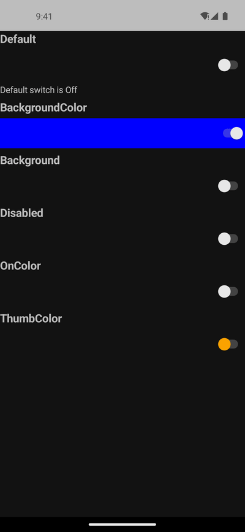</td></tr></table>

ports SwitchPage.xaml (+ .xaml.cs) Mirrors the MAUI gallery page: a vertical stack of headlined Switch states — Default, BackgroundColor (Blue), Background (a yellow→green LinearGradientBrush), Disabled, OnColor (Red), ThumbColor (Orange)

#### 🟢 Pixel-Perfect Score — C++ (C1/C3)

**Motion:** ✅ PASS · run 2026-08-13-21_06_47 · 2026-08-13

Light: MOTION 12 frames paired by step (run 2026-08-13-21_06_47, commit 74dde0864a, 2026-08-13); 2 frame(s) had no partner and were NOT scored; column frames realigned by -1 sample(s) — a sampling drift, not a defect (see _align) — worst SSIM 0.9987 at frame 1 'gif01@4s/12f' (0.10% pixels differ), mean SSIM 0.9992; per-frame diff% 0.10/0.05/0.05/0.05/0.05/0.05/0.05/0.05/0.05/0.05/0.05/0.05; self-motion MAUI 0.2293% (5447 px) vs C++ 0.2293% (5447 px) · Dark: MOTION 12 frames paired by step (run 2026-08-13-21_06_47, commit 74dde0864a, 2026-08-14); 2 frame(s) had no partner and were NOT scored; column frames realigned by -1 sample(s) — a sampling drift, not a defect (see _align) — worst SSIM 0.9994 at frame 1 'gif01@4s/12f' (0.25% pixels differ), mean SSIM 0.9994; per-frame diff% 0.25/0.15/0.15/0.15/0.15/0.15/0.15/0.15/0.15/0.15/0.15/0.15; self-motion MAUI 0.2253% (5353 px) vs C++ 0.2253% (5353 px)

#### 🟢 Pixel-Perfect Score — C++ &amp; XAML (C2/C4)

**Motion:** ✅ PASS · run 2026-08-13-21_06_47 · 2026-08-13

Light: MOTION 12 frames paired by step (run 2026-08-13-21_06_47, commit 74dde0864a, 2026-08-13); 2 frame(s) had no partner and were NOT scored; column frames realigned by -1 sample(s) — a sampling drift, not a defect (see _align) — worst SSIM 0.9987 at frame 1 'gif01@4s/12f' (0.10% pixels differ), mean SSIM 0.9992; per-frame diff% 0.10/0.05/0.05/0.05/0.05/0.05/0.05/0.05/0.05/0.05/0.05/0.05; self-motion MAUI 0.2293% (5447 px) vs C++ &amp; XAML 0.2293% (5447 px) · Dark: MOTION 13 frames paired by step (run 2026-08-13-21_06_47, commit 74dde0864a, 2026-08-14) — worst SSIM 0.9994 at frame 1 'at-rest' (0.15% pixels differ), mean SSIM 0.9994; per-frame diff% 0.15/0.25/0.15/0.15/0.15/0.15/0.15/0.15/0.15/0.15/0.15/0.15/0.15; self-motion MAUI 0.2253% (5353 px) vs C++ &amp; XAML 0.2253% (5353 px)

### 158. Switch Grouping — 🟢/🟢
switch_grouping

<table><tr><th></th><th>MAUI</th><th>C++</th><th>C++ &amp; XAML</th></tr><tr><th>Light</th><td></td><td></td><td></td></tr><tr><th>Dark</th><td></td><td></td><td></td></tr></table>

ports CollectionViewGalleries/GroupingGalleries/ SwitchGrouping.xaml (+ .xaml.cs) of the C# CollectionView gallery

#### 🟢 Pixel-Perfect Score — C++ (C1/C3)

Light: SSIM 0.9996, 0.10% pixels differ · Dark: SSIM 0.9965, 0.53% pixels differ

#### 🟢 Pixel-Perfect Score — C++ &amp; XAML (C2/C4)

Light: SSIM 0.9996, 0.10% pixels differ · Dark: SSIM 0.9965, 0.53% pixels differ

### 159. Tabbed Flyout — 🟡/🟡
tabbed_flyout

<table><tr><th></th><th>MAUI</th><th>C++</th><th>C++ &amp; XAML</th></tr><tr><th>Light</th><td></td><td></td><td></td></tr><tr><th>Dark</th><td></td><td></td><td></td></tr></table>

a self-contained demo page for the W1-10 tabbed + flyout vertical: a flyout_page whose FLYOUT pane is a titled menu (two buttons selecting the detail&amp;#x27;s tabs + a &amp;quot;Toggle flyout&amp;quot; presenting/dismissing itself) and whose DETAIL pane is a tabbed

#### 🟡 Pixel-Perfect Score — C++ (C1/C3)

Light: SSIM 1.0000, 0.00% pixels differ · Dark: SSIM 0.9996, 4.36% pixels differ

#### 🟡 Pixel-Perfect Score — C++ &amp; XAML (C2/C4)

Light: SSIM 1.0000, 0.00% pixels differ · Dark: SSIM 0.9996, 4.36% pixels differ

### 160. Templated View — 🟢/🟢
templated_view

<table><tr><th></th><th>MAUI</th><th>C++</th><th>C++ &amp; XAML</th></tr><tr><th>Light</th><td></td><td></td><td></td></tr><tr><th>Dark</th><td></td><td></td><td></td></tr></table>

ports TemplatedViewPage.xaml The C# page contrasts a standard CardView control with a compact one driven by a ControlTemplate (&amp;quot;CardViewCompressed&amp;quot;) and a custom Rate control built entirely from a ControlTemplate + a heart PathGeometry

#### 🟢 Pixel-Perfect Score — C++ (C1/C3)

Light: SSIM 0.9916, 0.50% pixels differ · Dark: SSIM 0.9912, 0.54% pixels differ

#### 🟢 Pixel-Perfect Score — C++ &amp; XAML (C2/C4)

Light: SSIM 0.9916, 0.50% pixels differ · Dark: SSIM 0.9912, 0.54% pixels differ

### 161. Time Picker — 🔴/🔴
time_picker

<table><tr><th></th><th>MAUI</th><th>C++</th><th>C++ &amp; XAML</th></tr><tr><th>Light</th><td></td><td></td><td></td></tr><tr><th>Dark</th><td></td><td></td><td></td></tr></table>

ports TimePickerPage.xaml (+ TimePickerPage.xaml.cs)

#### 🔴 Pixel-Perfect Score — C++ (C1/C3)

Light: SSIM 0.9964, 0.53% pixels differ · Dark: SSIM 0.7378, 86.17% pixels differ

#### 🔴 Pixel-Perfect Score — C++ &amp; XAML (C2/C4)

Light: SSIM 0.9964, 0.53% pixels differ · Dark: SSIM 0.7378, 86.17% pixels differ

### 162. Title Bar — 🟢/🟢
title_bar

<table><tr><th></th><th>MAUI</th><th>C++</th><th>C++ &amp; XAML</th></tr><tr><th>Light</th><td></td><td></td><td></td></tr><tr><th>Dark</th><td></td><td></td><td></td></tr></table>

ports TitleBarPage.xaml A self-contained, code-first demo of the TitleBar control

#### 🟢 Pixel-Perfect Score — C++ (C1/C3)

**Motion:** ✅ PASS · run 2026-08-13-21_06_47 · 2026-08-13

Light: MOTION 12 frames paired by step (run 2026-08-13-21_06_47, commit 74dde0864a, 2026-08-13); 2 frame(s) had no partner and were NOT scored; column frames realigned by -1 sample(s) — a sampling drift, not a defect (see _align) — worst SSIM 0.9851 at frame 2 'gif02@4s/12f' (0.68% pixels differ), mean SSIM 0.9974; per-frame diff% 0.15/0.68/0.19/0.18/0.19/0.18/0.19/0.18/0.18/0.19/0.19/0.19; self-motion MAUI 7.5196% (178666 px) vs C++ 7.5559% (179528 px) · Dark: MOTION 13 frames paired by step (run 2026-08-13-21_06_47, commit 74dde0864a, 2026-08-14) — worst SSIM 0.9872 at frame 3 'gif02@4s/12f' (0.55% pixels differ), mean SSIM 0.9986; per-frame diff% 0.00/0.06/0.55/0.08/0.06/0.08/0.08/0.08/0.08/0.06/0.06/0.08/0.06; self-motion MAUI 20.7827% (493796 px) vs C++ 20.7839% (493825 px)

#### 🟢 Pixel-Perfect Score — C++ &amp; XAML (C2/C4)

**Motion:** ✅ PASS · run 2026-08-13-21_06_47 · 2026-08-13

Light: MOTION 13 frames paired by step (run 2026-08-13-21_06_47, commit 74dde0864a, 2026-08-13) — worst SSIM 0.9861 at frame 3 'gif02@4s/12f' (0.63% pixels differ), mean SSIM 0.9977; per-frame diff% 0.06/0.15/0.63/0.19/0.18/0.19/0.18/0.18/0.19/0.19/0.19/0.19/0.18; self-motion MAUI 7.5196% (178666 px) vs C++ &amp; XAML 7.4819% (177769 px) · Dark: MOTION 13 frames paired by step (run 2026-08-13-21_06_47, commit 74dde0864a, 2026-08-14) — worst SSIM 0.9930 at frame 3 'gif02@4s/12f' (0.34% pixels differ), mean SSIM 0.9991; per-frame diff% 0.00/0.06/0.34/0.08/0.06/0.06/0.06/0.08/0.08/0.08/0.08/0.06/0.08; self-motion MAUI 20.7827% (493796 px) vs C++ &amp; XAML 20.6576% (490825 px)

### 163. Toolbar — 🟡/🟡
toolbar

<table><tr><th></th><th>MAUI</th><th>C++</th><th>C++ &amp; XAML</th></tr><tr><th>Light</th><td></td><td></td><td></td></tr><tr><th>Dark</th><td></td><td></td><td></td></tr></table>

ports ToolbarPage.xaml (Maui.Controls.Sample.Pages.ToolbarPage)

#### 🟡 Pixel-Perfect Score — C++ (C1/C3)

Light: SSIM 1.0000, 0.00% pixels differ · Dark: SSIM 0.9995, 4.54% pixels differ

#### 🟡 Pixel-Perfect Score — C++ &amp; XAML (C2/C4)

Light: SSIM 1.0000, 0.00% pixels differ · Dark: SSIM 0.9995, 4.54% pixels differ

### 164. Transform Playground — 🔴/🔴
transform_playground

<table><tr><th></th><th>MAUI</th><th>C++</th><th>C++ &amp; XAML</th></tr><tr><th>Light</th><td></td><td></td><td></td></tr><tr><th>Dark</th><td></td><td></td><td></td></tr></table>

ports TransformPlaygroundGallery.xaml A code-first port of the MAUI Shapes sub-gallery Pages/Controls/ShapesGalleries/TransformPlaygroundGallery.xaml: a 50x50 Path rectangle (red fill, blue stroke 4) sits in a 200x200 light-grey panel; belo

#### 🔴 Pixel-Perfect Score — C++ (C1/C3)

Light: SSIM 0.9960, 0.24% pixels differ · Dark: SSIM 0.7882, 62.99% pixels differ

#### 🔴 Pixel-Perfect Score — C++ &amp; XAML (C2/C4)

Light: SSIM 0.9997, 0.00% pixels differ · Dark: SSIM 0.7919, 62.75% pixels differ

### 165. Transformations — 🔴/🔴
transformations

<table><tr><th></th><th>MAUI</th><th>C++</th><th>C++ &amp; XAML</th></tr><tr><th>Light</th><td></td><td></td><td></td></tr><tr><th>Dark</th><td></td><td></td><td></td></tr></table>

ports TransformationsPage.xaml (+ .xaml.cs) The MAUI TransformationsPage drives a single target view&amp;#x27;s render transforms from a column of knobs: Sliders for Scale / ScaleX / ScaleY (Maximum 10) and Rotation / RotationX / RotationY (Maximum

#### 🔴 Pixel-Perfect Score — C++ (C1/C3)

Light: SSIM 0.9996, 0.00% pixels differ · Dark: SSIM 0.7230, 85.83% pixels differ

#### 🔴 Pixel-Perfect Score — C++ &amp; XAML (C2/C4)

Light: SSIM 0.9996, 0.00% pixels differ · Dark: SSIM 0.7230, 85.83% pixels differ

### 166. Triggers — 🟢/🟢
triggers

<table><tr><th></th><th>MAUI</th><th>C++</th><th>C++ &amp; XAML</th></tr><tr><th>Light</th><td></td><td></td><td></td></tr><tr><th>Dark</th><td></td><td></td><td></td></tr></table>

ports TriggersPage.xaml

#### 🟢 Pixel-Perfect Score — C++ (C1/C3)

Light: SSIM 1.0000, 0.00% pixels differ · Dark: SSIM 0.9997, 0.22% pixels differ

#### 🟢 Pixel-Perfect Score — C++ &amp; XAML (C2/C4)

Light: SSIM 1.0000, 0.00% pixels differ · Dark: SSIM 0.9994, 0.23% pixels differ

### 167. Update Path Data — 🟡/🟡
update_path_data

<table><tr><th></th><th>MAUI</th><th>C++</th><th>C++ &amp; XAML</th></tr><tr><th>Light</th><td></td><td></td><td></td></tr><tr><th>Dark</th><td></td><td></td><td></td></tr></table>

ports UpdatePathDataGallery.xaml A code-first port of the MAUI Shapes sub-gallery Pages/Controls/ShapesGalleries/UpdatePathDataGallery.xaml: a 2-row Grid (RowSpacing 0) that proves a Path repaints when its Data geometry is replaced at runti

#### 🟡 Pixel-Perfect Score — C++ (C1/C3)

Light: SSIM 1.0000, 0.00% pixels differ · Dark: SSIM 0.9995, 4.54% pixels differ

#### 🟡 Pixel-Perfect Score — C++ &amp; XAML (C2/C4)

Light: SSIM 1.0000, 0.00% pixels differ · Dark: SSIM 0.9995, 4.54% pixels differ

### 168. Varied Size Selector — 🟢/🟢
varied_size_selector

<table><tr><th></th><th>MAUI</th><th>C++</th><th>C++ &amp; XAML</th></tr><tr><th>Light</th><td></td><td></td><td></td></tr><tr><th>Dark</th><td></td><td></td><td></td></tr></table>

ports DataTemplateSelectorGalleries/VariedSizeDataTemplateSelectorGallery.xaml (+ VariedSizeDataTemplateSelectorGallery.xaml.cs) of the C# CollectionView gallery

#### 🟢 Pixel-Perfect Score — C++ (C1/C3)

Light: SSIM 0.9997, 0.00% pixels differ · Dark: SSIM 0.9994, 0.00% pixels differ

#### 🟢 Pixel-Perfect Score — C++ &amp; XAML (C2/C4)

Light: SSIM 0.9997, 0.00% pixels differ · Dark: SSIM 0.9994, 0.00% pixels differ

### 169. Vertical Stack — 🟢/🟢
vertical_stack

<table><tr><th></th><th>MAUI</th><th>C++</th><th>C++ &amp; XAML</th></tr><tr><th>Light</th><td></td><td></td><td></td></tr><tr><th>Dark</th><td></td><td></td><td></td></tr></table>

Vertical Stack

#### 🟢 Pixel-Perfect Score — C++ (C1/C3)

Light: SSIM 1.0000, 0.00% pixels differ · Dark: SSIM 1.0000, 0.00% pixels differ

#### 🟢 Pixel-Perfect Score — C++ &amp; XAML (C2/C4)

Light: SSIM 1.0000, 0.00% pixels differ · Dark: SSIM 1.0000, 0.00% pixels differ

### 170. Visual States — 🟢/🟢
visual_states

<table><tr><th></th><th>MAUI</th><th>C++</th><th>C++ &amp; XAML</th></tr><tr><th>Light</th><td></td><td></td><td></td></tr><tr><th>Dark</th><td></td><td></td><td></td></tr></table>

ports VisualStatesPage.xaml

#### 🟢 Pixel-Perfect Score — C++ (C1/C3)

Light: SSIM 0.9944, 0.18% pixels differ · Dark: SSIM 0.9935, 0.27% pixels differ

#### 🟢 Pixel-Perfect Score — C++ &amp; XAML (C2/C4)

Light: SSIM 0.9944, 0.18% pixels differ · Dark: SSIM 0.9931, 0.28% pixels differ

### 171. Web View — 🟢/🟢
web_view

<table><tr><th></th><th>MAUI</th><th>C++</th><th>C++ &amp; XAML</th></tr><tr><th>Light</th><td></td><td></td><td></td></tr><tr><th>Dark</th><td></td><td></td><td></td></tr></table>

a self-contained demo page for the W1-08 web_view vertical: a web_view loading a STATIC html_web_view_source (no network), back/forward/reload buttons over the handler-pushed CanGoBack/CanGoForward read-onlys, an &amp;quot;Eval 1+1&amp;quot; button driving t

#### 🟢 Pixel-Perfect Score — C++ (C1/C3)

Light: SSIM 1.0000, 0.00% pixels differ · Dark: SSIM 1.0000, 0.00% pixels differ

#### 🟢 Pixel-Perfect Score — C++ &amp; XAML (C2/C4)

Light: SSIM 1.0000, 0.00% pixels differ · Dark: SSIM 1.0000, 0.00% pixels differ

### 172. Z Index — 🟢/🟢
z_index

<table><tr><th></th><th>MAUI</th><th>C++</th><th>C++ &amp; XAML</th></tr><tr><th>Light</th><td></td><td></td><td></td></tr><tr><th>Dark</th><td></td><td></td><td></td></tr></table>

ports ZIndexPage.xaml (+ ZIndexPage.xaml.cs), code-first

#### 🟢 Pixel-Perfect Score — C++ (C1/C3)

Light: SSIM 1.0000, 0.00% pixels differ · Dark: SSIM 1.0000, 0.00% pixels differ

#### 🟢 Pixel-Perfect Score — C++ &amp; XAML (C2/C4)

Light: SSIM 1.0000, 0.00% pixels differ · Dark: SSIM 1.0000, 0.00% pixels differ

<h2>Windows (172 examples) — click to expand</h2>

Real .NET MAUI as **WinUI 3** (`Microsoft.UI.Xaml`) — MAUI's actual Windows backend — vs the C++ port's own WinUI 3 backend, both built and captured NATIVE arm64 on a Windows 11 ARM64 VM. **Partial coverage by design:** only `window`, `content_page`, `layout`, `label` and `button` have real WinUI handlers so far; every other control still uses its headless mirror and renders nothing, so a page built from one of those is expected to be blank or partial. That is the fan-out being incomplete, not a regression — see `docs/WINDOWS_TOOLCHAIN.md` §6. The **C++ &amp; XAML** column is not captured yet: its committed translation units use `#embed`, which MSVC does not implement, so it builds through the bytes-mode codegen the android lane already uses.

**Discrepancy counts** (MAUI-vs-C++ parity verdicts from the deterministic pixel-perfect score — SSIM + per-pixel diff; AI-based review has been invalidated/removed):

| Classification | Pixel-Perfect Score — C++ (C1/C3) | Pixel-Perfect Score — C++ &amp; XAML (C2/C4) |
| --- | --- | --- |
| 🟢 Match | 161 | 162 |
| 🟡 Minor | 10 | 9 |
| 🔴 Major | 1 | 1 |
| ⬛ Blank | 0 | 0 |
| ⏳ Unreviewed | 0 | 0 |

### 1. Absolute Layout — 🟢/🟢
absolute_layout

<table><tr><th></th><th>MAUI</th><th>C++</th><th>C++ &amp; XAML</th></tr><tr><th>Light</th><td></td><td></td><td></td></tr><tr><th>Dark</th><td></td><td></td><td></td></tr></table>

ports AbsoluteLayoutPage.xaml A self-contained, code-first demo of the AbsoluteLayout control

#### 🟢 Pixel-Perfect Score — C++ (C1/C3)

Light: SSIM 0.9954, 0.25% pixels differ · Dark: SSIM 0.9973, 0.25% pixels differ

#### 🟢 Pixel-Perfect Score — C++ &amp; XAML (C2/C4)

Light: SSIM 0.9993, 0.06% pixels differ · Dark: SSIM 0.9997, 0.06% pixels differ

### 2. Activity Indicator — 🟢/🟢
activity_indicator

<table><tr><th></th><th>MAUI</th><th>C++</th><th>C++ &amp; XAML</th></tr><tr><th>Light</th><td></td><td></td><td></td></tr><tr><th>Dark</th><td></td><td></td><td></td></tr></table>

ports ActivityIndicatorPage.xaml (+ ActivityIndicatorPage.xaml.cs)

#### 🟢 Pixel-Perfect Score — C++ (C1/C3)

**Motion:** ✅ PASS · run 2026-08-14-03_04_30 · 2026-08-14

Light: MOTION 11 frames paired by step (run 2026-08-14-03_04_30, commit 74dde0864a, 2026-08-14); 2 frame(s) had no partner and were NOT scored; column frames realigned by -1 sample(s) — a sampling drift, not a defect (see _align) — worst SSIM 0.9832 at frame 7 'gif08' (0.68% pixels differ), mean SSIM 0.9880; per-frame diff% 0.43/0.28/0.46/0.45/0.38/0.33/0.68/0.44/0.48/0.47/0.46; self-motion MAUI 0.5134% (4206 px) vs C++ 0.5121% (4195 px) · Dark: MOTION 12 frames paired by step (run 2026-08-14-03_04_30, commit 74dde0864a, 2026-08-14) — worst SSIM 0.9807 at frame 2 'gif02' (0.83% pixels differ), mean SSIM 0.9886; per-frame diff% 0.39/0.83/0.59/0.54/0.55/0.37/0.34/0.22/0.21/0.33/0.33/0.33; self-motion MAUI 0.4799% (3931 px) vs C++ 0.5167% (4233 px)

#### 🟢 Pixel-Perfect Score — C++ &amp; XAML (C2/C4)

**Motion:** ✅ PASS · run 2026-08-14-03_04_30 · 2026-08-14

Light: MOTION 10 frames paired by step (run 2026-08-14-03_04_30, commit 74dde0864a, 2026-08-14); 4 frame(s) had no partner and were NOT scored; column frames realigned by +2 sample(s) — a sampling drift, not a defect (see _align) — worst SSIM 0.9829 at frame 8 'gif08' (0.67% pixels differ), mean SSIM 0.9879; per-frame diff% 0.51/0.46/0.26/0.29/0.29/0.48/0.47/0.67/0.66/0.32; self-motion MAUI 0.5134% (4206 px) vs C++ &amp; XAML 0.5273% (4320 px) · Dark: MOTION 9 frames paired by step (run 2026-08-14-03_04_30, commit 74dde0864a, 2026-08-14); 6 frame(s) had no partner and were NOT scored; column frames realigned by -3 sample(s) — a sampling drift, not a defect (see _align) — worst SSIM 0.9887 at frame 8 'gif11' (0.42% pixels differ), mean SSIM 0.9914; per-frame diff% 0.23/0.25/0.25/0.25/0.22/0.24/0.37/0.42/0.35; self-motion MAUI 0.4799% (3931 px) vs C++ &amp; XAML 0.4475% (3666 px)

### 3. Adaptive Collection — 🟢/🟢
adaptive_collection

<table><tr><th></th><th>MAUI</th><th>C++</th><th>C++ &amp; XAML</th></tr><tr><th>Light</th><td></td><td></td><td></td></tr><tr><th>Dark</th><td></td><td></td><td></td></tr></table>

ports AdaptiveCollectionView.xaml (+ .xaml.cs) (Maui.Controls.Sample.Pages.CollectionViewGalleries.AdaptiveCollectionView)

#### 🟢 Pixel-Perfect Score — C++ (C1/C3)

Light: SSIM 0.9987, 0.13% pixels differ · Dark: SSIM 0.9990, 0.13% pixels differ

#### 🟢 Pixel-Perfect Score — C++ &amp; XAML (C2/C4)

Light: SSIM 0.9998, 0.02% pixels differ · Dark: SSIM 0.9997, 0.02% pixels differ

### 4. Alerts — 🟢/🟢
alerts

<table><tr><th></th><th>MAUI</th><th>C++</th><th>C++ &amp; XAML</th></tr><tr><th>Light</th><td></td><td></td><td></td></tr><tr><th>Dark</th><td></td><td></td><td></td></tr></table>

ports AlertsPage.xaml (+ AlertsPage.xaml.cs) The C# AlertsPage drives the three Page dialog services — DisplayAlertAsync (simple OK + Yes/No), DisplayActionSheetAsync (simple + Cancel/Delete), and DisplayPromptAsync (two questions) — from a

#### 🟢 Pixel-Perfect Score — C++ (C1/C3)

Light: SSIM 1.0000, 0.01% pixels differ · Dark: SSIM 1.0000, 0.01% pixels differ

#### 🟢 Pixel-Perfect Score — C++ &amp; XAML (C2/C4)

Light: SSIM 1.0000, 0.01% pixels differ · Dark: SSIM 1.0000, 0.01% pixels differ

### 5. Alignment — 🟢/🟢
alignment

<table><tr><th></th><th>MAUI</th><th>C++</th><th>C++ &amp; XAML</th></tr><tr><th>Light</th><td></td><td></td><td></td></tr><tr><th>Dark</th><td></td><td></td><td></td></tr></table>

a faithful reproduction of the maui-compare &amp;quot;alignment&amp;quot; demo (ComparePages.Alignment()), the shipped-.NET-MAUI reference for the visual-parity comparison

#### 🟢 Pixel-Perfect Score — C++ (C1/C3)

Light: SSIM 1.0000, 0.00% pixels differ · Dark: SSIM 1.0000, 0.00% pixels differ

#### 🟢 Pixel-Perfect Score — C++ &amp; XAML (C2/C4)

Light: SSIM 1.0000, 0.00% pixels differ · Dark: SSIM 1.0000, 0.00% pixels differ

### 6. Animation — 🟢/🟢
animation

<table><tr><th></th><th>MAUI</th><th>C++</th><th>C++ &amp; XAML</th></tr><tr><th>Light</th><td></td><td></td><td></td></tr><tr><th>Dark</th><td></td><td></td><td></td></tr></table>

ports AnimationPage.xaml (+ AnimationPage.xaml.cs)

#### 🟢 Pixel-Perfect Score — C++ (C1/C3)

**Motion:** 🚫 INVALID · `no-scenario` · run 2026-08-14-03_04_30 · 2026-08-14

Light: !! NO MOTION EVIDENCE: neither MAUI nor C++ changed by more than 0.012% of its own frame across the sequence (0 px vs 0 px), on a page the board treats as ANIMATED. NO ACTION SCENARIO EXISTS for this page — docs/comparison/scenarios/animation.toml is absent or declares no `action` — so nothing was ever aimed at it and both columns are at rest by construction. This is NOT a port finding and nothing about the port can be concluded from it; the missing artifact is the scenario. 80 of the 139 cells that carried the old 'NOTHING MOVED' banner were this, including 10 of the 14 hard-coded ANIMATED pages. MOTION 9 frames paired by step (run 2026-08-14-03_04_30, commit 74dde0864a, 2026-08-14); 6 frame(s) had no partner and were NOT scored; column frames realigned by -3 sample(s) — a sampling drift, not a defect (see _align) — worst SSIM 1.0000 at frame 1 'gif04' (0.00% pixels differ), mean SSIM 1.0000; per-frame diff% 0.00/0.00/0.00/0.00/0.00/0.00/0.00/0.00/0.00; self-motion MAUI 0.0000% (0 px) vs C++ 0.0000% (0 px) · Dark: !! NO MOTION EVIDENCE: neither MAUI nor C++ changed by more than 0.012% of its own frame across the sequence (0 px vs 0 px), on a page the board treats as ANIMATED. NO ACTION SCENARIO EXISTS for this page — docs/comparison/scenarios/animation.toml is absent or declares no `action` — so nothing was ever aimed at it and both columns are at rest by construction. This is NOT a port finding and nothing about the port can be concluded from it; the missing artifact is the scenario. 80 of the 139 cells that carried the old 'NOTHING MOVED' banner were this, including 10 of the 14 hard-coded ANIMATED pages. MOTION 9 frames paired by step (run 2026-08-14-03_04_30, commit 74dde0864a, 2026-08-14); 6 frame(s) had no partner and were NOT scored; column frames realigned by -3 sample(s) — a sampling drift, not a defect (see _align) — worst SSIM 1.0000 at frame 1 'gif04' (0.00% pixels differ), mean SSIM 1.0000; per-frame diff% 0.00/0.00/0.00/0.00/0.00/0.00/0.00/0.00/0.00; self-motion MAUI 0.0000% (0 px) vs C++ 0.0000% (0 px)

#### 🟢 Pixel-Perfect Score — C++ &amp; XAML (C2/C4)

**Motion:** 🚫 INVALID · `no-scenario` · run 2026-08-14-03_04_30 · 2026-08-14

Light: !! NO MOTION EVIDENCE: neither MAUI nor C++ &amp; XAML changed by more than 0.012% of its own frame across the sequence (0 px vs 0 px), on a page the board treats as ANIMATED. NO ACTION SCENARIO EXISTS for this page — docs/comparison/scenarios/animation.toml is absent or declares no `action` — so nothing was ever aimed at it and both columns are at rest by construction. This is NOT a port finding and nothing about the port can be concluded from it; the missing artifact is the scenario. 80 of the 139 cells that carried the old 'NOTHING MOVED' banner were this, including 10 of the 14 hard-coded ANIMATED pages. MOTION 9 frames paired by step (run 2026-08-14-03_04_30, commit 74dde0864a, 2026-08-14); 6 frame(s) had no partner and were NOT scored; column frames realigned by -3 sample(s) — a sampling drift, not a defect (see _align) — worst SSIM 1.0000 at frame 1 'gif04' (0.00% pixels differ), mean SSIM 1.0000; per-frame diff% 0.00/0.00/0.00/0.00/0.00/0.00/0.00/0.00/0.00; self-motion MAUI 0.0000% (0 px) vs C++ &amp; XAML 0.0000% (0 px) · Dark: !! NO MOTION EVIDENCE: neither MAUI nor C++ &amp; XAML changed by more than 0.012% of its own frame across the sequence (0 px vs 0 px), on a page the board treats as ANIMATED. NO ACTION SCENARIO EXISTS for this page — docs/comparison/scenarios/animation.toml is absent or declares no `action` — so nothing was ever aimed at it and both columns are at rest by construction. This is NOT a port finding and nothing about the port can be concluded from it; the missing artifact is the scenario. 80 of the 139 cells that carried the old 'NOTHING MOVED' banner were this, including 10 of the 14 hard-coded ANIMATED pages. MOTION 9 frames paired by step (run 2026-08-14-03_04_30, commit 74dde0864a, 2026-08-14); 6 frame(s) had no partner and were NOT scored; column frames realigned by -3 sample(s) — a sampling drift, not a defect (see _align) — worst SSIM 1.0000 at frame 1 'gif04' (0.00% pixels differ), mean SSIM 1.0000; per-frame diff% 0.00/0.00/0.00/0.00/0.00/0.00/0.00/0.00/0.00; self-motion MAUI 0.0000% (0 px) vs C++ &amp; XAML 0.0000% (0 px)

### 7. App Theme Binding — 🟢/🟢
app_theme_binding

<table><tr><th></th><th>MAUI</th><th>C++</th><th>C++ &amp; XAML</th></tr><tr><th>Light</th><td></td><td></td><td></td></tr><tr><th>Dark</th><td></td><td></td><td></td></tr></table>

ports AppThemeBindingPage.xaml

#### 🟢 Pixel-Perfect Score — C++ (C1/C3)

Light: SSIM 1.0000, 0.00% pixels differ · Dark: SSIM 1.0000, 0.00% pixels differ

#### 🟢 Pixel-Perfect Score — C++ &amp; XAML (C2/C4)

Light: SSIM 1.0000, 0.00% pixels differ · Dark: SSIM 1.0000, 0.00% pixels differ

### 8. Application Control — 🟢/🟢
application_control

<table><tr><th></th><th>MAUI</th><th>C++</th><th>C++ &amp; XAML</th></tr><tr><th>Light</th><td></td><td></td><td></td></tr><tr><th>Dark</th><td></td><td></td><td></td></tr></table>

ports ApplicationControlPage.xaml (+ .xaml.cs)

#### 🟢 Pixel-Perfect Score — C++ (C1/C3)

Light: SSIM 1.0000, 0.00% pixels differ · Dark: SSIM 1.0000, 0.00% pixels differ

#### 🟢 Pixel-Perfect Score — C++ &amp; XAML (C2/C4)

Light: SSIM 1.0000, 0.00% pixels differ · Dark: SSIM 1.0000, 0.00% pixels differ

### 9. Auto Size Shapes — 🟢/🟢
auto_size_shapes

<table><tr><th></th><th>MAUI</th><th>C++</th><th>C++ &amp; XAML</th></tr><tr><th>Light</th><td></td><td></td><td></td></tr><tr><th>Dark</th><td></td><td></td><td></td></tr></table>

ports AutoSizeShapesGallery.xaml A code-first port of the MAUI Shapes sub-gallery Pages/Controls/ShapesGalleries/AutoSizeShapesGallery.xaml: a 3-row Grid (RowSpacing 0) that proves a stroked Ellipse auto-sizes to fill exactly half of the av

#### 🟢 Pixel-Perfect Score — C++ (C1/C3)

Light: SSIM 0.9946, 0.45% pixels differ · Dark: SSIM 0.9946, 0.45% pixels differ

#### 🟢 Pixel-Perfect Score — C++ &amp; XAML (C2/C4)

Light: SSIM 0.9946, 0.45% pixels differ · Dark: SSIM 0.9946, 0.45% pixels differ

### 10. Basic Grouping — 🟢/🟢
basic_grouping

<table><tr><th></th><th>MAUI</th><th>C++</th><th>C++ &amp; XAML</th></tr><tr><th>Light</th><td></td><td></td><td></td></tr><tr><th>Dark</th><td></td><td></td><td></td></tr></table>

ports GroupingGalleries/BasicGrouping.xaml (+ .xaml.cs) of the C# CollectionView gallery

#### 🟢 Pixel-Perfect Score — C++ (C1/C3)

Light: SSIM 1.0000, 0.01% pixels differ · Dark: SSIM 0.9999, 0.01% pixels differ

#### 🟢 Pixel-Perfect Score — C++ &amp; XAML (C2/C4)

Light: SSIM 1.0000, 0.01% pixels differ · Dark: SSIM 0.9999, 0.01% pixels differ

### 11. Basic Swipe — 🟢/🟢
basic_swipe

<table><tr><th></th><th>MAUI</th><th>C++</th><th>C++ &amp; XAML</th></tr><tr><th>Light</th><td></td><td></td><td></td></tr><tr><th>Dark</th><td></td><td></td><td></td></tr></table>

ports BasicSwipeGallery.xaml A code-first port of the MAUI SwipeView sub-gallery Pages/Controls/SwipeViewGalleries/BasicSwipeGallery.xaml: a vertical StackLayout of five SwipeViews, each demonstrating a different revealed-side / SwipeMode c

#### 🟢 Pixel-Perfect Score — C++ (C1/C3)

Light: SSIM 0.9979, 0.19% pixels differ · Dark: SSIM 0.9986, 0.03% pixels differ

#### 🟢 Pixel-Perfect Score — C++ &amp; XAML (C2/C4)

Light: SSIM 0.9979, 0.19% pixels differ · Dark: SSIM 0.9986, 0.03% pixels differ

### 12. Behaviors — 🟢/🟢
behaviors

<table><tr><th></th><th>MAUI</th><th>C++</th><th>C++ &amp; XAML</th></tr><tr><th>Light</th><td></td><td></td><td></td></tr><tr><th>Dark</th><td></td><td></td><td></td></tr></table>

ports BehaviorsPage.xaml (+ .xaml.cs) and its companion Controls.Sample/Behaviors/NumericValidationBehavior.cs

#### 🟢 Pixel-Perfect Score — C++ (C1/C3)

Light: SSIM 1.0000, 0.00% pixels differ · Dark: SSIM 1.0000, 0.00% pixels differ

#### 🟢 Pixel-Perfect Score — C++ &amp; XAML (C2/C4)

Light: SSIM 1.0000, 0.00% pixels differ · Dark: SSIM 1.0000, 0.00% pixels differ

### 13. Border — 🟢/🟢
border

<table><tr><th></th><th>MAUI</th><th>C++</th><th>C++ &amp; XAML</th></tr><tr><th>Light</th><td></td><td></td><td></td></tr><tr><th>Dark</th><td></td><td></td><td></td></tr></table>

a faithful reproduction of the maui-compare &amp;quot;border&amp;quot; demo (ComparePages.BorderPage()), the shipped-.NET-MAUI reference for the visual-parity comparison: a single Border centered on the page — red 5pt stroke, a RoundRectangle StrokeShape (Co

#### 🟢 Pixel-Perfect Score — C++ (C1/C3)

Light: SSIM 1.0000, 0.00% pixels differ · Dark: SSIM 1.0000, 0.00% pixels differ

#### 🟢 Pixel-Perfect Score — C++ &amp; XAML (C2/C4)

Light: SSIM 1.0000, 0.00% pixels differ · Dark: SSIM 1.0000, 0.00% pixels differ

### 14. Border Clip Playground — 🟢/🟢
border_clip_playground

<table><tr><th></th><th>MAUI</th><th>C++</th><th>C++ &amp; XAML</th></tr><tr><th>Light</th><td></td><td></td><td></td></tr><tr><th>Dark</th><td></td><td></td><td></td></tr></table>

ports BorderClipPlayground.xaml (+ .xaml.cs) The C# page is an interactive Border-shape playground: a 100x100 Border (red stroke) clips an AspectFill Image (oasis.jpg) into the currently selected StrokeShape, while controls below mutate the

#### 🟢 Pixel-Perfect Score — C++ (C1/C3)

Light: SSIM 0.9857, 0.75% pixels differ · Dark: SSIM 0.9864, 0.75% pixels differ

#### 🟢 Pixel-Perfect Score — C++ &amp; XAML (C2/C4)

Light: SSIM 0.9901, 0.49% pixels differ · Dark: SSIM 0.9910, 0.49% pixels differ

### 15. Border Layout — 🟢/🟢
border_layout

<table><tr><th></th><th>MAUI</th><th>C++</th><th>C++ &amp; XAML</th></tr><tr><th>Light</th><td></td><td></td><td></td></tr><tr><th>Dark</th><td></td><td></td><td></td></tr></table>

ports BorderLayout.xaml (+ BorderLayout.xaml.cs) The C# page demonstrates driving Border.StrokeThickness from a Slider: a Slider (0..40, set to 5 in OnAppearing) is bound to the Border&amp;#x27;s StrokeThickness; the Border (Silver stroke, White bac

#### 🟢 Pixel-Perfect Score — C++ (C1/C3)

Light: SSIM 0.9945, 0.27% pixels differ · Dark: SSIM 0.9950, 0.28% pixels differ

#### 🟢 Pixel-Perfect Score — C++ &amp; XAML (C2/C4)

Light: SSIM 0.9945, 0.27% pixels differ · Dark: SSIM 0.9950, 0.28% pixels differ

### 16. Border Playground — 🟢/🟢
border_playground

<table><tr><th></th><th>MAUI</th><th>C++</th><th>C++ &amp; XAML</th></tr><tr><th>Light</th><td></td><td></td><td></td></tr><tr><th>Dark</th><td></td><td></td><td></td></tr></table>

ports BorderPlayground.xaml (+ BorderPlayground.xaml.cs) A self-contained, code-first interactive Border playground

#### 🟢 Pixel-Perfect Score — C++ (C1/C3)

Light: SSIM 0.9998, 0.00% pixels differ · Dark: SSIM 0.9997, 0.00% pixels differ

#### 🟢 Pixel-Perfect Score — C++ &amp; XAML (C2/C4)

Light: SSIM 1.0000, 0.00% pixels differ · Dark: SSIM 0.9999, 0.00% pixels differ

### 17. Border Resize Content — 🟢/🟢
border_resize_content

<table><tr><th></th><th>MAUI</th><th>C++</th><th>C++ &amp; XAML</th></tr><tr><th>Light</th><td></td><td></td><td></td></tr><tr><th>Dark</th><td></td><td></td><td></td></tr></table>

ports BorderResizeContent.xaml A self-contained, code-first demo that resizes a Border&amp;#x27;s CONTENT and watches the Border track it

#### 🟢 Pixel-Perfect Score — C++ (C1/C3)

Light: SSIM 0.9970, 0.20% pixels differ · Dark: SSIM 0.9973, 0.20% pixels differ

#### 🟢 Pixel-Perfect Score — C++ &amp; XAML (C2/C4)

Light: SSIM 0.9981, 0.19% pixels differ · Dark: SSIM 0.9977, 0.21% pixels differ

### 18. Border Stroke — 🟢/🟢
border_stroke

<table><tr><th></th><th>MAUI</th><th>C++</th><th>C++ &amp; XAML</th></tr><tr><th>Light</th><td></td><td></td><td></td></tr><tr><th>Dark</th><td></td><td></td><td></td></tr></table>

ports BorderStroke.xaml (+ BorderStroke.xaml.cs) A self-contained, code-first demo of Border StrokeThickness and how a Border tracks the height of its content

#### 🟢 Pixel-Perfect Score — C++ (C1/C3)

Light: SSIM 0.9997, 0.01% pixels differ · Dark: SSIM 0.9998, 0.01% pixels differ

#### 🟢 Pixel-Perfect Score — C++ &amp; XAML (C2/C4)

Light: SSIM 0.9997, 0.01% pixels differ · Dark: SSIM 0.9998, 0.01% pixels differ

### 19. Borderless — 🟢/🟢
borderless

<table><tr><th></th><th>MAUI</th><th>C++</th><th>C++ &amp; XAML</th></tr><tr><th>Light</th><td></td><td></td><td></td></tr><tr><th>Dark</th><td></td><td></td><td></td></tr></table>

ports Borderless.xaml A self-contained, code-first demo of a stroke-less Border

#### 🟢 Pixel-Perfect Score — C++ (C1/C3)

Light: SSIM 1.0000, 0.00% pixels differ · Dark: SSIM 1.0000, 0.00% pixels differ

#### 🟢 Pixel-Perfect Score — C++ &amp; XAML (C2/C4)

Light: SSIM 1.0000, 0.00% pixels differ · Dark: SSIM 1.0000, 0.00% pixels differ

### 20. Box View — 🟢/🟢
box_view

<table><tr><th></th><th>MAUI</th><th>C++</th><th>C++ &amp; XAML</th></tr><tr><th>Light</th><td></td><td></td><td></td></tr><tr><th>Dark</th><td></td><td></td><td></td></tr></table>

ports BoxViewPage.xaml (+ BoxViewPage.xaml.cs)

#### 🟢 Pixel-Perfect Score — C++ (C1/C3)

**Motion:** ✅ PASS · run 2026-08-14-03_04_30 · 2026-08-14

Light: MOTION 2 frames paired by step (run 2026-08-14-03_04_30, commit 74dde0864a, 2026-08-14) — worst SSIM 0.9999 at frame 2 'scrolled-down' (0.00% pixels differ), mean SSIM 1.0000; per-frame diff% 0.00/0.00; self-motion MAUI 12.8867% (105568 px) vs C++ 12.8875% (105574 px) · Dark: MOTION 2 frames paired by step (run 2026-08-14-03_04_30, commit 74dde0864a, 2026-08-14) — worst SSIM 0.9999 at frame 2 'scrolled-down' (0.01% pixels differ), mean SSIM 1.0000; per-frame diff% 0.00/0.01; self-motion MAUI 12.9016% (105690 px) vs C++ 12.9026% (105698 px)

#### 🟢 Pixel-Perfect Score — C++ &amp; XAML (C2/C4)

**Motion:** ✅ PASS · run 2026-08-14-03_04_30 · 2026-08-14

Light: MOTION 2 frames paired by step (run 2026-08-14-03_04_30, commit 74dde0864a, 2026-08-14) — worst SSIM 0.9999 at frame 2 'scrolled-down' (0.00% pixels differ), mean SSIM 1.0000; per-frame diff% 0.00/0.00; self-motion MAUI 12.8867% (105568 px) vs C++ &amp; XAML 12.8875% (105574 px) · Dark: MOTION 2 frames paired by step (run 2026-08-14-03_04_30, commit 74dde0864a, 2026-08-14) — worst SSIM 0.9999 at frame 2 'scrolled-down' (0.01% pixels differ), mean SSIM 1.0000; per-frame diff% 0.00/0.01; self-motion MAUI 12.9016% (105690 px) vs C++ &amp; XAML 12.9026% (105698 px)

### 21. Button — 🟢/🟢
button

<table><tr><th></th><th>MAUI</th><th>C++</th><th>C++ &amp; XAML</th></tr><tr><th>Light</th><td></td><td></td><td></td></tr><tr><th>Dark</th><td></td><td></td><td></td></tr></table>

ports ButtonPage.xaml (+ ButtonPage.xaml.cs)

#### 🟢 Pixel-Perfect Score — C++ (C1/C3)

**Motion:** ✅ PASS · run 2026-08-14-03_04_30 · 2026-08-14

Light: MOTION 2 frames paired by step (run 2026-08-14-03_04_30, commit 74dde0864a, 2026-08-14) — worst SSIM 1.0000 at frame 1 'initial' (0.00% pixels differ), mean SSIM 1.0000; per-frame diff% 0.00/0.00; self-motion MAUI 0.0070% (57 px) vs C++ 0.0070% (57 px) · Dark: MOTION 2 frames paired by step (run 2026-08-14-03_04_30, commit 74dde0864a, 2026-08-14) — worst SSIM 1.0000 at frame 1 'initial' (0.00% pixels differ), mean SSIM 1.0000; per-frame diff% 0.00/0.00; self-motion MAUI 0.0071% (58 px) vs C++ 0.0071% (58 px)

#### 🟢 Pixel-Perfect Score — C++ &amp; XAML (C2/C4)

**Motion:** ✅ PASS · run 2026-08-14-03_04_30 · 2026-08-14

Light: MOTION 2 frames paired by step (run 2026-08-14-03_04_30, commit 74dde0864a, 2026-08-14) — worst SSIM 1.0000 at frame 1 'initial' (0.00% pixels differ), mean SSIM 1.0000; per-frame diff% 0.00/0.00; self-motion MAUI 0.0070% (57 px) vs C++ &amp; XAML 0.0070% (57 px) · Dark: MOTION 2 frames paired by step (run 2026-08-14-03_04_30, commit 74dde0864a, 2026-08-14) — worst SSIM 1.0000 at frame 1 'initial' (0.00% pixels differ), mean SSIM 1.0000; per-frame diff% 0.00/0.00; self-motion MAUI 0.0071% (58 px) vs C++ &amp; XAML 0.0071% (58 px)

### 22. Carousel Page — 🟡/🟡
carousel_page

<table><tr><th></th><th>MAUI</th><th>C++</th><th>C++ &amp; XAML</th></tr><tr><th>Light</th><td></td><td></td><td></td></tr><tr><th>Dark</th><td></td><td></td><td></td></tr></table>

Carousel Page

#### 🟡 Pixel-Perfect Score — C++ (C1/C3)

**Motion:** 🚫 INVALID · `not-driven` · run 2026-08-14-03_04_30 · 2026-08-14

Light: !! NO MOTION EVIDENCE: neither MAUI nor C++ changed by more than 0.012% of its own frame across the sequence (0 px vs 0 px), on a page the board treats as ANIMATED. An action WAS injected here — carousel_page.toml declares one — and NEITHER column reacted to it. So either the coordinate misses its target on this lane, or the interaction is not reachable here. This is the actionable half of the old 'NOTHING MOVED' bucket: 59 of the 139 cells that carried it. MOTION 11 frames paired by step (run 2026-08-14-03_04_30, commit 74dde0864a, 2026-08-14); 6 frame(s) had no partner and were NOT scored; column frames realigned by -3 sample(s) — a sampling drift, not a defect (see _align) — worst SSIM 0.9991 at frame 1 'gif02' (0.03% pixels differ), mean SSIM 0.9991; per-frame diff% 0.03/0.03/0.03/0.03/0.03/0.03/0.03/0.03/0.03/0.03/0.03; self-motion MAUI 0.0000% (0 px) vs C++ 0.0000% (0 px) · Dark: !! NO MOTION EVIDENCE: neither MAUI nor C++ changed by more than 0.012% of its own frame across the sequence (0 px vs 0 px), on a page the board treats as ANIMATED. An action WAS injected here — carousel_page.toml declares one — and NEITHER column reacted to it. So either the coordinate misses its target on this lane, or the interaction is not reachable here. This is the actionable half of the old 'NOTHING MOVED' bucket: 59 of the 139 cells that carried it. MOTION 11 frames paired by step (run 2026-08-14-03_04_30, commit 74dde0864a, 2026-08-14); 6 frame(s) had no partner and were NOT scored; column frames realigned by -3 sample(s) — a sampling drift, not a defect (see _align) — worst SSIM 0.9991 at frame 1 'gif02' (0.03% pixels differ), mean SSIM 0.9991; per-frame diff% 0.03/0.03/0.03/0.03/0.03/0.03/0.03/0.03/0.03/0.03/0.03; self-motion MAUI 0.0000% (0 px) vs C++ 0.0000% (0 px)

#### 🟡 Pixel-Perfect Score — C++ &amp; XAML (C2/C4)

**Motion:** 🚫 INVALID · `not-driven` · run 2026-08-14-03_04_30 · 2026-08-14

Light: !! NO MOTION EVIDENCE: neither MAUI nor C++ &amp; XAML changed by more than 0.012% of its own frame across the sequence (0 px vs 0 px), on a page the board treats as ANIMATED. An action WAS injected here — carousel_page.toml declares one — and NEITHER column reacted to it. So either the coordinate misses its target on this lane, or the interaction is not reachable here. This is the actionable half of the old 'NOTHING MOVED' bucket: 59 of the 139 cells that carried it. MOTION 11 frames paired by step (run 2026-08-14-03_04_30, commit 74dde0864a, 2026-08-14); 6 frame(s) had no partner and were NOT scored; column frames realigned by -3 sample(s) — a sampling drift, not a defect (see _align) — worst SSIM 0.9991 at frame 1 'gif02' (0.03% pixels differ), mean SSIM 0.9991; per-frame diff% 0.03/0.03/0.03/0.03/0.03/0.03/0.03/0.03/0.03/0.03/0.03; self-motion MAUI 0.0000% (0 px) vs C++ &amp; XAML 0.0000% (0 px) · Dark: !! NO MOTION EVIDENCE: neither MAUI nor C++ &amp; XAML changed by more than 0.012% of its own frame across the sequence (0 px vs 0 px), on a page the board treats as ANIMATED. An action WAS injected here — carousel_page.toml declares one — and NEITHER column reacted to it. So either the coordinate misses its target on this lane, or the interaction is not reachable here. This is the actionable half of the old 'NOTHING MOVED' bucket: 59 of the 139 cells that carried it. MOTION 11 frames paired by step (run 2026-08-14-03_04_30, commit 74dde0864a, 2026-08-14); 6 frame(s) had no partner and were NOT scored; column frames realigned by -3 sample(s) — a sampling drift, not a defect (see _align) — worst SSIM 0.9991 at frame 1 'gif02' (0.03% pixels differ), mean SSIM 0.9991; per-frame diff% 0.03/0.03/0.03/0.03/0.03/0.03/0.03/0.03/0.03/0.03/0.03; self-motion MAUI 0.0000% (0 px) vs C++ &amp; XAML 0.0000% (0 px)

### 23. Chat Example — 🟢/🟢
chat_example

<table><tr><th></th><th>MAUI</th><th>C++</th><th>C++ &amp; XAML</th></tr><tr><th>Light</th><td></td><td></td><td></td></tr><tr><th>Dark</th><td></td><td></td><td></td></tr></table>

ports ChatExample.xaml (+ .xaml.cs) (Maui.Controls.Sample.Pages.CollectionViewGalleries.ItemSizeGalleries.ChatExample), tracking the maui-compare reference demo ~/maui-compare/Pages/ChatExamplePage.cs (the visual-parity oracle)

#### 🟢 Pixel-Perfect Score — C++ (C1/C3)

Light: SSIM 1.0000, 0.00% pixels differ · Dark: SSIM 1.0000, 0.00% pixels differ

#### 🟢 Pixel-Perfect Score — C++ &amp; XAML (C2/C4)

Light: SSIM 1.0000, 0.00% pixels differ · Dark: SSIM 1.0000, 0.00% pixels differ

### 24. Check Box — 🟢/🟢
check_box

<table><tr><th></th><th>MAUI</th><th>C++</th><th>C++ &amp; XAML</th></tr><tr><th>Light</th><td></td><td></td><td></td></tr><tr><th>Dark</th><td></td><td></td><td></td></tr></table>

ports CheckBoxPage.xaml (+ .xaml.cs) Mirrors the MAUI gallery page: a vertical stack of headlined CheckBox states — Default, Colored (Color=Purple), Disabled, Disabled+Colored+Checked — followed by a &amp;quot;Change IsChecked&amp;quot; row pairing a Button

#### 🟢 Pixel-Perfect Score — C++ (C1/C3)

**Motion:** ✅ PASS · run 2026-08-14-03_04_30 · 2026-08-14

Light: MOTION 2 frames paired by step (run 2026-08-14-03_04_30, commit 74dde0864a, 2026-08-14) — worst SSIM 0.9990 at frame 1 'initial' (0.04% pixels differ), mean SSIM 0.9990; per-frame diff% 0.04/0.04; self-motion MAUI 0.0457% (374 px) vs C++ 0.0457% (374 px) · Dark: MOTION 2 frames paired by step (run 2026-08-14-03_04_30, commit 74dde0864a, 2026-08-14) — worst SSIM 0.9992 at frame 1 'initial' (0.04% pixels differ), mean SSIM 0.9992; per-frame diff% 0.04/0.04; self-motion MAUI 0.0468% (383 px) vs C++ 0.0468% (383 px)

#### 🟢 Pixel-Perfect Score — C++ &amp; XAML (C2/C4)

**Motion:** ✅ PASS · run 2026-08-14-03_04_30 · 2026-08-14

Light: MOTION 2 frames paired by step (run 2026-08-14-03_04_30, commit 74dde0864a, 2026-08-14) — worst SSIM 1.0000 at frame 1 'initial' (0.00% pixels differ), mean SSIM 1.0000; per-frame diff% 0.00/0.00; self-motion MAUI 0.0457% (374 px) vs C++ &amp; XAML 0.0457% (374 px) · Dark: MOTION 2 frames paired by step (run 2026-08-14-03_04_30, commit 74dde0864a, 2026-08-14) — worst SSIM 1.0000 at frame 1 'initial' (0.00% pixels differ), mean SSIM 1.0000; per-frame diff% 0.00/0.00; self-motion MAUI 0.0468% (383 px) vs C++ &amp; XAML 0.0468% (383 px)

### 25. Chrome — 🟢/🟢
chrome

<table><tr><th></th><th>MAUI</th><th>C++</th><th>C++ &amp; XAML</th></tr><tr><th>Light</th><td></td><td></td><td></td></tr><tr><th>Dark</th><td></td><td></td><td></td></tr></table>

a self-contained demo page for the W1-11 window-chrome family: page toolbar items (primary + secondary), a menu bar (File menu with items, a separator and a sub-menu), a context flyout (right-click menu) on a button, and a tooltip — all wir

#### 🟢 Pixel-Perfect Score — C++ (C1/C3)

**Motion:** ✅ PASS · run 2026-08-14-03_04_30 · 2026-08-14

Light: MOTION 14 frames paired by step (run 2026-08-14-03_04_30, commit 74dde0864a, 2026-08-14) — worst SSIM 1.0000 at frame 1 'initial' (0.00% pixels differ), mean SSIM 1.0000; per-frame diff% 0.00/0.00/0.00/0.00/0.00/0.00/0.00/0.00/0.00/0.00/0.00/0.00/0.00/0.00; self-motion MAUI 0.0690% (565 px) vs C++ 0.0690% (565 px) · Dark: MOTION 14 frames paired by step (run 2026-08-14-03_04_30, commit 74dde0864a, 2026-08-14) — worst SSIM 1.0000 at frame 1 'initial' (0.00% pixels differ), mean SSIM 1.0000; per-frame diff% 0.00/0.00/0.00/0.00/0.00/0.00/0.00/0.00/0.00/0.00/0.00/0.00/0.00/0.00; self-motion MAUI 0.0731% (599 px) vs C++ 0.0731% (599 px)

#### 🟢 Pixel-Perfect Score — C++ &amp; XAML (C2/C4)

**Motion:** ✅ PASS · run 2026-08-14-03_04_30 · 2026-08-14

Light: MOTION 14 frames paired by step (run 2026-08-14-03_04_30, commit 74dde0864a, 2026-08-14) — worst SSIM 1.0000 at frame 1 'initial' (0.00% pixels differ), mean SSIM 1.0000; per-frame diff% 0.00/0.00/0.00/0.00/0.00/0.00/0.00/0.00/0.00/0.00/0.00/0.00/0.00/0.00; self-motion MAUI 0.0690% (565 px) vs C++ &amp; XAML 0.0690% (565 px) · Dark: MOTION 14 frames paired by step (run 2026-08-14-03_04_30, commit 74dde0864a, 2026-08-14) — worst SSIM 1.0000 at frame 1 'initial' (0.00% pixels differ), mean SSIM 1.0000; per-frame diff% 0.00/0.00/0.00/0.00/0.00/0.00/0.00/0.00/0.00/0.00/0.00/0.00/0.00/0.00; self-motion MAUI 0.0731% (599 px) vs C++ &amp; XAML 0.0731% (599 px)

### 26. Clip — 🟡/🟡
clip

<table><tr><th></th><th>MAUI</th><th>C++</th><th>C++ &amp; XAML</th></tr><tr><th>Light</th><td></td><td></td><td></td></tr><tr><th>Dark</th><td></td><td></td><td></td></tr></table>

ports ClipPage.xaml The C# page (Pages/Core/ClipPage.xaml; its .xaml.cs is an empty InitializeComponent) is a ScrollView over a StackLayout that shows the SAME dotnet_bot.png image five times, each successive copy carrying a different geome

#### 🟡 Pixel-Perfect Score — C++ (C1/C3)

**Motion:** ❌ FAIL · `frames-disagree` · run 2026-08-14-03_04_30 · 2026-08-14

Light: MOTION 2 frames paired by step (run 2026-08-14-03_04_30, commit 74dde0864a, 2026-08-14) — worst SSIM 0.9726 at frame 2 'scrolled-down' (2.40% pixels differ), mean SSIM 0.9859; per-frame diff% 0.04/2.40; self-motion MAUI 13.9860% (114573 px) vs C++ 15.4509% (126574 px) · Dark: MOTION 2 frames paired by step (run 2026-08-14-03_04_30, commit 74dde0864a, 2026-08-14) — worst SSIM 0.9725 at frame 2 'scrolled-down' (2.40% pixels differ), mean SSIM 0.9859; per-frame diff% 0.04/2.40; self-motion MAUI 13.9611% (114369 px) vs C++ 15.4279% (126385 px)

#### 🟡 Pixel-Perfect Score — C++ &amp; XAML (C2/C4)

**Motion:** ❌ FAIL · `frames-disagree` · run 2026-08-14-03_04_30 · 2026-08-14

Light: MOTION 2 frames paired by step (run 2026-08-14-03_04_30, commit 74dde0864a, 2026-08-14) — worst SSIM 0.9726 at frame 2 'scrolled-down' (2.40% pixels differ), mean SSIM 0.9859; per-frame diff% 0.04/2.40; self-motion MAUI 13.9860% (114573 px) vs C++ &amp; XAML 15.4509% (126574 px) · Dark: MOTION 2 frames paired by step (run 2026-08-14-03_04_30, commit 74dde0864a, 2026-08-14) — worst SSIM 0.9725 at frame 2 'scrolled-down' (2.40% pixels differ), mean SSIM 0.9859; per-frame diff% 0.04/2.40; self-motion MAUI 13.9611% (114369 px) vs C++ &amp; XAML 15.4279% (126385 px)

### 27. Clip Corner Radius — 🟢/🟢
clip_corner_radius

<table><tr><th></th><th>MAUI</th><th>C++</th><th>C++ &amp; XAML</th></tr><tr><th>Light</th><td></td><td></td><td></td></tr><tr><th>Dark</th><td></td><td></td><td></td></tr></table>

ports ClipCornerRadiusGallery.xaml (+ .xaml.cs) The C# page (Pages/Controls/ShapesGalleries/ClipCornerRadiusGallery.xaml) is a StackLayout (Padding=12) that demonstrates DRIVING a RoundRectangleGeometry&amp;#x27;s per-corner CornerRadius from four s

#### 🟢 Pixel-Perfect Score — C++ (C1/C3)

Light: SSIM 1.0000, 0.00% pixels differ · Dark: SSIM 1.0000, 0.00% pixels differ

#### 🟢 Pixel-Perfect Score — C++ &amp; XAML (C2/C4)

Light: SSIM 1.0000, 0.00% pixels differ · Dark: SSIM 1.0000, 0.00% pixels differ

### 28. Clip Gallery — 🟡/🟡
clip_gallery

<table><tr><th></th><th>MAUI</th><th>C++</th><th>C++ &amp; XAML</th></tr><tr><th>Light</th><td></td><td></td><td></td></tr><tr><th>Dark</th><td></td><td></td><td></td></tr></table>

ports ClipGallery.xaml The C# page (Pages/Controls/ShapesGalleries/ClipGallery.xaml; its .xaml.cs is an empty InitializeComponent) is a ScrollView over a StackLayout (Padding=12) that shows the SAME &amp;quot;oasis.jpg&amp;quot; image SEVEN times — one bare

#### 🟡 Pixel-Perfect Score — C++ (C1/C3)

**Motion:** ❌ FAIL · `frames-disagree` · run 2026-08-14-03_04_30 · 2026-08-14

Light: MOTION 2 frames paired by step (run 2026-08-14-03_04_30, commit 74dde0864a, 2026-08-14) — worst SSIM 0.9823 at frame 2 'scrolled-down' (2.31% pixels differ), mean SSIM 0.9911; per-frame diff% 0.00/2.31; self-motion MAUI 15.9281% (130483 px) vs C++ 16.2539% (133152 px) · Dark: MOTION 2 frames paired by step (run 2026-08-14-03_04_30, commit 74dde0864a, 2026-08-14) — worst SSIM 0.9833 at frame 2 'scrolled-down' (2.30% pixels differ), mean SSIM 0.9916; per-frame diff% 0.00/2.30; self-motion MAUI 15.8035% (129462 px) vs C++ 16.1233% (132082 px)

#### 🟡 Pixel-Perfect Score — C++ &amp; XAML (C2/C4)

**Motion:** ❌ FAIL · `frames-disagree` · run 2026-08-14-03_04_30 · 2026-08-14

Light: MOTION 2 frames paired by step (run 2026-08-14-03_04_30, commit 74dde0864a, 2026-08-14) — worst SSIM 0.9823 at frame 2 'scrolled-down' (2.31% pixels differ), mean SSIM 0.9911; per-frame diff% 0.00/2.31; self-motion MAUI 15.9281% (130483 px) vs C++ &amp; XAML 16.2539% (133152 px) · Dark: MOTION 2 frames paired by step (run 2026-08-14-03_04_30, commit 74dde0864a, 2026-08-14) — worst SSIM 0.9833 at frame 2 'scrolled-down' (2.30% pixels differ), mean SSIM 0.9916; per-frame diff% 0.00/2.30; self-motion MAUI 15.8035% (129462 px) vs C++ &amp; XAML 16.1233% (132082 px)

### 29. Clip Views — 🟡/🟡
clip_views

<table><tr><th></th><th>MAUI</th><th>C++</th><th>C++ &amp; XAML</th></tr><tr><th>Light</th><td></td><td></td><td></td></tr><tr><th>Dark</th><td></td><td></td><td></td></tr></table>

ports ClipViewsGallery.xaml The C# page (Pages/Controls/ShapesGalleries/ClipViewsGallery.xaml; no code-behind beyond an empty InitializeComponent) is a ScrollView over a StackLayout (Padding=12) that proves the Clip surface (VisualElement.C

#### 🟡 Pixel-Perfect Score — C++ (C1/C3)

**Motion:** ❌ FAIL · `frames-disagree` · run 2026-08-14-03_04_30 · 2026-08-14

Light: MOTION 2 frames paired by step (run 2026-08-14-03_04_30, commit 74dde0864a, 2026-08-14); 2 frame(s) had no partner and were NOT scored; column frames realigned by -1 sample(s) — a sampling drift, not a defect (see _align) — worst SSIM 0.9874 at frame 2 'typed' (1.09% pixels differ), mean SSIM 0.9926; per-frame diff% 0.16/1.09; self-motion MAUI 0.0885% (725 px) vs C++ 1.0487% (8591 px); !! SELF-MOTION ASYMMETRY 12x — C++ moved far more over its OWN sequence than the other column did. The verdict is taken on the PAIRED frames only, so this does not by itself contradict it, and it is not treated as a defect. Its own frames did not all pair (see the frame count above), so part of that motion was never compared at all. It is flagged because a ratio this size means the two columns did visibly different amounts of work and the paired numbers cannot say why · Dark: MOTION 2 frames paired by step (run 2026-08-14-03_04_30, commit 74dde0864a, 2026-08-14); 2 frame(s) had no partner and were NOT scored; column frames realigned by -1 sample(s) — a sampling drift, not a defect (see _align) — worst SSIM 0.9911 at frame 2 'typed' (1.08% pixels differ), mean SSIM 0.9944; per-frame diff% 0.15/1.08; self-motion MAUI 0.0896% (734 px) vs C++ 1.0486% (8590 px); !! SELF-MOTION ASYMMETRY 12x — C++ moved far more over its OWN sequence than the other column did. The verdict is taken on the PAIRED frames only, so this does not by itself contradict it, and it is not treated as a defect. Its own frames did not all pair (see the frame count above), so part of that motion was never compared at all. It is flagged because a ratio this size means the two columns did visibly different amounts of work and the paired numbers cannot say why

#### 🟡 Pixel-Perfect Score — C++ &amp; XAML (C2/C4)

**Motion:** ❌ FAIL · `frames-disagree` · run 2026-08-14-03_04_30 · 2026-08-14

Light: MOTION 2 frames paired by step (run 2026-08-14-03_04_30, commit 74dde0864a, 2026-08-14); 2 frame(s) had no partner and were NOT scored; column frames realigned by -1 sample(s) — a sampling drift, not a defect (see _align) — worst SSIM 0.9874 at frame 2 'typed' (1.09% pixels differ), mean SSIM 0.9926; per-frame diff% 0.16/1.09; self-motion MAUI 0.0885% (725 px) vs C++ &amp; XAML 1.0487% (8591 px); !! SELF-MOTION ASYMMETRY 12x — C++ &amp; XAML moved far more over its OWN sequence than the other column did. The verdict is taken on the PAIRED frames only, so this does not by itself contradict it, and it is not treated as a defect. Its own frames did not all pair (see the frame count above), so part of that motion was never compared at all. It is flagged because a ratio this size means the two columns did visibly different amounts of work and the paired numbers cannot say why · Dark: MOTION 2 frames paired by step (run 2026-08-14-03_04_30, commit 74dde0864a, 2026-08-14); 2 frame(s) had no partner and were NOT scored; column frames realigned by -1 sample(s) — a sampling drift, not a defect (see _align) — worst SSIM 0.9911 at frame 2 'typed' (1.08% pixels differ), mean SSIM 0.9944; per-frame diff% 0.15/1.08; self-motion MAUI 0.0896% (734 px) vs C++ &amp; XAML 1.0486% (8590 px); !! SELF-MOTION ASYMMETRY 12x — C++ &amp; XAML moved far more over its OWN sequence than the other column did. The verdict is taken on the PAIRED frames only, so this does not by itself contradict it, and it is not treated as a defect. Its own frames did not all pair (see the frame count above), so part of that motion was never compared at all. It is flagged because a ratio this size means the two columns did visibly different amounts of work and the paired numbers cannot say why

### 30. Clipping — 🟢/🟢
clipping

<table><tr><th></th><th>MAUI</th><th>C++</th><th>C++ &amp; XAML</th></tr><tr><th>Light</th><td></td><td></td><td></td></tr><tr><th>Dark</th><td></td><td></td><td></td></tr></table>

compare oracle ~/maui-compare/Pages/ClippingPage.cs (itself written to mirror this gallery page)

#### 🟢 Pixel-Perfect Score — C++ (C1/C3)

Light: SSIM 1.0000, 0.00% pixels differ · Dark: SSIM 1.0000, 0.00% pixels differ

#### 🟢 Pixel-Perfect Score — C++ &amp; XAML (C2/C4)

Light: SSIM 1.0000, 0.00% pixels differ · Dark: SSIM 1.0000, 0.00% pixels differ

### 31. Collectionview — 🟢/🟢
collectionview

<table><tr><th></th><th>MAUI</th><th>C++</th><th>C++ &amp; XAML</th></tr><tr><th>Light</th><td></td><td></td><td></td></tr><tr><th>Dark</th><td></td><td></td><td></td></tr></table>

a faithful reproduction of the maui-compare &amp;quot;collectionview&amp;quot; demo (ComparePages.CollectionViewPage()), the shipped-.NET-MAUI reference for the visual-parity comparison: a CollectionView over 24 captioned items, a string Header (&amp;quot;This is the

#### 🟢 Pixel-Perfect Score — C++ (C1/C3)

Light: SSIM 0.9973, 0.07% pixels differ · Dark: SSIM 0.9973, 0.07% pixels differ

#### 🟢 Pixel-Perfect Score — C++ &amp; XAML (C2/C4)

Light: SSIM 0.9973, 0.07% pixels differ · Dark: SSIM 0.9973, 0.07% pixels differ

### 32. Composition Gallery — 🟢/🟢
composition_gallery

<table><tr><th></th><th>MAUI</th><th>C++</th><th>C++ &amp; XAML</th></tr><tr><th>Light</th><td></td><td></td><td></td></tr><tr><th>Dark</th><td></td><td></td><td></td></tr></table>

ports CompositionGallery.xaml A self-contained, code-first port of the MAUI Shapes sub-gallery Pages/Controls/ShapesGalleries/CompositionGallery.xaml: a StackLayout holding two Beige 250x250 Grids (Margin 12) that compose multiple overlappi

#### 🟢 Pixel-Perfect Score — C++ (C1/C3)

Light: SSIM 1.0000, 0.01% pixels differ · Dark: SSIM 1.0000, 0.01% pixels differ

#### 🟢 Pixel-Perfect Score — C++ &amp; XAML (C2/C4)

Light: SSIM 1.0000, 0.01% pixels differ · Dark: SSIM 1.0000, 0.01% pixels differ

### 33. Containers — 🟢/🟢
containers

<table><tr><th></th><th>MAUI</th><th>C++</th><th>C++ &amp; XAML</th></tr><tr><th>Light</th><td></td><td></td><td></td></tr><tr><th>Dark</th><td></td><td></td><td></td></tr></table>

a self-contained demo page for the W1-07 container set: a scroll_view hosting a vertical stack of content-hosting containers — a border-framed label (stroke + dashed outline + rounded shape), a legacy frame (BorderColor/CornerRadius/HasShad

#### 🟢 Pixel-Perfect Score — C++ (C1/C3)

Light: SSIM 0.9878, 0.56% pixels differ · Dark: SSIM 0.9883, 0.52% pixels differ

#### 🟢 Pixel-Perfect Score — C++ &amp; XAML (C2/C4)

Light: SSIM 0.9878, 0.56% pixels differ · Dark: SSIM 0.9883, 0.52% pixels differ

### 34. Content View — 🟢/🟢
content_view

<table><tr><th></th><th>MAUI</th><th>C++</th><th>C++ &amp; XAML</th></tr><tr><th>Light</th><td></td><td></td><td></td></tr><tr><th>Dark</th><td></td><td></td><td></td></tr></table>

ports ContentViewPage.xaml (+ ContentViewPage.xaml.cs), code-first

#### 🟢 Pixel-Perfect Score — C++ (C1/C3)

Light: SSIM 1.0000, 0.00% pixels differ · Dark: SSIM 1.0000, 0.00% pixels differ

#### 🟢 Pixel-Perfect Score — C++ &amp; XAML (C2/C4)

Light: SSIM 1.0000, 0.00% pixels differ · Dark: SSIM 1.0000, 0.00% pixels differ

### 35. Context Flyout — 🔴/🔴
context_flyout

<table><tr><th></th><th>MAUI</th><th>C++</th><th>C++ &amp; XAML</th></tr><tr><th>Light</th><td></td><td></td><td></td></tr><tr><th>Dark</th><td></td><td></td><td></td></tr></table>

ports ContextFlyoutPage.xaml (+ ContextFlyoutPage.xaml.cs) The C# page attaches a MenuFlyout as the FlyoutBase.ContextFlyout (right-click / long-press menu) of several controls and wires each menu item to a handler: - a Button (&amp;quot;Increment b

#### 🔴 Pixel-Perfect Score — C++ (C1/C3)

Light: SSIM 0.5782, 30.82% pixels differ · Dark: SSIM 0.4719, 52.78% pixels differ

#### 🔴 Pixel-Perfect Score — C++ &amp; XAML (C2/C4)

Light: SSIM 0.5760, 30.94% pixels differ · Dark: SSIM 0.4719, 52.78% pixels differ

### 36. Controls Stack — 🟢/🟢
controls_stack

<table><tr><th></th><th>MAUI</th><th>C++</th><th>C++ &amp; XAML</th></tr><tr><th>Light</th><td></td><td></td><td></td></tr><tr><th>Dark</th><td></td><td></td><td></td></tr></table>

a faithful reproduction of the maui-compare &amp;quot;controls_stack&amp;quot; demo (ComparePages.ControlsStack()), the shipped-.NET-MAUI reference for the visual-parity comparison: a VerticalStackLayout (Spacing 12, Padding 16) showcasing the basic widgets

#### 🟢 Pixel-Perfect Score — C++ (C1/C3)

**Motion:** ✅ PASS · run 2026-08-14-03_04_30 · 2026-08-14

Light: MOTION 2 frames paired by step (run 2026-08-14-03_04_30, commit 74dde0864a, 2026-08-14) — worst SSIM 0.9988 at frame 1 'initial' (0.02% pixels differ), mean SSIM 0.9988; per-frame diff% 0.02/0.02; self-motion MAUI 0.0173% (142 px) vs C++ 0.0154% (126 px) · Dark: MOTION 2 frames paired by step (run 2026-08-14-03_04_30, commit 74dde0864a, 2026-08-14) — worst SSIM 0.9986 at frame 2 'unchecked' (0.02% pixels differ), mean SSIM 0.9988; per-frame diff% 0.01/0.02; self-motion MAUI 0.0217% (178 px) vs C++ 0.0208% (170 px)

#### 🟢 Pixel-Perfect Score — C++ &amp; XAML (C2/C4)

**Motion:** ✅ PASS · run 2026-08-14-03_04_30 · 2026-08-14

Light: MOTION 2 frames paired by step (run 2026-08-14-03_04_30, commit 74dde0864a, 2026-08-14) — worst SSIM 0.9988 at frame 1 'initial' (0.02% pixels differ), mean SSIM 0.9989; per-frame diff% 0.02/0.02; self-motion MAUI 0.0173% (142 px) vs C++ &amp; XAML 0.0164% (134 px) · Dark: MOTION 2 frames paired by step (run 2026-08-14-03_04_30, commit 74dde0864a, 2026-08-14) — worst SSIM 0.9984 at frame 2 'unchecked' (0.02% pixels differ), mean SSIM 0.9986; per-frame diff% 0.02/0.02; self-motion MAUI 0.0217% (178 px) vs C++ &amp; XAML 0.0211% (173 px)

### 37. Custom Layout — 🟢/🟢
custom_layout

<table><tr><th></th><th>MAUI</th><th>C++</th><th>C++ &amp; XAML</th></tr><tr><th>Light</th><td></td><td></td><td></td></tr><tr><th>Dark</th><td></td><td></td><td></td></tr></table>

ports CustomLayoutPage.xaml (+ CustomLayoutPage.xaml.cs)

#### 🟢 Pixel-Perfect Score — C++ (C1/C3)

Light: SSIM 1.0000, 0.00% pixels differ · Dark: SSIM 1.0000, 0.00% pixels differ

#### 🟢 Pixel-Perfect Score — C++ &amp; XAML (C2/C4)

Light: SSIM 1.0000, 0.00% pixels differ · Dark: SSIM 1.0000, 0.00% pixels differ

### 38. Custom Size Swipe — 🟢/🟢
custom_size_swipe

<table><tr><th></th><th>MAUI</th><th>C++</th><th>C++ &amp; XAML</th></tr><tr><th>Light</th><td></td><td></td><td></td></tr><tr><th>Dark</th><td></td><td></td><td></td></tr></table>

ports CustomSizeSwipeViewGallery.xaml (+ .xaml.cs) The MAUI CustomSizeSwipeViewGallery is a single SwipeView whose Left / Right / Top item collections each reveal CUSTOM-SIZED content: a SwipeItemView wrapping a Grid/StackLayout with an exp

#### 🟢 Pixel-Perfect Score — C++ (C1/C3)

Light: SSIM 1.0000, 0.00% pixels differ · Dark: SSIM 1.0000, 0.00% pixels differ

#### 🟢 Pixel-Perfect Score — C++ &amp; XAML (C2/C4)

Light: SSIM 1.0000, 0.00% pixels differ · Dark: SSIM 1.0000, 0.00% pixels differ

### 39. Custom Swipe Item View — 🟢/🟢
custom_swipe_item_view

<table><tr><th></th><th>MAUI</th><th>C++</th><th>C++ &amp; XAML</th></tr><tr><th>Light</th><td></td><td></td><td></td></tr><tr><th>Dark</th><td></td><td></td><td></td></tr></table>

ports CustomSwipeItemViewGallery.xaml A self-contained, code-first port of the .NET MAUI &amp;quot;CustomSwipeItem&amp;quot; gallery: a message-list row whose right swipe reveals a CUSTOM-content swipe item (a swipe_item_view, not a plain swipe_item)

#### 🟢 Pixel-Perfect Score — C++ (C1/C3)

Light: SSIM 1.0000, 0.00% pixels differ · Dark: SSIM 1.0000, 0.00% pixels differ

#### 🟢 Pixel-Perfect Score — C++ &amp; XAML (C2/C4)

Light: SSIM 1.0000, 0.00% pixels differ · Dark: SSIM 1.0000, 0.00% pixels differ

### 40. Cv Visual States — 🟢/🟢
cv_visual_states

<table><tr><th></th><th>MAUI</th><th>C++</th><th>C++ &amp; XAML</th></tr><tr><th>Light</th><td></td><td></td><td></td></tr><tr><th>Dark</th><td></td><td></td><td></td></tr></table>

ports CollectionViewGalleries/SelectionGalleries/ VisualStatesGallery.xaml (+ .xaml.cs) of the C# CollectionView gallery

#### 🟢 Pixel-Perfect Score — C++ (C1/C3)

Light: SSIM 1.0000, 0.00% pixels differ · Dark: SSIM 0.9993, 0.02% pixels differ

#### 🟢 Pixel-Perfect Score — C++ &amp; XAML (C2/C4)

Light: SSIM 1.0000, 0.00% pixels differ · Dark: SSIM 0.9993, 0.02% pixels differ

### 41. Data Template Selector — 🟢/🟢
data_template_selector

<table><tr><th></th><th>MAUI</th><th>C++</th><th>C++ &amp; XAML</th></tr><tr><th>Light</th><td></td><td></td><td></td></tr><tr><th>Dark</th><td></td><td></td><td></td></tr></table>

ports DataTemplateSelectorGallery.xaml (+ DataTemplateSelectorGallery.xaml.cs, including its WeekendSelector + SearchTermSelector classes)

#### 🟢 Pixel-Perfect Score — C++ (C1/C3)

**Motion:** ✅ PASS · run 2026-08-14-03_04_30 · 2026-08-14

Light: MOTION 3 frames paired by step (run 2026-08-14-03_04_30, commit 74dde0864a, 2026-08-14) — worst SSIM 1.0000 at frame 1 'initial' (0.00% pixels differ), mean SSIM 1.0000; per-frame diff% 0.00/0.00/0.00; self-motion MAUI 0.3091% (2532 px) vs C++ 0.3091% (2532 px) · Dark: MOTION 3 frames paired by step (run 2026-08-14-03_04_30, commit 74dde0864a, 2026-08-14) — worst SSIM 1.0000 at frame 1 'initial' (0.00% pixels differ), mean SSIM 1.0000; per-frame diff% 0.00/0.00/0.00; self-motion MAUI 0.3158% (2587 px) vs C++ 0.3158% (2587 px)

#### 🟢 Pixel-Perfect Score — C++ &amp; XAML (C2/C4)

**Motion:** ✅ PASS · run 2026-08-14-03_04_30 · 2026-08-14

Light: MOTION 3 frames paired by step (run 2026-08-14-03_04_30, commit 74dde0864a, 2026-08-14) — worst SSIM 1.0000 at frame 1 'initial' (0.00% pixels differ), mean SSIM 1.0000; per-frame diff% 0.00/0.00/0.00; self-motion MAUI 0.3091% (2532 px) vs C++ &amp; XAML 0.3091% (2532 px) · Dark: MOTION 3 frames paired by step (run 2026-08-14-03_04_30, commit 74dde0864a, 2026-08-14) — worst SSIM 1.0000 at frame 1 'initial' (0.00% pixels differ), mean SSIM 1.0000; per-frame diff% 0.00/0.00/0.00; self-motion MAUI 0.3158% (2587 px) vs C++ &amp; XAML 0.3158% (2587 px)

### 42. Date Picker — 🟢/🟢
date_picker

<table><tr><th></th><th>MAUI</th><th>C++</th><th>C++ &amp; XAML</th></tr><tr><th>Light</th><td></td><td></td><td></td></tr><tr><th>Dark</th><td></td><td></td><td></td></tr></table>

ports DatePickerPage.xaml (+ DatePickerPage.xaml.cs)

#### 🟢 Pixel-Perfect Score — C++ (C1/C3)

Light: SSIM 0.9973, 0.08% pixels differ · Dark: SSIM 0.9974, 0.08% pixels differ

#### 🟢 Pixel-Perfect Score — C++ &amp; XAML (C2/C4)

Light: SSIM 1.0000, 0.00% pixels differ · Dark: SSIM 1.0000, 0.00% pixels differ

### 43. Device — 🟢/🟢
device

<table><tr><th></th><th>MAUI</th><th>C++</th><th>C++ &amp; XAML</th></tr><tr><th>Light</th><td></td><td></td><td></td></tr><tr><th>Dark</th><td></td><td></td><td></td></tr></table>

ports DevicePage.xaml

#### 🟢 Pixel-Perfect Score — C++ (C1/C3)

Light: SSIM 0.9915, 0.24% pixels differ · Dark: SSIM 0.9916, 0.25% pixels differ

#### 🟢 Pixel-Perfect Score — C++ &amp; XAML (C2/C4)

Light: SSIM 1.0000, 0.00% pixels differ · Dark: SSIM 1.0000, 0.00% pixels differ

### 44. Dispatcher — 🟢/🟢
dispatcher

<table><tr><th></th><th>MAUI</th><th>C++</th><th>C++ &amp; XAML</th></tr><tr><th>Light</th><td></td><td></td><td></td></tr><tr><th>Dark</th><td></td><td></td><td></td></tr></table>

ports DispatcherPage.xaml (+ .xaml.cs)

#### 🟢 Pixel-Perfect Score — C++ (C1/C3)

Light: SSIM 1.0000, 0.00% pixels differ · Dark: SSIM 1.0000, 0.00% pixels differ

#### 🟢 Pixel-Perfect Score — C++ &amp; XAML (C2/C4)

Light: SSIM 1.0000, 0.00% pixels differ · Dark: SSIM 1.0000, 0.00% pixels differ

### 45. Drag Drop — 🟢/🟢
drag_drop

<table><tr><th></th><th>MAUI</th><th>C++</th><th>C++ &amp; XAML</th></tr><tr><th>Light</th><td></td><td></td><td></td></tr><tr><th>Dark</th><td></td><td></td><td></td></tr></table>

ports DragAndDropBetweenLayouts.xaml (+ .xaml.cs) (Maui.Controls.Sample.Pages.DragAndDropBetweenLayouts)

#### 🟢 Pixel-Perfect Score — C++ (C1/C3)

Light: SSIM 1.0000, 0.00% pixels differ · Dark: SSIM 1.0000, 0.00% pixels differ

#### 🟢 Pixel-Perfect Score — C++ &amp; XAML (C2/C4)

Light: SSIM 1.0000, 0.00% pixels differ · Dark: SSIM 1.0000, 0.00% pixels differ

### 46. Editor — 🟢/🟢
editor

<table><tr><th></th><th>MAUI</th><th>C++</th><th>C++ &amp; XAML</th></tr><tr><th>Light</th><td></td><td></td><td></td></tr><tr><th>Dark</th><td></td><td></td><td></td></tr></table>

ports EditorPage.xaml (Microsoft.Maui.Controls sample gallery)

#### 🟢 Pixel-Perfect Score — C++ (C1/C3)

**Motion:** ✅ PASS · run 2026-08-14-03_04_30 · 2026-08-14

Light: MOTION 3 frames paired by step (run 2026-08-14-03_04_30, commit 74dde0864a, 2026-08-14) — worst SSIM 1.0000 at frame 1 'initial' (0.00% pixels differ), mean SSIM 1.0000; per-frame diff% 0.00/0.01/0.03; self-motion MAUI 0.2701% (2213 px) vs C++ 0.2822% (2312 px) · Dark: MOTION 3 frames paired by step (run 2026-08-14-03_04_30, commit 74dde0864a, 2026-08-14) — worst SSIM 0.9987 at frame 3 'typed' (0.04% pixels differ), mean SSIM 0.9994; per-frame diff% 0.00/0.01/0.04; self-motion MAUI 0.2695% (2208 px) vs C++ 0.2828% (2317 px)

#### 🟢 Pixel-Perfect Score — C++ &amp; XAML (C2/C4)

**Motion:** ✅ PASS · run 2026-08-14-03_04_30 · 2026-08-14

Light: MOTION 3 frames paired by step (run 2026-08-14-03_04_30, commit 74dde0864a, 2026-08-14) — worst SSIM 1.0000 at frame 1 'initial' (0.00% pixels differ), mean SSIM 1.0000; per-frame diff% 0.00/0.01/0.03; self-motion MAUI 0.2701% (2213 px) vs C++ &amp; XAML 0.2822% (2312 px) · Dark: MOTION 3 frames paired by step (run 2026-08-14-03_04_30, commit 74dde0864a, 2026-08-14) — worst SSIM 0.9987 at frame 3 'typed' (0.04% pixels differ), mean SSIM 0.9994; per-frame diff% 0.00/0.01/0.04; self-motion MAUI 0.2695% (2208 px) vs C++ &amp; XAML 0.2828% (2317 px)

### 47. Effects — 🟢/🟢
effects

<table><tr><th></th><th>MAUI</th><th>C++</th><th>C++ &amp; XAML</th></tr><tr><th>Light</th><td></td><td></td><td></td></tr><tr><th>Dark</th><td></td><td></td><td></td></tr></table>

ports EffectsPage.xaml (Maui.Controls.Sample.Pages.EffectsPage)

#### 🟢 Pixel-Perfect Score — C++ (C1/C3)

Light: SSIM 1.0000, 0.00% pixels differ · Dark: SSIM 1.0000, 0.00% pixels differ

#### 🟢 Pixel-Perfect Score — C++ &amp; XAML (C2/C4)

Light: SSIM 1.0000, 0.00% pixels differ · Dark: SSIM 1.0000, 0.00% pixels differ

### 48. Ellipse Gallery — 🟢/🟢
ellipse_gallery

<table><tr><th></th><th>MAUI</th><th>C++</th><th>C++ &amp; XAML</th></tr><tr><th>Light</th><td></td><td></td><td></td></tr><tr><th>Dark</th><td></td><td></td><td></td></tr></table>

ports EllipseGallery.xaml A self-contained, code-first port of the MAUI Shapes EllipseGallery (Pages/Controls/ShapesGalleries/EllipseGallery.xaml + .xaml.cs)

#### 🟢 Pixel-Perfect Score — C++ (C1/C3)

Light: SSIM 0.9989, 0.17% pixels differ · Dark: SSIM 0.9982, 0.17% pixels differ

#### 🟢 Pixel-Perfect Score — C++ &amp; XAML (C2/C4)

Light: SSIM 0.9989, 0.17% pixels differ · Dark: SSIM 0.9982, 0.17% pixels differ

### 49. Empty View — 🟢/🟢
empty_view

<table><tr><th></th><th>MAUI</th><th>C++</th><th>C++ &amp; XAML</th></tr><tr><th>Light</th><td></td><td></td><td></td></tr><tr><th>Dark</th><td></td><td></td><td></td></tr></table>

ports EmptyViewStringGallery.xaml (+ EmptyViewStringGallery.xaml.cs)

#### 🟢 Pixel-Perfect Score — C++ (C1/C3)

Light: SSIM 1.0000, 0.00% pixels differ · Dark: SSIM 1.0000, 0.00% pixels differ

#### 🟢 Pixel-Perfect Score — C++ &amp; XAML (C2/C4)

Light: SSIM 1.0000, 0.00% pixels differ · Dark: SSIM 1.0000, 0.00% pixels differ

### 50. Empty View Load Simulate — 🟢/🟢
empty_view_load_simulate

<table><tr><th></th><th>MAUI</th><th>C++</th><th>C++ &amp; XAML</th></tr><tr><th>Light</th><td></td><td></td><td></td></tr><tr><th>Dark</th><td></td><td></td><td></td></tr></table>

ports EmptyViewGalleries/EmptyViewLoadSimulateGallery.xaml (+ EmptyViewLoadSimulateGallery.xaml.cs)

#### 🟢 Pixel-Perfect Score — C++ (C1/C3)

**Motion:** 🚫 INVALID · `no-scenario` · run 2026-08-14-03_04_30 · 2026-08-14

Light: !! NO MOTION EVIDENCE: neither MAUI nor C++ changed by more than 0.012% of its own frame across the sequence (0 px vs 0 px), on a page the board treats as ANIMATED. NO ACTION SCENARIO EXISTS for this page — docs/comparison/scenarios/empty_view_load_simulate.toml is absent or declares no `action` — so nothing was ever aimed at it and both columns are at rest by construction. This is NOT a port finding and nothing about the port can be concluded from it; the missing artifact is the scenario. 80 of the 139 cells that carried the old 'NOTHING MOVED' banner were this, including 10 of the 14 hard-coded ANIMATED pages. MOTION 9 frames paired by step (run 2026-08-14-03_04_30, commit 74dde0864a, 2026-08-14); 6 frame(s) had no partner and were NOT scored; column frames realigned by -3 sample(s) — a sampling drift, not a defect (see _align) — worst SSIM 0.9928 at frame 1 'gif04' (0.15% pixels differ), mean SSIM 0.9928; per-frame diff% 0.15/0.15/0.15/0.15/0.15/0.15/0.15/0.15/0.15; self-motion MAUI 0.0000% (0 px) vs C++ 0.0000% (0 px) · Dark: !! NO MOTION EVIDENCE: neither MAUI nor C++ changed by more than 0.012% of its own frame across the sequence (0 px vs 0 px), on a page the board treats as ANIMATED. NO ACTION SCENARIO EXISTS for this page — docs/comparison/scenarios/empty_view_load_simulate.toml is absent or declares no `action` — so nothing was ever aimed at it and both columns are at rest by construction. This is NOT a port finding and nothing about the port can be concluded from it; the missing artifact is the scenario. 80 of the 139 cells that carried the old 'NOTHING MOVED' banner were this, including 10 of the 14 hard-coded ANIMATED pages. MOTION 9 frames paired by step (run 2026-08-14-03_04_30, commit 74dde0864a, 2026-08-14); 6 frame(s) had no partner and were NOT scored; column frames realigned by -3 sample(s) — a sampling drift, not a defect (see _align) — worst SSIM 0.9925 at frame 1 'gif04' (0.16% pixels differ), mean SSIM 0.9925; per-frame diff% 0.16/0.16/0.16/0.16/0.16/0.16/0.16/0.16/0.16; self-motion MAUI 0.0000% (0 px) vs C++ 0.0000% (0 px)

#### 🟢 Pixel-Perfect Score — C++ &amp; XAML (C2/C4)

**Motion:** 🚫 INVALID · `no-scenario` · run 2026-08-14-03_04_30 · 2026-08-14

Light: !! NO MOTION EVIDENCE: neither MAUI nor C++ &amp; XAML changed by more than 0.012% of its own frame across the sequence (0 px vs 0 px), on a page the board treats as ANIMATED. NO ACTION SCENARIO EXISTS for this page — docs/comparison/scenarios/empty_view_load_simulate.toml is absent or declares no `action` — so nothing was ever aimed at it and both columns are at rest by construction. This is NOT a port finding and nothing about the port can be concluded from it; the missing artifact is the scenario. 80 of the 139 cells that carried the old 'NOTHING MOVED' banner were this, including 10 of the 14 hard-coded ANIMATED pages. MOTION 9 frames paired by step (run 2026-08-14-03_04_30, commit 74dde0864a, 2026-08-14); 6 frame(s) had no partner and were NOT scored; column frames realigned by -3 sample(s) — a sampling drift, not a defect (see _align) — worst SSIM 0.9928 at frame 1 'gif04' (0.15% pixels differ), mean SSIM 0.9928; per-frame diff% 0.15/0.15/0.15/0.15/0.15/0.15/0.15/0.15/0.15; self-motion MAUI 0.0000% (0 px) vs C++ &amp; XAML 0.0000% (0 px) · Dark: !! NO MOTION EVIDENCE: neither MAUI nor C++ &amp; XAML changed by more than 0.012% of its own frame across the sequence (0 px vs 0 px), on a page the board treats as ANIMATED. NO ACTION SCENARIO EXISTS for this page — docs/comparison/scenarios/empty_view_load_simulate.toml is absent or declares no `action` — so nothing was ever aimed at it and both columns are at rest by construction. This is NOT a port finding and nothing about the port can be concluded from it; the missing artifact is the scenario. 80 of the 139 cells that carried the old 'NOTHING MOVED' banner were this, including 10 of the 14 hard-coded ANIMATED pages. MOTION 9 frames paired by step (run 2026-08-14-03_04_30, commit 74dde0864a, 2026-08-14); 6 frame(s) had no partner and were NOT scored; column frames realigned by -3 sample(s) — a sampling drift, not a defect (see _align) — worst SSIM 0.9925 at frame 1 'gif04' (0.16% pixels differ), mean SSIM 0.9925; per-frame diff% 0.16/0.16/0.16/0.16/0.16/0.16/0.16/0.16/0.16; self-motion MAUI 0.0000% (0 px) vs C++ &amp; XAML 0.0000% (0 px)

### 51. Empty View Null — 🟢/🟢
empty_view_null

<table><tr><th></th><th>MAUI</th><th>C++</th><th>C++ &amp; XAML</th></tr><tr><th>Light</th><td></td><td></td><td></td></tr><tr><th>Dark</th><td></td><td></td><td></td></tr></table>

ports EmptyViewGalleries/EmptyViewNullGallery.xaml (+ EmptyViewNullGallery.xaml.cs)

#### 🟢 Pixel-Perfect Score — C++ (C1/C3)

Light: SSIM 0.9943, 0.12% pixels differ · Dark: SSIM 0.9941, 0.13% pixels differ

#### 🟢 Pixel-Perfect Score — C++ &amp; XAML (C2/C4)

Light: SSIM 0.9943, 0.12% pixels differ · Dark: SSIM 0.9941, 0.13% pixels differ

### 52. Empty View Rtl — 🟢/🟢
empty_view_rtl

<table><tr><th></th><th>MAUI</th><th>C++</th><th>C++ &amp; XAML</th></tr><tr><th>Light</th><td></td><td></td><td></td></tr><tr><th>Dark</th><td></td><td></td><td></td></tr></table>

ports EmptyViewGalleries/EmptyViewRTLGallery.xaml (+ EmptyViewRTLGallery.xaml.cs)

#### 🟢 Pixel-Perfect Score — C++ (C1/C3)

**Motion:** ✅ PASS · run 2026-08-14-03_04_30 · 2026-08-14

Light: MOTION 3 frames paired by step (run 2026-08-14-03_04_30, commit 74dde0864a, 2026-08-14) — worst SSIM 0.9953 at frame 1 'initial' (0.11% pixels differ), mean SSIM 0.9953; per-frame diff% 0.11/0.11/0.11; self-motion MAUI 0.2781% (2278 px) vs C++ 0.2781% (2278 px) · Dark: MOTION 3 frames paired by step (run 2026-08-14-03_04_30, commit 74dde0864a, 2026-08-14) — worst SSIM 0.9952 at frame 1 'initial' (0.11% pixels differ), mean SSIM 0.9952; per-frame diff% 0.11/0.11/0.11; self-motion MAUI 0.2809% (2301 px) vs C++ 0.2809% (2301 px)

#### 🟢 Pixel-Perfect Score — C++ &amp; XAML (C2/C4)

**Motion:** ✅ PASS · run 2026-08-14-03_04_30 · 2026-08-14

Light: MOTION 3 frames paired by step (run 2026-08-14-03_04_30, commit 74dde0864a, 2026-08-14) — worst SSIM 0.9973 at frame 1 'initial' (0.07% pixels differ), mean SSIM 0.9973; per-frame diff% 0.07/0.07/0.07; self-motion MAUI 0.2781% (2278 px) vs C++ &amp; XAML 0.2781% (2278 px) · Dark: MOTION 3 frames paired by step (run 2026-08-14-03_04_30, commit 74dde0864a, 2026-08-14) — worst SSIM 0.9973 at frame 1 'initial' (0.07% pixels differ), mean SSIM 0.9973; per-frame diff% 0.07/0.07/0.07; self-motion MAUI 0.2809% (2301 px) vs C++ &amp; XAML 0.2809% (2301 px)

### 53. Empty View Selector — 🟢/🟢
empty_view_selector

<table><tr><th></th><th>MAUI</th><th>C++</th><th>C++ &amp; XAML</th></tr><tr><th>Light</th><td></td><td></td><td></td></tr><tr><th>Dark</th><td></td><td></td><td></td></tr></table>

ports EmptyViewGalleries/EmptyViewWithDataTemplateSelector.xaml (+ .xaml.cs, incl

#### 🟢 Pixel-Perfect Score — C++ (C1/C3)

**Motion:** ✅ PASS · run 2026-08-14-03_04_30 · 2026-08-14

Light: MOTION 3 frames paired by step (run 2026-08-14-03_04_30, commit 74dde0864a, 2026-08-14) — worst SSIM 1.0000 at frame 1 'initial' (0.00% pixels differ), mean SSIM 1.0000; per-frame diff% 0.00/0.00/0.00; self-motion MAUI 0.2670% (2187 px) vs C++ 0.2670% (2187 px) · Dark: MOTION 3 frames paired by step (run 2026-08-14-03_04_30, commit 74dde0864a, 2026-08-14) — worst SSIM 1.0000 at frame 1 'initial' (0.00% pixels differ), mean SSIM 1.0000; per-frame diff% 0.00/0.00/0.00; self-motion MAUI 0.2698% (2210 px) vs C++ 0.2698% (2210 px)

#### 🟢 Pixel-Perfect Score — C++ &amp; XAML (C2/C4)

**Motion:** ✅ PASS · run 2026-08-14-03_04_30 · 2026-08-14

Light: MOTION 3 frames paired by step (run 2026-08-14-03_04_30, commit 74dde0864a, 2026-08-14) — worst SSIM 1.0000 at frame 1 'initial' (0.00% pixels differ), mean SSIM 1.0000; per-frame diff% 0.00/0.00/0.00; self-motion MAUI 0.2670% (2187 px) vs C++ &amp; XAML 0.2670% (2187 px) · Dark: MOTION 3 frames paired by step (run 2026-08-14-03_04_30, commit 74dde0864a, 2026-08-14) — worst SSIM 1.0000 at frame 1 'initial' (0.00% pixels differ), mean SSIM 1.0000; per-frame diff% 0.00/0.00/0.00; self-motion MAUI 0.2698% (2210 px) vs C++ &amp; XAML 0.2698% (2210 px)

### 54. Empty View Swap — 🟢/🟢
empty_view_swap

<table><tr><th></th><th>MAUI</th><th>C++</th><th>C++ &amp; XAML</th></tr><tr><th>Light</th><td></td><td></td><td></td></tr><tr><th>Dark</th><td></td><td></td><td></td></tr></table>

ports EmptyViewGalleries/EmptyViewSwapGallery.xaml (+ .xaml.cs)

#### 🟢 Pixel-Perfect Score — C++ (C1/C3)

Light: SSIM 0.9973, 0.07% pixels differ · Dark: SSIM 0.9973, 0.07% pixels differ

#### 🟢 Pixel-Perfect Score — C++ &amp; XAML (C2/C4)

Light: SSIM 0.9973, 0.07% pixels differ · Dark: SSIM 0.9973, 0.07% pixels differ

### 55. Empty View Template — 🟢/🟢
empty_view_template

<table><tr><th></th><th>MAUI</th><th>C++</th><th>C++ &amp; XAML</th></tr><tr><th>Light</th><td></td><td></td><td></td></tr><tr><th>Dark</th><td></td><td></td><td></td></tr></table>

ports EmptyViewGalleries/EmptyViewTemplateGallery.xaml (+ EmptyViewTemplateGallery.xaml.cs)

#### 🟢 Pixel-Perfect Score — C++ (C1/C3)

Light: SSIM 0.9973, 0.07% pixels differ · Dark: SSIM 0.9973, 0.07% pixels differ

#### 🟢 Pixel-Perfect Score — C++ &amp; XAML (C2/C4)

Light: SSIM 0.9973, 0.07% pixels differ · Dark: SSIM 0.9973, 0.07% pixels differ

### 56. Empty View View — 🟢/🟢
empty_view_view

<table><tr><th></th><th>MAUI</th><th>C++</th><th>C++ &amp; XAML</th></tr><tr><th>Light</th><td></td><td></td><td></td></tr><tr><th>Dark</th><td></td><td></td><td></td></tr></table>

ports EmptyViewGalleries/EmptyViewViewGallery.xaml (+ EmptyViewViewGallery.xaml.cs)

#### 🟢 Pixel-Perfect Score — C++ (C1/C3)

Light: SSIM 0.9973, 0.07% pixels differ · Dark: SSIM 0.9973, 0.07% pixels differ

#### 🟢 Pixel-Perfect Score — C++ &amp; XAML (C2/C4)

Light: SSIM 0.9973, 0.07% pixels differ · Dark: SSIM 0.9973, 0.07% pixels differ

### 57. Entry — 🟢/🟢
entry

<table><tr><th></th><th>MAUI</th><th>C++</th><th>C++ &amp; XAML</th></tr><tr><th>Light</th><td></td><td></td><td></td></tr><tr><th>Dark</th><td></td><td></td><td></td></tr></table>

ports EntryPage.xaml (Microsoft.Maui.Controls sample gallery)

#### 🟢 Pixel-Perfect Score — C++ (C1/C3)

**Motion:** ✅ PASS · run 2026-08-14-03_04_30 · 2026-08-14

Light: MOTION 3 frames paired by step (run 2026-08-14-03_04_30, commit 74dde0864a, 2026-08-14) — worst SSIM 0.9996 at frame 2 'focus-field' (0.02% pixels differ), mean SSIM 0.9997; per-frame diff% 0.00/0.02/0.04; self-motion MAUI 0.2701% (2213 px) vs C++ 0.2870% (2351 px) · Dark: MOTION 3 frames paired by step (run 2026-08-14-03_04_30, commit 74dde0864a, 2026-08-14) — worst SSIM 0.9984 at frame 3 'typed' (0.04% pixels differ), mean SSIM 0.9992; per-frame diff% 0.00/0.02/0.04; self-motion MAUI 0.2695% (2208 px) vs C++ 0.2876% (2356 px)

#### 🟢 Pixel-Perfect Score — C++ &amp; XAML (C2/C4)

**Motion:** ✅ PASS · run 2026-08-14-03_04_30 · 2026-08-14

Light: MOTION 3 frames paired by step (run 2026-08-14-03_04_30, commit 74dde0864a, 2026-08-14) — worst SSIM 0.9996 at frame 2 'focus-field' (0.02% pixels differ), mean SSIM 0.9997; per-frame diff% 0.00/0.02/0.04; self-motion MAUI 0.2701% (2213 px) vs C++ &amp; XAML 0.2870% (2351 px) · Dark: MOTION 3 frames paired by step (run 2026-08-14-03_04_30, commit 74dde0864a, 2026-08-14) — worst SSIM 0.9984 at frame 3 'typed' (0.04% pixels differ), mean SSIM 0.9992; per-frame diff% 0.00/0.02/0.04; self-motion MAUI 0.2695% (2208 px) vs C++ &amp; XAML 0.2876% (2356 px)

### 58. Filter Collection — 🟢/🟢
filter_collection

<table><tr><th></th><th>MAUI</th><th>C++</th><th>C++ &amp; XAML</th></tr><tr><th>Light</th><td></td><td></td><td></td></tr><tr><th>Dark</th><td></td><td></td><td></td></tr></table>

ports FilterCollectionView.xaml (+ .xaml.cs) of the C# CollectionView gallery

#### 🟢 Pixel-Perfect Score — C++ (C1/C3)

Light: SSIM 0.9934, 0.17% pixels differ · Dark: SSIM 0.9933, 0.18% pixels differ

#### 🟢 Pixel-Perfect Score — C++ &amp; XAML (C2/C4)

Light: SSIM 0.9973, 0.07% pixels differ · Dark: SSIM 0.9973, 0.07% pixels differ

### 59. Filter Selection — 🟢/🟢
filter_selection

<table><tr><th></th><th>MAUI</th><th>C++</th><th>C++ &amp; XAML</th></tr><tr><th>Light</th><td></td><td></td><td></td></tr><tr><th>Dark</th><td></td><td></td><td></td></tr></table>

ports FilterSelection.xaml (+ .xaml.cs) (Maui.Controls.Sample.Pages.CollectionViewGalleries.SelectionGalleries.FilterSelection)

#### 🟢 Pixel-Perfect Score — C++ (C1/C3)

Light: SSIM 1.0000, 0.00% pixels differ · Dark: SSIM 1.0000, 0.00% pixels differ

#### 🟢 Pixel-Perfect Score — C++ &amp; XAML (C2/C4)

Light: SSIM 1.0000, 0.00% pixels differ · Dark: SSIM 1.0000, 0.00% pixels differ

### 60. Flex Layout — 🟢/🟢
flex_layout

<table><tr><th></th><th>MAUI</th><th>C++</th><th>C++ &amp; XAML</th></tr><tr><th>Light</th><td></td><td></td><td></td></tr><tr><th>Dark</th><td></td><td></td><td></td></tr></table>

ports FlexLayoutPage.xaml A self-contained, code-first demo of the FlexLayout control: the classic &amp;quot;holy grail&amp;quot; page layout built from nested flexboxes

#### 🟢 Pixel-Perfect Score — C++ (C1/C3)

Light: SSIM 1.0000, 0.00% pixels differ · Dark: SSIM 1.0000, 0.00% pixels differ

#### 🟢 Pixel-Perfect Score — C++ &amp; XAML (C2/C4)

Light: SSIM 1.0000, 0.00% pixels differ · Dark: SSIM 1.0000, 0.00% pixels differ

### 61. Focus — 🟢/🟢
focus

<table><tr><th></th><th>MAUI</th><th>C++</th><th>C++ &amp; XAML</th></tr><tr><th>Light</th><td></td><td></td><td></td></tr><tr><th>Dark</th><td></td><td></td><td></td></tr></table>

ports FocusPage.xaml (+ FocusPage.xaml.cs) The C# FocusPage is a focus-subsystem demo: an Entry whose Focused/Unfocused events (OnFocusEntryFocusChanged) append &amp;quot;Focused&amp;quot;/&amp;quot;Unfocused&amp;quot; lines to a scrolling InfoLabel, plus two buttons — &amp;quot;Focus

#### 🟢 Pixel-Perfect Score — C++ (C1/C3)

Light: SSIM 1.0000, 0.00% pixels differ · Dark: SSIM 1.0000, 0.00% pixels differ

#### 🟢 Pixel-Perfect Score — C++ &amp; XAML (C2/C4)

Light: SSIM 1.0000, 0.00% pixels differ · Dark: SSIM 1.0000, 0.00% pixels differ

### 62. Fonts — 🟢/🟢
fonts

<table><tr><th></th><th>MAUI</th><th>C++</th><th>C++ &amp; XAML</th></tr><tr><th>Light</th><td></td><td></td><td></td></tr><tr><th>Dark</th><td></td><td></td><td></td></tr></table>

a faithful reproduction of the maui-compare &amp;quot;fonts&amp;quot; demo (ComparePages.Fonts()), the shipped-.NET-MAUI reference for the visual-parity comparison: a ScrollView over a VerticalStackLayout (Spacing 8, Padding 16) of nine Labels — Title/Subtit

#### 🟢 Pixel-Perfect Score — C++ (C1/C3)

Light: SSIM 1.0000, 0.00% pixels differ · Dark: SSIM 1.0000, 0.00% pixels differ

#### 🟢 Pixel-Perfect Score — C++ &amp; XAML (C2/C4)

Light: SSIM 1.0000, 0.00% pixels differ · Dark: SSIM 1.0000, 0.00% pixels differ

### 63. Footer Only String — 🟢/🟢
footer_only_string

<table><tr><th></th><th>MAUI</th><th>C++</th><th>C++ &amp; XAML</th></tr><tr><th>Light</th><td></td><td></td><td></td></tr><tr><th>Dark</th><td></td><td></td><td></td></tr></table>

ports FooterOnlyString.xaml (+ FooterOnlyString.xaml.cs) of the C# CollectionView gallery (CollectionViewGalleries/HeaderFooterGalleries)

#### 🟢 Pixel-Perfect Score — C++ (C1/C3)

Light: SSIM 1.0000, 0.00% pixels differ · Dark: SSIM 1.0000, 0.00% pixels differ

#### 🟢 Pixel-Perfect Score — C++ &amp; XAML (C2/C4)

Light: SSIM 1.0000, 0.00% pixels differ · Dark: SSIM 1.0000, 0.00% pixels differ

### 64. Formatted Text — 🟢/🟢
formatted_text

<table><tr><th></th><th>MAUI</th><th>C++</th><th>C++ &amp; XAML</th></tr><tr><th>Light</th><td></td><td></td><td></td></tr><tr><th>Dark</th><td></td><td></td><td></td></tr></table>

a self-contained demo page for the G1 rich-text slice: a label whose FormattedText is built from several styled spans (bold / italic / colored / underlined / kerned), plus a plain label proving the Text ⇄ FormattedText exclusivity

#### 🟢 Pixel-Perfect Score — C++ (C1/C3)

Light: SSIM 0.9983, 0.03% pixels differ · Dark: SSIM 0.9983, 0.03% pixels differ

#### 🟢 Pixel-Perfect Score — C++ &amp; XAML (C2/C4)

Light: SSIM 1.0000, 0.00% pixels differ · Dark: SSIM 1.0000, 0.00% pixels differ

### 65. Gestures — 🟢/🟢
gestures

<table><tr><th></th><th>MAUI</th><th>C++</th><th>C++ &amp; XAML</th></tr><tr><th>Light</th><td></td><td></td><td></td></tr><tr><th>Dark</th><td></td><td></td><td></td></tr></table>

ports GesturesPage.xaml (+ .xaml.cs) The MAUI GesturesPage.xaml is a *gallery navigation* page: a CollectionView listing gesture-demo sections that the shell navigates into

#### 🟢 Pixel-Perfect Score — C++ (C1/C3)

**Motion:** ✅ PASS · run 2026-08-14-03_04_30 · 2026-08-14

Light: MOTION 14 frames paired by step (run 2026-08-14-03_04_30, commit 74dde0864a, 2026-08-14) — worst SSIM 1.0000 at frame 1 'initial' (0.00% pixels differ), mean SSIM 1.0000; per-frame diff% 0.00/0.00/0.00/0.00/0.00/0.00/0.00/0.00/0.00/0.00/0.00/0.00/0.00/0.00; self-motion MAUI 0.0319% (261 px) vs C++ 0.0319% (261 px) · Dark: MOTION 14 frames paired by step (run 2026-08-14-03_04_30, commit 74dde0864a, 2026-08-14) — worst SSIM 1.0000 at frame 1 'initial' (0.00% pixels differ), mean SSIM 1.0000; per-frame diff% 0.00/0.00/0.00/0.00/0.00/0.00/0.00/0.00/0.00/0.00/0.00/0.00/0.00/0.00; self-motion MAUI 0.0314% (257 px) vs C++ 0.0314% (257 px)

#### 🟢 Pixel-Perfect Score — C++ &amp; XAML (C2/C4)

**Motion:** ✅ PASS · run 2026-08-14-03_04_30 · 2026-08-14

Light: MOTION 14 frames paired by step (run 2026-08-14-03_04_30, commit 74dde0864a, 2026-08-14) — worst SSIM 1.0000 at frame 1 'initial' (0.00% pixels differ), mean SSIM 1.0000; per-frame diff% 0.00/0.00/0.00/0.00/0.00/0.00/0.00/0.00/0.00/0.00/0.00/0.00/0.00/0.00; self-motion MAUI 0.0319% (261 px) vs C++ &amp; XAML 0.0319% (261 px) · Dark: MOTION 14 frames paired by step (run 2026-08-14-03_04_30, commit 74dde0864a, 2026-08-14) — worst SSIM 1.0000 at frame 1 'initial' (0.00% pixels differ), mean SSIM 1.0000; per-frame diff% 0.00/0.00/0.00/0.00/0.00/0.00/0.00/0.00/0.00/0.00/0.00/0.00/0.00/0.00; self-motion MAUI 0.0314% (257 px) vs C++ &amp; XAML 0.0314% (257 px)

### 66. Gradient — 🟢/🟢
gradient

<table><tr><th></th><th>MAUI</th><th>C++</th><th>C++ &amp; XAML</th></tr><tr><th>Light</th><td></td><td></td><td></td></tr><tr><th>Dark</th><td></td><td></td><td></td></tr></table>

a faithful reproduction of the maui-compare &amp;quot;gradient&amp;quot; demo (ComparePages.Gradient()), the shipped-.NET-MAUI reference for the visual-parity comparison: a VerticalStackLayout (Spacing 12, Padding 16) of two captioned 60px BoxViews — a Linea

#### 🟢 Pixel-Perfect Score — C++ (C1/C3)

Light: SSIM 1.0000, 0.00% pixels differ · Dark: SSIM 1.0000, 0.00% pixels differ

#### 🟢 Pixel-Perfect Score — C++ &amp; XAML (C2/C4)

Light: SSIM 1.0000, 0.00% pixels differ · Dark: SSIM 1.0000, 0.00% pixels differ

### 67. Grid — 🟢/🟢
grid

<table><tr><th></th><th>MAUI</th><th>C++</th><th>C++ &amp; XAML</th></tr><tr><th>Light</th><td></td><td></td><td></td></tr><tr><th>Dark</th><td></td><td></td><td></td></tr></table>

a faithful reproduction of the maui-compare &amp;quot;grid&amp;quot; demo (ComparePages.GridPage()), the shipped-.NET-MAUI reference for the visual-parity comparison: a Grid (Padding 16, Row/ColumnSpacing 6) with RowDefinitions Auto / 80 / 80 and two Star co

#### 🟢 Pixel-Perfect Score — C++ (C1/C3)

Light: SSIM 1.0000, 0.00% pixels differ · Dark: SSIM 1.0000, 0.00% pixels differ

#### 🟢 Pixel-Perfect Score — C++ &amp; XAML (C2/C4)

Light: SSIM 1.0000, 0.00% pixels differ · Dark: SSIM 1.0000, 0.00% pixels differ

### 68. Grid Grouping — 🟢/🟢
grid_grouping

<table><tr><th></th><th>MAUI</th><th>C++</th><th>C++ &amp; XAML</th></tr><tr><th>Light</th><td></td><td></td><td></td></tr><tr><th>Dark</th><td></td><td></td><td></td></tr></table>

ports GroupingGalleries/GridGrouping.xaml (+ .xaml.cs) of the C# CollectionView gallery

#### 🟢 Pixel-Perfect Score — C++ (C1/C3)

Light: SSIM 0.9987, 0.03% pixels differ · Dark: SSIM 0.9985, 0.03% pixels differ

#### 🟢 Pixel-Perfect Score — C++ &amp; XAML (C2/C4)

Light: SSIM 0.9987, 0.03% pixels differ · Dark: SSIM 0.9985, 0.03% pixels differ

### 69. Grouping No Templates — 🟢/🟢
grouping_no_templates

<table><tr><th></th><th>MAUI</th><th>C++</th><th>C++ &amp; XAML</th></tr><tr><th>Light</th><td></td><td></td><td></td></tr><tr><th>Dark</th><td></td><td></td><td></td></tr></table>

ports GroupingGalleries/GroupingNoTemplates.xaml (+ .xaml.cs) of the C# CollectionView gallery

#### 🟢 Pixel-Perfect Score — C++ (C1/C3)

Light: SSIM 1.0000, 0.00% pixels differ · Dark: SSIM 1.0000, 0.00% pixels differ

#### 🟢 Pixel-Perfect Score — C++ &amp; XAML (C2/C4)

Light: SSIM 1.0000, 0.00% pixels differ · Dark: SSIM 1.0000, 0.00% pixels differ

### 70. Grouping Plus Selection — 🟢/🟢
grouping_plus_selection

<table><tr><th></th><th>MAUI</th><th>C++</th><th>C++ &amp; XAML</th></tr><tr><th>Light</th><td></td><td></td><td></td></tr><tr><th>Dark</th><td></td><td></td><td></td></tr></table>

ports CollectionViewGalleries/GroupingGalleries/ GroupingPlusSelection.xaml (+ .xaml.cs) of the C# CollectionView gallery

#### 🟢 Pixel-Perfect Score — C++ (C1/C3)

Light: SSIM 1.0000, 0.01% pixels differ · Dark: SSIM 0.9999, 0.01% pixels differ

#### 🟢 Pixel-Perfect Score — C++ &amp; XAML (C2/C4)

Light: SSIM 1.0000, 0.01% pixels differ · Dark: SSIM 0.9999, 0.01% pixels differ

### 71. Header Footer — 🟢/🟢
header_footer

<table><tr><th></th><th>MAUI</th><th>C++</th><th>C++ &amp; XAML</th></tr><tr><th>Light</th><td></td><td></td><td></td></tr><tr><th>Dark</th><td></td><td></td><td></td></tr></table>

ports HeaderFooterString.xaml (+ HeaderFooterString.xaml.cs)

#### 🟢 Pixel-Perfect Score — C++ (C1/C3)

Light: SSIM 1.0000, 0.00% pixels differ · Dark: SSIM 1.0000, 0.00% pixels differ

#### 🟢 Pixel-Perfect Score — C++ &amp; XAML (C2/C4)

Light: SSIM 1.0000, 0.00% pixels differ · Dark: SSIM 1.0000, 0.00% pixels differ

### 72. Header Footer Grid — 🟢/🟢
header_footer_grid

<table><tr><th></th><th>MAUI</th><th>C++</th><th>C++ &amp; XAML</th></tr><tr><th>Light</th><td></td><td></td><td></td></tr><tr><th>Dark</th><td></td><td></td><td></td></tr></table>

ports HeaderFooterGrid.xaml (+ HeaderFooterGrid.xaml.cs) of the C# CollectionView gallery (CollectionViewGalleries/HeaderFooterGalleries)

#### 🟢 Pixel-Perfect Score — C++ (C1/C3)

Light: SSIM 0.9833, 0.31% pixels differ · Dark: SSIM 0.9820, 0.31% pixels differ

#### 🟢 Pixel-Perfect Score — C++ &amp; XAML (C2/C4)

Light: SSIM 0.9967, 0.15% pixels differ · Dark: SSIM 0.9926, 0.27% pixels differ

### 73. Header Footer Grid Horizontal — 🟢/🟢
header_footer_grid_horizontal

<table><tr><th></th><th>MAUI</th><th>C++</th><th>C++ &amp; XAML</th></tr><tr><th>Light</th><td></td><td></td><td></td></tr><tr><th>Dark</th><td></td><td></td><td></td></tr></table>

ports HeaderFooterGridHorizontal.xaml (+ HeaderFooterGridHorizontal.xaml.cs) of the C# CollectionView gallery (CollectionViewGalleries/HeaderFooterGalleries)

#### 🟢 Pixel-Perfect Score — C++ (C1/C3)

Light: SSIM 0.9994, 0.08% pixels differ · Dark: SSIM 0.9958, 0.20% pixels differ

#### 🟢 Pixel-Perfect Score — C++ &amp; XAML (C2/C4)

Light: SSIM 0.9994, 0.08% pixels differ · Dark: SSIM 0.9958, 0.20% pixels differ

### 74. Header Footer Template — 🟢/🟢
header_footer_template

<table><tr><th></th><th>MAUI</th><th>C++</th><th>C++ &amp; XAML</th></tr><tr><th>Light</th><td></td><td></td><td></td></tr><tr><th>Dark</th><td></td><td></td><td></td></tr></table>

ports HeaderFooterTemplate.xaml (+ .xaml.cs) of the C# CollectionView gallery (CollectionViewGalleries/HeaderFooterGalleries)

#### 🟢 Pixel-Perfect Score — C++ (C1/C3)

Light: SSIM 0.9899, 0.93% pixels differ · Dark: SSIM 0.9885, 0.85% pixels differ

#### 🟢 Pixel-Perfect Score — C++ &amp; XAML (C2/C4)

Light: SSIM 0.9899, 0.93% pixels differ · Dark: SSIM 0.9885, 0.85% pixels differ

### 75. Header Footer View — 🟢/🟢
header_footer_view

<table><tr><th></th><th>MAUI</th><th>C++</th><th>C++ &amp; XAML</th></tr><tr><th>Light</th><td></td><td></td><td></td></tr><tr><th>Dark</th><td></td><td></td><td></td></tr></table>

ports HeaderFooterView.xaml (+ .xaml.cs) of the C# CollectionView gallery (CollectionViewGalleries/HeaderFooterGalleries)

#### 🟢 Pixel-Perfect Score — C++ (C1/C3)

Light: SSIM 0.9958, 0.24% pixels differ · Dark: SSIM 0.9960, 0.23% pixels differ

#### 🟢 Pixel-Perfect Score — C++ &amp; XAML (C2/C4)

Light: SSIM 0.9958, 0.24% pixels differ · Dark: SSIM 0.9960, 0.23% pixels differ

### 76. Hit Testing — 🟢/🟢
hit_testing

<table><tr><th></th><th>MAUI</th><th>C++</th><th>C++ &amp; XAML</th></tr><tr><th>Light</th><td></td><td></td><td></td></tr><tr><th>Dark</th><td></td><td></td><td></td></tr></table>

ports HitTestingPage.xaml (+ .xaml.cs) (Maui.Controls.Sample.Pages.HitTestingPage)

#### 🟢 Pixel-Perfect Score — C++ (C1/C3)

**Motion:** ✅ PASS · run 2026-08-14-03_04_30 · 2026-08-14

Light: MOTION 2 frames paired by step (run 2026-08-14-03_04_30, commit 74dde0864a, 2026-08-14) — worst SSIM 0.9855 at frame 1 'initial' (0.33% pixels differ), mean SSIM 0.9856; per-frame diff% 0.33/0.33; self-motion MAUI 0.0457% (374 px) vs C++ 0.0457% (374 px) · Dark: MOTION 2 frames paired by step (run 2026-08-14-03_04_30, commit 74dde0864a, 2026-08-14) — worst SSIM 0.9878 at frame 1 'initial' (0.28% pixels differ), mean SSIM 0.9878; per-frame diff% 0.28/0.28; self-motion MAUI 0.0468% (383 px) vs C++ 0.0468% (383 px)

#### 🟢 Pixel-Perfect Score — C++ &amp; XAML (C2/C4)

**Motion:** ✅ PASS · run 2026-08-14-03_04_30 · 2026-08-14

Light: MOTION 2 frames paired by step (run 2026-08-14-03_04_30, commit 74dde0864a, 2026-08-14) — worst SSIM 0.9855 at frame 1 'initial' (0.33% pixels differ), mean SSIM 0.9856; per-frame diff% 0.33/0.33; self-motion MAUI 0.0457% (374 px) vs C++ &amp; XAML 0.0457% (374 px) · Dark: MOTION 2 frames paired by step (run 2026-08-14-03_04_30, commit 74dde0864a, 2026-08-14) — worst SSIM 0.9878 at frame 1 'initial' (0.28% pixels differ), mean SSIM 0.9878; per-frame diff% 0.28/0.28; self-motion MAUI 0.0468% (383 px) vs C++ &amp; XAML 0.0468% (383 px)

### 77. Horizontal Stack — 🟢/🟢
horizontal_stack

<table><tr><th></th><th>MAUI</th><th>C++</th><th>C++ &amp; XAML</th></tr><tr><th>Light</th><td></td><td></td><td></td></tr><tr><th>Dark</th><td></td><td></td><td></td></tr></table>

Horizontal Stack

#### 🟢 Pixel-Perfect Score — C++ (C1/C3)

Light: SSIM 1.0000, 0.00% pixels differ · Dark: SSIM 1.0000, 0.00% pixels differ

#### 🟢 Pixel-Perfect Score — C++ &amp; XAML (C2/C4)

Light: SSIM 1.0000, 0.00% pixels differ · Dark: SSIM 1.0000, 0.00% pixels differ

### 78. Hybrid Web View — 🟢/🟢
hybrid_web_view

<table><tr><th></th><th>MAUI</th><th>C++</th><th>C++ &amp; XAML</th></tr><tr><th>Light</th><td></td><td></td><td></td></tr><tr><th>Dark</th><td></td><td></td><td></td></tr></table>

ports HybridWebViewPage.xaml (+ HybridWebViewPage.xaml.cs)

#### 🟢 Pixel-Perfect Score — C++ (C1/C3)

Light: SSIM 0.9985, 0.21% pixels differ · Dark: SSIM 0.9988, 0.19% pixels differ

#### 🟢 Pixel-Perfect Score — C++ &amp; XAML (C2/C4)

Light: SSIM 0.9985, 0.21% pixels differ · Dark: SSIM 0.9988, 0.19% pixels differ

### 79. Image — 🟢/🟢
image

<table><tr><th></th><th>MAUI</th><th>C++</th><th>C++ &amp; XAML</th></tr><tr><th>Light</th><td></td><td></td><td></td></tr><tr><th>Dark</th><td></td><td></td><td></td></tr></table>

ports ImagePage.xaml (+ ImagePage.xaml.cs)

#### 🟢 Pixel-Perfect Score — C++ (C1/C3)

Light: SSIM 0.9997, 0.00% pixels differ · Dark: SSIM 0.9997, 0.00% pixels differ

#### 🟢 Pixel-Perfect Score — C++ &amp; XAML (C2/C4)

Light: SSIM 0.9997, 0.00% pixels differ · Dark: SSIM 0.9997, 0.00% pixels differ

### 80. Image Button — 🟢/🟢
image_button

<table><tr><th></th><th>MAUI</th><th>C++</th><th>C++ &amp; XAML</th></tr><tr><th>Light</th><td></td><td></td><td></td></tr><tr><th>Dark</th><td></td><td></td><td></td></tr></table>

ports ImageButtonPage.xaml (+ ImageButtonPage.xaml.cs) A self-contained, code-first demo page for the ImageButton control (the C# gallery-page convention, mirroring the input_controls_page / image_page pattern)

#### 🟢 Pixel-Perfect Score — C++ (C1/C3)

Light: SSIM 1.0000, 0.00% pixels differ · Dark: SSIM 1.0000, 0.00% pixels differ

#### 🟢 Pixel-Perfect Score — C++ &amp; XAML (C2/C4)

Light: SSIM 1.0000, 0.00% pixels differ · Dark: SSIM 1.0000, 0.00% pixels differ

### 81. Indicator — 🟢/🟢
indicator

<table><tr><th></th><th>MAUI</th><th>C++</th><th>C++ &amp; XAML</th></tr><tr><th>Light</th><td></td><td></td><td></td></tr><tr><th>Dark</th><td></td><td></td><td></td></tr></table>

ports IndicatorPage.xaml A self-contained, code-first demo of the IndicatorView control

#### 🟢 Pixel-Perfect Score — C++ (C1/C3)

Light: SSIM 0.9916, 0.21% pixels differ · Dark: SSIM 0.9904, 0.23% pixels differ

#### 🟢 Pixel-Perfect Score — C++ &amp; XAML (C2/C4)

Light: SSIM 0.9926, 0.19% pixels differ · Dark: SSIM 0.9914, 0.21% pixels differ

### 82. Input Controls — 🟢/🟢
input_controls

<table><tr><th></th><th>MAUI</th><th>C++</th><th>C++ &amp; XAML</th></tr><tr><th>Light</th><td></td><td></td><td></td></tr><tr><th>Dark</th><td></td><td></td><td></td></tr></table>

a self-contained demo page for the W1-05 input-control set: editor, search_bar, radio_button (+ the radio_button_group attached grouping) and image_button on one vertical stack, wired together so every input drives a visible output (the C#

#### 🟢 Pixel-Perfect Score — C++ (C1/C3)

Light: SSIM 1.0000, 0.00% pixels differ · Dark: SSIM 1.0000, 0.00% pixels differ

#### 🟢 Pixel-Perfect Score — C++ &amp; XAML (C2/C4)

Light: SSIM 1.0000, 0.00% pixels differ · Dark: SSIM 1.0000, 0.00% pixels differ

### 83. Input Transparent — 🟢/🟢
input_transparent

<table><tr><th></th><th>MAUI</th><th>C++</th><th>C++ &amp; XAML</th></tr><tr><th>Light</th><td></td><td></td><td></td></tr><tr><th>Dark</th><td></td><td></td><td></td></tr></table>

ports InputTransparentPage.xaml (Maui.Controls.Sample.Pages.InputTransparentPage)

#### 🟢 Pixel-Perfect Score — C++ (C1/C3)

Light: SSIM 0.9997, 0.03% pixels differ · Dark: SSIM 0.9992, 0.05% pixels differ

#### 🟢 Pixel-Perfect Score — C++ &amp; XAML (C2/C4)

Light: SSIM 0.9997, 0.03% pixels differ · Dark: SSIM 0.9992, 0.05% pixels differ

### 84. Invalidate Brush — 🟢/🟢
invalidate_brush

<table><tr><th></th><th>MAUI</th><th>C++</th><th>C++ &amp; XAML</th></tr><tr><th>Light</th><td></td><td></td><td></td></tr><tr><th>Dark</th><td></td><td></td><td></td></tr></table>

ports InvalidateBrushGallery.xaml A code-first port of the MAUI Shapes sub-gallery Pages/Controls/ShapesGalleries/InvalidateBrushGallery.xaml (&amp;quot;Invalidate Brushes Playground&amp;quot;): a VerticalStackLayout (Padding 12) with — - a &amp;quot;Change color&amp;quot; Bu

#### 🟢 Pixel-Perfect Score — C++ (C1/C3)

Light: SSIM 1.0000, 0.00% pixels differ · Dark: SSIM 1.0000, 0.00% pixels differ

#### 🟢 Pixel-Perfect Score — C++ &amp; XAML (C2/C4)

Light: SSIM 1.0000, 0.00% pixels differ · Dark: SSIM 1.0000, 0.00% pixels differ

### 85. Invalidate Shadow Host — 🟢/🟢
invalidate_shadow_host

<table><tr><th></th><th>MAUI</th><th>C++</th><th>C++ &amp; XAML</th></tr><tr><th>Light</th><td></td><td></td><td></td></tr><tr><th>Dark</th><td></td><td></td><td></td></tr></table>

ports InvalidateShadowHostPage.xaml A self-contained, code-first demo that a shadow re-applies (invalidates) when its host&amp;#x27;s size changes, mirroring the C# core gallery page (Pages/Core/ShadowGalleries/InvalidateShadowHostPage.xaml + .xaml.

#### 🟢 Pixel-Perfect Score — C++ (C1/C3)

Light: SSIM 1.0000, 0.00% pixels differ · Dark: SSIM 1.0000, 0.00% pixels differ

#### 🟢 Pixel-Perfect Score — C++ &amp; XAML (C2/C4)

Light: SSIM 1.0000, 0.00% pixels differ · Dark: SSIM 1.0000, 0.00% pixels differ

### 86. Ios Blur Effect — 🟢/🟢
ios_blur_effect

<table><tr><th></th><th>MAUI</th><th>C++</th><th>C++ &amp; XAML</th></tr><tr><th>Light</th><td></td><td></td><td></td></tr><tr><th>Dark</th><td></td><td></td><td></td></tr></table>

ports iOSBlurEffectPage.xaml The .NET MAUI PlatformSpecifics sample (Pages/PlatformSpecifics/iOS/iOSBlurEffectPage.xaml + .xaml.cs): an Image (Source=&amp;quot;oasis.jpg&amp;quot;) carrying the iOSSpecific VisualElement.BlurEffect knob (XAML seeds it to Extr

#### 🟢 Pixel-Perfect Score — C++ (C1/C3)

**Motion:** 🚫 INVALID · `no-scenario` · run 2026-08-14-03_04_30 · 2026-08-14

Light: !! NO MOTION EVIDENCE: neither MAUI nor C++ changed by more than 0.012% of its own frame across the sequence (0 px vs 0 px), on a page the board treats as ANIMATED. NO ACTION SCENARIO EXISTS for this page — docs/comparison/scenarios/ios_blur_effect.toml is absent or declares no `action` — so nothing was ever aimed at it and both columns are at rest by construction. This is NOT a port finding and nothing about the port can be concluded from it; the missing artifact is the scenario. 80 of the 139 cells that carried the old 'NOTHING MOVED' banner were this, including 10 of the 14 hard-coded ANIMATED pages. MOTION 9 frames paired by step (run 2026-08-14-03_04_30, commit 74dde0864a, 2026-08-14); 6 frame(s) had no partner and were NOT scored; column frames realigned by -3 sample(s) — a sampling drift, not a defect (see _align) — worst SSIM 1.0000 at frame 1 'gif04' (0.00% pixels differ), mean SSIM 1.0000; per-frame diff% 0.00/0.00/0.00/0.00/0.00/0.00/0.00/0.00/0.00; self-motion MAUI 0.0000% (0 px) vs C++ 0.0000% (0 px) · Dark: !! NO MOTION EVIDENCE: neither MAUI nor C++ changed by more than 0.012% of its own frame across the sequence (0 px vs 0 px), on a page the board treats as ANIMATED. NO ACTION SCENARIO EXISTS for this page — docs/comparison/scenarios/ios_blur_effect.toml is absent or declares no `action` — so nothing was ever aimed at it and both columns are at rest by construction. This is NOT a port finding and nothing about the port can be concluded from it; the missing artifact is the scenario. 80 of the 139 cells that carried the old 'NOTHING MOVED' banner were this, including 10 of the 14 hard-coded ANIMATED pages. MOTION 9 frames paired by step (run 2026-08-14-03_04_30, commit 74dde0864a, 2026-08-14); 6 frame(s) had no partner and were NOT scored; column frames realigned by -3 sample(s) — a sampling drift, not a defect (see _align) — worst SSIM 1.0000 at frame 1 'gif04' (0.00% pixels differ), mean SSIM 1.0000; per-frame diff% 0.00/0.00/0.00/0.00/0.00/0.00/0.00/0.00/0.00; self-motion MAUI 0.0000% (0 px) vs C++ 0.0000% (0 px)

#### 🟢 Pixel-Perfect Score — C++ &amp; XAML (C2/C4)

**Motion:** 🚫 INVALID · `no-scenario` · run 2026-08-14-03_04_30 · 2026-08-14

Light: !! NO MOTION EVIDENCE: neither MAUI nor C++ &amp; XAML changed by more than 0.012% of its own frame across the sequence (0 px vs 0 px), on a page the board treats as ANIMATED. NO ACTION SCENARIO EXISTS for this page — docs/comparison/scenarios/ios_blur_effect.toml is absent or declares no `action` — so nothing was ever aimed at it and both columns are at rest by construction. This is NOT a port finding and nothing about the port can be concluded from it; the missing artifact is the scenario. 80 of the 139 cells that carried the old 'NOTHING MOVED' banner were this, including 10 of the 14 hard-coded ANIMATED pages. MOTION 9 frames paired by step (run 2026-08-14-03_04_30, commit 74dde0864a, 2026-08-14); 6 frame(s) had no partner and were NOT scored; column frames realigned by -3 sample(s) — a sampling drift, not a defect (see _align) — worst SSIM 1.0000 at frame 1 'gif04' (0.00% pixels differ), mean SSIM 1.0000; per-frame diff% 0.00/0.00/0.00/0.00/0.00/0.00/0.00/0.00/0.00; self-motion MAUI 0.0000% (0 px) vs C++ &amp; XAML 0.0000% (0 px) · Dark: !! NO MOTION EVIDENCE: neither MAUI nor C++ &amp; XAML changed by more than 0.012% of its own frame across the sequence (0 px vs 0 px), on a page the board treats as ANIMATED. NO ACTION SCENARIO EXISTS for this page — docs/comparison/scenarios/ios_blur_effect.toml is absent or declares no `action` — so nothing was ever aimed at it and both columns are at rest by construction. This is NOT a port finding and nothing about the port can be concluded from it; the missing artifact is the scenario. 80 of the 139 cells that carried the old 'NOTHING MOVED' banner were this, including 10 of the 14 hard-coded ANIMATED pages. MOTION 9 frames paired by step (run 2026-08-14-03_04_30, commit 74dde0864a, 2026-08-14); 6 frame(s) had no partner and were NOT scored; column frames realigned by -3 sample(s) — a sampling drift, not a defect (see _align) — worst SSIM 1.0000 at frame 1 'gif04' (0.00% pixels differ), mean SSIM 1.0000; per-frame diff% 0.00/0.00/0.00/0.00/0.00/0.00/0.00/0.00/0.00; self-motion MAUI 0.0000% (0 px) vs C++ &amp; XAML 0.0000% (0 px)

### 87. Ios Date Picker — 🟢/🟢
ios_date_picker

<table><tr><th></th><th>MAUI</th><th>C++</th><th>C++ &amp; XAML</th></tr><tr><th>Light</th><td>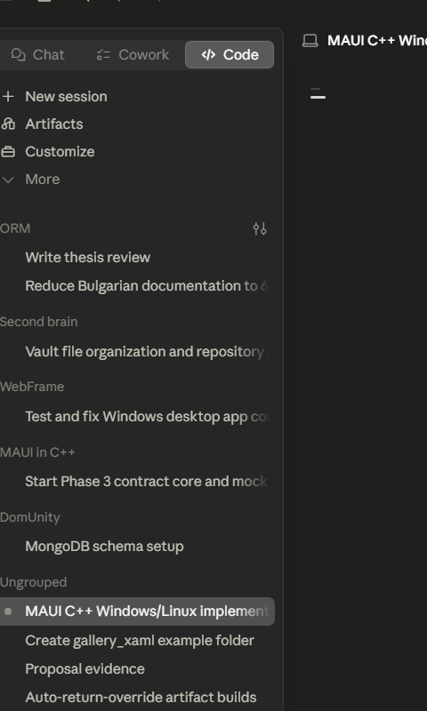</td><td></td><td></td></tr><tr><th>Dark</th><td></td><td></td><td></td></tr></table>

ports iOSDatePickerPage.xaml (+ iOSDatePickerPage.xaml.cs)

#### 🟢 Pixel-Perfect Score — C++ (C1/C3)

**Motion:** ✅ PASS · run 2026-08-14-03_04_30 · 2026-08-14

Light: MOTION 2 frames paired by step (run 2026-08-14-03_04_30, commit 74dde0864a, 2026-08-14) — worst SSIM 0.9999 at frame 2 'opened' (0.03% pixels differ), mean SSIM 1.0000; per-frame diff% 0.00/0.03; self-motion MAUI 0.0070% (57 px) vs C++ 0.0336% (275 px); !! SELF-MOTION ASYMMETRY 5x — C++ moved far more over its OWN sequence than the other column did. The verdict is taken on the PAIRED frames only, so this does not by itself contradict it, and it is not treated as a defect. It is flagged because a ratio this size means the two columns did visibly different amounts of work and the paired numbers cannot say why · Dark: MOTION 2 frames paired by step (run 2026-08-14-03_04_30, commit 74dde0864a, 2026-08-14) — worst SSIM 0.9999 at frame 2 'opened' (0.03% pixels differ), mean SSIM 1.0000; per-frame diff% 0.00/0.03; self-motion MAUI 0.0070% (57 px) vs C++ 0.0350% (287 px); !! SELF-MOTION ASYMMETRY 5x — C++ moved far more over its OWN sequence than the other column did. The verdict is taken on the PAIRED frames only, so this does not by itself contradict it, and it is not treated as a defect. It is flagged because a ratio this size means the two columns did visibly different amounts of work and the paired numbers cannot say why

#### 🟢 Pixel-Perfect Score — C++ &amp; XAML (C2/C4)

**Motion:** ✅ PASS · run 2026-08-14-03_04_30 · 2026-08-14

Light: MOTION 2 frames paired by step (run 2026-08-14-03_04_30, commit 74dde0864a, 2026-08-14) — worst SSIM 0.9999 at frame 2 'opened' (0.03% pixels differ), mean SSIM 1.0000; per-frame diff% 0.00/0.03; self-motion MAUI 0.0070% (57 px) vs C++ &amp; XAML 0.0336% (275 px); !! SELF-MOTION ASYMMETRY 5x — C++ &amp; XAML moved far more over its OWN sequence than the other column did. The verdict is taken on the PAIRED frames only, so this does not by itself contradict it, and it is not treated as a defect. It is flagged because a ratio this size means the two columns did visibly different amounts of work and the paired numbers cannot say why · Dark: MOTION 2 frames paired by step (run 2026-08-14-03_04_30, commit 74dde0864a, 2026-08-14) — worst SSIM 0.9999 at frame 2 'opened' (0.03% pixels differ), mean SSIM 1.0000; per-frame diff% 0.00/0.03; self-motion MAUI 0.0070% (57 px) vs C++ &amp; XAML 0.0350% (287 px); !! SELF-MOTION ASYMMETRY 5x — C++ &amp; XAML moved far more over its OWN sequence than the other column did. The verdict is taken on the PAIRED frames only, so this does not by itself contradict it, and it is not treated as a defect. It is flagged because a ratio this size means the two columns did visibly different amounts of work and the paired numbers cannot say why

### 88. Ios Entry — 🟢/🟢
ios_entry

<table><tr><th></th><th>MAUI</th><th>C++</th><th>C++ &amp; XAML</th></tr><tr><th>Light</th><td></td><td></td><td></td></tr><tr><th>Dark</th><td></td><td></td><td></td></tr></table>

ports iOSEntryPage.xaml (+ iOSEntryPage.xaml.cs)

#### 🟢 Pixel-Perfect Score — C++ (C1/C3)

Light: SSIM 1.0000, 0.00% pixels differ · Dark: SSIM 1.0000, 0.00% pixels differ

#### 🟢 Pixel-Perfect Score — C++ &amp; XAML (C2/C4)

Light: SSIM 1.0000, 0.00% pixels differ · Dark: SSIM 1.0000, 0.00% pixels differ

### 89. Ios First Responder — 🟢/🟢
ios_first_responder

<table><tr><th></th><th>MAUI</th><th>C++</th><th>C++ &amp; XAML</th></tr><tr><th>Light</th><td></td><td></td><td></td></tr><tr><th>Dark</th><td></td><td></td><td></td></tr></table>

ports iOSFirstResponderPage.xaml (+ .xaml.cs) The C# iOSFirstResponderPage is a VisualElement-first-responder demo: a StackLayout with an explanatory Label, a &amp;quot;First Entry&amp;quot; + plain &amp;quot;OK&amp;quot; Button (tapping OK dismisses the keyboard because the

#### 🟢 Pixel-Perfect Score — C++ (C1/C3)

Light: SSIM 1.0000, 0.00% pixels differ · Dark: SSIM 1.0000, 0.00% pixels differ

#### 🟢 Pixel-Perfect Score — C++ &amp; XAML (C2/C4)

Light: SSIM 1.0000, 0.00% pixels differ · Dark: SSIM 1.0000, 0.00% pixels differ

### 90. Ios Pan Gesture — 🟢/🟢
ios_pan_gesture

<table><tr><th></th><th>MAUI</th><th>C++</th><th>C++ &amp; XAML</th></tr><tr><th>Light</th><td></td><td></td><td></td></tr><tr><th>Dark</th><td></td><td></td><td></td></tr></table>

ports iOSPanGestureRecognizerPage.xaml (+ .xaml.cs) The C# iOSPanGestureRecognizerPage is a StackLayout with: a bold message Label (_messageLabel), a &amp;quot;Toggle Simultaneous Gesture Recognition&amp;quot; Button, and a grouped ListView of employees whos

#### 🟢 Pixel-Perfect Score — C++ (C1/C3)

**Motion:** 🚫 INVALID · `no-scenario` · run 2026-08-14-03_04_30 · 2026-08-14

Light: !! NO MOTION EVIDENCE: neither MAUI nor C++ changed by more than 0.012% of its own frame across the sequence (0 px vs 0 px), on a page the board treats as ANIMATED. NO ACTION SCENARIO EXISTS for this page — docs/comparison/scenarios/ios_pan_gesture.toml is absent or declares no `action` — so nothing was ever aimed at it and both columns are at rest by construction. This is NOT a port finding and nothing about the port can be concluded from it; the missing artifact is the scenario. 80 of the 139 cells that carried the old 'NOTHING MOVED' banner were this, including 10 of the 14 hard-coded ANIMATED pages. MOTION 9 frames paired by step (run 2026-08-14-03_04_30, commit 74dde0864a, 2026-08-14); 6 frame(s) had no partner and were NOT scored; column frames realigned by -3 sample(s) — a sampling drift, not a defect (see _align) — worst SSIM 1.0000 at frame 1 'gif04' (0.00% pixels differ), mean SSIM 1.0000; per-frame diff% 0.00/0.00/0.00/0.00/0.00/0.00/0.00/0.00/0.00; self-motion MAUI 0.0000% (0 px) vs C++ 0.0000% (0 px) · Dark: !! NO MOTION EVIDENCE: neither MAUI nor C++ changed by more than 0.012% of its own frame across the sequence (0 px vs 0 px), on a page the board treats as ANIMATED. NO ACTION SCENARIO EXISTS for this page — docs/comparison/scenarios/ios_pan_gesture.toml is absent or declares no `action` — so nothing was ever aimed at it and both columns are at rest by construction. This is NOT a port finding and nothing about the port can be concluded from it; the missing artifact is the scenario. 80 of the 139 cells that carried the old 'NOTHING MOVED' banner were this, including 10 of the 14 hard-coded ANIMATED pages. MOTION 9 frames paired by step (run 2026-08-14-03_04_30, commit 74dde0864a, 2026-08-14); 6 frame(s) had no partner and were NOT scored; column frames realigned by -3 sample(s) — a sampling drift, not a defect (see _align) — worst SSIM 1.0000 at frame 1 'gif04' (0.00% pixels differ), mean SSIM 1.0000; per-frame diff% 0.00/0.00/0.00/0.00/0.00/0.00/0.00/0.00/0.00; self-motion MAUI 0.0000% (0 px) vs C++ 0.0000% (0 px)

#### 🟢 Pixel-Perfect Score — C++ &amp; XAML (C2/C4)

**Motion:** 🚫 INVALID · `no-scenario` · run 2026-08-14-03_04_30 · 2026-08-14

Light: !! NO MOTION EVIDENCE: neither MAUI nor C++ &amp; XAML changed by more than 0.012% of its own frame across the sequence (0 px vs 0 px), on a page the board treats as ANIMATED. NO ACTION SCENARIO EXISTS for this page — docs/comparison/scenarios/ios_pan_gesture.toml is absent or declares no `action` — so nothing was ever aimed at it and both columns are at rest by construction. This is NOT a port finding and nothing about the port can be concluded from it; the missing artifact is the scenario. 80 of the 139 cells that carried the old 'NOTHING MOVED' banner were this, including 10 of the 14 hard-coded ANIMATED pages. MOTION 9 frames paired by step (run 2026-08-14-03_04_30, commit 74dde0864a, 2026-08-14); 6 frame(s) had no partner and were NOT scored; column frames realigned by -3 sample(s) — a sampling drift, not a defect (see _align) — worst SSIM 1.0000 at frame 1 'gif04' (0.00% pixels differ), mean SSIM 1.0000; per-frame diff% 0.00/0.00/0.00/0.00/0.00/0.00/0.00/0.00/0.00; self-motion MAUI 0.0000% (0 px) vs C++ &amp; XAML 0.0000% (0 px) · Dark: !! NO MOTION EVIDENCE: neither MAUI nor C++ &amp; XAML changed by more than 0.012% of its own frame across the sequence (0 px vs 0 px), on a page the board treats as ANIMATED. NO ACTION SCENARIO EXISTS for this page — docs/comparison/scenarios/ios_pan_gesture.toml is absent or declares no `action` — so nothing was ever aimed at it and both columns are at rest by construction. This is NOT a port finding and nothing about the port can be concluded from it; the missing artifact is the scenario. 80 of the 139 cells that carried the old 'NOTHING MOVED' banner were this, including 10 of the 14 hard-coded ANIMATED pages. MOTION 9 frames paired by step (run 2026-08-14-03_04_30, commit 74dde0864a, 2026-08-14); 6 frame(s) had no partner and were NOT scored; column frames realigned by -3 sample(s) — a sampling drift, not a defect (see _align) — worst SSIM 1.0000 at frame 1 'gif04' (0.00% pixels differ), mean SSIM 1.0000; per-frame diff% 0.00/0.00/0.00/0.00/0.00/0.00/0.00/0.00/0.00; self-motion MAUI 0.0000% (0 px) vs C++ &amp; XAML 0.0000% (0 px)

### 91. Ios Picker — 🟢/🟢
ios_picker

<table><tr><th></th><th>MAUI</th><th>C++</th><th>C++ &amp; XAML</th></tr><tr><th>Light</th><td></td><td></td><td></td></tr><tr><th>Dark</th><td>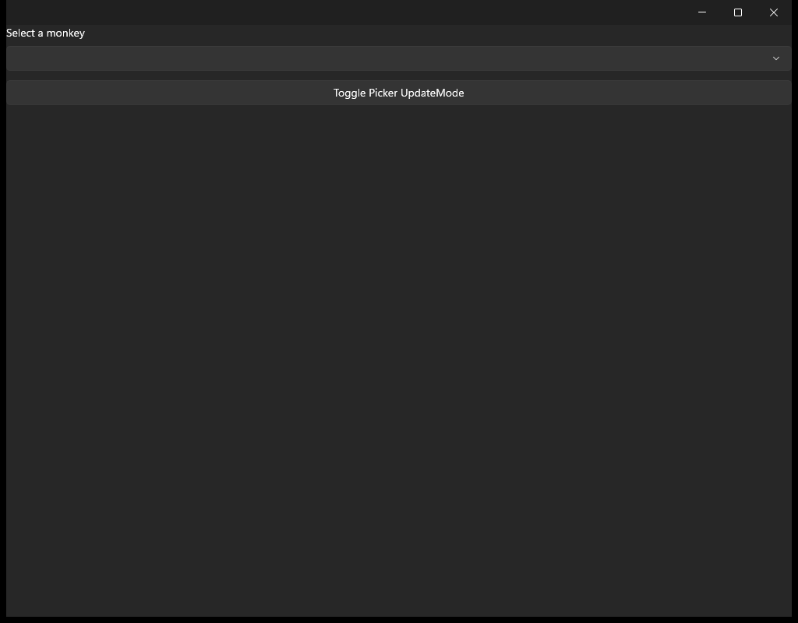</td><td></td><td></td></tr></table>

ports iOSPickerPage.xaml (+ iOSPickerPage.xaml.cs)

#### 🟢 Pixel-Perfect Score — C++ (C1/C3)

**Motion:** ✅ PASS · run 2026-08-14-03_04_30 · 2026-08-14

Light: MOTION 2 frames paired by step (run 2026-08-14-03_04_30, commit 74dde0864a, 2026-08-14) — worst SSIM 1.0000 at frame 1 'initial' (0.00% pixels differ), mean SSIM 1.0000; per-frame diff% 0.00/0.00; self-motion MAUI 0.0000% (0 px) vs C++ 0.0000% (0 px) · Dark: MOTION 2 frames paired by step (run 2026-08-14-03_04_30, commit 74dde0864a, 2026-08-14) — worst SSIM 1.0000 at frame 1 'initial' (0.00% pixels differ), mean SSIM 1.0000; per-frame diff% 0.00/0.00; self-motion MAUI 0.0000% (0 px) vs C++ 0.0000% (0 px)

#### 🟢 Pixel-Perfect Score — C++ &amp; XAML (C2/C4)

**Motion:** ✅ PASS · run 2026-08-14-03_04_30 · 2026-08-14

Light: MOTION 2 frames paired by step (run 2026-08-14-03_04_30, commit 74dde0864a, 2026-08-14) — worst SSIM 1.0000 at frame 1 'initial' (0.00% pixels differ), mean SSIM 1.0000; per-frame diff% 0.00/0.00; self-motion MAUI 0.0000% (0 px) vs C++ &amp; XAML 0.0000% (0 px) · Dark: MOTION 2 frames paired by step (run 2026-08-14-03_04_30, commit 74dde0864a, 2026-08-14) — worst SSIM 1.0000 at frame 1 'initial' (0.00% pixels differ), mean SSIM 1.0000; per-frame diff% 0.00/0.00; self-motion MAUI 0.0000% (0 px) vs C++ &amp; XAML 0.0000% (0 px)

### 92. Ios Safe Area — 🟢/🟢
ios_safe_area

<table><tr><th></th><th>MAUI</th><th>C++</th><th>C++ &amp; XAML</th></tr><tr><th>Light</th><td></td><td></td><td></td></tr><tr><th>Dark</th><td></td><td></td><td></td></tr></table>

ports iOSSafeAreaPage.xaml The .NET MAUI PlatformSpecifics sample (Pages/PlatformSpecifics/iOS/iOSSafeAreaPage.xaml + .xaml.cs): a long Lorem-ipsum Label over a &amp;quot;Disable Use Safe Area&amp;quot; button

#### 🟢 Pixel-Perfect Score — C++ (C1/C3)

Light: SSIM 1.0000, 0.00% pixels differ · Dark: SSIM 1.0000, 0.00% pixels differ

#### 🟢 Pixel-Perfect Score — C++ &amp; XAML (C2/C4)

Light: SSIM 1.0000, 0.00% pixels differ · Dark: SSIM 1.0000, 0.00% pixels differ

### 93. Ios Scroll View — 🟡/🟡
ios_scroll_view

<table><tr><th></th><th>MAUI</th><th>C++</th><th>C++ &amp; XAML</th></tr><tr><th>Light</th><td></td><td></td><td></td></tr><tr><th>Dark</th><td></td><td></td><td></td></tr></table>

ports iOSScrollViewPage.xaml (+ iOSScrollViewPage.xaml.cs)

#### 🟡 Pixel-Perfect Score — C++ (C1/C3)

**Motion:** 🚫 INVALID · `not-driven` · run 2026-08-14-03_04_30 · 2026-08-14

Light: !! NO MOTION EVIDENCE: neither MAUI nor C++ changed by more than a single pixel across the sequence (0 px vs 0 px), on a page the board treats as ANIMATED. An action WAS injected here — ios_scroll_view.toml declares one — and NEITHER column reacted to it. So either the coordinate misses its target on this lane, or the interaction is not reachable here. This is the actionable half of the old 'NOTHING MOVED' bucket: 59 of the 139 cells that carried it. MOTION 2 frames paired by step (run 2026-08-14-03_04_30, commit 74dde0864a, 2026-08-14) — worst SSIM 1.0000 at frame 1 'initial' (0.00% pixels differ), mean SSIM 1.0000; per-frame diff% 0.00/0.00; self-motion MAUI 0.0000% (0 px) vs C++ 0.0000% (0 px) · Dark: !! NO MOTION EVIDENCE: neither MAUI nor C++ changed by more than a single pixel across the sequence (0 px vs 0 px), on a page the board treats as ANIMATED. An action WAS injected here — ios_scroll_view.toml declares one — and NEITHER column reacted to it. So either the coordinate misses its target on this lane, or the interaction is not reachable here. This is the actionable half of the old 'NOTHING MOVED' bucket: 59 of the 139 cells that carried it. MOTION 2 frames paired by step (run 2026-08-14-03_04_30, commit 74dde0864a, 2026-08-14) — worst SSIM 1.0000 at frame 1 'initial' (0.00% pixels differ), mean SSIM 1.0000; per-frame diff% 0.00/0.00; self-motion MAUI 0.0000% (0 px) vs C++ 0.0000% (0 px)

#### 🟡 Pixel-Perfect Score — C++ &amp; XAML (C2/C4)

**Motion:** 🚫 INVALID · `not-driven` · run 2026-08-14-03_04_30 · 2026-08-14

Light: !! NO MOTION EVIDENCE: neither MAUI nor C++ &amp; XAML changed by more than a single pixel across the sequence (0 px vs 0 px), on a page the board treats as ANIMATED. An action WAS injected here — ios_scroll_view.toml declares one — and NEITHER column reacted to it. So either the coordinate misses its target on this lane, or the interaction is not reachable here. This is the actionable half of the old 'NOTHING MOVED' bucket: 59 of the 139 cells that carried it. MOTION 2 frames paired by step (run 2026-08-14-03_04_30, commit 74dde0864a, 2026-08-14) — worst SSIM 1.0000 at frame 1 'initial' (0.00% pixels differ), mean SSIM 1.0000; per-frame diff% 0.00/0.00; self-motion MAUI 0.0000% (0 px) vs C++ &amp; XAML 0.0000% (0 px) · Dark: !! NO MOTION EVIDENCE: neither MAUI nor C++ &amp; XAML changed by more than a single pixel across the sequence (0 px vs 0 px), on a page the board treats as ANIMATED. An action WAS injected here — ios_scroll_view.toml declares one — and NEITHER column reacted to it. So either the coordinate misses its target on this lane, or the interaction is not reachable here. This is the actionable half of the old 'NOTHING MOVED' bucket: 59 of the 139 cells that carried it. MOTION 2 frames paired by step (run 2026-08-14-03_04_30, commit 74dde0864a, 2026-08-14) — worst SSIM 1.0000 at frame 1 'initial' (0.00% pixels differ), mean SSIM 1.0000; per-frame diff% 0.00/0.00; self-motion MAUI 0.0000% (0 px) vs C++ &amp; XAML 0.0000% (0 px)

### 94. Ios Search Bar — 🟢/🟢
ios_search_bar

<table><tr><th></th><th>MAUI</th><th>C++</th><th>C++ &amp; XAML</th></tr><tr><th>Light</th><td></td><td></td><td></td></tr><tr><th>Dark</th><td></td><td></td><td></td></tr></table>

ports iOSSearchBarPage.xaml (+ iOSSearchBarPage.xaml.cs)

#### 🟢 Pixel-Perfect Score — C++ (C1/C3)

Light: SSIM 1.0000, 0.00% pixels differ · Dark: SSIM 1.0000, 0.00% pixels differ

#### 🟢 Pixel-Perfect Score — C++ &amp; XAML (C2/C4)

Light: SSIM 1.0000, 0.00% pixels differ · Dark: SSIM 1.0000, 0.00% pixels differ

### 95. Ios Slider Update On Tap — 🟢/🟢
ios_slider_update_on_tap

<table><tr><th></th><th>MAUI</th><th>C++</th><th>C++ &amp; XAML</th></tr><tr><th>Light</th><td></td><td></td><td></td></tr><tr><th>Dark</th><td></td><td></td><td></td></tr></table>

ports iOSSliderUpdateOnTapPage.xaml (+ iOSSliderUpdateOnTapPage.xaml.cs)

#### 🟢 Pixel-Perfect Score — C++ (C1/C3)

Light: SSIM 1.0000, 0.00% pixels differ · Dark: SSIM 1.0000, 0.00% pixels differ

#### 🟢 Pixel-Perfect Score — C++ &amp; XAML (C2/C4)

Light: SSIM 1.0000, 0.00% pixels differ · Dark: SSIM 1.0000, 0.00% pixels differ

### 96. Ios Swipe Transition — 🟢/🟢
ios_swipe_transition

<table><tr><th></th><th>MAUI</th><th>C++</th><th>C++ &amp; XAML</th></tr><tr><th>Light</th><td></td><td></td><td></td></tr><tr><th>Dark</th><td></td><td></td><td></td></tr></table>

ports iOSSwipeViewTransitionModePage.xaml (+ .xaml.cs) The C# iOSSwipeViewTransitionModePage is a StackLayout with: a horizontal row holding a &amp;quot;SwipeTransitionMode:&amp;quot; Label + an EnumPicker over the SwipeTransitionMode enum (Reveal / Drag, Se

#### 🟢 Pixel-Perfect Score — C++ (C1/C3)

**Motion:** 🚫 INVALID · `no-scenario` · run 2026-08-14-03_04_30 · 2026-08-14

Light: !! NO MOTION EVIDENCE: neither MAUI nor C++ changed by more than 0.012% of its own frame across the sequence (0 px vs 0 px), on a page the board treats as ANIMATED. NO ACTION SCENARIO EXISTS for this page — docs/comparison/scenarios/ios_swipe_transition.toml is absent or declares no `action` — so nothing was ever aimed at it and both columns are at rest by construction. This is NOT a port finding and nothing about the port can be concluded from it; the missing artifact is the scenario. 80 of the 139 cells that carried the old 'NOTHING MOVED' banner were this, including 10 of the 14 hard-coded ANIMATED pages. MOTION 9 frames paired by step (run 2026-08-14-03_04_30, commit 74dde0864a, 2026-08-14); 6 frame(s) had no partner and were NOT scored; column frames realigned by -3 sample(s) — a sampling drift, not a defect (see _align) — worst SSIM 1.0000 at frame 1 'gif04' (0.00% pixels differ), mean SSIM 1.0000; per-frame diff% 0.00/0.00/0.00/0.00/0.00/0.00/0.00/0.00/0.00; self-motion MAUI 0.0000% (0 px) vs C++ 0.0000% (0 px) · Dark: !! NO MOTION EVIDENCE: neither MAUI nor C++ changed by more than 0.012% of its own frame across the sequence (0 px vs 0 px), on a page the board treats as ANIMATED. NO ACTION SCENARIO EXISTS for this page — docs/comparison/scenarios/ios_swipe_transition.toml is absent or declares no `action` — so nothing was ever aimed at it and both columns are at rest by construction. This is NOT a port finding and nothing about the port can be concluded from it; the missing artifact is the scenario. 80 of the 139 cells that carried the old 'NOTHING MOVED' banner were this, including 10 of the 14 hard-coded ANIMATED pages. MOTION 9 frames paired by step (run 2026-08-14-03_04_30, commit 74dde0864a, 2026-08-14); 6 frame(s) had no partner and were NOT scored; column frames realigned by -3 sample(s) — a sampling drift, not a defect (see _align) — worst SSIM 1.0000 at frame 1 'gif04' (0.00% pixels differ), mean SSIM 1.0000; per-frame diff% 0.00/0.00/0.00/0.00/0.00/0.00/0.00/0.00/0.00; self-motion MAUI 0.0000% (0 px) vs C++ 0.0000% (0 px)

#### 🟢 Pixel-Perfect Score — C++ &amp; XAML (C2/C4)

**Motion:** 🚫 INVALID · `no-scenario` · run 2026-08-14-03_04_30 · 2026-08-14

Light: !! NO MOTION EVIDENCE: neither MAUI nor C++ &amp; XAML changed by more than 0.012% of its own frame across the sequence (0 px vs 0 px), on a page the board treats as ANIMATED. NO ACTION SCENARIO EXISTS for this page — docs/comparison/scenarios/ios_swipe_transition.toml is absent or declares no `action` — so nothing was ever aimed at it and both columns are at rest by construction. This is NOT a port finding and nothing about the port can be concluded from it; the missing artifact is the scenario. 80 of the 139 cells that carried the old 'NOTHING MOVED' banner were this, including 10 of the 14 hard-coded ANIMATED pages. MOTION 9 frames paired by step (run 2026-08-14-03_04_30, commit 74dde0864a, 2026-08-14); 6 frame(s) had no partner and were NOT scored; column frames realigned by -3 sample(s) — a sampling drift, not a defect (see _align) — worst SSIM 1.0000 at frame 1 'gif04' (0.00% pixels differ), mean SSIM 1.0000; per-frame diff% 0.00/0.00/0.00/0.00/0.00/0.00/0.00/0.00/0.00; self-motion MAUI 0.0000% (0 px) vs C++ &amp; XAML 0.0000% (0 px) · Dark: !! NO MOTION EVIDENCE: neither MAUI nor C++ &amp; XAML changed by more than 0.012% of its own frame across the sequence (0 px vs 0 px), on a page the board treats as ANIMATED. NO ACTION SCENARIO EXISTS for this page — docs/comparison/scenarios/ios_swipe_transition.toml is absent or declares no `action` — so nothing was ever aimed at it and both columns are at rest by construction. This is NOT a port finding and nothing about the port can be concluded from it; the missing artifact is the scenario. 80 of the 139 cells that carried the old 'NOTHING MOVED' banner were this, including 10 of the 14 hard-coded ANIMATED pages. MOTION 9 frames paired by step (run 2026-08-14-03_04_30, commit 74dde0864a, 2026-08-14); 6 frame(s) had no partner and were NOT scored; column frames realigned by -3 sample(s) — a sampling drift, not a defect (see _align) — worst SSIM 1.0000 at frame 1 'gif04' (0.00% pixels differ), mean SSIM 1.0000; per-frame diff% 0.00/0.00/0.00/0.00/0.00/0.00/0.00/0.00/0.00; self-motion MAUI 0.0000% (0 px) vs C++ &amp; XAML 0.0000% (0 px)

### 97. Ios Time Picker — 🟢/🟢
ios_time_picker

<table><tr><th></th><th>MAUI</th><th>C++</th><th>C++ &amp; XAML</th></tr><tr><th>Light</th><td></td><td></td><td></td></tr><tr><th>Dark</th><td></td><td></td><td></td></tr></table>

ports iOSTimePickerPage.xaml The .NET MAUI PlatformSpecifics sample (Pages/PlatformSpecifics/iOS/iOSTimePickerPage.xaml + .xaml.cs): a TimePicker carrying the iOSSpecific TimePicker.UpdateMode knob (XAML seeds it to WhenFinished) over a but

#### 🟢 Pixel-Perfect Score — C++ (C1/C3)

Light: SSIM 1.0000, 0.00% pixels differ · Dark: SSIM 1.0000, 0.00% pixels differ

#### 🟢 Pixel-Perfect Score — C++ &amp; XAML (C2/C4)

Light: SSIM 1.0000, 0.00% pixels differ · Dark: SSIM 1.0000, 0.00% pixels differ

### 98. Items — 🟢/🟢
items

<table><tr><th></th><th>MAUI</th><th>C++</th><th>C++ &amp; XAML</th></tr><tr><th>Light</th><td></td><td></td><td></td></tr><tr><th>Dark</th><td></td><td></td><td></td></tr></table>

a self-contained demo page for the W2-19 items core: a collection_view over a live observable items source with a templated cell, single selection driving a readout label, and an EmptyView for the cleared state (the C# CollectionView galler

#### 🟢 Pixel-Perfect Score — C++ (C1/C3)

Light: SSIM 1.0000, 0.00% pixels differ · Dark: SSIM 1.0000, 0.00% pixels differ

#### 🟢 Pixel-Perfect Score — C++ &amp; XAML (C2/C4)

Light: SSIM 1.0000, 0.00% pixels differ · Dark: SSIM 1.0000, 0.00% pixels differ

### 99. Items Updating Scroll Mode — 🟢/🟢
items_updating_scroll_mode

<table><tr><th></th><th>MAUI</th><th>C++</th><th>C++ &amp; XAML</th></tr><tr><th>Light</th><td></td><td></td><td></td></tr><tr><th>Dark</th><td></td><td></td><td></td></tr></table>

ports ItemsUpdatingScrollModeGallery.xaml (+ .xaml.cs) of the C# CollectionView gallery (Maui.Controls.Sample.Pages.CollectionViewGalleries.ScrollModeGalleries.ItemsUpdatingScrollModeGallery)

#### 🟢 Pixel-Perfect Score — C++ (C1/C3)

Light: SSIM 1.0000, 0.00% pixels differ · Dark: SSIM 1.0000, 0.00% pixels differ

#### 🟢 Pixel-Perfect Score — C++ &amp; XAML (C2/C4)

Light: SSIM 1.0000, 0.00% pixels differ · Dark: SSIM 1.0000, 0.00% pixels differ

### 100. Label — 🟢/🟢
label

<table><tr><th></th><th>MAUI</th><th>C++</th><th>C++ &amp; XAML</th></tr><tr><th>Light</th><td></td><td></td><td></td></tr><tr><th>Dark</th><td></td><td></td><td></td></tr></table>

ports LabelPage.xaml (+ LabelPage.xaml.cs)

#### 🟢 Pixel-Perfect Score — C++ (C1/C3)

Light: SSIM 1.0000, 0.00% pixels differ · Dark: SSIM 1.0000, 0.00% pixels differ

#### 🟢 Pixel-Perfect Score — C++ &amp; XAML (C2/C4)

Light: SSIM 1.0000, 0.00% pixels differ · Dark: SSIM 1.0000, 0.00% pixels differ

### 101. Layout Is Enabled — 🟢/🟢
layout_is_enabled

<table><tr><th></th><th>MAUI</th><th>C++</th><th>C++ &amp; XAML</th></tr><tr><th>Light</th><td></td><td></td><td></td></tr><tr><th>Dark</th><td></td><td></td><td></td></tr></table>

ports LayoutIsEnabledPage.xaml (+ LayoutIsEnabledPage.xaml.cs) The C# page demonstrates how IsEnabled on a layout cascades to its children: a 2x2 grid whose left column hosts a &amp;quot;MainLayout&amp;quot; full of state-demo sub-stacks (all-enabled / all-d

#### 🟢 Pixel-Perfect Score — C++ (C1/C3)

Light: SSIM 1.0000, 0.00% pixels differ · Dark: SSIM 1.0000, 0.00% pixels differ

#### 🟢 Pixel-Perfect Score — C++ &amp; XAML (C2/C4)

Light: SSIM 1.0000, 0.00% pixels differ · Dark: SSIM 1.0000, 0.00% pixels differ

### 102. Line Gallery — 🟢/🟢
line_gallery

<table><tr><th></th><th>MAUI</th><th>C++</th><th>C++ &amp; XAML</th></tr><tr><th>Light</th><td></td><td></td><td></td></tr><tr><th>Dark</th><td></td><td></td><td></td></tr></table>

ports LineGallery.xaml A self-contained, code-first port of the MAUI Shapes LineGallery (Pages/Controls/ShapesGalleries/LineGallery.xaml + .xaml.cs)

#### 🟢 Pixel-Perfect Score — C++ (C1/C3)

Light: SSIM 1.0000, 0.00% pixels differ · Dark: SSIM 1.0000, 0.00% pixels differ

#### 🟢 Pixel-Perfect Score — C++ &amp; XAML (C2/C4)

Light: SSIM 1.0000, 0.00% pixels differ · Dark: SSIM 1.0000, 0.00% pixels differ

### 103. Line Join Gallery — 🟢/🟢
line_join_gallery

<table><tr><th></th><th>MAUI</th><th>C++</th><th>C++ &amp; XAML</th></tr><tr><th>Light</th><td></td><td></td><td></td></tr><tr><th>Dark</th><td></td><td></td><td></td></tr></table>

ports LineJoinGallery.xaml A self-contained, code-first port of the MAUI Shapes sub-gallery Pages/Controls/ShapesGalleries/LineJoinGallery.xaml: a StackLayout that demonstrates the three StrokeLineJoin variants on an identical open polyline

#### 🟢 Pixel-Perfect Score — C++ (C1/C3)

Light: SSIM 1.0000, 0.00% pixels differ · Dark: SSIM 1.0000, 0.00% pixels differ

#### 🟢 Pixel-Perfect Score — C++ &amp; XAML (C2/C4)

Light: SSIM 1.0000, 0.00% pixels differ · Dark: SSIM 1.0000, 0.00% pixels differ

### 104. Measure First Strategy — 🟢/🟢
measure_first_strategy

<table><tr><th></th><th>MAUI</th><th>C++</th><th>C++ &amp; XAML</th></tr><tr><th>Light</th><td></td><td></td><td></td></tr><tr><th>Dark</th><td></td><td></td><td></td></tr></table>

ports MeasureFirstStrategy.xaml (+ .xaml.cs) of the C# CollectionView gallery (Maui.Controls.Sample.Pages.CollectionViewGalleries.GroupingGalleries.MeasureFirstStrategy)

#### 🟢 Pixel-Perfect Score — C++ (C1/C3)

Light: SSIM 1.0000, 0.00% pixels differ · Dark: SSIM 1.0000, 0.00% pixels differ

#### 🟢 Pixel-Perfect Score — C++ &amp; XAML (C2/C4)

Light: SSIM 1.0000, 0.00% pixels differ · Dark: SSIM 1.0000, 0.00% pixels differ

### 105. Menu Bar — 🟢/🟢
menu_bar

<table><tr><th></th><th>MAUI</th><th>C++</th><th>C++ &amp; XAML</th></tr><tr><th>Light</th><td></td><td></td><td></td></tr><tr><th>Dark</th><td></td><td></td><td></td></tr></table>

ports MenuBarPage.xaml (+ MenuBarPage.cs) The C# page declares three page-level MenuBarItems (Page.MenuBarItems — the app menu bar) and a small visible body: - &amp;quot;Before File&amp;quot; : &amp;quot;Before File Action&amp;quot; (accelerator &amp;quot;b&amp;quot;), &amp;quot;Cool item 1&amp;quot;, a separat

#### 🟢 Pixel-Perfect Score — C++ (C1/C3)

Light: SSIM 1.0000, 0.00% pixels differ · Dark: SSIM 1.0000, 0.00% pixels differ

#### 🟢 Pixel-Perfect Score — C++ &amp; XAML (C2/C4)

Light: SSIM 1.0000, 0.00% pixels differ · Dark: SSIM 1.0000, 0.00% pixels differ

### 106. Modal — 🟢/🟢
modal

<table><tr><th></th><th>MAUI</th><th>C++</th><th>C++ &amp; XAML</th></tr><tr><th>Light</th><td></td><td></td><td></td></tr><tr><th>Dark</th><td></td><td></td><td></td></tr></table>

ports ModalPage.xaml (+ .xaml.cs)

#### 🟢 Pixel-Perfect Score — C++ (C1/C3)

Light: SSIM 0.9987, 0.05% pixels differ · Dark: SSIM 0.9988, 0.05% pixels differ

#### 🟢 Pixel-Perfect Score — C++ &amp; XAML (C2/C4)

Light: SSIM 0.9987, 0.05% pixels differ · Dark: SSIM 0.9988, 0.05% pixels differ

### 107. Multiple Bound Selection — 🟢/🟢
multiple_bound_selection

<table><tr><th></th><th>MAUI</th><th>C++</th><th>C++ &amp; XAML</th></tr><tr><th>Light</th><td></td><td></td><td></td></tr><tr><th>Dark</th><td></td><td></td><td></td></tr></table>

ports MultipleBoundSelection.xaml (+ .xaml.cs) (Maui.Controls.Sample.Pages.CollectionViewGalleries.SelectionGalleries.MultipleBoundSelection)

#### 🟢 Pixel-Perfect Score — C++ (C1/C3)

Light: SSIM 0.9980, 0.00% pixels differ · Dark: SSIM 0.9969, 0.00% pixels differ

#### 🟢 Pixel-Perfect Score — C++ &amp; XAML (C2/C4)

Light: SSIM 0.9980, 0.00% pixels differ · Dark: SSIM 0.9969, 0.00% pixels differ

### 108. Navigation Gallery — 🟢/🟢
navigation_gallery

<table><tr><th></th><th>MAUI</th><th>C++</th><th>C++ &amp; XAML</th></tr><tr><th>Light</th><td></td><td></td><td></td></tr><tr><th>Dark</th><td></td><td></td><td></td></tr></table>

ports NavigationGallery.xaml (+ .xaml.cs)

#### 🟢 Pixel-Perfect Score — C++ (C1/C3)

Light: SSIM 1.0000, 0.00% pixels differ · Dark: SSIM 1.0000, 0.00% pixels differ

#### 🟢 Pixel-Perfect Score — C++ &amp; XAML (C2/C4)

Light: SSIM 1.0000, 0.00% pixels differ · Dark: SSIM 1.0000, 0.00% pixels differ

### 109. Nested Collection — 🟢/🟢
nested_collection

<table><tr><th></th><th>MAUI</th><th>C++</th><th>C++ &amp; XAML</th></tr><tr><th>Light</th><td></td><td></td><td></td></tr><tr><th>Dark</th><td></td><td></td><td></td></tr></table>

ports NestedGalleries/NestedCollectionViewGallery.xaml (+ NestedCollectionViewGallery.xaml.cs) of the C# CollectionView gallery

#### 🟢 Pixel-Perfect Score — C++ (C1/C3)

Light: SSIM 1.0000, 0.00% pixels differ · Dark: SSIM 1.0000, 0.00% pixels differ

#### 🟢 Pixel-Perfect Score — C++ &amp; XAML (C2/C4)

Light: SSIM 1.0000, 0.00% pixels differ · Dark: SSIM 1.0000, 0.00% pixels differ

### 110. Pan Gesture Events — 🟢/🟢
pan_gesture_events

<table><tr><th></th><th>MAUI</th><th>C++</th><th>C++ &amp; XAML</th></tr><tr><th>Light</th><td></td><td></td><td></td></tr><tr><th>Dark</th><td></td><td></td><td></td></tr></table>

ports PanGestureEventsGallery.xaml (+ .xaml.cs) (Maui.Controls.Sample.Pages.PanGestureEventsGallery)

#### 🟢 Pixel-Perfect Score — C++ (C1/C3)

**Motion:** 🚫 INVALID · `no-scenario` · run 2026-08-14-03_04_30 · 2026-08-14

Light: !! NO MOTION EVIDENCE: neither MAUI nor C++ changed by more than 0.012% of its own frame across the sequence (0 px vs 0 px), on a page the board treats as ANIMATED. NO ACTION SCENARIO EXISTS for this page — docs/comparison/scenarios/pan_gesture_events.toml is absent or declares no `action` — so nothing was ever aimed at it and both columns are at rest by construction. This is NOT a port finding and nothing about the port can be concluded from it; the missing artifact is the scenario. 80 of the 139 cells that carried the old 'NOTHING MOVED' banner were this, including 10 of the 14 hard-coded ANIMATED pages. MOTION 9 frames paired by step (run 2026-08-14-03_04_30, commit 74dde0864a, 2026-08-14); 6 frame(s) had no partner and were NOT scored; column frames realigned by -3 sample(s) — a sampling drift, not a defect (see _align) — worst SSIM 0.9986 at frame 1 'gif04' (0.06% pixels differ), mean SSIM 0.9986; per-frame diff% 0.06/0.06/0.06/0.06/0.06/0.06/0.06/0.06/0.06; self-motion MAUI 0.0000% (0 px) vs C++ 0.0000% (0 px) · Dark: !! NO MOTION EVIDENCE: neither MAUI nor C++ changed by more than 0.012% of its own frame across the sequence (0 px vs 0 px), on a page the board treats as ANIMATED. NO ACTION SCENARIO EXISTS for this page — docs/comparison/scenarios/pan_gesture_events.toml is absent or declares no `action` — so nothing was ever aimed at it and both columns are at rest by construction. This is NOT a port finding and nothing about the port can be concluded from it; the missing artifact is the scenario. 80 of the 139 cells that carried the old 'NOTHING MOVED' banner were this, including 10 of the 14 hard-coded ANIMATED pages. MOTION 9 frames paired by step (run 2026-08-14-03_04_30, commit 74dde0864a, 2026-08-14); 6 frame(s) had no partner and were NOT scored; column frames realigned by -3 sample(s) — a sampling drift, not a defect (see _align) — worst SSIM 0.9984 at frame 1 'gif04' (0.06% pixels differ), mean SSIM 0.9984; per-frame diff% 0.06/0.06/0.06/0.06/0.06/0.06/0.06/0.06/0.06; self-motion MAUI 0.0000% (0 px) vs C++ 0.0000% (0 px)

#### 🟢 Pixel-Perfect Score — C++ &amp; XAML (C2/C4)

**Motion:** 🚫 INVALID · `no-scenario` · run 2026-08-14-03_04_30 · 2026-08-14

Light: !! NO MOTION EVIDENCE: neither MAUI nor C++ &amp; XAML changed by more than 0.012% of its own frame across the sequence (0 px vs 0 px), on a page the board treats as ANIMATED. NO ACTION SCENARIO EXISTS for this page — docs/comparison/scenarios/pan_gesture_events.toml is absent or declares no `action` — so nothing was ever aimed at it and both columns are at rest by construction. This is NOT a port finding and nothing about the port can be concluded from it; the missing artifact is the scenario. 80 of the 139 cells that carried the old 'NOTHING MOVED' banner were this, including 10 of the 14 hard-coded ANIMATED pages. MOTION 9 frames paired by step (run 2026-08-14-03_04_30, commit 74dde0864a, 2026-08-14); 6 frame(s) had no partner and were NOT scored; column frames realigned by -3 sample(s) — a sampling drift, not a defect (see _align) — worst SSIM 1.0000 at frame 1 'gif04' (0.00% pixels differ), mean SSIM 1.0000; per-frame diff% 0.00/0.00/0.00/0.00/0.00/0.00/0.00/0.00/0.00; self-motion MAUI 0.0000% (0 px) vs C++ &amp; XAML 0.0000% (0 px) · Dark: !! NO MOTION EVIDENCE: neither MAUI nor C++ &amp; XAML changed by more than 0.012% of its own frame across the sequence (0 px vs 0 px), on a page the board treats as ANIMATED. NO ACTION SCENARIO EXISTS for this page — docs/comparison/scenarios/pan_gesture_events.toml is absent or declares no `action` — so nothing was ever aimed at it and both columns are at rest by construction. This is NOT a port finding and nothing about the port can be concluded from it; the missing artifact is the scenario. 80 of the 139 cells that carried the old 'NOTHING MOVED' banner were this, including 10 of the 14 hard-coded ANIMATED pages. MOTION 9 frames paired by step (run 2026-08-14-03_04_30, commit 74dde0864a, 2026-08-14); 6 frame(s) had no partner and were NOT scored; column frames realigned by -3 sample(s) — a sampling drift, not a defect (see _align) — worst SSIM 1.0000 at frame 1 'gif04' (0.00% pixels differ), mean SSIM 1.0000; per-frame diff% 0.00/0.00/0.00/0.00/0.00/0.00/0.00/0.00/0.00; self-motion MAUI 0.0000% (0 px) vs C++ &amp; XAML 0.0000% (0 px)

### 111. Path Aspect Gallery — 🟢/🟢
path_aspect_gallery

<table><tr><th></th><th>MAUI</th><th>C++</th><th>C++ &amp; XAML</th></tr><tr><th>Light</th><td></td><td></td><td></td></tr><tr><th>Dark</th><td></td><td></td><td></td></tr></table>

ports PathAspectGallery.xaml A self-contained, code-first port of the MAUI Shapes sub-gallery Pages/Controls/ShapesGalleries/PathAspectGallery.xaml: a StackLayout (Padding 12) that demonstrates the four Path Aspect modes on one identical ge

#### 🟢 Pixel-Perfect Score — C++ (C1/C3)

Light: SSIM 1.0000, 0.00% pixels differ · Dark: SSIM 1.0000, 0.00% pixels differ

#### 🟢 Pixel-Perfect Score — C++ &amp; XAML (C2/C4)

Light: SSIM 1.0000, 0.00% pixels differ · Dark: SSIM 1.0000, 0.00% pixels differ

### 112. Path Gallery — 🟡/🟢
path_gallery

<table><tr><th></th><th>MAUI</th><th>C++</th><th>C++ &amp; XAML</th></tr><tr><th>Light</th><td></td><td></td><td></td></tr><tr><th>Dark</th><td></td><td></td><td></td></tr></table>

ports PathGallery.xaml A code-first port of the MAUI Shapes sub-gallery Pages/Controls/ShapesGalleries/PathGallery.xaml: a ScrollView over a StackLayout (Padding 12) that walks eight Path variants (plus two caption-only markup-string Labels

#### 🟡 Pixel-Perfect Score — C++ (C1/C3)

**Motion:** ❌ FAIL · `frames-disagree` · run 2026-08-14-03_04_30 · 2026-08-14

Light: MOTION 2 frames paired by step (run 2026-08-14-03_04_30, commit 74dde0864a, 2026-08-14) — worst SSIM 0.9500 at frame 2 'scrolled-down' (1.59% pixels differ), mean SSIM 0.9750; per-frame diff% 0.00/1.59; self-motion MAUI 8.9327% (73177 px) vs C++ 9.4210% (77177 px) · Dark: MOTION 2 frames paired by step (run 2026-08-14-03_04_30, commit 74dde0864a, 2026-08-14) — worst SSIM 0.9497 at frame 2 'scrolled-down' (1.70% pixels differ), mean SSIM 0.9748; per-frame diff% 0.00/1.70; self-motion MAUI 8.8046% (72127 px) vs C++ 9.3019% (76201 px)

#### 🟢 Pixel-Perfect Score — C++ &amp; XAML (C2/C4)

**Motion:** ✅ PASS · run 2026-08-14-03_04_30 · 2026-08-14

Light: MOTION 2 frames paired by step (run 2026-08-14-03_04_30, commit 74dde0864a, 2026-08-14) — worst SSIM 1.0000 at frame 1 'initial' (0.00% pixels differ), mean SSIM 1.0000; per-frame diff% 0.00/0.00; self-motion MAUI 8.9327% (73177 px) vs C++ &amp; XAML 8.9329% (73178 px) · Dark: MOTION 2 frames paired by step (run 2026-08-14-03_04_30, commit 74dde0864a, 2026-08-14) — worst SSIM 1.0000 at frame 1 'initial' (0.00% pixels differ), mean SSIM 1.0000; per-frame diff% 0.00/0.00; self-motion MAUI 8.8046% (72127 px) vs C++ &amp; XAML 8.7832% (71952 px)

### 113. Path Transform String — 🟢/🟢
path_transform_string

<table><tr><th></th><th>MAUI</th><th>C++</th><th>C++ &amp; XAML</th></tr><tr><th>Light</th><td></td><td></td><td></td></tr><tr><th>Dark</th><td></td><td></td><td></td></tr></table>

ports PathTransformStringGallery.xaml A code-first port of the MAUI Shapes sub-gallery Pages/Controls/ShapesGalleries/PathTransformStringGallery.xaml: a ScrollView over a StackLayout (Padding 12) that shows the SAME two-figure Path geometry

#### 🟢 Pixel-Perfect Score — C++ (C1/C3)

Light: SSIM 0.9938, 0.28% pixels differ · Dark: SSIM 0.9952, 0.16% pixels differ

#### 🟢 Pixel-Perfect Score — C++ &amp; XAML (C2/C4)

Light: SSIM 0.9999, 0.00% pixels differ · Dark: SSIM 1.0000, 0.00% pixels differ

### 114. Picker — 🟢/🟢
picker

<table><tr><th></th><th>MAUI</th><th>C++</th><th>C++ &amp; XAML</th></tr><tr><th>Light</th><td></td><td></td><td></td></tr><tr><th>Dark</th><td></td><td></td><td></td></tr></table>

ports PickerPage.xaml (+ PickerPage.xaml.cs) A self-contained, code-first demo page for the Picker control (the C# gallery-page convention, mirroring the value_controls_page / pickers_page pattern)

#### 🟢 Pixel-Perfect Score — C++ (C1/C3)

**Motion:** ✅ PASS · run 2026-08-14-03_04_30 · 2026-08-14

Light: MOTION 2 frames paired by step (run 2026-08-14-03_04_30, commit 74dde0864a, 2026-08-14) — worst SSIM 1.0000 at frame 1 'initial' (0.00% pixels differ), mean SSIM 1.0000; per-frame diff% 0.00/0.00; self-motion MAUI 0.0000% (0 px) vs C++ 0.0000% (0 px) · Dark: MOTION 2 frames paired by step (run 2026-08-14-03_04_30, commit 74dde0864a, 2026-08-14) — worst SSIM 1.0000 at frame 1 'initial' (0.00% pixels differ), mean SSIM 1.0000; per-frame diff% 0.00/0.00; self-motion MAUI 0.0000% (0 px) vs C++ 0.0000% (0 px)

#### 🟢 Pixel-Perfect Score — C++ &amp; XAML (C2/C4)

**Motion:** ✅ PASS · run 2026-08-14-03_04_30 · 2026-08-14

Light: MOTION 2 frames paired by step (run 2026-08-14-03_04_30, commit 74dde0864a, 2026-08-14) — worst SSIM 1.0000 at frame 1 'initial' (0.00% pixels differ), mean SSIM 1.0000; per-frame diff% 0.00/0.00; self-motion MAUI 0.0000% (0 px) vs C++ &amp; XAML 0.0000% (0 px) · Dark: MOTION 2 frames paired by step (run 2026-08-14-03_04_30, commit 74dde0864a, 2026-08-14) — worst SSIM 1.0000 at frame 1 'initial' (0.00% pixels differ), mean SSIM 1.0000; per-frame diff% 0.00/0.00; self-motion MAUI 0.0000% (0 px) vs C++ &amp; XAML 0.0000% (0 px)

### 115. Pickers — 🟢/🟢
pickers

<table><tr><th></th><th>MAUI</th><th>C++</th><th>C++ &amp; XAML</th></tr><tr><th>Light</th><td></td><td></td><td></td></tr><tr><th>Dark</th><td></td><td></td><td></td></tr></table>

a self-contained demo page for the W1-06 picker set: picker, date_picker and time_picker on one vertical stack, wired together so every selection drives a visible output (the C# gallery-page convention, code-first; the value_controls_page p

#### 🟢 Pixel-Perfect Score — C++ (C1/C3)

Light: SSIM 0.9971, 0.10% pixels differ · Dark: SSIM 0.9971, 0.10% pixels differ

#### 🟢 Pixel-Perfect Score — C++ &amp; XAML (C2/C4)

Light: SSIM 1.0000, 0.00% pixels differ · Dark: SSIM 1.0000, 0.00% pixels differ

### 116. Pointer Gesture — 🟢/🟢
pointer_gesture

<table><tr><th></th><th>MAUI</th><th>C++</th><th>C++ &amp; XAML</th></tr><tr><th>Light</th><td></td><td></td><td></td></tr><tr><th>Dark</th><td></td><td></td><td></td></tr></table>

ports PointerGestureGalleryPage.xaml (+ .xaml.cs) (Maui.Controls.Sample.Pages.PointerGestureGalleryPage)

#### 🟢 Pixel-Perfect Score — C++ (C1/C3)

**Motion:** 🚫 INVALID · `no-scenario` · run 2026-08-14-03_04_30 · 2026-08-14

Light: !! NO MOTION EVIDENCE: neither MAUI nor C++ changed by more than 0.012% of its own frame across the sequence (0 px vs 0 px), on a page the board treats as ANIMATED. NO ACTION SCENARIO EXISTS for this page — docs/comparison/scenarios/pointer_gesture.toml is absent or declares no `action` — so nothing was ever aimed at it and both columns are at rest by construction. This is NOT a port finding and nothing about the port can be concluded from it; the missing artifact is the scenario. 80 of the 139 cells that carried the old 'NOTHING MOVED' banner were this, including 10 of the 14 hard-coded ANIMATED pages. MOTION 9 frames paired by step (run 2026-08-14-03_04_30, commit 74dde0864a, 2026-08-14); 6 frame(s) had no partner and were NOT scored; column frames realigned by -3 sample(s) — a sampling drift, not a defect (see _align) — worst SSIM 1.0000 at frame 1 'gif04' (0.00% pixels differ), mean SSIM 1.0000; per-frame diff% 0.00/0.00/0.00/0.00/0.00/0.00/0.00/0.00/0.00; self-motion MAUI 0.0000% (0 px) vs C++ 0.0000% (0 px) · Dark: !! NO MOTION EVIDENCE: neither MAUI nor C++ changed by more than 0.012% of its own frame across the sequence (0 px vs 0 px), on a page the board treats as ANIMATED. NO ACTION SCENARIO EXISTS for this page — docs/comparison/scenarios/pointer_gesture.toml is absent or declares no `action` — so nothing was ever aimed at it and both columns are at rest by construction. This is NOT a port finding and nothing about the port can be concluded from it; the missing artifact is the scenario. 80 of the 139 cells that carried the old 'NOTHING MOVED' banner were this, including 10 of the 14 hard-coded ANIMATED pages. MOTION 9 frames paired by step (run 2026-08-14-03_04_30, commit 74dde0864a, 2026-08-14); 6 frame(s) had no partner and were NOT scored; column frames realigned by -3 sample(s) — a sampling drift, not a defect (see _align) — worst SSIM 1.0000 at frame 1 'gif04' (0.00% pixels differ), mean SSIM 1.0000; per-frame diff% 0.00/0.00/0.00/0.00/0.00/0.00/0.00/0.00/0.00; self-motion MAUI 0.0000% (0 px) vs C++ 0.0000% (0 px)

#### 🟢 Pixel-Perfect Score — C++ &amp; XAML (C2/C4)

**Motion:** 🚫 INVALID · `no-scenario` · run 2026-08-14-03_04_30 · 2026-08-14

Light: !! NO MOTION EVIDENCE: neither MAUI nor C++ &amp; XAML changed by more than 0.012% of its own frame across the sequence (0 px vs 0 px), on a page the board treats as ANIMATED. NO ACTION SCENARIO EXISTS for this page — docs/comparison/scenarios/pointer_gesture.toml is absent or declares no `action` — so nothing was ever aimed at it and both columns are at rest by construction. This is NOT a port finding and nothing about the port can be concluded from it; the missing artifact is the scenario. 80 of the 139 cells that carried the old 'NOTHING MOVED' banner were this, including 10 of the 14 hard-coded ANIMATED pages. MOTION 9 frames paired by step (run 2026-08-14-03_04_30, commit 74dde0864a, 2026-08-14); 6 frame(s) had no partner and were NOT scored; column frames realigned by -3 sample(s) — a sampling drift, not a defect (see _align) — worst SSIM 1.0000 at frame 1 'gif04' (0.00% pixels differ), mean SSIM 1.0000; per-frame diff% 0.00/0.00/0.00/0.00/0.00/0.00/0.00/0.00/0.00; self-motion MAUI 0.0000% (0 px) vs C++ &amp; XAML 0.0000% (0 px) · Dark: !! NO MOTION EVIDENCE: neither MAUI nor C++ &amp; XAML changed by more than 0.012% of its own frame across the sequence (0 px vs 0 px), on a page the board treats as ANIMATED. NO ACTION SCENARIO EXISTS for this page — docs/comparison/scenarios/pointer_gesture.toml is absent or declares no `action` — so nothing was ever aimed at it and both columns are at rest by construction. This is NOT a port finding and nothing about the port can be concluded from it; the missing artifact is the scenario. 80 of the 139 cells that carried the old 'NOTHING MOVED' banner were this, including 10 of the 14 hard-coded ANIMATED pages. MOTION 9 frames paired by step (run 2026-08-14-03_04_30, commit 74dde0864a, 2026-08-14); 6 frame(s) had no partner and were NOT scored; column frames realigned by -3 sample(s) — a sampling drift, not a defect (see _align) — worst SSIM 1.0000 at frame 1 'gif04' (0.00% pixels differ), mean SSIM 1.0000; per-frame diff% 0.00/0.00/0.00/0.00/0.00/0.00/0.00/0.00/0.00; self-motion MAUI 0.0000% (0 px) vs C++ &amp; XAML 0.0000% (0 px)

### 117. Polygon Gallery — 🟢/🟢
polygon_gallery

<table><tr><th></th><th>MAUI</th><th>C++</th><th>C++ &amp; XAML</th></tr><tr><th>Light</th><td></td><td></td><td></td></tr><tr><th>Dark</th><td></td><td></td><td></td></tr></table>

ports PolygonGallery.xaml A code-first port of the MAUI Shapes sub-gallery Pages/Controls/ShapesGalleries/PolygonGallery.xaml: a ScrollView over a StackLayout (Padding 12) that walks four Polygon variants, each under a caption Label — - &amp;quot;A

#### 🟢 Pixel-Perfect Score — C++ (C1/C3)

Light: SSIM 0.9980, 0.09% pixels differ · Dark: SSIM 0.9991, 0.08% pixels differ

#### 🟢 Pixel-Perfect Score — C++ &amp; XAML (C2/C4)

Light: SSIM 0.9980, 0.09% pixels differ · Dark: SSIM 0.9991, 0.08% pixels differ

### 118. Polyline Gallery — 🟢/🟢
polyline_gallery

<table><tr><th></th><th>MAUI</th><th>C++</th><th>C++ &amp; XAML</th></tr><tr><th>Light</th><td></td><td></td><td></td></tr><tr><th>Dark</th><td></td><td></td><td></td></tr></table>

ports PolylineGallery.xaml A code-first port of the MAUI Shapes sub-gallery Pages/Controls/ShapesGalleries/PolylineGallery.xaml: a StackLayout (Padding 12 — no ScrollView in the C# source) holding two Polyline variants, each under a caption

#### 🟢 Pixel-Perfect Score — C++ (C1/C3)

Light: SSIM 0.9818, 0.44% pixels differ · Dark: SSIM 0.9854, 0.44% pixels differ

#### 🟢 Pixel-Perfect Score — C++ &amp; XAML (C2/C4)

Light: SSIM 0.9982, 0.06% pixels differ · Dark: SSIM 0.9988, 0.06% pixels differ

### 119. Preselected Item — 🟢/🟢
preselected_item

<table><tr><th></th><th>MAUI</th><th>C++</th><th>C++ &amp; XAML</th></tr><tr><th>Light</th><td></td><td></td><td></td></tr><tr><th>Dark</th><td></td><td></td><td></td></tr></table>

ports PreselectedItemGallery.xaml (+ .xaml.cs) (Maui.Controls.Sample.Pages.CollectionViewGalleries.SelectionGalleries.PreselectedItemGallery)

#### 🟢 Pixel-Perfect Score — C++ (C1/C3)

Light: SSIM 1.0000, 0.00% pixels differ · Dark: SSIM 1.0000, 0.00% pixels differ

#### 🟢 Pixel-Perfect Score — C++ &amp; XAML (C2/C4)

Light: SSIM 1.0000, 0.00% pixels differ · Dark: SSIM 1.0000, 0.00% pixels differ

### 120. Preselected Items — 🟢/🟢
preselected_items

<table><tr><th></th><th>MAUI</th><th>C++</th><th>C++ &amp; XAML</th></tr><tr><th>Light</th><td></td><td></td><td></td></tr><tr><th>Dark</th><td></td><td></td><td></td></tr></table>

ports PreselectedItemsGallery.xaml (+ .xaml.cs) (Maui.Controls.Sample.Pages.CollectionViewGalleries.SelectionGalleries.PreselectedItemsGallery)

#### 🟢 Pixel-Perfect Score — C++ (C1/C3)

Light: SSIM 0.9958, 0.09% pixels differ · Dark: SSIM 0.9961, 0.10% pixels differ

#### 🟢 Pixel-Perfect Score — C++ &amp; XAML (C2/C4)

Light: SSIM 0.9958, 0.09% pixels differ · Dark: SSIM 0.9961, 0.10% pixels differ

### 121. Progress Bar — 🟢/🟢
progress_bar

<table><tr><th></th><th>MAUI</th><th>C++</th><th>C++ &amp; XAML</th></tr><tr><th>Light</th><td></td><td></td><td></td></tr><tr><th>Dark</th><td></td><td></td><td></td></tr></table>

ports ProgressBarPage.xaml (+ ProgressBarPage.xaml.cs)

#### 🟢 Pixel-Perfect Score — C++ (C1/C3)

Light: SSIM 1.0000, 0.00% pixels differ · Dark: SSIM 1.0000, 0.00% pixels differ

#### 🟢 Pixel-Perfect Score — C++ &amp; XAML (C2/C4)

Light: SSIM 1.0000, 0.00% pixels differ · Dark: SSIM 1.0000, 0.00% pixels differ

### 122. Radio Button Border — 🟢/🟢
radio_button_border

<table><tr><th></th><th>MAUI</th><th>C++</th><th>C++ &amp; XAML</th></tr><tr><th>Light</th><td></td><td></td><td></td></tr><tr><th>Dark</th><td></td><td></td><td></td></tr></table>

ports RadioButtonBorder.xaml A self-contained, code-first demo of RadioButton border styling

#### 🟢 Pixel-Perfect Score — C++ (C1/C3)

Light: SSIM 1.0000, 0.00% pixels differ · Dark: SSIM 1.0000, 0.00% pixels differ

#### 🟢 Pixel-Perfect Score — C++ &amp; XAML (C2/C4)

Light: SSIM 1.0000, 0.00% pixels differ · Dark: SSIM 1.0000, 0.00% pixels differ

### 123. Radio Button Content — 🟢/🟢
radio_button_content

<table><tr><th></th><th>MAUI</th><th>C++</th><th>C++ &amp; XAML</th></tr><tr><th>Light</th><td></td><td></td><td></td></tr><tr><th>Dark</th><td></td><td></td><td></td></tr></table>

ports RadioButtonContentGallery.xaml A self-contained, code-first demo of the RadioButton.Content surface

#### 🟢 Pixel-Perfect Score — C++ (C1/C3)

**Motion:** ✅ PASS · run 2026-08-14-03_04_30 · 2026-08-14

Light: MOTION 2 frames paired by step (run 2026-08-14-03_04_30, commit 74dde0864a, 2026-08-14) — worst SSIM 1.0000 at frame 1 'initial' (0.00% pixels differ), mean SSIM 1.0000; per-frame diff% 0.00/0.00; self-motion MAUI 0.0251% (206 px) vs C++ 0.0251% (206 px) · Dark: MOTION 2 frames paired by step (run 2026-08-14-03_04_30, commit 74dde0864a, 2026-08-14) — worst SSIM 1.0000 at frame 1 'initial' (0.00% pixels differ), mean SSIM 1.0000; per-frame diff% 0.00/0.00; self-motion MAUI 0.0387% (317 px) vs C++ 0.0387% (317 px)

#### 🟢 Pixel-Perfect Score — C++ &amp; XAML (C2/C4)

**Motion:** ✅ PASS · run 2026-08-14-03_04_30 · 2026-08-14

Light: MOTION 2 frames paired by step (run 2026-08-14-03_04_30, commit 74dde0864a, 2026-08-14) — worst SSIM 1.0000 at frame 1 'initial' (0.00% pixels differ), mean SSIM 1.0000; per-frame diff% 0.00/0.00; self-motion MAUI 0.0251% (206 px) vs C++ &amp; XAML 0.0251% (206 px) · Dark: MOTION 2 frames paired by step (run 2026-08-14-03_04_30, commit 74dde0864a, 2026-08-14) — worst SSIM 1.0000 at frame 1 'initial' (0.00% pixels differ), mean SSIM 1.0000; per-frame diff% 0.00/0.00; self-motion MAUI 0.0387% (317 px) vs C++ &amp; XAML 0.0387% (317 px)

### 124. Radio Button Group — 🟢/🟢
radio_button_group

<table><tr><th></th><th>MAUI</th><th>C++</th><th>C++ &amp; XAML</th></tr><tr><th>Light</th><td></td><td></td><td></td></tr><tr><th>Dark</th><td></td><td></td><td></td></tr></table>

ports RadioButtonGroupGallery.xaml A self-contained, code-first demo of the RadioButtonGroup ATTACHED-PROPERTY grouping: a vertical StackLayout carries RadioButtonGroup.GroupName=&amp;quot;foo&amp;quot;, so every descendant RadioButton — including one nested

#### 🟢 Pixel-Perfect Score — C++ (C1/C3)

Light: SSIM 1.0000, 0.00% pixels differ · Dark: SSIM 1.0000, 0.00% pixels differ

#### 🟢 Pixel-Perfect Score — C++ &amp; XAML (C2/C4)

Light: SSIM 1.0000, 0.00% pixels differ · Dark: SSIM 1.0000, 0.00% pixels differ

### 125. Radio Button Group Binding — 🟢/🟢
radio_button_group_binding

<table><tr><th></th><th>MAUI</th><th>C++</th><th>C++ &amp; XAML</th></tr><tr><th>Light</th><td></td><td></td><td></td></tr><tr><th>Dark</th><td></td><td></td><td></td></tr></table>

ports RadioButtonGroupBindingGallery.xaml A code-first demo of binding the RadioButtonGroup attached properties (GroupName + SelectedValue) to a view-model

#### 🟢 Pixel-Perfect Score — C++ (C1/C3)

Light: SSIM 1.0000, 0.00% pixels differ · Dark: SSIM 1.0000, 0.00% pixels differ

#### 🟢 Pixel-Perfect Score — C++ &amp; XAML (C2/C4)

Light: SSIM 1.0000, 0.00% pixels differ · Dark: SSIM 1.0000, 0.00% pixels differ

### 126. Radio Button Group Gallery — 🟢/🟢
radio_button_group_gallery

<table><tr><th></th><th>MAUI</th><th>C++</th><th>C++ &amp; XAML</th></tr><tr><th>Light</th><td></td><td></td><td></td></tr><tr><th>Dark</th><td></td><td></td><td></td></tr></table>

ports RadioButtonGroupGalleryPage.xaml A self-contained, code-first demo of RadioButton grouping SCOPE, mirroring the C# controls gallery page (Pages/Controls/RadioButtonGalleries/RadioButtonGroupGalleryPage.xaml)

#### 🟢 Pixel-Perfect Score — C++ (C1/C3)

Light: SSIM 1.0000, 0.00% pixels differ · Dark: SSIM 1.0000, 0.00% pixels differ

#### 🟢 Pixel-Perfect Score — C++ &amp; XAML (C2/C4)

Light: SSIM 1.0000, 0.00% pixels differ · Dark: SSIM 1.0000, 0.00% pixels differ

### 127. Radio Content Properties — 🟢/🟢
radio_content_properties

<table><tr><th></th><th>MAUI</th><th>C++</th><th>C++ &amp; XAML</th></tr><tr><th>Light</th><td></td><td></td><td></td></tr><tr><th>Dark</th><td></td><td></td><td></td></tr></table>

ports ContentProperties.xaml A self-contained, code-first demo of how RadioButton propagates the standard Text/Font properties to its Content

#### 🟢 Pixel-Perfect Score — C++ (C1/C3)

**Motion:** ✅ PASS · run 2026-08-14-03_04_30 · 2026-08-14

Light: MOTION 2 frames paired by step (run 2026-08-14-03_04_30, commit 74dde0864a, 2026-08-14) — worst SSIM 1.0000 at frame 1 'initial' (0.00% pixels differ), mean SSIM 1.0000; per-frame diff% 0.00/0.00; self-motion MAUI 0.0251% (206 px) vs C++ 0.0251% (206 px) · Dark: MOTION 2 frames paired by step (run 2026-08-14-03_04_30, commit 74dde0864a, 2026-08-14) — worst SSIM 1.0000 at frame 1 'initial' (0.00% pixels differ), mean SSIM 1.0000; per-frame diff% 0.00/0.00; self-motion MAUI 0.0387% (317 px) vs C++ 0.0387% (317 px)

#### 🟢 Pixel-Perfect Score — C++ &amp; XAML (C2/C4)

**Motion:** ✅ PASS · run 2026-08-14-03_04_30 · 2026-08-14

Light: MOTION 2 frames paired by step (run 2026-08-14-03_04_30, commit 74dde0864a, 2026-08-14) — worst SSIM 1.0000 at frame 1 'initial' (0.00% pixels differ), mean SSIM 1.0000; per-frame diff% 0.00/0.00; self-motion MAUI 0.0251% (206 px) vs C++ &amp; XAML 0.0251% (206 px) · Dark: MOTION 2 frames paired by step (run 2026-08-14-03_04_30, commit 74dde0864a, 2026-08-14) — worst SSIM 1.0000 at frame 1 'initial' (0.00% pixels differ), mean SSIM 1.0000; per-frame diff% 0.00/0.00; self-motion MAUI 0.0387% (317 px) vs C++ &amp; XAML 0.0387% (317 px)

### 128. Radio Template From Style — 🟢/🟢
radio_template_from_style

<table><tr><th></th><th>MAUI</th><th>C++</th><th>C++ &amp; XAML</th></tr><tr><th>Light</th><td></td><td></td><td></td></tr><tr><th>Dark</th><td></td><td></td><td></td></tr></table>

ports TemplateFromStyle.xaml A self-contained, code-first demo of applying a RadioButton ControlTemplate

#### 🟢 Pixel-Perfect Score — C++ (C1/C3)

Light: SSIM 0.9957, 0.06% pixels differ · Dark: SSIM 0.9978, 0.08% pixels differ

#### 🟢 Pixel-Perfect Score — C++ &amp; XAML (C2/C4)

Light: SSIM 0.9961, 0.06% pixels differ · Dark: SSIM 0.9978, 0.08% pixels differ

### 129. Rectangle Gallery — 🟢/🟢
rectangle_gallery

<table><tr><th></th><th>MAUI</th><th>C++</th><th>C++ &amp; XAML</th></tr><tr><th>Light</th><td></td><td></td><td></td></tr><tr><th>Dark</th><td></td><td></td><td></td></tr></table>

ports RectangleGallery.xaml A self-contained, code-first port of the MAUI Shapes RectangleGallery (Pages/Controls/ShapesGalleries/RectangleGallery.xaml + .xaml.cs)

#### 🟢 Pixel-Perfect Score — C++ (C1/C3)

Light: SSIM 0.9980, 0.18% pixels differ · Dark: SSIM 0.9975, 0.14% pixels differ

#### 🟢 Pixel-Perfect Score — C++ &amp; XAML (C2/C4)

Light: SSIM 0.9980, 0.18% pixels differ · Dark: SSIM 0.9975, 0.14% pixels differ

### 130. Refresh View — 🟢/🟢
refresh_view

<table><tr><th></th><th>MAUI</th><th>C++</th><th>C++ &amp; XAML</th></tr><tr><th>Light</th><td></td><td></td><td></td></tr><tr><th>Dark</th><td></td><td></td><td></td></tr></table>

ports RefreshViewPage.xaml (+ RefreshViewPage.xaml.cs + RefreshViewModel.cs) A self-contained, code-first demo page for the RefreshView control (the C# gallery-page convention, mirroring the swipe_refresh_page pattern)

#### 🟢 Pixel-Perfect Score — C++ (C1/C3)

Light: SSIM 0.9953, 0.10% pixels differ · Dark: SSIM 0.9951, 0.11% pixels differ

#### 🟢 Pixel-Perfect Score — C++ &amp; XAML (C2/C4)

Light: SSIM 0.9953, 0.10% pixels differ · Dark: SSIM 0.9951, 0.11% pixels differ

### 131. Relative Layout — 🟢/🟢
relative_layout

<table><tr><th></th><th>MAUI</th><th>C++</th><th>C++ &amp; XAML</th></tr><tr><th>Light</th><td></td><td></td><td></td></tr><tr><th>Dark</th><td></td><td></td><td></td></tr></table>

ports RelativeLayoutPage.xaml

#### 🟢 Pixel-Perfect Score — C++ (C1/C3)

Light: SSIM 0.9991, 0.04% pixels differ · Dark: SSIM 0.9987, 0.11% pixels differ

#### 🟢 Pixel-Perfect Score — C++ &amp; XAML (C2/C4)

Light: SSIM 0.9991, 0.04% pixels differ · Dark: SSIM 0.9987, 0.11% pixels differ

### 132. Scattered Radio Button — 🟢/🟢
scattered_radio_button

<table><tr><th></th><th>MAUI</th><th>C++</th><th>C++ &amp; XAML</th></tr><tr><th>Light</th><td></td><td></td><td></td></tr><tr><th>Dark</th><td></td><td></td><td></td></tr></table>

ports ScatteredRadioButtonGallery.xaml A code-first demo that radio buttons DON&amp;#x27;T have to share a container to be grouped: grouping is by GroupName, so buttons scattered across separate containers (and one bare button outside any grouped co

#### 🟢 Pixel-Perfect Score — C++ (C1/C3)

Light: SSIM 1.0000, 0.00% pixels differ · Dark: SSIM 1.0000, 0.00% pixels differ

#### 🟢 Pixel-Perfect Score — C++ &amp; XAML (C2/C4)

Light: SSIM 1.0000, 0.00% pixels differ · Dark: SSIM 1.0000, 0.00% pixels differ

### 133. Scroll Mode Test — 🟢/🟢
scroll_mode_test

<table><tr><th></th><th>MAUI</th><th>C++</th><th>C++ &amp; XAML</th></tr><tr><th>Light</th><td></td><td></td><td></td></tr><tr><th>Dark</th><td></td><td></td><td></td></tr></table>

ports ScrollModeTestGallery.xaml (+ .xaml.cs) of the C# CollectionView gallery (Maui.Controls.Sample.Pages.CollectionViewGalleries.ScrollModeGalleries.ScrollModeTestGallery)

#### 🟢 Pixel-Perfect Score — C++ (C1/C3)

Light: SSIM 0.9974, 0.06% pixels differ · Dark: SSIM 0.9974, 0.06% pixels differ

#### 🟢 Pixel-Perfect Score — C++ &amp; XAML (C2/C4)

Light: SSIM 1.0000, 0.00% pixels differ · Dark: SSIM 1.0000, 0.00% pixels differ

### 134. Scroll To Group — 🟢/🟢
scroll_to_group

<table><tr><th></th><th>MAUI</th><th>C++</th><th>C++ &amp; XAML</th></tr><tr><th>Light</th><td></td><td></td><td></td></tr><tr><th>Dark</th><td></td><td></td><td></td></tr></table>

ports ScrollToGalleries/ScrollToGroup.xaml (+ .xaml.cs) of the C# CollectionView gallery

#### 🟢 Pixel-Perfect Score — C++ (C1/C3)

**Motion:** ✅ PASS · run 2026-08-14-03_04_30 · 2026-08-14

Light: MOTION 3 frames paired by step (run 2026-08-14-03_04_30, commit 74dde0864a, 2026-08-14) — worst SSIM 0.9996 at frame 2 'focus-field' (0.00% pixels differ), mean SSIM 0.9997; per-frame diff% 0.00/0.00/0.00; self-motion MAUI 0.1289% (1056 px) vs C++ 0.1337% (1095 px) · Dark: MOTION 3 frames paired by step (run 2026-08-14-03_04_30, commit 74dde0864a, 2026-08-14) — worst SSIM 0.9996 at frame 2 'focus-field' (0.00% pixels differ), mean SSIM 0.9997; per-frame diff% 0.00/0.00/0.00; self-motion MAUI 0.1289% (1056 px) vs C++ 0.1337% (1095 px)

#### 🟢 Pixel-Perfect Score — C++ &amp; XAML (C2/C4)

**Motion:** ✅ PASS · run 2026-08-14-03_04_30 · 2026-08-14

Light: MOTION 3 frames paired by step (run 2026-08-14-03_04_30, commit 74dde0864a, 2026-08-14) — worst SSIM 0.9996 at frame 2 'focus-field' (0.00% pixels differ), mean SSIM 0.9997; per-frame diff% 0.00/0.00/0.00; self-motion MAUI 0.1289% (1056 px) vs C++ &amp; XAML 0.1337% (1095 px) · Dark: MOTION 3 frames paired by step (run 2026-08-14-03_04_30, commit 74dde0864a, 2026-08-14) — worst SSIM 0.9996 at frame 2 'focus-field' (0.00% pixels differ), mean SSIM 0.9997; per-frame diff% 0.00/0.00/0.00; self-motion MAUI 0.1289% (1056 px) vs C++ &amp; XAML 0.1337% (1095 px)

### 135. Scroll View — 🟢/🟢
scroll_view

<table><tr><th></th><th>MAUI</th><th>C++</th><th>C++ &amp; XAML</th></tr><tr><th>Light</th><td></td><td></td><td></td></tr><tr><th>Dark</th><td></td><td></td><td></td></tr></table>

ports ScrollViewPage.xaml (+ the ScrollViewPages sub-demos: ScrollViewOrientationPage / ScrollToEndPage / ScrollToFromConstructorPage), code-first

#### 🟢 Pixel-Perfect Score — C++ (C1/C3)

**Motion:** ✅ PASS · run 2026-08-14-03_04_30 · 2026-08-14

Light: MOTION 2 frames paired by step (run 2026-08-14-03_04_30, commit 74dde0864a, 2026-08-14) — worst SSIM 1.0000 at frame 1 'initial' (0.00% pixels differ), mean SSIM 1.0000; per-frame diff% 0.00/0.00; self-motion MAUI 1.0221% (8373 px) vs C++ 1.0221% (8373 px) · Dark: MOTION 2 frames paired by step (run 2026-08-14-03_04_30, commit 74dde0864a, 2026-08-14) — worst SSIM 1.0000 at frame 1 'initial' (0.00% pixels differ), mean SSIM 1.0000; per-frame diff% 0.00/0.00; self-motion MAUI 1.0790% (8839 px) vs C++ 1.0790% (8839 px)

#### 🟢 Pixel-Perfect Score — C++ &amp; XAML (C2/C4)

**Motion:** ✅ PASS · run 2026-08-14-03_04_30 · 2026-08-14

Light: MOTION 2 frames paired by step (run 2026-08-14-03_04_30, commit 74dde0864a, 2026-08-14) — worst SSIM 1.0000 at frame 1 'initial' (0.00% pixels differ), mean SSIM 1.0000; per-frame diff% 0.00/0.00; self-motion MAUI 1.0221% (8373 px) vs C++ &amp; XAML 1.0221% (8373 px) · Dark: MOTION 2 frames paired by step (run 2026-08-14-03_04_30, commit 74dde0864a, 2026-08-14) — worst SSIM 1.0000 at frame 1 'initial' (0.00% pixels differ), mean SSIM 1.0000; per-frame diff% 0.00/0.00; self-motion MAUI 1.0790% (8839 px) vs C++ &amp; XAML 1.0790% (8839 px)

### 136. Search Bar — 🟡/🟡
search_bar

<table><tr><th></th><th>MAUI</th><th>C++</th><th>C++ &amp; XAML</th></tr><tr><th>Light</th><td></td><td></td><td></td></tr><tr><th>Dark</th><td></td><td></td><td></td></tr></table>

ports SearchBarPage.xaml (Microsoft.Maui.Controls sample gallery)

#### 🟡 Pixel-Perfect Score — C++ (C1/C3)

**Motion:** 🚫 INVALID · `not-driven` · run 2026-08-14-03_04_30 · 2026-08-14

Light: !! NO MOTION EVIDENCE: neither MAUI nor C++ changed by more than a single pixel across the sequence (0 px vs 0 px), on a page the board treats as ANIMATED. An action WAS injected here — search_bar.toml declares one — and NEITHER column reacted to it. So either the coordinate misses its target on this lane, or the interaction is not reachable here. This is the actionable half of the old 'NOTHING MOVED' bucket: 59 of the 139 cells that carried it. MOTION 2 frames paired by step (run 2026-08-14-03_04_30, commit 74dde0864a, 2026-08-14); 2 frame(s) had no partner and were NOT scored; column frames realigned by -1 sample(s) — a sampling drift, not a defect (see _align) — worst SSIM 1.0000 at frame 1 'focus-field' (0.00% pixels differ), mean SSIM 1.0000; per-frame diff% 0.00/0.00; self-motion MAUI 0.0000% (0 px) vs C++ 0.0000% (0 px) · Dark: !! NO MOTION EVIDENCE: neither MAUI nor C++ changed by more than a single pixel across the sequence (0 px vs 0 px), on a page the board treats as ANIMATED. An action WAS injected here — search_bar.toml declares one — and NEITHER column reacted to it. So either the coordinate misses its target on this lane, or the interaction is not reachable here. This is the actionable half of the old 'NOTHING MOVED' bucket: 59 of the 139 cells that carried it. MOTION 2 frames paired by step (run 2026-08-14-03_04_30, commit 74dde0864a, 2026-08-14); 2 frame(s) had no partner and were NOT scored; column frames realigned by -1 sample(s) — a sampling drift, not a defect (see _align) — worst SSIM 1.0000 at frame 1 'focus-field' (0.00% pixels differ), mean SSIM 1.0000; per-frame diff% 0.00/0.00; self-motion MAUI 0.0000% (0 px) vs C++ 0.0000% (0 px)

#### 🟡 Pixel-Perfect Score — C++ &amp; XAML (C2/C4)

**Motion:** 🚫 INVALID · `not-driven` · run 2026-08-14-03_04_30 · 2026-08-14

Light: !! NO MOTION EVIDENCE: neither MAUI nor C++ &amp; XAML changed by more than a single pixel across the sequence (0 px vs 0 px), on a page the board treats as ANIMATED. An action WAS injected here — search_bar.toml declares one — and NEITHER column reacted to it. So either the coordinate misses its target on this lane, or the interaction is not reachable here. This is the actionable half of the old 'NOTHING MOVED' bucket: 59 of the 139 cells that carried it. MOTION 2 frames paired by step (run 2026-08-14-03_04_30, commit 74dde0864a, 2026-08-14); 2 frame(s) had no partner and were NOT scored; column frames realigned by -1 sample(s) — a sampling drift, not a defect (see _align) — worst SSIM 1.0000 at frame 1 'focus-field' (0.00% pixels differ), mean SSIM 1.0000; per-frame diff% 0.00/0.00; self-motion MAUI 0.0000% (0 px) vs C++ &amp; XAML 0.0000% (0 px) · Dark: !! NO MOTION EVIDENCE: neither MAUI nor C++ &amp; XAML changed by more than a single pixel across the sequence (0 px vs 0 px), on a page the board treats as ANIMATED. An action WAS injected here — search_bar.toml declares one — and NEITHER column reacted to it. So either the coordinate misses its target on this lane, or the interaction is not reachable here. This is the actionable half of the old 'NOTHING MOVED' bucket: 59 of the 139 cells that carried it. MOTION 2 frames paired by step (run 2026-08-14-03_04_30, commit 74dde0864a, 2026-08-14); 2 frame(s) had no partner and were NOT scored; column frames realigned by -1 sample(s) — a sampling drift, not a defect (see _align) — worst SSIM 1.0000 at frame 1 'focus-field' (0.00% pixels differ), mean SSIM 1.0000; per-frame diff% 0.00/0.00; self-motion MAUI 0.0000% (0 px) vs C++ &amp; XAML 0.0000% (0 px)

### 137. Selection Command Param — 🟢/🟢
selection_command_param

<table><tr><th></th><th>MAUI</th><th>C++</th><th>C++ &amp; XAML</th></tr><tr><th>Light</th><td></td><td></td><td></td></tr><tr><th>Dark</th><td></td><td></td><td></td></tr></table>

ports SelectionChangedCommandParameter.xaml (+ .xaml.cs) (Maui.Controls.Sample.Pages.CollectionViewGalleries.SelectionGalleries.SelectionChangedCommandParameter)

#### 🟢 Pixel-Perfect Score — C++ (C1/C3)

Light: SSIM 1.0000, 0.00% pixels differ · Dark: SSIM 1.0000, 0.00% pixels differ

#### 🟢 Pixel-Perfect Score — C++ &amp; XAML (C2/C4)

Light: SSIM 1.0000, 0.00% pixels differ · Dark: SSIM 1.0000, 0.00% pixels differ

### 138. Selection Synchronization — 🟢/🟢
selection_synchronization

<table><tr><th></th><th>MAUI</th><th>C++</th><th>C++ &amp; XAML</th></tr><tr><th>Light</th><td></td><td></td><td></td></tr><tr><th>Dark</th><td></td><td></td><td></td></tr></table>

ports SelectionSynchronization.xaml (+ .xaml.cs) (Maui.Controls.Sample.Pages.CollectionViewGalleries.SelectionGalleries.SelectionSynchronization)

#### 🟢 Pixel-Perfect Score — C++ (C1/C3)

**Motion:** ✅ PASS · run 2026-08-14-03_04_30 · 2026-08-14

Light: MOTION 2 frames paired by step (run 2026-08-14-03_04_30, commit 74dde0864a, 2026-08-14) — worst SSIM 1.0000 at frame 1 'initial' (0.00% pixels differ), mean SSIM 1.0000; per-frame diff% 0.00/0.00; self-motion MAUI 2.6978% (22100 px) vs C++ 2.7018% (22133 px) · Dark: MOTION 2 frames paired by step (run 2026-08-14-03_04_30, commit 74dde0864a, 2026-08-14) — worst SSIM 1.0000 at frame 1 'initial' (0.00% pixels differ), mean SSIM 1.0000; per-frame diff% 0.00/0.00; self-motion MAUI 2.8197% (23099 px) vs C++ 2.8243% (23137 px)

#### 🟢 Pixel-Perfect Score — C++ &amp; XAML (C2/C4)

**Motion:** ✅ PASS · run 2026-08-14-03_04_30 · 2026-08-14

Light: MOTION 2 frames paired by step (run 2026-08-14-03_04_30, commit 74dde0864a, 2026-08-14) — worst SSIM 1.0000 at frame 1 'initial' (0.00% pixels differ), mean SSIM 1.0000; per-frame diff% 0.00/0.00; self-motion MAUI 2.6978% (22100 px) vs C++ &amp; XAML 2.7018% (22133 px) · Dark: MOTION 2 frames paired by step (run 2026-08-14-03_04_30, commit 74dde0864a, 2026-08-14) — worst SSIM 1.0000 at frame 1 'initial' (0.00% pixels differ), mean SSIM 1.0000; per-frame diff% 0.00/0.00; self-motion MAUI 2.8197% (23099 px) vs C++ &amp; XAML 2.8243% (23137 px)

### 139. Semantics — 🟡/🟡
semantics

<table><tr><th></th><th>MAUI</th><th>C++</th><th>C++ &amp; XAML</th></tr><tr><th>Light</th><td></td><td></td><td></td></tr><tr><th>Dark</th><td></td><td></td><td></td></tr></table>

ports SemanticsPage.xaml (+ SemanticsPage.xaml.cs) The C# SemanticsPage is an accessibility showcase: a long VerticalStackLayout where nearly every control carries SemanticProperties.Description / .Hint, plus a block of labels exercising Se

#### 🟡 Pixel-Perfect Score — C++ (C1/C3)

**Motion:** 🚫 INVALID · `not-driven` · run 2026-08-14-03_04_30 · 2026-08-14

Light: !! NO MOTION EVIDENCE: neither MAUI nor C++ changed by more than a single pixel across the sequence (0 px vs 0 px), on a page the board treats as ANIMATED. An action WAS injected here — semantics.toml declares one — and NEITHER column reacted to it. So either the coordinate misses its target on this lane, or the interaction is not reachable here. This is the actionable half of the old 'NOTHING MOVED' bucket: 59 of the 139 cells that carried it. MOTION 2 frames paired by step (run 2026-08-14-03_04_30, commit 74dde0864a, 2026-08-14); 2 frame(s) had no partner and were NOT scored; column frames realigned by -1 sample(s) — a sampling drift, not a defect (see _align) — worst SSIM 1.0000 at frame 1 'focus-field' (0.01% pixels differ), mean SSIM 1.0000; per-frame diff% 0.01/0.01; self-motion MAUI 0.0000% (0 px) vs C++ 0.0000% (0 px) · Dark: !! NO MOTION EVIDENCE: neither MAUI nor C++ changed by more than a single pixel across the sequence (0 px vs 0 px), on a page the board treats as ANIMATED. An action WAS injected here — semantics.toml declares one — and NEITHER column reacted to it. So either the coordinate misses its target on this lane, or the interaction is not reachable here. This is the actionable half of the old 'NOTHING MOVED' bucket: 59 of the 139 cells that carried it. MOTION 2 frames paired by step (run 2026-08-14-03_04_30, commit 74dde0864a, 2026-08-14); 2 frame(s) had no partner and were NOT scored; column frames realigned by -1 sample(s) — a sampling drift, not a defect (see _align) — worst SSIM 1.0000 at frame 1 'focus-field' (0.01% pixels differ), mean SSIM 1.0000; per-frame diff% 0.01/0.01; self-motion MAUI 0.0000% (0 px) vs C++ 0.0000% (0 px)

#### 🟡 Pixel-Perfect Score — C++ &amp; XAML (C2/C4)

**Motion:** 🚫 INVALID · `not-driven` · run 2026-08-14-03_04_30 · 2026-08-14

Light: !! NO MOTION EVIDENCE: neither MAUI nor C++ &amp; XAML changed by more than a single pixel across the sequence (0 px vs 0 px), on a page the board treats as ANIMATED. An action WAS injected here — semantics.toml declares one — and NEITHER column reacted to it. So either the coordinate misses its target on this lane, or the interaction is not reachable here. This is the actionable half of the old 'NOTHING MOVED' bucket: 59 of the 139 cells that carried it. MOTION 2 frames paired by step (run 2026-08-14-03_04_30, commit 74dde0864a, 2026-08-14); 2 frame(s) had no partner and were NOT scored; column frames realigned by -1 sample(s) — a sampling drift, not a defect (see _align) — worst SSIM 1.0000 at frame 1 'focus-field' (0.01% pixels differ), mean SSIM 1.0000; per-frame diff% 0.01/0.01; self-motion MAUI 0.0000% (0 px) vs C++ &amp; XAML 0.0000% (0 px) · Dark: !! NO MOTION EVIDENCE: neither MAUI nor C++ &amp; XAML changed by more than a single pixel across the sequence (0 px vs 0 px), on a page the board treats as ANIMATED. An action WAS injected here — semantics.toml declares one — and NEITHER column reacted to it. So either the coordinate misses its target on this lane, or the interaction is not reachable here. This is the actionable half of the old 'NOTHING MOVED' bucket: 59 of the 139 cells that carried it. MOTION 2 frames paired by step (run 2026-08-14-03_04_30, commit 74dde0864a, 2026-08-14); 2 frame(s) had no partner and were NOT scored; column frames realigned by -1 sample(s) — a sampling drift, not a defect (see _align) — worst SSIM 1.0000 at frame 1 'focus-field' (0.01% pixels differ), mean SSIM 1.0000; per-frame diff% 0.01/0.01; self-motion MAUI 0.0000% (0 px) vs C++ &amp; XAML 0.0000% (0 px)

### 140. Shadow Playground — 🟢/🟢
shadow_playground

<table><tr><th></th><th>MAUI</th><th>C++</th><th>C++ &amp; XAML</th></tr><tr><th>Light</th><td></td><td></td><td></td></tr><tr><th>Dark</th><td></td><td></td><td></td></tr></table>

ports ShadowPlaygroundPage.xaml A self-contained, code-first demo of the view Shadow surface, mirroring the C# core gallery page (Pages/Core/ShadowGalleries/ShadowPlaygroundPage.xaml + .xaml.cs)

#### 🟢 Pixel-Perfect Score — C++ (C1/C3)

Light: SSIM 0.9998, 0.01% pixels differ · Dark: SSIM 0.9998, 0.01% pixels differ

#### 🟢 Pixel-Perfect Score — C++ &amp; XAML (C2/C4)

Light: SSIM 0.9998, 0.01% pixels differ · Dark: SSIM 0.9998, 0.01% pixels differ

### 141. Shape App Theme — 🟢/🟢
shape_app_theme

<table><tr><th></th><th>MAUI</th><th>C++</th><th>C++ &amp; XAML</th></tr><tr><th>Light</th><td></td><td></td><td></td></tr><tr><th>Dark</th><td></td><td></td><td></td></tr></table>

ports ShapeAppThemeGallery.xaml A code-first port of the MAUI Shapes sub-gallery Pages/Controls/ShapesGalleries/ShapeAppThemeGallery.xaml: a StackLayout (Padding 12) holding a caption Label and a 200x80 Rectangle, all themed via {AppThemeBi

#### 🟢 Pixel-Perfect Score — C++ (C1/C3)

Light: SSIM 1.0000, 0.00% pixels differ · Dark: SSIM 1.0000, 0.00% pixels differ

#### 🟢 Pixel-Perfect Score — C++ &amp; XAML (C2/C4)

Light: SSIM 1.0000, 0.00% pixels differ · Dark: SSIM 1.0000, 0.00% pixels differ

### 142. Shapes — 🟢/🟢
shapes

<table><tr><th></th><th>MAUI</th><th>C++</th><th>C++ &amp; XAML</th></tr><tr><th>Light</th><td></td><td></td><td></td></tr><tr><th>Dark</th><td></td><td></td><td></td></tr></table>

a faithful reproduction of the maui-compare &amp;quot;shapes&amp;quot; demo (ComparePages.Shapes()), the shipped-.NET-MAUI reference for the visual-parity comparison: a ScrollView over a vertical stack of four LABELLED shapes, each bold-captioned and Start-a

#### 🟢 Pixel-Perfect Score — C++ (C1/C3)

Light: SSIM 0.9998, 0.04% pixels differ · Dark: SSIM 0.9999, 0.00% pixels differ

#### 🟢 Pixel-Perfect Score — C++ &amp; XAML (C2/C4)

Light: SSIM 0.9998, 0.04% pixels differ · Dark: SSIM 0.9999, 0.00% pixels differ

### 143. Single Bound Selection — 🟢/🟢
single_bound_selection

<table><tr><th></th><th>MAUI</th><th>C++</th><th>C++ &amp; XAML</th></tr><tr><th>Light</th><td></td><td></td><td></td></tr><tr><th>Dark</th><td></td><td></td><td></td></tr></table>

ports SingleBoundSelection.xaml (+ .xaml.cs) (Maui.Controls.Sample.Pages.CollectionViewGalleries.SelectionGalleries.SingleBoundSelection)

#### 🟢 Pixel-Perfect Score — C++ (C1/C3)

Light: SSIM 1.0000, 0.00% pixels differ · Dark: SSIM 1.0000, 0.00% pixels differ

#### 🟢 Pixel-Perfect Score — C++ &amp; XAML (C2/C4)

Light: SSIM 1.0000, 0.00% pixels differ · Dark: SSIM 1.0000, 0.00% pixels differ

### 144. Slider — 🟡/🟡
slider

<table><tr><th></th><th>MAUI</th><th>C++</th><th>C++ &amp; XAML</th></tr><tr><th>Light</th><td></td><td></td><td></td></tr><tr><th>Dark</th><td></td><td></td><td></td></tr></table>

ports SliderPage.xaml (+ .xaml.cs) Mirrors the MAUI gallery page: a vertical stack of headlined Slider states — Default, BackgroundColor (Blue), Background (yellow→green LinearGradientBrush), Minimum(5)/Maximum(15) with a value readout (Val

#### 🟡 Pixel-Perfect Score — C++ (C1/C3)

**Motion:** 🚫 INVALID · `not-driven` · run 2026-08-14-03_04_30 · 2026-08-14

Light: !! NO MOTION EVIDENCE: neither MAUI nor C++ changed by more than a single pixel across the sequence (0 px vs 0 px), on a page the board treats as ANIMATED. An action WAS injected here — slider.toml declares one — and NEITHER column reacted to it. So either the coordinate misses its target on this lane, or the interaction is not reachable here. This is the actionable half of the old 'NOTHING MOVED' bucket: 59 of the 139 cells that carried it. MOTION 2 frames paired by step (run 2026-08-14-03_04_30, commit 74dde0864a, 2026-08-14) — worst SSIM 1.0000 at frame 1 'initial' (0.00% pixels differ), mean SSIM 1.0000; per-frame diff% 0.00/0.00; self-motion MAUI 0.0000% (0 px) vs C++ 0.0000% (0 px) · Dark: !! NO MOTION EVIDENCE: neither MAUI nor C++ changed by more than a single pixel across the sequence (0 px vs 0 px), on a page the board treats as ANIMATED. An action WAS injected here — slider.toml declares one — and NEITHER column reacted to it. So either the coordinate misses its target on this lane, or the interaction is not reachable here. This is the actionable half of the old 'NOTHING MOVED' bucket: 59 of the 139 cells that carried it. MOTION 2 frames paired by step (run 2026-08-14-03_04_30, commit 74dde0864a, 2026-08-14) — worst SSIM 1.0000 at frame 1 'initial' (0.00% pixels differ), mean SSIM 1.0000; per-frame diff% 0.00/0.00; self-motion MAUI 0.0000% (0 px) vs C++ 0.0000% (0 px)

#### 🟡 Pixel-Perfect Score — C++ &amp; XAML (C2/C4)

**Motion:** 🚫 INVALID · `not-driven` · run 2026-08-14-03_04_30 · 2026-08-14

Light: !! NO MOTION EVIDENCE: neither MAUI nor C++ &amp; XAML changed by more than a single pixel across the sequence (0 px vs 0 px), on a page the board treats as ANIMATED. An action WAS injected here — slider.toml declares one — and NEITHER column reacted to it. So either the coordinate misses its target on this lane, or the interaction is not reachable here. This is the actionable half of the old 'NOTHING MOVED' bucket: 59 of the 139 cells that carried it. MOTION 2 frames paired by step (run 2026-08-14-03_04_30, commit 74dde0864a, 2026-08-14) — worst SSIM 1.0000 at frame 1 'initial' (0.00% pixels differ), mean SSIM 1.0000; per-frame diff% 0.00/0.00; self-motion MAUI 0.0000% (0 px) vs C++ &amp; XAML 0.0000% (0 px) · Dark: !! NO MOTION EVIDENCE: neither MAUI nor C++ &amp; XAML changed by more than a single pixel across the sequence (0 px vs 0 px), on a page the board treats as ANIMATED. An action WAS injected here — slider.toml declares one — and NEITHER column reacted to it. So either the coordinate misses its target on this lane, or the interaction is not reachable here. This is the actionable half of the old 'NOTHING MOVED' bucket: 59 of the 139 cells that carried it. MOTION 2 frames paired by step (run 2026-08-14-03_04_30, commit 74dde0864a, 2026-08-14) — worst SSIM 1.0000 at frame 1 'initial' (0.00% pixels differ), mean SSIM 1.0000; per-frame diff% 0.00/0.00; self-motion MAUI 0.0000% (0 px) vs C++ &amp; XAML 0.0000% (0 px)

### 145. Some Empty Groups — 🟢/🟢
some_empty_groups

<table><tr><th></th><th>MAUI</th><th>C++</th><th>C++ &amp; XAML</th></tr><tr><th>Light</th><td></td><td></td><td></td></tr><tr><th>Dark</th><td></td><td></td><td></td></tr></table>

ports GroupingGalleries/SomeEmptyGroups.xaml (+ .xaml.cs)

#### 🟢 Pixel-Perfect Score — C++ (C1/C3)

Light: SSIM 0.9951, 0.23% pixels differ · Dark: SSIM 0.9940, 0.26% pixels differ

#### 🟢 Pixel-Perfect Score — C++ &amp; XAML (C2/C4)

Light: SSIM 1.0000, 0.00% pixels differ · Dark: SSIM 1.0000, 0.00% pixels differ

### 146. Stack Layout — 🟢/🟢
stack_layout

<table><tr><th></th><th>MAUI</th><th>C++</th><th>C++ &amp; XAML</th></tr><tr><th>Light</th><td></td><td></td><td></td></tr><tr><th>Dark</th><td></td><td></td><td></td></tr></table>

ports StackLayoutPage.xaml Demonstrates the generic maui::controls::stack_layout (the orientation-switching sibling of the fixed vertical/horizontal stacks) by nesting two inner stacks inside an outer vertical stack with a 12px margin: a &amp;quot;V

#### 🟢 Pixel-Perfect Score — C++ (C1/C3)

Light: SSIM 1.0000, 0.00% pixels differ · Dark: SSIM 1.0000, 0.00% pixels differ

#### 🟢 Pixel-Perfect Score — C++ &amp; XAML (C2/C4)

Light: SSIM 1.0000, 0.00% pixels differ · Dark: SSIM 1.0000, 0.00% pixels differ

### 147. Staggered Layout — 🟢/🟢
staggered_layout

<table><tr><th></th><th>MAUI</th><th>C++</th><th>C++ &amp; XAML</th></tr><tr><th>Light</th><td></td><td></td><td></td></tr><tr><th>Dark</th><td></td><td></td><td></td></tr></table>

ports AlternateLayoutGalleries/StaggeredLayout.xaml (+ StaggeredLayout.xaml.cs) of the C# CollectionView gallery

#### 🟢 Pixel-Perfect Score — C++ (C1/C3)

Light: SSIM 0.9985, 0.04% pixels differ · Dark: SSIM 0.9982, 0.04% pixels differ

#### 🟢 Pixel-Perfect Score — C++ &amp; XAML (C2/C4)

Light: SSIM 0.9985, 0.04% pixels differ · Dark: SSIM 0.9982, 0.04% pixels differ

### 148. Stepper — 🟢/🟢
stepper

<table><tr><th></th><th>MAUI</th><th>C++</th><th>C++ &amp; XAML</th></tr><tr><th>Light</th><td></td><td></td><td></td></tr><tr><th>Dark</th><td></td><td></td><td></td></tr></table>

ports StepperPage.xaml (+ StepperPage.xaml.cs)

#### 🟢 Pixel-Perfect Score — C++ (C1/C3)

**Motion:** ✅ PASS · run 2026-08-14-03_04_30 · 2026-08-14

Light: MOTION 2 frames paired by step (run 2026-08-14-03_04_30, commit 74dde0864a, 2026-08-14) — worst SSIM 0.9992 at frame 1 'initial' (0.00% pixels differ), mean SSIM 0.9992; per-frame diff% 0.00/0.00; self-motion MAUI 0.0005% (4 px) vs C++ 0.0005% (4 px) · Dark: MOTION 2 frames paired by step (run 2026-08-14-03_04_30, commit 74dde0864a, 2026-08-14) — worst SSIM 0.9979 at frame 1 'initial' (0.00% pixels differ), mean SSIM 0.9979; per-frame diff% 0.00/0.00; self-motion MAUI 0.0005% (4 px) vs C++ 0.0005% (4 px)

#### 🟢 Pixel-Perfect Score — C++ &amp; XAML (C2/C4)

**Motion:** ✅ PASS · run 2026-08-14-03_04_30 · 2026-08-14

Light: MOTION 2 frames paired by step (run 2026-08-14-03_04_30, commit 74dde0864a, 2026-08-14) — worst SSIM 0.9992 at frame 1 'initial' (0.00% pixels differ), mean SSIM 0.9992; per-frame diff% 0.00/0.00; self-motion MAUI 0.0005% (4 px) vs C++ &amp; XAML 0.0005% (4 px) · Dark: MOTION 2 frames paired by step (run 2026-08-14-03_04_30, commit 74dde0864a, 2026-08-14) — worst SSIM 0.9979 at frame 1 'initial' (0.00% pixels differ), mean SSIM 0.9979; per-frame diff% 0.00/0.00; self-motion MAUI 0.0005% (4 px) vs C++ &amp; XAML 0.0005% (4 px)

### 149. Styles — 🟢/🟢
styles

<table><tr><th></th><th>MAUI</th><th>C++</th><th>C++ &amp; XAML</th></tr><tr><th>Light</th><td></td><td></td><td></td></tr><tr><th>Dark</th><td></td><td></td><td></td></tr></table>

ports StylesPage.xaml

#### 🟢 Pixel-Perfect Score — C++ (C1/C3)

Light: SSIM 1.0000, 0.00% pixels differ · Dark: SSIM 1.0000, 0.00% pixels differ

#### 🟢 Pixel-Perfect Score — C++ &amp; XAML (C2/C4)

Light: SSIM 1.0000, 0.00% pixels differ · Dark: SSIM 1.0000, 0.00% pixels differ

### 150. Swipe Gesture — 🟢/🟢
swipe_gesture

<table><tr><th></th><th>MAUI</th><th>C++</th><th>C++ &amp; XAML</th></tr><tr><th>Light</th><td></td><td></td><td></td></tr><tr><th>Dark</th><td></td><td></td><td></td></tr></table>

ports SwipeViewGestureRecognizerGallery.xaml (+ .xaml.cs) The MAUI SwipeViewGestureRecognizerGallery is a CollectionView of &amp;quot;message&amp;quot; rows; each row&amp;#x27;s DataTemplate is a SwipeView wired three ways, proving gesture recognizers AND swipe-item

#### 🟢 Pixel-Perfect Score — C++ (C1/C3)

**Motion:** 🚫 INVALID · `no-scenario` · run 2026-08-14-03_04_30 · 2026-08-14

Light: !! NO MOTION EVIDENCE: neither MAUI nor C++ changed by more than 0.012% of its own frame across the sequence (0 px vs 0 px), on a page the board treats as ANIMATED. NO ACTION SCENARIO EXISTS for this page — docs/comparison/scenarios/swipe_gesture.toml is absent or declares no `action` — so nothing was ever aimed at it and both columns are at rest by construction. This is NOT a port finding and nothing about the port can be concluded from it; the missing artifact is the scenario. 80 of the 139 cells that carried the old 'NOTHING MOVED' banner were this, including 10 of the 14 hard-coded ANIMATED pages. MOTION 9 frames paired by step (run 2026-08-14-03_04_30, commit 74dde0864a, 2026-08-14); 6 frame(s) had no partner and were NOT scored; column frames realigned by -3 sample(s) — a sampling drift, not a defect (see _align) — worst SSIM 1.0000 at frame 1 'gif04' (0.00% pixels differ), mean SSIM 1.0000; per-frame diff% 0.00/0.00/0.00/0.00/0.00/0.00/0.00/0.00/0.00; self-motion MAUI 0.0000% (0 px) vs C++ 0.0000% (0 px) · Dark: !! NO MOTION EVIDENCE: neither MAUI nor C++ changed by more than 0.012% of its own frame across the sequence (0 px vs 0 px), on a page the board treats as ANIMATED. NO ACTION SCENARIO EXISTS for this page — docs/comparison/scenarios/swipe_gesture.toml is absent or declares no `action` — so nothing was ever aimed at it and both columns are at rest by construction. This is NOT a port finding and nothing about the port can be concluded from it; the missing artifact is the scenario. 80 of the 139 cells that carried the old 'NOTHING MOVED' banner were this, including 10 of the 14 hard-coded ANIMATED pages. MOTION 9 frames paired by step (run 2026-08-14-03_04_30, commit 74dde0864a, 2026-08-14); 6 frame(s) had no partner and were NOT scored; column frames realigned by -3 sample(s) — a sampling drift, not a defect (see _align) — worst SSIM 1.0000 at frame 1 'gif04' (0.00% pixels differ), mean SSIM 1.0000; per-frame diff% 0.00/0.00/0.00/0.00/0.00/0.00/0.00/0.00/0.00; self-motion MAUI 0.0000% (0 px) vs C++ 0.0000% (0 px)

#### 🟢 Pixel-Perfect Score — C++ &amp; XAML (C2/C4)

**Motion:** 🚫 INVALID · `no-scenario` · run 2026-08-14-03_04_30 · 2026-08-14

Light: !! NO MOTION EVIDENCE: neither MAUI nor C++ &amp; XAML changed by more than 0.012% of its own frame across the sequence (0 px vs 0 px), on a page the board treats as ANIMATED. NO ACTION SCENARIO EXISTS for this page — docs/comparison/scenarios/swipe_gesture.toml is absent or declares no `action` — so nothing was ever aimed at it and both columns are at rest by construction. This is NOT a port finding and nothing about the port can be concluded from it; the missing artifact is the scenario. 80 of the 139 cells that carried the old 'NOTHING MOVED' banner were this, including 10 of the 14 hard-coded ANIMATED pages. MOTION 9 frames paired by step (run 2026-08-14-03_04_30, commit 74dde0864a, 2026-08-14); 6 frame(s) had no partner and were NOT scored; column frames realigned by -3 sample(s) — a sampling drift, not a defect (see _align) — worst SSIM 1.0000 at frame 1 'gif04' (0.00% pixels differ), mean SSIM 1.0000; per-frame diff% 0.00/0.00/0.00/0.00/0.00/0.00/0.00/0.00/0.00; self-motion MAUI 0.0000% (0 px) vs C++ &amp; XAML 0.0000% (0 px) · Dark: !! NO MOTION EVIDENCE: neither MAUI nor C++ &amp; XAML changed by more than 0.012% of its own frame across the sequence (0 px vs 0 px), on a page the board treats as ANIMATED. NO ACTION SCENARIO EXISTS for this page — docs/comparison/scenarios/swipe_gesture.toml is absent or declares no `action` — so nothing was ever aimed at it and both columns are at rest by construction. This is NOT a port finding and nothing about the port can be concluded from it; the missing artifact is the scenario. 80 of the 139 cells that carried the old 'NOTHING MOVED' banner were this, including 10 of the 14 hard-coded ANIMATED pages. MOTION 9 frames paired by step (run 2026-08-14-03_04_30, commit 74dde0864a, 2026-08-14); 6 frame(s) had no partner and were NOT scored; column frames realigned by -3 sample(s) — a sampling drift, not a defect (see _align) — worst SSIM 1.0000 at frame 1 'gif04' (0.00% pixels differ), mean SSIM 1.0000; per-frame diff% 0.00/0.00/0.00/0.00/0.00/0.00/0.00/0.00/0.00; self-motion MAUI 0.0000% (0 px) vs C++ &amp; XAML 0.0000% (0 px)

### 151. Swipe Item Position — 🟢/🟢
swipe_item_position

<table><tr><th></th><th>MAUI</th><th>C++</th><th>C++ &amp; XAML</th></tr><tr><th>Light</th><td></td><td></td><td></td></tr><tr><th>Dark</th><td></td><td></td><td></td></tr></table>

ports SwipeItemPositionGallery.xaml A code-first port of the MAUI SwipeView sub-gallery Pages/Controls/SwipeViewGalleries/SwipeItemPositionGallery.xaml: a 2-row Grid (Auto / *) with a Picker on top and one SwipeView below that carries TWO S

#### 🟢 Pixel-Perfect Score — C++ (C1/C3)

**Motion:** 🚫 INVALID · `no-scenario` · run 2026-08-14-03_04_30 · 2026-08-14

Light: !! NO MOTION EVIDENCE: neither MAUI nor C++ changed by more than 0.012% of its own frame across the sequence (0 px vs 0 px), on a page the board treats as ANIMATED. NO ACTION SCENARIO EXISTS for this page — docs/comparison/scenarios/swipe_item_position.toml is absent or declares no `action` — so nothing was ever aimed at it and both columns are at rest by construction. This is NOT a port finding and nothing about the port can be concluded from it; the missing artifact is the scenario. 80 of the 139 cells that carried the old 'NOTHING MOVED' banner were this, including 10 of the 14 hard-coded ANIMATED pages. MOTION 9 frames paired by step (run 2026-08-14-03_04_30, commit 74dde0864a, 2026-08-14); 6 frame(s) had no partner and were NOT scored; column frames realigned by -3 sample(s) — a sampling drift, not a defect (see _align) — worst SSIM 1.0000 at frame 1 'gif04' (0.00% pixels differ), mean SSIM 1.0000; per-frame diff% 0.00/0.00/0.00/0.00/0.00/0.00/0.00/0.00/0.00; self-motion MAUI 0.0000% (0 px) vs C++ 0.0000% (0 px) · Dark: !! NO MOTION EVIDENCE: neither MAUI nor C++ changed by more than 0.012% of its own frame across the sequence (0 px vs 0 px), on a page the board treats as ANIMATED. NO ACTION SCENARIO EXISTS for this page — docs/comparison/scenarios/swipe_item_position.toml is absent or declares no `action` — so nothing was ever aimed at it and both columns are at rest by construction. This is NOT a port finding and nothing about the port can be concluded from it; the missing artifact is the scenario. 80 of the 139 cells that carried the old 'NOTHING MOVED' banner were this, including 10 of the 14 hard-coded ANIMATED pages. MOTION 9 frames paired by step (run 2026-08-14-03_04_30, commit 74dde0864a, 2026-08-14); 6 frame(s) had no partner and were NOT scored; column frames realigned by -3 sample(s) — a sampling drift, not a defect (see _align) — worst SSIM 1.0000 at frame 1 'gif04' (0.00% pixels differ), mean SSIM 1.0000; per-frame diff% 0.00/0.00/0.00/0.00/0.00/0.00/0.00/0.00/0.00; self-motion MAUI 0.0000% (0 px) vs C++ 0.0000% (0 px)

#### 🟢 Pixel-Perfect Score — C++ &amp; XAML (C2/C4)

**Motion:** 🚫 INVALID · `no-scenario` · run 2026-08-14-03_04_30 · 2026-08-14

Light: !! NO MOTION EVIDENCE: neither MAUI nor C++ &amp; XAML changed by more than 0.012% of its own frame across the sequence (0 px vs 0 px), on a page the board treats as ANIMATED. NO ACTION SCENARIO EXISTS for this page — docs/comparison/scenarios/swipe_item_position.toml is absent or declares no `action` — so nothing was ever aimed at it and both columns are at rest by construction. This is NOT a port finding and nothing about the port can be concluded from it; the missing artifact is the scenario. 80 of the 139 cells that carried the old 'NOTHING MOVED' banner were this, including 10 of the 14 hard-coded ANIMATED pages. MOTION 9 frames paired by step (run 2026-08-14-03_04_30, commit 74dde0864a, 2026-08-14); 6 frame(s) had no partner and were NOT scored; column frames realigned by -3 sample(s) — a sampling drift, not a defect (see _align) — worst SSIM 1.0000 at frame 1 'gif04' (0.00% pixels differ), mean SSIM 1.0000; per-frame diff% 0.00/0.00/0.00/0.00/0.00/0.00/0.00/0.00/0.00; self-motion MAUI 0.0000% (0 px) vs C++ &amp; XAML 0.0000% (0 px) · Dark: !! NO MOTION EVIDENCE: neither MAUI nor C++ &amp; XAML changed by more than 0.012% of its own frame across the sequence (0 px vs 0 px), on a page the board treats as ANIMATED. NO ACTION SCENARIO EXISTS for this page — docs/comparison/scenarios/swipe_item_position.toml is absent or declares no `action` — so nothing was ever aimed at it and both columns are at rest by construction. This is NOT a port finding and nothing about the port can be concluded from it; the missing artifact is the scenario. 80 of the 139 cells that carried the old 'NOTHING MOVED' banner were this, including 10 of the 14 hard-coded ANIMATED pages. MOTION 9 frames paired by step (run 2026-08-14-03_04_30, commit 74dde0864a, 2026-08-14); 6 frame(s) had no partner and were NOT scored; column frames realigned by -3 sample(s) — a sampling drift, not a defect (see _align) — worst SSIM 1.0000 at frame 1 'gif04' (0.00% pixels differ), mean SSIM 1.0000; per-frame diff% 0.00/0.00/0.00/0.00/0.00/0.00/0.00/0.00/0.00; self-motion MAUI 0.0000% (0 px) vs C++ &amp; XAML 0.0000% (0 px)

### 152. Swipe Item Size — 🟢/🟢
swipe_item_size

<table><tr><th></th><th>MAUI</th><th>C++</th><th>C++ &amp; XAML</th></tr><tr><th>Light</th><td></td><td></td><td></td></tr><tr><th>Dark</th><td></td><td></td><td></td></tr></table>

ports SwipeItemSizeGallery.xaml A self-contained, code-first port of the .NET MAUI &amp;quot;SwipeItem Size Gallery&amp;quot;: a scrolling stack of swipe_views demonstrating how a left SwipeItem&amp;#x27;s icon size and the SwipeView content size interact

#### 🟢 Pixel-Perfect Score — C++ (C1/C3)

Light: SSIM 1.0000, 0.00% pixels differ · Dark: SSIM 1.0000, 0.00% pixels differ

#### 🟢 Pixel-Perfect Score — C++ &amp; XAML (C2/C4)

Light: SSIM 1.0000, 0.00% pixels differ · Dark: SSIM 1.0000, 0.00% pixels differ

### 153. Swipe Refresh — 🟡/🟡
swipe_refresh

<table><tr><th></th><th>MAUI</th><th>C++</th><th>C++ &amp; XAML</th></tr><tr><th>Light</th><td></td><td></td><td></td></tr><tr><th>Dark</th><td></td><td></td><td></td></tr></table>

a self-contained demo page for the W2-20 swipe + refresh controls: a refresh_view wrapping a swipe_view (which itself wraps a labeled row), with a readout label reflecting the latest interaction

#### 🟡 Pixel-Perfect Score — C++ (C1/C3)

**Motion:** 🚫 INVALID · `not-driven` · run 2026-08-14-03_04_30 · 2026-08-14

Light: !! NO MOTION EVIDENCE: neither MAUI nor C++ changed by more than 0.012% of its own frame across the sequence (0 px vs 0 px), on a page the board treats as ANIMATED. An action WAS injected here — swipe_refresh.toml declares one — and NEITHER column reacted to it. So either the coordinate misses its target on this lane, or the interaction is not reachable here. This is the actionable half of the old 'NOTHING MOVED' bucket: 59 of the 139 cells that carried it. MOTION 11 frames paired by step (run 2026-08-14-03_04_30, commit 74dde0864a, 2026-08-14); 6 frame(s) had no partner and were NOT scored; column frames realigned by -3 sample(s) — a sampling drift, not a defect (see _align) — worst SSIM 0.9943 at frame 1 'gif02' (0.13% pixels differ), mean SSIM 0.9943; per-frame diff% 0.13/0.13/0.13/0.13/0.13/0.13/0.13/0.13/0.13/0.13/0.13; self-motion MAUI 0.0000% (0 px) vs C++ 0.0000% (0 px) · Dark: !! NO MOTION EVIDENCE: neither MAUI nor C++ changed by more than 0.012% of its own frame across the sequence (0 px vs 0 px), on a page the board treats as ANIMATED. An action WAS injected here — swipe_refresh.toml declares one — and NEITHER column reacted to it. So either the coordinate misses its target on this lane, or the interaction is not reachable here. This is the actionable half of the old 'NOTHING MOVED' bucket: 59 of the 139 cells that carried it. MOTION 11 frames paired by step (run 2026-08-14-03_04_30, commit 74dde0864a, 2026-08-14); 6 frame(s) had no partner and were NOT scored; column frames realigned by -3 sample(s) — a sampling drift, not a defect (see _align) — worst SSIM 0.9940 at frame 1 'gif02' (0.13% pixels differ), mean SSIM 0.9940; per-frame diff% 0.13/0.13/0.13/0.13/0.13/0.13/0.13/0.13/0.13/0.13/0.13; self-motion MAUI 0.0000% (0 px) vs C++ 0.0000% (0 px)

#### 🟡 Pixel-Perfect Score — C++ &amp; XAML (C2/C4)

**Motion:** 🚫 INVALID · `not-driven` · run 2026-08-14-03_04_30 · 2026-08-14

Light: !! NO MOTION EVIDENCE: neither MAUI nor C++ &amp; XAML changed by more than 0.012% of its own frame across the sequence (0 px vs 0 px), on a page the board treats as ANIMATED. An action WAS injected here — swipe_refresh.toml declares one — and NEITHER column reacted to it. So either the coordinate misses its target on this lane, or the interaction is not reachable here. This is the actionable half of the old 'NOTHING MOVED' bucket: 59 of the 139 cells that carried it. MOTION 11 frames paired by step (run 2026-08-14-03_04_30, commit 74dde0864a, 2026-08-14); 6 frame(s) had no partner and were NOT scored; column frames realigned by -3 sample(s) — a sampling drift, not a defect (see _align) — worst SSIM 0.9943 at frame 1 'gif02' (0.13% pixels differ), mean SSIM 0.9943; per-frame diff% 0.13/0.13/0.13/0.13/0.13/0.13/0.13/0.13/0.13/0.13/0.13; self-motion MAUI 0.0000% (0 px) vs C++ &amp; XAML 0.0000% (0 px) · Dark: !! NO MOTION EVIDENCE: neither MAUI nor C++ &amp; XAML changed by more than 0.012% of its own frame across the sequence (0 px vs 0 px), on a page the board treats as ANIMATED. An action WAS injected here — swipe_refresh.toml declares one — and NEITHER column reacted to it. So either the coordinate misses its target on this lane, or the interaction is not reachable here. This is the actionable half of the old 'NOTHING MOVED' bucket: 59 of the 139 cells that carried it. MOTION 11 frames paired by step (run 2026-08-14-03_04_30, commit 74dde0864a, 2026-08-14); 6 frame(s) had no partner and were NOT scored; column frames realigned by -3 sample(s) — a sampling drift, not a defect (see _align) — worst SSIM 0.9940 at frame 1 'gif02' (0.13% pixels differ), mean SSIM 0.9940; per-frame diff% 0.13/0.13/0.13/0.13/0.13/0.13/0.13/0.13/0.13/0.13/0.13; self-motion MAUI 0.0000% (0 px) vs C++ &amp; XAML 0.0000% (0 px)

### 154. Swipe Threshold — 🟢/🟢
swipe_threshold

<table><tr><th></th><th>MAUI</th><th>C++</th><th>C++ &amp; XAML</th></tr><tr><th>Light</th><td></td><td></td><td></td></tr><tr><th>Dark</th><td></td><td></td><td></td></tr></table>

ports HorizontalSwipeThresholdGallery.xaml (+ .xaml.cs) The MAUI HorizontalSwipeThresholdGallery shows how SwipeView.Threshold (the swipe distance, in DIPs, the user must drag before the items settle open / execute) interacts with SwipeItem

#### 🟢 Pixel-Perfect Score — C++ (C1/C3)

Light: SSIM 1.0000, 0.00% pixels differ · Dark: SSIM 1.0000, 0.00% pixels differ

#### 🟢 Pixel-Perfect Score — C++ &amp; XAML (C2/C4)

Light: SSIM 1.0000, 0.00% pixels differ · Dark: SSIM 1.0000, 0.00% pixels differ

### 155. Swipe View Margin — 🟢/🟢
swipe_view_margin

<table><tr><th></th><th>MAUI</th><th>C++</th><th>C++ &amp; XAML</th></tr><tr><th>Light</th><td></td><td></td><td></td></tr><tr><th>Dark</th><td></td><td></td><td></td></tr></table>

ports SwipeViewMarginGallery.xaml A self-contained, code-first port of the .NET MAUI &amp;quot;SwipeView Margin Gallery&amp;quot;: two swipe_views whose content&amp;#x27;s Margin + Padding are driven by two sliders, demonstrating that the revealed SwipeItems stay cor

#### 🟢 Pixel-Perfect Score — C++ (C1/C3)

Light: SSIM 1.0000, 0.00% pixels differ · Dark: SSIM 1.0000, 0.00% pixels differ

#### 🟢 Pixel-Perfect Score — C++ &amp; XAML (C2/C4)

Light: SSIM 1.0000, 0.00% pixels differ · Dark: SSIM 1.0000, 0.00% pixels differ

### 156. Swipe View Shadow — 🟢/🟢
swipe_view_shadow

<table><tr><th></th><th>MAUI</th><th>C++</th><th>C++ &amp; XAML</th></tr><tr><th>Light</th><td></td><td></td><td></td></tr><tr><th>Dark</th><td></td><td></td><td></td></tr></table>

ports SwipeViewShadowGallery.xaml A code-first port of the MAUI SwipeView sub-gallery Pages/Controls/SwipeViewGalleries/SwipeViewShadowGallery.xaml: a padded vertical StackLayout proving a drop Shadow renders correctly on SwipeView content

#### 🟢 Pixel-Perfect Score — C++ (C1/C3)

Light: SSIM 1.0000, 0.00% pixels differ · Dark: SSIM 1.0000, 0.00% pixels differ

#### 🟢 Pixel-Perfect Score — C++ &amp; XAML (C2/C4)

Light: SSIM 1.0000, 0.00% pixels differ · Dark: SSIM 1.0000, 0.00% pixels differ

### 157. Switch — 🟢/🟢
switch

<table><tr><th></th><th>MAUI</th><th>C++</th><th>C++ &amp; XAML</th></tr><tr><th>Light</th><td></td><td></td><td></td></tr><tr><th>Dark</th><td></td><td></td><td></td></tr></table>

ports SwitchPage.xaml (+ .xaml.cs) Mirrors the MAUI gallery page: a vertical stack of headlined Switch states — Default, BackgroundColor (Blue), Background (a yellow→green LinearGradientBrush), Disabled, OnColor (Red), ThumbColor (Orange)

#### 🟢 Pixel-Perfect Score — C++ (C1/C3)

**Motion:** ✅ PASS · run 2026-08-14-03_04_30 · 2026-08-14

Light: MOTION 2 frames paired by step (run 2026-08-14-03_04_30, commit 74dde0864a, 2026-08-14) — worst SSIM 1.0000 at frame 1 'initial' (0.00% pixels differ), mean SSIM 1.0000; per-frame diff% 0.00/0.00; self-motion MAUI 0.0884% (724 px) vs C++ 0.0884% (724 px) · Dark: MOTION 2 frames paired by step (run 2026-08-14-03_04_30, commit 74dde0864a, 2026-08-14) — worst SSIM 1.0000 at frame 1 'initial' (0.00% pixels differ), mean SSIM 1.0000; per-frame diff% 0.00/0.00; self-motion MAUI 0.0879% (720 px) vs C++ 0.0879% (720 px)

#### 🟢 Pixel-Perfect Score — C++ &amp; XAML (C2/C4)

**Motion:** ✅ PASS · run 2026-08-14-03_04_30 · 2026-08-14

Light: MOTION 2 frames paired by step (run 2026-08-14-03_04_30, commit 74dde0864a, 2026-08-14) — worst SSIM 1.0000 at frame 1 'initial' (0.00% pixels differ), mean SSIM 1.0000; per-frame diff% 0.00/0.00; self-motion MAUI 0.0884% (724 px) vs C++ &amp; XAML 0.0884% (724 px) · Dark: MOTION 2 frames paired by step (run 2026-08-14-03_04_30, commit 74dde0864a, 2026-08-14) — worst SSIM 1.0000 at frame 1 'initial' (0.00% pixels differ), mean SSIM 1.0000; per-frame diff% 0.00/0.00; self-motion MAUI 0.0879% (720 px) vs C++ &amp; XAML 0.0879% (720 px)

### 158. Switch Grouping — 🟢/🟢
switch_grouping

<table><tr><th></th><th>MAUI</th><th>C++</th><th>C++ &amp; XAML</th></tr><tr><th>Light</th><td></td><td></td><td></td></tr><tr><th>Dark</th><td></td><td></td><td></td></tr></table>

ports CollectionViewGalleries/GroupingGalleries/ SwitchGrouping.xaml (+ .xaml.cs) of the C# CollectionView gallery

#### 🟢 Pixel-Perfect Score — C++ (C1/C3)

Light: SSIM 1.0000, 0.00% pixels differ · Dark: SSIM 1.0000, 0.00% pixels differ

#### 🟢 Pixel-Perfect Score — C++ &amp; XAML (C2/C4)

Light: SSIM 1.0000, 0.00% pixels differ · Dark: SSIM 1.0000, 0.00% pixels differ

### 159. Tabbed Flyout — 🟢/🟢
tabbed_flyout

<table><tr><th></th><th>MAUI</th><th>C++</th><th>C++ &amp; XAML</th></tr><tr><th>Light</th><td></td><td></td><td></td></tr><tr><th>Dark</th><td></td><td></td><td></td></tr></table>

a self-contained demo page for the W1-10 tabbed + flyout vertical: a flyout_page whose FLYOUT pane is a titled menu (two buttons selecting the detail&amp;#x27;s tabs + a &amp;quot;Toggle flyout&amp;quot; presenting/dismissing itself) and whose DETAIL pane is a tabbed

#### 🟢 Pixel-Perfect Score — C++ (C1/C3)

Light: SSIM 1.0000, 0.00% pixels differ · Dark: SSIM 1.0000, 0.00% pixels differ

#### 🟢 Pixel-Perfect Score — C++ &amp; XAML (C2/C4)

Light: SSIM 1.0000, 0.00% pixels differ · Dark: SSIM 1.0000, 0.00% pixels differ

### 160. Templated View — 🟢/🟢
templated_view

<table><tr><th></th><th>MAUI</th><th>C++</th><th>C++ &amp; XAML</th></tr><tr><th>Light</th><td></td><td></td><td></td></tr><tr><th>Dark</th><td></td><td></td><td></td></tr></table>

ports TemplatedViewPage.xaml The C# page contrasts a standard CardView control with a compact one driven by a ControlTemplate (&amp;quot;CardViewCompressed&amp;quot;) and a custom Rate control built entirely from a ControlTemplate + a heart PathGeometry

#### 🟢 Pixel-Perfect Score — C++ (C1/C3)

Light: SSIM 1.0000, 0.01% pixels differ · Dark: SSIM 1.0000, 0.00% pixels differ

#### 🟢 Pixel-Perfect Score — C++ &amp; XAML (C2/C4)

Light: SSIM 1.0000, 0.01% pixels differ · Dark: SSIM 1.0000, 0.00% pixels differ

### 161. Time Picker — 🟢/🟢
time_picker

<table><tr><th></th><th>MAUI</th><th>C++</th><th>C++ &amp; XAML</th></tr><tr><th>Light</th><td></td><td></td><td></td></tr><tr><th>Dark</th><td></td><td></td><td></td></tr></table>

ports TimePickerPage.xaml (+ TimePickerPage.xaml.cs)

#### 🟢 Pixel-Perfect Score — C++ (C1/C3)

Light: SSIM 0.9981, 0.05% pixels differ · Dark: SSIM 0.9980, 0.06% pixels differ

#### 🟢 Pixel-Perfect Score — C++ &amp; XAML (C2/C4)

Light: SSIM 1.0000, 0.00% pixels differ · Dark: SSIM 1.0000, 0.00% pixels differ

### 162. Title Bar — 🟢/🟢
title_bar

<table><tr><th></th><th>MAUI</th><th>C++</th><th>C++ &amp; XAML</th></tr><tr><th>Light</th><td></td><td></td><td></td></tr><tr><th>Dark</th><td>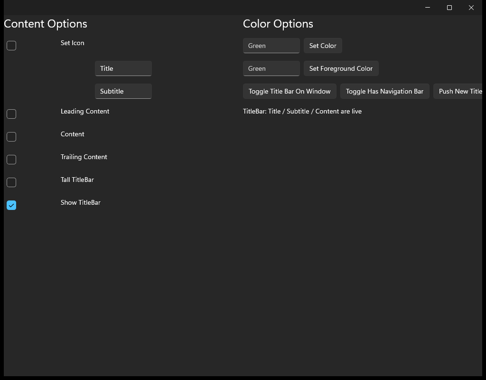</td><td></td><td></td></tr></table>

ports TitleBarPage.xaml A self-contained, code-first demo of the TitleBar control

#### 🟢 Pixel-Perfect Score — C++ (C1/C3)

**Motion:** ✅ PASS · run 2026-08-14-03_04_30 · 2026-08-14

Light: MOTION 3 frames paired by step (run 2026-08-14-03_04_30, commit 74dde0864a, 2026-08-14) — worst SSIM 0.9996 at frame 2 'focus-field' (0.02% pixels differ), mean SSIM 0.9997; per-frame diff% 0.02/0.02/0.02; self-motion MAUI 0.0526% (431 px) vs C++ 0.0574% (470 px) · Dark: MOTION 3 frames paired by step (run 2026-08-14-03_04_30, commit 74dde0864a, 2026-08-14) — worst SSIM 0.9996 at frame 2 'focus-field' (0.02% pixels differ), mean SSIM 0.9997; per-frame diff% 0.02/0.02/0.02; self-motion MAUI 0.0526% (431 px) vs C++ 0.0574% (470 px)

#### 🟢 Pixel-Perfect Score — C++ &amp; XAML (C2/C4)

**Motion:** ✅ PASS · run 2026-08-14-03_04_30 · 2026-08-14

Light: MOTION 3 frames paired by step (run 2026-08-14-03_04_30, commit 74dde0864a, 2026-08-14) — worst SSIM 0.9996 at frame 2 'focus-field' (0.02% pixels differ), mean SSIM 0.9997; per-frame diff% 0.02/0.02/0.02; self-motion MAUI 0.0526% (431 px) vs C++ &amp; XAML 0.0574% (470 px) · Dark: MOTION 3 frames paired by step (run 2026-08-14-03_04_30, commit 74dde0864a, 2026-08-14) — worst SSIM 0.9996 at frame 2 'focus-field' (0.02% pixels differ), mean SSIM 0.9997; per-frame diff% 0.02/0.02/0.02; self-motion MAUI 0.0526% (431 px) vs C++ &amp; XAML 0.0574% (470 px)

### 163. Toolbar — 🟢/🟢
toolbar

<table><tr><th></th><th>MAUI</th><th>C++</th><th>C++ &amp; XAML</th></tr><tr><th>Light</th><td></td><td></td><td></td></tr><tr><th>Dark</th><td></td><td></td><td></td></tr></table>

ports ToolbarPage.xaml (Maui.Controls.Sample.Pages.ToolbarPage)

#### 🟢 Pixel-Perfect Score — C++ (C1/C3)

Light: SSIM 0.9999, 0.02% pixels differ · Dark: SSIM 0.9999, 0.01% pixels differ

#### 🟢 Pixel-Perfect Score — C++ &amp; XAML (C2/C4)

Light: SSIM 0.9999, 0.02% pixels differ · Dark: SSIM 0.9999, 0.01% pixels differ

### 164. Transform Playground — 🟢/🟢
transform_playground

<table><tr><th></th><th>MAUI</th><th>C++</th><th>C++ &amp; XAML</th></tr><tr><th>Light</th><td></td><td></td><td></td></tr><tr><th>Dark</th><td></td><td></td><td></td></tr></table>

ports TransformPlaygroundGallery.xaml A code-first port of the MAUI Shapes sub-gallery Pages/Controls/ShapesGalleries/TransformPlaygroundGallery.xaml: a 50x50 Path rectangle (red fill, blue stroke 4) sits in a 200x200 light-grey panel; belo

#### 🟢 Pixel-Perfect Score — C++ (C1/C3)

Light: SSIM 0.9979, 0.09% pixels differ · Dark: SSIM 0.9978, 0.09% pixels differ

#### 🟢 Pixel-Perfect Score — C++ &amp; XAML (C2/C4)

Light: SSIM 1.0000, 0.00% pixels differ · Dark: SSIM 1.0000, 0.00% pixels differ

### 165. Transformations — 🟢/🟢
transformations

<table><tr><th></th><th>MAUI</th><th>C++</th><th>C++ &amp; XAML</th></tr><tr><th>Light</th><td></td><td></td><td></td></tr><tr><th>Dark</th><td></td><td></td><td></td></tr></table>

ports TransformationsPage.xaml (+ .xaml.cs) The MAUI TransformationsPage drives a single target view&amp;#x27;s render transforms from a column of knobs: Sliders for Scale / ScaleX / ScaleY (Maximum 10) and Rotation / RotationX / RotationY (Maximum

#### 🟢 Pixel-Perfect Score — C++ (C1/C3)

Light: SSIM 0.9997, 0.00% pixels differ · Dark: SSIM 0.9988, 0.00% pixels differ

#### 🟢 Pixel-Perfect Score — C++ &amp; XAML (C2/C4)

Light: SSIM 0.9997, 0.00% pixels differ · Dark: SSIM 0.9988, 0.00% pixels differ

### 166. Triggers — 🟢/🟢
triggers

<table><tr><th></th><th>MAUI</th><th>C++</th><th>C++ &amp; XAML</th></tr><tr><th>Light</th><td></td><td></td><td></td></tr><tr><th>Dark</th><td></td><td></td><td></td></tr></table>

ports TriggersPage.xaml

#### 🟢 Pixel-Perfect Score — C++ (C1/C3)

Light: SSIM 1.0000, 0.00% pixels differ · Dark: SSIM 1.0000, 0.00% pixels differ

#### 🟢 Pixel-Perfect Score — C++ &amp; XAML (C2/C4)

Light: SSIM 1.0000, 0.00% pixels differ · Dark: SSIM 1.0000, 0.00% pixels differ

### 167. Update Path Data — 🟢/🟢
update_path_data

<table><tr><th></th><th>MAUI</th><th>C++</th><th>C++ &amp; XAML</th></tr><tr><th>Light</th><td></td><td></td><td></td></tr><tr><th>Dark</th><td></td><td></td><td></td></tr></table>

ports UpdatePathDataGallery.xaml A code-first port of the MAUI Shapes sub-gallery Pages/Controls/ShapesGalleries/UpdatePathDataGallery.xaml: a 2-row Grid (RowSpacing 0) that proves a Path repaints when its Data geometry is replaced at runti

#### 🟢 Pixel-Perfect Score — C++ (C1/C3)

Light: SSIM 1.0000, 0.00% pixels differ · Dark: SSIM 1.0000, 0.00% pixels differ

#### 🟢 Pixel-Perfect Score — C++ &amp; XAML (C2/C4)

Light: SSIM 1.0000, 0.00% pixels differ · Dark: SSIM 1.0000, 0.00% pixels differ

### 168. Varied Size Selector — 🟢/🟢
varied_size_selector

<table><tr><th></th><th>MAUI</th><th>C++</th><th>C++ &amp; XAML</th></tr><tr><th>Light</th><td></td><td></td><td></td></tr><tr><th>Dark</th><td></td><td></td><td></td></tr></table>

ports DataTemplateSelectorGalleries/VariedSizeDataTemplateSelectorGallery.xaml (+ VariedSizeDataTemplateSelectorGallery.xaml.cs) of the C# CollectionView gallery

#### 🟢 Pixel-Perfect Score — C++ (C1/C3)

Light: SSIM 1.0000, 0.00% pixels differ · Dark: SSIM 1.0000, 0.01% pixels differ

#### 🟢 Pixel-Perfect Score — C++ &amp; XAML (C2/C4)

Light: SSIM 1.0000, 0.00% pixels differ · Dark: SSIM 1.0000, 0.01% pixels differ

### 169. Vertical Stack — 🟢/🟢
vertical_stack

<table><tr><th></th><th>MAUI</th><th>C++</th><th>C++ &amp; XAML</th></tr><tr><th>Light</th><td></td><td></td><td></td></tr><tr><th>Dark</th><td></td><td></td><td></td></tr></table>

Vertical Stack

#### 🟢 Pixel-Perfect Score — C++ (C1/C3)

Light: SSIM 1.0000, 0.00% pixels differ · Dark: SSIM 1.0000, 0.00% pixels differ

#### 🟢 Pixel-Perfect Score — C++ &amp; XAML (C2/C4)

Light: SSIM 1.0000, 0.00% pixels differ · Dark: SSIM 1.0000, 0.00% pixels differ

### 170. Visual States — 🟢/🟢
visual_states

<table><tr><th></th><th>MAUI</th><th>C++</th><th>C++ &amp; XAML</th></tr><tr><th>Light</th><td></td><td></td><td></td></tr><tr><th>Dark</th><td></td><td></td><td></td></tr></table>

ports VisualStatesPage.xaml

#### 🟢 Pixel-Perfect Score — C++ (C1/C3)

Light: SSIM 1.0000, 0.01% pixels differ · Dark: SSIM 1.0000, 0.01% pixels differ

#### 🟢 Pixel-Perfect Score — C++ &amp; XAML (C2/C4)

Light: SSIM 1.0000, 0.01% pixels differ · Dark: SSIM 1.0000, 0.01% pixels differ

### 171. Web View — 🟢/🟢
web_view

<table><tr><th></th><th>MAUI</th><th>C++</th><th>C++ &amp; XAML</th></tr><tr><th>Light</th><td></td><td></td><td></td></tr><tr><th>Dark</th><td></td><td></td><td></td></tr></table>

a self-contained demo page for the W1-08 web_view vertical: a web_view loading a STATIC html_web_view_source (no network), back/forward/reload buttons over the handler-pushed CanGoBack/CanGoForward read-onlys, an &amp;quot;Eval 1+1&amp;quot; button driving t

#### 🟢 Pixel-Perfect Score — C++ (C1/C3)

Light: SSIM 1.0000, 0.00% pixels differ · Dark: SSIM 1.0000, 0.00% pixels differ

#### 🟢 Pixel-Perfect Score — C++ &amp; XAML (C2/C4)

Light: SSIM 1.0000, 0.00% pixels differ · Dark: SSIM 1.0000, 0.00% pixels differ

### 172. Z Index — 🟢/🟢
z_index

<table><tr><th></th><th>MAUI</th><th>C++</th><th>C++ &amp; XAML</th></tr><tr><th>Light</th><td></td><td></td><td></td></tr><tr><th>Dark</th><td></td><td></td><td></td></tr></table>

ports ZIndexPage.xaml (+ ZIndexPage.xaml.cs), code-first

#### 🟢 Pixel-Perfect Score — C++ (C1/C3)

Light: SSIM 0.9999, 0.00% pixels differ · Dark: SSIM 0.9996, 0.00% pixels differ

#### 🟢 Pixel-Perfect Score — C++ &amp; XAML (C2/C4)

Light: SSIM 0.9999, 0.00% pixels differ · Dark: SSIM 0.9996, 0.00% pixels differ

