# .NET MAUI C++ port — visual parity comparison

Per-page MAUI-vs-C++ visual parity for the **172 gallery pages**, on **iOS**, **macOS** (Mac Catalyst + AppKit) and **Android**. Each section is collapsible and holds a discrepancy-count summary, then one subheader per page titled with a `{Sonnet}/{Gemini}` status-emoji combo (🟢 match / 🟡 minor / 🔴 major / ⬛ blank / ⏳ unreviewed). Under each page: the MAUI / C++ / C++&amp;XAML renders (light over dark; missing captures show a placeholder), then a subsubheader per review model (Sonnet, Gemini, Pixel-Perfect Score) titled with that model's own status emoji and holding its review prose. Generated from `comparison.json` by `tools/gen_readme.py` — do not edit by hand.

<h2>iOS (172 examples) — click to expand</h2>

Real .NET MAUI (native-default) vs the C++ port vs the compile-time-XAML gallery, captured on the same iOS simulator in light and dark. MAUI is the content ground truth.

**Discrepancy counts** (MAUI-vs-C++ parity verdicts from the deterministic pixel-perfect score — SSIM + per-pixel diff; AI-based review has been invalidated/removed):

| Classification | Pixel-Perfect Score — C++ (C1/C3) | Pixel-Perfect Score — C++ &amp; XAML (C2/C4) |
| --- | --- | --- |
| 🟢 Match | 157 | 158 |
| 🟡 Minor | 15 | 14 |
| 🔴 Major | 0 | 0 |
| ⬛ Blank | 0 | 0 |
| ⏳ Unreviewed | 0 | 0 |

### 1. Absolute Layout — 🟢/🟢
absolute_layout

<table><tr><th></th><th>MAUI</th><th>C++</th><th>C++ &amp; XAML</th></tr><tr><th>Light</th><td></td><td></td><td></td></tr><tr><th>Dark</th><td></td><td></td><td></td></tr></table>

ports AbsoluteLayoutPage.xaml A self-contained, code-first demo of the AbsoluteLayout control

#### 🟢 Pixel-Perfect Score — C++ (C1/C3)

Light: SSIM 0.9901, 0.64% pixels differ · Dark: SSIM 0.9899, 0.65% pixels differ

#### 🟢 Pixel-Perfect Score — C++ &amp; XAML (C2/C4)

Light: SSIM 0.9987, 0.06% pixels differ · Dark: SSIM 0.9986, 0.06% pixels differ

### 2. Activity Indicator — 🟢/🟡
activity_indicator

<table><tr><th></th><th>MAUI</th><th>C++</th><th>C++ &amp; XAML</th></tr><tr><th>Light</th><td></td><td></td><td></td></tr><tr><th>Dark</th><td></td><td></td><td></td></tr></table>

ports ActivityIndicatorPage.xaml (+ ActivityIndicatorPage.xaml.cs)

#### 🟢 Pixel-Perfect Score — C++ (C1/C3)

Light: SSIM 0.9974, 0.14% pixels differ · Dark: SSIM 0.9985, 0.08% pixels differ

#### 🟡 Pixel-Perfect Score — C++ &amp; XAML (C2/C4)

Light: SSIM 0.9575, 1.57% pixels differ · Dark: SSIM 0.9566, 1.57% pixels differ

### 3. Adaptive Collection — 🟢/🟢
adaptive_collection

<table><tr><th></th><th>MAUI</th><th>C++</th><th>C++ &amp; XAML</th></tr><tr><th>Light</th><td></td><td></td><td></td></tr><tr><th>Dark</th><td></td><td></td><td></td></tr></table>

ports AdaptiveCollectionView.xaml (+ .xaml.cs) (Maui.Controls.Sample.Pages.CollectionViewGalleries.AdaptiveCollectionView)

#### 🟢 Pixel-Perfect Score — C++ (C1/C3)

Light: SSIM 0.9974, 0.23% pixels differ · Dark: SSIM 0.9978, 0.21% pixels differ

#### 🟢 Pixel-Perfect Score — C++ &amp; XAML (C2/C4)

Light: SSIM 0.9987, 0.06% pixels differ · Dark: SSIM 0.9993, 0.04% pixels differ

### 4. Alerts — 🟢/🟢
alerts

<table><tr><th></th><th>MAUI</th><th>C++</th><th>C++ &amp; XAML</th></tr><tr><th>Light</th><td></td><td></td><td></td></tr><tr><th>Dark</th><td></td><td></td><td></td></tr></table>

ports AlertsPage.xaml (+ AlertsPage.xaml.cs) The C# AlertsPage drives the three Page dialog services — DisplayAlertAsync (simple OK + Yes/No), DisplayActionSheetAsync (simple + Cancel/Delete), and DisplayPromptAsync (two questions) — from a

#### 🟢 Pixel-Perfect Score — C++ (C1/C3)

Light: SSIM 0.9979, 0.10% pixels differ · Dark: SSIM 0.9979, 0.10% pixels differ

#### 🟢 Pixel-Perfect Score — C++ &amp; XAML (C2/C4)

Light: SSIM 0.9994, 0.04% pixels differ · Dark: SSIM 0.9993, 0.04% pixels differ

### 5. Alignment — 🟢/🟢
alignment

<table><tr><th></th><th>MAUI</th><th>C++</th><th>C++ &amp; XAML</th></tr><tr><th>Light</th><td></td><td></td><td></td></tr><tr><th>Dark</th><td></td><td></td><td></td></tr></table>

a faithful reproduction of the maui-compare &amp;quot;alignment&amp;quot; demo (ComparePages.Alignment()), the shipped-.NET-MAUI reference for the visual-parity comparison

#### 🟢 Pixel-Perfect Score — C++ (C1/C3)

Light: SSIM 0.9803, 0.61% pixels differ · Dark: SSIM 0.9859, 0.61% pixels differ

#### 🟢 Pixel-Perfect Score — C++ &amp; XAML (C2/C4)

Light: SSIM 0.9802, 0.61% pixels differ · Dark: SSIM 0.9858, 0.61% pixels differ

### 6. Animation — 🟡/🟡
animation

<table><tr><th></th><th>MAUI</th><th>C++</th><th>C++ &amp; XAML</th></tr><tr><th>Light</th><td></td><td></td><td></td></tr><tr><th>Dark</th><td></td><td></td><td></td></tr></table>

ports AnimationPage.xaml (+ AnimationPage.xaml.cs)

#### 🟡 Pixel-Perfect Score — C++ (C1/C3)

Light: SSIM 0.9503, 2.09% pixels differ · Dark: SSIM 0.9485, 2.11% pixels differ

#### 🟡 Pixel-Perfect Score — C++ &amp; XAML (C2/C4)

Light: SSIM 0.9486, 2.13% pixels differ · Dark: SSIM 0.9450, 2.16% pixels differ

### 7. App Theme Binding — 🟢/🟢
app_theme_binding

<table><tr><th></th><th>MAUI</th><th>C++</th><th>C++ &amp; XAML</th></tr><tr><th>Light</th><td></td><td></td><td></td></tr><tr><th>Dark</th><td></td><td></td><td></td></tr></table>

ports AppThemeBindingPage.xaml

#### 🟢 Pixel-Perfect Score — C++ (C1/C3)

Light: SSIM 0.9993, 0.04% pixels differ · Dark: SSIM 0.9992, 0.04% pixels differ

#### 🟢 Pixel-Perfect Score — C++ &amp; XAML (C2/C4)

Light: SSIM 0.9994, 0.04% pixels differ · Dark: SSIM 0.9993, 0.04% pixels differ

### 8. Application Control — 🟢/🟢
application_control

<table><tr><th></th><th>MAUI</th><th>C++</th><th>C++ &amp; XAML</th></tr><tr><th>Light</th><td></td><td></td><td></td></tr><tr><th>Dark</th><td></td><td></td><td></td></tr></table>

ports ApplicationControlPage.xaml (+ .xaml.cs)

#### 🟢 Pixel-Perfect Score — C++ (C1/C3)

Light: SSIM 0.9993, 0.04% pixels differ · Dark: SSIM 0.9992, 0.04% pixels differ

#### 🟢 Pixel-Perfect Score — C++ &amp; XAML (C2/C4)

Light: SSIM 0.9994, 0.04% pixels differ · Dark: SSIM 0.9993, 0.04% pixels differ

### 9. Auto Size Shapes — 🟢/🟢
auto_size_shapes

<table><tr><th></th><th>MAUI</th><th>C++</th><th>C++ &amp; XAML</th></tr><tr><th>Light</th><td></td><td></td><td></td></tr><tr><th>Dark</th><td></td><td></td><td></td></tr></table>

ports AutoSizeShapesGallery.xaml A code-first port of the MAUI Shapes sub-gallery Pages/Controls/ShapesGalleries/AutoSizeShapesGallery.xaml: a 3-row Grid (RowSpacing 0) that proves a stroked Ellipse auto-sizes to fill exactly half of the av

#### 🟢 Pixel-Perfect Score — C++ (C1/C3)

Light: SSIM 0.9993, 0.04% pixels differ · Dark: SSIM 0.9993, 0.04% pixels differ

#### 🟢 Pixel-Perfect Score — C++ &amp; XAML (C2/C4)

Light: SSIM 0.9993, 0.04% pixels differ · Dark: SSIM 0.9993, 0.04% pixels differ

### 10. Basic Grouping — 🟢/🟢
basic_grouping

<table><tr><th></th><th>MAUI</th><th>C++</th><th>C++ &amp; XAML</th></tr><tr><th>Light</th><td></td><td></td><td></td></tr><tr><th>Dark</th><td></td><td></td><td></td></tr></table>

ports GroupingGalleries/BasicGrouping.xaml (+ .xaml.cs) of the C# CollectionView gallery

#### 🟢 Pixel-Perfect Score — C++ (C1/C3)

Light: SSIM 0.9984, 0.07% pixels differ · Dark: SSIM 0.9983, 0.07% pixels differ

#### 🟢 Pixel-Perfect Score — C++ &amp; XAML (C2/C4)

Light: SSIM 0.9984, 0.07% pixels differ · Dark: SSIM 0.9996, 0.02% pixels differ

### 11. Basic Swipe — 🟢/🟢
basic_swipe

<table><tr><th></th><th>MAUI</th><th>C++</th><th>C++ &amp; XAML</th></tr><tr><th>Light</th><td></td><td></td><td></td></tr><tr><th>Dark</th><td></td><td></td><td></td></tr></table>

ports BasicSwipeGallery.xaml A code-first port of the MAUI SwipeView sub-gallery Pages/Controls/SwipeViewGalleries/BasicSwipeGallery.xaml: a vertical StackLayout of five SwipeViews, each demonstrating a different revealed-side / SwipeMode c

#### 🟢 Pixel-Perfect Score — C++ (C1/C3)

Light: SSIM 0.9996, 0.02% pixels differ · Dark: SSIM 0.9996, 0.02% pixels differ

#### 🟢 Pixel-Perfect Score — C++ &amp; XAML (C2/C4)

Light: SSIM 0.9990, 0.05% pixels differ · Dark: SSIM 0.9990, 0.05% pixels differ

### 12. Behaviors — 🟢/🟢
behaviors

<table><tr><th></th><th>MAUI</th><th>C++</th><th>C++ &amp; XAML</th></tr><tr><th>Light</th><td></td><td></td><td></td></tr><tr><th>Dark</th><td></td><td></td><td></td></tr></table>

ports BehaviorsPage.xaml (+ .xaml.cs) and its companion Controls.Sample/Behaviors/NumericValidationBehavior.cs

#### 🟢 Pixel-Perfect Score — C++ (C1/C3)

Light: SSIM 0.9980, 0.09% pixels differ · Dark: SSIM 0.9980, 0.09% pixels differ

#### 🟢 Pixel-Perfect Score — C++ &amp; XAML (C2/C4)

Light: SSIM 0.9990, 0.05% pixels differ · Dark: SSIM 0.9990, 0.05% pixels differ

### 13. Border — 🟢/🟢
border

<table><tr><th></th><th>MAUI</th><th>C++</th><th>C++ &amp; XAML</th></tr><tr><th>Light</th><td></td><td></td><td></td></tr><tr><th>Dark</th><td></td><td></td><td></td></tr></table>

a faithful reproduction of the maui-compare &amp;quot;border&amp;quot; demo (ComparePages.BorderPage()), the shipped-.NET-MAUI reference for the visual-parity comparison: a single Border centered on the page — red 5pt stroke, a RoundRectangle StrokeShape (Co

#### 🟢 Pixel-Perfect Score — C++ (C1/C3)

Light: SSIM 0.9902, 0.36% pixels differ · Dark: SSIM 0.9912, 0.35% pixels differ

#### 🟢 Pixel-Perfect Score — C++ &amp; XAML (C2/C4)

Light: SSIM 0.9898, 0.37% pixels differ · Dark: SSIM 0.9906, 0.37% pixels differ

### 14. Border Clip Playground — 🟡/🟡
border_clip_playground

<table><tr><th></th><th>MAUI</th><th>C++</th><th>C++ &amp; XAML</th></tr><tr><th>Light</th><td></td><td></td><td></td></tr><tr><th>Dark</th><td></td><td></td><td></td></tr></table>

ports BorderClipPlayground.xaml (+ .xaml.cs) The C# page is an interactive Border-shape playground: a 100x100 Border (red stroke) clips an AspectFill Image (oasis.jpg) into the currently selected StrokeShape, while controls below mutate the

#### 🟡 Pixel-Perfect Score — C++ (C1/C3)

Light: SSIM 0.9695, 1.86% pixels differ · Dark: SSIM 0.9694, 1.86% pixels differ

#### 🟡 Pixel-Perfect Score — C++ &amp; XAML (C2/C4)

Light: SSIM 0.9751, 1.29% pixels differ · Dark: SSIM 0.9750, 1.29% pixels differ

### 15. Border Layout — 🟢/🟢
border_layout

<table><tr><th></th><th>MAUI</th><th>C++</th><th>C++ &amp; XAML</th></tr><tr><th>Light</th><td></td><td></td><td></td></tr><tr><th>Dark</th><td></td><td></td><td></td></tr></table>

ports BorderLayout.xaml (+ BorderLayout.xaml.cs) The C# page demonstrates driving Border.StrokeThickness from a Slider: a Slider (0..40, set to 5 in OnAppearing) is bound to the Border&amp;#x27;s StrokeThickness; the Border (Silver stroke, White bac

#### 🟢 Pixel-Perfect Score — C++ (C1/C3)

Light: SSIM 0.9911, 0.34% pixels differ · Dark: SSIM 0.9903, 0.35% pixels differ

#### 🟢 Pixel-Perfect Score — C++ &amp; XAML (C2/C4)

Light: SSIM 0.9920, 0.31% pixels differ · Dark: SSIM 0.9912, 0.32% pixels differ

### 16. Border Playground — 🟡/🟢
border_playground

<table><tr><th></th><th>MAUI</th><th>C++</th><th>C++ &amp; XAML</th></tr><tr><th>Light</th><td></td><td></td><td></td></tr><tr><th>Dark</th><td></td><td></td><td></td></tr></table>

ports BorderPlayground.xaml (+ BorderPlayground.xaml.cs) A self-contained, code-first interactive Border playground

#### 🟡 Pixel-Perfect Score — C++ (C1/C3)

Light: SSIM 0.9817, 1.32% pixels differ · Dark: SSIM 0.9807, 1.34% pixels differ

#### 🟢 Pixel-Perfect Score — C++ &amp; XAML (C2/C4)

Light: SSIM 0.9830, 0.89% pixels differ · Dark: SSIM 0.9823, 0.89% pixels differ

### 17. Border Resize Content — 🟡/🟡
border_resize_content

<table><tr><th></th><th>MAUI</th><th>C++</th><th>C++ &amp; XAML</th></tr><tr><th>Light</th><td></td><td></td><td></td></tr><tr><th>Dark</th><td></td><td></td><td></td></tr></table>

ports BorderResizeContent.xaml A self-contained, code-first demo that resizes a Border&amp;#x27;s CONTENT and watches the Border track it

#### 🟡 Pixel-Perfect Score — C++ (C1/C3)

Light: SSIM 0.9791, 1.52% pixels differ · Dark: SSIM 0.9753, 1.55% pixels differ

#### 🟡 Pixel-Perfect Score — C++ &amp; XAML (C2/C4)

Light: SSIM 0.9853, 1.13% pixels differ · Dark: SSIM 0.9837, 1.16% pixels differ

### 18. Border Stroke — 🟡/🟡
border_stroke

<table><tr><th></th><th>MAUI</th><th>C++</th><th>C++ &amp; XAML</th></tr><tr><th>Light</th><td></td><td></td><td></td></tr><tr><th>Dark</th><td></td><td></td><td></td></tr></table>

ports BorderStroke.xaml (+ BorderStroke.xaml.cs) A self-contained, code-first demo of Border StrokeThickness and how a Border tracks the height of its content

#### 🟡 Pixel-Perfect Score — C++ (C1/C3)

Light: SSIM 0.9526, 1.95% pixels differ · Dark: SSIM 0.9523, 1.96% pixels differ

#### 🟡 Pixel-Perfect Score — C++ &amp; XAML (C2/C4)

Light: SSIM 0.9530, 1.93% pixels differ · Dark: SSIM 0.9532, 1.93% pixels differ

### 19. Borderless — 🟢/🟢
borderless

<table><tr><th></th><th>MAUI</th><th>C++</th><th>C++ &amp; XAML</th></tr><tr><th>Light</th><td></td><td></td><td></td></tr><tr><th>Dark</th><td></td><td></td><td></td></tr></table>

ports Borderless.xaml A self-contained, code-first demo of a stroke-less Border

#### 🟢 Pixel-Perfect Score — C++ (C1/C3)

Light: SSIM 0.9985, 0.07% pixels differ · Dark: SSIM 0.9985, 0.07% pixels differ

#### 🟢 Pixel-Perfect Score — C++ &amp; XAML (C2/C4)

Light: SSIM 0.9994, 0.03% pixels differ · Dark: SSIM 0.9994, 0.03% pixels differ

### 20. Box View — 🟢/🟢
box_view

<table><tr><th></th><th>MAUI</th><th>C++</th><th>C++ &amp; XAML</th></tr><tr><th>Light</th><td></td><td></td><td></td></tr><tr><th>Dark</th><td></td><td></td><td></td></tr></table>

ports BoxViewPage.xaml (+ BoxViewPage.xaml.cs)

#### 🟢 Pixel-Perfect Score — C++ (C1/C3)

Light: SSIM 0.9985, 0.07% pixels differ · Dark: SSIM 0.9990, 0.05% pixels differ

#### 🟢 Pixel-Perfect Score — C++ &amp; XAML (C2/C4)

Light: SSIM 0.9992, 0.05% pixels differ · Dark: SSIM 0.9991, 0.05% pixels differ

### 21. Button — 🟡/🟡
button

<table><tr><th></th><th>MAUI</th><th>C++</th><th>C++ &amp; XAML</th></tr><tr><th>Light</th><td></td><td></td><td></td></tr><tr><th>Dark</th><td></td><td></td><td></td></tr></table>

ports ButtonPage.xaml (+ ButtonPage.xaml.cs)

#### 🟡 Pixel-Perfect Score — C++ (C1/C3)

Light: SSIM 0.9806, 1.03% pixels differ · Dark: SSIM 0.9810, 1.02% pixels differ

#### 🟡 Pixel-Perfect Score — C++ &amp; XAML (C2/C4)

Light: SSIM 0.9807, 1.03% pixels differ · Dark: SSIM 0.9812, 1.01% pixels differ

### 22. Carousel Page — 🟡/🟢
carousel_page

<table><tr><th></th><th>MAUI</th><th>C++</th><th>C++ &amp; XAML</th></tr><tr><th>Light</th><td></td><td></td><td></td></tr><tr><th>Dark</th><td></td><td></td><td></td></tr></table>

Carousel Page

#### 🟡 Pixel-Perfect Score — C++ (C1/C3)

Light: SSIM 0.9758, 0.63% pixels differ · Dark: SSIM 0.9755, 0.63% pixels differ

#### 🟢 Pixel-Perfect Score — C++ &amp; XAML (C2/C4)

Light: SSIM 0.9853, 0.40% pixels differ · Dark: SSIM 0.9845, 0.41% pixels differ

### 23. Chat Example — 🟢/🟢
chat_example

<table><tr><th></th><th>MAUI</th><th>C++</th><th>C++ &amp; XAML</th></tr><tr><th>Light</th><td></td><td></td><td></td></tr><tr><th>Dark</th><td></td><td></td><td></td></tr></table>

ports ChatExample.xaml (+ .xaml.cs) (Maui.Controls.Sample.Pages.CollectionViewGalleries.ItemSizeGalleries.ChatExample), tracking the maui-compare reference demo ~/maui-compare/Pages/ChatExamplePage.cs (the visual-parity oracle)

#### 🟢 Pixel-Perfect Score — C++ (C1/C3)

Light: SSIM 0.9994, 0.04% pixels differ · Dark: SSIM 0.9993, 0.04% pixels differ

#### 🟢 Pixel-Perfect Score — C++ &amp; XAML (C2/C4)

Light: SSIM 0.9996, 0.03% pixels differ · Dark: SSIM 0.9995, 0.03% pixels differ

### 24. Check Box — 🟢/🟢
check_box

<table><tr><th></th><th>MAUI</th><th>C++</th><th>C++ &amp; XAML</th></tr><tr><th>Light</th><td></td><td></td><td></td></tr><tr><th>Dark</th><td></td><td></td><td></td></tr></table>

ports CheckBoxPage.xaml (+ .xaml.cs) Mirrors the MAUI gallery page: a vertical stack of headlined CheckBox states — Default, Colored (Color=Purple), Disabled, Disabled+Colored+Checked — followed by a &amp;quot;Change IsChecked&amp;quot; row pairing a Button

#### 🟢 Pixel-Perfect Score — C++ (C1/C3)

Light: SSIM 0.9967, 0.16% pixels differ · Dark: SSIM 0.9967, 0.16% pixels differ

#### 🟢 Pixel-Perfect Score — C++ &amp; XAML (C2/C4)

Light: SSIM 0.9996, 0.03% pixels differ · Dark: SSIM 0.9995, 0.03% pixels differ

### 25. Chrome — 🟢/🟢
chrome

<table><tr><th></th><th>MAUI</th><th>C++</th><th>C++ &amp; XAML</th></tr><tr><th>Light</th><td></td><td></td><td></td></tr><tr><th>Dark</th><td></td><td></td><td></td></tr></table>

a self-contained demo page for the W1-11 window-chrome family: page toolbar items (primary + secondary), a menu bar (File menu with items, a separator and a sub-menu), a context flyout (right-click menu) on a button, and a tooltip — all wir

#### 🟢 Pixel-Perfect Score — C++ (C1/C3)

Light: SSIM 0.9984, 0.08% pixels differ · Dark: SSIM 0.9986, 0.07% pixels differ

#### 🟢 Pixel-Perfect Score — C++ &amp; XAML (C2/C4)

Light: SSIM 0.9992, 0.06% pixels differ · Dark: SSIM 0.9987, 0.07% pixels differ

### 26. Clip — 🟢/🟢
clip

<table><tr><th></th><th>MAUI</th><th>C++</th><th>C++ &amp; XAML</th></tr><tr><th>Light</th><td></td><td></td><td></td></tr><tr><th>Dark</th><td></td><td></td><td></td></tr></table>

ports ClipPage.xaml The C# page (Pages/Core/ClipPage.xaml; its .xaml.cs is an empty InitializeComponent) is a ScrollView over a StackLayout that shows the SAME dotnet_bot.png image five times, each successive copy carrying a different geome

#### 🟢 Pixel-Perfect Score — C++ (C1/C3)

Light: SSIM 0.9996, 0.02% pixels differ · Dark: SSIM 0.9996, 0.02% pixels differ

#### 🟢 Pixel-Perfect Score — C++ &amp; XAML (C2/C4)

Light: SSIM 0.9985, 0.07% pixels differ · Dark: SSIM 0.9985, 0.07% pixels differ

### 27. Clip Corner Radius — 🟢/🟢
clip_corner_radius

<table><tr><th></th><th>MAUI</th><th>C++</th><th>C++ &amp; XAML</th></tr><tr><th>Light</th><td></td><td></td><td></td></tr><tr><th>Dark</th><td></td><td></td><td></td></tr></table>

ports ClipCornerRadiusGallery.xaml (+ .xaml.cs) The C# page (Pages/Controls/ShapesGalleries/ClipCornerRadiusGallery.xaml) is a StackLayout (Padding=12) that demonstrates DRIVING a RoundRectangleGeometry&amp;#x27;s per-corner CornerRadius from four s

#### 🟢 Pixel-Perfect Score — C++ (C1/C3)

Light: SSIM 0.9996, 0.02% pixels differ · Dark: SSIM 0.9995, 0.03% pixels differ

#### 🟢 Pixel-Perfect Score — C++ &amp; XAML (C2/C4)

Light: SSIM 0.9985, 0.07% pixels differ · Dark: SSIM 0.9984, 0.07% pixels differ

### 28. Clip Gallery — 🟢/🟢
clip_gallery

<table><tr><th></th><th>MAUI</th><th>C++</th><th>C++ &amp; XAML</th></tr><tr><th>Light</th><td></td><td></td><td></td></tr><tr><th>Dark</th><td></td><td></td><td></td></tr></table>

ports ClipGallery.xaml The C# page (Pages/Controls/ShapesGalleries/ClipGallery.xaml; its .xaml.cs is an empty InitializeComponent) is a ScrollView over a StackLayout (Padding=12) that shows the SAME &amp;quot;oasis.jpg&amp;quot; image SEVEN times — one bare

#### 🟢 Pixel-Perfect Score — C++ (C1/C3)

Light: SSIM 0.9995, 0.03% pixels differ · Dark: SSIM 0.9995, 0.03% pixels differ

#### 🟢 Pixel-Perfect Score — C++ &amp; XAML (C2/C4)

Light: SSIM 0.9985, 0.07% pixels differ · Dark: SSIM 0.9984, 0.07% pixels differ

### 29. Clip Views — 🟢/🟢
clip_views

<table><tr><th></th><th>MAUI</th><th>C++</th><th>C++ &amp; XAML</th></tr><tr><th>Light</th><td></td><td></td><td></td></tr><tr><th>Dark</th><td></td><td></td><td></td></tr></table>

ports ClipViewsGallery.xaml The C# page (Pages/Controls/ShapesGalleries/ClipViewsGallery.xaml; no code-behind beyond an empty InitializeComponent) is a ScrollView over a StackLayout (Padding=12) that proves the Clip surface (VisualElement.C

#### 🟢 Pixel-Perfect Score — C++ (C1/C3)

Light: SSIM 0.9974, 0.12% pixels differ · Dark: SSIM 0.9973, 0.12% pixels differ

#### 🟢 Pixel-Perfect Score — C++ &amp; XAML (C2/C4)

Light: SSIM 0.9974, 0.12% pixels differ · Dark: SSIM 0.9973, 0.12% pixels differ

### 30. Clipping — 🟢/🟢
clipping

<table><tr><th></th><th>MAUI</th><th>C++</th><th>C++ &amp; XAML</th></tr><tr><th>Light</th><td></td><td></td><td></td></tr><tr><th>Dark</th><td></td><td></td><td></td></tr></table>

compare oracle ~/maui-compare/Pages/ClippingPage.cs (itself written to mirror this gallery page)

#### 🟢 Pixel-Perfect Score — C++ (C1/C3)

Light: SSIM 0.9996, 0.03% pixels differ · Dark: SSIM 0.9996, 0.03% pixels differ

#### 🟢 Pixel-Perfect Score — C++ &amp; XAML (C2/C4)

Light: SSIM 0.9949, 0.20% pixels differ · Dark: SSIM 0.9986, 0.07% pixels differ

### 31. Collectionview — 🟢/🟢
collectionview

<table><tr><th></th><th>MAUI</th><th>C++</th><th>C++ &amp; XAML</th></tr><tr><th>Light</th><td></td><td></td><td></td></tr><tr><th>Dark</th><td></td><td></td><td></td></tr></table>

a faithful reproduction of the maui-compare &amp;quot;collectionview&amp;quot; demo (ComparePages.CollectionViewPage()), the shipped-.NET-MAUI reference for the visual-parity comparison: a CollectionView over 24 captioned items, a string Header (&amp;quot;This is the

#### 🟢 Pixel-Perfect Score — C++ (C1/C3)

Light: SSIM 0.9994, 0.03% pixels differ · Dark: SSIM 0.9993, 0.03% pixels differ

#### 🟢 Pixel-Perfect Score — C++ &amp; XAML (C2/C4)

Light: SSIM 0.9985, 0.07% pixels differ · Dark: SSIM 0.9994, 0.03% pixels differ

### 32. Composition Gallery — 🟢/🟢
composition_gallery

<table><tr><th></th><th>MAUI</th><th>C++</th><th>C++ &amp; XAML</th></tr><tr><th>Light</th><td></td><td></td><td></td></tr><tr><th>Dark</th><td></td><td></td><td></td></tr></table>

ports CompositionGallery.xaml A self-contained, code-first port of the MAUI Shapes sub-gallery Pages/Controls/ShapesGalleries/CompositionGallery.xaml: a StackLayout holding two Beige 250x250 Grids (Margin 12) that compose multiple overlappi

#### 🟢 Pixel-Perfect Score — C++ (C1/C3)

Light: SSIM 0.9981, 0.09% pixels differ · Dark: SSIM 0.9981, 0.09% pixels differ

#### 🟢 Pixel-Perfect Score — C++ &amp; XAML (C2/C4)

Light: SSIM 0.9985, 0.07% pixels differ · Dark: SSIM 0.9991, 0.04% pixels differ

### 33. Containers — 🟢/🟢
containers

<table><tr><th></th><th>MAUI</th><th>C++</th><th>C++ &amp; XAML</th></tr><tr><th>Light</th><td></td><td></td><td></td></tr><tr><th>Dark</th><td></td><td></td><td></td></tr></table>

a self-contained demo page for the W1-07 container set: a scroll_view hosting a vertical stack of content-hosting containers — a border-framed label (stroke + dashed outline + rounded shape), a legacy frame (BorderColor/CornerRadius/HasShad

#### 🟢 Pixel-Perfect Score — C++ (C1/C3)

Light: SSIM 0.9892, 0.42% pixels differ · Dark: SSIM 0.9883, 0.43% pixels differ

#### 🟢 Pixel-Perfect Score — C++ &amp; XAML (C2/C4)

Light: SSIM 0.9900, 0.40% pixels differ · Dark: SSIM 0.9897, 0.38% pixels differ

### 34. Content View — 🟢/🟢
content_view

<table><tr><th></th><th>MAUI</th><th>C++</th><th>C++ &amp; XAML</th></tr><tr><th>Light</th><td></td><td></td><td></td></tr><tr><th>Dark</th><td></td><td></td><td></td></tr></table>

ports ContentViewPage.xaml (+ ContentViewPage.xaml.cs), code-first

#### 🟢 Pixel-Perfect Score — C++ (C1/C3)

Light: SSIM 0.9990, 0.05% pixels differ · Dark: SSIM 0.9989, 0.05% pixels differ

#### 🟢 Pixel-Perfect Score — C++ &amp; XAML (C2/C4)

Light: SSIM 0.9989, 0.05% pixels differ · Dark: SSIM 0.9989, 0.05% pixels differ

### 35. Context Flyout — 🟢/🟢
context_flyout

<table><tr><th></th><th>MAUI</th><th>C++</th><th>C++ &amp; XAML</th></tr><tr><th>Light</th><td></td><td></td><td></td></tr><tr><th>Dark</th><td></td><td></td><td></td></tr></table>

ports ContextFlyoutPage.xaml (+ ContextFlyoutPage.xaml.cs) The C# page attaches a MenuFlyout as the FlyoutBase.ContextFlyout (right-click / long-press menu) of several controls and wires each menu item to a handler: - a Button (&amp;quot;Increment b

#### 🟢 Pixel-Perfect Score — C++ (C1/C3)

Light: SSIM 0.9990, 0.05% pixels differ · Dark: SSIM 0.9989, 0.05% pixels differ

#### 🟢 Pixel-Perfect Score — C++ &amp; XAML (C2/C4)

Light: SSIM 0.9989, 0.05% pixels differ · Dark: SSIM 0.9989, 0.05% pixels differ

### 36. Controls Stack — 🟢/🟢
controls_stack

<table><tr><th></th><th>MAUI</th><th>C++</th><th>C++ &amp; XAML</th></tr><tr><th>Light</th><td></td><td></td><td></td></tr><tr><th>Dark</th><td></td><td></td><td></td></tr></table>

a faithful reproduction of the maui-compare &amp;quot;controls_stack&amp;quot; demo (ComparePages.ControlsStack()), the shipped-.NET-MAUI reference for the visual-parity comparison: a VerticalStackLayout (Spacing 12, Padding 16) showcasing the basic widgets

#### 🟢 Pixel-Perfect Score — C++ (C1/C3)

Light: SSIM 0.9950, 0.22% pixels differ · Dark: SSIM 0.9945, 0.22% pixels differ

#### 🟢 Pixel-Perfect Score — C++ &amp; XAML (C2/C4)

Light: SSIM 0.9950, 0.22% pixels differ · Dark: SSIM 0.9944, 0.22% pixels differ

### 37. Custom Layout — 🟢/🟢
custom_layout

<table><tr><th></th><th>MAUI</th><th>C++</th><th>C++ &amp; XAML</th></tr><tr><th>Light</th><td></td><td></td><td></td></tr><tr><th>Dark</th><td></td><td></td><td></td></tr></table>

ports CustomLayoutPage.xaml (+ CustomLayoutPage.xaml.cs)

#### 🟢 Pixel-Perfect Score — C++ (C1/C3)

Light: SSIM 0.9990, 0.05% pixels differ · Dark: SSIM 0.9989, 0.05% pixels differ

#### 🟢 Pixel-Perfect Score — C++ &amp; XAML (C2/C4)

Light: SSIM 0.9989, 0.05% pixels differ · Dark: SSIM 0.9989, 0.05% pixels differ

### 38. Custom Size Swipe — 🟢/🟢
custom_size_swipe

<table><tr><th></th><th>MAUI</th><th>C++</th><th>C++ &amp; XAML</th></tr><tr><th>Light</th><td></td><td></td><td></td></tr><tr><th>Dark</th><td></td><td></td><td></td></tr></table>

ports CustomSizeSwipeViewGallery.xaml (+ .xaml.cs) The MAUI CustomSizeSwipeViewGallery is a single SwipeView whose Left / Right / Top item collections each reveal CUSTOM-SIZED content: a SwipeItemView wrapping a Grid/StackLayout with an exp

#### 🟢 Pixel-Perfect Score — C++ (C1/C3)

Light: SSIM 0.9990, 0.05% pixels differ · Dark: SSIM 0.9989, 0.05% pixels differ

#### 🟢 Pixel-Perfect Score — C++ &amp; XAML (C2/C4)

Light: SSIM 0.9989, 0.05% pixels differ · Dark: SSIM 0.9989, 0.05% pixels differ

### 39. Custom Swipe Item View — 🟢/🟢
custom_swipe_item_view

<table><tr><th></th><th>MAUI</th><th>C++</th><th>C++ &amp; XAML</th></tr><tr><th>Light</th><td></td><td></td><td></td></tr><tr><th>Dark</th><td></td><td></td><td></td></tr></table>

ports CustomSwipeItemViewGallery.xaml A self-contained, code-first port of the .NET MAUI &amp;quot;CustomSwipeItem&amp;quot; gallery: a message-list row whose right swipe reveals a CUSTOM-content swipe item (a swipe_item_view, not a plain swipe_item)

#### 🟢 Pixel-Perfect Score — C++ (C1/C3)

Light: SSIM 0.9989, 0.06% pixels differ · Dark: SSIM 0.9990, 0.05% pixels differ

#### 🟢 Pixel-Perfect Score — C++ &amp; XAML (C2/C4)

Light: SSIM 0.9985, 0.07% pixels differ · Dark: SSIM 0.9985, 0.07% pixels differ

### 40. Cv Visual States — 🟢/🟢
cv_visual_states

<table><tr><th></th><th>MAUI</th><th>C++</th><th>C++ &amp; XAML</th></tr><tr><th>Light</th><td></td><td></td><td></td></tr><tr><th>Dark</th><td></td><td></td><td></td></tr></table>

ports CollectionViewGalleries/SelectionGalleries/ VisualStatesGallery.xaml (+ .xaml.cs) of the C# CollectionView gallery

#### 🟢 Pixel-Perfect Score — C++ (C1/C3)

Light: SSIM 0.9990, 0.05% pixels differ · Dark: SSIM 0.9990, 0.05% pixels differ

#### 🟢 Pixel-Perfect Score — C++ &amp; XAML (C2/C4)

Light: SSIM 0.9986, 0.07% pixels differ · Dark: SSIM 0.9985, 0.07% pixels differ

### 41. Data Template Selector — 🟢/🟢
data_template_selector

<table><tr><th></th><th>MAUI</th><th>C++</th><th>C++ &amp; XAML</th></tr><tr><th>Light</th><td></td><td></td><td></td></tr><tr><th>Dark</th><td></td><td></td><td></td></tr></table>

ports DataTemplateSelectorGallery.xaml (+ DataTemplateSelectorGallery.xaml.cs, including its WeekendSelector + SearchTermSelector classes)

#### 🟢 Pixel-Perfect Score — C++ (C1/C3)

Light: SSIM 0.9984, 0.14% pixels differ · Dark: SSIM 0.9983, 0.14% pixels differ

#### 🟢 Pixel-Perfect Score — C++ &amp; XAML (C2/C4)

Light: SSIM 0.9978, 0.16% pixels differ · Dark: SSIM 0.9977, 0.16% pixels differ

### 42. Date Picker — 🟢/🟢
date_picker

<table><tr><th></th><th>MAUI</th><th>C++</th><th>C++ &amp; XAML</th></tr><tr><th>Light</th><td></td><td></td><td></td></tr><tr><th>Dark</th><td></td><td></td><td></td></tr></table>

ports DatePickerPage.xaml (+ DatePickerPage.xaml.cs)

#### 🟢 Pixel-Perfect Score — C++ (C1/C3)

Light: SSIM 0.9907, 0.49% pixels differ · Dark: SSIM 0.9899, 0.52% pixels differ

#### 🟢 Pixel-Perfect Score — C++ &amp; XAML (C2/C4)

Light: SSIM 0.9926, 0.44% pixels differ · Dark: SSIM 0.9925, 0.44% pixels differ

### 43. Device — 🟢/🟢
device

<table><tr><th></th><th>MAUI</th><th>C++</th><th>C++ &amp; XAML</th></tr><tr><th>Light</th><td></td><td></td><td></td></tr><tr><th>Dark</th><td></td><td></td><td></td></tr></table>

ports DevicePage.xaml

#### 🟢 Pixel-Perfect Score — C++ (C1/C3)

Light: SSIM 0.9985, 0.08% pixels differ · Dark: SSIM 0.9984, 0.08% pixels differ

#### 🟢 Pixel-Perfect Score — C++ &amp; XAML (C2/C4)

Light: SSIM 0.9989, 0.06% pixels differ · Dark: SSIM 0.9988, 0.06% pixels differ

### 44. Dispatcher — 🟢/🟢
dispatcher

<table><tr><th></th><th>MAUI</th><th>C++</th><th>C++ &amp; XAML</th></tr><tr><th>Light</th><td></td><td></td><td></td></tr><tr><th>Dark</th><td></td><td></td><td></td></tr></table>

ports DispatcherPage.xaml (+ .xaml.cs)

#### 🟢 Pixel-Perfect Score — C++ (C1/C3)

Light: SSIM 0.9995, 0.03% pixels differ · Dark: SSIM 0.9995, 0.03% pixels differ

#### 🟢 Pixel-Perfect Score — C++ &amp; XAML (C2/C4)

Light: SSIM 0.9989, 0.06% pixels differ · Dark: SSIM 0.9988, 0.06% pixels differ

### 45. Drag Drop — 🟢/🟢
drag_drop

<table><tr><th></th><th>MAUI</th><th>C++</th><th>C++ &amp; XAML</th></tr><tr><th>Light</th><td></td><td></td><td></td></tr><tr><th>Dark</th><td></td><td></td><td></td></tr></table>

ports DragAndDropBetweenLayouts.xaml (+ .xaml.cs) (Maui.Controls.Sample.Pages.DragAndDropBetweenLayouts)

#### 🟢 Pixel-Perfect Score — C++ (C1/C3)

Light: SSIM 0.9995, 0.03% pixels differ · Dark: SSIM 0.9995, 0.03% pixels differ

#### 🟢 Pixel-Perfect Score — C++ &amp; XAML (C2/C4)

Light: SSIM 0.9989, 0.06% pixels differ · Dark: SSIM 0.9988, 0.06% pixels differ

### 46. Editor — 🟢/🟢
editor

<table><tr><th></th><th>MAUI</th><th>C++</th><th>C++ &amp; XAML</th></tr><tr><th>Light</th><td></td><td></td><td></td></tr><tr><th>Dark</th><td></td><td></td><td></td></tr></table>

ports EditorPage.xaml (Microsoft.Maui.Controls sample gallery)

#### 🟢 Pixel-Perfect Score — C++ (C1/C3)

Light: SSIM 0.9982, 0.13% pixels differ · Dark: SSIM 0.9979, 0.13% pixels differ

#### 🟢 Pixel-Perfect Score — C++ &amp; XAML (C2/C4)

Light: SSIM 0.9974, 0.16% pixels differ · Dark: SSIM 0.9971, 0.16% pixels differ

### 47. Effects — 🟢/🟢
effects

<table><tr><th></th><th>MAUI</th><th>C++</th><th>C++ &amp; XAML</th></tr><tr><th>Light</th><td></td><td></td><td></td></tr><tr><th>Dark</th><td></td><td></td><td></td></tr></table>

ports EffectsPage.xaml (Maui.Controls.Sample.Pages.EffectsPage)

#### 🟢 Pixel-Perfect Score — C++ (C1/C3)

Light: SSIM 0.9996, 0.03% pixels differ · Dark: SSIM 0.9996, 0.02% pixels differ

#### 🟢 Pixel-Perfect Score — C++ &amp; XAML (C2/C4)

Light: SSIM 0.9987, 0.06% pixels differ · Dark: SSIM 0.9985, 0.07% pixels differ

### 48. Ellipse Gallery — 🟢/🟢
ellipse_gallery

<table><tr><th></th><th>MAUI</th><th>C++</th><th>C++ &amp; XAML</th></tr><tr><th>Light</th><td></td><td></td><td></td></tr><tr><th>Dark</th><td></td><td></td><td></td></tr></table>

ports EllipseGallery.xaml A self-contained, code-first port of the MAUI Shapes EllipseGallery (Pages/Controls/ShapesGalleries/EllipseGallery.xaml + .xaml.cs)

#### 🟢 Pixel-Perfect Score — C++ (C1/C3)

Light: SSIM 0.9996, 0.02% pixels differ · Dark: SSIM 0.9996, 0.02% pixels differ

#### 🟢 Pixel-Perfect Score — C++ &amp; XAML (C2/C4)

Light: SSIM 0.9986, 0.07% pixels differ · Dark: SSIM 0.9985, 0.07% pixels differ

### 49. Empty View — 🟢/🟢
empty_view

<table><tr><th></th><th>MAUI</th><th>C++</th><th>C++ &amp; XAML</th></tr><tr><th>Light</th><td></td><td></td><td></td></tr><tr><th>Dark</th><td></td><td></td><td></td></tr></table>

ports EmptyViewStringGallery.xaml (+ EmptyViewStringGallery.xaml.cs)

#### 🟢 Pixel-Perfect Score — C++ (C1/C3)

Light: SSIM 0.9993, 0.05% pixels differ · Dark: SSIM 0.9993, 0.05% pixels differ

#### 🟢 Pixel-Perfect Score — C++ &amp; XAML (C2/C4)

Light: SSIM 0.9982, 0.10% pixels differ · Dark: SSIM 0.9982, 0.10% pixels differ

### 50. Empty View Load Simulate — 🟢/🟢
empty_view_load_simulate

<table><tr><th></th><th>MAUI</th><th>C++</th><th>C++ &amp; XAML</th></tr><tr><th>Light</th><td></td><td></td><td></td></tr><tr><th>Dark</th><td></td><td></td><td></td></tr></table>

ports EmptyViewGalleries/EmptyViewLoadSimulateGallery.xaml (+ EmptyViewLoadSimulateGallery.xaml.cs)

#### 🟢 Pixel-Perfect Score — C++ (C1/C3)

Light: SSIM 0.9983, 0.10% pixels differ · Dark: SSIM 0.9982, 0.10% pixels differ

#### 🟢 Pixel-Perfect Score — C++ &amp; XAML (C2/C4)

Light: SSIM 0.9990, 0.07% pixels differ · Dark: SSIM 0.9989, 0.07% pixels differ

### 51. Empty View Null — 🟢/🟢
empty_view_null

<table><tr><th></th><th>MAUI</th><th>C++</th><th>C++ &amp; XAML</th></tr><tr><th>Light</th><td></td><td></td><td></td></tr><tr><th>Dark</th><td></td><td></td><td></td></tr></table>

ports EmptyViewGalleries/EmptyViewNullGallery.xaml (+ EmptyViewNullGallery.xaml.cs)

#### 🟢 Pixel-Perfect Score — C++ (C1/C3)

Light: SSIM 0.9994, 0.03% pixels differ · Dark: SSIM 0.9993, 0.03% pixels differ

#### 🟢 Pixel-Perfect Score — C++ &amp; XAML (C2/C4)

Light: SSIM 0.9995, 0.03% pixels differ · Dark: SSIM 0.9994, 0.03% pixels differ

### 52. Empty View Rtl — 🟢/🟢
empty_view_rtl

<table><tr><th></th><th>MAUI</th><th>C++</th><th>C++ &amp; XAML</th></tr><tr><th>Light</th><td></td><td></td><td></td></tr><tr><th>Dark</th><td></td><td></td><td></td></tr></table>

ports EmptyViewGalleries/EmptyViewRTLGallery.xaml (+ EmptyViewRTLGallery.xaml.cs)

#### 🟢 Pixel-Perfect Score — C++ (C1/C3)

Light: SSIM 0.9963, 0.18% pixels differ · Dark: SSIM 0.9961, 0.19% pixels differ

#### 🟢 Pixel-Perfect Score — C++ &amp; XAML (C2/C4)

Light: SSIM 0.9982, 0.10% pixels differ · Dark: SSIM 0.9981, 0.10% pixels differ

### 53. Empty View Selector — 🟢/🟢
empty_view_selector

<table><tr><th></th><th>MAUI</th><th>C++</th><th>C++ &amp; XAML</th></tr><tr><th>Light</th><td></td><td></td><td></td></tr><tr><th>Dark</th><td></td><td></td><td></td></tr></table>

ports EmptyViewGalleries/EmptyViewWithDataTemplateSelector.xaml (+ .xaml.cs, incl

#### 🟢 Pixel-Perfect Score — C++ (C1/C3)

Light: SSIM 0.9988, 0.08% pixels differ · Dark: SSIM 0.9987, 0.08% pixels differ

#### 🟢 Pixel-Perfect Score — C++ &amp; XAML (C2/C4)

Light: SSIM 0.9982, 0.10% pixels differ · Dark: SSIM 0.9981, 0.10% pixels differ

### 54. Empty View Swap — 🟢/🟢
empty_view_swap

<table><tr><th></th><th>MAUI</th><th>C++</th><th>C++ &amp; XAML</th></tr><tr><th>Light</th><td></td><td></td><td></td></tr><tr><th>Dark</th><td></td><td></td><td></td></tr></table>

ports EmptyViewGalleries/EmptyViewSwapGallery.xaml (+ .xaml.cs)

#### 🟢 Pixel-Perfect Score — C++ (C1/C3)

Light: SSIM 0.9899, 0.41% pixels differ · Dark: SSIM 0.9897, 0.41% pixels differ

#### 🟢 Pixel-Perfect Score — C++ &amp; XAML (C2/C4)

Light: SSIM 0.9983, 0.09% pixels differ · Dark: SSIM 0.9983, 0.09% pixels differ

### 55. Empty View Template — 🟢/🟢
empty_view_template

<table><tr><th></th><th>MAUI</th><th>C++</th><th>C++ &amp; XAML</th></tr><tr><th>Light</th><td></td><td></td><td></td></tr><tr><th>Dark</th><td></td><td></td><td></td></tr></table>

ports EmptyViewGalleries/EmptyViewTemplateGallery.xaml (+ EmptyViewTemplateGallery.xaml.cs)

#### 🟢 Pixel-Perfect Score — C++ (C1/C3)

Light: SSIM 0.9986, 0.08% pixels differ · Dark: SSIM 0.9986, 0.08% pixels differ

#### 🟢 Pixel-Perfect Score — C++ &amp; XAML (C2/C4)

Light: SSIM 0.9983, 0.09% pixels differ · Dark: SSIM 0.9983, 0.09% pixels differ

### 56. Empty View View — 🟢/🟢
empty_view_view

<table><tr><th></th><th>MAUI</th><th>C++</th><th>C++ &amp; XAML</th></tr><tr><th>Light</th><td></td><td></td><td></td></tr><tr><th>Dark</th><td></td><td></td><td></td></tr></table>

ports EmptyViewGalleries/EmptyViewViewGallery.xaml (+ EmptyViewViewGallery.xaml.cs)

#### 🟢 Pixel-Perfect Score — C++ (C1/C3)

Light: SSIM 0.9986, 0.08% pixels differ · Dark: SSIM 0.9986, 0.08% pixels differ

#### 🟢 Pixel-Perfect Score — C++ &amp; XAML (C2/C4)

Light: SSIM 0.9983, 0.09% pixels differ · Dark: SSIM 0.9983, 0.09% pixels differ

### 57. Entry — 🟢/🟢
entry

<table><tr><th></th><th>MAUI</th><th>C++</th><th>C++ &amp; XAML</th></tr><tr><th>Light</th><td></td><td></td><td></td></tr><tr><th>Dark</th><td></td><td></td><td></td></tr></table>

ports EntryPage.xaml (Microsoft.Maui.Controls sample gallery)

#### 🟢 Pixel-Perfect Score — C++ (C1/C3)

Light: SSIM 0.9989, 0.05% pixels differ · Dark: SSIM 0.9989, 0.05% pixels differ

#### 🟢 Pixel-Perfect Score — C++ &amp; XAML (C2/C4)

Light: SSIM 0.9986, 0.06% pixels differ · Dark: SSIM 0.9986, 0.06% pixels differ

### 58. Filter Collection — 🟢/🟢
filter_collection

<table><tr><th></th><th>MAUI</th><th>C++</th><th>C++ &amp; XAML</th></tr><tr><th>Light</th><td></td><td></td><td></td></tr><tr><th>Dark</th><td></td><td></td><td></td></tr></table>

ports FilterCollectionView.xaml (+ .xaml.cs) of the C# CollectionView gallery

#### 🟢 Pixel-Perfect Score — C++ (C1/C3)

Light: SSIM 0.9938, 0.25% pixels differ · Dark: SSIM 0.9937, 0.25% pixels differ

#### 🟢 Pixel-Perfect Score — C++ &amp; XAML (C2/C4)

Light: SSIM 0.9983, 0.09% pixels differ · Dark: SSIM 0.9983, 0.09% pixels differ

### 59. Filter Selection — 🟢/🟢
filter_selection

<table><tr><th></th><th>MAUI</th><th>C++</th><th>C++ &amp; XAML</th></tr><tr><th>Light</th><td></td><td></td><td></td></tr><tr><th>Dark</th><td></td><td></td><td></td></tr></table>

ports FilterSelection.xaml (+ .xaml.cs) (Maui.Controls.Sample.Pages.CollectionViewGalleries.SelectionGalleries.FilterSelection)

#### 🟢 Pixel-Perfect Score — C++ (C1/C3)

Light: SSIM 0.9986, 0.08% pixels differ · Dark: SSIM 0.9986, 0.08% pixels differ

#### 🟢 Pixel-Perfect Score — C++ &amp; XAML (C2/C4)

Light: SSIM 0.9983, 0.09% pixels differ · Dark: SSIM 0.9985, 0.09% pixels differ

### 60. Flex Layout — 🟢/🟢
flex_layout

<table><tr><th></th><th>MAUI</th><th>C++</th><th>C++ &amp; XAML</th></tr><tr><th>Light</th><td></td><td></td><td></td></tr><tr><th>Dark</th><td></td><td></td><td></td></tr></table>

ports FlexLayoutPage.xaml A self-contained, code-first demo of the FlexLayout control: the classic &amp;quot;holy grail&amp;quot; page layout built from nested flexboxes

#### 🟢 Pixel-Perfect Score — C++ (C1/C3)

Light: SSIM 0.9986, 0.06% pixels differ · Dark: SSIM 0.9986, 0.06% pixels differ

#### 🟢 Pixel-Perfect Score — C++ &amp; XAML (C2/C4)

Light: SSIM 0.9988, 0.06% pixels differ · Dark: SSIM 0.9988, 0.06% pixels differ

### 61. Focus — 🟢/🟢
focus

<table><tr><th></th><th>MAUI</th><th>C++</th><th>C++ &amp; XAML</th></tr><tr><th>Light</th><td></td><td></td><td></td></tr><tr><th>Dark</th><td></td><td></td><td></td></tr></table>

ports FocusPage.xaml (+ FocusPage.xaml.cs) The C# FocusPage is a focus-subsystem demo: an Entry whose Focused/Unfocused events (OnFocusEntryFocusChanged) append &amp;quot;Focused&amp;quot;/&amp;quot;Unfocused&amp;quot; lines to a scrolling InfoLabel, plus two buttons — &amp;quot;Focus

#### 🟢 Pixel-Perfect Score — C++ (C1/C3)

Light: SSIM 0.9984, 0.07% pixels differ · Dark: SSIM 0.9984, 0.07% pixels differ

#### 🟢 Pixel-Perfect Score — C++ &amp; XAML (C2/C4)

Light: SSIM 0.9988, 0.05% pixels differ · Dark: SSIM 0.9987, 0.05% pixels differ

### 62. Fonts — 🟢/🟢
fonts

<table><tr><th></th><th>MAUI</th><th>C++</th><th>C++ &amp; XAML</th></tr><tr><th>Light</th><td></td><td></td><td></td></tr><tr><th>Dark</th><td></td><td></td><td></td></tr></table>

a faithful reproduction of the maui-compare &amp;quot;fonts&amp;quot; demo (ComparePages.Fonts()), the shipped-.NET-MAUI reference for the visual-parity comparison: a ScrollView over a VerticalStackLayout (Spacing 8, Padding 16) of nine Labels — Title/Subtit

#### 🟢 Pixel-Perfect Score — C++ (C1/C3)

Light: SSIM 0.9984, 0.07% pixels differ · Dark: SSIM 0.9984, 0.07% pixels differ

#### 🟢 Pixel-Perfect Score — C++ &amp; XAML (C2/C4)

Light: SSIM 0.9988, 0.05% pixels differ · Dark: SSIM 0.9987, 0.05% pixels differ

### 63. Footer Only String — 🟢/🟢
footer_only_string

<table><tr><th></th><th>MAUI</th><th>C++</th><th>C++ &amp; XAML</th></tr><tr><th>Light</th><td></td><td></td><td></td></tr><tr><th>Dark</th><td></td><td></td><td></td></tr></table>

ports FooterOnlyString.xaml (+ FooterOnlyString.xaml.cs) of the C# CollectionView gallery (CollectionViewGalleries/HeaderFooterGalleries)

#### 🟢 Pixel-Perfect Score — C++ (C1/C3)

Light: SSIM 0.9994, 0.03% pixels differ · Dark: SSIM 0.9993, 0.03% pixels differ

#### 🟢 Pixel-Perfect Score — C++ &amp; XAML (C2/C4)

Light: SSIM 0.9995, 0.03% pixels differ · Dark: SSIM 0.9994, 0.03% pixels differ

### 64. Formatted Text — 🟢/🟢
formatted_text

<table><tr><th></th><th>MAUI</th><th>C++</th><th>C++ &amp; XAML</th></tr><tr><th>Light</th><td></td><td></td><td></td></tr><tr><th>Dark</th><td></td><td></td><td></td></tr></table>

a self-contained demo page for the G1 rich-text slice: a label whose FormattedText is built from several styled spans (bold / italic / colored / underlined / kerned), plus a plain label proving the Text ⇄ FormattedText exclusivity

#### 🟢 Pixel-Perfect Score — C++ (C1/C3)

Light: SSIM 0.9963, 0.15% pixels differ · Dark: SSIM 0.9963, 0.15% pixels differ

#### 🟢 Pixel-Perfect Score — C++ &amp; XAML (C2/C4)

Light: SSIM 0.9988, 0.05% pixels differ · Dark: SSIM 0.9987, 0.05% pixels differ

### 65. Gestures — 🟢/🟢
gestures

<table><tr><th></th><th>MAUI</th><th>C++</th><th>C++ &amp; XAML</th></tr><tr><th>Light</th><td></td><td></td><td></td></tr><tr><th>Dark</th><td></td><td></td><td></td></tr></table>

ports GesturesPage.xaml (+ .xaml.cs) The MAUI GesturesPage.xaml is a *gallery navigation* page: a CollectionView listing gesture-demo sections that the shell navigates into

#### 🟢 Pixel-Perfect Score — C++ (C1/C3)

Light: SSIM 0.9975, 0.11% pixels differ · Dark: SSIM 0.9974, 0.11% pixels differ

#### 🟢 Pixel-Perfect Score — C++ &amp; XAML (C2/C4)

Light: SSIM 0.9997, 0.07% pixels differ · Dark: SSIM 0.9997, 0.07% pixels differ

### 66. Gradient — 🟢/🟢
gradient

<table><tr><th></th><th>MAUI</th><th>C++</th><th>C++ &amp; XAML</th></tr><tr><th>Light</th><td></td><td></td><td></td></tr><tr><th>Dark</th><td></td><td></td><td></td></tr></table>

a faithful reproduction of the maui-compare &amp;quot;gradient&amp;quot; demo (ComparePages.Gradient()), the shipped-.NET-MAUI reference for the visual-parity comparison: a VerticalStackLayout (Spacing 12, Padding 16) of two captioned 60px BoxViews — a Linea

#### 🟢 Pixel-Perfect Score — C++ (C1/C3)

Light: SSIM 0.9984, 0.07% pixels differ · Dark: SSIM 0.9985, 0.07% pixels differ

#### 🟢 Pixel-Perfect Score — C++ &amp; XAML (C2/C4)

Light: SSIM 0.9987, 0.06% pixels differ · Dark: SSIM 0.9987, 0.06% pixels differ

### 67. Grid — 🟢/🟢
grid

<table><tr><th></th><th>MAUI</th><th>C++</th><th>C++ &amp; XAML</th></tr><tr><th>Light</th><td></td><td></td><td></td></tr><tr><th>Dark</th><td></td><td></td><td></td></tr></table>

a faithful reproduction of the maui-compare &amp;quot;grid&amp;quot; demo (ComparePages.GridPage()), the shipped-.NET-MAUI reference for the visual-parity comparison: a Grid (Padding 16, Row/ColumnSpacing 6) with RowDefinitions Auto / 80 / 80 and two Star co

#### 🟢 Pixel-Perfect Score — C++ (C1/C3)

Light: SSIM 0.9986, 0.07% pixels differ · Dark: SSIM 0.9985, 0.07% pixels differ

#### 🟢 Pixel-Perfect Score — C++ &amp; XAML (C2/C4)

Light: SSIM 0.9988, 0.06% pixels differ · Dark: SSIM 0.9987, 0.06% pixels differ

### 68. Grid Grouping — 🟢/🟢
grid_grouping

<table><tr><th></th><th>MAUI</th><th>C++</th><th>C++ &amp; XAML</th></tr><tr><th>Light</th><td></td><td></td><td></td></tr><tr><th>Dark</th><td></td><td></td><td></td></tr></table>

ports GroupingGalleries/GridGrouping.xaml (+ .xaml.cs) of the C# CollectionView gallery

#### 🟢 Pixel-Perfect Score — C++ (C1/C3)

Light: SSIM 0.9985, 0.07% pixels differ · Dark: SSIM 0.9984, 0.07% pixels differ

#### 🟢 Pixel-Perfect Score — C++ &amp; XAML (C2/C4)

Light: SSIM 0.9995, 0.03% pixels differ · Dark: SSIM 0.9994, 0.03% pixels differ

### 69. Grouping No Templates — 🟢/🟢
grouping_no_templates

<table><tr><th></th><th>MAUI</th><th>C++</th><th>C++ &amp; XAML</th></tr><tr><th>Light</th><td></td><td></td><td></td></tr><tr><th>Dark</th><td></td><td></td><td></td></tr></table>

ports GroupingGalleries/GroupingNoTemplates.xaml (+ .xaml.cs) of the C# CollectionView gallery

#### 🟢 Pixel-Perfect Score — C++ (C1/C3)

Light: SSIM 0.9994, 0.03% pixels differ · Dark: SSIM 0.9993, 0.03% pixels differ

#### 🟢 Pixel-Perfect Score — C++ &amp; XAML (C2/C4)

Light: SSIM 0.9995, 0.03% pixels differ · Dark: SSIM 0.9994, 0.03% pixels differ

### 70. Grouping Plus Selection — 🟢/🟢
grouping_plus_selection

<table><tr><th></th><th>MAUI</th><th>C++</th><th>C++ &amp; XAML</th></tr><tr><th>Light</th><td></td><td></td><td></td></tr><tr><th>Dark</th><td></td><td></td><td></td></tr></table>

ports CollectionViewGalleries/GroupingGalleries/ GroupingPlusSelection.xaml (+ .xaml.cs) of the C# CollectionView gallery

#### 🟢 Pixel-Perfect Score — C++ (C1/C3)

Light: SSIM 0.9985, 0.07% pixels differ · Dark: SSIM 0.9984, 0.07% pixels differ

#### 🟢 Pixel-Perfect Score — C++ &amp; XAML (C2/C4)

Light: SSIM 0.9995, 0.03% pixels differ · Dark: SSIM 0.9998, 0.01% pixels differ

### 71. Header Footer — 🟢/🟢
header_footer

<table><tr><th></th><th>MAUI</th><th>C++</th><th>C++ &amp; XAML</th></tr><tr><th>Light</th><td></td><td></td><td></td></tr><tr><th>Dark</th><td></td><td></td><td></td></tr></table>

ports HeaderFooterString.xaml (+ HeaderFooterString.xaml.cs)

#### 🟢 Pixel-Perfect Score — C++ (C1/C3)

Light: SSIM 0.9983, 0.08% pixels differ · Dark: SSIM 0.9983, 0.08% pixels differ

#### 🟢 Pixel-Perfect Score — C++ &amp; XAML (C2/C4)

Light: SSIM 0.9985, 0.07% pixels differ · Dark: SSIM 0.9998, 0.01% pixels differ

### 72. Header Footer Grid — 🟢/🟢
header_footer_grid

<table><tr><th></th><th>MAUI</th><th>C++</th><th>C++ &amp; XAML</th></tr><tr><th>Light</th><td></td><td></td><td></td></tr><tr><th>Dark</th><td></td><td></td><td></td></tr></table>

ports HeaderFooterGrid.xaml (+ HeaderFooterGrid.xaml.cs) of the C# CollectionView gallery (CollectionViewGalleries/HeaderFooterGalleries)

#### 🟢 Pixel-Perfect Score — C++ (C1/C3)

Light: SSIM 0.9930, 0.45% pixels differ · Dark: SSIM 0.9889, 0.52% pixels differ

#### 🟢 Pixel-Perfect Score — C++ &amp; XAML (C2/C4)

Light: SSIM 0.9935, 0.43% pixels differ · Dark: SSIM 0.9893, 0.51% pixels differ

### 73. Header Footer Grid Horizontal — 🟡/🟡
header_footer_grid_horizontal

<table><tr><th></th><th>MAUI</th><th>C++</th><th>C++ &amp; XAML</th></tr><tr><th>Light</th><td></td><td></td><td></td></tr><tr><th>Dark</th><td></td><td></td><td></td></tr></table>

ports HeaderFooterGridHorizontal.xaml (+ HeaderFooterGridHorizontal.xaml.cs) of the C# CollectionView gallery (CollectionViewGalleries/HeaderFooterGalleries)

#### 🟡 Pixel-Perfect Score — C++ (C1/C3)

Light: SSIM 0.9748, 0.78% pixels differ · Dark: SSIM 0.9745, 0.78% pixels differ

#### 🟡 Pixel-Perfect Score — C++ &amp; XAML (C2/C4)

Light: SSIM 0.9753, 0.76% pixels differ · Dark: SSIM 0.9750, 0.76% pixels differ

### 74. Header Footer Template — 🟢/🟢
header_footer_template

<table><tr><th></th><th>MAUI</th><th>C++</th><th>C++ &amp; XAML</th></tr><tr><th>Light</th><td></td><td></td><td></td></tr><tr><th>Dark</th><td></td><td></td><td></td></tr></table>

ports HeaderFooterTemplate.xaml (+ .xaml.cs) of the C# CollectionView gallery (CollectionViewGalleries/HeaderFooterGalleries)

#### 🟢 Pixel-Perfect Score — C++ (C1/C3)

Light: SSIM 0.9998, 0.01% pixels differ · Dark: SSIM 0.9998, 0.01% pixels differ

#### 🟢 Pixel-Perfect Score — C++ &amp; XAML (C2/C4)

Light: SSIM 0.9984, 0.07% pixels differ · Dark: SSIM 0.9983, 0.07% pixels differ

### 75. Header Footer View — 🟢/🟢
header_footer_view

<table><tr><th></th><th>MAUI</th><th>C++</th><th>C++ &amp; XAML</th></tr><tr><th>Light</th><td></td><td></td><td></td></tr><tr><th>Dark</th><td></td><td></td><td></td></tr></table>

ports HeaderFooterView.xaml (+ .xaml.cs) of the C# CollectionView gallery (CollectionViewGalleries/HeaderFooterGalleries)

#### 🟢 Pixel-Perfect Score — C++ (C1/C3)

Light: SSIM 0.9982, 0.08% pixels differ · Dark: SSIM 0.9982, 0.08% pixels differ

#### 🟢 Pixel-Perfect Score — C++ &amp; XAML (C2/C4)

Light: SSIM 0.9986, 0.06% pixels differ · Dark: SSIM 0.9986, 0.06% pixels differ

### 76. Hit Testing — 🟢/🟢
hit_testing

<table><tr><th></th><th>MAUI</th><th>C++</th><th>C++ &amp; XAML</th></tr><tr><th>Light</th><td></td><td></td><td></td></tr><tr><th>Dark</th><td></td><td></td><td></td></tr></table>

ports HitTestingPage.xaml (+ .xaml.cs) (Maui.Controls.Sample.Pages.HitTestingPage)

#### 🟢 Pixel-Perfect Score — C++ (C1/C3)

Light: SSIM 0.9985, 0.11% pixels differ · Dark: SSIM 0.9984, 0.11% pixels differ

#### 🟢 Pixel-Perfect Score — C++ &amp; XAML (C2/C4)

Light: SSIM 0.9986, 0.10% pixels differ · Dark: SSIM 0.9988, 0.09% pixels differ

### 77. Horizontal Stack — 🟢/🟢
horizontal_stack

<table><tr><th></th><th>MAUI</th><th>C++</th><th>C++ &amp; XAML</th></tr><tr><th>Light</th><td></td><td></td><td></td></tr><tr><th>Dark</th><td></td><td></td><td></td></tr></table>

Horizontal Stack

#### 🟢 Pixel-Perfect Score — C++ (C1/C3)

Light: SSIM 0.9992, 0.03% pixels differ · Dark: SSIM 0.9992, 0.03% pixels differ

#### 🟢 Pixel-Perfect Score — C++ &amp; XAML (C2/C4)

Light: SSIM 0.9989, 0.05% pixels differ · Dark: SSIM 0.9989, 0.05% pixels differ

### 78. Hybrid Web View — 🟢/🟢
hybrid_web_view

<table><tr><th></th><th>MAUI</th><th>C++</th><th>C++ &amp; XAML</th></tr><tr><th>Light</th><td></td><td></td><td></td></tr><tr><th>Dark</th><td></td><td></td><td></td></tr></table>

ports HybridWebViewPage.xaml (+ HybridWebViewPage.xaml.cs)

#### 🟢 Pixel-Perfect Score — C++ (C1/C3)

Light: SSIM 0.9877, 0.53% pixels differ · Dark: SSIM 0.9874, 0.53% pixels differ

#### 🟢 Pixel-Perfect Score — C++ &amp; XAML (C2/C4)

Light: SSIM 0.9870, 0.56% pixels differ · Dark: SSIM 0.9867, 0.56% pixels differ

### 79. Image — 🟡/🟡
image

<table><tr><th></th><th>MAUI</th><th>C++</th><th>C++ &amp; XAML</th></tr><tr><th>Light</th><td></td><td></td><td></td></tr><tr><th>Dark</th><td></td><td></td><td></td></tr></table>

ports ImagePage.xaml (+ ImagePage.xaml.cs)

#### 🟡 Pixel-Perfect Score — C++ (C1/C3)

Light: SSIM 0.9565, 3.99% pixels differ · Dark: SSIM 0.9975, 0.17% pixels differ

#### 🟡 Pixel-Perfect Score — C++ &amp; XAML (C2/C4)

Light: SSIM 0.9572, 3.96% pixels differ · Dark: SSIM 0.9972, 0.18% pixels differ

### 80. Image Button — 🟢/🟢
image_button

<table><tr><th></th><th>MAUI</th><th>C++</th><th>C++ &amp; XAML</th></tr><tr><th>Light</th><td></td><td></td><td></td></tr><tr><th>Dark</th><td></td><td></td><td></td></tr></table>

ports ImageButtonPage.xaml (+ ImageButtonPage.xaml.cs) A self-contained, code-first demo page for the ImageButton control (the C# gallery-page convention, mirroring the input_controls_page / image_page pattern)

#### 🟢 Pixel-Perfect Score — C++ (C1/C3)

Light: SSIM 0.9874, 0.80% pixels differ · Dark: SSIM 0.9882, 0.77% pixels differ

#### 🟢 Pixel-Perfect Score — C++ &amp; XAML (C2/C4)

Light: SSIM 0.9875, 0.80% pixels differ · Dark: SSIM 0.9875, 0.80% pixels differ

### 81. Indicator — 🟢/🟢
indicator

<table><tr><th></th><th>MAUI</th><th>C++</th><th>C++ &amp; XAML</th></tr><tr><th>Light</th><td></td><td></td><td></td></tr><tr><th>Dark</th><td></td><td></td><td></td></tr></table>

ports IndicatorPage.xaml A self-contained, code-first demo of the IndicatorView control

#### 🟢 Pixel-Perfect Score — C++ (C1/C3)

Light: SSIM 0.9867, 0.81% pixels differ · Dark: SSIM 0.9829, 0.86% pixels differ

#### 🟢 Pixel-Perfect Score — C++ &amp; XAML (C2/C4)

Light: SSIM 0.9882, 0.77% pixels differ · Dark: SSIM 0.9846, 0.82% pixels differ

### 82. Input Controls — 🟢/🟢
input_controls

<table><tr><th></th><th>MAUI</th><th>C++</th><th>C++ &amp; XAML</th></tr><tr><th>Light</th><td></td><td></td><td></td></tr><tr><th>Dark</th><td></td><td></td><td></td></tr></table>

a self-contained demo page for the W1-05 input-control set: editor, search_bar, radio_button (+ the radio_button_group attached grouping) and image_button on one vertical stack, wired together so every input drives a visible output (the C#

#### 🟢 Pixel-Perfect Score — C++ (C1/C3)

Light: SSIM 0.9904, 0.45% pixels differ · Dark: SSIM 0.9904, 0.45% pixels differ

#### 🟢 Pixel-Perfect Score — C++ &amp; XAML (C2/C4)

Light: SSIM 0.9909, 0.44% pixels differ · Dark: SSIM 0.9908, 0.44% pixels differ

### 83. Input Transparent — 🟢/🟢
input_transparent

<table><tr><th></th><th>MAUI</th><th>C++</th><th>C++ &amp; XAML</th></tr><tr><th>Light</th><td></td><td></td><td></td></tr><tr><th>Dark</th><td></td><td></td><td></td></tr></table>

ports InputTransparentPage.xaml (Maui.Controls.Sample.Pages.InputTransparentPage)

#### 🟢 Pixel-Perfect Score — C++ (C1/C3)

Light: SSIM 0.9986, 0.06% pixels differ · Dark: SSIM 0.9986, 0.06% pixels differ

#### 🟢 Pixel-Perfect Score — C++ &amp; XAML (C2/C4)

Light: SSIM 0.9986, 0.07% pixels differ · Dark: SSIM 0.9986, 0.07% pixels differ

### 84. Invalidate Brush — 🟢/🟢
invalidate_brush

<table><tr><th></th><th>MAUI</th><th>C++</th><th>C++ &amp; XAML</th></tr><tr><th>Light</th><td></td><td></td><td></td></tr><tr><th>Dark</th><td></td><td></td><td></td></tr></table>

ports InvalidateBrushGallery.xaml A code-first port of the MAUI Shapes sub-gallery Pages/Controls/ShapesGalleries/InvalidateBrushGallery.xaml (&amp;quot;Invalidate Brushes Playground&amp;quot;): a VerticalStackLayout (Padding 12) with — - a &amp;quot;Change color&amp;quot; Bu

#### 🟢 Pixel-Perfect Score — C++ (C1/C3)

Light: SSIM 0.9982, 0.08% pixels differ · Dark: SSIM 0.9981, 0.08% pixels differ

#### 🟢 Pixel-Perfect Score — C++ &amp; XAML (C2/C4)

Light: SSIM 0.9988, 0.06% pixels differ · Dark: SSIM 0.9988, 0.06% pixels differ

### 85. Invalidate Shadow Host — 🟢/🟢
invalidate_shadow_host

<table><tr><th></th><th>MAUI</th><th>C++</th><th>C++ &amp; XAML</th></tr><tr><th>Light</th><td></td><td></td><td></td></tr><tr><th>Dark</th><td></td><td></td><td></td></tr></table>

ports InvalidateShadowHostPage.xaml A self-contained, code-first demo that a shadow re-applies (invalidates) when its host&amp;#x27;s size changes, mirroring the C# core gallery page (Pages/Core/ShadowGalleries/InvalidateShadowHostPage.xaml + .xaml.

#### 🟢 Pixel-Perfect Score — C++ (C1/C3)

Light: SSIM 0.9832, 0.59% pixels differ · Dark: SSIM 0.9850, 0.59% pixels differ

#### 🟢 Pixel-Perfect Score — C++ &amp; XAML (C2/C4)

Light: SSIM 0.9834, 0.58% pixels differ · Dark: SSIM 0.9852, 0.58% pixels differ

### 86. Ios Blur Effect — 🟢/🟢
ios_blur_effect

<table><tr><th></th><th>MAUI</th><th>C++</th><th>C++ &amp; XAML</th></tr><tr><th>Light</th><td></td><td></td><td></td></tr><tr><th>Dark</th><td></td><td></td><td></td></tr></table>

ports iOSBlurEffectPage.xaml The .NET MAUI PlatformSpecifics sample (Pages/PlatformSpecifics/iOS/iOSBlurEffectPage.xaml + .xaml.cs): an Image (Source=&amp;quot;oasis.jpg&amp;quot;) carrying the iOSSpecific VisualElement.BlurEffect knob (XAML seeds it to Extr

#### 🟢 Pixel-Perfect Score — C++ (C1/C3)

Light: SSIM 0.9987, 0.06% pixels differ · Dark: SSIM 0.9986, 0.06% pixels differ

#### 🟢 Pixel-Perfect Score — C++ &amp; XAML (C2/C4)

Light: SSIM 0.9988, 0.06% pixels differ · Dark: SSIM 0.9988, 0.06% pixels differ

### 87. Ios Date Picker — 🟢/🟢
ios_date_picker

<table><tr><th></th><th>MAUI</th><th>C++</th><th>C++ &amp; XAML</th></tr><tr><th>Light</th><td></td><td></td><td></td></tr><tr><th>Dark</th><td></td><td></td><td></td></tr></table>

ports iOSDatePickerPage.xaml (+ iOSDatePickerPage.xaml.cs)

#### 🟢 Pixel-Perfect Score — C++ (C1/C3)

Light: SSIM 0.9987, 0.06% pixels differ · Dark: SSIM 0.9986, 0.06% pixels differ

#### 🟢 Pixel-Perfect Score — C++ &amp; XAML (C2/C4)

Light: SSIM 0.9988, 0.06% pixels differ · Dark: SSIM 0.9988, 0.06% pixels differ

### 88. Ios Entry — 🟢/🟢
ios_entry

<table><tr><th></th><th>MAUI</th><th>C++</th><th>C++ &amp; XAML</th></tr><tr><th>Light</th><td></td><td></td><td></td></tr><tr><th>Dark</th><td></td><td></td><td></td></tr></table>

ports iOSEntryPage.xaml (+ iOSEntryPage.xaml.cs)

#### 🟢 Pixel-Perfect Score — C++ (C1/C3)

Light: SSIM 0.9844, 0.67% pixels differ · Dark: SSIM 0.9833, 0.70% pixels differ

#### 🟢 Pixel-Perfect Score — C++ &amp; XAML (C2/C4)

Light: SSIM 0.9988, 0.06% pixels differ · Dark: SSIM 0.9988, 0.06% pixels differ

### 89. Ios First Responder — 🟢/🟢
ios_first_responder

<table><tr><th></th><th>MAUI</th><th>C++</th><th>C++ &amp; XAML</th></tr><tr><th>Light</th><td></td><td></td><td></td></tr><tr><th>Dark</th><td></td><td></td><td></td></tr></table>

ports iOSFirstResponderPage.xaml (+ .xaml.cs) The C# iOSFirstResponderPage is a VisualElement-first-responder demo: a StackLayout with an explanatory Label, a &amp;quot;First Entry&amp;quot; + plain &amp;quot;OK&amp;quot; Button (tapping OK dismisses the keyboard because the

#### 🟢 Pixel-Perfect Score — C++ (C1/C3)

Light: SSIM 0.9987, 0.06% pixels differ · Dark: SSIM 0.9986, 0.06% pixels differ

#### 🟢 Pixel-Perfect Score — C++ &amp; XAML (C2/C4)

Light: SSIM 0.9987, 0.06% pixels differ · Dark: SSIM 0.9987, 0.06% pixels differ

### 90. Ios Pan Gesture — 🟢/🟢
ios_pan_gesture

<table><tr><th></th><th>MAUI</th><th>C++</th><th>C++ &amp; XAML</th></tr><tr><th>Light</th><td></td><td></td><td></td></tr><tr><th>Dark</th><td></td><td></td><td></td></tr></table>

ports iOSPanGestureRecognizerPage.xaml (+ .xaml.cs) The C# iOSPanGestureRecognizerPage is a StackLayout with: a bold message Label (_messageLabel), a &amp;quot;Toggle Simultaneous Gesture Recognition&amp;quot; Button, and a grouped ListView of employees whos

#### 🟢 Pixel-Perfect Score — C++ (C1/C3)

Light: SSIM 0.9983, 0.10% pixels differ · Dark: SSIM 0.9982, 0.10% pixels differ

#### 🟢 Pixel-Perfect Score — C++ &amp; XAML (C2/C4)

Light: SSIM 0.9990, 0.07% pixels differ · Dark: SSIM 0.9989, 0.07% pixels differ

### 91. Ios Picker — 🟢/🟢
ios_picker

<table><tr><th></th><th>MAUI</th><th>C++</th><th>C++ &amp; XAML</th></tr><tr><th>Light</th><td></td><td></td><td></td></tr><tr><th>Dark</th><td></td><td></td><td></td></tr></table>

ports iOSPickerPage.xaml (+ iOSPickerPage.xaml.cs)

#### 🟢 Pixel-Perfect Score — C++ (C1/C3)

Light: SSIM 0.9987, 0.06% pixels differ · Dark: SSIM 0.9986, 0.06% pixels differ

#### 🟢 Pixel-Perfect Score — C++ &amp; XAML (C2/C4)

Light: SSIM 0.9987, 0.06% pixels differ · Dark: SSIM 0.9986, 0.06% pixels differ

### 92. Ios Safe Area — 🟢/🟢
ios_safe_area

<table><tr><th></th><th>MAUI</th><th>C++</th><th>C++ &amp; XAML</th></tr><tr><th>Light</th><td></td><td></td><td></td></tr><tr><th>Dark</th><td></td><td></td><td></td></tr></table>

ports iOSSafeAreaPage.xaml The .NET MAUI PlatformSpecifics sample (Pages/PlatformSpecifics/iOS/iOSSafeAreaPage.xaml + .xaml.cs): a long Lorem-ipsum Label over a &amp;quot;Disable Use Safe Area&amp;quot; button

#### 🟢 Pixel-Perfect Score — C++ (C1/C3)

Light: SSIM 0.9987, 0.06% pixels differ · Dark: SSIM 0.9986, 0.06% pixels differ

#### 🟢 Pixel-Perfect Score — C++ &amp; XAML (C2/C4)

Light: SSIM 0.9987, 0.06% pixels differ · Dark: SSIM 0.9986, 0.06% pixels differ

### 93. Ios Scroll View — 🟢/🟢
ios_scroll_view

<table><tr><th></th><th>MAUI</th><th>C++</th><th>C++ &amp; XAML</th></tr><tr><th>Light</th><td></td><td></td><td></td></tr><tr><th>Dark</th><td></td><td></td><td></td></tr></table>

ports iOSScrollViewPage.xaml (+ iOSScrollViewPage.xaml.cs)

#### 🟢 Pixel-Perfect Score — C++ (C1/C3)

Light: SSIM 0.9985, 0.07% pixels differ · Dark: SSIM 0.9985, 0.07% pixels differ

#### 🟢 Pixel-Perfect Score — C++ &amp; XAML (C2/C4)

Light: SSIM 0.9988, 0.06% pixels differ · Dark: SSIM 0.9987, 0.06% pixels differ

### 94. Ios Search Bar — 🟢/🟢
ios_search_bar

<table><tr><th></th><th>MAUI</th><th>C++</th><th>C++ &amp; XAML</th></tr><tr><th>Light</th><td></td><td></td><td></td></tr><tr><th>Dark</th><td></td><td></td><td></td></tr></table>

ports iOSSearchBarPage.xaml (+ iOSSearchBarPage.xaml.cs)

#### 🟢 Pixel-Perfect Score — C++ (C1/C3)

Light: SSIM 0.9977, 0.16% pixels differ · Dark: SSIM 0.9976, 0.16% pixels differ

#### 🟢 Pixel-Perfect Score — C++ &amp; XAML (C2/C4)

Light: SSIM 0.9976, 0.16% pixels differ · Dark: SSIM 0.9976, 0.16% pixels differ

### 95. Ios Slider Update On Tap — 🟢/🟢
ios_slider_update_on_tap

<table><tr><th></th><th>MAUI</th><th>C++</th><th>C++ &amp; XAML</th></tr><tr><th>Light</th><td></td><td></td><td></td></tr><tr><th>Dark</th><td></td><td></td><td></td></tr></table>

ports iOSSliderUpdateOnTapPage.xaml (+ iOSSliderUpdateOnTapPage.xaml.cs)

#### 🟢 Pixel-Perfect Score — C++ (C1/C3)

Light: SSIM 0.9987, 0.06% pixels differ · Dark: SSIM 0.9986, 0.06% pixels differ

#### 🟢 Pixel-Perfect Score — C++ &amp; XAML (C2/C4)

Light: SSIM 0.9987, 0.06% pixels differ · Dark: SSIM 0.9986, 0.06% pixels differ

### 96. Ios Swipe Transition — 🟢/🟢
ios_swipe_transition

<table><tr><th></th><th>MAUI</th><th>C++</th><th>C++ &amp; XAML</th></tr><tr><th>Light</th><td></td><td></td><td></td></tr><tr><th>Dark</th><td></td><td></td><td></td></tr></table>

ports iOSSwipeViewTransitionModePage.xaml (+ .xaml.cs) The C# iOSSwipeViewTransitionModePage is a StackLayout with: a horizontal row holding a &amp;quot;SwipeTransitionMode:&amp;quot; Label + an EnumPicker over the SwipeTransitionMode enum (Reveal / Drag, Se

#### 🟢 Pixel-Perfect Score — C++ (C1/C3)

Light: SSIM 1.0000, 0.00% pixels differ · Dark: SSIM 1.0000, 0.00% pixels differ

#### 🟢 Pixel-Perfect Score — C++ &amp; XAML (C2/C4)

Light: SSIM 1.0000, 0.00% pixels differ · Dark: SSIM 1.0000, 0.00% pixels differ

### 97. Ios Time Picker — 🟢/🟢
ios_time_picker

<table><tr><th></th><th>MAUI</th><th>C++</th><th>C++ &amp; XAML</th></tr><tr><th>Light</th><td></td><td></td><td></td></tr><tr><th>Dark</th><td></td><td></td><td></td></tr></table>

ports iOSTimePickerPage.xaml The .NET MAUI PlatformSpecifics sample (Pages/PlatformSpecifics/iOS/iOSTimePickerPage.xaml + .xaml.cs): a TimePicker carrying the iOSSpecific TimePicker.UpdateMode knob (XAML seeds it to WhenFinished) over a but

#### 🟢 Pixel-Perfect Score — C++ (C1/C3)

Light: SSIM 0.9976, 0.11% pixels differ · Dark: SSIM 0.9975, 0.11% pixels differ

#### 🟢 Pixel-Perfect Score — C++ &amp; XAML (C2/C4)

Light: SSIM 0.9982, 0.08% pixels differ · Dark: SSIM 0.9980, 0.08% pixels differ

### 98. Items — 🟢/🟢
items

<table><tr><th></th><th>MAUI</th><th>C++</th><th>C++ &amp; XAML</th></tr><tr><th>Light</th><td></td><td></td><td></td></tr><tr><th>Dark</th><td></td><td></td><td></td></tr></table>

a self-contained demo page for the W2-19 items core: a collection_view over a live observable items source with a templated cell, single selection driving a readout label, and an EmptyView for the cleared state (the C# CollectionView galler

#### 🟢 Pixel-Perfect Score — C++ (C1/C3)

Light: SSIM 0.9985, 0.07% pixels differ · Dark: SSIM 0.9985, 0.07% pixels differ

#### 🟢 Pixel-Perfect Score — C++ &amp; XAML (C2/C4)

Light: SSIM 0.9984, 0.07% pixels differ · Dark: SSIM 0.9989, 0.04% pixels differ

### 99. Items Updating Scroll Mode — 🟢/🟢
items_updating_scroll_mode

<table><tr><th></th><th>MAUI</th><th>C++</th><th>C++ &amp; XAML</th></tr><tr><th>Light</th><td></td><td></td><td></td></tr><tr><th>Dark</th><td></td><td></td><td></td></tr></table>

ports ItemsUpdatingScrollModeGallery.xaml (+ .xaml.cs) of the C# CollectionView gallery (Maui.Controls.Sample.Pages.CollectionViewGalleries.ScrollModeGalleries.ItemsUpdatingScrollModeGallery)

#### 🟢 Pixel-Perfect Score — C++ (C1/C3)

Light: SSIM 0.9985, 0.07% pixels differ · Dark: SSIM 0.9985, 0.07% pixels differ

#### 🟢 Pixel-Perfect Score — C++ &amp; XAML (C2/C4)

Light: SSIM 0.9990, 0.04% pixels differ · Dark: SSIM 0.9989, 0.04% pixels differ

### 100. Label — 🟢/🟢
label

<table><tr><th></th><th>MAUI</th><th>C++</th><th>C++ &amp; XAML</th></tr><tr><th>Light</th><td></td><td></td><td></td></tr><tr><th>Dark</th><td></td><td></td><td></td></tr></table>

ports LabelPage.xaml (+ LabelPage.xaml.cs)

#### 🟢 Pixel-Perfect Score — C++ (C1/C3)

Light: SSIM 0.9960, 0.16% pixels differ · Dark: SSIM 0.9959, 0.16% pixels differ

#### 🟢 Pixel-Perfect Score — C++ &amp; XAML (C2/C4)

Light: SSIM 0.9964, 0.13% pixels differ · Dark: SSIM 0.9964, 0.13% pixels differ

### 101. Layout Is Enabled — 🟢/🟢
layout_is_enabled

<table><tr><th></th><th>MAUI</th><th>C++</th><th>C++ &amp; XAML</th></tr><tr><th>Light</th><td></td><td></td><td></td></tr><tr><th>Dark</th><td></td><td></td><td></td></tr></table>

ports LayoutIsEnabledPage.xaml (+ LayoutIsEnabledPage.xaml.cs) The C# page demonstrates how IsEnabled on a layout cascades to its children: a 2x2 grid whose left column hosts a &amp;quot;MainLayout&amp;quot; full of state-demo sub-stacks (all-enabled / all-d

#### 🟢 Pixel-Perfect Score — C++ (C1/C3)

Light: SSIM 0.9824, 0.65% pixels differ · Dark: SSIM 0.9820, 0.65% pixels differ

#### 🟢 Pixel-Perfect Score — C++ &amp; XAML (C2/C4)

Light: SSIM 0.9990, 0.04% pixels differ · Dark: SSIM 0.9989, 0.04% pixels differ

### 102. Line Gallery — 🟢/🟢
line_gallery

<table><tr><th></th><th>MAUI</th><th>C++</th><th>C++ &amp; XAML</th></tr><tr><th>Light</th><td></td><td></td><td></td></tr><tr><th>Dark</th><td></td><td></td><td></td></tr></table>

ports LineGallery.xaml A self-contained, code-first port of the MAUI Shapes LineGallery (Pages/Controls/ShapesGalleries/LineGallery.xaml + .xaml.cs)

#### 🟢 Pixel-Perfect Score — C++ (C1/C3)

Light: SSIM 0.9985, 0.07% pixels differ · Dark: SSIM 0.9985, 0.07% pixels differ

#### 🟢 Pixel-Perfect Score — C++ &amp; XAML (C2/C4)

Light: SSIM 0.9990, 0.04% pixels differ · Dark: SSIM 0.9987, 0.06% pixels differ

### 103. Line Join Gallery — 🟢/🟢
line_join_gallery

<table><tr><th></th><th>MAUI</th><th>C++</th><th>C++ &amp; XAML</th></tr><tr><th>Light</th><td></td><td></td><td></td></tr><tr><th>Dark</th><td></td><td></td><td></td></tr></table>

ports LineJoinGallery.xaml A self-contained, code-first port of the MAUI Shapes sub-gallery Pages/Controls/ShapesGalleries/LineJoinGallery.xaml: a StackLayout that demonstrates the three StrokeLineJoin variants on an identical open polyline

#### 🟢 Pixel-Perfect Score — C++ (C1/C3)

Light: SSIM 0.9986, 0.06% pixels differ · Dark: SSIM 0.9985, 0.06% pixels differ

#### 🟢 Pixel-Perfect Score — C++ &amp; XAML (C2/C4)

Light: SSIM 0.9987, 0.06% pixels differ · Dark: SSIM 0.9987, 0.06% pixels differ

### 104. Measure First Strategy — 🟢/🟢
measure_first_strategy

<table><tr><th></th><th>MAUI</th><th>C++</th><th>C++ &amp; XAML</th></tr><tr><th>Light</th><td></td><td></td><td></td></tr><tr><th>Dark</th><td></td><td></td><td></td></tr></table>

ports MeasureFirstStrategy.xaml (+ .xaml.cs) of the C# CollectionView gallery (Maui.Controls.Sample.Pages.CollectionViewGalleries.GroupingGalleries.MeasureFirstStrategy)

#### 🟢 Pixel-Perfect Score — C++ (C1/C3)

Light: SSIM 0.9987, 0.06% pixels differ · Dark: SSIM 0.9986, 0.06% pixels differ

#### 🟢 Pixel-Perfect Score — C++ &amp; XAML (C2/C4)

Light: SSIM 0.9988, 0.05% pixels differ · Dark: SSIM 0.9988, 0.05% pixels differ

### 105. Menu Bar — 🟢/🟢
menu_bar

<table><tr><th></th><th>MAUI</th><th>C++</th><th>C++ &amp; XAML</th></tr><tr><th>Light</th><td></td><td></td><td></td></tr><tr><th>Dark</th><td></td><td></td><td></td></tr></table>

ports MenuBarPage.xaml (+ MenuBarPage.cs) The C# page declares three page-level MenuBarItems (Page.MenuBarItems — the app menu bar) and a small visible body: - &amp;quot;Before File&amp;quot; : &amp;quot;Before File Action&amp;quot; (accelerator &amp;quot;b&amp;quot;), &amp;quot;Cool item 1&amp;quot;, a separat

#### 🟢 Pixel-Perfect Score — C++ (C1/C3)

Light: SSIM 0.9934, 0.28% pixels differ · Dark: SSIM 0.9932, 0.28% pixels differ

#### 🟢 Pixel-Perfect Score — C++ &amp; XAML (C2/C4)

Light: SSIM 0.9988, 0.05% pixels differ · Dark: SSIM 0.9988, 0.05% pixels differ

### 106. Modal — 🟢/🟢
modal

<table><tr><th></th><th>MAUI</th><th>C++</th><th>C++ &amp; XAML</th></tr><tr><th>Light</th><td></td><td></td><td></td></tr><tr><th>Dark</th><td></td><td></td><td></td></tr></table>

ports ModalPage.xaml (+ .xaml.cs)

#### 🟢 Pixel-Perfect Score — C++ (C1/C3)

Light: SSIM 0.9987, 0.06% pixels differ · Dark: SSIM 0.9986, 0.06% pixels differ

#### 🟢 Pixel-Perfect Score — C++ &amp; XAML (C2/C4)

Light: SSIM 0.9988, 0.05% pixels differ · Dark: SSIM 0.9988, 0.05% pixels differ

### 107. Multiple Bound Selection — 🟢/🟢
multiple_bound_selection

<table><tr><th></th><th>MAUI</th><th>C++</th><th>C++ &amp; XAML</th></tr><tr><th>Light</th><td></td><td></td><td></td></tr><tr><th>Dark</th><td></td><td></td><td></td></tr></table>

ports MultipleBoundSelection.xaml (+ .xaml.cs) (Maui.Controls.Sample.Pages.CollectionViewGalleries.SelectionGalleries.MultipleBoundSelection)

#### 🟢 Pixel-Perfect Score — C++ (C1/C3)

Light: SSIM 0.9980, 0.09% pixels differ · Dark: SSIM 0.9980, 0.09% pixels differ

#### 🟢 Pixel-Perfect Score — C++ &amp; XAML (C2/C4)

Light: SSIM 1.0000, 0.00% pixels differ · Dark: SSIM 1.0000, 0.00% pixels differ

### 108. Navigation Gallery — 🟢/🟢
navigation_gallery

<table><tr><th></th><th>MAUI</th><th>C++</th><th>C++ &amp; XAML</th></tr><tr><th>Light</th><td></td><td></td><td></td></tr><tr><th>Dark</th><td></td><td></td><td></td></tr></table>

ports NavigationGallery.xaml (+ .xaml.cs)

#### 🟢 Pixel-Perfect Score — C++ (C1/C3)

Light: SSIM 0.9987, 0.06% pixels differ · Dark: SSIM 0.9986, 0.06% pixels differ

#### 🟢 Pixel-Perfect Score — C++ &amp; XAML (C2/C4)

Light: SSIM 0.9988, 0.05% pixels differ · Dark: SSIM 0.9988, 0.05% pixels differ

### 109. Nested Collection — 🟡/🟡
nested_collection

<table><tr><th></th><th>MAUI</th><th>C++</th><th>C++ &amp; XAML</th></tr><tr><th>Light</th><td></td><td></td><td></td></tr><tr><th>Dark</th><td></td><td></td><td></td></tr></table>

ports NestedGalleries/NestedCollectionViewGallery.xaml (+ NestedCollectionViewGallery.xaml.cs) of the C# CollectionView gallery

#### 🟡 Pixel-Perfect Score — C++ (C1/C3)

Light: SSIM 0.9056, 3.70% pixels differ · Dark: SSIM 0.9242, 3.70% pixels differ

#### 🟡 Pixel-Perfect Score — C++ &amp; XAML (C2/C4)

Light: SSIM 0.9062, 3.68% pixels differ · Dark: SSIM 0.9247, 3.68% pixels differ

### 110. Pan Gesture Events — 🟢/🟢
pan_gesture_events

<table><tr><th></th><th>MAUI</th><th>C++</th><th>C++ &amp; XAML</th></tr><tr><th>Light</th><td></td><td></td><td></td></tr><tr><th>Dark</th><td></td><td></td><td></td></tr></table>

ports PanGestureEventsGallery.xaml (+ .xaml.cs) (Maui.Controls.Sample.Pages.PanGestureEventsGallery)

#### 🟢 Pixel-Perfect Score — C++ (C1/C3)

Light: SSIM 0.9983, 0.08% pixels differ · Dark: SSIM 0.9995, 0.05% pixels differ

#### 🟢 Pixel-Perfect Score — C++ &amp; XAML (C2/C4)

Light: SSIM 0.9945, 0.25% pixels differ · Dark: SSIM 0.9950, 0.24% pixels differ

### 111. Path Aspect Gallery — 🟢/🟢
path_aspect_gallery

<table><tr><th></th><th>MAUI</th><th>C++</th><th>C++ &amp; XAML</th></tr><tr><th>Light</th><td></td><td></td><td></td></tr><tr><th>Dark</th><td></td><td></td><td></td></tr></table>

ports PathAspectGallery.xaml A self-contained, code-first port of the MAUI Shapes sub-gallery Pages/Controls/ShapesGalleries/PathAspectGallery.xaml: a StackLayout (Padding 12) that demonstrates the four Path Aspect modes on one identical ge

#### 🟢 Pixel-Perfect Score — C++ (C1/C3)

Light: SSIM 0.9986, 0.07% pixels differ · Dark: SSIM 0.9985, 0.07% pixels differ

#### 🟢 Pixel-Perfect Score — C++ &amp; XAML (C2/C4)

Light: SSIM 0.9987, 0.06% pixels differ · Dark: SSIM 0.9987, 0.06% pixels differ

### 112. Path Gallery — 🟢/🟢
path_gallery

<table><tr><th></th><th>MAUI</th><th>C++</th><th>C++ &amp; XAML</th></tr><tr><th>Light</th><td></td><td></td><td></td></tr><tr><th>Dark</th><td></td><td></td><td></td></tr></table>

ports PathGallery.xaml A code-first port of the MAUI Shapes sub-gallery Pages/Controls/ShapesGalleries/PathGallery.xaml: a ScrollView over a StackLayout (Padding 12) that walks eight Path variants (plus two caption-only markup-string Labels

#### 🟢 Pixel-Perfect Score — C++ (C1/C3)

Light: SSIM 0.9986, 0.07% pixels differ · Dark: SSIM 0.9985, 0.07% pixels differ

#### 🟢 Pixel-Perfect Score — C++ &amp; XAML (C2/C4)

Light: SSIM 0.9987, 0.06% pixels differ · Dark: SSIM 0.9987, 0.06% pixels differ

### 113. Path Transform String — 🟢/🟢
path_transform_string

<table><tr><th></th><th>MAUI</th><th>C++</th><th>C++ &amp; XAML</th></tr><tr><th>Light</th><td></td><td></td><td></td></tr><tr><th>Dark</th><td></td><td></td><td></td></tr></table>

ports PathTransformStringGallery.xaml A code-first port of the MAUI Shapes sub-gallery Pages/Controls/ShapesGalleries/PathTransformStringGallery.xaml: a ScrollView over a StackLayout (Padding 12) that shows the SAME two-figure Path geometry

#### 🟢 Pixel-Perfect Score — C++ (C1/C3)

Light: SSIM 0.9860, 0.63% pixels differ · Dark: SSIM 0.9981, 0.08% pixels differ

#### 🟢 Pixel-Perfect Score — C++ &amp; XAML (C2/C4)

Light: SSIM 0.9994, 0.03% pixels differ · Dark: SSIM 1.0000, 0.00% pixels differ

### 114. Picker — 🟢/🟢
picker

<table><tr><th></th><th>MAUI</th><th>C++</th><th>C++ &amp; XAML</th></tr><tr><th>Light</th><td></td><td></td><td></td></tr><tr><th>Dark</th><td></td><td></td><td></td></tr></table>

ports PickerPage.xaml (+ PickerPage.xaml.cs) A self-contained, code-first demo page for the Picker control (the C# gallery-page convention, mirroring the value_controls_page / pickers_page pattern)

#### 🟢 Pixel-Perfect Score — C++ (C1/C3)

Light: SSIM 0.9986, 0.07% pixels differ · Dark: SSIM 0.9985, 0.07% pixels differ

#### 🟢 Pixel-Perfect Score — C++ &amp; XAML (C2/C4)

Light: SSIM 0.9987, 0.06% pixels differ · Dark: SSIM 0.9987, 0.06% pixels differ

### 115. Pickers — 🟢/🟢
pickers

<table><tr><th></th><th>MAUI</th><th>C++</th><th>C++ &amp; XAML</th></tr><tr><th>Light</th><td></td><td></td><td></td></tr><tr><th>Dark</th><td></td><td></td><td></td></tr></table>

a self-contained demo page for the W1-06 picker set: picker, date_picker and time_picker on one vertical stack, wired together so every selection drives a visible output (the C# gallery-page convention, code-first; the value_controls_page p

#### 🟢 Pixel-Perfect Score — C++ (C1/C3)

Light: SSIM 0.9911, 0.36% pixels differ · Dark: SSIM 0.9910, 0.36% pixels differ

#### 🟢 Pixel-Perfect Score — C++ &amp; XAML (C2/C4)

Light: SSIM 0.9962, 0.16% pixels differ · Dark: SSIM 0.9961, 0.16% pixels differ

### 116. Pointer Gesture — 🟢/🟢
pointer_gesture

<table><tr><th></th><th>MAUI</th><th>C++</th><th>C++ &amp; XAML</th></tr><tr><th>Light</th><td></td><td></td><td></td></tr><tr><th>Dark</th><td></td><td></td><td></td></tr></table>

ports PointerGestureGalleryPage.xaml (+ .xaml.cs) (Maui.Controls.Sample.Pages.PointerGestureGalleryPage)

#### 🟢 Pixel-Perfect Score — C++ (C1/C3)

Light: SSIM 0.9997, 0.07% pixels differ · Dark: SSIM 1.0000, 0.00% pixels differ

#### 🟢 Pixel-Perfect Score — C++ &amp; XAML (C2/C4)

Light: SSIM 0.9997, 0.07% pixels differ · Dark: SSIM 1.0000, 0.00% pixels differ

### 117. Polygon Gallery — 🟢/🟢
polygon_gallery

<table><tr><th></th><th>MAUI</th><th>C++</th><th>C++ &amp; XAML</th></tr><tr><th>Light</th><td></td><td></td><td></td></tr><tr><th>Dark</th><td></td><td></td><td></td></tr></table>

ports PolygonGallery.xaml A code-first port of the MAUI Shapes sub-gallery Pages/Controls/ShapesGalleries/PolygonGallery.xaml: a ScrollView over a StackLayout (Padding 12) that walks four Polygon variants, each under a caption Label — - &amp;quot;A

#### 🟢 Pixel-Perfect Score — C++ (C1/C3)

Light: SSIM 0.9988, 0.06% pixels differ · Dark: SSIM 0.9990, 0.05% pixels differ

#### 🟢 Pixel-Perfect Score — C++ &amp; XAML (C2/C4)

Light: SSIM 0.9986, 0.06% pixels differ · Dark: SSIM 0.9987, 0.06% pixels differ

### 118. Polyline Gallery — 🟢/🟢
polyline_gallery

<table><tr><th></th><th>MAUI</th><th>C++</th><th>C++ &amp; XAML</th></tr><tr><th>Light</th><td></td><td></td><td></td></tr><tr><th>Dark</th><td></td><td></td><td></td></tr></table>

ports PolylineGallery.xaml A code-first port of the MAUI Shapes sub-gallery Pages/Controls/ShapesGalleries/PolylineGallery.xaml: a StackLayout (Padding 12 — no ScrollView in the C# source) holding two Polyline variants, each under a caption

#### 🟢 Pixel-Perfect Score — C++ (C1/C3)

Light: SSIM 0.9837, 0.50% pixels differ · Dark: SSIM 0.9835, 0.50% pixels differ

#### 🟢 Pixel-Perfect Score — C++ &amp; XAML (C2/C4)

Light: SSIM 0.9988, 0.06% pixels differ · Dark: SSIM 0.9987, 0.06% pixels differ

### 119. Preselected Item — 🟢/🟢
preselected_item

<table><tr><th></th><th>MAUI</th><th>C++</th><th>C++ &amp; XAML</th></tr><tr><th>Light</th><td></td><td></td><td></td></tr><tr><th>Dark</th><td></td><td></td><td></td></tr></table>

ports PreselectedItemGallery.xaml (+ .xaml.cs) (Maui.Controls.Sample.Pages.CollectionViewGalleries.SelectionGalleries.PreselectedItemGallery)

#### 🟢 Pixel-Perfect Score — C++ (C1/C3)

Light: SSIM 0.9980, 0.09% pixels differ · Dark: SSIM 0.9980, 0.09% pixels differ

#### 🟢 Pixel-Perfect Score — C++ &amp; XAML (C2/C4)

Light: SSIM 1.0000, 0.00% pixels differ · Dark: SSIM 1.0000, 0.00% pixels differ

### 120. Preselected Items — 🟢/🟢
preselected_items

<table><tr><th></th><th>MAUI</th><th>C++</th><th>C++ &amp; XAML</th></tr><tr><th>Light</th><td></td><td></td><td></td></tr><tr><th>Dark</th><td></td><td></td><td></td></tr></table>

ports PreselectedItemsGallery.xaml (+ .xaml.cs) (Maui.Controls.Sample.Pages.CollectionViewGalleries.SelectionGalleries.PreselectedItemsGallery)

#### 🟢 Pixel-Perfect Score — C++ (C1/C3)

Light: SSIM 0.9990, 0.05% pixels differ · Dark: SSIM 0.9990, 0.05% pixels differ

#### 🟢 Pixel-Perfect Score — C++ &amp; XAML (C2/C4)

Light: SSIM 0.9988, 0.06% pixels differ · Dark: SSIM 0.9987, 0.06% pixels differ

### 121. Progress Bar — 🟢/🟢
progress_bar

<table><tr><th></th><th>MAUI</th><th>C++</th><th>C++ &amp; XAML</th></tr><tr><th>Light</th><td></td><td></td><td></td></tr><tr><th>Dark</th><td></td><td></td><td></td></tr></table>

ports ProgressBarPage.xaml (+ ProgressBarPage.xaml.cs)

#### 🟢 Pixel-Perfect Score — C++ (C1/C3)

Light: SSIM 0.9990, 0.05% pixels differ · Dark: SSIM 0.9990, 0.05% pixels differ

#### 🟢 Pixel-Perfect Score — C++ &amp; XAML (C2/C4)

Light: SSIM 0.9988, 0.06% pixels differ · Dark: SSIM 0.9987, 0.06% pixels differ

### 122. Radio Button Border — 🟡/🟡
radio_button_border

<table><tr><th></th><th>MAUI</th><th>C++</th><th>C++ &amp; XAML</th></tr><tr><th>Light</th><td></td><td></td><td></td></tr><tr><th>Dark</th><td></td><td></td><td></td></tr></table>

ports RadioButtonBorder.xaml A self-contained, code-first demo of RadioButton border styling

#### 🟡 Pixel-Perfect Score — C++ (C1/C3)

Light: SSIM 0.9248, 5.79% pixels differ · Dark: SSIM 0.9079, 5.78% pixels differ

#### 🟡 Pixel-Perfect Score — C++ &amp; XAML (C2/C4)

Light: SSIM 0.9248, 5.78% pixels differ · Dark: SSIM 0.9079, 5.78% pixels differ

### 123. Radio Button Content — 🟡/🟡
radio_button_content

<table><tr><th></th><th>MAUI</th><th>C++</th><th>C++ &amp; XAML</th></tr><tr><th>Light</th><td></td><td></td><td></td></tr><tr><th>Dark</th><td></td><td></td><td></td></tr></table>

ports RadioButtonContentGallery.xaml A self-contained, code-first demo of the RadioButton.Content surface

#### 🟡 Pixel-Perfect Score — C++ (C1/C3)

Light: SSIM 0.9544, 2.17% pixels differ · Dark: SSIM 0.9561, 2.00% pixels differ

#### 🟡 Pixel-Perfect Score — C++ &amp; XAML (C2/C4)

Light: SSIM 0.9544, 2.17% pixels differ · Dark: SSIM 0.9561, 2.00% pixels differ

### 124. Radio Button Group — 🟢/🟢
radio_button_group

<table><tr><th></th><th>MAUI</th><th>C++</th><th>C++ &amp; XAML</th></tr><tr><th>Light</th><td></td><td></td><td></td></tr><tr><th>Dark</th><td></td><td></td><td></td></tr></table>

ports RadioButtonGroupGallery.xaml A self-contained, code-first demo of the RadioButtonGroup ATTACHED-PROPERTY grouping: a vertical StackLayout carries RadioButtonGroup.GroupName=&amp;quot;foo&amp;quot;, so every descendant RadioButton — including one nested

#### 🟢 Pixel-Perfect Score — C++ (C1/C3)

Light: SSIM 0.9821, 0.71% pixels differ · Dark: SSIM 0.9822, 0.71% pixels differ

#### 🟢 Pixel-Perfect Score — C++ &amp; XAML (C2/C4)

Light: SSIM 0.9820, 0.72% pixels differ · Dark: SSIM 0.9821, 0.72% pixels differ

### 125. Radio Button Group Binding — 🟢/🟢
radio_button_group_binding

<table><tr><th></th><th>MAUI</th><th>C++</th><th>C++ &amp; XAML</th></tr><tr><th>Light</th><td></td><td></td><td></td></tr><tr><th>Dark</th><td></td><td></td><td></td></tr></table>

ports RadioButtonGroupBindingGallery.xaml A code-first demo of binding the RadioButtonGroup attached properties (GroupName + SelectedValue) to a view-model

#### 🟢 Pixel-Perfect Score — C++ (C1/C3)

Light: SSIM 0.9820, 0.72% pixels differ · Dark: SSIM 0.9822, 0.71% pixels differ

#### 🟢 Pixel-Perfect Score — C++ &amp; XAML (C2/C4)

Light: SSIM 0.9820, 0.72% pixels differ · Dark: SSIM 0.9821, 0.72% pixels differ

### 126. Radio Button Group Gallery — 🟡/🟡
radio_button_group_gallery

<table><tr><th></th><th>MAUI</th><th>C++</th><th>C++ &amp; XAML</th></tr><tr><th>Light</th><td></td><td></td><td></td></tr><tr><th>Dark</th><td></td><td></td><td></td></tr></table>

ports RadioButtonGroupGalleryPage.xaml A self-contained, code-first demo of RadioButton grouping SCOPE, mirroring the C# controls gallery page (Pages/Controls/RadioButtonGalleries/RadioButtonGroupGalleryPage.xaml)

#### 🟡 Pixel-Perfect Score — C++ (C1/C3)

Light: SSIM 0.9005, 4.06% pixels differ · Dark: SSIM 0.9010, 4.05% pixels differ

#### 🟡 Pixel-Perfect Score — C++ &amp; XAML (C2/C4)

Light: SSIM 0.9005, 4.06% pixels differ · Dark: SSIM 0.9010, 4.06% pixels differ

### 127. Radio Content Properties — 🟡/🟡
radio_content_properties

<table><tr><th></th><th>MAUI</th><th>C++</th><th>C++ &amp; XAML</th></tr><tr><th>Light</th><td></td><td></td><td></td></tr><tr><th>Dark</th><td></td><td></td><td></td></tr></table>

ports ContentProperties.xaml A self-contained, code-first demo of how RadioButton propagates the standard Text/Font properties to its Content

#### 🟡 Pixel-Perfect Score — C++ (C1/C3)

Light: SSIM 0.9493, 2.13% pixels differ · Dark: SSIM 0.9509, 2.08% pixels differ

#### 🟡 Pixel-Perfect Score — C++ &amp; XAML (C2/C4)

Light: SSIM 0.9492, 2.14% pixels differ · Dark: SSIM 0.9509, 2.08% pixels differ

### 128. Radio Template From Style — 🟢/🟢
radio_template_from_style

<table><tr><th></th><th>MAUI</th><th>C++</th><th>C++ &amp; XAML</th></tr><tr><th>Light</th><td></td><td></td><td></td></tr><tr><th>Dark</th><td></td><td></td><td></td></tr></table>

ports TemplateFromStyle.xaml A self-contained, code-first demo of applying a RadioButton ControlTemplate

#### 🟢 Pixel-Perfect Score — C++ (C1/C3)

Light: SSIM 0.9919, 0.20% pixels differ · Dark: SSIM 0.9881, 0.37% pixels differ

#### 🟢 Pixel-Perfect Score — C++ &amp; XAML (C2/C4)

Light: SSIM 0.9962, 0.09% pixels differ · Dark: SSIM 0.9913, 0.32% pixels differ

### 129. Rectangle Gallery — 🟢/🟢
rectangle_gallery

<table><tr><th></th><th>MAUI</th><th>C++</th><th>C++ &amp; XAML</th></tr><tr><th>Light</th><td></td><td></td><td></td></tr><tr><th>Dark</th><td></td><td></td><td></td></tr></table>

ports RectangleGallery.xaml A self-contained, code-first port of the MAUI Shapes RectangleGallery (Pages/Controls/ShapesGalleries/RectangleGallery.xaml + .xaml.cs)

#### 🟢 Pixel-Perfect Score — C++ (C1/C3)

Light: SSIM 0.9984, 0.08% pixels differ · Dark: SSIM 0.9983, 0.08% pixels differ

#### 🟢 Pixel-Perfect Score — C++ &amp; XAML (C2/C4)

Light: SSIM 0.9987, 0.06% pixels differ · Dark: SSIM 0.9987, 0.06% pixels differ

### 130. Refresh View — 🟢/🟢
refresh_view

<table><tr><th></th><th>MAUI</th><th>C++</th><th>C++ &amp; XAML</th></tr><tr><th>Light</th><td></td><td></td><td></td></tr><tr><th>Dark</th><td></td><td></td><td></td></tr></table>

ports RefreshViewPage.xaml (+ RefreshViewPage.xaml.cs + RefreshViewModel.cs) A self-contained, code-first demo page for the RefreshView control (the C# gallery-page convention, mirroring the swipe_refresh_page pattern)

#### 🟢 Pixel-Perfect Score — C++ (C1/C3)

Light: SSIM 0.9984, 0.08% pixels differ · Dark: SSIM 0.9983, 0.08% pixels differ

#### 🟢 Pixel-Perfect Score — C++ &amp; XAML (C2/C4)

Light: SSIM 0.9987, 0.06% pixels differ · Dark: SSIM 0.9987, 0.06% pixels differ

### 131. Relative Layout — 🟢/🟢
relative_layout

<table><tr><th></th><th>MAUI</th><th>C++</th><th>C++ &amp; XAML</th></tr><tr><th>Light</th><td></td><td></td><td></td></tr><tr><th>Dark</th><td></td><td></td><td></td></tr></table>

ports RelativeLayoutPage.xaml

#### 🟢 Pixel-Perfect Score — C++ (C1/C3)

Light: SSIM 0.9990, 0.05% pixels differ · Dark: SSIM 0.9990, 0.05% pixels differ

#### 🟢 Pixel-Perfect Score — C++ &amp; XAML (C2/C4)

Light: SSIM 0.9987, 0.06% pixels differ · Dark: SSIM 0.9987, 0.06% pixels differ

### 132. Scattered Radio Button — 🟢/🟢
scattered_radio_button

<table><tr><th></th><th>MAUI</th><th>C++</th><th>C++ &amp; XAML</th></tr><tr><th>Light</th><td></td><td></td><td></td></tr><tr><th>Dark</th><td></td><td></td><td></td></tr></table>

ports ScatteredRadioButtonGallery.xaml A code-first demo that radio buttons DON&amp;#x27;T have to share a container to be grouped: grouping is by GroupName, so buttons scattered across separate containers (and one bare button outside any grouped co

#### 🟢 Pixel-Perfect Score — C++ (C1/C3)

Light: SSIM 0.9818, 0.78% pixels differ · Dark: SSIM 0.9848, 0.60% pixels differ

#### 🟢 Pixel-Perfect Score — C++ &amp; XAML (C2/C4)

Light: SSIM 0.9818, 0.78% pixels differ · Dark: SSIM 0.9848, 0.60% pixels differ

### 133. Scroll Mode Test — 🟢/🟢
scroll_mode_test

<table><tr><th></th><th>MAUI</th><th>C++</th><th>C++ &amp; XAML</th></tr><tr><th>Light</th><td></td><td></td><td></td></tr><tr><th>Dark</th><td></td><td></td><td></td></tr></table>

ports ScrollModeTestGallery.xaml (+ .xaml.cs) of the C# CollectionView gallery (Maui.Controls.Sample.Pages.CollectionViewGalleries.ScrollModeGalleries.ScrollModeTestGallery)

#### 🟢 Pixel-Perfect Score — C++ (C1/C3)

Light: SSIM 0.9954, 0.17% pixels differ · Dark: SSIM 0.9953, 0.17% pixels differ

#### 🟢 Pixel-Perfect Score — C++ &amp; XAML (C2/C4)

Light: SSIM 0.9987, 0.06% pixels differ · Dark: SSIM 0.9987, 0.06% pixels differ

### 134. Scroll To Group — 🟢/🟢
scroll_to_group

<table><tr><th></th><th>MAUI</th><th>C++</th><th>C++ &amp; XAML</th></tr><tr><th>Light</th><td></td><td></td><td></td></tr><tr><th>Dark</th><td></td><td></td><td></td></tr></table>

ports ScrollToGalleries/ScrollToGroup.xaml (+ .xaml.cs) of the C# CollectionView gallery

#### 🟢 Pixel-Perfect Score — C++ (C1/C3)

Light: SSIM 0.9990, 0.05% pixels differ · Dark: SSIM 0.9990, 0.05% pixels differ

#### 🟢 Pixel-Perfect Score — C++ &amp; XAML (C2/C4)

Light: SSIM 0.9987, 0.06% pixels differ · Dark: SSIM 0.9987, 0.06% pixels differ

### 135. Scroll View — 🟢/🟢
scroll_view

<table><tr><th></th><th>MAUI</th><th>C++</th><th>C++ &amp; XAML</th></tr><tr><th>Light</th><td></td><td></td><td></td></tr><tr><th>Dark</th><td></td><td></td><td></td></tr></table>

ports ScrollViewPage.xaml (+ the ScrollViewPages sub-demos: ScrollViewOrientationPage / ScrollToEndPage / ScrollToFromConstructorPage), code-first

#### 🟢 Pixel-Perfect Score — C++ (C1/C3)

Light: SSIM 0.9981, 0.08% pixels differ · Dark: SSIM 0.9980, 0.08% pixels differ

#### 🟢 Pixel-Perfect Score — C++ &amp; XAML (C2/C4)

Light: SSIM 0.9987, 0.06% pixels differ · Dark: SSIM 0.9987, 0.06% pixels differ

### 136. Search Bar — 🟢/🟢
search_bar

<table><tr><th></th><th>MAUI</th><th>C++</th><th>C++ &amp; XAML</th></tr><tr><th>Light</th><td></td><td></td><td></td></tr><tr><th>Dark</th><td></td><td></td><td></td></tr></table>

ports SearchBarPage.xaml (Microsoft.Maui.Controls sample gallery)

#### 🟢 Pixel-Perfect Score — C++ (C1/C3)

Light: SSIM 0.9976, 0.19% pixels differ · Dark: SSIM 0.9973, 0.20% pixels differ

#### 🟢 Pixel-Perfect Score — C++ &amp; XAML (C2/C4)

Light: SSIM 0.9971, 0.21% pixels differ · Dark: SSIM 0.9971, 0.20% pixels differ

### 137. Selection Command Param — 🟢/🟢
selection_command_param

<table><tr><th></th><th>MAUI</th><th>C++</th><th>C++ &amp; XAML</th></tr><tr><th>Light</th><td></td><td></td><td></td></tr><tr><th>Dark</th><td></td><td></td><td></td></tr></table>

ports SelectionChangedCommandParameter.xaml (+ .xaml.cs) (Maui.Controls.Sample.Pages.CollectionViewGalleries.SelectionGalleries.SelectionChangedCommandParameter)

#### 🟢 Pixel-Perfect Score — C++ (C1/C3)

Light: SSIM 0.9984, 0.07% pixels differ · Dark: SSIM 0.9983, 0.07% pixels differ

#### 🟢 Pixel-Perfect Score — C++ &amp; XAML (C2/C4)

Light: SSIM 0.9988, 0.05% pixels differ · Dark: SSIM 0.9988, 0.05% pixels differ

### 138. Selection Synchronization — 🟢/🟢
selection_synchronization

<table><tr><th></th><th>MAUI</th><th>C++</th><th>C++ &amp; XAML</th></tr><tr><th>Light</th><td></td><td></td><td></td></tr><tr><th>Dark</th><td></td><td></td><td></td></tr></table>

ports SelectionSynchronization.xaml (+ .xaml.cs) (Maui.Controls.Sample.Pages.CollectionViewGalleries.SelectionGalleries.SelectionSynchronization)

#### 🟢 Pixel-Perfect Score — C++ (C1/C3)

Light: SSIM 0.9993, 0.04% pixels differ · Dark: SSIM 0.9993, 0.04% pixels differ

#### 🟢 Pixel-Perfect Score — C++ &amp; XAML (C2/C4)

Light: SSIM 0.9988, 0.05% pixels differ · Dark: SSIM 0.9988, 0.05% pixels differ

### 139. Semantics — 🟢/🟢
semantics

<table><tr><th></th><th>MAUI</th><th>C++</th><th>C++ &amp; XAML</th></tr><tr><th>Light</th><td></td><td></td><td></td></tr><tr><th>Dark</th><td></td><td></td><td></td></tr></table>

ports SemanticsPage.xaml (+ SemanticsPage.xaml.cs) The C# SemanticsPage is an accessibility showcase: a long VerticalStackLayout where nearly every control carries SemanticProperties.Description / .Hint, plus a block of labels exercising Se

#### 🟢 Pixel-Perfect Score — C++ (C1/C3)

Light: SSIM 0.9993, 0.04% pixels differ · Dark: SSIM 0.9993, 0.04% pixels differ

#### 🟢 Pixel-Perfect Score — C++ &amp; XAML (C2/C4)

Light: SSIM 0.9988, 0.05% pixels differ · Dark: SSIM 0.9988, 0.05% pixels differ

### 140. Shadow Playground — 🟢/🟢
shadow_playground

<table><tr><th></th><th>MAUI</th><th>C++</th><th>C++ &amp; XAML</th></tr><tr><th>Light</th><td></td><td></td><td></td></tr><tr><th>Dark</th><td></td><td></td><td></td></tr></table>

ports ShadowPlaygroundPage.xaml A self-contained, code-first demo of the view Shadow surface, mirroring the C# core gallery page (Pages/Core/ShadowGalleries/ShadowPlaygroundPage.xaml + .xaml.cs)

#### 🟢 Pixel-Perfect Score — C++ (C1/C3)

Light: SSIM 0.9993, 0.04% pixels differ · Dark: SSIM 0.9993, 0.04% pixels differ

#### 🟢 Pixel-Perfect Score — C++ &amp; XAML (C2/C4)

Light: SSIM 0.9988, 0.05% pixels differ · Dark: SSIM 0.9988, 0.05% pixels differ

### 141. Shape App Theme — 🟢/🟢
shape_app_theme

<table><tr><th></th><th>MAUI</th><th>C++</th><th>C++ &amp; XAML</th></tr><tr><th>Light</th><td></td><td></td><td></td></tr><tr><th>Dark</th><td></td><td></td><td></td></tr></table>

ports ShapeAppThemeGallery.xaml A code-first port of the MAUI Shapes sub-gallery Pages/Controls/ShapesGalleries/ShapeAppThemeGallery.xaml: a StackLayout (Padding 12) holding a caption Label and a 200x80 Rectangle, all themed via {AppThemeBi

#### 🟢 Pixel-Perfect Score — C++ (C1/C3)

Light: SSIM 0.9993, 0.04% pixels differ · Dark: SSIM 0.9993, 0.04% pixels differ

#### 🟢 Pixel-Perfect Score — C++ &amp; XAML (C2/C4)

Light: SSIM 0.9988, 0.05% pixels differ · Dark: SSIM 0.9988, 0.05% pixels differ

### 142. Shapes — 🟢/🟢
shapes

<table><tr><th></th><th>MAUI</th><th>C++</th><th>C++ &amp; XAML</th></tr><tr><th>Light</th><td></td><td></td><td></td></tr><tr><th>Dark</th><td></td><td></td><td></td></tr></table>

a faithful reproduction of the maui-compare &amp;quot;shapes&amp;quot; demo (ComparePages.Shapes()), the shipped-.NET-MAUI reference for the visual-parity comparison: a ScrollView over a vertical stack of four LABELLED shapes, each bold-captioned and Start-a

#### 🟢 Pixel-Perfect Score — C++ (C1/C3)

Light: SSIM 0.9993, 0.04% pixels differ · Dark: SSIM 0.9993, 0.04% pixels differ

#### 🟢 Pixel-Perfect Score — C++ &amp; XAML (C2/C4)

Light: SSIM 0.9988, 0.05% pixels differ · Dark: SSIM 0.9988, 0.05% pixels differ

### 143. Single Bound Selection — 🟢/🟢
single_bound_selection

<table><tr><th></th><th>MAUI</th><th>C++</th><th>C++ &amp; XAML</th></tr><tr><th>Light</th><td></td><td></td><td></td></tr><tr><th>Dark</th><td></td><td></td><td></td></tr></table>

ports SingleBoundSelection.xaml (+ .xaml.cs) (Maui.Controls.Sample.Pages.CollectionViewGalleries.SelectionGalleries.SingleBoundSelection)

#### 🟢 Pixel-Perfect Score — C++ (C1/C3)

Light: SSIM 0.9993, 0.04% pixels differ · Dark: SSIM 0.9988, 0.06% pixels differ

#### 🟢 Pixel-Perfect Score — C++ &amp; XAML (C2/C4)

Light: SSIM 0.9986, 0.07% pixels differ · Dark: SSIM 0.9986, 0.07% pixels differ

### 144. Slider — 🟢/🟢
slider

<table><tr><th></th><th>MAUI</th><th>C++</th><th>C++ &amp; XAML</th></tr><tr><th>Light</th><td></td><td></td><td></td></tr><tr><th>Dark</th><td></td><td></td><td></td></tr></table>

ports SliderPage.xaml (+ .xaml.cs) Mirrors the MAUI gallery page: a vertical stack of headlined Slider states — Default, BackgroundColor (Blue), Background (yellow→green LinearGradientBrush), Minimum(5)/Maximum(15) with a value readout (Val

#### 🟢 Pixel-Perfect Score — C++ (C1/C3)

Light: SSIM 0.9988, 0.06% pixels differ · Dark: SSIM 0.9987, 0.06% pixels differ

#### 🟢 Pixel-Perfect Score — C++ &amp; XAML (C2/C4)

Light: SSIM 0.9986, 0.07% pixels differ · Dark: SSIM 0.9986, 0.06% pixels differ

### 145. Some Empty Groups — 🟢/🟢
some_empty_groups

<table><tr><th></th><th>MAUI</th><th>C++</th><th>C++ &amp; XAML</th></tr><tr><th>Light</th><td></td><td></td><td></td></tr><tr><th>Dark</th><td></td><td></td><td></td></tr></table>

ports GroupingGalleries/SomeEmptyGroups.xaml (+ .xaml.cs)

#### 🟢 Pixel-Perfect Score — C++ (C1/C3)

Light: SSIM 0.9895, 0.51% pixels differ · Dark: SSIM 0.9882, 0.56% pixels differ

#### 🟢 Pixel-Perfect Score — C++ &amp; XAML (C2/C4)

Light: SSIM 0.9986, 0.06% pixels differ · Dark: SSIM 0.9986, 0.06% pixels differ

### 146. Stack Layout — 🟢/🟢
stack_layout

<table><tr><th></th><th>MAUI</th><th>C++</th><th>C++ &amp; XAML</th></tr><tr><th>Light</th><td></td><td></td><td></td></tr><tr><th>Dark</th><td></td><td></td><td></td></tr></table>

ports StackLayoutPage.xaml Demonstrates the generic maui::controls::stack_layout (the orientation-switching sibling of the fixed vertical/horizontal stacks) by nesting two inner stacks inside an outer vertical stack with a 12px margin: a &amp;quot;V

#### 🟢 Pixel-Perfect Score — C++ (C1/C3)

Light: SSIM 0.9987, 0.06% pixels differ · Dark: SSIM 0.9987, 0.06% pixels differ

#### 🟢 Pixel-Perfect Score — C++ &amp; XAML (C2/C4)

Light: SSIM 0.9986, 0.06% pixels differ · Dark: SSIM 0.9986, 0.06% pixels differ

### 147. Staggered Layout — 🟢/🟢
staggered_layout

<table><tr><th></th><th>MAUI</th><th>C++</th><th>C++ &amp; XAML</th></tr><tr><th>Light</th><td></td><td></td><td></td></tr><tr><th>Dark</th><td></td><td></td><td></td></tr></table>

ports AlternateLayoutGalleries/StaggeredLayout.xaml (+ StaggeredLayout.xaml.cs) of the C# CollectionView gallery

#### 🟢 Pixel-Perfect Score — C++ (C1/C3)

Light: SSIM 0.9983, 0.08% pixels differ · Dark: SSIM 0.9983, 0.08% pixels differ

#### 🟢 Pixel-Perfect Score — C++ &amp; XAML (C2/C4)

Light: SSIM 0.9987, 0.06% pixels differ · Dark: SSIM 0.9986, 0.06% pixels differ

### 148. Stepper — 🟢/🟢
stepper

<table><tr><th></th><th>MAUI</th><th>C++</th><th>C++ &amp; XAML</th></tr><tr><th>Light</th><td></td><td></td><td></td></tr><tr><th>Dark</th><td></td><td></td><td></td></tr></table>

ports StepperPage.xaml (+ StepperPage.xaml.cs)

#### 🟢 Pixel-Perfect Score — C++ (C1/C3)

Light: SSIM 0.9987, 0.06% pixels differ · Dark: SSIM 0.9987, 0.06% pixels differ

#### 🟢 Pixel-Perfect Score — C++ &amp; XAML (C2/C4)

Light: SSIM 0.9986, 0.06% pixels differ · Dark: SSIM 0.9986, 0.06% pixels differ

### 149. Styles — 🟢/🟢
styles

<table><tr><th></th><th>MAUI</th><th>C++</th><th>C++ &amp; XAML</th></tr><tr><th>Light</th><td></td><td></td><td></td></tr><tr><th>Dark</th><td></td><td></td><td></td></tr></table>

ports StylesPage.xaml

#### 🟢 Pixel-Perfect Score — C++ (C1/C3)

Light: SSIM 0.9987, 0.06% pixels differ · Dark: SSIM 0.9987, 0.06% pixels differ

#### 🟢 Pixel-Perfect Score — C++ &amp; XAML (C2/C4)

Light: SSIM 0.9986, 0.06% pixels differ · Dark: SSIM 0.9986, 0.06% pixels differ

### 150. Swipe Gesture — 🟢/🟢
swipe_gesture

<table><tr><th></th><th>MAUI</th><th>C++</th><th>C++ &amp; XAML</th></tr><tr><th>Light</th><td></td><td></td><td></td></tr><tr><th>Dark</th><td></td><td></td><td></td></tr></table>

ports SwipeViewGestureRecognizerGallery.xaml (+ .xaml.cs) The MAUI SwipeViewGestureRecognizerGallery is a CollectionView of &amp;quot;message&amp;quot; rows; each row&amp;#x27;s DataTemplate is a SwipeView wired three ways, proving gesture recognizers AND swipe-item

#### 🟢 Pixel-Perfect Score — C++ (C1/C3)

Light: SSIM 0.9983, 0.10% pixels differ · Dark: SSIM 0.9982, 0.10% pixels differ

#### 🟢 Pixel-Perfect Score — C++ &amp; XAML (C2/C4)

Light: SSIM 0.9990, 0.07% pixels differ · Dark: SSIM 0.9989, 0.07% pixels differ

### 151. Swipe Item Position — 🟢/🟢
swipe_item_position

<table><tr><th></th><th>MAUI</th><th>C++</th><th>C++ &amp; XAML</th></tr><tr><th>Light</th><td></td><td></td><td></td></tr><tr><th>Dark</th><td></td><td></td><td></td></tr></table>

ports SwipeItemPositionGallery.xaml A code-first port of the MAUI SwipeView sub-gallery Pages/Controls/SwipeViewGalleries/SwipeItemPositionGallery.xaml: a 2-row Grid (Auto / *) with a Picker on top and one SwipeView below that carries TWO S

#### 🟢 Pixel-Perfect Score — C++ (C1/C3)

Light: SSIM 0.9984, 0.08% pixels differ · Dark: SSIM 0.9995, 0.06% pixels differ

#### 🟢 Pixel-Perfect Score — C++ &amp; XAML (C2/C4)

Light: SSIM 0.9947, 0.19% pixels differ · Dark: SSIM 0.9939, 0.20% pixels differ

### 152. Swipe Item Size — 🟢/🟢
swipe_item_size

<table><tr><th></th><th>MAUI</th><th>C++</th><th>C++ &amp; XAML</th></tr><tr><th>Light</th><td></td><td></td><td></td></tr><tr><th>Dark</th><td></td><td></td><td></td></tr></table>

ports SwipeItemSizeGallery.xaml A self-contained, code-first port of the .NET MAUI &amp;quot;SwipeItem Size Gallery&amp;quot;: a scrolling stack of swipe_views demonstrating how a left SwipeItem&amp;#x27;s icon size and the SwipeView content size interact

#### 🟢 Pixel-Perfect Score — C++ (C1/C3)

Light: SSIM 0.9993, 0.03% pixels differ · Dark: SSIM 0.9993, 0.03% pixels differ

#### 🟢 Pixel-Perfect Score — C++ &amp; XAML (C2/C4)

Light: SSIM 0.9986, 0.06% pixels differ · Dark: SSIM 0.9986, 0.06% pixels differ

### 153. Swipe Refresh — 🟢/🟢
swipe_refresh

<table><tr><th></th><th>MAUI</th><th>C++</th><th>C++ &amp; XAML</th></tr><tr><th>Light</th><td></td><td></td><td></td></tr><tr><th>Dark</th><td></td><td></td><td></td></tr></table>

a self-contained demo page for the W2-20 swipe + refresh controls: a refresh_view wrapping a swipe_view (which itself wraps a labeled row), with a readout label reflecting the latest interaction

#### 🟢 Pixel-Perfect Score — C++ (C1/C3)

Light: SSIM 0.9948, 0.21% pixels differ · Dark: SSIM 0.9961, 0.15% pixels differ

#### 🟢 Pixel-Perfect Score — C++ &amp; XAML (C2/C4)

Light: SSIM 0.9953, 0.19% pixels differ · Dark: SSIM 0.9958, 0.17% pixels differ

### 154. Swipe Threshold — 🟢/🟢
swipe_threshold

<table><tr><th></th><th>MAUI</th><th>C++</th><th>C++ &amp; XAML</th></tr><tr><th>Light</th><td></td><td></td><td></td></tr><tr><th>Dark</th><td></td><td></td><td></td></tr></table>

ports HorizontalSwipeThresholdGallery.xaml (+ .xaml.cs) The MAUI HorizontalSwipeThresholdGallery shows how SwipeView.Threshold (the swipe distance, in DIPs, the user must drag before the items settle open / execute) interacts with SwipeItem

#### 🟢 Pixel-Perfect Score — C++ (C1/C3)

Light: SSIM 0.9993, 0.03% pixels differ · Dark: SSIM 0.9993, 0.03% pixels differ

#### 🟢 Pixel-Perfect Score — C++ &amp; XAML (C2/C4)

Light: SSIM 0.9986, 0.06% pixels differ · Dark: SSIM 0.9986, 0.06% pixels differ

### 155. Swipe View Margin — 🟢/🟢
swipe_view_margin

<table><tr><th></th><th>MAUI</th><th>C++</th><th>C++ &amp; XAML</th></tr><tr><th>Light</th><td></td><td></td><td></td></tr><tr><th>Dark</th><td></td><td></td><td></td></tr></table>

ports SwipeViewMarginGallery.xaml A self-contained, code-first port of the .NET MAUI &amp;quot;SwipeView Margin Gallery&amp;quot;: two swipe_views whose content&amp;#x27;s Margin + Padding are driven by two sliders, demonstrating that the revealed SwipeItems stay cor

#### 🟢 Pixel-Perfect Score — C++ (C1/C3)

Light: SSIM 0.9993, 0.03% pixels differ · Dark: SSIM 0.9993, 0.03% pixels differ

#### 🟢 Pixel-Perfect Score — C++ &amp; XAML (C2/C4)

Light: SSIM 0.9986, 0.06% pixels differ · Dark: SSIM 0.9986, 0.06% pixels differ

### 156. Swipe View Shadow — 🟢/🟢
swipe_view_shadow

<table><tr><th></th><th>MAUI</th><th>C++</th><th>C++ &amp; XAML</th></tr><tr><th>Light</th><td></td><td></td><td></td></tr><tr><th>Dark</th><td></td><td></td><td></td></tr></table>

ports SwipeViewShadowGallery.xaml A code-first port of the MAUI SwipeView sub-gallery Pages/Controls/SwipeViewGalleries/SwipeViewShadowGallery.xaml: a padded vertical StackLayout proving a drop Shadow renders correctly on SwipeView content

#### 🟢 Pixel-Perfect Score — C++ (C1/C3)

Light: SSIM 0.9832, 0.69% pixels differ · Dark: SSIM 0.9993, 0.03% pixels differ

#### 🟢 Pixel-Perfect Score — C++ &amp; XAML (C2/C4)

Light: SSIM 0.9830, 0.72% pixels differ · Dark: SSIM 0.9986, 0.06% pixels differ

### 157. Switch — 🟢/🟢
switch

<table><tr><th></th><th>MAUI</th><th>C++</th><th>C++ &amp; XAML</th></tr><tr><th>Light</th><td></td><td></td><td></td></tr><tr><th>Dark</th><td></td><td></td><td></td></tr></table>

ports SwitchPage.xaml (+ .xaml.cs) Mirrors the MAUI gallery page: a vertical stack of headlined Switch states — Default, BackgroundColor (Blue), Background (a yellow→green LinearGradientBrush), Disabled, OnColor (Red), ThumbColor (Orange)

#### 🟢 Pixel-Perfect Score — C++ (C1/C3)

Light: SSIM 0.9979, 0.26% pixels differ · Dark: SSIM 0.9990, 0.26% pixels differ

#### 🟢 Pixel-Perfect Score — C++ &amp; XAML (C2/C4)

Light: SSIM 0.9972, 0.28% pixels differ · Dark: SSIM 0.9983, 0.28% pixels differ

### 158. Switch Grouping — 🟢/🟢
switch_grouping

<table><tr><th></th><th>MAUI</th><th>C++</th><th>C++ &amp; XAML</th></tr><tr><th>Light</th><td></td><td></td><td></td></tr><tr><th>Dark</th><td></td><td></td><td></td></tr></table>

ports CollectionViewGalleries/GroupingGalleries/ SwitchGrouping.xaml (+ .xaml.cs) of the C# CollectionView gallery

#### 🟢 Pixel-Perfect Score — C++ (C1/C3)

Light: SSIM 0.9995, 0.03% pixels differ · Dark: SSIM 0.9995, 0.03% pixels differ

#### 🟢 Pixel-Perfect Score — C++ &amp; XAML (C2/C4)

Light: SSIM 0.9988, 0.06% pixels differ · Dark: SSIM 0.9987, 0.06% pixels differ

### 159. Tabbed Flyout — 🟢/🟢
tabbed_flyout

<table><tr><th></th><th>MAUI</th><th>C++</th><th>C++ &amp; XAML</th></tr><tr><th>Light</th><td></td><td></td><td></td></tr><tr><th>Dark</th><td></td><td></td><td></td></tr></table>

a self-contained demo page for the W1-10 tabbed + flyout vertical: a flyout_page whose FLYOUT pane is a titled menu (two buttons selecting the detail&amp;#x27;s tabs + a &amp;quot;Toggle flyout&amp;quot; presenting/dismissing itself) and whose DETAIL pane is a tabbed

#### 🟢 Pixel-Perfect Score — C++ (C1/C3)

Light: SSIM 0.9995, 0.03% pixels differ · Dark: SSIM 0.9995, 0.03% pixels differ

#### 🟢 Pixel-Perfect Score — C++ &amp; XAML (C2/C4)

Light: SSIM 0.9988, 0.06% pixels differ · Dark: SSIM 0.9987, 0.06% pixels differ

### 160. Templated View — 🟢/🟢
templated_view

<table><tr><th></th><th>MAUI</th><th>C++</th><th>C++ &amp; XAML</th></tr><tr><th>Light</th><td></td><td></td><td></td></tr><tr><th>Dark</th><td></td><td></td><td></td></tr></table>

ports TemplatedViewPage.xaml The C# page contrasts a standard CardView control with a compact one driven by a ControlTemplate (&amp;quot;CardViewCompressed&amp;quot;) and a custom Rate control built entirely from a ControlTemplate + a heart PathGeometry

#### 🟢 Pixel-Perfect Score — C++ (C1/C3)

Light: SSIM 0.9995, 0.03% pixels differ · Dark: SSIM 0.9995, 0.03% pixels differ

#### 🟢 Pixel-Perfect Score — C++ &amp; XAML (C2/C4)

Light: SSIM 0.9988, 0.06% pixels differ · Dark: SSIM 0.9987, 0.06% pixels differ

### 161. Time Picker — 🟢/🟢
time_picker

<table><tr><th></th><th>MAUI</th><th>C++</th><th>C++ &amp; XAML</th></tr><tr><th>Light</th><td></td><td></td><td></td></tr><tr><th>Dark</th><td></td><td></td><td></td></tr></table>

ports TimePickerPage.xaml (+ TimePickerPage.xaml.cs)

#### 🟢 Pixel-Perfect Score — C++ (C1/C3)

Light: SSIM 0.9859, 0.67% pixels differ · Dark: SSIM 0.9858, 0.68% pixels differ

#### 🟢 Pixel-Perfect Score — C++ &amp; XAML (C2/C4)

Light: SSIM 0.9865, 0.68% pixels differ · Dark: SSIM 0.9864, 0.68% pixels differ

### 162. Title Bar — 🟢/🟢
title_bar

<table><tr><th></th><th>MAUI</th><th>C++</th><th>C++ &amp; XAML</th></tr><tr><th>Light</th><td></td><td></td><td></td></tr><tr><th>Dark</th><td></td><td></td><td></td></tr></table>

ports TitleBarPage.xaml A self-contained, code-first demo of the TitleBar control

#### 🟢 Pixel-Perfect Score — C++ (C1/C3)

Light: SSIM 0.9995, 0.03% pixels differ · Dark: SSIM 0.9995, 0.03% pixels differ

#### 🟢 Pixel-Perfect Score — C++ &amp; XAML (C2/C4)

Light: SSIM 0.9988, 0.06% pixels differ · Dark: SSIM 0.9991, 0.04% pixels differ

### 163. Toolbar — 🟢/🟢
toolbar

<table><tr><th></th><th>MAUI</th><th>C++</th><th>C++ &amp; XAML</th></tr><tr><th>Light</th><td></td><td></td><td></td></tr><tr><th>Dark</th><td></td><td></td><td></td></tr></table>

ports ToolbarPage.xaml (Maui.Controls.Sample.Pages.ToolbarPage)

#### 🟢 Pixel-Perfect Score — C++ (C1/C3)

Light: SSIM 0.9992, 0.05% pixels differ · Dark: SSIM 0.9987, 0.06% pixels differ

#### 🟢 Pixel-Perfect Score — C++ &amp; XAML (C2/C4)

Light: SSIM 0.9992, 0.04% pixels differ · Dark: SSIM 0.9990, 0.04% pixels differ

### 164. Transform Playground — 🟢/🟢
transform_playground

<table><tr><th></th><th>MAUI</th><th>C++</th><th>C++ &amp; XAML</th></tr><tr><th>Light</th><td></td><td></td><td></td></tr><tr><th>Dark</th><td></td><td></td><td></td></tr></table>

ports TransformPlaygroundGallery.xaml A code-first port of the MAUI Shapes sub-gallery Pages/Controls/ShapesGalleries/TransformPlaygroundGallery.xaml: a 50x50 Path rectangle (red fill, blue stroke 4) sits in a 200x200 light-grey panel; belo

#### 🟢 Pixel-Perfect Score — C++ (C1/C3)

Light: SSIM 0.9956, 0.28% pixels differ · Dark: SSIM 0.9956, 0.28% pixels differ

#### 🟢 Pixel-Perfect Score — C++ &amp; XAML (C2/C4)

Light: SSIM 0.9990, 0.04% pixels differ · Dark: SSIM 0.9990, 0.04% pixels differ

### 165. Transformations — 🟢/🟢
transformations

<table><tr><th></th><th>MAUI</th><th>C++</th><th>C++ &amp; XAML</th></tr><tr><th>Light</th><td></td><td></td><td></td></tr><tr><th>Dark</th><td></td><td></td><td></td></tr></table>

ports TransformationsPage.xaml (+ .xaml.cs) The MAUI TransformationsPage drives a single target view&amp;#x27;s render transforms from a column of knobs: Sliders for Scale / ScaleX / ScaleY (Maximum 10) and Rotation / RotationX / RotationY (Maximum

#### 🟢 Pixel-Perfect Score — C++ (C1/C3)

Light: SSIM 0.9988, 0.06% pixels differ · Dark: SSIM 0.9987, 0.06% pixels differ

#### 🟢 Pixel-Perfect Score — C++ &amp; XAML (C2/C4)

Light: SSIM 0.9990, 0.04% pixels differ · Dark: SSIM 0.9990, 0.04% pixels differ

### 166. Triggers — 🟢/🟢
triggers

<table><tr><th></th><th>MAUI</th><th>C++</th><th>C++ &amp; XAML</th></tr><tr><th>Light</th><td></td><td></td><td></td></tr><tr><th>Dark</th><td></td><td></td><td></td></tr></table>

ports TriggersPage.xaml

#### 🟢 Pixel-Perfect Score — C++ (C1/C3)

Light: SSIM 0.9988, 0.06% pixels differ · Dark: SSIM 0.9987, 0.06% pixels differ

#### 🟢 Pixel-Perfect Score — C++ &amp; XAML (C2/C4)

Light: SSIM 0.9990, 0.04% pixels differ · Dark: SSIM 0.9990, 0.04% pixels differ

### 167. Update Path Data — 🟢/🟢
update_path_data

<table><tr><th></th><th>MAUI</th><th>C++</th><th>C++ &amp; XAML</th></tr><tr><th>Light</th><td></td><td></td><td></td></tr><tr><th>Dark</th><td></td><td></td><td></td></tr></table>

ports UpdatePathDataGallery.xaml A code-first port of the MAUI Shapes sub-gallery Pages/Controls/ShapesGalleries/UpdatePathDataGallery.xaml: a 2-row Grid (RowSpacing 0) that proves a Path repaints when its Data geometry is replaced at runti

#### 🟢 Pixel-Perfect Score — C++ (C1/C3)

Light: SSIM 0.9985, 0.07% pixels differ · Dark: SSIM 0.9984, 0.07% pixels differ

#### 🟢 Pixel-Perfect Score — C++ &amp; XAML (C2/C4)

Light: SSIM 0.9987, 0.07% pixels differ · Dark: SSIM 0.9986, 0.07% pixels differ

### 168. Varied Size Selector — 🟡/🟡
varied_size_selector

<table><tr><th></th><th>MAUI</th><th>C++</th><th>C++ &amp; XAML</th></tr><tr><th>Light</th><td></td><td></td><td></td></tr><tr><th>Dark</th><td></td><td></td><td></td></tr></table>

ports DataTemplateSelectorGalleries/VariedSizeDataTemplateSelectorGallery.xaml (+ VariedSizeDataTemplateSelectorGallery.xaml.cs) of the C# CollectionView gallery

#### 🟡 Pixel-Perfect Score — C++ (C1/C3)

Light: SSIM 0.9641, 1.58% pixels differ · Dark: SSIM 0.9535, 1.51% pixels differ

#### 🟡 Pixel-Perfect Score — C++ &amp; XAML (C2/C4)

Light: SSIM 0.9720, 1.20% pixels differ · Dark: SSIM 0.9593, 1.20% pixels differ

### 169. Vertical Stack — 🟢/🟢
vertical_stack

<table><tr><th></th><th>MAUI</th><th>C++</th><th>C++ &amp; XAML</th></tr><tr><th>Light</th><td></td><td></td><td></td></tr><tr><th>Dark</th><td></td><td></td><td></td></tr></table>

Vertical Stack

#### 🟢 Pixel-Perfect Score — C++ (C1/C3)

Light: SSIM 0.9980, 0.09% pixels differ · Dark: SSIM 0.9981, 0.09% pixels differ

#### 🟢 Pixel-Perfect Score — C++ &amp; XAML (C2/C4)

Light: SSIM 0.9986, 0.06% pixels differ · Dark: SSIM 0.9987, 0.06% pixels differ

### 170. Visual States — 🟢/🟢
visual_states

<table><tr><th></th><th>MAUI</th><th>C++</th><th>C++ &amp; XAML</th></tr><tr><th>Light</th><td></td><td></td><td></td></tr><tr><th>Dark</th><td></td><td></td><td></td></tr></table>

ports VisualStatesPage.xaml

#### 🟢 Pixel-Perfect Score — C++ (C1/C3)

Light: SSIM 0.9995, 0.03% pixels differ · Dark: SSIM 0.9994, 0.03% pixels differ

#### 🟢 Pixel-Perfect Score — C++ &amp; XAML (C2/C4)

Light: SSIM 0.9987, 0.06% pixels differ · Dark: SSIM 0.9987, 0.06% pixels differ

### 171. Web View — 🟢/🟢
web_view

<table><tr><th></th><th>MAUI</th><th>C++</th><th>C++ &amp; XAML</th></tr><tr><th>Light</th><td></td><td></td><td></td></tr><tr><th>Dark</th><td></td><td></td><td></td></tr></table>

a self-contained demo page for the W1-08 web_view vertical: a web_view loading a STATIC html_web_view_source (no network), back/forward/reload buttons over the handler-pushed CanGoBack/CanGoForward read-onlys, an &amp;quot;Eval 1+1&amp;quot; button driving t

#### 🟢 Pixel-Perfect Score — C++ (C1/C3)

Light: SSIM 0.9956, 0.14% pixels differ · Dark: SSIM 0.9955, 0.14% pixels differ

#### 🟢 Pixel-Perfect Score — C++ &amp; XAML (C2/C4)

Light: SSIM 0.9987, 0.06% pixels differ · Dark: SSIM 0.9987, 0.06% pixels differ

### 172. Z Index — 🟢/🟢
z_index

<table><tr><th></th><th>MAUI</th><th>C++</th><th>C++ &amp; XAML</th></tr><tr><th>Light</th><td></td><td></td><td></td></tr><tr><th>Dark</th><td></td><td></td><td></td></tr></table>

ports ZIndexPage.xaml (+ ZIndexPage.xaml.cs), code-first

#### 🟢 Pixel-Perfect Score — C++ (C1/C3)

Light: SSIM 0.9995, 0.03% pixels differ · Dark: SSIM 0.9994, 0.03% pixels differ

#### 🟢 Pixel-Perfect Score — C++ &amp; XAML (C2/C4)

Light: SSIM 0.9987, 0.06% pixels differ · Dark: SSIM 0.9987, 0.06% pixels differ

<h2>macOS (172 examples) — click to expand</h2>

.NET MAUI on macOS **is** Mac Catalyst (UIKit) — the MAUI / C++ / C++&amp;XAML columns are the strict parity board. The **AppKit** columns are the native-NSView backend (no MAUI reference; they track completeness, C++ == C++&amp;XAML).

**Discrepancy counts** (MAUI-vs-C++ parity verdicts from the deterministic pixel-perfect score — SSIM + per-pixel diff; AI-based review has been invalidated/removed):

| Classification | Pixel-Perfect Score — C++ (C1/C3) | Pixel-Perfect Score — C++ &amp; XAML (C2/C4) |
| --- | --- | --- |
| 🟢 Match | 162 | 161 |
| 🟡 Minor | 10 | 11 |
| 🔴 Major | 0 | 0 |
| ⬛ Blank | 0 | 0 |
| ⏳ Unreviewed | 0 | 0 |

### 1. Absolute Layout — 🟢/🟢
absolute_layout

<table><tr><th></th><th>MAUI</th><th>C++</th><th>C++ &amp; XAML</th><th>AppKit / C++</th><th>AppKit / C++ &amp; XAML</th></tr><tr><th>Light</th><td></td><td></td><td></td><td></td><td></td></tr><tr><th>Dark</th><td></td><td></td><td></td><td></td><td></td></tr></table>

ports AbsoluteLayoutPage.xaml A self-contained, code-first demo of the AbsoluteLayout control

#### 🟢 Pixel-Perfect Score — C++ (C1/C3)

Light: SSIM 0.9947, 0.26% pixels differ · Dark: SSIM 0.9960, 0.27% pixels differ

#### 🟢 Pixel-Perfect Score — C++ &amp; XAML (C2/C4)

Light: SSIM 0.9965, 0.12% pixels differ · Dark: SSIM 0.9966, 0.11% pixels differ

### 2. Activity Indicator — 🟢/🟢
activity_indicator

<table><tr><th></th><th>MAUI</th><th>C++</th><th>C++ &amp; XAML</th><th>AppKit / C++</th><th>AppKit / C++ &amp; XAML</th></tr><tr><th>Light</th><td></td><td></td><td></td><td></td><td></td></tr><tr><th>Dark</th><td></td><td></td><td></td><td></td><td></td></tr></table>

ports ActivityIndicatorPage.xaml (+ ActivityIndicatorPage.xaml.cs)

#### 🟢 Pixel-Perfect Score — C++ (C1/C3)

Light: SSIM 0.9975, 0.09% pixels differ · Dark: SSIM 0.9974, 0.11% pixels differ

#### 🟢 Pixel-Perfect Score — C++ &amp; XAML (C2/C4)

Light: SSIM 0.9963, 0.13% pixels differ · Dark: SSIM 0.9963, 0.13% pixels differ

### 3. Adaptive Collection — 🟢/🟢
adaptive_collection

<table><tr><th></th><th>MAUI</th><th>C++</th><th>C++ &amp; XAML</th><th>AppKit / C++</th><th>AppKit / C++ &amp; XAML</th></tr><tr><th>Light</th><td></td><td></td><td></td><td></td><td></td></tr><tr><th>Dark</th><td></td><td></td><td></td><td></td><td></td></tr></table>

ports AdaptiveCollectionView.xaml (+ .xaml.cs) (Maui.Controls.Sample.Pages.CollectionViewGalleries.AdaptiveCollectionView)

#### 🟢 Pixel-Perfect Score — C++ (C1/C3)

Light: SSIM 0.9970, 0.19% pixels differ · Dark: SSIM 0.9970, 0.18% pixels differ

#### 🟢 Pixel-Perfect Score — C++ &amp; XAML (C2/C4)

Light: SSIM 0.9965, 0.12% pixels differ · Dark: SSIM 0.9966, 0.11% pixels differ

### 4. Alerts — 🟢/🟢
alerts

<table><tr><th></th><th>MAUI</th><th>C++</th><th>C++ &amp; XAML</th><th>AppKit / C++</th><th>AppKit / C++ &amp; XAML</th></tr><tr><th>Light</th><td></td><td></td><td></td><td></td><td></td></tr><tr><th>Dark</th><td></td><td></td><td></td><td></td><td></td></tr></table>

ports AlertsPage.xaml (+ AlertsPage.xaml.cs) The C# AlertsPage drives the three Page dialog services — DisplayAlertAsync (simple OK + Yes/No), DisplayActionSheetAsync (simple + Cancel/Delete), and DisplayPromptAsync (two questions) — from a

#### 🟢 Pixel-Perfect Score — C++ (C1/C3)

Light: SSIM 0.9978, 0.09% pixels differ · Dark: SSIM 0.9978, 0.08% pixels differ

#### 🟢 Pixel-Perfect Score — C++ &amp; XAML (C2/C4)

Light: SSIM 0.9965, 0.12% pixels differ · Dark: SSIM 0.9966, 0.11% pixels differ

### 5. Alignment — 🟢/🟢
alignment

<table><tr><th></th><th>MAUI</th><th>C++</th><th>C++ &amp; XAML</th><th>AppKit / C++</th><th>AppKit / C++ &amp; XAML</th></tr><tr><th>Light</th><td></td><td></td><td></td><td></td><td></td></tr><tr><th>Dark</th><td></td><td></td><td></td><td></td><td></td></tr></table>

a faithful reproduction of the maui-compare &amp;quot;alignment&amp;quot; demo (ComparePages.Alignment()), the shipped-.NET-MAUI reference for the visual-parity comparison

#### 🟢 Pixel-Perfect Score — C++ (C1/C3)

Light: SSIM 0.9960, 0.48% pixels differ · Dark: SSIM 0.9966, 0.46% pixels differ

#### 🟢 Pixel-Perfect Score — C++ &amp; XAML (C2/C4)

Light: SSIM 0.9947, 0.52% pixels differ · Dark: SSIM 0.9953, 0.50% pixels differ

### 6. Animation — 🟢/🟡
animation

<table><tr><th></th><th>MAUI</th><th>C++</th><th>C++ &amp; XAML</th><th>AppKit / C++</th><th>AppKit / C++ &amp; XAML</th></tr><tr><th>Light</th><td></td><td></td><td></td><td></td><td></td></tr><tr><th>Dark</th><td></td><td></td><td></td><td></td><td></td></tr></table>

ports AnimationPage.xaml (+ AnimationPage.xaml.cs)

#### 🟢 Pixel-Perfect Score — C++ (C1/C3)

Light: SSIM 0.9978, 0.09% pixels differ · Dark: SSIM 0.9978, 0.08% pixels differ

#### 🟡 Pixel-Perfect Score — C++ &amp; XAML (C2/C4)

Light: SSIM 0.9770, 0.91% pixels differ · Dark: SSIM 0.9797, 1.03% pixels differ

### 7. App Theme Binding — 🟢/🟢
app_theme_binding

<table><tr><th></th><th>MAUI</th><th>C++</th><th>C++ &amp; XAML</th><th>AppKit / C++</th><th>AppKit / C++ &amp; XAML</th></tr><tr><th>Light</th><td></td><td></td><td></td><td></td><td></td></tr><tr><th>Dark</th><td></td><td></td><td></td><td></td><td></td></tr></table>

ports AppThemeBindingPage.xaml

#### 🟢 Pixel-Perfect Score — C++ (C1/C3)

Light: SSIM 0.9978, 0.09% pixels differ · Dark: SSIM 0.9978, 0.08% pixels differ

#### 🟢 Pixel-Perfect Score — C++ &amp; XAML (C2/C4)

Light: SSIM 0.9965, 0.12% pixels differ · Dark: SSIM 0.9966, 0.11% pixels differ

### 8. Application Control — 🟢/🟢
application_control

<table><tr><th></th><th>MAUI</th><th>C++</th><th>C++ &amp; XAML</th><th>AppKit / C++</th><th>AppKit / C++ &amp; XAML</th></tr><tr><th>Light</th><td></td><td></td><td></td><td></td><td></td></tr><tr><th>Dark</th><td></td><td></td><td></td><td></td><td></td></tr></table>

ports ApplicationControlPage.xaml (+ .xaml.cs)

#### 🟢 Pixel-Perfect Score — C++ (C1/C3)

Light: SSIM 0.9978, 0.09% pixels differ · Dark: SSIM 0.9978, 0.08% pixels differ

#### 🟢 Pixel-Perfect Score — C++ &amp; XAML (C2/C4)

Light: SSIM 0.9965, 0.12% pixels differ · Dark: SSIM 0.9966, 0.11% pixels differ

### 9. Auto Size Shapes — 🟢/🟢
auto_size_shapes

<table><tr><th></th><th>MAUI</th><th>C++</th><th>C++ &amp; XAML</th><th>AppKit / C++</th><th>AppKit / C++ &amp; XAML</th></tr><tr><th>Light</th><td></td><td></td><td></td><td></td><td></td></tr><tr><th>Dark</th><td></td><td></td><td></td><td></td><td></td></tr></table>

ports AutoSizeShapesGallery.xaml A code-first port of the MAUI Shapes sub-gallery Pages/Controls/ShapesGalleries/AutoSizeShapesGallery.xaml: a 3-row Grid (RowSpacing 0) that proves a stroked Ellipse auto-sizes to fill exactly half of the av

#### 🟢 Pixel-Perfect Score — C++ (C1/C3)

Light: SSIM 0.9960, 0.71% pixels differ · Dark: SSIM 0.9979, 0.08% pixels differ

#### 🟢 Pixel-Perfect Score — C++ &amp; XAML (C2/C4)

Light: SSIM 0.9966, 0.12% pixels differ · Dark: SSIM 0.9966, 0.11% pixels differ

### 10. Basic Grouping — 🟢/🟢
basic_grouping

<table><tr><th></th><th>MAUI</th><th>C++</th><th>C++ &amp; XAML</th><th>AppKit / C++</th><th>AppKit / C++ &amp; XAML</th></tr><tr><th>Light</th><td></td><td></td><td></td><td></td><td></td></tr><tr><th>Dark</th><td></td><td></td><td></td><td></td><td></td></tr></table>

ports GroupingGalleries/BasicGrouping.xaml (+ .xaml.cs) of the C# CollectionView gallery

#### 🟢 Pixel-Perfect Score — C++ (C1/C3)

Light: SSIM 0.9977, 0.09% pixels differ · Dark: SSIM 0.9978, 0.08% pixels differ

#### 🟢 Pixel-Perfect Score — C++ &amp; XAML (C2/C4)

Light: SSIM 0.9965, 0.12% pixels differ · Dark: SSIM 0.9966, 0.11% pixels differ

### 11. Basic Swipe — 🟢/🟢
basic_swipe

<table><tr><th></th><th>MAUI</th><th>C++</th><th>C++ &amp; XAML</th><th>AppKit / C++</th><th>AppKit / C++ &amp; XAML</th></tr><tr><th>Light</th><td></td><td></td><td></td><td></td><td></td></tr><tr><th>Dark</th><td></td><td></td><td></td><td></td><td></td></tr></table>

ports BasicSwipeGallery.xaml A code-first port of the MAUI SwipeView sub-gallery Pages/Controls/SwipeViewGalleries/BasicSwipeGallery.xaml: a vertical StackLayout of five SwipeViews, each demonstrating a different revealed-side / SwipeMode c

#### 🟢 Pixel-Perfect Score — C++ (C1/C3)

Light: SSIM 0.9978, 0.09% pixels differ · Dark: SSIM 0.9978, 0.08% pixels differ

#### 🟢 Pixel-Perfect Score — C++ &amp; XAML (C2/C4)

Light: SSIM 0.9965, 0.12% pixels differ · Dark: SSIM 0.9966, 0.11% pixels differ

### 12. Behaviors — 🟢/🟢
behaviors

<table><tr><th></th><th>MAUI</th><th>C++</th><th>C++ &amp; XAML</th><th>AppKit / C++</th><th>AppKit / C++ &amp; XAML</th></tr><tr><th>Light</th><td></td><td></td><td></td><td></td><td></td></tr><tr><th>Dark</th><td></td><td></td><td></td><td></td><td></td></tr></table>

ports BehaviorsPage.xaml (+ .xaml.cs) and its companion Controls.Sample/Behaviors/NumericValidationBehavior.cs

#### 🟢 Pixel-Perfect Score — C++ (C1/C3)

Light: SSIM 0.9978, 0.09% pixels differ · Dark: SSIM 0.9978, 0.08% pixels differ

#### 🟢 Pixel-Perfect Score — C++ &amp; XAML (C2/C4)

Light: SSIM 0.9965, 0.12% pixels differ · Dark: SSIM 0.9966, 0.11% pixels differ

### 13. Border — 🟡/🟡
border

<table><tr><th></th><th>MAUI</th><th>C++</th><th>C++ &amp; XAML</th><th>AppKit / C++</th><th>AppKit / C++ &amp; XAML</th></tr><tr><th>Light</th><td></td><td></td><td></td><td></td><td></td></tr><tr><th>Dark</th><td></td><td></td><td></td><td></td><td></td></tr></table>

a faithful reproduction of the maui-compare &amp;quot;border&amp;quot; demo (ComparePages.BorderPage()), the shipped-.NET-MAUI reference for the visual-parity comparison: a single Border centered on the page — red 5pt stroke, a RoundRectangle StrokeShape (Co

#### 🟡 Pixel-Perfect Score — C++ (C1/C3)

Light: SSIM 0.9776, 1.34% pixels differ · Dark: SSIM 0.9818, 1.24% pixels differ

#### 🟡 Pixel-Perfect Score — C++ &amp; XAML (C2/C4)

Light: SSIM 0.9763, 1.37% pixels differ · Dark: SSIM 0.9805, 1.27% pixels differ

### 14. Border Clip Playground — 🟢/🟢
border_clip_playground

<table><tr><th></th><th>MAUI</th><th>C++</th><th>C++ &amp; XAML</th><th>AppKit / C++</th><th>AppKit / C++ &amp; XAML</th></tr><tr><th>Light</th><td></td><td></td><td></td><td></td><td></td></tr><tr><th>Dark</th><td></td><td></td><td></td><td></td><td></td></tr></table>

ports BorderClipPlayground.xaml (+ .xaml.cs) The C# page is an interactive Border-shape playground: a 100x100 Border (red stroke) clips an AspectFill Image (oasis.jpg) into the currently selected StrokeShape, while controls below mutate the

#### 🟢 Pixel-Perfect Score — C++ (C1/C3)

Light: SSIM 0.9888, 0.57% pixels differ · Dark: SSIM 0.9889, 0.60% pixels differ

#### 🟢 Pixel-Perfect Score — C++ &amp; XAML (C2/C4)

Light: SSIM 0.9904, 0.45% pixels differ · Dark: SSIM 0.9908, 0.46% pixels differ

### 15. Border Layout — 🟢/🟢
border_layout

<table><tr><th></th><th>MAUI</th><th>C++</th><th>C++ &amp; XAML</th><th>AppKit / C++</th><th>AppKit / C++ &amp; XAML</th></tr><tr><th>Light</th><td></td><td></td><td></td><td></td><td></td></tr><tr><th>Dark</th><td></td><td></td><td></td><td></td><td></td></tr></table>

ports BorderLayout.xaml (+ BorderLayout.xaml.cs) The C# page demonstrates driving Border.StrokeThickness from a Slider: a Slider (0..40, set to 5 in OnAppearing) is bound to the Border&amp;#x27;s StrokeThickness; the Border (Silver stroke, White bac

#### 🟢 Pixel-Perfect Score — C++ (C1/C3)

Light: SSIM 0.9956, 0.56% pixels differ · Dark: SSIM 0.9951, 0.80% pixels differ

#### 🟢 Pixel-Perfect Score — C++ &amp; XAML (C2/C4)

Light: SSIM 0.9944, 0.60% pixels differ · Dark: SSIM 0.9938, 0.84% pixels differ

### 16. Border Playground — 🟡/🟡
border_playground

<table><tr><th></th><th>MAUI</th><th>C++</th><th>C++ &amp; XAML</th><th>AppKit / C++</th><th>AppKit / C++ &amp; XAML</th></tr><tr><th>Light</th><td></td><td></td><td></td><td></td><td></td></tr><tr><th>Dark</th><td></td><td></td><td></td><td></td><td></td></tr></table>

ports BorderPlayground.xaml (+ BorderPlayground.xaml.cs) A self-contained, code-first interactive Border playground

#### 🟡 Pixel-Perfect Score — C++ (C1/C3)

Light: SSIM 0.9871, 1.24% pixels differ · Dark: SSIM 0.9848, 1.35% pixels differ

#### 🟡 Pixel-Perfect Score — C++ &amp; XAML (C2/C4)

Light: SSIM 0.9903, 1.09% pixels differ · Dark: SSIM 0.9888, 1.15% pixels differ

### 17. Border Resize Content — 🟢/🟢
border_resize_content

<table><tr><th></th><th>MAUI</th><th>C++</th><th>C++ &amp; XAML</th><th>AppKit / C++</th><th>AppKit / C++ &amp; XAML</th></tr><tr><th>Light</th><td></td><td></td><td></td><td></td><td></td></tr><tr><th>Dark</th><td></td><td></td><td></td><td></td><td></td></tr></table>

ports BorderResizeContent.xaml A self-contained, code-first demo that resizes a Border&amp;#x27;s CONTENT and watches the Border track it

#### 🟢 Pixel-Perfect Score — C++ (C1/C3)

Light: SSIM 0.9930, 0.55% pixels differ · Dark: SSIM 0.9934, 0.61% pixels differ

#### 🟢 Pixel-Perfect Score — C++ &amp; XAML (C2/C4)

Light: SSIM 0.9926, 0.44% pixels differ · Dark: SSIM 0.9931, 0.48% pixels differ

### 18. Border Stroke — 🟡/🟡
border_stroke

<table><tr><th></th><th>MAUI</th><th>C++</th><th>C++ &amp; XAML</th><th>AppKit / C++</th><th>AppKit / C++ &amp; XAML</th></tr><tr><th>Light</th><td></td><td></td><td></td><td></td><td></td></tr><tr><th>Dark</th><td></td><td></td><td></td><td></td><td></td></tr></table>

ports BorderStroke.xaml (+ BorderStroke.xaml.cs) A self-contained, code-first demo of Border StrokeThickness and how a Border tracks the height of its content

#### 🟡 Pixel-Perfect Score — C++ (C1/C3)

Light: SSIM 0.9747, 3.60% pixels differ · Dark: SSIM 0.9748, 3.60% pixels differ

#### 🟡 Pixel-Perfect Score — C++ &amp; XAML (C2/C4)

Light: SSIM 0.9734, 3.63% pixels differ · Dark: SSIM 0.9735, 3.64% pixels differ

### 19. Borderless — 🟢/🟢
borderless

<table><tr><th></th><th>MAUI</th><th>C++</th><th>C++ &amp; XAML</th><th>AppKit / C++</th><th>AppKit / C++ &amp; XAML</th></tr><tr><th>Light</th><td></td><td></td><td></td><td></td><td></td></tr><tr><th>Dark</th><td></td><td></td><td></td><td></td><td></td></tr></table>

ports Borderless.xaml A self-contained, code-first demo of a stroke-less Border

#### 🟢 Pixel-Perfect Score — C++ (C1/C3)

Light: SSIM 0.9978, 0.09% pixels differ · Dark: SSIM 0.9992, 0.08% pixels differ

#### 🟢 Pixel-Perfect Score — C++ &amp; XAML (C2/C4)

Light: SSIM 0.9966, 0.12% pixels differ · Dark: SSIM 0.9989, 0.11% pixels differ

### 20. Box View — 🟢/🟢
box_view

<table><tr><th></th><th>MAUI</th><th>C++</th><th>C++ &amp; XAML</th><th>AppKit / C++</th><th>AppKit / C++ &amp; XAML</th></tr><tr><th>Light</th><td></td><td></td><td></td><td></td><td></td></tr><tr><th>Dark</th><td></td><td></td><td></td><td></td><td></td></tr></table>

ports BoxViewPage.xaml (+ BoxViewPage.xaml.cs)

#### 🟢 Pixel-Perfect Score — C++ (C1/C3)

Light: SSIM 0.9978, 0.09% pixels differ · Dark: SSIM 0.9978, 0.08% pixels differ

#### 🟢 Pixel-Perfect Score — C++ &amp; XAML (C2/C4)

Light: SSIM 0.9965, 0.12% pixels differ · Dark: SSIM 0.9966, 0.11% pixels differ

### 21. Button — 🟢/🟢
button

<table><tr><th></th><th>MAUI</th><th>C++</th><th>C++ &amp; XAML</th><th>AppKit / C++</th><th>AppKit / C++ &amp; XAML</th></tr><tr><th>Light</th><td></td><td></td><td></td><td></td><td></td></tr><tr><th>Dark</th><td></td><td></td><td></td><td></td><td></td></tr></table>

ports ButtonPage.xaml (+ ButtonPage.xaml.cs)

#### 🟢 Pixel-Perfect Score — C++ (C1/C3)

Light: SSIM 0.9904, 0.37% pixels differ · Dark: SSIM 0.9906, 0.37% pixels differ

#### 🟢 Pixel-Perfect Score — C++ &amp; XAML (C2/C4)

Light: SSIM 0.9892, 0.40% pixels differ · Dark: SSIM 0.9893, 0.40% pixels differ

### 22. Carousel Page — 🟡/🟡
carousel_page

<table><tr><th></th><th>MAUI</th><th>C++</th><th>C++ &amp; XAML</th><th>AppKit / C++</th><th>AppKit / C++ &amp; XAML</th></tr><tr><th>Light</th><td></td><td></td><td></td><td></td><td></td></tr><tr><th>Dark</th><td></td><td></td><td></td><td></td><td></td></tr></table>

Carousel Page

#### 🟡 Pixel-Perfect Score — C++ (C1/C3)

Light: SSIM 0.9884, 1.05% pixels differ · Dark: SSIM 0.9944, 0.73% pixels differ

#### 🟡 Pixel-Perfect Score — C++ &amp; XAML (C2/C4)

Light: SSIM 0.9871, 1.08% pixels differ · Dark: SSIM 0.9932, 0.76% pixels differ

### 23. Chat Example — 🟢/🟢
chat_example

<table><tr><th></th><th>MAUI</th><th>C++</th><th>C++ &amp; XAML</th><th>AppKit / C++</th><th>AppKit / C++ &amp; XAML</th></tr><tr><th>Light</th><td></td><td></td><td></td><td></td><td></td></tr><tr><th>Dark</th><td></td><td></td><td></td><td></td><td></td></tr></table>

ports ChatExample.xaml (+ .xaml.cs) (Maui.Controls.Sample.Pages.CollectionViewGalleries.ItemSizeGalleries.ChatExample), tracking the maui-compare reference demo ~/maui-compare/Pages/ChatExamplePage.cs (the visual-parity oracle)

#### 🟢 Pixel-Perfect Score — C++ (C1/C3)

Light: SSIM 0.9978, 0.09% pixels differ · Dark: SSIM 0.9978, 0.08% pixels differ

#### 🟢 Pixel-Perfect Score — C++ &amp; XAML (C2/C4)

Light: SSIM 0.9965, 0.12% pixels differ · Dark: SSIM 0.9966, 0.11% pixels differ

### 24. Check Box — 🟢/🟢
check_box

<table><tr><th></th><th>MAUI</th><th>C++</th><th>C++ &amp; XAML</th><th>AppKit / C++</th><th>AppKit / C++ &amp; XAML</th></tr><tr><th>Light</th><td></td><td></td><td></td><td></td><td></td></tr><tr><th>Dark</th><td></td><td></td><td></td><td></td><td></td></tr></table>

ports CheckBoxPage.xaml (+ .xaml.cs) Mirrors the MAUI gallery page: a vertical stack of headlined CheckBox states — Default, Colored (Color=Purple), Disabled, Disabled+Colored+Checked — followed by a &amp;quot;Change IsChecked&amp;quot; row pairing a Button

#### 🟢 Pixel-Perfect Score — C++ (C1/C3)

Light: SSIM 0.9972, 0.11% pixels differ · Dark: SSIM 0.9973, 0.11% pixels differ

#### 🟢 Pixel-Perfect Score — C++ &amp; XAML (C2/C4)

Light: SSIM 0.9965, 0.12% pixels differ · Dark: SSIM 0.9966, 0.11% pixels differ

### 25. Chrome — 🟢/🟢
chrome

<table><tr><th></th><th>MAUI</th><th>C++</th><th>C++ &amp; XAML</th><th>AppKit / C++</th><th>AppKit / C++ &amp; XAML</th></tr><tr><th>Light</th><td></td><td></td><td></td><td></td><td></td></tr><tr><th>Dark</th><td></td><td></td><td></td><td></td><td></td></tr></table>

a self-contained demo page for the W1-11 window-chrome family: page toolbar items (primary + secondary), a menu bar (File menu with items, a separator and a sub-menu), a context flyout (right-click menu) on a button, and a tooltip — all wir

#### 🟢 Pixel-Perfect Score — C++ (C1/C3)

Light: SSIM 0.9978, 0.09% pixels differ · Dark: SSIM 0.9978, 0.08% pixels differ

#### 🟢 Pixel-Perfect Score — C++ &amp; XAML (C2/C4)

Light: SSIM 0.9965, 0.12% pixels differ · Dark: SSIM 0.9966, 0.11% pixels differ

### 26. Clip — 🟢/🟢
clip

<table><tr><th></th><th>MAUI</th><th>C++</th><th>C++ &amp; XAML</th><th>AppKit / C++</th><th>AppKit / C++ &amp; XAML</th></tr><tr><th>Light</th><td></td><td></td><td></td><td></td><td></td></tr><tr><th>Dark</th><td></td><td></td><td></td><td></td><td></td></tr></table>

ports ClipPage.xaml The C# page (Pages/Core/ClipPage.xaml; its .xaml.cs is an empty InitializeComponent) is a ScrollView over a StackLayout that shows the SAME dotnet_bot.png image five times, each successive copy carrying a different geome

#### 🟢 Pixel-Perfect Score — C++ (C1/C3)

Light: SSIM 0.9978, 0.09% pixels differ · Dark: SSIM 0.9978, 0.08% pixels differ

#### 🟢 Pixel-Perfect Score — C++ &amp; XAML (C2/C4)

Light: SSIM 0.9965, 0.12% pixels differ · Dark: SSIM 0.9966, 0.11% pixels differ

### 27. Clip Corner Radius — 🟢/🟢
clip_corner_radius

<table><tr><th></th><th>MAUI</th><th>C++</th><th>C++ &amp; XAML</th><th>AppKit / C++</th><th>AppKit / C++ &amp; XAML</th></tr><tr><th>Light</th><td></td><td></td><td></td><td></td><td></td></tr><tr><th>Dark</th><td></td><td></td><td></td><td></td><td></td></tr></table>

ports ClipCornerRadiusGallery.xaml (+ .xaml.cs) The C# page (Pages/Controls/ShapesGalleries/ClipCornerRadiusGallery.xaml) is a StackLayout (Padding=12) that demonstrates DRIVING a RoundRectangleGeometry&amp;#x27;s per-corner CornerRadius from four s

#### 🟢 Pixel-Perfect Score — C++ (C1/C3)

Light: SSIM 0.9978, 0.09% pixels differ · Dark: SSIM 0.9978, 0.08% pixels differ

#### 🟢 Pixel-Perfect Score — C++ &amp; XAML (C2/C4)

Light: SSIM 0.9965, 0.12% pixels differ · Dark: SSIM 0.9966, 0.11% pixels differ

### 28. Clip Gallery — 🟢/🟢
clip_gallery

<table><tr><th></th><th>MAUI</th><th>C++</th><th>C++ &amp; XAML</th><th>AppKit / C++</th><th>AppKit / C++ &amp; XAML</th></tr><tr><th>Light</th><td></td><td></td><td></td><td></td><td></td></tr><tr><th>Dark</th><td></td><td></td><td></td><td></td><td></td></tr></table>

ports ClipGallery.xaml The C# page (Pages/Controls/ShapesGalleries/ClipGallery.xaml; its .xaml.cs is an empty InitializeComponent) is a ScrollView over a StackLayout (Padding=12) that shows the SAME &amp;quot;oasis.jpg&amp;quot; image SEVEN times — one bare

#### 🟢 Pixel-Perfect Score — C++ (C1/C3)

Light: SSIM 0.9978, 0.09% pixels differ · Dark: SSIM 0.9978, 0.08% pixels differ

#### 🟢 Pixel-Perfect Score — C++ &amp; XAML (C2/C4)

Light: SSIM 0.9965, 0.12% pixels differ · Dark: SSIM 0.9966, 0.11% pixels differ

### 29. Clip Views — 🟢/🟢
clip_views

<table><tr><th></th><th>MAUI</th><th>C++</th><th>C++ &amp; XAML</th><th>AppKit / C++</th><th>AppKit / C++ &amp; XAML</th></tr><tr><th>Light</th><td></td><td></td><td></td><td></td><td></td></tr><tr><th>Dark</th><td></td><td></td><td></td><td></td><td></td></tr></table>

ports ClipViewsGallery.xaml The C# page (Pages/Controls/ShapesGalleries/ClipViewsGallery.xaml; no code-behind beyond an empty InitializeComponent) is a ScrollView over a StackLayout (Padding=12) that proves the Clip surface (VisualElement.C

#### 🟢 Pixel-Perfect Score — C++ (C1/C3)

Light: SSIM 0.9921, 0.92% pixels differ · Dark: SSIM 0.9932, 0.95% pixels differ

#### 🟢 Pixel-Perfect Score — C++ &amp; XAML (C2/C4)

Light: SSIM 0.9908, 0.95% pixels differ · Dark: SSIM 0.9919, 0.98% pixels differ

### 30. Clipping — 🟢/🟢
clipping

<table><tr><th></th><th>MAUI</th><th>C++</th><th>C++ &amp; XAML</th><th>AppKit / C++</th><th>AppKit / C++ &amp; XAML</th></tr><tr><th>Light</th><td></td><td></td><td></td><td></td><td></td></tr><tr><th>Dark</th><td></td><td></td><td></td><td></td><td></td></tr></table>

compare oracle ~/maui-compare/Pages/ClippingPage.cs (itself written to mirror this gallery page)

#### 🟢 Pixel-Perfect Score — C++ (C1/C3)

Light: SSIM 0.9963, 0.15% pixels differ · Dark: SSIM 0.9965, 0.15% pixels differ

#### 🟢 Pixel-Perfect Score — C++ &amp; XAML (C2/C4)

Light: SSIM 0.9951, 0.18% pixels differ · Dark: SSIM 0.9954, 0.18% pixels differ

### 31. Collectionview — 🟢/🟢
collectionview

<table><tr><th></th><th>MAUI</th><th>C++</th><th>C++ &amp; XAML</th><th>AppKit / C++</th><th>AppKit / C++ &amp; XAML</th></tr><tr><th>Light</th><td></td><td></td><td></td><td></td><td></td></tr><tr><th>Dark</th><td></td><td></td><td></td><td></td><td></td></tr></table>

a faithful reproduction of the maui-compare &amp;quot;collectionview&amp;quot; demo (ComparePages.CollectionViewPage()), the shipped-.NET-MAUI reference for the visual-parity comparison: a CollectionView over 24 captioned items, a string Header (&amp;quot;This is the

#### 🟢 Pixel-Perfect Score — C++ (C1/C3)

Light: SSIM 0.9978, 0.09% pixels differ · Dark: SSIM 0.9978, 0.08% pixels differ

#### 🟢 Pixel-Perfect Score — C++ &amp; XAML (C2/C4)

Light: SSIM 0.9965, 0.12% pixels differ · Dark: SSIM 0.9966, 0.11% pixels differ

### 32. Composition Gallery — 🟢/🟢
composition_gallery

<table><tr><th></th><th>MAUI</th><th>C++</th><th>C++ &amp; XAML</th><th>AppKit / C++</th><th>AppKit / C++ &amp; XAML</th></tr><tr><th>Light</th><td></td><td></td><td></td><td></td><td></td></tr><tr><th>Dark</th><td></td><td></td><td></td><td></td><td></td></tr></table>

ports CompositionGallery.xaml A self-contained, code-first port of the MAUI Shapes sub-gallery Pages/Controls/ShapesGalleries/CompositionGallery.xaml: a StackLayout holding two Beige 250x250 Grids (Margin 12) that compose multiple overlappi

#### 🟢 Pixel-Perfect Score — C++ (C1/C3)

Light: SSIM 0.9972, 0.39% pixels differ · Dark: SSIM 0.9973, 0.39% pixels differ

#### 🟢 Pixel-Perfect Score — C++ &amp; XAML (C2/C4)

Light: SSIM 0.9965, 0.12% pixels differ · Dark: SSIM 0.9966, 0.11% pixels differ

### 33. Containers — 🟢/🟢
containers

<table><tr><th></th><th>MAUI</th><th>C++</th><th>C++ &amp; XAML</th><th>AppKit / C++</th><th>AppKit / C++ &amp; XAML</th></tr><tr><th>Light</th><td></td><td></td><td></td><td></td><td></td></tr><tr><th>Dark</th><td></td><td></td><td></td><td></td><td></td></tr></table>

a self-contained demo page for the W1-07 container set: a scroll_view hosting a vertical stack of content-hosting containers — a border-framed label (stroke + dashed outline + rounded shape), a legacy frame (BorderColor/CornerRadius/HasShad

#### 🟢 Pixel-Perfect Score — C++ (C1/C3)

Light: SSIM 0.9877, 0.54% pixels differ · Dark: SSIM 0.9899, 0.66% pixels differ

#### 🟢 Pixel-Perfect Score — C++ &amp; XAML (C2/C4)

Light: SSIM 0.9869, 0.56% pixels differ · Dark: SSIM 0.9891, 0.68% pixels differ

### 34. Content View — 🟢/🟢
content_view

<table><tr><th></th><th>MAUI</th><th>C++</th><th>C++ &amp; XAML</th><th>AppKit / C++</th><th>AppKit / C++ &amp; XAML</th></tr><tr><th>Light</th><td></td><td></td><td></td><td></td><td></td></tr><tr><th>Dark</th><td></td><td></td><td></td><td></td><td></td></tr></table>

ports ContentViewPage.xaml (+ ContentViewPage.xaml.cs), code-first

#### 🟢 Pixel-Perfect Score — C++ (C1/C3)

Light: SSIM 0.9978, 0.09% pixels differ · Dark: SSIM 0.9978, 0.08% pixels differ

#### 🟢 Pixel-Perfect Score — C++ &amp; XAML (C2/C4)

Light: SSIM 0.9965, 0.12% pixels differ · Dark: SSIM 0.9966, 0.11% pixels differ

### 35. Context Flyout — 🟡/🟡
context_flyout

<table><tr><th></th><th>MAUI</th><th>C++</th><th>C++ &amp; XAML</th><th>AppKit / C++</th><th>AppKit / C++ &amp; XAML</th></tr><tr><th>Light</th><td></td><td></td><td></td><td></td><td></td></tr><tr><th>Dark</th><td></td><td></td><td></td><td></td><td></td></tr></table>

ports ContextFlyoutPage.xaml (+ ContextFlyoutPage.xaml.cs) The C# page attaches a MenuFlyout as the FlyoutBase.ContextFlyout (right-click / long-press menu) of several controls and wires each menu item to a handler: - a Button (&amp;quot;Increment b

#### 🟡 Pixel-Perfect Score — C++ (C1/C3)

Light: SSIM 0.9183, 3.34% pixels differ · Dark: SSIM 0.9186, 3.34% pixels differ

#### 🟡 Pixel-Perfect Score — C++ &amp; XAML (C2/C4)

Light: SSIM 0.9157, 3.42% pixels differ · Dark: SSIM 0.9160, 3.42% pixels differ

### 36. Controls Stack — 🟢/🟢
controls_stack

<table><tr><th></th><th>MAUI</th><th>C++</th><th>C++ &amp; XAML</th><th>AppKit / C++</th><th>AppKit / C++ &amp; XAML</th></tr><tr><th>Light</th><td></td><td></td><td></td><td></td><td></td></tr><tr><th>Dark</th><td></td><td></td><td></td><td></td><td></td></tr></table>

a faithful reproduction of the maui-compare &amp;quot;controls_stack&amp;quot; demo (ComparePages.ControlsStack()), the shipped-.NET-MAUI reference for the visual-parity comparison: a VerticalStackLayout (Spacing 12, Padding 16) showcasing the basic widgets

#### 🟢 Pixel-Perfect Score — C++ (C1/C3)

Light: SSIM 0.9962, 0.12% pixels differ · Dark: SSIM 0.9962, 0.12% pixels differ

#### 🟢 Pixel-Perfect Score — C++ &amp; XAML (C2/C4)

Light: SSIM 0.9949, 0.15% pixels differ · Dark: SSIM 0.9949, 0.16% pixels differ

### 37. Custom Layout — 🟢/🟢
custom_layout

<table><tr><th></th><th>MAUI</th><th>C++</th><th>C++ &amp; XAML</th><th>AppKit / C++</th><th>AppKit / C++ &amp; XAML</th></tr><tr><th>Light</th><td></td><td></td><td></td><td></td><td></td></tr><tr><th>Dark</th><td></td><td></td><td></td><td></td><td></td></tr></table>

ports CustomLayoutPage.xaml (+ CustomLayoutPage.xaml.cs)

#### 🟢 Pixel-Perfect Score — C++ (C1/C3)

Light: SSIM 0.9978, 0.09% pixels differ · Dark: SSIM 0.9978, 0.08% pixels differ

#### 🟢 Pixel-Perfect Score — C++ &amp; XAML (C2/C4)

Light: SSIM 0.9965, 0.12% pixels differ · Dark: SSIM 0.9966, 0.11% pixels differ

### 38. Custom Size Swipe — 🟢/🟢
custom_size_swipe

<table><tr><th></th><th>MAUI</th><th>C++</th><th>C++ &amp; XAML</th><th>AppKit / C++</th><th>AppKit / C++ &amp; XAML</th></tr><tr><th>Light</th><td></td><td></td><td></td><td></td><td></td></tr><tr><th>Dark</th><td></td><td></td><td></td><td></td><td></td></tr></table>

ports CustomSizeSwipeViewGallery.xaml (+ .xaml.cs) The MAUI CustomSizeSwipeViewGallery is a single SwipeView whose Left / Right / Top item collections each reveal CUSTOM-SIZED content: a SwipeItemView wrapping a Grid/StackLayout with an exp

#### 🟢 Pixel-Perfect Score — C++ (C1/C3)

Light: SSIM 0.9978, 0.09% pixels differ · Dark: SSIM 0.9979, 0.08% pixels differ

#### 🟢 Pixel-Perfect Score — C++ &amp; XAML (C2/C4)

Light: SSIM 0.9966, 0.12% pixels differ · Dark: SSIM 0.9967, 0.11% pixels differ

### 39. Custom Swipe Item View — 🟢/🟢
custom_swipe_item_view

<table><tr><th></th><th>MAUI</th><th>C++</th><th>C++ &amp; XAML</th><th>AppKit / C++</th><th>AppKit / C++ &amp; XAML</th></tr><tr><th>Light</th><td></td><td></td><td></td><td></td><td></td></tr><tr><th>Dark</th><td></td><td></td><td></td><td></td><td></td></tr></table>

ports CustomSwipeItemViewGallery.xaml A self-contained, code-first port of the .NET MAUI &amp;quot;CustomSwipeItem&amp;quot; gallery: a message-list row whose right swipe reveals a CUSTOM-content swipe item (a swipe_item_view, not a plain swipe_item)

#### 🟢 Pixel-Perfect Score — C++ (C1/C3)

Light: SSIM 0.9978, 0.09% pixels differ · Dark: SSIM 0.9978, 0.08% pixels differ

#### 🟢 Pixel-Perfect Score — C++ &amp; XAML (C2/C4)

Light: SSIM 0.9965, 0.12% pixels differ · Dark: SSIM 0.9966, 0.12% pixels differ

### 40. Cv Visual States — 🟢/🟢
cv_visual_states

<table><tr><th></th><th>MAUI</th><th>C++</th><th>C++ &amp; XAML</th><th>AppKit / C++</th><th>AppKit / C++ &amp; XAML</th></tr><tr><th>Light</th><td></td><td></td><td></td><td></td><td></td></tr><tr><th>Dark</th><td></td><td></td><td></td><td></td><td></td></tr></table>

ports CollectionViewGalleries/SelectionGalleries/ VisualStatesGallery.xaml (+ .xaml.cs) of the C# CollectionView gallery

#### 🟢 Pixel-Perfect Score — C++ (C1/C3)

Light: SSIM 0.9978, 0.09% pixels differ · Dark: SSIM 0.9978, 0.08% pixels differ

#### 🟢 Pixel-Perfect Score — C++ &amp; XAML (C2/C4)

Light: SSIM 0.9965, 0.12% pixels differ · Dark: SSIM 0.9966, 0.11% pixels differ

### 41. Data Template Selector — 🟢/🟢
data_template_selector

<table><tr><th></th><th>MAUI</th><th>C++</th><th>C++ &amp; XAML</th><th>AppKit / C++</th><th>AppKit / C++ &amp; XAML</th></tr><tr><th>Light</th><td></td><td></td><td></td><td></td><td></td></tr><tr><th>Dark</th><td></td><td></td><td></td><td></td><td></td></tr></table>

ports DataTemplateSelectorGallery.xaml (+ DataTemplateSelectorGallery.xaml.cs, including its WeekendSelector + SearchTermSelector classes)

#### 🟢 Pixel-Perfect Score — C++ (C1/C3)

Light: SSIM 0.9978, 0.09% pixels differ · Dark: SSIM 0.9978, 0.08% pixels differ

#### 🟢 Pixel-Perfect Score — C++ &amp; XAML (C2/C4)

Light: SSIM 0.9965, 0.12% pixels differ · Dark: SSIM 0.9966, 0.11% pixels differ

### 42. Date Picker — 🟢/🟢
date_picker

<table><tr><th></th><th>MAUI</th><th>C++</th><th>C++ &amp; XAML</th><th>AppKit / C++</th><th>AppKit / C++ &amp; XAML</th></tr><tr><th>Light</th><td></td><td></td><td></td><td></td><td></td></tr><tr><th>Dark</th><td></td><td></td><td></td><td></td><td></td></tr></table>

ports DatePickerPage.xaml (+ DatePickerPage.xaml.cs)

#### 🟢 Pixel-Perfect Score — C++ (C1/C3)

Light: SSIM 0.9974, 0.13% pixels differ · Dark: SSIM 0.9975, 0.13% pixels differ

#### 🟢 Pixel-Perfect Score — C++ &amp; XAML (C2/C4)

Light: SSIM 0.9961, 0.16% pixels differ · Dark: SSIM 0.9963, 0.16% pixels differ

### 43. Device — 🟢/🟢
device

<table><tr><th></th><th>MAUI</th><th>C++</th><th>C++ &amp; XAML</th><th>AppKit / C++</th><th>AppKit / C++ &amp; XAML</th></tr><tr><th>Light</th><td></td><td></td><td></td><td></td><td></td></tr><tr><th>Dark</th><td></td><td></td><td></td><td></td><td></td></tr></table>

ports DevicePage.xaml

#### 🟢 Pixel-Perfect Score — C++ (C1/C3)

Light: SSIM 0.9925, 0.28% pixels differ · Dark: SSIM 0.9923, 0.31% pixels differ

#### 🟢 Pixel-Perfect Score — C++ &amp; XAML (C2/C4)

Light: SSIM 0.9965, 0.12% pixels differ · Dark: SSIM 0.9966, 0.11% pixels differ

### 44. Dispatcher — 🟢/🟢
dispatcher

<table><tr><th></th><th>MAUI</th><th>C++</th><th>C++ &amp; XAML</th><th>AppKit / C++</th><th>AppKit / C++ &amp; XAML</th></tr><tr><th>Light</th><td></td><td></td><td></td><td></td><td></td></tr><tr><th>Dark</th><td></td><td></td><td></td><td></td><td></td></tr></table>

ports DispatcherPage.xaml (+ .xaml.cs)

#### 🟢 Pixel-Perfect Score — C++ (C1/C3)

Light: SSIM 0.9978, 0.09% pixels differ · Dark: SSIM 0.9978, 0.08% pixels differ

#### 🟢 Pixel-Perfect Score — C++ &amp; XAML (C2/C4)

Light: SSIM 0.9965, 0.12% pixels differ · Dark: SSIM 0.9966, 0.11% pixels differ

### 45. Drag Drop — 🟢/🟢
drag_drop

<table><tr><th></th><th>MAUI</th><th>C++</th><th>C++ &amp; XAML</th><th>AppKit / C++</th><th>AppKit / C++ &amp; XAML</th></tr><tr><th>Light</th><td></td><td></td><td></td><td></td><td></td></tr><tr><th>Dark</th><td></td><td></td><td></td><td></td><td></td></tr></table>

ports DragAndDropBetweenLayouts.xaml (+ .xaml.cs) (Maui.Controls.Sample.Pages.DragAndDropBetweenLayouts)

#### 🟢 Pixel-Perfect Score — C++ (C1/C3)

Light: SSIM 0.9978, 0.09% pixels differ · Dark: SSIM 0.9978, 0.08% pixels differ

#### 🟢 Pixel-Perfect Score — C++ &amp; XAML (C2/C4)

Light: SSIM 0.9965, 0.12% pixels differ · Dark: SSIM 0.9966, 0.11% pixels differ

### 46. Editor — 🟢/🟢
editor

<table><tr><th></th><th>MAUI</th><th>C++</th><th>C++ &amp; XAML</th><th>AppKit / C++</th><th>AppKit / C++ &amp; XAML</th></tr><tr><th>Light</th><td></td><td></td><td></td><td></td><td></td></tr><tr><th>Dark</th><td></td><td></td><td></td><td></td><td></td></tr></table>

ports EditorPage.xaml (Microsoft.Maui.Controls sample gallery)

#### 🟢 Pixel-Perfect Score — C++ (C1/C3)

Light: SSIM 0.9978, 0.09% pixels differ · Dark: SSIM 0.9978, 0.08% pixels differ

#### 🟢 Pixel-Perfect Score — C++ &amp; XAML (C2/C4)

Light: SSIM 0.9965, 0.12% pixels differ · Dark: SSIM 0.9966, 0.11% pixels differ

### 47. Effects — 🟢/🟢
effects

<table><tr><th></th><th>MAUI</th><th>C++</th><th>C++ &amp; XAML</th><th>AppKit / C++</th><th>AppKit / C++ &amp; XAML</th></tr><tr><th>Light</th><td></td><td></td><td></td><td></td><td></td></tr><tr><th>Dark</th><td></td><td></td><td></td><td></td><td></td></tr></table>

ports EffectsPage.xaml (Maui.Controls.Sample.Pages.EffectsPage)

#### 🟢 Pixel-Perfect Score — C++ (C1/C3)

Light: SSIM 1.0000, 0.00% pixels differ · Dark: SSIM 1.0000, 0.00% pixels differ

#### 🟢 Pixel-Perfect Score — C++ &amp; XAML (C2/C4)

Light: SSIM 1.0000, 0.00% pixels differ · Dark: SSIM 1.0000, 0.00% pixels differ

### 48. Ellipse Gallery — 🟢/🟢
ellipse_gallery

<table><tr><th></th><th>MAUI</th><th>C++</th><th>C++ &amp; XAML</th><th>AppKit / C++</th><th>AppKit / C++ &amp; XAML</th></tr><tr><th>Light</th><td></td><td></td><td></td><td></td><td></td></tr><tr><th>Dark</th><td></td><td></td><td></td><td></td><td></td></tr></table>

ports EllipseGallery.xaml A self-contained, code-first port of the MAUI Shapes EllipseGallery (Pages/Controls/ShapesGalleries/EllipseGallery.xaml + .xaml.cs)

#### 🟢 Pixel-Perfect Score — C++ (C1/C3)

Light: SSIM 1.0000, 0.00% pixels differ · Dark: SSIM 1.0000, 0.00% pixels differ

#### 🟢 Pixel-Perfect Score — C++ &amp; XAML (C2/C4)

Light: SSIM 1.0000, 0.00% pixels differ · Dark: SSIM 1.0000, 0.00% pixels differ

### 49. Empty View — 🟢/🟢
empty_view

<table><tr><th></th><th>MAUI</th><th>C++</th><th>C++ &amp; XAML</th><th>AppKit / C++</th><th>AppKit / C++ &amp; XAML</th></tr><tr><th>Light</th><td></td><td></td><td></td><td></td><td></td></tr><tr><th>Dark</th><td></td><td></td><td></td><td></td><td></td></tr></table>

ports EmptyViewStringGallery.xaml (+ EmptyViewStringGallery.xaml.cs)

#### 🟢 Pixel-Perfect Score — C++ (C1/C3)

Light: SSIM 1.0000, 0.00% pixels differ · Dark: SSIM 1.0000, 0.00% pixels differ

#### 🟢 Pixel-Perfect Score — C++ &amp; XAML (C2/C4)

Light: SSIM 1.0000, 0.00% pixels differ · Dark: SSIM 1.0000, 0.00% pixels differ

### 50. Empty View Load Simulate — 🟢/🟢
empty_view_load_simulate

<table><tr><th></th><th>MAUI</th><th>C++</th><th>C++ &amp; XAML</th><th>AppKit / C++</th><th>AppKit / C++ &amp; XAML</th></tr><tr><th>Light</th><td></td><td></td><td></td><td></td><td></td></tr><tr><th>Dark</th><td></td><td></td><td></td><td></td><td></td></tr></table>

ports EmptyViewGalleries/EmptyViewLoadSimulateGallery.xaml (+ EmptyViewLoadSimulateGallery.xaml.cs)

#### 🟢 Pixel-Perfect Score — C++ (C1/C3)

Light: SSIM 1.0000, 0.00% pixels differ · Dark: SSIM 1.0000, 0.00% pixels differ

#### 🟢 Pixel-Perfect Score — C++ &amp; XAML (C2/C4)

Light: SSIM 1.0000, 0.00% pixels differ · Dark: SSIM 1.0000, 0.00% pixels differ

### 51. Empty View Null — 🟢/🟢
empty_view_null

<table><tr><th></th><th>MAUI</th><th>C++</th><th>C++ &amp; XAML</th><th>AppKit / C++</th><th>AppKit / C++ &amp; XAML</th></tr><tr><th>Light</th><td></td><td></td><td></td><td></td><td></td></tr><tr><th>Dark</th><td></td><td></td><td></td><td></td><td></td></tr></table>

ports EmptyViewGalleries/EmptyViewNullGallery.xaml (+ EmptyViewNullGallery.xaml.cs)

#### 🟢 Pixel-Perfect Score — C++ (C1/C3)

Light: SSIM 0.9978, 0.09% pixels differ · Dark: SSIM 0.9978, 0.08% pixels differ

#### 🟢 Pixel-Perfect Score — C++ &amp; XAML (C2/C4)

Light: SSIM 0.9965, 0.12% pixels differ · Dark: SSIM 0.9966, 0.11% pixels differ

### 52. Empty View Rtl — 🟢/🟢
empty_view_rtl

<table><tr><th></th><th>MAUI</th><th>C++</th><th>C++ &amp; XAML</th><th>AppKit / C++</th><th>AppKit / C++ &amp; XAML</th></tr><tr><th>Light</th><td></td><td></td><td></td><td></td><td></td></tr><tr><th>Dark</th><td></td><td></td><td></td><td></td><td></td></tr></table>

ports EmptyViewGalleries/EmptyViewRTLGallery.xaml (+ EmptyViewRTLGallery.xaml.cs)

#### 🟢 Pixel-Perfect Score — C++ (C1/C3)

Light: SSIM 1.0000, 0.00% pixels differ · Dark: SSIM 1.0000, 0.00% pixels differ

#### 🟢 Pixel-Perfect Score — C++ &amp; XAML (C2/C4)

Light: SSIM 1.0000, 0.00% pixels differ · Dark: SSIM 1.0000, 0.00% pixels differ

### 53. Empty View Selector — 🟢/🟢
empty_view_selector

<table><tr><th></th><th>MAUI</th><th>C++</th><th>C++ &amp; XAML</th><th>AppKit / C++</th><th>AppKit / C++ &amp; XAML</th></tr><tr><th>Light</th><td></td><td></td><td></td><td></td><td></td></tr><tr><th>Dark</th><td></td><td></td><td></td><td></td><td></td></tr></table>

ports EmptyViewGalleries/EmptyViewWithDataTemplateSelector.xaml (+ .xaml.cs, incl

#### 🟢 Pixel-Perfect Score — C++ (C1/C3)

Light: SSIM 1.0000, 0.00% pixels differ · Dark: SSIM 1.0000, 0.00% pixels differ

#### 🟢 Pixel-Perfect Score — C++ &amp; XAML (C2/C4)

Light: SSIM 1.0000, 0.00% pixels differ · Dark: SSIM 1.0000, 0.00% pixels differ

### 54. Empty View Swap — 🟢/🟢
empty_view_swap

<table><tr><th></th><th>MAUI</th><th>C++</th><th>C++ &amp; XAML</th><th>AppKit / C++</th><th>AppKit / C++ &amp; XAML</th></tr><tr><th>Light</th><td></td><td></td><td></td><td></td><td></td></tr><tr><th>Dark</th><td></td><td></td><td></td><td></td><td></td></tr></table>

ports EmptyViewGalleries/EmptyViewSwapGallery.xaml (+ .xaml.cs)

#### 🟢 Pixel-Perfect Score — C++ (C1/C3)

Light: SSIM 1.0000, 0.00% pixels differ · Dark: SSIM 1.0000, 0.00% pixels differ

#### 🟢 Pixel-Perfect Score — C++ &amp; XAML (C2/C4)

Light: SSIM 1.0000, 0.00% pixels differ · Dark: SSIM 1.0000, 0.00% pixels differ

### 55. Empty View Template — 🟢/🟢
empty_view_template

<table><tr><th></th><th>MAUI</th><th>C++</th><th>C++ &amp; XAML</th><th>AppKit / C++</th><th>AppKit / C++ &amp; XAML</th></tr><tr><th>Light</th><td></td><td></td><td></td><td></td><td></td></tr><tr><th>Dark</th><td></td><td></td><td></td><td></td><td></td></tr></table>

ports EmptyViewGalleries/EmptyViewTemplateGallery.xaml (+ EmptyViewTemplateGallery.xaml.cs)

#### 🟢 Pixel-Perfect Score — C++ (C1/C3)

Light: SSIM 1.0000, 0.00% pixels differ · Dark: SSIM 1.0000, 0.00% pixels differ

#### 🟢 Pixel-Perfect Score — C++ &amp; XAML (C2/C4)

Light: SSIM 1.0000, 0.00% pixels differ · Dark: SSIM 1.0000, 0.00% pixels differ

### 56. Empty View View — 🟢/🟢
empty_view_view

<table><tr><th></th><th>MAUI</th><th>C++</th><th>C++ &amp; XAML</th><th>AppKit / C++</th><th>AppKit / C++ &amp; XAML</th></tr><tr><th>Light</th><td></td><td></td><td></td><td></td><td></td></tr><tr><th>Dark</th><td></td><td></td><td></td><td></td><td></td></tr></table>

ports EmptyViewGalleries/EmptyViewViewGallery.xaml (+ EmptyViewViewGallery.xaml.cs)

#### 🟢 Pixel-Perfect Score — C++ (C1/C3)

Light: SSIM 1.0000, 0.00% pixels differ · Dark: SSIM 1.0000, 0.00% pixels differ

#### 🟢 Pixel-Perfect Score — C++ &amp; XAML (C2/C4)

Light: SSIM 1.0000, 0.00% pixels differ · Dark: SSIM 1.0000, 0.00% pixels differ

### 57. Entry — 🟢/🟢
entry

<table><tr><th></th><th>MAUI</th><th>C++</th><th>C++ &amp; XAML</th><th>AppKit / C++</th><th>AppKit / C++ &amp; XAML</th></tr><tr><th>Light</th><td></td><td></td><td></td><td></td><td></td></tr><tr><th>Dark</th><td></td><td></td><td></td><td></td><td></td></tr></table>

ports EntryPage.xaml (Microsoft.Maui.Controls sample gallery)

#### 🟢 Pixel-Perfect Score — C++ (C1/C3)

Light: SSIM 0.9977, 0.09% pixels differ · Dark: SSIM 0.9978, 0.08% pixels differ

#### 🟢 Pixel-Perfect Score — C++ &amp; XAML (C2/C4)

Light: SSIM 0.9965, 0.12% pixels differ · Dark: SSIM 0.9966, 0.11% pixels differ

### 58. Filter Collection — 🟢/🟢
filter_collection

<table><tr><th></th><th>MAUI</th><th>C++</th><th>C++ &amp; XAML</th><th>AppKit / C++</th><th>AppKit / C++ &amp; XAML</th></tr><tr><th>Light</th><td></td><td></td><td></td><td></td><td></td></tr><tr><th>Dark</th><td></td><td></td><td></td><td></td><td></td></tr></table>

ports FilterCollectionView.xaml (+ .xaml.cs) of the C# CollectionView gallery

#### 🟢 Pixel-Perfect Score — C++ (C1/C3)

Light: SSIM 0.9955, 0.16% pixels differ · Dark: SSIM 0.9955, 0.18% pixels differ

#### 🟢 Pixel-Perfect Score — C++ &amp; XAML (C2/C4)

Light: SSIM 0.9965, 0.12% pixels differ · Dark: SSIM 0.9966, 0.11% pixels differ

### 59. Filter Selection — 🟢/🟢
filter_selection

<table><tr><th></th><th>MAUI</th><th>C++</th><th>C++ &amp; XAML</th><th>AppKit / C++</th><th>AppKit / C++ &amp; XAML</th></tr><tr><th>Light</th><td></td><td></td><td></td><td></td><td></td></tr><tr><th>Dark</th><td></td><td></td><td></td><td></td><td></td></tr></table>

ports FilterSelection.xaml (+ .xaml.cs) (Maui.Controls.Sample.Pages.CollectionViewGalleries.SelectionGalleries.FilterSelection)

#### 🟢 Pixel-Perfect Score — C++ (C1/C3)

Light: SSIM 0.9978, 0.09% pixels differ · Dark: SSIM 0.9978, 0.08% pixels differ

#### 🟢 Pixel-Perfect Score — C++ &amp; XAML (C2/C4)

Light: SSIM 0.9965, 0.12% pixels differ · Dark: SSIM 0.9966, 0.11% pixels differ

### 60. Flex Layout — 🟢/🟢
flex_layout

<table><tr><th></th><th>MAUI</th><th>C++</th><th>C++ &amp; XAML</th><th>AppKit / C++</th><th>AppKit / C++ &amp; XAML</th></tr><tr><th>Light</th><td></td><td></td><td></td><td></td><td></td></tr><tr><th>Dark</th><td></td><td></td><td></td><td></td><td></td></tr></table>

ports FlexLayoutPage.xaml A self-contained, code-first demo of the FlexLayout control: the classic &amp;quot;holy grail&amp;quot; page layout built from nested flexboxes

#### 🟢 Pixel-Perfect Score — C++ (C1/C3)

Light: SSIM 0.9978, 0.09% pixels differ · Dark: SSIM 0.9979, 0.08% pixels differ

#### 🟢 Pixel-Perfect Score — C++ &amp; XAML (C2/C4)

Light: SSIM 0.9966, 0.12% pixels differ · Dark: SSIM 0.9967, 0.11% pixels differ

### 61. Focus — 🟢/🟢
focus

<table><tr><th></th><th>MAUI</th><th>C++</th><th>C++ &amp; XAML</th><th>AppKit / C++</th><th>AppKit / C++ &amp; XAML</th></tr><tr><th>Light</th><td></td><td></td><td></td><td></td><td></td></tr><tr><th>Dark</th><td></td><td></td><td></td><td></td><td></td></tr></table>

ports FocusPage.xaml (+ FocusPage.xaml.cs) The C# FocusPage is a focus-subsystem demo: an Entry whose Focused/Unfocused events (OnFocusEntryFocusChanged) append &amp;quot;Focused&amp;quot;/&amp;quot;Unfocused&amp;quot; lines to a scrolling InfoLabel, plus two buttons — &amp;quot;Focus

#### 🟢 Pixel-Perfect Score — C++ (C1/C3)

Light: SSIM 0.9978, 0.09% pixels differ · Dark: SSIM 0.9978, 0.08% pixels differ

#### 🟢 Pixel-Perfect Score — C++ &amp; XAML (C2/C4)

Light: SSIM 0.9965, 0.12% pixels differ · Dark: SSIM 0.9966, 0.11% pixels differ

### 62. Fonts — 🟢/🟢
fonts

<table><tr><th></th><th>MAUI</th><th>C++</th><th>C++ &amp; XAML</th><th>AppKit / C++</th><th>AppKit / C++ &amp; XAML</th></tr><tr><th>Light</th><td></td><td></td><td></td><td></td><td></td></tr><tr><th>Dark</th><td></td><td></td><td></td><td></td><td></td></tr></table>

a faithful reproduction of the maui-compare &amp;quot;fonts&amp;quot; demo (ComparePages.Fonts()), the shipped-.NET-MAUI reference for the visual-parity comparison: a ScrollView over a VerticalStackLayout (Spacing 8, Padding 16) of nine Labels — Title/Subtit

#### 🟢 Pixel-Perfect Score — C++ (C1/C3)

Light: SSIM 0.9978, 0.09% pixels differ · Dark: SSIM 0.9978, 0.08% pixels differ

#### 🟢 Pixel-Perfect Score — C++ &amp; XAML (C2/C4)

Light: SSIM 0.9965, 0.12% pixels differ · Dark: SSIM 0.9966, 0.11% pixels differ

### 63. Footer Only String — 🟢/🟢
footer_only_string

<table><tr><th></th><th>MAUI</th><th>C++</th><th>C++ &amp; XAML</th><th>AppKit / C++</th><th>AppKit / C++ &amp; XAML</th></tr><tr><th>Light</th><td></td><td></td><td></td><td></td><td></td></tr><tr><th>Dark</th><td></td><td></td><td></td><td></td><td></td></tr></table>

ports FooterOnlyString.xaml (+ FooterOnlyString.xaml.cs) of the C# CollectionView gallery (CollectionViewGalleries/HeaderFooterGalleries)

#### 🟢 Pixel-Perfect Score — C++ (C1/C3)

Light: SSIM 0.9978, 0.09% pixels differ · Dark: SSIM 0.9978, 0.08% pixels differ

#### 🟢 Pixel-Perfect Score — C++ &amp; XAML (C2/C4)

Light: SSIM 0.9965, 0.12% pixels differ · Dark: SSIM 0.9966, 0.11% pixels differ

### 64. Formatted Text — 🟢/🟢
formatted_text

<table><tr><th></th><th>MAUI</th><th>C++</th><th>C++ &amp; XAML</th><th>AppKit / C++</th><th>AppKit / C++ &amp; XAML</th></tr><tr><th>Light</th><td></td><td></td><td></td><td></td><td></td></tr><tr><th>Dark</th><td></td><td></td><td></td><td></td><td></td></tr></table>

a self-contained demo page for the G1 rich-text slice: a label whose FormattedText is built from several styled spans (bold / italic / colored / underlined / kerned), plus a plain label proving the Text ⇄ FormattedText exclusivity

#### 🟢 Pixel-Perfect Score — C++ (C1/C3)

Light: SSIM 0.9967, 0.12% pixels differ · Dark: SSIM 0.9967, 0.12% pixels differ

#### 🟢 Pixel-Perfect Score — C++ &amp; XAML (C2/C4)

Light: SSIM 0.9965, 0.12% pixels differ · Dark: SSIM 0.9966, 0.11% pixels differ

### 65. Gestures — 🟢/🟢
gestures

<table><tr><th></th><th>MAUI</th><th>C++</th><th>C++ &amp; XAML</th><th>AppKit / C++</th><th>AppKit / C++ &amp; XAML</th></tr><tr><th>Light</th><td></td><td></td><td></td><td></td><td></td></tr><tr><th>Dark</th><td></td><td></td><td></td><td></td><td></td></tr></table>

ports GesturesPage.xaml (+ .xaml.cs) The MAUI GesturesPage.xaml is a *gallery navigation* page: a CollectionView listing gesture-demo sections that the shell navigates into

#### 🟢 Pixel-Perfect Score — C++ (C1/C3)

Light: SSIM 0.9978, 0.09% pixels differ · Dark: SSIM 0.9978, 0.08% pixels differ

#### 🟢 Pixel-Perfect Score — C++ &amp; XAML (C2/C4)

Light: SSIM 0.9965, 0.12% pixels differ · Dark: SSIM 0.9966, 0.11% pixels differ

### 66. Gradient — 🟢/🟢
gradient

<table><tr><th></th><th>MAUI</th><th>C++</th><th>C++ &amp; XAML</th><th>AppKit / C++</th><th>AppKit / C++ &amp; XAML</th></tr><tr><th>Light</th><td></td><td></td><td></td><td></td><td></td></tr><tr><th>Dark</th><td></td><td></td><td></td><td></td><td></td></tr></table>

a faithful reproduction of the maui-compare &amp;quot;gradient&amp;quot; demo (ComparePages.Gradient()), the shipped-.NET-MAUI reference for the visual-parity comparison: a VerticalStackLayout (Spacing 12, Padding 16) of two captioned 60px BoxViews — a Linea

#### 🟢 Pixel-Perfect Score — C++ (C1/C3)

Light: SSIM 0.9978, 0.09% pixels differ · Dark: SSIM 0.9978, 0.08% pixels differ

#### 🟢 Pixel-Perfect Score — C++ &amp; XAML (C2/C4)

Light: SSIM 0.9965, 0.12% pixels differ · Dark: SSIM 0.9966, 0.11% pixels differ

### 67. Grid — 🟢/🟢
grid

<table><tr><th></th><th>MAUI</th><th>C++</th><th>C++ &amp; XAML</th><th>AppKit / C++</th><th>AppKit / C++ &amp; XAML</th></tr><tr><th>Light</th><td></td><td></td><td></td><td></td><td></td></tr><tr><th>Dark</th><td></td><td></td><td></td><td></td><td></td></tr></table>

a faithful reproduction of the maui-compare &amp;quot;grid&amp;quot; demo (ComparePages.GridPage()), the shipped-.NET-MAUI reference for the visual-parity comparison: a Grid (Padding 16, Row/ColumnSpacing 6) with RowDefinitions Auto / 80 / 80 and two Star co

#### 🟢 Pixel-Perfect Score — C++ (C1/C3)

Light: SSIM 0.9978, 0.09% pixels differ · Dark: SSIM 0.9978, 0.08% pixels differ

#### 🟢 Pixel-Perfect Score — C++ &amp; XAML (C2/C4)

Light: SSIM 0.9965, 0.12% pixels differ · Dark: SSIM 0.9966, 0.11% pixels differ

### 68. Grid Grouping — 🟢/🟢
grid_grouping

<table><tr><th></th><th>MAUI</th><th>C++</th><th>C++ &amp; XAML</th><th>AppKit / C++</th><th>AppKit / C++ &amp; XAML</th></tr><tr><th>Light</th><td></td><td></td><td></td><td></td><td></td></tr><tr><th>Dark</th><td></td><td></td><td></td><td></td><td></td></tr></table>

ports GroupingGalleries/GridGrouping.xaml (+ .xaml.cs) of the C# CollectionView gallery

#### 🟢 Pixel-Perfect Score — C++ (C1/C3)

Light: SSIM 0.9978, 0.09% pixels differ · Dark: SSIM 0.9979, 0.08% pixels differ

#### 🟢 Pixel-Perfect Score — C++ &amp; XAML (C2/C4)

Light: SSIM 0.9966, 0.12% pixels differ · Dark: SSIM 0.9967, 0.11% pixels differ

### 69. Grouping No Templates — 🟢/🟢
grouping_no_templates

<table><tr><th></th><th>MAUI</th><th>C++</th><th>C++ &amp; XAML</th><th>AppKit / C++</th><th>AppKit / C++ &amp; XAML</th></tr><tr><th>Light</th><td></td><td></td><td></td><td></td><td></td></tr><tr><th>Dark</th><td></td><td></td><td></td><td></td><td></td></tr></table>

ports GroupingGalleries/GroupingNoTemplates.xaml (+ .xaml.cs) of the C# CollectionView gallery

#### 🟢 Pixel-Perfect Score — C++ (C1/C3)

Light: SSIM 0.9978, 0.09% pixels differ · Dark: SSIM 0.9978, 0.08% pixels differ

#### 🟢 Pixel-Perfect Score — C++ &amp; XAML (C2/C4)

Light: SSIM 0.9965, 0.12% pixels differ · Dark: SSIM 0.9966, 0.11% pixels differ

### 70. Grouping Plus Selection — 🟢/🟢
grouping_plus_selection

<table><tr><th></th><th>MAUI</th><th>C++</th><th>C++ &amp; XAML</th><th>AppKit / C++</th><th>AppKit / C++ &amp; XAML</th></tr><tr><th>Light</th><td></td><td></td><td></td><td></td><td></td></tr><tr><th>Dark</th><td></td><td></td><td></td><td></td><td></td></tr></table>

ports CollectionViewGalleries/GroupingGalleries/ GroupingPlusSelection.xaml (+ .xaml.cs) of the C# CollectionView gallery

#### 🟢 Pixel-Perfect Score — C++ (C1/C3)

Light: SSIM 0.9978, 0.09% pixels differ · Dark: SSIM 0.9979, 0.08% pixels differ

#### 🟢 Pixel-Perfect Score — C++ &amp; XAML (C2/C4)

Light: SSIM 0.9966, 0.12% pixels differ · Dark: SSIM 0.9967, 0.11% pixels differ

### 71. Header Footer — 🟢/🟢
header_footer

<table><tr><th></th><th>MAUI</th><th>C++</th><th>C++ &amp; XAML</th><th>AppKit / C++</th><th>AppKit / C++ &amp; XAML</th></tr><tr><th>Light</th><td></td><td></td><td></td><td></td><td></td></tr><tr><th>Dark</th><td></td><td></td><td></td><td></td><td></td></tr></table>

ports HeaderFooterString.xaml (+ HeaderFooterString.xaml.cs)

#### 🟢 Pixel-Perfect Score — C++ (C1/C3)

Light: SSIM 0.9978, 0.09% pixels differ · Dark: SSIM 0.9978, 0.08% pixels differ

#### 🟢 Pixel-Perfect Score — C++ &amp; XAML (C2/C4)

Light: SSIM 0.9965, 0.12% pixels differ · Dark: SSIM 0.9966, 0.11% pixels differ

### 72. Header Footer Grid — 🟢/🟢
header_footer_grid

<table><tr><th></th><th>MAUI</th><th>C++</th><th>C++ &amp; XAML</th><th>AppKit / C++</th><th>AppKit / C++ &amp; XAML</th></tr><tr><th>Light</th><td></td><td></td><td></td><td></td><td></td></tr><tr><th>Dark</th><td></td><td></td><td></td><td></td><td></td></tr></table>

ports HeaderFooterGrid.xaml (+ HeaderFooterGrid.xaml.cs) of the C# CollectionView gallery (CollectionViewGalleries/HeaderFooterGalleries)

#### 🟢 Pixel-Perfect Score — C++ (C1/C3)

Light: SSIM 0.9951, 0.24% pixels differ · Dark: SSIM 0.9917, 0.31% pixels differ

#### 🟢 Pixel-Perfect Score — C++ &amp; XAML (C2/C4)

Light: SSIM 0.9938, 0.27% pixels differ · Dark: SSIM 0.9904, 0.34% pixels differ

### 73. Header Footer Grid Horizontal — 🟡/🟡
header_footer_grid_horizontal

<table><tr><th></th><th>MAUI</th><th>C++</th><th>C++ &amp; XAML</th><th>AppKit / C++</th><th>AppKit / C++ &amp; XAML</th></tr><tr><th>Light</th><td></td><td></td><td></td><td></td><td></td></tr><tr><th>Dark</th><td></td><td></td><td></td><td></td><td></td></tr></table>

ports HeaderFooterGridHorizontal.xaml (+ HeaderFooterGridHorizontal.xaml.cs) of the C# CollectionView gallery (CollectionViewGalleries/HeaderFooterGalleries)

#### 🟡 Pixel-Perfect Score — C++ (C1/C3)

Light: SSIM 0.9786, 0.53% pixels differ · Dark: SSIM 0.9774, 0.72% pixels differ

#### 🟡 Pixel-Perfect Score — C++ &amp; XAML (C2/C4)

Light: SSIM 0.9773, 0.56% pixels differ · Dark: SSIM 0.9762, 0.76% pixels differ

### 74. Header Footer Template — 🟢/🟢
header_footer_template

<table><tr><th></th><th>MAUI</th><th>C++</th><th>C++ &amp; XAML</th><th>AppKit / C++</th><th>AppKit / C++ &amp; XAML</th></tr><tr><th>Light</th><td></td><td></td><td></td><td></td><td></td></tr><tr><th>Dark</th><td></td><td></td><td></td><td></td><td></td></tr></table>

ports HeaderFooterTemplate.xaml (+ .xaml.cs) of the C# CollectionView gallery (CollectionViewGalleries/HeaderFooterGalleries)

#### 🟢 Pixel-Perfect Score — C++ (C1/C3)

Light: SSIM 0.9978, 0.09% pixels differ · Dark: SSIM 0.9979, 0.08% pixels differ

#### 🟢 Pixel-Perfect Score — C++ &amp; XAML (C2/C4)

Light: SSIM 0.9966, 0.12% pixels differ · Dark: SSIM 0.9967, 0.11% pixels differ

### 75. Header Footer View — 🟢/🟢
header_footer_view

<table><tr><th></th><th>MAUI</th><th>C++</th><th>C++ &amp; XAML</th><th>AppKit / C++</th><th>AppKit / C++ &amp; XAML</th></tr><tr><th>Light</th><td></td><td></td><td></td><td></td><td></td></tr><tr><th>Dark</th><td></td><td></td><td></td><td></td><td></td></tr></table>

ports HeaderFooterView.xaml (+ .xaml.cs) of the C# CollectionView gallery (CollectionViewGalleries/HeaderFooterGalleries)

#### 🟢 Pixel-Perfect Score — C++ (C1/C3)

Light: SSIM 0.9952, 0.23% pixels differ · Dark: SSIM 0.9932, 0.28% pixels differ

#### 🟢 Pixel-Perfect Score — C++ &amp; XAML (C2/C4)

Light: SSIM 0.9940, 0.26% pixels differ · Dark: SSIM 0.9920, 0.31% pixels differ

### 76. Hit Testing — 🟢/🟢
hit_testing

<table><tr><th></th><th>MAUI</th><th>C++</th><th>C++ &amp; XAML</th><th>AppKit / C++</th><th>AppKit / C++ &amp; XAML</th></tr><tr><th>Light</th><td></td><td></td><td></td><td></td><td></td></tr><tr><th>Dark</th><td></td><td></td><td></td><td></td><td></td></tr></table>

ports HitTestingPage.xaml (+ .xaml.cs) (Maui.Controls.Sample.Pages.HitTestingPage)

#### 🟢 Pixel-Perfect Score — C++ (C1/C3)

Light: SSIM 0.9977, 0.11% pixels differ · Dark: SSIM 0.9977, 0.11% pixels differ

#### 🟢 Pixel-Perfect Score — C++ &amp; XAML (C2/C4)

Light: SSIM 0.9964, 0.14% pixels differ · Dark: SSIM 0.9965, 0.14% pixels differ

### 77. Horizontal Stack — 🟢/🟢
horizontal_stack

<table><tr><th></th><th>MAUI</th><th>C++</th><th>C++ &amp; XAML</th><th>AppKit / C++</th><th>AppKit / C++ &amp; XAML</th></tr><tr><th>Light</th><td></td><td></td><td></td><td></td><td></td></tr><tr><th>Dark</th><td></td><td></td><td></td><td></td><td></td></tr></table>

Horizontal Stack

#### 🟢 Pixel-Perfect Score — C++ (C1/C3)

Light: SSIM 0.9978, 0.09% pixels differ · Dark: SSIM 0.9978, 0.08% pixels differ

#### 🟢 Pixel-Perfect Score — C++ &amp; XAML (C2/C4)

Light: SSIM 0.9965, 0.12% pixels differ · Dark: SSIM 0.9966, 0.11% pixels differ

### 78. Hybrid Web View — 🟢/🟢
hybrid_web_view

<table><tr><th></th><th>MAUI</th><th>C++</th><th>C++ &amp; XAML</th><th>AppKit / C++</th><th>AppKit / C++ &amp; XAML</th></tr><tr><th>Light</th><td></td><td></td><td></td><td></td><td></td></tr><tr><th>Dark</th><td></td><td></td><td></td><td></td><td></td></tr></table>

ports HybridWebViewPage.xaml (+ HybridWebViewPage.xaml.cs)

#### 🟢 Pixel-Perfect Score — C++ (C1/C3)

Light: SSIM 0.9978, 0.09% pixels differ · Dark: SSIM 0.9978, 0.08% pixels differ

#### 🟢 Pixel-Perfect Score — C++ &amp; XAML (C2/C4)

Light: SSIM 0.9965, 0.12% pixels differ · Dark: SSIM 0.9966, 0.11% pixels differ

### 79. Image — 🟢/🟢
image

<table><tr><th></th><th>MAUI</th><th>C++</th><th>C++ &amp; XAML</th><th>AppKit / C++</th><th>AppKit / C++ &amp; XAML</th></tr><tr><th>Light</th><td></td><td></td><td></td><td></td><td></td></tr><tr><th>Dark</th><td></td><td></td><td></td><td></td><td></td></tr></table>

ports ImagePage.xaml (+ ImagePage.xaml.cs)

#### 🟢 Pixel-Perfect Score — C++ (C1/C3)

Light: SSIM 0.9978, 0.09% pixels differ · Dark: SSIM 0.9978, 0.08% pixels differ

#### 🟢 Pixel-Perfect Score — C++ &amp; XAML (C2/C4)

Light: SSIM 0.9965, 0.12% pixels differ · Dark: SSIM 0.9966, 0.11% pixels differ

### 80. Image Button — 🟢/🟢
image_button

<table><tr><th></th><th>MAUI</th><th>C++</th><th>C++ &amp; XAML</th><th>AppKit / C++</th><th>AppKit / C++ &amp; XAML</th></tr><tr><th>Light</th><td></td><td></td><td></td><td></td><td></td></tr><tr><th>Dark</th><td></td><td></td><td></td><td></td><td></td></tr></table>

ports ImageButtonPage.xaml (+ ImageButtonPage.xaml.cs) A self-contained, code-first demo page for the ImageButton control (the C# gallery-page convention, mirroring the input_controls_page / image_page pattern)

#### 🟢 Pixel-Perfect Score — C++ (C1/C3)

Light: SSIM 0.9947, 0.24% pixels differ · Dark: SSIM 0.9947, 0.23% pixels differ

#### 🟢 Pixel-Perfect Score — C++ &amp; XAML (C2/C4)

Light: SSIM 0.9935, 0.27% pixels differ · Dark: SSIM 0.9935, 0.26% pixels differ

### 81. Indicator — 🟢/🟢
indicator

<table><tr><th></th><th>MAUI</th><th>C++</th><th>C++ &amp; XAML</th><th>AppKit / C++</th><th>AppKit / C++ &amp; XAML</th></tr><tr><th>Light</th><td></td><td></td><td></td><td></td><td></td></tr><tr><th>Dark</th><td></td><td></td><td></td><td></td><td></td></tr></table>

ports IndicatorPage.xaml A self-contained, code-first demo of the IndicatorView control

#### 🟢 Pixel-Perfect Score — C++ (C1/C3)

Light: SSIM 1.0000, 0.00% pixels differ · Dark: SSIM 1.0000, 0.00% pixels differ

#### 🟢 Pixel-Perfect Score — C++ &amp; XAML (C2/C4)

Light: SSIM 1.0000, 0.00% pixels differ · Dark: SSIM 1.0000, 0.00% pixels differ

### 82. Input Controls — 🟢/🟢
input_controls

<table><tr><th></th><th>MAUI</th><th>C++</th><th>C++ &amp; XAML</th><th>AppKit / C++</th><th>AppKit / C++ &amp; XAML</th></tr><tr><th>Light</th><td></td><td></td><td></td><td></td><td></td></tr><tr><th>Dark</th><td></td><td></td><td></td><td></td><td></td></tr></table>

a self-contained demo page for the W1-05 input-control set: editor, search_bar, radio_button (+ the radio_button_group attached grouping) and image_button on one vertical stack, wired together so every input drives a visible output (the C#

#### 🟢 Pixel-Perfect Score — C++ (C1/C3)

Light: SSIM 0.9950, 0.18% pixels differ · Dark: SSIM 0.9950, 0.20% pixels differ

#### 🟢 Pixel-Perfect Score — C++ &amp; XAML (C2/C4)

Light: SSIM 0.9938, 0.22% pixels differ · Dark: SSIM 0.9937, 0.23% pixels differ

### 83. Input Transparent — 🟢/🟢
input_transparent

<table><tr><th></th><th>MAUI</th><th>C++</th><th>C++ &amp; XAML</th><th>AppKit / C++</th><th>AppKit / C++ &amp; XAML</th></tr><tr><th>Light</th><td></td><td></td><td></td><td></td><td></td></tr><tr><th>Dark</th><td></td><td></td><td></td><td></td><td></td></tr></table>

ports InputTransparentPage.xaml (Maui.Controls.Sample.Pages.InputTransparentPage)

#### 🟢 Pixel-Perfect Score — C++ (C1/C3)

Light: SSIM 1.0000, 0.00% pixels differ · Dark: SSIM 1.0000, 0.00% pixels differ

#### 🟢 Pixel-Perfect Score — C++ &amp; XAML (C2/C4)

Light: SSIM 1.0000, 0.00% pixels differ · Dark: SSIM 1.0000, 0.00% pixels differ

### 84. Invalidate Brush — 🟢/🟢
invalidate_brush

<table><tr><th></th><th>MAUI</th><th>C++</th><th>C++ &amp; XAML</th><th>AppKit / C++</th><th>AppKit / C++ &amp; XAML</th></tr><tr><th>Light</th><td></td><td></td><td></td><td></td><td></td></tr><tr><th>Dark</th><td></td><td></td><td></td><td></td><td></td></tr></table>

ports InvalidateBrushGallery.xaml A code-first port of the MAUI Shapes sub-gallery Pages/Controls/ShapesGalleries/InvalidateBrushGallery.xaml (&amp;quot;Invalidate Brushes Playground&amp;quot;): a VerticalStackLayout (Padding 12) with — - a &amp;quot;Change color&amp;quot; Bu

#### 🟢 Pixel-Perfect Score — C++ (C1/C3)

Light: SSIM 0.9978, 0.09% pixels differ · Dark: SSIM 0.9978, 0.08% pixels differ

#### 🟢 Pixel-Perfect Score — C++ &amp; XAML (C2/C4)

Light: SSIM 0.9965, 0.12% pixels differ · Dark: SSIM 0.9966, 0.11% pixels differ

### 85. Invalidate Shadow Host — 🟢/🟢
invalidate_shadow_host

<table><tr><th></th><th>MAUI</th><th>C++</th><th>C++ &amp; XAML</th><th>AppKit / C++</th><th>AppKit / C++ &amp; XAML</th></tr><tr><th>Light</th><td></td><td></td><td></td><td></td><td></td></tr><tr><th>Dark</th><td></td><td></td><td></td><td></td><td></td></tr></table>

ports InvalidateShadowHostPage.xaml A self-contained, code-first demo that a shadow re-applies (invalidates) when its host&amp;#x27;s size changes, mirroring the C# core gallery page (Pages/Core/ShadowGalleries/InvalidateShadowHostPage.xaml + .xaml.

#### 🟢 Pixel-Perfect Score — C++ (C1/C3)

Light: SSIM 1.0000, 0.00% pixels differ · Dark: SSIM 1.0000, 0.00% pixels differ

#### 🟢 Pixel-Perfect Score — C++ &amp; XAML (C2/C4)

Light: SSIM 1.0000, 0.00% pixels differ · Dark: SSIM 1.0000, 0.00% pixels differ

### 86. Ios Blur Effect — 🟢/🟢
ios_blur_effect

<table><tr><th></th><th>MAUI</th><th>C++</th><th>C++ &amp; XAML</th><th>AppKit / C++</th><th>AppKit / C++ &amp; XAML</th></tr><tr><th>Light</th><td></td><td></td><td></td><td></td><td></td></tr><tr><th>Dark</th><td></td><td></td><td></td><td></td><td></td></tr></table>

ports iOSBlurEffectPage.xaml The .NET MAUI PlatformSpecifics sample (Pages/PlatformSpecifics/iOS/iOSBlurEffectPage.xaml + .xaml.cs): an Image (Source=&amp;quot;oasis.jpg&amp;quot;) carrying the iOSSpecific VisualElement.BlurEffect knob (XAML seeds it to Extr

#### 🟢 Pixel-Perfect Score — C++ (C1/C3)

Light: SSIM 1.0000, 0.00% pixels differ · Dark: SSIM 1.0000, 0.00% pixels differ

#### 🟢 Pixel-Perfect Score — C++ &amp; XAML (C2/C4)

Light: SSIM 1.0000, 0.00% pixels differ · Dark: SSIM 1.0000, 0.00% pixels differ

### 87. Ios Date Picker — 🟢/🟢
ios_date_picker

<table><tr><th></th><th>MAUI</th><th>C++</th><th>C++ &amp; XAML</th><th>AppKit / C++</th><th>AppKit / C++ &amp; XAML</th></tr><tr><th>Light</th><td></td><td></td><td></td><td></td><td></td></tr><tr><th>Dark</th><td></td><td></td><td></td><td></td><td></td></tr></table>

ports iOSDatePickerPage.xaml (+ iOSDatePickerPage.xaml.cs)

#### 🟢 Pixel-Perfect Score — C++ (C1/C3)

Light: SSIM 1.0000, 0.00% pixels differ · Dark: SSIM 1.0000, 0.00% pixels differ

#### 🟢 Pixel-Perfect Score — C++ &amp; XAML (C2/C4)

Light: SSIM 1.0000, 0.00% pixels differ · Dark: SSIM 1.0000, 0.00% pixels differ

### 88. Ios Entry — 🟢/🟢
ios_entry

<table><tr><th></th><th>MAUI</th><th>C++</th><th>C++ &amp; XAML</th><th>AppKit / C++</th><th>AppKit / C++ &amp; XAML</th></tr><tr><th>Light</th><td></td><td></td><td></td><td></td><td></td></tr><tr><th>Dark</th><td></td><td></td><td></td><td></td><td></td></tr></table>

ports iOSEntryPage.xaml (+ iOSEntryPage.xaml.cs)

#### 🟢 Pixel-Perfect Score — C++ (C1/C3)

Light: SSIM 1.0000, 0.00% pixels differ · Dark: SSIM 1.0000, 0.00% pixels differ

#### 🟢 Pixel-Perfect Score — C++ &amp; XAML (C2/C4)

Light: SSIM 1.0000, 0.00% pixels differ · Dark: SSIM 1.0000, 0.00% pixels differ

### 89. Ios First Responder — 🟢/🟢
ios_first_responder

<table><tr><th></th><th>MAUI</th><th>C++</th><th>C++ &amp; XAML</th><th>AppKit / C++</th><th>AppKit / C++ &amp; XAML</th></tr><tr><th>Light</th><td></td><td></td><td></td><td></td><td></td></tr><tr><th>Dark</th><td></td><td></td><td></td><td></td><td></td></tr></table>

ports iOSFirstResponderPage.xaml (+ .xaml.cs) The C# iOSFirstResponderPage is a VisualElement-first-responder demo: a StackLayout with an explanatory Label, a &amp;quot;First Entry&amp;quot; + plain &amp;quot;OK&amp;quot; Button (tapping OK dismisses the keyboard because the

#### 🟢 Pixel-Perfect Score — C++ (C1/C3)

Light: SSIM 1.0000, 0.00% pixels differ · Dark: SSIM 1.0000, 0.00% pixels differ

#### 🟢 Pixel-Perfect Score — C++ &amp; XAML (C2/C4)

Light: SSIM 1.0000, 0.00% pixels differ · Dark: SSIM 1.0000, 0.00% pixels differ

### 90. Ios Pan Gesture — 🟢/🟢
ios_pan_gesture

<table><tr><th></th><th>MAUI</th><th>C++</th><th>C++ &amp; XAML</th><th>AppKit / C++</th><th>AppKit / C++ &amp; XAML</th></tr><tr><th>Light</th><td></td><td></td><td></td><td></td><td></td></tr><tr><th>Dark</th><td></td><td></td><td></td><td></td><td></td></tr></table>

ports iOSPanGestureRecognizerPage.xaml (+ .xaml.cs) The C# iOSPanGestureRecognizerPage is a StackLayout with: a bold message Label (_messageLabel), a &amp;quot;Toggle Simultaneous Gesture Recognition&amp;quot; Button, and a grouped ListView of employees whos

#### 🟢 Pixel-Perfect Score — C++ (C1/C3)

Light: SSIM 1.0000, 0.00% pixels differ · Dark: SSIM 1.0000, 0.00% pixels differ

#### 🟢 Pixel-Perfect Score — C++ &amp; XAML (C2/C4)

Light: SSIM 1.0000, 0.00% pixels differ · Dark: SSIM 1.0000, 0.00% pixels differ

### 91. Ios Picker — 🟢/🟢
ios_picker

<table><tr><th></th><th>MAUI</th><th>C++</th><th>C++ &amp; XAML</th><th>AppKit / C++</th><th>AppKit / C++ &amp; XAML</th></tr><tr><th>Light</th><td></td><td></td><td></td><td></td><td></td></tr><tr><th>Dark</th><td></td><td></td><td></td><td></td><td></td></tr></table>

ports iOSPickerPage.xaml (+ iOSPickerPage.xaml.cs)

#### 🟢 Pixel-Perfect Score — C++ (C1/C3)

Light: SSIM 1.0000, 0.00% pixels differ · Dark: SSIM 1.0000, 0.00% pixels differ

#### 🟢 Pixel-Perfect Score — C++ &amp; XAML (C2/C4)

Light: SSIM 1.0000, 0.00% pixels differ · Dark: SSIM 1.0000, 0.00% pixels differ

### 92. Ios Safe Area — 🟢/🟢
ios_safe_area

<table><tr><th></th><th>MAUI</th><th>C++</th><th>C++ &amp; XAML</th><th>AppKit / C++</th><th>AppKit / C++ &amp; XAML</th></tr><tr><th>Light</th><td></td><td></td><td></td><td></td><td></td></tr><tr><th>Dark</th><td></td><td></td><td></td><td></td><td></td></tr></table>

ports iOSSafeAreaPage.xaml The .NET MAUI PlatformSpecifics sample (Pages/PlatformSpecifics/iOS/iOSSafeAreaPage.xaml + .xaml.cs): a long Lorem-ipsum Label over a &amp;quot;Disable Use Safe Area&amp;quot; button

#### 🟢 Pixel-Perfect Score — C++ (C1/C3)

Light: SSIM 1.0000, 0.00% pixels differ · Dark: SSIM 1.0000, 0.00% pixels differ

#### 🟢 Pixel-Perfect Score — C++ &amp; XAML (C2/C4)

Light: SSIM 1.0000, 0.00% pixels differ · Dark: SSIM 1.0000, 0.00% pixels differ

### 93. Ios Scroll View — 🟢/🟢
ios_scroll_view

<table><tr><th></th><th>MAUI</th><th>C++</th><th>C++ &amp; XAML</th><th>AppKit / C++</th><th>AppKit / C++ &amp; XAML</th></tr><tr><th>Light</th><td></td><td></td><td></td><td></td><td></td></tr><tr><th>Dark</th><td></td><td></td><td></td><td></td><td></td></tr></table>

ports iOSScrollViewPage.xaml (+ iOSScrollViewPage.xaml.cs)

#### 🟢 Pixel-Perfect Score — C++ (C1/C3)

Light: SSIM 1.0000, 0.00% pixels differ · Dark: SSIM 1.0000, 0.00% pixels differ

#### 🟢 Pixel-Perfect Score — C++ &amp; XAML (C2/C4)

Light: SSIM 1.0000, 0.00% pixels differ · Dark: SSIM 1.0000, 0.00% pixels differ

### 94. Ios Search Bar — 🟢/🟢
ios_search_bar

<table><tr><th></th><th>MAUI</th><th>C++</th><th>C++ &amp; XAML</th><th>AppKit / C++</th><th>AppKit / C++ &amp; XAML</th></tr><tr><th>Light</th><td></td><td></td><td></td><td></td><td></td></tr><tr><th>Dark</th><td></td><td></td><td></td><td></td><td></td></tr></table>

ports iOSSearchBarPage.xaml (+ iOSSearchBarPage.xaml.cs)

#### 🟢 Pixel-Perfect Score — C++ (C1/C3)

Light: SSIM 1.0000, 0.00% pixels differ · Dark: SSIM 1.0000, 0.00% pixels differ

#### 🟢 Pixel-Perfect Score — C++ &amp; XAML (C2/C4)

Light: SSIM 1.0000, 0.00% pixels differ · Dark: SSIM 1.0000, 0.00% pixels differ

### 95. Ios Slider Update On Tap — 🟢/🟢
ios_slider_update_on_tap

<table><tr><th></th><th>MAUI</th><th>C++</th><th>C++ &amp; XAML</th><th>AppKit / C++</th><th>AppKit / C++ &amp; XAML</th></tr><tr><th>Light</th><td></td><td></td><td></td><td></td><td></td></tr><tr><th>Dark</th><td></td><td></td><td></td><td></td><td></td></tr></table>

ports iOSSliderUpdateOnTapPage.xaml (+ iOSSliderUpdateOnTapPage.xaml.cs)

#### 🟢 Pixel-Perfect Score — C++ (C1/C3)

Light: SSIM 1.0000, 0.00% pixels differ · Dark: SSIM 1.0000, 0.00% pixels differ

#### 🟢 Pixel-Perfect Score — C++ &amp; XAML (C2/C4)

Light: SSIM 1.0000, 0.00% pixels differ · Dark: SSIM 1.0000, 0.00% pixels differ

### 96. Ios Swipe Transition — 🟢/🟢
ios_swipe_transition

<table><tr><th></th><th>MAUI</th><th>C++</th><th>C++ &amp; XAML</th><th>AppKit / C++</th><th>AppKit / C++ &amp; XAML</th></tr><tr><th>Light</th><td></td><td></td><td></td><td></td><td></td></tr><tr><th>Dark</th><td></td><td></td><td></td><td></td><td></td></tr></table>

ports iOSSwipeViewTransitionModePage.xaml (+ .xaml.cs) The C# iOSSwipeViewTransitionModePage is a StackLayout with: a horizontal row holding a &amp;quot;SwipeTransitionMode:&amp;quot; Label + an EnumPicker over the SwipeTransitionMode enum (Reveal / Drag, Se

#### 🟢 Pixel-Perfect Score — C++ (C1/C3)

Light: SSIM 1.0000, 0.00% pixels differ · Dark: SSIM 1.0000, 0.00% pixels differ

#### 🟢 Pixel-Perfect Score — C++ &amp; XAML (C2/C4)

Light: SSIM 1.0000, 0.00% pixels differ · Dark: SSIM 1.0000, 0.00% pixels differ

### 97. Ios Time Picker — 🟢/🟢
ios_time_picker

<table><tr><th></th><th>MAUI</th><th>C++</th><th>C++ &amp; XAML</th><th>AppKit / C++</th><th>AppKit / C++ &amp; XAML</th></tr><tr><th>Light</th><td></td><td></td><td></td><td></td><td></td></tr><tr><th>Dark</th><td></td><td></td><td></td><td></td><td></td></tr></table>

ports iOSTimePickerPage.xaml The .NET MAUI PlatformSpecifics sample (Pages/PlatformSpecifics/iOS/iOSTimePickerPage.xaml + .xaml.cs): a TimePicker carrying the iOSSpecific TimePicker.UpdateMode knob (XAML seeds it to WhenFinished) over a but

#### 🟢 Pixel-Perfect Score — C++ (C1/C3)

Light: SSIM 1.0000, 0.00% pixels differ · Dark: SSIM 1.0000, 0.00% pixels differ

#### 🟢 Pixel-Perfect Score — C++ &amp; XAML (C2/C4)

Light: SSIM 1.0000, 0.00% pixels differ · Dark: SSIM 1.0000, 0.00% pixels differ

### 98. Items — 🟢/🟢
items

<table><tr><th></th><th>MAUI</th><th>C++</th><th>C++ &amp; XAML</th><th>AppKit / C++</th><th>AppKit / C++ &amp; XAML</th></tr><tr><th>Light</th><td></td><td></td><td></td><td></td><td></td></tr><tr><th>Dark</th><td></td><td></td><td></td><td></td><td></td></tr></table>

a self-contained demo page for the W2-19 items core: a collection_view over a live observable items source with a templated cell, single selection driving a readout label, and an EmptyView for the cleared state (the C# CollectionView galler

#### 🟢 Pixel-Perfect Score — C++ (C1/C3)

Light: SSIM 1.0000, 0.00% pixels differ · Dark: SSIM 1.0000, 0.00% pixels differ

#### 🟢 Pixel-Perfect Score — C++ &amp; XAML (C2/C4)

Light: SSIM 1.0000, 0.00% pixels differ · Dark: SSIM 1.0000, 0.00% pixels differ

### 99. Items Updating Scroll Mode — 🟢/🟢
items_updating_scroll_mode

<table><tr><th></th><th>MAUI</th><th>C++</th><th>C++ &amp; XAML</th><th>AppKit / C++</th><th>AppKit / C++ &amp; XAML</th></tr><tr><th>Light</th><td></td><td></td><td></td><td></td><td></td></tr><tr><th>Dark</th><td></td><td></td><td></td><td></td><td></td></tr></table>

ports ItemsUpdatingScrollModeGallery.xaml (+ .xaml.cs) of the C# CollectionView gallery (Maui.Controls.Sample.Pages.CollectionViewGalleries.ScrollModeGalleries.ItemsUpdatingScrollModeGallery)

#### 🟢 Pixel-Perfect Score — C++ (C1/C3)

Light: SSIM 1.0000, 0.00% pixels differ · Dark: SSIM 1.0000, 0.00% pixels differ

#### 🟢 Pixel-Perfect Score — C++ &amp; XAML (C2/C4)

Light: SSIM 1.0000, 0.00% pixels differ · Dark: SSIM 1.0000, 0.00% pixels differ

### 100. Label — 🟢/🟢
label

<table><tr><th></th><th>MAUI</th><th>C++</th><th>C++ &amp; XAML</th><th>AppKit / C++</th><th>AppKit / C++ &amp; XAML</th></tr><tr><th>Light</th><td></td><td></td><td></td><td></td><td></td></tr><tr><th>Dark</th><td></td><td></td><td></td><td></td><td></td></tr></table>

ports LabelPage.xaml (+ LabelPage.xaml.cs)

#### 🟢 Pixel-Perfect Score — C++ (C1/C3)

Light: SSIM 1.0000, 0.00% pixels differ · Dark: SSIM 1.0000, 0.00% pixels differ

#### 🟢 Pixel-Perfect Score — C++ &amp; XAML (C2/C4)

Light: SSIM 1.0000, 0.00% pixels differ · Dark: SSIM 1.0000, 0.00% pixels differ

### 101. Layout Is Enabled — 🟢/🟢
layout_is_enabled

<table><tr><th></th><th>MAUI</th><th>C++</th><th>C++ &amp; XAML</th><th>AppKit / C++</th><th>AppKit / C++ &amp; XAML</th></tr><tr><th>Light</th><td></td><td></td><td></td><td></td><td></td></tr><tr><th>Dark</th><td></td><td></td><td></td><td></td><td></td></tr></table>

ports LayoutIsEnabledPage.xaml (+ LayoutIsEnabledPage.xaml.cs) The C# page demonstrates how IsEnabled on a layout cascades to its children: a 2x2 grid whose left column hosts a &amp;quot;MainLayout&amp;quot; full of state-demo sub-stacks (all-enabled / all-d

#### 🟢 Pixel-Perfect Score — C++ (C1/C3)

Light: SSIM 1.0000, 0.00% pixels differ · Dark: SSIM 1.0000, 0.00% pixels differ

#### 🟢 Pixel-Perfect Score — C++ &amp; XAML (C2/C4)

Light: SSIM 1.0000, 0.00% pixels differ · Dark: SSIM 1.0000, 0.00% pixels differ

### 102. Line Gallery — 🟢/🟢
line_gallery

<table><tr><th></th><th>MAUI</th><th>C++</th><th>C++ &amp; XAML</th><th>AppKit / C++</th><th>AppKit / C++ &amp; XAML</th></tr><tr><th>Light</th><td></td><td></td><td></td><td></td><td></td></tr><tr><th>Dark</th><td></td><td></td><td></td><td></td><td></td></tr></table>

ports LineGallery.xaml A self-contained, code-first port of the MAUI Shapes LineGallery (Pages/Controls/ShapesGalleries/LineGallery.xaml + .xaml.cs)

#### 🟢 Pixel-Perfect Score — C++ (C1/C3)

Light: SSIM 1.0000, 0.00% pixels differ · Dark: SSIM 1.0000, 0.00% pixels differ

#### 🟢 Pixel-Perfect Score — C++ &amp; XAML (C2/C4)

Light: SSIM 1.0000, 0.00% pixels differ · Dark: SSIM 1.0000, 0.00% pixels differ

### 103. Line Join Gallery — 🟢/🟢
line_join_gallery

<table><tr><th></th><th>MAUI</th><th>C++</th><th>C++ &amp; XAML</th><th>AppKit / C++</th><th>AppKit / C++ &amp; XAML</th></tr><tr><th>Light</th><td></td><td></td><td></td><td></td><td></td></tr><tr><th>Dark</th><td></td><td></td><td></td><td></td><td></td></tr></table>

ports LineJoinGallery.xaml A self-contained, code-first port of the MAUI Shapes sub-gallery Pages/Controls/ShapesGalleries/LineJoinGallery.xaml: a StackLayout that demonstrates the three StrokeLineJoin variants on an identical open polyline

#### 🟢 Pixel-Perfect Score — C++ (C1/C3)

Light: SSIM 1.0000, 0.00% pixels differ · Dark: SSIM 1.0000, 0.00% pixels differ

#### 🟢 Pixel-Perfect Score — C++ &amp; XAML (C2/C4)

Light: SSIM 1.0000, 0.00% pixels differ · Dark: SSIM 1.0000, 0.00% pixels differ

### 104. Measure First Strategy — 🟢/🟢
measure_first_strategy

<table><tr><th></th><th>MAUI</th><th>C++</th><th>C++ &amp; XAML</th><th>AppKit / C++</th><th>AppKit / C++ &amp; XAML</th></tr><tr><th>Light</th><td></td><td></td><td></td><td></td><td></td></tr><tr><th>Dark</th><td></td><td></td><td></td><td></td><td></td></tr></table>

ports MeasureFirstStrategy.xaml (+ .xaml.cs) of the C# CollectionView gallery (Maui.Controls.Sample.Pages.CollectionViewGalleries.GroupingGalleries.MeasureFirstStrategy)

#### 🟢 Pixel-Perfect Score — C++ (C1/C3)

Light: SSIM 1.0000, 0.00% pixels differ · Dark: SSIM 1.0000, 0.00% pixels differ

#### 🟢 Pixel-Perfect Score — C++ &amp; XAML (C2/C4)

Light: SSIM 1.0000, 0.00% pixels differ · Dark: SSIM 1.0000, 0.00% pixels differ

### 105. Menu Bar — 🟢/🟢
menu_bar

<table><tr><th></th><th>MAUI</th><th>C++</th><th>C++ &amp; XAML</th><th>AppKit / C++</th><th>AppKit / C++ &amp; XAML</th></tr><tr><th>Light</th><td></td><td></td><td></td><td></td><td></td></tr><tr><th>Dark</th><td></td><td></td><td></td><td></td><td></td></tr></table>

ports MenuBarPage.xaml (+ MenuBarPage.cs) The C# page declares three page-level MenuBarItems (Page.MenuBarItems — the app menu bar) and a small visible body: - &amp;quot;Before File&amp;quot; : &amp;quot;Before File Action&amp;quot; (accelerator &amp;quot;b&amp;quot;), &amp;quot;Cool item 1&amp;quot;, a separat

#### 🟢 Pixel-Perfect Score — C++ (C1/C3)

Light: SSIM 1.0000, 0.00% pixels differ · Dark: SSIM 1.0000, 0.00% pixels differ

#### 🟢 Pixel-Perfect Score — C++ &amp; XAML (C2/C4)

Light: SSIM 1.0000, 0.00% pixels differ · Dark: SSIM 1.0000, 0.00% pixels differ

### 106. Modal — 🟢/🟢
modal

<table><tr><th></th><th>MAUI</th><th>C++</th><th>C++ &amp; XAML</th><th>AppKit / C++</th><th>AppKit / C++ &amp; XAML</th></tr><tr><th>Light</th><td></td><td></td><td></td><td></td><td></td></tr><tr><th>Dark</th><td></td><td></td><td></td><td></td><td></td></tr></table>

ports ModalPage.xaml (+ .xaml.cs)

#### 🟢 Pixel-Perfect Score — C++ (C1/C3)

Light: SSIM 1.0000, 0.00% pixels differ · Dark: SSIM 1.0000, 0.00% pixels differ

#### 🟢 Pixel-Perfect Score — C++ &amp; XAML (C2/C4)

Light: SSIM 1.0000, 0.00% pixels differ · Dark: SSIM 1.0000, 0.00% pixels differ

### 107. Multiple Bound Selection — 🟢/🟢
multiple_bound_selection

<table><tr><th></th><th>MAUI</th><th>C++</th><th>C++ &amp; XAML</th><th>AppKit / C++</th><th>AppKit / C++ &amp; XAML</th></tr><tr><th>Light</th><td></td><td></td><td></td><td></td><td></td></tr><tr><th>Dark</th><td></td><td></td><td></td><td></td><td></td></tr></table>

ports MultipleBoundSelection.xaml (+ .xaml.cs) (Maui.Controls.Sample.Pages.CollectionViewGalleries.SelectionGalleries.MultipleBoundSelection)

#### 🟢 Pixel-Perfect Score — C++ (C1/C3)

Light: SSIM 0.9978, 0.09% pixels differ · Dark: SSIM 0.9978, 0.08% pixels differ

#### 🟢 Pixel-Perfect Score — C++ &amp; XAML (C2/C4)

Light: SSIM 0.9965, 0.12% pixels differ · Dark: SSIM 0.9966, 0.11% pixels differ

### 108. Navigation Gallery — 🟢/🟢
navigation_gallery

<table><tr><th></th><th>MAUI</th><th>C++</th><th>C++ &amp; XAML</th><th>AppKit / C++</th><th>AppKit / C++ &amp; XAML</th></tr><tr><th>Light</th><td></td><td></td><td></td><td></td><td></td></tr><tr><th>Dark</th><td></td><td></td><td></td><td></td><td></td></tr></table>

ports NavigationGallery.xaml (+ .xaml.cs)

#### 🟢 Pixel-Perfect Score — C++ (C1/C3)

Light: SSIM 1.0000, 0.00% pixels differ · Dark: SSIM 1.0000, 0.00% pixels differ

#### 🟢 Pixel-Perfect Score — C++ &amp; XAML (C2/C4)

Light: SSIM 1.0000, 0.00% pixels differ · Dark: SSIM 1.0000, 0.00% pixels differ

### 109. Nested Collection — 🟡/🟡
nested_collection

<table><tr><th></th><th>MAUI</th><th>C++</th><th>C++ &amp; XAML</th><th>AppKit / C++</th><th>AppKit / C++ &amp; XAML</th></tr><tr><th>Light</th><td></td><td></td><td></td><td></td><td></td></tr><tr><th>Dark</th><td></td><td></td><td></td><td></td><td></td></tr></table>

ports NestedGalleries/NestedCollectionViewGallery.xaml (+ NestedCollectionViewGallery.xaml.cs) of the C# CollectionView gallery

#### 🟡 Pixel-Perfect Score — C++ (C1/C3)

Light: SSIM 0.9166, 3.18% pixels differ · Dark: SSIM 0.9834, 3.76% pixels differ

#### 🟡 Pixel-Perfect Score — C++ &amp; XAML (C2/C4)

Light: SSIM 0.9154, 3.21% pixels differ · Dark: SSIM 0.9822, 3.79% pixels differ

### 110. Pan Gesture Events — 🟢/🟢
pan_gesture_events

<table><tr><th></th><th>MAUI</th><th>C++</th><th>C++ &amp; XAML</th><th>AppKit / C++</th><th>AppKit / C++ &amp; XAML</th></tr><tr><th>Light</th><td></td><td></td><td></td><td></td><td></td></tr><tr><th>Dark</th><td></td><td></td><td></td><td></td><td></td></tr></table>

ports PanGestureEventsGallery.xaml (+ .xaml.cs) (Maui.Controls.Sample.Pages.PanGestureEventsGallery)

#### 🟢 Pixel-Perfect Score — C++ (C1/C3)

Light: SSIM 1.0000, 0.00% pixels differ · Dark: SSIM 1.0000, 0.00% pixels differ

#### 🟢 Pixel-Perfect Score — C++ &amp; XAML (C2/C4)

Light: SSIM 1.0000, 0.00% pixels differ · Dark: SSIM 1.0000, 0.00% pixels differ

### 111. Path Aspect Gallery — 🟢/🟢
path_aspect_gallery

<table><tr><th></th><th>MAUI</th><th>C++</th><th>C++ &amp; XAML</th><th>AppKit / C++</th><th>AppKit / C++ &amp; XAML</th></tr><tr><th>Light</th><td></td><td></td><td></td><td></td><td></td></tr><tr><th>Dark</th><td></td><td></td><td></td><td></td><td></td></tr></table>

ports PathAspectGallery.xaml A self-contained, code-first port of the MAUI Shapes sub-gallery Pages/Controls/ShapesGalleries/PathAspectGallery.xaml: a StackLayout (Padding 12) that demonstrates the four Path Aspect modes on one identical ge

#### 🟢 Pixel-Perfect Score — C++ (C1/C3)

Light: SSIM 1.0000, 0.00% pixels differ · Dark: SSIM 1.0000, 0.00% pixels differ

#### 🟢 Pixel-Perfect Score — C++ &amp; XAML (C2/C4)

Light: SSIM 1.0000, 0.00% pixels differ · Dark: SSIM 1.0000, 0.00% pixels differ

### 112. Path Gallery — 🟢/🟢
path_gallery

<table><tr><th></th><th>MAUI</th><th>C++</th><th>C++ &amp; XAML</th><th>AppKit / C++</th><th>AppKit / C++ &amp; XAML</th></tr><tr><th>Light</th><td></td><td></td><td></td><td></td><td></td></tr><tr><th>Dark</th><td></td><td></td><td></td><td></td><td></td></tr></table>

ports PathGallery.xaml A code-first port of the MAUI Shapes sub-gallery Pages/Controls/ShapesGalleries/PathGallery.xaml: a ScrollView over a StackLayout (Padding 12) that walks eight Path variants (plus two caption-only markup-string Labels

#### 🟢 Pixel-Perfect Score — C++ (C1/C3)

Light: SSIM 1.0000, 0.00% pixels differ · Dark: SSIM 1.0000, 0.00% pixels differ

#### 🟢 Pixel-Perfect Score — C++ &amp; XAML (C2/C4)

Light: SSIM 1.0000, 0.00% pixels differ · Dark: SSIM 1.0000, 0.00% pixels differ

### 113. Path Transform String — 🟢/🟢
path_transform_string

<table><tr><th></th><th>MAUI</th><th>C++</th><th>C++ &amp; XAML</th><th>AppKit / C++</th><th>AppKit / C++ &amp; XAML</th></tr><tr><th>Light</th><td></td><td></td><td></td><td></td><td></td></tr><tr><th>Dark</th><td></td><td></td><td></td><td></td><td></td></tr></table>

ports PathTransformStringGallery.xaml A code-first port of the MAUI Shapes sub-gallery Pages/Controls/ShapesGalleries/PathTransformStringGallery.xaml: a ScrollView over a StackLayout (Padding 12) that shows the SAME two-figure Path geometry

#### 🟢 Pixel-Perfect Score — C++ (C1/C3)

Light: SSIM 1.0000, 0.00% pixels differ · Dark: SSIM 1.0000, 0.00% pixels differ

#### 🟢 Pixel-Perfect Score — C++ &amp; XAML (C2/C4)

Light: SSIM 1.0000, 0.00% pixels differ · Dark: SSIM 1.0000, 0.00% pixels differ

### 114. Picker — 🟢/🟢
picker

<table><tr><th></th><th>MAUI</th><th>C++</th><th>C++ &amp; XAML</th><th>AppKit / C++</th><th>AppKit / C++ &amp; XAML</th></tr><tr><th>Light</th><td></td><td></td><td></td><td></td><td></td></tr><tr><th>Dark</th><td></td><td></td><td></td><td></td><td></td></tr></table>

ports PickerPage.xaml (+ PickerPage.xaml.cs) A self-contained, code-first demo page for the Picker control (the C# gallery-page convention, mirroring the value_controls_page / pickers_page pattern)

#### 🟢 Pixel-Perfect Score — C++ (C1/C3)

Light: SSIM 1.0000, 0.00% pixels differ · Dark: SSIM 1.0000, 0.00% pixels differ

#### 🟢 Pixel-Perfect Score — C++ &amp; XAML (C2/C4)

Light: SSIM 1.0000, 0.00% pixels differ · Dark: SSIM 1.0000, 0.00% pixels differ

### 115. Pickers — 🟢/🟢
pickers

<table><tr><th></th><th>MAUI</th><th>C++</th><th>C++ &amp; XAML</th><th>AppKit / C++</th><th>AppKit / C++ &amp; XAML</th></tr><tr><th>Light</th><td></td><td></td><td></td><td></td><td></td></tr><tr><th>Dark</th><td></td><td></td><td></td><td></td><td></td></tr></table>

a self-contained demo page for the W1-06 picker set: picker, date_picker and time_picker on one vertical stack, wired together so every selection drives a visible output (the C# gallery-page convention, code-first; the value_controls_page p

#### 🟢 Pixel-Perfect Score — C++ (C1/C3)

Light: SSIM 1.0000, 0.00% pixels differ · Dark: SSIM 1.0000, 0.00% pixels differ

#### 🟢 Pixel-Perfect Score — C++ &amp; XAML (C2/C4)

Light: SSIM 1.0000, 0.00% pixels differ · Dark: SSIM 1.0000, 0.00% pixels differ

### 116. Pointer Gesture — 🟢/🟢
pointer_gesture

<table><tr><th></th><th>MAUI</th><th>C++</th><th>C++ &amp; XAML</th><th>AppKit / C++</th><th>AppKit / C++ &amp; XAML</th></tr><tr><th>Light</th><td></td><td></td><td></td><td></td><td></td></tr><tr><th>Dark</th><td></td><td></td><td></td><td></td><td></td></tr></table>

ports PointerGestureGalleryPage.xaml (+ .xaml.cs) (Maui.Controls.Sample.Pages.PointerGestureGalleryPage)

#### 🟢 Pixel-Perfect Score — C++ (C1/C3)

Light: SSIM 1.0000, 0.00% pixels differ · Dark: SSIM 1.0000, 0.00% pixels differ

#### 🟢 Pixel-Perfect Score — C++ &amp; XAML (C2/C4)

Light: SSIM 1.0000, 0.00% pixels differ · Dark: SSIM 1.0000, 0.00% pixels differ

### 117. Polygon Gallery — 🟢/🟢
polygon_gallery

<table><tr><th></th><th>MAUI</th><th>C++</th><th>C++ &amp; XAML</th><th>AppKit / C++</th><th>AppKit / C++ &amp; XAML</th></tr><tr><th>Light</th><td></td><td></td><td></td><td></td><td></td></tr><tr><th>Dark</th><td></td><td></td><td></td><td></td><td></td></tr></table>

ports PolygonGallery.xaml A code-first port of the MAUI Shapes sub-gallery Pages/Controls/ShapesGalleries/PolygonGallery.xaml: a ScrollView over a StackLayout (Padding 12) that walks four Polygon variants, each under a caption Label — - &amp;quot;A

#### 🟢 Pixel-Perfect Score — C++ (C1/C3)

Light: SSIM 1.0000, 0.00% pixels differ · Dark: SSIM 1.0000, 0.00% pixels differ

#### 🟢 Pixel-Perfect Score — C++ &amp; XAML (C2/C4)

Light: SSIM 1.0000, 0.00% pixels differ · Dark: SSIM 1.0000, 0.00% pixels differ

### 118. Polyline Gallery — 🟢/🟢
polyline_gallery

<table><tr><th></th><th>MAUI</th><th>C++</th><th>C++ &amp; XAML</th><th>AppKit / C++</th><th>AppKit / C++ &amp; XAML</th></tr><tr><th>Light</th><td></td><td></td><td></td><td></td><td></td></tr><tr><th>Dark</th><td></td><td></td><td></td><td></td><td></td></tr></table>

ports PolylineGallery.xaml A code-first port of the MAUI Shapes sub-gallery Pages/Controls/ShapesGalleries/PolylineGallery.xaml: a StackLayout (Padding 12 — no ScrollView in the C# source) holding two Polyline variants, each under a caption

#### 🟢 Pixel-Perfect Score — C++ (C1/C3)

Light: SSIM 1.0000, 0.00% pixels differ · Dark: SSIM 1.0000, 0.00% pixels differ

#### 🟢 Pixel-Perfect Score — C++ &amp; XAML (C2/C4)

Light: SSIM 1.0000, 0.00% pixels differ · Dark: SSIM 1.0000, 0.00% pixels differ

### 119. Preselected Item — 🟢/🟢
preselected_item

<table><tr><th></th><th>MAUI</th><th>C++</th><th>C++ &amp; XAML</th><th>AppKit / C++</th><th>AppKit / C++ &amp; XAML</th></tr><tr><th>Light</th><td></td><td></td><td></td><td></td><td></td></tr><tr><th>Dark</th><td></td><td></td><td></td><td></td><td></td></tr></table>

ports PreselectedItemGallery.xaml (+ .xaml.cs) (Maui.Controls.Sample.Pages.CollectionViewGalleries.SelectionGalleries.PreselectedItemGallery)

#### 🟢 Pixel-Perfect Score — C++ (C1/C3)

Light: SSIM 0.9978, 0.09% pixels differ · Dark: SSIM 0.9978, 0.08% pixels differ

#### 🟢 Pixel-Perfect Score — C++ &amp; XAML (C2/C4)

Light: SSIM 0.9965, 0.12% pixels differ · Dark: SSIM 0.9966, 0.11% pixels differ

### 120. Preselected Items — 🟢/🟢
preselected_items

<table><tr><th></th><th>MAUI</th><th>C++</th><th>C++ &amp; XAML</th><th>AppKit / C++</th><th>AppKit / C++ &amp; XAML</th></tr><tr><th>Light</th><td></td><td></td><td></td><td></td><td></td></tr><tr><th>Dark</th><td></td><td></td><td></td><td></td><td></td></tr></table>

ports PreselectedItemsGallery.xaml (+ .xaml.cs) (Maui.Controls.Sample.Pages.CollectionViewGalleries.SelectionGalleries.PreselectedItemsGallery)

#### 🟢 Pixel-Perfect Score — C++ (C1/C3)

Light: SSIM 1.0000, 0.00% pixels differ · Dark: SSIM 1.0000, 0.00% pixels differ

#### 🟢 Pixel-Perfect Score — C++ &amp; XAML (C2/C4)

Light: SSIM 1.0000, 0.00% pixels differ · Dark: SSIM 1.0000, 0.00% pixels differ

### 121. Progress Bar — 🟢/🟢
progress_bar

<table><tr><th></th><th>MAUI</th><th>C++</th><th>C++ &amp; XAML</th><th>AppKit / C++</th><th>AppKit / C++ &amp; XAML</th></tr><tr><th>Light</th><td></td><td></td><td></td><td></td><td></td></tr><tr><th>Dark</th><td></td><td></td><td></td><td></td><td></td></tr></table>

ports ProgressBarPage.xaml (+ ProgressBarPage.xaml.cs)

#### 🟢 Pixel-Perfect Score — C++ (C1/C3)

Light: SSIM 1.0000, 0.00% pixels differ · Dark: SSIM 1.0000, 0.00% pixels differ

#### 🟢 Pixel-Perfect Score — C++ &amp; XAML (C2/C4)

Light: SSIM 1.0000, 0.00% pixels differ · Dark: SSIM 1.0000, 0.00% pixels differ

### 122. Radio Button Border — 🟢/🟢
radio_button_border

<table><tr><th></th><th>MAUI</th><th>C++</th><th>C++ &amp; XAML</th><th>AppKit / C++</th><th>AppKit / C++ &amp; XAML</th></tr><tr><th>Light</th><td></td><td></td><td></td><td></td><td></td></tr><tr><th>Dark</th><td></td><td></td><td></td><td></td><td></td></tr></table>

ports RadioButtonBorder.xaml A self-contained, code-first demo of RadioButton border styling

#### 🟢 Pixel-Perfect Score — C++ (C1/C3)

Light: SSIM 1.0000, 0.00% pixels differ · Dark: SSIM 1.0000, 0.00% pixels differ

#### 🟢 Pixel-Perfect Score — C++ &amp; XAML (C2/C4)

Light: SSIM 1.0000, 0.00% pixels differ · Dark: SSIM 1.0000, 0.00% pixels differ

### 123. Radio Button Content — 🟢/🟢
radio_button_content

<table><tr><th></th><th>MAUI</th><th>C++</th><th>C++ &amp; XAML</th><th>AppKit / C++</th><th>AppKit / C++ &amp; XAML</th></tr><tr><th>Light</th><td></td><td></td><td></td><td></td><td></td></tr><tr><th>Dark</th><td></td><td></td><td></td><td></td><td></td></tr></table>

ports RadioButtonContentGallery.xaml A self-contained, code-first demo of the RadioButton.Content surface

#### 🟢 Pixel-Perfect Score — C++ (C1/C3)

Light: SSIM 1.0000, 0.00% pixels differ · Dark: SSIM 1.0000, 0.00% pixels differ

#### 🟢 Pixel-Perfect Score — C++ &amp; XAML (C2/C4)

Light: SSIM 1.0000, 0.00% pixels differ · Dark: SSIM 1.0000, 0.00% pixels differ

### 124. Radio Button Group — 🟢/🟢
radio_button_group

<table><tr><th></th><th>MAUI</th><th>C++</th><th>C++ &amp; XAML</th><th>AppKit / C++</th><th>AppKit / C++ &amp; XAML</th></tr><tr><th>Light</th><td></td><td></td><td></td><td></td><td></td></tr><tr><th>Dark</th><td></td><td></td><td></td><td></td><td></td></tr></table>

ports RadioButtonGroupGallery.xaml A self-contained, code-first demo of the RadioButtonGroup ATTACHED-PROPERTY grouping: a vertical StackLayout carries RadioButtonGroup.GroupName=&amp;quot;foo&amp;quot;, so every descendant RadioButton — including one nested

#### 🟢 Pixel-Perfect Score — C++ (C1/C3)

Light: SSIM 1.0000, 0.00% pixels differ · Dark: SSIM 1.0000, 0.00% pixels differ

#### 🟢 Pixel-Perfect Score — C++ &amp; XAML (C2/C4)

Light: SSIM 1.0000, 0.00% pixels differ · Dark: SSIM 1.0000, 0.00% pixels differ

### 125. Radio Button Group Binding — 🟢/🟢
radio_button_group_binding

<table><tr><th></th><th>MAUI</th><th>C++</th><th>C++ &amp; XAML</th><th>AppKit / C++</th><th>AppKit / C++ &amp; XAML</th></tr><tr><th>Light</th><td></td><td></td><td></td><td></td><td></td></tr><tr><th>Dark</th><td></td><td></td><td></td><td></td><td></td></tr></table>

ports RadioButtonGroupBindingGallery.xaml A code-first demo of binding the RadioButtonGroup attached properties (GroupName + SelectedValue) to a view-model

#### 🟢 Pixel-Perfect Score — C++ (C1/C3)

Light: SSIM 1.0000, 0.00% pixels differ · Dark: SSIM 1.0000, 0.00% pixels differ

#### 🟢 Pixel-Perfect Score — C++ &amp; XAML (C2/C4)

Light: SSIM 1.0000, 0.00% pixels differ · Dark: SSIM 1.0000, 0.00% pixels differ

### 126. Radio Button Group Gallery — 🟢/🟢
radio_button_group_gallery

<table><tr><th></th><th>MAUI</th><th>C++</th><th>C++ &amp; XAML</th><th>AppKit / C++</th><th>AppKit / C++ &amp; XAML</th></tr><tr><th>Light</th><td></td><td></td><td></td><td></td><td></td></tr><tr><th>Dark</th><td></td><td></td><td></td><td></td><td></td></tr></table>

ports RadioButtonGroupGalleryPage.xaml A self-contained, code-first demo of RadioButton grouping SCOPE, mirroring the C# controls gallery page (Pages/Controls/RadioButtonGalleries/RadioButtonGroupGalleryPage.xaml)

#### 🟢 Pixel-Perfect Score — C++ (C1/C3)

Light: SSIM 1.0000, 0.00% pixels differ · Dark: SSIM 1.0000, 0.00% pixels differ

#### 🟢 Pixel-Perfect Score — C++ &amp; XAML (C2/C4)

Light: SSIM 1.0000, 0.00% pixels differ · Dark: SSIM 1.0000, 0.00% pixels differ

### 127. Radio Content Properties — 🟢/🟢
radio_content_properties

<table><tr><th></th><th>MAUI</th><th>C++</th><th>C++ &amp; XAML</th><th>AppKit / C++</th><th>AppKit / C++ &amp; XAML</th></tr><tr><th>Light</th><td></td><td></td><td></td><td></td><td></td></tr><tr><th>Dark</th><td></td><td></td><td></td><td></td><td></td></tr></table>

ports ContentProperties.xaml A self-contained, code-first demo of how RadioButton propagates the standard Text/Font properties to its Content

#### 🟢 Pixel-Perfect Score — C++ (C1/C3)

Light: SSIM 1.0000, 0.00% pixels differ · Dark: SSIM 1.0000, 0.00% pixels differ

#### 🟢 Pixel-Perfect Score — C++ &amp; XAML (C2/C4)

Light: SSIM 1.0000, 0.00% pixels differ · Dark: SSIM 1.0000, 0.00% pixels differ

### 128. Radio Template From Style — 🟢/🟢
radio_template_from_style

<table><tr><th></th><th>MAUI</th><th>C++</th><th>C++ &amp; XAML</th><th>AppKit / C++</th><th>AppKit / C++ &amp; XAML</th></tr><tr><th>Light</th><td></td><td></td><td></td><td></td><td></td></tr><tr><th>Dark</th><td></td><td></td><td></td><td></td><td></td></tr></table>

ports TemplateFromStyle.xaml A self-contained, code-first demo of applying a RadioButton ControlTemplate

#### 🟢 Pixel-Perfect Score — C++ (C1/C3)

Light: SSIM 1.0000, 0.00% pixels differ · Dark: SSIM 1.0000, 0.00% pixels differ

#### 🟢 Pixel-Perfect Score — C++ &amp; XAML (C2/C4)

Light: SSIM 1.0000, 0.00% pixels differ · Dark: SSIM 1.0000, 0.00% pixels differ

### 129. Rectangle Gallery — 🟢/🟢
rectangle_gallery

<table><tr><th></th><th>MAUI</th><th>C++</th><th>C++ &amp; XAML</th><th>AppKit / C++</th><th>AppKit / C++ &amp; XAML</th></tr><tr><th>Light</th><td></td><td></td><td></td><td></td><td></td></tr><tr><th>Dark</th><td></td><td></td><td></td><td></td><td></td></tr></table>

ports RectangleGallery.xaml A self-contained, code-first port of the MAUI Shapes RectangleGallery (Pages/Controls/ShapesGalleries/RectangleGallery.xaml + .xaml.cs)

#### 🟢 Pixel-Perfect Score — C++ (C1/C3)

Light: SSIM 1.0000, 0.00% pixels differ · Dark: SSIM 1.0000, 0.00% pixels differ

#### 🟢 Pixel-Perfect Score — C++ &amp; XAML (C2/C4)

Light: SSIM 1.0000, 0.00% pixels differ · Dark: SSIM 1.0000, 0.00% pixels differ

### 130. Refresh View — 🟢/🟢
refresh_view

<table><tr><th></th><th>MAUI</th><th>C++</th><th>C++ &amp; XAML</th><th>AppKit / C++</th><th>AppKit / C++ &amp; XAML</th></tr><tr><th>Light</th><td></td><td></td><td></td><td></td><td></td></tr><tr><th>Dark</th><td></td><td></td><td></td><td></td><td></td></tr></table>

ports RefreshViewPage.xaml (+ RefreshViewPage.xaml.cs + RefreshViewModel.cs) A self-contained, code-first demo page for the RefreshView control (the C# gallery-page convention, mirroring the swipe_refresh_page pattern)

#### 🟢 Pixel-Perfect Score — C++ (C1/C3)

Light: SSIM 1.0000, 0.00% pixels differ · Dark: SSIM 1.0000, 0.00% pixels differ

#### 🟢 Pixel-Perfect Score — C++ &amp; XAML (C2/C4)

Light: SSIM 1.0000, 0.00% pixels differ · Dark: SSIM 1.0000, 0.00% pixels differ

### 131. Relative Layout — 🟢/🟢
relative_layout

<table><tr><th></th><th>MAUI</th><th>C++</th><th>C++ &amp; XAML</th><th>AppKit / C++</th><th>AppKit / C++ &amp; XAML</th></tr><tr><th>Light</th><td></td><td></td><td></td><td></td><td></td></tr><tr><th>Dark</th><td></td><td></td><td></td><td></td><td></td></tr></table>

ports RelativeLayoutPage.xaml

#### 🟢 Pixel-Perfect Score — C++ (C1/C3)

Light: SSIM 1.0000, 0.00% pixels differ · Dark: SSIM 1.0000, 0.00% pixels differ

#### 🟢 Pixel-Perfect Score — C++ &amp; XAML (C2/C4)

Light: SSIM 1.0000, 0.00% pixels differ · Dark: SSIM 1.0000, 0.00% pixels differ

### 132. Scattered Radio Button — 🟢/🟢
scattered_radio_button

<table><tr><th></th><th>MAUI</th><th>C++</th><th>C++ &amp; XAML</th><th>AppKit / C++</th><th>AppKit / C++ &amp; XAML</th></tr><tr><th>Light</th><td></td><td></td><td></td><td></td><td></td></tr><tr><th>Dark</th><td></td><td></td><td></td><td></td><td></td></tr></table>

ports ScatteredRadioButtonGallery.xaml A code-first demo that radio buttons DON&amp;#x27;T have to share a container to be grouped: grouping is by GroupName, so buttons scattered across separate containers (and one bare button outside any grouped co

#### 🟢 Pixel-Perfect Score — C++ (C1/C3)

Light: SSIM 1.0000, 0.00% pixels differ · Dark: SSIM 1.0000, 0.00% pixels differ

#### 🟢 Pixel-Perfect Score — C++ &amp; XAML (C2/C4)

Light: SSIM 1.0000, 0.00% pixels differ · Dark: SSIM 1.0000, 0.00% pixels differ

### 133. Scroll Mode Test — 🟢/🟢
scroll_mode_test

<table><tr><th></th><th>MAUI</th><th>C++</th><th>C++ &amp; XAML</th><th>AppKit / C++</th><th>AppKit / C++ &amp; XAML</th></tr><tr><th>Light</th><td></td><td></td><td></td><td></td><td></td></tr><tr><th>Dark</th><td></td><td></td><td></td><td></td><td></td></tr></table>

ports ScrollModeTestGallery.xaml (+ .xaml.cs) of the C# CollectionView gallery (Maui.Controls.Sample.Pages.CollectionViewGalleries.ScrollModeGalleries.ScrollModeTestGallery)

#### 🟢 Pixel-Perfect Score — C++ (C1/C3)

Light: SSIM 1.0000, 0.00% pixels differ · Dark: SSIM 1.0000, 0.00% pixels differ

#### 🟢 Pixel-Perfect Score — C++ &amp; XAML (C2/C4)

Light: SSIM 1.0000, 0.00% pixels differ · Dark: SSIM 1.0000, 0.00% pixels differ

### 134. Scroll To Group — 🟢/🟢
scroll_to_group

<table><tr><th></th><th>MAUI</th><th>C++</th><th>C++ &amp; XAML</th><th>AppKit / C++</th><th>AppKit / C++ &amp; XAML</th></tr><tr><th>Light</th><td></td><td></td><td></td><td></td><td></td></tr><tr><th>Dark</th><td></td><td></td><td></td><td></td><td></td></tr></table>

ports ScrollToGalleries/ScrollToGroup.xaml (+ .xaml.cs) of the C# CollectionView gallery

#### 🟢 Pixel-Perfect Score — C++ (C1/C3)

Light: SSIM 1.0000, 0.00% pixels differ · Dark: SSIM 1.0000, 0.00% pixels differ

#### 🟢 Pixel-Perfect Score — C++ &amp; XAML (C2/C4)

Light: SSIM 1.0000, 0.00% pixels differ · Dark: SSIM 1.0000, 0.00% pixels differ

### 135. Scroll View — 🟡/🟡
scroll_view

<table><tr><th></th><th>MAUI</th><th>C++</th><th>C++ &amp; XAML</th><th>AppKit / C++</th><th>AppKit / C++ &amp; XAML</th></tr><tr><th>Light</th><td></td><td></td><td></td><td></td><td></td></tr><tr><th>Dark</th><td></td><td></td><td></td><td></td><td></td></tr></table>

ports ScrollViewPage.xaml (+ the ScrollViewPages sub-demos: ScrollViewOrientationPage / ScrollToEndPage / ScrollToFromConstructorPage), code-first

#### 🟡 Pixel-Perfect Score — C++ (C1/C3)

Light: SSIM 0.9483, 1.28% pixels differ · Dark: SSIM 0.9973, 0.10% pixels differ

#### 🟡 Pixel-Perfect Score — C++ &amp; XAML (C2/C4)

Light: SSIM 0.9472, 1.31% pixels differ · Dark: SSIM 0.9966, 0.11% pixels differ

### 136. Search Bar — 🟢/🟢
search_bar

<table><tr><th></th><th>MAUI</th><th>C++</th><th>C++ &amp; XAML</th><th>AppKit / C++</th><th>AppKit / C++ &amp; XAML</th></tr><tr><th>Light</th><td></td><td></td><td></td><td></td><td></td></tr><tr><th>Dark</th><td></td><td></td><td></td><td></td><td></td></tr></table>

ports SearchBarPage.xaml (Microsoft.Maui.Controls sample gallery)

#### 🟢 Pixel-Perfect Score — C++ (C1/C3)

Light: SSIM 0.9978, 0.09% pixels differ · Dark: SSIM 0.9977, 0.08% pixels differ

#### 🟢 Pixel-Perfect Score — C++ &amp; XAML (C2/C4)

Light: SSIM 0.9965, 0.12% pixels differ · Dark: SSIM 0.9965, 0.11% pixels differ

### 137. Selection Command Param — 🟢/🟢
selection_command_param

<table><tr><th></th><th>MAUI</th><th>C++</th><th>C++ &amp; XAML</th><th>AppKit / C++</th><th>AppKit / C++ &amp; XAML</th></tr><tr><th>Light</th><td></td><td></td><td></td><td></td><td></td></tr><tr><th>Dark</th><td></td><td></td><td></td><td></td><td></td></tr></table>

ports SelectionChangedCommandParameter.xaml (+ .xaml.cs) (Maui.Controls.Sample.Pages.CollectionViewGalleries.SelectionGalleries.SelectionChangedCommandParameter)

#### 🟢 Pixel-Perfect Score — C++ (C1/C3)

Light: SSIM 0.9978, 0.09% pixels differ · Dark: SSIM 0.9978, 0.08% pixels differ

#### 🟢 Pixel-Perfect Score — C++ &amp; XAML (C2/C4)

Light: SSIM 0.9965, 0.12% pixels differ · Dark: SSIM 0.9966, 0.11% pixels differ

### 138. Selection Synchronization — 🟢/🟢
selection_synchronization

<table><tr><th></th><th>MAUI</th><th>C++</th><th>C++ &amp; XAML</th><th>AppKit / C++</th><th>AppKit / C++ &amp; XAML</th></tr><tr><th>Light</th><td></td><td></td><td></td><td></td><td></td></tr><tr><th>Dark</th><td></td><td></td><td></td><td></td><td></td></tr></table>

ports SelectionSynchronization.xaml (+ .xaml.cs) (Maui.Controls.Sample.Pages.CollectionViewGalleries.SelectionGalleries.SelectionSynchronization)

#### 🟢 Pixel-Perfect Score — C++ (C1/C3)

Light: SSIM 0.9978, 0.09% pixels differ · Dark: SSIM 0.9978, 0.08% pixels differ

#### 🟢 Pixel-Perfect Score — C++ &amp; XAML (C2/C4)

Light: SSIM 0.9965, 0.12% pixels differ · Dark: SSIM 0.9966, 0.11% pixels differ

### 139. Semantics — 🟢/🟢
semantics

<table><tr><th></th><th>MAUI</th><th>C++</th><th>C++ &amp; XAML</th><th>AppKit / C++</th><th>AppKit / C++ &amp; XAML</th></tr><tr><th>Light</th><td></td><td></td><td></td><td></td><td></td></tr><tr><th>Dark</th><td></td><td></td><td></td><td></td><td></td></tr></table>

ports SemanticsPage.xaml (+ SemanticsPage.xaml.cs) The C# SemanticsPage is an accessibility showcase: a long VerticalStackLayout where nearly every control carries SemanticProperties.Description / .Hint, plus a block of labels exercising Se

#### 🟢 Pixel-Perfect Score — C++ (C1/C3)

Light: SSIM 0.9978, 0.09% pixels differ · Dark: SSIM 0.9978, 0.08% pixels differ

#### 🟢 Pixel-Perfect Score — C++ &amp; XAML (C2/C4)

Light: SSIM 0.9965, 0.12% pixels differ · Dark: SSIM 0.9966, 0.11% pixels differ

### 140. Shadow Playground — 🟢/🟢
shadow_playground

<table><tr><th></th><th>MAUI</th><th>C++</th><th>C++ &amp; XAML</th><th>AppKit / C++</th><th>AppKit / C++ &amp; XAML</th></tr><tr><th>Light</th><td></td><td></td><td></td><td></td><td></td></tr><tr><th>Dark</th><td></td><td></td><td></td><td></td><td></td></tr></table>

ports ShadowPlaygroundPage.xaml A self-contained, code-first demo of the view Shadow surface, mirroring the C# core gallery page (Pages/Core/ShadowGalleries/ShadowPlaygroundPage.xaml + .xaml.cs)

#### 🟢 Pixel-Perfect Score — C++ (C1/C3)

Light: SSIM 0.9978, 0.09% pixels differ · Dark: SSIM 0.9978, 0.08% pixels differ

#### 🟢 Pixel-Perfect Score — C++ &amp; XAML (C2/C4)

Light: SSIM 0.9965, 0.12% pixels differ · Dark: SSIM 0.9966, 0.11% pixels differ

### 141. Shape App Theme — 🟡/🟡
shape_app_theme

<table><tr><th></th><th>MAUI</th><th>C++</th><th>C++ &amp; XAML</th><th>AppKit / C++</th><th>AppKit / C++ &amp; XAML</th></tr><tr><th>Light</th><td></td><td></td><td></td><td></td><td></td></tr><tr><th>Dark</th><td></td><td></td><td></td><td></td><td></td></tr></table>

ports ShapeAppThemeGallery.xaml A code-first port of the MAUI Shapes sub-gallery Pages/Controls/ShapesGalleries/ShapeAppThemeGallery.xaml: a StackLayout (Padding 12) holding a caption Label and a 200x80 Rectangle, all themed via {AppThemeBi

#### 🟡 Pixel-Perfect Score — C++ (C1/C3)

Light: SSIM 0.9978, 0.09% pixels differ · Dark: SSIM 0.9576, 3.78% pixels differ

#### 🟡 Pixel-Perfect Score — C++ &amp; XAML (C2/C4)

Light: SSIM 0.9965, 0.12% pixels differ · Dark: SSIM 0.9576, 3.77% pixels differ

### 142. Shapes — 🟢/🟢
shapes

<table><tr><th></th><th>MAUI</th><th>C++</th><th>C++ &amp; XAML</th><th>AppKit / C++</th><th>AppKit / C++ &amp; XAML</th></tr><tr><th>Light</th><td></td><td></td><td></td><td></td><td></td></tr><tr><th>Dark</th><td></td><td></td><td></td><td></td><td></td></tr></table>

a faithful reproduction of the maui-compare &amp;quot;shapes&amp;quot; demo (ComparePages.Shapes()), the shipped-.NET-MAUI reference for the visual-parity comparison: a ScrollView over a vertical stack of four LABELLED shapes, each bold-captioned and Start-a

#### 🟢 Pixel-Perfect Score — C++ (C1/C3)

Light: SSIM 0.9978, 0.09% pixels differ · Dark: SSIM 0.9978, 0.08% pixels differ

#### 🟢 Pixel-Perfect Score — C++ &amp; XAML (C2/C4)

Light: SSIM 0.9965, 0.12% pixels differ · Dark: SSIM 0.9966, 0.11% pixels differ

### 143. Single Bound Selection — 🟢/🟢
single_bound_selection

<table><tr><th></th><th>MAUI</th><th>C++</th><th>C++ &amp; XAML</th><th>AppKit / C++</th><th>AppKit / C++ &amp; XAML</th></tr><tr><th>Light</th><td></td><td></td><td></td><td></td><td></td></tr><tr><th>Dark</th><td></td><td></td><td></td><td></td><td></td></tr></table>

ports SingleBoundSelection.xaml (+ .xaml.cs) (Maui.Controls.Sample.Pages.CollectionViewGalleries.SelectionGalleries.SingleBoundSelection)

#### 🟢 Pixel-Perfect Score — C++ (C1/C3)

Light: SSIM 0.9978, 0.09% pixels differ · Dark: SSIM 0.9978, 0.08% pixels differ

#### 🟢 Pixel-Perfect Score — C++ &amp; XAML (C2/C4)

Light: SSIM 0.9965, 0.12% pixels differ · Dark: SSIM 0.9966, 0.11% pixels differ

### 144. Slider — 🟢/🟢
slider

<table><tr><th></th><th>MAUI</th><th>C++</th><th>C++ &amp; XAML</th><th>AppKit / C++</th><th>AppKit / C++ &amp; XAML</th></tr><tr><th>Light</th><td></td><td></td><td></td><td></td><td></td></tr><tr><th>Dark</th><td></td><td></td><td></td><td></td><td></td></tr></table>

ports SliderPage.xaml (+ .xaml.cs) Mirrors the MAUI gallery page: a vertical stack of headlined Slider states — Default, BackgroundColor (Blue), Background (yellow→green LinearGradientBrush), Minimum(5)/Maximum(15) with a value readout (Val

#### 🟢 Pixel-Perfect Score — C++ (C1/C3)

Light: SSIM 0.9978, 0.09% pixels differ · Dark: SSIM 0.9978, 0.08% pixels differ

#### 🟢 Pixel-Perfect Score — C++ &amp; XAML (C2/C4)

Light: SSIM 0.9965, 0.12% pixels differ · Dark: SSIM 0.9966, 0.11% pixels differ

### 145. Some Empty Groups — 🟢/🟢
some_empty_groups

<table><tr><th></th><th>MAUI</th><th>C++</th><th>C++ &amp; XAML</th><th>AppKit / C++</th><th>AppKit / C++ &amp; XAML</th></tr><tr><th>Light</th><td></td><td></td><td></td><td></td><td></td></tr><tr><th>Dark</th><td></td><td></td><td></td><td></td><td></td></tr></table>

ports GroupingGalleries/SomeEmptyGroups.xaml (+ .xaml.cs)

#### 🟢 Pixel-Perfect Score — C++ (C1/C3)

Light: SSIM 0.9950, 0.25% pixels differ · Dark: SSIM 0.9944, 0.32% pixels differ

#### 🟢 Pixel-Perfect Score — C++ &amp; XAML (C2/C4)

Light: SSIM 0.9965, 0.12% pixels differ · Dark: SSIM 0.9966, 0.11% pixels differ

### 146. Stack Layout — 🟢/🟢
stack_layout

<table><tr><th></th><th>MAUI</th><th>C++</th><th>C++ &amp; XAML</th><th>AppKit / C++</th><th>AppKit / C++ &amp; XAML</th></tr><tr><th>Light</th><td></td><td></td><td></td><td></td><td></td></tr><tr><th>Dark</th><td></td><td></td><td></td><td></td><td></td></tr></table>

ports StackLayoutPage.xaml Demonstrates the generic maui::controls::stack_layout (the orientation-switching sibling of the fixed vertical/horizontal stacks) by nesting two inner stacks inside an outer vertical stack with a 12px margin: a &amp;quot;V

#### 🟢 Pixel-Perfect Score — C++ (C1/C3)

Light: SSIM 0.9978, 0.09% pixels differ · Dark: SSIM 0.9978, 0.08% pixels differ

#### 🟢 Pixel-Perfect Score — C++ &amp; XAML (C2/C4)

Light: SSIM 0.9965, 0.12% pixels differ · Dark: SSIM 0.9966, 0.11% pixels differ

### 147. Staggered Layout — 🟢/🟢
staggered_layout

<table><tr><th></th><th>MAUI</th><th>C++</th><th>C++ &amp; XAML</th><th>AppKit / C++</th><th>AppKit / C++ &amp; XAML</th></tr><tr><th>Light</th><td></td><td></td><td></td><td></td><td></td></tr><tr><th>Dark</th><td></td><td></td><td></td><td></td><td></td></tr></table>

ports AlternateLayoutGalleries/StaggeredLayout.xaml (+ StaggeredLayout.xaml.cs) of the C# CollectionView gallery

#### 🟢 Pixel-Perfect Score — C++ (C1/C3)

Light: SSIM 0.9978, 0.09% pixels differ · Dark: SSIM 0.9978, 0.08% pixels differ

#### 🟢 Pixel-Perfect Score — C++ &amp; XAML (C2/C4)

Light: SSIM 0.9965, 0.12% pixels differ · Dark: SSIM 0.9966, 0.11% pixels differ

### 148. Stepper — 🟢/🟢
stepper

<table><tr><th></th><th>MAUI</th><th>C++</th><th>C++ &amp; XAML</th><th>AppKit / C++</th><th>AppKit / C++ &amp; XAML</th></tr><tr><th>Light</th><td></td><td></td><td></td><td></td><td></td></tr><tr><th>Dark</th><td></td><td></td><td></td><td></td><td></td></tr></table>

ports StepperPage.xaml (+ StepperPage.xaml.cs)

#### 🟢 Pixel-Perfect Score — C++ (C1/C3)

Light: SSIM 0.9978, 0.09% pixels differ · Dark: SSIM 0.9978, 0.08% pixels differ

#### 🟢 Pixel-Perfect Score — C++ &amp; XAML (C2/C4)

Light: SSIM 0.9965, 0.12% pixels differ · Dark: SSIM 0.9966, 0.11% pixels differ

### 149. Styles — 🟢/🟢
styles

<table><tr><th></th><th>MAUI</th><th>C++</th><th>C++ &amp; XAML</th><th>AppKit / C++</th><th>AppKit / C++ &amp; XAML</th></tr><tr><th>Light</th><td></td><td></td><td></td><td></td><td></td></tr><tr><th>Dark</th><td></td><td></td><td></td><td></td><td></td></tr></table>

ports StylesPage.xaml

#### 🟢 Pixel-Perfect Score — C++ (C1/C3)

Light: SSIM 0.9978, 0.09% pixels differ · Dark: SSIM 0.9978, 0.08% pixels differ

#### 🟢 Pixel-Perfect Score — C++ &amp; XAML (C2/C4)

Light: SSIM 0.9965, 0.12% pixels differ · Dark: SSIM 0.9966, 0.11% pixels differ

### 150. Swipe Gesture — 🟢/🟢
swipe_gesture

<table><tr><th></th><th>MAUI</th><th>C++</th><th>C++ &amp; XAML</th><th>AppKit / C++</th><th>AppKit / C++ &amp; XAML</th></tr><tr><th>Light</th><td></td><td></td><td></td><td></td><td></td></tr><tr><th>Dark</th><td></td><td></td><td></td><td></td><td></td></tr></table>

ports SwipeViewGestureRecognizerGallery.xaml (+ .xaml.cs) The MAUI SwipeViewGestureRecognizerGallery is a CollectionView of &amp;quot;message&amp;quot; rows; each row&amp;#x27;s DataTemplate is a SwipeView wired three ways, proving gesture recognizers AND swipe-item

#### 🟢 Pixel-Perfect Score — C++ (C1/C3)

Light: SSIM 0.9978, 0.09% pixels differ · Dark: SSIM 0.9979, 0.08% pixels differ

#### 🟢 Pixel-Perfect Score — C++ &amp; XAML (C2/C4)

Light: SSIM 0.9966, 0.12% pixels differ · Dark: SSIM 0.9966, 0.11% pixels differ

### 151. Swipe Item Position — 🟢/🟢
swipe_item_position

<table><tr><th></th><th>MAUI</th><th>C++</th><th>C++ &amp; XAML</th><th>AppKit / C++</th><th>AppKit / C++ &amp; XAML</th></tr><tr><th>Light</th><td></td><td></td><td></td><td></td><td></td></tr><tr><th>Dark</th><td></td><td></td><td></td><td></td><td></td></tr></table>

ports SwipeItemPositionGallery.xaml A code-first port of the MAUI SwipeView sub-gallery Pages/Controls/SwipeViewGalleries/SwipeItemPositionGallery.xaml: a 2-row Grid (Auto / *) with a Picker on top and one SwipeView below that carries TWO S

#### 🟢 Pixel-Perfect Score — C++ (C1/C3)

Light: SSIM 0.9978, 0.09% pixels differ · Dark: SSIM 0.9979, 0.08% pixels differ

#### 🟢 Pixel-Perfect Score — C++ &amp; XAML (C2/C4)

Light: SSIM 0.9965, 0.12% pixels differ · Dark: SSIM 0.9966, 0.11% pixels differ

### 152. Swipe Item Size — 🟢/🟢
swipe_item_size

<table><tr><th></th><th>MAUI</th><th>C++</th><th>C++ &amp; XAML</th><th>AppKit / C++</th><th>AppKit / C++ &amp; XAML</th></tr><tr><th>Light</th><td></td><td></td><td></td><td></td><td></td></tr><tr><th>Dark</th><td></td><td></td><td></td><td></td><td></td></tr></table>

ports SwipeItemSizeGallery.xaml A self-contained, code-first port of the .NET MAUI &amp;quot;SwipeItem Size Gallery&amp;quot;: a scrolling stack of swipe_views demonstrating how a left SwipeItem&amp;#x27;s icon size and the SwipeView content size interact

#### 🟢 Pixel-Perfect Score — C++ (C1/C3)

Light: SSIM 0.9978, 0.09% pixels differ · Dark: SSIM 0.9978, 0.08% pixels differ

#### 🟢 Pixel-Perfect Score — C++ &amp; XAML (C2/C4)

Light: SSIM 0.9965, 0.12% pixels differ · Dark: SSIM 0.9966, 0.11% pixels differ

### 153. Swipe Refresh — 🟢/🟢
swipe_refresh

<table><tr><th></th><th>MAUI</th><th>C++</th><th>C++ &amp; XAML</th><th>AppKit / C++</th><th>AppKit / C++ &amp; XAML</th></tr><tr><th>Light</th><td></td><td></td><td></td><td></td><td></td></tr><tr><th>Dark</th><td></td><td></td><td></td><td></td><td></td></tr></table>

a self-contained demo page for the W2-20 swipe + refresh controls: a refresh_view wrapping a swipe_view (which itself wraps a labeled row), with a readout label reflecting the latest interaction

#### 🟢 Pixel-Perfect Score — C++ (C1/C3)

Light: SSIM 0.9906, 0.32% pixels differ · Dark: SSIM 0.9901, 0.40% pixels differ

#### 🟢 Pixel-Perfect Score — C++ &amp; XAML (C2/C4)

Light: SSIM 0.9893, 0.35% pixels differ · Dark: SSIM 0.9888, 0.43% pixels differ

### 154. Swipe Threshold — 🟢/🟢
swipe_threshold

<table><tr><th></th><th>MAUI</th><th>C++</th><th>C++ &amp; XAML</th><th>AppKit / C++</th><th>AppKit / C++ &amp; XAML</th></tr><tr><th>Light</th><td></td><td></td><td></td><td></td><td></td></tr><tr><th>Dark</th><td></td><td></td><td></td><td></td><td></td></tr></table>

ports HorizontalSwipeThresholdGallery.xaml (+ .xaml.cs) The MAUI HorizontalSwipeThresholdGallery shows how SwipeView.Threshold (the swipe distance, in DIPs, the user must drag before the items settle open / execute) interacts with SwipeItem

#### 🟢 Pixel-Perfect Score — C++ (C1/C3)

Light: SSIM 0.9978, 0.09% pixels differ · Dark: SSIM 0.9979, 0.08% pixels differ

#### 🟢 Pixel-Perfect Score — C++ &amp; XAML (C2/C4)

Light: SSIM 0.9966, 0.12% pixels differ · Dark: SSIM 0.9966, 0.11% pixels differ

### 155. Swipe View Margin — 🟢/🟢
swipe_view_margin

<table><tr><th></th><th>MAUI</th><th>C++</th><th>C++ &amp; XAML</th><th>AppKit / C++</th><th>AppKit / C++ &amp; XAML</th></tr><tr><th>Light</th><td></td><td></td><td></td><td></td><td></td></tr><tr><th>Dark</th><td></td><td></td><td></td><td></td><td></td></tr></table>

ports SwipeViewMarginGallery.xaml A self-contained, code-first port of the .NET MAUI &amp;quot;SwipeView Margin Gallery&amp;quot;: two swipe_views whose content&amp;#x27;s Margin + Padding are driven by two sliders, demonstrating that the revealed SwipeItems stay cor

#### 🟢 Pixel-Perfect Score — C++ (C1/C3)

Light: SSIM 0.9978, 0.09% pixels differ · Dark: SSIM 0.9978, 0.08% pixels differ

#### 🟢 Pixel-Perfect Score — C++ &amp; XAML (C2/C4)

Light: SSIM 0.9965, 0.12% pixels differ · Dark: SSIM 0.9966, 0.11% pixels differ

### 156. Swipe View Shadow — 🟡/🟡
swipe_view_shadow

<table><tr><th></th><th>MAUI</th><th>C++</th><th>C++ &amp; XAML</th><th>AppKit / C++</th><th>AppKit / C++ &amp; XAML</th></tr><tr><th>Light</th><td></td><td></td><td></td><td></td><td></td></tr><tr><th>Dark</th><td></td><td></td><td></td><td></td><td></td></tr></table>

ports SwipeViewShadowGallery.xaml A code-first port of the MAUI SwipeView sub-gallery Pages/Controls/SwipeViewGalleries/SwipeViewShadowGallery.xaml: a padded vertical StackLayout proving a drop Shadow renders correctly on SwipeView content

#### 🟡 Pixel-Perfect Score — C++ (C1/C3)

Light: SSIM 0.9867, 1.36% pixels differ · Dark: SSIM 0.9930, 0.08% pixels differ

#### 🟡 Pixel-Perfect Score — C++ &amp; XAML (C2/C4)

Light: SSIM 0.9869, 1.39% pixels differ · Dark: SSIM 0.9916, 0.11% pixels differ

### 157. Switch — 🟢/🟢
switch

<table><tr><th></th><th>MAUI</th><th>C++</th><th>C++ &amp; XAML</th><th>AppKit / C++</th><th>AppKit / C++ &amp; XAML</th></tr><tr><th>Light</th><td></td><td></td><td></td><td></td><td></td></tr><tr><th>Dark</th><td></td><td></td><td></td><td></td><td></td></tr></table>

ports SwitchPage.xaml (+ .xaml.cs) Mirrors the MAUI gallery page: a vertical stack of headlined Switch states — Default, BackgroundColor (Blue), Background (a yellow→green LinearGradientBrush), Disabled, OnColor (Red), ThumbColor (Orange)

#### 🟢 Pixel-Perfect Score — C++ (C1/C3)

Light: SSIM 0.9969, 0.15% pixels differ · Dark: SSIM 0.9977, 0.14% pixels differ

#### 🟢 Pixel-Perfect Score — C++ &amp; XAML (C2/C4)

Light: SSIM 0.9957, 0.18% pixels differ · Dark: SSIM 0.9964, 0.17% pixels differ

### 158. Switch Grouping — 🟢/🟢
switch_grouping

<table><tr><th></th><th>MAUI</th><th>C++</th><th>C++ &amp; XAML</th><th>AppKit / C++</th><th>AppKit / C++ &amp; XAML</th></tr><tr><th>Light</th><td></td><td></td><td></td><td></td><td></td></tr><tr><th>Dark</th><td></td><td></td><td></td><td></td><td></td></tr></table>

ports CollectionViewGalleries/GroupingGalleries/ SwitchGrouping.xaml (+ .xaml.cs) of the C# CollectionView gallery

#### 🟢 Pixel-Perfect Score — C++ (C1/C3)

Light: SSIM 0.9978, 0.09% pixels differ · Dark: SSIM 0.9978, 0.08% pixels differ

#### 🟢 Pixel-Perfect Score — C++ &amp; XAML (C2/C4)

Light: SSIM 0.9965, 0.12% pixels differ · Dark: SSIM 0.9966, 0.11% pixels differ

### 159. Tabbed Flyout — 🟢/🟢
tabbed_flyout

<table><tr><th></th><th>MAUI</th><th>C++</th><th>C++ &amp; XAML</th><th>AppKit / C++</th><th>AppKit / C++ &amp; XAML</th></tr><tr><th>Light</th><td></td><td></td><td></td><td></td><td></td></tr><tr><th>Dark</th><td></td><td></td><td></td><td></td><td></td></tr></table>

a self-contained demo page for the W1-10 tabbed + flyout vertical: a flyout_page whose FLYOUT pane is a titled menu (two buttons selecting the detail&amp;#x27;s tabs + a &amp;quot;Toggle flyout&amp;quot; presenting/dismissing itself) and whose DETAIL pane is a tabbed

#### 🟢 Pixel-Perfect Score — C++ (C1/C3)

Light: SSIM 0.9978, 0.09% pixels differ · Dark: SSIM 0.9978, 0.08% pixels differ

#### 🟢 Pixel-Perfect Score — C++ &amp; XAML (C2/C4)

Light: SSIM 0.9965, 0.12% pixels differ · Dark: SSIM 0.9966, 0.11% pixels differ

### 160. Templated View — 🟢/🟢
templated_view

<table><tr><th></th><th>MAUI</th><th>C++</th><th>C++ &amp; XAML</th><th>AppKit / C++</th><th>AppKit / C++ &amp; XAML</th></tr><tr><th>Light</th><td></td><td></td><td></td><td></td><td></td></tr><tr><th>Dark</th><td></td><td></td><td></td><td></td><td></td></tr></table>

ports TemplatedViewPage.xaml The C# page contrasts a standard CardView control with a compact one driven by a ControlTemplate (&amp;quot;CardViewCompressed&amp;quot;) and a custom Rate control built entirely from a ControlTemplate + a heart PathGeometry

#### 🟢 Pixel-Perfect Score — C++ (C1/C3)

Light: SSIM 0.9978, 0.09% pixels differ · Dark: SSIM 0.9978, 0.08% pixels differ

#### 🟢 Pixel-Perfect Score — C++ &amp; XAML (C2/C4)

Light: SSIM 0.9965, 0.12% pixels differ · Dark: SSIM 0.9966, 0.11% pixels differ

### 161. Time Picker — 🟢/🟢
time_picker

<table><tr><th></th><th>MAUI</th><th>C++</th><th>C++ &amp; XAML</th><th>AppKit / C++</th><th>AppKit / C++ &amp; XAML</th></tr><tr><th>Light</th><td></td><td></td><td></td><td></td><td></td></tr><tr><th>Dark</th><td></td><td></td><td></td><td></td><td></td></tr></table>

ports TimePickerPage.xaml (+ TimePickerPage.xaml.cs)

#### 🟢 Pixel-Perfect Score — C++ (C1/C3)

Light: SSIM 0.9978, 0.09% pixels differ · Dark: SSIM 0.9978, 0.08% pixels differ

#### 🟢 Pixel-Perfect Score — C++ &amp; XAML (C2/C4)

Light: SSIM 0.9965, 0.12% pixels differ · Dark: SSIM 0.9966, 0.11% pixels differ

### 162. Title Bar — 🟢/🟢
title_bar

<table><tr><th></th><th>MAUI</th><th>C++</th><th>C++ &amp; XAML</th><th>AppKit / C++</th><th>AppKit / C++ &amp; XAML</th></tr><tr><th>Light</th><td></td><td></td><td></td><td></td><td></td></tr><tr><th>Dark</th><td></td><td></td><td></td><td></td><td></td></tr></table>

ports TitleBarPage.xaml A self-contained, code-first demo of the TitleBar control

#### 🟢 Pixel-Perfect Score — C++ (C1/C3)

Light: SSIM 1.0000, 0.00% pixels differ · Dark: SSIM 1.0000, 0.00% pixels differ

#### 🟢 Pixel-Perfect Score — C++ &amp; XAML (C2/C4)

Light: SSIM 1.0000, 0.00% pixels differ · Dark: SSIM 1.0000, 0.00% pixels differ

### 163. Toolbar — 🟢/🟢
toolbar

<table><tr><th></th><th>MAUI</th><th>C++</th><th>C++ &amp; XAML</th><th>AppKit / C++</th><th>AppKit / C++ &amp; XAML</th></tr><tr><th>Light</th><td></td><td></td><td></td><td></td><td></td></tr><tr><th>Dark</th><td></td><td></td><td></td><td></td><td></td></tr></table>

ports ToolbarPage.xaml (Maui.Controls.Sample.Pages.ToolbarPage)

#### 🟢 Pixel-Perfect Score — C++ (C1/C3)

Light: SSIM 1.0000, 0.00% pixels differ · Dark: SSIM 1.0000, 0.00% pixels differ

#### 🟢 Pixel-Perfect Score — C++ &amp; XAML (C2/C4)

Light: SSIM 1.0000, 0.00% pixels differ · Dark: SSIM 1.0000, 0.00% pixels differ

### 164. Transform Playground — 🟢/🟢
transform_playground

<table><tr><th></th><th>MAUI</th><th>C++</th><th>C++ &amp; XAML</th><th>AppKit / C++</th><th>AppKit / C++ &amp; XAML</th></tr><tr><th>Light</th><td></td><td></td><td></td><td></td><td></td></tr><tr><th>Dark</th><td></td><td></td><td></td><td></td><td></td></tr></table>

ports TransformPlaygroundGallery.xaml A code-first port of the MAUI Shapes sub-gallery Pages/Controls/ShapesGalleries/TransformPlaygroundGallery.xaml: a 50x50 Path rectangle (red fill, blue stroke 4) sits in a 200x200 light-grey panel; belo

#### 🟢 Pixel-Perfect Score — C++ (C1/C3)

Light: SSIM 1.0000, 0.00% pixels differ · Dark: SSIM 1.0000, 0.00% pixels differ

#### 🟢 Pixel-Perfect Score — C++ &amp; XAML (C2/C4)

Light: SSIM 1.0000, 0.00% pixels differ · Dark: SSIM 1.0000, 0.00% pixels differ

### 165. Transformations — 🟢/🟢
transformations

<table><tr><th></th><th>MAUI</th><th>C++</th><th>C++ &amp; XAML</th><th>AppKit / C++</th><th>AppKit / C++ &amp; XAML</th></tr><tr><th>Light</th><td></td><td></td><td></td><td></td><td></td></tr><tr><th>Dark</th><td></td><td></td><td></td><td></td><td></td></tr></table>

ports TransformationsPage.xaml (+ .xaml.cs) The MAUI TransformationsPage drives a single target view&amp;#x27;s render transforms from a column of knobs: Sliders for Scale / ScaleX / ScaleY (Maximum 10) and Rotation / RotationX / RotationY (Maximum

#### 🟢 Pixel-Perfect Score — C++ (C1/C3)

Light: SSIM 1.0000, 0.00% pixels differ · Dark: SSIM 1.0000, 0.00% pixels differ

#### 🟢 Pixel-Perfect Score — C++ &amp; XAML (C2/C4)

Light: SSIM 1.0000, 0.00% pixels differ · Dark: SSIM 1.0000, 0.00% pixels differ

### 166. Triggers — 🟢/🟢
triggers

<table><tr><th></th><th>MAUI</th><th>C++</th><th>C++ &amp; XAML</th><th>AppKit / C++</th><th>AppKit / C++ &amp; XAML</th></tr><tr><th>Light</th><td></td><td></td><td></td><td></td><td></td></tr><tr><th>Dark</th><td></td><td></td><td></td><td></td><td></td></tr></table>

ports TriggersPage.xaml

#### 🟢 Pixel-Perfect Score — C++ (C1/C3)

Light: SSIM 1.0000, 0.00% pixels differ · Dark: SSIM 1.0000, 0.00% pixels differ

#### 🟢 Pixel-Perfect Score — C++ &amp; XAML (C2/C4)

Light: SSIM 1.0000, 0.00% pixels differ · Dark: SSIM 1.0000, 0.00% pixels differ

### 167. Update Path Data — 🟢/🟢
update_path_data

<table><tr><th></th><th>MAUI</th><th>C++</th><th>C++ &amp; XAML</th><th>AppKit / C++</th><th>AppKit / C++ &amp; XAML</th></tr><tr><th>Light</th><td></td><td></td><td></td><td></td><td></td></tr><tr><th>Dark</th><td></td><td></td><td></td><td></td><td></td></tr></table>

ports UpdatePathDataGallery.xaml A code-first port of the MAUI Shapes sub-gallery Pages/Controls/ShapesGalleries/UpdatePathDataGallery.xaml: a 2-row Grid (RowSpacing 0) that proves a Path repaints when its Data geometry is replaced at runti

#### 🟢 Pixel-Perfect Score — C++ (C1/C3)

Light: SSIM 0.9978, 0.09% pixels differ · Dark: SSIM 0.9978, 0.08% pixels differ

#### 🟢 Pixel-Perfect Score — C++ &amp; XAML (C2/C4)

Light: SSIM 0.9965, 0.12% pixels differ · Dark: SSIM 0.9966, 0.11% pixels differ

### 168. Varied Size Selector — 🟢/🟢
varied_size_selector

<table><tr><th></th><th>MAUI</th><th>C++</th><th>C++ &amp; XAML</th><th>AppKit / C++</th><th>AppKit / C++ &amp; XAML</th></tr><tr><th>Light</th><td></td><td></td><td></td><td></td><td></td></tr><tr><th>Dark</th><td></td><td></td><td></td><td></td><td></td></tr></table>

ports DataTemplateSelectorGalleries/VariedSizeDataTemplateSelectorGallery.xaml (+ VariedSizeDataTemplateSelectorGallery.xaml.cs) of the C# CollectionView gallery

#### 🟢 Pixel-Perfect Score — C++ (C1/C3)

Light: SSIM 1.0000, 0.00% pixels differ · Dark: SSIM 1.0000, 0.00% pixels differ

#### 🟢 Pixel-Perfect Score — C++ &amp; XAML (C2/C4)

Light: SSIM 1.0000, 0.00% pixels differ · Dark: SSIM 1.0000, 0.00% pixels differ

### 169. Vertical Stack — 🟢/🟢
vertical_stack

<table><tr><th></th><th>MAUI</th><th>C++</th><th>C++ &amp; XAML</th><th>AppKit / C++</th><th>AppKit / C++ &amp; XAML</th></tr><tr><th>Light</th><td></td><td></td><td></td><td></td><td></td></tr><tr><th>Dark</th><td></td><td></td><td></td><td></td><td></td></tr></table>

Vertical Stack

#### 🟢 Pixel-Perfect Score — C++ (C1/C3)

Light: SSIM 0.9978, 0.09% pixels differ · Dark: SSIM 0.9978, 0.08% pixels differ

#### 🟢 Pixel-Perfect Score — C++ &amp; XAML (C2/C4)

Light: SSIM 0.9965, 0.12% pixels differ · Dark: SSIM 0.9966, 0.11% pixels differ

### 170. Visual States — 🟢/🟢
visual_states

<table><tr><th></th><th>MAUI</th><th>C++</th><th>C++ &amp; XAML</th><th>AppKit / C++</th><th>AppKit / C++ &amp; XAML</th></tr><tr><th>Light</th><td></td><td></td><td></td><td></td><td></td></tr><tr><th>Dark</th><td></td><td></td><td></td><td></td><td></td></tr></table>

ports VisualStatesPage.xaml

#### 🟢 Pixel-Perfect Score — C++ (C1/C3)

Light: SSIM 1.0000, 0.00% pixels differ · Dark: SSIM 1.0000, 0.00% pixels differ

#### 🟢 Pixel-Perfect Score — C++ &amp; XAML (C2/C4)

Light: SSIM 1.0000, 0.00% pixels differ · Dark: SSIM 1.0000, 0.00% pixels differ

### 171. Web View — 🟢/🟢
web_view

<table><tr><th></th><th>MAUI</th><th>C++</th><th>C++ &amp; XAML</th><th>AppKit / C++</th><th>AppKit / C++ &amp; XAML</th></tr><tr><th>Light</th><td></td><td></td><td></td><td></td><td></td></tr><tr><th>Dark</th><td></td><td></td><td></td><td></td><td></td></tr></table>

a self-contained demo page for the W1-08 web_view vertical: a web_view loading a STATIC html_web_view_source (no network), back/forward/reload buttons over the handler-pushed CanGoBack/CanGoForward read-onlys, an &amp;quot;Eval 1+1&amp;quot; button driving t

#### 🟢 Pixel-Perfect Score — C++ (C1/C3)

Light: SSIM 1.0000, 0.00% pixels differ · Dark: SSIM 1.0000, 0.00% pixels differ

#### 🟢 Pixel-Perfect Score — C++ &amp; XAML (C2/C4)

Light: SSIM 1.0000, 0.00% pixels differ · Dark: SSIM 1.0000, 0.00% pixels differ

### 172. Z Index — 🟢/🟢
z_index

<table><tr><th></th><th>MAUI</th><th>C++</th><th>C++ &amp; XAML</th><th>AppKit / C++</th><th>AppKit / C++ &amp; XAML</th></tr><tr><th>Light</th><td></td><td></td><td></td><td></td><td></td></tr><tr><th>Dark</th><td></td><td></td><td></td><td></td><td></td></tr></table>

ports ZIndexPage.xaml (+ ZIndexPage.xaml.cs), code-first

#### 🟢 Pixel-Perfect Score — C++ (C1/C3)

Light: SSIM 1.0000, 0.00% pixels differ · Dark: SSIM 1.0000, 0.00% pixels differ

#### 🟢 Pixel-Perfect Score — C++ &amp; XAML (C2/C4)

Light: SSIM 1.0000, 0.00% pixels differ · Dark: SSIM 1.0000, 0.00% pixels differ

<h2>Android (172 examples) — click to expand</h2>

Real .NET MAUI vs the C++ port vs the compile-time-XAML gallery, captured on the same Android emulator in light and dark. MAUI is the content ground truth.

**Discrepancy counts** (MAUI-vs-C++ parity verdicts from the deterministic pixel-perfect score — SSIM + per-pixel diff; AI-based review has been invalidated/removed):

| Classification | Pixel-Perfect Score — C++ (C1/C3) | Pixel-Perfect Score — C++ &amp; XAML (C2/C4) |
| --- | --- | --- |
| 🟢 Match | 143 | 143 |
| 🟡 Minor | 25 | 24 |
| 🔴 Major | 4 | 5 |
| ⬛ Blank | 0 | 0 |
| ⏳ Unreviewed | 0 | 0 |

### 1. Absolute Layout — 🟢/🟢
absolute_layout

<table><tr><th></th><th>MAUI</th><th>C++</th><th>C++ &amp; XAML</th></tr><tr><th>Light</th><td></td><td></td><td></td></tr><tr><th>Dark</th><td></td><td></td><td></td></tr></table>

ports AbsoluteLayoutPage.xaml A self-contained, code-first demo of the AbsoluteLayout control

#### 🟢 Pixel-Perfect Score — C++ (C1/C3)

Light: SSIM 0.9903, 0.63% pixels differ · Dark: SSIM 0.9948, 0.64% pixels differ

#### 🟢 Pixel-Perfect Score — C++ &amp; XAML (C2/C4)

Light: SSIM 0.9999, 0.00% pixels differ · Dark: SSIM 1.0000, 0.00% pixels differ

### 2. Activity Indicator — 🟡/🟡
activity_indicator

<table><tr><th></th><th>MAUI</th><th>C++</th><th>C++ &amp; XAML</th></tr><tr><th>Light</th><td></td><td></td><td></td></tr><tr><th>Dark</th><td>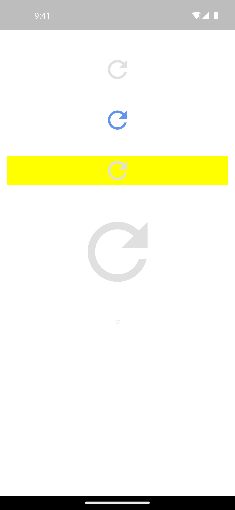</td><td>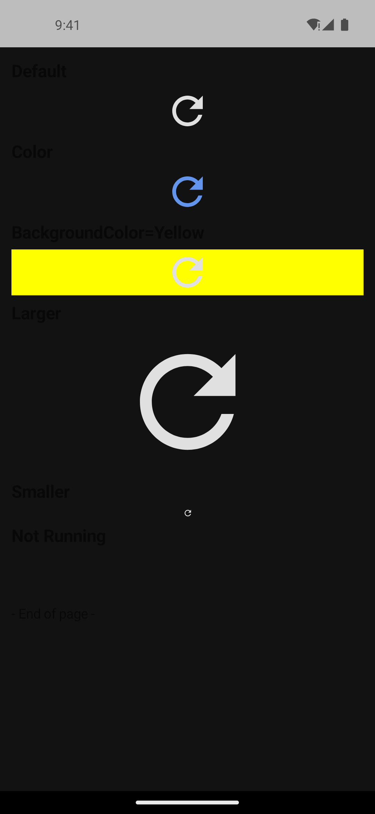</td><td>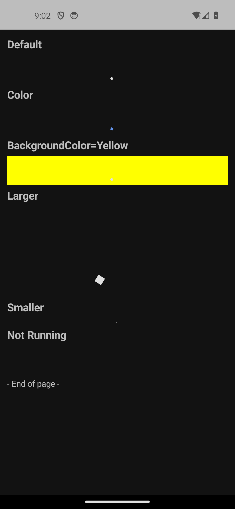</td></tr></table>

ports ActivityIndicatorPage.xaml (+ ActivityIndicatorPage.xaml.cs)

#### 🟡 Pixel-Perfect Score — C++ (C1/C3)

Light: SSIM 0.9897, 1.39% pixels differ · Dark: SSIM 0.9803, 1.47% pixels differ

#### 🟡 Pixel-Perfect Score — C++ &amp; XAML (C2/C4)

Light: SSIM 0.9897, 1.39% pixels differ · Dark: SSIM 0.9803, 1.47% pixels differ

### 3. Adaptive Collection — 🟢/🟢
adaptive_collection

<table><tr><th></th><th>MAUI</th><th>C++</th><th>C++ &amp; XAML</th></tr><tr><th>Light</th><td></td><td></td><td></td></tr><tr><th>Dark</th><td></td><td></td><td></td></tr></table>

ports AdaptiveCollectionView.xaml (+ .xaml.cs) (Maui.Controls.Sample.Pages.CollectionViewGalleries.AdaptiveCollectionView)

#### 🟢 Pixel-Perfect Score — C++ (C1/C3)

Light: SSIM 0.9976, 0.14% pixels differ · Dark: SSIM 0.9976, 0.16% pixels differ

#### 🟢 Pixel-Perfect Score — C++ &amp; XAML (C2/C4)

Light: SSIM 1.0000, 0.00% pixels differ · Dark: SSIM 1.0000, 0.00% pixels differ

### 4. Alerts — 🟢/🟢
alerts

<table><tr><th></th><th>MAUI</th><th>C++</th><th>C++ &amp; XAML</th></tr><tr><th>Light</th><td></td><td></td><td></td></tr><tr><th>Dark</th><td></td><td></td><td></td></tr></table>

ports AlertsPage.xaml (+ AlertsPage.xaml.cs) The C# AlertsPage drives the three Page dialog services — DisplayAlertAsync (simple OK + Yes/No), DisplayActionSheetAsync (simple + Cancel/Delete), and DisplayPromptAsync (two questions) — from a

#### 🟢 Pixel-Perfect Score — C++ (C1/C3)

Light: SSIM 1.0000, 0.00% pixels differ · Dark: SSIM 1.0000, 0.00% pixels differ

#### 🟢 Pixel-Perfect Score — C++ &amp; XAML (C2/C4)

Light: SSIM 1.0000, 0.00% pixels differ · Dark: SSIM 1.0000, 0.00% pixels differ

### 5. Alignment — 🟡/🟡
alignment

<table><tr><th></th><th>MAUI</th><th>C++</th><th>C++ &amp; XAML</th></tr><tr><th>Light</th><td></td><td></td><td></td></tr><tr><th>Dark</th><td></td><td></td><td></td></tr></table>

a faithful reproduction of the maui-compare &amp;quot;alignment&amp;quot; demo (ComparePages.Alignment()), the shipped-.NET-MAUI reference for the visual-parity comparison

#### 🟡 Pixel-Perfect Score — C++ (C1/C3)

Light: SSIM 0.9579, 1.75% pixels differ · Dark: SSIM 0.9820, 1.75% pixels differ

#### 🟡 Pixel-Perfect Score — C++ &amp; XAML (C2/C4)

Light: SSIM 0.9789, 1.01% pixels differ · Dark: SSIM 0.9840, 1.01% pixels differ

### 6. Animation — 🟡/🟡
animation

<table><tr><th></th><th>MAUI</th><th>C++</th><th>C++ &amp; XAML</th></tr><tr><th>Light</th><td></td><td></td><td></td></tr><tr><th>Dark</th><td></td><td></td><td></td></tr></table>

ports AnimationPage.xaml (+ AnimationPage.xaml.cs)

#### 🟡 Pixel-Perfect Score — C++ (C1/C3)

Light: SSIM 1.0000, 0.00% pixels differ · Dark: SSIM 0.9748, 4.26% pixels differ

#### 🟡 Pixel-Perfect Score — C++ &amp; XAML (C2/C4)

Light: SSIM 1.0000, 0.00% pixels differ · Dark: SSIM 0.9748, 4.26% pixels differ

### 7. App Theme Binding — 🟢/🟡
app_theme_binding

<table><tr><th></th><th>MAUI</th><th>C++</th><th>C++ &amp; XAML</th></tr><tr><th>Light</th><td></td><td></td><td></td></tr><tr><th>Dark</th><td></td><td></td><td></td></tr></table>

ports AppThemeBindingPage.xaml

#### 🟢 Pixel-Perfect Score — C++ (C1/C3)

Light: SSIM 1.0000, 0.00% pixels differ · Dark: SSIM 1.0000, 0.00% pixels differ

#### 🟡 Pixel-Perfect Score — C++ &amp; XAML (C2/C4)

Light: SSIM 1.0000, 0.00% pixels differ · Dark: SSIM 0.9928, 1.10% pixels differ

### 8. Application Control — 🟢/🟢
application_control

<table><tr><th></th><th>MAUI</th><th>C++</th><th>C++ &amp; XAML</th></tr><tr><th>Light</th><td></td><td></td><td></td></tr><tr><th>Dark</th><td></td><td></td><td></td></tr></table>

ports ApplicationControlPage.xaml (+ .xaml.cs)

#### 🟢 Pixel-Perfect Score — C++ (C1/C3)

Light: SSIM 1.0000, 0.00% pixels differ · Dark: SSIM 1.0000, 0.00% pixels differ

#### 🟢 Pixel-Perfect Score — C++ &amp; XAML (C2/C4)

Light: SSIM 1.0000, 0.00% pixels differ · Dark: SSIM 1.0000, 0.00% pixels differ

### 9. Auto Size Shapes — 🟢/🟢
auto_size_shapes

<table><tr><th></th><th>MAUI</th><th>C++</th><th>C++ &amp; XAML</th></tr><tr><th>Light</th><td></td><td></td><td></td></tr><tr><th>Dark</th><td></td><td></td><td></td></tr></table>

ports AutoSizeShapesGallery.xaml A code-first port of the MAUI Shapes sub-gallery Pages/Controls/ShapesGalleries/AutoSizeShapesGallery.xaml: a 3-row Grid (RowSpacing 0) that proves a stroked Ellipse auto-sizes to fill exactly half of the av

#### 🟢 Pixel-Perfect Score — C++ (C1/C3)

Light: SSIM 1.0000, 0.00% pixels differ · Dark: SSIM 1.0000, 0.00% pixels differ

#### 🟢 Pixel-Perfect Score — C++ &amp; XAML (C2/C4)

Light: SSIM 1.0000, 0.00% pixels differ · Dark: SSIM 1.0000, 0.00% pixels differ

### 10. Basic Grouping — 🟢/🟢
basic_grouping

<table><tr><th></th><th>MAUI</th><th>C++</th><th>C++ &amp; XAML</th></tr><tr><th>Light</th><td></td><td></td><td></td></tr><tr><th>Dark</th><td></td><td></td><td></td></tr></table>

ports GroupingGalleries/BasicGrouping.xaml (+ .xaml.cs) of the C# CollectionView gallery

#### 🟢 Pixel-Perfect Score — C++ (C1/C3)

Light: SSIM 0.9930, 0.18% pixels differ · Dark: SSIM 0.9924, 0.18% pixels differ

#### 🟢 Pixel-Perfect Score — C++ &amp; XAML (C2/C4)

Light: SSIM 1.0000, 0.00% pixels differ · Dark: SSIM 0.9999, 0.00% pixels differ

### 11. Basic Swipe — 🟢/🟢
basic_swipe

<table><tr><th></th><th>MAUI</th><th>C++</th><th>C++ &amp; XAML</th></tr><tr><th>Light</th><td></td><td></td><td></td></tr><tr><th>Dark</th><td></td><td></td><td></td></tr></table>

ports BasicSwipeGallery.xaml A code-first port of the MAUI SwipeView sub-gallery Pages/Controls/SwipeViewGalleries/BasicSwipeGallery.xaml: a vertical StackLayout of five SwipeViews, each demonstrating a different revealed-side / SwipeMode c

#### 🟢 Pixel-Perfect Score — C++ (C1/C3)

Light: SSIM 1.0000, 0.00% pixels differ · Dark: SSIM 1.0000, 0.00% pixels differ

#### 🟢 Pixel-Perfect Score — C++ &amp; XAML (C2/C4)

Light: SSIM 1.0000, 0.00% pixels differ · Dark: SSIM 1.0000, 0.00% pixels differ

### 12. Behaviors — 🟢/🟢
behaviors

<table><tr><th></th><th>MAUI</th><th>C++</th><th>C++ &amp; XAML</th></tr><tr><th>Light</th><td></td><td></td><td></td></tr><tr><th>Dark</th><td></td><td></td><td></td></tr></table>

ports BehaviorsPage.xaml (+ .xaml.cs) and its companion Controls.Sample/Behaviors/NumericValidationBehavior.cs

#### 🟢 Pixel-Perfect Score — C++ (C1/C3)

Light: SSIM 1.0000, 0.00% pixels differ · Dark: SSIM 1.0000, 0.00% pixels differ

#### 🟢 Pixel-Perfect Score — C++ &amp; XAML (C2/C4)

Light: SSIM 1.0000, 0.00% pixels differ · Dark: SSIM 1.0000, 0.00% pixels differ

### 13. Border — 🟡/🟡
border

<table><tr><th></th><th>MAUI</th><th>C++</th><th>C++ &amp; XAML</th></tr><tr><th>Light</th><td></td><td></td><td></td></tr><tr><th>Dark</th><td></td><td></td><td></td></tr></table>

a faithful reproduction of the maui-compare &amp;quot;border&amp;quot; demo (ComparePages.BorderPage()), the shipped-.NET-MAUI reference for the visual-parity comparison: a single Border centered on the page — red 5pt stroke, a RoundRectangle StrokeShape (Co

#### 🟡 Pixel-Perfect Score — C++ (C1/C3)

Light: SSIM 0.9592, 3.55% pixels differ · Dark: SSIM 0.9626, 3.31% pixels differ

#### 🟡 Pixel-Perfect Score — C++ &amp; XAML (C2/C4)

Light: SSIM 0.9592, 3.55% pixels differ · Dark: SSIM 0.9626, 3.31% pixels differ

### 14. Border Clip Playground — 🟡/🟡
border_clip_playground

<table><tr><th></th><th>MAUI</th><th>C++</th><th>C++ &amp; XAML</th></tr><tr><th>Light</th><td></td><td></td><td></td></tr><tr><th>Dark</th><td></td><td></td><td></td></tr></table>

ports BorderClipPlayground.xaml (+ .xaml.cs) The C# page is an interactive Border-shape playground: a 100x100 Border (red stroke) clips an AspectFill Image (oasis.jpg) into the currently selected StrokeShape, while controls below mutate the

#### 🟡 Pixel-Perfect Score — C++ (C1/C3)

Light: SSIM 0.9541, 2.89% pixels differ · Dark: SSIM 0.9675, 2.02% pixels differ

#### 🟡 Pixel-Perfect Score — C++ &amp; XAML (C2/C4)

Light: SSIM 0.9588, 2.31% pixels differ · Dark: SSIM 0.9723, 1.43% pixels differ

### 15. Border Layout — 🟢/🟢
border_layout

<table><tr><th></th><th>MAUI</th><th>C++</th><th>C++ &amp; XAML</th></tr><tr><th>Light</th><td></td><td></td><td></td></tr><tr><th>Dark</th><td></td><td></td><td></td></tr></table>

ports BorderLayout.xaml (+ BorderLayout.xaml.cs) The C# page demonstrates driving Border.StrokeThickness from a Slider: a Slider (0..40, set to 5 in OnAppearing) is bound to the Border&amp;#x27;s StrokeThickness; the Border (Silver stroke, White bac

#### 🟢 Pixel-Perfect Score — C++ (C1/C3)

Light: SSIM 0.9948, 0.20% pixels differ · Dark: SSIM 0.9941, 0.28% pixels differ

#### 🟢 Pixel-Perfect Score — C++ &amp; XAML (C2/C4)

Light: SSIM 0.9948, 0.20% pixels differ · Dark: SSIM 0.9941, 0.28% pixels differ

### 16. Border Playground — 🟡/🟡
border_playground

<table><tr><th></th><th>MAUI</th><th>C++</th><th>C++ &amp; XAML</th></tr><tr><th>Light</th><td></td><td></td><td></td></tr><tr><th>Dark</th><td></td><td></td><td></td></tr></table>

ports BorderPlayground.xaml (+ BorderPlayground.xaml.cs) A self-contained, code-first interactive Border playground

#### 🟡 Pixel-Perfect Score — C++ (C1/C3)

Light: SSIM 0.9660, 2.45% pixels differ · Dark: SSIM 0.9641, 1.73% pixels differ

#### 🟡 Pixel-Perfect Score — C++ &amp; XAML (C2/C4)

Light: SSIM 0.9657, 2.20% pixels differ · Dark: SSIM 0.9646, 1.45% pixels differ

### 17. Border Resize Content — 🟡/🟡
border_resize_content

<table><tr><th></th><th>MAUI</th><th>C++</th><th>C++ &amp; XAML</th></tr><tr><th>Light</th><td></td><td></td><td></td></tr><tr><th>Dark</th><td></td><td></td><td></td></tr></table>

ports BorderResizeContent.xaml A self-contained, code-first demo that resizes a Border&amp;#x27;s CONTENT and watches the Border track it

#### 🟡 Pixel-Perfect Score — C++ (C1/C3)

Light: SSIM 0.9762, 1.75% pixels differ · Dark: SSIM 0.9731, 1.81% pixels differ

#### 🟡 Pixel-Perfect Score — C++ &amp; XAML (C2/C4)

Light: SSIM 0.9789, 3.32% pixels differ · Dark: SSIM 0.9595, 3.37% pixels differ

### 18. Border Stroke — 🟡/🟡
border_stroke

<table><tr><th></th><th>MAUI</th><th>C++</th><th>C++ &amp; XAML</th></tr><tr><th>Light</th><td></td><td></td><td></td></tr><tr><th>Dark</th><td></td><td></td><td></td></tr></table>

ports BorderStroke.xaml (+ BorderStroke.xaml.cs) A self-contained, code-first demo of Border StrokeThickness and how a Border tracks the height of its content

#### 🟡 Pixel-Perfect Score — C++ (C1/C3)

Light: SSIM 0.9235, 3.37% pixels differ · Dark: SSIM 0.9351, 3.43% pixels differ

#### 🟡 Pixel-Perfect Score — C++ &amp; XAML (C2/C4)

Light: SSIM 0.9235, 3.37% pixels differ · Dark: SSIM 0.9351, 3.43% pixels differ

### 19. Borderless — 🟢/🟢
borderless

<table><tr><th></th><th>MAUI</th><th>C++</th><th>C++ &amp; XAML</th></tr><tr><th>Light</th><td></td><td></td><td></td></tr><tr><th>Dark</th><td></td><td></td><td></td></tr></table>

ports Borderless.xaml A self-contained, code-first demo of a stroke-less Border

#### 🟢 Pixel-Perfect Score — C++ (C1/C3)

Light: SSIM 1.0000, 0.00% pixels differ · Dark: SSIM 1.0000, 0.00% pixels differ

#### 🟢 Pixel-Perfect Score — C++ &amp; XAML (C2/C4)

Light: SSIM 1.0000, 0.00% pixels differ · Dark: SSIM 1.0000, 0.00% pixels differ

### 20. Box View — 🟢/🟢
box_view

<table><tr><th></th><th>MAUI</th><th>C++</th><th>C++ &amp; XAML</th></tr><tr><th>Light</th><td></td><td></td><td></td></tr><tr><th>Dark</th><td>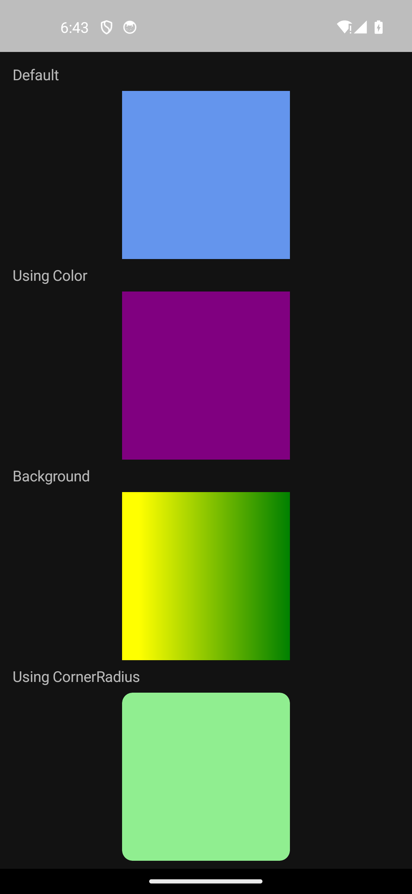</td><td>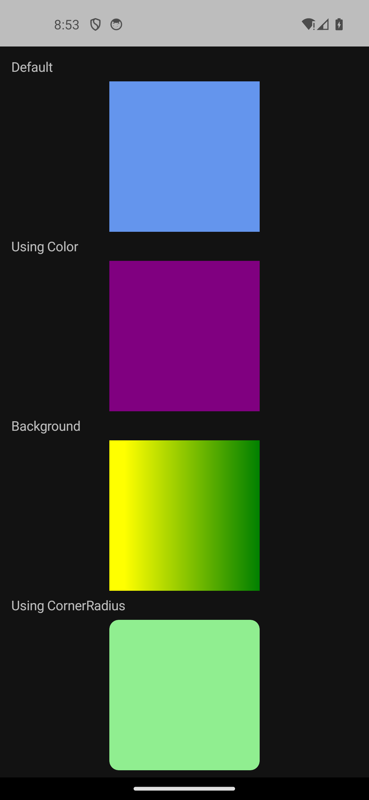</td><td></td></tr></table>

ports BoxViewPage.xaml (+ BoxViewPage.xaml.cs)

#### 🟢 Pixel-Perfect Score — C++ (C1/C3)

Light: SSIM 0.9957, 0.53% pixels differ · Dark: SSIM 1.0000, 0.00% pixels differ

#### 🟢 Pixel-Perfect Score — C++ &amp; XAML (C2/C4)

Light: SSIM 0.9957, 0.53% pixels differ · Dark: SSIM 1.0000, 0.00% pixels differ

### 21. Button — 🟡/🟡
button

<table><tr><th></th><th>MAUI</th><th>C++</th><th>C++ &amp; XAML</th></tr><tr><th>Light</th><td></td><td></td><td></td></tr><tr><th>Dark</th><td>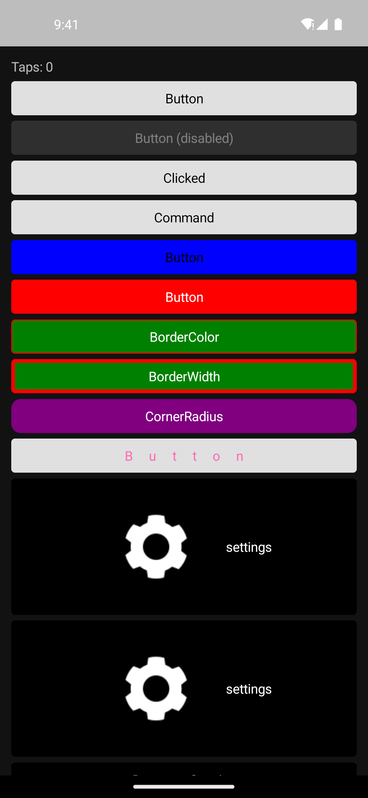</td><td></td><td></td></tr></table>

ports ButtonPage.xaml (+ ButtonPage.xaml.cs)

#### 🟡 Pixel-Perfect Score — C++ (C1/C3)

Light: SSIM 0.9394, 3.73% pixels differ · Dark: SSIM 0.9441, 1.33% pixels differ

#### 🟡 Pixel-Perfect Score — C++ &amp; XAML (C2/C4)

Light: SSIM 0.9394, 3.73% pixels differ · Dark: SSIM 0.9441, 1.33% pixels differ

### 22. Carousel Page — 🟢/🟢
carousel_page

<table><tr><th></th><th>MAUI</th><th>C++</th><th>C++ &amp; XAML</th></tr><tr><th>Light</th><td></td><td></td><td></td></tr><tr><th>Dark</th><td>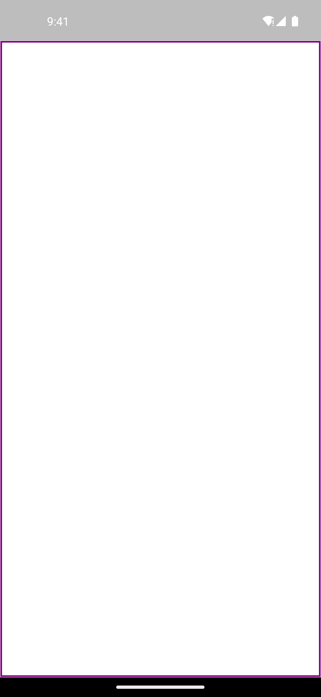</td><td>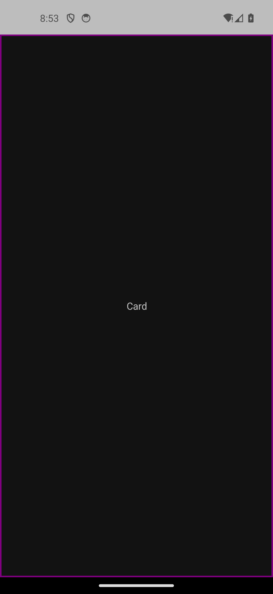</td><td></td></tr></table>

Carousel Page

#### 🟢 Pixel-Perfect Score — C++ (C1/C3)

Light: SSIM 0.9845, 0.72% pixels differ · Dark: SSIM 0.9892, 0.72% pixels differ

#### 🟢 Pixel-Perfect Score — C++ &amp; XAML (C2/C4)

Light: SSIM 0.9845, 0.72% pixels differ · Dark: SSIM 0.9892, 0.72% pixels differ

### 23. Chat Example — 🟢/🟢
chat_example

<table><tr><th></th><th>MAUI</th><th>C++</th><th>C++ &amp; XAML</th></tr><tr><th>Light</th><td></td><td></td><td></td></tr><tr><th>Dark</th><td></td><td></td><td></td></tr></table>

ports ChatExample.xaml (+ .xaml.cs) (Maui.Controls.Sample.Pages.CollectionViewGalleries.ItemSizeGalleries.ChatExample), tracking the maui-compare reference demo ~/maui-compare/Pages/ChatExamplePage.cs (the visual-parity oracle)

#### 🟢 Pixel-Perfect Score — C++ (C1/C3)

Light: SSIM 1.0000, 0.00% pixels differ · Dark: SSIM 1.0000, 0.00% pixels differ

#### 🟢 Pixel-Perfect Score — C++ &amp; XAML (C2/C4)

Light: SSIM 1.0000, 0.00% pixels differ · Dark: SSIM 1.0000, 0.00% pixels differ

### 24. Check Box — 🟢/🟢
check_box

<table><tr><th></th><th>MAUI</th><th>C++</th><th>C++ &amp; XAML</th></tr><tr><th>Light</th><td></td><td></td><td></td></tr><tr><th>Dark</th><td>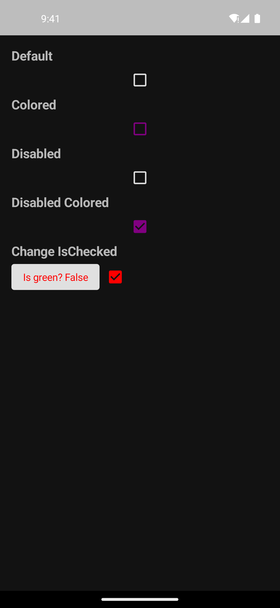</td><td></td><td>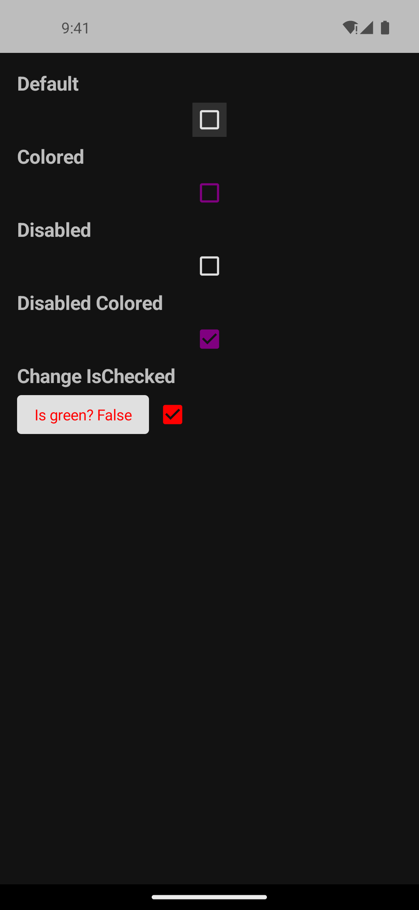</td></tr></table>

ports CheckBoxPage.xaml (+ .xaml.cs) Mirrors the MAUI gallery page: a vertical stack of headlined CheckBox states — Default, Colored (Color=Purple), Disabled, Disabled+Colored+Checked — followed by a &amp;quot;Change IsChecked&amp;quot; row pairing a Button

#### 🟢 Pixel-Perfect Score — C++ (C1/C3)

Light: SSIM 0.9984, 0.09% pixels differ · Dark: SSIM 0.9986, 0.09% pixels differ

#### 🟢 Pixel-Perfect Score — C++ &amp; XAML (C2/C4)

Light: SSIM 1.0000, 0.00% pixels differ · Dark: SSIM 1.0000, 0.00% pixels differ

### 25. Chrome — 🟢/🟢
chrome

<table><tr><th></th><th>MAUI</th><th>C++</th><th>C++ &amp; XAML</th></tr><tr><th>Light</th><td></td><td></td><td></td></tr><tr><th>Dark</th><td>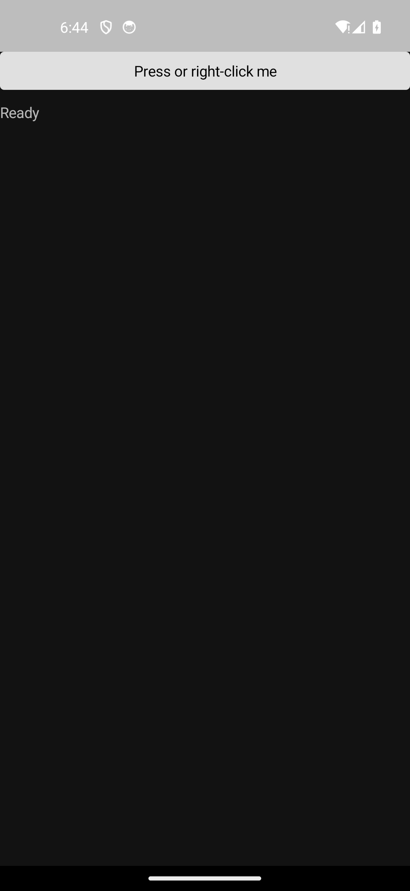</td><td></td><td>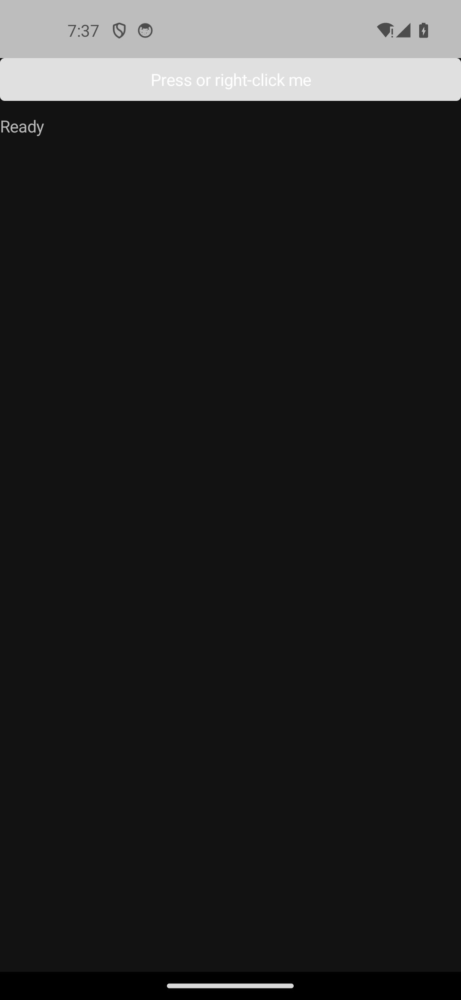</td></tr></table>

a self-contained demo page for the W1-11 window-chrome family: page toolbar items (primary + secondary), a menu bar (File menu with items, a separator and a sub-menu), a context flyout (right-click menu) on a button, and a tooltip — all wir

#### 🟢 Pixel-Perfect Score — C++ (C1/C3)

Light: SSIM 1.0000, 0.00% pixels differ · Dark: SSIM 1.0000, 0.00% pixels differ

#### 🟢 Pixel-Perfect Score — C++ &amp; XAML (C2/C4)

Light: SSIM 1.0000, 0.00% pixels differ · Dark: SSIM 1.0000, 0.00% pixels differ

### 26. Clip — 🟡/🟡
clip

<table><tr><th></th><th>MAUI</th><th>C++</th><th>C++ &amp; XAML</th></tr><tr><th>Light</th><td></td><td></td><td></td></tr><tr><th>Dark</th><td>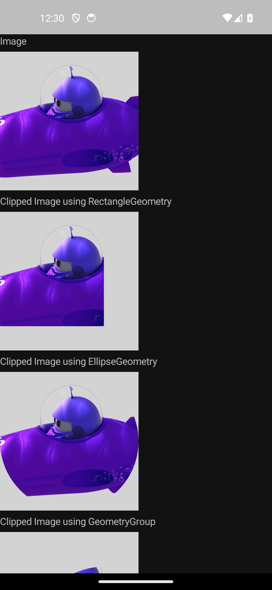</td><td></td><td>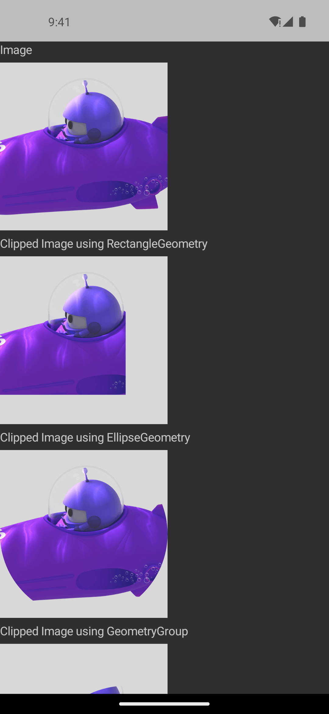</td></tr></table>

ports ClipPage.xaml The C# page (Pages/Core/ClipPage.xaml; its .xaml.cs is an empty InitializeComponent) is a ScrollView over a StackLayout that shows the SAME dotnet_bot.png image five times, each successive copy carrying a different geome

#### 🟡 Pixel-Perfect Score — C++ (C1/C3)

Light: SSIM 0.9879, 1.01% pixels differ · Dark: SSIM 0.9883, 0.31% pixels differ

#### 🟡 Pixel-Perfect Score — C++ &amp; XAML (C2/C4)

Light: SSIM 0.9879, 1.01% pixels differ · Dark: SSIM 0.9883, 0.31% pixels differ

### 27. Clip Corner Radius — 🟢/🟢
clip_corner_radius

<table><tr><th></th><th>MAUI</th><th>C++</th><th>C++ &amp; XAML</th></tr><tr><th>Light</th><td></td><td></td><td></td></tr><tr><th>Dark</th><td></td><td></td><td></td></tr></table>

ports ClipCornerRadiusGallery.xaml (+ .xaml.cs) The C# page (Pages/Controls/ShapesGalleries/ClipCornerRadiusGallery.xaml) is a StackLayout (Padding=12) that demonstrates DRIVING a RoundRectangleGeometry&amp;#x27;s per-corner CornerRadius from four s

#### 🟢 Pixel-Perfect Score — C++ (C1/C3)

Light: SSIM 0.9999, 0.00% pixels differ · Dark: SSIM 0.9997, 0.02% pixels differ

#### 🟢 Pixel-Perfect Score — C++ &amp; XAML (C2/C4)

Light: SSIM 0.9998, 0.00% pixels differ · Dark: SSIM 0.9997, 0.02% pixels differ

### 28. Clip Gallery — 🟢/🟢
clip_gallery

<table><tr><th></th><th>MAUI</th><th>C++</th><th>C++ &amp; XAML</th></tr><tr><th>Light</th><td></td><td></td><td></td></tr><tr><th>Dark</th><td>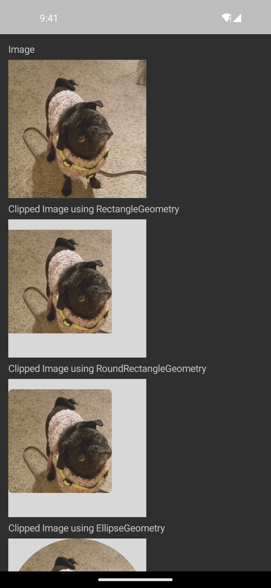</td><td></td><td>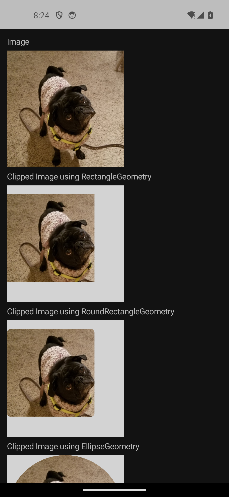</td></tr></table>

ports ClipGallery.xaml The C# page (Pages/Controls/ShapesGalleries/ClipGallery.xaml; its .xaml.cs is an empty InitializeComponent) is a ScrollView over a StackLayout (Padding=12) that shows the SAME &amp;quot;oasis.jpg&amp;quot; image SEVEN times — one bare

#### 🟢 Pixel-Perfect Score — C++ (C1/C3)

Light: SSIM 0.9954, 0.58% pixels differ · Dark: SSIM 1.0000, 0.00% pixels differ

#### 🟢 Pixel-Perfect Score — C++ &amp; XAML (C2/C4)

Light: SSIM 0.9954, 0.58% pixels differ · Dark: SSIM 1.0000, 0.00% pixels differ

### 29. Clip Views — 🟡/🟡
clip_views

<table><tr><th></th><th>MAUI</th><th>C++</th><th>C++ &amp; XAML</th></tr><tr><th>Light</th><td></td><td></td><td></td></tr><tr><th>Dark</th><td>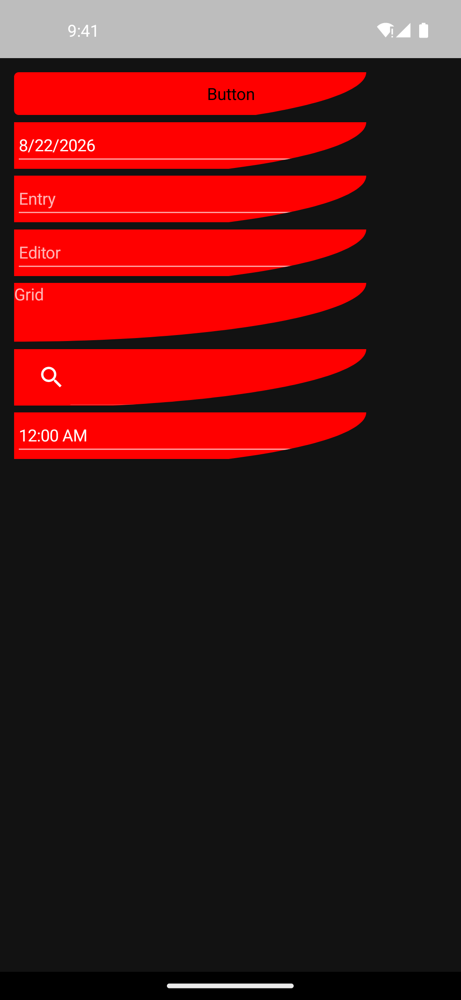</td><td></td><td>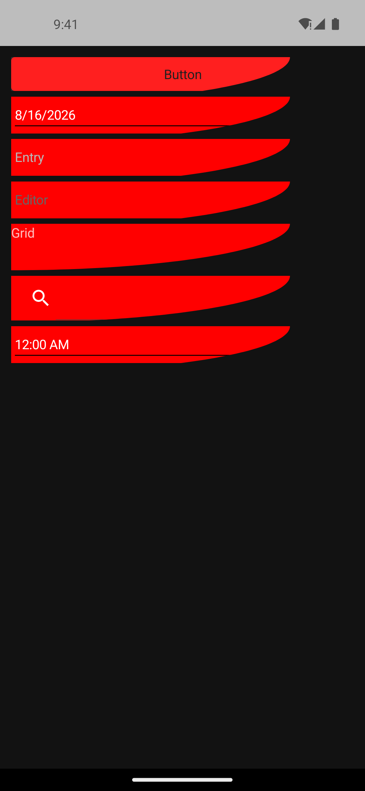</td></tr></table>

ports ClipViewsGallery.xaml The C# page (Pages/Controls/ShapesGalleries/ClipViewsGallery.xaml; no code-behind beyond an empty InitializeComponent) is a ScrollView over a StackLayout (Padding=12) that proves the Clip surface (VisualElement.C

#### 🟡 Pixel-Perfect Score — C++ (C1/C3)

Light: SSIM 0.9694, 4.31% pixels differ · Dark: SSIM 0.9754, 4.27% pixels differ

#### 🟡 Pixel-Perfect Score — C++ &amp; XAML (C2/C4)

Light: SSIM 0.9694, 4.31% pixels differ · Dark: SSIM 0.9754, 4.27% pixels differ

### 30. Clipping — 🟢/🟢
clipping

<table><tr><th></th><th>MAUI</th><th>C++</th><th>C++ &amp; XAML</th></tr><tr><th>Light</th><td></td><td></td><td></td></tr><tr><th>Dark</th><td></td><td></td><td></td></tr></table>

compare oracle ~/maui-compare/Pages/ClippingPage.cs (itself written to mirror this gallery page)

#### 🟢 Pixel-Perfect Score — C++ (C1/C3)

Light: SSIM 0.9877, 0.54% pixels differ · Dark: SSIM 0.9884, 0.56% pixels differ

#### 🟢 Pixel-Perfect Score — C++ &amp; XAML (C2/C4)

Light: SSIM 0.9877, 0.54% pixels differ · Dark: SSIM 0.9884, 0.56% pixels differ

### 31. Collectionview — 🟢/🟢
collectionview

<table><tr><th></th><th>MAUI</th><th>C++</th><th>C++ &amp; XAML</th></tr><tr><th>Light</th><td></td><td></td><td></td></tr><tr><th>Dark</th><td></td><td></td><td></td></tr></table>

a faithful reproduction of the maui-compare &amp;quot;collectionview&amp;quot; demo (ComparePages.CollectionViewPage()), the shipped-.NET-MAUI reference for the visual-parity comparison: a CollectionView over 24 captioned items, a string Header (&amp;quot;This is the

#### 🟢 Pixel-Perfect Score — C++ (C1/C3)

Light: SSIM 1.0000, 0.00% pixels differ · Dark: SSIM 0.9999, 0.00% pixels differ

#### 🟢 Pixel-Perfect Score — C++ &amp; XAML (C2/C4)

Light: SSIM 1.0000, 0.00% pixels differ · Dark: SSIM 0.9999, 0.00% pixels differ

### 32. Composition Gallery — 🟢/🟢
composition_gallery

<table><tr><th></th><th>MAUI</th><th>C++</th><th>C++ &amp; XAML</th></tr><tr><th>Light</th><td></td><td></td><td></td></tr><tr><th>Dark</th><td></td><td></td><td></td></tr></table>

ports CompositionGallery.xaml A self-contained, code-first port of the MAUI Shapes sub-gallery Pages/Controls/ShapesGalleries/CompositionGallery.xaml: a StackLayout holding two Beige 250x250 Grids (Margin 12) that compose multiple overlappi

#### 🟢 Pixel-Perfect Score — C++ (C1/C3)

Light: SSIM 1.0000, 0.00% pixels differ · Dark: SSIM 1.0000, 0.00% pixels differ

#### 🟢 Pixel-Perfect Score — C++ &amp; XAML (C2/C4)

Light: SSIM 1.0000, 0.00% pixels differ · Dark: SSIM 1.0000, 0.00% pixels differ

### 33. Containers — 🟢/🟢
containers

<table><tr><th></th><th>MAUI</th><th>C++</th><th>C++ &amp; XAML</th></tr><tr><th>Light</th><td></td><td></td><td></td></tr><tr><th>Dark</th><td></td><td></td><td></td></tr></table>

a self-contained demo page for the W1-07 container set: a scroll_view hosting a vertical stack of content-hosting containers — a border-framed label (stroke + dashed outline + rounded shape), a legacy frame (BorderColor/CornerRadius/HasShad

#### 🟢 Pixel-Perfect Score — C++ (C1/C3)

Light: SSIM 0.9882, 0.46% pixels differ · Dark: SSIM 0.9895, 0.41% pixels differ

#### 🟢 Pixel-Perfect Score — C++ &amp; XAML (C2/C4)

Light: SSIM 0.9882, 0.46% pixels differ · Dark: SSIM 0.9895, 0.41% pixels differ

### 34. Content View — 🟢/🟢
content_view

<table><tr><th></th><th>MAUI</th><th>C++</th><th>C++ &amp; XAML</th></tr><tr><th>Light</th><td></td><td></td><td></td></tr><tr><th>Dark</th><td></td><td></td><td></td></tr></table>

ports ContentViewPage.xaml (+ ContentViewPage.xaml.cs), code-first

#### 🟢 Pixel-Perfect Score — C++ (C1/C3)

Light: SSIM 1.0000, 0.00% pixels differ · Dark: SSIM 1.0000, 0.00% pixels differ

#### 🟢 Pixel-Perfect Score — C++ &amp; XAML (C2/C4)

Light: SSIM 1.0000, 0.00% pixels differ · Dark: SSIM 1.0000, 0.00% pixels differ

### 35. Context Flyout — 🔴/🔴
context_flyout

<table><tr><th></th><th>MAUI</th><th>C++</th><th>C++ &amp; XAML</th></tr><tr><th>Light</th><td></td><td></td><td></td></tr><tr><th>Dark</th><td></td><td></td><td></td></tr></table>

ports ContextFlyoutPage.xaml (+ ContextFlyoutPage.xaml.cs) The C# page attaches a MenuFlyout as the FlyoutBase.ContextFlyout (right-click / long-press menu) of several controls and wires each menu item to a handler: - a Button (&amp;quot;Increment b

#### 🔴 Pixel-Perfect Score — C++ (C1/C3)

Light: SSIM 0.8823, 8.55% pixels differ · Dark: SSIM 0.1808, 95.79% pixels differ

#### 🔴 Pixel-Perfect Score — C++ &amp; XAML (C2/C4)

Light: SSIM 0.8823, 8.55% pixels differ · Dark: SSIM 0.1808, 95.79% pixels differ

### 36. Controls Stack — 🟢/🟢
controls_stack

<table><tr><th></th><th>MAUI</th><th>C++</th><th>C++ &amp; XAML</th></tr><tr><th>Light</th><td></td><td></td><td></td></tr><tr><th>Dark</th><td>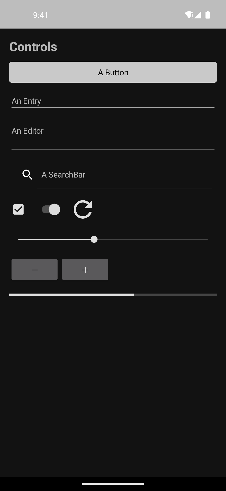</td><td></td><td>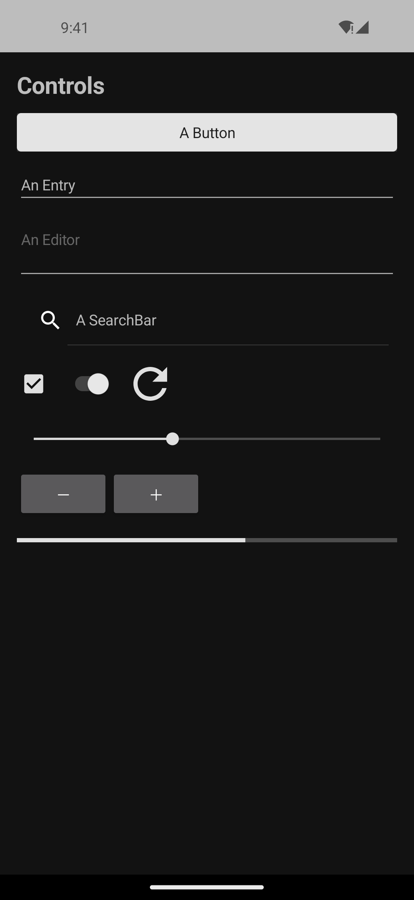</td></tr></table>

a faithful reproduction of the maui-compare &amp;quot;controls_stack&amp;quot; demo (ComparePages.ControlsStack()), the shipped-.NET-MAUI reference for the visual-parity comparison: a VerticalStackLayout (Spacing 12, Padding 16) showcasing the basic widgets

#### 🟢 Pixel-Perfect Score — C++ (C1/C3)

Light: SSIM 0.9856, 0.43% pixels differ · Dark: SSIM 0.9837, 0.53% pixels differ

#### 🟢 Pixel-Perfect Score — C++ &amp; XAML (C2/C4)

Light: SSIM 0.9856, 0.43% pixels differ · Dark: SSIM 0.9837, 0.53% pixels differ

### 37. Custom Layout — 🟢/🟢
custom_layout

<table><tr><th></th><th>MAUI</th><th>C++</th><th>C++ &amp; XAML</th></tr><tr><th>Light</th><td></td><td></td><td></td></tr><tr><th>Dark</th><td></td><td></td><td></td></tr></table>

ports CustomLayoutPage.xaml (+ CustomLayoutPage.xaml.cs)

#### 🟢 Pixel-Perfect Score — C++ (C1/C3)

Light: SSIM 1.0000, 0.00% pixels differ · Dark: SSIM 1.0000, 0.00% pixels differ

#### 🟢 Pixel-Perfect Score — C++ &amp; XAML (C2/C4)

Light: SSIM 1.0000, 0.00% pixels differ · Dark: SSIM 1.0000, 0.00% pixels differ

### 38. Custom Size Swipe — 🟢/🟢
custom_size_swipe

<table><tr><th></th><th>MAUI</th><th>C++</th><th>C++ &amp; XAML</th></tr><tr><th>Light</th><td></td><td></td><td></td></tr><tr><th>Dark</th><td></td><td></td><td></td></tr></table>

ports CustomSizeSwipeViewGallery.xaml (+ .xaml.cs) The MAUI CustomSizeSwipeViewGallery is a single SwipeView whose Left / Right / Top item collections each reveal CUSTOM-SIZED content: a SwipeItemView wrapping a Grid/StackLayout with an exp

#### 🟢 Pixel-Perfect Score — C++ (C1/C3)

Light: SSIM 1.0000, 0.00% pixels differ · Dark: SSIM 1.0000, 0.00% pixels differ

#### 🟢 Pixel-Perfect Score — C++ &amp; XAML (C2/C4)

Light: SSIM 1.0000, 0.00% pixels differ · Dark: SSIM 1.0000, 0.00% pixels differ

### 39. Custom Swipe Item View — 🟢/🟢
custom_swipe_item_view

<table><tr><th></th><th>MAUI</th><th>C++</th><th>C++ &amp; XAML</th></tr><tr><th>Light</th><td></td><td></td><td></td></tr><tr><th>Dark</th><td></td><td></td><td></td></tr></table>

ports CustomSwipeItemViewGallery.xaml A self-contained, code-first port of the .NET MAUI &amp;quot;CustomSwipeItem&amp;quot; gallery: a message-list row whose right swipe reveals a CUSTOM-content swipe item (a swipe_item_view, not a plain swipe_item)

#### 🟢 Pixel-Perfect Score — C++ (C1/C3)

Light: SSIM 1.0000, 0.00% pixels differ · Dark: SSIM 1.0000, 0.00% pixels differ

#### 🟢 Pixel-Perfect Score — C++ &amp; XAML (C2/C4)

Light: SSIM 1.0000, 0.00% pixels differ · Dark: SSIM 1.0000, 0.00% pixels differ

### 40. Cv Visual States — 🟢/🟢
cv_visual_states

<table><tr><th></th><th>MAUI</th><th>C++</th><th>C++ &amp; XAML</th></tr><tr><th>Light</th><td></td><td></td><td></td></tr><tr><th>Dark</th><td></td><td></td><td></td></tr></table>

ports CollectionViewGalleries/SelectionGalleries/ VisualStatesGallery.xaml (+ .xaml.cs) of the C# CollectionView gallery

#### 🟢 Pixel-Perfect Score — C++ (C1/C3)

Light: SSIM 0.9834, 0.70% pixels differ · Dark: SSIM 0.9809, 0.69% pixels differ

#### 🟢 Pixel-Perfect Score — C++ &amp; XAML (C2/C4)

Light: SSIM 0.9834, 0.70% pixels differ · Dark: SSIM 0.9809, 0.69% pixels differ

### 41. Data Template Selector — 🟢/🟢
data_template_selector

<table><tr><th></th><th>MAUI</th><th>C++</th><th>C++ &amp; XAML</th></tr><tr><th>Light</th><td></td><td></td><td></td></tr><tr><th>Dark</th><td>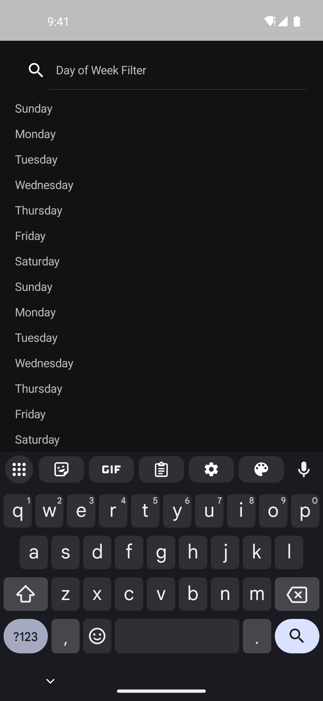</td><td>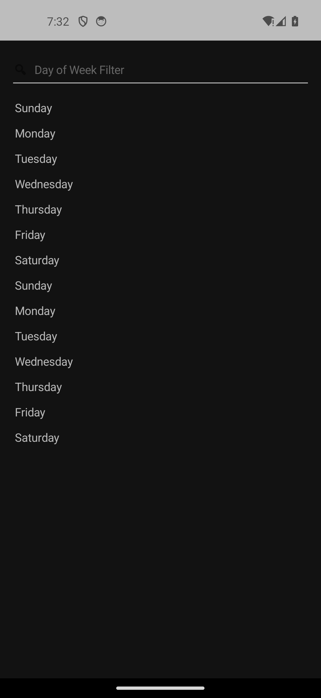</td><td>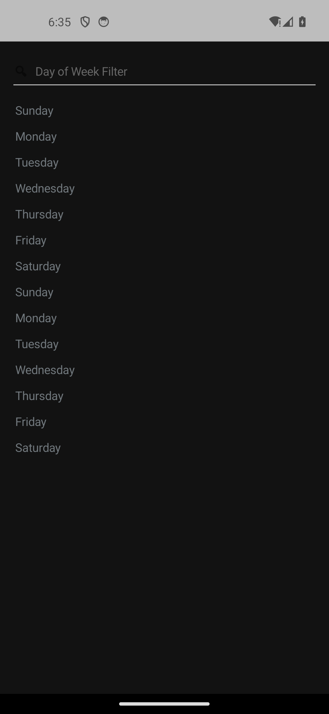</td></tr></table>

ports DataTemplateSelectorGallery.xaml (+ DataTemplateSelectorGallery.xaml.cs, including its WeekendSelector + SearchTermSelector classes)

#### 🟢 Pixel-Perfect Score — C++ (C1/C3)

Light: SSIM 0.9865, 0.37% pixels differ · Dark: SSIM 0.9854, 0.41% pixels differ

#### 🟢 Pixel-Perfect Score — C++ &amp; XAML (C2/C4)

Light: SSIM 0.9865, 0.37% pixels differ · Dark: SSIM 0.9854, 0.41% pixels differ

### 42. Date Picker — 🟡/🟡
date_picker

<table><tr><th></th><th>MAUI</th><th>C++</th><th>C++ &amp; XAML</th></tr><tr><th>Light</th><td></td><td></td><td></td></tr><tr><th>Dark</th><td></td><td></td><td></td></tr></table>

ports DatePickerPage.xaml (+ DatePickerPage.xaml.cs)

#### 🟡 Pixel-Perfect Score — C++ (C1/C3)

Light: SSIM 0.9848, 1.61% pixels differ · Dark: SSIM 0.9697, 0.75% pixels differ

#### 🟡 Pixel-Perfect Score — C++ &amp; XAML (C2/C4)

Light: SSIM 0.9848, 1.61% pixels differ · Dark: SSIM 0.9697, 0.75% pixels differ

### 43. Device — 🟢/🟢
device

<table><tr><th></th><th>MAUI</th><th>C++</th><th>C++ &amp; XAML</th></tr><tr><th>Light</th><td></td><td></td><td></td></tr><tr><th>Dark</th><td></td><td></td><td></td></tr></table>

ports DevicePage.xaml

#### 🟢 Pixel-Perfect Score — C++ (C1/C3)

Light: SSIM 0.9884, 0.43% pixels differ · Dark: SSIM 0.9881, 0.47% pixels differ

#### 🟢 Pixel-Perfect Score — C++ &amp; XAML (C2/C4)

Light: SSIM 1.0000, 0.00% pixels differ · Dark: SSIM 1.0000, 0.00% pixels differ

### 44. Dispatcher — 🟢/🟢
dispatcher

<table><tr><th></th><th>MAUI</th><th>C++</th><th>C++ &amp; XAML</th></tr><tr><th>Light</th><td></td><td></td><td></td></tr><tr><th>Dark</th><td></td><td></td><td></td></tr></table>

ports DispatcherPage.xaml (+ .xaml.cs)

#### 🟢 Pixel-Perfect Score — C++ (C1/C3)

Light: SSIM 1.0000, 0.00% pixels differ · Dark: SSIM 0.9999, 0.00% pixels differ

#### 🟢 Pixel-Perfect Score — C++ &amp; XAML (C2/C4)

Light: SSIM 1.0000, 0.00% pixels differ · Dark: SSIM 0.9999, 0.00% pixels differ

### 45. Drag Drop — 🟢/🟢
drag_drop

<table><tr><th></th><th>MAUI</th><th>C++</th><th>C++ &amp; XAML</th></tr><tr><th>Light</th><td></td><td></td><td></td></tr><tr><th>Dark</th><td></td><td></td><td></td></tr></table>

ports DragAndDropBetweenLayouts.xaml (+ .xaml.cs) (Maui.Controls.Sample.Pages.DragAndDropBetweenLayouts)

#### 🟢 Pixel-Perfect Score — C++ (C1/C3)

Light: SSIM 1.0000, 0.00% pixels differ · Dark: SSIM 1.0000, 0.00% pixels differ

#### 🟢 Pixel-Perfect Score — C++ &amp; XAML (C2/C4)

Light: SSIM 1.0000, 0.00% pixels differ · Dark: SSIM 1.0000, 0.00% pixels differ

### 46. Editor — 🟢/🟢
editor

<table><tr><th></th><th>MAUI</th><th>C++</th><th>C++ &amp; XAML</th></tr><tr><th>Light</th><td></td><td></td><td></td></tr><tr><th>Dark</th><td>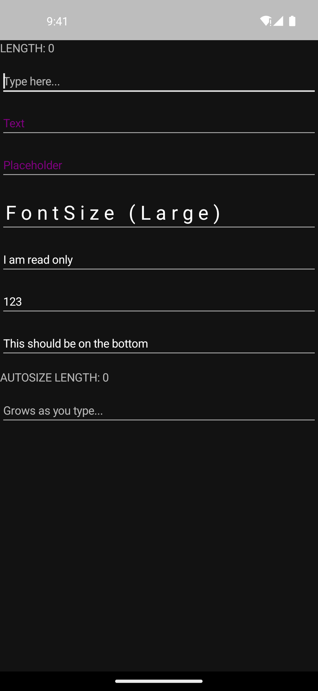</td><td>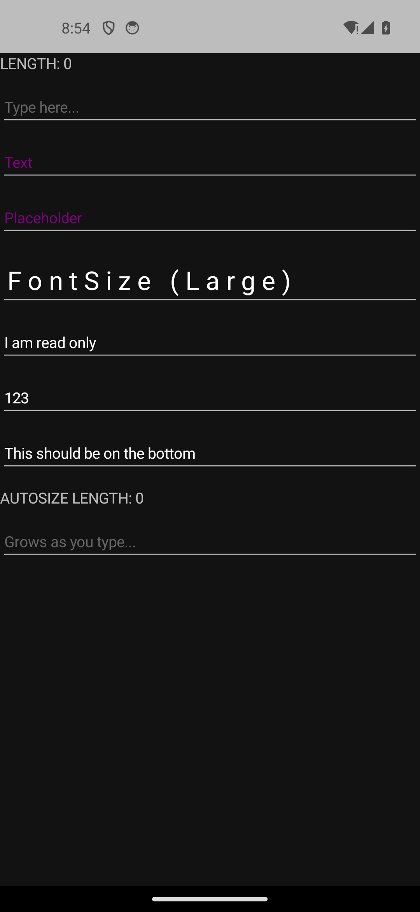</td><td>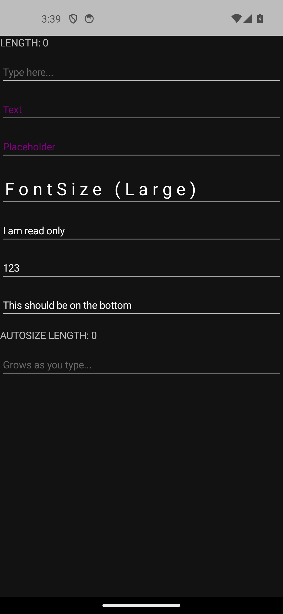</td></tr></table>

ports EditorPage.xaml (Microsoft.Maui.Controls sample gallery)

#### 🟢 Pixel-Perfect Score — C++ (C1/C3)

Light: SSIM 0.9997, 0.47% pixels differ · Dark: SSIM 0.9981, 0.21% pixels differ

#### 🟢 Pixel-Perfect Score — C++ &amp; XAML (C2/C4)

Light: SSIM 0.9997, 0.47% pixels differ · Dark: SSIM 0.9981, 0.21% pixels differ

### 47. Effects — 🟢/🟢
effects

<table><tr><th></th><th>MAUI</th><th>C++</th><th>C++ &amp; XAML</th></tr><tr><th>Light</th><td></td><td></td><td></td></tr><tr><th>Dark</th><td></td><td></td><td></td></tr></table>

ports EffectsPage.xaml (Maui.Controls.Sample.Pages.EffectsPage)

#### 🟢 Pixel-Perfect Score — C++ (C1/C3)

Light: SSIM 0.9999, 0.12% pixels differ · Dark: SSIM 1.0000, 0.00% pixels differ

#### 🟢 Pixel-Perfect Score — C++ &amp; XAML (C2/C4)

Light: SSIM 0.9999, 0.12% pixels differ · Dark: SSIM 1.0000, 0.00% pixels differ

### 48. Ellipse Gallery — 🟢/🟢
ellipse_gallery

<table><tr><th></th><th>MAUI</th><th>C++</th><th>C++ &amp; XAML</th></tr><tr><th>Light</th><td></td><td></td><td></td></tr><tr><th>Dark</th><td></td><td></td><td></td></tr></table>

ports EllipseGallery.xaml A self-contained, code-first port of the MAUI Shapes EllipseGallery (Pages/Controls/ShapesGalleries/EllipseGallery.xaml + .xaml.cs)

#### 🟢 Pixel-Perfect Score — C++ (C1/C3)

Light: SSIM 0.9877, 0.62% pixels differ · Dark: SSIM 0.9895, 0.63% pixels differ

#### 🟢 Pixel-Perfect Score — C++ &amp; XAML (C2/C4)

Light: SSIM 0.9877, 0.62% pixels differ · Dark: SSIM 0.9895, 0.63% pixels differ

### 49. Empty View — 🟢/🟢
empty_view

<table><tr><th></th><th>MAUI</th><th>C++</th><th>C++ &amp; XAML</th></tr><tr><th>Light</th><td></td><td></td><td></td></tr><tr><th>Dark</th><td></td><td></td><td></td></tr></table>

ports EmptyViewStringGallery.xaml (+ EmptyViewStringGallery.xaml.cs)

#### 🟢 Pixel-Perfect Score — C++ (C1/C3)

Light: SSIM 0.9890, 0.25% pixels differ · Dark: SSIM 0.9879, 0.29% pixels differ

#### 🟢 Pixel-Perfect Score — C++ &amp; XAML (C2/C4)

Light: SSIM 0.9890, 0.25% pixels differ · Dark: SSIM 0.9879, 0.29% pixels differ

### 50. Empty View Load Simulate — 🟢/🟢
empty_view_load_simulate

<table><tr><th></th><th>MAUI</th><th>C++</th><th>C++ &amp; XAML</th></tr><tr><th>Light</th><td></td><td></td><td></td></tr><tr><th>Dark</th><td></td><td></td><td></td></tr></table>

ports EmptyViewGalleries/EmptyViewLoadSimulateGallery.xaml (+ EmptyViewLoadSimulateGallery.xaml.cs)

#### 🟢 Pixel-Perfect Score — C++ (C1/C3)

Light: SSIM 0.9954, 0.20% pixels differ · Dark: SSIM 0.9954, 0.22% pixels differ

#### 🟢 Pixel-Perfect Score — C++ &amp; XAML (C2/C4)

Light: SSIM 0.9954, 0.20% pixels differ · Dark: SSIM 0.9954, 0.22% pixels differ

### 51. Empty View Null — 🟢/🟢
empty_view_null

<table><tr><th></th><th>MAUI</th><th>C++</th><th>C++ &amp; XAML</th></tr><tr><th>Light</th><td></td><td></td><td></td></tr><tr><th>Dark</th><td></td><td></td><td></td></tr></table>

ports EmptyViewGalleries/EmptyViewNullGallery.xaml (+ EmptyViewNullGallery.xaml.cs)

#### 🟢 Pixel-Perfect Score — C++ (C1/C3)

Light: SSIM 0.9960, 0.18% pixels differ · Dark: SSIM 0.9960, 0.19% pixels differ

#### 🟢 Pixel-Perfect Score — C++ &amp; XAML (C2/C4)

Light: SSIM 0.9960, 0.18% pixels differ · Dark: SSIM 0.9960, 0.19% pixels differ

### 52. Empty View Rtl — 🟢/🟢
empty_view_rtl

<table><tr><th></th><th>MAUI</th><th>C++</th><th>C++ &amp; XAML</th></tr><tr><th>Light</th><td></td><td></td><td></td></tr><tr><th>Dark</th><td>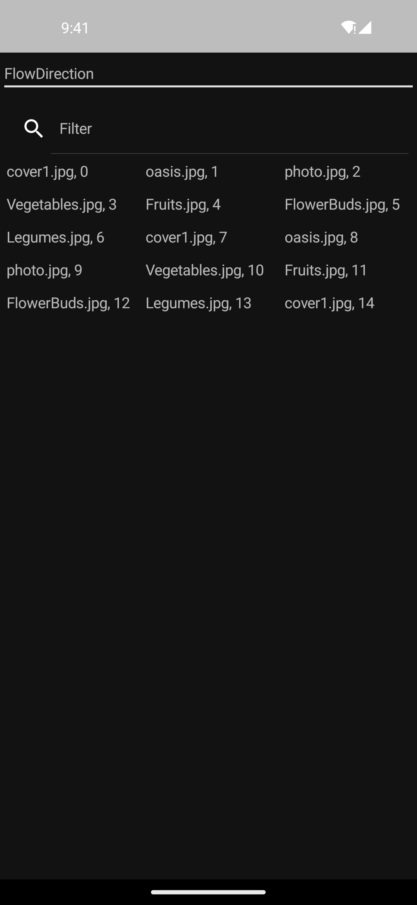</td><td>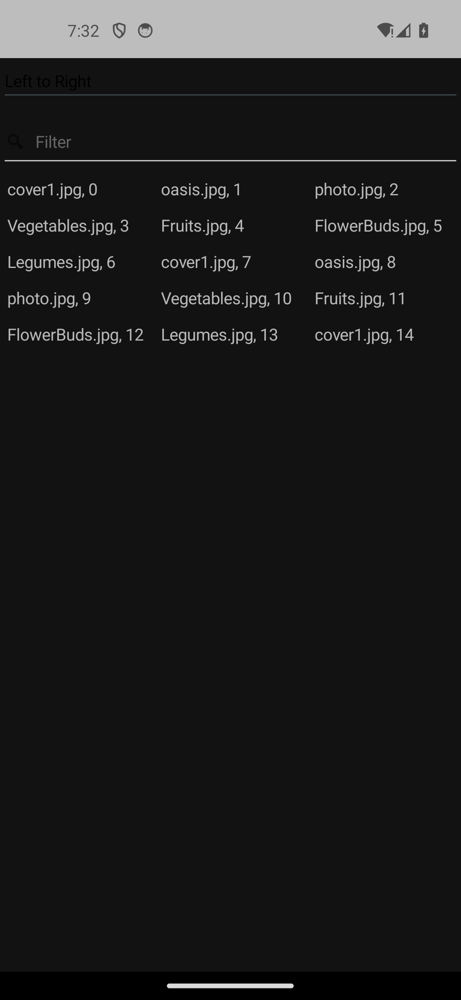</td><td>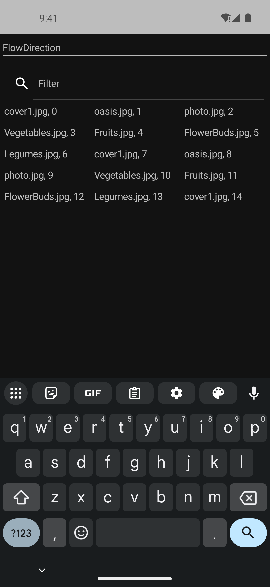</td></tr></table>

ports EmptyViewGalleries/EmptyViewRTLGallery.xaml (+ EmptyViewRTLGallery.xaml.cs)

#### 🟢 Pixel-Perfect Score — C++ (C1/C3)

Light: SSIM 0.9859, 0.48% pixels differ · Dark: SSIM 0.9848, 0.44% pixels differ

#### 🟢 Pixel-Perfect Score — C++ &amp; XAML (C2/C4)

Light: SSIM 0.9889, 0.34% pixels differ · Dark: SSIM 0.9879, 0.29% pixels differ

### 53. Empty View Selector — 🟢/🟢
empty_view_selector

<table><tr><th></th><th>MAUI</th><th>C++</th><th>C++ &amp; XAML</th></tr><tr><th>Light</th><td></td><td></td><td></td></tr><tr><th>Dark</th><td>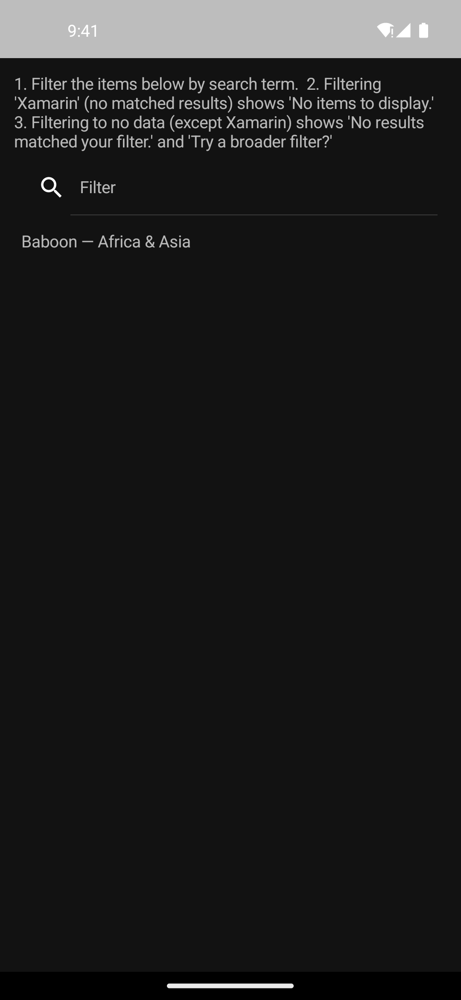</td><td>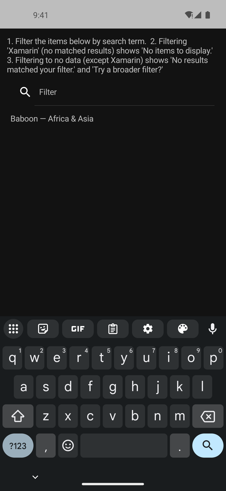</td><td>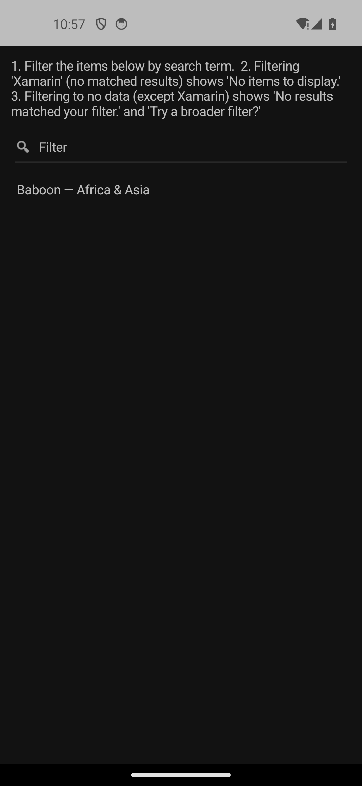</td></tr></table>

ports EmptyViewGalleries/EmptyViewWithDataTemplateSelector.xaml (+ .xaml.cs, incl

#### 🟢 Pixel-Perfect Score — C++ (C1/C3)

Light: SSIM 0.9895, 0.24% pixels differ · Dark: SSIM 0.9884, 0.28% pixels differ

#### 🟢 Pixel-Perfect Score — C++ &amp; XAML (C2/C4)

Light: SSIM 0.9895, 0.24% pixels differ · Dark: SSIM 0.9885, 0.28% pixels differ

### 54. Empty View Swap — 🟡/🟢
empty_view_swap

<table><tr><th></th><th>MAUI</th><th>C++</th><th>C++ &amp; XAML</th></tr><tr><th>Light</th><td></td><td></td><td></td></tr><tr><th>Dark</th><td></td><td></td><td></td></tr></table>

ports EmptyViewGalleries/EmptyViewSwapGallery.xaml (+ .xaml.cs)

#### 🟡 Pixel-Perfect Score — C++ (C1/C3)

Light: SSIM 0.9754, 0.71% pixels differ · Dark: SSIM 0.9738, 0.90% pixels differ

#### 🟢 Pixel-Perfect Score — C++ &amp; XAML (C2/C4)

Light: SSIM 0.9887, 0.30% pixels differ · Dark: SSIM 0.9875, 0.44% pixels differ

### 55. Empty View Template — 🟢/🟢
empty_view_template

<table><tr><th></th><th>MAUI</th><th>C++</th><th>C++ &amp; XAML</th></tr><tr><th>Light</th><td></td><td></td><td></td></tr><tr><th>Dark</th><td></td><td></td><td></td></tr></table>

ports EmptyViewGalleries/EmptyViewTemplateGallery.xaml (+ EmptyViewTemplateGallery.xaml.cs)

#### 🟢 Pixel-Perfect Score — C++ (C1/C3)

Light: SSIM 0.9895, 0.24% pixels differ · Dark: SSIM 0.9885, 0.28% pixels differ

#### 🟢 Pixel-Perfect Score — C++ &amp; XAML (C2/C4)

Light: SSIM 0.9895, 0.24% pixels differ · Dark: SSIM 0.9885, 0.28% pixels differ

### 56. Empty View View — 🟢/🟢
empty_view_view

<table><tr><th></th><th>MAUI</th><th>C++</th><th>C++ &amp; XAML</th></tr><tr><th>Light</th><td></td><td></td><td></td></tr><tr><th>Dark</th><td></td><td></td><td></td></tr></table>

ports EmptyViewGalleries/EmptyViewViewGallery.xaml (+ EmptyViewViewGallery.xaml.cs)

#### 🟢 Pixel-Perfect Score — C++ (C1/C3)

Light: SSIM 0.9895, 0.24% pixels differ · Dark: SSIM 0.9885, 0.28% pixels differ

#### 🟢 Pixel-Perfect Score — C++ &amp; XAML (C2/C4)

Light: SSIM 0.9895, 0.24% pixels differ · Dark: SSIM 0.9885, 0.28% pixels differ

### 57. Entry — 🟢/🟢
entry

<table><tr><th></th><th>MAUI</th><th>C++</th><th>C++ &amp; XAML</th></tr><tr><th>Light</th><td></td><td></td><td></td></tr><tr><th>Dark</th><td>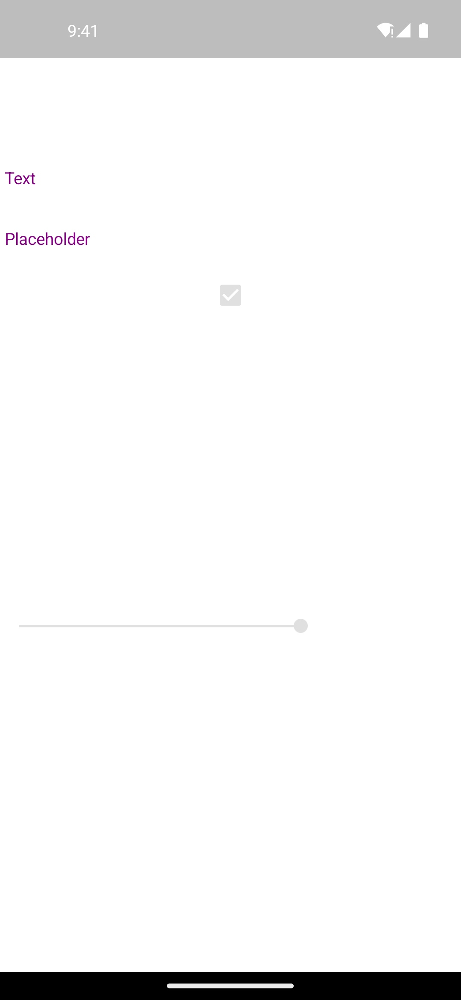</td><td>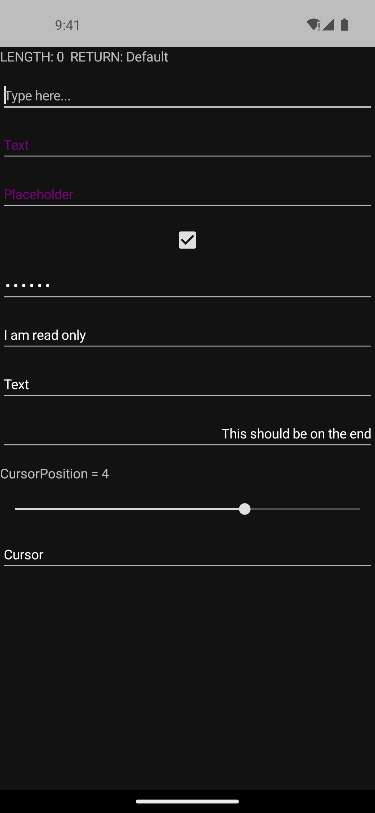</td><td>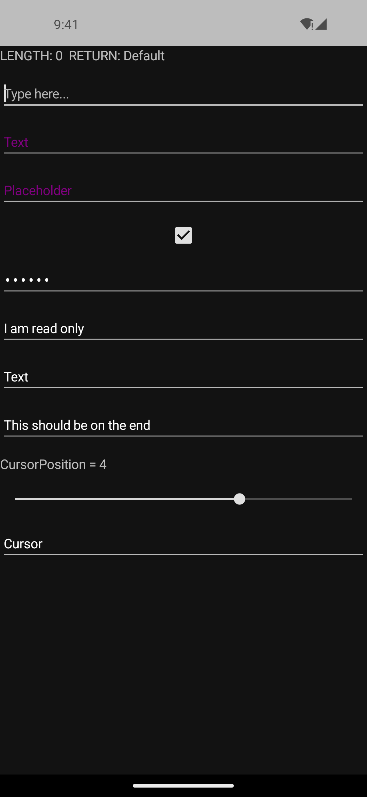</td></tr></table>

ports EntryPage.xaml (Microsoft.Maui.Controls sample gallery)

#### 🟢 Pixel-Perfect Score — C++ (C1/C3)

Light: SSIM 0.9872, 0.50% pixels differ · Dark: SSIM 0.9871, 0.42% pixels differ

#### 🟢 Pixel-Perfect Score — C++ &amp; XAML (C2/C4)

Light: SSIM 0.9872, 0.50% pixels differ · Dark: SSIM 0.9871, 0.42% pixels differ

### 58. Filter Collection — 🟢/🟢
filter_collection

<table><tr><th></th><th>MAUI</th><th>C++</th><th>C++ &amp; XAML</th></tr><tr><th>Light</th><td></td><td></td><td></td></tr><tr><th>Dark</th><td></td><td></td><td></td></tr></table>

ports FilterCollectionView.xaml (+ .xaml.cs) of the C# CollectionView gallery

#### 🟢 Pixel-Perfect Score — C++ (C1/C3)

Light: SSIM 0.9816, 0.47% pixels differ · Dark: SSIM 0.9800, 0.55% pixels differ

#### 🟢 Pixel-Perfect Score — C++ &amp; XAML (C2/C4)

Light: SSIM 0.9889, 0.25% pixels differ · Dark: SSIM 0.9875, 0.31% pixels differ

### 59. Filter Selection — 🟢/🟢
filter_selection

<table><tr><th></th><th>MAUI</th><th>C++</th><th>C++ &amp; XAML</th></tr><tr><th>Light</th><td></td><td></td><td></td></tr><tr><th>Dark</th><td></td><td></td><td></td></tr></table>

ports FilterSelection.xaml (+ .xaml.cs) (Maui.Controls.Sample.Pages.CollectionViewGalleries.SelectionGalleries.FilterSelection)

#### 🟢 Pixel-Perfect Score — C++ (C1/C3)

Light: SSIM 0.9895, 0.24% pixels differ · Dark: SSIM 0.9884, 0.28% pixels differ

#### 🟢 Pixel-Perfect Score — C++ &amp; XAML (C2/C4)

Light: SSIM 0.9895, 0.24% pixels differ · Dark: SSIM 0.9884, 0.28% pixels differ

### 60. Flex Layout — 🟢/🟢
flex_layout

<table><tr><th></th><th>MAUI</th><th>C++</th><th>C++ &amp; XAML</th></tr><tr><th>Light</th><td></td><td></td><td></td></tr><tr><th>Dark</th><td></td><td></td><td></td></tr></table>

ports FlexLayoutPage.xaml A self-contained, code-first demo of the FlexLayout control: the classic &amp;quot;holy grail&amp;quot; page layout built from nested flexboxes

#### 🟢 Pixel-Perfect Score — C++ (C1/C3)

Light: SSIM 1.0000, 0.00% pixels differ · Dark: SSIM 1.0000, 0.00% pixels differ

#### 🟢 Pixel-Perfect Score — C++ &amp; XAML (C2/C4)

Light: SSIM 1.0000, 0.00% pixels differ · Dark: SSIM 1.0000, 0.00% pixels differ

### 61. Focus — 🟢/🟢
focus

<table><tr><th></th><th>MAUI</th><th>C++</th><th>C++ &amp; XAML</th></tr><tr><th>Light</th><td></td><td></td><td></td></tr><tr><th>Dark</th><td></td><td></td><td></td></tr></table>

ports FocusPage.xaml (+ FocusPage.xaml.cs) The C# FocusPage is a focus-subsystem demo: an Entry whose Focused/Unfocused events (OnFocusEntryFocusChanged) append &amp;quot;Focused&amp;quot;/&amp;quot;Unfocused&amp;quot; lines to a scrolling InfoLabel, plus two buttons — &amp;quot;Focus

#### 🟢 Pixel-Perfect Score — C++ (C1/C3)

Light: SSIM 1.0000, 0.00% pixels differ · Dark: SSIM 1.0000, 0.00% pixels differ

#### 🟢 Pixel-Perfect Score — C++ &amp; XAML (C2/C4)

Light: SSIM 1.0000, 0.00% pixels differ · Dark: SSIM 1.0000, 0.00% pixels differ

### 62. Fonts — 🟢/🟢
fonts

<table><tr><th></th><th>MAUI</th><th>C++</th><th>C++ &amp; XAML</th></tr><tr><th>Light</th><td></td><td></td><td></td></tr><tr><th>Dark</th><td></td><td></td><td></td></tr></table>

a faithful reproduction of the maui-compare &amp;quot;fonts&amp;quot; demo (ComparePages.Fonts()), the shipped-.NET-MAUI reference for the visual-parity comparison: a ScrollView over a VerticalStackLayout (Spacing 8, Padding 16) of nine Labels — Title/Subtit

#### 🟢 Pixel-Perfect Score — C++ (C1/C3)

Light: SSIM 1.0000, 0.00% pixels differ · Dark: SSIM 1.0000, 0.00% pixels differ

#### 🟢 Pixel-Perfect Score — C++ &amp; XAML (C2/C4)

Light: SSIM 1.0000, 0.00% pixels differ · Dark: SSIM 1.0000, 0.00% pixels differ

### 63. Footer Only String — 🟢/🟢
footer_only_string

<table><tr><th></th><th>MAUI</th><th>C++</th><th>C++ &amp; XAML</th></tr><tr><th>Light</th><td></td><td></td><td></td></tr><tr><th>Dark</th><td></td><td></td><td></td></tr></table>

ports FooterOnlyString.xaml (+ FooterOnlyString.xaml.cs) of the C# CollectionView gallery (CollectionViewGalleries/HeaderFooterGalleries)

#### 🟢 Pixel-Perfect Score — C++ (C1/C3)

Light: SSIM 1.0000, 0.00% pixels differ · Dark: SSIM 0.9999, 0.00% pixels differ

#### 🟢 Pixel-Perfect Score — C++ &amp; XAML (C2/C4)

Light: SSIM 1.0000, 0.00% pixels differ · Dark: SSIM 0.9999, 0.00% pixels differ

### 64. Formatted Text — 🟢/🟢
formatted_text

<table><tr><th></th><th>MAUI</th><th>C++</th><th>C++ &amp; XAML</th></tr><tr><th>Light</th><td></td><td></td><td></td></tr><tr><th>Dark</th><td></td><td></td><td></td></tr></table>

a self-contained demo page for the G1 rich-text slice: a label whose FormattedText is built from several styled spans (bold / italic / colored / underlined / kerned), plus a plain label proving the Text ⇄ FormattedText exclusivity

#### 🟢 Pixel-Perfect Score — C++ (C1/C3)

Light: SSIM 0.9966, 0.11% pixels differ · Dark: SSIM 0.9966, 0.12% pixels differ

#### 🟢 Pixel-Perfect Score — C++ &amp; XAML (C2/C4)

Light: SSIM 0.9966, 0.11% pixels differ · Dark: SSIM 0.9966, 0.12% pixels differ

### 65. Gestures — 🟢/🟢
gestures

<table><tr><th></th><th>MAUI</th><th>C++</th><th>C++ &amp; XAML</th></tr><tr><th>Light</th><td></td><td></td><td></td></tr><tr><th>Dark</th><td>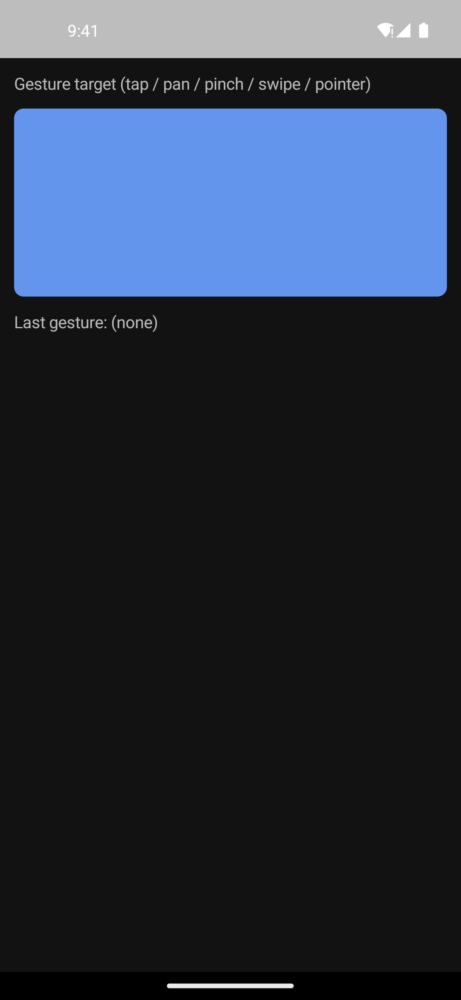</td><td></td><td>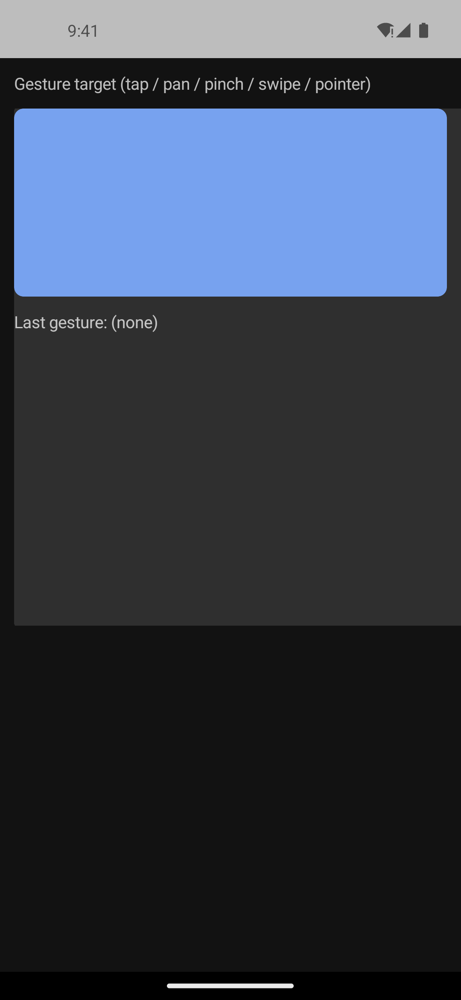</td></tr></table>

ports GesturesPage.xaml (+ .xaml.cs) The MAUI GesturesPage.xaml is a *gallery navigation* page: a CollectionView listing gesture-demo sections that the shell navigates into

#### 🟢 Pixel-Perfect Score — C++ (C1/C3)

Light: SSIM 1.0000, 0.00% pixels differ · Dark: SSIM 1.0000, 0.00% pixels differ

#### 🟢 Pixel-Perfect Score — C++ &amp; XAML (C2/C4)

Light: SSIM 1.0000, 0.00% pixels differ · Dark: SSIM 1.0000, 0.00% pixels differ

### 66. Gradient — 🟢/🟢
gradient

<table><tr><th></th><th>MAUI</th><th>C++</th><th>C++ &amp; XAML</th></tr><tr><th>Light</th><td></td><td></td><td></td></tr><tr><th>Dark</th><td></td><td></td><td></td></tr></table>

a faithful reproduction of the maui-compare &amp;quot;gradient&amp;quot; demo (ComparePages.Gradient()), the shipped-.NET-MAUI reference for the visual-parity comparison: a VerticalStackLayout (Spacing 12, Padding 16) of two captioned 60px BoxViews — a Linea

#### 🟢 Pixel-Perfect Score — C++ (C1/C3)

Light: SSIM 1.0000, 0.00% pixels differ · Dark: SSIM 1.0000, 0.00% pixels differ

#### 🟢 Pixel-Perfect Score — C++ &amp; XAML (C2/C4)

Light: SSIM 1.0000, 0.00% pixels differ · Dark: SSIM 1.0000, 0.00% pixels differ

### 67. Grid — 🟢/🟢
grid

<table><tr><th></th><th>MAUI</th><th>C++</th><th>C++ &amp; XAML</th></tr><tr><th>Light</th><td></td><td></td><td></td></tr><tr><th>Dark</th><td></td><td></td><td></td></tr></table>

a faithful reproduction of the maui-compare &amp;quot;grid&amp;quot; demo (ComparePages.GridPage()), the shipped-.NET-MAUI reference for the visual-parity comparison: a Grid (Padding 16, Row/ColumnSpacing 6) with RowDefinitions Auto / 80 / 80 and two Star co

#### 🟢 Pixel-Perfect Score — C++ (C1/C3)

Light: SSIM 0.9993, 0.02% pixels differ · Dark: SSIM 0.9993, 0.02% pixels differ

#### 🟢 Pixel-Perfect Score — C++ &amp; XAML (C2/C4)

Light: SSIM 0.9993, 0.02% pixels differ · Dark: SSIM 0.9993, 0.02% pixels differ

### 68. Grid Grouping — 🟢/🟢
grid_grouping

<table><tr><th></th><th>MAUI</th><th>C++</th><th>C++ &amp; XAML</th></tr><tr><th>Light</th><td></td><td></td><td></td></tr><tr><th>Dark</th><td></td><td></td><td></td></tr></table>

ports GroupingGalleries/GridGrouping.xaml (+ .xaml.cs) of the C# CollectionView gallery

#### 🟢 Pixel-Perfect Score — C++ (C1/C3)

Light: SSIM 0.9895, 0.27% pixels differ · Dark: SSIM 0.9886, 0.27% pixels differ

#### 🟢 Pixel-Perfect Score — C++ &amp; XAML (C2/C4)

Light: SSIM 1.0000, 0.00% pixels differ · Dark: SSIM 0.9999, 0.00% pixels differ

### 69. Grouping No Templates — 🟢/🟢
grouping_no_templates

<table><tr><th></th><th>MAUI</th><th>C++</th><th>C++ &amp; XAML</th></tr><tr><th>Light</th><td></td><td></td><td></td></tr><tr><th>Dark</th><td></td><td></td><td></td></tr></table>

ports GroupingGalleries/GroupingNoTemplates.xaml (+ .xaml.cs) of the C# CollectionView gallery

#### 🟢 Pixel-Perfect Score — C++ (C1/C3)

Light: SSIM 1.0000, 0.00% pixels differ · Dark: SSIM 0.9997, 0.00% pixels differ

#### 🟢 Pixel-Perfect Score — C++ &amp; XAML (C2/C4)

Light: SSIM 1.0000, 0.00% pixels differ · Dark: SSIM 0.9997, 0.00% pixels differ

### 70. Grouping Plus Selection — 🟢/🟢
grouping_plus_selection

<table><tr><th></th><th>MAUI</th><th>C++</th><th>C++ &amp; XAML</th></tr><tr><th>Light</th><td></td><td></td><td></td></tr><tr><th>Dark</th><td></td><td></td><td></td></tr></table>

ports CollectionViewGalleries/GroupingGalleries/ GroupingPlusSelection.xaml (+ .xaml.cs) of the C# CollectionView gallery

#### 🟢 Pixel-Perfect Score — C++ (C1/C3)

Light: SSIM 0.9930, 0.18% pixels differ · Dark: SSIM 0.9924, 0.18% pixels differ

#### 🟢 Pixel-Perfect Score — C++ &amp; XAML (C2/C4)

Light: SSIM 1.0000, 0.00% pixels differ · Dark: SSIM 0.9999, 0.00% pixels differ

### 71. Header Footer — 🟢/🟢
header_footer

<table><tr><th></th><th>MAUI</th><th>C++</th><th>C++ &amp; XAML</th></tr><tr><th>Light</th><td></td><td></td><td></td></tr><tr><th>Dark</th><td></td><td></td><td></td></tr></table>

ports HeaderFooterString.xaml (+ HeaderFooterString.xaml.cs)

#### 🟢 Pixel-Perfect Score — C++ (C1/C3)

Light: SSIM 1.0000, 0.00% pixels differ · Dark: SSIM 0.9999, 0.00% pixels differ

#### 🟢 Pixel-Perfect Score — C++ &amp; XAML (C2/C4)

Light: SSIM 1.0000, 0.00% pixels differ · Dark: SSIM 1.0000, 0.00% pixels differ

### 72. Header Footer Grid — 🟢/🟢
header_footer_grid

<table><tr><th></th><th>MAUI</th><th>C++</th><th>C++ &amp; XAML</th></tr><tr><th>Light</th><td></td><td></td><td></td></tr><tr><th>Dark</th><td></td><td></td><td></td></tr></table>

ports HeaderFooterGrid.xaml (+ HeaderFooterGrid.xaml.cs) of the C# CollectionView gallery (CollectionViewGalleries/HeaderFooterGalleries)

#### 🟢 Pixel-Perfect Score — C++ (C1/C3)

Light: SSIM 1.0000, 0.00% pixels differ · Dark: SSIM 1.0000, 0.00% pixels differ

#### 🟢 Pixel-Perfect Score — C++ &amp; XAML (C2/C4)

Light: SSIM 1.0000, 0.00% pixels differ · Dark: SSIM 1.0000, 0.00% pixels differ

### 73. Header Footer Grid Horizontal — 🟢/🟢
header_footer_grid_horizontal

<table><tr><th></th><th>MAUI</th><th>C++</th><th>C++ &amp; XAML</th></tr><tr><th>Light</th><td></td><td></td><td></td></tr><tr><th>Dark</th><td></td><td></td><td></td></tr></table>

ports HeaderFooterGridHorizontal.xaml (+ HeaderFooterGridHorizontal.xaml.cs) of the C# CollectionView gallery (CollectionViewGalleries/HeaderFooterGalleries)

#### 🟢 Pixel-Perfect Score — C++ (C1/C3)

Light: SSIM 0.9969, 0.00% pixels differ · Dark: SSIM 1.0000, 0.00% pixels differ

#### 🟢 Pixel-Perfect Score — C++ &amp; XAML (C2/C4)

Light: SSIM 0.9969, 0.00% pixels differ · Dark: SSIM 1.0000, 0.00% pixels differ

### 74. Header Footer Template — 🟢/🟢
header_footer_template

<table><tr><th></th><th>MAUI</th><th>C++</th><th>C++ &amp; XAML</th></tr><tr><th>Light</th><td></td><td></td><td></td></tr><tr><th>Dark</th><td></td><td></td><td></td></tr></table>

ports HeaderFooterTemplate.xaml (+ .xaml.cs) of the C# CollectionView gallery (CollectionViewGalleries/HeaderFooterGalleries)

#### 🟢 Pixel-Perfect Score — C++ (C1/C3)

Light: SSIM 1.0000, 0.00% pixels differ · Dark: SSIM 1.0000, 0.00% pixels differ

#### 🟢 Pixel-Perfect Score — C++ &amp; XAML (C2/C4)

Light: SSIM 1.0000, 0.00% pixels differ · Dark: SSIM 1.0000, 0.00% pixels differ

### 75. Header Footer View — 🟢/🟢
header_footer_view

<table><tr><th></th><th>MAUI</th><th>C++</th><th>C++ &amp; XAML</th></tr><tr><th>Light</th><td></td><td></td><td></td></tr><tr><th>Dark</th><td></td><td></td><td></td></tr></table>

ports HeaderFooterView.xaml (+ .xaml.cs) of the C# CollectionView gallery (CollectionViewGalleries/HeaderFooterGalleries)

#### 🟢 Pixel-Perfect Score — C++ (C1/C3)

Light: SSIM 1.0000, 0.00% pixels differ · Dark: SSIM 1.0000, 0.00% pixels differ

#### 🟢 Pixel-Perfect Score — C++ &amp; XAML (C2/C4)

Light: SSIM 1.0000, 0.00% pixels differ · Dark: SSIM 1.0000, 0.00% pixels differ

### 76. Hit Testing — 🟡/🟡
hit_testing

<table><tr><th></th><th>MAUI</th><th>C++</th><th>C++ &amp; XAML</th></tr><tr><th>Light</th><td></td><td></td><td></td></tr><tr><th>Dark</th><td>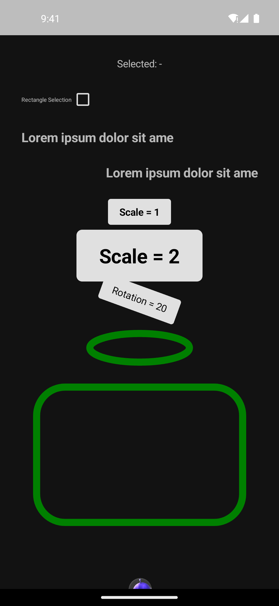</td><td></td><td>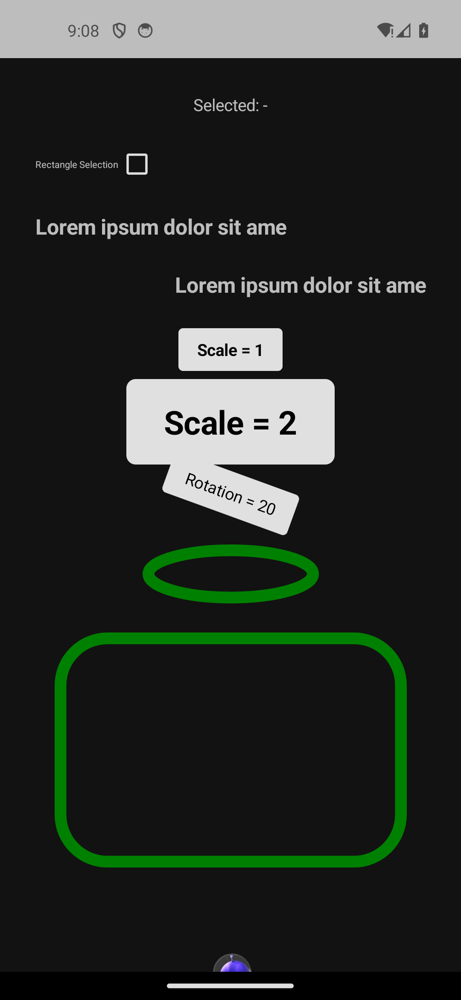</td></tr></table>

ports HitTestingPage.xaml (+ .xaml.cs) (Maui.Controls.Sample.Pages.HitTestingPage)

#### 🟡 Pixel-Perfect Score — C++ (C1/C3)

Light: SSIM 0.9882, 1.12% pixels differ · Dark: SSIM 0.9956, 0.23% pixels differ

#### 🟡 Pixel-Perfect Score — C++ &amp; XAML (C2/C4)

Light: SSIM 0.9882, 1.12% pixels differ · Dark: SSIM 0.9956, 0.23% pixels differ

### 77. Horizontal Stack — 🟢/🟢
horizontal_stack

<table><tr><th></th><th>MAUI</th><th>C++</th><th>C++ &amp; XAML</th></tr><tr><th>Light</th><td></td><td></td><td></td></tr><tr><th>Dark</th><td></td><td></td><td></td></tr></table>

Horizontal Stack

#### 🟢 Pixel-Perfect Score — C++ (C1/C3)

Light: SSIM 1.0000, 0.00% pixels differ · Dark: SSIM 1.0000, 0.00% pixels differ

#### 🟢 Pixel-Perfect Score — C++ &amp; XAML (C2/C4)

Light: SSIM 1.0000, 0.00% pixels differ · Dark: SSIM 1.0000, 0.00% pixels differ

### 78. Hybrid Web View — 🔴/🔴
hybrid_web_view

<table><tr><th></th><th>MAUI</th><th>C++</th><th>C++ &amp; XAML</th></tr><tr><th>Light</th><td></td><td></td><td></td></tr><tr><th>Dark</th><td></td><td></td><td></td></tr></table>

ports HybridWebViewPage.xaml (+ HybridWebViewPage.xaml.cs)

#### 🔴 Pixel-Perfect Score — C++ (C1/C3)

Light: SSIM 0.8864, 10.31% pixels differ · Dark: SSIM 0.6412, 38.14% pixels differ

#### 🔴 Pixel-Perfect Score — C++ &amp; XAML (C2/C4)

Light: SSIM 0.8864, 10.31% pixels differ · Dark: SSIM 0.6412, 38.01% pixels differ

### 79. Image — 🟡/🟡
image

<table><tr><th></th><th>MAUI</th><th>C++</th><th>C++ &amp; XAML</th></tr><tr><th>Light</th><td></td><td></td><td></td></tr><tr><th>Dark</th><td></td><td></td><td></td></tr></table>

ports ImagePage.xaml (+ ImagePage.xaml.cs)

#### 🟡 Pixel-Perfect Score — C++ (C1/C3)

Light: SSIM 0.9493, 2.40% pixels differ · Dark: SSIM 0.9541, 1.50% pixels differ

#### 🟡 Pixel-Perfect Score — C++ &amp; XAML (C2/C4)

Light: SSIM 0.9494, 2.28% pixels differ · Dark: SSIM 0.9541, 1.50% pixels differ

### 80. Image Button — 🟡/🟡
image_button

<table><tr><th></th><th>MAUI</th><th>C++</th><th>C++ &amp; XAML</th></tr><tr><th>Light</th><td></td><td></td><td></td></tr><tr><th>Dark</th><td></td><td></td><td></td></tr></table>

ports ImageButtonPage.xaml (+ ImageButtonPage.xaml.cs) A self-contained, code-first demo page for the ImageButton control (the C# gallery-page convention, mirroring the input_controls_page / image_page pattern)

#### 🟡 Pixel-Perfect Score — C++ (C1/C3)

Light: SSIM 0.9307, 5.12% pixels differ · Dark: SSIM 0.9264, 5.73% pixels differ

#### 🟡 Pixel-Perfect Score — C++ &amp; XAML (C2/C4)

Light: SSIM 0.9307, 5.12% pixels differ · Dark: SSIM 0.9264, 5.73% pixels differ

### 81. Indicator — 🟢/🟢
indicator

<table><tr><th></th><th>MAUI</th><th>C++</th><th>C++ &amp; XAML</th></tr><tr><th>Light</th><td></td><td></td><td></td></tr><tr><th>Dark</th><td></td><td></td><td></td></tr></table>

ports IndicatorPage.xaml A self-contained, code-first demo of the IndicatorView control

#### 🟢 Pixel-Perfect Score — C++ (C1/C3)

Light: SSIM 0.9860, 0.76% pixels differ · Dark: SSIM 0.9838, 0.71% pixels differ

#### 🟢 Pixel-Perfect Score — C++ &amp; XAML (C2/C4)

Light: SSIM 0.9874, 0.73% pixels differ · Dark: SSIM 0.9851, 0.66% pixels differ

### 82. Input Controls — 🟢/🟢
input_controls

<table><tr><th></th><th>MAUI</th><th>C++</th><th>C++ &amp; XAML</th></tr><tr><th>Light</th><td></td><td></td><td></td></tr><tr><th>Dark</th><td></td><td></td><td></td></tr></table>

a self-contained demo page for the W1-05 input-control set: editor, search_bar, radio_button (+ the radio_button_group attached grouping) and image_button on one vertical stack, wired together so every input drives a visible output (the C#

#### 🟢 Pixel-Perfect Score — C++ (C1/C3)

Light: SSIM 0.9870, 0.34% pixels differ · Dark: SSIM 0.9852, 0.50% pixels differ

#### 🟢 Pixel-Perfect Score — C++ &amp; XAML (C2/C4)

Light: SSIM 0.9870, 0.34% pixels differ · Dark: SSIM 0.9852, 0.50% pixels differ

### 83. Input Transparent — 🟢/🟢
input_transparent

<table><tr><th></th><th>MAUI</th><th>C++</th><th>C++ &amp; XAML</th></tr><tr><th>Light</th><td></td><td></td><td></td></tr><tr><th>Dark</th><td></td><td></td><td></td></tr></table>

ports InputTransparentPage.xaml (Maui.Controls.Sample.Pages.InputTransparentPage)

#### 🟢 Pixel-Perfect Score — C++ (C1/C3)

Light: SSIM 0.9996, 0.05% pixels differ · Dark: SSIM 0.9998, 0.15% pixels differ

#### 🟢 Pixel-Perfect Score — C++ &amp; XAML (C2/C4)

Light: SSIM 0.9996, 0.05% pixels differ · Dark: SSIM 0.9997, 0.15% pixels differ

### 84. Invalidate Brush — 🟢/🟢
invalidate_brush

<table><tr><th></th><th>MAUI</th><th>C++</th><th>C++ &amp; XAML</th></tr><tr><th>Light</th><td></td><td></td><td></td></tr><tr><th>Dark</th><td></td><td></td><td></td></tr></table>

ports InvalidateBrushGallery.xaml A code-first port of the MAUI Shapes sub-gallery Pages/Controls/ShapesGalleries/InvalidateBrushGallery.xaml (&amp;quot;Invalidate Brushes Playground&amp;quot;): a VerticalStackLayout (Padding 12) with — - a &amp;quot;Change color&amp;quot; Bu

#### 🟢 Pixel-Perfect Score — C++ (C1/C3)

Light: SSIM 0.9999, 0.00% pixels differ · Dark: SSIM 0.9999, 0.00% pixels differ

#### 🟢 Pixel-Perfect Score — C++ &amp; XAML (C2/C4)

Light: SSIM 0.9999, 0.00% pixels differ · Dark: SSIM 0.9999, 0.00% pixels differ

### 85. Invalidate Shadow Host — 🟢/🟢
invalidate_shadow_host

<table><tr><th></th><th>MAUI</th><th>C++</th><th>C++ &amp; XAML</th></tr><tr><th>Light</th><td></td><td></td><td></td></tr><tr><th>Dark</th><td></td><td></td><td></td></tr></table>

ports InvalidateShadowHostPage.xaml A self-contained, code-first demo that a shadow re-applies (invalidates) when its host&amp;#x27;s size changes, mirroring the C# core gallery page (Pages/Core/ShadowGalleries/InvalidateShadowHostPage.xaml + .xaml.

#### 🟢 Pixel-Perfect Score — C++ (C1/C3)

Light: SSIM 0.9829, 0.63% pixels differ · Dark: SSIM 0.9843, 0.65% pixels differ

#### 🟢 Pixel-Perfect Score — C++ &amp; XAML (C2/C4)

Light: SSIM 0.9829, 0.63% pixels differ · Dark: SSIM 0.9843, 0.65% pixels differ

### 86. Ios Blur Effect — 🟡/🟡
ios_blur_effect

<table><tr><th></th><th>MAUI</th><th>C++</th><th>C++ &amp; XAML</th></tr><tr><th>Light</th><td></td><td></td><td></td></tr><tr><th>Dark</th><td></td><td></td><td></td></tr></table>

ports iOSBlurEffectPage.xaml The .NET MAUI PlatformSpecifics sample (Pages/PlatformSpecifics/iOS/iOSBlurEffectPage.xaml + .xaml.cs): an Image (Source=&amp;quot;oasis.jpg&amp;quot;) carrying the iOSSpecific VisualElement.BlurEffect knob (XAML seeds it to Extr

#### 🟡 Pixel-Perfect Score — C++ (C1/C3)

Light: SSIM 0.9758, 0.48% pixels differ · Dark: SSIM 0.9709, 0.60% pixels differ

#### 🟡 Pixel-Perfect Score — C++ &amp; XAML (C2/C4)

Light: SSIM 0.9758, 0.48% pixels differ · Dark: SSIM 0.9709, 0.60% pixels differ

### 87. Ios Date Picker — 🟢/🟢
ios_date_picker

<table><tr><th></th><th>MAUI</th><th>C++</th><th>C++ &amp; XAML</th></tr><tr><th>Light</th><td></td><td></td><td></td></tr><tr><th>Dark</th><td>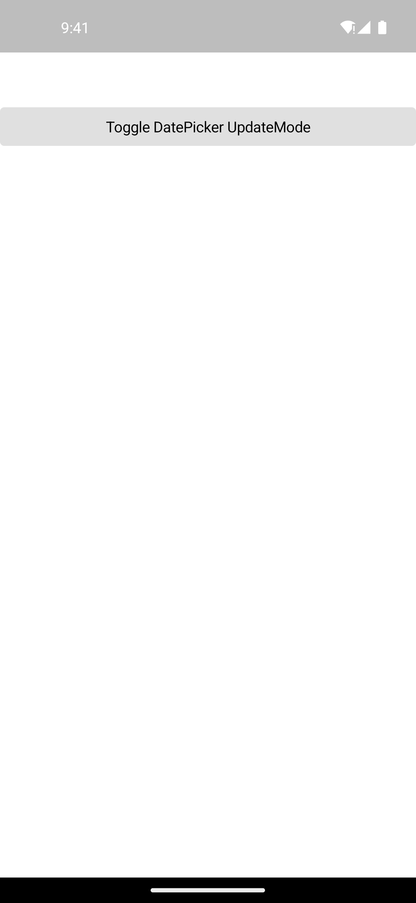</td><td>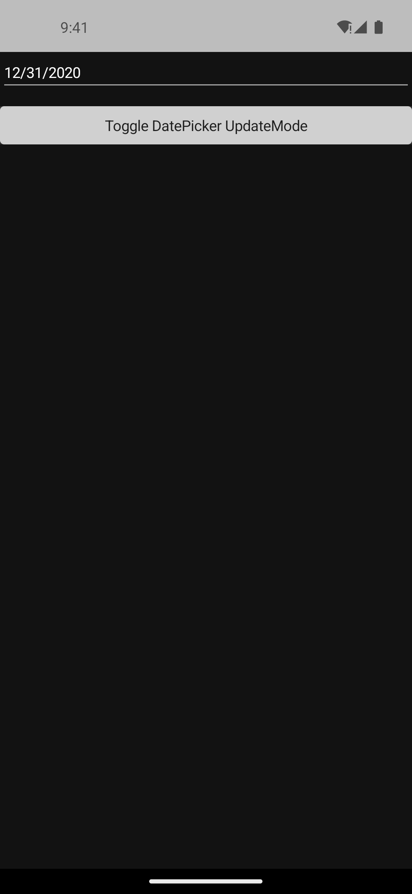</td><td></td></tr></table>

ports iOSDatePickerPage.xaml (+ iOSDatePickerPage.xaml.cs)

#### 🟢 Pixel-Perfect Score — C++ (C1/C3)

Light: SSIM 1.0000, 0.00% pixels differ · Dark: SSIM 1.0000, 0.00% pixels differ

#### 🟢 Pixel-Perfect Score — C++ &amp; XAML (C2/C4)

Light: SSIM 1.0000, 0.00% pixels differ · Dark: SSIM 1.0000, 0.00% pixels differ

### 88. Ios Entry — 🟢/🟢
ios_entry

<table><tr><th></th><th>MAUI</th><th>C++</th><th>C++ &amp; XAML</th></tr><tr><th>Light</th><td></td><td></td><td></td></tr><tr><th>Dark</th><td></td><td></td><td></td></tr></table>

ports iOSEntryPage.xaml (+ iOSEntryPage.xaml.cs)

#### 🟢 Pixel-Perfect Score — C++ (C1/C3)

Light: SSIM 0.9999, 0.00% pixels differ · Dark: SSIM 1.0000, 0.00% pixels differ

#### 🟢 Pixel-Perfect Score — C++ &amp; XAML (C2/C4)

Light: SSIM 0.9999, 0.00% pixels differ · Dark: SSIM 1.0000, 0.00% pixels differ

### 89. Ios First Responder — 🟢/🟢
ios_first_responder

<table><tr><th></th><th>MAUI</th><th>C++</th><th>C++ &amp; XAML</th></tr><tr><th>Light</th><td></td><td></td><td></td></tr><tr><th>Dark</th><td></td><td></td><td></td></tr></table>

ports iOSFirstResponderPage.xaml (+ .xaml.cs) The C# iOSFirstResponderPage is a VisualElement-first-responder demo: a StackLayout with an explanatory Label, a &amp;quot;First Entry&amp;quot; + plain &amp;quot;OK&amp;quot; Button (tapping OK dismisses the keyboard because the

#### 🟢 Pixel-Perfect Score — C++ (C1/C3)

Light: SSIM 1.0000, 0.00% pixels differ · Dark: SSIM 0.9999, 0.00% pixels differ

#### 🟢 Pixel-Perfect Score — C++ &amp; XAML (C2/C4)

Light: SSIM 1.0000, 0.00% pixels differ · Dark: SSIM 0.9999, 0.00% pixels differ

### 90. Ios Pan Gesture — 🟢/🟢
ios_pan_gesture

<table><tr><th></th><th>MAUI</th><th>C++</th><th>C++ &amp; XAML</th></tr><tr><th>Light</th><td></td><td></td><td></td></tr><tr><th>Dark</th><td></td><td></td><td></td></tr></table>

ports iOSPanGestureRecognizerPage.xaml (+ .xaml.cs) The C# iOSPanGestureRecognizerPage is a StackLayout with: a bold message Label (_messageLabel), a &amp;quot;Toggle Simultaneous Gesture Recognition&amp;quot; Button, and a grouped ListView of employees whos

#### 🟢 Pixel-Perfect Score — C++ (C1/C3)

Light: SSIM 1.0000, 0.00% pixels differ · Dark: SSIM 1.0000, 0.00% pixels differ

#### 🟢 Pixel-Perfect Score — C++ &amp; XAML (C2/C4)

Light: SSIM 1.0000, 0.00% pixels differ · Dark: SSIM 1.0000, 0.00% pixels differ

### 91. Ios Picker — 🟢/🟢
ios_picker

<table><tr><th></th><th>MAUI</th><th>C++</th><th>C++ &amp; XAML</th></tr><tr><th>Light</th><td></td><td></td><td></td></tr><tr><th>Dark</th><td>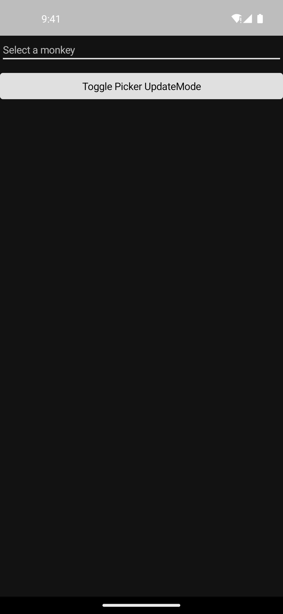</td><td>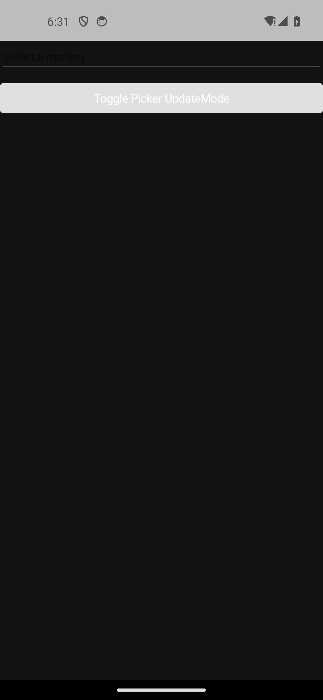</td><td>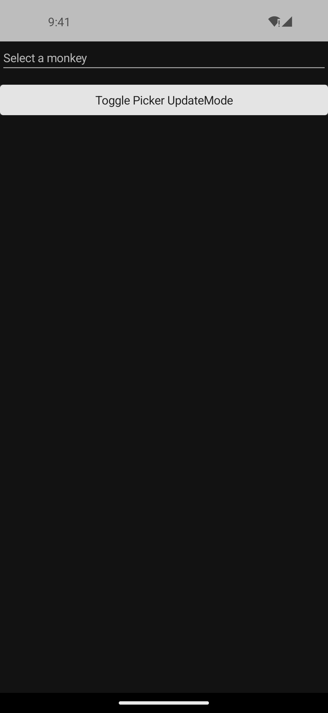</td></tr></table>

ports iOSPickerPage.xaml (+ iOSPickerPage.xaml.cs)

#### 🟢 Pixel-Perfect Score — C++ (C1/C3)

Light: SSIM 0.9999, 0.09% pixels differ · Dark: SSIM 1.0000, 0.00% pixels differ

#### 🟢 Pixel-Perfect Score — C++ &amp; XAML (C2/C4)

Light: SSIM 0.9999, 0.09% pixels differ · Dark: SSIM 1.0000, 0.00% pixels differ

### 92. Ios Safe Area — 🟢/🟢
ios_safe_area

<table><tr><th></th><th>MAUI</th><th>C++</th><th>C++ &amp; XAML</th></tr><tr><th>Light</th><td></td><td></td><td></td></tr><tr><th>Dark</th><td></td><td></td><td></td></tr></table>

ports iOSSafeAreaPage.xaml The .NET MAUI PlatformSpecifics sample (Pages/PlatformSpecifics/iOS/iOSSafeAreaPage.xaml + .xaml.cs): a long Lorem-ipsum Label over a &amp;quot;Disable Use Safe Area&amp;quot; button

#### 🟢 Pixel-Perfect Score — C++ (C1/C3)

Light: SSIM 1.0000, 0.00% pixels differ · Dark: SSIM 0.9999, 0.00% pixels differ

#### 🟢 Pixel-Perfect Score — C++ &amp; XAML (C2/C4)

Light: SSIM 1.0000, 0.00% pixels differ · Dark: SSIM 0.9999, 0.00% pixels differ

### 93. Ios Scroll View — 🟢/🟢
ios_scroll_view

<table><tr><th></th><th>MAUI</th><th>C++</th><th>C++ &amp; XAML</th></tr><tr><th>Light</th><td></td><td></td><td></td></tr><tr><th>Dark</th><td>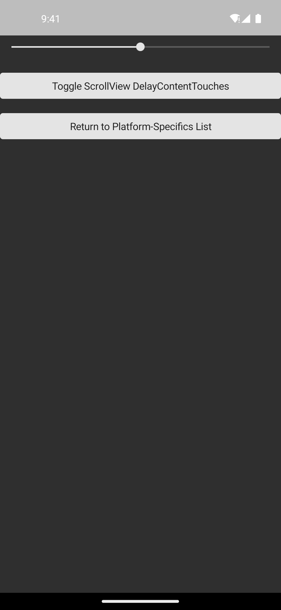</td><td>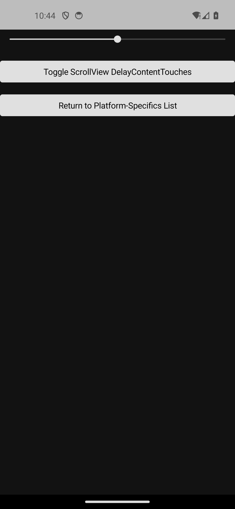</td><td>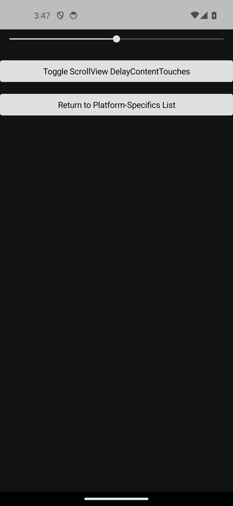</td></tr></table>

ports iOSScrollViewPage.xaml (+ iOSScrollViewPage.xaml.cs)

#### 🟢 Pixel-Perfect Score — C++ (C1/C3)

Light: SSIM 0.9999, 0.00% pixels differ · Dark: SSIM 0.9999, 0.01% pixels differ

#### 🟢 Pixel-Perfect Score — C++ &amp; XAML (C2/C4)

Light: SSIM 0.9999, 0.00% pixels differ · Dark: SSIM 0.9999, 0.01% pixels differ

### 94. Ios Search Bar — 🟢/🟢
ios_search_bar

<table><tr><th></th><th>MAUI</th><th>C++</th><th>C++ &amp; XAML</th></tr><tr><th>Light</th><td></td><td></td><td></td></tr><tr><th>Dark</th><td></td><td></td><td></td></tr></table>

ports iOSSearchBarPage.xaml (+ iOSSearchBarPage.xaml.cs)

#### 🟢 Pixel-Perfect Score — C++ (C1/C3)

Light: SSIM 0.9862, 0.37% pixels differ · Dark: SSIM 0.9850, 0.42% pixels differ

#### 🟢 Pixel-Perfect Score — C++ &amp; XAML (C2/C4)

Light: SSIM 0.9862, 0.37% pixels differ · Dark: SSIM 0.9850, 0.42% pixels differ

### 95. Ios Slider Update On Tap — 🟢/🟢
ios_slider_update_on_tap

<table><tr><th></th><th>MAUI</th><th>C++</th><th>C++ &amp; XAML</th></tr><tr><th>Light</th><td></td><td></td><td></td></tr><tr><th>Dark</th><td></td><td></td><td></td></tr></table>

ports iOSSliderUpdateOnTapPage.xaml (+ iOSSliderUpdateOnTapPage.xaml.cs)

#### 🟢 Pixel-Perfect Score — C++ (C1/C3)

Light: SSIM 1.0000, 0.00% pixels differ · Dark: SSIM 0.9999, 0.01% pixels differ

#### 🟢 Pixel-Perfect Score — C++ &amp; XAML (C2/C4)

Light: SSIM 1.0000, 0.00% pixels differ · Dark: SSIM 0.9999, 0.01% pixels differ

### 96. Ios Swipe Transition — 🟢/🟢
ios_swipe_transition

<table><tr><th></th><th>MAUI</th><th>C++</th><th>C++ &amp; XAML</th></tr><tr><th>Light</th><td></td><td></td><td></td></tr><tr><th>Dark</th><td></td><td></td><td></td></tr></table>

ports iOSSwipeViewTransitionModePage.xaml (+ .xaml.cs) The C# iOSSwipeViewTransitionModePage is a StackLayout with: a horizontal row holding a &amp;quot;SwipeTransitionMode:&amp;quot; Label + an EnumPicker over the SwipeTransitionMode enum (Reveal / Drag, Se

#### 🟢 Pixel-Perfect Score — C++ (C1/C3)

Light: SSIM 1.0000, 0.00% pixels differ · Dark: SSIM 1.0000, 0.00% pixels differ

#### 🟢 Pixel-Perfect Score — C++ &amp; XAML (C2/C4)

Light: SSIM 1.0000, 0.00% pixels differ · Dark: SSIM 1.0000, 0.00% pixels differ

### 97. Ios Time Picker — 🟢/🟢
ios_time_picker

<table><tr><th></th><th>MAUI</th><th>C++</th><th>C++ &amp; XAML</th></tr><tr><th>Light</th><td></td><td></td><td></td></tr><tr><th>Dark</th><td></td><td></td><td></td></tr></table>

ports iOSTimePickerPage.xaml The .NET MAUI PlatformSpecifics sample (Pages/PlatformSpecifics/iOS/iOSTimePickerPage.xaml + .xaml.cs): a TimePicker carrying the iOSSpecific TimePicker.UpdateMode knob (XAML seeds it to WhenFinished) over a but

#### 🟢 Pixel-Perfect Score — C++ (C1/C3)

Light: SSIM 1.0000, 0.00% pixels differ · Dark: SSIM 1.0000, 0.00% pixels differ

#### 🟢 Pixel-Perfect Score — C++ &amp; XAML (C2/C4)

Light: SSIM 1.0000, 0.00% pixels differ · Dark: SSIM 1.0000, 0.00% pixels differ

### 98. Items — 🟢/🟢
items

<table><tr><th></th><th>MAUI</th><th>C++</th><th>C++ &amp; XAML</th></tr><tr><th>Light</th><td></td><td></td><td></td></tr><tr><th>Dark</th><td></td><td></td><td></td></tr></table>

a self-contained demo page for the W2-19 items core: a collection_view over a live observable items source with a templated cell, single selection driving a readout label, and an EmptyView for the cleared state (the C# CollectionView galler

#### 🟢 Pixel-Perfect Score — C++ (C1/C3)

Light: SSIM 0.9948, 0.17% pixels differ · Dark: SSIM 0.9946, 0.19% pixels differ

#### 🟢 Pixel-Perfect Score — C++ &amp; XAML (C2/C4)

Light: SSIM 0.9948, 0.17% pixels differ · Dark: SSIM 0.9946, 0.19% pixels differ

### 99. Items Updating Scroll Mode — 🟢/🟢
items_updating_scroll_mode

<table><tr><th></th><th>MAUI</th><th>C++</th><th>C++ &amp; XAML</th></tr><tr><th>Light</th><td></td><td></td><td></td></tr><tr><th>Dark</th><td></td><td></td><td></td></tr></table>

ports ItemsUpdatingScrollModeGallery.xaml (+ .xaml.cs) of the C# CollectionView gallery (Maui.Controls.Sample.Pages.CollectionViewGalleries.ScrollModeGalleries.ItemsUpdatingScrollModeGallery)

#### 🟢 Pixel-Perfect Score — C++ (C1/C3)

Light: SSIM 1.0000, 0.00% pixels differ · Dark: SSIM 0.9999, 0.00% pixels differ

#### 🟢 Pixel-Perfect Score — C++ &amp; XAML (C2/C4)

Light: SSIM 1.0000, 0.00% pixels differ · Dark: SSIM 0.9999, 0.00% pixels differ

### 100. Label — 🟡/🟡
label

<table><tr><th></th><th>MAUI</th><th>C++</th><th>C++ &amp; XAML</th></tr><tr><th>Light</th><td></td><td></td><td></td></tr><tr><th>Dark</th><td></td><td></td><td></td></tr></table>

ports LabelPage.xaml (+ LabelPage.xaml.cs)

#### 🟡 Pixel-Perfect Score — C++ (C1/C3)

Light: SSIM 0.9374, 2.50% pixels differ · Dark: SSIM 0.9331, 2.75% pixels differ

#### 🟡 Pixel-Perfect Score — C++ &amp; XAML (C2/C4)

Light: SSIM 0.9374, 2.50% pixels differ · Dark: SSIM 0.9331, 2.75% pixels differ

### 101. Layout Is Enabled — 🟡/🟡
layout_is_enabled

<table><tr><th></th><th>MAUI</th><th>C++</th><th>C++ &amp; XAML</th></tr><tr><th>Light</th><td></td><td></td><td></td></tr><tr><th>Dark</th><td></td><td></td><td></td></tr></table>

ports LayoutIsEnabledPage.xaml (+ LayoutIsEnabledPage.xaml.cs) The C# page demonstrates how IsEnabled on a layout cascades to its children: a 2x2 grid whose left column hosts a &amp;quot;MainLayout&amp;quot; full of state-demo sub-stacks (all-enabled / all-d

#### 🟡 Pixel-Perfect Score — C++ (C1/C3)

Light: SSIM 0.9718, 2.38% pixels differ · Dark: SSIM 0.9846, 1.39% pixels differ

#### 🟡 Pixel-Perfect Score — C++ &amp; XAML (C2/C4)

Light: SSIM 0.9718, 2.38% pixels differ · Dark: SSIM 0.9846, 1.39% pixels differ

### 102. Line Gallery — 🟢/🟢
line_gallery

<table><tr><th></th><th>MAUI</th><th>C++</th><th>C++ &amp; XAML</th></tr><tr><th>Light</th><td></td><td></td><td></td></tr><tr><th>Dark</th><td></td><td></td><td></td></tr></table>

ports LineGallery.xaml A self-contained, code-first port of the MAUI Shapes LineGallery (Pages/Controls/ShapesGalleries/LineGallery.xaml + .xaml.cs)

#### 🟢 Pixel-Perfect Score — C++ (C1/C3)

Light: SSIM 0.9996, 0.02% pixels differ · Dark: SSIM 0.9998, 0.00% pixels differ

#### 🟢 Pixel-Perfect Score — C++ &amp; XAML (C2/C4)

Light: SSIM 0.9996, 0.02% pixels differ · Dark: SSIM 0.9998, 0.00% pixels differ

### 103. Line Join Gallery — 🟢/🟢
line_join_gallery

<table><tr><th></th><th>MAUI</th><th>C++</th><th>C++ &amp; XAML</th></tr><tr><th>Light</th><td></td><td></td><td></td></tr><tr><th>Dark</th><td></td><td></td><td></td></tr></table>

ports LineJoinGallery.xaml A self-contained, code-first port of the MAUI Shapes sub-gallery Pages/Controls/ShapesGalleries/LineJoinGallery.xaml: a StackLayout that demonstrates the three StrokeLineJoin variants on an identical open polyline

#### 🟢 Pixel-Perfect Score — C++ (C1/C3)

Light: SSIM 1.0000, 0.00% pixels differ · Dark: SSIM 1.0000, 0.00% pixels differ

#### 🟢 Pixel-Perfect Score — C++ &amp; XAML (C2/C4)

Light: SSIM 1.0000, 0.00% pixels differ · Dark: SSIM 1.0000, 0.00% pixels differ

### 104. Measure First Strategy — 🟢/🟢
measure_first_strategy

<table><tr><th></th><th>MAUI</th><th>C++</th><th>C++ &amp; XAML</th></tr><tr><th>Light</th><td></td><td></td><td></td></tr><tr><th>Dark</th><td></td><td></td><td></td></tr></table>

ports MeasureFirstStrategy.xaml (+ .xaml.cs) of the C# CollectionView gallery (Maui.Controls.Sample.Pages.CollectionViewGalleries.GroupingGalleries.MeasureFirstStrategy)

#### 🟢 Pixel-Perfect Score — C++ (C1/C3)

Light: SSIM 1.0000, 0.00% pixels differ · Dark: SSIM 0.9999, 0.00% pixels differ

#### 🟢 Pixel-Perfect Score — C++ &amp; XAML (C2/C4)

Light: SSIM 1.0000, 0.00% pixels differ · Dark: SSIM 0.9999, 0.00% pixels differ

### 105. Menu Bar — 🟡/🟢
menu_bar

<table><tr><th></th><th>MAUI</th><th>C++</th><th>C++ &amp; XAML</th></tr><tr><th>Light</th><td></td><td></td><td></td></tr><tr><th>Dark</th><td></td><td></td><td></td></tr></table>

ports MenuBarPage.xaml (+ MenuBarPage.cs) The C# page declares three page-level MenuBarItems (Page.MenuBarItems — the app menu bar) and a small visible body: - &amp;quot;Before File&amp;quot; : &amp;quot;Before File Action&amp;quot; (accelerator &amp;quot;b&amp;quot;), &amp;quot;Cool item 1&amp;quot;, a separat

#### 🟡 Pixel-Perfect Score — C++ (C1/C3)

Light: SSIM 0.9703, 3.45% pixels differ · Dark: SSIM 0.9485, 3.61% pixels differ

#### 🟢 Pixel-Perfect Score — C++ &amp; XAML (C2/C4)

Light: SSIM 1.0000, 0.00% pixels differ · Dark: SSIM 1.0000, 0.00% pixels differ

### 106. Modal — 🟢/🟢
modal

<table><tr><th></th><th>MAUI</th><th>C++</th><th>C++ &amp; XAML</th></tr><tr><th>Light</th><td></td><td></td><td></td></tr><tr><th>Dark</th><td></td><td></td><td></td></tr></table>

ports ModalPage.xaml (+ .xaml.cs)

#### 🟢 Pixel-Perfect Score — C++ (C1/C3)

Light: SSIM 1.0000, 0.00% pixels differ · Dark: SSIM 1.0000, 0.00% pixels differ

#### 🟢 Pixel-Perfect Score — C++ &amp; XAML (C2/C4)

Light: SSIM 1.0000, 0.00% pixels differ · Dark: SSIM 1.0000, 0.00% pixels differ

### 107. Multiple Bound Selection — 🟡/🟡
multiple_bound_selection

<table><tr><th></th><th>MAUI</th><th>C++</th><th>C++ &amp; XAML</th></tr><tr><th>Light</th><td></td><td></td><td></td></tr><tr><th>Dark</th><td></td><td></td><td></td></tr></table>

ports MultipleBoundSelection.xaml (+ .xaml.cs) (Maui.Controls.Sample.Pages.CollectionViewGalleries.SelectionGalleries.MultipleBoundSelection)

#### 🟡 Pixel-Perfect Score — C++ (C1/C3)

Light: SSIM 0.9556, 7.26% pixels differ · Dark: SSIM 0.9002, 7.44% pixels differ

#### 🟡 Pixel-Perfect Score — C++ &amp; XAML (C2/C4)

Light: SSIM 0.9556, 7.26% pixels differ · Dark: SSIM 0.9002, 7.44% pixels differ

### 108. Navigation Gallery — 🟢/🟢
navigation_gallery

<table><tr><th></th><th>MAUI</th><th>C++</th><th>C++ &amp; XAML</th></tr><tr><th>Light</th><td></td><td></td><td></td></tr><tr><th>Dark</th><td></td><td></td><td></td></tr></table>

ports NavigationGallery.xaml (+ .xaml.cs)

#### 🟢 Pixel-Perfect Score — C++ (C1/C3)

Light: SSIM 1.0000, 0.00% pixels differ · Dark: SSIM 1.0000, 0.00% pixels differ

#### 🟢 Pixel-Perfect Score — C++ &amp; XAML (C2/C4)

Light: SSIM 1.0000, 0.00% pixels differ · Dark: SSIM 1.0000, 0.00% pixels differ

### 109. Nested Collection — 🟢/🟢
nested_collection

<table><tr><th></th><th>MAUI</th><th>C++</th><th>C++ &amp; XAML</th></tr><tr><th>Light</th><td></td><td></td><td></td></tr><tr><th>Dark</th><td></td><td></td><td></td></tr></table>

ports NestedGalleries/NestedCollectionViewGallery.xaml (+ NestedCollectionViewGallery.xaml.cs) of the C# CollectionView gallery

#### 🟢 Pixel-Perfect Score — C++ (C1/C3)

Light: SSIM 1.0000, 0.00% pixels differ · Dark: SSIM 1.0000, 0.00% pixels differ

#### 🟢 Pixel-Perfect Score — C++ &amp; XAML (C2/C4)

Light: SSIM 1.0000, 0.00% pixels differ · Dark: SSIM 1.0000, 0.00% pixels differ

### 110. Pan Gesture Events — 🟢/🟢
pan_gesture_events

<table><tr><th></th><th>MAUI</th><th>C++</th><th>C++ &amp; XAML</th></tr><tr><th>Light</th><td></td><td></td><td></td></tr><tr><th>Dark</th><td></td><td></td><td></td></tr></table>

ports PanGestureEventsGallery.xaml (+ .xaml.cs) (Maui.Controls.Sample.Pages.PanGestureEventsGallery)

#### 🟢 Pixel-Perfect Score — C++ (C1/C3)

Light: SSIM 0.9967, 0.13% pixels differ · Dark: SSIM 0.9967, 0.13% pixels differ

#### 🟢 Pixel-Perfect Score — C++ &amp; XAML (C2/C4)

Light: SSIM 1.0000, 0.00% pixels differ · Dark: SSIM 1.0000, 0.00% pixels differ

### 111. Path Aspect Gallery — 🟢/🟢
path_aspect_gallery

<table><tr><th></th><th>MAUI</th><th>C++</th><th>C++ &amp; XAML</th></tr><tr><th>Light</th><td></td><td></td><td></td></tr><tr><th>Dark</th><td></td><td></td><td></td></tr></table>

ports PathAspectGallery.xaml A self-contained, code-first port of the MAUI Shapes sub-gallery Pages/Controls/ShapesGalleries/PathAspectGallery.xaml: a StackLayout (Padding 12) that demonstrates the four Path Aspect modes on one identical ge

#### 🟢 Pixel-Perfect Score — C++ (C1/C3)

Light: SSIM 1.0000, 0.00% pixels differ · Dark: SSIM 1.0000, 0.00% pixels differ

#### 🟢 Pixel-Perfect Score — C++ &amp; XAML (C2/C4)

Light: SSIM 1.0000, 0.00% pixels differ · Dark: SSIM 1.0000, 0.00% pixels differ

### 112. Path Gallery — 🟢/🟢
path_gallery

<table><tr><th></th><th>MAUI</th><th>C++</th><th>C++ &amp; XAML</th></tr><tr><th>Light</th><td></td><td></td><td></td></tr><tr><th>Dark</th><td>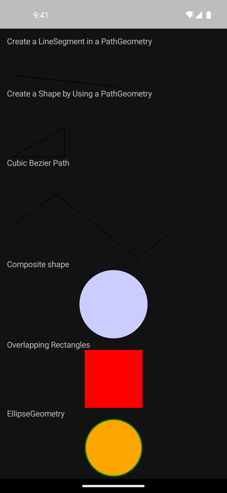</td><td></td><td>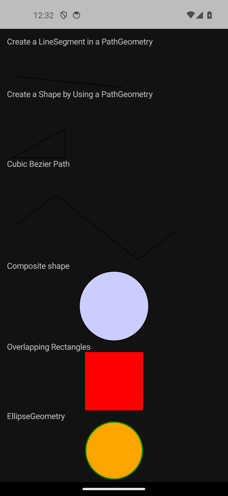</td></tr></table>

ports PathGallery.xaml A code-first port of the MAUI Shapes sub-gallery Pages/Controls/ShapesGalleries/PathGallery.xaml: a ScrollView over a StackLayout (Padding 12) that walks eight Path variants (plus two caption-only markup-string Labels

#### 🟢 Pixel-Perfect Score — C++ (C1/C3)

Light: SSIM 0.9952, 0.60% pixels differ · Dark: SSIM 0.9985, 0.00% pixels differ

#### 🟢 Pixel-Perfect Score — C++ &amp; XAML (C2/C4)

Light: SSIM 0.9952, 0.60% pixels differ · Dark: SSIM 0.9985, 0.00% pixels differ

### 113. Path Transform String — 🟢/🟢
path_transform_string

<table><tr><th></th><th>MAUI</th><th>C++</th><th>C++ &amp; XAML</th></tr><tr><th>Light</th><td></td><td></td><td></td></tr><tr><th>Dark</th><td></td><td></td><td></td></tr></table>

ports PathTransformStringGallery.xaml A code-first port of the MAUI Shapes sub-gallery Pages/Controls/ShapesGalleries/PathTransformStringGallery.xaml: a ScrollView over a StackLayout (Padding 12) that shows the SAME two-figure Path geometry

#### 🟢 Pixel-Perfect Score — C++ (C1/C3)

Light: SSIM 0.9858, 0.64% pixels differ · Dark: SSIM 0.9912, 0.00% pixels differ

#### 🟢 Pixel-Perfect Score — C++ &amp; XAML (C2/C4)

Light: SSIM 0.9999, 0.00% pixels differ · Dark: SSIM 1.0000, 0.00% pixels differ

### 114. Picker — 🟢/🟢
picker

<table><tr><th></th><th>MAUI</th><th>C++</th><th>C++ &amp; XAML</th></tr><tr><th>Light</th><td></td><td></td><td></td></tr><tr><th>Dark</th><td>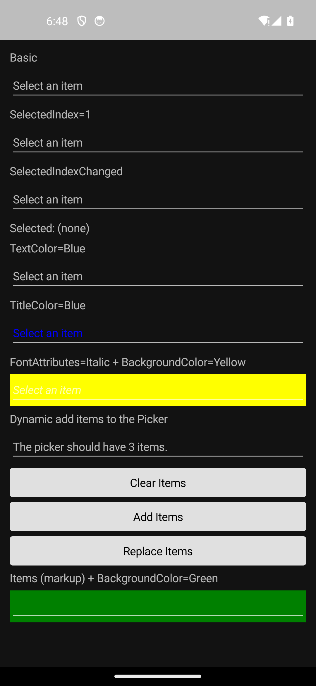</td><td>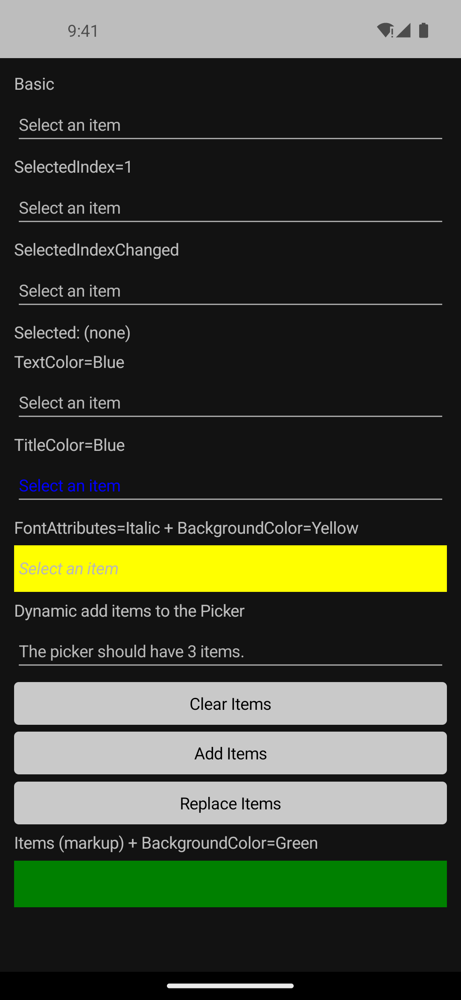</td><td>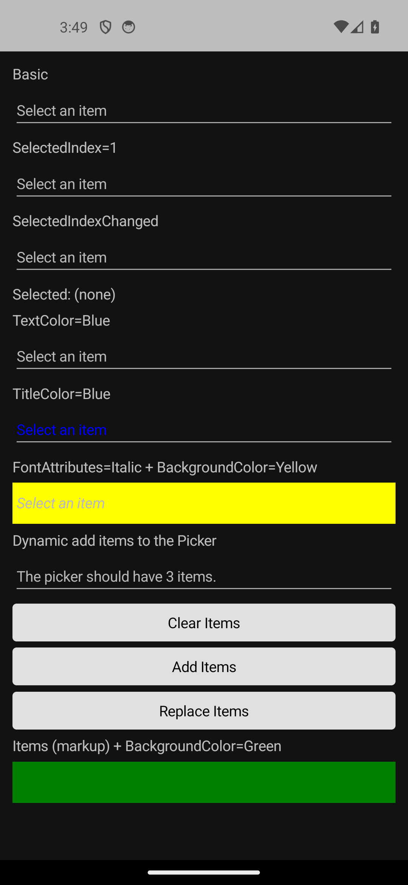</td></tr></table>

ports PickerPage.xaml (+ PickerPage.xaml.cs) A self-contained, code-first demo page for the Picker control (the C# gallery-page convention, mirroring the value_controls_page / pickers_page pattern)

#### 🟢 Pixel-Perfect Score — C++ (C1/C3)

Light: SSIM 0.9894, 0.79% pixels differ · Dark: SSIM 0.9871, 0.42% pixels differ

#### 🟢 Pixel-Perfect Score — C++ &amp; XAML (C2/C4)

Light: SSIM 0.9894, 0.79% pixels differ · Dark: SSIM 0.9871, 0.42% pixels differ

### 115. Pickers — 🟢/🟢
pickers

<table><tr><th></th><th>MAUI</th><th>C++</th><th>C++ &amp; XAML</th></tr><tr><th>Light</th><td></td><td></td><td></td></tr><tr><th>Dark</th><td></td><td></td><td></td></tr></table>

a self-contained demo page for the W1-06 picker set: picker, date_picker and time_picker on one vertical stack, wired together so every selection drives a visible output (the C# gallery-page convention, code-first; the value_controls_page p

#### 🟢 Pixel-Perfect Score — C++ (C1/C3)

Light: SSIM 0.9938, 0.32% pixels differ · Dark: SSIM 0.9944, 0.22% pixels differ

#### 🟢 Pixel-Perfect Score — C++ &amp; XAML (C2/C4)

Light: SSIM 0.9993, 0.11% pixels differ · Dark: SSIM 1.0000, 0.00% pixels differ

### 116. Pointer Gesture — 🟢/🟢
pointer_gesture

<table><tr><th></th><th>MAUI</th><th>C++</th><th>C++ &amp; XAML</th></tr><tr><th>Light</th><td></td><td></td><td></td></tr><tr><th>Dark</th><td></td><td></td><td></td></tr></table>

ports PointerGestureGalleryPage.xaml (+ .xaml.cs) (Maui.Controls.Sample.Pages.PointerGestureGalleryPage)

#### 🟢 Pixel-Perfect Score — C++ (C1/C3)

Light: SSIM 1.0000, 0.00% pixels differ · Dark: SSIM 1.0000, 0.00% pixels differ

#### 🟢 Pixel-Perfect Score — C++ &amp; XAML (C2/C4)

Light: SSIM 1.0000, 0.00% pixels differ · Dark: SSIM 1.0000, 0.00% pixels differ

### 117. Polygon Gallery — 🟢/🟢
polygon_gallery

<table><tr><th></th><th>MAUI</th><th>C++</th><th>C++ &amp; XAML</th></tr><tr><th>Light</th><td></td><td></td><td></td></tr><tr><th>Dark</th><td></td><td></td><td></td></tr></table>

ports PolygonGallery.xaml A code-first port of the MAUI Shapes sub-gallery Pages/Controls/ShapesGalleries/PolygonGallery.xaml: a ScrollView over a StackLayout (Padding 12) that walks four Polygon variants, each under a caption Label — - &amp;quot;A

#### 🟢 Pixel-Perfect Score — C++ (C1/C3)

Light: SSIM 0.9989, 0.04% pixels differ · Dark: SSIM 0.9988, 0.04% pixels differ

#### 🟢 Pixel-Perfect Score — C++ &amp; XAML (C2/C4)

Light: SSIM 0.9989, 0.04% pixels differ · Dark: SSIM 0.9988, 0.04% pixels differ

### 118. Polyline Gallery — 🟢/🟢
polyline_gallery

<table><tr><th></th><th>MAUI</th><th>C++</th><th>C++ &amp; XAML</th></tr><tr><th>Light</th><td></td><td></td><td></td></tr><tr><th>Dark</th><td></td><td></td><td></td></tr></table>

ports PolylineGallery.xaml A code-first port of the MAUI Shapes sub-gallery Pages/Controls/ShapesGalleries/PolylineGallery.xaml: a StackLayout (Padding 12 — no ScrollView in the C# source) holding two Polyline variants, each under a caption

#### 🟢 Pixel-Perfect Score — C++ (C1/C3)

Light: SSIM 0.9829, 0.51% pixels differ · Dark: SSIM 0.9830, 0.55% pixels differ

#### 🟢 Pixel-Perfect Score — C++ &amp; XAML (C2/C4)

Light: SSIM 1.0000, 0.00% pixels differ · Dark: SSIM 1.0000, 0.00% pixels differ

### 119. Preselected Item — 🟢/🟢
preselected_item

<table><tr><th></th><th>MAUI</th><th>C++</th><th>C++ &amp; XAML</th></tr><tr><th>Light</th><td></td><td></td><td></td></tr><tr><th>Dark</th><td></td><td></td><td></td></tr></table>

ports PreselectedItemGallery.xaml (+ .xaml.cs) (Maui.Controls.Sample.Pages.CollectionViewGalleries.SelectionGalleries.PreselectedItemGallery)

#### 🟢 Pixel-Perfect Score — C++ (C1/C3)

Light: SSIM 0.9972, 0.43% pixels differ · Dark: SSIM 0.9999, 0.00% pixels differ

#### 🟢 Pixel-Perfect Score — C++ &amp; XAML (C2/C4)

Light: SSIM 0.9972, 0.43% pixels differ · Dark: SSIM 0.9999, 0.00% pixels differ

### 120. Preselected Items — 🟢/🟢
preselected_items

<table><tr><th></th><th>MAUI</th><th>C++</th><th>C++ &amp; XAML</th></tr><tr><th>Light</th><td></td><td></td><td></td></tr><tr><th>Dark</th><td></td><td></td><td></td></tr></table>

ports PreselectedItemsGallery.xaml (+ .xaml.cs) (Maui.Controls.Sample.Pages.CollectionViewGalleries.SelectionGalleries.PreselectedItemsGallery)

#### 🟢 Pixel-Perfect Score — C++ (C1/C3)

Light: SSIM 1.0000, 0.00% pixels differ · Dark: SSIM 0.9999, 0.00% pixels differ

#### 🟢 Pixel-Perfect Score — C++ &amp; XAML (C2/C4)

Light: SSIM 1.0000, 0.00% pixels differ · Dark: SSIM 0.9999, 0.00% pixels differ

### 121. Progress Bar — 🟢/🟢
progress_bar

<table><tr><th></th><th>MAUI</th><th>C++</th><th>C++ &amp; XAML</th></tr><tr><th>Light</th><td></td><td></td><td></td></tr><tr><th>Dark</th><td></td><td></td><td></td></tr></table>

ports ProgressBarPage.xaml (+ ProgressBarPage.xaml.cs)

#### 🟢 Pixel-Perfect Score — C++ (C1/C3)

Light: SSIM 0.9987, 0.01% pixels differ · Dark: SSIM 0.9984, 0.24% pixels differ

#### 🟢 Pixel-Perfect Score — C++ &amp; XAML (C2/C4)

Light: SSIM 0.9988, 0.01% pixels differ · Dark: SSIM 0.9984, 0.24% pixels differ

### 122. Radio Button Border — 🟢/🟢
radio_button_border

<table><tr><th></th><th>MAUI</th><th>C++</th><th>C++ &amp; XAML</th></tr><tr><th>Light</th><td></td><td></td><td></td></tr><tr><th>Dark</th><td></td><td></td><td></td></tr></table>

ports RadioButtonBorder.xaml A self-contained, code-first demo of RadioButton border styling

#### 🟢 Pixel-Perfect Score — C++ (C1/C3)

Light: SSIM 0.9999, 0.10% pixels differ · Dark: SSIM 0.9969, 0.13% pixels differ

#### 🟢 Pixel-Perfect Score — C++ &amp; XAML (C2/C4)

Light: SSIM 0.9999, 0.10% pixels differ · Dark: SSIM 0.9969, 0.13% pixels differ

### 123. Radio Button Content — 🟢/🟢
radio_button_content

<table><tr><th></th><th>MAUI</th><th>C++</th><th>C++ &amp; XAML</th></tr><tr><th>Light</th><td></td><td></td><td></td></tr><tr><th>Dark</th><td>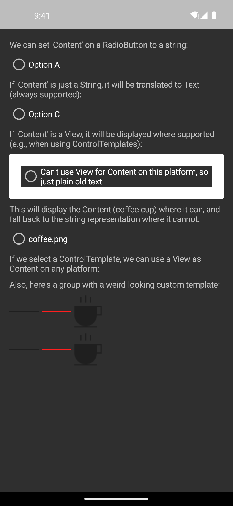</td><td>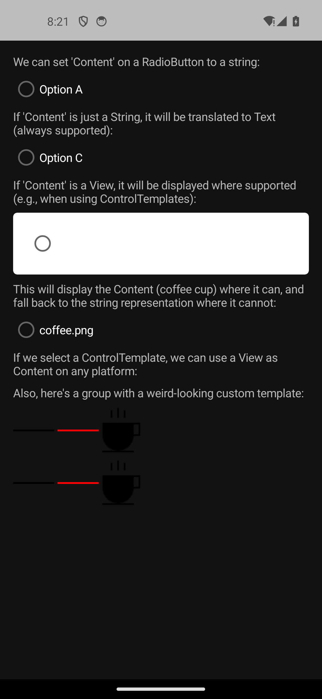</td><td>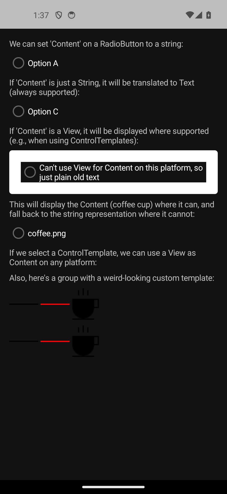</td></tr></table>

ports RadioButtonContentGallery.xaml A self-contained, code-first demo of the RadioButton.Content surface

#### 🟢 Pixel-Perfect Score — C++ (C1/C3)

Light: SSIM 0.9911, 0.27% pixels differ · Dark: SSIM 0.9971, 0.18% pixels differ

#### 🟢 Pixel-Perfect Score — C++ &amp; XAML (C2/C4)

Light: SSIM 0.9911, 0.27% pixels differ · Dark: SSIM 0.9971, 0.18% pixels differ

### 124. Radio Button Group — 🟢/🟢
radio_button_group

<table><tr><th></th><th>MAUI</th><th>C++</th><th>C++ &amp; XAML</th></tr><tr><th>Light</th><td></td><td></td><td></td></tr><tr><th>Dark</th><td></td><td></td><td></td></tr></table>

ports RadioButtonGroupGallery.xaml A self-contained, code-first demo of the RadioButtonGroup ATTACHED-PROPERTY grouping: a vertical StackLayout carries RadioButtonGroup.GroupName=&amp;quot;foo&amp;quot;, so every descendant RadioButton — including one nested

#### 🟢 Pixel-Perfect Score — C++ (C1/C3)

Light: SSIM 1.0000, 0.00% pixels differ · Dark: SSIM 0.9987, 0.15% pixels differ

#### 🟢 Pixel-Perfect Score — C++ &amp; XAML (C2/C4)

Light: SSIM 1.0000, 0.00% pixels differ · Dark: SSIM 0.9987, 0.15% pixels differ

### 125. Radio Button Group Binding — 🟢/🟢
radio_button_group_binding

<table><tr><th></th><th>MAUI</th><th>C++</th><th>C++ &amp; XAML</th></tr><tr><th>Light</th><td></td><td></td><td></td></tr><tr><th>Dark</th><td></td><td></td><td></td></tr></table>

ports RadioButtonGroupBindingGallery.xaml A code-first demo of binding the RadioButtonGroup attached properties (GroupName + SelectedValue) to a view-model

#### 🟢 Pixel-Perfect Score — C++ (C1/C3)

Light: SSIM 1.0000, 0.00% pixels differ · Dark: SSIM 0.9987, 0.15% pixels differ

#### 🟢 Pixel-Perfect Score — C++ &amp; XAML (C2/C4)

Light: SSIM 1.0000, 0.00% pixels differ · Dark: SSIM 0.9987, 0.15% pixels differ

### 126. Radio Button Group Gallery — 🟢/🟢
radio_button_group_gallery

<table><tr><th></th><th>MAUI</th><th>C++</th><th>C++ &amp; XAML</th></tr><tr><th>Light</th><td></td><td></td><td></td></tr><tr><th>Dark</th><td></td><td></td><td></td></tr></table>

ports RadioButtonGroupGalleryPage.xaml A self-contained, code-first demo of RadioButton grouping SCOPE, mirroring the C# controls gallery page (Pages/Controls/RadioButtonGalleries/RadioButtonGroupGalleryPage.xaml)

#### 🟢 Pixel-Perfect Score — C++ (C1/C3)

Light: SSIM 1.0000, 0.00% pixels differ · Dark: SSIM 0.9966, 0.42% pixels differ

#### 🟢 Pixel-Perfect Score — C++ &amp; XAML (C2/C4)

Light: SSIM 1.0000, 0.00% pixels differ · Dark: SSIM 0.9966, 0.42% pixels differ

### 127. Radio Content Properties — 🟢/🟢
radio_content_properties

<table><tr><th></th><th>MAUI</th><th>C++</th><th>C++ &amp; XAML</th></tr><tr><th>Light</th><td></td><td></td><td></td></tr><tr><th>Dark</th><td>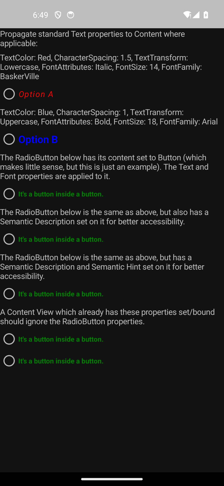</td><td></td><td>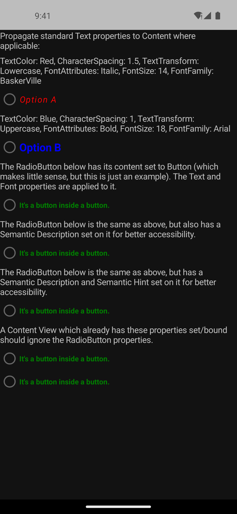</td></tr></table>

ports ContentProperties.xaml A self-contained, code-first demo of how RadioButton propagates the standard Text/Font properties to its Content

#### 🟢 Pixel-Perfect Score — C++ (C1/C3)

Light: SSIM 0.9999, 0.00% pixels differ · Dark: SSIM 0.9977, 0.26% pixels differ

#### 🟢 Pixel-Perfect Score — C++ &amp; XAML (C2/C4)

Light: SSIM 0.9999, 0.00% pixels differ · Dark: SSIM 0.9977, 0.26% pixels differ

### 128. Radio Template From Style — 🟢/🟢
radio_template_from_style

<table><tr><th></th><th>MAUI</th><th>C++</th><th>C++ &amp; XAML</th></tr><tr><th>Light</th><td></td><td></td><td></td></tr><tr><th>Dark</th><td></td><td></td><td></td></tr></table>

ports TemplateFromStyle.xaml A self-contained, code-first demo of applying a RadioButton ControlTemplate

#### 🟢 Pixel-Perfect Score — C++ (C1/C3)

Light: SSIM 0.9928, 0.12% pixels differ · Dark: SSIM 0.9886, 0.34% pixels differ

#### 🟢 Pixel-Perfect Score — C++ &amp; XAML (C2/C4)

Light: SSIM 0.9979, 0.00% pixels differ · Dark: SSIM 0.9923, 0.28% pixels differ

### 129. Rectangle Gallery — 🟢/🟢
rectangle_gallery

<table><tr><th></th><th>MAUI</th><th>C++</th><th>C++ &amp; XAML</th></tr><tr><th>Light</th><td></td><td></td><td></td></tr><tr><th>Dark</th><td></td><td></td><td></td></tr></table>

ports RectangleGallery.xaml A self-contained, code-first port of the MAUI Shapes RectangleGallery (Pages/Controls/ShapesGalleries/RectangleGallery.xaml + .xaml.cs)

#### 🟢 Pixel-Perfect Score — C++ (C1/C3)

Light: SSIM 0.9813, 0.76% pixels differ · Dark: SSIM 0.9851, 0.79% pixels differ

#### 🟢 Pixel-Perfect Score — C++ &amp; XAML (C2/C4)

Light: SSIM 0.9813, 0.76% pixels differ · Dark: SSIM 0.9851, 0.79% pixels differ

### 130. Refresh View — 🟢/🟢
refresh_view

<table><tr><th></th><th>MAUI</th><th>C++</th><th>C++ &amp; XAML</th></tr><tr><th>Light</th><td></td><td></td><td></td></tr><tr><th>Dark</th><td></td><td></td><td></td></tr></table>

ports RefreshViewPage.xaml (+ RefreshViewPage.xaml.cs + RefreshViewModel.cs) A self-contained, code-first demo page for the RefreshView control (the C# gallery-page convention, mirroring the swipe_refresh_page pattern)

#### 🟢 Pixel-Perfect Score — C++ (C1/C3)

Light: SSIM 1.0000, 0.00% pixels differ · Dark: SSIM 1.0000, 0.00% pixels differ

#### 🟢 Pixel-Perfect Score — C++ &amp; XAML (C2/C4)

Light: SSIM 1.0000, 0.00% pixels differ · Dark: SSIM 1.0000, 0.00% pixels differ

### 131. Relative Layout — 🟢/🟢
relative_layout

<table><tr><th></th><th>MAUI</th><th>C++</th><th>C++ &amp; XAML</th></tr><tr><th>Light</th><td></td><td></td><td></td></tr><tr><th>Dark</th><td></td><td></td><td></td></tr></table>

ports RelativeLayoutPage.xaml

#### 🟢 Pixel-Perfect Score — C++ (C1/C3)

Light: SSIM 0.9995, 0.01% pixels differ · Dark: SSIM 0.9995, 0.01% pixels differ

#### 🟢 Pixel-Perfect Score — C++ &amp; XAML (C2/C4)

Light: SSIM 0.9996, 0.01% pixels differ · Dark: SSIM 0.9996, 0.01% pixels differ

### 132. Scattered Radio Button — 🟢/🟢
scattered_radio_button

<table><tr><th></th><th>MAUI</th><th>C++</th><th>C++ &amp; XAML</th></tr><tr><th>Light</th><td></td><td></td><td></td></tr><tr><th>Dark</th><td></td><td></td><td></td></tr></table>

ports ScatteredRadioButtonGallery.xaml A code-first demo that radio buttons DON&amp;#x27;T have to share a container to be grouped: grouping is by GroupName, so buttons scattered across separate containers (and one bare button outside any grouped co

#### 🟢 Pixel-Perfect Score — C++ (C1/C3)

Light: SSIM 0.9947, 0.19% pixels differ · Dark: SSIM 0.9923, 0.47% pixels differ

#### 🟢 Pixel-Perfect Score — C++ &amp; XAML (C2/C4)

Light: SSIM 0.9947, 0.19% pixels differ · Dark: SSIM 0.9923, 0.47% pixels differ

### 133. Scroll Mode Test — 🟢/🟢
scroll_mode_test

<table><tr><th></th><th>MAUI</th><th>C++</th><th>C++ &amp; XAML</th></tr><tr><th>Light</th><td></td><td></td><td></td></tr><tr><th>Dark</th><td></td><td></td><td></td></tr></table>

ports ScrollModeTestGallery.xaml (+ .xaml.cs) of the C# CollectionView gallery (Maui.Controls.Sample.Pages.CollectionViewGalleries.ScrollModeGalleries.ScrollModeTestGallery)

#### 🟢 Pixel-Perfect Score — C++ (C1/C3)

Light: SSIM 0.9958, 0.18% pixels differ · Dark: SSIM 0.9957, 0.14% pixels differ

#### 🟢 Pixel-Perfect Score — C++ &amp; XAML (C2/C4)

Light: SSIM 0.9999, 0.04% pixels differ · Dark: SSIM 0.9999, 0.00% pixels differ

### 134. Scroll To Group — 🟢/🟢
scroll_to_group

<table><tr><th></th><th>MAUI</th><th>C++</th><th>C++ &amp; XAML</th></tr><tr><th>Light</th><td></td><td></td><td></td></tr><tr><th>Dark</th><td>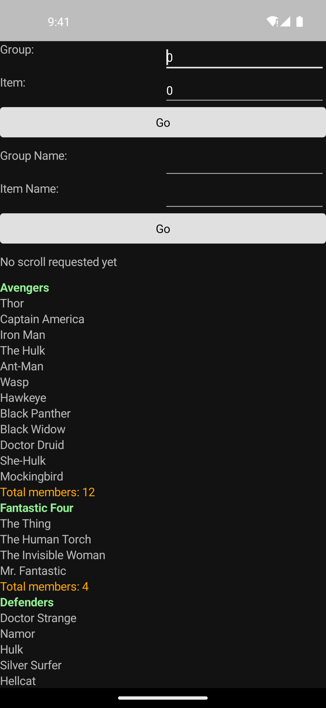</td><td></td><td>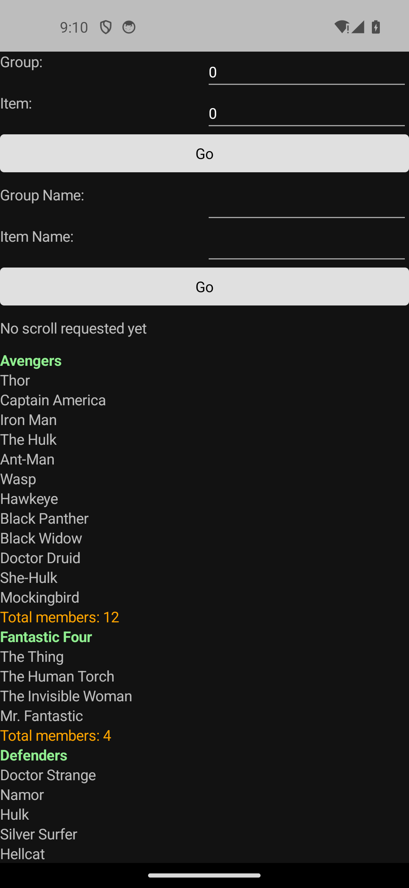</td></tr></table>

ports ScrollToGalleries/ScrollToGroup.xaml (+ .xaml.cs) of the C# CollectionView gallery

#### 🟢 Pixel-Perfect Score — C++ (C1/C3)

Light: SSIM 0.9999, 0.01% pixels differ · Dark: SSIM 0.9999, 0.00% pixels differ

#### 🟢 Pixel-Perfect Score — C++ &amp; XAML (C2/C4)

Light: SSIM 1.0000, 0.01% pixels differ · Dark: SSIM 0.9999, 0.00% pixels differ

### 135. Scroll View — 🟢/🟢
scroll_view

<table><tr><th></th><th>MAUI</th><th>C++</th><th>C++ &amp; XAML</th></tr><tr><th>Light</th><td></td><td></td><td></td></tr><tr><th>Dark</th><td>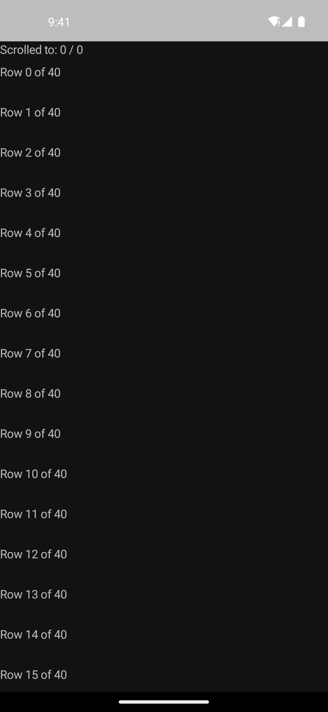</td><td>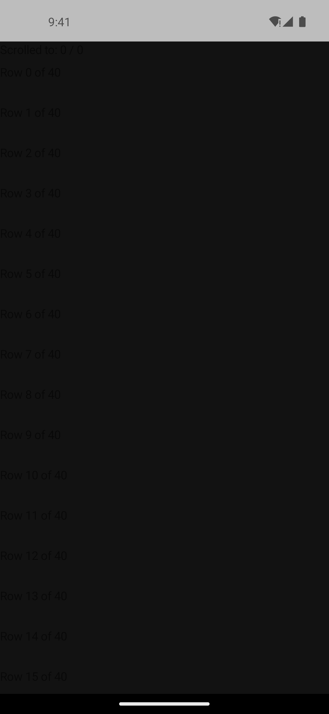</td><td>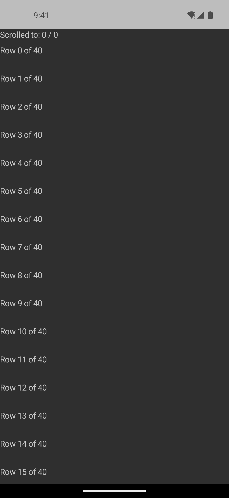</td></tr></table>

ports ScrollViewPage.xaml (+ the ScrollViewPages sub-demos: ScrollViewOrientationPage / ScrollToEndPage / ScrollToFromConstructorPage), code-first

#### 🟢 Pixel-Perfect Score — C++ (C1/C3)

Light: SSIM 0.9965, 0.41% pixels differ · Dark: SSIM 0.9994, 0.00% pixels differ

#### 🟢 Pixel-Perfect Score — C++ &amp; XAML (C2/C4)

Light: SSIM 0.9965, 0.41% pixels differ · Dark: SSIM 0.9995, 0.00% pixels differ

### 136. Search Bar — 🔴/🔴
search_bar

<table><tr><th></th><th>MAUI</th><th>C++</th><th>C++ &amp; XAML</th></tr><tr><th>Light</th><td></td><td></td><td></td></tr><tr><th>Dark</th><td>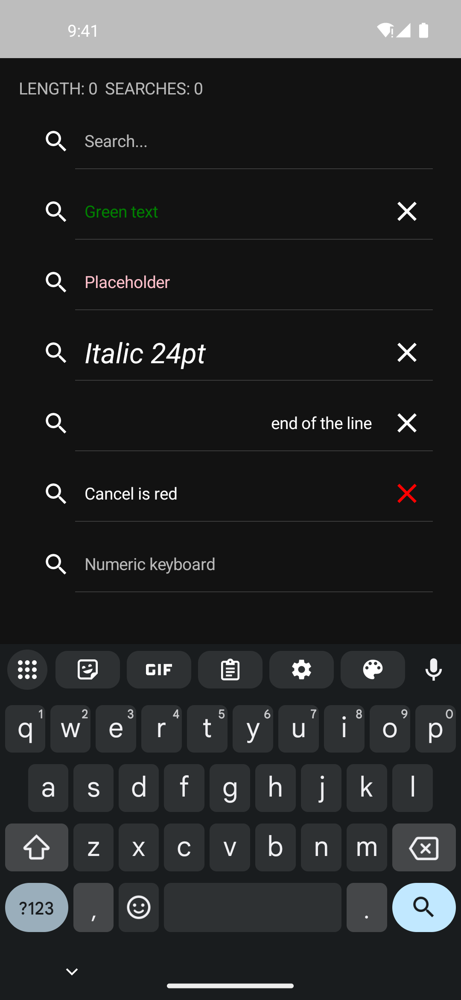</td><td>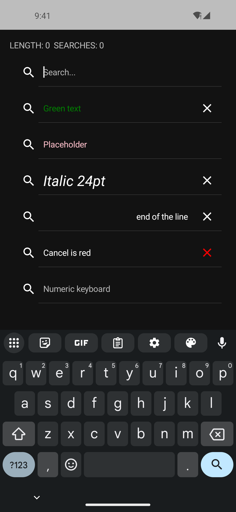</td><td>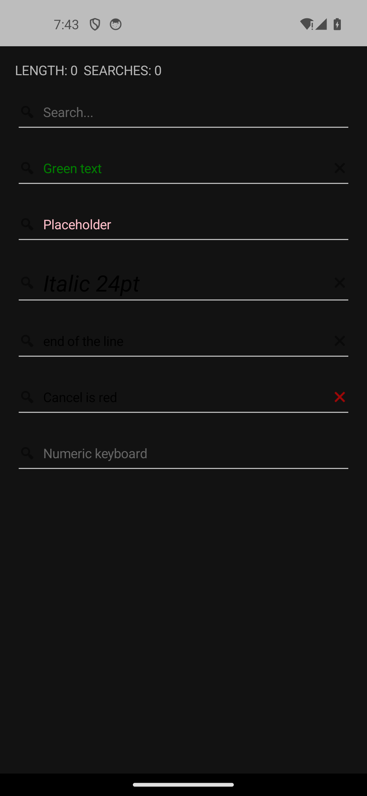</td></tr></table>

ports SearchBarPage.xaml (Microsoft.Maui.Controls sample gallery)

#### 🔴 Pixel-Perfect Score — C++ (C1/C3)

Light: SSIM 0.9053, 2.68% pixels differ · Dark: SSIM 0.8988, 2.95% pixels differ

#### 🔴 Pixel-Perfect Score — C++ &amp; XAML (C2/C4)

Light: SSIM 0.9053, 2.68% pixels differ · Dark: SSIM 0.8988, 2.95% pixels differ

### 137. Selection Command Param — 🟢/🟢
selection_command_param

<table><tr><th></th><th>MAUI</th><th>C++</th><th>C++ &amp; XAML</th></tr><tr><th>Light</th><td></td><td></td><td></td></tr><tr><th>Dark</th><td></td><td></td><td></td></tr></table>

ports SelectionChangedCommandParameter.xaml (+ .xaml.cs) (Maui.Controls.Sample.Pages.CollectionViewGalleries.SelectionGalleries.SelectionChangedCommandParameter)

#### 🟢 Pixel-Perfect Score — C++ (C1/C3)

Light: SSIM 1.0000, 0.00% pixels differ · Dark: SSIM 0.9999, 0.00% pixels differ

#### 🟢 Pixel-Perfect Score — C++ &amp; XAML (C2/C4)

Light: SSIM 1.0000, 0.00% pixels differ · Dark: SSIM 0.9999, 0.00% pixels differ

### 138. Selection Synchronization — 🟢/🟢
selection_synchronization

<table><tr><th></th><th>MAUI</th><th>C++</th><th>C++ &amp; XAML</th></tr><tr><th>Light</th><td></td><td></td><td></td></tr><tr><th>Dark</th><td>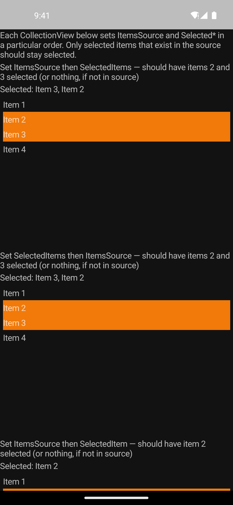</td><td>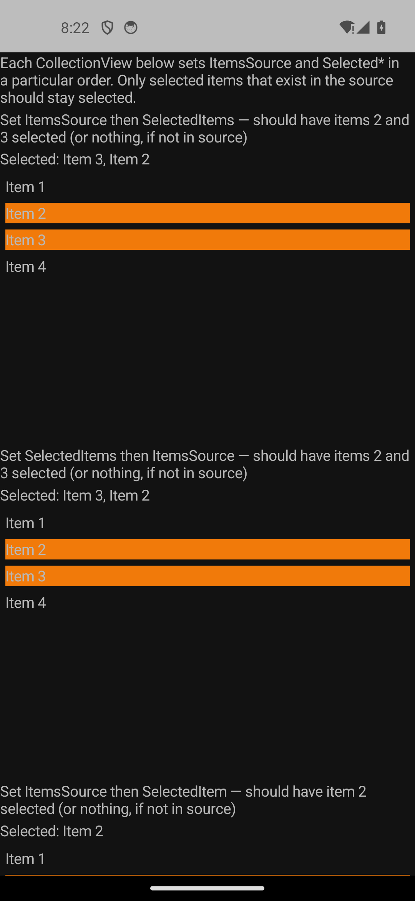</td><td>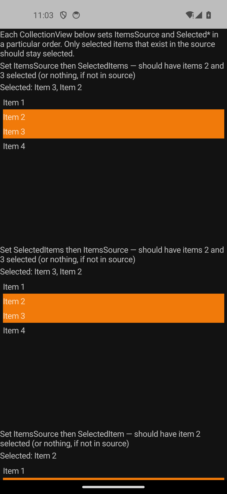</td></tr></table>

ports SelectionSynchronization.xaml (+ .xaml.cs) (Maui.Controls.Sample.Pages.CollectionViewGalleries.SelectionGalleries.SelectionSynchronization)

#### 🟢 Pixel-Perfect Score — C++ (C1/C3)

Light: SSIM 0.9875, 0.73% pixels differ · Dark: SSIM 0.9873, 0.80% pixels differ

#### 🟢 Pixel-Perfect Score — C++ &amp; XAML (C2/C4)

Light: SSIM 0.9875, 0.73% pixels differ · Dark: SSIM 0.9873, 0.80% pixels differ

### 139. Semantics — 🟢/🟢
semantics

<table><tr><th></th><th>MAUI</th><th>C++</th><th>C++ &amp; XAML</th></tr><tr><th>Light</th><td></td><td></td><td></td></tr><tr><th>Dark</th><td>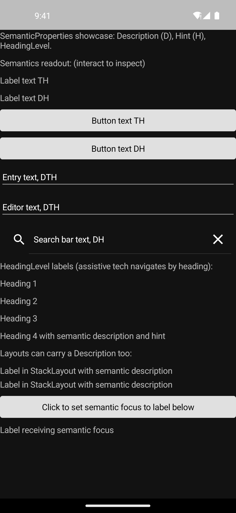</td><td>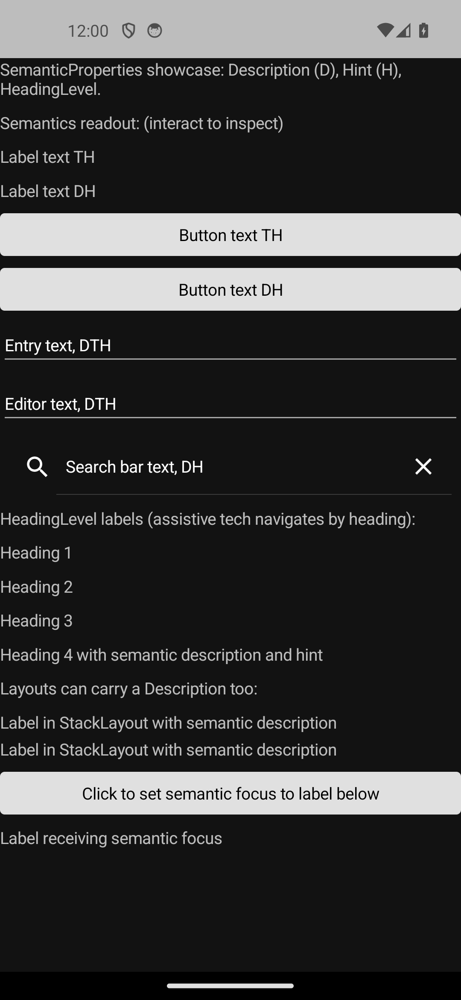</td><td>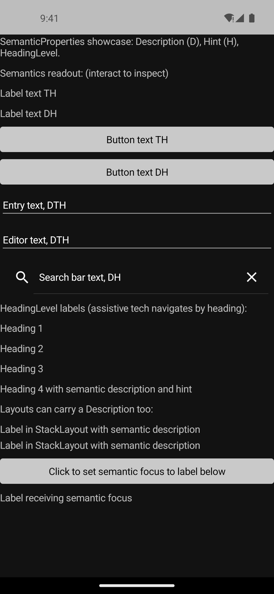</td></tr></table>

ports SemanticsPage.xaml (+ SemanticsPage.xaml.cs) The C# SemanticsPage is an accessibility showcase: a long VerticalStackLayout where nearly every control carries SemanticProperties.Description / .Hint, plus a block of labels exercising Se

#### 🟢 Pixel-Perfect Score — C++ (C1/C3)

Light: SSIM 0.9843, 0.60% pixels differ · Dark: SSIM 0.9830, 0.49% pixels differ

#### 🟢 Pixel-Perfect Score — C++ &amp; XAML (C2/C4)

Light: SSIM 0.9843, 0.60% pixels differ · Dark: SSIM 0.9830, 0.49% pixels differ

### 140. Shadow Playground — 🟢/🟢
shadow_playground

<table><tr><th></th><th>MAUI</th><th>C++</th><th>C++ &amp; XAML</th></tr><tr><th>Light</th><td></td><td></td><td></td></tr><tr><th>Dark</th><td></td><td></td><td></td></tr></table>

ports ShadowPlaygroundPage.xaml A self-contained, code-first demo of the view Shadow surface, mirroring the C# core gallery page (Pages/Core/ShadowGalleries/ShadowPlaygroundPage.xaml + .xaml.cs)

#### 🟢 Pixel-Perfect Score — C++ (C1/C3)

Light: SSIM 0.9993, 0.10% pixels differ · Dark: SSIM 0.9997, 0.02% pixels differ

#### 🟢 Pixel-Perfect Score — C++ &amp; XAML (C2/C4)

Light: SSIM 0.9993, 0.10% pixels differ · Dark: SSIM 0.9996, 0.02% pixels differ

### 141. Shape App Theme — 🟢/🔴
shape_app_theme

<table><tr><th></th><th>MAUI</th><th>C++</th><th>C++ &amp; XAML</th></tr><tr><th>Light</th><td></td><td></td><td></td></tr><tr><th>Dark</th><td></td><td></td><td></td></tr></table>

ports ShapeAppThemeGallery.xaml A code-first port of the MAUI Shapes sub-gallery Pages/Controls/ShapesGalleries/ShapeAppThemeGallery.xaml: a StackLayout (Padding 12) holding a caption Label and a 200x80 Rectangle, all themed via {AppThemeBi

#### 🟢 Pixel-Perfect Score — C++ (C1/C3)

Light: SSIM 1.0000, 0.00% pixels differ · Dark: SSIM 1.0000, 0.00% pixels differ

#### 🔴 Pixel-Perfect Score — C++ &amp; XAML (C2/C4)

Light: SSIM 1.0000, 0.00% pixels differ · Dark: SSIM 0.0726, 97.00% pixels differ

### 142. Shapes — 🟢/🟢
shapes

<table><tr><th></th><th>MAUI</th><th>C++</th><th>C++ &amp; XAML</th></tr><tr><th>Light</th><td></td><td></td><td></td></tr><tr><th>Dark</th><td></td><td></td><td></td></tr></table>

a faithful reproduction of the maui-compare &amp;quot;shapes&amp;quot; demo (ComparePages.Shapes()), the shipped-.NET-MAUI reference for the visual-parity comparison: a ScrollView over a vertical stack of four LABELLED shapes, each bold-captioned and Start-a

#### 🟢 Pixel-Perfect Score — C++ (C1/C3)

Light: SSIM 0.9996, 0.01% pixels differ · Dark: SSIM 0.9997, 0.01% pixels differ

#### 🟢 Pixel-Perfect Score — C++ &amp; XAML (C2/C4)

Light: SSIM 0.9996, 0.01% pixels differ · Dark: SSIM 0.9997, 0.01% pixels differ

### 143. Single Bound Selection — 🟢/🟢
single_bound_selection

<table><tr><th></th><th>MAUI</th><th>C++</th><th>C++ &amp; XAML</th></tr><tr><th>Light</th><td></td><td></td><td></td></tr><tr><th>Dark</th><td></td><td></td><td></td></tr></table>

ports SingleBoundSelection.xaml (+ .xaml.cs) (Maui.Controls.Sample.Pages.CollectionViewGalleries.SelectionGalleries.SingleBoundSelection)

#### 🟢 Pixel-Perfect Score — C++ (C1/C3)

Light: SSIM 1.0000, 0.00% pixels differ · Dark: SSIM 1.0000, 0.00% pixels differ

#### 🟢 Pixel-Perfect Score — C++ &amp; XAML (C2/C4)

Light: SSIM 1.0000, 0.00% pixels differ · Dark: SSIM 1.0000, 0.00% pixels differ

### 144. Slider — 🟡/🟡
slider

<table><tr><th></th><th>MAUI</th><th>C++</th><th>C++ &amp; XAML</th></tr><tr><th>Light</th><td></td><td></td><td></td></tr><tr><th>Dark</th><td>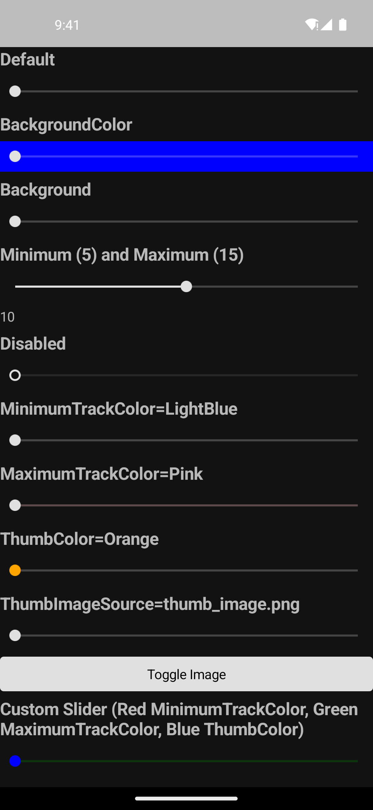</td><td>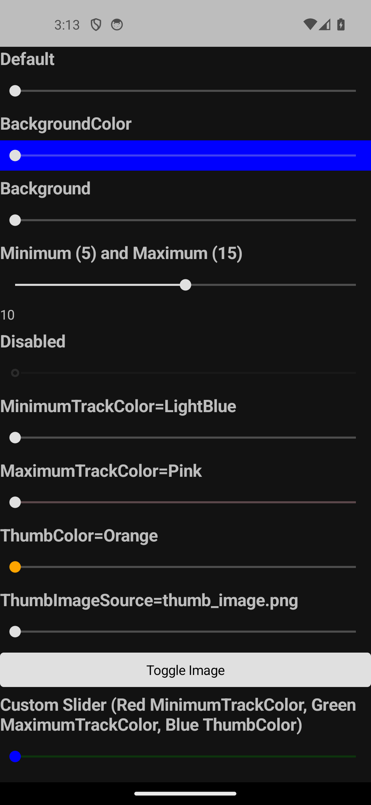</td><td></td></tr></table>

ports SliderPage.xaml (+ .xaml.cs) Mirrors the MAUI gallery page: a vertical stack of headlined Slider states — Default, BackgroundColor (Blue), Background (yellow→green LinearGradientBrush), Minimum(5)/Maximum(15) with a value readout (Val

#### 🟡 Pixel-Perfect Score — C++ (C1/C3)

Light: SSIM 0.9862, 0.85% pixels differ · Dark: SSIM 0.9894, 1.14% pixels differ

#### 🟡 Pixel-Perfect Score — C++ &amp; XAML (C2/C4)

Light: SSIM 0.9862, 0.85% pixels differ · Dark: SSIM 0.9894, 1.14% pixels differ

### 145. Some Empty Groups — 🟢/🟢
some_empty_groups

<table><tr><th></th><th>MAUI</th><th>C++</th><th>C++ &amp; XAML</th></tr><tr><th>Light</th><td></td><td></td><td></td></tr><tr><th>Dark</th><td></td><td></td><td></td></tr></table>

ports GroupingGalleries/SomeEmptyGroups.xaml (+ .xaml.cs)

#### 🟢 Pixel-Perfect Score — C++ (C1/C3)

Light: SSIM 0.9946, 0.36% pixels differ · Dark: SSIM 0.9937, 0.40% pixels differ

#### 🟢 Pixel-Perfect Score — C++ &amp; XAML (C2/C4)

Light: SSIM 1.0000, 0.00% pixels differ · Dark: SSIM 1.0000, 0.00% pixels differ

### 146. Stack Layout — 🟢/🟢
stack_layout

<table><tr><th></th><th>MAUI</th><th>C++</th><th>C++ &amp; XAML</th></tr><tr><th>Light</th><td></td><td></td><td></td></tr><tr><th>Dark</th><td></td><td></td><td></td></tr></table>

ports StackLayoutPage.xaml Demonstrates the generic maui::controls::stack_layout (the orientation-switching sibling of the fixed vertical/horizontal stacks) by nesting two inner stacks inside an outer vertical stack with a 12px margin: a &amp;quot;V

#### 🟢 Pixel-Perfect Score — C++ (C1/C3)

Light: SSIM 1.0000, 0.00% pixels differ · Dark: SSIM 1.0000, 0.00% pixels differ

#### 🟢 Pixel-Perfect Score — C++ &amp; XAML (C2/C4)

Light: SSIM 1.0000, 0.00% pixels differ · Dark: SSIM 1.0000, 0.00% pixels differ

### 147. Staggered Layout — 🟢/🟢
staggered_layout

<table><tr><th></th><th>MAUI</th><th>C++</th><th>C++ &amp; XAML</th></tr><tr><th>Light</th><td></td><td></td><td></td></tr><tr><th>Dark</th><td></td><td></td><td></td></tr></table>

ports AlternateLayoutGalleries/StaggeredLayout.xaml (+ StaggeredLayout.xaml.cs) of the C# CollectionView gallery

#### 🟢 Pixel-Perfect Score — C++ (C1/C3)

Light: SSIM 1.0000, 0.00% pixels differ · Dark: SSIM 1.0000, 0.00% pixels differ

#### 🟢 Pixel-Perfect Score — C++ &amp; XAML (C2/C4)

Light: SSIM 1.0000, 0.00% pixels differ · Dark: SSIM 1.0000, 0.00% pixels differ

### 148. Stepper — 🟡/🟡
stepper

<table><tr><th></th><th>MAUI</th><th>C++</th><th>C++ &amp; XAML</th></tr><tr><th>Light</th><td></td><td></td><td></td></tr><tr><th>Dark</th><td>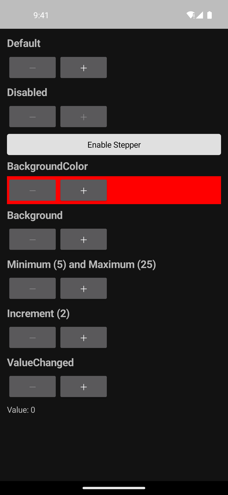</td><td>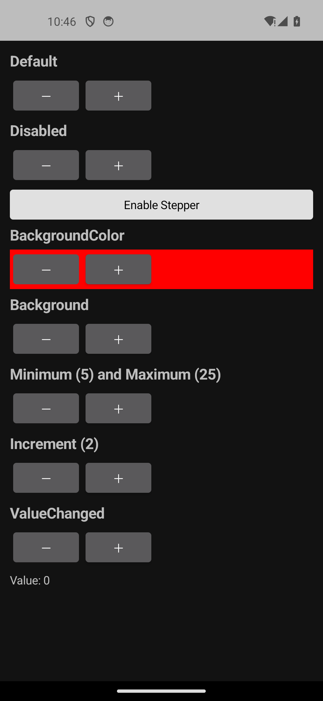</td><td></td></tr></table>

ports StepperPage.xaml (+ StepperPage.xaml.cs)

#### 🟡 Pixel-Perfect Score — C++ (C1/C3)

Light: SSIM 0.9873, 7.37% pixels differ · Dark: SSIM 0.9976, 0.08% pixels differ

#### 🟡 Pixel-Perfect Score — C++ &amp; XAML (C2/C4)

Light: SSIM 0.9873, 7.37% pixels differ · Dark: SSIM 0.9976, 0.08% pixels differ

### 149. Styles — 🟢/🟢
styles

<table><tr><th></th><th>MAUI</th><th>C++</th><th>C++ &amp; XAML</th></tr><tr><th>Light</th><td></td><td></td><td></td></tr><tr><th>Dark</th><td></td><td></td><td></td></tr></table>

ports StylesPage.xaml

#### 🟢 Pixel-Perfect Score — C++ (C1/C3)

Light: SSIM 0.9998, 0.01% pixels differ · Dark: SSIM 0.9998, 0.01% pixels differ

#### 🟢 Pixel-Perfect Score — C++ &amp; XAML (C2/C4)

Light: SSIM 0.9998, 0.01% pixels differ · Dark: SSIM 0.9998, 0.01% pixels differ

### 150. Swipe Gesture — 🟢/🟢
swipe_gesture

<table><tr><th></th><th>MAUI</th><th>C++</th><th>C++ &amp; XAML</th></tr><tr><th>Light</th><td></td><td></td><td></td></tr><tr><th>Dark</th><td></td><td></td><td></td></tr></table>

ports SwipeViewGestureRecognizerGallery.xaml (+ .xaml.cs) The MAUI SwipeViewGestureRecognizerGallery is a CollectionView of &amp;quot;message&amp;quot; rows; each row&amp;#x27;s DataTemplate is a SwipeView wired three ways, proving gesture recognizers AND swipe-item

#### 🟢 Pixel-Perfect Score — C++ (C1/C3)

Light: SSIM 1.0000, 0.00% pixels differ · Dark: SSIM 1.0000, 0.00% pixels differ

#### 🟢 Pixel-Perfect Score — C++ &amp; XAML (C2/C4)

Light: SSIM 1.0000, 0.00% pixels differ · Dark: SSIM 1.0000, 0.00% pixels differ

### 151. Swipe Item Position — 🟢/🟢
swipe_item_position

<table><tr><th></th><th>MAUI</th><th>C++</th><th>C++ &amp; XAML</th></tr><tr><th>Light</th><td></td><td></td><td></td></tr><tr><th>Dark</th><td></td><td></td><td></td></tr></table>

ports SwipeItemPositionGallery.xaml A code-first port of the MAUI SwipeView sub-gallery Pages/Controls/SwipeViewGalleries/SwipeItemPositionGallery.xaml: a 2-row Grid (Auto / *) with a Picker on top and one SwipeView below that carries TWO S

#### 🟢 Pixel-Perfect Score — C++ (C1/C3)

Light: SSIM 0.9999, 0.09% pixels differ · Dark: SSIM 0.9966, 0.11% pixels differ

#### 🟢 Pixel-Perfect Score — C++ &amp; XAML (C2/C4)

Light: SSIM 0.9999, 0.09% pixels differ · Dark: SSIM 0.9966, 0.11% pixels differ

### 152. Swipe Item Size — 🟢/🟢
swipe_item_size

<table><tr><th></th><th>MAUI</th><th>C++</th><th>C++ &amp; XAML</th></tr><tr><th>Light</th><td></td><td></td><td></td></tr><tr><th>Dark</th><td></td><td></td><td></td></tr></table>

ports SwipeItemSizeGallery.xaml A self-contained, code-first port of the .NET MAUI &amp;quot;SwipeItem Size Gallery&amp;quot;: a scrolling stack of swipe_views demonstrating how a left SwipeItem&amp;#x27;s icon size and the SwipeView content size interact

#### 🟢 Pixel-Perfect Score — C++ (C1/C3)

Light: SSIM 0.9948, 0.61% pixels differ · Dark: SSIM 0.9942, 0.61% pixels differ

#### 🟢 Pixel-Perfect Score — C++ &amp; XAML (C2/C4)

Light: SSIM 0.9948, 0.61% pixels differ · Dark: SSIM 0.9942, 0.61% pixels differ

### 153. Swipe Refresh — 🟢/🟢
swipe_refresh

<table><tr><th></th><th>MAUI</th><th>C++</th><th>C++ &amp; XAML</th></tr><tr><th>Light</th><td></td><td></td><td></td></tr><tr><th>Dark</th><td>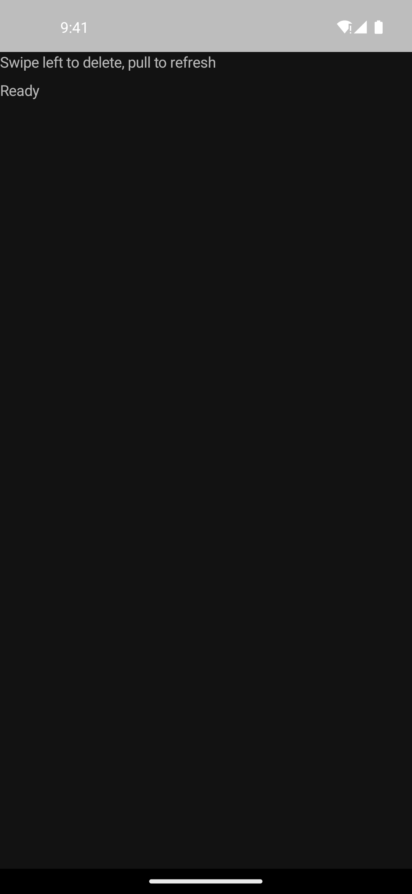</td><td>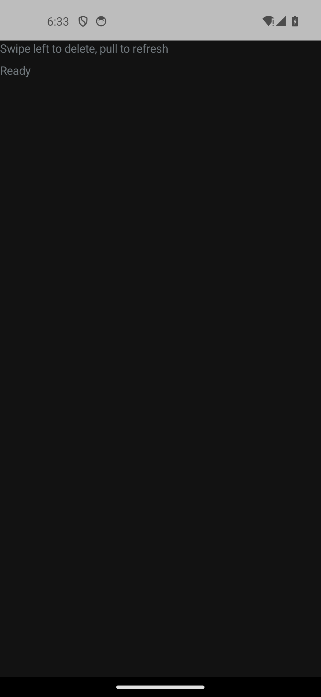</td><td>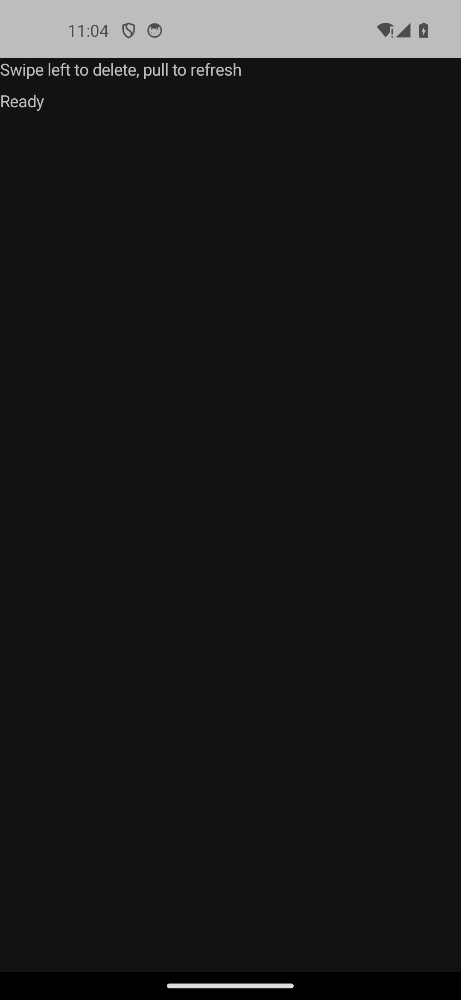</td></tr></table>

a self-contained demo page for the W2-20 swipe + refresh controls: a refresh_view wrapping a swipe_view (which itself wraps a labeled row), with a readout label reflecting the latest interaction

#### 🟢 Pixel-Perfect Score — C++ (C1/C3)

Light: SSIM 1.0000, 0.00% pixels differ · Dark: SSIM 1.0000, 0.00% pixels differ

#### 🟢 Pixel-Perfect Score — C++ &amp; XAML (C2/C4)

Light: SSIM 1.0000, 0.00% pixels differ · Dark: SSIM 1.0000, 0.00% pixels differ

### 154. Swipe Threshold — 🟢/🟢
swipe_threshold

<table><tr><th></th><th>MAUI</th><th>C++</th><th>C++ &amp; XAML</th></tr><tr><th>Light</th><td></td><td></td><td></td></tr><tr><th>Dark</th><td></td><td></td><td></td></tr></table>

ports HorizontalSwipeThresholdGallery.xaml (+ .xaml.cs) The MAUI HorizontalSwipeThresholdGallery shows how SwipeView.Threshold (the swipe distance, in DIPs, the user must drag before the items settle open / execute) interacts with SwipeItem

#### 🟢 Pixel-Perfect Score — C++ (C1/C3)

Light: SSIM 0.9997, 0.01% pixels differ · Dark: SSIM 0.9997, 0.01% pixels differ

#### 🟢 Pixel-Perfect Score — C++ &amp; XAML (C2/C4)

Light: SSIM 0.9997, 0.01% pixels differ · Dark: SSIM 0.9997, 0.01% pixels differ

### 155. Swipe View Margin — 🟢/🟢
swipe_view_margin

<table><tr><th></th><th>MAUI</th><th>C++</th><th>C++ &amp; XAML</th></tr><tr><th>Light</th><td></td><td></td><td></td></tr><tr><th>Dark</th><td></td><td></td><td></td></tr></table>

ports SwipeViewMarginGallery.xaml A self-contained, code-first port of the .NET MAUI &amp;quot;SwipeView Margin Gallery&amp;quot;: two swipe_views whose content&amp;#x27;s Margin + Padding are driven by two sliders, demonstrating that the revealed SwipeItems stay cor

#### 🟢 Pixel-Perfect Score — C++ (C1/C3)

Light: SSIM 0.9999, 0.01% pixels differ · Dark: SSIM 0.9997, 0.01% pixels differ

#### 🟢 Pixel-Perfect Score — C++ &amp; XAML (C2/C4)

Light: SSIM 0.9999, 0.01% pixels differ · Dark: SSIM 0.9997, 0.01% pixels differ

### 156. Swipe View Shadow — 🟢/🟢
swipe_view_shadow

<table><tr><th></th><th>MAUI</th><th>C++</th><th>C++ &amp; XAML</th></tr><tr><th>Light</th><td></td><td></td><td></td></tr><tr><th>Dark</th><td></td><td></td><td></td></tr></table>

ports SwipeViewShadowGallery.xaml A code-first port of the MAUI SwipeView sub-gallery Pages/Controls/SwipeViewGalleries/SwipeViewShadowGallery.xaml: a padded vertical StackLayout proving a drop Shadow renders correctly on SwipeView content

#### 🟢 Pixel-Perfect Score — C++ (C1/C3)

Light: SSIM 0.9867, 0.67% pixels differ · Dark: SSIM 0.9924, 0.09% pixels differ

#### 🟢 Pixel-Perfect Score — C++ &amp; XAML (C2/C4)

Light: SSIM 0.9867, 0.67% pixels differ · Dark: SSIM 0.9924, 0.09% pixels differ

### 157. Switch — 🟢/🟢
switch

<table><tr><th></th><th>MAUI</th><th>C++</th><th>C++ &amp; XAML</th></tr><tr><th>Light</th><td></td><td></td><td></td></tr><tr><th>Dark</th><td>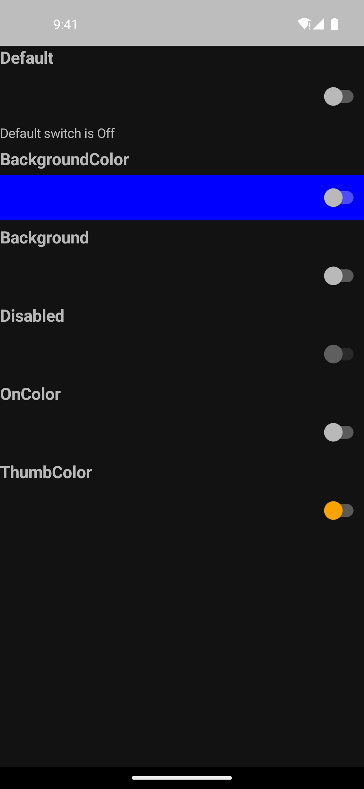</td><td></td><td></td></tr></table>

ports SwitchPage.xaml (+ .xaml.cs) Mirrors the MAUI gallery page: a vertical stack of headlined Switch states — Default, BackgroundColor (Blue), Background (a yellow→green LinearGradientBrush), Disabled, OnColor (Red), ThumbColor (Orange)

#### 🟢 Pixel-Perfect Score — C++ (C1/C3)

Light: SSIM 0.9974, 0.35% pixels differ · Dark: SSIM 0.9984, 0.74% pixels differ

#### 🟢 Pixel-Perfect Score — C++ &amp; XAML (C2/C4)

Light: SSIM 0.9974, 0.35% pixels differ · Dark: SSIM 0.9984, 0.74% pixels differ

### 158. Switch Grouping — 🟢/🟢
switch_grouping

<table><tr><th></th><th>MAUI</th><th>C++</th><th>C++ &amp; XAML</th></tr><tr><th>Light</th><td></td><td></td><td></td></tr><tr><th>Dark</th><td></td><td></td><td></td></tr></table>

ports CollectionViewGalleries/GroupingGalleries/ SwitchGrouping.xaml (+ .xaml.cs) of the C# CollectionView gallery

#### 🟢 Pixel-Perfect Score — C++ (C1/C3)

Light: SSIM 0.9994, 0.01% pixels differ · Dark: SSIM 0.9990, 0.03% pixels differ

#### 🟢 Pixel-Perfect Score — C++ &amp; XAML (C2/C4)

Light: SSIM 0.9994, 0.01% pixels differ · Dark: SSIM 0.9990, 0.03% pixels differ

### 159. Tabbed Flyout — 🟢/🟢
tabbed_flyout

<table><tr><th></th><th>MAUI</th><th>C++</th><th>C++ &amp; XAML</th></tr><tr><th>Light</th><td></td><td></td><td></td></tr><tr><th>Dark</th><td></td><td></td><td></td></tr></table>

a self-contained demo page for the W1-10 tabbed + flyout vertical: a flyout_page whose FLYOUT pane is a titled menu (two buttons selecting the detail&amp;#x27;s tabs + a &amp;quot;Toggle flyout&amp;quot; presenting/dismissing itself) and whose DETAIL pane is a tabbed

#### 🟢 Pixel-Perfect Score — C++ (C1/C3)

Light: SSIM 1.0000, 0.00% pixels differ · Dark: SSIM 1.0000, 0.00% pixels differ

#### 🟢 Pixel-Perfect Score — C++ &amp; XAML (C2/C4)

Light: SSIM 1.0000, 0.00% pixels differ · Dark: SSIM 1.0000, 0.00% pixels differ

### 160. Templated View — 🟢/🟢
templated_view

<table><tr><th></th><th>MAUI</th><th>C++</th><th>C++ &amp; XAML</th></tr><tr><th>Light</th><td></td><td></td><td></td></tr><tr><th>Dark</th><td></td><td></td><td></td></tr></table>

ports TemplatedViewPage.xaml The C# page contrasts a standard CardView control with a compact one driven by a ControlTemplate (&amp;quot;CardViewCompressed&amp;quot;) and a custom Rate control built entirely from a ControlTemplate + a heart PathGeometry

#### 🟢 Pixel-Perfect Score — C++ (C1/C3)

Light: SSIM 0.9916, 0.50% pixels differ · Dark: SSIM 0.9912, 0.54% pixels differ

#### 🟢 Pixel-Perfect Score — C++ &amp; XAML (C2/C4)

Light: SSIM 0.9916, 0.50% pixels differ · Dark: SSIM 0.9912, 0.54% pixels differ

### 161. Time Picker — 🟡/🟡
time_picker

<table><tr><th></th><th>MAUI</th><th>C++</th><th>C++ &amp; XAML</th></tr><tr><th>Light</th><td></td><td></td><td></td></tr><tr><th>Dark</th><td></td><td></td><td></td></tr></table>

ports TimePickerPage.xaml (+ TimePickerPage.xaml.cs)

#### 🟡 Pixel-Perfect Score — C++ (C1/C3)

Light: SSIM 0.9891, 1.40% pixels differ · Dark: SSIM 0.9653, 0.72% pixels differ

#### 🟡 Pixel-Perfect Score — C++ &amp; XAML (C2/C4)

Light: SSIM 0.9891, 1.40% pixels differ · Dark: SSIM 0.9653, 0.72% pixels differ

### 162. Title Bar — 🟢/🟢
title_bar

<table><tr><th></th><th>MAUI</th><th>C++</th><th>C++ &amp; XAML</th></tr><tr><th>Light</th><td></td><td></td><td></td></tr><tr><th>Dark</th><td>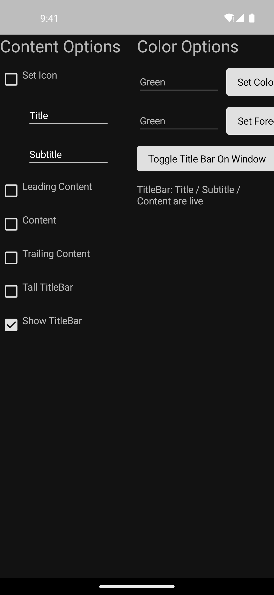</td><td></td><td>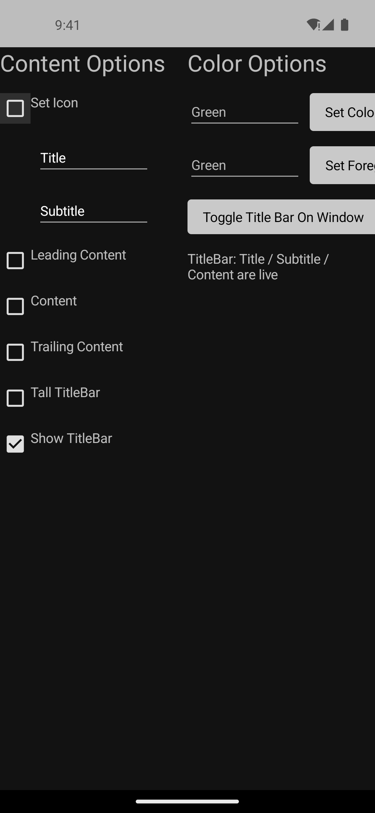</td></tr></table>

ports TitleBarPage.xaml A self-contained, code-first demo of the TitleBar control

#### 🟢 Pixel-Perfect Score — C++ (C1/C3)

Light: SSIM 1.0000, 0.06% pixels differ · Dark: SSIM 1.0000, 0.00% pixels differ

#### 🟢 Pixel-Perfect Score — C++ &amp; XAML (C2/C4)

Light: SSIM 0.9999, 0.06% pixels differ · Dark: SSIM 1.0000, 0.00% pixels differ

### 163. Toolbar — 🟢/🟢
toolbar

<table><tr><th></th><th>MAUI</th><th>C++</th><th>C++ &amp; XAML</th></tr><tr><th>Light</th><td></td><td></td><td></td></tr><tr><th>Dark</th><td></td><td></td><td></td></tr></table>

ports ToolbarPage.xaml (Maui.Controls.Sample.Pages.ToolbarPage)

#### 🟢 Pixel-Perfect Score — C++ (C1/C3)

Light: SSIM 1.0000, 0.00% pixels differ · Dark: SSIM 1.0000, 0.00% pixels differ

#### 🟢 Pixel-Perfect Score — C++ &amp; XAML (C2/C4)

Light: SSIM 1.0000, 0.00% pixels differ · Dark: SSIM 1.0000, 0.00% pixels differ

### 164. Transform Playground — 🟢/🟢
transform_playground

<table><tr><th></th><th>MAUI</th><th>C++</th><th>C++ &amp; XAML</th></tr><tr><th>Light</th><td></td><td></td><td></td></tr><tr><th>Dark</th><td></td><td></td><td></td></tr></table>

ports TransformPlaygroundGallery.xaml A code-first port of the MAUI Shapes sub-gallery Pages/Controls/ShapesGalleries/TransformPlaygroundGallery.xaml: a 50x50 Path rectangle (red fill, blue stroke 4) sits in a 200x200 light-grey panel; belo

#### 🟢 Pixel-Perfect Score — C++ (C1/C3)

Light: SSIM 0.9959, 0.24% pixels differ · Dark: SSIM 0.9957, 0.29% pixels differ

#### 🟢 Pixel-Perfect Score — C++ &amp; XAML (C2/C4)

Light: SSIM 0.9996, 0.00% pixels differ · Dark: SSIM 0.9994, 0.05% pixels differ

### 165. Transformations — 🟢/🟢
transformations

<table><tr><th></th><th>MAUI</th><th>C++</th><th>C++ &amp; XAML</th></tr><tr><th>Light</th><td></td><td></td><td></td></tr><tr><th>Dark</th><td></td><td></td><td></td></tr></table>

ports TransformationsPage.xaml (+ .xaml.cs) The MAUI TransformationsPage drives a single target view&amp;#x27;s render transforms from a column of knobs: Sliders for Scale / ScaleX / ScaleY (Maximum 10) and Rotation / RotationX / RotationY (Maximum

#### 🟢 Pixel-Perfect Score — C++ (C1/C3)

Light: SSIM 0.9993, 0.01% pixels differ · Dark: SSIM 0.9989, 0.06% pixels differ

#### 🟢 Pixel-Perfect Score — C++ &amp; XAML (C2/C4)

Light: SSIM 0.9993, 0.01% pixels differ · Dark: SSIM 0.9989, 0.06% pixels differ

### 166. Triggers — 🟢/🟢
triggers

<table><tr><th></th><th>MAUI</th><th>C++</th><th>C++ &amp; XAML</th></tr><tr><th>Light</th><td></td><td></td><td></td></tr><tr><th>Dark</th><td></td><td></td><td></td></tr></table>

ports TriggersPage.xaml

#### 🟢 Pixel-Perfect Score — C++ (C1/C3)

Light: SSIM 1.0000, 0.00% pixels differ · Dark: SSIM 1.0000, 0.00% pixels differ

#### 🟢 Pixel-Perfect Score — C++ &amp; XAML (C2/C4)

Light: SSIM 1.0000, 0.00% pixels differ · Dark: SSIM 1.0000, 0.00% pixels differ

### 167. Update Path Data — 🟢/🟢
update_path_data

<table><tr><th></th><th>MAUI</th><th>C++</th><th>C++ &amp; XAML</th></tr><tr><th>Light</th><td></td><td></td><td></td></tr><tr><th>Dark</th><td></td><td></td><td></td></tr></table>

ports UpdatePathDataGallery.xaml A code-first port of the MAUI Shapes sub-gallery Pages/Controls/ShapesGalleries/UpdatePathDataGallery.xaml: a 2-row Grid (RowSpacing 0) that proves a Path repaints when its Data geometry is replaced at runti

#### 🟢 Pixel-Perfect Score — C++ (C1/C3)

Light: SSIM 1.0000, 0.00% pixels differ · Dark: SSIM 1.0000, 0.00% pixels differ

#### 🟢 Pixel-Perfect Score — C++ &amp; XAML (C2/C4)

Light: SSIM 1.0000, 0.00% pixels differ · Dark: SSIM 1.0000, 0.00% pixels differ

### 168. Varied Size Selector — 🟡/🟡
varied_size_selector

<table><tr><th></th><th>MAUI</th><th>C++</th><th>C++ &amp; XAML</th></tr><tr><th>Light</th><td></td><td></td><td></td></tr><tr><th>Dark</th><td></td><td></td><td></td></tr></table>

ports DataTemplateSelectorGalleries/VariedSizeDataTemplateSelectorGallery.xaml (+ VariedSizeDataTemplateSelectorGallery.xaml.cs) of the C# CollectionView gallery

#### 🟡 Pixel-Perfect Score — C++ (C1/C3)

Light: SSIM 0.9631, 1.81% pixels differ · Dark: SSIM 0.9506, 1.65% pixels differ

#### 🟡 Pixel-Perfect Score — C++ &amp; XAML (C2/C4)

Light: SSIM 0.9738, 1.37% pixels differ · Dark: SSIM 0.9574, 1.27% pixels differ

### 169. Vertical Stack — 🟢/🟢
vertical_stack

<table><tr><th></th><th>MAUI</th><th>C++</th><th>C++ &amp; XAML</th></tr><tr><th>Light</th><td></td><td></td><td></td></tr><tr><th>Dark</th><td></td><td></td><td></td></tr></table>

Vertical Stack

#### 🟢 Pixel-Perfect Score — C++ (C1/C3)

Light: SSIM 1.0000, 0.00% pixels differ · Dark: SSIM 1.0000, 0.00% pixels differ

#### 🟢 Pixel-Perfect Score — C++ &amp; XAML (C2/C4)

Light: SSIM 1.0000, 0.00% pixels differ · Dark: SSIM 1.0000, 0.00% pixels differ

### 170. Visual States — 🟢/🟢
visual_states

<table><tr><th></th><th>MAUI</th><th>C++</th><th>C++ &amp; XAML</th></tr><tr><th>Light</th><td></td><td></td><td></td></tr><tr><th>Dark</th><td></td><td></td><td></td></tr></table>

ports VisualStatesPage.xaml

#### 🟢 Pixel-Perfect Score — C++ (C1/C3)

Light: SSIM 0.9944, 0.18% pixels differ · Dark: SSIM 0.9945, 0.18% pixels differ

#### 🟢 Pixel-Perfect Score — C++ &amp; XAML (C2/C4)

Light: SSIM 0.9943, 0.18% pixels differ · Dark: SSIM 0.9945, 0.18% pixels differ

### 171. Web View — 🔴/🔴
web_view

<table><tr><th></th><th>MAUI</th><th>C++</th><th>C++ &amp; XAML</th></tr><tr><th>Light</th><td></td><td></td><td></td></tr><tr><th>Dark</th><td></td><td></td><td></td></tr></table>

a self-contained demo page for the W1-08 web_view vertical: a web_view loading a STATIC html_web_view_source (no network), back/forward/reload buttons over the handler-pushed CanGoBack/CanGoForward read-onlys, an &amp;quot;Eval 1+1&amp;quot; button driving t

#### 🔴 Pixel-Perfect Score — C++ (C1/C3)

Light: SSIM 0.9625, 1.51% pixels differ · Dark: SSIM 0.5700, 41.45% pixels differ

#### 🔴 Pixel-Perfect Score — C++ &amp; XAML (C2/C4)

Light: SSIM 0.9703, 1.14% pixels differ · Dark: SSIM 0.5868, 40.77% pixels differ

### 172. Z Index — 🟢/🟢
z_index

<table><tr><th></th><th>MAUI</th><th>C++</th><th>C++ &amp; XAML</th></tr><tr><th>Light</th><td></td><td></td><td></td></tr><tr><th>Dark</th><td></td><td></td><td></td></tr></table>

ports ZIndexPage.xaml (+ ZIndexPage.xaml.cs), code-first

#### 🟢 Pixel-Perfect Score — C++ (C1/C3)

Light: SSIM 0.9999, 0.00% pixels differ · Dark: SSIM 0.9997, 0.01% pixels differ

#### 🟢 Pixel-Perfect Score — C++ &amp; XAML (C2/C4)

Light: SSIM 0.9999, 0.00% pixels differ · Dark: SSIM 0.9997, 0.01% pixels differ

