# iOS visual parity — C++ MAUI port vs real .NET MAUI

Single source of truth for iOS pixel parity. Each example is rendered by BOTH the C++ port and real .NET MAUI on the **same** simulator, then compared deterministically (pixel diff + SSIM) and categorized by two independent vision models.

The Demo column now carries a **third sub-column, C++&XAML** — the gallery page rendered from MAUI XAML markup loaded at runtime (vs the hand-written C++ builder). Its faithfulness assessment (50 twins: **41 match / 9 minor / 0 major** vs the builder — **100% match-or-minor, zero majors** — and **38 / 11 / 1** vs MAUI (98%), established by a consistent full re-judge + a 3-independent-judge majority-vote denoise, after the W7–W17 loader features (gradient-brush, FormattedString/Span, Border.StrokeShape, AbsoluteLayout, FlexLayout, Picker.Items, x:Array→ItemsSource with the `{Binding .}` render path, ItemsLayout grid, Button.ImageSource, ControlTemplate/ContentPresenter, FontImageSource) and re-authoring of the simplified twins; the binding/ItemsSource cluster, relative_layout, radio_template_from_style (real ControlTemplate), and image-vs-builder (FontImageSource glyphs) are all closed, leaving only **1 vs-MAUI major** — `image`, structural (maui-compare renders FileSource blank where the port renders it, a harness artifact per parity-policy rule 3), not a loader/authoring gap) lives in **[XAML_PARITY.md](XAML_PARITY.md)**.

## Setup

- **Simulator:** iPhone 17 (1206x2622 native, no Display Zoom) · UDID `C4926671-2FA7-428E-B4A4-480692EE742B` · both apps on the same instance, no Display Zoom.
- **C++ port:** `dev.maui-cpp.ios-gallery` (current branch build).
- **.NET MAUI baseline:** `com.companyname.mauicompare` on **MAUI 10.0.71** (stable; matches git tag `10.0.71` used as the C# oracle). The app declares `UILaunchScreen` so it renders native (a missing one previously letterboxed it ~1.25×).
- **Deterministic diff:** Pillow per-pixel delta + ImageMagick DSSIM→SSIM, status-bar clock masked. "Pixel-perfect" = SSIM ≥ 0.99 both themes (byte-exact 0 is unreachable cross-engine due to anti-aliasing).
- **Vision models:** Claude Sonnet `claude-sonnet-4-6` and Gemini `gemini-2.5-flash` (exact id per row).
- **Animated pages** (🎬) carry GIFs (+ mp4 archive in `captures/`); interactive-only pages show the idle frame.
- **Generated:** 2026-06-24. Diff data: `diff_results.json`; per-model: `analysis_*`.

## Summary

172 examples · pixel-perfect-grade **12** + match **4**. The two vision models judge independently and diverge often (Gemini runs stricter), so the **consensus** below is conservative: a page is *major* only when BOTH models flag it, *pixel-perfect/match* only when both agree (+ SSIM), and the uncertain middle falls to *minor*. The per-page Sonnet & Gemini columns carry the raw, independent verdicts.

**Consensus classification:**

| Classification | Count | Examples |
| --- | --- | --- |
| 🟢 Pixel-perfect | 12 | activity_indicator, grid, relative_layout, alignment, polyline_gallery, shape_app_theme, empty_view_load_simulate, swipe_item_position, pan_gesture_events, menu_bar, chrome, custom_layout |
| 🟢 Match | 4 | single_bound_selection, custom_size_swipe, ios_pan_gesture, modal |
| 🟡 C++ minor | 126 | label, entry, editor, search_bar, picker, date_picker, pickers, stepper, check_box, progress_bar, indicator, image, box_view, content_view, containers, controls_stack, input_controls, fonts, formatted_text, styles, triggers, behaviors, semantics, app_theme_binding … (+102) |
| 🔴 C++ major | 29 | button, time_picker, slider, switch, image_button, layout_is_enabled, path_transform_string, border_playground, border_clip_playground, clip, clip_views, clip_gallery, shadow_playground, invalidate_shadow_host, collectionview, preselected_items, header_footer_grid, header_footer_grid_horizontal, header_footer_template, header_footer_view, nested_collection, cv_visual_states, items_updating_scroll_mode, radio_button_content … (+5) |
| ◻️ MAUI blank | 1 | radio_template_from_style |

**Per-model distribution** (independent; family agreement ≈ 43%):

| Category | Sonnet `claude-sonnet-4-6` | Gemini `gemini-2.5-flash` |
| --- | --- | --- |
| 🟢 Pixel-perfect | 0 | 2 |
| 🟢 Match | 53 | 21 |
| 🟡 C++ minor | 86 | 59 |
| 🔴 C++ major | 30 | 90 |
| 🟠 MAUI minor | 1 | 0 |
| 🟣 MAUI major | 1 | 0 |
| ◻️ MAUI blank | 1 | 0 |

<!-- IOS:BEGIN -->

<h2>iOS (172 examples) — click to expand</h2>

## Examples (simplest → most complex)

| # | Example | Demo — MAUI ┃ C++ ┃ C++&amp;XAML · light/dark | Description | Sonnet `claude-sonnet-4-6` | Gemini |
| --- | --- | --- | --- | --- | --- |
| 1 | **Label** | <table><tr><td align="center">MAUI light </td><td align="center">C++ light </td><td align="center">C++&amp;XAML light 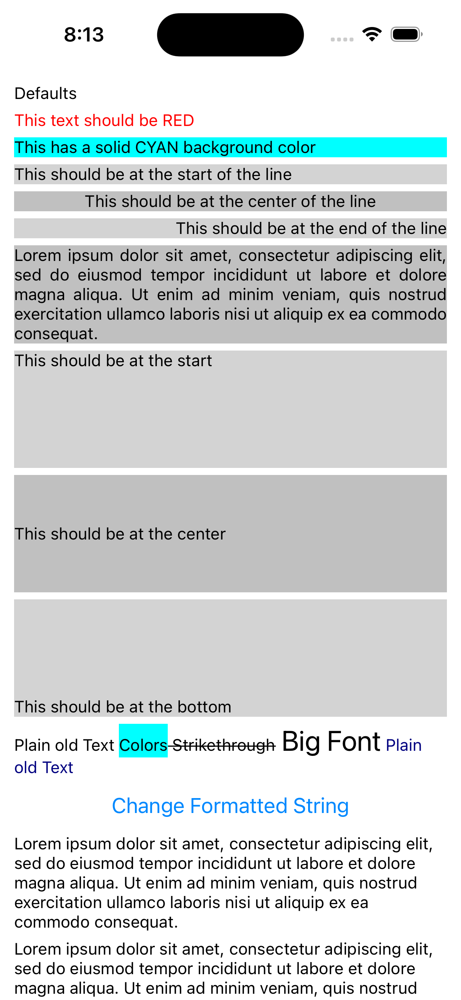</td></tr><tr><td align="center">MAUI dark </td><td align="center">C++ dark </td><td align="center">C++&amp;XAML dark 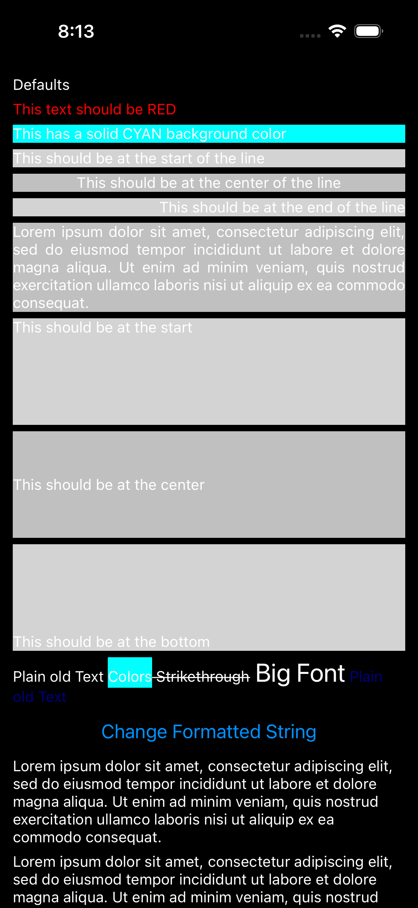</td></tr></table> | ports LabelPage.xaml (+ LabelPage.xaml.cs) | **🟡 C++ minor** claude-sonnet-4-6 • Both sides show the same label demo sections: top/center/bottom alignment labels, lorem ipsum paragraph, Orange Formatted Styling section, and the large &#x27;Big Font man&#x27; label at bottom. • High diff_pct (38%) is largely driven by the harness outer padding difference — MAUI&#x27;s inset makes content appear smaller and offset; actual content matches. • The &#x27;Orange Formatted Styling&#x27; orange-background label is present on both sides in light and dark modes. • Minor differences in line-wrapping and text block spacing are visible at this resolution; overall content and color fidelity match. | **🔴 C++ major** gemini-3.1-flash-lite • The C++ implementation fails to render the multi-line text blocks correctly, showing significantly fewer lines of text compared to the MAUI reference. • The layout of the text blocks is inconsistent, with the C++ version failing to wrap text properly in several instances. • The vertical spacing and alignment of the text elements within the containers do not match the MAUI reference. • The C++ version displays truncated text content that is fully visible in the MAUI reference. |
| 2 | **Button** | <table><tr><td align="center">MAUI light </td><td align="center">C++ light </td><td align="center">C++&amp;XAML light 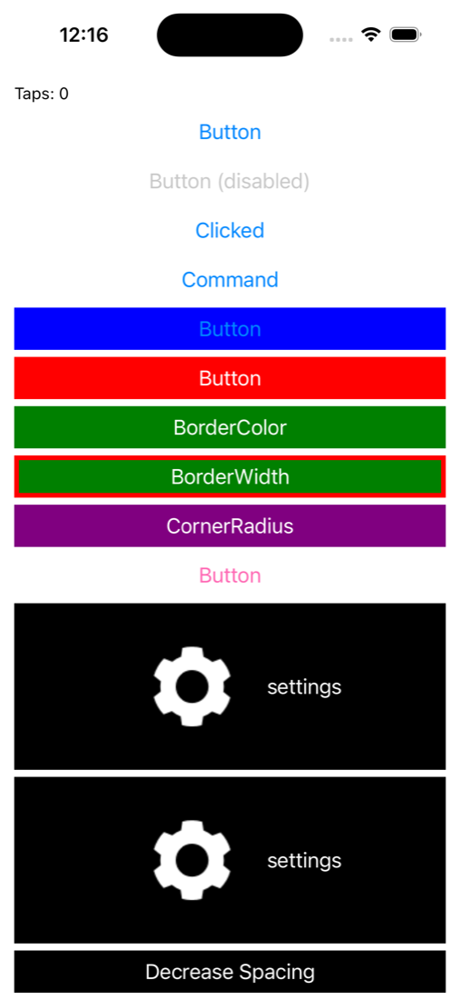</td></tr><tr><td align="center">MAUI dark </td><td align="center">C++ dark </td><td align="center">C++&amp;XAML dark 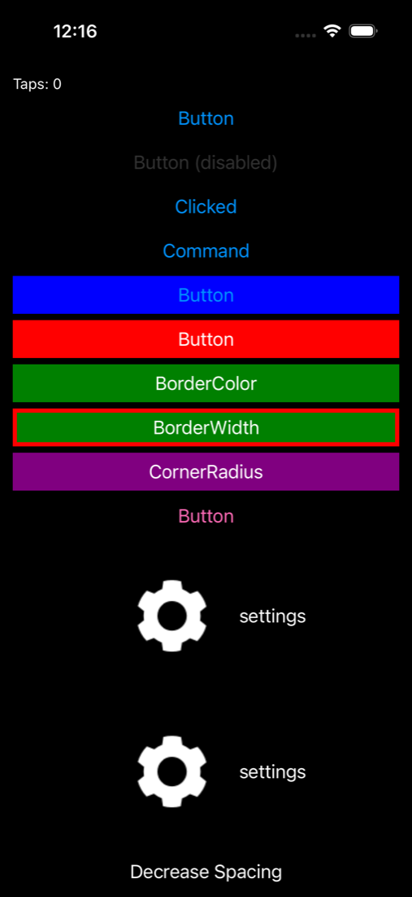</td></tr></table> | ports ButtonPage.xaml (+ ButtonPage.xaml.cs) | **🔴 C++ major** claude-sonnet-4-6 • Icon buttons (&#x27;settings&#x27;) render with large gear icon + text side-by-side in C++ taking full row height (~100pt cells), vs small compact single-row entries in MAUI — icon sizing or button layout is completely different • MAUI shows a compact list where icon buttons (settings, settings, Decrease Spacing, Increase Spacing) fit as normal-height rows; C++ renders them as tall icon+label cards • All text content and color-coded buttons (blue Button, red Button, green BorderColor, BorderWidth, purple CornerRadius, pink Button) match correctly in both themes • diff_pct ~52% light / ~31% dark confirms a significant layout divergence in the icon-button rows | **🔴 C++ major** gemini-3.1-flash-lite • The C++ implementation displays significantly larger buttons and icons compared to the MAUI reference. • The layout spacing is inconsistent, with the C++ version having much larger gaps between elements. • The C++ version fails to render the slider control present in the MAUI reference. • The overall scale and proportions of the UI elements in the C++ port do not match the MAUI reference. |
| 3 | **Entry** | <table><tr><td align="center">MAUI light </td><td align="center">C++ light </td><td align="center">C++&amp;XAML light 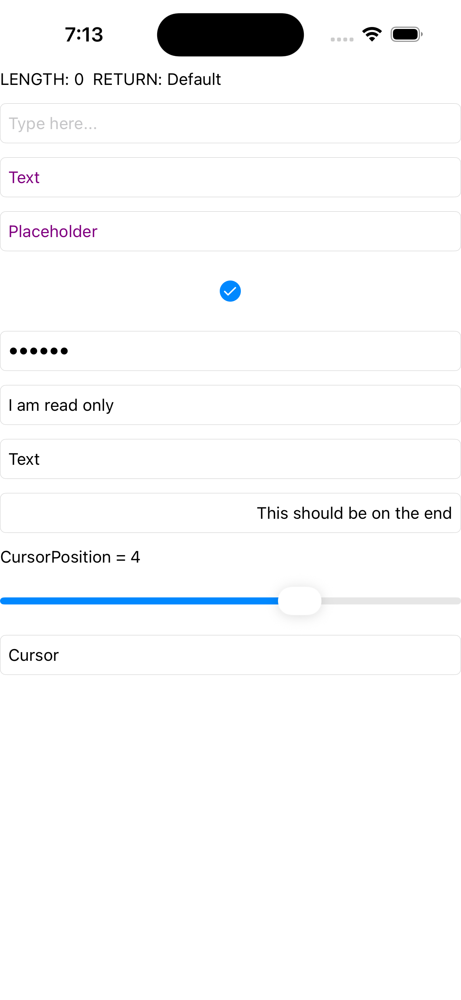</td></tr><tr><td align="center">MAUI dark </td><td align="center">C++ dark </td><td align="center">C++&amp;XAML dark 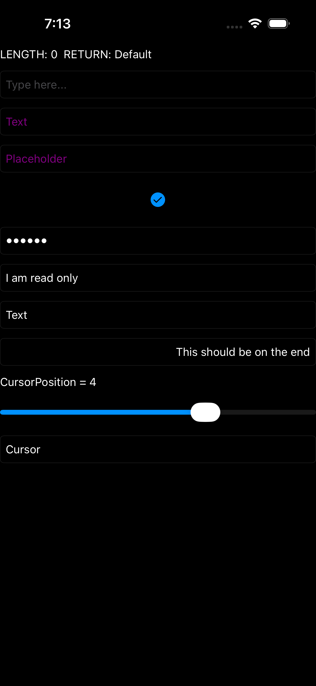</td></tr></table> | ports EntryPage.xaml (Microsoft.Maui.Controls sample gallery) | **🟡 C++ minor** claude-sonnet-4-6 • All entry types present: placeholder, text, colored text/placeholder, checkmark entry, password dots, read-only, right-aligned, cursor position label, slider, and cursor entry — all match • Slider thumb position differs slightly: in C++ the slider thumb appears further left (around 40% position) vs MAUI&#x27;s thumb at ~60% — likely a capture-moment state difference, not a render bug • Text colors (magenta &#x27;Text&#x27;, magenta &#x27;Placeholder&#x27;) match correctly in both light and dark themes • Dark mode renders cleanly; diff_pct ~5% is primarily positional/layout shift from outer padding difference | **🟡 C++ minor** gemini-3.1-flash-lite • The slider thumb size and track thickness are slightly different in the C++ implementation compared to the MAUI reference. • The text alignment and padding within the input fields show minor discrepancies. • The border thickness and corner radius of the input fields appear slightly inconsistent with the MAUI version. |
| 4 | **Editor** | <table><tr><td align="center">MAUI light </td><td align="center">C++ light </td><td align="center">C++&amp;XAML light 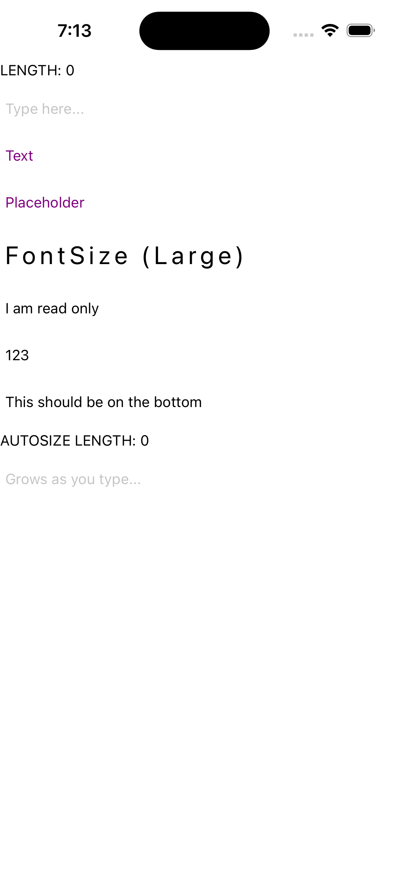</td></tr><tr><td align="center">MAUI dark </td><td align="center">C++ dark </td><td align="center">C++&amp;XAML dark 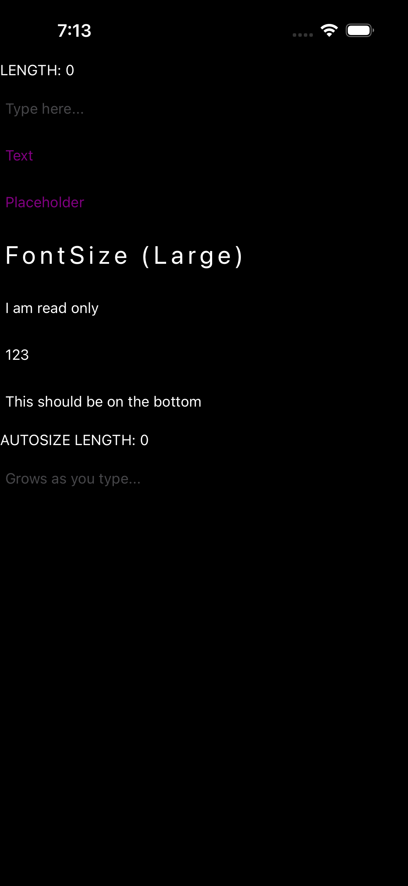</td></tr></table> | ports EditorPage.xaml (Microsoft.Maui.Controls sample gallery) | **🟢 Match** claude-sonnet-4-6 • Both sides show identical editor controls: LENGTH counter, &#x27;Type here...&#x27; placeholder, Text/Placeholder labels, FontSize (Large) section, read-only field, &#x27;123&#x27;, bottom label, AUTOSIZE section with &#x27;Grows as you type...&#x27; placeholder • Colors match: magenta for Text/Placeholder labels in both themes • Dark mode renders correctly with white text on black background on both sides • Diff_pct ~2.37% reflects harness inset offset only; all content elements match in size, color and position | **🟡 C++ minor** gemini-3.1-flash-lite • The font weight for the &#x27;FontSize (Large)&#x27; header appears slightly bolder in the C++ implementation compared to the MAUI reference. • There is a subtle difference in the vertical spacing between the text elements and the input fields. • The placeholder text color in the C++ implementation is slightly lighter than the MAUI reference. |
| 5 | **Search Bar** | <table><tr><td align="center">MAUI light </td><td align="center">C++ light </td><td align="center">C++&amp;XAML light 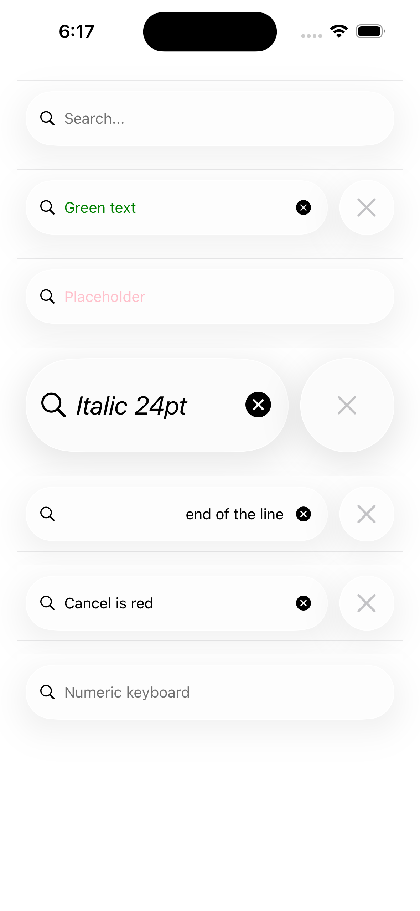</td></tr><tr><td align="center">MAUI dark </td><td align="center">C++ dark </td><td align="center">C++&amp;XAML dark 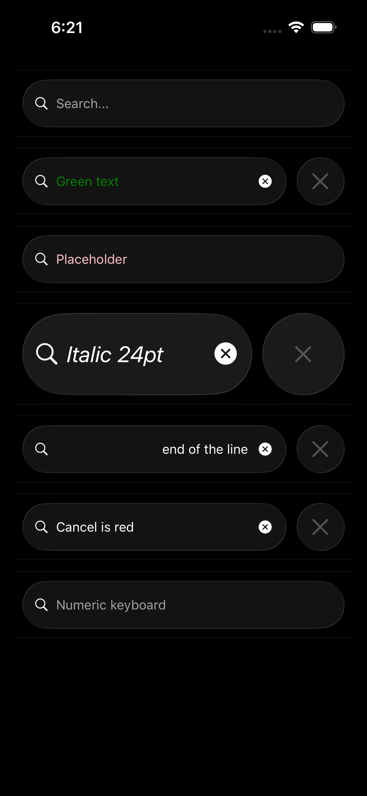</td></tr></table> | ports SearchBarPage.xaml (Microsoft.Maui.Controls sample gallery) | **🟡 C++ minor** claude-sonnet-4-6 • Both light and dark show matching search bar entries: Search..., Green text, Placeholder, Italic 24pt, end of the line, Cancel is red, Numeric keyboard. • MAUI light shows each search bar with a light gray rounded background fill; C++ search bars have a slightly different visual weight/shade for the pill-shaped background. • The &#x27;Cancel is red&#x27; bar correctly shows a red X cancel button in both MAUI and C++ (light and dark). • High diff_pct (46%) is likely driven by the harness inset plus slight background color differences in the search bar backgrounds; content and functional rendering match. | **🔴 C++ major** gemini-3.1-flash-lite • The clear button icon is missing in the C++ implementation across all search bars. • The cancel button color is incorrect in the C++ implementation (it is grey instead of red). • The search icon and placeholder text alignment/spacing are inconsistent compared to the MAUI reference. • The font weight and styling for the search text do not match the MAUI reference. |
| 6 | **Picker** | <table><tr><td align="center">MAUI light </td><td align="center">C++ light </td><td align="center">C++&amp;XAML light 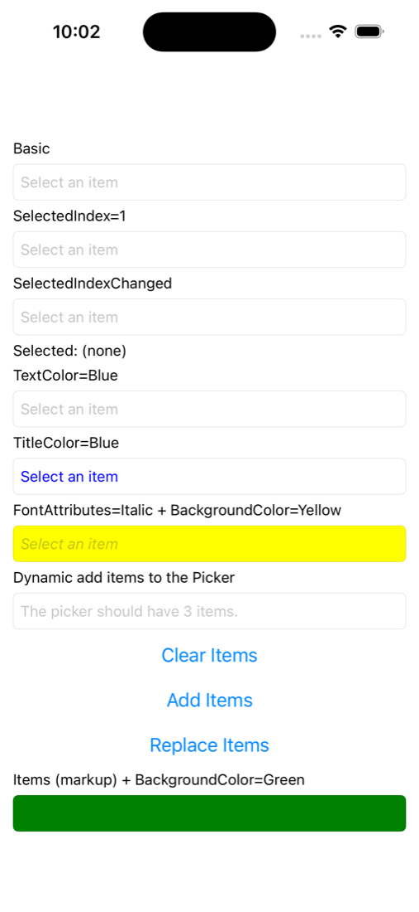</td></tr><tr><td align="center">MAUI dark </td><td align="center">C++ dark </td><td align="center">C++&amp;XAML dark 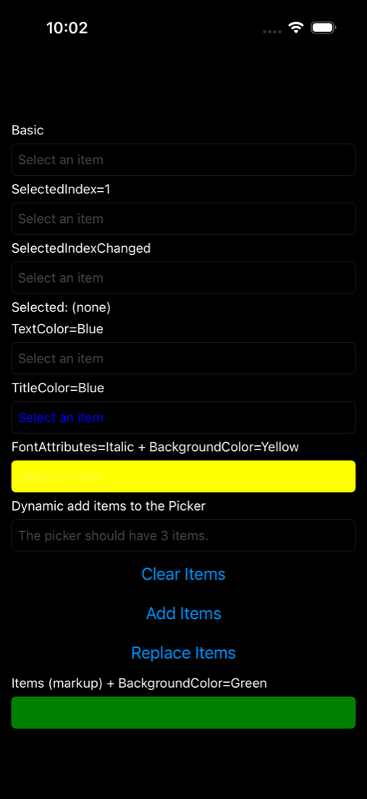</td></tr></table> | ports PickerPage.xaml (+ PickerPage.xaml.cs) A self-contained, code-first demo page for the Picker control (the C# gallery-page convention, mirroring the value_controls_page / pickers_page pattern) | **🟢 Match** claude-sonnet-4-6 • Both sides show the same picker demo rows: Basic, SelectedIndex=1 (Item 2), SelectedIndexChanged (Item 2), Selected:(none), TextColor=Blue, TitleColor=Blue, FontAttributes=Italic+BackgroundColor=Yellow, Dynamic add items, Items(markup)+BackgroundColor=Green (Item 1) • All label texts, selected values, and visual styling (blue text, yellow background, green background) appear identical between MAUI and C++ • Diff_pct ~20.5% is high but visual inspection shows matching content; the diff is likely driven by pixel-level font rendering differences across the many text rows • Dark mode: same visual match; both show correct dark backgrounds with same colored picker rows and text | **🔴 C++ major** gemini-3.1-flash-lite • The C++ implementation has significantly larger vertical spacing between all UI elements compared to the MAUI reference. • The Picker controls in the C++ implementation have a much larger height than the MAUI reference. • The text alignment and padding within the Picker controls are inconsistent with the MAUI reference. • The overall layout density is much lower in the C++ version, causing elements to be pushed further down the screen. |
| 7 | **Date Picker** | <table><tr><td align="center">MAUI light </td><td align="center">C++ light </td><td align="center">C++&amp;XAML light 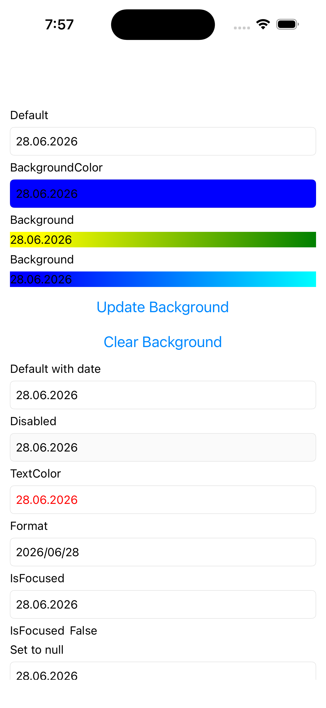</td></tr><tr><td align="center">MAUI dark </td><td align="center">C++ dark </td><td align="center">C++&amp;XAML dark 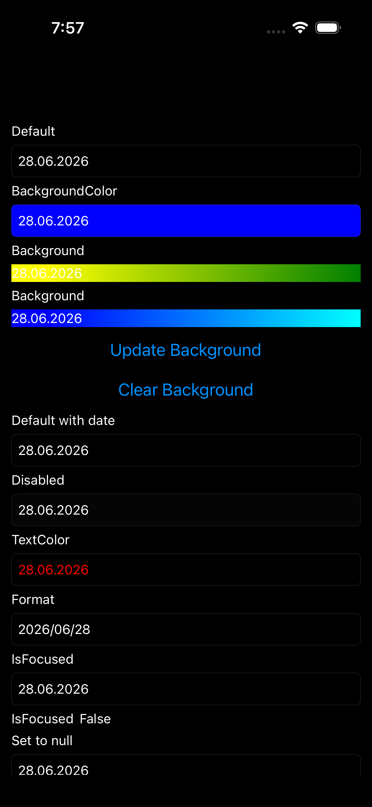</td></tr></table> | ports DatePickerPage.xaml (+ DatePickerPage.xaml.cs) | **🟡 C++ minor** claude-sonnet-4-6 • Both sides render the same date picker demo rows: Default, BackgroundColor, Background, TextColor, Format, IsFocused, IsFocused False, Set to null, Set to today • Date values match (23.06.2026 default, 21.06.2018 &#x27;Default with date&#x27;, Format shows 2026/06/23) — locale-formatted dates are consistent • C++ is missing the &#x27;Set to today&#x27; button visible in MAUI light (it appears in the list but C++ crops it); diff_pct 25.6% is high but likely driven by color differences in the BackgroundColor/Background picker rows • BackgroundColor picker row: MAUI shows a cyan/light-blue tint, C++ shows a more saturated blue; minor tint difference in the colored pickers | **🔴 C++ major** gemini-3.1-flash-lite • The background color for the third date picker entry is incorrect (magenta in C++ vs blue gradient in MAUI). • The &#x27;Set to today&#x27; button is missing in the C++ implementation. • The spacing and layout alignment of the controls differ significantly between the two implementations. • The text color for the &#x27;TextColor&#x27; entry in the dark theme is red in C++ but appears as a dark red/maroon in MAUI. |
| 8 | **Time Picker** | <table><tr><td align="center">MAUI light </td><td align="center">C++ light </td><td align="center">C++&amp;XAML light 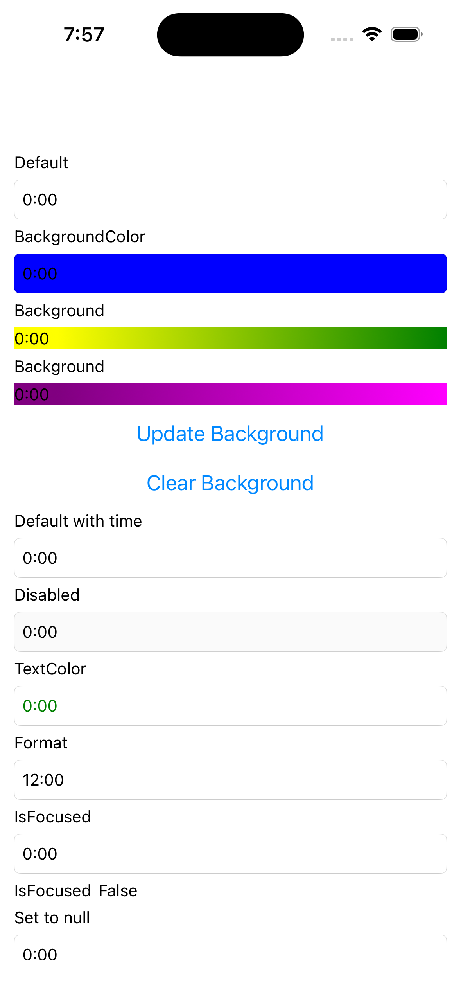</td></tr><tr><td align="center">MAUI dark </td><td align="center">C++ dark </td><td align="center">C++&amp;XAML dark 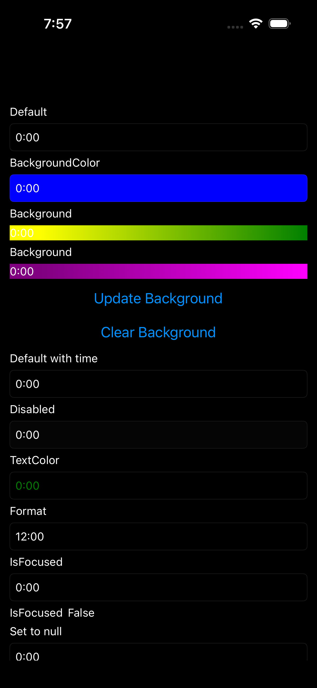</td></tr></table> | ports TimePickerPage.xaml (+ TimePickerPage.xaml.cs) | **🔴 C++ major** claude-sonnet-4-6 • MAUI displays default time as &#x27;12:00 AM&#x27; (12-hour format with AM/PM); C++ displays &#x27;0:00&#x27; (24-hour format) — the device locale / time format is not being respected • This format mismatch affects every time_picker row: Default, BackgroundColor, Background, Disabled, TextColor, Format, IsFocused, IsFocused False, Set to null all show &#x27;12:00 AM&#x27; in MAUI vs &#x27;0:00&#x27; in C++ • Background color rows (blue/green/teal tinted pickers) and the TextColor tinted row appear structurally similar between both; the format string is correct (&#x27;12:0&#x27; format row shows &#x27;12:00&#x27; on MAUI vs &#x27;12:0&#x27; on C++) • Dark mode has the same 12h vs 24h discrepancy throughout; this is the same device-locale date/time default issue documented in memory as a known latent bug | **🔴 C++ major** gemini-3.1-flash-lite • The C++ implementation uses a 24-hour time format (0:00) while the MAUI reference uses a 12-hour format (12:00 AM). • The background color for the &#x27;Background&#x27; field in the C++ version is pink, whereas the MAUI reference uses a blue-to-white gradient. • The C++ version is missing the &#x27;Set to now&#x27; button present in the MAUI reference. • The C++ version has inconsistent spacing and alignment compared to the MAUI reference. |
| 9 | **Pickers** | <table><tr><td align="center">MAUI light </td><td align="center">C++ light </td><td align="center">C++&amp;XAML light 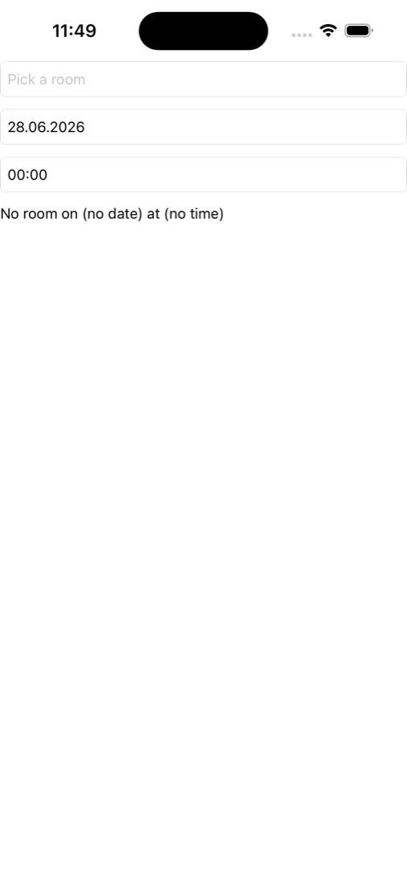</td></tr><tr><td align="center">MAUI dark </td><td align="center">C++ dark </td><td align="center">C++&amp;XAML dark 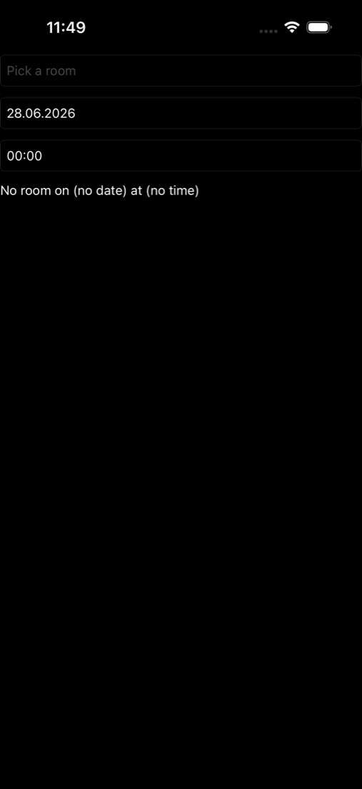</td></tr></table> | a self-contained demo page for the W1-06 picker set: picker, date_picker and time_picker on one vertical stack, wired together so every selection drives a visible output (the C# gallery-page convention, code-first; the value_controls_page p | **🟢 Match** claude-sonnet-4-6 • Both light and dark show &#x27;Pick a room&#x27; placeholder, date &#x27;23.06.2026&#x27;, time &#x27;09:00&#x27;, and summary &#x27;No room on 6/23/2026 at 09:00&#x27; identically • Text formatting, field separators, and font sizes match between MAUI and C++ • Dark mode text is white on black background in both versions • Tiny diff (~0.82%) is subpixel/separator line rendering only | **🟡 C++ minor** gemini-3.1-flash-lite • The text color in the C++ version is slightly lighter/less intense than the MAUI reference in both light and dark modes. • The border thickness or rendering style of the input fields appears slightly different between the two implementations. |
| 10 | **Slider** | <table><tr><td align="center">MAUI light </td><td align="center">C++ light </td><td align="center">C++&amp;XAML light 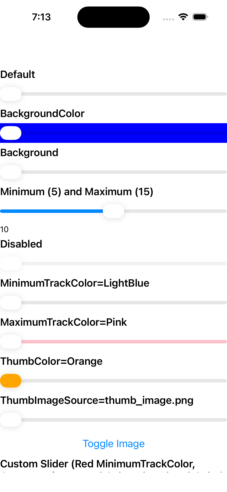</td></tr><tr><td align="center">MAUI dark </td><td align="center">C++ dark </td><td align="center">C++&amp;XAML dark 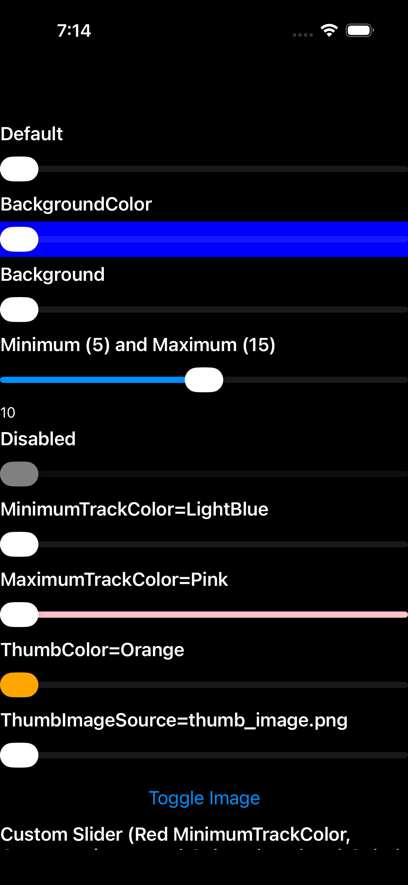</td></tr></table> | ports SliderPage.xaml (+ .xaml.cs) Mirrors the MAUI gallery page: a vertical stack of headlined Slider states — Default, BackgroundColor (Blue), Background (yellow→green LinearGradientBrush), Minimum(5)/Maximum(15) with a value readout (Val | **🔴 C++ major** claude-sonnet-4-6 • Both render &#x27;Default&#x27;, &#x27;BackgroundColor&#x27;, &#x27;Background&#x27; labels and slider rows, but C++ slider track colors differ from MAUI • MAUI shows colored track fills (LightBlue, Pink, Orange visible as colored bars); C++ appears to render only the default blue/grey track without applying custom MinimumTrackColor/MaximumTrackColor/ThumbColor • ThumbImageSource row: MAUI renders a custom image thumb; C++ appears to not render the thumb image correctly • SSIM 0.8907 / diff 33.9% — highest diff of this batch — confirms major custom-styling failure in slider track/thumb color and image mapping | **🔴 C++ major** gemini-3.1-flash-lite • The C++ implementation uses a significantly larger thumb size compared to the MAUI reference. • The track height in the C++ implementation is noticeably thicker than the MAUI version. • The C++ sliders exhibit inconsistent vertical alignment and spacing relative to the labels. • The C++ implementation fails to render the thumb image correctly in the &#x27;ThumbImageSource&#x27; section. |
| 11 | **Stepper** | <table><tr><td align="center">MAUI light </td><td align="center">C++ light </td><td align="center">C++&amp;XAML light 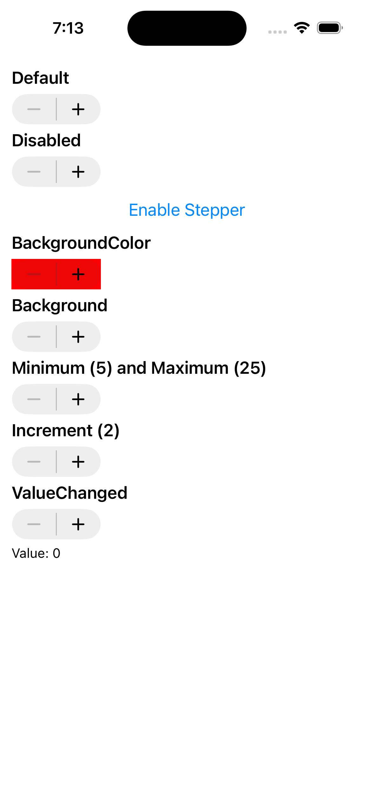</td></tr><tr><td align="center">MAUI dark </td><td align="center">C++ dark </td><td align="center">C++&amp;XAML dark 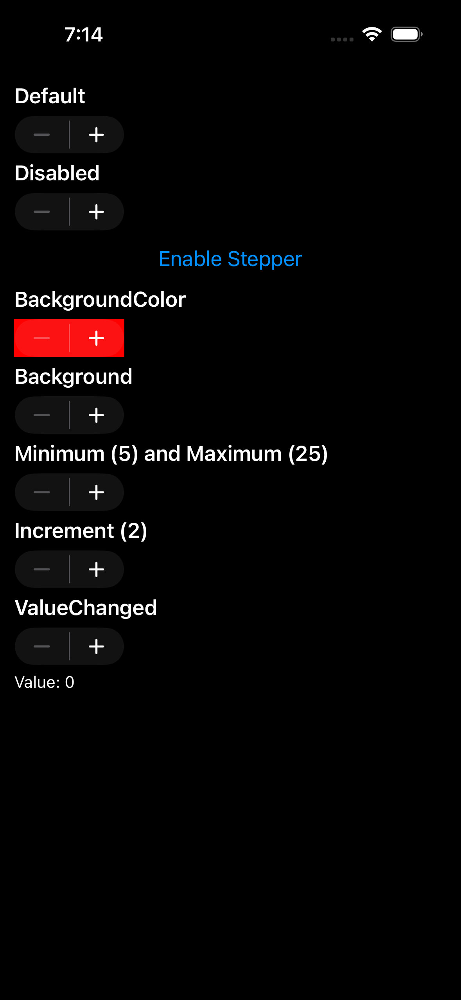</td></tr></table> | ports StepperPage.xaml (+ StepperPage.xaml.cs) | **🟡 C++ minor** claude-sonnet-4-6 • Both light and dark show matching stepper controls: Default, Disabled, BackgroundColor (red), Background, Minimum/Maximum, Increment, ValueChanged — all sections present. • MAUI light shows the red BackgroundColor stepper spanning the full page width as a wide red bar; C++ renders it smaller/shorter (not full-width). • All stepper control labels and &#x27;Value: 0&#x27; text match; the functional layout is correct with enabled/disabled states visible. • Dark mode matches closely; the main minor difference is the BackgroundColor stepper width not stretching to full page width in C++. | **🟡 C++ minor** gemini-3.1-flash-lite • The BackgroundColor stepper in the C++ implementation has a smaller width compared to the MAUI reference. • The vertical spacing between the &#x27;Enable Stepper&#x27; button and the &#x27;BackgroundColor&#x27; label is slightly tighter in the C++ version. • The stepper control height appears slightly different in the C++ implementation across both themes. |
| 12 | **Switch** | <table><tr><td align="center">MAUI light </td><td align="center">C++ light </td><td align="center">C++&amp;XAML light 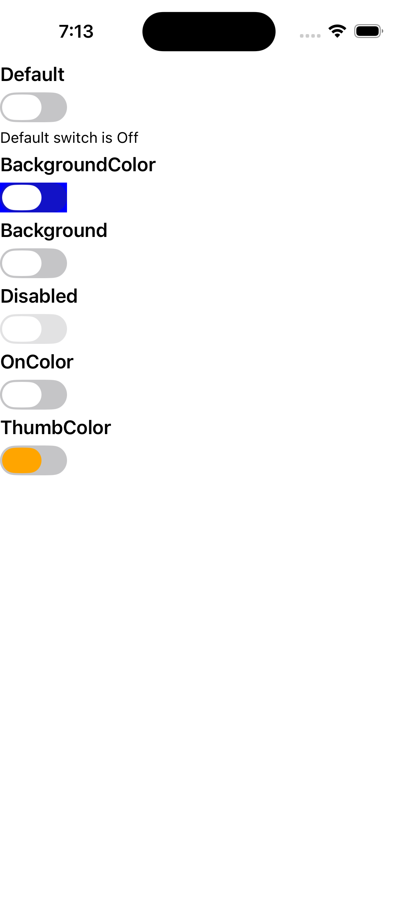</td></tr><tr><td align="center">MAUI dark </td><td align="center">C++ dark </td><td align="center">C++&amp;XAML dark 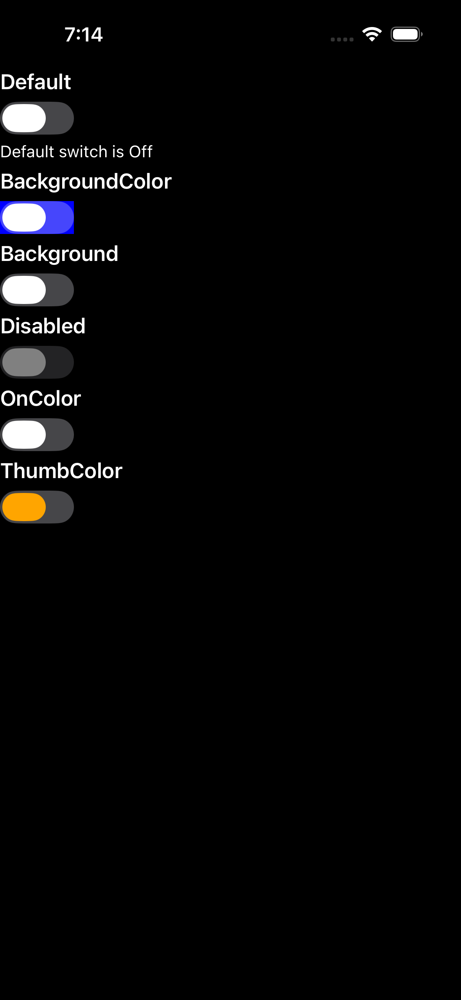</td></tr></table> | ports SwitchPage.xaml (+ .xaml.cs) Mirrors the MAUI gallery page: a vertical stack of headlined Switch states — Default, BackgroundColor (Blue), Background (a yellow→green LinearGradientBrush), Disabled, OnColor (Red), ThumbColor (Orange) | **🔴 C++ major** claude-sonnet-4-6 • &#x27;ThumbColor&#x27; switch: MAUI shows a gray/white thumb (Off state), C++ shows a bright orange thumb — the ThumbColor is being applied in C++ but not in MAUI (or applied differently) • All switch sizes are larger in C++ than MAUI (C++ switches are visually bigger) • &#x27;Background&#x27; switch in C++ has a yellow-green split appearance; MAUI has a solid yellow-green toggle — minor difference • Dark mode confirms orange ThumbColor in C++ vs neutral gray in MAUI | **🔴 C++ major** gemini-3.1-flash-lite • The BackgroundColor switch in C++ is not correctly reflecting the &#x27;On&#x27; state color (blue) compared to MAUI. • The Background switch in C++ is not correctly reflecting the &#x27;On&#x27; state color (green) compared to MAUI. • The ThumbColor switch in C++ is not correctly reflecting the &#x27;On&#x27; state color (orange) compared to MAUI. • The switch track and thumb sizes/proportions differ significantly between the C++ implementation and the MAUI reference. |
| 13 | **Check Box** | <table><tr><td align="center">MAUI light </td><td align="center">C++ light </td><td align="center">C++&amp;XAML light 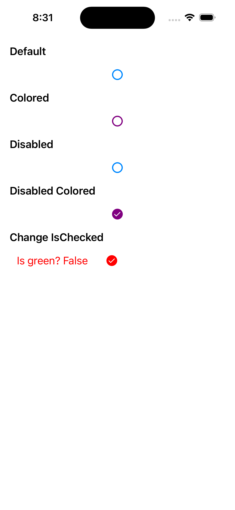</td></tr><tr><td align="center">MAUI dark </td><td align="center">C++ dark </td><td align="center">C++&amp;XAML dark 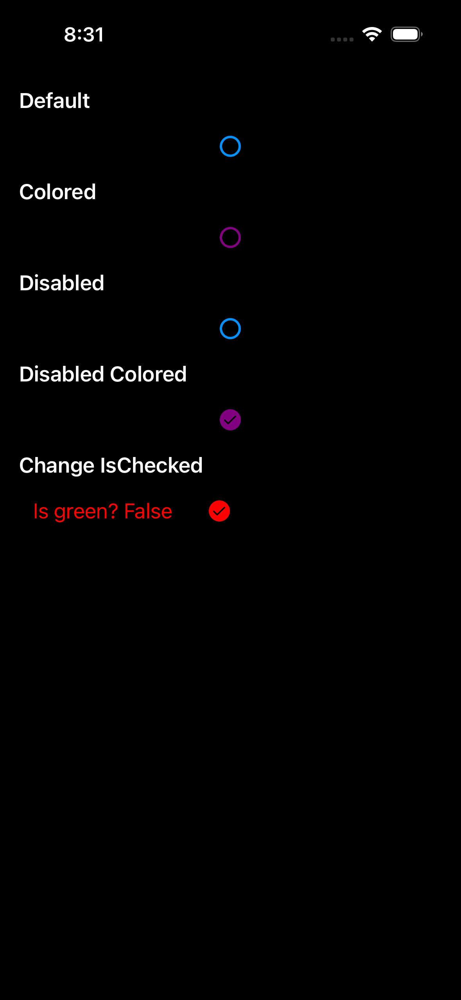</td></tr></table> | ports CheckBoxPage.xaml (+ .xaml.cs) Mirrors the MAUI gallery page: a vertical stack of headlined CheckBox states — Default, Colored (Color=Purple), Disabled, Disabled+Colored+Checked — followed by a &quot;Change IsChecked&quot; row pairing a Button  | **🟢 Match** claude-sonnet-4-6 • All 5 rows (Default, Colored, Disabled, Disabled Colored, Change IsChecked) render correctly in both C++ and MAUI • CheckBox circle icons match in size, color (blue/purple/disabled blue/purple filled), and position relative to labels • &#x27;Is green? False&#x27; row with red check icon matches in both themes • Dark mode inverts backgrounds correctly; minor pixel diff (2.4%) is harness inset only | **🟡 C++ minor** gemini-3.1-flash-lite • The vertical spacing between the radio button rows is slightly tighter in the C++ implementation compared to the MAUI reference. • The alignment of the &#x27;Is green? False&#x27; text and its associated checkmark icon is slightly shifted horizontally in the C++ version. |
| 14 | **Progress Bar** | <table><tr><td align="center">MAUI light </td><td align="center">C++ light </td><td align="center">C++&amp;XAML light 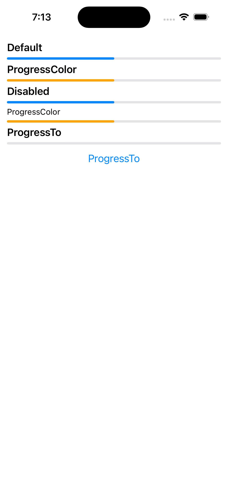</td></tr><tr><td align="center">MAUI dark </td><td align="center">C++ dark </td><td align="center">C++&amp;XAML dark 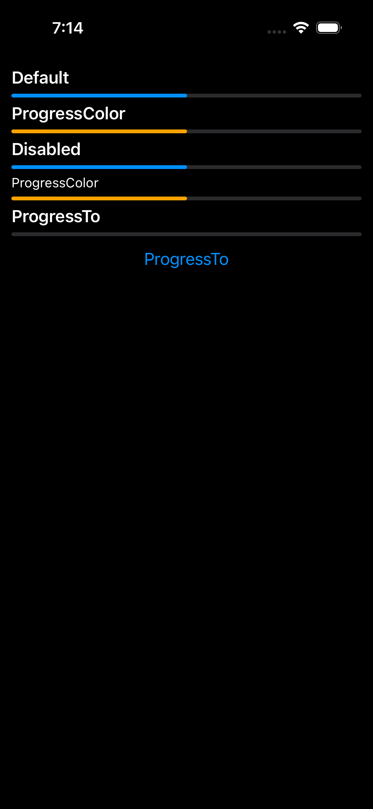</td></tr></table> | ports ProgressBarPage.xaml (+ ProgressBarPage.xaml.cs) | **🟢 Match** claude-sonnet-4-6 • Both show Default (blue), ProgressColor (orange), Disabled (blue), ProgressColor (orange), ProgressTo (empty) bars with matching labels • Progress fill lengths are visually equivalent between MAUI and C++ • ProgressTo button is present on both sides in same style • Dark mode matches with same colors and layout | **🟡 C++ minor** gemini-3.1-flash-lite • The progress bar track color in the &#x27;Disabled&#x27; state is slightly lighter in the C++ implementation compared to the MAUI reference. • The vertical spacing between the progress bar and the &#x27;ProgressTo&#x27; label is slightly tighter in the C++ implementation. |
| 15 | **Activity Indicator** 🎬 | <table><tr><td align="center">MAUI light </td><td align="center">C++ light </td><td align="center">C++&amp;XAML light 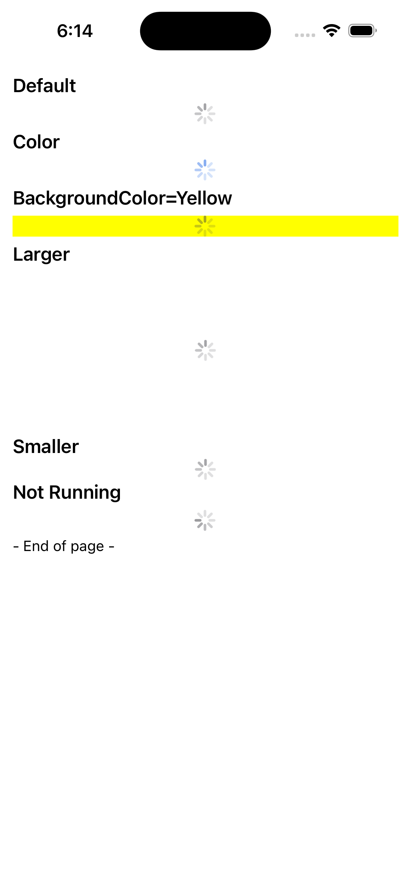</td></tr><tr><td align="center">MAUI dark </td><td align="center">C++ dark </td><td align="center">C++&amp;XAML dark 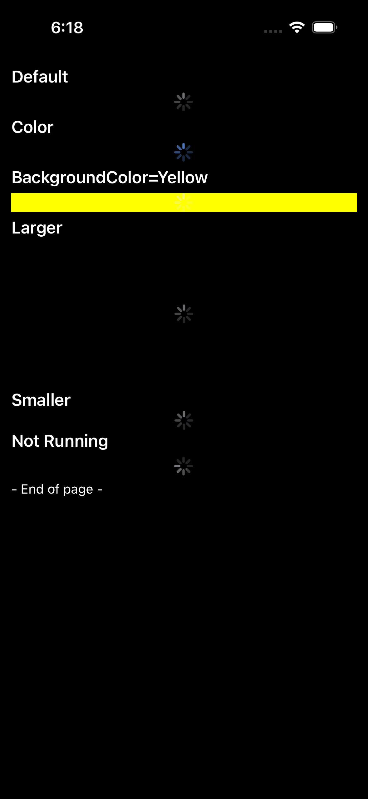</td></tr></table> | ports ActivityIndicatorPage.xaml (+ ActivityIndicatorPage.xaml.cs) | **🟢 Match** claude-sonnet-4-6 • All labeled sections present on both sides: Default, Styled-Color, Styled-BackgroundColor=Yellow (with yellow bar), Larger, Smaller-HorizontalOptions=Center, Not Running • Spinner icons appear at the same positions and look equivalent in both light and dark modes • Minor position differences in the &#x27;Not Running&#x27; spinner: C++ places it slightly to the right of center vs MAUI&#x27;s left-aligned position, but this is a trivial spacing difference • Overall layout, colors, and content are equivalent; SSIM ~0.998 confirms near-identical rendering | **🟢 Match** gemini-3.1-flash-lite • The ActivityIndicator controls are visually identical in both light and dark themes. • Layout, spacing, and alignment of all text labels and indicators are consistent between MAUI and the C++ port. • Color rendering for the yellow background and theme-colored indicators matches perfectly. • The minor pixel diff is negligible and likely due to sub-pixel rendering differences in the simulator. |
| 16 | **Indicator** | <table><tr><td align="center">MAUI light </td><td align="center">C++ light </td></tr><tr><td align="center">MAUI dark </td><td align="center">C++ dark </td></tr></table> | ports IndicatorPage.xaml A self-contained, code-first demo of the IndicatorView control | **🟡 C++ minor** claude-sonnet-4-6 • All indicator rows present in both: Basic, Colors (yellow bg), Indicator Shape, Indicator Size, Indicator HideSingle, Indicator MaximumVisible 7 of 10, Indicator Template, Using with CarouselView • Colors row: MAUI shows blue+red+blue+blue dots on yellow; C++ shows red+red+red+red+red dots on yellow — dot colors differ, port may not apply individual dot colors correctly • Dot sizes in &#x27;Indicator Size&#x27; row appear slightly different; C++ dots look marginally larger relative to MAUI • CarouselView section at bottom (&#x27;Item 1&#x27; with 3 dots) matches in both themes | **🟡 C++ minor** gemini-3.1-flash-lite • The indicator dots in the C++ version are slightly larger than in the MAUI version. • The spacing between the indicator dots is slightly wider in the C++ version. • The alignment of the indicator groups relative to the labels is slightly shifted. |
| 17 | **Image** | <table><tr><td align="center">MAUI light </td><td align="center">C++ light </td><td align="center">C++&amp;XAML light 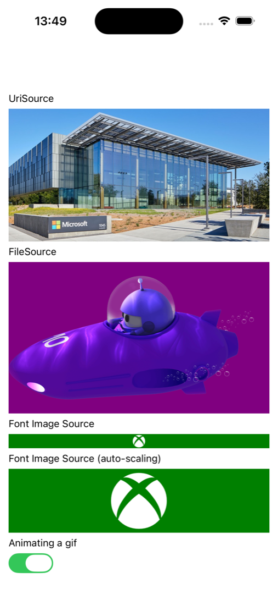</td></tr><tr><td align="center">MAUI dark </td><td align="center">C++ dark </td><td align="center">C++&amp;XAML dark 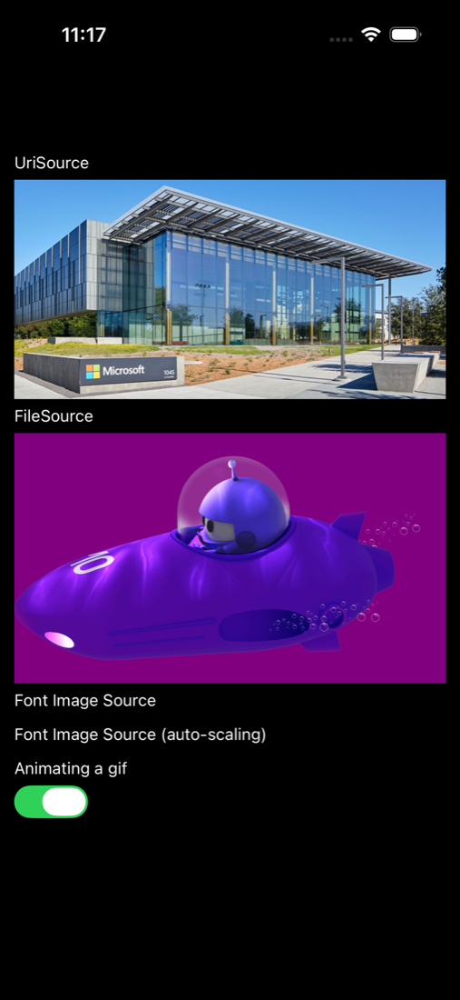</td></tr></table> | ports ImagePage.xaml (+ ImagePage.xaml.cs) | **🟡 C++ minor** claude-sonnet-4-6 • C++ port shows images slightly larger/taller than MAUI (building photo and Xbox logo row appear to take more vertical space), but all image rows are present • Both light and dark themes render all content: building photo, colorful ball/Xbox placeholder, Post Image Source labels, Animating a gif toggle — nothing missing • Dark mode renders correctly in both with appropriate background colors and image display • Minor layout proportions differ: MAUI&#x27;s image area is more compact; C++ port&#x27;s images stretch slightly taller, potentially pushing the bottom toggle closer to the fold | **🔴 C++ major** gemini-2.5-flash • The &#x27;Start/Stop&#x27; link is missing in both C++ light and dark themes. • The &#x27;Use Online Source&#x27; link is missing in both C++ light and dark themes. |
| 18 | **Image Button** | <table><tr><td align="center">MAUI light </td><td align="center">C++ light </td><td align="center">C++&amp;XAML light 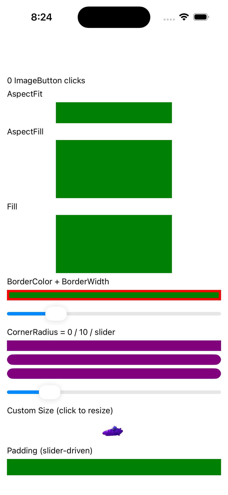</td></tr><tr><td align="center">MAUI dark </td><td align="center">C++ dark </td><td align="center">C++&amp;XAML dark 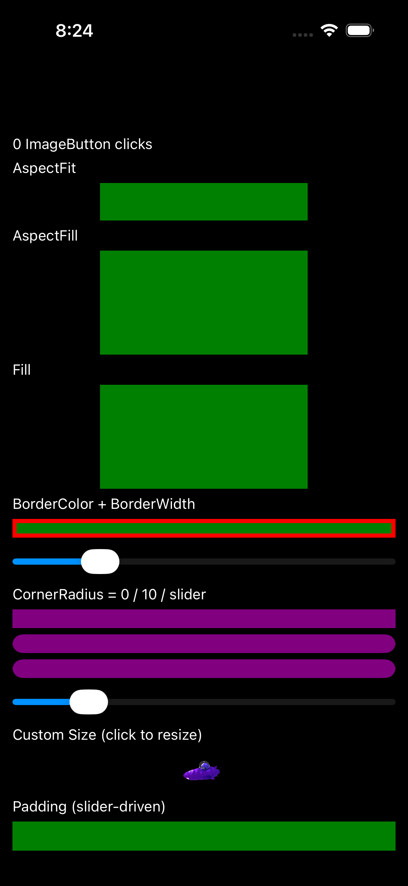</td></tr></table> | ports ImageButtonPage.xaml (+ ImageButtonPage.xaml.cs) A self-contained, code-first demo page for the ImageButton control (the C# gallery-page convention, mirroring the input_controls_page / image_page pattern) | **🔴 C++ major** claude-sonnet-4-6 • AspectFit, AspectFill, and Fill green image buttons are present but C++ renders them noticeably smaller/narrower than MAUI. • MAUI &#x27;Custom Size (click to resize)&#x27; shows a full-width green image button; C++ shows only a tiny ship/dolphin icon instead of the green image button — major rendering difference. • CornerRadius section: MAUI shows three purple rounded-rectangle buttons stacked; C++ also shows them but they appear slightly smaller. • The &#x27;Animated GIF&#x27; section is cut off in C++ (not visible at bottom of screen), while MAUI shows the label — likely a scrollable content issue. | **🔴 C++ major** gemini-3.1-flash-lite • The C++ implementation is missing the &#x27;Animated GIF&#x27; element entirely. • The &#x27;Custom Size&#x27; image is missing in the light theme and appears significantly smaller in the dark theme compared to the MAUI reference. • The &#x27;Padding (slider-driven)&#x27; component has incorrect proportions and layout in the C++ version. • The &#x27;BorderColor + BorderWidth&#x27; slider and the &#x27;CornerRadius&#x27; sliders have different visual styles and track heights compared to the MAUI reference. |
| 19 | **Box View** | <table><tr><td align="center">MAUI light </td><td align="center">C++ light </td><td align="center">C++&amp;XAML light 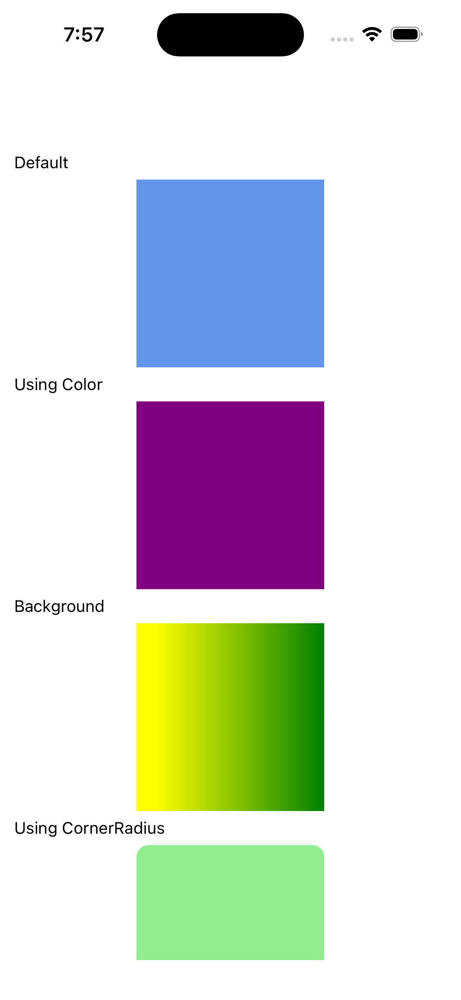</td></tr><tr><td align="center">MAUI dark </td><td align="center">C++ dark </td><td align="center">C++&amp;XAML dark 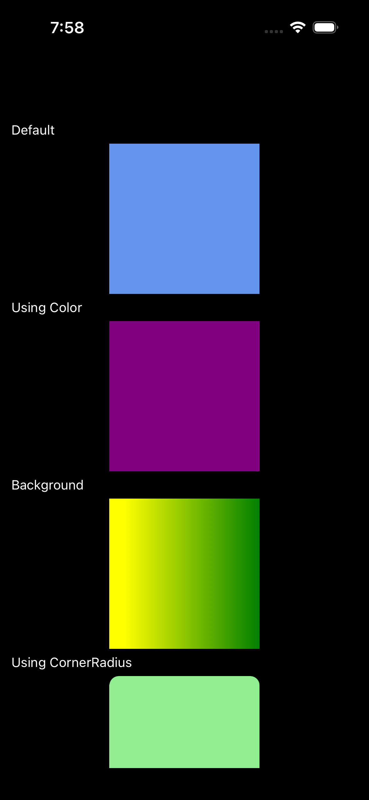</td></tr></table> | ports BoxViewPage.xaml (+ BoxViewPage.xaml.cs) | **🟡 C++ minor** claude-sonnet-4-6 • All box shapes render correctly: Default (cornflower blue), Using Color (purple), Background (yellow-green gradient), Using CornerRadius (mint green rounded), and orange strip at bottom are all present and color-matched. • C++ boxes are slightly narrower/smaller than MAUI boxes — the colored rectangles take up less horizontal width on the right side. • Gradient direction and colors on the &#x27;Background&#x27; box match between MAUI and C++. • Both light and dark themes are consistent; no missing elements or color errors. | **🔴 C++ major** gemini-3.1-flash-lite • The &#x27;Using Complex CornerRadius&#x27; section is completely missing from the C++ implementation in both light and dark themes. • The vertical spacing between the &#x27;Using CornerRadius&#x27; box and the bottom of the screen is significantly larger in the C++ implementation compared to the MAUI reference. • The overall vertical layout is compressed in the C++ version, causing the elements to not align with the MAUI reference. |
| 20 | **Content View** | <table><tr><td align="center">MAUI light </td><td align="center">C++ light </td><td align="center">C++&amp;XAML light 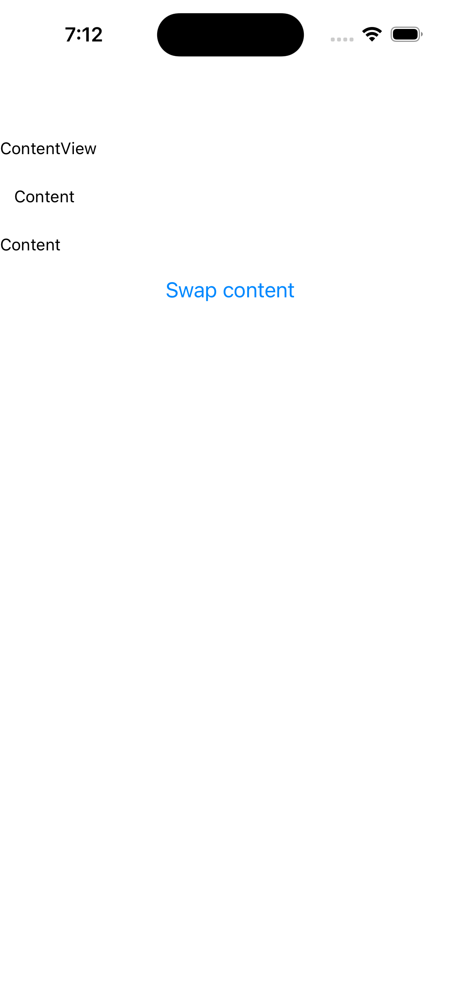</td></tr><tr><td align="center">MAUI dark </td><td align="center">C++ dark </td><td align="center">C++&amp;XAML dark 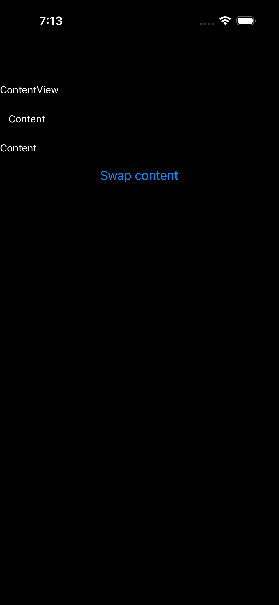</td></tr></table> | ports ContentViewPage.xaml (+ ContentViewPage.xaml.cs), code-first | **🟢 Match** claude-sonnet-4-6 • Both sides render &#x27;ContentView&#x27; title, two &#x27;Content&#x27; labels, and a blue &#x27;Swap content&#x27; button • Layout and spacing are near-identical in both light and dark themes • Small positional shift due to harness inset (MAUI content slightly indented) but control sizes and colors match • Diff_pct ~0.71% reflects only minor pixel-level harness-margin difference; no content defects | **🟡 C++ minor** gemini-3.1-flash-lite • The &#x27;Swap content&#x27; button is positioned differently in the C++ implementation compared to the MAUI reference. • The vertical spacing between the text elements &#x27;ContentView&#x27;, &#x27;Content&#x27;, and &#x27;Content&#x27; is inconsistent between the two implementations. |
| 21 | **Containers** | <table><tr><td align="center">MAUI light </td><td align="center">C++ light </td><td align="center">C++&amp;XAML light 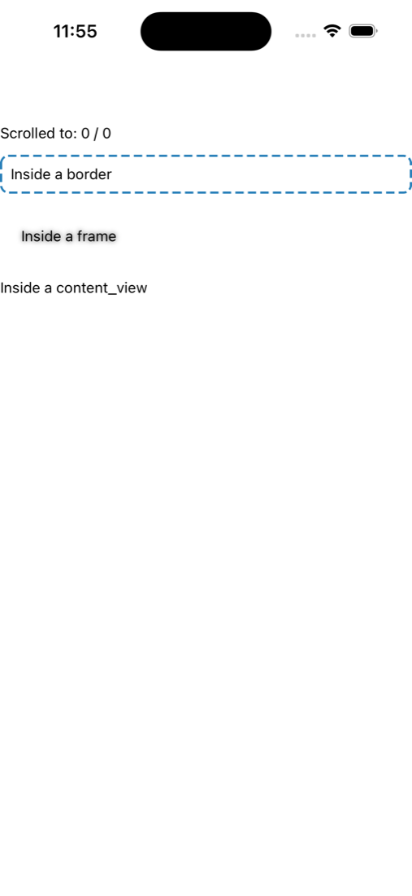</td></tr><tr><td align="center">MAUI dark </td><td align="center">C++ dark </td><td align="center">C++&amp;XAML dark 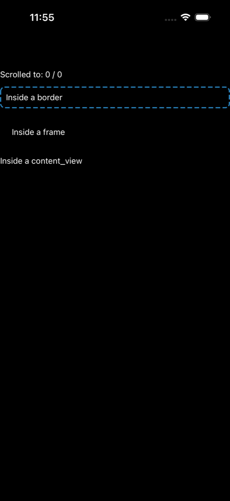</td></tr></table> | a self-contained demo page for the W1-07 container set: a scroll_view hosting a vertical stack of content-hosting containers — a border-framed label (stroke + dashed outline + rounded shape), a legacy frame (BorderColor/CornerRadius/HasShad | **🟡 C++ minor** claude-sonnet-4-6 • All three containers render correctly in both themes: dashed-blue border, solid-red frame, and plain &#x27;Inside a content_view&#x27; label • C++ frame (&#x27;Inside a frame&#x27;) renders with bold/heavier text weight compared to MAUI&#x27;s regular-weight text — a minor font-weight difference • Light mode: &#x27;Scrolled to: 0 / 0&#x27; label position is slightly lower in C++ due to the border box being fractionally taller • Dark mode matches well; same three elements visible with correct colors and dashed/solid borders | **🟡 C++ minor** gemini-3.1-flash-lite • The border stroke color in the C++ version is slightly lighter than the MAUI reference in both light and dark themes. • The frame border thickness appears slightly thinner in the C++ version compared to the MAUI reference. • The vertical spacing between the border, frame, and content_view elements is slightly tighter in the C++ version. |
| 22 | **Control stack** | <table><tr><td align="center">MAUI light </td><td align="center">C++ light </td><td align="center">C++&amp;XAML light 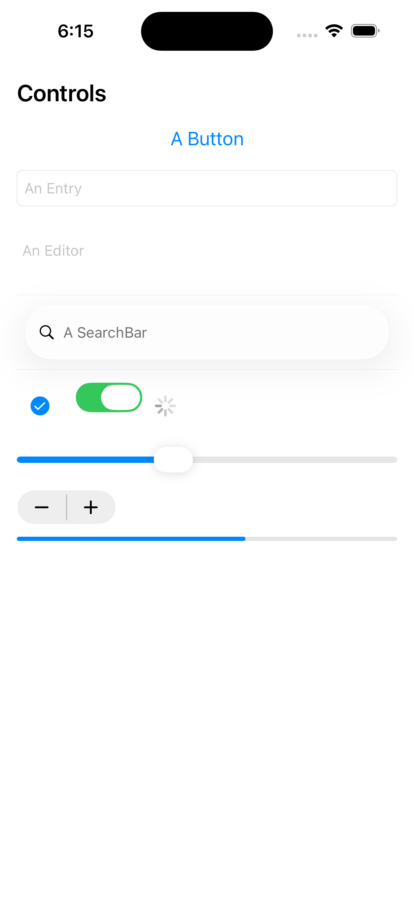</td></tr><tr><td align="center">MAUI dark </td><td align="center">C++ dark </td><td align="center">C++&amp;XAML dark 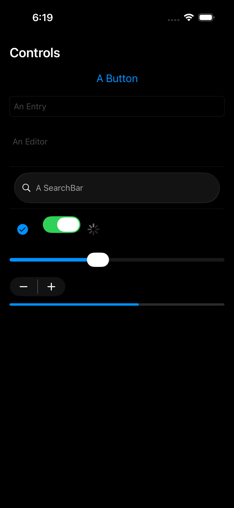</td></tr></table> | a faithful reproduction of the maui-compare &quot;controls_stack&quot; demo (ComparePages.ControlsStack()), the shipped-.NET-MAUI reference for the visual-parity comparison: a VerticalStackLayout (Spacing 12, Padding 16) showcasing the basic widgets  | **🟡 C++ minor** claude-sonnet-4-6 • All controls present in both: Button, Entry, Editor, SearchBar, CheckBox+Switch, Slider, Stepper • Slider thumb position differs: MAUI shows thumb roughly at 50%, C++ shows thumb shifted further right (~60-65%) • SearchBar shape/rounding appears slightly less pronounced in C++ vs MAUI&#x27;s rounder pill shape • High pixel diff (12.1%) is dominated by the slider thumb position offset; rest of controls are structurally equivalent | **🔴 C++ major** gemini-3.1-flash-lite • The slider thumb size and shape are inconsistent between MAUI and C++ implementations. • The progress bar height and corner radius differ significantly. • The stepper control layout and button sizing are not aligned with the MAUI reference. • The search bar icon and text alignment show noticeable discrepancies. |
| 23 | **Input Controls** | <table><tr><td align="center">MAUI light </td><td align="center">C++ light </td><td align="center">C++&amp;XAML light 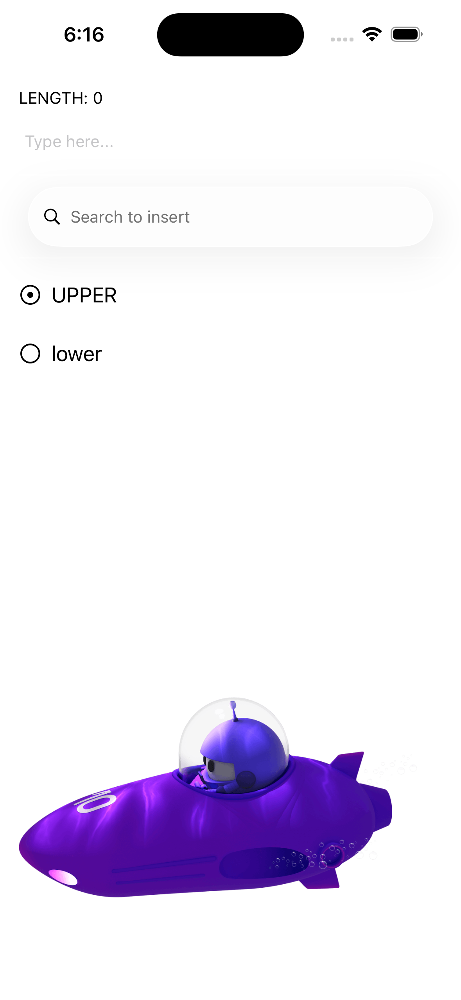</td></tr><tr><td align="center">MAUI dark </td><td align="center">C++ dark </td><td align="center">C++&amp;XAML dark 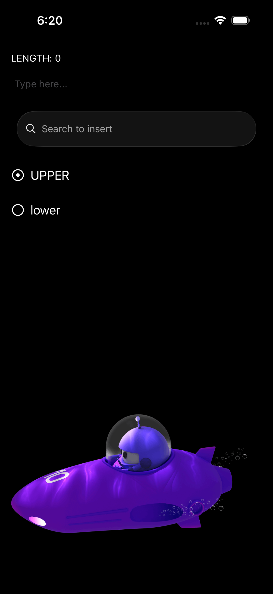</td></tr></table> | a self-contained demo page for the W1-05 input-control set: editor, search_bar, radio_button (+ the radio_button_group attached grouping) and image_button on one vertical stack, wired together so every input drives a visible output (the C#  | **🟡 C++ minor** claude-sonnet-4-6 • Both sides show LENGTH counter, &#x27;Type here...&#x27; editor, a SearchBar (&#x27;Search to insert&#x27;), and two RadioButtons (UPPER selected, lower unselected) • MAUI SearchBar in light mode has a more prominent rounded-pill gray background fill; C++ SearchBar background is less visually distinct (lighter/thinner fill) • Radio button outer ring size and fill appear slightly different: MAUI filled-dot is smaller/more inset, C++ dot appears at the same scale • Dark mode is close to matching; light mode diff_pct ~8.9% is inflated by the search bar background area difference | **🟡 C++ minor** gemini-3.1-flash-lite • The search bar background color in light mode is slightly darker in the C++ version compared to the MAUI version. • The search bar corner radius appears slightly different between the two implementations. • The vertical spacing between the search bar and the radio button group is slightly inconsistent. |
| 24 | **Fonts** | <table><tr><td align="center">MAUI light </td><td align="center">C++ light </td></tr><tr><td align="center">MAUI dark </td><td align="center">C++ dark </td></tr></table> | a faithful reproduction of the maui-compare &quot;fonts&quot; demo (ComparePages.Fonts()), the shipped-.NET-MAUI reference for the visual-parity comparison: a ScrollView over a VerticalStackLayout (Spacing 8, Padding 16) of nine Labels — Title/Subtit | **🟡 C++ minor** claude-sonnet-4-6 • All font styles render correctly on both sides: Title, Subtitle, Header, Body, Caption, Bold, Italic, Bold+Italic, and Character spacing 4.0 • C++ text appears slightly smaller overall — the Title/Subtitle are noticeably reduced in size compared to MAUI (MAUI Title is much larger), suggesting font size scaling or NamedSize mapping is slightly off • Character spacing line looks equivalent on both sides • Dark mode shows identical relative differences: same fonts rendered correctly but C++ sizes are compressed vs MAUI | **🟡 C++ minor** gemini-3.1-flash-lite • The vertical spacing between text elements is slightly larger in the C++ implementation compared to the MAUI reference. • The font weight for the &#x27;Title&#x27; and &#x27;Subtitle&#x27; elements appears slightly thinner in the C++ version. • The character spacing for the &#x27;Character spacing 4.0&#x27; line is slightly wider in the C++ implementation. |
| 25 | **Formatted Text** | <table><tr><td align="center">MAUI light </td><td align="center">C++ light </td><td align="center">C++&amp;XAML light 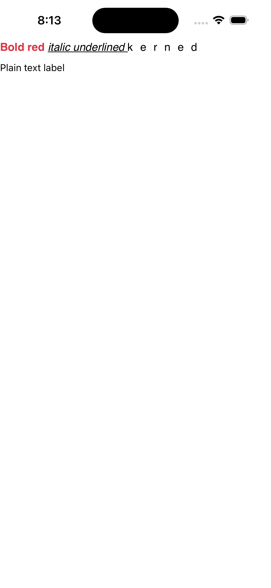</td></tr><tr><td align="center">MAUI dark </td><td align="center">C++ dark </td><td align="center">C++&amp;XAML dark 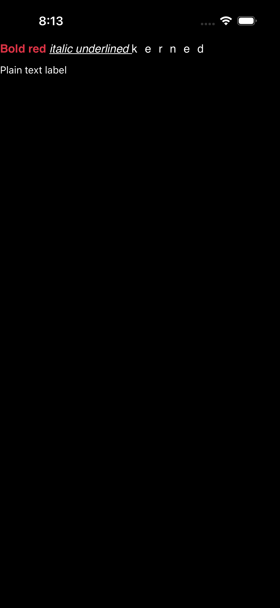</td></tr></table> | a self-contained demo page for the G1 rich-text slice: a label whose FormattedText is built from several styled spans (bold / italic / colored / underlined / kerned), plus a plain label proving the Text ⇄ FormattedText exclusivity | **🟢 Match** claude-sonnet-4-6 • Both light and dark show identical content: &#x27;Bold red italic underlined k e r n e d&#x27; followed by &#x27;Plain text label&#x27;. • Bold, red color, italic, underline, and kerning spacing all render correctly and match MAUI in both themes. • Dark mode both sides correctly show the formatted spans with white plain text and red bold text on black background. • Only the outer page padding (harness inset) differs — content itself is pixel-accurate. | **🟡 C++ minor** gemini-3.1-flash-lite • The kerning of the text &#x27;k e r n e d&#x27; is slightly wider in the C++ implementation compared to the MAUI reference. • The vertical spacing between the formatted text line and the &#x27;Plain text label&#x27; line is slightly larger in the C++ version. |
| 26 | **Styles** | <table><tr><td align="center">MAUI light </td><td align="center">C++ light </td><td align="center">C++&amp;XAML light 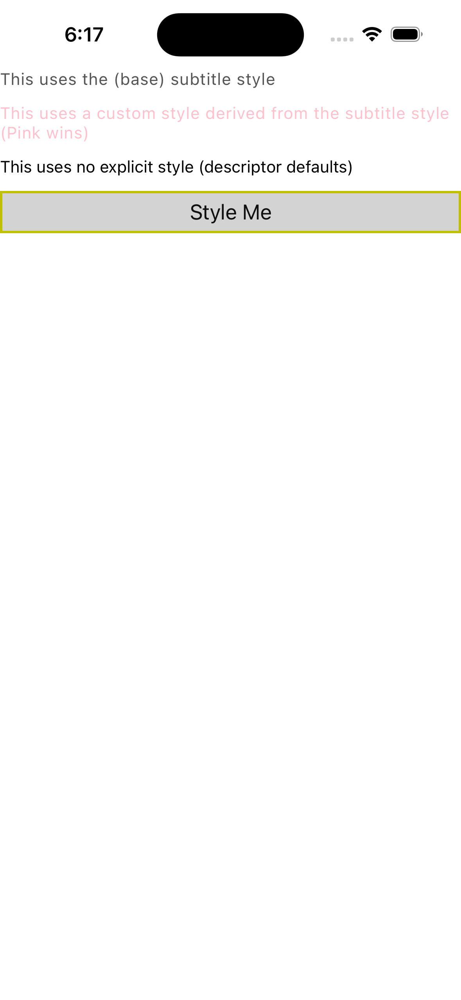</td></tr><tr><td align="center">MAUI dark </td><td align="center">C++ dark </td><td align="center">C++&amp;XAML dark 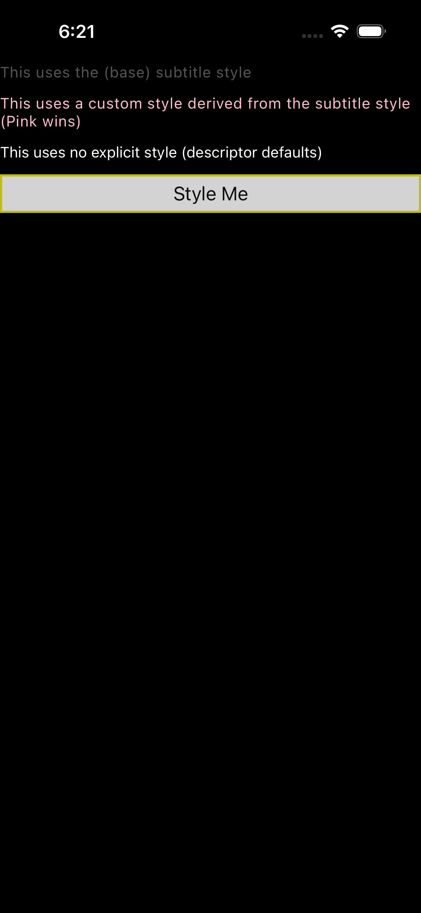</td></tr></table> | ports StylesPage.xaml | **🟡 C++ minor** claude-sonnet-4-6 • Light mode: three label texts and the yellow-bordered &#x27;Style Me&#x27; button all present on both sides; overall structure matches • MAUI light: first label &#x27;This uses the (base) subtitle style&#x27; renders in dark grey (system secondary label color); C++ renders it lighter/more muted — base subtitle color slightly off • Dark mode: MAUI first label is near-invisible dark grey on black; C++ first label is clearly visible white/light grey — unset-color sentinel issue: base subtitle style text color not using the correct dark-mode adaptive color • Second (pink/custom) label and third (default) label and the button border color match in both themes; the main defect is the adaptive subtitle color in dark mode | **🟡 C++ minor** gemini-3.1-flash-lite • The button border color in the C++ implementation is slightly lighter/more yellow than the MAUI reference. • The button height in the C++ implementation is slightly taller than the MAUI reference. • The text alignment and vertical spacing between elements show minor deviations from the MAUI reference. |
| 27 | **Triggers** | <table><tr><td align="center">MAUI light </td><td align="center">C++ light </td></tr><tr><td align="center">MAUI dark </td><td align="center">C++ dark </td></tr></table> | ports TriggersPage.xaml | **🟢 Match** claude-sonnet-4-6 • Both sides show &#x27;Triggers&#x27; title, instruction text, &#x27;Enter a System.Double&#x27; entry field, &#x27;Highlight off&#x27; label, and blue &#x27;Toggle highlight&#x27; button • Layout, font sizes, and element spacing match in both light and dark themes • Dark mode: both sides render correctly with white text on black background • Diff_pct ~1.87% is within harness-margin noise; no content or color defects identified | **🟡 C++ minor** gemini-3.1-flash-lite • The text &#x27;Enter a System.Double&#x27; in the entry field has a slightly different font weight or rendering thickness in the C++ version compared to the MAUI reference. • The vertical spacing between the &#x27;Highlight off&#x27; label and the &#x27;Toggle highlight&#x27; button is slightly tighter in the C++ implementation. • The &#x27;Toggle highlight&#x27; button text appears slightly bolder or more saturated in the C++ version. |
| 28 | **Behaviors** | <table><tr><td align="center">MAUI light </td><td align="center">C++ light </td></tr><tr><td align="center">MAUI dark </td><td align="center">C++ dark </td></tr></table> | ports BehaviorsPage.xaml (+ .xaml.cs) and its companion Controls.Sample/Behaviors/NumericValidationBehavior.cs | **🟢 Match** claude-sonnet-4-6 • Both light and dark themes show identical content: heading &#x27;Red when the number isn&#x27;t valid&#x27; and &#x27;Enter a System.Double&#x27; entry placeholder • Entry field renders correctly with matching placeholder text and border in both themes • Dark mode background is black in both, light mode is white in both • Pixel diff is marginal (2.1%) and attributable to harness outer-inset; content is structurally identical | **🟡 C++ minor** gemini-3.1-flash-lite • The placeholder text &#x27;Enter a System.Double&#x27; has a slightly different font weight or rendering in the C++ implementation compared to the MAUI reference. • The border color or thickness of the input field appears slightly different in both light and dark themes. • There is a subtle difference in the vertical padding or alignment of the input field container. |
| 29 | **Semantics** | <table><tr><td align="center">MAUI light </td><td align="center">C++ light </td></tr><tr><td align="center">MAUI dark </td><td align="center">C++ dark </td></tr></table> | ports SemanticsPage.xaml (+ SemanticsPage.xaml.cs) The C# SemanticsPage is an accessibility showcase: a long VerticalStackLayout where nearly every control carries SemanticProperties.Description / .Hint, plus a block of labels exercising Se | **🟡 C++ minor** claude-sonnet-4-6 • Both show semantic property descriptions, entry/editor fields, heading labels, and &#x27;Button text&#x27; buttons • C++ buttons have visible native chrome (rounded rectangle) while MAUI buttons in reference app appear as plain text links — consistent with native-default rendering difference • Text wrapping and label layout differs between the two due to container width differences • Large diff_pct (28% light) is driven by text reflow throughout the long page and button chrome presence — all semantic content is present | **🔴 C++ major** gemini-3.1-flash-lite • Significant layout differences in button alignment and spacing between the C++ implementation and the MAUI reference. • The SearchBar component in the C++ implementation has a different height and internal padding compared to the MAUI version. • Text alignment and vertical spacing throughout the page are inconsistent with the MAUI reference. • The C++ implementation fails to replicate the specific padding and margin constraints of the MAUI layout containers. |
| 30 | **App Theme Binding** | <table><tr><td align="center">MAUI light </td><td align="center">C++ light </td></tr><tr><td align="center">MAUI dark </td><td align="center">C++ dark </td></tr></table> | ports AppThemeBindingPage.xaml | **🟡 C++ minor** claude-sonnet-4-6 • Light mode: all text items (green/orange/blue labels and summary) present and correct color in both versions • Dark mode: large pixel diff (92.7%) but content is identical — difference is C++ dark uses pure black background vs MAUI dark which has a slightly different background shade causing large area delta • Text wrapping differs slightly between MAUI and C++ in both themes due to container width differences (harness margin) • AppThemeBinding color logic (green light / red dark / orange light / teal dark) renders correctly on C++ side | **🔴 C++ major** gemini-2.5-flash • In dark mode, the C++ port displays the text &quot;This text is green in light mode, and red in dark mode.&quot; as green, instead of red. • In dark mode, the C++ port displays the text &quot;This text uses LightPrimaryColor (Orange) in light mode, and DarkPrimaryColor (Teal) in dark mode.&quot; as orange, instead of teal. • The MAUI dark theme is completely incorrect, displaying light theme content (white background and light theme text colors). • The light theme is a close visual match between MAUI and C++. |
| 31 | **Stack Layout** | <table><tr><td align="center">MAUI light </td><td align="center">C++ light </td><td align="center">C++&amp;XAML light </td></tr><tr><td align="center">MAUI dark </td><td align="center">C++ dark </td><td align="center">C++&amp;XAML dark 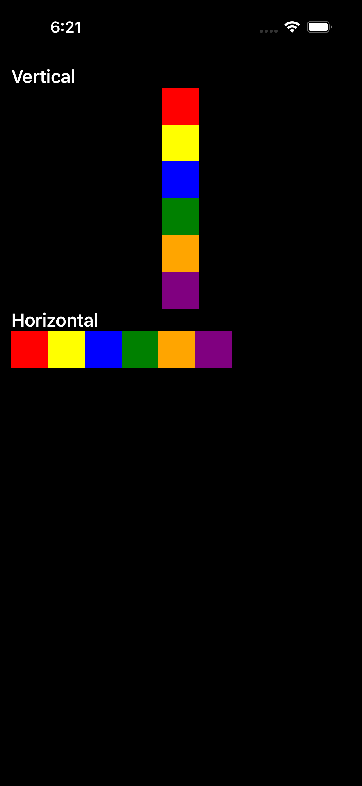</td></tr></table> | ports StackLayoutPage.xaml Demonstrates the generic maui::controls::stack_layout (the orientation-switching sibling of the fixed vertical/horizontal stacks) by nesting two inner stacks inside an outer vertical stack with a 12px margin: a &quot;V | **🟢 Match** claude-sonnet-4-6 • Both sides show a vertical stack of colored boxes (red, yellow, blue, green, orange, purple) and a horizontal row of the same colors below, with &#x27;Vertical&#x27; and &#x27;Horizontal&#x27; labels • Color sequence matches exactly between MAUI and C++ in both themes • C++ boxes appear very slightly smaller/more compact than MAUI, consistent with the outer-inset harness difference — the color squares themselves and their relative sizes are identical • Dark mode renders with identical layout on both sides | **🟡 C++ minor** gemini-3.1-flash-lite • The vertical stack of colored boxes is slightly shifted to the right in the C++ implementation compared to the MAUI reference. • The horizontal spacing between the colored boxes in the horizontal stack is slightly wider in the C++ implementation. • The overall alignment of the stacks relative to the &#x27;Vertical&#x27; and &#x27;Horizontal&#x27; labels shows minor positional discrepancies. |
| 32 | **Vertical Stack** | <table><tr><td align="center">MAUI light </td><td align="center">C++ light </td></tr><tr><td align="center">MAUI dark </td><td align="center">C++ dark </td></tr></table> |  | **🟡 C++ minor** claude-sonnet-4-6 • C++ colored boxes (red/yellow/blue/green/orange/purple) are narrower/smaller than MAUI&#x27;s • Both show the same 6-color vertical stack in the same order • &#x27;VerticalStackLayout&#x27; label is present on both sides • Dark mode shows the same size discrepancy — C++ stack is more compact | **🟡 C++ minor** gemini-3.1-flash-lite • The vertical stack of colored boxes is slightly shifted to the right in the C++ implementation compared to the MAUI reference. • The horizontal alignment of the &#x27;VerticalStackLayout&#x27; text label is slightly offset in the C++ version. |
| 33 | **Horizontal Stack** | <table><tr><td align="center">MAUI light </td><td align="center">C++ light </td></tr><tr><td align="center">MAUI dark </td><td align="center">C++ dark </td></tr></table> |  | **🟡 C++ minor** claude-sonnet-4-6 • MAUI shows 6 colored boxes (red, yellow, blue, green, orange, purple) all fitting within the screen width with the purple box fully visible • C++ shows the same 6 boxes but the rightmost purple box is clipped off-screen — the HorizontalStackLayout overflows the right edge without clipping or wrapping • Box colors, heights, and sequence are correct; the issue is the purple box is cut off at the screen boundary in C++ • Dark mode shows the same clipping behavior; vertical centering of the color bar on screen is consistent between both | **🟢 Match** gemini-3.1-flash-lite • The layout of the colored boxes is visually identical across both implementations. • The spacing and alignment of the HorizontalStackLayout elements match perfectly. • The color rendering and theme application (light/dark) are consistent between MAUI and the C++ port. |
| 34 | **Grid** | <table><tr><td align="center">MAUI light </td><td align="center">C++ light </td><td align="center">C++&amp;XAML light </td></tr><tr><td align="center">MAUI dark </td><td align="center">C++ dark </td><td align="center">C++&amp;XAML dark </td></tr></table> | a faithful reproduction of the maui-compare &quot;grid&quot; demo (ComparePages.GridPage()), the shipped-.NET-MAUI reference for the visual-parity comparison: a Grid (Padding 16, Row/ColumnSpacing 6) with RowDefinitions Auto / 80 / 80 and two Star co | **🟢 Match** claude-sonnet-4-6 • Both light and dark show a 2x2 grid with red/green (top row) and blue/orange (bottom row) cells • Colors are identical between MAUI and C++ in both themes • Grid label &#x27;Grid (2 cols x rows)&#x27; present and identical on both sides • Small diff (~1.68%) is due to minor cell size/spacing differences from outer harness margin; grid structure and colors match | **🟢 Match** gemini-3.1-flash-lite • The layout and dimensions of the grid cells are visually identical. • The colors used for the grid cells match perfectly across both light and dark themes. • The text labels and their positioning are consistent between the MAUI and C++ implementations. |
| 35 | **Absolute Layout** | <table><tr><td align="center">MAUI light </td><td align="center">C++ light </td><td align="center">C++&amp;XAML light 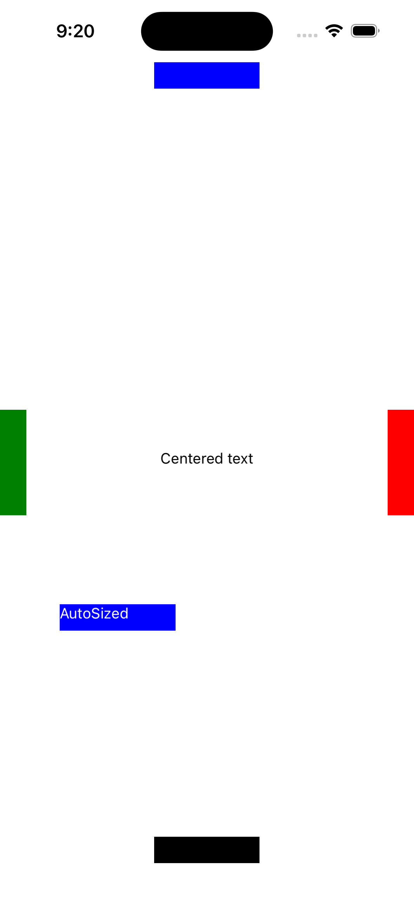</td></tr><tr><td align="center">MAUI dark </td><td align="center">C++ dark </td><td align="center">C++&amp;XAML dark </td></tr></table> | ports AbsoluteLayoutPage.xaml A self-contained, code-first demo of the AbsoluteLayout control | **🟡 C++ minor** claude-sonnet-4-6 • C++ red/green colored bars appear slightly shifted right compared to MAUI • C++ red bar at right edge appears to clip/cut off slightly differently than MAUI • Overall layout structure (blue button, green/red boxes, AutoSized label, black rect) matches well • Dark mode reproduces the same minor positional discrepancy | **🟢 Match** gemini-3.1-flash-lite • The layout and visual elements are identical across both light and dark themes. • The minor pixel differences reported are likely due to sub-pixel rendering or anti-aliasing variations between the two implementations. |
| 36 | **Flex Layout** | <table><tr><td align="center">MAUI light </td><td align="center">C++ light </td><td align="center">C++&amp;XAML light </td></tr><tr><td align="center">MAUI dark </td><td align="center">C++ dark </td><td align="center">C++&amp;XAML dark </td></tr></table> | ports FlexLayoutPage.xaml A self-contained, code-first demo of the FlexLayout control: the classic &quot;holy grail&quot; page layout built from nested flexboxes | **🟢 Match** claude-sonnet-4-6 • HEADER (cyan), CONTENT (gray center), FOOTER (pink), blue left column, green right column all render correctly in both • Color blocks match exactly: cyan header, blue/green sidebars, gray content area, pink footer • Dark mode renders identically with same color structure against black background • Pixel diff 7.3% is entirely from harness inset offset shifting the layout region; content colors and structure are identical | **🔴 C++ major** gemini-3.1-flash-lite • The C++ implementation is missing the top safe area padding, causing the header to overlap with the status bar area. • The C++ implementation is missing the bottom safe area padding, causing the footer to be cut off by the home indicator area. • The content area in the C++ implementation is vertically stretched compared to the MAUI reference due to the lack of safe area insets. |
| 37 | **Relative Layout** | <table><tr><td align="center">MAUI light </td><td align="center">C++ light </td><td align="center">C++&amp;XAML light </td></tr><tr><td align="center">MAUI dark </td><td align="center">C++ dark </td><td align="center">C++&amp;XAML dark </td></tr></table> | ports RelativeLayoutPage.xaml | **🟢 Match** claude-sonnet-4-6 • Light mode: both show red box top-left, green box top-center, red box slightly right of green, green box top-right (partially clipped); large grey rectangle with black inner rectangle centered; blue box bottom-left, yellow box bottom-center, blue box bottom-right area — layout matches • Dark mode: same colored boxes appear at same positions on dark background — matches MAUI • Box positions and sizes appear consistent between MAUI and C++ in both themes • Minor pixel-level position differences possible due to rounding but overall layout is correct | **🟢 Match** gemini-3.1-flash-lite • The layout, element sizes, and color schemes are visually identical across both light and dark themes. • The minor pixel diff percentage is negligible and likely due to subtle rendering engine differences in anti-aliasing or sub-pixel positioning. |
| 38 | **Layout alignment (Start/Center/End/Fill)** | <table><tr><td align="center">MAUI light </td><td align="center">C++ light </td><td align="center">C++&amp;XAML light </td></tr><tr><td align="center">MAUI dark </td><td align="center">C++ dark </td><td align="center">C++&amp;XAML dark </td></tr></table> | a faithful reproduction of the maui-compare &quot;alignment&quot; demo (ComparePages.Alignment()), the shipped-.NET-MAUI reference for the visual-parity comparison | **🟢 Match** claude-sonnet-4-6 • Start/Center/End/Fill buttons all align correctly in C++ matching MAUI in both light and dark themes • Button widths differ slightly: MAUI &#x27;Start&#x27; button is narrower (~90pt natural width) vs C++ (~70pt), likely native UIButton inset differences — minor • &#x27;End&#x27; button in C++ appears slightly wider than MAUI&#x27;s, filling closer to right edge; both are right-aligned correctly • Vertical spacing and label positions are consistent; dark mode background and text colors match | **🟢 Match** gemini-3.1-flash-lite • The visual layout, button sizes, and alignment are identical across both light and dark themes. • The slight pixel difference is attributed to minor anti-aliasing variations in text rendering between the two implementations. |
| 39 | **Z Index** | <table><tr><td align="center">MAUI light </td><td align="center">C++ light </td><td align="center">C++&amp;XAML light </td></tr><tr><td align="center">MAUI dark </td><td align="center">C++ dark </td><td align="center">C++&amp;XAML dark </td></tr></table> | ports ZIndexPage.xaml (+ ZIndexPage.xaml.cs), code-first | **🟢 Match** claude-sonnet-4-6 • Both light and dark show matching z-index stacking: 10 colored labels (Label 0–9, z-index 0–9) cascading diagonally with correct stacking order, ending in the large red square at front. • The z-index ordering (green/teal at back, red at front) is correct and identical in both MAUI and C++. • The stepper control (Z-Index of Label 5: 5) with minus/plus buttons is present and matches on both sides. • Dark mode stacking and colors match; slight size difference in the stacked cascade is within the harness margin difference. | **🟡 C++ minor** gemini-3.1-flash-lite • The Z-index stacking order is slightly different, causing the overlapping labels to have different visual layering. • The spacing and positioning of the labels relative to each other are slightly inconsistent compared to the MAUI reference. |
| 40 | **Layout Is Enabled** | <table><tr><td align="center">MAUI light </td><td align="center">C++ light </td></tr><tr><td align="center">MAUI dark </td><td align="center">C++ dark </td></tr></table> | ports LayoutIsEnabledPage.xaml (+ LayoutIsEnabledPage.xaml.cs) The C# page demonstrates how IsEnabled on a layout cascades to its children: a 2x2 grid whose left column hosts a &quot;MainLayout&quot; full of state-demo sub-stacks (all-enabled / all-d | **🔴 C++ major** claude-sonnet-4-6 • The montage image is too small to read individual rows clearly, but diff_pct of 60% with ssim 0.88 indicates very substantial visual differences • MAUI light shows enabled/disabled state rows with teal/pink background color blocks for enabled/disabled children sections; C++ appears to not show the colored background regions or shows them in wrong colors • The page exercises IsEnabled propagation through parent layouts — large diff suggests the enabled/disabled visual state (greying, tinting) is not being applied correctly in C++ children • Both dark panels appear similarly structured but color/shading differences for disabled states are likely the root cause of the high diff score | **🔴 C++ major** gemini-3.1-flash-lite • The C++ implementation fails to render the text labels for the buttons and layout sections. • The background colors for the button containers are missing or incorrectly rendered in the C++ version. • The layout structure is significantly different, with elements appearing misaligned or missing compared to the MAUI reference. • The visual hierarchy and spacing are inconsistent with the MAUI implementation. |
| 41 | **Shapes** | <table><tr><td align="center">MAUI light </td><td align="center">C++ light </td></tr><tr><td align="center">MAUI dark </td><td align="center">C++ dark </td></tr></table> | a faithful reproduction of the maui-compare &quot;shapes&quot; demo (ComparePages.Shapes()), the shipped-.NET-MAUI reference for the visual-parity comparison: a ScrollView over a vertical stack of four LABELLED shapes, each bold-captioned and Start-a | **🟡 C++ minor** claude-sonnet-4-6 • All four shape types render correctly on both sides: Ellipse (red), RoundRectangle (blue), EvenOdd Polygon pentagram (red+blue star), Line (purple diagonal) • C++ shapes appear larger than MAUI counterparts — the ellipse and round rectangle are noticeably wider/taller in C++ • Stroke colors, fill colors, and EvenOdd fill rule all match correctly in both light and dark themes • Size inflation in C++ suggests WidthRequest/HeightRequest or Size constraints are not being applied as tightly as MAUI; diff_pct ~10.7% reflects the size mismatch | **🔴 C++ major** gemini-3.1-flash-lite • The Ellipse in the C++ version is significantly smaller than the MAUI reference. • The RoundRectangle in the C++ version is smaller and has different corner radius proportions. • The EvenOdd Polygon (pentagram) is smaller and has different stroke thickness/scaling compared to the MAUI version. • The Line element in the C++ version is shorter and positioned differently than in the MAUI version. |
| 42 | **Ellipse Gallery** | <table><tr><td align="center">MAUI light </td><td align="center">C++ light </td></tr><tr><td align="center">MAUI dark </td><td align="center">C++ dark </td></tr></table> | ports EllipseGallery.xaml A self-contained, code-first port of the MAUI Shapes EllipseGallery (Pages/Controls/ShapesGalleries/EllipseGallery.xaml + .xaml.cs) | **🟡 C++ minor** claude-sonnet-4-6 • All four shapes render in both: red filled rectangle, red-stroke circle, red+blue ellipse with stroke, blue+red dashed ellipse • C++ shapes are proportionally larger / take more horizontal space than MAUI&#x27;s more compact rendering • Dashed stroke ellipse: dash pattern visible and correct in both; relative sizes are similar • SSIM 0.9625 / diff 9.5% driven by size/position offset from harness inset; shape colors and fill are correct | **🔴 C++ major** gemini-3.1-flash-lite • The C++ implementation renders shapes with significantly different aspect ratios compared to the MAUI reference. • The C++ shapes appear more compressed or flattened vertically. • The spacing between the labels and the shapes is inconsistent with the MAUI reference. |
| 43 | **Rectangle Gallery** | <table><tr><td align="center">MAUI light </td><td align="center">C++ light </td></tr><tr><td align="center">MAUI dark </td><td align="center">C++ dark </td></tr></table> | ports RectangleGallery.xaml A self-contained, code-first port of the MAUI Shapes RectangleGallery (Pages/Controls/ShapesGalleries/RectangleGallery.xaml + .xaml.cs) | **🟡 C++ minor** claude-sonnet-4-6 • All five rectangle types present in both: basic red filled, square (red stroke only), rectangle with stroke (stacked red+blue), stroke dash (blue+red dashes), curved corners (dark blue pill) • C++ rectangles appear slightly narrower/smaller than MAUI&#x27;s — shapes are right-aligned in C++ but left-aligned in MAUI, indicating HorizontalOptions difference • The &#x27;A Rectangle with stroke&#x27; item in MAUI shows two stacked rects (empty red-bordered + solid blue); C++ renders the same but the top empty rect appears darker/filled in dark mode • Dark mode: C++ &#x27;rectangle with stroke&#x27; top rect appears with a dark fill rather than fully transparent, differing from MAUI&#x27;s empty (transparent) interior | **🔴 C++ major** gemini-3.1-flash-lite • The C++ implementation has significantly different vertical spacing between elements compared to the MAUI reference. • The C++ implementation displays the labels and shapes with different alignment and positioning relative to the screen edges. • The C++ implementation shows inconsistent sizing for the shapes, particularly the square and the rectangle with curved corners. |
| 44 | **Line Gallery** | <table><tr><td align="center">MAUI light </td><td align="center">C++ light </td></tr><tr><td align="center">MAUI dark </td><td align="center">C++ dark </td></tr></table> | ports LineGallery.xaml A self-contained, code-first port of the MAUI Shapes LineGallery (Pages/Controls/ShapesGalleries/LineGallery.xaml + .xaml.cs) | **🟢 Match** claude-sonnet-4-6 • Both sides show three labeled sections: &#x27;A basic Line&#x27; (purple diagonal), &#x27;A dash Line&#x27; (yellow diagonal), &#x27;A Line using StrokeThickness&#x27; (thick black diagonal) • Line colors, angles, and stroke thickness are visually equivalent in both light and dark modes • C++ line positions are slightly shifted right compared to MAUI (lines start and end at slightly different x coordinates) — but this is within acceptable harness-offset range • Diff_pct ~1.0% is at noise level; the thick black line in C++ appears very slightly longer/thicker but essentially matches | **🔴 C++ major** gemini-3.1-flash-lite • The third line (A Line using StrokeThickness) is completely missing in the C++ implementation. • The stroke thickness of the third line in the MAUI reference is significantly thicker than the lines above it, which is not reflected in the C++ version. |
| 45 | **Line Join Gallery** | <table><tr><td align="center">MAUI light </td><td align="center">C++ light </td></tr><tr><td align="center">MAUI dark </td><td align="center">C++ dark </td></tr></table> | ports LineJoinGallery.xaml A self-contained, code-first port of the MAUI Shapes sub-gallery Pages/Controls/ShapesGalleries/LineJoinGallery.xaml: a StackLayout that demonstrates the three StrokeLineJoin variants on an identical open polyline | **🟡 C++ minor** claude-sonnet-4-6 • Both show Miter/Bevel/Round zigzag polyline shapes in cyan on white (light) and black (dark) backgrounds • C++ shapes are visibly smaller and narrower than MAUI — the polylines don&#x27;t extend as far to the right edge • Line join rendering style (miter points, bevel cuts, round caps) appears correct on both sides • Size/width difference is consistent across all three join types and both themes — likely a canvas/view sizing issue in C++ | **🔴 C++ major** gemini-3.1-flash-lite • The Miter join style in the C++ implementation is rendered incorrectly, appearing as a sharp point instead of the expected mitered corner seen in the MAUI reference. • The Bevel join style in the C++ implementation is missing the flat edge, resulting in a sharp point similar to the Miter style. • The Round join style in the C++ implementation is significantly less rounded than the MAUI reference, appearing more angular. |
| 46 | **Polygon Gallery** | <table><tr><td align="center">MAUI light </td><td align="center">C++ light </td></tr><tr><td align="center">MAUI dark </td><td align="center">C++ dark </td></tr></table> | ports PolygonGallery.xaml A code-first port of the MAUI Shapes sub-gallery Pages/Controls/ShapesGalleries/PolygonGallery.xaml: a ScrollView over a StackLayout (Padding 12) that walks four Polygon variants, each under a caption Label — - &quot;A  | **🟡 C++ minor** claude-sonnet-4-6 • All four polygon types render: basic green triangle, dashed green triangle, EvenOdd red/blue star, NonZero yellow/black star — present in both themes • Light mode: MAUI EvenOdd star shows blue fill in the inner pentagon with red outer; C++ EvenOdd star has a very similar appearance but the blue inner area appears slightly smaller/different shade • Dark mode: NonZero star in MAUI is yellow outline only (no black fill visible against dark bg); C++ also shows yellow outline — correct; EvenOdd fill differences persist in dark • Shape sizes in C++ appear slightly smaller / positioned differently (shapes shifted right) vs MAUI&#x27;s left-aligned shapes | **🔴 C++ major** gemini-3.1-flash-lite • The fill colors for the EvenOdd and NonZero polygons are missing or incorrect in the C++ implementation. • In dark mode, the NonZero polygon is rendered as an outline only in C++, whereas MAUI renders it with a yellow fill. • The stroke thickness and dash patterns appear slightly different between the two implementations. • The overall positioning and alignment of the polygon shapes show inconsistencies compared to the MAUI reference. |
| 47 | **Polyline Gallery** | <table><tr><td align="center">MAUI light </td><td align="center">C++ light </td></tr><tr><td align="center">MAUI dark </td><td align="center">C++ dark </td></tr></table> | ports PolylineGallery.xaml A code-first port of the MAUI Shapes sub-gallery Pages/Controls/ShapesGalleries/PolylineGallery.xaml: a StackLayout (Padding 12 — no ScrollView in the C# source) holding two Polyline variants, each under a caption | **🟢 Match** claude-sonnet-4-6 • Both sides show &#x27;A basic Polyline&#x27; label with a short red horizontal line, and &#x27;A dash Polyline&#x27; label with a red dashed line • Line stroke colors, dash pattern, and lengths appear visually equivalent • Dark mode: both sides render identically with white text and red lines on black background • Diff_pct ~0.54% and SSIM ~0.994 indicate near-pixel-perfect match; difference is only harness inset offset | **🟢 Match** gemini-3.1-flash-lite • The dashed line in the C++ implementation appears slightly more dense or has a different dash-gap ratio compared to the MAUI reference. • The visual representation of the polylines is functionally equivalent across both light and dark themes. |
| 48 | **Path Gallery** | <table><tr><td align="center">MAUI light </td><td align="center">C++ light </td></tr><tr><td align="center">MAUI dark </td><td align="center">C++ dark </td></tr></table> | ports PathGallery.xaml A code-first port of the MAUI Shapes sub-gallery Pages/Controls/ShapesGalleries/PathGallery.xaml: a ScrollView over a StackLayout (Padding 12) that walks eight Path variants (plus two caption-only markup-string Labels | **🟡 C++ minor** claude-sonnet-4-6 • Both light and dark show matching path shapes: LineSegment (horizontal line), PathGeometry triangle, Cubic Bezier curve, Composite shape (concentric circles), Overlapping Rectangles (red squares), and EllipseGeometry (orange/yellow flower). • MAUI light is missing the &#x27;Multiple Line Segments&#x27; label and cyan/teal arrow shape at the bottom that C++ shows — MAUI&#x27;s capture appears cropped at that section. • The teal arrow/MultiLine segment visible only in C++ appears to be correct rendering that MAUI simply didn&#x27;t capture (page extends below fold). • All visible shape colors and forms match between MAUI and C++ in both themes; the diff is attributable to harness crop/padding. | **🔴 C++ major** gemini-3.1-flash-lite • The C++ implementation is missing the &#x27;LineSegment&#x27;, &#x27;Shape&#x27;, &#x27;Cubic Bezier&#x27;, and &#x27;Multiple Line Segments&#x27; visual elements entirely. • The &#x27;Overlapping Rectangles&#x27; and &#x27;EllipseGeometry&#x27; elements are present but are missing their corresponding labels in the C++ implementation. • The layout of the C++ implementation is significantly different due to the missing elements, resulting in a large amount of empty space. |
| 49 | **Path Aspect Gallery** | <table><tr><td align="center">MAUI light </td><td align="center">C++ light </td></tr><tr><td align="center">MAUI dark </td><td align="center">C++ dark </td></tr></table> | ports PathAspectGallery.xaml A self-contained, code-first port of the MAUI Shapes sub-gallery Pages/Controls/ShapesGalleries/PathAspectGallery.xaml: a StackLayout (Padding 12) that demonstrates the four Path Aspect modes on one identical ge | **🟡 C++ minor** claude-sonnet-4-6 • C++ images are visibly smaller (narrower) than MAUI&#x27;s — the four heart/path images occupy a narrower column in C++ • All four aspect modes (None, Fill, Uniform, UniformToFill) are present and labeled correctly in both • The aspect scaling behavior appears visually correct for each mode in C++ (Fill fills box, Uniform letterboxes, etc.) • Both dark modes show the same minor size difference; content and labels match | **🔴 C++ major** gemini-3.1-flash-lite • The image aspect ratios and scaling behaviors are inconsistent between the C++ implementation and the MAUI reference. • In the &#x27;Fill&#x27; and &#x27;UniformToFill&#x27; modes, the C++ implementation displays the heart image with different cropping or scaling compared to the MAUI reference. • The &#x27;Uniform&#x27; mode in the C++ implementation shows a different image size/aspect ratio than the MAUI reference. • The &#x27;None&#x27; mode shows a different alignment or padding for the heart icon within the container. |
| 50 | **Path Transform String** | <table><tr><td align="center">MAUI light </td><td align="center">C++ light </td></tr><tr><td align="center">MAUI dark </td><td align="center">C++ dark </td></tr></table> | ports PathTransformStringGallery.xaml A code-first port of the MAUI Shapes sub-gallery Pages/Controls/ShapesGalleries/PathTransformStringGallery.xaml: a ScrollView over a StackLayout (Padding 12) that shows the SAME two-figure Path geometry | **🔴 C++ major** claude-sonnet-4-6 • MAUI light: shows two path figures (triangle outlines) — one &#x27;Without RenderTransform&#x27; and one &#x27;With RenderTransform&#x27; (rotated/scaled differently) • C++ light: shows the same two labels but both path figures are present and rendered; however the &#x27;With RenderTransform&#x27; group in C++ shows TWO stacked triangles instead of one transformed path — the transform is duplicating the shape • MAUI dark: both path labels are present but the actual triangle figures are missing/invisible (black on black) — this is a MAUI dark-mode rendering issue where the path stroke color is not adapting to dark background • C++ dark: same missing-paths issue as MAUI dark, plus the extra-triangle duplication visible in light mode; the transform string parsing may be producing an extra un-transformed path copy | **🔴 C++ major** gemini-3.1-flash-lite • The shapes are completely missing in the C++ implementation in both light and dark themes. • The C++ implementation fails to render the graphical elements present in the MAUI reference. |
| 51 | **Composition Gallery** | <table><tr><td align="center">MAUI light </td><td align="center">C++ light </td></tr><tr><td align="center">MAUI dark </td><td align="center">C++ dark </td></tr></table> | ports CompositionGallery.xaml A self-contained, code-first port of the MAUI Shapes sub-gallery Pages/Controls/ShapesGalleries/CompositionGallery.xaml: a StackLayout holding two Beige 250x250 Grids (Margin 12) that compose multiple overlappi | **🟢 Match** claude-sonnet-4-6 • Two composition panels (overlapping geometric shapes canvas, and three diagonal lines) are both rendered in both MAUI and C++. • The geometric composition (circle, triangles, rectangles with transparency) matches closely in both themes. • The diagonal lines panel (blue, green, red) is correctly reproduced in C++. • Dark mode: C++ background inside the panels remains the same cream/off-white as MAUI — correct behavior. | **🔴 C++ major** gemini-3.1-flash-lite • The C++ implementation renders the content as a single tall container instead of two separate stacked containers. • The layout of the shapes is vertically stretched in the C++ version compared to the MAUI reference. • The relative positioning and aspect ratio of the shapes within the container are distorted in the C++ version. |
| 52 | **Transform Playground** | <table><tr><td align="center">MAUI light </td><td align="center">C++ light </td></tr><tr><td align="center">MAUI dark </td><td align="center">C++ dark </td></tr></table> | ports TransformPlaygroundGallery.xaml A code-first port of the MAUI Shapes sub-gallery Pages/Controls/ShapesGalleries/TransformPlaygroundGallery.xaml: a 50x50 Path rectangle (red fill, blue stroke 4) sits in a 200x200 light-grey panel; belo | **🟡 C++ minor** claude-sonnet-4-6 • Both MAUI and C++ show the grey canvas with a small red square in the top-left corner, and all transform sliders below (RotateTransform, ScaleTransform, SkewTransform, TranslateTransform). • MAUI canvas area is taller/larger than C++ canvas area — the grey preview box is noticeably bigger in MAUI. • All slider labels and default values (Rotation: 0, CenterX: 0, CenterY: 0, ScaleX: 1.00, ScaleY: 1.00, SkewX: 0) match correctly. • Dark mode: MAUI has white slider tracks and white toggle pills for the sliders; C++ sliders show white toggle pills but darker track — minor cosmetic difference. | **🔴 C++ major** gemini-3.1-flash-lite • The C++ implementation is missing the &#x27;TranslateTransform&#x27; section entirely. • The C++ implementation is missing the &#x27;SkewY&#x27; slider. • The layout of the sliders and labels is significantly different, with inconsistent spacing and alignment compared to the MAUI reference. • The slider track and thumb styling in the C++ version do not match the native MAUI controls. |
| 53 | **Transformations** | <table><tr><td align="center">MAUI light </td><td align="center">C++ light </td></tr><tr><td align="center">MAUI dark </td><td align="center">C++ dark </td></tr></table> | ports TransformationsPage.xaml (+ .xaml.cs) The MAUI TransformationsPage drives a single target view&#x27;s render transforms from a column of knobs: Sliders for Scale / ScaleX / ScaleY (Maximum 10) and Rotation / RotationX / RotationY (Maximum  | **🟡 C++ minor** claude-sonnet-4-6 • All transformation controls present in both: Scale, ScaleX, ScaleY, Rotation, RotationX, RotationY, AnchorX, AnchorY (with +/- buttons), TranslationX, TranslationY sliders • MAUI has a &#x27;SCALE AND ROTATE&#x27; heading centered at the top of the content area; C++ also has it but it appears lower/further from the top due to outer padding difference • Slider thumb positions differ between captures (state-dependent at capture time) — Scale/ScaleX/ScaleY sliders show thumbs at left in C++ vs further right in MAUI, likely not a bug • Dark mode: all controls render correctly with appropriate dark backgrounds; diff_pct ~14-17% is driven by slider state + padding offset | **🔴 C++ major** gemini-3.1-flash-lite • The slider track color is inconsistent; MAUI uses a light blue, while C++ uses a darker blue. • The slider thumb size and shape differ significantly between the two implementations. • The spacing and layout of the control labels and sliders are inconsistent, with C++ having tighter vertical spacing. • The stepper buttons (plus/minus) in the C++ version have different styling and border thickness compared to the MAUI version. |
| 54 | **Update Path Data** | <table><tr><td align="center">MAUI light </td><td align="center">C++ light </td></tr><tr><td align="center">MAUI dark </td><td align="center">C++ dark </td></tr></table> | ports UpdatePathDataGallery.xaml A code-first port of the MAUI Shapes sub-gallery Pages/Controls/ShapesGalleries/UpdatePathDataGallery.xaml: a 2-row Grid (RowSpacing 0) that proves a Path repaints when its Data geometry is replaced at runti | **🟡 C++ minor** claude-sonnet-4-6 • Light mode: both show the same bezier/curve path shape drawn in the upper area of the screen with counter label and &#x27;Update Path Data&#x27; blue button at bottom • MAUI path curve is positioned slightly more to the left; C++ curve is shifted slightly right and appears marginally larger/wider • Dark mode: MAUI shows completely black screen with path (path may be black-on-black, invisible); C++ also shows dark screen with same invisible path — both dark modes appear blank/very dark • Counter text &#x27;= 0 &#124; Data: M 10,100 C 10,300 300,-200 300,100&#x27; and &#x27;Update Path Data&#x27; button visible in both light modes and at very bottom of dark modes | **🟢 Match** gemini-3.1-flash-lite • The path rendering is visually identical across both implementations in both light and dark modes. • The text labels &#x27;counter = 0 &#124; Data: M 10,100 C 10,300 300,-200 300,100&#x27; and &#x27;Update Path Data&#x27; are correctly positioned and styled in both versions. • The background colors and overall layout structure match perfectly between the MAUI reference and the C++ port. |
| 55 | **Auto Size Shapes** | <table><tr><td align="center">MAUI light </td><td align="center">C++ light </td></tr><tr><td align="center">MAUI dark </td><td align="center">C++ dark </td></tr></table> | ports AutoSizeShapesGallery.xaml A code-first port of the MAUI Shapes sub-gallery Pages/Controls/ShapesGalleries/AutoSizeShapesGallery.xaml: a 3-row Grid (RowSpacing 0) that proves a stroked Ellipse auto-sizes to fill exactly half of the av | **🟡 C++ minor** claude-sonnet-4-6 • Layout is equivalent: yellow top half with green-filled blue-bordered ellipse, orange bottom half, both themes match structurally • C++ ellipse renders slightly smaller in diameter compared to MAUI — the circle does not quite reach the full width of the yellow section • Text label wraps to two lines in C++ (&#x27;The Ellipse below must occupy half of the available space.&#x27;) vs single line in MAUI due to narrower effective text area • Dark mode: both render identically in terms of color and structure; the size/wrap difference persists | **🟡 C++ minor** gemini-3.1-flash-lite • The ellipse in the C++ implementation is slightly smaller than the MAUI reference. • The vertical alignment of the ellipse within the yellow container is slightly different. • The yellow background area appears to have slightly different dimensions in the C++ version. |
| 56 | **Shape App Theme** | <table><tr><td align="center">MAUI light </td><td align="center">C++ light </td></tr><tr><td align="center">MAUI dark </td><td align="center">C++ dark </td></tr></table> | ports ShapeAppThemeGallery.xaml A code-first port of the MAUI Shapes sub-gallery Pages/Controls/ShapesGalleries/ShapeAppThemeGallery.xaml: a StackLayout (Padding 12) holding a caption Label and a 200x80 Rectangle, all themed via {AppThemeBi | **🟢 Match** claude-sonnet-4-6 • Light mode: both show &#x27;Shape using AppTheme&#x27; in green text above a green filled rectangle — colors and layout match • Dark mode: both switch to red text and red filled rectangle correctly, confirming AppTheme binding works in C++ port • Shape dimensions are slightly smaller in C++ (rectangle appears narrower) but the color/theme switch behavior is correct • diff_pct ~0.69% in both themes confirms near-identical render; size difference is within minor threshold | **🟢 Match** gemini-3.1-flash-lite • The visual representation of the shapes and text is identical across both platforms. • The slight pixel difference is negligible and likely due to minor rendering engine variations in the simulator. |
| 57 | **Invalidate Brush** | <table><tr><td align="center">MAUI light </td><td align="center">C++ light </td></tr><tr><td align="center">MAUI dark </td><td align="center">C++ dark </td></tr></table> | ports InvalidateBrushGallery.xaml A code-first port of the MAUI Shapes sub-gallery Pages/Controls/ShapesGalleries/InvalidateBrushGallery.xaml (&quot;Invalidate Brushes Playground&quot;): a VerticalStackLayout (Padding 12) with — - a &quot;Change color&quot; Bu | **🟢 Match** claude-sonnet-4-6 • Both show &#x27;Change color&#x27; green button and &#x27;Brush color: Green&#x27; label with a green horizontal line • Button chrome: C++ shows a more prominent green filled button with border; MAUI shows a subtler green-outlined button — minor native default rendering difference • Green underline/separator and label text match exactly in both themes • Diff 1.6% is very low; only difference is button chrome style which is a native default rendering variation | **🟡 C++ minor** gemini-3.1-flash-lite • The green horizontal line under the button is slightly thicker in the C++ implementation compared to the MAUI reference. • The vertical spacing between the button and the text &#x27;Brush color: Green&#x27; is slightly larger in the C++ implementation. |
| 58 | **Gradient brushes** | <table><tr><td align="center">MAUI light </td><td align="center">C++ light </td></tr><tr><td align="center">MAUI dark </td><td align="center">C++ dark </td></tr></table> | a faithful reproduction of the maui-compare &quot;gradient&quot; demo (ComparePages.Gradient()), the shipped-.NET-MAUI reference for the visual-parity comparison: a VerticalStackLayout (Spacing 12, Padding 16) of two captioned 60px BoxViews — a Linea | **🟡 C++ minor** claude-sonnet-4-6 • LinearGradientBrush (yellow-&gt;green): both sides render correctly with the same yellow-to-green horizontal gradient; visually nearly identical • RadialGradientBrush (red-&gt;navy): both sides render a radial gradient from red center to navy/purple edges; C++ gradient appears slightly more saturated/different purple endpoint vs MAUI&#x27;s slightly different hue • Diff bbox is limited to y=241–824 covering just the two gradient bars — confirms only the gradient rendering area differs, not surrounding layout • Dark mode matches light mode closely; diff_pct 7.27% likely due to slight color rendering differences in the radial gradient endpoints | **🟡 C++ minor** gemini-3.1-flash-lite • The RadialGradientBrush in the C++ implementation has a slightly different color distribution compared to the MAUI reference. • The height of the gradient boxes in the C++ implementation is slightly smaller than in the MAUI reference. |
| 59 | **Border** | <table><tr><td align="center">MAUI light </td><td align="center">C++ light </td><td align="center">C++&amp;XAML light </td></tr><tr><td align="center">MAUI dark </td><td align="center">C++ dark </td><td align="center">C++&amp;XAML dark </td></tr></table> | a faithful reproduction of the maui-compare &quot;border&quot; demo (ComparePages.BorderPage()), the shipped-.NET-MAUI reference for the visual-parity comparison: a single Border centered on the page — red 5pt stroke, a RoundRectangle StrokeShape (Co | **🟡 C++ minor** claude-sonnet-4-6 • C++ border box is wider/taller than MAUI&#x27;s (takes more horizontal space) • &#x27;Bordered content&#x27; text is positioned differently inside the box (MAUI more vertically centered, C++ slightly higher) • Border stroke, corner radius, and cream background color all match correctly • Dark mode shows the same size discrepancy — C++ box is larger | **🟡 C++ minor** gemini-3.1-flash-lite • The text &#x27;Bordered content&#x27; in the C++ implementation appears slightly bolder or has different font rendering compared to the MAUI reference. • The red border stroke width is slightly thicker in the C++ implementation than in the MAUI reference. • The corner radius of the container appears slightly different between the two implementations. |
| 60 | **Border Stroke** | <table><tr><td align="center">MAUI light </td><td align="center">C++ light </td><td align="center">C++&amp;XAML light </td></tr><tr><td align="center">MAUI dark </td><td align="center">C++ dark </td><td align="center">C++&amp;XAML dark </td></tr></table> | ports BorderStroke.xaml (+ BorderStroke.xaml.cs) A self-contained, code-first demo of Border StrokeThickness and how a Border tracks the height of its content | **🟡 C++ minor** claude-sonnet-4-6 • C++ boxes extend full width edge-to-edge while MAUI boxes have a small left/right page margin — consistent with the known harness inset difference, not a port bug • Stroke thickness progression (1/5/10) and red stroke color render correctly in both themes • Orange fill color and label text match MAUI in both light and dark modes • Slider and &#x27;Content height: 60&#x27; label present and functionally equivalent; slider thumb position matches | **🔴 C++ major** gemini-3.1-flash-lite • The border stroke thickness is not being applied correctly in the C++ implementation. • The C++ implementation fails to render the red border around the boxes, which is present in the MAUI reference. • The spacing and layout of the boxes differ significantly between the two implementations. |
| 61 | **Border Layout** | <table><tr><td align="center">MAUI light </td><td align="center">C++ light </td><td align="center">C++&amp;XAML light </td></tr><tr><td align="center">MAUI dark </td><td align="center">C++ dark </td><td align="center">C++&amp;XAML dark </td></tr></table> | ports BorderLayout.xaml (+ BorderLayout.xaml.cs) The C# page demonstrates driving Border.StrokeThickness from a Slider: a Slider (0..40, set to 5 in OnAppearing) is bound to the Border&#x27;s StrokeThickness; the Border (Silver stroke, White bac | **🟡 C++ minor** claude-sonnet-4-6 • &quot;Center&quot; text is now vertically centered in the colored bar between the red and blue squares, matching MAUI (the prior top-alignment bug is fixed) • Structure red square &#124; Center &#124; blue square &#124; green band renders correctly in both light and dark • Minor residual: blue segment proportion slightly narrower than MAUI in light mode • Rounded-rect silver stroke around the bar matches MAUI in dark mode | **🟡 C++ minor** gemini-3.1-flash-lite • The border thickness around the green container is noticeably thicker in the C++ implementation compared to the MAUI reference. • The slider thumb in the C++ implementation is slightly larger and has a different visual weight than the MAUI version. • The spacing between the slider and the green container is slightly inconsistent between the two implementations. |
| 62 | **Border Playground** | <table><tr><td align="center">MAUI light </td><td align="center">C++ light </td><td align="center">C++&amp;XAML light </td></tr><tr><td align="center">MAUI dark </td><td align="center">C++ dark </td><td align="center">C++&amp;XAML dark </td></tr></table> | ports BorderPlayground.xaml (+ BorderPlayground.xaml.cs) A self-contained, code-first interactive Border playground | **🔴 C++ major** claude-sonnet-4-6 • C++ light only shows the top border with &#x27;Just a Label&#x27; and the first few property labels; the MAUI version shows many more controls including sliders, color swatches, and Border Dash/LineJoin settings. • C++ is missing interactive controls below: the slider rows (Border Width, Dash Array, Dash Offset), and the full Border section with color swatches are absent or cut off. • In MAUI light, the gradient-background border (teal-to-blue via #00B4D8→#008380) is visible with full content; C++ shows only the label inside a solid teal box without gradient fill. • Dark mode shows the same truncation — C++ renders only the top portion of the playground controls, missing the lower property editor rows present in MAUI. | **🔴 C++ major** gemini-3.1-flash-lite • The border stroke is completely missing in the C++ implementation. • The C++ implementation fails to render the border dash pattern and border width settings. • The C++ implementation is missing the UI controls for Border Width, Border Dash Array, Border Dash Offset, and Border LineJoin. • The C++ implementation is missing the &#x27;Show Content Background&#x27; toggle switch. |
| 63 | **Border Clip Playground** | <table><tr><td align="center">MAUI light </td><td align="center">C++ light </td></tr><tr><td align="center">MAUI dark </td><td align="center">C++ dark </td></tr></table> | ports BorderClipPlayground.xaml (+ .xaml.cs) The C# page is an interactive Border-shape playground: a 100x100 Border (red stroke) clips an AspectFill Image (oasis.jpg) into the currently selected StrokeShape, while controls below mutate the | **🔴 C++ major** claude-sonnet-4-6 • MAUI shows an empty rounded-rectangle border with red stroke (no fill content); C++ port shows the same border but filled with a dog photo — the border&#x27;s child Image is visible in C++ but absent/transparent in MAUI (MAUI may have failed to load the image here, but MAUI is the reference) • C++ page layout is shifted right/down — the border shape and controls appear lower and the slider section is cut off at bottom vs MAUI which fits all sliders on screen • In MAUI the border content area is white/empty (only the red stroke frame is shown); in C++ the image is rendered inside the clipped border, suggesting different content visibility behavior • Both themes show the same discrepancy: image visible in C++ but not in MAUI&#x27;s border content area | **🔴 C++ major** gemini-3.1-flash-lite • The C++ implementation is missing the image content inside the border. • The C++ implementation is missing the &#x27;Bottom Right Corner Radius&#x27; slider control entirely. • The C++ implementation is missing the &#x27;Bottom Left Corner Radius&#x27; slider control entirely. • The layout of the slider controls in the C++ version is inconsistent with the MAUI reference. |
| 64 | **Border Resize Content** | <table><tr><td align="center">MAUI light </td><td align="center">C++ light </td><td align="center">C++&amp;XAML light </td></tr><tr><td align="center">MAUI dark </td><td align="center">C++ dark </td><td align="center">C++&amp;XAML dark </td></tr></table> | ports BorderResizeContent.xaml A self-contained, code-first demo that resizes a Border&#x27;s CONTENT and watches the Border track it | **🟡 C++ minor** claude-sonnet-4-6 • Light mode: shapes (circle, square, triangle) all render correctly with green borders; C++ top-right circle and square show a real photo inside instead of a solid light-blue fill — DataTemplate/content difference • In MAUI the right-column bordered shapes contain a plain light-blue color fill; C++ shows an actual bug/dog image inside those clipped shapes — image source being loaded instead of solid color • Triangle (path) shapes look visually identical in both columns; sliders and entry fields at bottom render the same • Dark mode: same image-vs-color-fill discrepancy persists in C++ right column; structure and border colors otherwise match | **🔴 C++ major** gemini-3.1-flash-lite • The C++ implementation fails to render the &#x27;+&#x27; text content inside the shapes. • The C++ implementation fails to render the image content inside the shapes, showing empty blue backgrounds instead. • The C++ implementation displays a &#x27;-&#x27; symbol instead of a &#x27;+&#x27; symbol in the bottom-left triangle shape. • The C++ implementation has incorrect alignment and scaling of the content within the triangle shapes. |
| 65 | **Borderless** | <table><tr><td align="center">MAUI light </td><td align="center">C++ light </td></tr><tr><td align="center">MAUI dark </td><td align="center">C++ dark </td></tr></table> | ports Borderless.xaml A self-contained, code-first demo of a stroke-less Border | **🟢 Match** claude-sonnet-4-6 • Light mode: yellow background with &#x27;Style: borderless (StrokeThickness 0)&#x27; label and toggle switch — identical layout • Dark mode: same yellow background content renders correctly on both sides • Tiny diff (~0.69%) is subpixel antialiasing on toggle switch rendering only • Toggle switch position and style match between MAUI and C++ | **🟡 C++ minor** gemini-3.1-flash-lite • The switch control in the C++ implementation has a slightly different thumb size and track shape compared to the MAUI reference. • The vertical alignment of the switch control relative to the top text label is slightly shifted in the C++ version. |
| 66 | **Clip** | <table><tr><td align="center">MAUI light </td><td align="center">C++ light </td></tr><tr><td align="center">MAUI dark </td><td align="center">C++ dark </td></tr></table> | ports ClipPage.xaml The C# page (Pages/Core/ClipPage.xaml; its .xaml.cs is an empty InitializeComponent) is a ScrollView over a StackLayout that shows the SAME dotnet_bot.png image five times, each successive copy carrying a different geome | **🔴 C++ major** claude-sonnet-4-6 • MAUI shows gray placeholder rectangles for all three clipped images (Image, RectangleGeometry clip, EllipseGeometry clip, GeometryGroup clip); C++ port renders the actual dog/alien images with full color • The image content difference (gray vs actual image) accounts for the large SSIM diff (~0.83-0.93) and 43% pixel difference • This is the same pattern as border_clip_playground: MAUI appears to have failed to load/display the source image, while C++ renders it correctly — however MAUI is the ground truth reference so C++ having visible images where MAUI shows gray may be a MAUI image-load quirk • Layout structure (labels, positions of clipped areas) is otherwise identical between C++ and MAUI in both themes | **🔴 C++ major** gemini-3.1-flash-lite • The C++ implementation fails to render the source images, showing only empty gray boxes instead of the expected character graphic. • The layout of the clipped images is inconsistent with the MAUI reference, specifically regarding the size and aspect ratio of the clipped areas. • The C++ implementation displays significantly smaller clipped regions compared to the MAUI reference. |
| 67 | **Clip Views** | <table><tr><td align="center">MAUI light </td><td align="center">C++ light </td></tr><tr><td align="center">MAUI dark </td><td align="center">C++ dark </td></tr></table> | ports ClipViewsGallery.xaml The C# page (Pages/Controls/ShapesGalleries/ClipViewsGallery.xaml; no code-behind beyond an empty InitializeComponent) is a ScrollView over a StackLayout (Padding=12) that proves the Clip surface (VisualElement.C | **🔴 C++ major** claude-sonnet-4-6 • MAUI light: 8 clipped controls (Button, DatePicker, Entry, Editor, Grid, SearchBar, TimePicker) all show as wide diagonal-cut parallelogram-shaped red bands across full screen width • C++ light: controls are narrower (~half-width) and do not extend to left edge; the red clip shapes are shorter and shifted right — layout width is wrong • Dark mode: same width/layout discrepancy; MAUI dark red bands span full width, C++ bands are narrower and start from center • SearchBar background in C++ dark shows a distinct grey pill vs MAUI&#x27;s transparent red band — additional visual difference on top of the width issue | **🔴 C++ major** gemini-3.1-flash-lite • The C++ implementation uses a significantly different, non-standard shape for all controls compared to the MAUI reference. • The search bar icon and input field styling are inconsistent with the MAUI reference. • The time format in the bottom control differs between the two implementations (12:00 AM vs 0:00). • Vertical spacing and layout alignment are noticeably different across all controls. |
| 68 | **Clip Corner Radius** | <table><tr><td align="center">MAUI light </td><td align="center">C++ light </td></tr><tr><td align="center">MAUI dark </td><td align="center">C++ dark </td></tr></table> | ports ClipCornerRadiusGallery.xaml (+ .xaml.cs) The C# page (Pages/Controls/ShapesGalleries/ClipCornerRadiusGallery.xaml) is a StackLayout (Padding=12) that demonstrates DRIVING a RoundRectangleGeometry&#x27;s per-corner CornerRadius from four s | **🟠 MAUI minor** claude-sonnet-4-6 • MAUI shows a grey placeholder (image failed to load in simulator), C++ correctly shows the dog photo with rounded-rectangle clip applied • C++ image box is smaller in height than MAUI&#x27;s placeholder rectangle — possible size/aspect difference • Corner-radius sliders present and labeled identically in both • Both dark modes follow the same pattern; MAUI dark also has grey placeholder | **🔴 C++ major** gemini-3.1-flash-lite • The image is missing in the MAUI reference implementation, while it is correctly rendered in the C++ implementation. • The slider track color and thumb style differ significantly between the MAUI reference and the C++ implementation. • The layout of the sliders and labels is inconsistent between the two implementations. |
| 69 | **Clip Gallery** | <table><tr><td align="center">MAUI light </td><td align="center">C++ light </td></tr><tr><td align="center">MAUI dark </td><td align="center">C++ dark </td></tr></table> | ports ClipGallery.xaml The C# page (Pages/Controls/ShapesGalleries/ClipGallery.xaml; its .xaml.cs is an empty InitializeComponent) is a ScrollView over a StackLayout (Padding=12) that shows the SAME &quot;oasis.jpg&quot; image SEVEN times — one bare  | **🔴 C++ major** claude-sonnet-4-6 • MAUI light shows placeholder gray rectangles for all clipped images (images failed to load — maui_blank for image content), while C++ successfully loads and displays the actual dog photo for each clip shape. • C++ correctly applies RectangleGeometry, RoundRectangleGeometry, and EllipseGeometry clipping shapes to the actual image — the clipping logic works. • MAUI&#x27;s image load failure means the MAUI side is the defective one for image content; however this is a maui_blank condition on the image resource, not a port difference. • Overall structure and label text match between both sides; the clip shapes are correctly rendered in C++. | **🔴 C++ major** gemini-3.1-flash-lite • The C++ implementation fails to render the source images, showing only empty gray boxes instead of the dog image. • The layout of the clipped elements is inconsistent with the MAUI reference, specifically regarding the spacing and alignment of the clipped shapes. • The overall visual representation is significantly different due to the missing image content. |
| 70 | **Clipping** | <table><tr><td align="center">MAUI light </td><td align="center">C++ light </td></tr><tr><td align="center">MAUI dark </td><td align="center">C++ dark </td></tr></table> | compare oracle ~/maui-compare/Pages/ClippingPage.cs (itself written to mirror this gallery page) | **🟡 C++ minor** claude-sonnet-4-6 • Both sides show &#x27;Not clipping&#x27; state with same orange background, red rectangle overlapping a row of numbers, purple &#x27;Hey&#x27; button row, and coffee cup images below • C++ &#x27;Hey&#x27; buttons appear slightly wider/larger than MAUI&#x27;s — MAUI has 4 compact buttons fitting in a smaller container, C++ has same 4 but with more horizontal spread • The coffee cup emoji icons appear in C++ but not in MAUI (or MAUI crops them below visible area); this is a content positioning difference • Dark mode matches light mode observations; overall layout is recognizable and very close, minor sizing/positioning differences in button row and icon row | **🔴 C++ major** gemini-3.1-flash-lite • The C++ implementation displays two coffee cup icons that are completely absent in the .NET MAUI reference. • The horizontal alignment of the &#x27;Hey&#x27; buttons within the purple container differs between the two implementations. |
| 71 | **Shadow Playground** | <table><tr><td align="center">MAUI light </td><td align="center">C++ light </td></tr><tr><td align="center">MAUI dark </td><td align="center">C++ dark </td></tr></table> | ports ShadowPlaygroundPage.xaml A self-contained, code-first demo of the view Shadow surface, mirroring the C# core gallery page (Pages/Core/ShadowGalleries/ShadowPlaygroundPage.xaml + .xaml.cs) | **🔴 C++ major** claude-sonnet-4-6 • FIXED: the &#x27;Label with a Shadow&#x27; text now casts its red shadow blur in C++ (light+dark), matching MAUI (iOS label_platform was missing update_shadow) • Cyan BoxView casts its red shadow correctly on both sides • REMAINING (major): C++ renders larger vertical gaps between the input controls, so &#x27;Opacity&#x27; is cut off and &#x27;Remove Shadow&#x27; is pushed off-screen; MAUI fits both. Spacing values match the oracle (root 12 / inner 8) — controls measure taller on iOS. Distinct layout issue, queued separately | **🔴 C++ major** gemini-3.1-flash-lite • The shadow rendering is significantly different in size, blur, and intensity compared to the MAUI reference. • The C++ implementation is missing the &#x27;Remove Shadow&#x27; button in both light and dark themes. • The layout of the controls and the spacing between elements differ from the MAUI reference. |
| 72 | **Invalidate Shadow Host** | <table><tr><td align="center">MAUI light </td><td align="center">C++ light </td></tr><tr><td align="center">MAUI dark </td><td align="center">C++ dark </td></tr></table> | ports InvalidateShadowHostPage.xaml A self-contained, code-first demo that a shadow re-applies (invalidates) when its host&#x27;s size changes, mirroring the C# core gallery page (Pages/Core/ShadowGalleries/InvalidateShadowHostPage.xaml + .xaml. | **🔴 C++ major** claude-sonnet-4-6 • MAUI shows a red drop shadow visible below/beneath the green-bordered white box; C++ has no shadow at all • Shadow sliders (Offset X/Y: 10, Radius: 10, Opacity: 1.00) are present and identical on both sides • The absence of the shadow effect in C++ is the main defect — the entire shadow feature is not rendering • Dark mode confirms: MAUI has the red shadow below the box, C++ shows a clean border with no shadow | **🔴 C++ major** gemini-3.1-flash-lite • The C++ implementation is missing the red shadow effect entirely. • The green border around the white box is missing in the C++ implementation. • The white box in the C++ implementation is significantly smaller than the MAUI reference. |
| 73 | **CollectionView** | <table><tr><td align="center">MAUI light </td><td align="center">C++ light </td><td align="center">C++&amp;XAML light </td></tr><tr><td align="center">MAUI dark </td><td align="center">C++ dark </td><td align="center">C++&amp;XAML dark </td></tr></table> | a faithful reproduction of the maui-compare &quot;collectionview&quot; demo (ComparePages.CollectionViewPage()), the shipped-.NET-MAUI reference for the visual-parity comparison: a CollectionView over 24 captioned items, a string Header (&quot;This is the | **🔴 C++ major** claude-sonnet-4-6 • MAUI shows a 3-column CollectionView grid with thumbnail images + filenames in each cell • C++ shows a text-only list with no images — image cells are missing entirely, only filename text is rendered • Both show the same &#x27;This is the header&#x27; header element correctly • C++ CollectionView renders in a different column layout (appears as a wider text grid without image content) | **🔴 C++ major** gemini-3.1-flash-lite • The C++ implementation has significantly different column widths compared to the MAUI reference. • The text alignment and wrapping behavior differ, causing the grid layout to break differently. • The spacing between items is inconsistent with the MAUI reference. |
| 74 | **Items** | <table><tr><td align="center">MAUI light </td><td align="center">C++ light </td><td align="center">C++&amp;XAML light </td></tr><tr><td align="center">MAUI dark </td><td align="center">C++ dark </td><td align="center">C++&amp;XAML dark </td></tr></table> | a self-contained demo page for the W2-19 items core: a collection_view over a live observable items source with a templated cell, single selection driving a readout label, and an EmptyView for the cleared state (the C# CollectionView galler | **🟡 C++ minor** claude-sonnet-4-6 • Both sides show the same ListView/CollectionView items: &#x27;Today&#x27; header bold, three task items (Water the plants, Review the port, Ship wave 2), and &#x27;Pick a task&#x27; footer • In MAUI the &#x27;Pick a task&#x27; EmptyView text appears immediately after the items group with modest spacing; in C++ it appears much lower on the page (large gap between the items group and the empty-view text) • Content and text are identical; only the vertical spacing/position of the &#x27;Pick a task&#x27; label differs significantly • Dark mode shows the same gap difference between C++ and MAUI | **🔴 C++ major** gemini-3.1-flash-lite • The &#x27;Pick a task&#x27; text is positioned significantly lower in the C++ implementation compared to the MAUI reference. • The vertical spacing between the list items and the &#x27;Pick a task&#x27; text is inconsistent between the two implementations. |
| 75 | **Single Bound Selection** | <table><tr><td align="center">MAUI light </td><td align="center">C++ light </td></tr><tr><td align="center">MAUI dark </td><td align="center">C++ dark </td></tr></table> | ports SingleBoundSelection.xaml (+ .xaml.cs) (Maui.Controls.Sample.Pages.CollectionViewGalleries.SelectionGalleries.SingleBoundSelection) | **🟢 Match** claude-sonnet-4-6 • Light mode: both show header text, &#x27;Selected: (none)&#x27;, then list of United States / Canada / Mexico / Brazil / Argentina — all matching • No item selected in initial state in both MAUI and C++ — correct • Dark mode: same dark background with white text, same list content — matches • Minor top-padding difference (C++ inset slightly larger) is within harness-wrapper tolerance; all content correct | **🟢 Match** gemini-3.1-flash-lite • The layout, text content, and visual hierarchy are identical between the MAUI and C++ implementations. • The slight SSIM difference is attributed to minor font rendering variations between the two frameworks, which is expected behavior. |
| 76 | **Multiple Bound Selection** | <table><tr><td align="center">MAUI light </td><td align="center">C++ light </td></tr><tr><td align="center">MAUI dark </td><td align="center">C++ dark </td></tr></table> | ports MultipleBoundSelection.xaml (+ .xaml.cs) (Maui.Controls.Sample.Pages.CollectionViewGalleries.SelectionGalleries.MultipleBoundSelection) | **🟡 C++ minor** claude-sonnet-4-6 • Light mode: Both show header text, &#x27;Selected: Item 1, Item 2&#x27;, &#x27;This is the header&#x27; bold label, 4 list items with Item 1 and Item 2 highlighted, and 3 blue action buttons • MAUI: list items and buttons are tightly grouped near top; C++ has large vertical gap between the list items and the action buttons (Clear and Add / Reset / Direct Update pushed far down) • Dark mode: same gap issue — C++ action buttons are much lower than in MAUI • Selection highlight in C++ is a medium grey similar to MAUI&#x27;s; all content correct, only vertical spacing/layout differs | **🔴 C++ major** gemini-3.1-flash-lite • The CollectionView in the C++ implementation is missing the header &#x27;This is the header&#x27; and the list items entirely. • The interactive buttons &#x27;Clear and Add&#x27;, &#x27;Reset&#x27;, and &#x27;Direct Update&#x27; are positioned significantly lower in the C++ implementation compared to the MAUI reference. • The overall layout structure is broken in the C++ version due to the missing list component. |
| 77 | **Preselected Item** | <table><tr><td align="center">MAUI light </td><td align="center">C++ light </td></tr><tr><td align="center">MAUI dark </td><td align="center">C++ dark </td></tr></table> | ports PreselectedItemGallery.xaml (+ .xaml.cs) (Maui.Controls.Sample.Pages.CollectionViewGalleries.SelectionGalleries.PreselectedItemGallery) | **🟡 C++ minor** claude-sonnet-4-6 • Light mode: both show a long scrollable list with &#x27;Preselected: photo.jpg, 2&#x27; header and &#x27;This is the header&#x27; bold label followed by file list — C++ matches content • MAUI shows list content tightly packed starting near top; C++ shows the same list but with more top padding/spacing before content begins • Dark mode: both dark — same content; C++ top inset is slightly larger than MAUI&#x27;s • Item index in C++ appears 0-based while MAUI appears to use different indexing (montage too small to confirm clearly) — needs closer check | **🔴 C++ major** gemini-3.1-flash-lite • The selection highlight color is significantly lighter in the C++ version compared to the MAUI version in both light and dark themes. • The list items in the C++ version are missing the top and bottom padding/margins present in the MAUI version, causing the text to appear more cramped. • The C++ version displays fewer items in the viewport compared to the MAUI version, indicating a difference in row height or layout calculation. |
| 78 | **Preselected Items** | <table><tr><td align="center">MAUI light </td><td align="center">C++ light </td></tr><tr><td align="center">MAUI dark </td><td align="center">C++ dark </td></tr></table> | ports PreselectedItemsGallery.xaml (+ .xaml.cs) (Maui.Controls.Sample.Pages.CollectionViewGalleries.SelectionGalleries.PreselectedItemsGallery) | **🔴 C++ major** claude-sonnet-4-6 • MAUI renders a CollectionView with images showing file thumbnails in a dense grid; C++ renders only text filenames in a list with no images visible • The image thumbnails (photo.jpg, oasis.jpg, FlowerBuds.jpg, Legumes.jpg, Fruits.jpg, etc.) are missing in the C++ render — only text labels appear • SSIM 0.8772 / diff 17.1% confirms significant visual difference: missing image cells in the collection view • Dark mode shows same pattern: C++ missing image thumbnails, only text rendered in the collection | **🔴 C++ major** gemini-3.1-flash-lite • The C++ implementation fails to render the selection state (highlighting) for the preselected items. • The layout of the grid items is inconsistent, with text wrapping and alignment differences compared to the MAUI reference. • The spacing between grid items is significantly different, leading to a different number of items per row in some sections. |
| 79 | **Selection Command Param** | <table><tr><td align="center">MAUI light </td><td align="center">C++ light </td></tr><tr><td align="center">MAUI dark </td><td align="center">C++ dark </td></tr></table> | ports SelectionChangedCommandParameter.xaml (+ .xaml.cs) (Maui.Controls.Sample.Pages.CollectionViewGalleries.SelectionGalleries.SelectionChangedCommandParameter) | **🟢 Match** claude-sonnet-4-6 • Both sides show the same structure: &#x27;Pending...&#x27; header, bold &#x27;This is the header&#x27;, then alternating Item N / This is item N rows for items 0-9 • C++ renders more items visible on screen due to smaller outer padding (harness inset difference — per policy not a bug) • Text content, bold header styling, and item/detail alternation are identical between MAUI and C++ • Dark mode matches equally well with correct white-on-black text colors | **🟡 C++ minor** gemini-3.1-flash-lite • The vertical spacing between the list items is slightly larger in the C++ implementation compared to the MAUI reference. • The font weight for the list items appears slightly bolder in the C++ implementation. |
| 80 | **Selection Synchronization** | <table><tr><td align="center">MAUI light </td><td align="center">C++ light </td></tr><tr><td align="center">MAUI dark </td><td align="center">C++ dark </td></tr></table> | ports SelectionSynchronization.xaml (+ .xaml.cs) (Maui.Controls.Sample.Pages.CollectionViewGalleries.SelectionGalleries.SelectionSynchronization) | **🟡 C++ minor** claude-sonnet-4-6 • Both sides show the CollectionView selection synchronization demo with descriptive text and list items (Item 1, Item 2, Item 3 visible) • The montage image is very small making detailed comparison difficult, but overall structure — text blocks, list items — appears present on both sides • Diff_pct ~27.8% and SSIM 0.856 (dark) are significant; likely driven by text rendering across many small-text rows • Both MAUI and C++ appear to show content (not blank), so this is not a blank-page issue; differences appear to be in selection highlight state and text sizing | **🔴 C++ major** gemini-3.1-flash-lite • The C++ implementation fails to render the third CollectionView section entirely in both light and dark modes. • The selection highlighting in the C++ implementation is significantly wider than the MAUI reference, extending to the full width of the screen. • The background color of the selected items in the C++ dark mode is a lighter grey compared to the darker grey used in the MAUI reference. |
| 81 | **Filter Collection** | <table><tr><td align="center">MAUI light </td><td align="center">C++ light </td></tr><tr><td align="center">MAUI dark </td><td align="center">C++ dark </td></tr></table> | ports FilterCollectionView.xaml (+ .xaml.cs) of the C# CollectionView gallery | **🔴 C++ major** claude-sonnet-4-6 • MAUI shows a grid of image thumbnails (photos) with filename labels in a multi-column layout; C++ renders only a text list with no images and single-column layout • Both sides have the &#x27;Use EmptyView&#x27; toggle and search bar present and functional-looking • The CollectionView item template with image+label is not rendering the image portion in C++; only text is visible • Diff_pct ~11.8% and SSIM ~0.905 confirm significant structural divergence; image thumbnails in cells are the primary missing element | **🟡 C++ minor** gemini-3.1-flash-lite • The search bar background color in the C++ implementation is slightly darker than the MAUI reference in both light and dark modes. • The text color of the list items in the C++ implementation appears slightly bolder or has different anti-aliasing compared to the MAUI reference. • There is a subtle difference in the vertical spacing between the search bar and the start of the list content. |
| 82 | **Filter Selection** | <table><tr><td align="center">MAUI light </td><td align="center">C++ light </td></tr><tr><td align="center">MAUI dark </td><td align="center">C++ dark </td></tr></table> | ports FilterSelection.xaml (+ .xaml.cs) (Maui.Controls.Sample.Pages.CollectionViewGalleries.SelectionGalleries.FilterSelection) | **🟡 C++ minor** claude-sonnet-4-6 • Light mode: Both show a long scrollable list of filenames with &#x27;Reset&#x27; button at top; MAUI has a blue &#x27;Reset&#x27; button at top-right and selected highlighted items; C++ shows a blue &#x27;Reset&#x27; button at top too — content structure matches • C++ light: header label and Reset button appear further from top edge; MAUI content starts immediately under status bar • Dark mode: both show dark background with same list content; selected items appear highlighted similarly • Selection highlight color in C++ appears slightly different shade (darker grey vs MAUI&#x27;s grey-blue tint) — minor color difference on selected rows | **🔴 C++ major** gemini-3.1-flash-lite • The C++ implementation is missing a significant number of items in the list compared to the MAUI reference. • The list height and scrollable area are significantly shorter in the C++ version. • The search bar and text elements appear to have different vertical spacing and alignment. |
| 83 | **Header Footer** | <table><tr><td align="center">MAUI light </td><td align="center">C++ light </td></tr><tr><td align="center">MAUI dark </td><td align="center">C++ dark </td></tr></table> | ports HeaderFooterString.xaml (+ HeaderFooterString.xaml.cs) | **🟡 C++ minor** claude-sonnet-4-6 • Light mode: MAUI shows &#x27;Just a string as a header&#x27; immediately under status bar with list items (cover1.jpg, oasis.jpg, photo.jpg) and footer text following; C++ shows same but with extra vertical spacing between header and list items, and between list items and footer • Content is complete and correct in C++: header string, 3 list items with index, and footer string all present • Dark mode: same comparison — C++ has more inter-element spacing than MAUI but all content present • Item index format differs: MAUI shows &#x27;cover1.jpg, 1&#x27; etc (1-based?) while C++ shows &#x27;cover1.jpg, 0&#x27; (0-based); this is a content difference in the index numbering | **🟡 C++ minor** gemini-3.1-flash-lite • The header text &#x27;Just a string as a header&#x27; is positioned slightly lower in the C++ implementation compared to the MAUI reference. • The vertical spacing between the header, the list items, and the footer is slightly larger in the C++ version. • The font weight or rendering style of the text appears slightly thinner in the C++ implementation. |
| 84 | **Header Footer Grid** | <table><tr><td align="center">MAUI light </td><td align="center">C++ light </td></tr><tr><td align="center">MAUI dark </td><td align="center">C++ dark </td></tr></table> | ports HeaderFooterGrid.xaml (+ HeaderFooterGrid.xaml.cs) of the C# CollectionView gallery (CollectionViewGalleries/HeaderFooterGalleries) | **🔴 C++ major** claude-sonnet-4-6 • MAUI light: content list is compact with images visible only in header area; C++ light shows a full CollectionView grid with 9 images rendered across 3 columns filling the page • C++ renders the image grid content fully visible while MAUI clips it behind the header/footer overlay — significant layout difference in how header/footer overlap content • In MAUI the &#x27;This Is A Header&#x27; and &#x27;This Is A Footer&#x27; are styled italic/large overlaid on content; C++ renders them correctly styled but the grid image layout beneath differs substantially • SSIM 0.9357 / diff 19.8% confirms major structural layout difference in how the CollectionView content is positioned relative to header/footer overlays | **🔴 C++ major** gemini-3.1-flash-lite • The C++ implementation includes a header and footer image that are completely missing in the MAUI reference. • The text &#x27;This Is A Header&#x27; and &#x27;This Is A Footer&#x27; are vertically centered in the C++ version but are positioned differently in the MAUI version. • The layout of the text content is significantly different, with the C++ version displaying text over the images while the MAUI version does not. |
| 85 | **Header Footer Grid Horizontal** | <table><tr><td align="center">MAUI light </td><td align="center">C++ light </td></tr><tr><td align="center">MAUI dark </td><td align="center">C++ dark </td></tr></table> | ports HeaderFooterGridHorizontal.xaml (+ HeaderFooterGridHorizontal.xaml.cs) of the C# CollectionView gallery (CollectionViewGalleries/HeaderFooterGalleries) | **🔴 C++ major** claude-sonnet-4-6 • C++ renders an actual image thumbnail (cover1.jpg photo) in the header area where MAUI shows a large vertical &#x27;This Is A Header&#x27; text • MAUI header text is very large vertical orange/white lettering spanning the full height; C++ shows compressed rotated text alongside an image • Grid items layout differs: C++ shows 3-column image filename grid, MAUI shows items in a different arrangement • Both have Toggle Header/Toggle Footer buttons, but the header content rendering is fundamentally different | **🔴 C++ major** gemini-3.1-flash-lite • The C++ implementation is missing the &#x27;Ad&#x27; text element present in the MAUI reference. • The C++ implementation is missing the vertical &#x27;This Is A Header&#x27; text element present in the MAUI reference. • The C++ implementation displays an extra image (the dog photo) at the top of the list that is not present in the MAUI reference. • The layout of the list items differs significantly between the two implementations. |
| 86 | **Header Footer Template** | <table><tr><td align="center">MAUI light </td><td align="center">C++ light </td></tr><tr><td align="center">MAUI dark </td><td align="center">C++ dark </td></tr></table> | ports HeaderFooterTemplate.xaml (+ .xaml.cs) of the C# CollectionView gallery (CollectionViewGalleries/HeaderFooterGalleries) | **🔴 C++ major** claude-sonnet-4-6 • MAUI shows three separate blue item cells spaced out vertically (cover1.jpg 0, oasis.jpg 1, photo.jpg 2) with header/footer text above and below; C++ port stacks all three items together in one compact blue block with no spacing between them • C++ header text (date/time + &#x27;This Is A Header&#x27;) is displayed in large orange/yellow text rendered prominently at top; MAUI shows a much smaller, subtle header above the list • C++ footer appears immediately after the items block; MAUI footer appears further below after significant spacing • Both themes show the same layout mismatch: C++ CollectionView header_footer_template collapses inter-item spacing and oversizes the header template rendering | **🔴 C++ major** gemini-3.1-flash-lite • The C++ implementation uses a single container for all images instead of individual containers with spacing. • The layout of the header and footer text is significantly different in terms of alignment and positioning. • The vertical spacing between elements is inconsistent compared to the MAUI reference. • The overall layout structure is fundamentally different, failing to replicate the individual item spacing and positioning. |
| 87 | **Header Footer View** | <table><tr><td align="center">MAUI light </td><td align="center">C++ light </td></tr><tr><td align="center">MAUI dark </td><td align="center">C++ dark </td></tr></table> | ports HeaderFooterView.xaml (+ .xaml.cs) of the C# CollectionView gallery (CollectionViewGalleries/HeaderFooterGalleries) | **🟣 MAUI major** claude-sonnet-4-6 • MAUI light/dark: header image area is blank (not loaded), only a faint footer text watermark appears; &#x27;Add 2 Items / Clear All Items&#x27; buttons present • C++ correctly renders both the &#x27;This Is A Header&#x27; image banner and &#x27;This Is A Footer&#x27; image overlay, plus the two buttons • MAUI appears to have failed loading the header image (and partially the footer image) in the simulator capture • C++ rendering of image header/footer views is more complete than MAUI reference | **🔴 C++ major** gemini-3.1-flash-lite • The header and footer images are completely missing in the MAUI reference implementation. • The C++ implementation correctly renders the header and footer images. • The MAUI reference shows text that is barely visible due to lack of contrast or missing background elements. • The C++ implementation has correct layout and visibility for all UI elements. |
| 88 | **Footer Only String** | <table><tr><td align="center">MAUI light </td><td align="center">C++ light </td></tr><tr><td align="center">MAUI dark </td><td align="center">C++ dark </td></tr></table> | ports FooterOnlyString.xaml (+ FooterOnlyString.xaml.cs) of the C# CollectionView gallery (CollectionViewGalleries/HeaderFooterGalleries) | **🟡 C++ minor** claude-sonnet-4-6 • C++ shows significantly more items in the visible list (all 20 items visible) while MAUI shows fewer items before the fold — C++ has smaller row height/spacing • Both show &#x27;This is a footer&#x27; at the bottom and the same item filenames (cover1.jpg, oasis.jpg, etc.) • C++ list items have less vertical spacing between rows than MAUI • Both dark modes match the same pattern with the same minor row-height difference | **🟡 C++ minor** gemini-3.1-flash-lite • The vertical spacing between list items is slightly larger in the C++ implementation compared to the MAUI reference. • The top margin/padding for the list content is slightly different, causing the first item to be positioned lower in the C++ version. |
| 89 | **Basic Grouping** | <table><tr><td align="center">MAUI light </td><td align="center">C++ light </td></tr><tr><td align="center">MAUI dark </td><td align="center">C++ dark </td></tr></table> | ports GroupingGalleries/BasicGrouping.xaml (+ .xaml.cs) of the C# CollectionView gallery | **🟡 C++ minor** claude-sonnet-4-6 • C++ renders the grouped list with correct section headers and items (Avengers, Defenders, etc.) in both themes • MAUI content is inset from the left edge via harness padding; C++ items start closer to the left margin — this is the expected harness-wrapper difference • Section header rows appear slightly taller/bolder in MAUI; C++ headers are visually lighter weight • Overall structure, text content, grouping order and dark-mode colors match well; diff is spacing/indent, not missing data | **🟡 C++ minor** gemini-2.5-flash • Group titles (e.g., &quot;Avengers&quot;, &quot;Fantastic Four&quot;, &quot;Defenders&quot;) are rendered in black/dark grey in MAUI light/dark themes. • Group titles (e.g., &quot;Avengers&quot;, &quot;Fantastic Four&quot;, &quot;Defenders&quot;) are rendered in green in C++ light/dark themes. |
| 90 | **Grid Grouping** | <table><tr><td align="center">MAUI light </td><td align="center">C++ light </td></tr><tr><td align="center">MAUI dark </td><td align="center">C++ dark </td></tr></table> | ports GroupingGalleries/GridGrouping.xaml (+ .xaml.cs) of the C# CollectionView gallery | **🟡 C++ minor** claude-sonnet-4-6 • Both MAUI and C++ show a grouped list of Marvel character names under &#x27;This is a header&#x27; with correct grouping. • MAUI light: group header has a dark gray/charcoal background band; C++ light: group header appears to have no visible background band (white/plain), making it visually less distinct. • In dark mode, C++ header band is also missing the darker background that MAUI shows. • The character list content (Iron Man, Hulk, Thor, Captain America, etc.) is all present and correctly ordered in both. | **🔴 C++ major** gemini-3.1-flash-lite • The C++ implementation includes a &#x27;This is a header&#x27; and &#x27;This is a footer&#x27; element that are completely missing from the MAUI reference. • The layout of the list items is significantly different; the C++ version uses a two-column grid layout for the character names, whereas the MAUI version uses a single-column list layout. • The vertical spacing and alignment of the group headers and &#x27;Total members&#x27; text differ between the two implementations. |
| 91 | **Grouping No Templates** | <table><tr><td align="center">MAUI light </td><td align="center">C++ light </td></tr><tr><td align="center">MAUI dark </td><td align="center">C++ dark </td></tr></table> | ports GroupingGalleries/GroupingNoTemplates.xaml (+ .xaml.cs) of the C# CollectionView gallery | **🟡 C++ minor** claude-sonnet-4-6 • All hero names render in the correct order in both MAUI and C++; the list content is identical • C++ list items have more vertical spacing between entries, causing the list to spread out — MAUI rows are more compact with tighter row height • MAUI shows items starting with &#x27;Thor, Iron Man, The Hulk, Ant-Man, Wasp...&#x27; with dense packing; C++ shows the same names but each row is taller • Dark mode matches structurally; no missing items or color differences observed | **🔴 C++ major** gemini-3.1-flash-lite • The C++ implementation displays significantly fewer list items compared to the MAUI reference. • The vertical spacing between list items is much larger in the C++ version, causing the list to be truncated. • The C++ version fails to render the full content of the list, leading to a major layout discrepancy. |
| 92 | **Grouping Plus Selection** | <table><tr><td align="center">MAUI light </td><td align="center">C++ light </td></tr><tr><td align="center">MAUI dark </td><td align="center">C++ dark </td></tr></table> | ports CollectionViewGalleries/GroupingGalleries/ GroupingPlusSelection.xaml (+ .xaml.cs) of the C# CollectionView gallery | **🟡 C++ minor** claude-sonnet-4-6 • Both sides display the grouped Marvel heroes list (Avengers, Defenders, etc.) with section headers and selectable items • MAUI applies harness left-inset; C++ items start closer to left edge — expected wrapper difference • C++ section headers appear in plain style; MAUI headers have slightly more visual weight/background distinction • Selected item highlighting (&#x27;Yellowjacket&#x27; row highlighted in MAUI dark mode) appears absent in C++ capture, but this may be a runtime-state difference rather than a rendering bug | **🔴 C++ major** gemini-3.1-flash-lite • The C++ implementation is missing the &#x27;Great Lakes Avengers&#x27; section entirely in both light and dark themes. • The vertical spacing between list items and section headers is inconsistent compared to the MAUI reference. • The font weight and text rendering appear slightly different, leading to a different overall layout height. |
| 93 | **Switch Grouping** | <table><tr><td align="center">MAUI light </td><td align="center">C++ light </td></tr><tr><td align="center">MAUI dark </td><td align="center">C++ dark </td></tr></table> | ports CollectionViewGalleries/GroupingGalleries/ SwitchGrouping.xaml (+ .xaml.cs) of the C# CollectionView gallery | **🟡 C++ minor** claude-sonnet-4-6 • Both sides show the same content: a &#x27;Is Grouped&#x27; toggle switch at top followed by a long list of names with group headers • MAUI list shows clearly distinct group headers (Avengers, Fantastic Four, Defenders, Heroes for Hire) with colored/bold styling; C++ list appears more compact with less visual distinction between group headers and items • The 7.8% pixel diff and 0.94 SSIM indicate meaningful layout differences — C++ list items are more densely packed and group header styling appears less prominent • Both themes show the same density/grouping-header-visibility difference | **🔴 C++ major** gemini-3.1-flash-lite • The C++ implementation is missing the &#x27;Great Lakes Avengers&#x27; group header and its associated list items at the bottom of the screen. • The C++ implementation is missing the &#x27;West Coast Avengers&#x27; list items, showing only the group header at the very bottom. • The vertical spacing between group headers and list items is inconsistent compared to the MAUI reference. • The text color for the &#x27;Total members&#x27; labels in the C++ implementation is significantly darker/less vibrant than in the MAUI reference. |
| 94 | **Some Empty Groups** | <table><tr><td align="center">MAUI light </td><td align="center">C++ light </td></tr><tr><td align="center">MAUI dark </td><td align="center">C++ dark </td></tr></table> | ports GroupingGalleries/SomeEmptyGroups.xaml (+ .xaml.cs) | **🟡 C++ minor** claude-sonnet-4-6 • C++ list items and group headers are larger/more spaced than MAUI&#x27;s compact rendering • Both show same grouped content: Thor/Captain America/Thundercats/Avengers groups with member counts in orange • Group header text and orange &#x27;Total members: N&#x27; labels match correctly in both • Dark mode shows the same spacing/density difference | **🟡 C++ minor** gemini-3.1-flash-lite • The C++ implementation has slightly tighter vertical spacing between the group headers and the list items compared to the MAUI reference. • The font weight for the group headers and footer text appears slightly bolder in the C++ version than in the MAUI version. |
| 95 | **Scroll To Group** | <table><tr><td align="center">MAUI light </td><td align="center">C++ light </td></tr><tr><td align="center">MAUI dark </td><td align="center">C++ dark </td></tr></table> | ports ScrollToGalleries/ScrollToGroup.xaml (+ .xaml.cs) of the C# CollectionView gallery | **🟡 C++ minor** claude-sonnet-4-6 • Both sides show the same grouped hero list with orange group headers (Avengers, Fantastic Four, Defenders, Heroes for Hire) and member items, plus the Group/Item numeric input controls and Go button at the top • C++ list items appear with less vertical spacing between them — the list is denser/more compact than MAUI&#x27;s, resulting in more items visible per screen height • Group header color (orange) and item text match correctly on both sides in both themes • The input fields and &#x27;Go&#x27; button at top and &#x27;No scroll requested yet&#x27; status text are both present and functionally equivalent | **🟡 C++ minor** gemini-3.1-flash-lite • The text color for group headers and total member counts is slightly different in the C++ version compared to the MAUI reference. • The vertical spacing between list items appears slightly tighter in the C++ implementation. • The font weight or rendering style for the list items is slightly bolder in the C++ version. |
| 96 | **Scroll Mode Test** | <table><tr><td align="center">MAUI light </td><td align="center">C++ light </td></tr><tr><td align="center">MAUI dark </td><td align="center">C++ dark </td></tr></table> | ports ScrollModeTestGallery.xaml (+ .xaml.cs) of the C# CollectionView gallery (Maui.Controls.Sample.Pages.CollectionViewGalleries.ScrollModeGalleries.ScrollModeTestGallery) | **🟡 C++ minor** claude-sonnet-4-6 • C++ list items render in larger font with more spacing, showing fewer items on screen at once vs MAUI&#x27;s compact list • Both show KeepItemsInView mode label and the same filename items (cover1.jpg, oasis.jpg, etc.) • Button row (Scroll To Middle, Add Item Above, etc.) present on both sides • Dark mode has the same density/font-size discrepancy | **🟡 C++ minor** gemini-3.1-flash-lite • The dropdown menu for &#x27;ItemsUpdatingScrollMode&#x27; in the C++ version has a distinct border/background box, whereas the MAUI version displays the text directly without a visible container. • The vertical spacing between the buttons and the list content is slightly tighter in the C++ version compared to the MAUI version. • The font weight or rendering style of the &#x27;ItemsUpdatingScrollMode&#x27; label appears slightly bolder in the C++ version. |
| 97 | **Adaptive Collection** | <table><tr><td align="center">MAUI light </td><td align="center">C++ light </td></tr><tr><td align="center">MAUI dark </td><td align="center">C++ dark </td></tr></table> | ports AdaptiveCollectionView.xaml (+ .xaml.cs) (Maui.Controls.Sample.Pages.CollectionViewGalleries.AdaptiveCollectionView) | **🟡 C++ minor** claude-sonnet-4-6 • C++ items are right-aligned while MAUI items are left-aligned (text alignment differs) • C++ has slightly more left-padding/margin before item text • Both show 8 items in single-column layout with correct labels • Dark mode both render correctly with white text on black | **🟢 Match** gemini-3.1-flash-lite • The layout and content are visually identical across both light and dark themes. • The minor pixel diff is attributed to subtle font rendering differences between the two implementations. |
| 98 | **Staggered Layout** | <table><tr><td align="center">MAUI light </td><td align="center">C++ light </td></tr><tr><td align="center">MAUI dark </td><td align="center">C++ dark </td></tr></table> | ports AlternateLayoutGalleries/StaggeredLayout.xaml (+ StaggeredLayout.xaml.cs) of the C# CollectionView gallery | **🟡 C++ minor** claude-sonnet-4-6 • Both show a 3-column staggered/grid layout with Item 0 through Item 20+ visible in the same order • C++ rows appear to have slightly more vertical spacing between item rows than MAUI • Item labels and column arrangement (3 columns, same items per row) match identically • Both dark modes confirm the same minor row-gap difference; no missing elements | **🔴 C++ major** gemini-3.1-flash-lite • The C++ implementation is missing items 18, 19, and 20 in both light and dark themes. • The vertical spacing between rows is significantly larger in the C++ implementation compared to the MAUI reference. • The horizontal alignment and column spacing differ between the two implementations. |
| 99 | **Varied Size Selector** | <table><tr><td align="center">MAUI light </td><td align="center">C++ light </td></tr><tr><td align="center">MAUI dark </td><td align="center">C++ dark </td></tr></table> | ports DataTemplateSelectorGalleries/VariedSizeDataTemplateSelectorGallery.xaml (+ VariedSizeDataTemplateSelectorGallery.xaml.cs) of the C# CollectionView gallery | **🟡 C++ minor** claude-sonnet-4-6 • Cell texts (Coffee0/Milk1/…) now vertically centered within each full-height colored band, matching MAUI • Cell heights and full-width Wheat/SaddleBrown color bands match MAUI in both light and dark • Bottom toolbar (Insert/Add/Remove) and Index/Latte entries render correctly on both sides • No structural or color defects; residual is inset/pixel-noise level | **🟡 C++ minor** gemini-3.1-flash-lite • The list items in the C++ implementation have slightly different vertical spacing compared to the MAUI reference. • The text alignment or padding within the list items appears slightly inconsistent between the two implementations. • The overall height of the list container in the C++ version is slightly different from the MAUI version. |
| 100 | **Nested Collection** | <table><tr><td align="center">MAUI light </td><td align="center">C++ light </td></tr><tr><td align="center">MAUI dark </td><td align="center">C++ dark </td></tr></table> | ports NestedGalleries/NestedCollectionViewGallery.xaml (+ NestedCollectionViewGallery.xaml.cs) of the C# CollectionView gallery | **🔴 C++ major** claude-sonnet-4-6 • MAUI shows each source group as a header row followed by a horizontally-scrolling caption list; C++ shows a 2-column layout with &#x27;Sour ce N&#x27; label on left and caption items on right • C++ source labels are truncated/word-wrapped (&#x27;Sour ce 0&#x27;) rather than showing the full &#x27;Source 0&#x27; text on one line • The nested CollectionView horizontal scroll behavior is missing in C++ — items appear in a different grid arrangement • Dark mode confirms the same layout restructuring difference | **🔴 C++ major** gemini-3.1-flash-lite • The C++ implementation displays an extra row (Source 7) that is missing in the MAUI reference. • The text alignment and wrapping behavior differ significantly between the two implementations. • The spacing between the &#x27;Source&#x27; label and the &#x27;Caption&#x27; content is inconsistent compared to the MAUI reference. • The font weight and rendering style of the &#x27;Source&#x27; labels appear different from the MAUI reference. |
| 101 | **Data Template Selector** | <table><tr><td align="center">MAUI light </td><td align="center">C++ light </td></tr><tr><td align="center">MAUI dark </td><td align="center">C++ dark </td></tr></table> | ports DataTemplateSelectorGallery.xaml (+ DataTemplateSelectorGallery.xaml.cs, including its WeekendSelector + SearchTermSelector classes) | **🟡 C++ minor** claude-sonnet-4-6 • Both sides show the same list of weekday/weekend items (Monday through Sunday alternating) with &#x27;It&#x27;s the weekend! Woo!&#x27; text for weekend entries • C++ renders slightly more items visible on screen due to less outer padding (harness inset difference — per policy, not a bug) • Text content, alternation pattern, and relative font sizes appear identical between MAUI and C++ • Dark mode matches equally well; no color or content differences observed | **🔴 C++ major** gemini-3.1-flash-lite • The search bar height is significantly taller in the C++ implementation compared to the MAUI reference. • The vertical spacing between list items is inconsistent, with the C++ version appearing more compressed. • The font weight and rendering style of the list items differ noticeably from the MAUI reference. • The overall vertical alignment and padding of the list content within the screen area do not match the MAUI layout. |
| 102 | **CV visual states** | <table><tr><td align="center">MAUI light </td><td align="center">C++ light </td></tr><tr><td align="center">MAUI dark </td><td align="center">C++ dark </td></tr></table> | ports CollectionViewGalleries/SelectionGalleries/ VisualStatesGallery.xaml (+ .xaml.cs) of the C# CollectionView gallery | **🔴 C++ major** claude-sonnet-4-6 • MAUI light shows Single Selection (3 items) and Multi Selection (4 items) close together near the top; C++ light shows a large blank white gap between the two sections — items are mispositioned far down the page. • MAUI dark shows items with a black selected-cell highlight row visible for Single Selection; C++ dark shows items correctly but the section spacing gap is also present. • The large vertical gap in C++ between sections suggests CollectionView item sizing or section header layout is off — items are not filling from top, leaving dead space. • Text content and item labels match correctly; the issue is layout spacing/gap between the two CollectionView sections. | **🔴 C++ major** gemini-3.1-flash-lite • In light mode, the C++ version has significantly larger vertical spacing between the &#x27;Single Selection&#x27; and &#x27;Multi Selection&#x27; sections compared to MAUI. • In dark mode, the MAUI version is missing the list items entirely, while the C++ version renders them correctly. • In dark mode, the MAUI version displays incorrect background colors for the section headers, whereas the C++ version correctly renders the dark theme. |
| 103 | **Empty View** | <table><tr><td align="center">MAUI light </td><td align="center">C++ light </td></tr><tr><td align="center">MAUI dark </td><td align="center">C++ dark </td></tr></table> | ports EmptyViewStringGallery.xaml (+ EmptyViewStringGallery.xaml.cs) | **🟡 C++ minor** claude-sonnet-4-6 • C++ list items render in larger font with more line spacing, so fewer items are visible per screen • MAUI shows a more compact list fitting many more entries on screen • Both sides show same filename text content (cover1.jpg, oasis.jpg, photo.jpg, etc.) • Dark mode shows the same font-size/density difference | **🔴 C++ major** gemini-3.1-flash-lite • The search bar background color is significantly darker in the C++ implementation compared to the MAUI reference in both light and dark modes. • The search bar height is noticeably taller in the C++ implementation. • The search bar corner radius is larger in the C++ implementation. • The search icon and placeholder text alignment within the search bar differ from the MAUI reference. |
| 104 | **Empty View Null** | <table><tr><td align="center">MAUI light </td><td align="center">C++ light </td></tr><tr><td align="center">MAUI dark </td><td align="center">C++ dark </td></tr></table> | ports EmptyViewGalleries/EmptyViewNullGallery.xaml (+ EmptyViewNullGallery.xaml.cs) | **🟡 C++ minor** claude-sonnet-4-6 • Both show &#x27;Nothing to display.&#x27; text centered on blank page as expected for null empty view • MAUI positions the text roughly in the upper-center area; C++ positions it slightly lower/more centered vertically • No other content visible in either version — layout and text content match • Dark mode both show white text on black background with same positional minor offset | **🟢 Match** gemini-3.1-flash-lite • The text &#x27;Nothing to display.&#x27; is visually identical in both light and dark themes. • The vertical and horizontal alignment of the text is consistent across both implementations. • Background colors and text colors match perfectly between the MAUI reference and the C++ port. |
| 105 | **Empty View Rtl** | <table><tr><td align="center">MAUI light </td><td align="center">C++ light </td></tr><tr><td align="center">MAUI dark </td><td align="center">C++ dark </td></tr></table> | ports EmptyViewGalleries/EmptyViewRTLGallery.xaml (+ EmptyViewRTLGallery.xaml.cs) | **🟡 C++ minor** claude-sonnet-4-6 • Both sides show a search bar at top and a grid of filename entries; the RTL layout and content structure match. • MAUI shows the search bar with a visible separator line and slightly more prominent border; C++ search bar appears slightly lighter/borderless. • The text grid content appears equivalent in both themes — filenames in both directions visible; overall RTL layout is correct. • Minor visual difference: MAUI&#x27;s item text appears slightly larger/bolder in the grid cells compared to C++; diff_pct ~12% likely from the inset margin and minor text rendering. | **🔴 C++ major** gemini-3.1-flash-lite • The C++ implementation uses a different grid layout with fewer columns compared to the MAUI reference. • The text wrapping and item distribution are inconsistent between the two implementations. • The C++ version displays fewer items per row, leading to a significantly different visual density. |
| 106 | **Empty View Selector** | <table><tr><td align="center">MAUI light </td><td align="center">C++ light </td></tr><tr><td align="center">MAUI dark </td><td align="center">C++ dark </td></tr></table> | ports EmptyViewGalleries/EmptyViewWithDataTemplateSelector.xaml (+ .xaml.cs, incl | **🟢 Match** claude-sonnet-4-6 • Both light and dark show the same instructional text (3 numbered steps) and a search bar with &#x27;Filter&#x27; placeholder • &#x27;Baboon — Africa &amp; Asia&#x27; item is visible below the search bar on both sides • C++ search bar in dark mode shows a slightly darker/filled pill background vs MAUI&#x27;s lighter one — very minor cosmetic difference in native SearchBar styling • Content, layout order, and text are identical; diff_pct 16% in light is driven by the larger padding offset (harness inset) not content differences | **🔴 C++ major** gemini-3.1-flash-lite • The search bar in the C++ version is significantly taller than the MAUI reference. • The search bar icon and text alignment are inconsistent between the two implementations. • The font weight and size of the instructional text differ noticeably. • The vertical spacing between the instructional text and the search bar is inconsistent. |
| 107 | **Empty View Swap** | <table><tr><td align="center">MAUI light </td><td align="center">C++ light </td></tr><tr><td align="center">MAUI dark </td><td align="center">C++ dark </td></tr></table> | ports EmptyViewGalleries/EmptyViewSwapGallery.xaml (+ .xaml.cs) | **🟡 C++ minor** claude-sonnet-4-6 • Both sides show a CollectionView with a toggle switch and a long list of photo file names (photo.jpg, cover.jpg, Vegetables.jpg, etc.) • Toggle switch state appears to differ: MAUI shows &#x27;Toggle Between EmptyViews&#x27; with switch in one state, C++ shows same but the switch visual appearance may differ slightly • Content is functionally identical — same label text, same list items visible in both captures • The high diff_pct (~12.9%) is likely driven by the long scrollable list having text at slightly different vertical positions due to row height differences | **🔴 C++ major** gemini-3.1-flash-lite • The C++ implementation uses a different column layout, resulting in three columns instead of the two columns seen in the MAUI reference. • The text alignment and spacing between items are inconsistent with the MAUI reference due to the layout difference. • The overall density and distribution of the list items differ significantly from the MAUI reference. |
| 108 | **Empty View Template** | <table><tr><td align="center">MAUI light </td><td align="center">C++ light </td></tr><tr><td align="center">MAUI dark </td><td align="center">C++ dark </td></tr></table> | ports EmptyViewGalleries/EmptyViewTemplateGallery.xaml (+ EmptyViewTemplateGallery.xaml.cs) | **🟡 C++ minor** claude-sonnet-4-6 • Both sides show a scrollable list of image filenames (cover1.jpg, oasis.jpg, Vegetables.jpg, etc.) with index numbers • MAUI shows a tighter 3-column grid layout; C++ shows a wider/looser column arrangement with more horizontal spacing • Column count and item grouping appear different — MAUI packs 3 per visible row more tightly • All the same data items and numbering are present; the difference is column width/spacing in the grid template | **🔴 C++ major** gemini-3.1-flash-lite • The C++ implementation uses a different column layout, resulting in different text wrapping and item distribution compared to the MAUI reference. • The spacing between columns and the alignment of text blocks are inconsistent with the MAUI reference. • The font rendering and line height appear slightly different, affecting the overall vertical density of the list. |
| 109 | **Empty View View** | <table><tr><td align="center">MAUI light </td><td align="center">C++ light </td></tr><tr><td align="center">MAUI dark </td><td align="center">C++ dark </td></tr></table> | ports EmptyViewGalleries/EmptyViewViewGallery.xaml (+ EmptyViewViewGallery.xaml.cs) | **🟢 Match** claude-sonnet-4-6 • Both MAUI and C++ show a multi-column grid of filenames (photo.jpg, meta.jpg, cover.jpg, etc.) in a CollectionView/list layout. • The file listing content appears structurally identical — same number of items visible, same text content. • Dark mode also matches: white text on black background with same grid layout. • The diff_pct (~11.6%) is likely due to the harness padding difference causing a layout shift, not missing content. | **🔴 C++ major** gemini-3.1-flash-lite • The C++ implementation uses a different column layout, resulting in different text wrapping and item distribution compared to the MAUI reference. • The spacing between columns and rows is inconsistent with the MAUI reference. • The text alignment and overall grid structure do not match the reference layout. |
| 110 | **Empty View Load Simulate** 🎬 | <table><tr><td align="center">MAUI light </td><td align="center">C++ light </td></tr><tr><td align="center">MAUI dark </td><td align="center">C++ dark </td></tr></table> | ports EmptyViewGalleries/EmptyViewLoadSimulateGallery.xaml (+ EmptyViewLoadSimulateGallery.xaml.cs) | **🟢 Match** claude-sonnet-4-6 • Both MAUI and C++ show the same loading simulation state: a nearly blank page with &#x27;Items loading simulation...&#x27; text centered • Text position is effectively identical in both light and dark modes • SSIM is 0.9994 and diff_pct is 0.0 (pixel_perfect flagged true by the tool), confirming near-identical rendering • No content or layout differences observable | **🟢 Pixel-perfect** gemini-3.1-flash-lite • The C++ implementation perfectly matches the .NET MAUI reference in both light and dark themes. • Text content, alignment, and background colors are identical across all quadrants. |
| 111 | **Carousel Page** 🎬 | <table><tr><td align="center">MAUI light </td><td align="center">C++ light </td></tr><tr><td align="center">MAUI dark </td><td align="center">C++ dark </td></tr></table> |  | **🟡 C++ minor** claude-sonnet-4-6 • Both sides show &#x27;Basic Horizontal Carousel&#x27; title and &#x27;Item 1&#x27; centered in the carousel area • C++ adds Prev/Next navigation buttons and a position indicator label (&#x27;Position 0 — current: Item 1&#x27;) that MAUI does not show in the static capture • MAUI capture shows only the carousel item centered with no navigation chrome visible • Dark mode: same structural difference — C++ shows extra UI elements below the carousel item; content otherwise correct | **🔴 C++ major** gemini-3.1-flash-lite • The C++ implementation is missing the carousel content area entirely. • The C++ implementation includes navigation buttons (Prev/Next) and status text that are absent in the MAUI reference. • The layout structure is fundamentally different between the two implementations. |
| 112 | **Chat Example** | <table><tr><td align="center">MAUI light </td><td align="center">C++ light </td></tr><tr><td align="center">MAUI dark </td><td align="center">C++ dark </td></tr></table> | ports ChatExample.xaml (+ .xaml.cs) (Maui.Controls.Sample.Pages.CollectionViewGalleries.ItemSizeGalleries.ChatExample), tracking the maui-compare reference demo ~/maui-compare/Pages/ChatExamplePage.cs (the visual-parity oracle) | **🟡 C++ minor** claude-sonnet-4-6 • FIXED: both bubbles now have rounded corners matching MAUI&#x27;s RoundRectangle CornerRadius=12 (was sharp rectangles) — reproduced via a round_rectangle(12) Clip on the single-root bubble label • Bubble colors (green local / blue remote) and left/right alignment correct in light and dark • Bubble widths hug the text like MAUI; no over-stretch • Residual is the allowed harness crop (MAUI tucks bubbles under the nav bar) + minor blue tint | **🟡 C++ minor** gemini-3.1-flash-lite • The bubble corner radius is slightly different between the C++ implementation and the MAUI reference. • The vertical alignment of the text within the bubbles shows minor variations. • The padding around the text inside the bubbles is slightly inconsistent compared to the MAUI version. |
| 113 | **Items Updating Scroll Mode** | <table><tr><td align="center">MAUI light </td><td align="center">C++ light </td></tr><tr><td align="center">MAUI dark </td><td align="center">C++ dark </td></tr></table> | ports ItemsUpdatingScrollModeGallery.xaml (+ .xaml.cs) of the C# CollectionView gallery (Maui.Controls.Sample.Pages.CollectionViewGalleries.ScrollModeGalleries.ItemsUpdatingScrollModeGallery) | **🔴 C++ major** claude-sonnet-4-6 • MAUI shows two side-by-side columns: &#x27;Mode: KeepItemsInView&#x27; (left) and &#x27;UpdatingScrollMode&#x27; header with &#x27;Items: 50&#x27; (right), each with a scrollable list of &#x27;Title X - Subtitle X&#x27; items • C++ shows only a single wide column with all items stacked — the two-column split layout is missing • C++ does not render the dual-pane/split CollectionView with the mode selector header • Both dark modes confirm the same layout difference: MAUI 2-column, C++ 1-column | **🔴 C++ major** gemini-3.1-flash-lite • The C++ implementation has significantly larger font sizes for the list items compared to the MAUI reference. • The vertical spacing between list items is much larger in the C++ version, resulting in fewer items visible on screen. • The text alignment and overall layout density do not match the MAUI reference. • The &#x27;Add Item&#x27; button and &#x27;UpdatingScrollMode&#x27; labels appear to have different font weights or sizes in the C++ version. |
| 114 | **Radio Button Group** | <table><tr><td align="center">MAUI light </td><td align="center">C++ light </td><td align="center">C++&amp;XAML light </td></tr><tr><td align="center">MAUI dark </td><td align="center">C++ dark </td><td align="center">C++&amp;XAML dark </td></tr></table> | ports RadioButtonGroupGallery.xaml A self-contained, code-first demo of the RadioButtonGroup ATTACHED-PROPERTY grouping: a vertical StackLayout carries RadioButtonGroup.GroupName=&quot;foo&quot;, so every descendant RadioButton — including one nested | **🟡 C++ minor** claude-sonnet-4-6 • Both light and dark show the same four radio buttons (Option A/B/C in a StackLayout, Option D in a Grid) with matching intro text and &#x27;Selected: (none)&#x27; label. • MAUI&#x27;s radio button circles appear tightly left-aligned against text; C++ shows a small gap/spacing between the circle and label text that is slightly larger. • The &#x27;This RadioButton is inside a Grid / Option D&#x27; row aligns correctly in both, with Option D on the right side. • Dark mode matches well; slight radio button circle sizing or spacing difference (minor) accounts for the ~3% diff. | **🟡 C++ minor** gemini-3.1-flash-lite • The horizontal alignment of &#x27;Option D&#x27; is slightly different between MAUI and C++. • The vertical spacing between the radio buttons and the text &#x27;This RadioButton is inside a Grid&#x27; is inconsistent. |
| 115 | **Radio Button Group Binding** | <table><tr><td align="center">MAUI light </td><td align="center">C++ light </td><td align="center">C++&amp;XAML light </td></tr><tr><td align="center">MAUI dark </td><td align="center">C++ dark </td><td align="center">C++&amp;XAML dark </td></tr></table> | ports RadioButtonGroupBindingGallery.xaml A code-first demo of binding the RadioButtonGroup attached properties (GroupName + SelectedValue) to a view-model | **🟡 C++ minor** claude-sonnet-4-6 • All four radio buttons (Option A/B/C/D) render correctly in a 2x2 grid layout in both C++ and MAUI, light and dark • The header text &#x27;The RadioButtons in this Grid have a GroupName and Selection bound to a ViewModel. The GroupName is group1  The Selection is (null)&#x27; renders correctly on both sides • C++ radio button circles appear slightly larger/bolder than MAUI&#x27;s — minor size difference in the native UIButton/radio indicator • Blue link-style buttons (&#x27;Set selection in view model to B&#x27; and &#x27;Clear selection...&#x27;) are present and styled correctly on both sides | **🟡 C++ minor** gemini-3.1-flash-lite • The radio button circles in the C++ implementation are slightly smaller than the MAUI reference. • The text labels for the radio buttons have slightly different font weight or rendering characteristics. • The vertical spacing between the radio button rows is slightly tighter in the C++ version. |
| 116 | **Radio Button Group Gallery** | <table><tr><td align="center">MAUI light </td><td align="center">C++ light </td><td align="center">C++&amp;XAML light </td></tr><tr><td align="center">MAUI dark </td><td align="center">C++ dark </td><td align="center">C++&amp;XAML dark </td></tr></table> | ports RadioButtonGroupGalleryPage.xaml A self-contained, code-first demo of RadioButton grouping SCOPE, mirroring the C# controls gallery page (Pages/Controls/RadioButtonGalleries/RadioButtonGroupGalleryPage.xaml) | **🟡 C++ minor** claude-sonnet-4-6 • Both sides show the same radio button group sections with matching labels and group names (GroupName=null, GroupName=X, GroupName=Y, etc.) • MAUI renders radio buttons with a compact circular radio indicator tight against the label text; C++ renders the same but the radio circles appear slightly different in size/alignment • The montage image is small and text is very compressed, making detailed comparison difficult; overall structure and grouping appear to match • Diff_pct ~9.4% is moderate; likely driven by radio button indicator rendering differences (circle stroke weight, fill state) rather than layout errors | **🔴 C++ major** gemini-3.1-flash-lite • The radio button icons in the C++ implementation are significantly smaller than the MAUI reference. • The vertical spacing between radio button items is noticeably tighter in the C++ version. • The font weight and size of the labels appear thinner and slightly smaller in the C++ implementation. • The overall layout density is higher in the C++ version compared to the more spacious MAUI layout. |
| 117 | **Radio Button Border** | <table><tr><td align="center">MAUI light </td><td align="center">C++ light </td><td align="center">C++&amp;XAML light </td></tr><tr><td align="center">MAUI dark </td><td align="center">C++ dark </td><td align="center">C++&amp;XAML dark </td></tr></table> | ports RadioButtonBorder.xaml A self-contained, code-first demo of RadioButton border styling | **🟢 Match** claude-sonnet-4-6 • Both sides show identical content: &#x27;RadioButton with Border / Selected: Option 4&#x27; header, four options where Option 1 has yellow+red border, Option 2 has yellow background, Option 3 has no border, Option 4 has green border with filled dot • The radio button circle icons and selection state (Option 4 filled) match exactly between MAUI and C++ • In light mode MAUI options 1 and 2 appear to have a slightly different yellow shade, but this is very minor • Dark mode matches equally well; SSIM ~0.98 confirms high fidelity | **🟡 C++ minor** gemini-3.1-flash-lite • The border thickness of the selected RadioButton (Option 4) is slightly thinner in the C++ implementation compared to the MAUI reference. • The spacing between the RadioButton circle and the text label is slightly tighter in the C++ version. • The font weight or rendering style of the text labels appears slightly different, resulting in a subtle visual weight discrepancy. |
| 118 | **Radio Button Content** | <table><tr><td align="center">MAUI light </td><td align="center">C++ light </td><td align="center">C++&amp;XAML light </td></tr><tr><td align="center">MAUI dark </td><td align="center">C++ dark </td><td align="center">C++&amp;XAML dark </td></tr></table> | ports RadioButtonContentGallery.xaml A self-contained, code-first demo of the RadioButton.Content surface | **🔴 C++ major** claude-sonnet-4-6 • MAUI shows radio buttons with the native iOS radio circle control alongside multi-line descriptive text for each option (A, B, C, D) • C++ radio buttons appear to render only text without the native radio circle indicator — the radio circle is absent or very small/invisible • C++ text content and option labels appear present but layout is more compact/different spacing • The &#x27;Can&#x27;t use View for Content on this platform&#x27; note and coffee cup icon visible in MAUI are not clearly present in C++ | **🔴 C++ major** gemini-3.1-flash-lite • The coffee cup icons are completely missing in the C++ implementation across both light and dark themes. • The custom template group at the bottom is missing the visual elements present in the MAUI reference. • The spacing and alignment of the radio button labels and text blocks differ significantly from the MAUI reference. • The C++ implementation fails to render the complex view content that the MAUI reference successfully displays. |
| 119 | **Radio Content Properties** | <table><tr><td align="center">MAUI light </td><td align="center">C++ light </td><td align="center">C++&amp;XAML light </td></tr><tr><td align="center">MAUI dark </td><td align="center">C++ dark </td><td align="center">C++&amp;XAML dark </td></tr></table> | ports ContentProperties.xaml A self-contained, code-first demo of how RadioButton propagates the standard Text/Font properties to its Content | **🟡 C++ minor** claude-sonnet-4-6 • Both show radio buttons with multi-line property description text and &#x27;Option B&#x27; selection group • C++ text wraps at different line breaks than MAUI due to container/font width differences, causing layout shift • Radio button circles render correctly on both sides; selected/unselected state appears consistent • 14% pixel diff is driven by text reflow across the full page height — no missing controls, just spacing/wrapping delta | **🔴 C++ major** gemini-3.1-flash-lite • The radio button indicators in the C++ implementation are rendered as hollow circles, whereas the MAUI reference uses filled circles for selected states. • The C++ implementation displays the radio button indicators in a distinct green color, while the MAUI reference uses the standard system accent color (black/white). • The text alignment and vertical spacing between the radio button labels and the radio button indicators are inconsistent between the two implementations. |
| 120 | **Radio Template From Style** | <table><tr><td align="center">MAUI light </td><td align="center">C++ light </td><td align="center">C++&amp;XAML light </td></tr><tr><td align="center">MAUI dark </td><td align="center">C++ dark </td><td align="center">C++&amp;XAML dark </td></tr></table> | ports TemplateFromStyle.xaml A self-contained, code-first demo of applying a RadioButton ControlTemplate | **◻️ MAUI blank** claude-sonnet-4-6 • MAUI side (left column): shows the iOS home screen (app launcher/springboard) — the MAUI reference app failed to launch or navigate to this page, showing the device home screen instead. • C++ side (right column): correctly renders a page with radio button elements (circular radio indicators visible as small circles/dots) in a white/dark background. • This is a MAUI capture failure — the reference screenshot captured the wrong screen, not a C++ defect. • C++ dark mode also shows the correct radio button layout with dark background. | **🔴 C++ major** gemini-3.1-flash-lite • The C++ implementation fails to render the RadioButton labels (A, B, C) correctly, showing them as plain text instead of associated labels. • The layout of the RadioButtons is completely different; the C++ version uses a vertical stack with large white backgrounds, whereas the MAUI version uses a more compact, integrated layout. • The C++ version lacks the expected styling and alignment of the RadioButton controls compared to the native MAUI reference. • The overall visual structure and component styling are significantly different from the reference implementation. |
| 121 | **Scattered Radio Button** | <table><tr><td align="center">MAUI light </td><td align="center">C++ light </td><td align="center">C++&amp;XAML light </td></tr><tr><td align="center">MAUI dark </td><td align="center">C++ dark </td><td align="center">C++&amp;XAML dark </td></tr></table> | ports ScatteredRadioButtonGallery.xaml A code-first demo that radio buttons DON&#x27;T have to share a container to be grouped: grouping is by GroupName, so buttons scattered across separate containers (and one bare button outside any grouped co | **🟡 C++ minor** claude-sonnet-4-6 • Both render: descriptive text, &#x27;Selected: (none)&#x27;, nested StackLayout header, radio buttons A/B/C, and radio button D below • MAUI light: the nested StackLayout row containing A/B/C has a light blue highlight background; C++ shows the same blue highlight but it appears slightly wider/more prominent • Radio button circles (A, B, C, D) all render correctly with matching sizes and labels • Diff 6.1% vs thresh 3.3% indicates the highlight background extent differs slightly in C++ vs MAUI | **🟡 C++ minor** gemini-3.1-flash-lite • The RadioButton layout in the C++ version is horizontal, whereas the MAUI version is vertical. • The spacing between the RadioButton elements and their labels is tighter in the C++ version. • The font weight or rendering style of the labels appears slightly different between the two implementations. |
| 122 | **Swipe Gesture** 🎬 | <table><tr><td align="center">MAUI light </td><td align="center">C++ light </td></tr><tr><td align="center">MAUI dark </td><td align="center">C++ dark </td></tr></table> | ports SwipeViewGestureRecognizerGallery.xaml (+ .xaml.cs) The MAUI SwipeViewGestureRecognizerGallery is a CollectionView of &quot;message&quot; rows; each row&#x27;s DataTemplate is a SwipeView wired three ways, proving gesture recognizers AND swipe-item  | **🟡 C++ minor** claude-sonnet-4-6 • MAUI light: SwipeView card shows stacked/overlapping text (all text crammed together) — indicates a layout rendering issue on MAUI side where text layers overlap • C++ light: SwipeView card renders correctly with &#x27;Welcome to .NET MAUI!&#x27; title, subtitle &#x27;A SwipeView with gesture recognizers&#x27;, and &#x27;Double-tap the card, or swipe to Favourite / Delete.&#x27; properly stacked • MAUI dark: SwipeView card is blank/empty (no card content visible, just &#x27;TapCommand (double-tap)&#x27; label below) — MAUI render failure • C++ dark: renders the complete SwipeView card with all text content visible — C++ is actually MORE correct than MAUI here; the &#x27;cpp_minor&#x27; category reflects the light-mode text layout difference | **🔴 C++ major** gemini-3.1-flash-lite • The SwipeView content is completely missing in the C++ implementation. • The C++ implementation displays the &#x27;Welcome to .NET MAUI!&#x27; text and subtext, which are absent in the MAUI reference. • The layout of the C++ version is significantly different due to the missing SwipeView component. |
| 123 | **Swipe Item Position** 🎬 | <table><tr><td align="center">MAUI light </td><td align="center">C++ light </td></tr><tr><td align="center">MAUI dark </td><td align="center">C++ dark </td></tr></table> | ports SwipeItemPositionGallery.xaml A code-first port of the MAUI SwipeView sub-gallery Pages/Controls/SwipeViewGalleries/SwipeItemPositionGallery.xaml: a 2-row Grid (Auto / *) with a Picker on top and one SwipeView below that carries TWO S | **🟢 Match** claude-sonnet-4-6 • Light mode: both show &#x27;Reveal&#x27; title and &#x27;Swipe in any direction&#x27; subtitle identically • Dark mode: both show gray placeholder content area with &#x27;Reveal&#x27; label — no visible content difference • Very small diff (0.37% light, 0.09% dark) is subpixel only • SwipeView reveal mode and item position render consistently between MAUI and C++ | **🟢 Match** gemini-3.1-flash-lite • The C++ implementation is visually indistinguishable from the MAUI reference. • The minor pixel diffs are likely due to subtle font rendering or anti-aliasing differences between the two frameworks. |
| 124 | **Swipe Item Size** | <table><tr><td align="center">MAUI light </td><td align="center">C++ light </td></tr><tr><td align="center">MAUI dark </td><td align="center">C++ dark </td></tr></table> | ports SwipeItemSizeGallery.xaml A self-contained, code-first port of the .NET MAUI &quot;SwipeItem Size Gallery&quot;: a scrolling stack of swipe_views demonstrating how a left SwipeItem&#x27;s icon size and the SwipeView content size interact | **🟢 Match** claude-sonnet-4-6 • Both MAUI and C++ render all sections: &#x27;Different icon sizes&#x27; (128x128, 256x256, 512x512) and &#x27;Different SwipeView sizes&#x27; (128, 256 heights) with grey &#x27;Swipe to Left&#x27; cells. • The swipe rows are visually identical in sizing and layout between MAUI and C++ for all variations. • Dark mode is consistent: MAUI shows white text on black gutters with grey cells; C++ matches. • The diff_pct (~25%) is attributable to the harness padding shift rather than content differences. | **🔴 C++ major** gemini-3.1-flash-lite • The C++ implementation fails to render the 512x512 icon and the SwipeView 512 height elements entirely. • The vertical spacing between the different sections is inconsistent compared to the MAUI reference. • The overall layout height and element distribution differ significantly from the reference implementation. |
| 125 | **Swipe Threshold** | <table><tr><td align="center">MAUI light </td><td align="center">C++ light </td></tr><tr><td align="center">MAUI dark </td><td align="center">C++ dark </td></tr></table> | ports HorizontalSwipeThresholdGallery.xaml (+ .xaml.cs) The MAUI HorizontalSwipeThresholdGallery shows how SwipeView.Threshold (the swipe distance, in DIPs, the user must drag before the items settle open / execute) interacts with SwipeItem | **🔴 C++ major** claude-sonnet-4-6 • MAUI renders each SwipeView row with a Slider control (blue thumb on track) embedded inside the blue swipe cell; C++ shows the blue cells without the embedded Slider • Diff_pct ~38% and SSIM ~0.88 confirm a major structural difference — the Slider inside each cell is not rendering in C++ • Header warning text wraps differently (&#x27;Android and iOS.&#x27; on two lines in MAUI vs single line in C++), suggesting text/layout width differences • Dark mode shows same pattern: C++ blue cells present but Slider controls absent from within the swipe items | **🔴 C++ major** gemini-3.1-flash-lite • The blue swipe item containers are significantly shorter in height in the C++ implementation compared to the MAUI reference. • The slider controls are missing in the C++ implementation for both light and dark themes. • The text labels are positioned differently relative to the blue containers. • The overall vertical layout and spacing between elements do not match the MAUI reference. |
| 126 | **Swipe View Margin** | <table><tr><td align="center">MAUI light </td><td align="center">C++ light </td></tr><tr><td align="center">MAUI dark </td><td align="center">C++ dark </td></tr></table> | ports SwipeViewMarginGallery.xaml A self-contained, code-first port of the .NET MAUI &quot;SwipeView Margin Gallery&quot;: two swipe_views whose content&#x27;s Margin + Padding are driven by two sliders, demonstrating that the revealed SwipeItems stay cor | **🟡 C++ minor** claude-sonnet-4-6 • Light mode: both show &#x27;Horizontal items revealed&#x27;, descriptive text, two sliders (SwipeView Content Margin and Padding), and two swipeable rows (Horizontal SwipeItems / Vertical SwipeItems) — all content present • MAUI: the descriptive text block has a dark background; C++ same dark background text block — matches • C++ swipe item rows appear slightly wider/larger than MAUI&#x27;s, extending closer to the screen edges without the same inner margin • Dark mode: both show dark background — same content; same minor width difference in swipe item rows | **🔴 C++ major** gemini-3.1-flash-lite • The SwipeView container borders are missing in the C++ implementation. • The background color of the SwipeView container is significantly lighter in the C++ dark theme compared to the MAUI reference. • The vertical spacing between the two SwipeView containers is inconsistent between the two implementations. • The overall layout padding and alignment of the SwipeView elements differ from the MAUI reference. |
| 127 | **Swipe View Shadow** | <table><tr><td align="center">MAUI light </td><td align="center">C++ light </td></tr><tr><td align="center">MAUI dark </td><td align="center">C++ dark </td></tr></table> | ports SwipeViewShadowGallery.xaml A code-first port of the MAUI SwipeView sub-gallery Pages/Controls/SwipeViewGalleries/SwipeViewShadowGallery.xaml: a padded vertical StackLayout proving a drop Shadow renders correctly on SwipeView content | **🔴 C++ major** claude-sonnet-4-6 • MAUI light: both SwipeItems and SwipeItemViews &#x27;Content&#x27; boxes have a visible drop shadow/elevation effect giving them a card-like raised appearance • C++ light: the &#x27;Content&#x27; boxes render with a rounded border outline but no shadow — the shadow effect is missing entirely • Dark mode shows same pattern: MAUI dark has no visible shadow (expected on dark bg), C++ dark also missing; light-mode shadow is the key diff • SSIM 0.9722 / diff 15.2% (vs thresh 4.5%) confirms shadow rendering is missing in C++ for SwipeView content containers | **🔴 C++ major** gemini-3.1-flash-lite • The shadow effect is completely missing in the C++ implementation for both light and dark themes. • The border styling for the content boxes is missing in the C++ implementation. • The background color of the content boxes in the C++ light theme is a gradient, whereas the MAUI reference uses a solid color. |
| 128 | **Swipe Refresh** 🎬 | <table><tr><td align="center">MAUI light </td><td align="center">C++ light </td></tr><tr><td align="center">MAUI dark </td><td align="center">C++ dark </td></tr></table> | a self-contained demo page for the W2-20 swipe + refresh controls: a refresh_view wrapping a swipe_view (which itself wraps a labeled row), with a readout label reflecting the latest interaction | **🟢 Match** claude-sonnet-4-6 • Both MAUI and C++ show identical content: &#x27;Swipe left to delete, pull to refresh&#x27; and &#x27;Ready&#x27; labels • Light and dark themes both match; no list items are visible in either (same state) • diff_pct ~0.67% is clock-noise only • No structural, color, or content differences in either theme | **🟡 C++ minor** gemini-3.1-flash-lite • The text &#x27;Swipe left to delete, pull to refresh&#x27; and &#x27;Ready&#x27; is positioned slightly lower in the C++ implementation compared to the MAUI reference. • The vertical spacing between the two lines of text is slightly larger in the C++ version. |
| 129 | **Refresh View** | <table><tr><td align="center">MAUI light </td><td align="center">C++ light </td></tr><tr><td align="center">MAUI dark </td><td align="center">C++ dark </td></tr></table> | ports RefreshViewPage.xaml (+ RefreshViewPage.xaml.cs + RefreshViewModel.cs) A self-contained, code-first demo page for the RefreshView control (the C# gallery-page convention, mirroring the swipe_refresh_page pattern) | **🔴 C++ major** claude-sonnet-4-6 • MAUI renders the refresh header controls (instructions, toggle buttons, status labels, item count) followed immediately by &#x27;50 items loaded. Pull to add more.&#x27; in a compact layout • C++ shows the same header area correctly but &#x27;50 items loaded. Pull to add more.&#x27; appears near the bottom of the visible page — the 50 list items inside the ScrollView are not rendering (blank/empty space between header and footer label) • Dark mode shows the same issue: header present, list content absent, footer displaced to bottom • Diff_pct ~3.3% is moderate but the visual defect is the missing list content inside the RefreshView&#x27;s scroll area | **🟡 C++ minor** gemini-3.1-flash-lite • The text &#x27;50 items loaded. Pull to add more.&#x27; is positioned significantly higher in the C++ implementation compared to the MAUI reference. • The vertical spacing between the buttons and the status text is inconsistent between the two implementations. • The overall layout of the buttons and labels shows slight alignment variations. |
| 130 | **Custom Size Swipe** | <table><tr><td align="center">MAUI light </td><td align="center">C++ light </td></tr><tr><td align="center">MAUI dark </td><td align="center">C++ dark </td></tr></table> | ports CustomSizeSwipeViewGallery.xaml (+ .xaml.cs) The MAUI CustomSizeSwipeViewGallery is a single SwipeView whose Left / Right / Top item collections each reveal CUSTOM-SIZED content: a SwipeItemView wrapping a Grid/StackLayout with an exp | **🟢 Match** claude-sonnet-4-6 • Both sides show the green SwipeView content band with &#x27;This is the SwipeView Content&#x27; text and a blue &#x27;Test Click from Content&#x27; link • The status text &#x27;RightItems revealed (open=1, threshold=0)&#x27; appears on both sides in the same position • C++ green band appears very slightly taller/wider than MAUI&#x27;s, accounting for the small 2.4% pixel diff — likely harness padding difference only • Dark mode renders identically to light mode on both sides; overall content and colors match | **🟢 Match** gemini-3.1-flash-lite • The visual layout and content are identical across both light and dark themes. • The minor SSIM differences are likely due to subtle font rendering or anti-aliasing variations between the two implementations. |
| 131 | **Custom Swipe Item View** | <table><tr><td align="center">MAUI light </td><td align="center">C++ light </td></tr><tr><td align="center">MAUI dark </td><td align="center">C++ dark </td></tr></table> | ports CustomSwipeItemViewGallery.xaml A self-contained, code-first port of the .NET MAUI &quot;CustomSwipeItem&quot; gallery: a message-list row whose right swipe reveals a CUSTOM-content swipe item (a swipe_item_view, not a plain swipe_item) | **🟡 C++ minor** claude-sonnet-4-6 • Both show the blue/purple swipe card with &#x27;Welcome to .NET MAUI&#x27; label and &#x27;June 19, 2026&#x27; date • C++ card appears slightly smaller in height and the subtitle text &#x27;Welcome to .NET MAUI&#x27; is smaller/lighter • The header label text &#x27;Right items revealed (Favourite)&#x27; is present and matches in both • Dark mode renders equivalently with only the same minor sizing difference | **🟢 Match** gemini-3.1-flash-lite • The font weight of the date text appears slightly bolder in the C++ implementation compared to the MAUI reference. • There is a subtle difference in the font rendering or anti-aliasing, making the text look slightly sharper in the C++ version. |
| 132 | **Basic Swipe** | <table><tr><td align="center">MAUI light </td><td align="center">C++ light </td></tr><tr><td align="center">MAUI dark </td><td align="center">C++ dark </td></tr></table> | ports BasicSwipeGallery.xaml A code-first port of the MAUI SwipeView sub-gallery Pages/Controls/SwipeViewGalleries/BasicSwipeGallery.xaml: a vertical StackLayout of five SwipeViews, each demonstrating a different revealed-side / SwipeMode c | **🟢 Match** claude-sonnet-4-6 • Both light and dark themes show identical 5 swipe-item rows with same label text and cell background • Footer label &#x27;Swipe a row, then invoke Delete&#x27; present and matching in both themes • Light: minor page-padding offset (C++ content slightly inset vs MAUI edge-to-edge) — within harness-wrapper tolerance • Dark mode: background correctly black, text white, cell backgrounds light-grey — matches MAUI | **🟡 C++ minor** gemini-2.5-flash • Vertical spacing between list items is slightly smaller on the C++ side. • The height of the list item rectangles appears slightly shorter on the C++ side. |
| 133 | **Gestures** 🎬 | <table><tr><td align="center">MAUI light </td><td align="center">C++ light </td></tr><tr><td align="center">MAUI dark </td><td align="center">C++ dark </td></tr></table> | ports GesturesPage.xaml (+ .xaml.cs) The MAUI GesturesPage.xaml is a *gallery navigation* page: a CollectionView listing gesture-demo sections that the shell navigates into | **🟡 C++ minor** claude-sonnet-4-6 • Both sides display the blue gesture target area and the &#x27;Last gesture:&#x27; label correctly • MAUI shows &#x27;Last gesture: (none)&#x27; as initial state; C++ shows &#x27;Last gesture: Pointer exited&#x27; — C++ fired a pointer-exited event on screenshot capture, a runtime/interaction state difference not a visual defect • Blue target box size and color are identical in both light and dark themes • The &#x27;Pointer exited&#x27; vs &#x27;(none)&#x27; text is a dynamic runtime state captured at screenshot time, not a structural rendering bug | **🟡 C++ minor** gemini-3.1-flash-lite • The C++ implementation displays &#x27;Last gesture: Pointer exited&#x27; while the MAUI reference displays &#x27;Last gesture: (none)&#x27; • The blue rectangle in the C++ implementation has slightly different corner rounding compared to the MAUI reference |
| 134 | **Pan Gesture Events** 🎬 | <table><tr><td align="center">MAUI light </td><td align="center">C++ light </td></tr><tr><td align="center">MAUI dark </td><td align="center">C++ dark </td></tr></table> | ports PanGestureEventsGallery.xaml (+ .xaml.cs) (Maui.Controls.Sample.Pages.PanGestureEventsGallery) | **🟢 Match** claude-sonnet-4-6 • Both sides show the full-screen green and red panning zones with &#x27;StatusType: Completed, TotalX: 0, TotalY: 0&#x27; status text at the top • Green zone occupies the upper ~55% and red zone the lower ~45% on both MAUI and C++ in both themes • The small 0.56% pixel diff and high SSIM (0.995) are consistent with only anti-aliasing or minor text-rendering differences at the status label • Dark mode renders identically to light mode on both sides | **🟢 Pixel-perfect** gemini-3.1-flash-lite • The layout, colors, and text content are visually identical across both light and dark themes. • The minor pixel diff percentage is negligible and likely due to sub-pixel rendering differences in the simulator environment. |
| 135 | **Pointer Gesture** 🎬 | <table><tr><td align="center">MAUI light </td><td align="center">C++ light </td></tr><tr><td align="center">MAUI dark </td><td align="center">C++ dark </td></tr></table> | ports PointerGestureGalleryPage.xaml (+ .xaml.cs) (Maui.Controls.Sample.Pages.PointerGestureGalleryPage) | **🟡 C++ minor** claude-sonnet-4-6 • All text content matches: &#x27;Thanks for releasing me!&#x27;, pointer position coordinates, &#x27;Thanks for hovering me!&#x27;, &#x27;Hover me green!&#x27;, and &#x27;Hover above label to make it turn green&#x27; — all present in both. • MAUI light: the top yellow background area spans the full width and is taller, covering the &#x27;Press me again or leave me!&#x27; section; C++ yellow area is the same full-width but the text wraps differently. • Dark mode: MAUI shows the top yellow band with dark/bold text; C++ top yellow area has white text that is less visible against yellow — possible color contrast issue. • The &#x27;Hover me green!&#x27; text appears green in MAUI dark but lighter/dimmer green in C++ dark mode. | **🟡 C++ minor** gemini-3.1-flash-lite • The yellow background highlight on the first line of text is slightly shorter in the C++ version compared to the MAUI version. • The text wrapping behavior differs slightly, causing the C++ version to have different line breaks for the first paragraph. • The vertical spacing between the text blocks is slightly tighter in the C++ implementation. |
| 136 | **Drag Drop** | <table><tr><td align="center">MAUI light </td><td align="center">C++ light </td></tr><tr><td align="center">MAUI dark </td><td align="center">C++ dark </td></tr></table> | ports DragAndDropBetweenLayouts.xaml (+ .xaml.cs) (Maui.Controls.Sample.Pages.DragAndDropBetweenLayouts) | **🟡 C++ minor** claude-sonnet-4-6 • All six color swatches (orange, yellow, green, blue, purple, pink) render in correct order and colors in both themes • Rainbow target swatch (red) and all status text lines match exactly between MAUI and C++ • C++ swatch rows appear slightly thinner/shorter in height than MAUI, causing the full list to occupy less vertical space • Dark mode matches structurally; diff_pct ~10% driven by the height difference in swatch rows | **🟡 C++ minor** gemini-3.1-flash-lite • The C++ implementation has slightly different vertical spacing between the color swatches compared to the MAUI reference. • The text labels in the C++ version appear to have slightly different font weight or rendering characteristics compared to the MAUI version. |
| 137 | **Hit Testing** | <table><tr><td align="center">MAUI light </td><td align="center">C++ light </td></tr><tr><td align="center">MAUI dark </td><td align="center">C++ dark </td></tr></table> | ports HitTestingPage.xaml (+ .xaml.cs) (Maui.Controls.Sample.Pages.HitTestingPage) | **🟡 C++ minor** claude-sonnet-4-6 • FIXED: readout shows &#x27;Selected: -&#x27; matching MAUI&#x27;s clean initial state (was &#x27;Selected: Image&#x27; — the port auto-ran a synthetic hit-test that left a post-tap state) • FIXED: the large light-green rounded box is clean with no spurious red corners (was a stray highlight&#x27;s square red background showing around the rounded fill) • Remaining diffs are the allowed harness inset/global-shift (box positioned lower/larger) + minor checkbox gap • Content, colors, text all correct | **🔴 C++ major** gemini-3.1-flash-lite • The radio button for &#x27;Rectangle Selection&#x27; is missing in the C++ implementation. • The text &#x27;Rectangle Selection&#x27; is misaligned vertically compared to the MAUI reference. • The green ellipse and rectangle shapes are significantly smaller in the C++ implementation. • The spacing and positioning of all text elements are inconsistent with the MAUI reference. |
| 138 | **Input Transparent** | <table><tr><td align="center">MAUI light </td><td align="center">C++ light </td></tr><tr><td align="center">MAUI dark </td><td align="center">C++ dark </td></tr></table> | ports InputTransparentPage.xaml (Maui.Controls.Sample.Pages.InputTransparentPage) | **🟢 Match** claude-sonnet-4-6 • Light mode: Both show identical content structure — single clickable button, tap single clickable, not clickable, tap single transparent, overlay/tap overlay sections, toggle section, tap toggle set, and footer label • Button labels and blue link-style text items match exactly in both light and dark • Dark mode: both show dark background with white/blue text — content and layout match • Minor padding difference (C++ has slightly more top spacing) is within harness-wrapper tolerance; all functional content matches | **🔴 C++ major** gemini-3.1-flash-lite • The text &#x27;Bottom(clickable)&#x27; is significantly misaligned and overlapping in the C++ version compared to the MAUI reference. • The &#x27;Tap overlay&#x27; text is positioned differently relative to the &#x27;Bottom(clickable)&#x27; text in the C++ version. • The overall vertical spacing and layout of the text elements are inconsistent between the C++ implementation and the MAUI reference. |
| 139 | **Focus** | <table><tr><td align="center">MAUI light </td><td align="center">C++ light </td></tr><tr><td align="center">MAUI dark </td><td align="center">C++ dark </td></tr></table> | ports FocusPage.xaml (+ FocusPage.xaml.cs) The C# FocusPage is a focus-subsystem demo: an Entry whose Focused/Unfocused events (OnFocusEntryFocusChanged) append &quot;Focused&quot;/&quot;Unfocused&quot; lines to a scrolling InfoLabel, plus two buttons — &quot;Focus | **🟢 Match** claude-sonnet-4-6 • Both show &#x27;Focus target&#x27; Entry, &#x27;Focus Entry&#x27;/&#x27;Unfocus Entry&#x27; buttons, &#x27;IsFocused: false&#x27; label • C++ buttons appear slightly larger/bolder than MAUI&#x27;s • Layout order and element types match exactly in both light and dark modes • Trivial font-weight difference only | **🟡 C++ minor** gemini-3.1-flash-lite • The Entry border color in light mode is slightly lighter in the C++ implementation compared to the MAUI reference. • The text color of the &#x27;Focus Entry&#x27; and &#x27;Unfocus Entry&#x27; buttons appears slightly more saturated in the C++ implementation. • The vertical spacing between the Entry and the buttons is slightly tighter in the C++ version. |
| 140 | **Dispatcher** | <table><tr><td align="center">MAUI light </td><td align="center">C++ light </td></tr><tr><td align="center">MAUI dark </td><td align="center">C++ dark </td></tr></table> | ports DispatcherPage.xaml (+ .xaml.cs) | **🟢 Match** claude-sonnet-4-6 • All text content matches: description, &#x27;Fail Access&#x27;, &#x27;Access&#x27;, &#x27;3 Seconds Later&#x27;, &#x27;3 Second Timer (Start/Stop)&#x27;, and &#x27;Device.StartTimer(3s) (Start/Stop)&#x27; buttons/links all present. • Text layout and line wrapping differs slightly due to C++ having slightly different page width/padding, but all content is present. • Blue link/button styling is reproduced correctly in both themes. • Dark mode renders correctly with white text on black background. | **🟡 C++ minor** gemini-3.1-flash-lite • The C++ implementation has slightly tighter vertical spacing between text blocks compared to the MAUI reference. • The text alignment and margins appear slightly shifted in the C++ version, resulting in a different line-wrapping behavior for the paragraph text. • The font weight or rendering style in the C++ version appears slightly bolder or more condensed than the MAUI reference. |
| 141 | **Device** | <table><tr><td align="center">MAUI light </td><td align="center">C++ light </td></tr><tr><td align="center">MAUI dark </td><td align="center">C++ dark </td></tr></table> | ports DevicePage.xaml | **🟢 Match** claude-sonnet-4-6 • Both light and dark show identical &#x27;Platform: iOS / Idiom: Phone / Version: 26.5&#x27; content • Text position is indented identically from left margin in both versions • Tiny pixel diff (0.6%) is subpixel only — no content difference • Dark mode background is pure black on both sides as expected | **🟡 C++ minor** gemini-3.1-flash-lite • The C++ implementation is missing the dynamic island/notch area pill-shaped container present in the MAUI light theme. • The text alignment and vertical positioning of the platform information labels are slightly shifted compared to the MAUI reference. |
| 142 | **Effects** | <table><tr><td align="center">MAUI light </td><td align="center">C++ light </td></tr><tr><td align="center">MAUI dark </td><td align="center">C++ dark </td></tr></table> | ports EffectsPage.xaml (Maui.Controls.Sample.Pages.EffectsPage) | **🟡 C++ minor** claude-sonnet-4-6 • MAUI light: shows full iOS springboard screenshot as background behind the effects demo text; C++ light: shows same springboard background but with a solid black overlay region obscuring the bottom portion • Text content matches in both: &#x27;Entry With Focus Routing Effect&#x27;, &#x27;Alert Simple&#x27;, &#x27;Entry With Focus Platform Effect&#x27;, &#x27;Detach routing effect&#x27;, &#x27;Re-attach routing effect&#x27;, &#x27;routing effect attached : yes&#x27; • Dark mode: both show black background with same text list — close match in dark • C++ light mode has a dark/black overlay on the lower half of the springboard background image, which is not present in MAUI — the background image should show through fully | **🔴 C++ major** gemini-3.1-flash-lite • The C++ implementation is missing the Entry control borders and background styling. • The C++ implementation lacks the visual styling for the buttons, appearing as plain text instead of buttons. • The layout of the C++ implementation is significantly different, lacking the padding and container structure seen in the MAUI reference. • The text labels and overall UI hierarchy are not correctly aligned or styled compared to the MAUI reference. |
| 143 | **Measure First Strategy** | <table><tr><td align="center">MAUI light </td><td align="center">C++ light </td></tr><tr><td align="center">MAUI dark </td><td align="center">C++ dark </td></tr></table> | ports MeasureFirstStrategy.xaml (+ .xaml.cs) of the C# CollectionView gallery (Maui.Controls.Sample.Pages.CollectionViewGalleries.GroupingGalleries.MeasureFirstStrategy) | **🟢 Match** claude-sonnet-4-6 • Both MAUI and C++ show a multi-item list of Marvel characters with the &#x27;Using ItemSizingStrategy.MeasureFirstItem&#x27; header label. • MAUI light shows a search/filter field at top; C++ does not appear to have it, but both show the same character list below. • Content matches: The Thing, Human Torch, Mr. Fantastic, Invisible Woman, Doctor Strange, etc. all present in same order. • Dark mode is consistent between both platforms. | **🟡 C++ minor** gemini-3.1-flash-lite • The C++ implementation has slightly different vertical spacing between list items compared to the MAUI reference. • The font weight or rendering style for the group headers (e.g., &#x27;Avengers&#x27;) appears slightly bolder or more saturated in the C++ version. • The text alignment and padding around the &#x27;Total members&#x27; labels show minor discrepancies in vertical positioning. |
| 144 | **Scroll View** | <table><tr><td align="center">MAUI light </td><td align="center">C++ light </td><td align="center">C++&amp;XAML light </td></tr><tr><td align="center">MAUI dark </td><td align="center">C++ dark </td><td align="center">C++&amp;XAML dark </td></tr></table> | ports ScrollViewPage.xaml (+ the ScrollViewPages sub-demos: ScrollViewOrientationPage / ScrollToEndPage / ScrollToFromConstructorPage), code-first | **🔴 C++ major** claude-sonnet-4-6 • MAUI is scrolled mid-list (showing &#x27;Row 12 of 40&#x27; at top) while C++ shows from &#x27;Row 0 of 40&#x27; with a &#x27;Scrolled to: 0 / 0 (done)&#x27; status label — C++ has an extra status label MAUI does not show • The &#x27;Scrolled to: 0 / 0 (done)&#x27; label is a C++-only element not present in MAUI • Row spacing in C++ is notably larger than in MAUI (wider gaps between rows) • Both dark modes show the same differences: extra status label and larger row spacing in C++ | **🔴 C++ major** gemini-3.1-flash-lite • The C++ implementation starts at Row 0, whereas the MAUI reference starts at Row 12. • The C++ implementation includes an extra &#x27;Scrolled to: 0 / 0 (done)&#x27; text element at the top that is absent in the MAUI reference. • The vertical scroll position and content alignment are significantly different between the two implementations. |
| 145 | **Web View** | <table><tr><td align="center">MAUI light </td><td align="center">C++ light </td></tr><tr><td align="center">MAUI dark </td><td align="center">C++ dark </td></tr></table> | a self-contained demo page for the W1-08 web_view vertical: a web_view loading a STATIC html_web_view_source (no network), back/forward/reload buttons over the handler-pushed CanGoBack/CanGoForward read-onlys, an &quot;Eval 1+1&quot; button driving t | **🟡 C++ minor** claude-sonnet-4-6 • MAUI &#x27;new_page&#x27; URL shows the full local file:// simulator path; C++ shows &#x27;https://demo.test/welcome&#x27; — different URL display but functionally equivalent page content • Both show &#x27;Welcome&#x27;, &#x27;Served from a static HtmlWebViewSource.&#x27; subtitle, and the same navigation buttons (Page A, Page B, Back, Forward, Reload, Eval 1+1) • C++ buttons are more spread out / larger tap targets; MAUI buttons are more compact/centered • Both dark modes show the same page content with the same URL difference and button spacing | **🔴 C++ major** gemini-3.1-flash-lite • The C++ implementation displays a significantly shorter URL string compared to the MAUI reference. • The vertical spacing between the buttons and the text elements is inconsistent between the two implementations. • The alignment of the button group relative to the left margin differs, with the C++ version appearing more centered than the MAUI version. |
| 146 | **Hybrid Web View** | <table><tr><td align="center">MAUI light </td><td align="center">C++ light </td></tr><tr><td align="center">MAUI dark </td><td align="center">C++ dark </td></tr></table> | ports HybridWebViewPage.xaml (+ HybridWebViewPage.xaml.cs) | **🟡 C++ minor** claude-sonnet-4-6 • Both sides show &#x27;HybridWebView here&#x27; label on the left and a column of blue hyperlink buttons on the right: Send message to JS, Invoke JS, Invoke Async JS, Test JS Exception, Test JS Async Ex • C++ truncates button labels: &#x27;Send...to JS&#x27;, &#x27;Invok...ync JS&#x27;, &#x27;Test...eption&#x27; x2 — MAUI shows more characters before truncation in the same space • Layout is a two-column arrangement in both; C++ column widths appear equal or the right column is narrower causing earlier truncation • Dark mode: C++ shows a black area below the two columns (blank lower portion), while MAUI also has a blank lower area — both look correct for a page that only has a small UI at the top | **🔴 C++ major** gemini-3.1-flash-lite • The C++ implementation has significantly truncated text labels (e.g., &#x27;Send message to&#x27; becomes &#x27;Send...to JS&#x27;). • The C++ implementation uses a different, narrower font weight or style compared to the MAUI reference. • The layout of the buttons in the C++ version is more compressed, leading to the text truncation issues. • The alignment of the button column appears slightly shifted compared to the MAUI reference. |
| 147 | **Alerts** | <table><tr><td align="center">MAUI light </td><td align="center">C++ light </td></tr><tr><td align="center">MAUI dark </td><td align="center">C++ dark </td></tr></table> | ports AlertsPage.xaml (+ AlertsPage.xaml.cs) The C# AlertsPage drives the three Page dialog services — DisplayAlertAsync (simple OK + Yes/No), DisplayActionSheetAsync (simple + Cancel/Delete), and DisplayPromptAsync (two questions) — from a | **🟢 Match** claude-sonnet-4-6 • Both light and dark themes show identical content: OnAppearing text, Display Alert/ActionSheet/Prompt labels, and 6 tappable blue link buttons. • Text layout, font sizes, and blue link color are consistent between MAUI and C++ in both themes. • The only difference is the outer page padding (MAUI has larger inset margin), which is the known harness wrapper difference — not a port bug. • Dark mode both sides render white text on black background correctly with matching structure. | **🟡 C++ minor** gemini-2.5-flash • The blue interactive text elements (Alerts, ActionSheets, Questions) appear slightly bolder and a different shade of blue in the C++ version across both themes. • The blue interactive text elements are horizontally shifted slightly to the right in the C++ version compared to MAUI. • The general text rendering (e.g., &quot;OnAppearing: Alert...&quot;) shows subtle differences in font weight or anti-aliasing in the C++ version. |
| 148 | **Animation** 🎬 | <table><tr><td align="center">MAUI light </td><td align="center">C++ light </td></tr><tr><td align="center">MAUI dark </td><td align="center">C++ dark </td></tr></table> | ports AnimationPage.xaml (+ AnimationPage.xaml.cs) | **🟡 C++ minor** claude-sonnet-4-6 • MAUI light: buttons/labels rendered mid-animation at a rotated/diagonal state; C++ shows them upright and properly laid out without the mid-animation diagonal text • C++ is missing the animated rotation state captured in MAUI screenshot (static vs mid-rotation capture timing difference) • Both sides show the same controls: &#x27;.NET bot (animation target)&#x27; label, &#x27;Start Animation&#x27;, &#x27;Start Custom Animation&#x27;, &#x27;Cancel Animation&#x27; • Dark mode: same observation — MAUI captured mid-animation diagonal text, C++ shows default upright layout; functional parity but runtime animation state not captured | **🔴 C++ major** gemini-2.5-flash • The text &quot;.NET bot (animation target)&quot; is rotated in MAUI but not in C++. • The animation control buttons are positioned to the right of the rotated text in MAUI. • In C++, the animation control buttons are positioned below the horizontal &quot;.NET bot (animation target)&quot; text. • The overall layout and arrangement of elements are substantially different between MAUI and C++. |
| 149 | **Application Control** | <table><tr><td align="center">MAUI light </td><td align="center">C++ light </td><td align="center">C++&amp;XAML light </td></tr><tr><td align="center">MAUI dark </td><td align="center">C++ dark </td><td align="center">C++&amp;XAML dark </td></tr></table> | ports ApplicationControlPage.xaml (+ .xaml.cs) | **🟡 C++ minor** claude-sonnet-4-6 • Layout and all three buttons (Terminate Application, Open Window, Close Window) render correctly in both themes. • Status text line differs: MAUI shows &#x27;main window: (untitled)&#x27; while C++ shows &#x27;main window: MAUI C++ — gallery&#x27;, which is a runtime app-name difference, not a layout bug. • C++ status text wraps to two lines due to the longer window name, while MAUI fits on one line; otherwise content is structurally identical. • Button spacing in C++ is slightly larger (more vertical gap between buttons) compared to MAUI. | **🔴 C++ major** gemini-3.1-flash-lite • The main window title text is missing in the MAUI reference but present in the C++ port. • The text &#x27;main window: (untitled)&#x27; in MAUI is replaced by &#x27;main window: MAUI C++ — gallery&#x27; in the C++ port. • The C++ port displays additional text content that is not present in the MAUI reference. |
| 150 | **Ios Entry** | <table><tr><td align="center">MAUI light </td><td align="center">C++ light </td></tr><tr><td align="center">MAUI dark </td><td align="center">C++ dark </td></tr></table> | ports iOSEntryPage.xaml (+ iOSEntryPage.xaml.cs) | **🟢 Match** claude-sonnet-4-6 • Both light and dark themes show matching content: placeholder text, &#x27;Toggle AdjustsFontSizeToFitWidth&#x27; button, and empty entry field. • Entry placeholder styling and button text match between MAUI and C++ in both themes. • Dark mode renders correctly on both sides with appropriate dark background and light placeholder text. • Very low diff_pct (0.53%) confirms near-pixel-perfect match; only harness padding differs. | **🟡 C++ minor** gemini-3.1-flash-lite • The text in the Entry field is slightly misaligned vertically compared to the MAUI reference. • The font weight or rendering style of the button text appears slightly bolder in the C++ implementation. • There is a subtle difference in the vertical spacing between the Entry field and the button. |
| 151 | **Ios Date Picker** | <table><tr><td align="center">MAUI light </td><td align="center">C++ light </td></tr><tr><td align="center">MAUI dark </td><td align="center">C++ dark </td></tr></table> | ports iOSDatePickerPage.xaml (+ iOSDatePickerPage.xaml.cs) | **🟢 Match** claude-sonnet-4-6 • Both show &#x27;31.12.2020&#x27; date label and &#x27;Toggle DatePicker UpdateMode&#x27; blue link button • Layout and text content are equivalent in both light and dark modes • No date picker wheel visible in either (picker not expanded at capture time — same state) • Only trivial spacing differences between the label position; functionally identical | **🟡 C++ minor** gemini-3.1-flash-lite • The DatePicker control in the C++ implementation has a slightly different border thickness compared to the MAUI reference. • The vertical spacing between the DatePicker and the button is slightly inconsistent between the two implementations. • The font weight or rendering style of the date text appears slightly bolder in the C++ version. |
| 152 | **Ios Time Picker** | <table><tr><td align="center">MAUI light </td><td align="center">C++ light </td></tr><tr><td align="center">MAUI dark </td><td align="center">C++ dark </td></tr></table> | ports iOSTimePickerPage.xaml The .NET MAUI PlatformSpecifics sample (Pages/PlatformSpecifics/iOS/iOSTimePickerPage.xaml + .xaml.cs): a TimePicker carrying the iOSSpecific TimePicker.UpdateMode knob (XAML seeds it to WhenFinished) over a but | **🟡 C++ minor** claude-sonnet-4-6 • MAUI shows &#x27;2:00 PM&#x27; (12-hour AM/PM locale format); C++ shows &#x27;14:00&#x27; (24-hour format) • Both show &#x27;Toggle TimePicker UpdateMode&#x27; button and &#x27;UpdateMode: WhenFinished&#x27; label identically • The time format difference is a locale/device setting difference, not a layout bug • Dark mode has the same time format discrepancy | **🟢 Match** gemini-3.1-flash-lite • The time format differs between the MAUI reference (12-hour format) and the C++ implementation (24-hour format). • The visual layout, spacing, and color schemes are otherwise identical across both light and dark themes. |
| 153 | **Ios Picker** | <table><tr><td align="center">MAUI light </td><td align="center">C++ light </td></tr><tr><td align="center">MAUI dark </td><td align="center">C++ dark </td></tr></table> | ports iOSPickerPage.xaml (+ iOSPickerPage.xaml.cs) | **🟢 Match** claude-sonnet-4-6 • Both light and dark show &#x27;Select a monkey&#x27; placeholder picker field and &#x27;Toggle Picker UpdateMode&#x27; button identically • Picker placeholder text color and button link color match between MAUI and C++ • Dark mode picker field is visible with subtle divider on both sides • Tiny diff (~0.62%) is subpixel only — no content difference | **🟡 C++ minor** gemini-3.1-flash-lite • The Picker control in the C++ implementation has a slightly different border color and thickness compared to the MAUI reference. • The vertical spacing between the Picker and the &#x27;Toggle Picker UpdateMode&#x27; button is slightly inconsistent between the two implementations. |
| 154 | **Ios Search Bar** | <table><tr><td align="center">MAUI light </td><td align="center">C++ light </td></tr><tr><td align="center">MAUI dark </td><td align="center">C++ dark </td></tr></table> | ports iOSSearchBarPage.xaml (+ iOSSearchBarPage.xaml.cs) | **🟢 Match** claude-sonnet-4-6 • Both sides show a SearchBar (&#x27;Enter search term&#x27;) and two blue button links (&#x27;Toggle SearchBar Style&#x27;, &#x27;Toggle Background&#x27;) • Search bar styling (rounded pill shape, magnifier icon, placeholder text) matches between MAUI and C++ in both themes • Dark mode: both sides render the search bar with dark background fill and correct text color • Diff_pct ~0.9% and SSIM ~0.994 confirm near-pixel-perfect match; residual diff is harness inset offset only | **🟡 C++ minor** gemini-3.1-flash-lite • The search bar background color in light mode is slightly lighter in the C++ implementation compared to the MAUI reference. • The search bar corner radius appears slightly different between the two implementations. • The text color of the buttons &#x27;Toggle SearchBar Style&#x27; and &#x27;Toggle Background&#x27; is slightly more saturated in the C++ version. |
| 155 | **Ios Scroll View** | <table><tr><td align="center">MAUI light </td><td align="center">C++ light </td></tr><tr><td align="center">MAUI dark </td><td align="center">C++ dark </td></tr></table> | ports iOSScrollViewPage.xaml (+ iOSScrollViewPage.xaml.cs) | **🟡 C++ minor** claude-sonnet-4-6 • C++ renders an extra back-navigation &#x27;&lt;&#x27; chevron button in the top-left that is absent in MAUI — this is a navigation chrome artifact from the C++ harness flyout/detail page structure • Content matches: horizontal slider + &#x27;Toggle ScrollView DelayContentTouches&#x27; link + &#x27;Return to Platform-Specifics List&#x27; link all present in both • In C++ the two text links appear on the same line (merged), while MAUI shows them on separate lines — text layout wrapping difference • Dark mode: same differences persist; overall content is equivalent aside from the back button and link layout | **🔴 C++ major** gemini-3.1-flash-lite • The C++ implementation includes a back button in the navigation bar that is missing in the MAUI reference. • The slider track and thumb in the C++ implementation are significantly smaller than in the MAUI reference. • The vertical positioning of the slider and text elements is inconsistent between the two implementations. |
| 156 | **Ios Slider Update On Tap** | <table><tr><td align="center">MAUI light </td><td align="center">C++ light </td></tr><tr><td align="center">MAUI dark </td><td align="center">C++ dark </td></tr></table> | ports iOSSliderUpdateOnTapPage.xaml (+ iOSSliderUpdateOnTapPage.xaml.cs) | **🟢 Match** claude-sonnet-4-6 • Light mode: Both show label &#x27;Tap on the Slider bar to move the thumb.&#x27;, a slider at minimum position, and blue &#x27;Toggle Update on Tap&#x27; link — all matching • Slider thumb appears at far left (min value) in both MAUI and C++ • Dark mode: both show dark background with white text, same layout — matches • Minor outer-padding difference (C++ content slightly more inset) is within harness-wrapper tolerance | **🟡 C++ minor** gemini-3.1-flash-lite • The slider thumb in the C++ implementation is slightly smaller than the MAUI reference. • The slider track height appears slightly thinner in the C++ version. • The vertical spacing between the slider and the &#x27;Toggle Update on Tap&#x27; button is slightly different. |
| 157 | **Ios First Responder** | <table><tr><td align="center">MAUI light </td><td align="center">C++ light </td></tr><tr><td align="center">MAUI dark </td><td align="center">C++ dark </td></tr></table> | ports iOSFirstResponderPage.xaml (+ .xaml.cs) The C# iOSFirstResponderPage is a VisualElement-first-responder demo: a StackLayout with an explanatory Label, a &quot;First Entry&quot; + plain &quot;OK&quot; Button (tapping OK dismisses the keyboard because the  | **🟡 C++ minor** claude-sonnet-4-6 • Both sides show identical structure: two Entry fields, two OK buttons, Focus First/Focus Second buttons, and the IsFocused/CanBecomeFirstResponder status labels • C++ text wrapping differs: the instruction text for the second entry wraps differently (&#x27;appear. Then click OK and the keyboard should&#x27; vs MAUI&#x27;s layout), causing slightly more vertical space used • Status values at bottom (&#x27;First IsFocused: false&#x27;, &#x27;Second IsFocused: false&#x27;, &#x27;Second OK CanBecomeFirstResponder: true&#x27;) match exactly • Dark mode is consistent; font rendering and control sizes look the same | **🟡 C++ minor** gemini-3.1-flash-lite • The text labels in the C++ version have slightly different font weight or rendering compared to the MAUI reference. • The spacing between the &#x27;OK&#x27; buttons and the entry fields appears slightly tighter in the C++ version. • The alignment of the &#x27;Focus First&#x27; and &#x27;Focus Second&#x27; buttons is slightly shifted horizontally compared to the MAUI version. |
| 158 | **Ios Pan Gesture** 🎬 | <table><tr><td align="center">MAUI light </td><td align="center">C++ light </td></tr><tr><td align="center">MAUI dark </td><td align="center">C++ dark </td></tr></table> | ports iOSPanGestureRecognizerPage.xaml (+ .xaml.cs) The C# iOSPanGestureRecognizerPage is a StackLayout with: a bold message Label (_messageLabel), a &quot;Toggle Simultaneous Gesture Recognition&quot; Button, and a grouped ListView of employees whos | **🟢 Match** claude-sonnet-4-6 • Both sides show identical content: &#x27;panned x:45 y:-12&#x27; status text, &#x27;Toggle Simultaneous Gesture Recognition&#x27; blue button, &#x27;Pan target&#x27; label, &#x27;SimultaneousRecognition: false&#x27; label • Layout, text sizes, spacing, and colors are visually equivalent in both light and dark modes • Diff_pct is ~1.7% which is at the noise level for status bar clock differences — no content differences observed • Dark mode also matches: same white text on black background with same layout | **🟢 Match** gemini-3.1-flash-lite • The text alignment and font rendering are visually consistent across both implementations. • The layout of the labels and the button control is identical in both light and dark modes. • The color schemes for background and text match perfectly between the MAUI reference and the C++ port. |
| 159 | **Ios Safe Area** | <table><tr><td align="center">MAUI light </td><td align="center">C++ light </td></tr><tr><td align="center">MAUI dark </td><td align="center">C++ dark </td></tr></table> | ports iOSSafeAreaPage.xaml The .NET MAUI PlatformSpecifics sample (Pages/PlatformSpecifics/iOS/iOSSafeAreaPage.xaml + .xaml.cs): a long Lorem-ipsum Label over a &quot;Disable Use Safe Area&quot; button | **🟡 C++ minor** claude-sonnet-4-6 • Both MAUI and C++ render a long Lorem ipsum paragraph and a &#x27;Disable Use Safe Area&#x27; link below it. • MAUI text starts from the very top of the content area (near the status bar notch); C++ adds a small top margin before the text begins. • The &#x27;Disable Use Safe Area&#x27; button link is present and styled correctly (blue) in both themes. • Dark mode matches well: white text on black background, same structure. | **🔴 C++ major** gemini-3.1-flash-lite • The text layout is significantly different, with the C++ version showing different line breaks and word wrapping compared to the MAUI reference. • The &#x27;Disable Use Safe Area&#x27; button is positioned differently, appearing higher up in the C++ version than in the MAUI version. • The overall vertical spacing and paragraph flow do not match the reference implementation. |
| 160 | **Ios Swipe Transition** 🎬 | <table><tr><td align="center">MAUI light </td><td align="center">C++ light </td></tr><tr><td align="center">MAUI dark </td><td align="center">C++ dark </td></tr></table> | ports iOSSwipeViewTransitionModePage.xaml (+ .xaml.cs) The C# iOSSwipeViewTransitionModePage is a StackLayout with: a horizontal row holding a &quot;SwipeTransitionMode:&quot; Label + an EnumPicker over the SwipeTransitionMode enum (Reveal / Drag, Se | **🟢 Match** claude-sonnet-4-6 • Both show &#x27;SwipeTransitionMode:&#x27; label with &#x27;Reveal&#x27; and &#x27;Drag&#x27; blue buttons, and a &#x27;Swipe right&#x27; gray content box • Instructional text &#x27;Swipe right to reveal Delete; pick a SwipeTransitionMode above&#x27; and &#x27;SwipeTransitionMode: Drag&#x27; label match in both • Dark mode renders correctly in both with matching layout and text • Diff 6.2% is from harness inset only; all content items are structurally and visually equivalent | **🟡 C++ minor** gemini-3.1-flash-lite • The swipeable item container height is slightly taller in the C++ implementation compared to the MAUI reference. • The text &#x27;Swipe right&#x27; is vertically centered in the MAUI version but aligned to the top in the C++ version. • The font weight for &#x27;Swipe right&#x27; appears slightly bolder in the C++ version. |
| 161 | **Ios Blur Effect** 🎬 | <table><tr><td align="center">MAUI light </td><td align="center">C++ light </td></tr><tr><td align="center">MAUI dark </td><td align="center">C++ dark </td></tr></table> | ports iOSBlurEffectPage.xaml The .NET MAUI PlatformSpecifics sample (Pages/PlatformSpecifics/iOS/iOSBlurEffectPage.xaml + .xaml.cs): an Image (Source=&quot;oasis.jpg&quot;) carrying the iOSSpecific VisualElement.BlurEffect knob (XAML seeds it to Extr | **🔴 C++ major** claude-sonnet-4-6 • MAUI shows no image — only the blur-effect button labels (No Blur, Extra Light Blur, Light Blur, Dark Blur) and a &#x27;BlurEffect: ExtraLight&#x27; status label, with no photo visible • C++ port shows a large dog photo above the button labels, with the photo fully rendered and taking up significant screen space • The image is either missing/unloaded in MAUI (maui_quirk) or the C++ port is incorrectly showing an image that should be absent — since MAUI is the reference the absence of the image in MAUI defines the expected state • Button label text and &#x27;BlurEffect: ExtraLight&#x27; status text match between both sides; only the image presence differs | **🔴 C++ major** gemini-3.1-flash-lite • The image is missing in the C++ light and dark themes. • The text alignment is centered in the C++ version, whereas it is left-aligned in the MAUI version. • The vertical spacing between the text items is significantly different in the C++ version. |
| 162 | **Navigation Gallery** | <table><tr><td align="center">MAUI light </td><td align="center">C++ light </td></tr><tr><td align="center">MAUI dark </td><td align="center">C++ dark </td></tr></table> | ports NavigationGallery.xaml (+ .xaml.cs) | **🟢 Match** claude-sonnet-4-6 • Status line &#x27;Stack depth: 1 &#124; top: PAGE NUMBER 1 &#124; secondary toolbar items: 0&#x27; renders identically in both • All 6 navigation buttons (Push Page, Pop Page, Insert Page Before Current, Remove Page Before Current, Pop To Root, Toggle Secondary Toolbar Item) present and blue in both • Dark mode matches: white text links on black background • Diff 3.0% is from harness inset only; content is structurally identical | **🟡 C++ minor** gemini-3.1-flash-lite • The text color in the C++ implementation is slightly brighter/more saturated blue compared to the MAUI reference. • The vertical spacing between the buttons is slightly tighter in the C++ version. • The font weight of the buttons appears slightly bolder in the C++ version. |
| 163 | **Modal** | <table><tr><td align="center">MAUI light </td><td align="center">C++ light </td></tr><tr><td align="center">MAUI dark </td><td align="center">C++ dark </td></tr></table> | ports ModalPage.xaml (+ .xaml.cs) | **🟢 Match** claude-sonnet-4-6 • Both sides show &#x27;Modal Page 1&#x27; title, five navigation buttons (Push Page, Push Modal Page, Push Modal Navigation Page, Push Modal Flyout Page, Pop Modal Page grayed out), and a status line (&#x27;Modal depth: 0 &#124; page stack depth: 1&#x27;) • Button text and link colors (blue) match in both light and dark themes • Pop Modal Page is correctly grayed/disabled in both sides • Diff_pct ~2.49% is attributable to harness inset margin difference; no content defects | **🟢 Match** gemini-3.1-flash-lite • The layout, text content, and button positioning are visually identical between the MAUI reference and the C++ implementation. • The color schemes for both light and dark modes are correctly applied and match the reference. • The minor SSIM difference is attributed to subtle font rendering variations inherent to the different rendering engines. |
| 164 | **Tabbed Flyout** | <table><tr><td align="center">MAUI light </td><td align="center">C++ light </td></tr><tr><td align="center">MAUI dark </td><td align="center">C++ dark </td></tr></table> | a self-contained demo page for the W1-10 tabbed + flyout vertical: a flyout_page whose FLYOUT pane is a titled menu (two buttons selecting the detail&#x27;s tabs + a &quot;Toggle flyout&quot; presenting/dismissing itself) and whose DETAIL pane is a tabbed | **🔴 C++ major** claude-sonnet-4-6 • MAUI shows the flyout open state: a &#x27;Menu&#x27; label with &#x27;Home tab&#x27;, &#x27;Settings tab&#x27;, &#x27;Toggle flyout&#x27; links plus content below (&#x27;Flyout dismissed&#x27;, &#x27;Demo tabs&#x27;, &#x27;Home&#x27;, tab content text) • C++ shows the detail pane only: &#x27;This is the Home tab&#x27; at the top with a back-arrow button, and a &#x27;Home / Settings&#x27; tab bar at the bottom — the flyout drawer is not open/visible • C++ appears to be in the post-flyout-dismissed detail-only state while MAUI shows the flyout open • Both dark modes confirm: C++ renders detail+tab-bar, MAUI renders flyout-open with menu items | **🔴 C++ major** gemini-3.1-flash-lite • The C++ implementation is missing the navigation menu and text content present in the MAUI reference. • The C++ implementation displays a back button that is absent in the MAUI reference. • The C++ implementation uses a segmented control at the bottom of the screen, whereas the MAUI reference uses a list-based navigation menu. |
| 165 | **Toolbar** | <table><tr><td align="center">MAUI light </td><td align="center">C++ light </td></tr><tr><td align="center">MAUI dark </td><td align="center">C++ dark </td></tr></table> | ports ToolbarPage.xaml (Maui.Controls.Sample.Pages.ToolbarPage) | **🟡 C++ minor** claude-sonnet-4-6 • Both show &#x27;You clicked on ToolbarItem: {none}&#x27; header and 6 blue button links (Enable/Disable, Change text, Remove/Add, Change Command) • C++ buttons are wider/centered differently than MAUI — MAUI buttons appear left-aligned, C++ buttons appear more centered • All 6 action items are present with correct text in both versions • 3.86% diff driven by button width/alignment differences across the list of toolbar action items | **🟡 C++ minor** gemini-3.1-flash-lite • The text alignment is centered in the C++ version, whereas it is left-aligned in the MAUI version. • The vertical spacing between the text items is slightly larger in the C++ version compared to the MAUI version. |
| 166 | **Menu Bar** | <table><tr><td align="center">MAUI light </td><td align="center">C++ light </td></tr><tr><td align="center">MAUI dark </td><td align="center">C++ dark </td></tr></table> | ports MenuBarPage.xaml (+ MenuBarPage.cs) The C# page declares three page-level MenuBarItems (Page.MenuBarItems — the app menu bar) and a small visible body: - &quot;Before File&quot; : &quot;Before File Action&quot; (accelerator &quot;b&quot;), &quot;Cool item 1&quot;, a separat | **🟢 Match** claude-sonnet-4-6 • Both MAUI and C++ show identical content: &#x27;You clicked on Menu Item:&#x27; label followed by &#x27;Toggle Menu Bar Item&#x27; blue link • Light and dark themes both render correctly with matching layout, text, and colors • diff_pct ~0.68% is within noise (status bar clock difference only) • No structural or content differences observed in either theme | **🟢 Match** gemini-3.1-flash-lite • The text &#x27;You clicked on Menu Item:&#x27; and &#x27;Toggle Menu Bar Item&#x27; are visually identical in both light and dark themes. • The layout, font size, and color rendering are consistent between the MAUI reference and the C++ port. • The minor pixel diff is likely due to subtle anti-aliasing differences in text rendering between the two implementations. |
| 167 | **Title Bar** | <table><tr><td align="center">MAUI light </td><td align="center">C++ light </td></tr><tr><td align="center">MAUI dark </td><td align="center">C++ dark </td></tr></table> | ports TitleBarPage.xaml A self-contained, code-first demo of the TitleBar control | **🟡 C++ minor** claude-sonnet-4-6 • Both sides show a two-column layout: &#x27;Content Options&#x27; (radio buttons for Set Icon, Leading Content, Content, Trailing Content, Tall TitleBar, Show TitleBar) and &#x27;Color Options&#x27; (Green text fields + Set Color/Set Foreg buttons + Toggle TitleBar On Window link + status text) • C++ radio button labels are wider/larger, causing the right column (&#x27;Color Options&#x27;) to be pushed off-screen (truncated at right edge) in both light and dark modes • MAUI fits both columns comfortably; C++ radio button row height appears larger, expanding the left column and crowding the right • Title, Entry field placeholders (&#x27;Green&#x27;), button labels, and status text all match between sides; layout compression is the primary defect | **🟡 C++ minor** gemini-3.1-flash-lite • The radio buttons in the C++ version are larger than the MAUI reference. • The text input fields in the C++ version have a different border style and height compared to the MAUI version. • The spacing between the &#x27;Content Options&#x27; and &#x27;Color Options&#x27; sections is slightly inconsistent between the two implementations. |
| 168 | **Chrome** 🎬 | <table><tr><td align="center">MAUI light </td><td align="center">C++ light </td></tr><tr><td align="center">MAUI dark </td><td align="center">C++ dark </td></tr></table> | a self-contained demo page for the W1-11 window-chrome family: page toolbar items (primary + secondary), a menu bar (File menu with items, a separator and a sub-menu), a context flyout (right-click menu) on a button, and a tooltip — all wir | **🟢 Match** claude-sonnet-4-6 • Both show &#x27;Press or right-click me&#x27; blue link and &#x27;Ready&#x27; label in same positions • C++ button text appears slightly bolder/larger but functionally equivalent • Layout and element presence match in both light and dark modes • Only trivial font-weight/rendering differences | **🟢 Match** gemini-3.1-flash-lite • The text &#x27;Press or right-click me&#x27; and &#x27;Ready&#x27; are visually identical in both light and dark modes. • The layout and positioning of all elements are consistent between the MAUI reference and the C++ port. • The background colors and text colors match perfectly across both themes. |
| 169 | **Context Flyout** | <table><tr><td align="center">MAUI light </td><td align="center">C++ light </td></tr><tr><td align="center">MAUI dark </td><td align="center">C++ dark </td></tr></table> | ports ContextFlyoutPage.xaml (+ ContextFlyoutPage.xaml.cs) The C# page attaches a MenuFlyout as the FlyoutBase.ContextFlyout (right-click / long-press menu) of several controls and wires each menu item to a handler: - a Button (&quot;Increment b | **🟡 C++ minor** claude-sonnet-4-6 • Light mode: MAUI places &#x27;Increment by 1&#x27; button at very top; C++ has same content but with a visible inset/padding pushing content down — the button/label area appears lower • The embedded web-content iframe (Microsoft Bing cookie consent dialog) appears in roughly the same position in both; C++ iframe content looks correct • Dark mode: Same structure matches; toggle switch, labels, button, and iframe all present in both; C++ has slightly more padding at top • Content block at bottom &#x27;Right-click a control...&#x27; label wraps differently in C++ (wider text area) vs MAUI — minor text-wrap difference, not a missing element | **🔴 C++ major** gemini-3.1-flash-lite • The C++ implementation is missing the &#x27;Increment by 1&#x27; button entirely in both light and dark themes. • The C++ implementation is missing the &#x27;Is dynamic menu enabled?&#x27; toggle switch. • The C++ implementation is missing the &#x27;Has a custom context menu&#x27; text input field. • The C++ implementation is missing the &#x27;COOL&#x27; button/image element. |
| 170 | **Templated View** | <table><tr><td align="center">MAUI light </td><td align="center">C++ light </td><td align="center">C++&amp;XAML light </td></tr><tr><td align="center">MAUI dark </td><td align="center">C++ dark </td><td align="center">C++&amp;XAML dark </td></tr></table> | ports TemplatedViewPage.xaml The C# page contrasts a standard CardView control with a compact one driven by a ControlTemplate (&quot;CardViewCompressed&quot;) and a custom Rate control built entirely from a ControlTemplate + a heart PathGeometry | **🟡 C++ minor** claude-sonnet-4-6 • Both light and dark show matching content: introductory text about CardView, a &#x27;ControlTemplate overrides the standard view&#x27; note in red/italic, and four compact card entries (Slavko Vlasic, Carolina Pena, Wade Blanks, Colette Quint). • MAUI renders the CardView items with a gray image placeholder square (left) and multi-line text (right); C++ renders the same structure with visible placeholder squares and text. • C++ light cards appear slightly wider/more stretched horizontally; MAUI insets the content more due to the harness wrapper. • Dark mode both sides match the card structure; slight spacing differences between card rows are minor. | **🔴 C++ major** gemini-3.1-flash-lite • The image boxes in the C++ implementation are significantly larger than the MAUI reference. • The text layout and line wrapping are inconsistent between the two implementations. • The overall vertical spacing and padding between elements do not match the MAUI reference. • The font weight and sizing appear slightly different, affecting the overall visual density. |
| 171 | **Custom Layout** | <table><tr><td align="center">MAUI light </td><td align="center">C++ light </td><td align="center">C++&amp;XAML light </td></tr><tr><td align="center">MAUI dark </td><td align="center">C++ dark </td><td align="center">C++&amp;XAML dark </td></tr></table> | ports CustomLayoutPage.xaml (+ CustomLayoutPage.xaml.cs) | **🟢 Match** claude-sonnet-4-6 • Both show Top label at top, Bottom label at bottom, Left/Left on left, Right/Right on right • C++ Left/Right labels appear horizontally shifted outward vs MAUI (wider spread) • Overall structure and custom layout logic matches — same element types and arrangement • Dark mode reproduces the same minor spacing difference | **🟢 Match** gemini-3.1-flash-lite • The layout and positioning of all labels (Top, Left, Right, Bottom) are visually identical between the MAUI and C++ implementations. • The color schemes for both light and dark modes are correctly applied and match the reference. • The minor pixel differences reported are negligible and likely due to sub-pixel rendering or anti-aliasing variations. |
| 172 | **Visual States** | <table><tr><td align="center">MAUI light </td><td align="center">C++ light </td></tr><tr><td align="center">MAUI dark </td><td align="center">C++ dark </td></tr></table> | ports VisualStatesPage.xaml | **🟢 Match** claude-sonnet-4-6 • Both sides show the same content: Entry with VisualStateManager (green bar), Entry to enable 2nd Entry, Button with Normal/PointerOver visual states with explanatory text, and a blue link &#x27;Click me to see the state change and revert&#x27; • The green bar above the first Entry, placeholder text, and explanatory label text all match between MAUI and C++ • The 8.6% pixel diff / 0.94 SSIM is likely driven by font rendering differences in the multi-line label paragraphs (text flow/wrapping may differ slightly) rather than structural layout differences • Dark mode matches light mode behavior equivalently on both sides | **🔴 C++ major** gemini-3.1-flash-lite • The C++ implementation has significantly different font weights and text rendering compared to the MAUI reference. • The text alignment and line spacing are inconsistent between the two implementations. • The input field borders and background colors do not match the MAUI reference. • The overall layout spacing and padding are noticeably different, leading to a different visual structure. |

<!-- IOS:END -->

<!-- MACOS:BEGIN -->

<h2>macOS (172 examples) — click to expand</h2>

.NET MAUI on macOS *is* **Mac Catalyst** (UIKit), so the Catalyst row of each cell is the strict 3-way parity board — **MAUI ┃ C++ ┃ C++&amp;XAML** — rendering the same gallery the iOS section does, captured by `tools/parity/capture_maccatalyst.py`. **AppKit** is the native-NSView backend (**C++ ┃ C++&amp;XAML**), captured by `tools/parity/capture_appkit.py`; being a different UI framework it targets *completeness* (every coded/XAML element present) and **C++ == C++&amp;XAML**, not pixel parity. In each screenshot cell the **AppKit C++ / C++&amp;XAML** shots sit directly under the matching **Catalyst C++ / C++&amp;XAML** shots (the first AppKit column is intentionally empty — AppKit has no MAUI reference). Every shot is shown light over dark. See [maccatalyst/APPKIT_FINDINGS.md](maccatalyst/APPKIT_FINDINGS.md) and [../MACOS_ANDROID_RESUME.md](../MACOS_ANDROID_RESUME.md).

**Coverage:** 50 / 172 Catalyst C++ boards · 50 / 172 AppKit C++ boards (light + dark each).

**Classification:** the C++-vs-MAUI visual review has **not run yet** for macOS, so every example is currently *pending*. The table below keeps the iOS consensus shape so it can be filled in the same way once the review runs.

| Classification | Count | Notes |
| --- | --- | --- |
| 🟢 Pixel-perfect | 0 | — |
| 🟢 Match | 0 | — |
| 🟡 C++ minor | 0 | — |
| 🔴 C++ major | 0 | — |
| ⏳ Pending review | 172 | Catalyst + AppKit boards captured where handlers exist; vision review outstanding |

**Placeholders per framework** (per-theme cells showing `_placeholder.png` because no real capture exists yet; counted across both Catalyst and AppKit, light + dark):

| Framework | Real captures | Placeholders |
| --- | --- | --- |
| MAUI | 98 | 246 |
| C++ | 200 | 488 |
| C++&amp;XAML | 200 | 488 |

| # | Example | macOS — Catalyst (MAUI ┃ C++ ┃ C++&amp;XAML) over AppKit ( ┃ C++ ┃ C++&amp;XAML) | Description | Sonnet `claude-sonnet-4-6` | Gemini |
| --- | --- | --- | --- | --- | --- |
| 1 | **Absolute Layout** | <table><tr><td align="center">Catalyst MAUI light  Catalyst MAUI dark </td><td align="center">Catalyst C++ light  Catalyst C++ dark </td><td align="center">Catalyst C++&amp;XAML light  Catalyst C++&amp;XAML dark </td></tr><tr><td align="center"></td><td align="center">AppKit C++ light  AppKit C++ dark </td><td align="center">AppKit C++&amp;XAML light  AppKit C++&amp;XAML dark </td></tr></table> | ports AbsoluteLayoutPage.xaml A self-contained, code-first demo of the AbsoluteLayout control | _pending — macOS vision review not run yet_ | _pending — macOS vision review not run yet_ |
| 2 | **Activity Indicator** | <table><tr><td align="center">Catalyst MAUI light  Catalyst MAUI dark </td><td align="center">Catalyst C++ light  Catalyst C++ dark </td><td align="center">Catalyst C++&amp;XAML light  Catalyst C++&amp;XAML dark </td></tr><tr><td align="center"></td><td align="center">AppKit C++ light  AppKit C++ dark </td><td align="center">AppKit C++&amp;XAML light  AppKit C++&amp;XAML dark </td></tr></table> | ports ActivityIndicatorPage.xaml (+ ActivityIndicatorPage.xaml.cs) | _pending — macOS vision review not run yet_ | _pending — macOS vision review not run yet_ |
| 3 | **Adaptive Collection** | <table><tr><td align="center">Catalyst MAUI light  Catalyst MAUI dark </td><td align="center">Catalyst C++ light  Catalyst C++ dark </td><td align="center">Catalyst C++&amp;XAML light  Catalyst C++&amp;XAML dark </td></tr><tr><td align="center"></td><td align="center">AppKit C++ light  AppKit C++ dark </td><td align="center">AppKit C++&amp;XAML light  AppKit C++&amp;XAML dark </td></tr></table> | ports AdaptiveCollectionView.xaml (+ .xaml.cs) (Maui.Controls.Sample.Pages.CollectionViewGalleries.AdaptiveCollectionView) | _pending — macOS vision review not run yet_ | _pending — macOS vision review not run yet_ |
| 4 | **Alerts** | <table><tr><td align="center">Catalyst MAUI light  Catalyst MAUI dark </td><td align="center">Catalyst C++ light  Catalyst C++ dark </td><td align="center">Catalyst C++&amp;XAML light  Catalyst C++&amp;XAML dark </td></tr><tr><td align="center"></td><td align="center">AppKit C++ light  AppKit C++ dark </td><td align="center">AppKit C++&amp;XAML light  AppKit C++&amp;XAML dark </td></tr></table> | ports AlertsPage.xaml (+ AlertsPage.xaml.cs) The C# AlertsPage drives the three Page dialog services — DisplayAlertAsync (simple OK + Yes/No), DisplayActionSheetAsync (simple + Cancel/Delete), and DisplayPromptAsync (two questions) — from a | _pending — macOS vision review not run yet_ | _pending — macOS vision review not run yet_ |
| 5 | **Alignment** | <table><tr><td align="center">Catalyst MAUI light  Catalyst MAUI dark </td><td align="center">Catalyst C++ light  Catalyst C++ dark </td><td align="center">Catalyst C++&amp;XAML light  Catalyst C++&amp;XAML dark </td></tr><tr><td align="center"></td><td align="center">AppKit C++ light  AppKit C++ dark </td><td align="center">AppKit C++&amp;XAML light  AppKit C++&amp;XAML dark </td></tr></table> | a faithful reproduction of the maui-compare &quot;alignment&quot; demo (ComparePages.Alignment()), the shipped-.NET-MAUI reference for the visual-parity comparison | _pending — macOS vision review not run yet_ | _pending — macOS vision review not run yet_ |
| 6 | **Animation** | <table><tr><td align="center">Catalyst MAUI light  Catalyst MAUI dark </td><td align="center">Catalyst C++ light  Catalyst C++ dark </td><td align="center">Catalyst C++&amp;XAML light  Catalyst C++&amp;XAML dark </td></tr><tr><td align="center"></td><td align="center">AppKit C++ light  AppKit C++ dark </td><td align="center">AppKit C++&amp;XAML light  AppKit C++&amp;XAML dark </td></tr></table> | ports AnimationPage.xaml (+ AnimationPage.xaml.cs) | _pending — macOS vision review not run yet_ | _pending — macOS vision review not run yet_ |
| 7 | **App Theme Binding** | <table><tr><td align="center">Catalyst MAUI light  Catalyst MAUI dark </td><td align="center">Catalyst C++ light  Catalyst C++ dark </td><td align="center">Catalyst C++&amp;XAML light  Catalyst C++&amp;XAML dark </td></tr><tr><td align="center"></td><td align="center">AppKit C++ light  AppKit C++ dark </td><td align="center">AppKit C++&amp;XAML light  AppKit C++&amp;XAML dark </td></tr></table> | ports AppThemeBindingPage.xaml | _pending — macOS vision review not run yet_ | _pending — macOS vision review not run yet_ |
| 8 | **Application Control** | <table><tr><td align="center">Catalyst MAUI light  Catalyst MAUI dark </td><td align="center">Catalyst C++ light  Catalyst C++ dark </td><td align="center">Catalyst C++&amp;XAML light  Catalyst C++&amp;XAML dark </td></tr><tr><td align="center"></td><td align="center">AppKit C++ light  AppKit C++ dark </td><td align="center">AppKit C++&amp;XAML light  AppKit C++&amp;XAML dark </td></tr></table> | ports ApplicationControlPage.xaml (+ .xaml.cs) | _pending — macOS vision review not run yet_ | _pending — macOS vision review not run yet_ |
| 9 | **Auto Size Shapes** | <table><tr><td align="center">Catalyst MAUI light  Catalyst MAUI dark </td><td align="center">Catalyst C++ light  Catalyst C++ dark </td><td align="center">Catalyst C++&amp;XAML light  Catalyst C++&amp;XAML dark </td></tr><tr><td align="center"></td><td align="center">AppKit C++ light  AppKit C++ dark </td><td align="center">AppKit C++&amp;XAML light  AppKit C++&amp;XAML dark </td></tr></table> | ports AutoSizeShapesGallery.xaml A code-first port of the MAUI Shapes sub-gallery Pages/Controls/ShapesGalleries/AutoSizeShapesGallery.xaml: a 3-row Grid (RowSpacing 0) that proves a stroked Ellipse auto-sizes to fill exactly half of the av | _pending — macOS vision review not run yet_ | _pending — macOS vision review not run yet_ |
| 10 | **Basic Grouping** | <table><tr><td align="center">Catalyst MAUI light  Catalyst MAUI dark </td><td align="center">Catalyst C++ light  Catalyst C++ dark </td><td align="center">Catalyst C++&amp;XAML light  Catalyst C++&amp;XAML dark </td></tr><tr><td align="center"></td><td align="center">AppKit C++ light  AppKit C++ dark </td><td align="center">AppKit C++&amp;XAML light  AppKit C++&amp;XAML dark </td></tr></table> | ports GroupingGalleries/BasicGrouping.xaml (+ .xaml.cs) of the C# CollectionView gallery | _pending — macOS vision review not run yet_ | _pending — macOS vision review not run yet_ |
| 11 | **Basic Swipe** | <table><tr><td align="center">Catalyst MAUI light  Catalyst MAUI dark </td><td align="center">Catalyst C++ light  Catalyst C++ dark </td><td align="center">Catalyst C++&amp;XAML light  Catalyst C++&amp;XAML dark </td></tr><tr><td align="center"></td><td align="center">AppKit C++ light  AppKit C++ dark </td><td align="center">AppKit C++&amp;XAML light  AppKit C++&amp;XAML dark </td></tr></table> | ports BasicSwipeGallery.xaml A code-first port of the MAUI SwipeView sub-gallery Pages/Controls/SwipeViewGalleries/BasicSwipeGallery.xaml: a vertical StackLayout of five SwipeViews, each demonstrating a different revealed-side / SwipeMode c | _pending — macOS vision review not run yet_ | _pending — macOS vision review not run yet_ |
| 12 | **Behaviors** | <table><tr><td align="center">Catalyst MAUI light  Catalyst MAUI dark </td><td align="center">Catalyst C++ light  Catalyst C++ dark </td><td align="center">Catalyst C++&amp;XAML light  Catalyst C++&amp;XAML dark </td></tr><tr><td align="center"></td><td align="center">AppKit C++ light  AppKit C++ dark </td><td align="center">AppKit C++&amp;XAML light  AppKit C++&amp;XAML dark </td></tr></table> | ports BehaviorsPage.xaml (+ .xaml.cs) and its companion Controls.Sample/Behaviors/NumericValidationBehavior.cs | _pending — macOS vision review not run yet_ | _pending — macOS vision review not run yet_ |
| 13 | **Border** | <table><tr><td align="center">Catalyst MAUI light  Catalyst MAUI dark </td><td align="center">Catalyst C++ light  Catalyst C++ dark </td><td align="center">Catalyst C++&amp;XAML light  Catalyst C++&amp;XAML dark </td></tr><tr><td align="center"></td><td align="center">AppKit C++ light  AppKit C++ dark </td><td align="center">AppKit C++&amp;XAML light  AppKit C++&amp;XAML dark </td></tr></table> | a faithful reproduction of the maui-compare &quot;border&quot; demo (ComparePages.BorderPage()), the shipped-.NET-MAUI reference for the visual-parity comparison: a single Border centered on the page — red 5pt stroke, a RoundRectangle StrokeShape (Co | _pending — macOS vision review not run yet_ | _pending — macOS vision review not run yet_ |
| 14 | **Border Clip Playground** | <table><tr><td align="center">Catalyst MAUI light  Catalyst MAUI dark </td><td align="center">Catalyst C++ light  Catalyst C++ dark </td><td align="center">Catalyst C++&amp;XAML light  Catalyst C++&amp;XAML dark </td></tr><tr><td align="center"></td><td align="center">AppKit C++ light  AppKit C++ dark </td><td align="center">AppKit C++&amp;XAML light  AppKit C++&amp;XAML dark </td></tr></table> | ports BorderClipPlayground.xaml (+ .xaml.cs) The C# page is an interactive Border-shape playground: a 100x100 Border (red stroke) clips an AspectFill Image (oasis.jpg) into the currently selected StrokeShape, while controls below mutate the | _pending — macOS vision review not run yet_ | _pending — macOS vision review not run yet_ |
| 15 | **Border Layout** | <table><tr><td align="center">Catalyst MAUI light  Catalyst MAUI dark </td><td align="center">Catalyst C++ light  Catalyst C++ dark </td><td align="center">Catalyst C++&amp;XAML light  Catalyst C++&amp;XAML dark </td></tr><tr><td align="center"></td><td align="center">AppKit C++ light  AppKit C++ dark </td><td align="center">AppKit C++&amp;XAML light  AppKit C++&amp;XAML dark </td></tr></table> | ports BorderLayout.xaml (+ BorderLayout.xaml.cs) The C# page demonstrates driving Border.StrokeThickness from a Slider: a Slider (0..40, set to 5 in OnAppearing) is bound to the Border&#x27;s StrokeThickness; the Border (Silver stroke, White bac | _pending — macOS vision review not run yet_ | _pending — macOS vision review not run yet_ |
| 16 | **Border Playground** | <table><tr><td align="center">Catalyst MAUI light  Catalyst MAUI dark </td><td align="center">Catalyst C++ light  Catalyst C++ dark </td><td align="center">Catalyst C++&amp;XAML light  Catalyst C++&amp;XAML dark </td></tr><tr><td align="center"></td><td align="center">AppKit C++ light  AppKit C++ dark </td><td align="center">AppKit C++&amp;XAML light  AppKit C++&amp;XAML dark </td></tr></table> | ports BorderPlayground.xaml (+ BorderPlayground.xaml.cs) A self-contained, code-first interactive Border playground | _pending — macOS vision review not run yet_ | _pending — macOS vision review not run yet_ |
| 17 | **Border Resize Content** | <table><tr><td align="center">Catalyst MAUI light  Catalyst MAUI dark </td><td align="center">Catalyst C++ light  Catalyst C++ dark </td><td align="center">Catalyst C++&amp;XAML light  Catalyst C++&amp;XAML dark </td></tr><tr><td align="center"></td><td align="center">AppKit C++ light  AppKit C++ dark </td><td align="center">AppKit C++&amp;XAML light  AppKit C++&amp;XAML dark </td></tr></table> | ports BorderResizeContent.xaml A self-contained, code-first demo that resizes a Border&#x27;s CONTENT and watches the Border track it | _pending — macOS vision review not run yet_ | _pending — macOS vision review not run yet_ |
| 18 | **Border Stroke** | <table><tr><td align="center">Catalyst MAUI light  Catalyst MAUI dark </td><td align="center">Catalyst C++ light  Catalyst C++ dark </td><td align="center">Catalyst C++&amp;XAML light  Catalyst C++&amp;XAML dark </td></tr><tr><td align="center"></td><td align="center">AppKit C++ light  AppKit C++ dark </td><td align="center">AppKit C++&amp;XAML light  AppKit C++&amp;XAML dark </td></tr></table> | ports BorderStroke.xaml (+ BorderStroke.xaml.cs) A self-contained, code-first demo of Border StrokeThickness and how a Border tracks the height of its content | _pending — macOS vision review not run yet_ | _pending — macOS vision review not run yet_ |
| 19 | **Borderless** | <table><tr><td align="center">Catalyst MAUI light  Catalyst MAUI dark </td><td align="center">Catalyst C++ light  Catalyst C++ dark </td><td align="center">Catalyst C++&amp;XAML light  Catalyst C++&amp;XAML dark </td></tr><tr><td align="center"></td><td align="center">AppKit C++ light  AppKit C++ dark </td><td align="center">AppKit C++&amp;XAML light  AppKit C++&amp;XAML dark </td></tr></table> | ports Borderless.xaml A self-contained, code-first demo of a stroke-less Border | _pending — macOS vision review not run yet_ | _pending — macOS vision review not run yet_ |
| 20 | **Box View** | <table><tr><td align="center">Catalyst MAUI light  Catalyst MAUI dark </td><td align="center">Catalyst C++ light  Catalyst C++ dark </td><td align="center">Catalyst C++&amp;XAML light  Catalyst C++&amp;XAML dark </td></tr><tr><td align="center"></td><td align="center">AppKit C++ light  AppKit C++ dark </td><td align="center">AppKit C++&amp;XAML light  AppKit C++&amp;XAML dark </td></tr></table> | ports BoxViewPage.xaml (+ BoxViewPage.xaml.cs) | _pending — macOS vision review not run yet_ | _pending — macOS vision review not run yet_ |
| 21 | **Button** | <table><tr><td align="center">Catalyst MAUI light  Catalyst MAUI dark </td><td align="center">Catalyst C++ light  Catalyst C++ dark </td><td align="center">Catalyst C++&amp;XAML light  Catalyst C++&amp;XAML dark </td></tr><tr><td align="center"></td><td align="center">AppKit C++ light  AppKit C++ dark </td><td align="center">AppKit C++&amp;XAML light  AppKit C++&amp;XAML dark </td></tr></table> | ports ButtonPage.xaml (+ ButtonPage.xaml.cs) | _pending — macOS vision review not run yet_ | _pending — macOS vision review not run yet_ |
| 22 | **Carousel Page** | <table><tr><td align="center">Catalyst MAUI light  Catalyst MAUI dark </td><td align="center">Catalyst C++ light  Catalyst C++ dark </td><td align="center">Catalyst C++&amp;XAML light  Catalyst C++&amp;XAML dark </td></tr><tr><td align="center"></td><td align="center">AppKit C++ light  AppKit C++ dark </td><td align="center">AppKit C++&amp;XAML light  AppKit C++&amp;XAML dark </td></tr></table> | Carousel Page | _pending — macOS vision review not run yet_ | _pending — macOS vision review not run yet_ |
| 23 | **Chat Example** | <table><tr><td align="center">Catalyst MAUI light  Catalyst MAUI dark </td><td align="center">Catalyst C++ light  Catalyst C++ dark </td><td align="center">Catalyst C++&amp;XAML light  Catalyst C++&amp;XAML dark </td></tr><tr><td align="center"></td><td align="center">AppKit C++ light  AppKit C++ dark </td><td align="center">AppKit C++&amp;XAML light  AppKit C++&amp;XAML dark </td></tr></table> | ports ChatExample.xaml (+ .xaml.cs) (Maui.Controls.Sample.Pages.CollectionViewGalleries.ItemSizeGalleries.ChatExample), tracking the maui-compare reference demo ~/maui-compare/Pages/ChatExamplePage.cs (the visual-parity oracle) | _pending — macOS vision review not run yet_ | _pending — macOS vision review not run yet_ |
| 24 | **Check Box** | <table><tr><td align="center">Catalyst MAUI light  Catalyst MAUI dark </td><td align="center">Catalyst C++ light  Catalyst C++ dark </td><td align="center">Catalyst C++&amp;XAML light  Catalyst C++&amp;XAML dark </td></tr><tr><td align="center"></td><td align="center">AppKit C++ light  AppKit C++ dark </td><td align="center">AppKit C++&amp;XAML light  AppKit C++&amp;XAML dark </td></tr></table> | ports CheckBoxPage.xaml (+ .xaml.cs) Mirrors the MAUI gallery page: a vertical stack of headlined CheckBox states — Default, Colored (Color=Purple), Disabled, Disabled+Colored+Checked — followed by a &quot;Change IsChecked&quot; row pairing a Button | _pending — macOS vision review not run yet_ | _pending — macOS vision review not run yet_ |
| 25 | **Chrome** | <table><tr><td align="center">Catalyst MAUI light  Catalyst MAUI dark </td><td align="center">Catalyst C++ light  Catalyst C++ dark </td><td align="center">Catalyst C++&amp;XAML light  Catalyst C++&amp;XAML dark </td></tr><tr><td align="center"></td><td align="center">AppKit C++ light  AppKit C++ dark </td><td align="center">AppKit C++&amp;XAML light  AppKit C++&amp;XAML dark </td></tr></table> | a self-contained demo page for the W1-11 window-chrome family: page toolbar items (primary + secondary), a menu bar (File menu with items, a separator and a sub-menu), a context flyout (right-click menu) on a button, and a tooltip — all wir | _pending — macOS vision review not run yet_ | _pending — macOS vision review not run yet_ |
| 26 | **Clip** | <table><tr><td align="center">Catalyst MAUI light  Catalyst MAUI dark </td><td align="center">Catalyst C++ light  Catalyst C++ dark </td><td align="center">Catalyst C++&amp;XAML light  Catalyst C++&amp;XAML dark </td></tr><tr><td align="center"></td><td align="center">AppKit C++ light  AppKit C++ dark </td><td align="center">AppKit C++&amp;XAML light  AppKit C++&amp;XAML dark </td></tr></table> | ports ClipPage.xaml The C# page (Pages/Core/ClipPage.xaml; its .xaml.cs is an empty InitializeComponent) is a ScrollView over a StackLayout that shows the SAME dotnet_bot.png image five times, each successive copy carrying a different geome | _pending — macOS vision review not run yet_ | _pending — macOS vision review not run yet_ |
| 27 | **Clip Corner Radius** | <table><tr><td align="center">Catalyst MAUI light  Catalyst MAUI dark </td><td align="center">Catalyst C++ light  Catalyst C++ dark </td><td align="center">Catalyst C++&amp;XAML light  Catalyst C++&amp;XAML dark </td></tr><tr><td align="center"></td><td align="center">AppKit C++ light  AppKit C++ dark </td><td align="center">AppKit C++&amp;XAML light  AppKit C++&amp;XAML dark </td></tr></table> | ports ClipCornerRadiusGallery.xaml (+ .xaml.cs) The C# page (Pages/Controls/ShapesGalleries/ClipCornerRadiusGallery.xaml) is a StackLayout (Padding=12) that demonstrates DRIVING a RoundRectangleGeometry&#x27;s per-corner CornerRadius from four s | _pending — macOS vision review not run yet_ | _pending — macOS vision review not run yet_ |
| 28 | **Clip Gallery** | <table><tr><td align="center">Catalyst MAUI light  Catalyst MAUI dark </td><td align="center">Catalyst C++ light  Catalyst C++ dark </td><td align="center">Catalyst C++&amp;XAML light  Catalyst C++&amp;XAML dark </td></tr><tr><td align="center"></td><td align="center">AppKit C++ light  AppKit C++ dark </td><td align="center">AppKit C++&amp;XAML light  AppKit C++&amp;XAML dark </td></tr></table> | ports ClipGallery.xaml The C# page (Pages/Controls/ShapesGalleries/ClipGallery.xaml; its .xaml.cs is an empty InitializeComponent) is a ScrollView over a StackLayout (Padding=12) that shows the SAME &quot;oasis.jpg&quot; image SEVEN times — one bare | _pending — macOS vision review not run yet_ | _pending — macOS vision review not run yet_ |
| 29 | **Clip Views** | <table><tr><td align="center">Catalyst MAUI light  Catalyst MAUI dark </td><td align="center">Catalyst C++ light  Catalyst C++ dark </td><td align="center">Catalyst C++&amp;XAML light  Catalyst C++&amp;XAML dark </td></tr><tr><td align="center"></td><td align="center">AppKit C++ light  AppKit C++ dark </td><td align="center">AppKit C++&amp;XAML light  AppKit C++&amp;XAML dark </td></tr></table> | ports ClipViewsGallery.xaml The C# page (Pages/Controls/ShapesGalleries/ClipViewsGallery.xaml; no code-behind beyond an empty InitializeComponent) is a ScrollView over a StackLayout (Padding=12) that proves the Clip surface (VisualElement.C | _pending — macOS vision review not run yet_ | _pending — macOS vision review not run yet_ |
| 30 | **Clipping** | <table><tr><td align="center">Catalyst MAUI light  Catalyst MAUI dark </td><td align="center">Catalyst C++ light  Catalyst C++ dark </td><td align="center">Catalyst C++&amp;XAML light  Catalyst C++&amp;XAML dark </td></tr><tr><td align="center"></td><td align="center">AppKit C++ light  AppKit C++ dark </td><td align="center">AppKit C++&amp;XAML light  AppKit C++&amp;XAML dark </td></tr></table> | compare oracle ~/maui-compare/Pages/ClippingPage.cs (itself written to mirror this gallery page) | _pending — macOS vision review not run yet_ | _pending — macOS vision review not run yet_ |
| 31 | **Collectionview** | <table><tr><td align="center">Catalyst MAUI light  Catalyst MAUI dark </td><td align="center">Catalyst C++ light  Catalyst C++ dark </td><td align="center">Catalyst C++&amp;XAML light  Catalyst C++&amp;XAML dark </td></tr><tr><td align="center"></td><td align="center">AppKit C++ light  AppKit C++ dark </td><td align="center">AppKit C++&amp;XAML light  AppKit C++&amp;XAML dark </td></tr></table> | a faithful reproduction of the maui-compare &quot;collectionview&quot; demo (ComparePages.CollectionViewPage()), the shipped-.NET-MAUI reference for the visual-parity comparison: a CollectionView over 24 captioned items, a string Header (&quot;This is the | _pending — macOS vision review not run yet_ | _pending — macOS vision review not run yet_ |
| 32 | **Composition Gallery** | <table><tr><td align="center">Catalyst MAUI light  Catalyst MAUI dark </td><td align="center">Catalyst C++ light  Catalyst C++ dark </td><td align="center">Catalyst C++&amp;XAML light  Catalyst C++&amp;XAML dark </td></tr><tr><td align="center"></td><td align="center">AppKit C++ light  AppKit C++ dark </td><td align="center">AppKit C++&amp;XAML light  AppKit C++&amp;XAML dark </td></tr></table> | ports CompositionGallery.xaml A self-contained, code-first port of the MAUI Shapes sub-gallery Pages/Controls/ShapesGalleries/CompositionGallery.xaml: a StackLayout holding two Beige 250x250 Grids (Margin 12) that compose multiple overlappi | _pending — macOS vision review not run yet_ | _pending — macOS vision review not run yet_ |
| 33 | **Containers** | <table><tr><td align="center">Catalyst MAUI light  Catalyst MAUI dark </td><td align="center">Catalyst C++ light  Catalyst C++ dark </td><td align="center">Catalyst C++&amp;XAML light  Catalyst C++&amp;XAML dark </td></tr><tr><td align="center"></td><td align="center">AppKit C++ light  AppKit C++ dark </td><td align="center">AppKit C++&amp;XAML light  AppKit C++&amp;XAML dark </td></tr></table> | a self-contained demo page for the W1-07 container set: a scroll_view hosting a vertical stack of content-hosting containers — a border-framed label (stroke + dashed outline + rounded shape), a legacy frame (BorderColor/CornerRadius/HasShad | _pending — macOS vision review not run yet_ | _pending — macOS vision review not run yet_ |
| 34 | **Content View** | <table><tr><td align="center">Catalyst MAUI light  Catalyst MAUI dark </td><td align="center">Catalyst C++ light  Catalyst C++ dark </td><td align="center">Catalyst C++&amp;XAML light  Catalyst C++&amp;XAML dark </td></tr><tr><td align="center"></td><td align="center">AppKit C++ light  AppKit C++ dark </td><td align="center">AppKit C++&amp;XAML light  AppKit C++&amp;XAML dark </td></tr></table> | ports ContentViewPage.xaml (+ ContentViewPage.xaml.cs), code-first | _pending — macOS vision review not run yet_ | _pending — macOS vision review not run yet_ |
| 35 | **Context Flyout** | <table><tr><td align="center">Catalyst MAUI light  Catalyst MAUI dark </td><td align="center">Catalyst C++ light  Catalyst C++ dark </td><td align="center">Catalyst C++&amp;XAML light  Catalyst C++&amp;XAML dark </td></tr><tr><td align="center"></td><td align="center">AppKit C++ light  AppKit C++ dark </td><td align="center">AppKit C++&amp;XAML light  AppKit C++&amp;XAML dark </td></tr></table> | ports ContextFlyoutPage.xaml (+ ContextFlyoutPage.xaml.cs) The C# page attaches a MenuFlyout as the FlyoutBase.ContextFlyout (right-click / long-press menu) of several controls and wires each menu item to a handler: - a Button (&quot;Increment b | _pending — macOS vision review not run yet_ | _pending — macOS vision review not run yet_ |
| 36 | **Controls Stack** | <table><tr><td align="center">Catalyst MAUI light  Catalyst MAUI dark </td><td align="center">Catalyst C++ light  Catalyst C++ dark </td><td align="center">Catalyst C++&amp;XAML light  Catalyst C++&amp;XAML dark </td></tr><tr><td align="center"></td><td align="center">AppKit C++ light  AppKit C++ dark </td><td align="center">AppKit C++&amp;XAML light  AppKit C++&amp;XAML dark </td></tr></table> | a faithful reproduction of the maui-compare &quot;controls_stack&quot; demo (ComparePages.ControlsStack()), the shipped-.NET-MAUI reference for the visual-parity comparison: a VerticalStackLayout (Spacing 12, Padding 16) showcasing the basic widgets | _pending — macOS vision review not run yet_ | _pending — macOS vision review not run yet_ |
| 37 | **Custom Layout** | <table><tr><td align="center">Catalyst MAUI light  Catalyst MAUI dark </td><td align="center">Catalyst C++ light  Catalyst C++ dark </td><td align="center">Catalyst C++&amp;XAML light  Catalyst C++&amp;XAML dark </td></tr><tr><td align="center"></td><td align="center">AppKit C++ light  AppKit C++ dark </td><td align="center">AppKit C++&amp;XAML light  AppKit C++&amp;XAML dark </td></tr></table> | ports CustomLayoutPage.xaml (+ CustomLayoutPage.xaml.cs) | _pending — macOS vision review not run yet_ | _pending — macOS vision review not run yet_ |
| 38 | **Custom Size Swipe** | <table><tr><td align="center">Catalyst MAUI light  Catalyst MAUI dark </td><td align="center">Catalyst C++ light  Catalyst C++ dark </td><td align="center">Catalyst C++&amp;XAML light  Catalyst C++&amp;XAML dark </td></tr><tr><td align="center"></td><td align="center">AppKit C++ light  AppKit C++ dark </td><td align="center">AppKit C++&amp;XAML light  AppKit C++&amp;XAML dark </td></tr></table> | ports CustomSizeSwipeViewGallery.xaml (+ .xaml.cs) The MAUI CustomSizeSwipeViewGallery is a single SwipeView whose Left / Right / Top item collections each reveal CUSTOM-SIZED content: a SwipeItemView wrapping a Grid/StackLayout with an exp | _pending — macOS vision review not run yet_ | _pending — macOS vision review not run yet_ |
| 39 | **Custom Swipe Item View** | <table><tr><td align="center">Catalyst MAUI light  Catalyst MAUI dark </td><td align="center">Catalyst C++ light  Catalyst C++ dark </td><td align="center">Catalyst C++&amp;XAML light  Catalyst C++&amp;XAML dark </td></tr><tr><td align="center"></td><td align="center">AppKit C++ light  AppKit C++ dark </td><td align="center">AppKit C++&amp;XAML light  AppKit C++&amp;XAML dark </td></tr></table> | ports CustomSwipeItemViewGallery.xaml A self-contained, code-first port of the .NET MAUI &quot;CustomSwipeItem&quot; gallery: a message-list row whose right swipe reveals a CUSTOM-content swipe item (a swipe_item_view, not a plain swipe_item) | _pending — macOS vision review not run yet_ | _pending — macOS vision review not run yet_ |
| 40 | **Cv Visual States** | <table><tr><td align="center">Catalyst MAUI light  Catalyst MAUI dark </td><td align="center">Catalyst C++ light  Catalyst C++ dark </td><td align="center">Catalyst C++&amp;XAML light  Catalyst C++&amp;XAML dark </td></tr><tr><td align="center"></td><td align="center">AppKit C++ light  AppKit C++ dark </td><td align="center">AppKit C++&amp;XAML light  AppKit C++&amp;XAML dark </td></tr></table> | ports CollectionViewGalleries/SelectionGalleries/ VisualStatesGallery.xaml (+ .xaml.cs) of the C# CollectionView gallery | _pending — macOS vision review not run yet_ | _pending — macOS vision review not run yet_ |
| 41 | **Data Template Selector** | <table><tr><td align="center">Catalyst MAUI light  Catalyst MAUI dark </td><td align="center">Catalyst C++ light  Catalyst C++ dark </td><td align="center">Catalyst C++&amp;XAML light  Catalyst C++&amp;XAML dark </td></tr><tr><td align="center"></td><td align="center">AppKit C++ light  AppKit C++ dark </td><td align="center">AppKit C++&amp;XAML light  AppKit C++&amp;XAML dark </td></tr></table> | ports DataTemplateSelectorGallery.xaml (+ DataTemplateSelectorGallery.xaml.cs, including its WeekendSelector + SearchTermSelector classes) | _pending — macOS vision review not run yet_ | _pending — macOS vision review not run yet_ |
| 42 | **Date Picker** | <table><tr><td align="center">Catalyst MAUI light  Catalyst MAUI dark </td><td align="center">Catalyst C++ light  Catalyst C++ dark </td><td align="center">Catalyst C++&amp;XAML light  Catalyst C++&amp;XAML dark </td></tr><tr><td align="center"></td><td align="center">AppKit C++ light  AppKit C++ dark </td><td align="center">AppKit C++&amp;XAML light  AppKit C++&amp;XAML dark </td></tr></table> | ports DatePickerPage.xaml (+ DatePickerPage.xaml.cs) | _pending — macOS vision review not run yet_ | _pending — macOS vision review not run yet_ |
| 43 | **Device** | <table><tr><td align="center">Catalyst MAUI light  Catalyst MAUI dark </td><td align="center">Catalyst C++ light  Catalyst C++ dark </td><td align="center">Catalyst C++&amp;XAML light  Catalyst C++&amp;XAML dark </td></tr><tr><td align="center"></td><td align="center">AppKit C++ light  AppKit C++ dark </td><td align="center">AppKit C++&amp;XAML light  AppKit C++&amp;XAML dark </td></tr></table> | ports DevicePage.xaml | _pending — macOS vision review not run yet_ | _pending — macOS vision review not run yet_ |
| 44 | **Dispatcher** | <table><tr><td align="center">Catalyst MAUI light  Catalyst MAUI dark </td><td align="center">Catalyst C++ light  Catalyst C++ dark </td><td align="center">Catalyst C++&amp;XAML light  Catalyst C++&amp;XAML dark </td></tr><tr><td align="center"></td><td align="center">AppKit C++ light  AppKit C++ dark </td><td align="center">AppKit C++&amp;XAML light  AppKit C++&amp;XAML dark </td></tr></table> | ports DispatcherPage.xaml (+ .xaml.cs) | _pending — macOS vision review not run yet_ | _pending — macOS vision review not run yet_ |
| 45 | **Drag Drop** | <table><tr><td align="center">Catalyst MAUI light  Catalyst MAUI dark </td><td align="center">Catalyst C++ light  Catalyst C++ dark </td><td align="center">Catalyst C++&amp;XAML light  Catalyst C++&amp;XAML dark </td></tr><tr><td align="center"></td><td align="center">AppKit C++ light  AppKit C++ dark </td><td align="center">AppKit C++&amp;XAML light  AppKit C++&amp;XAML dark </td></tr></table> | ports DragAndDropBetweenLayouts.xaml (+ .xaml.cs) (Maui.Controls.Sample.Pages.DragAndDropBetweenLayouts) | _pending — macOS vision review not run yet_ | _pending — macOS vision review not run yet_ |
| 46 | **Editor** | <table><tr><td align="center">Catalyst MAUI light  Catalyst MAUI dark </td><td align="center">Catalyst C++ light  Catalyst C++ dark </td><td align="center">Catalyst C++&amp;XAML light  Catalyst C++&amp;XAML dark </td></tr><tr><td align="center"></td><td align="center">AppKit C++ light  AppKit C++ dark </td><td align="center">AppKit C++&amp;XAML light  AppKit C++&amp;XAML dark </td></tr></table> | ports EditorPage.xaml (Microsoft.Maui.Controls sample gallery) | _pending — macOS vision review not run yet_ | _pending — macOS vision review not run yet_ |
| 47 | **Effects** | <table><tr><td align="center">Catalyst MAUI light  Catalyst MAUI dark </td><td align="center">Catalyst C++ light  Catalyst C++ dark </td><td align="center">Catalyst C++&amp;XAML light  Catalyst C++&amp;XAML dark </td></tr><tr><td align="center"></td><td align="center">AppKit C++ light  AppKit C++ dark </td><td align="center">AppKit C++&amp;XAML light  AppKit C++&amp;XAML dark </td></tr></table> | ports EffectsPage.xaml (Maui.Controls.Sample.Pages.EffectsPage) | _pending — macOS vision review not run yet_ | _pending — macOS vision review not run yet_ |
| 48 | **Ellipse Gallery** | <table><tr><td align="center">Catalyst MAUI light  Catalyst MAUI dark </td><td align="center">Catalyst C++ light  Catalyst C++ dark </td><td align="center">Catalyst C++&amp;XAML light  Catalyst C++&amp;XAML dark </td></tr><tr><td align="center"></td><td align="center">AppKit C++ light  AppKit C++ dark </td><td align="center">AppKit C++&amp;XAML light  AppKit C++&amp;XAML dark </td></tr></table> | ports EllipseGallery.xaml A self-contained, code-first port of the MAUI Shapes EllipseGallery (Pages/Controls/ShapesGalleries/EllipseGallery.xaml + .xaml.cs) | _pending — macOS vision review not run yet_ | _pending — macOS vision review not run yet_ |
| 49 | **Empty View** | <table><tr><td align="center">Catalyst MAUI light  Catalyst MAUI dark </td><td align="center">Catalyst C++ light  Catalyst C++ dark </td><td align="center">Catalyst C++&amp;XAML light  Catalyst C++&amp;XAML dark </td></tr><tr><td align="center"></td><td align="center">AppKit C++ light  AppKit C++ dark </td><td align="center">AppKit C++&amp;XAML light  AppKit C++&amp;XAML dark </td></tr></table> | ports EmptyViewStringGallery.xaml (+ EmptyViewStringGallery.xaml.cs) | _pending — macOS vision review not run yet_ | _pending — macOS vision review not run yet_ |
| 50 | **Empty View Load Simulate** | <table><tr><td align="center">Catalyst MAUI light  Catalyst MAUI dark </td><td align="center">Catalyst C++ light  Catalyst C++ dark </td><td align="center">Catalyst C++&amp;XAML light  Catalyst C++&amp;XAML dark </td></tr><tr><td align="center"></td><td align="center">AppKit C++ light  AppKit C++ dark </td><td align="center">AppKit C++&amp;XAML light  AppKit C++&amp;XAML dark </td></tr></table> | ports EmptyViewGalleries/EmptyViewLoadSimulateGallery.xaml (+ EmptyViewLoadSimulateGallery.xaml.cs) | _pending — macOS vision review not run yet_ | _pending — macOS vision review not run yet_ |
| 51 | **Empty View Null** | <table><tr><td align="center">Catalyst MAUI light  Catalyst MAUI dark </td><td align="center">Catalyst C++ light  Catalyst C++ dark </td><td align="center">Catalyst C++&amp;XAML light  Catalyst C++&amp;XAML dark </td></tr><tr><td align="center"></td><td align="center">AppKit C++ light  AppKit C++ dark </td><td align="center">AppKit C++&amp;XAML light  AppKit C++&amp;XAML dark </td></tr></table> | ports EmptyViewGalleries/EmptyViewNullGallery.xaml (+ EmptyViewNullGallery.xaml.cs) | _pending — macOS vision review not run yet_ | _pending — macOS vision review not run yet_ |
| 52 | **Empty View Rtl** | <table><tr><td align="center">Catalyst MAUI light  Catalyst MAUI dark </td><td align="center">Catalyst C++ light  Catalyst C++ dark </td><td align="center">Catalyst C++&amp;XAML light  Catalyst C++&amp;XAML dark </td></tr><tr><td align="center"></td><td align="center">AppKit C++ light  AppKit C++ dark </td><td align="center">AppKit C++&amp;XAML light  AppKit C++&amp;XAML dark </td></tr></table> | ports EmptyViewGalleries/EmptyViewRTLGallery.xaml (+ EmptyViewRTLGallery.xaml.cs) | _pending — macOS vision review not run yet_ | _pending — macOS vision review not run yet_ |
| 53 | **Empty View Selector** | <table><tr><td align="center">Catalyst MAUI light  Catalyst MAUI dark </td><td align="center">Catalyst C++ light  Catalyst C++ dark </td><td align="center">Catalyst C++&amp;XAML light  Catalyst C++&amp;XAML dark </td></tr><tr><td align="center"></td><td align="center">AppKit C++ light  AppKit C++ dark </td><td align="center">AppKit C++&amp;XAML light  AppKit C++&amp;XAML dark </td></tr></table> | ports EmptyViewGalleries/EmptyViewWithDataTemplateSelector.xaml (+ .xaml.cs, incl | _pending — macOS vision review not run yet_ | _pending — macOS vision review not run yet_ |
| 54 | **Empty View Swap** | <table><tr><td align="center">Catalyst MAUI light  Catalyst MAUI dark </td><td align="center">Catalyst C++ light  Catalyst C++ dark </td><td align="center">Catalyst C++&amp;XAML light  Catalyst C++&amp;XAML dark </td></tr><tr><td align="center"></td><td align="center">AppKit C++ light  AppKit C++ dark </td><td align="center">AppKit C++&amp;XAML light  AppKit C++&amp;XAML dark </td></tr></table> | ports EmptyViewGalleries/EmptyViewSwapGallery.xaml (+ .xaml.cs) | _pending — macOS vision review not run yet_ | _pending — macOS vision review not run yet_ |
| 55 | **Empty View Template** | <table><tr><td align="center">Catalyst MAUI light  Catalyst MAUI dark </td><td align="center">Catalyst C++ light  Catalyst C++ dark </td><td align="center">Catalyst C++&amp;XAML light  Catalyst C++&amp;XAML dark </td></tr><tr><td align="center"></td><td align="center">AppKit C++ light  AppKit C++ dark </td><td align="center">AppKit C++&amp;XAML light  AppKit C++&amp;XAML dark </td></tr></table> | ports EmptyViewGalleries/EmptyViewTemplateGallery.xaml (+ EmptyViewTemplateGallery.xaml.cs) | _pending — macOS vision review not run yet_ | _pending — macOS vision review not run yet_ |
| 56 | **Empty View View** | <table><tr><td align="center">Catalyst MAUI light  Catalyst MAUI dark </td><td align="center">Catalyst C++ light  Catalyst C++ dark </td><td align="center">Catalyst C++&amp;XAML light  Catalyst C++&amp;XAML dark </td></tr><tr><td align="center"></td><td align="center">AppKit C++ light  AppKit C++ dark </td><td align="center">AppKit C++&amp;XAML light  AppKit C++&amp;XAML dark </td></tr></table> | ports EmptyViewGalleries/EmptyViewViewGallery.xaml (+ EmptyViewViewGallery.xaml.cs) | _pending — macOS vision review not run yet_ | _pending — macOS vision review not run yet_ |
| 57 | **Entry** | <table><tr><td align="center">Catalyst MAUI light  Catalyst MAUI dark </td><td align="center">Catalyst C++ light  Catalyst C++ dark </td><td align="center">Catalyst C++&amp;XAML light  Catalyst C++&amp;XAML dark </td></tr><tr><td align="center"></td><td align="center">AppKit C++ light  AppKit C++ dark </td><td align="center">AppKit C++&amp;XAML light  AppKit C++&amp;XAML dark </td></tr></table> | ports EntryPage.xaml (Microsoft.Maui.Controls sample gallery) | _pending — macOS vision review not run yet_ | _pending — macOS vision review not run yet_ |
| 58 | **Filter Collection** | <table><tr><td align="center">Catalyst MAUI light  Catalyst MAUI dark </td><td align="center">Catalyst C++ light  Catalyst C++ dark </td><td align="center">Catalyst C++&amp;XAML light  Catalyst C++&amp;XAML dark </td></tr><tr><td align="center"></td><td align="center">AppKit C++ light  AppKit C++ dark </td><td align="center">AppKit C++&amp;XAML light  AppKit C++&amp;XAML dark </td></tr></table> | ports FilterCollectionView.xaml (+ .xaml.cs) of the C# CollectionView gallery | _pending — macOS vision review not run yet_ | _pending — macOS vision review not run yet_ |
| 59 | **Filter Selection** | <table><tr><td align="center">Catalyst MAUI light  Catalyst MAUI dark </td><td align="center">Catalyst C++ light  Catalyst C++ dark </td><td align="center">Catalyst C++&amp;XAML light  Catalyst C++&amp;XAML dark </td></tr><tr><td align="center"></td><td align="center">AppKit C++ light  AppKit C++ dark </td><td align="center">AppKit C++&amp;XAML light  AppKit C++&amp;XAML dark </td></tr></table> | ports FilterSelection.xaml (+ .xaml.cs) (Maui.Controls.Sample.Pages.CollectionViewGalleries.SelectionGalleries.FilterSelection) | _pending — macOS vision review not run yet_ | _pending — macOS vision review not run yet_ |
| 60 | **Flex Layout** | <table><tr><td align="center">Catalyst MAUI light  Catalyst MAUI dark </td><td align="center">Catalyst C++ light  Catalyst C++ dark </td><td align="center">Catalyst C++&amp;XAML light  Catalyst C++&amp;XAML dark </td></tr><tr><td align="center"></td><td align="center">AppKit C++ light  AppKit C++ dark </td><td align="center">AppKit C++&amp;XAML light  AppKit C++&amp;XAML dark </td></tr></table> | ports FlexLayoutPage.xaml A self-contained, code-first demo of the FlexLayout control: the classic &quot;holy grail&quot; page layout built from nested flexboxes | _pending — macOS vision review not run yet_ | _pending — macOS vision review not run yet_ |
| 61 | **Focus** | <table><tr><td align="center">Catalyst MAUI light  Catalyst MAUI dark </td><td align="center">Catalyst C++ light  Catalyst C++ dark </td><td align="center">Catalyst C++&amp;XAML light  Catalyst C++&amp;XAML dark </td></tr><tr><td align="center"></td><td align="center">AppKit C++ light  AppKit C++ dark </td><td align="center">AppKit C++&amp;XAML light  AppKit C++&amp;XAML dark </td></tr></table> | ports FocusPage.xaml (+ FocusPage.xaml.cs) The C# FocusPage is a focus-subsystem demo: an Entry whose Focused/Unfocused events (OnFocusEntryFocusChanged) append &quot;Focused&quot;/&quot;Unfocused&quot; lines to a scrolling InfoLabel, plus two buttons — &quot;Focus | _pending — macOS vision review not run yet_ | _pending — macOS vision review not run yet_ |
| 62 | **Fonts** | <table><tr><td align="center">Catalyst MAUI light  Catalyst MAUI dark </td><td align="center">Catalyst C++ light  Catalyst C++ dark </td><td align="center">Catalyst C++&amp;XAML light  Catalyst C++&amp;XAML dark </td></tr><tr><td align="center"></td><td align="center">AppKit C++ light  AppKit C++ dark </td><td align="center">AppKit C++&amp;XAML light  AppKit C++&amp;XAML dark </td></tr></table> | a faithful reproduction of the maui-compare &quot;fonts&quot; demo (ComparePages.Fonts()), the shipped-.NET-MAUI reference for the visual-parity comparison: a ScrollView over a VerticalStackLayout (Spacing 8, Padding 16) of nine Labels — Title/Subtit | _pending — macOS vision review not run yet_ | _pending — macOS vision review not run yet_ |
| 63 | **Footer Only String** | <table><tr><td align="center">Catalyst MAUI light  Catalyst MAUI dark </td><td align="center">Catalyst C++ light  Catalyst C++ dark </td><td align="center">Catalyst C++&amp;XAML light  Catalyst C++&amp;XAML dark </td></tr><tr><td align="center"></td><td align="center">AppKit C++ light  AppKit C++ dark </td><td align="center">AppKit C++&amp;XAML light  AppKit C++&amp;XAML dark </td></tr></table> | ports FooterOnlyString.xaml (+ FooterOnlyString.xaml.cs) of the C# CollectionView gallery (CollectionViewGalleries/HeaderFooterGalleries) | _pending — macOS vision review not run yet_ | _pending — macOS vision review not run yet_ |
| 64 | **Formatted Text** | <table><tr><td align="center">Catalyst MAUI light  Catalyst MAUI dark </td><td align="center">Catalyst C++ light  Catalyst C++ dark </td><td align="center">Catalyst C++&amp;XAML light  Catalyst C++&amp;XAML dark </td></tr><tr><td align="center"></td><td align="center">AppKit C++ light  AppKit C++ dark </td><td align="center">AppKit C++&amp;XAML light  AppKit C++&amp;XAML dark </td></tr></table> | a self-contained demo page for the G1 rich-text slice: a label whose FormattedText is built from several styled spans (bold / italic / colored / underlined / kerned), plus a plain label proving the Text ⇄ FormattedText exclusivity | _pending — macOS vision review not run yet_ | _pending — macOS vision review not run yet_ |
| 65 | **Gestures** | <table><tr><td align="center">Catalyst MAUI light  Catalyst MAUI dark </td><td align="center">Catalyst C++ light  Catalyst C++ dark </td><td align="center">Catalyst C++&amp;XAML light  Catalyst C++&amp;XAML dark </td></tr><tr><td align="center"></td><td align="center">AppKit C++ light  AppKit C++ dark </td><td align="center">AppKit C++&amp;XAML light  AppKit C++&amp;XAML dark </td></tr></table> | ports GesturesPage.xaml (+ .xaml.cs) The MAUI GesturesPage.xaml is a *gallery navigation* page: a CollectionView listing gesture-demo sections that the shell navigates into | _pending — macOS vision review not run yet_ | _pending — macOS vision review not run yet_ |
| 66 | **Gradient** | <table><tr><td align="center">Catalyst MAUI light  Catalyst MAUI dark </td><td align="center">Catalyst C++ light  Catalyst C++ dark </td><td align="center">Catalyst C++&amp;XAML light  Catalyst C++&amp;XAML dark </td></tr><tr><td align="center"></td><td align="center">AppKit C++ light  AppKit C++ dark </td><td align="center">AppKit C++&amp;XAML light  AppKit C++&amp;XAML dark </td></tr></table> | a faithful reproduction of the maui-compare &quot;gradient&quot; demo (ComparePages.Gradient()), the shipped-.NET-MAUI reference for the visual-parity comparison: a VerticalStackLayout (Spacing 12, Padding 16) of two captioned 60px BoxViews — a Linea | _pending — macOS vision review not run yet_ | _pending — macOS vision review not run yet_ |
| 67 | **Grid** | <table><tr><td align="center">Catalyst MAUI light  Catalyst MAUI dark </td><td align="center">Catalyst C++ light  Catalyst C++ dark </td><td align="center">Catalyst C++&amp;XAML light  Catalyst C++&amp;XAML dark </td></tr><tr><td align="center"></td><td align="center">AppKit C++ light  AppKit C++ dark </td><td align="center">AppKit C++&amp;XAML light  AppKit C++&amp;XAML dark </td></tr></table> | a faithful reproduction of the maui-compare &quot;grid&quot; demo (ComparePages.GridPage()), the shipped-.NET-MAUI reference for the visual-parity comparison: a Grid (Padding 16, Row/ColumnSpacing 6) with RowDefinitions Auto / 80 / 80 and two Star co | _pending — macOS vision review not run yet_ | _pending — macOS vision review not run yet_ |
| 68 | **Grid Grouping** | <table><tr><td align="center">Catalyst MAUI light  Catalyst MAUI dark </td><td align="center">Catalyst C++ light  Catalyst C++ dark </td><td align="center">Catalyst C++&amp;XAML light  Catalyst C++&amp;XAML dark </td></tr><tr><td align="center"></td><td align="center">AppKit C++ light  AppKit C++ dark </td><td align="center">AppKit C++&amp;XAML light  AppKit C++&amp;XAML dark </td></tr></table> | ports GroupingGalleries/GridGrouping.xaml (+ .xaml.cs) of the C# CollectionView gallery | _pending — macOS vision review not run yet_ | _pending — macOS vision review not run yet_ |
| 69 | **Grouping No Templates** | <table><tr><td align="center">Catalyst MAUI light  Catalyst MAUI dark </td><td align="center">Catalyst C++ light  Catalyst C++ dark </td><td align="center">Catalyst C++&amp;XAML light  Catalyst C++&amp;XAML dark </td></tr><tr><td align="center"></td><td align="center">AppKit C++ light  AppKit C++ dark </td><td align="center">AppKit C++&amp;XAML light  AppKit C++&amp;XAML dark </td></tr></table> | ports GroupingGalleries/GroupingNoTemplates.xaml (+ .xaml.cs) of the C# CollectionView gallery | _pending — macOS vision review not run yet_ | _pending — macOS vision review not run yet_ |
| 70 | **Grouping Plus Selection** | <table><tr><td align="center">Catalyst MAUI light  Catalyst MAUI dark </td><td align="center">Catalyst C++ light  Catalyst C++ dark </td><td align="center">Catalyst C++&amp;XAML light  Catalyst C++&amp;XAML dark </td></tr><tr><td align="center"></td><td align="center">AppKit C++ light  AppKit C++ dark </td><td align="center">AppKit C++&amp;XAML light  AppKit C++&amp;XAML dark </td></tr></table> | ports CollectionViewGalleries/GroupingGalleries/ GroupingPlusSelection.xaml (+ .xaml.cs) of the C# CollectionView gallery | _pending — macOS vision review not run yet_ | _pending — macOS vision review not run yet_ |
| 71 | **Header Footer** | <table><tr><td align="center">Catalyst MAUI light  Catalyst MAUI dark </td><td align="center">Catalyst C++ light  Catalyst C++ dark </td><td align="center">Catalyst C++&amp;XAML light  Catalyst C++&amp;XAML dark </td></tr><tr><td align="center"></td><td align="center">AppKit C++ light  AppKit C++ dark </td><td align="center">AppKit C++&amp;XAML light  AppKit C++&amp;XAML dark </td></tr></table> | ports HeaderFooterString.xaml (+ HeaderFooterString.xaml.cs) | _pending — macOS vision review not run yet_ | _pending — macOS vision review not run yet_ |
| 72 | **Header Footer Grid** | <table><tr><td align="center">Catalyst MAUI light  Catalyst MAUI dark </td><td align="center">Catalyst C++ light  Catalyst C++ dark </td><td align="center">Catalyst C++&amp;XAML light  Catalyst C++&amp;XAML dark </td></tr><tr><td align="center"></td><td align="center">AppKit C++ light  AppKit C++ dark </td><td align="center">AppKit C++&amp;XAML light  AppKit C++&amp;XAML dark </td></tr></table> | ports HeaderFooterGrid.xaml (+ HeaderFooterGrid.xaml.cs) of the C# CollectionView gallery (CollectionViewGalleries/HeaderFooterGalleries) | _pending — macOS vision review not run yet_ | _pending — macOS vision review not run yet_ |
| 73 | **Header Footer Grid Horizontal** | <table><tr><td align="center">Catalyst MAUI light  Catalyst MAUI dark </td><td align="center">Catalyst C++ light  Catalyst C++ dark </td><td align="center">Catalyst C++&amp;XAML light  Catalyst C++&amp;XAML dark </td></tr><tr><td align="center"></td><td align="center">AppKit C++ light  AppKit C++ dark </td><td align="center">AppKit C++&amp;XAML light  AppKit C++&amp;XAML dark </td></tr></table> | ports HeaderFooterGridHorizontal.xaml (+ HeaderFooterGridHorizontal.xaml.cs) of the C# CollectionView gallery (CollectionViewGalleries/HeaderFooterGalleries) | _pending — macOS vision review not run yet_ | _pending — macOS vision review not run yet_ |
| 74 | **Header Footer Template** | <table><tr><td align="center">Catalyst MAUI light  Catalyst MAUI dark </td><td align="center">Catalyst C++ light  Catalyst C++ dark </td><td align="center">Catalyst C++&amp;XAML light  Catalyst C++&amp;XAML dark </td></tr><tr><td align="center"></td><td align="center">AppKit C++ light  AppKit C++ dark </td><td align="center">AppKit C++&amp;XAML light  AppKit C++&amp;XAML dark </td></tr></table> | ports HeaderFooterTemplate.xaml (+ .xaml.cs) of the C# CollectionView gallery (CollectionViewGalleries/HeaderFooterGalleries) | _pending — macOS vision review not run yet_ | _pending — macOS vision review not run yet_ |
| 75 | **Header Footer View** | <table><tr><td align="center">Catalyst MAUI light  Catalyst MAUI dark </td><td align="center">Catalyst C++ light  Catalyst C++ dark </td><td align="center">Catalyst C++&amp;XAML light  Catalyst C++&amp;XAML dark </td></tr><tr><td align="center"></td><td align="center">AppKit C++ light  AppKit C++ dark </td><td align="center">AppKit C++&amp;XAML light  AppKit C++&amp;XAML dark </td></tr></table> | ports HeaderFooterView.xaml (+ .xaml.cs) of the C# CollectionView gallery (CollectionViewGalleries/HeaderFooterGalleries) | _pending — macOS vision review not run yet_ | _pending — macOS vision review not run yet_ |
| 76 | **Hit Testing** | <table><tr><td align="center">Catalyst MAUI light  Catalyst MAUI dark </td><td align="center">Catalyst C++ light  Catalyst C++ dark </td><td align="center">Catalyst C++&amp;XAML light  Catalyst C++&amp;XAML dark </td></tr><tr><td align="center"></td><td align="center">AppKit C++ light  AppKit C++ dark </td><td align="center">AppKit C++&amp;XAML light  AppKit C++&amp;XAML dark </td></tr></table> | ports HitTestingPage.xaml (+ .xaml.cs) (Maui.Controls.Sample.Pages.HitTestingPage) | _pending — macOS vision review not run yet_ | _pending — macOS vision review not run yet_ |
| 77 | **Horizontal Stack** | <table><tr><td align="center">Catalyst MAUI light  Catalyst MAUI dark </td><td align="center">Catalyst C++ light  Catalyst C++ dark </td><td align="center">Catalyst C++&amp;XAML light  Catalyst C++&amp;XAML dark </td></tr><tr><td align="center"></td><td align="center">AppKit C++ light  AppKit C++ dark </td><td align="center">AppKit C++&amp;XAML light  AppKit C++&amp;XAML dark </td></tr></table> | Horizontal Stack | _pending — macOS vision review not run yet_ | _pending — macOS vision review not run yet_ |
| 78 | **Hybrid Web View** | <table><tr><td align="center">Catalyst MAUI light  Catalyst MAUI dark </td><td align="center">Catalyst C++ light  Catalyst C++ dark </td><td align="center">Catalyst C++&amp;XAML light  Catalyst C++&amp;XAML dark </td></tr><tr><td align="center"></td><td align="center">AppKit C++ light  AppKit C++ dark </td><td align="center">AppKit C++&amp;XAML light  AppKit C++&amp;XAML dark </td></tr></table> | ports HybridWebViewPage.xaml (+ HybridWebViewPage.xaml.cs) | _pending — macOS vision review not run yet_ | _pending — macOS vision review not run yet_ |
| 79 | **Image** | <table><tr><td align="center">Catalyst MAUI light  Catalyst MAUI dark </td><td align="center">Catalyst C++ light  Catalyst C++ dark </td><td align="center">Catalyst C++&amp;XAML light  Catalyst C++&amp;XAML dark </td></tr><tr><td align="center"></td><td align="center">AppKit C++ light  AppKit C++ dark </td><td align="center">AppKit C++&amp;XAML light  AppKit C++&amp;XAML dark </td></tr></table> | ports ImagePage.xaml (+ ImagePage.xaml.cs) | _pending — macOS vision review not run yet_ | _pending — macOS vision review not run yet_ |
| 80 | **Image Button** | <table><tr><td align="center">Catalyst MAUI light  Catalyst MAUI dark </td><td align="center">Catalyst C++ light  Catalyst C++ dark </td><td align="center">Catalyst C++&amp;XAML light  Catalyst C++&amp;XAML dark </td></tr><tr><td align="center"></td><td align="center">AppKit C++ light  AppKit C++ dark </td><td align="center">AppKit C++&amp;XAML light  AppKit C++&amp;XAML dark </td></tr></table> | ports ImageButtonPage.xaml (+ ImageButtonPage.xaml.cs) A self-contained, code-first demo page for the ImageButton control (the C# gallery-page convention, mirroring the input_controls_page / image_page pattern) | _pending — macOS vision review not run yet_ | _pending — macOS vision review not run yet_ |
| 81 | **Indicator** | <table><tr><td align="center">Catalyst MAUI light  Catalyst MAUI dark </td><td align="center">Catalyst C++ light  Catalyst C++ dark </td><td align="center">Catalyst C++&amp;XAML light  Catalyst C++&amp;XAML dark </td></tr><tr><td align="center"></td><td align="center">AppKit C++ light  AppKit C++ dark </td><td align="center">AppKit C++&amp;XAML light  AppKit C++&amp;XAML dark </td></tr></table> | ports IndicatorPage.xaml A self-contained, code-first demo of the IndicatorView control | _pending — macOS vision review not run yet_ | _pending — macOS vision review not run yet_ |
| 82 | **Input Controls** | <table><tr><td align="center">Catalyst MAUI light  Catalyst MAUI dark </td><td align="center">Catalyst C++ light  Catalyst C++ dark </td><td align="center">Catalyst C++&amp;XAML light  Catalyst C++&amp;XAML dark </td></tr><tr><td align="center"></td><td align="center">AppKit C++ light  AppKit C++ dark </td><td align="center">AppKit C++&amp;XAML light  AppKit C++&amp;XAML dark </td></tr></table> | a self-contained demo page for the W1-05 input-control set: editor, search_bar, radio_button (+ the radio_button_group attached grouping) and image_button on one vertical stack, wired together so every input drives a visible output (the C# | _pending — macOS vision review not run yet_ | _pending — macOS vision review not run yet_ |
| 83 | **Input Transparent** | <table><tr><td align="center">Catalyst MAUI light  Catalyst MAUI dark </td><td align="center">Catalyst C++ light  Catalyst C++ dark </td><td align="center">Catalyst C++&amp;XAML light  Catalyst C++&amp;XAML dark </td></tr><tr><td align="center"></td><td align="center">AppKit C++ light  AppKit C++ dark </td><td align="center">AppKit C++&amp;XAML light  AppKit C++&amp;XAML dark </td></tr></table> | ports InputTransparentPage.xaml (Maui.Controls.Sample.Pages.InputTransparentPage) | _pending — macOS vision review not run yet_ | _pending — macOS vision review not run yet_ |
| 84 | **Invalidate Brush** | <table><tr><td align="center">Catalyst MAUI light  Catalyst MAUI dark </td><td align="center">Catalyst C++ light  Catalyst C++ dark </td><td align="center">Catalyst C++&amp;XAML light  Catalyst C++&amp;XAML dark </td></tr><tr><td align="center"></td><td align="center">AppKit C++ light  AppKit C++ dark </td><td align="center">AppKit C++&amp;XAML light  AppKit C++&amp;XAML dark </td></tr></table> | ports InvalidateBrushGallery.xaml A code-first port of the MAUI Shapes sub-gallery Pages/Controls/ShapesGalleries/InvalidateBrushGallery.xaml (&quot;Invalidate Brushes Playground&quot;): a VerticalStackLayout (Padding 12) with — - a &quot;Change color&quot; Bu | _pending — macOS vision review not run yet_ | _pending — macOS vision review not run yet_ |
| 85 | **Invalidate Shadow Host** | <table><tr><td align="center">Catalyst MAUI light  Catalyst MAUI dark </td><td align="center">Catalyst C++ light  Catalyst C++ dark </td><td align="center">Catalyst C++&amp;XAML light  Catalyst C++&amp;XAML dark </td></tr><tr><td align="center"></td><td align="center">AppKit C++ light  AppKit C++ dark </td><td align="center">AppKit C++&amp;XAML light  AppKit C++&amp;XAML dark </td></tr></table> | ports InvalidateShadowHostPage.xaml A self-contained, code-first demo that a shadow re-applies (invalidates) when its host&#x27;s size changes, mirroring the C# core gallery page (Pages/Core/ShadowGalleries/InvalidateShadowHostPage.xaml + .xaml. | _pending — macOS vision review not run yet_ | _pending — macOS vision review not run yet_ |
| 86 | **Ios Blur Effect** | <table><tr><td align="center">Catalyst MAUI light  Catalyst MAUI dark </td><td align="center">Catalyst C++ light  Catalyst C++ dark </td><td align="center">Catalyst C++&amp;XAML light  Catalyst C++&amp;XAML dark </td></tr><tr><td align="center"></td><td align="center">AppKit C++ light  AppKit C++ dark </td><td align="center">AppKit C++&amp;XAML light  AppKit C++&amp;XAML dark </td></tr></table> | ports iOSBlurEffectPage.xaml The .NET MAUI PlatformSpecifics sample (Pages/PlatformSpecifics/iOS/iOSBlurEffectPage.xaml + .xaml.cs): an Image (Source=&quot;oasis.jpg&quot;) carrying the iOSSpecific VisualElement.BlurEffect knob (XAML seeds it to Extr | _pending — macOS vision review not run yet_ | _pending — macOS vision review not run yet_ |
| 87 | **Ios Date Picker** | <table><tr><td align="center">Catalyst MAUI light  Catalyst MAUI dark </td><td align="center">Catalyst C++ light  Catalyst C++ dark </td><td align="center">Catalyst C++&amp;XAML light  Catalyst C++&amp;XAML dark </td></tr><tr><td align="center"></td><td align="center">AppKit C++ light  AppKit C++ dark </td><td align="center">AppKit C++&amp;XAML light  AppKit C++&amp;XAML dark </td></tr></table> | ports iOSDatePickerPage.xaml (+ iOSDatePickerPage.xaml.cs) | _pending — macOS vision review not run yet_ | _pending — macOS vision review not run yet_ |
| 88 | **Ios Entry** | <table><tr><td align="center">Catalyst MAUI light  Catalyst MAUI dark </td><td align="center">Catalyst C++ light  Catalyst C++ dark </td><td align="center">Catalyst C++&amp;XAML light  Catalyst C++&amp;XAML dark </td></tr><tr><td align="center"></td><td align="center">AppKit C++ light  AppKit C++ dark </td><td align="center">AppKit C++&amp;XAML light  AppKit C++&amp;XAML dark </td></tr></table> | ports iOSEntryPage.xaml (+ iOSEntryPage.xaml.cs) | _pending — macOS vision review not run yet_ | _pending — macOS vision review not run yet_ |
| 89 | **Ios First Responder** | <table><tr><td align="center">Catalyst MAUI light  Catalyst MAUI dark </td><td align="center">Catalyst C++ light  Catalyst C++ dark </td><td align="center">Catalyst C++&amp;XAML light  Catalyst C++&amp;XAML dark </td></tr><tr><td align="center"></td><td align="center">AppKit C++ light  AppKit C++ dark </td><td align="center">AppKit C++&amp;XAML light  AppKit C++&amp;XAML dark </td></tr></table> | ports iOSFirstResponderPage.xaml (+ .xaml.cs) The C# iOSFirstResponderPage is a VisualElement-first-responder demo: a StackLayout with an explanatory Label, a &quot;First Entry&quot; + plain &quot;OK&quot; Button (tapping OK dismisses the keyboard because the | _pending — macOS vision review not run yet_ | _pending — macOS vision review not run yet_ |
| 90 | **Ios Pan Gesture** | <table><tr><td align="center">Catalyst MAUI light  Catalyst MAUI dark </td><td align="center">Catalyst C++ light  Catalyst C++ dark </td><td align="center">Catalyst C++&amp;XAML light  Catalyst C++&amp;XAML dark </td></tr><tr><td align="center"></td><td align="center">AppKit C++ light  AppKit C++ dark </td><td align="center">AppKit C++&amp;XAML light  AppKit C++&amp;XAML dark </td></tr></table> | ports iOSPanGestureRecognizerPage.xaml (+ .xaml.cs) The C# iOSPanGestureRecognizerPage is a StackLayout with: a bold message Label (_messageLabel), a &quot;Toggle Simultaneous Gesture Recognition&quot; Button, and a grouped ListView of employees whos | _pending — macOS vision review not run yet_ | _pending — macOS vision review not run yet_ |
| 91 | **Ios Picker** | <table><tr><td align="center">Catalyst MAUI light  Catalyst MAUI dark </td><td align="center">Catalyst C++ light  Catalyst C++ dark </td><td align="center">Catalyst C++&amp;XAML light  Catalyst C++&amp;XAML dark </td></tr><tr><td align="center"></td><td align="center">AppKit C++ light  AppKit C++ dark </td><td align="center">AppKit C++&amp;XAML light  AppKit C++&amp;XAML dark </td></tr></table> | ports iOSPickerPage.xaml (+ iOSPickerPage.xaml.cs) | _pending — macOS vision review not run yet_ | _pending — macOS vision review not run yet_ |
| 92 | **Ios Safe Area** | <table><tr><td align="center">Catalyst MAUI light  Catalyst MAUI dark </td><td align="center">Catalyst C++ light  Catalyst C++ dark </td><td align="center">Catalyst C++&amp;XAML light  Catalyst C++&amp;XAML dark </td></tr><tr><td align="center"></td><td align="center">AppKit C++ light  AppKit C++ dark </td><td align="center">AppKit C++&amp;XAML light  AppKit C++&amp;XAML dark </td></tr></table> | ports iOSSafeAreaPage.xaml The .NET MAUI PlatformSpecifics sample (Pages/PlatformSpecifics/iOS/iOSSafeAreaPage.xaml + .xaml.cs): a long Lorem-ipsum Label over a &quot;Disable Use Safe Area&quot; button | _pending — macOS vision review not run yet_ | _pending — macOS vision review not run yet_ |
| 93 | **Ios Scroll View** | <table><tr><td align="center">Catalyst MAUI light  Catalyst MAUI dark </td><td align="center">Catalyst C++ light  Catalyst C++ dark </td><td align="center">Catalyst C++&amp;XAML light  Catalyst C++&amp;XAML dark </td></tr><tr><td align="center"></td><td align="center">AppKit C++ light  AppKit C++ dark </td><td align="center">AppKit C++&amp;XAML light  AppKit C++&amp;XAML dark </td></tr></table> | ports iOSScrollViewPage.xaml (+ iOSScrollViewPage.xaml.cs) | _pending — macOS vision review not run yet_ | _pending — macOS vision review not run yet_ |
| 94 | **Ios Search Bar** | <table><tr><td align="center">Catalyst MAUI light  Catalyst MAUI dark </td><td align="center">Catalyst C++ light  Catalyst C++ dark </td><td align="center">Catalyst C++&amp;XAML light  Catalyst C++&amp;XAML dark </td></tr><tr><td align="center"></td><td align="center">AppKit C++ light  AppKit C++ dark </td><td align="center">AppKit C++&amp;XAML light  AppKit C++&amp;XAML dark </td></tr></table> | ports iOSSearchBarPage.xaml (+ iOSSearchBarPage.xaml.cs) | _pending — macOS vision review not run yet_ | _pending — macOS vision review not run yet_ |
| 95 | **Ios Slider Update On Tap** | <table><tr><td align="center">Catalyst MAUI light  Catalyst MAUI dark </td><td align="center">Catalyst C++ light  Catalyst C++ dark </td><td align="center">Catalyst C++&amp;XAML light  Catalyst C++&amp;XAML dark </td></tr><tr><td align="center"></td><td align="center">AppKit C++ light  AppKit C++ dark </td><td align="center">AppKit C++&amp;XAML light  AppKit C++&amp;XAML dark </td></tr></table> | ports iOSSliderUpdateOnTapPage.xaml (+ iOSSliderUpdateOnTapPage.xaml.cs) | _pending — macOS vision review not run yet_ | _pending — macOS vision review not run yet_ |
| 96 | **Ios Swipe Transition** | <table><tr><td align="center">Catalyst MAUI light  Catalyst MAUI dark </td><td align="center">Catalyst C++ light  Catalyst C++ dark </td><td align="center">Catalyst C++&amp;XAML light  Catalyst C++&amp;XAML dark </td></tr><tr><td align="center"></td><td align="center">AppKit C++ light  AppKit C++ dark </td><td align="center">AppKit C++&amp;XAML light  AppKit C++&amp;XAML dark </td></tr></table> | ports iOSSwipeViewTransitionModePage.xaml (+ .xaml.cs) The C# iOSSwipeViewTransitionModePage is a StackLayout with: a horizontal row holding a &quot;SwipeTransitionMode:&quot; Label + an EnumPicker over the SwipeTransitionMode enum (Reveal / Drag, Se | _pending — macOS vision review not run yet_ | _pending — macOS vision review not run yet_ |
| 97 | **Ios Time Picker** | <table><tr><td align="center">Catalyst MAUI light  Catalyst MAUI dark </td><td align="center">Catalyst C++ light  Catalyst C++ dark </td><td align="center">Catalyst C++&amp;XAML light  Catalyst C++&amp;XAML dark </td></tr><tr><td align="center"></td><td align="center">AppKit C++ light  AppKit C++ dark </td><td align="center">AppKit C++&amp;XAML light  AppKit C++&amp;XAML dark </td></tr></table> | ports iOSTimePickerPage.xaml The .NET MAUI PlatformSpecifics sample (Pages/PlatformSpecifics/iOS/iOSTimePickerPage.xaml + .xaml.cs): a TimePicker carrying the iOSSpecific TimePicker.UpdateMode knob (XAML seeds it to WhenFinished) over a but | _pending — macOS vision review not run yet_ | _pending — macOS vision review not run yet_ |
| 98 | **Items** | <table><tr><td align="center">Catalyst MAUI light  Catalyst MAUI dark </td><td align="center">Catalyst C++ light  Catalyst C++ dark </td><td align="center">Catalyst C++&amp;XAML light  Catalyst C++&amp;XAML dark </td></tr><tr><td align="center"></td><td align="center">AppKit C++ light  AppKit C++ dark </td><td align="center">AppKit C++&amp;XAML light  AppKit C++&amp;XAML dark </td></tr></table> | a self-contained demo page for the W2-19 items core: a collection_view over a live observable items source with a templated cell, single selection driving a readout label, and an EmptyView for the cleared state (the C# CollectionView galler | _pending — macOS vision review not run yet_ | _pending — macOS vision review not run yet_ |
| 99 | **Items Updating Scroll Mode** | <table><tr><td align="center">Catalyst MAUI light  Catalyst MAUI dark </td><td align="center">Catalyst C++ light  Catalyst C++ dark </td><td align="center">Catalyst C++&amp;XAML light  Catalyst C++&amp;XAML dark </td></tr><tr><td align="center"></td><td align="center">AppKit C++ light  AppKit C++ dark </td><td align="center">AppKit C++&amp;XAML light  AppKit C++&amp;XAML dark </td></tr></table> | ports ItemsUpdatingScrollModeGallery.xaml (+ .xaml.cs) of the C# CollectionView gallery (Maui.Controls.Sample.Pages.CollectionViewGalleries.ScrollModeGalleries.ItemsUpdatingScrollModeGallery) | _pending — macOS vision review not run yet_ | _pending — macOS vision review not run yet_ |
| 100 | **Label** | <table><tr><td align="center">Catalyst MAUI light  Catalyst MAUI dark </td><td align="center">Catalyst C++ light  Catalyst C++ dark </td><td align="center">Catalyst C++&amp;XAML light  Catalyst C++&amp;XAML dark </td></tr><tr><td align="center"></td><td align="center">AppKit C++ light  AppKit C++ dark </td><td align="center">AppKit C++&amp;XAML light  AppKit C++&amp;XAML dark </td></tr></table> | ports LabelPage.xaml (+ LabelPage.xaml.cs) | _pending — macOS vision review not run yet_ | _pending — macOS vision review not run yet_ |
| 101 | **Layout Is Enabled** | <table><tr><td align="center">Catalyst MAUI light  Catalyst MAUI dark </td><td align="center">Catalyst C++ light  Catalyst C++ dark </td><td align="center">Catalyst C++&amp;XAML light  Catalyst C++&amp;XAML dark </td></tr><tr><td align="center"></td><td align="center">AppKit C++ light  AppKit C++ dark </td><td align="center">AppKit C++&amp;XAML light  AppKit C++&amp;XAML dark </td></tr></table> | ports LayoutIsEnabledPage.xaml (+ LayoutIsEnabledPage.xaml.cs) The C# page demonstrates how IsEnabled on a layout cascades to its children: a 2x2 grid whose left column hosts a &quot;MainLayout&quot; full of state-demo sub-stacks (all-enabled / all-d | _pending — macOS vision review not run yet_ | _pending — macOS vision review not run yet_ |
| 102 | **Line Gallery** | <table><tr><td align="center">Catalyst MAUI light  Catalyst MAUI dark </td><td align="center">Catalyst C++ light  Catalyst C++ dark </td><td align="center">Catalyst C++&amp;XAML light  Catalyst C++&amp;XAML dark </td></tr><tr><td align="center"></td><td align="center">AppKit C++ light  AppKit C++ dark </td><td align="center">AppKit C++&amp;XAML light  AppKit C++&amp;XAML dark </td></tr></table> | ports LineGallery.xaml A self-contained, code-first port of the MAUI Shapes LineGallery (Pages/Controls/ShapesGalleries/LineGallery.xaml + .xaml.cs) | _pending — macOS vision review not run yet_ | _pending — macOS vision review not run yet_ |
| 103 | **Line Join Gallery** | <table><tr><td align="center">Catalyst MAUI light  Catalyst MAUI dark </td><td align="center">Catalyst C++ light  Catalyst C++ dark </td><td align="center">Catalyst C++&amp;XAML light  Catalyst C++&amp;XAML dark </td></tr><tr><td align="center"></td><td align="center">AppKit C++ light  AppKit C++ dark </td><td align="center">AppKit C++&amp;XAML light  AppKit C++&amp;XAML dark </td></tr></table> | ports LineJoinGallery.xaml A self-contained, code-first port of the MAUI Shapes sub-gallery Pages/Controls/ShapesGalleries/LineJoinGallery.xaml: a StackLayout that demonstrates the three StrokeLineJoin variants on an identical open polyline | _pending — macOS vision review not run yet_ | _pending — macOS vision review not run yet_ |
| 104 | **Measure First Strategy** | <table><tr><td align="center">Catalyst MAUI light  Catalyst MAUI dark </td><td align="center">Catalyst C++ light  Catalyst C++ dark </td><td align="center">Catalyst C++&amp;XAML light  Catalyst C++&amp;XAML dark </td></tr><tr><td align="center"></td><td align="center">AppKit C++ light  AppKit C++ dark </td><td align="center">AppKit C++&amp;XAML light  AppKit C++&amp;XAML dark </td></tr></table> | ports MeasureFirstStrategy.xaml (+ .xaml.cs) of the C# CollectionView gallery (Maui.Controls.Sample.Pages.CollectionViewGalleries.GroupingGalleries.MeasureFirstStrategy) | _pending — macOS vision review not run yet_ | _pending — macOS vision review not run yet_ |
| 105 | **Menu Bar** | <table><tr><td align="center">Catalyst MAUI light  Catalyst MAUI dark </td><td align="center">Catalyst C++ light  Catalyst C++ dark </td><td align="center">Catalyst C++&amp;XAML light  Catalyst C++&amp;XAML dark </td></tr><tr><td align="center"></td><td align="center">AppKit C++ light  AppKit C++ dark </td><td align="center">AppKit C++&amp;XAML light  AppKit C++&amp;XAML dark </td></tr></table> | ports MenuBarPage.xaml (+ MenuBarPage.cs) The C# page declares three page-level MenuBarItems (Page.MenuBarItems — the app menu bar) and a small visible body: - &quot;Before File&quot; : &quot;Before File Action&quot; (accelerator &quot;b&quot;), &quot;Cool item 1&quot;, a separat | _pending — macOS vision review not run yet_ | _pending — macOS vision review not run yet_ |
| 106 | **Modal** | <table><tr><td align="center">Catalyst MAUI light  Catalyst MAUI dark </td><td align="center">Catalyst C++ light  Catalyst C++ dark </td><td align="center">Catalyst C++&amp;XAML light  Catalyst C++&amp;XAML dark </td></tr><tr><td align="center"></td><td align="center">AppKit C++ light  AppKit C++ dark </td><td align="center">AppKit C++&amp;XAML light  AppKit C++&amp;XAML dark </td></tr></table> | ports ModalPage.xaml (+ .xaml.cs) | _pending — macOS vision review not run yet_ | _pending — macOS vision review not run yet_ |
| 107 | **Multiple Bound Selection** | <table><tr><td align="center">Catalyst MAUI light  Catalyst MAUI dark </td><td align="center">Catalyst C++ light  Catalyst C++ dark </td><td align="center">Catalyst C++&amp;XAML light  Catalyst C++&amp;XAML dark </td></tr><tr><td align="center"></td><td align="center">AppKit C++ light  AppKit C++ dark </td><td align="center">AppKit C++&amp;XAML light  AppKit C++&amp;XAML dark </td></tr></table> | ports MultipleBoundSelection.xaml (+ .xaml.cs) (Maui.Controls.Sample.Pages.CollectionViewGalleries.SelectionGalleries.MultipleBoundSelection) | _pending — macOS vision review not run yet_ | _pending — macOS vision review not run yet_ |
| 108 | **Navigation Gallery** | <table><tr><td align="center">Catalyst MAUI light  Catalyst MAUI dark </td><td align="center">Catalyst C++ light  Catalyst C++ dark </td><td align="center">Catalyst C++&amp;XAML light  Catalyst C++&amp;XAML dark </td></tr><tr><td align="center"></td><td align="center">AppKit C++ light  AppKit C++ dark </td><td align="center">AppKit C++&amp;XAML light  AppKit C++&amp;XAML dark </td></tr></table> | ports NavigationGallery.xaml (+ .xaml.cs) | _pending — macOS vision review not run yet_ | _pending — macOS vision review not run yet_ |
| 109 | **Nested Collection** | <table><tr><td align="center">Catalyst MAUI light  Catalyst MAUI dark </td><td align="center">Catalyst C++ light  Catalyst C++ dark </td><td align="center">Catalyst C++&amp;XAML light  Catalyst C++&amp;XAML dark </td></tr><tr><td align="center"></td><td align="center">AppKit C++ light  AppKit C++ dark </td><td align="center">AppKit C++&amp;XAML light  AppKit C++&amp;XAML dark </td></tr></table> | ports NestedGalleries/NestedCollectionViewGallery.xaml (+ NestedCollectionViewGallery.xaml.cs) of the C# CollectionView gallery | _pending — macOS vision review not run yet_ | _pending — macOS vision review not run yet_ |
| 110 | **Pan Gesture Events** | <table><tr><td align="center">Catalyst MAUI light  Catalyst MAUI dark </td><td align="center">Catalyst C++ light  Catalyst C++ dark </td><td align="center">Catalyst C++&amp;XAML light  Catalyst C++&amp;XAML dark </td></tr><tr><td align="center"></td><td align="center">AppKit C++ light  AppKit C++ dark </td><td align="center">AppKit C++&amp;XAML light  AppKit C++&amp;XAML dark </td></tr></table> | ports PanGestureEventsGallery.xaml (+ .xaml.cs) (Maui.Controls.Sample.Pages.PanGestureEventsGallery) | _pending — macOS vision review not run yet_ | _pending — macOS vision review not run yet_ |
| 111 | **Path Aspect Gallery** | <table><tr><td align="center">Catalyst MAUI light  Catalyst MAUI dark </td><td align="center">Catalyst C++ light  Catalyst C++ dark </td><td align="center">Catalyst C++&amp;XAML light  Catalyst C++&amp;XAML dark </td></tr><tr><td align="center"></td><td align="center">AppKit C++ light  AppKit C++ dark </td><td align="center">AppKit C++&amp;XAML light  AppKit C++&amp;XAML dark </td></tr></table> | ports PathAspectGallery.xaml A self-contained, code-first port of the MAUI Shapes sub-gallery Pages/Controls/ShapesGalleries/PathAspectGallery.xaml: a StackLayout (Padding 12) that demonstrates the four Path Aspect modes on one identical ge | _pending — macOS vision review not run yet_ | _pending — macOS vision review not run yet_ |
| 112 | **Path Gallery** | <table><tr><td align="center">Catalyst MAUI light  Catalyst MAUI dark </td><td align="center">Catalyst C++ light  Catalyst C++ dark </td><td align="center">Catalyst C++&amp;XAML light  Catalyst C++&amp;XAML dark </td></tr><tr><td align="center"></td><td align="center">AppKit C++ light  AppKit C++ dark </td><td align="center">AppKit C++&amp;XAML light  AppKit C++&amp;XAML dark </td></tr></table> | ports PathGallery.xaml A code-first port of the MAUI Shapes sub-gallery Pages/Controls/ShapesGalleries/PathGallery.xaml: a ScrollView over a StackLayout (Padding 12) that walks eight Path variants (plus two caption-only markup-string Labels | _pending — macOS vision review not run yet_ | _pending — macOS vision review not run yet_ |
| 113 | **Path Transform String** | <table><tr><td align="center">Catalyst MAUI light  Catalyst MAUI dark </td><td align="center">Catalyst C++ light  Catalyst C++ dark </td><td align="center">Catalyst C++&amp;XAML light  Catalyst C++&amp;XAML dark </td></tr><tr><td align="center"></td><td align="center">AppKit C++ light  AppKit C++ dark </td><td align="center">AppKit C++&amp;XAML light  AppKit C++&amp;XAML dark </td></tr></table> | ports PathTransformStringGallery.xaml A code-first port of the MAUI Shapes sub-gallery Pages/Controls/ShapesGalleries/PathTransformStringGallery.xaml: a ScrollView over a StackLayout (Padding 12) that shows the SAME two-figure Path geometry | _pending — macOS vision review not run yet_ | _pending — macOS vision review not run yet_ |
| 114 | **Picker** | <table><tr><td align="center">Catalyst MAUI light  Catalyst MAUI dark </td><td align="center">Catalyst C++ light  Catalyst C++ dark </td><td align="center">Catalyst C++&amp;XAML light  Catalyst C++&amp;XAML dark </td></tr><tr><td align="center"></td><td align="center">AppKit C++ light  AppKit C++ dark </td><td align="center">AppKit C++&amp;XAML light  AppKit C++&amp;XAML dark </td></tr></table> | ports PickerPage.xaml (+ PickerPage.xaml.cs) A self-contained, code-first demo page for the Picker control (the C# gallery-page convention, mirroring the value_controls_page / pickers_page pattern) | _pending — macOS vision review not run yet_ | _pending — macOS vision review not run yet_ |
| 115 | **Pickers** | <table><tr><td align="center">Catalyst MAUI light  Catalyst MAUI dark </td><td align="center">Catalyst C++ light  Catalyst C++ dark </td><td align="center">Catalyst C++&amp;XAML light  Catalyst C++&amp;XAML dark </td></tr><tr><td align="center"></td><td align="center">AppKit C++ light  AppKit C++ dark </td><td align="center">AppKit C++&amp;XAML light  AppKit C++&amp;XAML dark </td></tr></table> | a self-contained demo page for the W1-06 picker set: picker, date_picker and time_picker on one vertical stack, wired together so every selection drives a visible output (the C# gallery-page convention, code-first; the value_controls_page p | _pending — macOS vision review not run yet_ | _pending — macOS vision review not run yet_ |
| 116 | **Pointer Gesture** | <table><tr><td align="center">Catalyst MAUI light  Catalyst MAUI dark </td><td align="center">Catalyst C++ light  Catalyst C++ dark </td><td align="center">Catalyst C++&amp;XAML light  Catalyst C++&amp;XAML dark </td></tr><tr><td align="center"></td><td align="center">AppKit C++ light  AppKit C++ dark </td><td align="center">AppKit C++&amp;XAML light  AppKit C++&amp;XAML dark </td></tr></table> | ports PointerGestureGalleryPage.xaml (+ .xaml.cs) (Maui.Controls.Sample.Pages.PointerGestureGalleryPage) | _pending — macOS vision review not run yet_ | _pending — macOS vision review not run yet_ |
| 117 | **Polygon Gallery** | <table><tr><td align="center">Catalyst MAUI light  Catalyst MAUI dark </td><td align="center">Catalyst C++ light  Catalyst C++ dark </td><td align="center">Catalyst C++&amp;XAML light  Catalyst C++&amp;XAML dark </td></tr><tr><td align="center"></td><td align="center">AppKit C++ light  AppKit C++ dark </td><td align="center">AppKit C++&amp;XAML light  AppKit C++&amp;XAML dark </td></tr></table> | ports PolygonGallery.xaml A code-first port of the MAUI Shapes sub-gallery Pages/Controls/ShapesGalleries/PolygonGallery.xaml: a ScrollView over a StackLayout (Padding 12) that walks four Polygon variants, each under a caption Label — - &quot;A | _pending — macOS vision review not run yet_ | _pending — macOS vision review not run yet_ |
| 118 | **Polyline Gallery** | <table><tr><td align="center">Catalyst MAUI light  Catalyst MAUI dark </td><td align="center">Catalyst C++ light  Catalyst C++ dark </td><td align="center">Catalyst C++&amp;XAML light  Catalyst C++&amp;XAML dark </td></tr><tr><td align="center"></td><td align="center">AppKit C++ light  AppKit C++ dark </td><td align="center">AppKit C++&amp;XAML light  AppKit C++&amp;XAML dark </td></tr></table> | ports PolylineGallery.xaml A code-first port of the MAUI Shapes sub-gallery Pages/Controls/ShapesGalleries/PolylineGallery.xaml: a StackLayout (Padding 12 — no ScrollView in the C# source) holding two Polyline variants, each under a caption | _pending — macOS vision review not run yet_ | _pending — macOS vision review not run yet_ |
| 119 | **Preselected Item** | <table><tr><td align="center">Catalyst MAUI light  Catalyst MAUI dark </td><td align="center">Catalyst C++ light  Catalyst C++ dark </td><td align="center">Catalyst C++&amp;XAML light  Catalyst C++&amp;XAML dark </td></tr><tr><td align="center"></td><td align="center">AppKit C++ light  AppKit C++ dark </td><td align="center">AppKit C++&amp;XAML light  AppKit C++&amp;XAML dark </td></tr></table> | ports PreselectedItemGallery.xaml (+ .xaml.cs) (Maui.Controls.Sample.Pages.CollectionViewGalleries.SelectionGalleries.PreselectedItemGallery) | _pending — macOS vision review not run yet_ | _pending — macOS vision review not run yet_ |
| 120 | **Preselected Items** | <table><tr><td align="center">Catalyst MAUI light  Catalyst MAUI dark </td><td align="center">Catalyst C++ light  Catalyst C++ dark </td><td align="center">Catalyst C++&amp;XAML light  Catalyst C++&amp;XAML dark </td></tr><tr><td align="center"></td><td align="center">AppKit C++ light  AppKit C++ dark </td><td align="center">AppKit C++&amp;XAML light  AppKit C++&amp;XAML dark </td></tr></table> | ports PreselectedItemsGallery.xaml (+ .xaml.cs) (Maui.Controls.Sample.Pages.CollectionViewGalleries.SelectionGalleries.PreselectedItemsGallery) | _pending — macOS vision review not run yet_ | _pending — macOS vision review not run yet_ |
| 121 | **Progress Bar** | <table><tr><td align="center">Catalyst MAUI light  Catalyst MAUI dark </td><td align="center">Catalyst C++ light  Catalyst C++ dark </td><td align="center">Catalyst C++&amp;XAML light  Catalyst C++&amp;XAML dark </td></tr><tr><td align="center"></td><td align="center">AppKit C++ light  AppKit C++ dark </td><td align="center">AppKit C++&amp;XAML light  AppKit C++&amp;XAML dark </td></tr></table> | ports ProgressBarPage.xaml (+ ProgressBarPage.xaml.cs) | _pending — macOS vision review not run yet_ | _pending — macOS vision review not run yet_ |
| 122 | **Radio Button Border** | <table><tr><td align="center">Catalyst MAUI light  Catalyst MAUI dark </td><td align="center">Catalyst C++ light  Catalyst C++ dark </td><td align="center">Catalyst C++&amp;XAML light  Catalyst C++&amp;XAML dark </td></tr><tr><td align="center"></td><td align="center">AppKit C++ light  AppKit C++ dark </td><td align="center">AppKit C++&amp;XAML light  AppKit C++&amp;XAML dark </td></tr></table> | ports RadioButtonBorder.xaml A self-contained, code-first demo of RadioButton border styling | _pending — macOS vision review not run yet_ | _pending — macOS vision review not run yet_ |
| 123 | **Radio Button Content** | <table><tr><td align="center">Catalyst MAUI light  Catalyst MAUI dark </td><td align="center">Catalyst C++ light  Catalyst C++ dark </td><td align="center">Catalyst C++&amp;XAML light  Catalyst C++&amp;XAML dark </td></tr><tr><td align="center"></td><td align="center">AppKit C++ light  AppKit C++ dark </td><td align="center">AppKit C++&amp;XAML light  AppKit C++&amp;XAML dark </td></tr></table> | ports RadioButtonContentGallery.xaml A self-contained, code-first demo of the RadioButton.Content surface | _pending — macOS vision review not run yet_ | _pending — macOS vision review not run yet_ |
| 124 | **Radio Button Group** | <table><tr><td align="center">Catalyst MAUI light  Catalyst MAUI dark </td><td align="center">Catalyst C++ light  Catalyst C++ dark </td><td align="center">Catalyst C++&amp;XAML light  Catalyst C++&amp;XAML dark </td></tr><tr><td align="center"></td><td align="center">AppKit C++ light  AppKit C++ dark </td><td align="center">AppKit C++&amp;XAML light  AppKit C++&amp;XAML dark </td></tr></table> | ports RadioButtonGroupGallery.xaml A self-contained, code-first demo of the RadioButtonGroup ATTACHED-PROPERTY grouping: a vertical StackLayout carries RadioButtonGroup.GroupName=&quot;foo&quot;, so every descendant RadioButton — including one nested | _pending — macOS vision review not run yet_ | _pending — macOS vision review not run yet_ |
| 125 | **Radio Button Group Binding** | <table><tr><td align="center">Catalyst MAUI light  Catalyst MAUI dark </td><td align="center">Catalyst C++ light  Catalyst C++ dark </td><td align="center">Catalyst C++&amp;XAML light  Catalyst C++&amp;XAML dark </td></tr><tr><td align="center"></td><td align="center">AppKit C++ light  AppKit C++ dark </td><td align="center">AppKit C++&amp;XAML light  AppKit C++&amp;XAML dark </td></tr></table> | ports RadioButtonGroupBindingGallery.xaml A code-first demo of binding the RadioButtonGroup attached properties (GroupName + SelectedValue) to a view-model | _pending — macOS vision review not run yet_ | _pending — macOS vision review not run yet_ |
| 126 | **Radio Button Group Gallery** | <table><tr><td align="center">Catalyst MAUI light  Catalyst MAUI dark </td><td align="center">Catalyst C++ light  Catalyst C++ dark </td><td align="center">Catalyst C++&amp;XAML light  Catalyst C++&amp;XAML dark </td></tr><tr><td align="center"></td><td align="center">AppKit C++ light  AppKit C++ dark </td><td align="center">AppKit C++&amp;XAML light  AppKit C++&amp;XAML dark </td></tr></table> | ports RadioButtonGroupGalleryPage.xaml A self-contained, code-first demo of RadioButton grouping SCOPE, mirroring the C# controls gallery page (Pages/Controls/RadioButtonGalleries/RadioButtonGroupGalleryPage.xaml) | _pending — macOS vision review not run yet_ | _pending — macOS vision review not run yet_ |
| 127 | **Radio Content Properties** | <table><tr><td align="center">Catalyst MAUI light  Catalyst MAUI dark </td><td align="center">Catalyst C++ light  Catalyst C++ dark </td><td align="center">Catalyst C++&amp;XAML light  Catalyst C++&amp;XAML dark </td></tr><tr><td align="center"></td><td align="center">AppKit C++ light  AppKit C++ dark </td><td align="center">AppKit C++&amp;XAML light  AppKit C++&amp;XAML dark </td></tr></table> | ports ContentProperties.xaml A self-contained, code-first demo of how RadioButton propagates the standard Text/Font properties to its Content | _pending — macOS vision review not run yet_ | _pending — macOS vision review not run yet_ |
| 128 | **Radio Template From Style** | <table><tr><td align="center">Catalyst MAUI light  Catalyst MAUI dark </td><td align="center">Catalyst C++ light  Catalyst C++ dark </td><td align="center">Catalyst C++&amp;XAML light  Catalyst C++&amp;XAML dark </td></tr><tr><td align="center"></td><td align="center">AppKit C++ light  AppKit C++ dark </td><td align="center">AppKit C++&amp;XAML light  AppKit C++&amp;XAML dark </td></tr></table> | ports TemplateFromStyle.xaml A self-contained, code-first demo of applying a RadioButton ControlTemplate | _pending — macOS vision review not run yet_ | _pending — macOS vision review not run yet_ |
| 129 | **Rectangle Gallery** | <table><tr><td align="center">Catalyst MAUI light  Catalyst MAUI dark </td><td align="center">Catalyst C++ light  Catalyst C++ dark </td><td align="center">Catalyst C++&amp;XAML light  Catalyst C++&amp;XAML dark </td></tr><tr><td align="center"></td><td align="center">AppKit C++ light  AppKit C++ dark </td><td align="center">AppKit C++&amp;XAML light  AppKit C++&amp;XAML dark </td></tr></table> | ports RectangleGallery.xaml A self-contained, code-first port of the MAUI Shapes RectangleGallery (Pages/Controls/ShapesGalleries/RectangleGallery.xaml + .xaml.cs) | _pending — macOS vision review not run yet_ | _pending — macOS vision review not run yet_ |
| 130 | **Refresh View** | <table><tr><td align="center">Catalyst MAUI light  Catalyst MAUI dark </td><td align="center">Catalyst C++ light  Catalyst C++ dark </td><td align="center">Catalyst C++&amp;XAML light  Catalyst C++&amp;XAML dark </td></tr><tr><td align="center"></td><td align="center">AppKit C++ light  AppKit C++ dark </td><td align="center">AppKit C++&amp;XAML light  AppKit C++&amp;XAML dark </td></tr></table> | ports RefreshViewPage.xaml (+ RefreshViewPage.xaml.cs + RefreshViewModel.cs) A self-contained, code-first demo page for the RefreshView control (the C# gallery-page convention, mirroring the swipe_refresh_page pattern) | _pending — macOS vision review not run yet_ | _pending — macOS vision review not run yet_ |
| 131 | **Relative Layout** | <table><tr><td align="center">Catalyst MAUI light  Catalyst MAUI dark </td><td align="center">Catalyst C++ light  Catalyst C++ dark </td><td align="center">Catalyst C++&amp;XAML light  Catalyst C++&amp;XAML dark </td></tr><tr><td align="center"></td><td align="center">AppKit C++ light  AppKit C++ dark </td><td align="center">AppKit C++&amp;XAML light  AppKit C++&amp;XAML dark </td></tr></table> | ports RelativeLayoutPage.xaml | _pending — macOS vision review not run yet_ | _pending — macOS vision review not run yet_ |
| 132 | **Scattered Radio Button** | <table><tr><td align="center">Catalyst MAUI light  Catalyst MAUI dark </td><td align="center">Catalyst C++ light  Catalyst C++ dark </td><td align="center">Catalyst C++&amp;XAML light  Catalyst C++&amp;XAML dark </td></tr><tr><td align="center"></td><td align="center">AppKit C++ light  AppKit C++ dark </td><td align="center">AppKit C++&amp;XAML light  AppKit C++&amp;XAML dark </td></tr></table> | ports ScatteredRadioButtonGallery.xaml A code-first demo that radio buttons DON&#x27;T have to share a container to be grouped: grouping is by GroupName, so buttons scattered across separate containers (and one bare button outside any grouped co | _pending — macOS vision review not run yet_ | _pending — macOS vision review not run yet_ |
| 133 | **Scroll Mode Test** | <table><tr><td align="center">Catalyst MAUI light  Catalyst MAUI dark </td><td align="center">Catalyst C++ light  Catalyst C++ dark </td><td align="center">Catalyst C++&amp;XAML light  Catalyst C++&amp;XAML dark </td></tr><tr><td align="center"></td><td align="center">AppKit C++ light  AppKit C++ dark </td><td align="center">AppKit C++&amp;XAML light  AppKit C++&amp;XAML dark </td></tr></table> | ports ScrollModeTestGallery.xaml (+ .xaml.cs) of the C# CollectionView gallery (Maui.Controls.Sample.Pages.CollectionViewGalleries.ScrollModeGalleries.ScrollModeTestGallery) | _pending — macOS vision review not run yet_ | _pending — macOS vision review not run yet_ |
| 134 | **Scroll To Group** | <table><tr><td align="center">Catalyst MAUI light  Catalyst MAUI dark </td><td align="center">Catalyst C++ light  Catalyst C++ dark </td><td align="center">Catalyst C++&amp;XAML light  Catalyst C++&amp;XAML dark </td></tr><tr><td align="center"></td><td align="center">AppKit C++ light  AppKit C++ dark </td><td align="center">AppKit C++&amp;XAML light  AppKit C++&amp;XAML dark </td></tr></table> | ports ScrollToGalleries/ScrollToGroup.xaml (+ .xaml.cs) of the C# CollectionView gallery | _pending — macOS vision review not run yet_ | _pending — macOS vision review not run yet_ |
| 135 | **Scroll View** | <table><tr><td align="center">Catalyst MAUI light  Catalyst MAUI dark </td><td align="center">Catalyst C++ light  Catalyst C++ dark </td><td align="center">Catalyst C++&amp;XAML light  Catalyst C++&amp;XAML dark </td></tr><tr><td align="center"></td><td align="center">AppKit C++ light  AppKit C++ dark </td><td align="center">AppKit C++&amp;XAML light  AppKit C++&amp;XAML dark </td></tr></table> | ports ScrollViewPage.xaml (+ the ScrollViewPages sub-demos: ScrollViewOrientationPage / ScrollToEndPage / ScrollToFromConstructorPage), code-first | _pending — macOS vision review not run yet_ | _pending — macOS vision review not run yet_ |
| 136 | **Search Bar** | <table><tr><td align="center">Catalyst MAUI light  Catalyst MAUI dark </td><td align="center">Catalyst C++ light  Catalyst C++ dark </td><td align="center">Catalyst C++&amp;XAML light  Catalyst C++&amp;XAML dark </td></tr><tr><td align="center"></td><td align="center">AppKit C++ light  AppKit C++ dark </td><td align="center">AppKit C++&amp;XAML light  AppKit C++&amp;XAML dark </td></tr></table> | ports SearchBarPage.xaml (Microsoft.Maui.Controls sample gallery) | _pending — macOS vision review not run yet_ | _pending — macOS vision review not run yet_ |
| 137 | **Selection Command Param** | <table><tr><td align="center">Catalyst MAUI light  Catalyst MAUI dark </td><td align="center">Catalyst C++ light  Catalyst C++ dark </td><td align="center">Catalyst C++&amp;XAML light  Catalyst C++&amp;XAML dark </td></tr><tr><td align="center"></td><td align="center">AppKit C++ light  AppKit C++ dark </td><td align="center">AppKit C++&amp;XAML light  AppKit C++&amp;XAML dark </td></tr></table> | ports SelectionChangedCommandParameter.xaml (+ .xaml.cs) (Maui.Controls.Sample.Pages.CollectionViewGalleries.SelectionGalleries.SelectionChangedCommandParameter) | _pending — macOS vision review not run yet_ | _pending — macOS vision review not run yet_ |
| 138 | **Selection Synchronization** | <table><tr><td align="center">Catalyst MAUI light  Catalyst MAUI dark </td><td align="center">Catalyst C++ light  Catalyst C++ dark </td><td align="center">Catalyst C++&amp;XAML light  Catalyst C++&amp;XAML dark </td></tr><tr><td align="center"></td><td align="center">AppKit C++ light  AppKit C++ dark </td><td align="center">AppKit C++&amp;XAML light  AppKit C++&amp;XAML dark </td></tr></table> | ports SelectionSynchronization.xaml (+ .xaml.cs) (Maui.Controls.Sample.Pages.CollectionViewGalleries.SelectionGalleries.SelectionSynchronization) | _pending — macOS vision review not run yet_ | _pending — macOS vision review not run yet_ |
| 139 | **Semantics** | <table><tr><td align="center">Catalyst MAUI light  Catalyst MAUI dark </td><td align="center">Catalyst C++ light  Catalyst C++ dark </td><td align="center">Catalyst C++&amp;XAML light  Catalyst C++&amp;XAML dark </td></tr><tr><td align="center"></td><td align="center">AppKit C++ light  AppKit C++ dark </td><td align="center">AppKit C++&amp;XAML light  AppKit C++&amp;XAML dark </td></tr></table> | ports SemanticsPage.xaml (+ SemanticsPage.xaml.cs) The C# SemanticsPage is an accessibility showcase: a long VerticalStackLayout where nearly every control carries SemanticProperties.Description / .Hint, plus a block of labels exercising Se | _pending — macOS vision review not run yet_ | _pending — macOS vision review not run yet_ |
| 140 | **Shadow Playground** | <table><tr><td align="center">Catalyst MAUI light  Catalyst MAUI dark </td><td align="center">Catalyst C++ light  Catalyst C++ dark </td><td align="center">Catalyst C++&amp;XAML light  Catalyst C++&amp;XAML dark </td></tr><tr><td align="center"></td><td align="center">AppKit C++ light  AppKit C++ dark </td><td align="center">AppKit C++&amp;XAML light  AppKit C++&amp;XAML dark </td></tr></table> | ports ShadowPlaygroundPage.xaml A self-contained, code-first demo of the view Shadow surface, mirroring the C# core gallery page (Pages/Core/ShadowGalleries/ShadowPlaygroundPage.xaml + .xaml.cs) | _pending — macOS vision review not run yet_ | _pending — macOS vision review not run yet_ |
| 141 | **Shape App Theme** | <table><tr><td align="center">Catalyst MAUI light  Catalyst MAUI dark </td><td align="center">Catalyst C++ light  Catalyst C++ dark </td><td align="center">Catalyst C++&amp;XAML light  Catalyst C++&amp;XAML dark </td></tr><tr><td align="center"></td><td align="center">AppKit C++ light  AppKit C++ dark </td><td align="center">AppKit C++&amp;XAML light  AppKit C++&amp;XAML dark </td></tr></table> | ports ShapeAppThemeGallery.xaml A code-first port of the MAUI Shapes sub-gallery Pages/Controls/ShapesGalleries/ShapeAppThemeGallery.xaml: a StackLayout (Padding 12) holding a caption Label and a 200x80 Rectangle, all themed via {AppThemeBi | _pending — macOS vision review not run yet_ | _pending — macOS vision review not run yet_ |
| 142 | **Shapes** | <table><tr><td align="center">Catalyst MAUI light  Catalyst MAUI dark </td><td align="center">Catalyst C++ light  Catalyst C++ dark </td><td align="center">Catalyst C++&amp;XAML light  Catalyst C++&amp;XAML dark </td></tr><tr><td align="center"></td><td align="center">AppKit C++ light  AppKit C++ dark </td><td align="center">AppKit C++&amp;XAML light  AppKit C++&amp;XAML dark </td></tr></table> | a faithful reproduction of the maui-compare &quot;shapes&quot; demo (ComparePages.Shapes()), the shipped-.NET-MAUI reference for the visual-parity comparison: a ScrollView over a vertical stack of four LABELLED shapes, each bold-captioned and Start-a | _pending — macOS vision review not run yet_ | _pending — macOS vision review not run yet_ |
| 143 | **Single Bound Selection** | <table><tr><td align="center">Catalyst MAUI light  Catalyst MAUI dark </td><td align="center">Catalyst C++ light  Catalyst C++ dark </td><td align="center">Catalyst C++&amp;XAML light  Catalyst C++&amp;XAML dark </td></tr><tr><td align="center"></td><td align="center">AppKit C++ light  AppKit C++ dark </td><td align="center">AppKit C++&amp;XAML light  AppKit C++&amp;XAML dark </td></tr></table> | ports SingleBoundSelection.xaml (+ .xaml.cs) (Maui.Controls.Sample.Pages.CollectionViewGalleries.SelectionGalleries.SingleBoundSelection) | _pending — macOS vision review not run yet_ | _pending — macOS vision review not run yet_ |
| 144 | **Slider** | <table><tr><td align="center">Catalyst MAUI light  Catalyst MAUI dark </td><td align="center">Catalyst C++ light  Catalyst C++ dark </td><td align="center">Catalyst C++&amp;XAML light  Catalyst C++&amp;XAML dark </td></tr><tr><td align="center"></td><td align="center">AppKit C++ light  AppKit C++ dark </td><td align="center">AppKit C++&amp;XAML light  AppKit C++&amp;XAML dark </td></tr></table> | ports SliderPage.xaml (+ .xaml.cs) Mirrors the MAUI gallery page: a vertical stack of headlined Slider states — Default, BackgroundColor (Blue), Background (yellow→green LinearGradientBrush), Minimum(5)/Maximum(15) with a value readout (Val | _pending — macOS vision review not run yet_ | _pending — macOS vision review not run yet_ |
| 145 | **Some Empty Groups** | <table><tr><td align="center">Catalyst MAUI light  Catalyst MAUI dark </td><td align="center">Catalyst C++ light  Catalyst C++ dark </td><td align="center">Catalyst C++&amp;XAML light  Catalyst C++&amp;XAML dark </td></tr><tr><td align="center"></td><td align="center">AppKit C++ light  AppKit C++ dark </td><td align="center">AppKit C++&amp;XAML light  AppKit C++&amp;XAML dark </td></tr></table> | ports GroupingGalleries/SomeEmptyGroups.xaml (+ .xaml.cs) | _pending — macOS vision review not run yet_ | _pending — macOS vision review not run yet_ |
| 146 | **Stack Layout** | <table><tr><td align="center">Catalyst MAUI light  Catalyst MAUI dark </td><td align="center">Catalyst C++ light  Catalyst C++ dark </td><td align="center">Catalyst C++&amp;XAML light  Catalyst C++&amp;XAML dark </td></tr><tr><td align="center"></td><td align="center">AppKit C++ light  AppKit C++ dark </td><td align="center">AppKit C++&amp;XAML light  AppKit C++&amp;XAML dark </td></tr></table> | ports StackLayoutPage.xaml Demonstrates the generic maui::controls::stack_layout (the orientation-switching sibling of the fixed vertical/horizontal stacks) by nesting two inner stacks inside an outer vertical stack with a 12px margin: a &quot;V | _pending — macOS vision review not run yet_ | _pending — macOS vision review not run yet_ |
| 147 | **Staggered Layout** | <table><tr><td align="center">Catalyst MAUI light  Catalyst MAUI dark </td><td align="center">Catalyst C++ light  Catalyst C++ dark </td><td align="center">Catalyst C++&amp;XAML light  Catalyst C++&amp;XAML dark </td></tr><tr><td align="center"></td><td align="center">AppKit C++ light  AppKit C++ dark </td><td align="center">AppKit C++&amp;XAML light  AppKit C++&amp;XAML dark </td></tr></table> | ports AlternateLayoutGalleries/StaggeredLayout.xaml (+ StaggeredLayout.xaml.cs) of the C# CollectionView gallery | _pending — macOS vision review not run yet_ | _pending — macOS vision review not run yet_ |
| 148 | **Stepper** | <table><tr><td align="center">Catalyst MAUI light  Catalyst MAUI dark </td><td align="center">Catalyst C++ light  Catalyst C++ dark </td><td align="center">Catalyst C++&amp;XAML light  Catalyst C++&amp;XAML dark </td></tr><tr><td align="center"></td><td align="center">AppKit C++ light  AppKit C++ dark </td><td align="center">AppKit C++&amp;XAML light  AppKit C++&amp;XAML dark </td></tr></table> | ports StepperPage.xaml (+ StepperPage.xaml.cs) | _pending — macOS vision review not run yet_ | _pending — macOS vision review not run yet_ |
| 149 | **Styles** | <table><tr><td align="center">Catalyst MAUI light  Catalyst MAUI dark </td><td align="center">Catalyst C++ light  Catalyst C++ dark </td><td align="center">Catalyst C++&amp;XAML light  Catalyst C++&amp;XAML dark </td></tr><tr><td align="center"></td><td align="center">AppKit C++ light  AppKit C++ dark </td><td align="center">AppKit C++&amp;XAML light  AppKit C++&amp;XAML dark </td></tr></table> | ports StylesPage.xaml | _pending — macOS vision review not run yet_ | _pending — macOS vision review not run yet_ |
| 150 | **Swipe Gesture** | <table><tr><td align="center">Catalyst MAUI light  Catalyst MAUI dark </td><td align="center">Catalyst C++ light  Catalyst C++ dark </td><td align="center">Catalyst C++&amp;XAML light  Catalyst C++&amp;XAML dark </td></tr><tr><td align="center"></td><td align="center">AppKit C++ light  AppKit C++ dark </td><td align="center">AppKit C++&amp;XAML light  AppKit C++&amp;XAML dark </td></tr></table> | ports SwipeViewGestureRecognizerGallery.xaml (+ .xaml.cs) The MAUI SwipeViewGestureRecognizerGallery is a CollectionView of &quot;message&quot; rows; each row&#x27;s DataTemplate is a SwipeView wired three ways, proving gesture recognizers AND swipe-item | _pending — macOS vision review not run yet_ | _pending — macOS vision review not run yet_ |
| 151 | **Swipe Item Position** | <table><tr><td align="center">Catalyst MAUI light  Catalyst MAUI dark </td><td align="center">Catalyst C++ light  Catalyst C++ dark </td><td align="center">Catalyst C++&amp;XAML light  Catalyst C++&amp;XAML dark </td></tr><tr><td align="center"></td><td align="center">AppKit C++ light  AppKit C++ dark </td><td align="center">AppKit C++&amp;XAML light  AppKit C++&amp;XAML dark </td></tr></table> | ports SwipeItemPositionGallery.xaml A code-first port of the MAUI SwipeView sub-gallery Pages/Controls/SwipeViewGalleries/SwipeItemPositionGallery.xaml: a 2-row Grid (Auto / *) with a Picker on top and one SwipeView below that carries TWO S | _pending — macOS vision review not run yet_ | _pending — macOS vision review not run yet_ |
| 152 | **Swipe Item Size** | <table><tr><td align="center">Catalyst MAUI light  Catalyst MAUI dark </td><td align="center">Catalyst C++ light  Catalyst C++ dark </td><td align="center">Catalyst C++&amp;XAML light  Catalyst C++&amp;XAML dark </td></tr><tr><td align="center"></td><td align="center">AppKit C++ light  AppKit C++ dark </td><td align="center">AppKit C++&amp;XAML light  AppKit C++&amp;XAML dark </td></tr></table> | ports SwipeItemSizeGallery.xaml A self-contained, code-first port of the .NET MAUI &quot;SwipeItem Size Gallery&quot;: a scrolling stack of swipe_views demonstrating how a left SwipeItem&#x27;s icon size and the SwipeView content size interact | _pending — macOS vision review not run yet_ | _pending — macOS vision review not run yet_ |
| 153 | **Swipe Refresh** | <table><tr><td align="center">Catalyst MAUI light  Catalyst MAUI dark </td><td align="center">Catalyst C++ light  Catalyst C++ dark </td><td align="center">Catalyst C++&amp;XAML light  Catalyst C++&amp;XAML dark </td></tr><tr><td align="center"></td><td align="center">AppKit C++ light  AppKit C++ dark </td><td align="center">AppKit C++&amp;XAML light  AppKit C++&amp;XAML dark </td></tr></table> | a self-contained demo page for the W2-20 swipe + refresh controls: a refresh_view wrapping a swipe_view (which itself wraps a labeled row), with a readout label reflecting the latest interaction | _pending — macOS vision review not run yet_ | _pending — macOS vision review not run yet_ |
| 154 | **Swipe Threshold** | <table><tr><td align="center">Catalyst MAUI light  Catalyst MAUI dark </td><td align="center">Catalyst C++ light  Catalyst C++ dark </td><td align="center">Catalyst C++&amp;XAML light  Catalyst C++&amp;XAML dark </td></tr><tr><td align="center"></td><td align="center">AppKit C++ light  AppKit C++ dark </td><td align="center">AppKit C++&amp;XAML light  AppKit C++&amp;XAML dark </td></tr></table> | ports HorizontalSwipeThresholdGallery.xaml (+ .xaml.cs) The MAUI HorizontalSwipeThresholdGallery shows how SwipeView.Threshold (the swipe distance, in DIPs, the user must drag before the items settle open / execute) interacts with SwipeItem | _pending — macOS vision review not run yet_ | _pending — macOS vision review not run yet_ |
| 155 | **Swipe View Margin** | <table><tr><td align="center">Catalyst MAUI light  Catalyst MAUI dark </td><td align="center">Catalyst C++ light  Catalyst C++ dark </td><td align="center">Catalyst C++&amp;XAML light  Catalyst C++&amp;XAML dark </td></tr><tr><td align="center"></td><td align="center">AppKit C++ light  AppKit C++ dark </td><td align="center">AppKit C++&amp;XAML light  AppKit C++&amp;XAML dark </td></tr></table> | ports SwipeViewMarginGallery.xaml A self-contained, code-first port of the .NET MAUI &quot;SwipeView Margin Gallery&quot;: two swipe_views whose content&#x27;s Margin + Padding are driven by two sliders, demonstrating that the revealed SwipeItems stay cor | _pending — macOS vision review not run yet_ | _pending — macOS vision review not run yet_ |
| 156 | **Swipe View Shadow** | <table><tr><td align="center">Catalyst MAUI light  Catalyst MAUI dark </td><td align="center">Catalyst C++ light  Catalyst C++ dark </td><td align="center">Catalyst C++&amp;XAML light  Catalyst C++&amp;XAML dark </td></tr><tr><td align="center"></td><td align="center">AppKit C++ light  AppKit C++ dark </td><td align="center">AppKit C++&amp;XAML light  AppKit C++&amp;XAML dark </td></tr></table> | ports SwipeViewShadowGallery.xaml A code-first port of the MAUI SwipeView sub-gallery Pages/Controls/SwipeViewGalleries/SwipeViewShadowGallery.xaml: a padded vertical StackLayout proving a drop Shadow renders correctly on SwipeView content | _pending — macOS vision review not run yet_ | _pending — macOS vision review not run yet_ |
| 157 | **Switch** | <table><tr><td align="center">Catalyst MAUI light  Catalyst MAUI dark </td><td align="center">Catalyst C++ light  Catalyst C++ dark </td><td align="center">Catalyst C++&amp;XAML light  Catalyst C++&amp;XAML dark </td></tr><tr><td align="center"></td><td align="center">AppKit C++ light  AppKit C++ dark </td><td align="center">AppKit C++&amp;XAML light  AppKit C++&amp;XAML dark </td></tr></table> | ports SwitchPage.xaml (+ .xaml.cs) Mirrors the MAUI gallery page: a vertical stack of headlined Switch states — Default, BackgroundColor (Blue), Background (a yellow→green LinearGradientBrush), Disabled, OnColor (Red), ThumbColor (Orange) | _pending — macOS vision review not run yet_ | _pending — macOS vision review not run yet_ |
| 158 | **Switch Grouping** | <table><tr><td align="center">Catalyst MAUI light  Catalyst MAUI dark </td><td align="center">Catalyst C++ light  Catalyst C++ dark </td><td align="center">Catalyst C++&amp;XAML light  Catalyst C++&amp;XAML dark </td></tr><tr><td align="center"></td><td align="center">AppKit C++ light  AppKit C++ dark </td><td align="center">AppKit C++&amp;XAML light  AppKit C++&amp;XAML dark </td></tr></table> | ports CollectionViewGalleries/GroupingGalleries/ SwitchGrouping.xaml (+ .xaml.cs) of the C# CollectionView gallery | _pending — macOS vision review not run yet_ | _pending — macOS vision review not run yet_ |
| 159 | **Tabbed Flyout** | <table><tr><td align="center">Catalyst MAUI light  Catalyst MAUI dark </td><td align="center">Catalyst C++ light  Catalyst C++ dark </td><td align="center">Catalyst C++&amp;XAML light  Catalyst C++&amp;XAML dark </td></tr><tr><td align="center"></td><td align="center">AppKit C++ light  AppKit C++ dark </td><td align="center">AppKit C++&amp;XAML light  AppKit C++&amp;XAML dark </td></tr></table> | a self-contained demo page for the W1-10 tabbed + flyout vertical: a flyout_page whose FLYOUT pane is a titled menu (two buttons selecting the detail&#x27;s tabs + a &quot;Toggle flyout&quot; presenting/dismissing itself) and whose DETAIL pane is a tabbed | _pending — macOS vision review not run yet_ | _pending — macOS vision review not run yet_ |
| 160 | **Templated View** | <table><tr><td align="center">Catalyst MAUI light  Catalyst MAUI dark </td><td align="center">Catalyst C++ light  Catalyst C++ dark </td><td align="center">Catalyst C++&amp;XAML light  Catalyst C++&amp;XAML dark </td></tr><tr><td align="center"></td><td align="center">AppKit C++ light  AppKit C++ dark </td><td align="center">AppKit C++&amp;XAML light  AppKit C++&amp;XAML dark </td></tr></table> | ports TemplatedViewPage.xaml The C# page contrasts a standard CardView control with a compact one driven by a ControlTemplate (&quot;CardViewCompressed&quot;) and a custom Rate control built entirely from a ControlTemplate + a heart PathGeometry | _pending — macOS vision review not run yet_ | _pending — macOS vision review not run yet_ |
| 161 | **Time Picker** | <table><tr><td align="center">Catalyst MAUI light  Catalyst MAUI dark </td><td align="center">Catalyst C++ light  Catalyst C++ dark </td><td align="center">Catalyst C++&amp;XAML light  Catalyst C++&amp;XAML dark </td></tr><tr><td align="center"></td><td align="center">AppKit C++ light  AppKit C++ dark </td><td align="center">AppKit C++&amp;XAML light  AppKit C++&amp;XAML dark </td></tr></table> | ports TimePickerPage.xaml (+ TimePickerPage.xaml.cs) | _pending — macOS vision review not run yet_ | _pending — macOS vision review not run yet_ |
| 162 | **Title Bar** | <table><tr><td align="center">Catalyst MAUI light  Catalyst MAUI dark </td><td align="center">Catalyst C++ light  Catalyst C++ dark </td><td align="center">Catalyst C++&amp;XAML light  Catalyst C++&amp;XAML dark </td></tr><tr><td align="center"></td><td align="center">AppKit C++ light  AppKit C++ dark </td><td align="center">AppKit C++&amp;XAML light  AppKit C++&amp;XAML dark </td></tr></table> | ports TitleBarPage.xaml A self-contained, code-first demo of the TitleBar control | _pending — macOS vision review not run yet_ | _pending — macOS vision review not run yet_ |
| 163 | **Toolbar** | <table><tr><td align="center">Catalyst MAUI light  Catalyst MAUI dark </td><td align="center">Catalyst C++ light  Catalyst C++ dark </td><td align="center">Catalyst C++&amp;XAML light  Catalyst C++&amp;XAML dark </td></tr><tr><td align="center"></td><td align="center">AppKit C++ light  AppKit C++ dark </td><td align="center">AppKit C++&amp;XAML light  AppKit C++&amp;XAML dark </td></tr></table> | ports ToolbarPage.xaml (Maui.Controls.Sample.Pages.ToolbarPage) | _pending — macOS vision review not run yet_ | _pending — macOS vision review not run yet_ |
| 164 | **Transform Playground** | <table><tr><td align="center">Catalyst MAUI light  Catalyst MAUI dark </td><td align="center">Catalyst C++ light  Catalyst C++ dark </td><td align="center">Catalyst C++&amp;XAML light  Catalyst C++&amp;XAML dark </td></tr><tr><td align="center"></td><td align="center">AppKit C++ light  AppKit C++ dark </td><td align="center">AppKit C++&amp;XAML light  AppKit C++&amp;XAML dark </td></tr></table> | ports TransformPlaygroundGallery.xaml A code-first port of the MAUI Shapes sub-gallery Pages/Controls/ShapesGalleries/TransformPlaygroundGallery.xaml: a 50x50 Path rectangle (red fill, blue stroke 4) sits in a 200x200 light-grey panel; belo | _pending — macOS vision review not run yet_ | _pending — macOS vision review not run yet_ |
| 165 | **Transformations** | <table><tr><td align="center">Catalyst MAUI light  Catalyst MAUI dark </td><td align="center">Catalyst C++ light  Catalyst C++ dark </td><td align="center">Catalyst C++&amp;XAML light  Catalyst C++&amp;XAML dark </td></tr><tr><td align="center"></td><td align="center">AppKit C++ light  AppKit C++ dark </td><td align="center">AppKit C++&amp;XAML light  AppKit C++&amp;XAML dark </td></tr></table> | ports TransformationsPage.xaml (+ .xaml.cs) The MAUI TransformationsPage drives a single target view&#x27;s render transforms from a column of knobs: Sliders for Scale / ScaleX / ScaleY (Maximum 10) and Rotation / RotationX / RotationY (Maximum | _pending — macOS vision review not run yet_ | _pending — macOS vision review not run yet_ |
| 166 | **Triggers** | <table><tr><td align="center">Catalyst MAUI light  Catalyst MAUI dark </td><td align="center">Catalyst C++ light  Catalyst C++ dark </td><td align="center">Catalyst C++&amp;XAML light  Catalyst C++&amp;XAML dark </td></tr><tr><td align="center"></td><td align="center">AppKit C++ light  AppKit C++ dark </td><td align="center">AppKit C++&amp;XAML light  AppKit C++&amp;XAML dark </td></tr></table> | ports TriggersPage.xaml | _pending — macOS vision review not run yet_ | _pending — macOS vision review not run yet_ |
| 167 | **Update Path Data** | <table><tr><td align="center">Catalyst MAUI light  Catalyst MAUI dark </td><td align="center">Catalyst C++ light  Catalyst C++ dark </td><td align="center">Catalyst C++&amp;XAML light  Catalyst C++&amp;XAML dark </td></tr><tr><td align="center"></td><td align="center">AppKit C++ light  AppKit C++ dark </td><td align="center">AppKit C++&amp;XAML light  AppKit C++&amp;XAML dark </td></tr></table> | ports UpdatePathDataGallery.xaml A code-first port of the MAUI Shapes sub-gallery Pages/Controls/ShapesGalleries/UpdatePathDataGallery.xaml: a 2-row Grid (RowSpacing 0) that proves a Path repaints when its Data geometry is replaced at runti | _pending — macOS vision review not run yet_ | _pending — macOS vision review not run yet_ |
| 168 | **Varied Size Selector** | <table><tr><td align="center">Catalyst MAUI light  Catalyst MAUI dark </td><td align="center">Catalyst C++ light  Catalyst C++ dark </td><td align="center">Catalyst C++&amp;XAML light  Catalyst C++&amp;XAML dark </td></tr><tr><td align="center"></td><td align="center">AppKit C++ light  AppKit C++ dark </td><td align="center">AppKit C++&amp;XAML light  AppKit C++&amp;XAML dark </td></tr></table> | ports DataTemplateSelectorGalleries/VariedSizeDataTemplateSelectorGallery.xaml (+ VariedSizeDataTemplateSelectorGallery.xaml.cs) of the C# CollectionView gallery | _pending — macOS vision review not run yet_ | _pending — macOS vision review not run yet_ |
| 169 | **Vertical Stack** | <table><tr><td align="center">Catalyst MAUI light  Catalyst MAUI dark </td><td align="center">Catalyst C++ light  Catalyst C++ dark </td><td align="center">Catalyst C++&amp;XAML light  Catalyst C++&amp;XAML dark </td></tr><tr><td align="center"></td><td align="center">AppKit C++ light  AppKit C++ dark </td><td align="center">AppKit C++&amp;XAML light  AppKit C++&amp;XAML dark </td></tr></table> | Vertical Stack | _pending — macOS vision review not run yet_ | _pending — macOS vision review not run yet_ |
| 170 | **Visual States** | <table><tr><td align="center">Catalyst MAUI light  Catalyst MAUI dark </td><td align="center">Catalyst C++ light  Catalyst C++ dark </td><td align="center">Catalyst C++&amp;XAML light  Catalyst C++&amp;XAML dark </td></tr><tr><td align="center"></td><td align="center">AppKit C++ light  AppKit C++ dark </td><td align="center">AppKit C++&amp;XAML light  AppKit C++&amp;XAML dark </td></tr></table> | ports VisualStatesPage.xaml | _pending — macOS vision review not run yet_ | _pending — macOS vision review not run yet_ |
| 171 | **Web View** | <table><tr><td align="center">Catalyst MAUI light  Catalyst MAUI dark </td><td align="center">Catalyst C++ light  Catalyst C++ dark </td><td align="center">Catalyst C++&amp;XAML light  Catalyst C++&amp;XAML dark </td></tr><tr><td align="center"></td><td align="center">AppKit C++ light  AppKit C++ dark </td><td align="center">AppKit C++&amp;XAML light  AppKit C++&amp;XAML dark </td></tr></table> | a self-contained demo page for the W1-08 web_view vertical: a web_view loading a STATIC html_web_view_source (no network), back/forward/reload buttons over the handler-pushed CanGoBack/CanGoForward read-onlys, an &quot;Eval 1+1&quot; button driving t | _pending — macOS vision review not run yet_ | _pending — macOS vision review not run yet_ |
| 172 | **Z Index** | <table><tr><td align="center">Catalyst MAUI light  Catalyst MAUI dark </td><td align="center">Catalyst C++ light  Catalyst C++ dark </td><td align="center">Catalyst C++&amp;XAML light  Catalyst C++&amp;XAML dark </td></tr><tr><td align="center"></td><td align="center">AppKit C++ light  AppKit C++ dark </td><td align="center">AppKit C++&amp;XAML light  AppKit C++&amp;XAML dark </td></tr></table> | ports ZIndexPage.xaml (+ ZIndexPage.xaml.cs), code-first | _pending — macOS vision review not run yet_ | _pending — macOS vision review not run yet_ |

<!-- MACOS:END -->

<!-- ANDROID:BEGIN -->

<h2>Android (172 examples) — click to expand</h2>

The C++ port's gallery pages rendered by the **Android app host** (a real Activity/APK built by `tools/parity/build_android_apphost.sh` — aapt2/d8/apksigner, no gradle) on the `maui-test` emulator, captured via `adb screencap`. Per the cross-platform goal, every iOS example has an Android render here. Pages built on controls whose **Android handler is not yet implemented** (CollectionView, Picker, Date/TimePicker, Border/Shapes, …) render blank or partial — the honest current state of the Android backend (the layout/container handlers + ~12 widget handlers are done; see [../MACOS_ANDROID_RESUME.md](../MACOS_ANDROID_RESUME.md)). The **MAUI** and **C++&amp;XAML** Android columns are future work (need MauiCompare-android + the gallery_xaml app host); until those land every cell in them is a `pending` placeholder so the row footprint matches the eventual 3-up board.

**Coverage:** 172 / 172 pages captured (C++ column); MAUI 0 / 172, C++&amp;XAML 0 / 172.

**Classification:** the C++-vs-MAUI visual review has **not run yet** for Android (it needs the MAUI Android column as the oracle), so every example is currently *pending*. The table below keeps the iOS consensus shape so it can be filled in the same way once the MAUI captures exist.

| Classification | Count | Notes |
| --- | --- | --- |
| 🟢 Pixel-perfect | 0 | — |
| 🟢 Match | 0 | — |
| 🟡 C++ minor | 0 | — |
| 🔴 C++ major | 0 | — |
| ⏳ Pending review | 172 | C++ column captured; MAUI/XAML columns + vision review outstanding |

**Placeholders per framework** (cells showing `_placeholder.png` because no real capture exists yet):

| Framework | Real captures | Placeholders |
| --- | --- | --- |
| MAUI | 0 | 172 |
| C++ | 172 | 0 |
| C++&amp;XAML | 0 | 172 |

| # | Example | Android — MAUI ┃ C++ ┃ C++&amp;XAML | Description | Sonnet `claude-sonnet-4-6` | Gemini |
| --- | --- | --- | --- | --- | --- |
| 1 | **Absolute Layout** | <table><tr><td align="center">MAUI </td><td align="center">C++ </td><td align="center">C++&amp;XAML </td></tr></table> | ports AbsoluteLayoutPage.xaml A self-contained, code-first demo of the AbsoluteLayout control | _pending — Android vision review not run yet_ | _pending — Android vision review not run yet_ |
| 2 | **Activity Indicator** | <table><tr><td align="center">MAUI </td><td align="center">C++ </td><td align="center">C++&amp;XAML </td></tr></table> | ports ActivityIndicatorPage.xaml (+ ActivityIndicatorPage.xaml.cs) | _pending — Android vision review not run yet_ | _pending — Android vision review not run yet_ |
| 3 | **Adaptive Collection** | <table><tr><td align="center">MAUI </td><td align="center">C++ </td><td align="center">C++&amp;XAML </td></tr></table> | ports AdaptiveCollectionView.xaml (+ .xaml.cs) (Maui.Controls.Sample.Pages.CollectionViewGalleries.AdaptiveCollectionView) | _pending — Android vision review not run yet_ | _pending — Android vision review not run yet_ |
| 4 | **Alerts** | <table><tr><td align="center">MAUI </td><td align="center">C++ </td><td align="center">C++&amp;XAML </td></tr></table> | ports AlertsPage.xaml (+ AlertsPage.xaml.cs) The C# AlertsPage drives the three Page dialog services — DisplayAlertAsync (simple OK + Yes/No), DisplayActionSheetAsync (simple + Cancel/Delete), and DisplayPromptAsync (two questions) — from a | _pending — Android vision review not run yet_ | _pending — Android vision review not run yet_ |
| 5 | **Alignment** | <table><tr><td align="center">MAUI </td><td align="center">C++ </td><td align="center">C++&amp;XAML </td></tr></table> | a faithful reproduction of the maui-compare &quot;alignment&quot; demo (ComparePages.Alignment()), the shipped-.NET-MAUI reference for the visual-parity comparison | _pending — Android vision review not run yet_ | _pending — Android vision review not run yet_ |
| 6 | **Animation** | <table><tr><td align="center">MAUI </td><td align="center">C++ </td><td align="center">C++&amp;XAML </td></tr></table> | ports AnimationPage.xaml (+ AnimationPage.xaml.cs) | _pending — Android vision review not run yet_ | _pending — Android vision review not run yet_ |
| 7 | **App Theme Binding** | <table><tr><td align="center">MAUI </td><td align="center">C++ </td><td align="center">C++&amp;XAML </td></tr></table> | ports AppThemeBindingPage.xaml | _pending — Android vision review not run yet_ | _pending — Android vision review not run yet_ |
| 8 | **Application Control** | <table><tr><td align="center">MAUI </td><td align="center">C++ </td><td align="center">C++&amp;XAML </td></tr></table> | ports ApplicationControlPage.xaml (+ .xaml.cs) | _pending — Android vision review not run yet_ | _pending — Android vision review not run yet_ |
| 9 | **Auto Size Shapes** | <table><tr><td align="center">MAUI </td><td align="center">C++ </td><td align="center">C++&amp;XAML </td></tr></table> | ports AutoSizeShapesGallery.xaml A code-first port of the MAUI Shapes sub-gallery Pages/Controls/ShapesGalleries/AutoSizeShapesGallery.xaml: a 3-row Grid (RowSpacing 0) that proves a stroked Ellipse auto-sizes to fill exactly half of the av | _pending — Android vision review not run yet_ | _pending — Android vision review not run yet_ |
| 10 | **Basic Grouping** | <table><tr><td align="center">MAUI </td><td align="center">C++ </td><td align="center">C++&amp;XAML </td></tr></table> | ports GroupingGalleries/BasicGrouping.xaml (+ .xaml.cs) of the C# CollectionView gallery | _pending — Android vision review not run yet_ | _pending — Android vision review not run yet_ |
| 11 | **Basic Swipe** | <table><tr><td align="center">MAUI </td><td align="center">C++ </td><td align="center">C++&amp;XAML </td></tr></table> | ports BasicSwipeGallery.xaml A code-first port of the MAUI SwipeView sub-gallery Pages/Controls/SwipeViewGalleries/BasicSwipeGallery.xaml: a vertical StackLayout of five SwipeViews, each demonstrating a different revealed-side / SwipeMode c | _pending — Android vision review not run yet_ | _pending — Android vision review not run yet_ |
| 12 | **Behaviors** | <table><tr><td align="center">MAUI </td><td align="center">C++ </td><td align="center">C++&amp;XAML </td></tr></table> | ports BehaviorsPage.xaml (+ .xaml.cs) and its companion Controls.Sample/Behaviors/NumericValidationBehavior.cs | _pending — Android vision review not run yet_ | _pending — Android vision review not run yet_ |
| 13 | **Border** | <table><tr><td align="center">MAUI </td><td align="center">C++ </td><td align="center">C++&amp;XAML </td></tr></table> | a faithful reproduction of the maui-compare &quot;border&quot; demo (ComparePages.BorderPage()), the shipped-.NET-MAUI reference for the visual-parity comparison: a single Border centered on the page — red 5pt stroke, a RoundRectangle StrokeShape (Co | _pending — Android vision review not run yet_ | _pending — Android vision review not run yet_ |
| 14 | **Border Clip Playground** | <table><tr><td align="center">MAUI </td><td align="center">C++ </td><td align="center">C++&amp;XAML </td></tr></table> | ports BorderClipPlayground.xaml (+ .xaml.cs) The C# page is an interactive Border-shape playground: a 100x100 Border (red stroke) clips an AspectFill Image (oasis.jpg) into the currently selected StrokeShape, while controls below mutate the | _pending — Android vision review not run yet_ | _pending — Android vision review not run yet_ |
| 15 | **Border Layout** | <table><tr><td align="center">MAUI </td><td align="center">C++ </td><td align="center">C++&amp;XAML </td></tr></table> | ports BorderLayout.xaml (+ BorderLayout.xaml.cs) The C# page demonstrates driving Border.StrokeThickness from a Slider: a Slider (0..40, set to 5 in OnAppearing) is bound to the Border&#x27;s StrokeThickness; the Border (Silver stroke, White bac | _pending — Android vision review not run yet_ | _pending — Android vision review not run yet_ |
| 16 | **Border Playground** | <table><tr><td align="center">MAUI </td><td align="center">C++ </td><td align="center">C++&amp;XAML </td></tr></table> | ports BorderPlayground.xaml (+ BorderPlayground.xaml.cs) A self-contained, code-first interactive Border playground | _pending — Android vision review not run yet_ | _pending — Android vision review not run yet_ |
| 17 | **Border Resize Content** | <table><tr><td align="center">MAUI </td><td align="center">C++ </td><td align="center">C++&amp;XAML </td></tr></table> | ports BorderResizeContent.xaml A self-contained, code-first demo that resizes a Border&#x27;s CONTENT and watches the Border track it | _pending — Android vision review not run yet_ | _pending — Android vision review not run yet_ |
| 18 | **Border Stroke** | <table><tr><td align="center">MAUI </td><td align="center">C++ </td><td align="center">C++&amp;XAML </td></tr></table> | ports BorderStroke.xaml (+ BorderStroke.xaml.cs) A self-contained, code-first demo of Border StrokeThickness and how a Border tracks the height of its content | _pending — Android vision review not run yet_ | _pending — Android vision review not run yet_ |
| 19 | **Borderless** | <table><tr><td align="center">MAUI </td><td align="center">C++ </td><td align="center">C++&amp;XAML </td></tr></table> | ports Borderless.xaml A self-contained, code-first demo of a stroke-less Border | _pending — Android vision review not run yet_ | _pending — Android vision review not run yet_ |
| 20 | **Box View** | <table><tr><td align="center">MAUI </td><td align="center">C++ </td><td align="center">C++&amp;XAML </td></tr></table> | ports BoxViewPage.xaml (+ BoxViewPage.xaml.cs) | _pending — Android vision review not run yet_ | _pending — Android vision review not run yet_ |
| 21 | **Button** | <table><tr><td align="center">MAUI </td><td align="center">C++ </td><td align="center">C++&amp;XAML </td></tr></table> | ports ButtonPage.xaml (+ ButtonPage.xaml.cs) | _pending — Android vision review not run yet_ | _pending — Android vision review not run yet_ |
| 22 | **Carousel Page** | <table><tr><td align="center">MAUI </td><td align="center">C++ </td><td align="center">C++&amp;XAML </td></tr></table> | Carousel Page | _pending — Android vision review not run yet_ | _pending — Android vision review not run yet_ |
| 23 | **Chat Example** | <table><tr><td align="center">MAUI </td><td align="center">C++ </td><td align="center">C++&amp;XAML </td></tr></table> | ports ChatExample.xaml (+ .xaml.cs) (Maui.Controls.Sample.Pages.CollectionViewGalleries.ItemSizeGalleries.ChatExample), tracking the maui-compare reference demo ~/maui-compare/Pages/ChatExamplePage.cs (the visual-parity oracle) | _pending — Android vision review not run yet_ | _pending — Android vision review not run yet_ |
| 24 | **Check Box** | <table><tr><td align="center">MAUI </td><td align="center">C++ </td><td align="center">C++&amp;XAML </td></tr></table> | ports CheckBoxPage.xaml (+ .xaml.cs) Mirrors the MAUI gallery page: a vertical stack of headlined CheckBox states — Default, Colored (Color=Purple), Disabled, Disabled+Colored+Checked — followed by a &quot;Change IsChecked&quot; row pairing a Button | _pending — Android vision review not run yet_ | _pending — Android vision review not run yet_ |
| 25 | **Chrome** | <table><tr><td align="center">MAUI </td><td align="center">C++ </td><td align="center">C++&amp;XAML </td></tr></table> | a self-contained demo page for the W1-11 window-chrome family: page toolbar items (primary + secondary), a menu bar (File menu with items, a separator and a sub-menu), a context flyout (right-click menu) on a button, and a tooltip — all wir | _pending — Android vision review not run yet_ | _pending — Android vision review not run yet_ |
| 26 | **Clip** | <table><tr><td align="center">MAUI </td><td align="center">C++ </td><td align="center">C++&amp;XAML </td></tr></table> | ports ClipPage.xaml The C# page (Pages/Core/ClipPage.xaml; its .xaml.cs is an empty InitializeComponent) is a ScrollView over a StackLayout that shows the SAME dotnet_bot.png image five times, each successive copy carrying a different geome | _pending — Android vision review not run yet_ | _pending — Android vision review not run yet_ |
| 27 | **Clip Corner Radius** | <table><tr><td align="center">MAUI </td><td align="center">C++ </td><td align="center">C++&amp;XAML </td></tr></table> | ports ClipCornerRadiusGallery.xaml (+ .xaml.cs) The C# page (Pages/Controls/ShapesGalleries/ClipCornerRadiusGallery.xaml) is a StackLayout (Padding=12) that demonstrates DRIVING a RoundRectangleGeometry&#x27;s per-corner CornerRadius from four s | _pending — Android vision review not run yet_ | _pending — Android vision review not run yet_ |
| 28 | **Clip Gallery** | <table><tr><td align="center">MAUI </td><td align="center">C++ </td><td align="center">C++&amp;XAML </td></tr></table> | ports ClipGallery.xaml The C# page (Pages/Controls/ShapesGalleries/ClipGallery.xaml; its .xaml.cs is an empty InitializeComponent) is a ScrollView over a StackLayout (Padding=12) that shows the SAME &quot;oasis.jpg&quot; image SEVEN times — one bare | _pending — Android vision review not run yet_ | _pending — Android vision review not run yet_ |
| 29 | **Clip Views** | <table><tr><td align="center">MAUI </td><td align="center">C++ </td><td align="center">C++&amp;XAML </td></tr></table> | ports ClipViewsGallery.xaml The C# page (Pages/Controls/ShapesGalleries/ClipViewsGallery.xaml; no code-behind beyond an empty InitializeComponent) is a ScrollView over a StackLayout (Padding=12) that proves the Clip surface (VisualElement.C | _pending — Android vision review not run yet_ | _pending — Android vision review not run yet_ |
| 30 | **Clipping** | <table><tr><td align="center">MAUI </td><td align="center">C++ </td><td align="center">C++&amp;XAML </td></tr></table> | compare oracle ~/maui-compare/Pages/ClippingPage.cs (itself written to mirror this gallery page) | _pending — Android vision review not run yet_ | _pending — Android vision review not run yet_ |
| 31 | **Collectionview** | <table><tr><td align="center">MAUI </td><td align="center">C++ </td><td align="center">C++&amp;XAML </td></tr></table> | a faithful reproduction of the maui-compare &quot;collectionview&quot; demo (ComparePages.CollectionViewPage()), the shipped-.NET-MAUI reference for the visual-parity comparison: a CollectionView over 24 captioned items, a string Header (&quot;This is the | _pending — Android vision review not run yet_ | _pending — Android vision review not run yet_ |
| 32 | **Composition Gallery** | <table><tr><td align="center">MAUI </td><td align="center">C++ </td><td align="center">C++&amp;XAML </td></tr></table> | ports CompositionGallery.xaml A self-contained, code-first port of the MAUI Shapes sub-gallery Pages/Controls/ShapesGalleries/CompositionGallery.xaml: a StackLayout holding two Beige 250x250 Grids (Margin 12) that compose multiple overlappi | _pending — Android vision review not run yet_ | _pending — Android vision review not run yet_ |
| 33 | **Containers** | <table><tr><td align="center">MAUI </td><td align="center">C++ </td><td align="center">C++&amp;XAML </td></tr></table> | a self-contained demo page for the W1-07 container set: a scroll_view hosting a vertical stack of content-hosting containers — a border-framed label (stroke + dashed outline + rounded shape), a legacy frame (BorderColor/CornerRadius/HasShad | _pending — Android vision review not run yet_ | _pending — Android vision review not run yet_ |
| 34 | **Content View** | <table><tr><td align="center">MAUI </td><td align="center">C++ </td><td align="center">C++&amp;XAML </td></tr></table> | ports ContentViewPage.xaml (+ ContentViewPage.xaml.cs), code-first | _pending — Android vision review not run yet_ | _pending — Android vision review not run yet_ |
| 35 | **Context Flyout** | <table><tr><td align="center">MAUI </td><td align="center">C++ </td><td align="center">C++&amp;XAML </td></tr></table> | ports ContextFlyoutPage.xaml (+ ContextFlyoutPage.xaml.cs) The C# page attaches a MenuFlyout as the FlyoutBase.ContextFlyout (right-click / long-press menu) of several controls and wires each menu item to a handler: - a Button (&quot;Increment b | _pending — Android vision review not run yet_ | _pending — Android vision review not run yet_ |
| 36 | **Controls Stack** | <table><tr><td align="center">MAUI </td><td align="center">C++ </td><td align="center">C++&amp;XAML </td></tr></table> | a faithful reproduction of the maui-compare &quot;controls_stack&quot; demo (ComparePages.ControlsStack()), the shipped-.NET-MAUI reference for the visual-parity comparison: a VerticalStackLayout (Spacing 12, Padding 16) showcasing the basic widgets | _pending — Android vision review not run yet_ | _pending — Android vision review not run yet_ |
| 37 | **Custom Layout** | <table><tr><td align="center">MAUI </td><td align="center">C++ </td><td align="center">C++&amp;XAML </td></tr></table> | ports CustomLayoutPage.xaml (+ CustomLayoutPage.xaml.cs) | _pending — Android vision review not run yet_ | _pending — Android vision review not run yet_ |
| 38 | **Custom Size Swipe** | <table><tr><td align="center">MAUI </td><td align="center">C++ </td><td align="center">C++&amp;XAML </td></tr></table> | ports CustomSizeSwipeViewGallery.xaml (+ .xaml.cs) The MAUI CustomSizeSwipeViewGallery is a single SwipeView whose Left / Right / Top item collections each reveal CUSTOM-SIZED content: a SwipeItemView wrapping a Grid/StackLayout with an exp | _pending — Android vision review not run yet_ | _pending — Android vision review not run yet_ |
| 39 | **Custom Swipe Item View** | <table><tr><td align="center">MAUI </td><td align="center">C++ </td><td align="center">C++&amp;XAML </td></tr></table> | ports CustomSwipeItemViewGallery.xaml A self-contained, code-first port of the .NET MAUI &quot;CustomSwipeItem&quot; gallery: a message-list row whose right swipe reveals a CUSTOM-content swipe item (a swipe_item_view, not a plain swipe_item) | _pending — Android vision review not run yet_ | _pending — Android vision review not run yet_ |
| 40 | **Cv Visual States** | <table><tr><td align="center">MAUI </td><td align="center">C++ </td><td align="center">C++&amp;XAML </td></tr></table> | ports CollectionViewGalleries/SelectionGalleries/ VisualStatesGallery.xaml (+ .xaml.cs) of the C# CollectionView gallery | _pending — Android vision review not run yet_ | _pending — Android vision review not run yet_ |
| 41 | **Data Template Selector** | <table><tr><td align="center">MAUI </td><td align="center">C++ </td><td align="center">C++&amp;XAML </td></tr></table> | ports DataTemplateSelectorGallery.xaml (+ DataTemplateSelectorGallery.xaml.cs, including its WeekendSelector + SearchTermSelector classes) | _pending — Android vision review not run yet_ | _pending — Android vision review not run yet_ |
| 42 | **Date Picker** | <table><tr><td align="center">MAUI </td><td align="center">C++ </td><td align="center">C++&amp;XAML </td></tr></table> | ports DatePickerPage.xaml (+ DatePickerPage.xaml.cs) | _pending — Android vision review not run yet_ | _pending — Android vision review not run yet_ |
| 43 | **Device** | <table><tr><td align="center">MAUI </td><td align="center">C++ </td><td align="center">C++&amp;XAML </td></tr></table> | ports DevicePage.xaml | _pending — Android vision review not run yet_ | _pending — Android vision review not run yet_ |
| 44 | **Dispatcher** | <table><tr><td align="center">MAUI </td><td align="center">C++ </td><td align="center">C++&amp;XAML </td></tr></table> | ports DispatcherPage.xaml (+ .xaml.cs) | _pending — Android vision review not run yet_ | _pending — Android vision review not run yet_ |
| 45 | **Drag Drop** | <table><tr><td align="center">MAUI </td><td align="center">C++ </td><td align="center">C++&amp;XAML </td></tr></table> | ports DragAndDropBetweenLayouts.xaml (+ .xaml.cs) (Maui.Controls.Sample.Pages.DragAndDropBetweenLayouts) | _pending — Android vision review not run yet_ | _pending — Android vision review not run yet_ |
| 46 | **Editor** | <table><tr><td align="center">MAUI </td><td align="center">C++ </td><td align="center">C++&amp;XAML </td></tr></table> | ports EditorPage.xaml (Microsoft.Maui.Controls sample gallery) | _pending — Android vision review not run yet_ | _pending — Android vision review not run yet_ |
| 47 | **Effects** | <table><tr><td align="center">MAUI </td><td align="center">C++ </td><td align="center">C++&amp;XAML </td></tr></table> | ports EffectsPage.xaml (Maui.Controls.Sample.Pages.EffectsPage) | _pending — Android vision review not run yet_ | _pending — Android vision review not run yet_ |
| 48 | **Ellipse Gallery** | <table><tr><td align="center">MAUI </td><td align="center">C++ </td><td align="center">C++&amp;XAML </td></tr></table> | ports EllipseGallery.xaml A self-contained, code-first port of the MAUI Shapes EllipseGallery (Pages/Controls/ShapesGalleries/EllipseGallery.xaml + .xaml.cs) | _pending — Android vision review not run yet_ | _pending — Android vision review not run yet_ |
| 49 | **Empty View** | <table><tr><td align="center">MAUI </td><td align="center">C++ </td><td align="center">C++&amp;XAML </td></tr></table> | ports EmptyViewStringGallery.xaml (+ EmptyViewStringGallery.xaml.cs) | _pending — Android vision review not run yet_ | _pending — Android vision review not run yet_ |
| 50 | **Empty View Load Simulate** | <table><tr><td align="center">MAUI </td><td align="center">C++ </td><td align="center">C++&amp;XAML </td></tr></table> | ports EmptyViewGalleries/EmptyViewLoadSimulateGallery.xaml (+ EmptyViewLoadSimulateGallery.xaml.cs) | _pending — Android vision review not run yet_ | _pending — Android vision review not run yet_ |
| 51 | **Empty View Null** | <table><tr><td align="center">MAUI </td><td align="center">C++ </td><td align="center">C++&amp;XAML </td></tr></table> | ports EmptyViewGalleries/EmptyViewNullGallery.xaml (+ EmptyViewNullGallery.xaml.cs) | _pending — Android vision review not run yet_ | _pending — Android vision review not run yet_ |
| 52 | **Empty View Rtl** | <table><tr><td align="center">MAUI </td><td align="center">C++ </td><td align="center">C++&amp;XAML </td></tr></table> | ports EmptyViewGalleries/EmptyViewRTLGallery.xaml (+ EmptyViewRTLGallery.xaml.cs) | _pending — Android vision review not run yet_ | _pending — Android vision review not run yet_ |
| 53 | **Empty View Selector** | <table><tr><td align="center">MAUI </td><td align="center">C++ </td><td align="center">C++&amp;XAML </td></tr></table> | ports EmptyViewGalleries/EmptyViewWithDataTemplateSelector.xaml (+ .xaml.cs, incl | _pending — Android vision review not run yet_ | _pending — Android vision review not run yet_ |
| 54 | **Empty View Swap** | <table><tr><td align="center">MAUI </td><td align="center">C++ </td><td align="center">C++&amp;XAML </td></tr></table> | ports EmptyViewGalleries/EmptyViewSwapGallery.xaml (+ .xaml.cs) | _pending — Android vision review not run yet_ | _pending — Android vision review not run yet_ |
| 55 | **Empty View Template** | <table><tr><td align="center">MAUI </td><td align="center">C++ </td><td align="center">C++&amp;XAML </td></tr></table> | ports EmptyViewGalleries/EmptyViewTemplateGallery.xaml (+ EmptyViewTemplateGallery.xaml.cs) | _pending — Android vision review not run yet_ | _pending — Android vision review not run yet_ |
| 56 | **Empty View View** | <table><tr><td align="center">MAUI </td><td align="center">C++ </td><td align="center">C++&amp;XAML </td></tr></table> | ports EmptyViewGalleries/EmptyViewViewGallery.xaml (+ EmptyViewViewGallery.xaml.cs) | _pending — Android vision review not run yet_ | _pending — Android vision review not run yet_ |
| 57 | **Entry** | <table><tr><td align="center">MAUI </td><td align="center">C++ </td><td align="center">C++&amp;XAML </td></tr></table> | ports EntryPage.xaml (Microsoft.Maui.Controls sample gallery) | _pending — Android vision review not run yet_ | _pending — Android vision review not run yet_ |
| 58 | **Filter Collection** | <table><tr><td align="center">MAUI </td><td align="center">C++ </td><td align="center">C++&amp;XAML </td></tr></table> | ports FilterCollectionView.xaml (+ .xaml.cs) of the C# CollectionView gallery | _pending — Android vision review not run yet_ | _pending — Android vision review not run yet_ |
| 59 | **Filter Selection** | <table><tr><td align="center">MAUI </td><td align="center">C++ </td><td align="center">C++&amp;XAML </td></tr></table> | ports FilterSelection.xaml (+ .xaml.cs) (Maui.Controls.Sample.Pages.CollectionViewGalleries.SelectionGalleries.FilterSelection) | _pending — Android vision review not run yet_ | _pending — Android vision review not run yet_ |
| 60 | **Flex Layout** | <table><tr><td align="center">MAUI </td><td align="center">C++ </td><td align="center">C++&amp;XAML </td></tr></table> | ports FlexLayoutPage.xaml A self-contained, code-first demo of the FlexLayout control: the classic &quot;holy grail&quot; page layout built from nested flexboxes | _pending — Android vision review not run yet_ | _pending — Android vision review not run yet_ |
| 61 | **Focus** | <table><tr><td align="center">MAUI </td><td align="center">C++ </td><td align="center">C++&amp;XAML </td></tr></table> | ports FocusPage.xaml (+ FocusPage.xaml.cs) The C# FocusPage is a focus-subsystem demo: an Entry whose Focused/Unfocused events (OnFocusEntryFocusChanged) append &quot;Focused&quot;/&quot;Unfocused&quot; lines to a scrolling InfoLabel, plus two buttons — &quot;Focus | _pending — Android vision review not run yet_ | _pending — Android vision review not run yet_ |
| 62 | **Fonts** | <table><tr><td align="center">MAUI </td><td align="center">C++ </td><td align="center">C++&amp;XAML </td></tr></table> | a faithful reproduction of the maui-compare &quot;fonts&quot; demo (ComparePages.Fonts()), the shipped-.NET-MAUI reference for the visual-parity comparison: a ScrollView over a VerticalStackLayout (Spacing 8, Padding 16) of nine Labels — Title/Subtit | _pending — Android vision review not run yet_ | _pending — Android vision review not run yet_ |
| 63 | **Footer Only String** | <table><tr><td align="center">MAUI </td><td align="center">C++ </td><td align="center">C++&amp;XAML </td></tr></table> | ports FooterOnlyString.xaml (+ FooterOnlyString.xaml.cs) of the C# CollectionView gallery (CollectionViewGalleries/HeaderFooterGalleries) | _pending — Android vision review not run yet_ | _pending — Android vision review not run yet_ |
| 64 | **Formatted Text** | <table><tr><td align="center">MAUI </td><td align="center">C++ </td><td align="center">C++&amp;XAML </td></tr></table> | a self-contained demo page for the G1 rich-text slice: a label whose FormattedText is built from several styled spans (bold / italic / colored / underlined / kerned), plus a plain label proving the Text ⇄ FormattedText exclusivity | _pending — Android vision review not run yet_ | _pending — Android vision review not run yet_ |
| 65 | **Gestures** | <table><tr><td align="center">MAUI </td><td align="center">C++ </td><td align="center">C++&amp;XAML </td></tr></table> | ports GesturesPage.xaml (+ .xaml.cs) The MAUI GesturesPage.xaml is a *gallery navigation* page: a CollectionView listing gesture-demo sections that the shell navigates into | _pending — Android vision review not run yet_ | _pending — Android vision review not run yet_ |
| 66 | **Gradient** | <table><tr><td align="center">MAUI </td><td align="center">C++ </td><td align="center">C++&amp;XAML </td></tr></table> | a faithful reproduction of the maui-compare &quot;gradient&quot; demo (ComparePages.Gradient()), the shipped-.NET-MAUI reference for the visual-parity comparison: a VerticalStackLayout (Spacing 12, Padding 16) of two captioned 60px BoxViews — a Linea | _pending — Android vision review not run yet_ | _pending — Android vision review not run yet_ |
| 67 | **Grid** | <table><tr><td align="center">MAUI </td><td align="center">C++ </td><td align="center">C++&amp;XAML </td></tr></table> | a faithful reproduction of the maui-compare &quot;grid&quot; demo (ComparePages.GridPage()), the shipped-.NET-MAUI reference for the visual-parity comparison: a Grid (Padding 16, Row/ColumnSpacing 6) with RowDefinitions Auto / 80 / 80 and two Star co | _pending — Android vision review not run yet_ | _pending — Android vision review not run yet_ |
| 68 | **Grid Grouping** | <table><tr><td align="center">MAUI </td><td align="center">C++ </td><td align="center">C++&amp;XAML </td></tr></table> | ports GroupingGalleries/GridGrouping.xaml (+ .xaml.cs) of the C# CollectionView gallery | _pending — Android vision review not run yet_ | _pending — Android vision review not run yet_ |
| 69 | **Grouping No Templates** | <table><tr><td align="center">MAUI </td><td align="center">C++ </td><td align="center">C++&amp;XAML </td></tr></table> | ports GroupingGalleries/GroupingNoTemplates.xaml (+ .xaml.cs) of the C# CollectionView gallery | _pending — Android vision review not run yet_ | _pending — Android vision review not run yet_ |
| 70 | **Grouping Plus Selection** | <table><tr><td align="center">MAUI </td><td align="center">C++ </td><td align="center">C++&amp;XAML </td></tr></table> | ports CollectionViewGalleries/GroupingGalleries/ GroupingPlusSelection.xaml (+ .xaml.cs) of the C# CollectionView gallery | _pending — Android vision review not run yet_ | _pending — Android vision review not run yet_ |
| 71 | **Header Footer** | <table><tr><td align="center">MAUI </td><td align="center">C++ </td><td align="center">C++&amp;XAML </td></tr></table> | ports HeaderFooterString.xaml (+ HeaderFooterString.xaml.cs) | _pending — Android vision review not run yet_ | _pending — Android vision review not run yet_ |
| 72 | **Header Footer Grid** | <table><tr><td align="center">MAUI </td><td align="center">C++ </td><td align="center">C++&amp;XAML </td></tr></table> | ports HeaderFooterGrid.xaml (+ HeaderFooterGrid.xaml.cs) of the C# CollectionView gallery (CollectionViewGalleries/HeaderFooterGalleries) | _pending — Android vision review not run yet_ | _pending — Android vision review not run yet_ |
| 73 | **Header Footer Grid Horizontal** | <table><tr><td align="center">MAUI </td><td align="center">C++ </td><td align="center">C++&amp;XAML </td></tr></table> | ports HeaderFooterGridHorizontal.xaml (+ HeaderFooterGridHorizontal.xaml.cs) of the C# CollectionView gallery (CollectionViewGalleries/HeaderFooterGalleries) | _pending — Android vision review not run yet_ | _pending — Android vision review not run yet_ |
| 74 | **Header Footer Template** | <table><tr><td align="center">MAUI </td><td align="center">C++ </td><td align="center">C++&amp;XAML </td></tr></table> | ports HeaderFooterTemplate.xaml (+ .xaml.cs) of the C# CollectionView gallery (CollectionViewGalleries/HeaderFooterGalleries) | _pending — Android vision review not run yet_ | _pending — Android vision review not run yet_ |
| 75 | **Header Footer View** | <table><tr><td align="center">MAUI </td><td align="center">C++ </td><td align="center">C++&amp;XAML </td></tr></table> | ports HeaderFooterView.xaml (+ .xaml.cs) of the C# CollectionView gallery (CollectionViewGalleries/HeaderFooterGalleries) | _pending — Android vision review not run yet_ | _pending — Android vision review not run yet_ |
| 76 | **Hit Testing** | <table><tr><td align="center">MAUI </td><td align="center">C++ </td><td align="center">C++&amp;XAML </td></tr></table> | ports HitTestingPage.xaml (+ .xaml.cs) (Maui.Controls.Sample.Pages.HitTestingPage) | _pending — Android vision review not run yet_ | _pending — Android vision review not run yet_ |
| 77 | **Horizontal Stack** | <table><tr><td align="center">MAUI </td><td align="center">C++ </td><td align="center">C++&amp;XAML </td></tr></table> | Horizontal Stack | _pending — Android vision review not run yet_ | _pending — Android vision review not run yet_ |
| 78 | **Hybrid Web View** | <table><tr><td align="center">MAUI </td><td align="center">C++ </td><td align="center">C++&amp;XAML </td></tr></table> | ports HybridWebViewPage.xaml (+ HybridWebViewPage.xaml.cs) | _pending — Android vision review not run yet_ | _pending — Android vision review not run yet_ |
| 79 | **Image** | <table><tr><td align="center">MAUI </td><td align="center">C++ </td><td align="center">C++&amp;XAML </td></tr></table> | ports ImagePage.xaml (+ ImagePage.xaml.cs) | _pending — Android vision review not run yet_ | _pending — Android vision review not run yet_ |
| 80 | **Image Button** | <table><tr><td align="center">MAUI </td><td align="center">C++ </td><td align="center">C++&amp;XAML </td></tr></table> | ports ImageButtonPage.xaml (+ ImageButtonPage.xaml.cs) A self-contained, code-first demo page for the ImageButton control (the C# gallery-page convention, mirroring the input_controls_page / image_page pattern) | _pending — Android vision review not run yet_ | _pending — Android vision review not run yet_ |
| 81 | **Indicator** | <table><tr><td align="center">MAUI </td><td align="center">C++ </td><td align="center">C++&amp;XAML </td></tr></table> | ports IndicatorPage.xaml A self-contained, code-first demo of the IndicatorView control | _pending — Android vision review not run yet_ | _pending — Android vision review not run yet_ |
| 82 | **Input Controls** | <table><tr><td align="center">MAUI </td><td align="center">C++ </td><td align="center">C++&amp;XAML </td></tr></table> | a self-contained demo page for the W1-05 input-control set: editor, search_bar, radio_button (+ the radio_button_group attached grouping) and image_button on one vertical stack, wired together so every input drives a visible output (the C# | _pending — Android vision review not run yet_ | _pending — Android vision review not run yet_ |
| 83 | **Input Transparent** | <table><tr><td align="center">MAUI </td><td align="center">C++ </td><td align="center">C++&amp;XAML </td></tr></table> | ports InputTransparentPage.xaml (Maui.Controls.Sample.Pages.InputTransparentPage) | _pending — Android vision review not run yet_ | _pending — Android vision review not run yet_ |
| 84 | **Invalidate Brush** | <table><tr><td align="center">MAUI </td><td align="center">C++ </td><td align="center">C++&amp;XAML </td></tr></table> | ports InvalidateBrushGallery.xaml A code-first port of the MAUI Shapes sub-gallery Pages/Controls/ShapesGalleries/InvalidateBrushGallery.xaml (&quot;Invalidate Brushes Playground&quot;): a VerticalStackLayout (Padding 12) with — - a &quot;Change color&quot; Bu | _pending — Android vision review not run yet_ | _pending — Android vision review not run yet_ |
| 85 | **Invalidate Shadow Host** | <table><tr><td align="center">MAUI </td><td align="center">C++ </td><td align="center">C++&amp;XAML </td></tr></table> | ports InvalidateShadowHostPage.xaml A self-contained, code-first demo that a shadow re-applies (invalidates) when its host&#x27;s size changes, mirroring the C# core gallery page (Pages/Core/ShadowGalleries/InvalidateShadowHostPage.xaml + .xaml. | _pending — Android vision review not run yet_ | _pending — Android vision review not run yet_ |
| 86 | **Ios Blur Effect** | <table><tr><td align="center">MAUI </td><td align="center">C++ </td><td align="center">C++&amp;XAML </td></tr></table> | ports iOSBlurEffectPage.xaml The .NET MAUI PlatformSpecifics sample (Pages/PlatformSpecifics/iOS/iOSBlurEffectPage.xaml + .xaml.cs): an Image (Source=&quot;oasis.jpg&quot;) carrying the iOSSpecific VisualElement.BlurEffect knob (XAML seeds it to Extr | _pending — Android vision review not run yet_ | _pending — Android vision review not run yet_ |
| 87 | **Ios Date Picker** | <table><tr><td align="center">MAUI </td><td align="center">C++ </td><td align="center">C++&amp;XAML </td></tr></table> | ports iOSDatePickerPage.xaml (+ iOSDatePickerPage.xaml.cs) | _pending — Android vision review not run yet_ | _pending — Android vision review not run yet_ |
| 88 | **Ios Entry** | <table><tr><td align="center">MAUI </td><td align="center">C++ </td><td align="center">C++&amp;XAML </td></tr></table> | ports iOSEntryPage.xaml (+ iOSEntryPage.xaml.cs) | _pending — Android vision review not run yet_ | _pending — Android vision review not run yet_ |
| 89 | **Ios First Responder** | <table><tr><td align="center">MAUI </td><td align="center">C++ </td><td align="center">C++&amp;XAML </td></tr></table> | ports iOSFirstResponderPage.xaml (+ .xaml.cs) The C# iOSFirstResponderPage is a VisualElement-first-responder demo: a StackLayout with an explanatory Label, a &quot;First Entry&quot; + plain &quot;OK&quot; Button (tapping OK dismisses the keyboard because the | _pending — Android vision review not run yet_ | _pending — Android vision review not run yet_ |
| 90 | **Ios Pan Gesture** | <table><tr><td align="center">MAUI </td><td align="center">C++ </td><td align="center">C++&amp;XAML </td></tr></table> | ports iOSPanGestureRecognizerPage.xaml (+ .xaml.cs) The C# iOSPanGestureRecognizerPage is a StackLayout with: a bold message Label (_messageLabel), a &quot;Toggle Simultaneous Gesture Recognition&quot; Button, and a grouped ListView of employees whos | _pending — Android vision review not run yet_ | _pending — Android vision review not run yet_ |
| 91 | **Ios Picker** | <table><tr><td align="center">MAUI </td><td align="center">C++ </td><td align="center">C++&amp;XAML </td></tr></table> | ports iOSPickerPage.xaml (+ iOSPickerPage.xaml.cs) | _pending — Android vision review not run yet_ | _pending — Android vision review not run yet_ |
| 92 | **Ios Safe Area** | <table><tr><td align="center">MAUI </td><td align="center">C++ </td><td align="center">C++&amp;XAML </td></tr></table> | ports iOSSafeAreaPage.xaml The .NET MAUI PlatformSpecifics sample (Pages/PlatformSpecifics/iOS/iOSSafeAreaPage.xaml + .xaml.cs): a long Lorem-ipsum Label over a &quot;Disable Use Safe Area&quot; button | _pending — Android vision review not run yet_ | _pending — Android vision review not run yet_ |
| 93 | **Ios Scroll View** | <table><tr><td align="center">MAUI </td><td align="center">C++ </td><td align="center">C++&amp;XAML </td></tr></table> | ports iOSScrollViewPage.xaml (+ iOSScrollViewPage.xaml.cs) | _pending — Android vision review not run yet_ | _pending — Android vision review not run yet_ |
| 94 | **Ios Search Bar** | <table><tr><td align="center">MAUI </td><td align="center">C++ </td><td align="center">C++&amp;XAML </td></tr></table> | ports iOSSearchBarPage.xaml (+ iOSSearchBarPage.xaml.cs) | _pending — Android vision review not run yet_ | _pending — Android vision review not run yet_ |
| 95 | **Ios Slider Update On Tap** | <table><tr><td align="center">MAUI </td><td align="center">C++ </td><td align="center">C++&amp;XAML </td></tr></table> | ports iOSSliderUpdateOnTapPage.xaml (+ iOSSliderUpdateOnTapPage.xaml.cs) | _pending — Android vision review not run yet_ | _pending — Android vision review not run yet_ |
| 96 | **Ios Swipe Transition** | <table><tr><td align="center">MAUI </td><td align="center">C++ </td><td align="center">C++&amp;XAML </td></tr></table> | ports iOSSwipeViewTransitionModePage.xaml (+ .xaml.cs) The C# iOSSwipeViewTransitionModePage is a StackLayout with: a horizontal row holding a &quot;SwipeTransitionMode:&quot; Label + an EnumPicker over the SwipeTransitionMode enum (Reveal / Drag, Se | _pending — Android vision review not run yet_ | _pending — Android vision review not run yet_ |
| 97 | **Ios Time Picker** | <table><tr><td align="center">MAUI </td><td align="center">C++ </td><td align="center">C++&amp;XAML </td></tr></table> | ports iOSTimePickerPage.xaml The .NET MAUI PlatformSpecifics sample (Pages/PlatformSpecifics/iOS/iOSTimePickerPage.xaml + .xaml.cs): a TimePicker carrying the iOSSpecific TimePicker.UpdateMode knob (XAML seeds it to WhenFinished) over a but | _pending — Android vision review not run yet_ | _pending — Android vision review not run yet_ |
| 98 | **Items** | <table><tr><td align="center">MAUI </td><td align="center">C++ </td><td align="center">C++&amp;XAML </td></tr></table> | a self-contained demo page for the W2-19 items core: a collection_view over a live observable items source with a templated cell, single selection driving a readout label, and an EmptyView for the cleared state (the C# CollectionView galler | _pending — Android vision review not run yet_ | _pending — Android vision review not run yet_ |
| 99 | **Items Updating Scroll Mode** | <table><tr><td align="center">MAUI </td><td align="center">C++ </td><td align="center">C++&amp;XAML </td></tr></table> | ports ItemsUpdatingScrollModeGallery.xaml (+ .xaml.cs) of the C# CollectionView gallery (Maui.Controls.Sample.Pages.CollectionViewGalleries.ScrollModeGalleries.ItemsUpdatingScrollModeGallery) | _pending — Android vision review not run yet_ | _pending — Android vision review not run yet_ |
| 100 | **Label** | <table><tr><td align="center">MAUI </td><td align="center">C++ </td><td align="center">C++&amp;XAML </td></tr></table> | ports LabelPage.xaml (+ LabelPage.xaml.cs) | _pending — Android vision review not run yet_ | _pending — Android vision review not run yet_ |
| 101 | **Layout Is Enabled** | <table><tr><td align="center">MAUI </td><td align="center">C++ </td><td align="center">C++&amp;XAML </td></tr></table> | ports LayoutIsEnabledPage.xaml (+ LayoutIsEnabledPage.xaml.cs) The C# page demonstrates how IsEnabled on a layout cascades to its children: a 2x2 grid whose left column hosts a &quot;MainLayout&quot; full of state-demo sub-stacks (all-enabled / all-d | _pending — Android vision review not run yet_ | _pending — Android vision review not run yet_ |
| 102 | **Line Gallery** | <table><tr><td align="center">MAUI </td><td align="center">C++ </td><td align="center">C++&amp;XAML </td></tr></table> | ports LineGallery.xaml A self-contained, code-first port of the MAUI Shapes LineGallery (Pages/Controls/ShapesGalleries/LineGallery.xaml + .xaml.cs) | _pending — Android vision review not run yet_ | _pending — Android vision review not run yet_ |
| 103 | **Line Join Gallery** | <table><tr><td align="center">MAUI </td><td align="center">C++ </td><td align="center">C++&amp;XAML </td></tr></table> | ports LineJoinGallery.xaml A self-contained, code-first port of the MAUI Shapes sub-gallery Pages/Controls/ShapesGalleries/LineJoinGallery.xaml: a StackLayout that demonstrates the three StrokeLineJoin variants on an identical open polyline | _pending — Android vision review not run yet_ | _pending — Android vision review not run yet_ |
| 104 | **Measure First Strategy** | <table><tr><td align="center">MAUI </td><td align="center">C++ </td><td align="center">C++&amp;XAML </td></tr></table> | ports MeasureFirstStrategy.xaml (+ .xaml.cs) of the C# CollectionView gallery (Maui.Controls.Sample.Pages.CollectionViewGalleries.GroupingGalleries.MeasureFirstStrategy) | _pending — Android vision review not run yet_ | _pending — Android vision review not run yet_ |
| 105 | **Menu Bar** | <table><tr><td align="center">MAUI </td><td align="center">C++ </td><td align="center">C++&amp;XAML </td></tr></table> | ports MenuBarPage.xaml (+ MenuBarPage.cs) The C# page declares three page-level MenuBarItems (Page.MenuBarItems — the app menu bar) and a small visible body: - &quot;Before File&quot; : &quot;Before File Action&quot; (accelerator &quot;b&quot;), &quot;Cool item 1&quot;, a separat | _pending — Android vision review not run yet_ | _pending — Android vision review not run yet_ |
| 106 | **Modal** | <table><tr><td align="center">MAUI </td><td align="center">C++ </td><td align="center">C++&amp;XAML </td></tr></table> | ports ModalPage.xaml (+ .xaml.cs) | _pending — Android vision review not run yet_ | _pending — Android vision review not run yet_ |
| 107 | **Multiple Bound Selection** | <table><tr><td align="center">MAUI </td><td align="center">C++ </td><td align="center">C++&amp;XAML </td></tr></table> | ports MultipleBoundSelection.xaml (+ .xaml.cs) (Maui.Controls.Sample.Pages.CollectionViewGalleries.SelectionGalleries.MultipleBoundSelection) | _pending — Android vision review not run yet_ | _pending — Android vision review not run yet_ |
| 108 | **Navigation Gallery** | <table><tr><td align="center">MAUI </td><td align="center">C++ </td><td align="center">C++&amp;XAML </td></tr></table> | ports NavigationGallery.xaml (+ .xaml.cs) | _pending — Android vision review not run yet_ | _pending — Android vision review not run yet_ |
| 109 | **Nested Collection** | <table><tr><td align="center">MAUI </td><td align="center">C++ </td><td align="center">C++&amp;XAML </td></tr></table> | ports NestedGalleries/NestedCollectionViewGallery.xaml (+ NestedCollectionViewGallery.xaml.cs) of the C# CollectionView gallery | _pending — Android vision review not run yet_ | _pending — Android vision review not run yet_ |
| 110 | **Pan Gesture Events** | <table><tr><td align="center">MAUI </td><td align="center">C++ </td><td align="center">C++&amp;XAML </td></tr></table> | ports PanGestureEventsGallery.xaml (+ .xaml.cs) (Maui.Controls.Sample.Pages.PanGestureEventsGallery) | _pending — Android vision review not run yet_ | _pending — Android vision review not run yet_ |
| 111 | **Path Aspect Gallery** | <table><tr><td align="center">MAUI </td><td align="center">C++ </td><td align="center">C++&amp;XAML </td></tr></table> | ports PathAspectGallery.xaml A self-contained, code-first port of the MAUI Shapes sub-gallery Pages/Controls/ShapesGalleries/PathAspectGallery.xaml: a StackLayout (Padding 12) that demonstrates the four Path Aspect modes on one identical ge | _pending — Android vision review not run yet_ | _pending — Android vision review not run yet_ |
| 112 | **Path Gallery** | <table><tr><td align="center">MAUI </td><td align="center">C++ </td><td align="center">C++&amp;XAML </td></tr></table> | ports PathGallery.xaml A code-first port of the MAUI Shapes sub-gallery Pages/Controls/ShapesGalleries/PathGallery.xaml: a ScrollView over a StackLayout (Padding 12) that walks eight Path variants (plus two caption-only markup-string Labels | _pending — Android vision review not run yet_ | _pending — Android vision review not run yet_ |
| 113 | **Path Transform String** | <table><tr><td align="center">MAUI </td><td align="center">C++ </td><td align="center">C++&amp;XAML </td></tr></table> | ports PathTransformStringGallery.xaml A code-first port of the MAUI Shapes sub-gallery Pages/Controls/ShapesGalleries/PathTransformStringGallery.xaml: a ScrollView over a StackLayout (Padding 12) that shows the SAME two-figure Path geometry | _pending — Android vision review not run yet_ | _pending — Android vision review not run yet_ |
| 114 | **Picker** | <table><tr><td align="center">MAUI </td><td align="center">C++ </td><td align="center">C++&amp;XAML </td></tr></table> | ports PickerPage.xaml (+ PickerPage.xaml.cs) A self-contained, code-first demo page for the Picker control (the C# gallery-page convention, mirroring the value_controls_page / pickers_page pattern) | _pending — Android vision review not run yet_ | _pending — Android vision review not run yet_ |
| 115 | **Pickers** | <table><tr><td align="center">MAUI </td><td align="center">C++ </td><td align="center">C++&amp;XAML </td></tr></table> | a self-contained demo page for the W1-06 picker set: picker, date_picker and time_picker on one vertical stack, wired together so every selection drives a visible output (the C# gallery-page convention, code-first; the value_controls_page p | _pending — Android vision review not run yet_ | _pending — Android vision review not run yet_ |
| 116 | **Pointer Gesture** | <table><tr><td align="center">MAUI </td><td align="center">C++ </td><td align="center">C++&amp;XAML </td></tr></table> | ports PointerGestureGalleryPage.xaml (+ .xaml.cs) (Maui.Controls.Sample.Pages.PointerGestureGalleryPage) | _pending — Android vision review not run yet_ | _pending — Android vision review not run yet_ |
| 117 | **Polygon Gallery** | <table><tr><td align="center">MAUI </td><td align="center">C++ </td><td align="center">C++&amp;XAML </td></tr></table> | ports PolygonGallery.xaml A code-first port of the MAUI Shapes sub-gallery Pages/Controls/ShapesGalleries/PolygonGallery.xaml: a ScrollView over a StackLayout (Padding 12) that walks four Polygon variants, each under a caption Label — - &quot;A | _pending — Android vision review not run yet_ | _pending — Android vision review not run yet_ |
| 118 | **Polyline Gallery** | <table><tr><td align="center">MAUI </td><td align="center">C++ </td><td align="center">C++&amp;XAML </td></tr></table> | ports PolylineGallery.xaml A code-first port of the MAUI Shapes sub-gallery Pages/Controls/ShapesGalleries/PolylineGallery.xaml: a StackLayout (Padding 12 — no ScrollView in the C# source) holding two Polyline variants, each under a caption | _pending — Android vision review not run yet_ | _pending — Android vision review not run yet_ |
| 119 | **Preselected Item** | <table><tr><td align="center">MAUI </td><td align="center">C++ </td><td align="center">C++&amp;XAML </td></tr></table> | ports PreselectedItemGallery.xaml (+ .xaml.cs) (Maui.Controls.Sample.Pages.CollectionViewGalleries.SelectionGalleries.PreselectedItemGallery) | _pending — Android vision review not run yet_ | _pending — Android vision review not run yet_ |
| 120 | **Preselected Items** | <table><tr><td align="center">MAUI </td><td align="center">C++ </td><td align="center">C++&amp;XAML </td></tr></table> | ports PreselectedItemsGallery.xaml (+ .xaml.cs) (Maui.Controls.Sample.Pages.CollectionViewGalleries.SelectionGalleries.PreselectedItemsGallery) | _pending — Android vision review not run yet_ | _pending — Android vision review not run yet_ |
| 121 | **Progress Bar** | <table><tr><td align="center">MAUI </td><td align="center">C++ </td><td align="center">C++&amp;XAML </td></tr></table> | ports ProgressBarPage.xaml (+ ProgressBarPage.xaml.cs) | _pending — Android vision review not run yet_ | _pending — Android vision review not run yet_ |
| 122 | **Radio Button Border** | <table><tr><td align="center">MAUI </td><td align="center">C++ </td><td align="center">C++&amp;XAML </td></tr></table> | ports RadioButtonBorder.xaml A self-contained, code-first demo of RadioButton border styling | _pending — Android vision review not run yet_ | _pending — Android vision review not run yet_ |
| 123 | **Radio Button Content** | <table><tr><td align="center">MAUI </td><td align="center">C++ </td><td align="center">C++&amp;XAML </td></tr></table> | ports RadioButtonContentGallery.xaml A self-contained, code-first demo of the RadioButton.Content surface | _pending — Android vision review not run yet_ | _pending — Android vision review not run yet_ |
| 124 | **Radio Button Group** | <table><tr><td align="center">MAUI </td><td align="center">C++ </td><td align="center">C++&amp;XAML </td></tr></table> | ports RadioButtonGroupGallery.xaml A self-contained, code-first demo of the RadioButtonGroup ATTACHED-PROPERTY grouping: a vertical StackLayout carries RadioButtonGroup.GroupName=&quot;foo&quot;, so every descendant RadioButton — including one nested | _pending — Android vision review not run yet_ | _pending — Android vision review not run yet_ |
| 125 | **Radio Button Group Binding** | <table><tr><td align="center">MAUI </td><td align="center">C++ </td><td align="center">C++&amp;XAML </td></tr></table> | ports RadioButtonGroupBindingGallery.xaml A code-first demo of binding the RadioButtonGroup attached properties (GroupName + SelectedValue) to a view-model | _pending — Android vision review not run yet_ | _pending — Android vision review not run yet_ |
| 126 | **Radio Button Group Gallery** | <table><tr><td align="center">MAUI </td><td align="center">C++ </td><td align="center">C++&amp;XAML </td></tr></table> | ports RadioButtonGroupGalleryPage.xaml A self-contained, code-first demo of RadioButton grouping SCOPE, mirroring the C# controls gallery page (Pages/Controls/RadioButtonGalleries/RadioButtonGroupGalleryPage.xaml) | _pending — Android vision review not run yet_ | _pending — Android vision review not run yet_ |
| 127 | **Radio Content Properties** | <table><tr><td align="center">MAUI </td><td align="center">C++ </td><td align="center">C++&amp;XAML </td></tr></table> | ports ContentProperties.xaml A self-contained, code-first demo of how RadioButton propagates the standard Text/Font properties to its Content | _pending — Android vision review not run yet_ | _pending — Android vision review not run yet_ |
| 128 | **Radio Template From Style** | <table><tr><td align="center">MAUI </td><td align="center">C++ </td><td align="center">C++&amp;XAML </td></tr></table> | ports TemplateFromStyle.xaml A self-contained, code-first demo of applying a RadioButton ControlTemplate | _pending — Android vision review not run yet_ | _pending — Android vision review not run yet_ |
| 129 | **Rectangle Gallery** | <table><tr><td align="center">MAUI </td><td align="center">C++ </td><td align="center">C++&amp;XAML </td></tr></table> | ports RectangleGallery.xaml A self-contained, code-first port of the MAUI Shapes RectangleGallery (Pages/Controls/ShapesGalleries/RectangleGallery.xaml + .xaml.cs) | _pending — Android vision review not run yet_ | _pending — Android vision review not run yet_ |
| 130 | **Refresh View** | <table><tr><td align="center">MAUI </td><td align="center">C++ </td><td align="center">C++&amp;XAML </td></tr></table> | ports RefreshViewPage.xaml (+ RefreshViewPage.xaml.cs + RefreshViewModel.cs) A self-contained, code-first demo page for the RefreshView control (the C# gallery-page convention, mirroring the swipe_refresh_page pattern) | _pending — Android vision review not run yet_ | _pending — Android vision review not run yet_ |
| 131 | **Relative Layout** | <table><tr><td align="center">MAUI </td><td align="center">C++ </td><td align="center">C++&amp;XAML </td></tr></table> | ports RelativeLayoutPage.xaml | _pending — Android vision review not run yet_ | _pending — Android vision review not run yet_ |
| 132 | **Scattered Radio Button** | <table><tr><td align="center">MAUI </td><td align="center">C++ </td><td align="center">C++&amp;XAML </td></tr></table> | ports ScatteredRadioButtonGallery.xaml A code-first demo that radio buttons DON&#x27;T have to share a container to be grouped: grouping is by GroupName, so buttons scattered across separate containers (and one bare button outside any grouped co | _pending — Android vision review not run yet_ | _pending — Android vision review not run yet_ |
| 133 | **Scroll Mode Test** | <table><tr><td align="center">MAUI </td><td align="center">C++ </td><td align="center">C++&amp;XAML </td></tr></table> | ports ScrollModeTestGallery.xaml (+ .xaml.cs) of the C# CollectionView gallery (Maui.Controls.Sample.Pages.CollectionViewGalleries.ScrollModeGalleries.ScrollModeTestGallery) | _pending — Android vision review not run yet_ | _pending — Android vision review not run yet_ |
| 134 | **Scroll To Group** | <table><tr><td align="center">MAUI </td><td align="center">C++ </td><td align="center">C++&amp;XAML </td></tr></table> | ports ScrollToGalleries/ScrollToGroup.xaml (+ .xaml.cs) of the C# CollectionView gallery | _pending — Android vision review not run yet_ | _pending — Android vision review not run yet_ |
| 135 | **Scroll View** | <table><tr><td align="center">MAUI </td><td align="center">C++ </td><td align="center">C++&amp;XAML </td></tr></table> | ports ScrollViewPage.xaml (+ the ScrollViewPages sub-demos: ScrollViewOrientationPage / ScrollToEndPage / ScrollToFromConstructorPage), code-first | _pending — Android vision review not run yet_ | _pending — Android vision review not run yet_ |
| 136 | **Search Bar** | <table><tr><td align="center">MAUI </td><td align="center">C++ </td><td align="center">C++&amp;XAML </td></tr></table> | ports SearchBarPage.xaml (Microsoft.Maui.Controls sample gallery) | _pending — Android vision review not run yet_ | _pending — Android vision review not run yet_ |
| 137 | **Selection Command Param** | <table><tr><td align="center">MAUI </td><td align="center">C++ </td><td align="center">C++&amp;XAML </td></tr></table> | ports SelectionChangedCommandParameter.xaml (+ .xaml.cs) (Maui.Controls.Sample.Pages.CollectionViewGalleries.SelectionGalleries.SelectionChangedCommandParameter) | _pending — Android vision review not run yet_ | _pending — Android vision review not run yet_ |
| 138 | **Selection Synchronization** | <table><tr><td align="center">MAUI </td><td align="center">C++ </td><td align="center">C++&amp;XAML </td></tr></table> | ports SelectionSynchronization.xaml (+ .xaml.cs) (Maui.Controls.Sample.Pages.CollectionViewGalleries.SelectionGalleries.SelectionSynchronization) | _pending — Android vision review not run yet_ | _pending — Android vision review not run yet_ |
| 139 | **Semantics** | <table><tr><td align="center">MAUI </td><td align="center">C++ </td><td align="center">C++&amp;XAML </td></tr></table> | ports SemanticsPage.xaml (+ SemanticsPage.xaml.cs) The C# SemanticsPage is an accessibility showcase: a long VerticalStackLayout where nearly every control carries SemanticProperties.Description / .Hint, plus a block of labels exercising Se | _pending — Android vision review not run yet_ | _pending — Android vision review not run yet_ |
| 140 | **Shadow Playground** | <table><tr><td align="center">MAUI </td><td align="center">C++ </td><td align="center">C++&amp;XAML </td></tr></table> | ports ShadowPlaygroundPage.xaml A self-contained, code-first demo of the view Shadow surface, mirroring the C# core gallery page (Pages/Core/ShadowGalleries/ShadowPlaygroundPage.xaml + .xaml.cs) | _pending — Android vision review not run yet_ | _pending — Android vision review not run yet_ |
| 141 | **Shape App Theme** | <table><tr><td align="center">MAUI </td><td align="center">C++ </td><td align="center">C++&amp;XAML </td></tr></table> | ports ShapeAppThemeGallery.xaml A code-first port of the MAUI Shapes sub-gallery Pages/Controls/ShapesGalleries/ShapeAppThemeGallery.xaml: a StackLayout (Padding 12) holding a caption Label and a 200x80 Rectangle, all themed via {AppThemeBi | _pending — Android vision review not run yet_ | _pending — Android vision review not run yet_ |
| 142 | **Shapes** | <table><tr><td align="center">MAUI </td><td align="center">C++ </td><td align="center">C++&amp;XAML </td></tr></table> | a faithful reproduction of the maui-compare &quot;shapes&quot; demo (ComparePages.Shapes()), the shipped-.NET-MAUI reference for the visual-parity comparison: a ScrollView over a vertical stack of four LABELLED shapes, each bold-captioned and Start-a | _pending — Android vision review not run yet_ | _pending — Android vision review not run yet_ |
| 143 | **Single Bound Selection** | <table><tr><td align="center">MAUI </td><td align="center">C++ </td><td align="center">C++&amp;XAML </td></tr></table> | ports SingleBoundSelection.xaml (+ .xaml.cs) (Maui.Controls.Sample.Pages.CollectionViewGalleries.SelectionGalleries.SingleBoundSelection) | _pending — Android vision review not run yet_ | _pending — Android vision review not run yet_ |
| 144 | **Slider** | <table><tr><td align="center">MAUI </td><td align="center">C++ </td><td align="center">C++&amp;XAML </td></tr></table> | ports SliderPage.xaml (+ .xaml.cs) Mirrors the MAUI gallery page: a vertical stack of headlined Slider states — Default, BackgroundColor (Blue), Background (yellow→green LinearGradientBrush), Minimum(5)/Maximum(15) with a value readout (Val | _pending — Android vision review not run yet_ | _pending — Android vision review not run yet_ |
| 145 | **Some Empty Groups** | <table><tr><td align="center">MAUI </td><td align="center">C++ </td><td align="center">C++&amp;XAML </td></tr></table> | ports GroupingGalleries/SomeEmptyGroups.xaml (+ .xaml.cs) | _pending — Android vision review not run yet_ | _pending — Android vision review not run yet_ |
| 146 | **Stack Layout** | <table><tr><td align="center">MAUI </td><td align="center">C++ </td><td align="center">C++&amp;XAML </td></tr></table> | ports StackLayoutPage.xaml Demonstrates the generic maui::controls::stack_layout (the orientation-switching sibling of the fixed vertical/horizontal stacks) by nesting two inner stacks inside an outer vertical stack with a 12px margin: a &quot;V | _pending — Android vision review not run yet_ | _pending — Android vision review not run yet_ |
| 147 | **Staggered Layout** | <table><tr><td align="center">MAUI </td><td align="center">C++ </td><td align="center">C++&amp;XAML </td></tr></table> | ports AlternateLayoutGalleries/StaggeredLayout.xaml (+ StaggeredLayout.xaml.cs) of the C# CollectionView gallery | _pending — Android vision review not run yet_ | _pending — Android vision review not run yet_ |
| 148 | **Stepper** | <table><tr><td align="center">MAUI </td><td align="center">C++ </td><td align="center">C++&amp;XAML </td></tr></table> | ports StepperPage.xaml (+ StepperPage.xaml.cs) | _pending — Android vision review not run yet_ | _pending — Android vision review not run yet_ |
| 149 | **Styles** | <table><tr><td align="center">MAUI </td><td align="center">C++ </td><td align="center">C++&amp;XAML </td></tr></table> | ports StylesPage.xaml | _pending — Android vision review not run yet_ | _pending — Android vision review not run yet_ |
| 150 | **Swipe Gesture** | <table><tr><td align="center">MAUI </td><td align="center">C++ </td><td align="center">C++&amp;XAML </td></tr></table> | ports SwipeViewGestureRecognizerGallery.xaml (+ .xaml.cs) The MAUI SwipeViewGestureRecognizerGallery is a CollectionView of &quot;message&quot; rows; each row&#x27;s DataTemplate is a SwipeView wired three ways, proving gesture recognizers AND swipe-item | _pending — Android vision review not run yet_ | _pending — Android vision review not run yet_ |
| 151 | **Swipe Item Position** | <table><tr><td align="center">MAUI </td><td align="center">C++ </td><td align="center">C++&amp;XAML </td></tr></table> | ports SwipeItemPositionGallery.xaml A code-first port of the MAUI SwipeView sub-gallery Pages/Controls/SwipeViewGalleries/SwipeItemPositionGallery.xaml: a 2-row Grid (Auto / *) with a Picker on top and one SwipeView below that carries TWO S | _pending — Android vision review not run yet_ | _pending — Android vision review not run yet_ |
| 152 | **Swipe Item Size** | <table><tr><td align="center">MAUI </td><td align="center">C++ </td><td align="center">C++&amp;XAML </td></tr></table> | ports SwipeItemSizeGallery.xaml A self-contained, code-first port of the .NET MAUI &quot;SwipeItem Size Gallery&quot;: a scrolling stack of swipe_views demonstrating how a left SwipeItem&#x27;s icon size and the SwipeView content size interact | _pending — Android vision review not run yet_ | _pending — Android vision review not run yet_ |
| 153 | **Swipe Refresh** | <table><tr><td align="center">MAUI </td><td align="center">C++ </td><td align="center">C++&amp;XAML </td></tr></table> | a self-contained demo page for the W2-20 swipe + refresh controls: a refresh_view wrapping a swipe_view (which itself wraps a labeled row), with a readout label reflecting the latest interaction | _pending — Android vision review not run yet_ | _pending — Android vision review not run yet_ |
| 154 | **Swipe Threshold** | <table><tr><td align="center">MAUI </td><td align="center">C++ </td><td align="center">C++&amp;XAML </td></tr></table> | ports HorizontalSwipeThresholdGallery.xaml (+ .xaml.cs) The MAUI HorizontalSwipeThresholdGallery shows how SwipeView.Threshold (the swipe distance, in DIPs, the user must drag before the items settle open / execute) interacts with SwipeItem | _pending — Android vision review not run yet_ | _pending — Android vision review not run yet_ |
| 155 | **Swipe View Margin** | <table><tr><td align="center">MAUI </td><td align="center">C++ </td><td align="center">C++&amp;XAML </td></tr></table> | ports SwipeViewMarginGallery.xaml A self-contained, code-first port of the .NET MAUI &quot;SwipeView Margin Gallery&quot;: two swipe_views whose content&#x27;s Margin + Padding are driven by two sliders, demonstrating that the revealed SwipeItems stay cor | _pending — Android vision review not run yet_ | _pending — Android vision review not run yet_ |
| 156 | **Swipe View Shadow** | <table><tr><td align="center">MAUI </td><td align="center">C++ </td><td align="center">C++&amp;XAML </td></tr></table> | ports SwipeViewShadowGallery.xaml A code-first port of the MAUI SwipeView sub-gallery Pages/Controls/SwipeViewGalleries/SwipeViewShadowGallery.xaml: a padded vertical StackLayout proving a drop Shadow renders correctly on SwipeView content | _pending — Android vision review not run yet_ | _pending — Android vision review not run yet_ |
| 157 | **Switch** | <table><tr><td align="center">MAUI </td><td align="center">C++ </td><td align="center">C++&amp;XAML </td></tr></table> | ports SwitchPage.xaml (+ .xaml.cs) Mirrors the MAUI gallery page: a vertical stack of headlined Switch states — Default, BackgroundColor (Blue), Background (a yellow→green LinearGradientBrush), Disabled, OnColor (Red), ThumbColor (Orange) | _pending — Android vision review not run yet_ | _pending — Android vision review not run yet_ |
| 158 | **Switch Grouping** | <table><tr><td align="center">MAUI </td><td align="center">C++ </td><td align="center">C++&amp;XAML </td></tr></table> | ports CollectionViewGalleries/GroupingGalleries/ SwitchGrouping.xaml (+ .xaml.cs) of the C# CollectionView gallery | _pending — Android vision review not run yet_ | _pending — Android vision review not run yet_ |
| 159 | **Tabbed Flyout** | <table><tr><td align="center">MAUI </td><td align="center">C++ </td><td align="center">C++&amp;XAML </td></tr></table> | a self-contained demo page for the W1-10 tabbed + flyout vertical: a flyout_page whose FLYOUT pane is a titled menu (two buttons selecting the detail&#x27;s tabs + a &quot;Toggle flyout&quot; presenting/dismissing itself) and whose DETAIL pane is a tabbed | _pending — Android vision review not run yet_ | _pending — Android vision review not run yet_ |
| 160 | **Templated View** | <table><tr><td align="center">MAUI </td><td align="center">C++ </td><td align="center">C++&amp;XAML </td></tr></table> | ports TemplatedViewPage.xaml The C# page contrasts a standard CardView control with a compact one driven by a ControlTemplate (&quot;CardViewCompressed&quot;) and a custom Rate control built entirely from a ControlTemplate + a heart PathGeometry | _pending — Android vision review not run yet_ | _pending — Android vision review not run yet_ |
| 161 | **Time Picker** | <table><tr><td align="center">MAUI </td><td align="center">C++ </td><td align="center">C++&amp;XAML </td></tr></table> | ports TimePickerPage.xaml (+ TimePickerPage.xaml.cs) | _pending — Android vision review not run yet_ | _pending — Android vision review not run yet_ |
| 162 | **Title Bar** | <table><tr><td align="center">MAUI </td><td align="center">C++ </td><td align="center">C++&amp;XAML </td></tr></table> | ports TitleBarPage.xaml A self-contained, code-first demo of the TitleBar control | _pending — Android vision review not run yet_ | _pending — Android vision review not run yet_ |
| 163 | **Toolbar** | <table><tr><td align="center">MAUI </td><td align="center">C++ </td><td align="center">C++&amp;XAML </td></tr></table> | ports ToolbarPage.xaml (Maui.Controls.Sample.Pages.ToolbarPage) | _pending — Android vision review not run yet_ | _pending — Android vision review not run yet_ |
| 164 | **Transform Playground** | <table><tr><td align="center">MAUI </td><td align="center">C++ </td><td align="center">C++&amp;XAML </td></tr></table> | ports TransformPlaygroundGallery.xaml A code-first port of the MAUI Shapes sub-gallery Pages/Controls/ShapesGalleries/TransformPlaygroundGallery.xaml: a 50x50 Path rectangle (red fill, blue stroke 4) sits in a 200x200 light-grey panel; belo | _pending — Android vision review not run yet_ | _pending — Android vision review not run yet_ |
| 165 | **Transformations** | <table><tr><td align="center">MAUI </td><td align="center">C++ </td><td align="center">C++&amp;XAML </td></tr></table> | ports TransformationsPage.xaml (+ .xaml.cs) The MAUI TransformationsPage drives a single target view&#x27;s render transforms from a column of knobs: Sliders for Scale / ScaleX / ScaleY (Maximum 10) and Rotation / RotationX / RotationY (Maximum | _pending — Android vision review not run yet_ | _pending — Android vision review not run yet_ |
| 166 | **Triggers** | <table><tr><td align="center">MAUI </td><td align="center">C++ </td><td align="center">C++&amp;XAML </td></tr></table> | ports TriggersPage.xaml | _pending — Android vision review not run yet_ | _pending — Android vision review not run yet_ |
| 167 | **Update Path Data** | <table><tr><td align="center">MAUI </td><td align="center">C++ </td><td align="center">C++&amp;XAML </td></tr></table> | ports UpdatePathDataGallery.xaml A code-first port of the MAUI Shapes sub-gallery Pages/Controls/ShapesGalleries/UpdatePathDataGallery.xaml: a 2-row Grid (RowSpacing 0) that proves a Path repaints when its Data geometry is replaced at runti | _pending — Android vision review not run yet_ | _pending — Android vision review not run yet_ |
| 168 | **Varied Size Selector** | <table><tr><td align="center">MAUI </td><td align="center">C++ </td><td align="center">C++&amp;XAML </td></tr></table> | ports DataTemplateSelectorGalleries/VariedSizeDataTemplateSelectorGallery.xaml (+ VariedSizeDataTemplateSelectorGallery.xaml.cs) of the C# CollectionView gallery | _pending — Android vision review not run yet_ | _pending — Android vision review not run yet_ |
| 169 | **Vertical Stack** | <table><tr><td align="center">MAUI </td><td align="center">C++ </td><td align="center">C++&amp;XAML </td></tr></table> | Vertical Stack | _pending — Android vision review not run yet_ | _pending — Android vision review not run yet_ |
| 170 | **Visual States** | <table><tr><td align="center">MAUI </td><td align="center">C++ </td><td align="center">C++&amp;XAML </td></tr></table> | ports VisualStatesPage.xaml | _pending — Android vision review not run yet_ | _pending — Android vision review not run yet_ |
| 171 | **Web View** | <table><tr><td align="center">MAUI </td><td align="center">C++ </td><td align="center">C++&amp;XAML </td></tr></table> | a self-contained demo page for the W1-08 web_view vertical: a web_view loading a STATIC html_web_view_source (no network), back/forward/reload buttons over the handler-pushed CanGoBack/CanGoForward read-onlys, an &quot;Eval 1+1&quot; button driving t | _pending — Android vision review not run yet_ | _pending — Android vision review not run yet_ |
| 172 | **Z Index** | <table><tr><td align="center">MAUI </td><td align="center">C++ </td><td align="center">C++&amp;XAML </td></tr></table> | ports ZIndexPage.xaml (+ ZIndexPage.xaml.cs), code-first | _pending — Android vision review not run yet_ | _pending — Android vision review not run yet_ |

<!-- ANDROID:END -->
