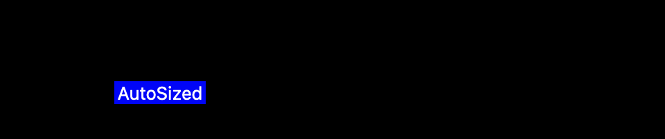
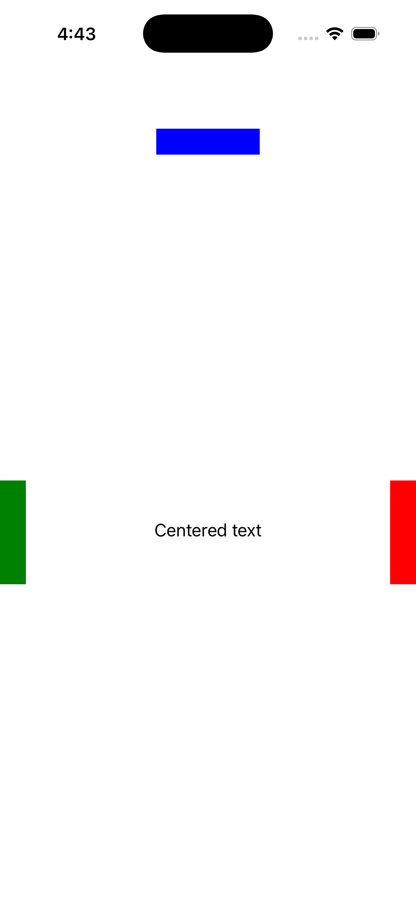
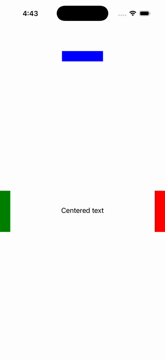

# AbsoluteLayout

Ports .NET MAUI's `AbsoluteLayoutPage` ([oracle](../../../../../src/Controls/samples/Controls.Sample/Pages/Layouts/AbsoluteLayoutPage.xaml)) as a code-first `maui::samples::absolute_layout_page`. Four BoxViews + two Labels positioned with proportional X/Y, absolute, and AutoSize bounds via PositionProportional LayoutFlags.

| macOS (AppKit) | iOS (UIKit) |
| --- | --- |
|  |  |

**Running on iOS:**

**Platforms:** macOS ✅ demo · iOS ✅ demo · Windows ⬜ TODO · Linux ⬜ TODO · Android ⬜ TODO

**Run it:**
- macOS — `MAUI_SAMPLE_PAGE=absolute_layout ./examples/build/gallery/gallery`
- iOS sim — `SIMCTL_CHILD_MAUI_SAMPLE_PAGE=absolute_layout xcrun simctl launch booted dev.maui-cpp.ios-gallery`

> On macOS the gallery host sizes the window to the measured content over plain (unflipped) NSViews, so
> layout pages can show a partial/single block — the iOS capture is the faithful top-down layout. Notes: view-base HorizontalOptions has no port setter (omitted).
