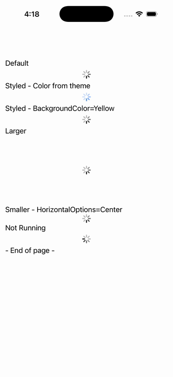

# ActivityIndicator

Ports .NET MAUI's `ActivityIndicatorPage` ([oracle](../../../../../src/Controls/samples/Controls.Sample/Pages/Controls/ActivityIndicatorPage.xaml)) as a code-first `maui::samples::activity_indicator_page`. A default running spinner, an accent-color spinner, a Yellow BackgroundColor spinner, Larger (150×150) and Smaller (10×10) sized spinners, and a not-running spinner.

| macOS (AppKit) | iOS (UIKit) |
| --- | --- |
|  |  |

**Running on iOS:**

**Platforms:** macOS ✅ demo · iOS ✅ demo · Windows ⬜ TODO · Linux ⬜ TODO · Android ⬜ TODO

**Run it:**
- macOS — `MAUI_SAMPLE_PAGE=activity_indicator ./examples/build/gallery/gallery`
- iOS sim — `SIMCTL_CHILD_MAUI_SAMPLE_PAGE=activity_indicator xcrun simctl launch booted dev.maui-cpp.ios-gallery`

> Notes: AppThemeBinding color maps to a fixed accent color (no app-theme surface); section headers map to plain labels.
