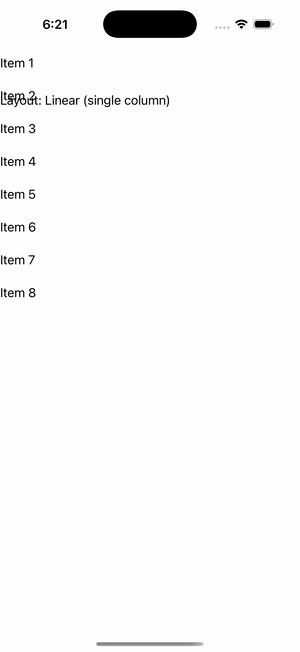

# CollectionView — Adaptive Layout

Ports .NET MAUI's `AdaptiveCollectionView` ([oracle](../../../../../src/Controls/samples/Controls.Sample/Pages/Controls/CollectionViewGalleries/AdaptiveCollectionView.xaml)) as a code-first `maui::samples::adaptive_collection_page`, mirroring the `items_page` pattern (owned `observable_collection` + `data_template`). One collection_view whose ItemsLayout swaps between vertical linear and grid (Span 3) via apply_width() (the C# Width>600 decision, verbatim) / use_grid() / use_linear(), with a readout of the mounted layout.

| macOS (AppKit) | iOS (UIKit) |
| --- | --- |
|  |  |

**Running on iOS:**

**Platforms:** macOS ✅ demo · iOS ✅ demo · Windows ⬜ TODO · Linux ⬜ TODO · Android ⬜ TODO

**Run it:** `MAUI_SAMPLE_PAGE=adaptive_collection ./examples/build/gallery/gallery` (macOS) · `SIMCTL_CHILD_MAUI_SAMPLE_PAGE=adaptive_collection xcrun simctl launch booted dev.maui-cpp.ios-gallery` (iOS)

> The custom-struct item cells render their template-bound content natively (the data_template is instantiated, its binding-context set to the boxed struct, and a handler attached per cell — the C# `TemplatedCell.Bind` path).
