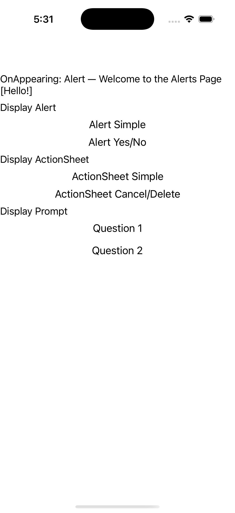

# Alerts

Ports .NET MAUI's `AlertsPage` ([oracle](../../../../../src/Controls/samples/Controls.Sample/Pages/Core/AlertsPage.xaml)) as a code-first `maui::samples::alerts_page`. DisplayAlert / DisplayActionSheet / DisplayPrompt, each driving a result readout.

| macOS (AppKit) | iOS (UIKit) |
| --- | --- |
|  |  |

**Running on iOS:**

**Platforms:** macOS ✅ demo · iOS ✅ demo · Windows ⬜ TODO · Linux ⬜ TODO · Android ⬜ TODO

**Run it:** `MAUI_SAMPLE_PAGE=alerts ./examples/build/gallery/gallery` (macOS) · `SIMCTL_CHILD_MAUI_SAMPLE_PAGE=alerts xcrun simctl launch booted dev.maui-cpp.ios-gallery` (iOS)

> Display Alert (simple OK + Yes/No), ActionSheet (simple + Cancel/Delete), Prompt (name → "Hello {name}.", numeric → "Correct."). The Page dialog services (`display_alert`/`display_action_sheet`/`display_prompt`) are a native modal surface not in the port (no headless dialog UI), so each clicked handler synthesizes the exact result the C# handler computes and writes it to the readout — swap-ready for the real awaited call when it lands.
