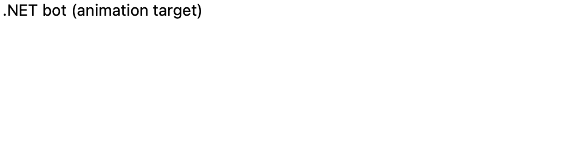
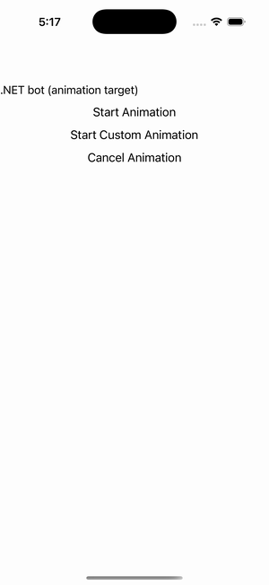

# Animation

Ports .NET MAUI's `AnimationPage` ([oracle](../../../../../src/Controls/samples/Controls.Sample/Pages/UserInterface/AnimationPage.xaml)) as a code-first `maui::samples::animation_page`. Chained + composite animations over the port's animation ticker.

| macOS (AppKit) | iOS (UIKit) |
| --- | --- |
|  |  |

**Running on iOS:**

**Platforms:** macOS ✅ demo · iOS ✅ demo · Windows ⬜ TODO · Linux ⬜ TODO · Android ⬜ TODO

**Run it:** `MAUI_SAMPLE_PAGE=animation ./examples/build/gallery/gallery` (macOS) · `SIMCTL_CHILD_MAUI_SAMPLE_PAGE=animation xcrun simctl launch booted dev.maui-cpp.ios-gallery` (iOS)

> Chained `translate_to` hops gated on the completion callback (the `Task<bool>` stand-in, faithful to C#'s `if (!isCancelled)` ladder); a hand-built composite `animation` (scale-up SpringIn [0,0.5] / rotate 0→360 [0,1] / scale-down SpringOut [0.5,1]) committed over 4000ms; `cancel_animations` + button enable/disable state. Animates a label stand-in for `dotnet_bot.png` (no image asset needed headless).
