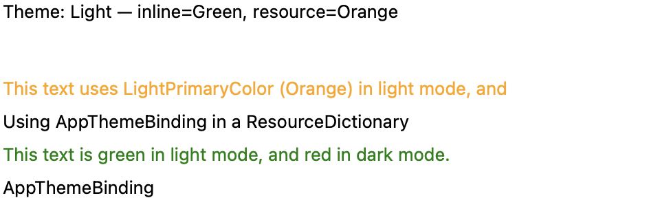
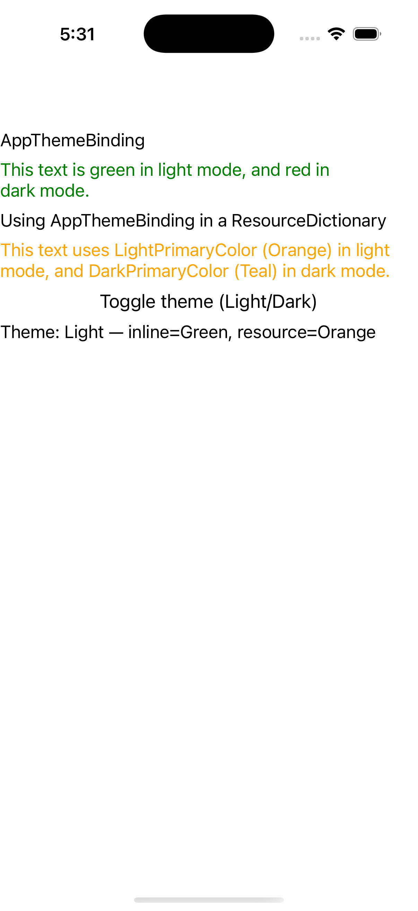
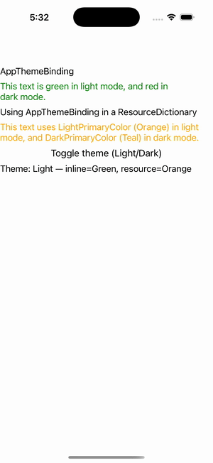

# AppThemeBinding

Ports .NET MAUI's `AppThemeBindingPage` ([oracle](../../../../../src/Controls/samples/Controls.Sample/Pages/Core/AppThemeBindingPage.xaml)) as a code-first `maui::samples::app_theme_binding_page`. AppThemeBinding light/dark color resolution driven off the application theme surface.

| macOS (AppKit) | iOS (UIKit) |
| --- | --- |
|  |  |

**Running on iOS:**

**Platforms:** macOS ✅ demo · iOS ✅ demo · Windows ⬜ TODO · Linux ⬜ TODO · Android ⬜ TODO

**Run it:** `MAUI_SAMPLE_PAGE=app_theme_binding ./build/apple/maui_macos_gallery` (macOS) · `SIMCTL_CHILD_MAUI_SAMPLE_PAGE=app_theme_binding xcrun simctl launch booted dev.maui-cpp.ios-gallery` (iOS)

> Labels whose TextColor resolves light-vs-dark exactly like `{AppThemeBinding}` (inline Green/Red; ResourceDictionary Orange/Teal as `colors::` constants), driven off a page-owned `application`'s `requested_theme()` and re-applied on `requested_theme_changed`; a toggle flips UserAppTheme Light/Dark and the bound labels recolor live + a readout echoes the active theme. `{AppThemeBinding}`/`{StaticResource}` are layer-6 XAML, reproduced code-first via the application theme surface (with the Unspecified→Light branch).
