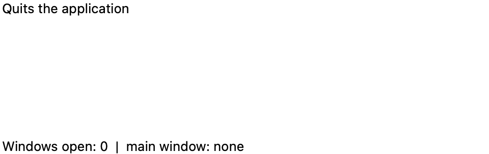
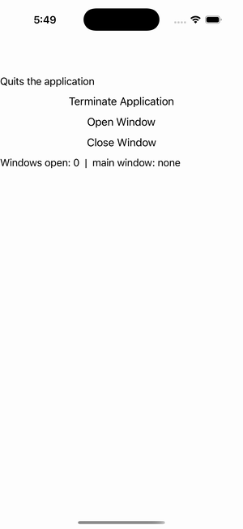

# Application Control

Ports .NET MAUI's `ApplicationControlPage` ([oracle](../../../../../src/Controls/samples/Controls.Sample/Pages/Core/ApplicationControlPage.xaml)) as a code-first `maui::samples::application_control_page`. The IApplication surface — window open/close + terminate.

| macOS (AppKit) | iOS (UIKit) |
| --- | --- |
|  |  |

**Running on iOS:**

**Platforms:** macOS ✅ demo · iOS ✅ demo · Windows ⬜ TODO · Linux ⬜ TODO · Android ⬜ TODO

**Run it:** `MAUI_SAMPLE_PAGE=application_control ./examples/build/gallery/gallery` (macOS) · `SIMCTL_CHILD_MAUI_SAMPLE_PAGE=application_control xcrun simctl launch booted dev.maui-cpp.ios-gallery` (iOS)

> Terminate (closes every open window — the Quit() stand-in, since Application.Quit is platform-application scope out of the port), Open Window / Close Window on a page-owned extra window via `maui_app::open_window`/`close_window`; the readout echoes the Windows count + main-window title + main-page-set state. The hosting application + maui_app are captured in attach_handlers (`app.application()`); the extra window + page are members (the windows() list is non-owning).
