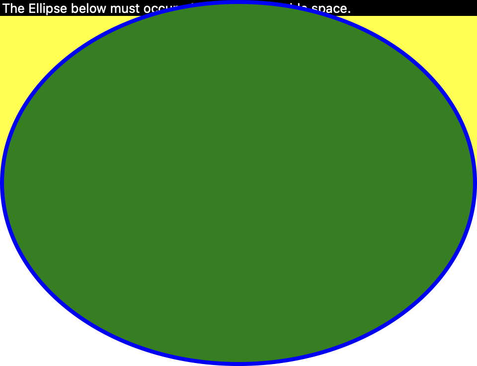
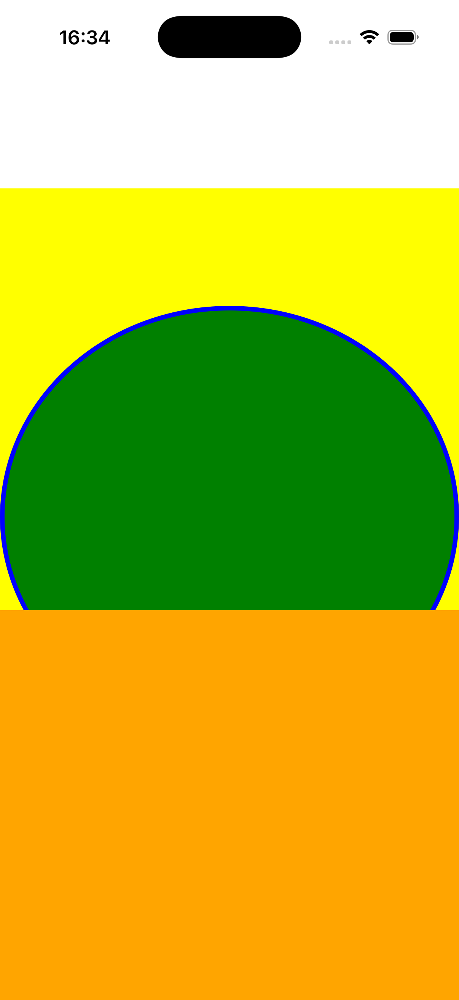
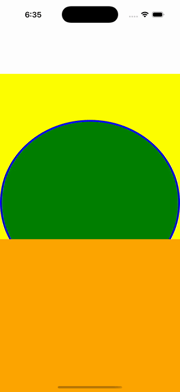

# Auto-Size Shapes

Ports .NET MAUI's `AutoSizeShapesGallery` ([oracle](../../../../../src/Controls/samples/Controls.Sample/Pages/Controls/ShapesGalleries/AutoSizeShapesGallery.xaml)) as a code-first `maui::samples::auto_size_shapes_page`. A stroked Ellipse (green fill, blue stroke, no explicit size) auto-sizing to fill exactly half the screen via a 3-row Grid (Auto caption / star yellow ellipse-cell / star orange-cell), proving star-row distribution drives the shape's measure.

| macOS (AppKit) | iOS (UIKit) |
| --- | --- |
|  |  |

**Running on iOS:**

**Platforms:** macOS ✅ demo · iOS ✅ demo · Windows ⬜ TODO · Linux ⬜ TODO · Android ⬜ TODO

**Run it:** `MAUI_SAMPLE_PAGE=auto_size_shapes ./examples/build/gallery/gallery` (macOS) · `SIMCTL_CHILD_MAUI_SAMPLE_PAGE=auto_size_shapes xcrun simctl launch booted dev.maui-cpp.ios-gallery` (iOS)

> Natively-rendered shape demo — the Shape family draws through the graphics_view / shape_view handler over a CoreGraphics canvas.
