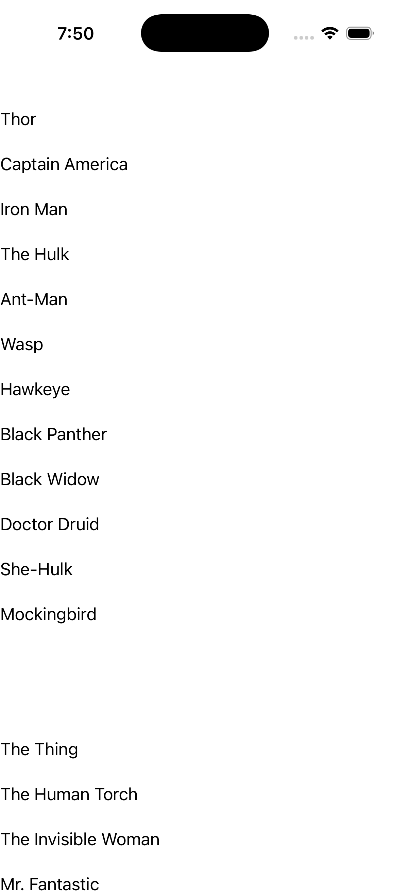
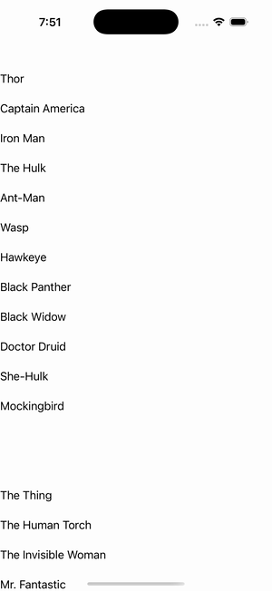

# CollectionView — Basic Grouping

Ports .NET MAUI's `BasicGrouping` ([oracle](../../../../../src/Controls/samples/Controls.Sample/Pages/Controls/CollectionViewGalleries/GroupingGalleries/BasicGrouping.xaml)) as a code-first `maui::samples::basic_grouping_page`, mirroring the `items_page` pattern (owned `observable_collection` + `data_template`). IsGrouped over six Marvel-team rosters with item / LightGreen group-header / Orange group-footer templates (footer renders "Total members: N") + view-level Header/Footer strings.

| macOS (AppKit) | iOS (UIKit) |
| --- | --- |
|  |  |

**Running on iOS:**

**Platforms:** macOS ✅ demo · iOS ✅ demo · Windows ⬜ TODO · Linux ⬜ TODO · Android ⬜ TODO

**Run it:** `MAUI_SAMPLE_PAGE=basic_grouping ./build/apple/maui_macos_gallery` (macOS) · `SIMCTL_CHILD_MAUI_SAMPLE_PAGE=basic_grouping xcrun simctl launch booted dev.maui-cpp.ios-gallery` (iOS)

> The custom-struct item cells render their template-bound content natively (the data_template is instantiated, its binding-context set to the boxed struct, and a handler attached per cell — the C# `TemplatedCell.Bind` path).
