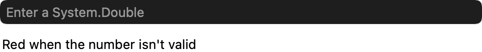
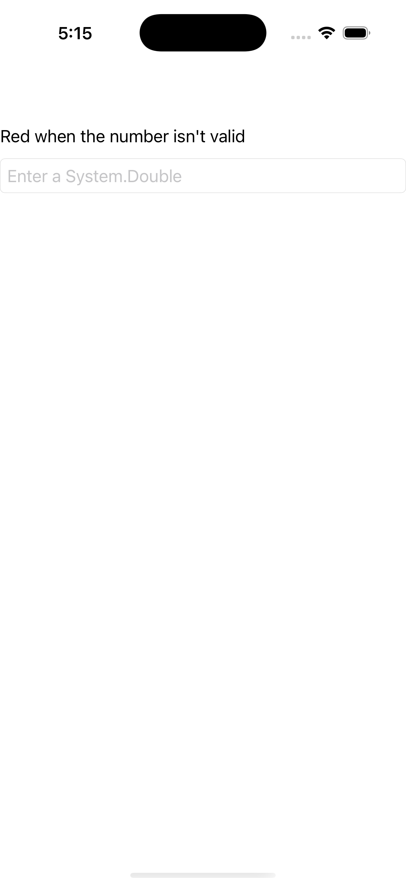

# Behaviors

Ports .NET MAUI's `BehaviorsPage` ([oracle](../../../../../src/Controls/samples/Controls.Sample/Pages/UserInterface/BehaviorsPage.xaml)) as a code-first `maui::samples::behaviors_page`. A typed `behavior` attached to a control, reacting to its events.

| macOS (AppKit) | iOS (UIKit) |
| --- | --- |
|  |  |

**Running on iOS:**

**Platforms:** macOS ✅ demo · iOS ✅ demo · Windows ⬜ TODO · Linux ⬜ TODO · Android ⬜ TODO

**Run it:** `MAUI_SAMPLE_PAGE=behaviors ./build/apple/maui_macos_gallery` (macOS) · `SIMCTL_CHILD_MAUI_SAMPLE_PAGE=behaviors xcrun simctl launch booted dev.maui-cpp.ios-gallery` (iOS)

> A `numeric_validation_behavior` (`typed_behavior<entry>`, the port of `NumericValidationBehavior : Behavior<Entry>`) attached via `entry.behaviors().add(...)`; on each `text_changed` it recolors text transparent when the whole string parses as a double (`std::from_chars`), else red. `simulate_input()` drives the inbound `text_changed` so the effect is observable headless; §8 `connect_scoped` teardown stands in for C#'s `-= TextChanged`.
