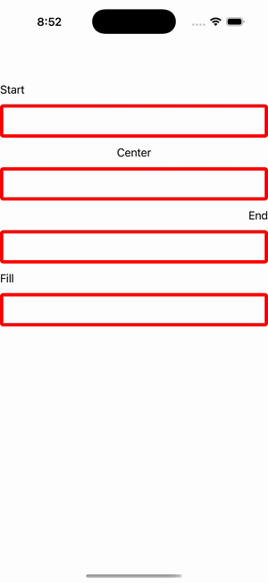

# Border Alignment

Ports .NET MAUI's `BorderAlignment` ([oracle](../../../../../src/Controls/samples/Controls.Sample/Pages/Core/BorderGalleries/BorderAlignment.xaml)) as a code-first `maui::samples::border_alignment_page`. Four red-bordered (RoundRectangle CR=5) blue Grids under Start/Center/End/Fill captions. **Note:** the C# differentiator is HorizontalOptions, which has no settable surface on this port (M2 view hardcodes layout alignment to Fill), so the four sections render uniformly and the intended alignment is carried in each label.

| macOS (AppKit) | iOS (UIKit) |
| --- | --- |
|  |  |

**Running on iOS:**

**Platforms:** macOS ✅ demo · iOS ✅ demo · Windows ⬜ TODO · Linux ⬜ TODO · Android ⬜ TODO

**Run it:** `MAUI_SAMPLE_PAGE=border_alignment ./build/apple/maui_macos_gallery` (macOS) · `SIMCTL_CHILD_MAUI_SAMPLE_PAGE=border_alignment xcrun simctl launch booted dev.maui-cpp.ios-gallery` (iOS)

> Natively-rendered Border demo — the `border` control draws its StrokeShape (a `shapes::*` geometry) + stroke + content through the handler on both Apple backends.
