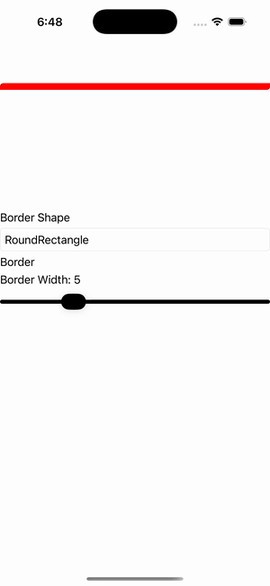

# Border Clip Playground

Ports .NET MAUI's `BorderClipPlayground` ([oracle](../../../../../src/Controls/samples/Controls.Sample/Pages/Core/BorderGalleries/BorderClipPlayground.xaml)) as a code-first `maui::samples::border_clip_playground_page`. An interactive Border-shape playground — a Picker choosing the StrokeShape (Rectangle/RoundRectangle/Ellipse) clipping an image, a border-width slider, and four per-corner radius sliders shown only while RoundRectangle is selected (the exact .xaml.cs UpdateBorderShape switch + CornerRadiusLayout visibility toggle).

| macOS (AppKit) | iOS (UIKit) |
| --- | --- |
|  |  |

**Running on iOS:**

**Platforms:** macOS ✅ demo · iOS ✅ demo · Windows ⬜ TODO · Linux ⬜ TODO · Android ⬜ TODO

**Run it:** `MAUI_SAMPLE_PAGE=border_clip_playground ./examples/build/gallery/gallery` (macOS) · `SIMCTL_CHILD_MAUI_SAMPLE_PAGE=border_clip_playground xcrun simctl launch booted dev.maui-cpp.ios-gallery` (iOS)

> Natively-rendered Border demo — the `border` control draws its StrokeShape (a `shapes::*` geometry) + stroke + content through the handler on both Apple backends.
