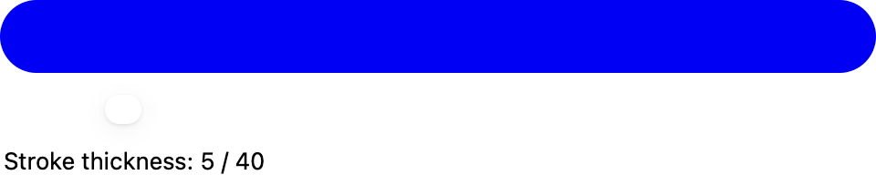
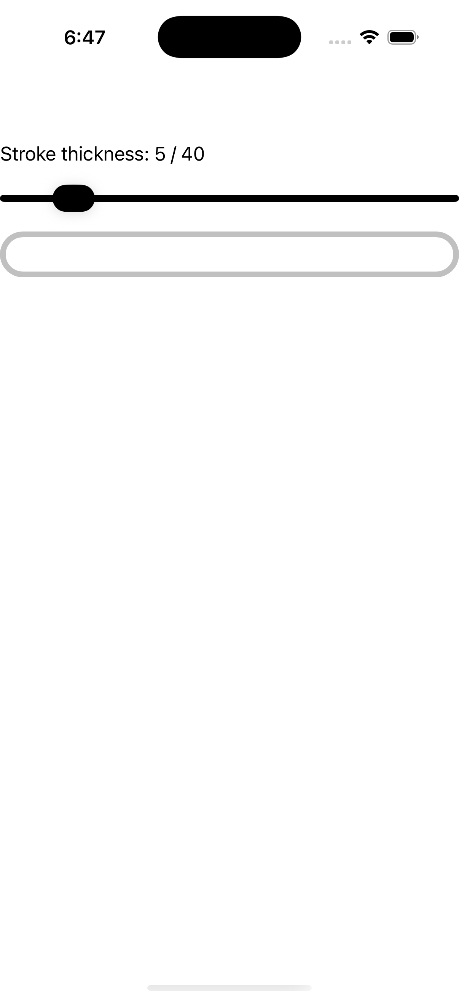
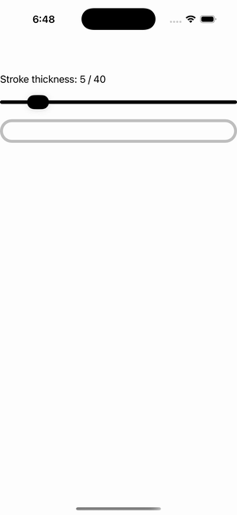

# Border Layout

Ports .NET MAUI's `BorderLayout` ([oracle](../../../../../src/Controls/samples/Controls.Sample/Pages/Core/BorderGalleries/BorderLayout.xaml)) as a code-first `maui::samples::border_layout_page`. A slider (0–40) driving Border.StrokeThickness on a Silver-stroked RoundRectangle(CR=30) Border wrapping a green Grid row [red square / "Center" / blue square], with the value echoed to a readout.

| macOS (AppKit) | iOS (UIKit) |
| --- | --- |
|  |  |

**Running on iOS:**

**Platforms:** macOS ✅ demo · iOS ✅ demo · Windows ⬜ TODO · Linux ⬜ TODO · Android ⬜ TODO

**Run it:** `MAUI_SAMPLE_PAGE=border_layout ./build/apple/maui_macos_gallery` (macOS) · `SIMCTL_CHILD_MAUI_SAMPLE_PAGE=border_layout xcrun simctl launch booted dev.maui-cpp.ios-gallery` (iOS)

> Natively-rendered Border demo — the `border` control draws its StrokeShape (a `shapes::*` geometry) + stroke + content through the handler on both Apple backends.
