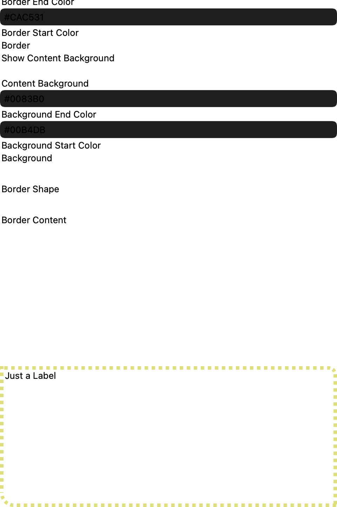
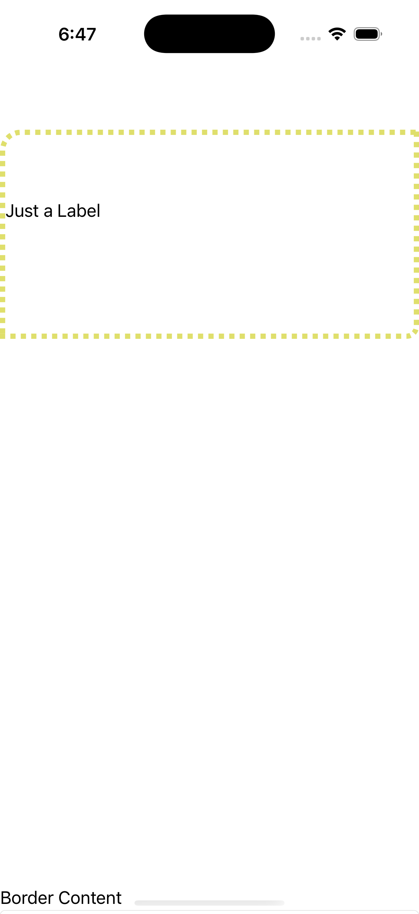
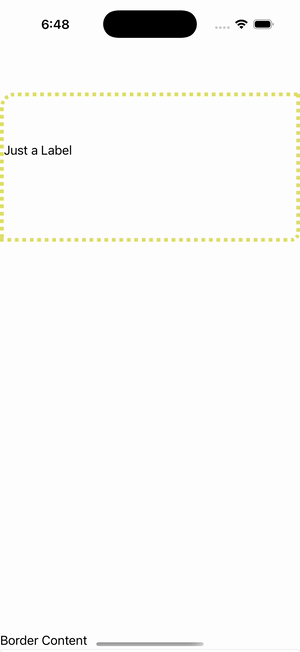

# Border Playground

Ports .NET MAUI's `BorderPlayground` ([oracle](../../../../../src/Controls/samples/Controls.Sample/Pages/Core/BorderGalleries/BorderPlayground.xaml)) as a code-first `maui::samples::border_playground_page`. A fully interactive Border playground — content picker (Label/Image), shape picker (Rectangle/RoundRectangle/Ellipse), background + border linear-gradient hex entries, content-bg checkbox, width slider, dash-array entry, dash-offset slider, LineJoin/LineCap pickers, and four per-corner radius sliders (gated to RoundRectangle) — each re-running the matching C# Update* method 1:1.

| macOS (AppKit) | iOS (UIKit) |
| --- | --- |
|  |  |

**Running on iOS:**

**Platforms:** macOS ✅ demo · iOS ✅ demo · Windows ⬜ TODO · Linux ⬜ TODO · Android ⬜ TODO

**Run it:** `MAUI_SAMPLE_PAGE=border_playground ./build/apple/maui_macos_gallery` (macOS) · `SIMCTL_CHILD_MAUI_SAMPLE_PAGE=border_playground xcrun simctl launch booted dev.maui-cpp.ios-gallery` (iOS)

> Natively-rendered Border demo — the `border` control draws its StrokeShape (a `shapes::*` geometry) + stroke + content through the handler on both Apple backends.
