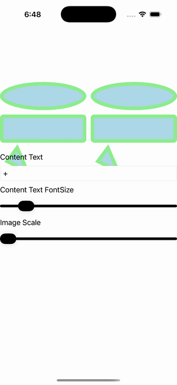

# Border Resize Content

Ports .NET MAUI's `BorderResizeContent` ([oracle](../../../../../src/Controls/samples/Controls.Sample/Pages/Core/BorderGalleries/BorderResizeContent.xaml)) as a code-first `maui::samples::border_resize_content_page`. A 2×3 grid of bordered cells across three StrokeShapes (Ellipse / RoundRectangle / Polygon-triangle), each green-stroked over LightBlue, with live bindings (entry → label text, font slider, image scale slider) so the Borders re-measure as their content grows.

| macOS (AppKit) | iOS (UIKit) |
| --- | --- |
|  |  |

**Running on iOS:**

**Platforms:** macOS ✅ demo · iOS ✅ demo · Windows ⬜ TODO · Linux ⬜ TODO · Android ⬜ TODO

**Run it:** `MAUI_SAMPLE_PAGE=border_resize_content ./examples/build/gallery/gallery` (macOS) · `SIMCTL_CHILD_MAUI_SAMPLE_PAGE=border_resize_content xcrun simctl launch booted dev.maui-cpp.ios-gallery` (iOS)

> Natively-rendered Border demo — the `border` control draws its StrokeShape (a `shapes::*` geometry) + stroke + content through the handler on both Apple backends.
