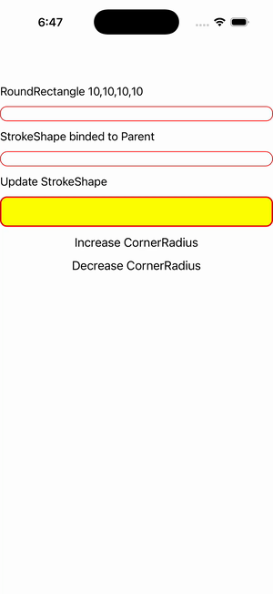

# Border Styles

Ports .NET MAUI's `BorderStyles` ([oracle](../../../../../src/Controls/samples/Controls.Sample/Pages/Core/BorderGalleries/BorderStyles.xaml)) as a code-first `maui::samples::border_styles_page`. Imperatively-applied Border Style setters (RoundRectangle StrokeShape, red stroke, transparent bg) + two buttons that rebuild the border's round_rectangle StrokeShape at radius ± 10 (the C# ChangeCornerRadius ported 1:1) with a live readout.

| macOS (AppKit) | iOS (UIKit) |
| --- | --- |
|  |  |

**Running on iOS:**

**Platforms:** macOS ✅ demo · iOS ✅ demo · Windows ⬜ TODO · Linux ⬜ TODO · Android ⬜ TODO

**Run it:** `MAUI_SAMPLE_PAGE=border_styles ./examples/build/gallery/gallery` (macOS) · `SIMCTL_CHILD_MAUI_SAMPLE_PAGE=border_styles xcrun simctl launch booted dev.maui-cpp.ios-gallery` (iOS)

> Natively-rendered Border demo — the `border` control draws its StrokeShape (a `shapes::*` geometry) + stroke + content through the handler on both Apple backends.
