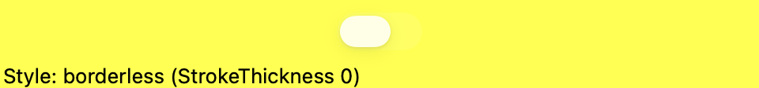
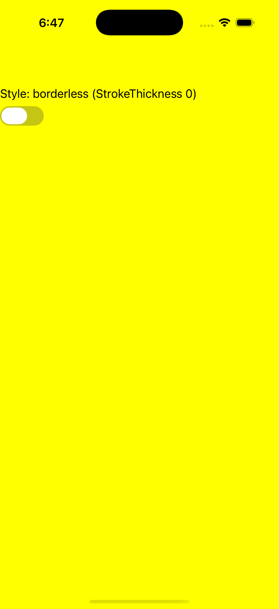
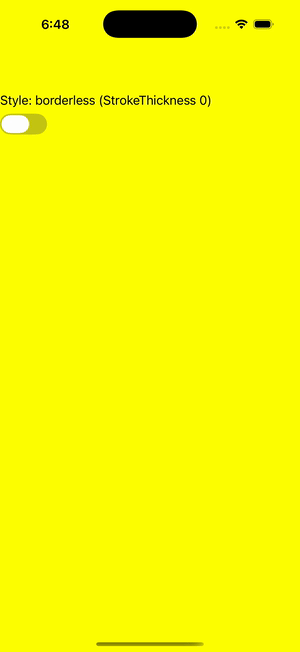

# Borderless

Ports .NET MAUI's `Borderless` ([oracle](../../../../../src/Controls/samples/Controls.Sample/Pages/Core/BorderGalleries/Borderless.xaml)) as a code-first `maui::samples::borderless_page`. Two stroke-less Borders (StrokeThickness 0, the BorderlessStyle) butting seamlessly (Pink top / Red bottom), with a switch flipping both to 8pt black stroke and a live readout.

| macOS (AppKit) | iOS (UIKit) |
| --- | --- |
|  |  |

**Running on iOS:**

**Platforms:** macOS ✅ demo · iOS ✅ demo · Windows ⬜ TODO · Linux ⬜ TODO · Android ⬜ TODO

**Run it:** `MAUI_SAMPLE_PAGE=borderless ./build/apple/maui_macos_gallery` (macOS) · `SIMCTL_CHILD_MAUI_SAMPLE_PAGE=borderless xcrun simctl launch booted dev.maui-cpp.ios-gallery` (iOS)

> Natively-rendered Border demo — the `border` control draws its StrokeShape (a `shapes::*` geometry) + stroke + content through the handler on both Apple backends.
