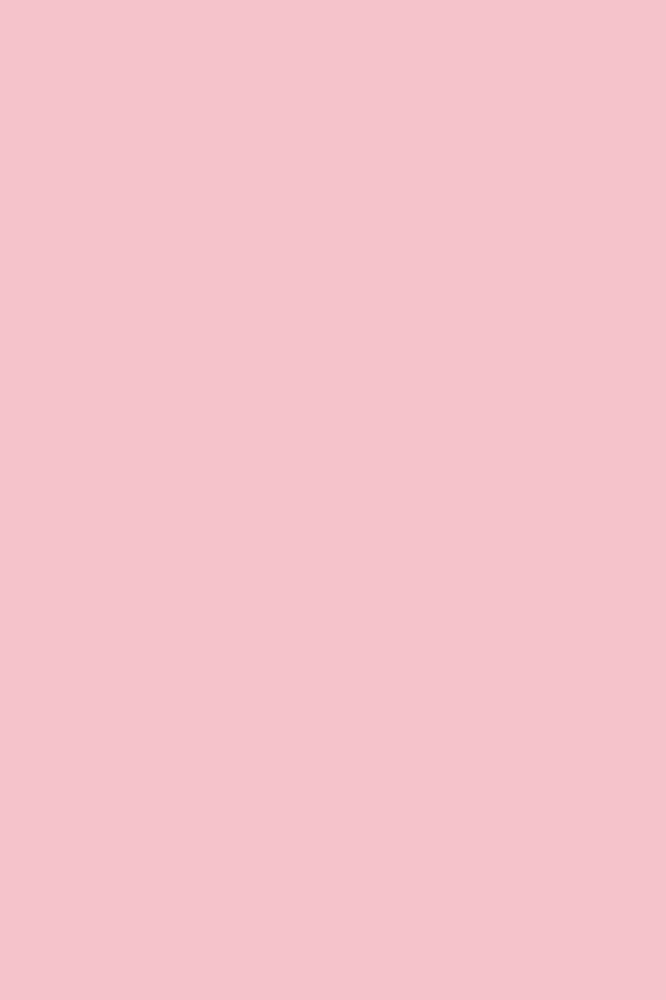
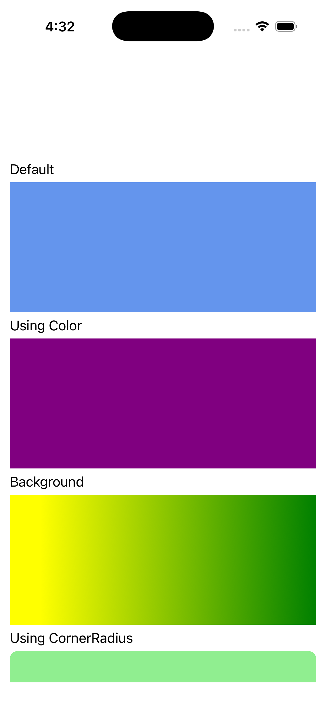

# BoxView

Ports .NET MAUI's `BoxViewPage` ([oracle](../../../../../src/Controls/samples/Controls.Sample/Pages/Controls/BoxViewPage.xaml)) as a code-first `maui::samples::box_view_page`. 160×160 box_view variants: BackgroundColor (solid paint), Color (shape fill), gradient Background, uniform + complex CornerRadius, Opacity, a clip block, and a red Shadow (offset 6,6).

| macOS (AppKit) | iOS (UIKit) |
| --- | --- |
|  |  |

**Running on iOS:**

**Platforms:** macOS ✅ demo · iOS ✅ demo · Windows ⬜ TODO · Linux ⬜ TODO · Android ⬜ TODO

**Run it:**
- macOS — `MAUI_SAMPLE_PAGE=box_view ./examples/build/gallery/gallery`
- iOS sim — `SIMCTL_CHILD_MAUI_SAMPLE_PAGE=box_view xcrun simctl launch booted dev.maui-cpp.ios-gallery`

> Notes: EllipseGeometry-as-clip is deferred (rendered as a plain block); on macOS the scroll_view + unflipped-view layout shows one box at a time (AppKit deviation) — the iOS capture shows the full stack.
