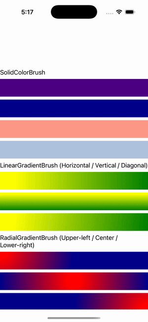

# Brushes

Ports .NET MAUI's `BrushesPage` ([oracle](../../../../../src/Controls/samples/Controls.Sample/Pages/Core/BrushesPage.xaml)) as a code-first `maui::samples::brushes_page`. Demonstrates the full `Brush` family rendering through the port's `graphics::paint` pipeline.

| macOS (AppKit) | iOS (UIKit) |
| --- | --- |
|  |  |

**Running on iOS:**

**Platforms:** macOS ✅ demo · iOS ✅ demo · Windows ⬜ TODO · Linux ⬜ TODO · Android ⬜ TODO

**Run it:** `MAUI_SAMPLE_PAGE=brushes ./build/apple/maui_macos_gallery` (macOS) · `SIMCTL_CHILD_MAUI_SAMPLE_PAGE=brushes xcrun simctl launch booted dev.maui-cpp.ios-gallery` (iOS)

> The iOS capture is the faithful render: **SolidColorBrush** (Indigo static / Color / hex `#FF9988` / property-tag steel-blue), **LinearGradientBrush** yellow→green horizontal/vertical/diagonal (EndPoint 1,0 / 0,1 / 1,1), **RadialGradientBrush** red→navy with focus upper-left/center/lower-right. The "Update Color/Colors" interactions randomize a swatch's brush over a deterministic 6-color cycle. macOS collapses the swatch stack to one filling block (the documented unflipped-NSView quirk). The CSS-StyleSheet tab + BindingContext-bound stops are XAML/CSS loader (layer 6) — out of scope.
