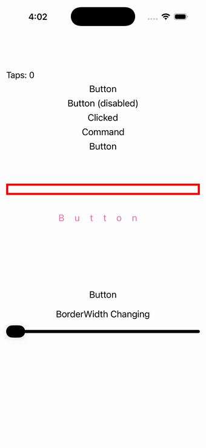

# Button

Ports .NET MAUI's `ButtonPage` ([oracle](../../../../../src/Controls/samples/Controls.Sample/Pages/Controls/ButtonPage.xaml)) as a code-first `maui::samples::button_page`. Native button matrix: default / disabled / clicked / command buttons; background, text and border color; border width, corner radius, character spacing; image-source + content-layout; padding; a slider-driven BorderWidth; and a live tap-count readout.

| macOS (AppKit) | iOS (UIKit) |
| --- | --- |
|  |  |

**Running on iOS:**

**Platforms:** macOS ✅ demo · iOS ✅ demo · Windows ⬜ TODO · Linux ⬜ TODO · Android ⬜ TODO

**Run it:**
- macOS — `MAUI_SAMPLE_PAGE=button ./examples/build/gallery/gallery`
- iOS sim — `SIMCTL_CHILD_MAUI_SAMPLE_PAGE=button xcrun simctl launch booted dev.maui-cpp.ios-gallery`

> Notes: `LineBreakMode` has no Button surface in the port; the gradient-brush swap, tooltip, converter-color binding and HorizontalOptions are simplified/omitted.
