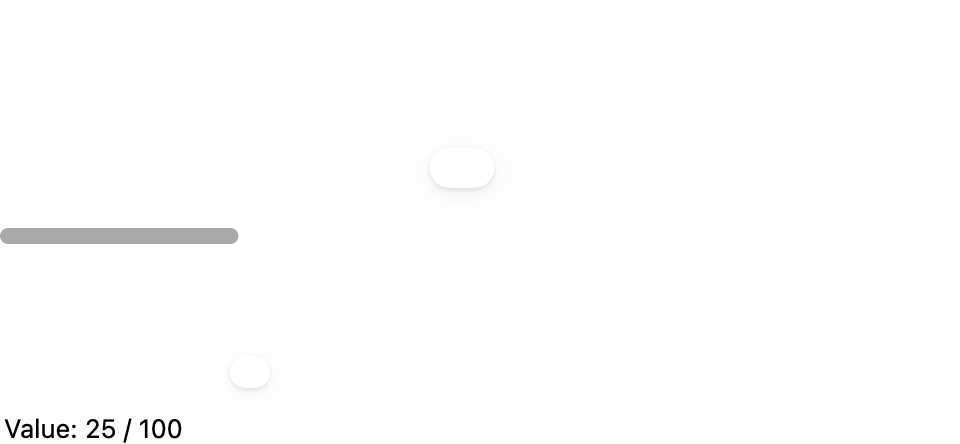
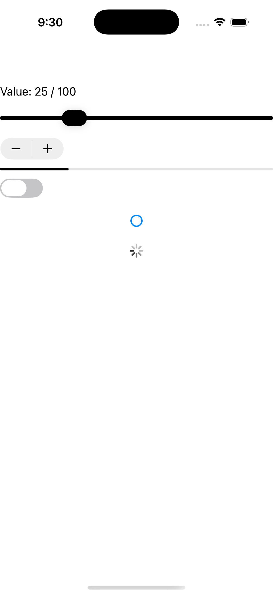
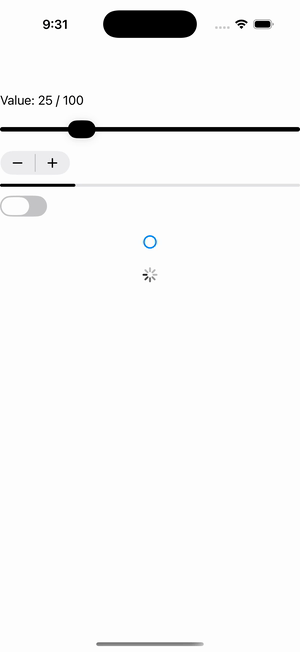

# CarouselView

Ports .NET MAUI's `CarouselViewPage` ([oracle](../../../../../src/Controls/samples/Controls.Sample/Pages/Controls/CollectionViewGalleries/CarouselViewGalleries/CarouselViewPage.xaml)) as a code-first `maui::samples::carousel_page`. A `carousel_view` over three items with a centered identity-bound Label cell, Prev/Next buttons mutating Position (clamped to range), and a CurrentItem readout via `current_item_changed` (the per-cell tap→DisplayAlert is omitted — no headless cell-tap synthesis / modal service).

| macOS (AppKit) | iOS (UIKit) |
| --- | --- |
|  |  |

**Running on iOS:**

**Platforms:** macOS ✅ demo · iOS ✅ demo · Windows ⬜ TODO · Linux ⬜ TODO · Android ⬜ TODO

**Run it:** `MAUI_SAMPLE_PAGE=carousel ./examples/build/gallery/gallery` (macOS) · `SIMCTL_CHILD_MAUI_SAMPLE_PAGE=carousel xcrun simctl launch booted dev.maui-cpp.ios-gallery` (iOS)

> Struct-typed item cells render their template-bound content natively (post the TemplatedCell.Bind fix).
