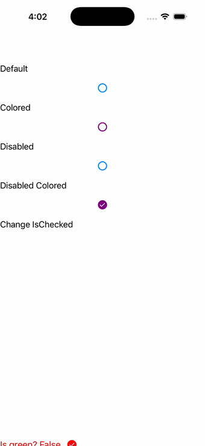

# CheckBox

Ports .NET MAUI's `CheckBoxPage` ([oracle](../../../../../src/Controls/samples/Controls.Sample/Pages/Controls/CheckBoxPage.xaml)) as a code-first `maui::samples::check_box_page`. Default / Colored(Purple) / Disabled / Disabled+Colored+Checked states, plus a "Change IsChecked" button whose command flips a flag and recolors the paired checkbox (green/red) and the button — faithful to the MAUI page's UpdateControls().

| macOS (AppKit) | iOS (UIKit) |
| --- | --- |
|  |  |

**Running on iOS:**

**Platforms:** macOS ✅ demo · iOS ✅ demo · Windows ⬜ TODO · Linux ⬜ TODO · Android ⬜ TODO

**Run it:**
- macOS — `MAUI_SAMPLE_PAGE=check_box ./examples/build/gallery/gallery`
- iOS sim — `SIMCTL_CHILD_MAUI_SAMPLE_PAGE=check_box xcrun simctl launch booted dev.maui-cpp.ios-gallery`

