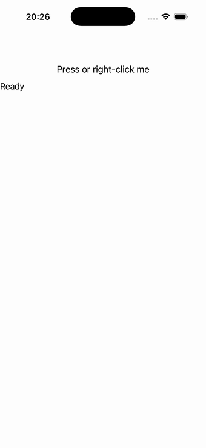

# Window chrome (toolbar / menus / tooltip)

Page toolbar items, a menu bar (File menu with items, a separator and a sub-menu), a context flyout
(right-click menu) on a button, and a tooltip — each activation drives a readout. Source:
[`chrome_page.hpp`](../../../src/samples/pages/chrome_page.hpp).

| macOS (AppKit) | iOS (UIKit) |
| --- | --- |
|  |  |

**Running on iOS:**

**Native controls exercised:** `NSToolbar` + `NSMenu` main menu + `NSMenu` context flyout + tooltip
(AppKit); `UIContextMenuInteraction` (iOS); the in-page button + readout label on both.

**Platforms:** macOS ✅ demo · iOS ⚠️ partial (see note) · Windows ⬜ TODO · Linux ⬜ TODO · Android ⬜ TODO

**Run it:**
- macOS — `MAUI_SAMPLE_PAGE=chrome ./build/apple/maui_macos_gallery`
- iOS sim — `SIMCTL_CHILD_MAUI_SAMPLE_PAGE=chrome xcrun simctl launch booted dev.maui-cpp.ios-gallery`

> The toolbar / menu-bar / tooltip live on the macOS window chrome (and are **faithful no-ops on iOS**,
> matching C# MAUI — iOS has no app menu bar or hover tooltip). The iOS capture therefore shows just the
> in-page content ("Press or right-click me" + "Ready"); the context flyout is reachable via long-press.
