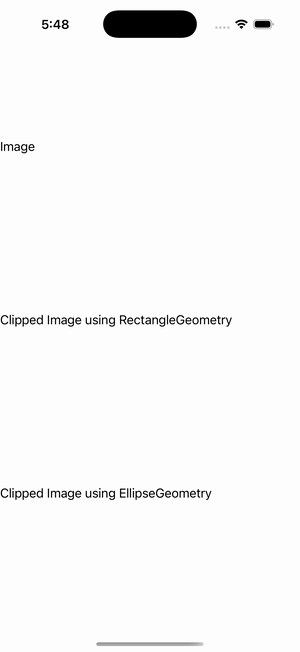

# Clip (Geometry)

Ports .NET MAUI's `ClipPage` ([oracle](../../../../../src/Controls/samples/Controls.Sample/Pages/Core/ClipPage.xaml)) as a code-first `maui::samples::clip_page`. An image clipped five ways with real geometry on `IView.Clip`.

| macOS (AppKit) | iOS (UIKit) |
| --- | --- |
|  |  |

**Running on iOS:**

**Platforms:** macOS ✅ demo · iOS ✅ demo · Windows ⬜ TODO · Linux ⬜ TODO · Android ⬜ TODO

**Run it:** `MAUI_SAMPLE_PAGE=clip ./build/apple/maui_macos_gallery` (macOS) · `SIMCTL_CHILD_MAUI_SAMPLE_PAGE=clip xcrun simctl launch booted dev.maui-cpp.ios-gallery` (iOS)

> The image carries: bare, RectangleGeometry(0,15,150,150), EllipseGeometry(center 100,100 / r 100), a GeometryGroup of four overlapping ellipses (FillRule EvenOdd), and a PathGeometry from "M8 148 L156 148 L132 12 Z" — each a real `controls::shapes::*_geometry` (an `i_shape`) set via `image::set_clip`. A Toggle button clears/re-applies every clip with a "Clipped"/"Cleared" readout (the gallery's observable extension — C# has empty code-behind). `dotnet_bot.png` is a best-effort file source; headless renders no bitmap, so the demonstrated feature is the Clip geometry.
