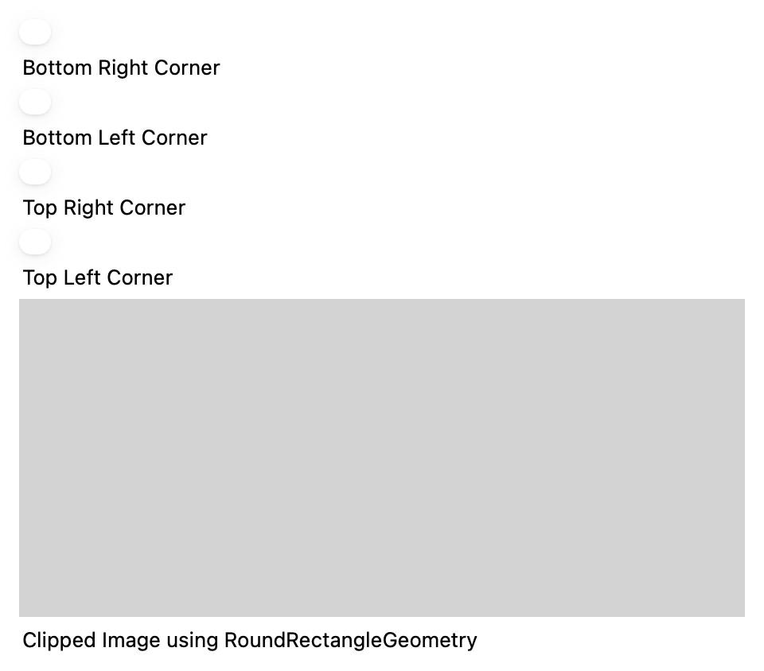
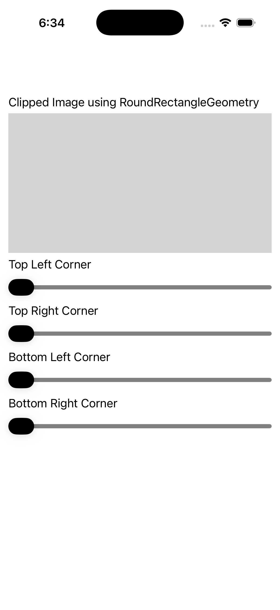

# Clip Corner Radius

Ports .NET MAUI's `ClipCornerRadiusGallery` ([oracle](../../../../../src/Controls/samples/Controls.Sample/Pages/Controls/ShapesGalleries/ClipCornerRadiusGallery.xaml)) as a code-first `maui::samples::clip_corner_radius_page`. Four sliders (TL/TR/BL/BR, 0–60) live-driving a RoundRectangleGeometry clip's per-corner radius on an image — `OnCornerChanged` rebuilds `corner_radius{tl,tr,bl,br}` from all four slider values (the exact .xaml.cs handler).

| macOS (AppKit) | iOS (UIKit) |
| --- | --- |
|  |  |

**Running on iOS:**

**Platforms:** macOS ✅ demo · iOS ✅ demo · Windows ⬜ TODO · Linux ⬜ TODO · Android ⬜ TODO

**Run it:** `MAUI_SAMPLE_PAGE=clip_corner_radius ./build/apple/maui_macos_gallery` (macOS) · `SIMCTL_CHILD_MAUI_SAMPLE_PAGE=clip_corner_radius xcrun simctl launch booted dev.maui-cpp.ios-gallery` (iOS)

> Natively-rendered shape demo — the Shape family draws through the graphics_view / shape_view handler over a CoreGraphics canvas.
