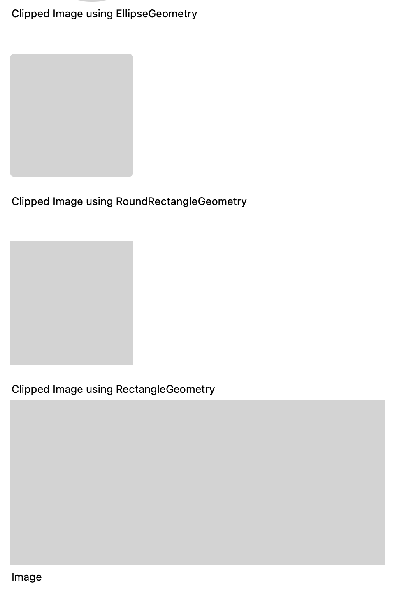
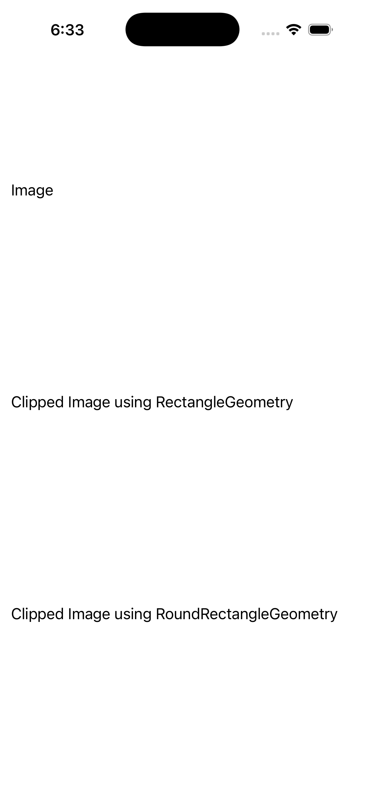
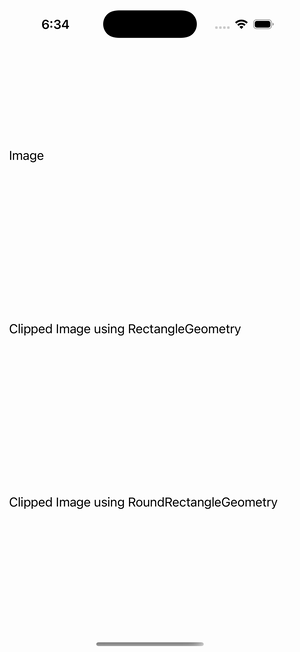

# Clip Gallery (images)

Ports .NET MAUI's `ClipGallery` ([oracle](../../../../../src/Controls/samples/Controls.Sample/Pages/Controls/ShapesGalleries/ClipGallery.xaml)) as a code-first `maui::samples::clip_gallery_page`. Seven images, one bare + six each carrying a different `Image.Clip` geometry (Rectangle, RoundRectangle CR=6, Ellipse, an EvenOdd 4-ellipse GeometryGroup, a Path triangle), styled AspectFill 200×200. The clip geometry is the demonstrated feature (the bitmap is a best-effort file source).

| macOS (AppKit) | iOS (UIKit) |
| --- | --- |
|  |  |

**Running on iOS:**

**Platforms:** macOS ✅ demo · iOS ✅ demo · Windows ⬜ TODO · Linux ⬜ TODO · Android ⬜ TODO

**Run it:** `MAUI_SAMPLE_PAGE=clip_gallery ./examples/build/gallery/gallery` (macOS) · `SIMCTL_CHILD_MAUI_SAMPLE_PAGE=clip_gallery xcrun simctl launch booted dev.maui-cpp.ios-gallery` (iOS)

> Natively-rendered shape demo — the Shape family draws through the graphics_view / shape_view handler over a CoreGraphics canvas.
