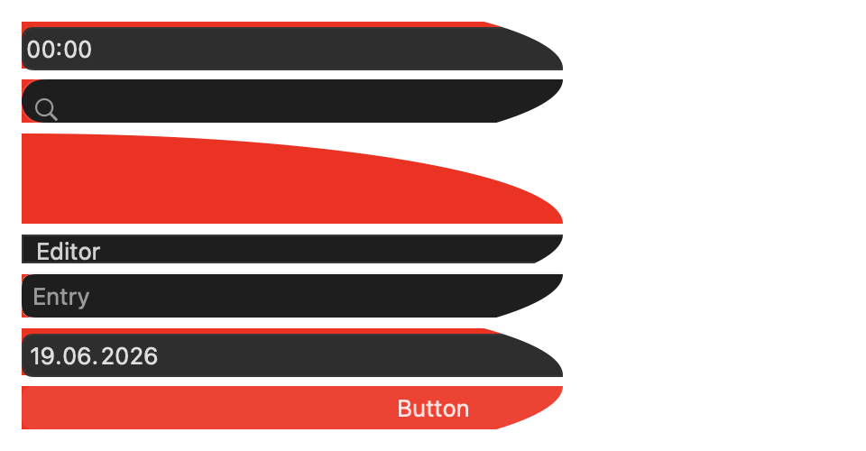
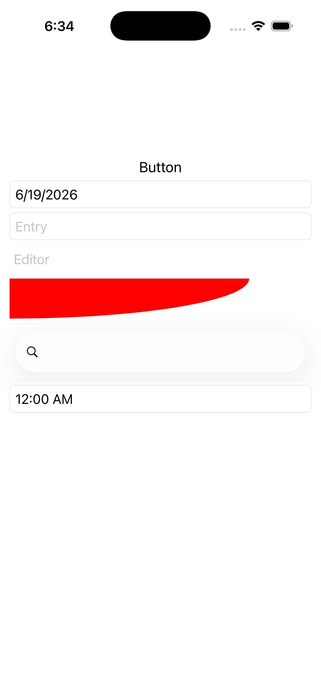

# Clip on Any View

Ports .NET MAUI's `ClipViewsGallery` ([oracle](../../../../../src/Controls/samples/Controls.Sample/Pages/Controls/ShapesGalleries/ClipViewsGallery.xaml)) as a code-first `maui::samples::clip_views_page`. Proves `Clip` works on **every** view kind, not just images — Button, DatePicker, Entry, Editor, Grid+Label, SearchBar, TimePicker all sharing **one** EllipseGeometry (Rx=300, Ry=50) instance via `set_clip`.

| macOS (AppKit) | iOS (UIKit) |
| --- | --- |
|  |  |

**Running on iOS:**

**Platforms:** macOS ✅ demo · iOS ✅ demo · Windows ⬜ TODO · Linux ⬜ TODO · Android ⬜ TODO

**Run it:** `MAUI_SAMPLE_PAGE=clip_views ./build/apple/maui_macos_gallery` (macOS) · `SIMCTL_CHILD_MAUI_SAMPLE_PAGE=clip_views xcrun simctl launch booted dev.maui-cpp.ios-gallery` (iOS)

> Natively-rendered shape demo — the Shape family draws through the graphics_view / shape_view handler over a CoreGraphics canvas.
