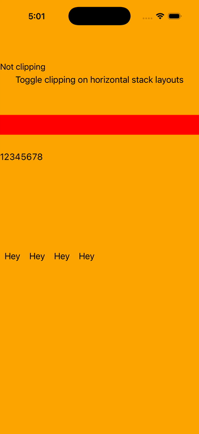

# Clipping

Ports .NET MAUI's `ClippingPage` ([oracle](../../../../../src/Controls/samples/Controls.Sample/Pages/Layouts/ClippingPage.xaml)) as a code-first `maui::samples::clipping_page`. IsClippedToBounds toggling on three rows plus the geometry Clip (IView.Clip → round_rectangle) set/cleared, with a status label.

| macOS (AppKit) | iOS (UIKit) |
| --- | --- |
|  |  |

**Running on iOS:**

**Platforms:** macOS ✅ demo · iOS ✅ demo · Windows ⬜ TODO · Linux ⬜ TODO · Android ⬜ TODO

**Run it:** `MAUI_SAMPLE_PAGE=clipping ./build/apple/maui_macos_gallery` (macOS) · `SIMCTL_CHILD_MAUI_SAMPLE_PAGE=clipping xcrun simctl launch booted dev.maui-cpp.ios-gallery` (iOS)

> Notes: per-view Margin + BoxView Opacity have no headless setter (best-effort sizes).
