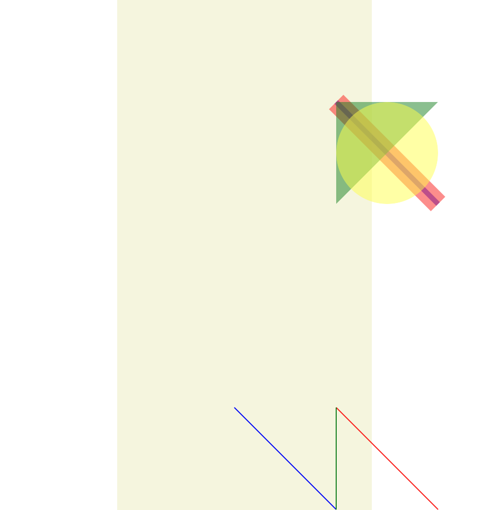
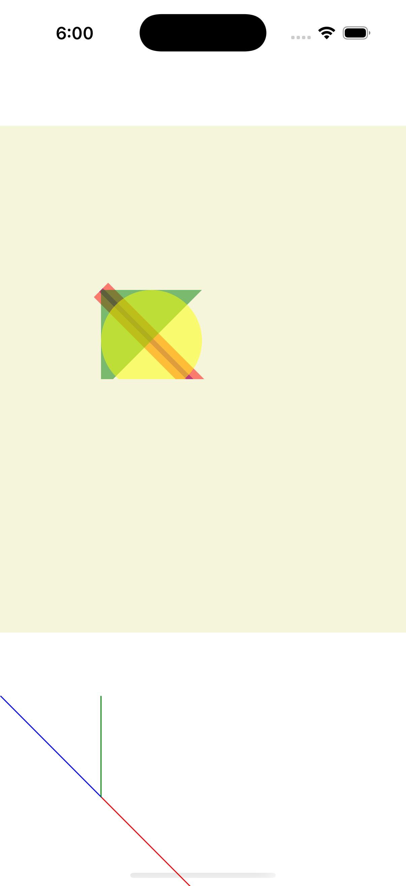

# Composition Gallery

Ports .NET MAUI's `CompositionGallery` ([oracle](../../../../../src/Controls/samples/Controls.Sample/Pages/Controls/ShapesGalleries/CompositionGallery.xaml)) as a code-first `maui::samples::composition_gallery_page`. Shape layering / opacity blending in two grids.

| macOS (AppKit) | iOS (UIKit) |
| --- | --- |
|  |  |

**Running on iOS:**

**Platforms:** macOS ✅ demo · iOS ✅ demo · Windows ⬜ TODO · Linux ⬜ TODO · Android ⬜ TODO

**Run it:** `MAUI_SAMPLE_PAGE=composition_gallery ./examples/build/gallery/gallery` (macOS) · `SIMCTL_CHILD_MAUI_SAMPLE_PAGE=composition_gallery xcrun simctl launch booted dev.maui-cpp.ios-gallery` (iOS)

> These are **natively-rendered** shape demos — the Shape control family (`controls::shapes::*`) draws through the graphics_view / shape_view handler over a CoreGraphics canvas, so the geometry is real pixels on both Apple backends (not a readout). Grid 1 stacks four Opacity-0.5 shapes (blue diagonal Path, thick red Line, green Polygon triangle, yellow EllipseGeometry circle) so overlaps blend; Grid 2 stacks three default-stroke Lines (red/blue/green) meeting at one point. The ellipse uses EllipseGeometry directly as Path.Data.
