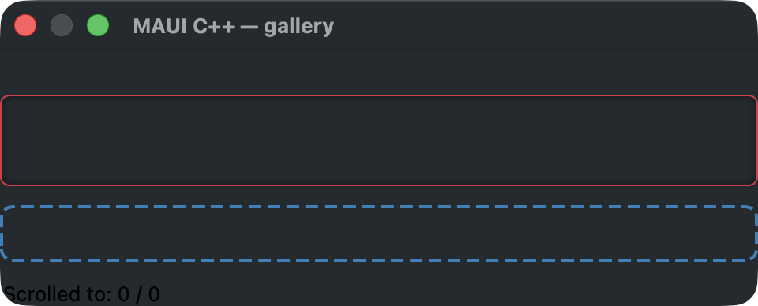
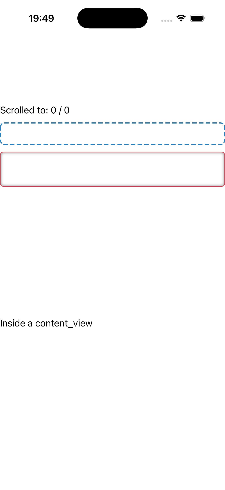
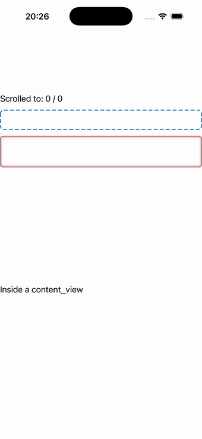

# Containers

A `scroll_view` hosting a stack of content-hosting containers — a `border`-framed label (stroke +
dashed outline + rounded shape), a legacy `frame` (BorderColor/CornerRadius/HasShadow over the border
machinery), and a `content_view` wrapper. Source:
[`containers_page.hpp`](../../../examples/gallery/pages/containers_page.hpp).

| macOS (AppKit) | iOS (UIKit) |
| --- | --- |
|  |  |

**Running on iOS:**

**Native controls exercised:** `NSScrollView`/`UIScrollView`, `CAShapeLayer`-stroked border + frame
facade, content-view host, scroll-position readout label.

**Platforms:** macOS ✅ demo · iOS ✅ demo · Windows ⬜ TODO · Linux ⬜ TODO · Android ⬜ TODO

**Run it:**
- macOS — `MAUI_SAMPLE_PAGE=containers ./examples/build/gallery/gallery`
- iOS sim — `SIMCTL_CHILD_MAUI_SAMPLE_PAGE=containers xcrun simctl launch booted dev.maui-cpp.ios-gallery`

> The iOS capture shows the blue-dashed border, the red-stroked frame, and the "Inside a content_view"
> label, with the scroll-position readout at the top.
