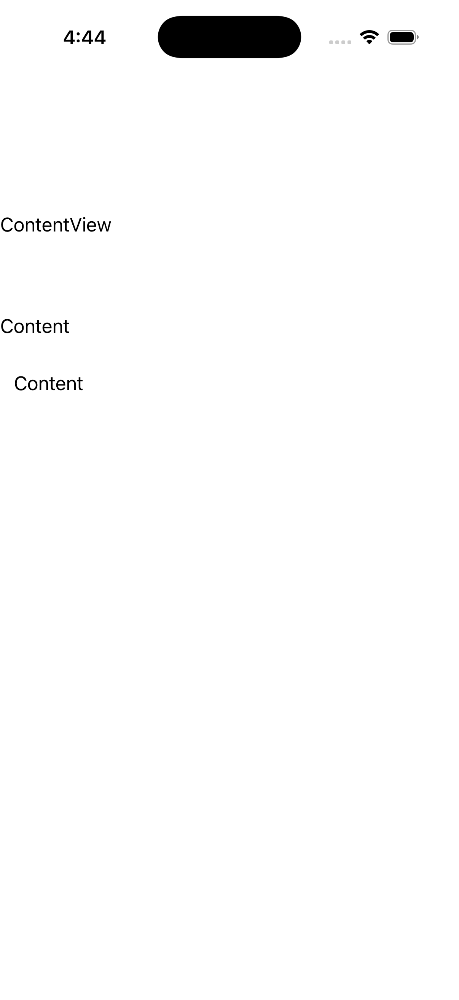

# ContentView

Ports .NET MAUI's `ContentViewPage` ([oracle](../../../../../src/Controls/samples/Controls.Sample/Pages/Layouts/ContentViewPage.xaml)) as a code-first `maui::samples::content_view_page`. A `content_view` single-content host with padding framing a label, plus a runtime content swap (set_content re-presents a new label).

| macOS (AppKit) | iOS (UIKit) |
| --- | --- |
|  |  |

**Running on iOS:**

**Platforms:** macOS ✅ demo · iOS ✅ demo · Windows ⬜ TODO · Linux ⬜ TODO · Android ⬜ TODO

**Run it:**
- macOS — `MAUI_SAMPLE_PAGE=content_view ./build/apple/maui_macos_gallery`
- iOS sim — `SIMCTL_CHILD_MAUI_SAMPLE_PAGE=content_view xcrun simctl launch booted dev.maui-cpp.ios-gallery`

> On macOS the gallery host sizes the window to the measured content over plain (unflipped) NSViews, so
> layout pages can show a partial/single block — the iOS capture is the faithful top-down layout. Notes: the XAML CardView rows are sample chrome and are omitted.
