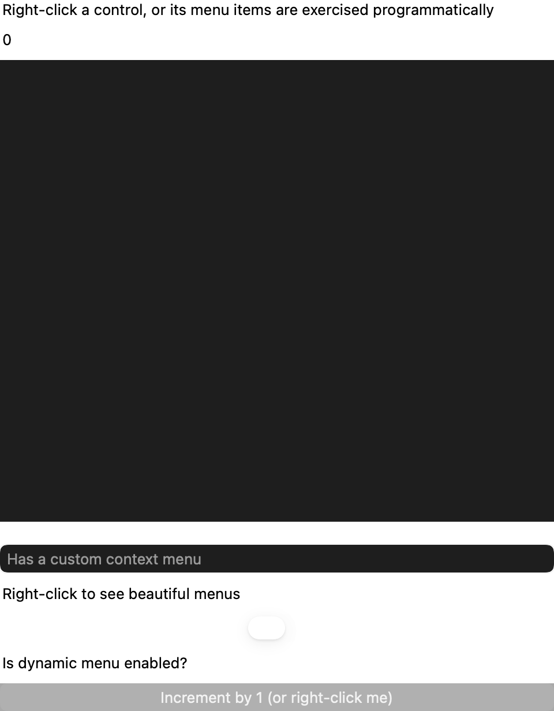
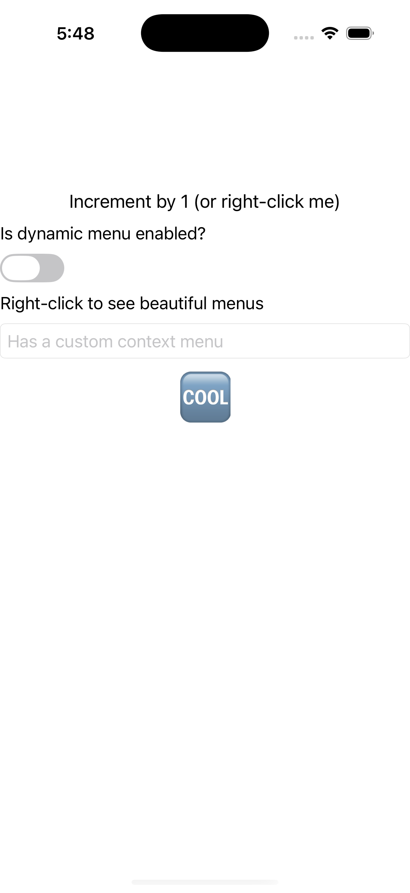
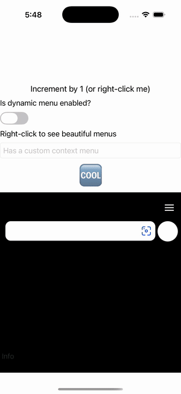

# Context Flyout (right-click menu)

Ports .NET MAUI's `ContextFlyoutPage` ([oracle](../../../../../src/Controls/samples/Controls.Sample/Pages/Core/ContextFlyoutPage.xaml)) as a code-first `maui::samples::context_flyout_page`. FlyoutBase.ContextFlyout (right-click/long-press menus) on multiple controls.

| macOS (AppKit) | iOS (UIKit) |
| --- | --- |
|  |  |

**Running on iOS:**

**Platforms:** macOS ✅ demo · iOS ✅ demo · Windows ⬜ TODO · Linux ⬜ TODO · Android ⬜ TODO

**Run it:** `MAUI_SAMPLE_PAGE=context_flyout ./build/apple/maui_macos_gallery` (macOS) · `SIMCTL_CHILD_MAUI_SAMPLE_PAGE=context_flyout xcrun simctl launch booted dev.maui-cpp.ios-gallery` (iOS)

> `view::set_context_flyout` on a button, two labels, an entry, an image, and a webview; the increment button's MenuFlyout has items by 10/20/30/40-dynamic + a 'by 500' sub-item nesting 1,000/1,000,000 (each click bumps a counter formatted `N0`), a switch enabling/disabling the dynamic item, a color flyout with an 'Advanced colors' sub-menu, plus entry/image/webview item sets — every item drives the counter or a readout. MenuFlyoutItem Command/CommandParameter collapse into the `clicked` event (per W1-11). The gallery mounts no native context menu, so items are exercised programmatically.
