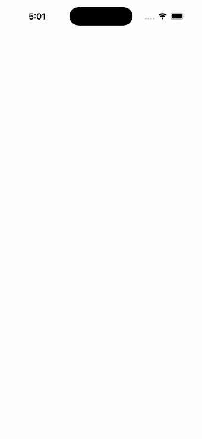

# Custom Layout (DockLayout)

Ports .NET MAUI's `CustomLayoutPage` ([oracle](../../../../../src/Controls/samples/Controls.Sample/Pages/Layouts/CustomLayoutPage.xaml)) as a code-first `maui::samples::custom_layout_page`. A real developer-authored custom layout — `dock_layout` (a `layout<i_layout>` + an embedded `dock_layout_manager : layout_manager` whose measure/arrange mirror MAUI's sample DockLayout line-for-line) hosting six docked buttons.

| macOS (AppKit) | iOS (UIKit) |
| --- | --- |
|  |  |

**Running on iOS:**

**Platforms:** macOS ✅ demo · iOS ✅ demo · Windows ⬜ TODO · Linux ⬜ TODO · Android ⬜ TODO

**Run it:** `MAUI_SAMPLE_PAGE=custom_layout ./build/apple/maui_macos_gallery` (macOS) · `SIMCTL_CHILD_MAUI_SAMPLE_PAGE=custom_layout xcrun simctl launch booted dev.maui-cpp.ios-gallery` (iOS)

> ⚠️ Partial render: the custom DockLayout **manager** is faithfully implemented over the public M3 layout seam (the artifact here is the *code* — a real MAUI-app-author custom layout). But the gallery host only registers built-in control types, so this page-defined layout type can't resolve a handler at runtime and renders blank in the gallery. (Fixing this needs gallery-side registration of sample types — a host limitation, not a port bug.)
