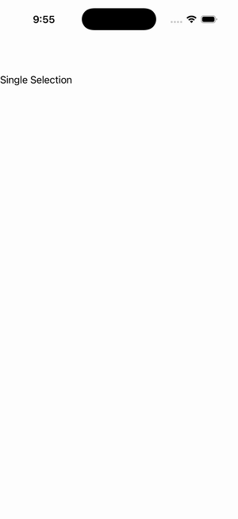

# CollectionView — Selection Visual States

Ports .NET MAUI's `VisualStatesGallery` ([oracle](../../../../../src/Controls/samples/Controls.Sample/Pages/Controls/CollectionViewGalleries/SelectionGalleries/VisualStatesGallery.xaml)) as a code-first `maui::samples::cv_visual_states_page`. Two CollectionViews (Single over 3 items, Multiple over 4) with MeasureFirstItem sizing + an EmptyView; selection is fully observable via select_single/select_multiple. *Note:* the per-cell CommonStates VSM (Selected→Yellow) is best-effort — a code-first cloned cell has no per-instance hook to stage a VSM, so TextColor stands in for the recolor; the selection it reacts to is observable.

| macOS (AppKit) | iOS (UIKit) |
| --- | --- |
|  |  |

**Running on iOS:**

**Platforms:** macOS ✅ demo · iOS ✅ demo · Windows ⬜ TODO · Linux ⬜ TODO · Android ⬜ TODO

**Run it:** `MAUI_SAMPLE_PAGE=cv_visual_states ./build/apple/maui_macos_gallery` (macOS) · `SIMCTL_CHILD_MAUI_SAMPLE_PAGE=cv_visual_states xcrun simctl launch booted dev.maui-cpp.ios-gallery` (iOS)
