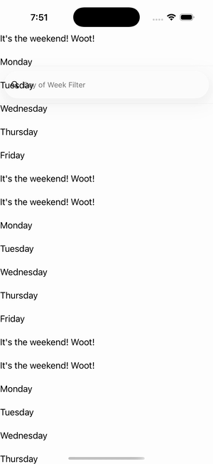

# CollectionView — Data Template Selector

Ports .NET MAUI's `DataTemplateSelectorGallery` ([oracle](../../../../../src/Controls/samples/Controls.Sample/Pages/Controls/CollectionViewGalleries/DataTemplateSelectorGallery.xaml)) as a code-first `maui::samples::data_template_selector_page`, mirroring the `items_page` pattern (owned `observable_collection` + `data_template`). Two data_template_selector subclasses: a WeekendSelector (weekend vs default per day-of-week) as the item template, and a SearchTermSelector (symbols vs default by term content) as the empty-view template.

| macOS (AppKit) | iOS (UIKit) |
| --- | --- |
|  |  |

**Running on iOS:**

**Platforms:** macOS ✅ demo · iOS ✅ demo · Windows ⬜ TODO · Linux ⬜ TODO · Android ⬜ TODO

**Run it:** `MAUI_SAMPLE_PAGE=data_template_selector ./build/apple/maui_macos_gallery` (macOS) · `SIMCTL_CHILD_MAUI_SAMPLE_PAGE=data_template_selector xcrun simctl launch booted dev.maui-cpp.ios-gallery` (iOS)

> The custom-struct item cells render their template-bound content natively (the data_template is instantiated, its binding-context set to the boxed struct, and a handler attached per cell — the C# `TemplatedCell.Bind` path).
