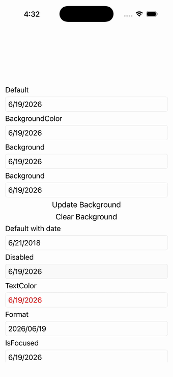

# DatePicker

Ports .NET MAUI's `DatePickerPage` ([oracle](../../../../../src/Controls/samples/Controls.Sample/Pages/Controls/DatePickerPage.xaml)) as a code-first `maui::samples::date_picker_page`. DatePicker variants: Default, BackgroundColor=Blue, gradient Background, randomizable Background (Update/Clear), Date=2018-06-21, Disabled, TextColor=Red, Format yyyy/MM/dd, Set-null/today, and IsOpen Open/Close with Opened/Closed events — plus a live picker whose selection drives a readout.

| macOS (AppKit) | iOS (UIKit) |
| --- | --- |
|  |  |

**Running on iOS:**

**Platforms:** macOS ✅ demo · iOS ✅ demo · Windows ⬜ TODO · Linux ⬜ TODO · Android ⬜ TODO

**Run it:**
- macOS — `MAUI_SAMPLE_PAGE=date_picker ./build/apple/maui_macos_gallery`
- iOS sim — `SIMCTL_CHILD_MAUI_SAMPLE_PAGE=date_picker xcrun simctl launch booted dev.maui-cpp.ios-gallery`

> Notes: live IsFocused echo is deferred (no focus-change signal on this surface); the random-background uses a fixed seed for deterministic captures.
