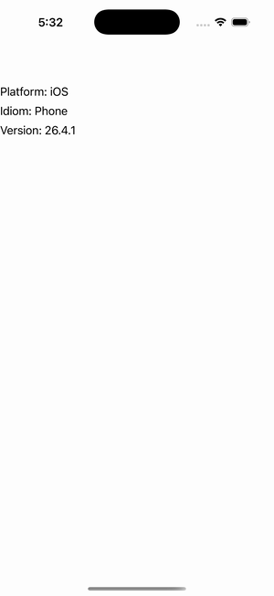

# Device (DeviceInfo)

Ports .NET MAUI's `DevicePage` ([oracle](../../../../../src/Controls/samples/Controls.Sample/Pages/Core/DevicePage.xaml)) as a code-first `maui::samples::device_page`. OnPlatform / OnIdiom values resolved code-first off the DeviceInfo essentials facade.

| macOS (AppKit) | iOS (UIKit) |
| --- | --- |
|  |  |

**Running on iOS:**

**Platforms:** macOS ✅ demo · iOS ✅ demo · Windows ⬜ TODO · Linux ⬜ TODO · Android ⬜ TODO

**Run it:** `MAUI_SAMPLE_PAGE=device ./build/apple/maui_macos_gallery` (macOS) · `SIMCTL_CHILD_MAUI_SAMPLE_PAGE=device xcrun simctl launch booted dev.maui-cpp.ios-gallery` (iOS)

> Labels reading the same source values the XAML `{OnPlatform}`/`{OnIdiom}` key on, resolved directly via `device_info::platform()` / `::idiom()` (round-tripping C# names like "iOS"/"Desktop") plus a `device_info::version()` readout. `{OnPlatform}`/`{OnIdiom}` are layer-6 XAML, so resolved code-first; `HorizontalOptions="Center"` deferred (no LayoutOptions setter on this surface).
