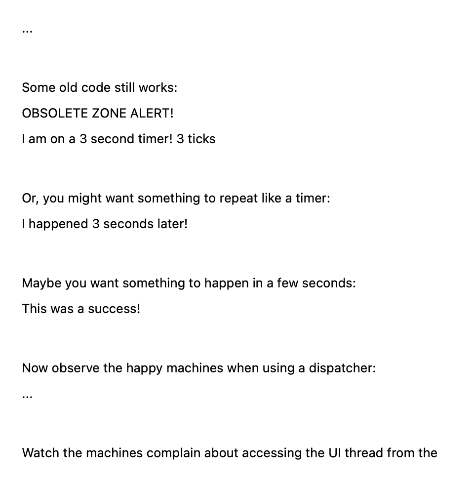
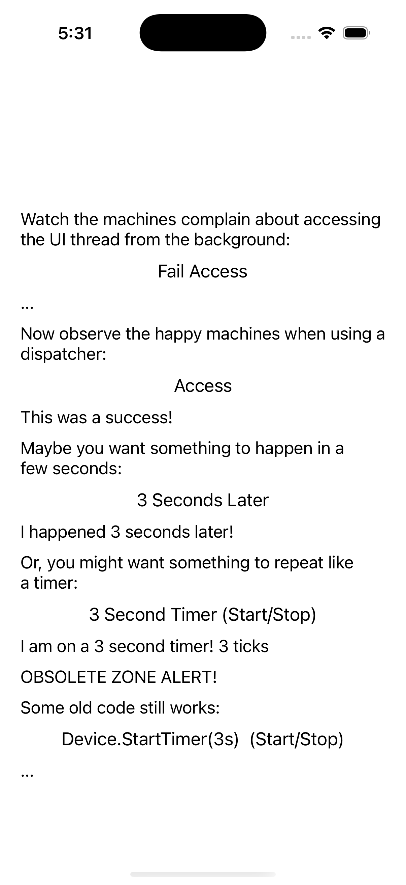

# Dispatcher

Ports .NET MAUI's `DispatcherPage` ([oracle](../../../../../src/Controls/samples/Controls.Sample/Pages/Core/DispatcherPage.xaml)) as a code-first `maui::samples::dispatcher_page`. Marshalling work + timers through the IDispatcher, on a headless virtual clock.

| macOS (AppKit) | iOS (UIKit) |
| --- | --- |
|  |  |

**Running on iOS:**

**Platforms:** macOS ✅ demo · iOS ✅ demo · Windows ⬜ TODO · Linux ⬜ TODO · Android ⬜ TODO

**Run it:** `MAUI_SAMPLE_PAGE=dispatcher ./build/apple/maui_macos_gallery` (macOS) · `SIMCTL_CHILD_MAUI_SAMPLE_PAGE=dispatcher xcrun simctl launch booted dev.maui-cpp.ios-gallery` (iOS)

> Five rows: Fail-Access (off-dispatcher write), Access (marshalled `dispatch()` + run_pending), 3-Seconds-Later (`dispatch_delayed` + advance), a repeating `CreateTimer` ticking a counter, and the legacy `Device.StartTimer`. Driven through a page-owned headless `manual_dispatcher` (the virtual-clock `i_dispatcher`) so the static capture shows live results ("This was a success!", "...3 ticks"). A view's C# `.Dispatcher` maps to the page-owned dispatcher; OnFailAccess shows intent (no separate UI thread at this layer).
