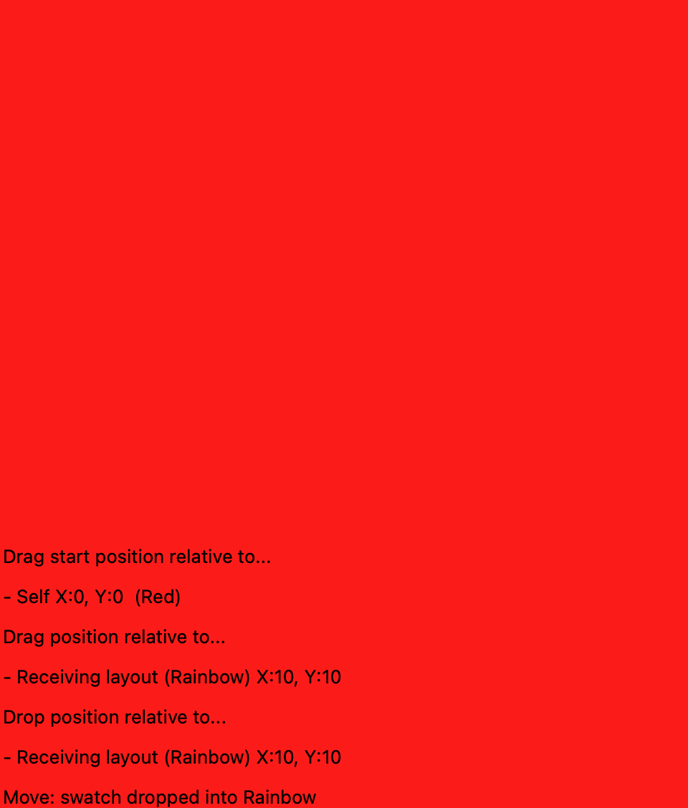
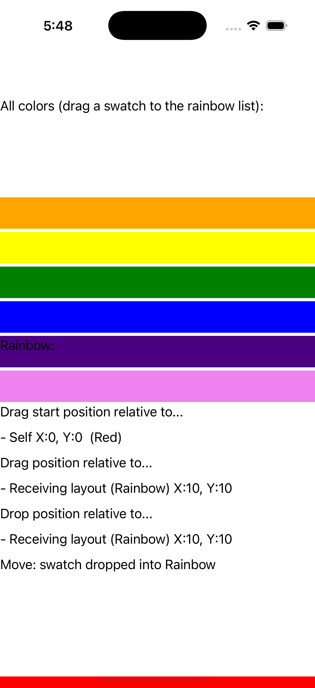
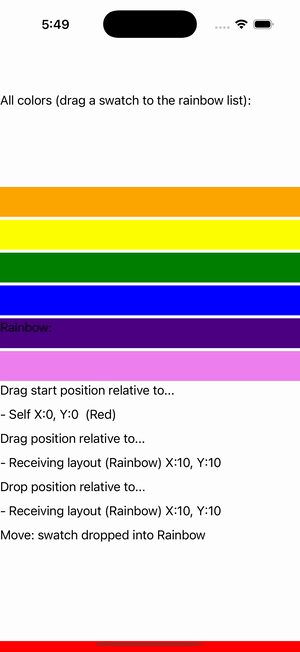

# Drag & Drop Between Layouts

Ports .NET MAUI's `DragAndDropBetweenLayouts` ([oracle](../../../../../src/Controls/samples/Controls.Sample/Pages/Core/DragAndDropBetweenLayouts.xaml)) as a code-first `maui::samples::drag_drop_page`. Drag a swatch between two layouts via DragGestureRecognizer + DropGestureRecognizer + DataPackage.

| macOS (AppKit) | iOS (UIKit) |
| --- | --- |
|  |  |

**Running on iOS:**

**Platforms:** macOS ✅ demo · iOS ✅ demo · Windows ⬜ TODO · Linux ⬜ TODO · Android ⬜ TODO

**Run it:** `MAUI_SAMPLE_PAGE=drag_drop ./examples/build/gallery/gallery` (macOS) · `SIMCTL_CHILD_MAUI_SAMPLE_PAGE=drag_drop xcrun simctl launch booted dev.maui-cpp.ios-gallery` (iOS)

> Two stack-layout color lists of draggable `box_view` swatches (each with a DragGestureRecognizer whose DragStarting stamps `DataPackage.Properties["Color"/"Source"]` + tints the other list) and per-list DropGestureRecognizers (DragOver/DragLeave/Drop) that move the swatch between lists on drop via the data_package; the synthetic drag→over→drop drive moves the first swatch into the rainbow list (visible in the capture). BindableLayout.ItemsSource fan-out is modeled by building swatches directly; GetPosition is narrowed (the documented gap).
