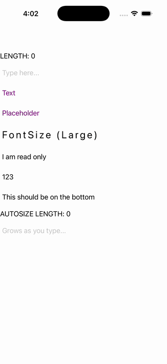

# Editor

Ports .NET MAUI's `EditorPage` ([oracle](../../../../../src/Controls/samples/Controls.Sample/Pages/Controls/EditorPage.xaml)) as a code-first `maui::samples::editor_page`. A multi-line editor with a live character-count readout and Completed echo; a second AutoSize=TextChanges editor; plus TextColor, Placeholder, FontSize+CharacterSpacing, IsReadOnly, Keyboard and VerticalTextAlignment rows.

| macOS (AppKit) | iOS (UIKit) |
| --- | --- |
|  |  |

**Running on iOS:**

**Platforms:** macOS ✅ demo · iOS ✅ demo · Windows ⬜ TODO · Linux ⬜ TODO · Android ⬜ TODO

**Run it:**
- macOS — `MAUI_SAMPLE_PAGE=editor ./examples/build/gallery/gallery`
- iOS sim — `SIMCTL_CHILD_MAUI_SAMPLE_PAGE=editor xcrun simctl launch booted dev.maui-cpp.ios-gallery`

> Notes: background sections + Focus/Unfocus are out of scope.
