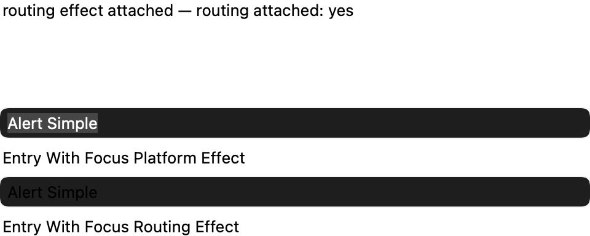
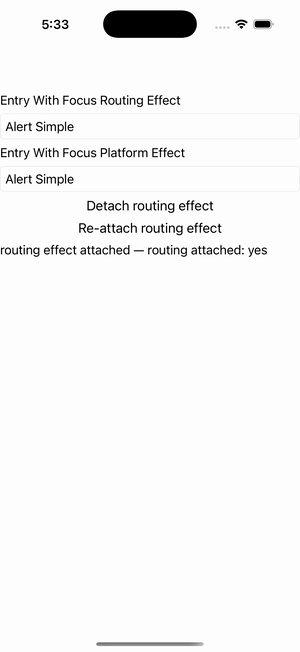

# Effects

Ports .NET MAUI's `EffectsPage` ([oracle](../../../../../src/Controls/samples/Controls.Sample/Pages/Core/EffectsPage.xaml)) as a code-first `maui::samples::effects_page`. The Effect / RoutingEffect / PlatformEffect attach machinery + lifecycle.

| macOS (AppKit) | iOS (UIKit) |
| --- | --- |
|  |  |

**Running on iOS:**

**Platforms:** macOS ✅ demo · iOS ✅ demo · Windows ⬜ TODO · Linux ⬜ TODO · Android ⬜ TODO

**Run it:** `MAUI_SAMPLE_PAGE=effects ./build/apple/maui_macos_gallery` (macOS) · `SIMCTL_CHILD_MAUI_SAMPLE_PAGE=effects xcrun simctl launch booted dev.maui-cpp.ios-gallery` (iOS)

> entry1 carries a `focus_routing_effect` (a `routing_effect` whose `inner()` resolves through the explicit `register_effect` registry to a `focus_platform_effect`); entry2 carries a `focus_platform_effect` directly via `element.effects().add`. Detach/Re-attach buttons remove/add the routing effect (`send_detached`/`send_attached` flip `is_attached`) with the readout tracking attach state; editing an entry routes property changes to the attached effects. Native focus-recolor is a deferred per-backend concern (headless has no native view), so fidelity is in the lifecycle (attached / property-changed count), not the absent headless pixel.
