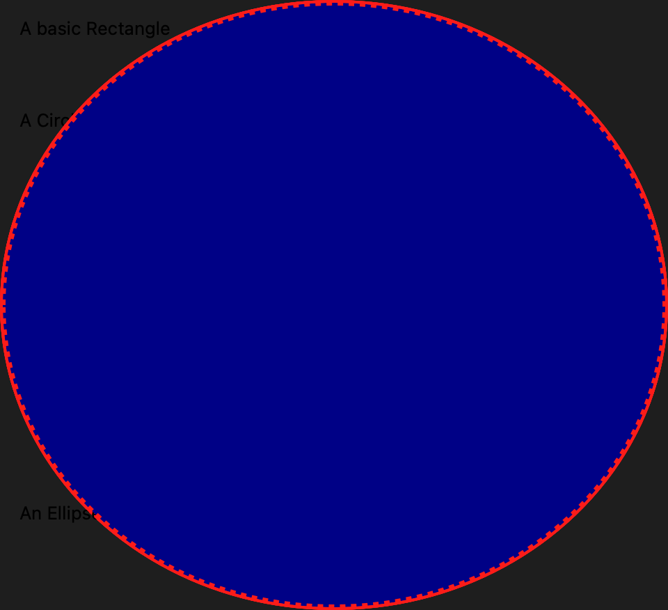
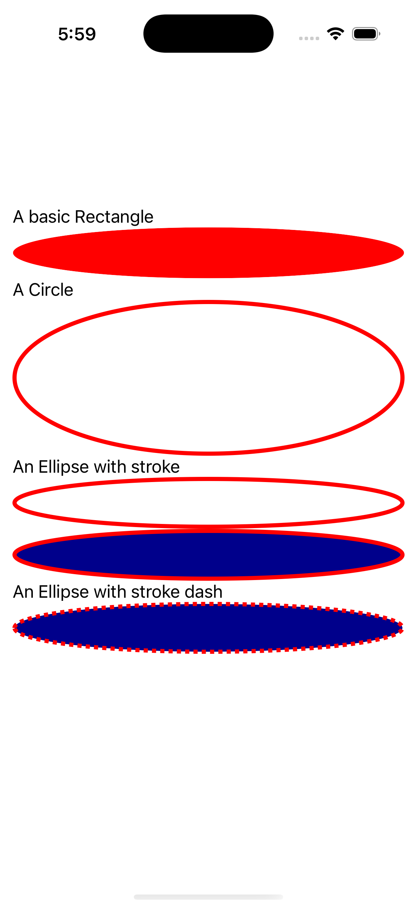
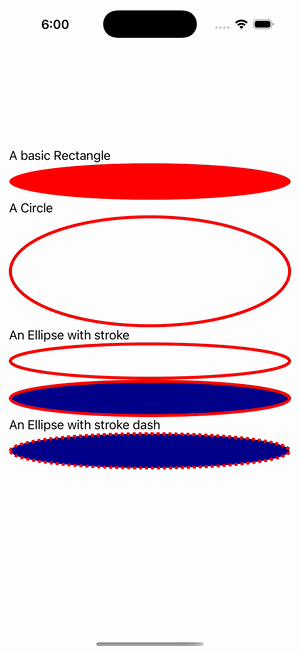

# Ellipse Gallery

Ports .NET MAUI's `EllipseGallery` ([oracle](../../../../../src/Controls/samples/Controls.Sample/Pages/Controls/ShapesGalleries/EllipseGallery.xaml)) as a code-first `maui::samples::ellipse_gallery_page`. Five ellipses covering Fill / Stroke / StrokeThickness / dash / fill+stroke.

| macOS (AppKit) | iOS (UIKit) |
| --- | --- |
|  |  |

**Running on iOS:**

**Platforms:** macOS ✅ demo · iOS ✅ demo · Windows ⬜ TODO · Linux ⬜ TODO · Android ⬜ TODO

**Run it:** `MAUI_SAMPLE_PAGE=ellipse_gallery ./examples/build/gallery/gallery` (macOS) · `SIMCTL_CHILD_MAUI_SAMPLE_PAGE=ellipse_gallery xcrun simctl launch booted dev.maui-cpp.ios-gallery` (iOS)

> These are **natively-rendered** shape demos — the Shape control family (`controls::shapes::*`) draws through the graphics_view / shape_view handler over a CoreGraphics canvas, so the geometry is real pixels on both Apple backends (not a readout). Red-fill 150×50, a red-stroke(4) circle, a red-stroke ellipse, a dark-blue-fill + red-stroke ellipse, and a dark-blue-fill red-dashed(1,1 / offset 6) ellipse. Named brushes bridge via `solid_paint`; Style `HorizontalOptions="Start"` not reproduced (no per-view setter); one verbatim C# copy/paste caption artifact preserved.
