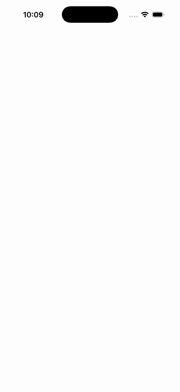

# CollectionView — EmptyView (load simulation)

Ports .NET MAUI's `EmptyViewLoadSimulateGallery` ([oracle](../../../../../src/Controls/samples/Controls.Sample/Pages/Controls/CollectionViewGalleries/EmptyViewGalleries/EmptyViewLoadSimulateGallery.xaml)) as a code-first `maui::samples::empty_view_load_simulate_page`. A string EmptyView ('Items loading simulation...') over a simulated async load — the CV starts empty (EmptyView visible), `load()` populates it (EmptyView replaced by cells), `reset()` returns to the loading state (the C# background Task.Delay stream collapsed to a synchronous load, preserving the observable end-state).

| macOS (AppKit) | iOS (UIKit) |
| --- | --- |
|  |  |

**Running on iOS:**

**Platforms:** macOS ✅ demo · iOS ✅ demo · Windows ⬜ TODO · Linux ⬜ TODO · Android ⬜ TODO

**Run it:** `MAUI_SAMPLE_PAGE=empty_view_load_simulate ./examples/build/gallery/gallery` (macOS) · `SIMCTL_CHILD_MAUI_SAMPLE_PAGE=empty_view_load_simulate xcrun simctl launch booted dev.maui-cpp.ios-gallery` (iOS)
