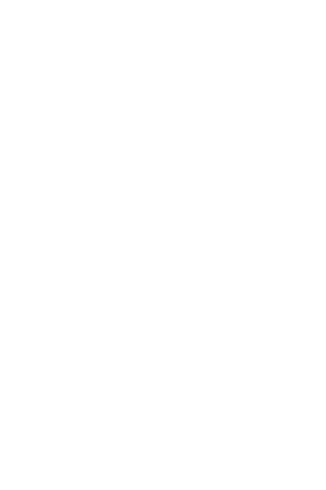
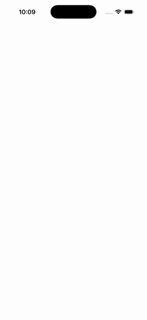

# CollectionView — EmptyView (null/code-assigned)

Ports .NET MAUI's `EmptyViewNullGallery` ([oracle](../../../../../src/Controls/samples/Controls.Sample/Pages/Controls/CollectionViewGalleries/EmptyViewGalleries/EmptyViewNullGallery.xaml)) as a code-first `maui::samples::empty_view_null_page`. EmptyView left null in XAML and assigned a string entirely from code-behind (the C# `useOnlyText=true` branch); the CV starts empty so the EmptyView shows from frame one, with Clear/Fill toggling the empty↔populated state.

| macOS (AppKit) | iOS (UIKit) |
| --- | --- |
|  |  |

**Running on iOS:**

**Platforms:** macOS ✅ demo · iOS ✅ demo · Windows ⬜ TODO · Linux ⬜ TODO · Android ⬜ TODO

**Run it:** `MAUI_SAMPLE_PAGE=empty_view_null ./examples/build/gallery/gallery` (macOS) · `SIMCTL_CHILD_MAUI_SAMPLE_PAGE=empty_view_null xcrun simctl launch booted dev.maui-cpp.ios-gallery` (iOS)
