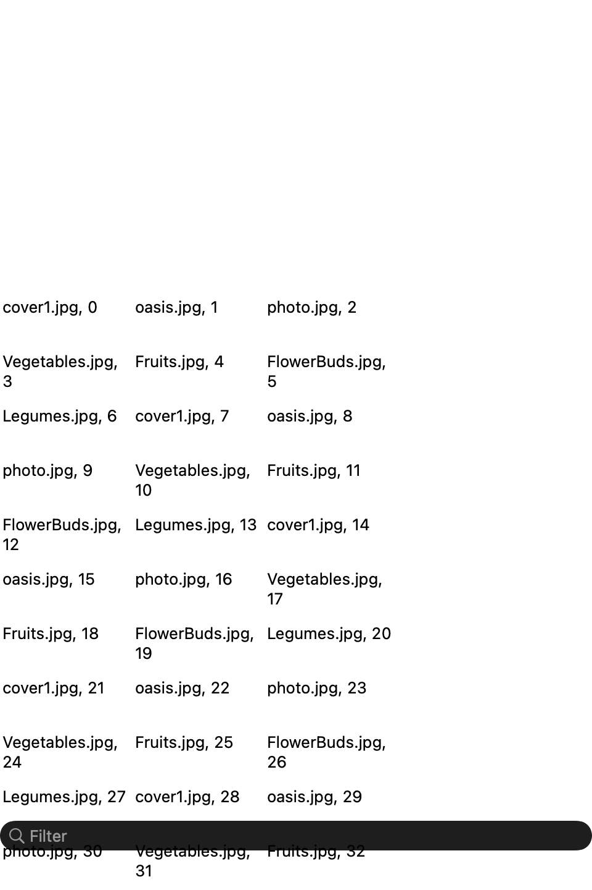
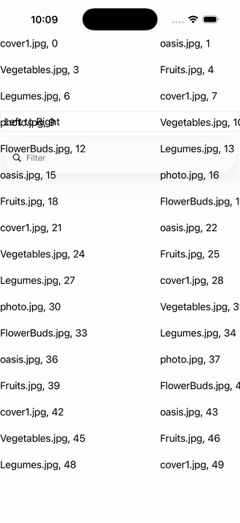

# CollectionView — EmptyView (RTL)

Ports .NET MAUI's `EmptyViewRTLGallery` ([oracle](../../../../../src/Controls/samples/Controls.Sample/Pages/Controls/CollectionViewGalleries/EmptyViewGalleries/EmptyViewRTLGallery.xaml)) as a code-first `maui::samples::empty_view_rtl_page`. A two-label EmptyView under a FlowDirection Picker toggling LeftToRight↔RightToLeft + a SearchBar filtering the source until it empties and the EmptyView appears. The port exposes `flow_direction` on `view`, so RTL is wired natively (not best-effort).

| macOS (AppKit) | iOS (UIKit) |
| --- | --- |
|  |  |

**Running on iOS:**

**Platforms:** macOS ✅ demo · iOS ✅ demo · Windows ⬜ TODO · Linux ⬜ TODO · Android ⬜ TODO

**Run it:** `MAUI_SAMPLE_PAGE=empty_view_rtl ./build/apple/maui_macos_gallery` (macOS) · `SIMCTL_CHILD_MAUI_SAMPLE_PAGE=empty_view_rtl xcrun simctl launch booted dev.maui-cpp.ios-gallery` (iOS)
